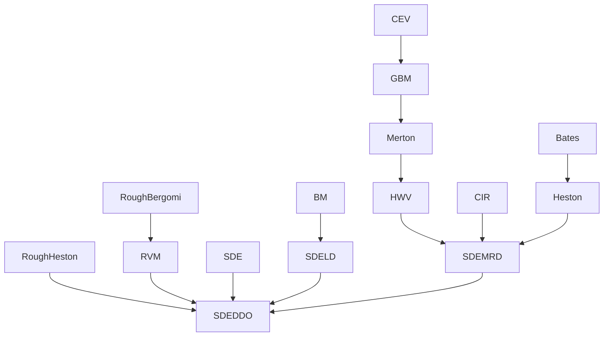
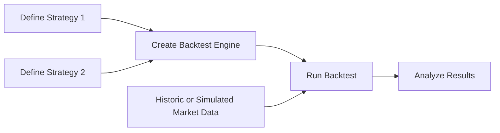

# Investment Performance Metrics

* “Performance Metrics Overview” on page 7-2  
* “Performance Metrics Illustration” on page 7-3  
* “Using the Sharpe Ratio” on page 7-5  
* “Using the Information Ratio” on page 7-7  
* “Using Tracking Error” on page 7-8  
* “Using Risk-Adjusted Return” on page 7-9  
* “Using Sample and Expected Lower Partial Moments” on page 7-11  
* “Using Maximum and Expected Maximum Drawdown” on page 7-14  


---


# Performance Metrics Overview

## Performance Metrics Types

Sharpe first proposed a ratio of excess return to total risk as an investment performance metric. Subsequent work by Sharpe, Lintner, and Mossin extended these ideas to entire asset markets in what is called the Capital Asset Pricing Model (CAPM). Since the development of the CAPM, various investment performance metrics has evolved.

This section presents four types of investment performance metrics:

* The first type of metrics is absolute investment performance metrics that are called “classic” metrics since they are based on the CAPM. They include the Sharpe ratio, the information ratio, and tracking error. To compute the Sharpe ratio from data, use `sharpe` to calculate the ratio for one or more asset return series. To compute the information ratio and associated tracking error, use `inforatio` to calculate these quantities for one or more asset return series.
* The second type of metrics is relative investment performance metrics to compute risk-adjusted returns. These metrics are also based on the CAPM and include Beta, Jensen's Alpha, the Security Market Line (SML), Modigliani and Modigliani Risk-Adjusted Return, and the Graham-Harvey measures. To calculate risk-adjusted alpha and return, use `portalpha`.
* The third type of metrics is alternative investment performance metrics based on lower partial moments. To calculate lower partial moments, use `lpm` for sample lower partial moments and `elpm` for expected lower partial moments.
* The fourth type of metrics is performance metrics based on maximum drawdown and expected maximum drawdown. Drawdown is the peak to trough decline during a specific record period of an investment or fund. To calculate maximum or expected maximum drawdowns, use `maxdrawdown` and `emaxdrawdown`.

## See Also

`sharpe | inforatio | portalpha | lpm | elpm | maxdrawdown | emaxdrawdown | ret2tick | tick2ret`

## Related Examples

* “Performance Metrics Illustration” on page 7-3  
* “Using the Sharpe Ratio” on page 7-5  
* “Using the Information Ratio” on page 7-7  
* “Using Tracking Error” on page 7-8  
* “Using Risk-Adjusted Return” on page 7-9  
* “Using Sample and Expected Lower Partial Moments” on page 7-11  
* “Using Maximum and Expected Maximum Drawdown” on page 7-14  


---


# Performance Metrics Illustration

To illustrate the functions for investment performance metrics, you work with three financial time series objects using performance data for:

* An actively managed, large-cap value mutual fund  
* A large-cap market index  
* 90-day Treasury bills  

The data is monthly total return prices that cover a span of five years.

The following plot illustrates the performance of each series in terms of total returns to an initial $1 invested at the start of this 5-year period:

```matlab
load FundMarketCash
plot(TestData)
hold on
title('\bfFive-Year Total Return Performance');
legend('Fund','Market','Cash','Location','SouthEast');
hold off
```

<table>
  <thead>
    <tr>
      <th colspan="2">Five-Year Total Return Performance</th>
    </tr>
  </thead>
  <tbody>
    <tr>
      <td>0</td>
<td>1.0</td>
    </tr>
<tr>
      <td>10</td>
<td>Fund ~ 0.95, Market ~ 0.85, Cash ~ 1.02</td>
    </tr>
<tr>
      <td>20</td>
<td>Fund ~ 0.85, Market ~ 0.68, Cash ~ 1.04</td>
    </tr>
<tr>
      <td>30</td>
<td>Fund ~ 1.05, Market ~ 0.85, Cash ~ 1.06</td>
    </tr>
<tr>
      <td>40</td>
<td>Fund ~ 1.15, Market ~ 1.0, Cash ~ 1.08</td>
    </tr>
<tr>
      <td>50</td>
<td>Fund ~ 1.22, Market ~ 1.1, Cash ~ 1.1</td>
    </tr>
<tr>
      <td>60</td>
<td>Fund ~ 1.25, Market ~ 1.15, Cash ~ 1.12</td>
    </tr>
  </tbody>
</table>

The mean (Mean) and standard deviation (Sigma) of returns for each series are

```matlab
Returns = tick2ret(TestData);
Assets
Mean = mean(Returns)
Sigma = std(Returns, 1)
```

which gives the following result:

```
Assets =
    'Fund'    'Market'    'Cash'

Mean =
```


---


# Investment Performance Metrics

```
  0.0038     0.0030     0.0017
Sigma =
  0.0229     0.0389     0.0009
```

> **Note** Functions for investment performance metrics use total return price and total returns. To convert between total return price and total returns, use `ret2tick` and `tick2ret`.

## See Also
`sharpe | inforatio | portalpha | lpm | elpm | maxdrawdown | emaxdrawdown | ret2tick | tick2ret`

## Related Examples
* “Using the Sharpe Ratio” on page 7-5
* “Using the Information Ratio” on page 7-7
* “Using Tracking Error” on page 7-8
* “Using Risk-Adjusted Return” on page 7-9
* “Using Sample and Expected Lower Partial Moments” on page 7-11
* “Using Maximum and Expected Maximum Drawdown” on page 7-14


---


# Using the Sharpe Ratio

This example shows how to use the Sharpe ratio to calculate the ratio of an asset's excess return divided by the asset's standard deviation of returns.

The Sharpe ratio is the ratio of the excess return of an asset divided by the asset's standard deviation of returns. The Sharpe ratio has the form:

$$
(\text{Mean} - \text{Riskless}) / \text{Sigma}
$$

Here **Mean** is the mean of asset returns, **Riskless** is the return of a riskless asset, and **Sigma** is the standard deviation of asset returns. A higher Sharpe ratio is better than a lower Sharpe ratio. A negative Sharpe ratio indicates "anti-skill" since the performance of the riskless asset is superior. For more information, see `sharpe`.

To compute the Sharpe ratio, the mean return of the cash asset is used as the return for the riskless asset. Thus, given asset return data and the riskless asset return, the Sharpe ratio is calculated with

```matlab
load FundMarketCash
Returns = tick2ret(TestData);
Riskless = mean(Returns(:,3))

Riskless = 
0.0017

Sharpe = sharpe(Returns, Riskless)

Sharpe = 1×3

    0.0886       0.0315          0
```

The Sharpe ratio of the example fund is significantly higher than the Sharpe ratio of the market. As is demonstrated with `portalpha`, this translates into a strong risk-adjusted return. Since the Cash asset is the same as **Riskless**, it makes sense that its Sharpe ratio is 0. The Sharpe ratio was calculated with the mean of cash returns. It can also be calculated with the cash return series as input for the riskless asset

```matlab
Sharpe = sharpe(Returns, Returns(:,3))

Sharpe = 1×3

    0.0886       0.0315          0
```

When using the `Portfolio` object, you can use the `estimateMaxSharpeRatio` function to estimate an efficient portfolio that maximizes the Sharpe ratio. For more information, see “Efficient Portfolio That Maximizes Sharpe Ratio” on page 4-111.

## See Also

`sharpe` | `inforatio` | `portalpha` | `lpm` | `elpm` | `maxdrawdown` | `emaxdrawdown` | `ret2tick` | `tick2ret` | `Portfolio`


---


# Investment Performance Metrics

**Related Examples**  
* “Performance Metrics Overview” on page 7-2  
* “Using the Information Ratio” on page 7-7  
* “Using Tracking Error” on page 7-8  
* “Using Risk-Adjusted Return” on page 7-9  
* “Using Sample and Expected Lower Partial Moments” on page 7-11  
* “Using Maximum and Expected Maximum Drawdown” on page 7-14  


---


# Using the Information Ratio

This example shows how to use the information ratio to calculate the ratio of relative return to relative risk.

Although originally called the "appraisal ratio" by Treynor and Black, the information ratio is the ratio of relative return to relative risk (known as "tracking error"). Whereas the Sharpe ratio looks at returns relative to a riskless asset, the information ratio is based on returns relative to a risky benchmark which is known colloquially as a "bogey." Given an asset or portfolio of assets with random returns designated by `Asset` and a benchmark with random returns designated by `Benchmark`, the information ratio has the form:

$$
\text{Mean}(\text{Asset} - \text{Benchmark}) \,/\, \text{Sigma}(\text{Asset} - \text{Benchmark})
$$

Here `Mean(Asset - Benchmark)` is the mean of `Asset` minus `Benchmark` returns, and `Sigma(Asset - Benchmark)` is the standard deviation of `Asset` minus `Benchmark` returns. A higher information ratio is considered better than a lower information ratio. For more information, see `inforatio`.

To calculate the information ratio using the example data, the mean return of the market series is used as the return of the benchmark. Thus, given asset return data and the riskless asset return, compute the information ratio with

```matlab
load FundMarketCash
Returns = tick2ret(TestData);
Benchmark = Returns(:,2);
InfoRatio = inforatio(Returns, Benchmark)

InfoRatio = 1×3

    0.0432           NaN  -0.0315
```

Since the market series has no risk relative to itself, the information ratio for the second series is undefined (which is represented as `NaN` in MATLAB® software). Its standard deviation of relative returns in the denominator is 0.

## See Also
`sharpe` | `inforatio` | `portalpha` | `lpm` | `elpm` | `maxdrawdown` | `emaxdrawdown` | `ret2tick` | `tick2ret`

## Related Examples
* “Performance Metrics Overview” on page 7-2
* “Using the Sharpe Ratio” on page 7-5
* “Using Tracking Error” on page 7-8
* “Using Risk-Adjusted Return” on page 7-9
* “Using Sample and Expected Lower Partial Moments” on page 7-11
* “Using Maximum and Expected Maximum Drawdown” on page 7-14


---


# Using Tracking Error

This example shows how to use tracking error to measure the variation of a portfolio's return relative to its benchmark index.

Given an asset or portfolio of assets and a benchmark, the relative standard deviation of returns between the asset or portfolio of assets and the benchmark is called *tracking error*.

The function `inforatio` computes the tracking error and returns it as a second argument.

```matlab
load FundMarketCash
Returns = tick2ret(TestData);
Benchmark = Returns(:,2);
[InfoRatio, TrackingError] = inforatio(Returns, Benchmark)
```

```
InfoRatio = 1×3

    0.0432          NaN    -0.0315

TrackingError = 1×3

    0.0187            0    0.0390
```

Tracking error, also known as active risk, measures the volatility of active returns. Tracking error is a useful measure of performance relative to a benchmark since it is in units of asset returns. For example, the tracking error of 1.87% for the fund relative to the market in this example is reasonable for an actively managed, large-cap value fund.

----

## See Also

`sharpe` | `inforatio` | `portalpha` | `lpm` | `elpm` | `maxdrawdown` | `emaxdrawdown` | `ret2tick` | `tick2ret`

----

## Related Examples

* “Performance Metrics Overview” on page 7-2  
* “Using the Sharpe Ratio” on page 7-5  
* “Using the Information Ratio” on page 7-7  
* “Using Risk-Adjusted Return” on page 7-9  
* “Using Sample and Expected Lower Partial Moments” on page 7-11  
* “Using Maximum and Expected Maximum Drawdown” on page 7-14  


---


# Using Risk-Adjusted Return

This example shows how to use the risk-adjusted return to shift the risk of a portfolio to match the risk of a market portfolio or fund.

According to the Capital Asset Pricing Model (CAPM), the market portfolio and a riskless asset are points on a Security Market Line (SML). The return of the resultant shifted portfolio, levered or unlevered, to match the risk of the market portfolio, is the risk-adjusted return. The SML provides another measure of risk-adjusted return, since the difference in return between the fund and the SML, return at the same level of risk.

Given example data with a fund, a market, and a cash series, you can calculate the risk-adjusted return and compare it with the fund and market's mean returns.

```matlab
load FundMarketCash
Returns = tick2ret(TestData);
Fund = Returns(:,1);
Market = Returns(:,2);
Cash = Returns(:,3);
MeanFund = mean(Fund)
```

MeanFund =  
0.0038

```matlab
MeanMarket = mean(Market)
```

MeanMarket =  
0.0030

```matlab
[MM, aMM] = portalpha(Fund, Market, Cash, 'MM')
```

MM =  
0.0022

aMM =  
0.0052

```matlab
[GH1, aGH1] = portalpha(Fund, Market, Cash, 'gh1')
```

GH1 =  
0.0013

aGH1 =  
0.0025

```matlab
[GH2, aGH2] = portalpha(Fund, Market, Cash, 'gh2')
```

GH2 =  
0.0022

aGH2 =  
0.0052

```matlab
[SML, aSML] = portalpha(Fund, Market, Cash, 'sml')
```

SML =  
0.0013


---


# Investment Performance Metrics

$$
\text{aSML} = 0.0025
$$

Since the fund's risk is much less than the market's risk, the risk-adjusted return of the fund is much higher than both the nominal fund and market returns.

**See Also**  
`sharpe | inforatio | portalpha | lpm | elpm | maxdrawdown | emaxdrawdown | ret2tick | tick2ret`

**Related Examples**  
* “Performance Metrics Overview” on page 7-2  
* “Using the Sharpe Ratio” on page 7-5  
* “Using the Information Ratio” on page 7-7  
* “Using Tracking Error” on page 7-8  
* “Using Sample and Expected Lower Partial Moments” on page 7-11  
* “Using Maximum and Expected Maximum Drawdown” on page 7-14  


---


# Using Sample and Expected Lower Partial Moments

| In this section...                              |
|------------------------------------------------|
| “Introduction” on page 7-11                     |
| “Sample Lower Partial Moments” on page 7-11    |
| “Expected Lower Partial Moments” on page 7-12  |

## Introduction

Use lower partial moments to examine what is colloquially known as “downside risk.” The main idea of the lower partial moment framework is to model moments of asset returns that fall below a minimum acceptable level of return. To compute lower partial moments from data, use `lpm` to calculate lower partial moments for multiple asset return series and for multiple moment orders. To compute expected values for lower partial moments under several assumptions about the distribution of asset returns, use `elpm` to calculate lower partial moments for multiple assets and for multiple orders.

## Sample Lower Partial Moments

This example shows how to use `lpm` to compute the zero-order, first-order, and second-order lower partial moments for the three time series, where the mean of the third time series is used to compute MAR (minimum acceptable return) with the so-called risk-free rate.

```matlab
load FundMarketCash
Returns = tick2ret(TestData);
Assets
```

<table>
  <tr>
    <td><i>Assets = 1×3 cell</i></td>
  </tr>
<tr>
    <td>{'Fund'} {'Market'} {'Cash'}</td>
  </tr>
</table>

```matlab
MAR = mean(Returns(:,3))

MAR = 
0.0017

LPM = lpm(Returns, MAR, [0 1 2])

LPM = 3×3

     0.4333     0.4167     0.6167
     0.0075     0.0140     0.0004
     0.0003     0.0008     0.0000
```

The first row of LPM contains zero-order lower partial moments of the three series. The fund and market index fall below MAR about 40% of the time and cash returns fall below its own mean about 60% of the time.

The second row contains first-order lower partial moments of the three series. The fund and market have large average shortfall returns relative to MAR by 75 and 140 basis points per month. On the other hand, cash underperforms MAR by about only four basis points per month on the downside.


---


# Investment Performance Metrics

The third row contains second-order lower partial moments of the three series. The square root of these quantities provides an idea of the dispersion of returns that fall below the MAR. The market index has a much larger variation on the downside when compared to the fund.

## Expected Lower Partial Moments

This example shows how to use `elpm` to compute expected lower partial moments based on the mean and standard deviations of normally distributed asset returns. The `elpm` function works with the mean and standard deviations for multiple assets and multiple orders.

```matlab
load FundMarketCash
Returns = tick2ret(TestData);
MAR = mean(Returns(:,3))

MAR = 
0.0017

Mean = mean(Returns)

Mean = 1×3

    0.0038     0.0030     0.0017

Sigma = std(Returns, 1)

Sigma = 1×3

    0.0229     0.0389     0.0009

Assets

Assets = 1×3 cell
    {'Fund'}    {'Market'}    {'Cash'}

ELPM = elpm(Mean, Sigma, MAR, [0 1 2])

ELPM = 3×3

    0.4647     0.4874     0.5000
    0.0082     0.0149     0.0004
    0.0002     0.0007     0.0000
```

Based on the moments of each asset, the expected values for lower partial moments imply better than expected performance for the fund and market and worse than expected performance for cash. This function works with either degenerate or nondegenerate normal random variables. For example, if cash were truly riskless, its standard deviation would be 0. You can examine the difference in average shortfall.

```matlab
RisklessCash = elpm(Mean(3), 0, MAR, 1)

RisklessCash = 
0
```


---


## See Also
`sharpe | inforatio | portalpha | lpm | elpm | maxdrawdown | emaxdrawdown | ret2tick | tick2ret`

## Related Examples
* “Performance Metrics Overview” on page 7-2  
* “Using the Sharpe Ratio” on page 7-5  
* “Using the Information Ratio” on page 7-7  
* “Using Tracking Error” on page 7-8  
* “Using Risk-Adjusted Return” on page 7-9  
* “Using Maximum and Expected Maximum Drawdown” on page 7-14  


---


# Using Maximum and Expected Maximum Drawdown

## Introduction

Maximum drawdown is the maximum decline of a series, measured as return, from a peak to a nadir over a period of time. Although additional metrics exist that are used in the hedge fund and commodity trading communities (see Pederson and Rudholm-Alfvin [20] in “Bibliography” on page A-2), the original definition and subsequent implementation of these metrics is not yet standardized.

It is possible to compute analytically the expected maximum drawdown for a Brownian motion with drift (see Magdon-Ismail, Atiya, Pratap, and Abu-Mostafa [16] “Bibliography” on page A-2). These results are used to estimate the expected maximum drawdown for a series that approximately follows a geometric Brownian motion.

Use `maxdrawdown` and `emaxdrawdown` to calculate the maximum and expected maximum drawdowns.

## Maximum Drawdown

This example shows how to compute the maximum drawdown (MaxDD) using example data with a fund, a market, and a cash series.

```matlab
load FundMarketCash
MaxDD  =   maxdrawdown(TestData)
```

```
MaxDD  =   1×3

0.1658           0.3381           0
```

The maximum drop in the given time period is 16.58% for the fund series and 33.81% for the market. There is no decline in the cash series, as expected, because the cash account never loses value.

`maxdrawdown` can also return the indices (`MaxDDIndex`) of the maximum drawdown intervals for each series in an optional output argument.

```matlab
[MaxDD, MaxDDIndex] = maxdrawdown(TestData)
```

```
MaxDD  =   1×3

0.1658           0.3381           0

MaxDDIndex  =    2×3

      2     2     NaN
     18    18     NaN
```

The first two series experience their maximum drawdowns from the second to the 18th month in the data. The indices for the third series are NaNs because it never has a drawdown.

The 16.58% value loss from month 2 to month 18 for the fund series is verified using the reported indices.


---


# Using Maximum and Expected Maximum Drawdown

```matlab
Start  = MaxDDIndex(1,:);
End =  MaxDDIndex(2,:);
(TestData(Start(1),1) - TestData(End(1),1))/TestData(Start(1),1)

ans =
0.1658
```

Although the maximum drawdown is measured in terms of returns, `maxdrawdown` can measure the drawdown in terms of absolute drop in value, or in terms of log-returns. To contrast these alternatives more clearly, you can work with the fund series assuming an initial investment of 50 dollars.

```matlab
Fund50 = 50*TestData(:,1);
plot(Fund50);
title('\bfFive-Year Fund Performance, Initial Investment 50 usd');
xlabel('Months');
ylabel('Value of Investment');
```

<table>
<thead>
<tr>
<th colspan="13" style="text-align:center;">Five-Year Fund Performance, Initial Investment 50 usd</th>
</tr>
</thead>
<tbody>
<tr>
<td>0</td><td>48</td><td>50</td><td>49</td><td>47</td><td>50</td><td>45</td><td>43</td><td>44</td><td>48</td><td>52</td><td>56</td><td>60</td>
</tr>
<tr>
<td>Months</td><td>0</td><td>10</td><td>20</td><td>30</td><td>40</td><td>50</td><td>60</td><td> </td><td> </td><td> </td><td> </td><td> </td>
</tr>
<tr>
<td>Value of Investment</td><td>42</td><td>44</td><td>46</td><td>48</td><td>50</td><td>52</td><td>54</td><td>56</td><td>58</td><td>60</td><td>62</td><td> </td>
</tr>
</tbody>
</table>

Compute the standard maximum drawdown, which coincides with the results above because returns are independent of the initial amounts invested.

```matlab
MaxDD50Ret  =  maxdrawdown(Fund50)

MaxDD50Ret  =
0.1658
```

Compute the maximum drop in value, using the `arithmetic` argument.

```matlab
[MaxDD50Arith, Ind50Arith] = maxdrawdown(Fund50,'arithmetic')

MaxDD50Arith   =
8.4285

Ind50Arith  =  2×1
```


---


# Investment Performance Metrics

The value of this investment is $50.84 in month 2, but by month 18 the value is down to $42.41, a drop of $8.43. This is the largest loss in dollar value from a previous high in the given time period. In this case, the maximum drawdown period, 2nd to 18th month, is the same independently of whether drawdown is measured as return or as dollar value loss.

Finally, you can compute the maximum decline based on log-returns using the *geometric* argument. In this example, the log-returns result in a maximum drop of 18.13%, again from the second to the 18th month, not far from the 16.58% obtained using standard returns.

```matlab
[MaxDD50LogRet,  Ind50LogRet] = maxdrawdown(Fund50,'geometric')

MaxDD50LogRet  =
0.1813

Ind50LogRet =  2×1

2
18
```

Note, the last measure is equivalent to finding the arithmetic maximum drawdown for the log of the series.

```matlab
MaxDD50LogRet2 =  maxdrawdown(log(Fund50),'arithmetic')

MaxDD50LogRet2 =
0.1813
```

## Expected Maximum Drawdown

This example shows how to use the log-return moments of the fund to compute the expected maximum drawdown (EMaxDD) and then compare it with the realized maximum drawdown (MaxDD).

```matlab
load FundMarketCash
logReturns = log(TestData(2:end,:) ./ TestData(1:end - 1,:));
Mu =  mean(logReturns(:,1));
Sigma  = std(logReturns(:,1),1);
T =  size(logReturns,1);

MaxDD  = maxdrawdown(TestData(:,1),'geometric')

MaxDD  =
0.1813

EMaxDD = emaxdrawdown(Mu, Sigma, T)

EMaxDD =
0.1545
```

The drawdown observed in this time period is above the expected maximum drawdown. There is no contradiction here. The expected maximum drawdown is not an upper bound on the maximum losses from a peak, but an estimate of their average, based on a geometric Brownian motion assumption.


---


## See Also
`sharpe` | `inforatio` | `portalpha` | `lpm` | `elpm` | `maxdrawdown` | `emaxdrawdown` | `ret2tick` | `tick2ret`

## Related Examples
* “Performance Metrics Overview” on page 7-2  
* “Using the Sharpe Ratio” on page 7-5  
* “Using the Information Ratio” on page 7-7  
* “Using Tracking Error” on page 7-8  
* “Using Risk-Adjusted Return” on page 7-9  
* “Using Sample and Expected Lower Partial Moments” on page 7-11  


---

NO_CONTENT_HERE

---


# Credit Risk Analysis

* “Estimation of Transition Probabilities” on page 8-2  
* “Forecasting Corporate Default Rates” on page 8-23  
* “Credit Quality Thresholds” on page 8-45  
* “About Credit Scorecards” on page 8-49  
* “Credit Scorecard Modeling Workflow” on page 8-52  
* “Credit Scorecard Modeling Using Observation Weights” on page 8-55  
* “Credit Scorecard Modeling with Missing Values” on page 8-57  
* “Troubleshooting Credit Scorecard Results” on page 8-64  
* “Case Study for Credit Scorecard Analysis” on page 8-71  
* “Credit Scorecards with Constrained Logistic Regression Coefficients” on page 8-91  
* “Credit Default Swap (CDS)” on page 8-100  
* “Bootstrapping a Default Probability Curve” on page 8-101  
* “Finding Breakeven Spread for New CDS Contract” on page 8-104  
* “Valuing an Existing CDS Contract” on page 8-107  
* “Converting from Running to Upfront” on page 8-109  
* “Bootstrapping from Inverted Market Curves” on page 8-111  
* “Visualize Transitions Data for transprob” on page 8-114  
* “Impute Missing Data in the Credit Scorecard Workflow Using the k-Nearest Neighbors Algorithm” on page 8-121  
* “Impute Missing Data in the Credit Scorecard Workflow Using the Random Forest Algorithm” on page 8-127  
* “Treat Missing Data in a Credit Scorecard Workflow Using MATLAB fillmissing” on page 8-132  


---


# Estimation of Transition Probabilities

## In this section...
* “Introduction” on page 8-2  
* “Estimate Transition Probabilities” on page 8-2  
* “Estimate Transition Probabilities for Different Rating Scales” on page 8-4  
* “Working with a Transition Matrix Containing NR Rating” on page 8-6  
* “Estimate Point-in-Time and Through-the-Cycle Probabilities” on page 8-10  
* “Estimate t-Year Default Probabilities” on page 8-12  
* “Estimate Bootstrap Confidence Intervals” on page 8-13  
* “Group Credit Ratings” on page 8-15  
* “Work with Nonsquare Matrices” on page 8-17  
* “Remove Outliers” on page 8-18  
* “Estimate Probabilities for Different Segments” on page 8-19  
* “Work with Large Datasets” on page 8-20  

## Introduction

Credit ratings rank borrowers according to their credit worthiness. Though this ranking is, in itself, useful, institutions are also interested in knowing how likely it is that borrowers in a particular rating category will be upgraded or downgraded to a different rating, and especially, how likely it is that they will default.

Transition probabilities offer one way to characterize the past changes in credit quality of obligors (typically firms), and are cardinal inputs to many risk management applications. Financial Toolbox software supports the estimation of transition probabilities using both cohort and duration (also known as hazard rate or intensity) approaches using `transprob` and related functions.

> **Note** The sample dataset used throughout this section is simulated using a single transition matrix.  
> ~~No~~ attempt is made to match historical trends in transition rates.

## Estimate Transition Probabilities

This example shows how to estimate transition probabilities using sample credit ratings data.

Use the `Data_TransProb.mat` file that contains sample credit ratings data.

```matlab
load Data_TransProb
data(1:10,:)
```

<table>
<thead>
<tr>
<th colspan="1">ID</th>
<th colspan="1">Date</th>
<th colspan="1">Rating</th>
</tr>
</thead>
<tbody>
<tr>
<td>{'00010283'}</td>
<td>{'10-Nov-1984'}</td>
<td>{'CCC'}</td>
</tr>
<tr>
<td>{'00010283'}</td>
<td>{'12-May-1986'}</td>
<td>{'B'}</td>
</tr>
</tbody>
</table>


---


# Estimation of Transition Probabilities

<table>
  <tbody>
    <tr>
      <td>{'00010283'}</td>
<td>{'29-Jun-1988'}</td>
<td>{'CCC'}</td>
    </tr>
<tr>
      <td>{'00010283'}</td>
<td>{'12-Dec-1991'}</td>
<td>{'D'}</td>
    </tr>
<tr>
      <td>{'00013326'}</td>
<td>{'09-Feb-1985'}</td>
<td>{'A'}</td>
    </tr>
<tr>
      <td>{'00013326'}</td>
<td>{'24-Feb-1994'}</td>
<td>{'AA'}</td>
    </tr>
<tr>
      <td>{'00013326'}</td>
<td>{'10-Nov-2000'}</td>
<td>{'BBB'}</td>
    </tr>
<tr>
      <td>{'00014413'}</td>
<td>{'23-Dec-1982'}</td>
<td>{'B'}</td>
    </tr>
<tr>
      <td>{'00014413'}</td>
<td>{'20-Apr-1988'}</td>
<td>{'BB'}</td>
    </tr>
<tr>
      <td>{'00014413'}</td>
<td>{'16-Jan-1998'}</td>
<td>{'B'}</td>
    </tr>
  </tbody>
</table>

The sample data is formatted as a cell array with three columns. Each row contains an ID (column 1), a date (column 2), and a credit rating (column 3). The assigned credit rating corresponds to the associated ID on the associated date. All information corresponding to the same ID must be stored in contiguous rows. In this example, IDs, dates, and ratings are stored in character vector format, but you also can enter them in numeric format.

In this example, the simplest calling syntax for `transprob` passes the nRecords-by-3 cell array as the only input argument. The default `startDate` and `endDate` are the earliest and latest dates in the data. The default estimation algorithm is the duration method and one-year transition probabilities are estimated:

```matlab
transMat0 = transprob(data)
```

```text
transMat0 = 8×8

  93.1170    5.8428    0.8232    0.1763    0.0376    0.0012    0.0001    0.0017
   1.6166   93.1518    4.3632    0.6602    0.1626    0.0055    0.0004    0.0396
   0.1237    2.9003   92.2197    4.0756    0.5365    0.0661    0.0028    0.0753
   0.0236    0.2312    5.0059   90.1846    3.7979    0.4733    0.0642    0.2193
   0.0216    0.1134    0.6357    5.7960   88.9866    3.4497    0.2919    0.7050
   0.0010    0.0062    0.1081    0.8697    7.3366   86.7215    2.5169    2.4399
   0.0002    0.0011    0.0120    0.2582    1.4294    4.2898   81.2927   12.7167
        0         0         0         0         0         0         0  100.0000
```

Provide explicit start and end dates, otherwise, the estimation window for two different datasets can differ, and the estimates might not be comparable. From this point, assume that the time window of interest is the five-year period from the end of 1995 to the end of 2000. For comparisons, compute the estimates for this time window. First use the `duration` algorithm (default option), and then the `cohort` algorithm explicitly set.

```matlab
startDate = datetime(1995,12,31);
endDate = datetime(2000,12,31);
transMat1 = transprob(data,'startDate',startDate,'endDate',endDate)
```

```text
transMat1 = 8×8

  90.6236    7.9051    1.0314    0.4123    0.0210    0.0020    0.0003    0.0043
   4.4780   89.5558    4.5298    1.1225    0.2284    0.0094    0.0009    0.0754
   0.3983    6.1164   87.0641    5.4801    0.7637    0.0892    0.0050    0.0832
   0.1029    0.8572   10.7918   83.0204    3.9971    0.7001    0.1313    0.3992
   0.1043    0.3745    2.2962   14.0954   78.9840    3.0013    0.0463    1.0980
   0.0113    0.0544    0.7055    3.2925   15.4350   75.5988    1.8166    3.0860
   0.0044    0.0189    0.1903    1.9743    6.2320   10.2334   75.9983    5.3484
        0         0         0         0         0         0         0  100.0000
```


---


```matlab
transMat2 = transprob(data,'startDate',startDate,'endDate',endDate, ...
'algorithm','cohort')

transMat2 = 8×8

90.1554     8.5492     0.9067      0.3886      0            0          0         0
 4.9512     88.5221    5.1763      1.0503      0.2251       0          0         0.0750
 0.2770     6.6482    86.2188      6.0942      0.6233      0.0693      0         0.0693
 0.0794     0.8737    11.6759     81.6521      4.3685      0.7943     0.1589     0.3971
 0.1002     0.4008     1.9038     15.4309     77.8557      3.4068      0         0.9018
  0            0       0.2262      2.4887     17.4208     74.2081     2.2624     3.3937
  0            0       0.7576      1.5152      6.0606     10.6061    75.0000     6.0606
  0            0      0            0           0            0          0        100.0000
```

By default, the `cohort` algorithm internally gets yearly snapshots of the credit ratings, but the number of snapshots per year is definable using the parameter/value pair `snapsPerYear`. To get the estimates using quarterly snapshots:

```matlab
transMat3 = transprob(data,'startDate',startDate,'endDate',endDate, ...
'algorithm','cohort','snapsPerYear',4)

transMat3 = 8×8

90.4765     8.0881     1.0072        0.4069      0.0164      0.0015     0.0002     0.0032
 4.5949     89.3216    4.6489        1.1239      0.2276      0.0074     0.0007     0.0751
 0.3747     6.3158    86.7380        5.6344      0.7675      0.0856     0.0040     0.0800
 0.0958     0.7967    11.0441       82.6138      4.1906      0.7230     0.1372     0.3987
 0.1028     0.3571     2.3312       14.4954     78.4276      3.1489     0.0383     1.0987
 0.0084     0.0399     0.6465        3.0962     16.0789     75.1300     1.9044     3.0956
 0.0031     0.0125     0.1445        1.8759      6.2613     10.7022    75.6300     5.3705
 0             0      0               0          0           0          0         100.0000
```

Both `duration` and `cohort` compute one-year transition probabilities by default, but the time interval for the transitions is definable using the name-value pair `transInterval`. For example, to get the two-year transition probabilities using the `cohort` algorithm with the same snapshot periodicity and estimation window:

```matlab
transMat4 = transprob(data,'startDate',startDate,'endDate',endDate, ...
'algorithm','cohort','snapsPerYear',4,'transInterval',2)

transMat4 = 8×8

82.2358     14.6092         2.2062      0.8543      0.0711      0.0074     0.0011     0.0149
 8.2803     80.4584         8.3606      2.2462      0.4665      0.0316     0.0030     0.1533
 0.9604     11.1975        76.1729      9.7284      1.5322      0.2044     0.0162     0.1879
 0.2483      2.0903        18.8440     69.5145      6.9601      1.2966     0.2329     0.8133
 0.2129      0.8713         5.4893     23.5776     62.6438      4.9464     0.1390     2.1198
 0.0378      0.1895         1.7679      7.2875     24.9444     57.1783     2.8816     5.7132
 0.0154      0.0716         0.6576      4.2157     11.4465     16.3455    57.4078     9.8399
 0             0       0                0           0           0          0         100.0000
```

## Estimate Transition Probabilities for Different Rating Scales


---


# Estimation of Transition Probabilities

This example shows how to estimate transition probabilities for credit ratings using a different rating scale.

The dataset `data` from `Data_TransProb.mat` contains sample credit ratings using the default rating scale `{'AAA', 'AA', 'A', 'BBB', 'BB', 'B', 'CCC', 'D'}`. It also contains the dataset `dataIGSG` with ratings investment grade (`'IG'`), speculative grade (`'SG'`), and default (`'D'`). To estimate the transition matrix for this dataset, use the `labels` argument.

```matlab
load Data_TransProb
startDate = datetime(1995,12,31);
endDate = datetime(2000,12,31);
dataIGSG(1:10,:)
```

<table>
<thead>
<tr>
<th>ID</th>
<th>Date</th>
<th>Rating</th>
</tr>
</thead>
<tbody>
<tr><td>{'00011253'}</td><td>{'04-Apr-1983'}</td><td>{'IG'}</td></tr>
<tr><td>{'00012751'}</td><td>{'17-Feb-1985'}</td><td>{'SG'}</td></tr>
<tr><td>{'00012751'}</td><td>{'19-May-1986'}</td><td>{'D'}</td></tr>
<tr><td>{'00014690'}</td><td>{'17-Jan-1983'}</td><td>{'IG'}</td></tr>
<tr><td>{'00012144'}</td><td>{'21-Nov-1984'}</td><td>{'IG'}</td></tr>
<tr><td>{'00012144'}</td><td>{'25-Mar-1992'}</td><td>{'SG'}</td></tr>
<tr><td>{'00012144'}</td><td>{'07-May-1994'}</td><td>{'IG'}</td></tr>
<tr><td>{'00012144'}</td><td>{'23-Jan-2000'}</td><td>{'SG'}</td></tr>
<tr><td>{'00012144'}</td><td>{'20-Aug-2001'}</td><td>{'IG'}</td></tr>
<tr><td>{'00012937'}</td><td>{'07-Feb-1984'}</td><td>{'IG'}</td></tr>
</tbody>
</table>

```matlab
transMatIGSG = transprob(dataIGSG,'labels',{'IG','SG','D'},...
'startDate',startDate,'endDate',endDate)

transMatIGSG = 3×3

    98.1986    1.5179    0.2835
     8.5396   89.4891    1.9713
          0         0  100.0000
```

There is another dataset, `dataIGSGnum`, with the same information as `dataIGSG`, except the ratings are mapped to a numeric scale where `'IG' = 1`, `'SG' = 2`, and `'D' = 3`. To estimate the transition matrix, use the `labels` optional argument specifying the numeric scale as a cell array.

```matlab
dataIGSGnum(1:10,:)
```

<table>
<thead>
<tr>
<th>ID</th>
<th>Date</th>
<th>Rating</th>
</tr>
</thead>
<tbody>
<tr><td>{'00011253'}</td><td>{'04-Apr-1983'}</td><td>1</td></tr>
<tr><td>{'00012751'}</td><td>{'17-Feb-1985'}</td><td>2</td></tr>
<tr><td>{'00012751'}</td><td>{'19-May-1986'}</td><td>3</td></tr>
<tr><td>{'00014690'}</td><td>{'17-Jan-1983'}</td><td>1</td></tr>
<tr><td>{'00012144'}</td><td>{'21-Nov-1984'}</td><td>1</td></tr>
<tr><td>{'00012144'}</td><td>{'25-Mar-1992'}</td><td>2</td></tr>
<tr><td>{'00012144'}</td><td>{'07-May-1994'}</td><td>1</td></tr>
<tr><td>{'00012144'}</td><td>{'23-Jan-2000'}</td><td>2</td></tr>
<tr><td>{'00012144'}</td><td>{'20-Aug-2001'}</td><td>1</td></tr>
</tbody>
</table>


---


```matlab
{'00012937'}        {'07-Feb-1984'}           1

% Note {1,2,3} and num2cell(1:3) are equivalent; num2cell is convenient
% when the number of ratings is larger
transMatIGSGnum = transprob(dataIGSGnum,'labels',{1,2,3},...
'startDate',startDate,'endDate',endDate)

transMatIGSGnum = 3×3

  98.1986     1.5179      0.2835
  8.5396      89.4891     1.9713
         0           0   100.0000
```

Any time the input dataset contains ratings not included in the default rating scale 
`{'AAA', 'AA', 'A', 'BBB', 'BB', 'B', 'CCC', 'D'}`, the full rating scale must be specified using the `labels` optional argument. For example, if the dataset contains ratings `'AAA', ..., 'CCC', 'D', and 'NR'` (not rated), use labels with this cell array 

```matlab
{'AAA', 'AA', 'A', 'BBB', 'BB', 'B', 'CCC', 'D', 'NR'}
```

## Working with a Transition Matrix Containing NR Rating

This example shows how to remove transitions to `NR` from a transition matrix.

The following code demonstrates how `'NR'` (not rated) ratings are handled by `transprob`, and how to get a transition matrix that uses the `'NR'` rating information for the estimation, but that does not show the `'NR'` rating in the final transition probabilities.

The dataset `data` from `Data_TransProb.mat` contains sample credit ratings using the default rating scale 

```matlab
{'AAA', 'AA', 'A', 'BBB', 'BB', 'B', 'CCC', 'D'}
```

```matlab
load Data_TransProb
head(data,12)

         ID                  Date           Rating
    ____________        _______________     _______

    {'00010283'}        {'10-Nov-1984'}     {'CCC'}
    {'00010283'}        {'12-May-1986'}     {'B'     }
    {'00010283'}        {'29-Jun-1988'}     {'CCC'}
    {'00010283'}        {'12-Dec-1991'}     {'D'     }
    {'00013326'}        {'09-Feb-1985'}     {'A'     }
    {'00013326'}        {'24-Feb-1994'}     {'AA'    }
    {'00013326'}        {'10-Nov-2000'}     {'BBB'}
    {'00014413'}        {'23-Dec-1982'}     {'B'     }
    {'00014413'}        {'20-Apr-1988'}     {'BB'    }
    {'00014413'}        {'16-Jan-1998'}     {'B'     }
    {'00014413'}        {'25-Nov-1999'}     {'BB'    }
    {'00012126'}        {'17-Feb-1985'}     {'CCC'}
```

Replace a transition to `'B'` with a transition to `'NR'` for the first company. Note that there is a subsequent transition from `'NR'` to `'CCC'`.

```matlab
dataNR = data;
dataNR.Rating{2} = 'NR';
```


---


# Estimation of Transition Probabilities

```matlab
dataNR.Rating{7} = 'NR';

head(dataNR,12)

          ID                          Date                Rating
  ____________                _______________             _______

  {'00010283'}                {'10-Nov-1984'}             {'CCC'}
  {'00010283'}                {'12-May-1986'}             {'NR'   }
  {'00010283'}                {'29-Jun-1988'}             {'CCC'}
  {'00010283'}                {'12-Dec-1991'}             {'D'    }
  {'00013326'}                {'09-Feb-1985'}             {'A'    }
  {'00013326'}                {'24-Feb-1994'}             {'AA'   }
  {'00013326'}                {'10-Nov-2000'}             {'NR'   }
  {'00014413'}                {'23-Dec-1982'}             {'B'    }
  {'00014413'}                {'20-Apr-1988'}             {'BB'   }
  {'00014413'}                {'16-Jan-1998'}             {'B'    }
  {'00014413'}                {'25-Nov-1999'}             {'BB'   }
  {'00012126'}                {'17-Feb-1985'}             {'CCC'}
```

'NR' is treated as another rating. The transition matrix shows the estimated probability of transitioning into and out of `'NR'`. In this example, the `transprob` function uses the `'cohort'` algorithm, and the `'NR'` rating is treated as another rating. The same behavior exists when using the `transprob` function with the `'duration'` algorithm.

```matlab
RatingsLabelsNR = {'AAA','AA','A','BBB','BB','B','CCC','D','NR'};
[MatrixNRCohort,TotalsNRCohort] = transprob(dataNR, ...
    'Labels',RatingsLabelsNR, ...
    'Algorithm','cohort');

fprintf('Transition probability, cohort, including NR:\n')

disp(array2table(MatrixNRCohort,'VariableNames',RatingsLabelsNR, ...
    'RowNames',RatingsLabelsNR))
```

Transition probability, cohort, including NR:

<table>
  <thead>
    <tr>
      <th></th>
      <th>AAA</th>
      <th>AA</th>
      <th>A</th>
      <th>BBB</th>
      <th>BB</th>
      <th>B</th>
      <th>CCC</th>
      <th>D</th>
      <th>NR</th>
    </tr>
  </thead>
  <tbody>
    <tr>
      <td>AAA</td>
<td>93.135</td>
<td>5.9335</td>
<td>0.74557</td>
<td>0.15533</td>
<td>0.031066</td>
<td>0</td>
<td>0</td>
<td>0</td>
<td>0</td>
    </tr>
<tr>
      <td>AA</td>
<td>1.7359</td>
<td>92.92</td>
<td>4.5446</td>
<td>0.58514</td>
<td>0.15604</td>
<td>0</td>
<td>0</td>
<td>0.03</td>
<td>0</td>
    </tr>
<tr>
      <td>A</td>
<td>0.12683</td>
<td>2.9716</td>
<td>91.991</td>
<td>4.3124</td>
<td>0.4711</td>
<td>0.054358</td>
<td>0</td>
<td>0.07</td>
<td>0</td>
    </tr>
<tr>
      <td>BBB</td>
<td>0.021048</td>
<td>0.37887</td>
<td>5.0726</td>
<td>89.771</td>
<td>4.0413</td>
<td>0.46306</td>
<td>0.042096</td>
<td>0.2</td>
<td>0</td>
    </tr>
<tr>
      <td>BB</td>
<td>0.022099</td>
<td>0.1105</td>
<td>0.68508</td>
<td>6.232</td>
<td>88.376</td>
<td>3.6464</td>
<td>0.28729</td>
<td>0.6</td>
<td>0</td>
    </tr>
<tr>
      <td>B</td>
<td>0</td>
<td>0</td>
<td>0.076161</td>
<td>0.72353</td>
<td>7.997</td>
<td>86.215</td>
<td>2.7037</td>
<td>2</td>
<td>0</td>
    </tr>
<tr>
      <td>CCC</td>
<td>0</td>
<td>0</td>
<td>0</td>
<td>0.30936</td>
<td>1.8561</td>
<td>4.4857</td>
<td>80.897</td>
<td>12</td>
<td>0</td>
    </tr>
<tr>
      <td>D</td>
<td>0</td>
<td>0</td>
<td>0</td>
<td>0</td>
<td>0</td>
<td>0</td>
<td>0</td>
<td>0</td>
<td>0</td>
    </tr>
<tr>
      <td>NR</td>
<td>0</td>
<td>0</td>
<td>0</td>
<td>0</td>
<td>0</td>
<td>0</td>
<td>16.667</td>
<td>0</td>
<td>0</td>
    </tr>
  </tbody>
</table>

```matlab
fprintf('Total transitions out of given rating, including 6 out of NR (5 NR->NR, 1 NR->CCC):\n')

disp(array2table(TotalsNRCohort.totalsVec,'VariableNames',RatingsLabelsNR))
```

Total transitions out of given rating, including 6 out of NR (5 NR->NR, 1 NR->CCC):

<table>
  <thead>
    <tr>
      <th>AAA</th>
      <th>AA</th>
      <th>A</th>
      <th>BBB</th>
      <th>BB</th>
      <th>B</th>
      <th>CCC</th>
      <th>D</th>
      <th>NR</th>
    </tr>
  </thead>
  <tbody>
    <tr>
      <td>3219</td>
<td>5127</td>
<td>5519</td>
<td>4751</td>
<td>4525</td>
<td>2626</td>
<td>1293</td>
<td>4050</td>
<td>6</td>
    </tr>
  </tbody>
</table>


---


To remove transitions to `NR` from the transition matrix, you need to use the `'excludeLabels'` optional name-value input argument to `transprob`.

The `'labels'` input to `transprob` may or may not include the label that needs to be excluded. In the following code, the NR rating is removed from the labels for display purposes, but passing `RatingsLabelsNR` to `transprob` would also work.

```matlab
RatingsLabels = {'AAA','AA','A','BBB','BB','B','CCC','D'};

[MatrixCohort,TotalsCohort] = transprob(dataNR,'Labels',RatingsLabels,'ExcludeLabels','NR','Algorithm',...);

fprintf('Transition probability, cohort, after postprocessing to remove NR:\n')

disp(array2table(MatrixCohort,'VariableNames',RatingsLabels, ...
    'RowNames',RatingsLabels))
```

<table>
<thead>
<tr>
  <th></th>
  <th>AAA</th>
  <th>AA</th>
  <th>A</th>
  <th>BBB</th>
  <th>BB</th>
  <th>B</th>
  <th>CCC</th>
  <th>D</th>
</tr>
</thead>
<tbody>
<tr>
  <td>AAA</td>
<td>93.135</td>
<td>5.9335</td>
<td>0.74557</td>
<td>0.15533</td>
<td>0.031066</td>
<td>0</td>
<td>0</td>
<td></td>
</tr>
<tr>
  <td>AA</td>
<td>1.7362</td>
<td>92.938</td>
<td>4.5455</td>
<td>0.58525</td>
<td>0.15607</td>
<td>0</td>
<td>0</td>
<td>0.03</td>
</tr>
<tr>
  <td>A</td>
<td>0.12683</td>
<td>2.9716</td>
<td>91.991</td>
<td>4.3124</td>
<td>0.4711</td>
<td>0.054358</td>
<td>0</td>
<td>0.07</td>
</tr>
<tr>
  <td>BBB</td>
<td>0.021048</td>
<td>0.37887</td>
<td>5.0726</td>
<td>89.771</td>
<td>4.0413</td>
<td>0.46306</td>
<td>0.042096</td>
<td>0.2</td>
</tr>
<tr>
  <td>BB</td>
<td>0.022099</td>
<td>0.1105</td>
<td>0.68508</td>
<td>6.232</td>
<td>88.376</td>
<td>3.6464</td>
<td>0.28729</td>
<td>0.6</td>
</tr>
<tr>
  <td>B</td>
<td>0</td>
<td>0</td>
<td>0.076161</td>
<td>0.72353</td>
<td>7.997</td>
<td>86.215</td>
<td>2.7037</td>
<td>2</td>
</tr>
<tr>
  <td>CCC</td>
<td>0</td>
<td>0</td>
<td>0</td>
<td>0.3096</td>
<td>1.8576</td>
<td>4.4892</td>
<td>80.96</td>
<td>12</td>
</tr>
<tr>
  <td>D</td>
<td>0</td>
<td>0</td>
<td>0</td>
<td>0</td>
<td>0</td>
<td>0</td>
<td>0</td>
<td></td>
</tr>
</tbody>
</table>

```matlab
fprintf('Total transitions out of given rating, AA and CCC have one less than before:\n')

disp(array2table(TotalsCohort.totalsVec,'VariableNames',RatingsLabels))
```

<table>
<thead>
<tr>
  <th>AAA</th>
  <th>AA</th>
  <th>A</th>
  <th>BBB</th>
  <th>BB</th>
  <th>B</th>
  <th>CCC</th>
  <th>D</th>
</tr>
</thead>
<tbody>
<tr>
  <td>3219</td>
<td>5126</td>
<td>5519</td>
<td>4751</td>
<td>4525</td>
<td>2626</td>
<td>1292</td>
<td>4050</td>
</tr>
</tbody>
</table>

All transitions involving `NR` are removed from the sample, but all other transitions are still used to estimate the transition probabilities. In this example, the transition from `NR` to `CCC` has been removed, as well as the transition from `AA` to `NR` (and five more transitions from `NR` to `NR`). That means the first company is still contributing transitions from `CCC` to `CCC` for the estimation, only the periods overlapping with the time this company spent in `NR` have been removed from the sample, and similarly for the other company.

This procedure is different from removing the `NR` rows from the data itself.

For example, if you remove the `NR` rows in this example, the first company seems to stay in its initial rating of `CCC` all the way from the initial date in 1984 to the default event in 1991. With the previous approach, the estimation knows that the company transitioned out of `CCC` at some point, it knows it was not staying at `CCC` all the time.

If the `NR` row is removed for the second company, this company seems to have stayed in the sample as an `AA` company until the end of the sample. With the previous approach, the estimation knows that this company stopped being an `AA` earlier.


---


# Estimation of Transition Probabilities

```matlab
dataNR2 = dataNR;
dataNR2([2 7],:) = [];

head(dataNR2,12)

          ID                          Date                Rating
  ____________                _______________             _______

  {'00010283'}                {'10-Nov-1984'}             {'CCC'}
  {'00010283'}                {'29-Jun-1988'}             {'CCC'}
  {'00010283'}                {'12-Dec-1991'}             {'D'    }
  {'00013326'}                {'09-Feb-1985'}             {'A'    }
  {'00013326'}                {'24-Feb-1994'}             {'AA'   }
  {'00014413'}                {'23-Dec-1982'}             {'B'    }
  {'00014413'}                {'20-Apr-1988'}             {'BB'   }
  {'00014413'}                {'16-Jan-1998'}             {'B'    }
  {'00014413'}                {'25-Nov-1999'}             {'BB'   }
  {'00012126'}                {'17-Feb-1985'}             {'CCC'}
  {'00012126'}                {'08-Mar-1989'}             {'D'    }
  {'00011692'}                {'11-May-1984'}             {'BB'   }
```

If the `'NR'` rows are removed, the transition matrices will be different. The probability of staying at `'CCC'` goes slightly up, and so does the probability of staying at `'AA'`.

The transition matrices will be different. The probability of staying at `'CCC'` goes slightly up, and so does the probability of staying at `'AA'`.

```matlab
[MatrixCohort2,TotalsCohort2] = transprob(dataNR2, ...
 'Labels',RatingsLabels,...
 'Algorithm','cohort');

fprintf('Transition probability, cohort, if NR rows are removed from data:\n')

Transition probability, cohort, if NR rows are removed from data:

disp(array2table(MatrixCohort2,'VariableNames',RatingsLabels, ...
 'RowNames',RatingsLabels))
```

<table>
<thead>
<tr>
  <th></th>
  <th>AAA</th>
  <th>AA</th>
  <th>A</th>
  <th>BBB</th>
  <th>BB</th>
  <th>B</th>
  <th>CCC</th>
  <th>D</th>
</tr>
<tr>
  <th></th>
  <th>________</th>
  <th>_______</th>
  <th>________</th>
  <th>_______</th>
  <th>________</th>
  <th>________</th>
  <th>________</th>
  <th>______</th>
</tr>
</thead>
<tbody>
<tr>
  <td>AAA</td>
<td>93.135</td>
<td>5.9335</td>
<td>0.74557</td>
<td>0.15533</td>
<td>0.031066</td>
<td>0</td>
<td>0</td>
<td></td>
</tr>
<tr>
  <td>AA</td>
<td>1.7346</td>
<td>92.945</td>
<td>4.541</td>
<td>0.58468</td>
<td>0.15592</td>
<td>0</td>
<td>0</td>
<td>0.03</td>
</tr>
<tr>
  <td>A</td>
<td>0.12683</td>
<td>2.9716</td>
<td>91.991</td>
<td>4.3124</td>
<td>0.4711</td>
<td>0.054358</td>
<td>0</td>
<td>0.07</td>
</tr>
<tr>
  <td>BBB</td>
<td>0.021048</td>
<td>0.37887</td>
<td>5.0726</td>
<td>89.771</td>
<td>4.0413</td>
<td>0.46306</td>
<td>0.042096</td>
<td>0.2</td>
</tr>
<tr>
  <td>BB</td>
<td>0.022099</td>
<td>0.1105</td>
<td>0.68508</td>
<td>6.232</td>
<td>88.376</td>
<td>3.6464</td>
<td>0.28729</td>
<td>0.6</td>
</tr>
<tr>
  <td>B</td>
<td>0</td>
<td>0</td>
<td>0.076161</td>
<td>0.72353</td>
<td>7.997</td>
<td>86.215</td>
<td>2.7037</td>
<td>2</td>
</tr>
<tr>
  <td>CCC</td>
<td>0</td>
<td>0</td>
<td>0</td>
<td>0.30888</td>
<td>1.8533</td>
<td>4.4788</td>
<td>81.004</td>
<td>12</td>
</tr>
<tr>
  <td>D</td>
<td>0</td>
<td>0</td>
<td>0</td>
<td>0</td>
<td>0</td>
<td>0</td>
<td>0</td>
<td></td>
</tr>
</tbody>
</table>

```matlab
fprintf('Total transitions out of given rating, many more out of CCC and AA:\n')

Total transitions out of given rating, many more out of CCC and AA:

disp(array2table(TotalsCohort2.totalsVec,'VariableNames',RatingsLabels))
```

<table>
<thead>
<tr>
  <th>AAA</th>
  <th>AA</th>
  <th>A</th>
  <th>BBB</th>
  <th>BB</th>
  <th>B</th>
  <th>CCC</th>
  <th>D</th>
</tr>
<tr>
  <th>____</th>
  <th>____</th>
  <th>____</th>
  <th>____</th>
  <th>____</th>
  <th>____</th>
  <th>____</th>
  <th>____</th>
</tr>
</thead>
<tbody>
<tr>
  <td>3219</td>
<td>5131</td>
<td>5519</td>
<td>4751</td>
<td>4525</td>
<td>2626</td>
<td>1295</td>
<td>4050</td>
</tr>
</tbody>
</table>


---


```matlab
disp(array2table(MatrixCohort2,'VariableNames',RatingsLabels, ...
'RowNames',RatingsLabels))

           AAA                AA             A                  BBB            BB            B           CCC           D
          ________          _______          ________         _______        ________     ________      ________    ____

 AAA       93.135                5.9335     0.74557           0.15533        0.031066            0             0
 AA        1.7346                92.945      4.541            0.58468     0.15592                0             0    0.03
 A        0.12683                2.9716      91.991           4.3124           0.4711     0.054358             0    0.07
 BBB      0.021048          0.37887          5.0726           89.771           4.0413    0.46306        0.042096     0.2
 BB       0.022099               0.1105     0.68508           6.232            88.376     3.6464         0.28729     0.6
 B               0                    0      0.076161         0.72353          7.997      86.215         2.7037       2.
 CCC             0                    0             0         0.30888          1.8533     4.4788         81.004       12
 D               0                    0             0             0                 0            0             0

fprintf('Total transitions out             of given rating, many more out       of CCC   and      AA:\n')

Total  transitions out of given            rating, many more out       of CCC  and   AA:

disp(array2table(TotalsCohort2.totalsVec,'VariableNames',RatingsLabels))

 AAA       AA          A            BBB      BB          B        CCC          D
 ____     ____        ____          ____     ____        ____     ____          ____

 3219     5131        5519          4751     4525        2626     1295          4050

Estimate Point-in-Time and Through-the-Cycle Probabilities

This example shows how transition probability estimates are sensitive to the length of the estimation
window.

Transition probability estimates are sensitive to the length of the estimation window. When the
estimation window is small, the estimates only capture recent credit events, and these can change
significantly from one year to the next. These are called point-in-time (PIT) estimates. In contrast, a
large time window yields fairly stable estimates that average transition rates over a longer period of
time. These are called through-the-cycle (TTC) estimates.

The estimation of PIT probabilities requires repeated calls to transprob with a rolling estimation
window. Use transprobprep every time repeated calls to transprob are required.
transprobprep performs a preprocessing step on the raw dataset that is independent of the
estimation window. The benefits of transprobprep are greater as the number of repeated calls to
transprob increases. Also, the performance gains from transprobprep are more significant for
the cohort algorithm.

load Data_TransProb
prepData  = transprobprep(data);

Years =  1991:2000;
nYears =  length(Years);
nRatings  = length(prepData.ratingsLabels);
transMatPIT = zeros(nRatings,nRatings,nYears);
algorithm = 'duration';
sampleTotals(nYears,1)  = struct('totalsVec',[],'totalsMat',[], ...
'algorithm',algorithm);
for t =  1:nYears
```


---


# Estimation of Transition Probabilities

```matlab
startDate = ['31-Dec-' num2str(Years(t)-1)];
endDate =  ['31-Dec-'  num2str(Years(t))];
[transMatPIT(:,:,t),sampleTotals(t)] = transprob(prepData, ...
 'startDate',startDate,'endDate',endDate,'algorithm',algorithm);
end
```

Here is the PIT transition matrix for 1993. Recall that the sample dataset contains simulated credit migrations so the PIT estimates in this example do not match actual historical transition rates.

```matlab
transMatPIT(:,:,Years==1993)
```

ans = 8×8

<table>
  <tbody>
    <tr>
      <td>95.3193</td><td>4.5999</td><td>0.0802</td><td>0.0004</td><td>0.0002</td><td>0.0000</td><td>0.0000</td><td>0.0000</td>
    </tr>
<tr>
      <td>2.0631</td><td>94.5931</td><td>3.3057</td><td>0.0254</td><td>0.0126</td><td>0.0002</td><td>0.0000</td><td>0.0000</td>
    </tr>
<tr>
      <td>0.0237</td><td>2.1748</td><td>95.5901</td><td>1.4700</td><td>0.7284</td><td>0.0131</td><td>0.0000</td><td>0.0000</td>
    </tr>
<tr>
      <td>0.0003</td><td>0.0372</td><td>3.2585</td><td>95.2914</td><td>1.3876</td><td>0.0250</td><td>0.0001</td><td>0.0000</td>
    </tr>
<tr>
      <td>0.0000</td><td>0.0005</td><td>0.0657</td><td>3.8292</td><td>92.7474</td><td>3.3459</td><td>0.0111</td><td>0.0001</td>
    </tr>
<tr>
      <td>0.0000</td><td>0.0001</td><td>0.0128</td><td>0.7977</td><td>8.0926</td><td>90.4897</td><td>0.5958</td><td>0.0113</td>
    </tr>
<tr>
      <td>0.0000</td><td>0.0000</td><td>0.0005</td><td>0.0459</td><td>0.5026</td><td>11.1621</td><td>84.9315</td><td>3.3574</td>
    </tr>
<tr>
      <td>0</td><td>0</td><td>0</td><td>0</td><td>0</td><td>0</td><td>0</td><td>100.0000</td>
    </tr>
  </tbody>
</table>

A structure array stores the `sampleTotals` optional output from `transprob`. The `sampleTotals` structure contains summary information on the total time spent on each rating, and the number of transitions out of each rating, for each year under consideration. For more information on the `sampleTotals` structure, see `transprob`.

As an example, the `sampleTotals` structure for 1993 is used here. The total time spent on each rating is stored in the `totalsVec` field of the structure. The total transitions out of each rating are stored in the `totalsMat` field. A third field, `algorithm`, indicates the algorithm used to generate the structure.

```matlab
sampleTotals(Years==1993).totalsVec
```

ans = 1×8

144.4411  230.0356  262.2438  204.9671  246.1315  147.0767  54.9562  215.1479

```matlab
sampleTotals(Years==1993).totalsMat
```

ans = 8×8

<table>
  <tbody>
    <tr>
      <td>0</td><td>7</td><td>0</td><td>0</td><td>0</td><td>0</td><td>0</td><td>0</td>
    </tr>
<tr>
      <td>5</td><td>0</td><td>8</td><td>0</td><td>0</td><td>0</td><td>0</td><td>0</td>
    </tr>
<tr>
      <td>0</td><td>6</td><td>0</td><td>4</td><td>2</td><td>0</td><td>0</td><td>0</td>
    </tr>
<tr>
      <td>0</td><td>0</td><td>7</td><td>0</td><td>3</td><td>0</td><td>0</td><td>0</td>
    </tr>
<tr>
      <td>0</td><td>0</td><td>0</td><td>10</td><td>0</td><td>9</td><td>0</td><td>0</td>
    </tr>
<tr>
      <td>0</td><td>0</td><td>0</td><td>1</td><td>13</td><td>0</td><td>1</td><td>0</td>
    </tr>
<tr>
      <td>0</td><td>0</td><td>0</td><td>0</td><td>0</td><td>7</td><td>0</td><td>2</td>
    </tr>
<tr>
      <td>0</td><td>0</td><td>0</td><td>0</td><td>0</td><td>0</td><td>0</td><td>0</td>
    </tr>
  </tbody>
</table>

```matlab
sampleTotals(Years==1993).algorithm
```

ans =  
'duration'


---


To get the TTC transition matrix, pass the `sampleTotals` structure array to `transprobbytotals`. Internally, `transprobbytotals` aggregates the information in the `sampleTotals` structures to get the total time spent on each rating over the 10 years considered in this example, and the total number of transitions out of each rating during the same period. `transprobbytotals` uses the aggregated information to get the TTC matrix, or average one-year transition matrix.

```matlab
transMatTTC = transprobbytotals(sampleTotals)
```

```text
transMatTTC = 8×8

    92.8544     6.1068     0.7463     0.2761     0.0123     0.0009     0.0001     0.0032
     2.9399    92.2329     3.8394     0.7349     0.1676     0.0050     0.0004     0.0799
     0.2410     4.5963    90.3468     3.9572     0.6909     0.0521     0.0025     0.1133
     0.0530     0.4729     7.9221    87.2751     3.5075     0.4650     0.0791     0.2254
     0.0460     0.1636     1.1873     9.3442    85.4305     2.9520     0.1150     0.7615
     0.0031     0.0152     0.2608     1.5563    10.4468    83.8525     1.9771     1.8882
     0.0009     0.0041     0.0542     0.8378     2.9996     7.3614    82.4758     6.2662
     0          0          0          0          0          0          0       100.0000
```

The same TTC matrix could be obtained with a direct call to `transprob`, setting the estimation window to the 10 years under consideration. But it is much more efficient to use the `sampleTotals` structures, whenever they are available. (Note, for the `duration` algorithm, these alternative workflows can result in small numerical differences in the estimates whenever leap years are part of the sample.)

In “Estimate Transition Probabilities” on page 8-2, a 1-year transition matrix is estimated using the 5-year time window from 1996 through 2000. This is another example of a TTC matrix and this can also be computed using the `sampleTotals` structure array.

```matlab
transprobbytotals(sampleTotals(Years>=1996 & Years<=2000))
```

```text
ans = 8×8

    90.6239     7.9048     1.0313     0.4123     0.0210     0.0020     0.0003     0.0043
     4.4776    89.5565     4.5294     1.1224     0.2283     0.0094     0.0009     0.0754
     0.3982     6.1159    87.0651     5.4797     0.7636     0.0892     0.0050     0.0832
     0.1029     0.8571    10.7909    83.0218     3.9968     0.7001     0.1313     0.3991
     0.1043     0.3744     2.2960    14.0947    78.9851     3.0012     0.0463     1.0980
     0.0113     0.0544     0.7054     3.2922    15.4341    75.6004     1.8165     3.0858
     0.0044     0.0189     0.1903     1.9742     6.2318    10.2332    75.9990     5.3482
     0          0          0          0          0          0          0       100.0000
```

## Estimate t-Year Default Probabilities

This example shows how varying the start and end dates, the amount of data considered for the estimation is changed, but the output still contains, by default, one-year transition probabilities.

By varying the start and end dates, the amount of data considered for the estimation is changed, but the output still contains, by default, one-year transition probabilities. You can change the default behavior by specifying the `transInterval` argument, as illustrated in “Estimate Transition Probabilities” on page 8-2.


---


However, when *t*-year transition probabilities are required for a whole range of values of *t*, for example, 1-year, 2-year, 3-year, 4-year, and 5-year transition probabilities, it is more efficient to call `transprob` once to get the optional output `sampleTotals`. You can use the same `sampleTotals` structure can be used to get the *t*-year transition matrix for any transition interval *t*. Given a `sampleTotals` structure and a transition interval, you can get the corresponding transition matrix by using `transprobbytotals`.

```matlab
load Data_TransProb

startDate = datetime(1995,12,31);
endDate = datetime(2000,12,31);

[~,sampleTotals] = transprob(data,'startDate', ...
    startDate, 'endDate',endDate);

DefProb = zeros(7,5);
for t = 1:5
    transMatTemp = transprobbytotals(sampleTotals,'transInterval',t);
    DefProb(:,t) = transMatTemp(1:7,8);
end
DefProb
```

```
DefProb = 7×5

     0.0043     0.0169     0.0377     0.0666     0.1033
     0.0754     0.1542     0.2377     0.3265     0.4213
     0.0832     0.1936     0.3276     0.4819     0.6536
     0.3992     0.8127     1.2336     1.6566     2.0779
     1.0980     2.1189     3.0668     3.9468     4.7644
     3.0860     5.6994     7.9281     9.8418    11.4963
     5.3484     9.8053    13.5320    16.6599    19.2964
```

## Estimate Bootstrap Confidence Intervals

This example shows how to estimate confidence intervals for the transition probabilities using a bootstrapping procedure.

`transprob` also returns the `idTotals` structure array which contains, for each ID, or company, the total time spent on each rating, and the total transitions out of each rating. For more information on the `idTotals` structure, see `transprob`. The `idTotals` structure is similar to the `sampleTotals` structures (see “Estimate Point-in-Time and Through-the-Cycle Probabilities”), but `idTotals` has the information at an ID level. Because most companies only migrate between few ratings, the numeric arrays in `idTotals` are stored as sparse arrays to reduce memory requirements.

You can use the `idTotals` structure array to estimate confidence intervals for the transition probabilities using a bootstrapping procedure, as the following example demonstrates. To do this, call `transprob` and keep the third output argument, `idTotals`. The `idTotals` fields are displayed for the last company in the sample. Within the estimation window, this company spends almost a year as `'AA'` and it is then upgraded to `'AAA'`.

```matlab
load Data_TransProb
startDate = datetime(1995,12,31);
```


---


```matlab
endDate = datetime(2000,12,31);

%startDate = '31-Dec-1995';
%endDate = '31-Dec-2000';

[transMat,~,idTotals] = transprob(data, ...
    'startDate', startDate, 'endDate', endDate);

% Total time spent on each rating
full(idTotals(end).totalsVec)

ans = 1×8

    4.0820    0.9180    0    0    0    0    0    0

% Total transitions out of each rating
full(idTotals(end).totalsMat)

ans = 8×8

    0    0    0    0    0    0    0    0
    1    0    0    0    0    0    0    0
    0    0    0    0    0    0    0    0
    0    0    0    0    0    0    0    0
    0    0    0    0    0    0    0    0
    0    0    0    0    0    0    0    0
    0    0    0    0    0    0    0    0
    0    0    0    0    0    0    0    0

% Algorithm
idTotals(end).algorithm

ans = 
'duration'
```

Use `bootstrp` with `transprobbytotals` as the bootstrap function and `idTotals` as the data to sample from. Each bootstrap sample corresponds to a dataset made of companies sampled with replacement from the original data. However, you do not have to draw companies from the original data, because a bootstrap `idTotals` sample contains all the information required to compute the transition probabilities. `transprobbytotals` aggregates all structures in each bootstrap `idTotals` sample and finds the corresponding transition matrix.

To estimate 95% confidence intervals for the transition matrix and display the probabilities of default together with its upper and lower confidence bounds:

```matlab
PD = transMat(1:7,8);

bootstat = bootstrp(100, @(totals) transprobbytotals(totals), idTotals);
ci = prctile(bootstat, [2.5 97.5]); % 95% confidence
CIlower = reshape(ci(1,:), 8, 8);
CIupper = reshape(ci(2,:), 8, 8);
PD_LB = CIlower(1:7, 8);
PD_UB = CIupper(1:7, 8);

[PD_LB PD PD_UB]
```


---


# Estimation of Transition Probabilities

```
ans  = 7×3

     0.0004     0.0043     0.0106
     0.0028     0.0754     0.2192
     0.0126     0.0832     0.2180
     0.1659     0.3992     0.6617
     0.5703     1.0980     1.7260
     1.7264     3.0860     4.7602
     1.7678     5.3484     9.5055
```

## Group Credit Ratings

This example shows how to group whole ratings into investment and speculative grades.

Credit rating scales can be more or less granular. For example, there are ratings with qualifiers (such as, `'AA+'`, `'BB-'`, and so on), whole ratings (`'AA'`, `'BB'`, and so on), and investment or speculative grade (`'IG'`, `'SG'`) categories. Given a dataset with credit ratings at a more granular level, transition probabilities for less granular categories can be of interest. For example, you might be interested in a transition matrix for investment and speculative grades given a dataset with whole ratings. Use `transprobgrouptotals` for this evaluation, as illustrated in the following examples. The sample dataset `data` has whole credit ratings:

```matlab
load Data_TransProb

startDate = datetime(1995,12,31);
endDate = datetime(2000,12,31);
data(1:5,:)
```

<table>
<thead>
  <tr>
    <th>ID</th>
    <th>Date</th>
    <th>Rating</th>
  </tr>
</thead>
<tbody>
  <tr>
    <td>{'00010283'}</td>
<td>{'10-Nov-1984'}</td>
<td>{'CCC'}</td>
  </tr>
<tr>
    <td>{'00010283'}</td>
<td>{'12-May-1986'}</td>
<td>{'B'}</td>
  </tr>
<tr>
    <td>{'00010283'}</td>
<td>{'29-Jun-1988'}</td>
<td>{'CCC'}</td>
  </tr>
<tr>
    <td>{'00010283'}</td>
<td>{'12-Dec-1991'}</td>
<td>{'D'}</td>
  </tr>
<tr>
    <td>{'00013326'}</td>
<td>{'09-Feb-1985'}</td>
<td>{'A'}</td>
  </tr>
</tbody>
</table>

A call to `transprob` returns the transition matrix and totals structures for the eight (`'AAA'` to `'D'`) whole credit ratings. The array with number of transitions out of each credit rating is displayed after the call to `transprob`:

```matlab
[transMat,sampleTotals,idTotals] = transprob(data,'startDate',startDate, ...
    'endDate',endDate);
sampleTotals.totalsMat
```

```
ans  = 8×8

       0       67      7       3       0       0       0       0
      67        0     68      15       3       0       0       1
       4      101      0      93      11       1       0       1
       1        7    163       0      62      10       2       5
       1        3     16     168       0      37       0      11
```


---


```
       0         0         2       10   83    0    10                    14
       0         0         0       2     8    16                    0     7
       0         0         0       0     0    0                     0     0
```

Use `transprobgrouptotals` to group whole ratings into investment and speculative grades. This function takes a totals structure as the first argument. The second argument indicates the edges between rating categories. In this case, ratings 1 through 4 ('AAA' through 'BBB') correspond to the first category ('IG'), ratings 5 through 7 ('BB' through 'CCC') to the second category ('SG'), and rating 8 ('D') is a category of its own. `transprobgrouptotals` adds up the total time spent on ratings that belong to the same category. For example, total times spent on 'AAA' through 'BBB' are added up as the total time spent on 'IG'. `transprobgrouptotals` also adds up the total number of transitions between any 'IG' rating and any 'SG' rating, for example, a credit migration from 'BBB' to 'BB'.

The grouped totals can then be passed to `transprobbytotals` to obtain the transition matrix for investment and speculative grades. Both `totalsMat` and the new transition matrix are both 3-by-3, corresponding to the grouped categories 'IG', 'SG', and 'D'.

```matlab
sampleTotalsIGSG = transprobgrouptotals(sampleTotals,[4 7 8])
```

```matlab
sampleTotalsIGSG = struct with fields:
     totalsVec: [4.8591e+03 1.5034e+03 1.1621e+03]
     totalsMat: [3×3 double]
     algorithm: 'duration'
```

```matlab
transMatIGSG = transprobbytotals(sampleTotalsIGSG)
```

```matlab
transMatIGSG = 3×3

  98.1591    1.6798    0.1611
  12.3228   85.6961    1.9811
       0         0   100.0000
```

When a totals structure array is passed to `transprobgrouptotals`, this function groups each structure in the array individually and preserves sparsity, if the fields in the input structures are sparse. One way to exploit this feature is to compute confidence intervals for the investment grade default rate and the speculative grade default rate (see also “Estimate Bootstrap Confidence Intervals” on page 8-13).

```matlab
PDIGSG = transMatIGSG(1:2,3);

idTotalsIGSG = transprobgrouptotals(idTotals,[4 7 8]);
bootstat = bootstrp(100,@(totals)transprobbytotals(totals),idTotalsIGSG);
ci = prctile(bootstat,[2.5 97.5]); % 95% confidence
CIlower = reshape(ci(1,:),3,3);
CIupper = reshape(ci(2,:),3,3);
PDIGSG_LB = CIlower(1:2,3);
PDIGSG_UB = CIupper(1:2,3);

[PDIGSG_LB PDIGSG PDIGSG_UB]
```

```matlab
ans = 2×3

    0.0754    0.1611    0.2476
```


---


# Work with Nonsquare Matrices

This example shows how to work with group totals in a nonsquare matrix.

Transition probabilities and the number of transitions between ratings are usually reported without the `'D'` (`'Default'`) row. For example, a credit report can contain the following table, indicating the number of issuers starting in each rating (first column), and the number of transitions between ratings (remaining columns):

<table>
<thead>
<tr>
  <th>Initial</th>
  <th>AAA</th>
  <th>AA</th>
  <th>A</th>
  <th>BBB</th>
  <th>BB</th>
  <th>B</th>
  <th>CCC</th>
  <th>D</th>
</tr>
</thead>
<tbody>
<tr>
  <td>AAA</td>
<td>98</td>
<td>88</td>
<td>9</td>
<td>1</td>
<td>0</td>
<td>0</td>
<td>0</td>
<td>0</td>
</tr>
<tr>
  <td>AA</td>
<td>389</td>
<td>0</td>
<td>368</td>
<td>19</td>
<td>2</td>
<td>0</td>
<td>0</td>
<td>0</td>
</tr>
<tr>
  <td>A</td>
<td>1165</td>
<td>1</td>
<td>21</td>
<td>1087</td>
<td>56</td>
<td>0</td>
<td>0</td>
<td>0</td>
</tr>
<tr>
  <td>BBB</td>
<td>1435</td>
<td>0</td>
<td>2</td>
<td>89</td>
<td>1289</td>
<td>45</td>
<td>8</td>
<td>0</td>
<td>2</td>
</tr>
<tr>
  <td>BB</td>
<td>915</td>
<td>0</td>
<td>0</td>
<td>1</td>
<td>60</td>
<td>776</td>
<td>73</td>
<td>2</td>
<td>3</td>
</tr>
<tr>
  <td>B</td>
<td>867</td>
<td>0</td>
<td>0</td>
<td>1</td>
<td>7</td>
<td>88</td>
<td>715</td>
<td>39</td>
<td>17</td>
</tr>
<tr>
  <td>CCC</td>
<td>112</td>
<td>0</td>
<td>0</td>
<td>0</td>
<td>1</td>
<td>3</td>
<td>34</td>
<td>61</td>
<td>13</td>
</tr>
</tbody>
</table>

You can store the information in this table in a totals structure compatible with the `cohort` algorithm. For more information on the `cohort` algorithm and the totals structure, see `transprob`. The `totalsMat` field is a nonsquare array in this case.

```matlab
% Define totals structure
totals.totalsVec = [98 389 1165 1435 915 867 112];
totals.totalsMat = [
   88  9   1    0   0   0   0   0;
    0 368  19   2   0   0   0   0;
    1  21 1087  56   0   0   0   0;
    0   2  89 1289  45   8   0   2;
    0   0   1   60  776  73   2   3;
    0   0   1    7   88 715  39  17;
    0   0   0    1    3  34  61  13];
totals.algorithm = 'cohort';
```

`transprobbytotals` and `transprobgrouptotals` accept totals inputs with nonsquare `totalsMat` fields. To get the transition matrix corresponding to the previous table, and to group ratings into investment and speculative grade with the corresponding matrix:

```matlab
transMat = transprobbytotals(totals)
```

```text
transMat = 7×8

   89.7959    9.1837    1.0204    0         0         0         0         0
    0       94.6015    4.8843    0.5141    0         0         0         0
```


---


```matlab
  0.0858         1.8026     93.3047              4.8069      0           0           0         0
        0        0.1394      6.2021             89.8258      3.1359      0.5575      0         0.1394
        0            0       0.1093              6.5574     84.8087      7.9781     0.2186     0.3279
        0            0       0.1153              0.8074     10.1499     82.4683     4.4983     1.9608
        0            0                     0     0.8929      2.6786     30.3571    54.4643    11.6071

% Group into IG/SG   and    get          IG/SG  transition   matrix
totalsIGSG   =  transprobgrouptotals(totals,[4 7]);
transMatIGSG    =            transprobbytotals(totalsIGSG)

transMatIGSG    = 2×3

  98.2183        1.7169      0.0648
  3.6959        94.5618      1.7423
```

## Remove Outliers

This example shows how to update the transition probability estimates after removing outlier information.

The `idTotals` output from `transprob` can also be exploited to update the transition probability estimates after removing some outlier information. For more information on `idTotals`, see `transprob`. For example, if you know that the credit rating migration information for the 4th and 27th companies in the data have problems, you can remove those companies and efficiently update the transition probabilities as follows:

```matlab
load Data_TransProb

startDate = datetime(1995,12,31);
endDate = datetime(2000,12,31);

[transMat,~,idTotals] =  transprob(data,'startDate',           ...
startDate,   'endDate',endDate);
transMat
```

```matlab
transMat  = 8×8

90.6236        7.9051     1.0314         0.4123      0.0210      0.0020     0.0003     0.0043
 4.4780     89.5558       4.5298         1.1225      0.2284      0.0094     0.0009     0.0754
 0.3983        6.1164    87.0641         5.4801      0.7637      0.0892     0.0050     0.0832
 0.1029        0.8572    10.7918        83.0204      3.9971      0.7001     0.1313     0.3992
 0.1043        0.3745     2.2962        14.0954     78.9840      3.0013     0.0463     1.0980
 0.0113        0.0544     0.7055         3.2925     15.4350     75.5988     1.8166     3.0860
 0.0044        0.0189     0.1903         1.9743      6.2320     10.2334    75.9983     5.3484
          0    0         0               0           0            0         0         100.0000
```

Deciding which companies to remove is a case-by-case situation. Reasons to remove a company can include a typo in one of the ratings histories, or an unusual migration between ratings whose impact on the transition probability estimates must be measured. `transprob` does not reorder the companies in any way. The ordering of companies in the input data is the same as the ordering in the `idTotals` array.


---


# Estimate Probabilities for Different Segments

This example shows how to estimate transition probabilities for different segments.

You can use `idTotals` efficiently to get estimates over different segments of the sample. For more information on `idTotals`, see `transprob`. For example, assume that the companies in the example are grouped into three geographic regions and that the companies were grouped by geographic regions previously, so that the first 340 companies correspond to the first region, the next 572 companies to the second region, and the rest to the third region. You can efficiently get transition probabilities for each region as follows:

```matlab
load Data_TransProb

startDate = datetime(1995,12,31);
endDate = datetime(2000,12,31);
[~,~,idTotals] = transprob(data,'startDate', ...
    startDate, 'endDate', endDate);

n1 = 340;
n2 = 572;
transMatG1 = transprobbytotals(idTotals(1:n1))
```

transMatG1 = 8×8

<table>
  <tbody>
    <tr><td>90.8299</td><td>7.6501</td><td>0.3178</td><td>1.1700</td><td>0.0255</td><td>0.0044</td><td>0.0021</td><td>0.0002</td></tr>
<tr><td>4.3572</td><td>89.0262</td><td>5.7838</td><td>0.8039</td><td>0.0245</td><td>0.0029</td><td>0.0013</td><td>0.0001</td></tr>
<tr><td>0.7066</td><td>6.7567</td><td>86.6320</td><td>5.4950</td><td>0.3721</td><td>0.0252</td><td>0.0101</td><td>0.0023</td></tr>
<tr><td>0.0626</td><td>1.3688</td><td>10.3895</td><td>83.5022</td><td>3.6823</td><td>0.6466</td><td>0.3084</td><td>0.0396</td></tr>
<tr><td>0.0256</td><td>0.7884</td><td>2.6970</td><td>13.7857</td><td>78.8321</td><td>2.8310</td><td>0.0561</td><td>0.9842</td></tr>
<tr><td>0.0026</td><td>0.1095</td><td>0.4280</td><td>3.5204</td><td>21.1437</td><td>72.9230</td><td>1.6456</td><td>0.2273</td></tr>
<tr><td>0.0005</td><td>0.0216</td><td>0.0730</td><td>0.4574</td><td>4.9586</td><td>4.2821</td><td>80.3062</td><td>9.9006</td></tr>
<tr><td>0</td><td>0</td><td>0</td><td>0</td><td>0</td><td>0</td><td>0</td><td>100.0000</td></tr>
  </tbody>
</table>

```matlab
transMatG2 = transprobbytotals(idTotals(n1+1:n1+n2))
```

transMatG2 = 8×8

<table>
  <tbody>
    <tr><td>90.5798</td><td>8.4877</td><td>0.8202</td><td>0.0884</td><td>0.0132</td><td>0.0011</td><td>0.0000</td><td>0.0096</td></tr>
<tr><td>4.1999</td><td>90.0371</td><td>3.8657</td><td>1.4744</td><td>0.2144</td><td>0.0128</td><td>0.0001</td><td>0.1956</td></tr>
<tr><td>0.3022</td><td>5.9869</td><td>86.7128</td><td>5.5526</td><td>1.0411</td><td>0.1902</td><td>0.0015</td><td>0.2127</td></tr>
<tr><td>0.0204</td><td>0.5606</td><td>10.9342</td><td>82.9195</td><td>4.0123</td><td>0.7398</td><td>0.0059</td><td>0.8073</td></tr>
<tr><td>0.0089</td><td>0.3338</td><td>2.1185</td><td>16.6496</td><td>76.2395</td><td>3.1241</td><td>0.0261</td><td>1.4995</td></tr>
<tr><td>0.0013</td><td>0.0465</td><td>0.6710</td><td>2.4731</td><td>14.7281</td><td>76.7378</td><td>1.2993</td><td>4.0428</td></tr>
<tr><td>0.0002</td><td>0.0080</td><td>0.0681</td><td>0.4598</td><td>4.1324</td><td>8.4380</td><td>80.9092</td><td>5.9843</td></tr>
<tr><td>0</td><td>0</td><td>0</td><td>0</td><td>0</td><td>0</td><td>0</td><td>100.0000</td></tr>
  </tbody>
</table>

```matlab
transMatG3 = transprobbytotals(idTotals(n1+n2+1:end))
```

transMatG3 = 8×8

<table>
  <tbody>
    <tr><td>90.5655</td><td>7.5408</td><td>1.5288</td><td>0.3369</td><td>0.0258</td><td>0.0015</td><td>0.0003</td><td>0.0004</td></tr>
<tr><td>4.8073</td><td>89.3842</td><td>4.4865</td><td>0.9582</td><td>0.3509</td><td>0.0095</td><td>0.0009</td><td>0.0025</td></tr>
<tr><td>0.3153</td><td>5.8771</td><td>87.6353</td><td>5.4101</td><td>0.7160</td><td>0.0322</td><td>0.0052</td><td>0.0088</td></tr>
<tr><td>0.1995</td><td>0.8625</td><td>10.8682</td><td>82.8717</td><td>4.1423</td><td>0.6903</td><td>0.1565</td><td>0.2090</td></tr>
<tr><td>0.2465</td><td>0.1091</td><td>2.1558</td><td>12.0289</td><td>81.5803</td><td>3.0057</td><td>0.0616</td><td>0.8122</td></tr>
  </tbody>
</table>


---


# Work with Large Datasets

This example shows how to aggregate estimates from two (or more) datasets and estimate transition probabilities.

This following code aggregates estimates from two (or more) datasets. It is possible that two datasets, coming from two different databases, must be considered for the estimation of the transition probabilities. Also, if a dataset is too large and cannot be loaded into memory, the dataset can be split into two (or more) datasets. In these cases, it is simple to apply `transprob` to each individual dataset, and then get the final estimates corresponding to the aggregated data with a call to `transprobbytotals` at the end.

For example, the dataset `data` is artificially split into two sections in this example. In practice the two datasets would come from different files or databases. When aggregating multiple datasets, the history of a company cannot be split across datasets. You can analyze that this condition is satisfied for the arbitrarily chosen cut-off point.

```matlab
load Data_TransProb

cutoff = 2099;
data(cutoff-5:cutoff,:)
```

<table>
<thead>
<tr>
<th>ID</th>
<th>Date</th>
<th>Rating</th>
</tr>
</thead>
<tbody>
<tr>
<td>{'00011166'}</td>
<td>{'24-Aug-1995'}</td>
<td>{'BBB'}</td>
</tr>
<tr>
<td>{'00011166'}</td>
<td>{'25-Jan-1997'}</td>
<td>{'A'}</td>
</tr>
<tr>
<td>{'00011166'}</td>
<td>{'01-Feb-1998'}</td>
<td>{'AA'}</td>
</tr>
<tr>
<td>{'00014878'}</td>
<td>{'15-Mar-1983'}</td>
<td>{'B'}</td>
</tr>
<tr>
<td>{'00014878'}</td>
<td>{'21-Sep-1986'}</td>
<td>{'BB'}</td>
</tr>
<tr>
<td>{'00014878'}</td>
<td>{'17-Jan-1998'}</td>
<td>{'BBB'}</td>
</tr>
</tbody>
</table>

```matlab
data(cutoff+1:cutoff+6,:)
```

<table>
<thead>
<tr>
<th>ID</th>
<th>Date</th>
<th>Rating</th>
</tr>
</thead>
<tbody>
<tr>
<td>{'00012043'}</td>
<td>{'09-Feb-1985'}</td>
<td>{'BBB'}</td>
</tr>
<tr>
<td>{'00012043'}</td>
<td>{'03-Jan-1988'}</td>
<td>{'A'}</td>
</tr>
<tr>
<td>{'00012043'}</td>
<td>{'15-Jan-1994'}</td>
<td>{'AAA'}</td>
</tr>
<tr>
<td>{'00011157'}</td>
<td>{'24-Jun-1984'}</td>
<td>{'A'}</td>
</tr>
<tr>
<td>{'00011157'}</td>
<td>{'09-Dec-1999'}</td>
<td>{'BBB'}</td>
</tr>
<tr>
<td>{'00011157'}</td>
<td>{'28-Mar-2001'}</td>
<td>{'A'}</td>
</tr>
</tbody>
</table>


---


# Estimation of Transition Probabilities

When working with multiple datasets, it is important to set the start and end dates explicitly. Otherwise, the estimation window differs for each dataset because the default start and end dates used by `transprob` are the earliest and latest dates found in the input data.

```matlab
startDate = datetime(1995,12,31);
endDate = datetime(2000,12,31);
```

In practice, this is the point where you can read in the first dataset. Now, the dataset is already obtained. Call `transprob` with the first dataset and the explicit start and end dates. Keep only the `sampleTotals` output. For details on `sampleTotals`, see `transprob`.

```matlab
[~,sampleTotals(1)] = transprob(data(1:cutoff,:), ...
    'startDate',startDate,'endDate',endDate);
```

Repeat for the remaining datasets. Note the different `sampleTotals` structures are stored in a structured array.

```matlab
[~,sampleTotals(2)] = transprob(data(cutoff+1:end,:), ...
    'startDate',startDate,'endDate',endDate);
```

To get the transition matrix corresponding to the aggregated dataset, use `transprobbytotals`. When the totals input is a structure array, `transprobbytotals` aggregates the information over all structures, and returns a single transition matrix.

```matlab
transMatAggr = transprobbytotals(sampleTotals)
```

<table>
<thead>
  <tr>
    <th colspan="8">transMatAggr = 8×8</th>
  </tr>
</thead>
<tbody>
  <tr>
    <td>90.6236</td><td>7.9051</td><td>1.0314</td><td>0.4123</td><td>0.0210</td><td>0.0020</td><td>0.0003</td><td>0.0043</td>
  </tr>
<tr>
    <td>4.4780</td><td>89.5558</td><td>4.5298</td><td>1.1225</td><td>0.2284</td><td>0.0094</td><td>0.0009</td><td>0.0754</td>
  </tr>
<tr>
    <td>0.3983</td><td>6.1164</td><td>87.0641</td><td>5.4801</td><td>0.7637</td><td>0.0892</td><td>0.0050</td><td>0.0832</td>
  </tr>
<tr>
    <td>0.1029</td><td>0.8572</td><td>10.7918</td><td>83.0204</td><td>3.9971</td><td>0.7001</td><td>0.1313</td><td>0.3992</td>
  </tr>
<tr>
    <td>0.1043</td><td>0.3745</td><td>2.2962</td><td>14.0954</td><td>78.9840</td><td>3.0013</td><td>0.0463</td><td>1.0980</td>
  </tr>
<tr>
    <td>0.0113</td><td>0.0544</td><td>0.7055</td><td>3.2925</td><td>15.4350</td><td>75.5988</td><td>1.8166</td><td>3.0860</td>
  </tr>
<tr>
    <td>0.0044</td><td>0.0189</td><td>0.1903</td><td>1.9743</td><td>6.2320</td><td>10.2334</td><td>75.9983</td><td>5.3484</td>
  </tr>
<tr>
    <td>0</td><td>0</td><td>0</td><td>0</td><td>0</td><td>0</td><td>0</td><td>100.0000</td>
  </tr>
</tbody>
</table>

As a sanity check, for this example you can analyze that the aggregation procedure yields the same estimates (up to numerical differences) as estimating the probabilities directly over the entire sample:

```matlab
transMatWhole = transprob(data,'startDate',startDate,'endDate',endDate)
```

<table>
<thead>
  <tr>
    <th colspan="8">transMatWhole = 8×8</th>
  </tr>
</thead>
<tbody>
  <tr>
    <td>90.6236</td><td>7.9051</td><td>1.0314</td><td>0.4123</td><td>0.0210</td><td>0.0020</td><td>0.0003</td><td>0.0043</td>
  </tr>
<tr>
    <td>4.4780</td><td>89.5558</td><td>4.5298</td><td>1.1225</td><td>0.2284</td><td>0.0094</td><td>0.0009</td><td>0.0754</td>
  </tr>
<tr>
    <td>0.3983</td><td>6.1164</td><td>87.0641</td><td>5.4801</td><td>0.7637</td><td>0.0892</td><td>0.0050</td><td>0.0832</td>
  </tr>
<tr>
    <td>0.1029</td><td>0.8572</td><td>10.7918</td><td>83.0204</td><td>3.9971</td><td>0.7001</td><td>0.1313</td><td>0.3992</td>
  </tr>
<tr>
    <td>0.1043</td><td>0.3745</td><td>2.2962</td><td>14.0954</td><td>78.9840</td><td>3.0013</td><td>0.0463</td><td>1.0980</td>
  </tr>
<tr>
    <td>0.0113</td><td>0.0544</td><td>0.7055</td><td>3.2925</td><td>15.4350</td><td>75.5988</td><td>1.8166</td><td>3.0860</td>
  </tr>
<tr>
    <td>0.0044</td><td>0.0189</td><td>0.1903</td><td>1.9743</td><td>6.2320</td><td>10.2334</td><td>75.9983</td><td>5.3484</td>
  </tr>
<tr>
    <td>0</td><td>0</td><td>0</td><td>0</td><td>0</td><td>0</td><td>0</td><td>100.0000</td>
  </tr>
</tbody>
</table>

```matlab
aggError = max(max(abs(transMatAggr - transMatWhole)))
```


---


## aggError =  
`2.8422e-14`

### See Also  
`transprob | transprobprep | transprobbytotals | bootstrp | transprobgrouptotals | transprobtothresholds | transprobfromthresholds`

### Related Examples  
* “Credit Quality Thresholds” on page 8-45  
* “Credit Rating by Bagging Decision Trees”  
* “Forecasting Corporate Default Rates” on page 8-23  

### External Websites  
* Credit Risk Modeling with MATLAB (53 min 09 sec)  
* Forecasting Corporate Default Rates with MATLAB (54 min 36 sec)  


---


# Forecasting Corporate Default Rates

This example shows how to build a forecasting model for corporate default rates.

Risk parameters are dynamic in nature, and understanding how these parameters change in time is a fundamental task for risk management.

In the first part of this example, you work with historical credit migrations data to construct some time series of interest, and to visualize default rates dynamics. In the second part of this example, you use some of the series constructed in the first part, and some additional data, to fit a forecasting model for corporate default rates, and to show some backtesting and stress testing concepts. A linear regression model for corporate default rates is presented, but the tools and concepts described can be used with other forecasting methodologies. The appendix at the end references the handling of models for full transition matrices.

If you are interested in forecasting, backtesting, and stress testing can go directly to the second part of this example. The first part of this example is more relevant if you who work with credit migration data.

## Part I: Working with Credit Migrations Data

You can work with historical transition probabilities for corporate issuers (variable `TransMat`). This is yearly data for the period 1981-2005, from [10 on page 8-43]. The data includes, for each year, the number of issuers per rating at the beginning of the year (variable `nIssuers`), and the number of new issuers per rating per year (variable `nNewIssuers`). There is also a corporate profits forecast, from [9 on page 8-43], and a corporate spread, from [4 on page 8-43] (variables `CPF` and `SPR`). A variable indicating recession years (`Recession`), consistent with recession dates from [7 on page 8-43], is used mainly for visualizations.

`Example_LoadData`

### Getting Default Rates for Different Ratings Categories

Start by performing some aggregations to get corporate default rates for Investment Grade (IG) and Speculative Grade (SG) issuers, and the overall corporate default rate.

Aggregation and segmentation are relative terms. IG is an aggregate with respect to credit ratings, but a segment from the perspective of the overall corporate portfolio. Other segments are of interest in practice, for example, economic sectors, industries, or geographic regions. The data in this example, however, is aggregated by credit ratings, so further segmentation is not possible. Nonetheless, the tools and workflow discussed here can be useful to work with other segment-specific models.

Use functionality in Financial Toolbox™, specifically, the functions `transprobgrouptotals` and `transprobbytotals`, to perform the aggregation. These functions take as inputs structures with credit migration information in a particular format.

Set up the inputs and visualize them to understand their information and format.

```matlab
% Pre-allocate the struct array
totalsByRtg(nYears,1) = struct('totalsVec',[],'totalsMat',[], ...
    'algorithm','cohort');
for t = 1:nYears
    % Number of issuers per rating at the beginning of the year
```


---


```matlab
totalsByRtg(t).totalsVec = nIssuers(t,:);
% Number of transitions between ratings during the year
totalsByRtg(t).totalsMat = round(diag(nIssuers(t,:)) * ...
    (0.01 * TransMat(:,:,t)));
% Algorithm
totalsByRtg(t).algorithm = 'cohort';
end
```

It is useful to see both the original data and the data stored in these totals structures side to side. The original data contains number of issuers and transition probabilities for each year. For example, for 2005:

```matlab
fprintf('\nTransition matrix for 2005:\n\n')
```

Transition matrix for 2005:

```matlab
Example_DisplayTransitions(squeeze(TransMat(:,:,end)), nIssuers(end,:), ...
    {'AAA','AA','A','BBB','BB','B','CCC'}, ...
    {'AAA','AA','A','BBB','BB','B','CCC','D','NR'})
```

<table>
<thead>
<tr>
  <th></th>
  <th>Init</th>
  <th>AAA</th>
  <th>AA</th>
  <th>A</th>
  <th>BBB</th>
  <th>BB</th>
  <th>B</th>
  <th>CCC</th>
  <th>D</th>
  <th>NR</th>
</tr>
</thead>
<tbody>
<tr><td>AAA</td><td>98</td><td>88.78</td><td>9.18</td><td>1.02</td><td>0</td><td>0</td><td>0</td><td>0</td><td>0</td><td>1.02</td></tr>
<tr><td>AA</td><td>407</td><td>0</td><td>90.66</td><td>4.91</td><td>0.49</td><td>0</td><td>0</td><td>0</td><td>0</td><td>3.93</td></tr>
<tr><td>A</td><td>1224</td><td>0.08</td><td>1.63</td><td>88.89</td><td>4.41</td><td>0</td><td>0</td><td>0</td><td>0</td><td>4.98</td></tr>
<tr><td>BBB</td><td>1535</td><td>0</td><td>0.2</td><td>5.93</td><td>84.04</td><td>3.06</td><td>0.46</td><td>0</td><td>0.07</td><td>6.25</td></tr>
<tr><td>BB</td><td>1015</td><td>0</td><td>0</td><td>0</td><td>5.71</td><td>76.75</td><td>6.9</td><td>0.2</td><td>0.2</td><td>10.25</td></tr>
<tr><td>B</td><td>1010</td><td>0</td><td>0</td><td>0.1</td><td>0.59</td><td>8.51</td><td>70.59</td><td>3.76</td><td>1.58</td><td>14.85</td></tr>
<tr><td>CCC</td><td>126</td><td>0</td><td>0</td><td>0</td><td>0.79</td><td>0.79</td><td>25.4</td><td>46.83</td><td>8.73</td><td>17.46</td></tr>
</tbody>
</table>

The totals structure stores the total number of issuers per rating at the beginning of the year in the `totalsVec` field, and the total *number of migrations* between ratings (instead of transition probabilities) in the `totalsMat` field. Here is the information for 2005:

```matlab
fprintf('\nTransition counts (totals struct) for 2005:\n\n')
```

Transition counts (totals struct) for 2005:

```matlab
Example_DisplayTransitions(totalsByRtg(end).totalsMat, ...
    totalsByRtg(end).totalsVec, ...
    {'AAA','AA','A','BBB','BB','B','CCC'}, ...
    {'AAA','AA','A','BBB','BB','B','CCC','D','NR'})
```

<table>
<thead>
<tr>
  <th></th>
  <th>Init</th>
  <th>AAA</th>
  <th>AA</th>
  <th>A</th>
  <th>BBB</th>
  <th>BB</th>
  <th>B</th>
  <th>CCC</th>
  <th>D</th>
  <th>NR</th>
</tr>
</thead>
<tbody>
<tr><td>AAA</td><td>98</td><td>87</td><td>9</td><td>1</td><td>0</td><td>0</td><td>0</td><td>0</td><td>0</td><td>1</td></tr>
<tr><td>AA</td><td>407</td><td>0</td><td>369</td><td>20</td><td>2</td><td>0</td><td>0</td><td>0</td><td>0</td><td>16</td></tr>
<tr><td>A</td><td>1224</td><td>1</td><td>20</td><td>1088</td><td>54</td><td>0</td><td>0</td><td>0</td><td>0</td><td>61</td></tr>
<tr><td>BBB</td><td>1535</td><td>0</td><td>3</td><td>91</td><td>1290</td><td>47</td><td>7</td><td>0</td><td>1</td><td>96</td></tr>
<tr><td>BB</td><td>1015</td><td>0</td><td>0</td><td>0</td><td>58</td><td>779</td><td>70</td><td>2</td><td>2</td><td>104</td></tr>
<tr><td>B</td><td>1010</td><td>0</td><td>0</td><td>1</td><td>6</td><td>86</td><td>713</td><td>38</td><td>16</td><td>150</td></tr>
<tr><td>CCC</td><td>126</td><td>0</td><td>0</td><td>0</td><td>1</td><td>1</td><td>32</td><td>59</td><td>11</td><td>22</td></tr>
</tbody>
</table>

The third field in the totals structure, `algorithm`, indicates that you are working with the `cohort` method (`duration` is also supported, although the information in `totalsVec` and `totalsMat` would be different). These structures are obtained as optional outputs from `transprob`, but this example shows how you can define these structures directly.

Use `transprobgrouptotals` to group the ratings `'AAA'` to `'BBB'` (ratings 1 to 4) into the IG category and ratings `'BB'` to `'CCC'` (ratings 5 to 7) into the SG category. The edges argument tells


---


the function which ratings are to be grouped together (1 to 4, and 5 to 7). You can also group all non-default ratings into one category. These are preliminary steps to get the IG, SG, and overall default rates for each year.

```matlab
edgesIGSG = [4 7];
totalsIGSG = transprobgrouptotals(totalsByRtg, edgesIGSG);
edgesAll = 7; % Could also use edgesAll = 2 with totalsIGSG
totalsAll = transprobgrouptotals(totalsByRtg, edgesAll);
```

Here are the 2005 totals grouped at IG/SG level, and the corresponding transition matrix, recovered using `transprobbytotals`.

```matlab
fprintf('\nTransition counts for 2005 at IG/SG level:\n\n')
```

Transition counts for 2005 at IG/SG level:

```matlab
Example_DisplayTransitions(totalsIGSG(end).totalsMat, ...
    totalsIGSG(end).totalsVec, ...
    {'IG','SG'}, ...
    {'IG','SG','D','NR'})
```

<table>
<thead>
<tr>
  <th>Init</th>
  <th>IG</th>
  <th>SG</th>
  <th>D</th>
  <th>NR</th>
</tr>
</thead>
<tbody>
<tr>
  <td>IG</td>
<td>3264</td>
<td>3035</td>
<td>54</td>
<td>1</td>
<td>174</td>
</tr>
<tr>
  <td>SG</td>
<td>2151</td>
<td>66</td>
<td>1780</td>
<td>29</td>
<td>276</td>
</tr>
</tbody>
</table>

```matlab
fprintf('\nTransition matrix for 2005 at IG/SG level:\n\n')
```

Transition matrix for 2005 at IG/SG level:

```matlab
Example_DisplayTransitions(transprobbytotals(totalsIGSG(end)), [], ...
    {'IG','SG'}, ...
    {'IG','SG','D','NR'})
```

<table>
<thead>
<tr>
  <th></th>
  <th>IG</th>
  <th>SG</th>
  <th>D</th>
  <th>NR</th>
</tr>
</thead>
<tbody>
<tr>
  <td>IG</td>
<td>92.98</td>
<td>1.65</td>
<td>0.03</td>
<td>5.33</td>
</tr>
<tr>
  <td>SG</td>
<td>3.07</td>
<td>82.75</td>
<td>1.35</td>
<td>12.83</td>
</tr>
</tbody>
</table>

Now get transition matrices for every year both at IG/SG and non-default/default levels and store the default rates only (this example does not use the rest of the transition probabilities).

```matlab
DefRateIG = zeros(nYears,1);
DefRateSG = zeros(nYears,1);
DefRate = zeros(nYears,1);
for t = 1:nYears
    % Get transition matrix at IG/SG level and extract IG default rate and
    % SG default rate for year t
    tmIGSG = transprobbytotals(totalsIGSG(t));
    DefRateIG(t) = tmIGSG(1,3);
    DefRateSG(t) = tmIGSG(2,3);
    % Get transition matrix at most aggregate level and extract overall
    % corporate default rate for year t
    tmAll = transprobbytotals(totalsAll(t));
    DefRate(t) = tmAll(1,2);
end
```

Here is a visualization of the dynamics of IG, SG, and overall corporate default rates together. To emphasize their patterns, rather than their magnitudes, a log scale is used. The shaded bands indicate recession years. The patterns of SG and IG are slightly different. For example, the IG rate is


---


higher in 1994 than in 1995, but the opposite is true for SG. More noticeably, the IG default rate peaked after the 2001 recession, in 2002, whereas the peak for SG is in 2001. This suggests that models for the dynamics of the IG and SG default rates could have important differences, a common situation when working with different segments. The overall corporate default rate is by construction a combination of the other two, and its pattern is closer to SG, most likely due to the relative magnitude of SG versus IG.

```matlab
minIG = min(DefRateIG(DefRateIG~=0));
figure
plot(Years,log(DefRateSG),'m-*')
hold on
plot(Years,log(DefRate),'b-o')
plot(Years,log(max(DefRateIG,minIG-0.001)),'r-+')
Example_RecessionBands
hold off
grid on
title('{\bf Default Rates (log scale)}')
ylabel('log %')
legend({'SG','Overall','IG'},'location','NW')
```

<table>
<thead>
  <tr>
    <th colspan="3" style="text-align:center;">Default Rates (log scale)</th>
  </tr>
</thead>
<tbody>
  <tr>
    <td style="text-align:center;">SG</td>
    <td style="text-align:center;">Overall</td>
    <td style="text-align:center;">IG</td>
  </tr>
<tr>
    <td>~2.5</td>
<td>~1.2</td>
<td>-3.5</td>
  </tr>
<tr>
    <td>~1.8</td>
<td>~0.8</td>
<td>-2.5</td>
  </tr>
<tr>
    <td>~2.2</td>
<td>~1.0</td>
<td>-2.0</td>
  </tr>
<tr>
    <td>~1.0</td>
<td>~0.0</td>
<td>-1.5</td>
  </tr>
<tr>
    <td>~0.5</td>
<td>-0.5</td>
<td>-1.0</td>
  </tr>
<tr>
    <td>~0.2</td>
<td>-1.0</td>
<td>-0.5</td>
  </tr>
</tbody>
</table>

## Getting Default Rates for Different Time Periods

The default rates obtained are examples of point-in-time (PIT) rates, only the most recent information is used to estimate them. On the other extreme, you can use all the migrations observed in the 25 years spanned by the dataset to estimate long-term, or through-the-cycle (TTC) default rates. Other rates of interest are the average default rates over recession or expansion years.

All of these are easy to estimate with the example data and the same tools. For example, to estimate the average transition probabilities over recession years, pass to `transprobbytotals` the totals structures corresponding to the recession years only. You can use logical indexing, taking advantage of the `Recession` variable. `transprobbytotals` aggregates the information over time and returns the corresponding transition matrix.


---


# Forecasting Corporate Default Rates

```matlab
tmAllRec = transprobbytotals(totalsAll(Recession));
DefRateRec = tmAllRec(1,2);

tmAllExp = transprobbytotals(totalsAll(~Recession));
DefRateExp = tmAllExp(1,2);

tmAllTTC = transprobbytotals(totalsAll);
DefRateTTC = tmAllTTC(1,2);

The following figure shows the estimated PIT rates, TTC rates, and recession and expansion rates.

DefRateTwoValues = DefRateExp*ones(nYears,1);
DefRateTwoValues(Recession) = DefRateRec;

figure
plot(Years,DefRate,'bo:','LineWidth',1.2)
hold on
stairs(Years-0.5,DefRateTwoValues,'m-','LineWidth',1.5)
plot(Years,DefRateTTC*ones(nYears,1),'r-.','LineWidth',1.5)
Example_RecessionBands
hold off
grid on
title('{\bf Default Rate}')
ylabel('%')
legend({'Point-in-time (PIT)','Recession/Expansion Avg',...
'Through-the-cycle (TTC)'},'location','NW')
```

<table>
<thead>
  <tr>
    <th colspan="4" style="text-align:center;">Default Rate</th>
  </tr>
</thead>
<tbody>
  <tr>
    <td>Year</td>
<td>Point-in-time (PIT)</td>
<td>Recession/Expansion Avg</td>
<td>Through-the-cycle (TTC)</td>
  </tr>
<tr><td>1980</td><td>0.1%</td><td>~1.6%</td><td>1.6%</td></tr>
<tr><td>1981</td><td>1.2%</td><td>~1.6%</td><td>1.6%</td></tr>
<tr><td>1982</td><td>0.8%</td><td>~1.6%</td><td>1.6%</td></tr>
<tr><td>1983</td><td>0.9%</td><td>~1.6%</td><td>1.6%</td></tr>
<tr><td>1984</td><td>1.1%</td><td>~1.6%</td><td>1.6%</td></tr>
<tr><td>1985</td><td>1.7%</td><td>~1.6%</td><td>1.6%</td></tr>
<tr><td>1986</td><td>1.0%</td><td>~1.6%</td><td>1.6%</td></tr>
<tr><td>1987</td><td>1.5%</td><td>~1.6%</td><td>1.6%</td></tr>
<tr><td>1988</td><td>1.6%</td><td>~1.6%</td><td>1.6%</td></tr>
<tr><td>1989</td><td>3.3%</td><td>~1.6%</td><td>1.6%</td></tr>
<tr><td>1990</td><td>2.7%</td><td>~1.6%</td><td>1.6%</td></tr>
<tr><td>1991</td><td>1.4%</td><td>~1.6%</td><td>1.6%</td></tr>
<tr><td>1992</td><td>0.5%</td><td>~1.6%</td><td>1.6%</td></tr>
<tr><td>1993</td><td>0.6%</td><td>~1.6%</td><td>1.6%</td></tr>
<tr><td>1994</td><td>1.0%</td><td>~1.6%</td><td>1.6%</td></tr>
<tr><td>1995</td><td>0.5%</td><td>~1.6%</td><td>1.6%</td></tr>
<tr><td>1996</td><td>0.5%</td><td>~1.6%</td><td>1.6%</td></tr>
<tr><td>1997</td><td>0.6%</td><td>~1.6%</td><td>1.6%</td></tr>
<tr><td>1998</td><td>2.1%</td><td>~1.6%</td><td>1.6%</td></tr>
<tr><td>1999</td><td>2.4%</td><td>~1.6%</td><td>1.6%</td></tr>
<tr><td>2000</td><td>2.8%</td><td>~1.6%</td><td>1.6%</td></tr>
<tr><td>2001</td><td>3.8%</td><td>~1.6%</td><td>1.6%</td></tr>
<tr><td>2002</td><td>3.7%</td><td>~1.6%</td><td>1.6%</td></tr>
<tr><td>2003</td><td>1.9%</td><td>~1.6%</td><td>1.6%</td></tr>
<tr><td>2004</td><td>0.6%</td><td>~1.6%</td><td>1.6%</td></tr>
<tr><td>2005</td><td>0.5%</td><td>~1.6%</td><td>1.6%</td></tr>
</tbody>
</table>

Some analyses (see, for example, [11 on page 8-43]) use simulations where the default rate is conditional on the general state of the economy, for example, recession v. expansion. The recession and expansion estimates obtained can be useful in such a framework. These are all historical averages, however, and may not work well if used as predictions for the actual default rates expected on any particular year. The second part of this example uses these types of historical averages as forecasting tools in a backtesting exercise.


---


# Building Predictors Using Credit Ratings Data

Using the credit data, you can build new time series of interest. Start with an age proxy that is used as predictor in the forecasting model in the second part of this example.

Age is known to be an important factor in predicting default rates; see, for example, [1 on page 8-42] and [5 on page 8-43]. Age here means the number of years since a bond was issued. By extension, the age of a portfolio is the average age of its bonds. Certain patterns have been observed historically. Many low-quality borrowers default just a few years after issuing a bond. When troubled companies issue bonds, the amount borrowed helps them make payments for a year or two. Beyond that point, their only source of money is their cash flows, and if they are insufficient, default occurs.

You cannot calculate the exact age of the portfolio, because there is no information at issuer level in the dataset. This example follows [6 on page 8-43], however, and uses the number of new issuers in year *t-3* divided by the total number of issuers at the end of year *t* as an age proxy. Because of the lag, the age proxy starts in 1984. For the numerator, you have explicit information on the number of new issuers. For the denominator, the number of issuers at the end of a year equals the number of issuers at the beginning of next year. This is known for all years but the last one, which is set to the total transitions into a non-default rating plus the number of new issuers on that year.

```matlab
% Total number of issuers at the end of the year
nEOY = zeros(nYears,1);
% nIssuers is number of issuers per ratings at the beginning of the year
% nEOY (1981) = sum nIssuers (1982), etc until 2004
nEOY(1:end-1) = sum(nIssuers(2:end,:),2);
% nEOY (2005) = issuers in non-default state at end of 2005 plus
% new issuers in 2005
nEOY(end) = totalsAll(end).totalsMat(1,1) + sum(nNewIssuers(end,:));
% Age proxy
AGE = 100*[nan(3,1); sum(nNewIssuers(1:end-3,:),2)./nEOY(4:end)];
```

Examples of other time series of interest are the proportion of SG issuers at the end of each year, or an age proxy for SG.

```matlab
% nSGEOY: Number of SG issuers at the end of the year
% nSGEOY is similar to nEOY, but for SG only, from 5 ('BB') to 7 ('CCC')
indSG = 5:7;
nSGEOY = zeros(nYears,1);
nSGEOY(1:end-1) = sum(nIssuers(2:end,indSG),2);
nSGEOY(end) = sum(totalsIGSG(end).totalsMat(:,2)) + ...
   sum(nNewIssuers(end,indSG));
% Proportion of SG issuers
SG = 100*nSGEOY./nEOY;
% SG age proxy: new SG issuers in t-3 / total issuers at the end of year t
AGESG = 100*[nan(3,1); sum(nNewIssuers(1:end-3,indSG),2)./nEOY(4:end)];
```

## Part II: A Forecasting Model for Default Rates

This example works with the following linear regression model for corporate default rates

$$
DefRate = \beta_0 + \beta_{age} AGE + \beta_{cpf} CPF + \beta_{spr} SPR
$$

where

* AGE: Age proxy defined above


---


* CPF: Corporate profits forecast  
* SPR: Corporate spread over treasuries  

This is the same model as in [6 on page 8-43], except the model in [6 on page 8-43] is for IG only.

As previously discussed, age is known to be an important factor regarding default rates. The corporate profits provide information on the economic environment. The corporate spread is a proxy for credit quality. Age, environment, and quality are three dimensions frequently found in credit analysis models.

```matlab
inSample = 4:nYears-1;
T = length(inSample);
varNames = {'AGE','CPF','SPR'};
X = [AGE CPF SPR];
X = X(inSample,:);
y = DefRate(inSample+1);     % DefaultRate,  year t+1
stats = regstats(y,X);

fprintf('\nConst       AGE     CPF   SPR       adjR^2\n')

Const      AGE  CPF    SPR       adjR^2

fprintf('%1.2f  %1.2f         %1.2f  %1.2f     %1.4f\n',...
     [stats.beta;stats.adjrsquare])
```

| Const | AGE  | CPF  | SPR  | adjR^2 |
|-------|------|------|------|---------|
| -1.19 | 0.15 | -0.10| 0.71 | 0.7424  |

The coefficients have the expected sign: default rates tend to increase with a higher proportion of 3-year issuers, decrease with good corporate profits, and increase when the corporate yields are higher. The adjusted R square shows a good fit.

The in-sample fit, or how close the model predictions are from the sample points used to fit the model, is shown in the following figure.

```matlab
bHat = stats.beta;
yHat = [ones(T,1),X]*bHat;

figure
plot(Years(inSample+1),DefRate(inSample+1),'ko','LineWidth',1.5, ...
     'MarkerSize',10,'MarkerFaceColor','g')
hold on
plot(Years(inSample+1),yHat,'b-s','LineWidth',1.2,'MarkerSize',10)
hold off
grid on
legend({'Actual','Model'},'location','NW')
title('{\bf Corporate Default Rate Models: In-Sample Fit}')
xlabel('Year')
ylabel('Percent')
```


---


# Credit Risk Analysis

<table>
<thead>
<tr>
<th colspan="12">Corporate Default Rate Models: In-Sample Fit</th>
</tr>
<tr>
<th>Year</th>
<th>1985</th>
<th>1986</th>
<th>1987</th>
<th>1988</th>
<th>1989</th>
<th>1990</th>
<th>1991</th>
<th>1992</th>
<th>1993</th>
<th>1994</th>
<th>1995</th>
<th>1996</th>
</tr>
</thead>
<tbody>
<tr>
<td>Actual Default Rate (%)</td>
<td>1.2</td>
<td>1.75</td>
<td>1.0</td>
<td>1.5</td>
<td>2.7</td>
<td>3.3</td>
<td>1.4</td>
<td>0.5</td>
<td>0.6</td>
<td>1.0</td>
<td>1.3</td>
<td>0.6</td>
</tr>
<tr>
<td>Model Default Rate (%)</td>
<td>1.0</td>
<td>1.1</td>
<td>1.8</td>
<td>1.7</td>
<td>2.7</td>
<td>3.1</td>
<td>1.4</td>
<td>0.3</td>
<td>0.5</td>
<td>0.6</td>
<td>1.3</td>
<td>1.0</td>
</tr>
</tbody>
<thead>
<tr>
<th>Year</th>
<th>1997</th>
<th>1998</th>
<th>1999</th>
<th>2000</th>
<th>2001</th>
<th>2002</th>
<th>2003</th>
<th>2004</th>
<th>2005</th>
</tr>
</thead>
<tbody>
<tr>
<td>Actual Default Rate (%)</td>
<td>0.6</td>
<td>1.4</td>
<td>2.2</td>
<td>2.4</td>
<td>3.8</td>
<td>3.6</td>
<td>1.9</td>
<td>0.7</td>
<td>0.6</td>
</tr>
<tr>
<td>Model Default Rate (%)</td>
<td>1.3</td>
<td>1.8</td>
<td>1.6</td>
<td>1.6</td>
<td>3.0</td>
<td>3.5</td>
<td>2.2</td>
<td>0.7</td>
<td>0.6</td>
</tr>
</tbody>
</table>

It can be shown that there is no strong statistical evidence to conclude that the linear regression assumptions are violated. It is apparent that default rates are not normally distributed. The model, however, does not make that assumption. The only normality assumption in the model is that, given the predictors values, the error between the predicted and the observed default rates is normally distributed. By looking at the in-sample fit, this does not seem unreasonable. The magnitude of the errors certainly seems independent of whether the default rates are high or low. Year 2001 has a high default rate and a high error, but years 1991 or 2002 also have high rates and yet very small errors. Likewise, low default rate years like 1996 and 1997 show considerable errors, but years 2004 or 2005 have similarly low rates and tiny errors.

A thorough statistical analysis of the model is out of scope here, but there are several detailed examples in Statistics and Machine Learning Toolbox™ and Econometrics Toolbox™.

## Backtesting

To evaluate how this model performs out-of-sample, you can set up a backtesting exercise. Starting at the end of 1995, fit the linear regression model with the information available up to that date, and compare the model prediction to the actual default rate observed the following year. Repeat the same procedure for all subsequent years until the end of the sample.

For backtesting, relative performance of a model, when compared to alternatives, is easier to assess than the performance of a model in isolation. This example includes two alternatives to determine next year's default rate, both likely candidates in practice. One is the TTC default rate, estimated with data from the beginning of the sample to the current year, a very stable default rate estimate. The other is the PIT rate, estimated using data from the most recent year only, much more sensitive to recent events.

```matlab
XBT  =  [AGE,CPF,SPR];
yBT  =  DefRate;

iYear0 = find(Years==1984); % Index of first year in sample, 1984
```


---


```matlab
T = find(Years==1995); % ind "current" year, start at 1995, updated in loop
YearsBT = 1996:2005; % Years predicted in BT exercise
iYearsBT = find(Years==1996):find(Years==2005); % Corresponding indices
nYearsBT = length(YearsBT); % Number of years in BT exercise

MethodTags = {'Model','PIT','TTC'};
nMethods = length(MethodTags);
PredDefRate = zeros(nYearsBT,nMethods);
ErrorBT = zeros(nYearsBT,nMethods);

alpha = 0.05;
PredDefLoBnd = zeros(nYearsBT,1);
PredDefUpBnd = zeros(nYearsBT,1);

for k=1:nYearsBT
    % In sample years for predictors, from 1984 to "last" year (T-1)
    inSampleBT = iYear0:T-1;

    % Method 1: Linear regression model
    % Fit regression model with data up to "current" year (T)
    s = regstats(yBT(inSampleBT+1),XBT(inSampleBT,:));
    % Predict default rate for "next" year (T+1)
    PredDefRate(k,1) = [1 XBT(T,:)]*s.beta;
    % Compute prediction intervals
    tCrit = tinv(1-alpha/2,s.tstat.dfe);
    PredStd = sqrt([1 XBT(T,:)]*s.covb*[1 XBT(T,:)]' + s.mse);
    PredDefLoBnd(k) = max(0,PredDefRate(k,1) - tCrit*PredStd);
    PredDefUpBnd(k) = PredDefRate(k,1) + tCrit*PredStd;

    % Method 2: Point-in-time (PIT) default rate
    PredDefRate(k,2) = DefRate(T);

    % Method 3: Through-the-cycle (TTC) default rate
    tmAll = transprobbytotals(totalsAll(iYear0:T));
    PredDefRate(k,3) = tmAll(1,2);

    % Update error
    ErrorBT(k,:) = PredDefRate(k,:) - DefRate(T+1);

    % Move to next year
    T = T + 1;
end
```

Here are the predictions of the three alternative approaches, compared to the actual default rates observed. Unsurprisingly, TTC shows a very poor predictive power. However, it is not obvious whether PIT or the linear regression model makes better predictions in this 10-year time span.

```matlab
Example_BacktestPlot(YearsBT,DefRate(iYearsBT),PredDefRate,'Year','%', ...
    '{\bf Default Rate Estimation Methods: Backtesting}', ...
    ['Actual' MethodTags],'NW')
```


---


# Credit Risk Analysis

<table>
<thead>
<tr>
<th colspan="10" style="text-align:center;">Default Rate Estimation Methods: Backtesting</th>
</tr>
<tr>
<th>Year</th>
<th>1996</th>
<th>1997</th>
<th>1998</th>
<th>1999</th>
<th>2000</th>
<th>2001</th>
<th>2002</th>
<th>2003</th>
<th>2004</th>
<th>2005</th>
</tr>
</thead>
<tbody>
<tr>
<td>Actual (%)</td>
<td>0.5</td>
<td>0.6</td>
<td>1.3</td>
<td>2.2</td>
<td>2.4</td>
<td>3.8</td>
<td>3.8</td>
<td>1.9</td>
<td>0.7</td>
<td>0.6</td>
</tr>
<tr>
<td>Model (%)</td>
<td>1.5</td>
<td>1.9</td>
<td>1.3</td>
<td>2.0</td>
<td>1.5</td>
<td>3.6</td>
<td>2.6</td>
<td>2.6</td>
<td>0.8</td>
<td>0.6</td>
</tr>
<tr>
<td>PIT (%)</td>
<td>1.0</td>
<td>0.5</td>
<td>0.7</td>
<td>2.2</td>
<td>2.5</td>
<td>3.7</td>
<td>3.8</td>
<td>3.6</td>
<td>1.0</td>
<td>0.5</td>
</tr>
<tr>
<td>TTC (%)</td>
<td>1.4</td>
<td>1.3</td>
<td>1.3</td>
<td>1.4</td>
<td>1.5</td>
<td>1.6</td>
<td>1.7</td>
<td>1.8</td>
<td>1.9</td>
<td>1.8</td>
</tr>
</tbody>
</table>

The following plot keeps track of cumulative square error, a measure often used for comparisons in backtesting exercises. This confirms TTC as a poor alternative. PIT shows lower cumulative error than the linear regression model in the late nineties, but after the 2001 recession the situation is reversed. Cumulative square error, however, is not an intuitive measure, it is hard to get a sense of what the difference between these alternatives means in practical terms.

```matlab
CumSqError = cumsum(ErrorBT.^2);
Example_BacktestPlot(YearsBT,[],CumSqError,'Year','Cum Sq Error', ...
 '{\bf Cumulative Square Error  in Backtesting Exercise}', ...
 MethodTags,'NW')
```


---


# Forecasting Corporate Default Rates

<table>
<thead>
<tr>
<th colspan="2">Cumulative Square Error in Backtesting Exercise</th>
</tr>
</thead>
<tbody>
<tr>
<td>Year</td>
<td>Cum Sq Error</td>
</tr>
<tr><td>1996</td><td>Model: 1, PIT: 0, TTC: 1</td></tr>
<tr><td>1997</td><td>Model: 2.5, PIT: 0.2, TTC: 1.5</td></tr>
<tr><td>1998</td><td>Model: 2.5, PIT: 0.5, TTC: 1.5</td></tr>
<tr><td>1999</td><td>Model: 2.7, PIT: 1.5, TTC: 2</td></tr>
<tr><td>2000</td><td>Model: 3.5, PIT: 2, TTC: 4</td></tr>
<tr><td>2001</td><td>Model: 5, PIT: 4, TTC: 8.5</td></tr>
<tr><td>2002</td><td>Model: 5, PIT: 6, TTC: 12.5</td></tr>
<tr><td>2003</td><td>Model: 5.2, PIT: 7, TTC: 12.5</td></tr>
<tr><td>2004</td><td>Model: 5.3, PIT: 7.8, TTC: 15</td></tr>
<tr><td>2005</td><td>Model: 5.3, PIT: 7.8, TTC: 15</td></tr>
</tbody>
</table>

It makes sense to translate the prediction errors into a monetary measure. Here you can measure the impact of the prediction error on a simplified framework for generating loss reserves in an institution.

Assume a homogeneous portfolio, where all credits have the same probability of default, the same loss given default (LGD), and the same exposure at default (EAD). Both LGD and EAD are assumed to be known. For simplicity, keep these values constant for the 10 years of the exercise. Set LGD at 45%, and EAD per bond at 100 million. The portfolio is assumed to have a thousand bonds, so the total value of the portfolio, the total EAD, is 100 billion.

The predicted default rate for year \( t \), determined at the end of year \( t-1 \), is used to calculate the expected loss for year \( t \):

$$
EL_t = EAD_t \times LGD_t \times PredictedDefaultRate_t
$$

This is the amount added to the loss reserves at the start of year \( t \). At the end of the year, the actual losses are known:

$$
AL_t = EAD_t \times LGD_t \times ObservedDefaultRate_t
$$

Assume that unused loss reserves remain in the reserves fund. The starting balance in reserves at the beginning of the exercise is set to zero. If the actual losses surpass the expected loss, unused reserves accumulated over the years are used first, and only if these run out, capital is used to cover a shortfall. All this translates into the following formula:

$$
Reserves_t = Reserves_{t-1} + (EL_t - AL_t)
$$

or equivalently

$$
Reserves_t = \sum_{s=1}^t (EL_t - AL_t)
$$


---


# Credit Risk Analysis

The following figure shows the loss reserves balance for each of the three alternatives in the backtesting exercise.

```matlab
EAD  =  100*ones(nYearsBT,1); % in billions
LGD  =  0.45*ones(nYearsBT,1);  % Loss given default, 45%
% Reserves excess or shortfall for each year, in billions
ReservesExcessShortfall = bsxfun(@times,EAD.*LGD,ErrorBT/100);
% Cumulative reserve balance for each year, in billions
ReservesBalanceEOY = cumsum(ReservesExcessShortfall);

Example_BacktestPlot(YearsBT,[],ReservesBalanceEOY,'Year', ...
  'Billions of Dollars',...
  '{\bf Reserves     Balance (EOY): Backtesting}', ...
  MethodTags,'SW')
grid on
```

<table>
  <thead>
    <tr>
      <th colspan="5" style="text-align:center;">Reserves Balance (EOY): Backtesting</th>
    </tr>
<tr>
      <th>Year</th>
      <th>Model</th>
      <th>PIT</th>
      <th>TTC</th>
      <th>Billions of Dollars</th>
    </tr>
  </thead>
  <tbody>
    <tr><td>1996</td><td>0.4</td><td>0.2</td><td>0.4</td><td></td></tr>
<tr><td>1997</td><td>1.0</td><td>0.6</td><td>0.7</td><td></td></tr>
<tr><td>1998</td><td>1.0</td><td>0.3</td><td>0.7</td><td></td></tr>
<tr><td>1999</td><td>0.9</td><td>0.0</td><td>0.0</td><td></td></tr>
<tr><td>2000</td><td>0.5</td><td>-0.5</td><td>-0.3</td><td></td></tr>
<tr><td>2001</td><td>-0.1</td><td>-1.2</td><td>-1.2</td><td></td></tr>
<tr><td>2002</td><td>-0.1</td><td>-1.3</td><td>-2.1</td><td></td></tr>
<tr><td>2003</td><td>0.2</td><td>-1.2</td><td>-2.1</td><td></td></tr>
<tr><td>2004</td><td>0.3</td><td>0.0</td><td>-1.0</td><td></td></tr>
<tr><td>2005</td><td>0.3</td><td>0.0</td><td>-1.1</td><td></td></tr>
  </tbody>
</table>

Using the linear regression model you can only observe a deficit in reserves in two out of ten years, and the maximum deficit, in 2001, is 0.09 billion, only nine basis points of the portfolio value.

In contrast, both TTC and PIT reach a deficit of 1.2 billion by 2001. Things get worse for TTC in the next two years, reaching a deficit of 2.1 billion by 2003. PIT does make a correction quickly after 2001, and by 2004 the reserves have a surplus. Yet, both TTC and PIT lead to more deficit years than surplus years in this exercise.

The linear regression model shows more of a counter-cyclical effect than the alternatives in this exercise. The money set aside using the linear regression model reaches close to a billion in 1997 and 1998. High levels of unused reserves translate into a slower pace of lending (not reflected in this example, because you exogenously impose the portfolio value). Moreover, capital is only slightly impacted during the 2001 recession thanks to the reserves accumulated over the previous expansion. This translates into more capital available to back up further lending, if desired, during the economic recovery.


---


The last backtesting tool is the use of prediction intervals. Linear regression models provide standard formulas to compute confidence intervals for the values of new observations. These intervals are shown in the next figure for the 10 years spanned in the backtesting exercise.

```matlab
figure
plot(YearsBT,DefRate(iYearsBT),'ko','LineWidth',1.5,'MarkerSize',10, ...
    'MarkerFaceColor','g')
hold on
plot(YearsBT,PredDefRate(:,1),'b-s','LineWidth',1.2,'MarkerSize',10)
plot(YearsBT,[PredDefLoBnd PredDefUpBnd],'b:','LineWidth',1.2)
hold off
strConf = num2str((1-alpha)*100);
title(['{\bf Backtesting Results with ' strConf '% Prediction Intervals}'])
xlabel('Year');
ylabel('%');
legend({'Actual','Predicted','Conf Bounds'},'location','NW');
```

<table>
  <thead>
    <tr>
      <th colspan="10">Backtesting Results with 95% Prediction Intervals</th>
    </tr>
  </thead>
  <tbody>
    <tr>
      <td>Year</td>
<td>1996</td>
<td>1997</td>
<td>1998</td>
<td>1999</td>
<td>2000</td>
<td>2001</td>
<td>2002</td>
<td>2003</td>
<td>2004</td>
<td>2005</td>
    </tr>
<tr>
      <td>Actual Default Rate (%)</td>
<td>0.5</td>
<td>0.6</td>
<td>1.5</td>
<td>2.2</td>
<td>2.4</td>
<td>3.8</td>
<td>3.7</td>
<td>2.0</td>
<td>0.8</td>
<td>0.5</td>
    </tr>
<tr>
      <td>Predicted Default Rate (%)</td>
<td>1.5</td>
<td>1.8</td>
<td>1.3</td>
<td>1.8</td>
<td>2.5</td>
<td>3.7</td>
<td>5.1</td>
<td>4.3</td>
<td>2.6</td>
<td>0.9</td>
    </tr>
<tr>
      <td>Confidence Bounds Lower (%)</td>
<td>0.7</td>
<td>0.3</td>
<td>0.0</td>
<td>0.5</td>
<td>1.0</td>
<td>1.5</td>
<td>2.0</td>
<td>1.5</td>
<td>0.5</td>
<td>0.0</td>
    </tr>
<tr>
      <td>Confidence Bounds Upper (%)</td>
<td>2.3</td>
<td>3.3</td>
<td>3.2</td>
<td>3.1</td>
<td>3.9</td>
<td>5.9</td>
<td>8.2</td>
<td>7.1</td>
<td>4.7</td>
<td>1.8</td>
    </tr>
  </tbody>
</table>

The observed default rates fall outside the prediction intervals for two years, 1996 and 1997, where very low default rates are observed. For a 95% confidence level, two out of 10 seems high. Yet, the observed values in these cases fall barely outside the prediction interval, which is a positive sign for the model. It is also positive that the prediction intervals contain the observed values around the 2001 recession.

### Stress Testing

Stress testing is a broad area that reaches far beyond computational tools; see, for example, [3 on page 8-43]. This example shows some tools that you can incorporate into a comprehensive stress testing framework. This example builds on the linear regression model presented above, but the concepts and tools are compatible with other forecasting methodologies.

The first tool is the use of prediction intervals to define a worst-case scenario forecasts. This is to account for uncertainty in the model only, not in the value of the predictors.


---


# Credit Risk Analysis

Take a baseline scenario of predictors, in this case, the latest known values of the age proxy **AGE**, corporate profits forecast, **CPF**, and corporate spread, **SPR**. Then use the linear regression model to compute a 95% confidence upper bound for the predicted default rate. The motivation for this is illustrated in the last plot of the backtesting section, where the 95% confidence upper limit acts as a conservative bound when the prediction underestimates the actual default rates.

```matlab
tCrit  =  tinv(1-alpha/2,stats.tstat.dfe);
XLast  =  [AGE(end),CPF(end),SPR(end)];

yPred  =  [1 XLast]*stats.beta;
PredStd =   sqrt([1 XLast]*stats.covb*[1  XLast]'+stats.mse);
yPredUB =   yPred +  tCrit*PredStd;

fprintf('\nPredicted   default rate:\n');
```

Predicted default rate:

```matlab
fprintf('         Baseline: %4.2f%%\n',yPred);
```

Baseline: 1.18%

```matlab
fprintf('         %g%% Upper Bound: %4.2f%%\n',(1-alpha)*100,yPredUB);
```

95% Upper Bound: 2.31%

The next step is to incorporate stressed scenarios of the predictors in the analysis. **CPF** and **SPR** can change in the short term, whereas **AGE** cannot. This is important. The corporate profits forecast and the corporate spread are influenced by world events, including, for example, natural disasters. These predictors can significantly change overnight. On the other hand, **AGE** depends on managerial decisions that can alter the proportion of old and new loans in time, but these decisions take months, if not years, to reflect in the **AGE** time series. Scenarios for **AGE** are compatible with longer term analyses. Here you look at one year ahead only, and keep **AGE** fixed for the remainder of this section.

It is convenient to define the predicted default rate and the confidence bounds as functions of **CPF** and **SPR** to simplify the scenario analysis.

```matlab
yPredFn =   @(cpf,spr) [1 AGE(end) cpf    spr]*stats.beta;
PredStdFn =  @(cpf,spr)  sqrt([1 AGE(end) cpf spr]*stats.covb*...
[1 AGE(end)       cpf spr]'+stats.mse);
yPredUBFn =  @(cpf,spr)  (yPredFn(cpf,spr) +  tCrit*PredStdFn(cpf,spr));
yPredLBFn =  @(cpf,spr)  (yPredFn(cpf,spr) -  tCrit*PredStdFn(cpf,spr));
```

Two extreme scenarios of interest can be a drop in the corporate profits forecast of 4% relative to the baseline, and an increase in the corporate spread of 100 basis points over the baseline.

Moving one predictor at a time is not unreasonable in this case, because the correlation between **CPF** and **SPR** is very low. Moderate correlation levels may require perturbing predictors together to get more reliable results. Highly correlated predictors usually do not coexist in the same model, since they offer redundant information.

```matlab
fprintf('\n\n          What-if Analysis\n');
```

What-if Analysis

```matlab
fprintf('Scenario            LB  Pred      UB\n');
```

Scenario            LB   Pred    UB


---


```matlab
cpf  =  CPF(end)-4;
spr  =  SPR(end);
yPredRange    =  [yPredLBFn(cpf,spr),yPredFn(cpf,spr),yPredUBFn(cpf,spr)];
fprintf('CPF     drops 4%%  %4.2f%%     %4.2f%% %4.2f%%\n',yPredRange);

CPF  drops   4%  0.42%      1.57%  2.71%

cpf  =  CPF(end);
spr  =  SPR(end)+1;
yPredRange    =  [yPredLBFn(cpf,spr),yPredFn(cpf,spr),yPredUBFn(cpf,spr)];
fprintf('SPR     rises 1%%  %4.2f%%     %4.2f%% %4.2f%%\n',yPredRange);

SPR  rises   1%  0.71%      1.88%  3.05%

cpf  =  CPF(end);
spr  =  SPR(end);
yPredRange    =  [yPredLBFn(cpf,spr),yPredFn(cpf,spr),yPredUBFn(cpf,spr)];
fprintf('        Baseline   %4.2f%%     %4.2f%% %4.2f%%\n',yPredRange);

     Baseline    0.04%      1.18%  2.31%

fprintf('\nCorrelation      between CPF and SPR: %4.3f\n',corr(CPF,SPR));

Correlation between CPF     and  SPR: 0.012

Now take a more global view of the scenario analysis. Instead of analyzing one scenario at a time, you
can visualize the default rate forecasts as a function of CPF and SPR. More precisely, you can plot
default rate contours over a whole grid of CPF and SPR values. Use the conservative 95% upper
bound.

If you assume a particular bivariate distribution for the values of CPF and SPR, you can plot the
contours of their distribution in the same figure. That would give visual information on the probability
of falling on each region. Lacking such a distribution, you can simply add to the plot the CPF - SPR
pairs observed in this sample, as a historical, empirical distribution. The last observation in the
sample, the baseline scenario, is marked in red.

gridCPF =    2*min(CPF):0.1:max(CPF);
gridSPR =    min(SPR):0.1:2*max(SPR);
nGridCPF  =   length(gridCPF);
nGridSPR  =   length(gridSPR);

DefRateUB =     zeros(nGridCPF,nGridSPR);
for  i=1:nGridCPF
    for j=1:nGridSPR
        DefRateUB(i,j) =    yPredUBFn(gridCPF(i),gridSPR(j));
    end
end
Example_StressTestPlot(gridCPF,gridSPR,DefRateUB,CPF,SPR, ...
    'Corporate   Profits Forecast  (%)','Corporate Spread (%)', ...
    ['{\bf '    strConf '% UB Default Rate Regions (in %)}'])
```


---


# Credit Risk Analysis

Very different predictor values result in similar default rate levels. For example, consider a profits forecast around 10% with a spread of 3.5%, and a profits forecast of -2.5% with a spread of 2%, they both result in a default rate slightly above 3%. Also, only one point in the available history yields a default rate higher than 4%.

Monetary terms, once again, may be more meaningful. Use the Basel II capital requirements formula (see [2 on page 8-43]) to translate the default rates into a monetary measure. The Basel II formula is convenient because it is analytic (there is no need to simulate to estimate the capital requirements), but also because it depends only on the probabilities of default. Define the Basel II capital requirements as a function K.

```matlab
% Correlation as a function of PD
w  =  @(pd)  (1-exp(-50*pd))/(1-exp(-50));  % weight
R  =  @(pd)  (0.12*w(pd)+0.24*(1-w(pd))); % correlation
% Vasicek formula
V  =  @(pd)  normcdf(norminv(pd)+R(pd).*norminv(0.999)./sqrt(1-R(pd)));
% Parameter b for maturity adjustment
b  =  @(pd)  (0.11852-0.05478*log(pd)).^2;
% Basel II capital requirement with LGD=45% and maturity M=2.5 (numerator
% in maturity adjustment term becomes 1)
K  =  @(pd)  0.45*(V(pd)-pd).*(1./(1-1.5*b(pd)));
```

Worst-case default rates for a whole grid of CPF - SPR pairs are stored in `DefRateUB`. By applying the function K to `DefRateUB`, you can visualize the capital requirements over the same grid.

```matlab
CapReq = 100*K(DefRateUB/100);
Example_StressTestPlot(gridCPF,gridSPR,CapReq,CPF,SPR,...
     'Corporate Profits Forecast (%)','Corporate Spread (%)',...
     {'{\bf Capital Requirement Regions (% of value)}';...
     ['{\bf using ' strConf '% UB Default Rate}']})
```


---


# Forecasting Corporate Default Rates

<table>
<thead>
<tr>
<th colspan="12">Capital Requirement Regions (% of value) using 95% UB Default Rate</th>
</tr>
</thead>
<tbody>
<tr>
<td></td>
<td colspan="11" style="text-align:center;">Corporate Profits Forecast (%)</td>
</tr>
<tr>
<td rowspan="8" style="writing-mode: vertical-rl; text-orientation: mixed;">Corporate Spread (%)</td>
<td>-12</td>
<td>-10</td>
<td>-8</td>
<td>-6</td>
<td>-4</td>
<td>-2</td>
<td>0</td>
<td>2</td>
<td>4</td>
<td>6</td>
<td>8</td>
<td>10</td>
<td>12</td>
<td>14</td>
<td>16</td>
<td>18</td>
</tr>
<tr>
<td>7</td>
<td colspan="15" style="background-color:#cc00ff;">~4.0</td>
</tr>
<tr>
<td>6</td>
<td colspan="15" style="background-color:#9933ff;">~3.5</td>
</tr>
<tr>
<td>5</td>
<td colspan="15" style="background-color:#6666ff;">~3.0</td>
</tr>
<tr>
<td>4</td>
<td colspan="15" style="background-color:#3399ff;">~2.5</td>
</tr>
<tr>
<td>3</td>
<td colspan="15" style="background-color:#00ccff;">~2.0</td>
</tr>
<tr>
<td>2</td>
<td colspan="15" style="background-color:#00ffff;">~1.5</td>
</tr>
<tr>
<td>1</td>
<td colspan="15" style="background-color:#99ffff;">~1.0</td>
</tr>
</tbody>
</table>

*Green dots* indicate observed data points clustered mostly around corporate profits forecast between -10% and 18%, and corporate spread between 1.5% and 3.5%.

----

The contour levels now indicate capital requirements as a percentage of portfolio value. The two scenarios above, profits of 10% with spread of 3.5%, and profits of -2.5% and spread of 2%, result in capital requirements near 2.75%. The worst-case point from the historical data yields a capital requirement of about 3%.

This visualization can also be used, for example, as part of a reverse stress test analysis. Critical levels of capital can be determined first, and the figure can be used to determine regions of risk factor values (in this case CPF and SPR) that lead to those critical levels.

Instead of historical observations of CPF and SPR, an empirical distribution for the risk factors can be simulated using, for example, a vector autoregressive (VAR) model from Econometrics Toolbox™. The capital requirements corresponding to each default probability level can be found by simulation if a closed form formula is not available, and the same plots can be generated. For large simulations, a distributed computing implementation using Parallel Computing Toolbox™ or MATLAB® Parallel Server™ can make the process more efficient.

## Appendix: Modeling Full Transition Matrices

Transition matrices change in time, and a full description of their dynamics requires working with multi-dimensional time series. There are, however, techniques that exploit the particular structure of transition matrices to reduce the dimensionality of the problem. In [8 on page 8-43], for example, a single parameter related to the proportion of downgrades is used, and both [6 on page 8-43] and [8 on page 8-43] describe a method to shift transition probabilities using a single parameter. The latter approach is shown in this appendix.

The method takes the TTC transition matrix as a baseline.

```matlab
tmTTC = transprobbytotals(totalsByRtg);
Example_DisplayTransitions(tmTTC,[], ...
 {'AAA','AA','A','BBB','BB','B','CCC'}, ...
 {'AAA','AA','A','BBB','BB','B','CCC','D','NR'})
```


---


# Credit Risk Analysis

<table>
<thead>
<tr>
<th></th>
<th>AAA</th>
<th>AA</th>
<th>A</th>
<th>BBB</th>
<th>BB</th>
<th>B</th>
<th>CCC</th>
<th>D</th>
<th>NR</th>
</tr>
</thead>
<tbody>
<tr>
<td>AAA</td>
<td>88.2</td>
<td>7.67</td>
<td>0.49</td>
<td>0.09</td>
<td>0.06</td>
<td>0</td>
<td>0</td>
<td>0</td>
<td>3.49</td>
</tr>
<tr>
<td>AA</td>
<td>0.58</td>
<td>87.16</td>
<td>7.63</td>
<td>0.58</td>
<td>0.06</td>
<td>0.11</td>
<td>0.02</td>
<td>0.01</td>
<td>3.85</td>
</tr>
<tr>
<td>A</td>
<td>0.05</td>
<td>1.9</td>
<td>87.24</td>
<td>5.59</td>
<td>0.42</td>
<td>0.15</td>
<td>0.03</td>
<td>0.04</td>
<td>4.58</td>
</tr>
<tr>
<td>BBB</td>
<td>0.02</td>
<td>0.16</td>
<td>3.85</td>
<td>84.13</td>
<td>4.27</td>
<td>0.76</td>
<td>0.17</td>
<td>0.27</td>
<td>6.37</td>
</tr>
<tr>
<td>BB</td>
<td>0.03</td>
<td>0.04</td>
<td>0.25</td>
<td>5.26</td>
<td>75.74</td>
<td>7.36</td>
<td>0.9</td>
<td>1.12</td>
<td>9.29</td>
</tr>
<tr>
<td>B</td>
<td>0</td>
<td>0.05</td>
<td>0.19</td>
<td>0.31</td>
<td>5.52</td>
<td>72.67</td>
<td>4.21</td>
<td>5.38</td>
<td>11.67</td>
</tr>
<tr>
<td>CCC</td>
<td>0</td>
<td>0</td>
<td>0.28</td>
<td>0.41</td>
<td>1.24</td>
<td>10.92</td>
<td>47.06</td>
<td>27.02</td>
<td>13.06</td>
</tr>
</tbody>
</table>

An equivalent way to represent this matrix is by transforming it into credit quality thresholds, that is, critical values of a standard normal distribution that yield the same transition probabilities (row by row).

```matlab
thresholdMat = transprobtothresholds(tmTTC);
Example_DisplayTransitions(thresholdMat,[], ...
    {'AAA','AA','A','BBB','BB','B','CCC'}, ...
    {'AAA','AA','A','BBB','BB','B','CCC','D','NR'})
```

<table>
<thead>
<tr>
<th></th>
<th>AAA</th>
<th>AA</th>
<th>A</th>
<th>BBB</th>
<th>BB</th>
<th>B</th>
<th>CCC</th>
<th>D</th>
<th>NR</th>
</tr>
</thead>
<tbody>
<tr>
<td>AAA</td>
<td>Inf</td>
<td>-1.19</td>
<td>-1.74</td>
<td>-1.8</td>
<td>-1.81</td>
<td>-1.81</td>
<td>-1.81</td>
<td>-1.81</td>
<td>-1.81</td>
</tr>
<tr>
<td>AA</td>
<td>Inf</td>
<td>2.52</td>
<td>-1.16</td>
<td>-1.68</td>
<td>-1.75</td>
<td>-1.75</td>
<td>-1.76</td>
<td>-1.77</td>
<td>-1.77</td>
</tr>
<tr>
<td>A</td>
<td>Inf</td>
<td>3.31</td>
<td>2.07</td>
<td>-1.24</td>
<td>-1.62</td>
<td>-1.66</td>
<td>-1.68</td>
<td>-1.68</td>
<td>-1.69</td>
</tr>
<tr>
<td>BBB</td>
<td>Inf</td>
<td>3.57</td>
<td>2.91</td>
<td>1.75</td>
<td>-1.18</td>
<td>-1.43</td>
<td>-1.49</td>
<td>-1.5</td>
<td>-1.52</td>
</tr>
<tr>
<td>BB</td>
<td>Inf</td>
<td>3.39</td>
<td>3.16</td>
<td>2.72</td>
<td>1.59</td>
<td>-0.89</td>
<td>-1.21</td>
<td>-1.26</td>
<td>-1.32</td>
</tr>
<tr>
<td>B</td>
<td>Inf</td>
<td>Inf</td>
<td>3.28</td>
<td>2.82</td>
<td>2.54</td>
<td>1.55</td>
<td>-0.8</td>
<td>-0.95</td>
<td>-1.19</td>
</tr>
<tr>
<td>CCC</td>
<td>Inf</td>
<td>Inf</td>
<td>Inf</td>
<td>2.77</td>
<td>2.46</td>
<td>2.07</td>
<td>1.13</td>
<td>-0.25</td>
<td>-1.12</td>
</tr>
</tbody>
</table>

Credit quality thresholds are illustrated in the following figure. The segments in the vertical axis represent transition probabilities, and the boundaries between them determine the critical values in the horizontal axis, via the standard normal distribution. Each row in the transition matrix determines a set of thresholds. The figure shows the thresholds for the `'CCC'` rating.

```matlab
xliml = -5;
xlimr = 5;
step = 0.1;
x = xliml:step:xlimr;
thresCCC = thresholdMat(7,:);
centersY = (normcdf([thresCCC(2:end) xliml]) + ...
    normcdf([xlimr thresCCC(2:end)]))/2;
labels = {'AAA','AA','A','BBB','BB','B','CCC','D','NR'};

figure
plot(x,normcdf(x),'m','LineWidth',1.5)
for i=2:length(labels)
    val = thresCCC(i);
    line([val val],[0 normcdf(val)],'LineStyle',':');
    line([x(1) val],[normcdf(val) normcdf(val)],'LineStyle',':');
    if (centersY(i-1)-centersY(i))>0.05
        text(-4.5,centersY(i),labels{i});
    end
end
xlabel('Credit Quality Thresholds')
ylabel('Cumulative Probability')
title('{\bf Visualization of Credit Quality Thresholds}')
legend('Std Normal CDF','Location','E')
```


---


# Forecasting Corporate Default Rates

<table>
<thead>
<tr>
<th colspan="10">Visualization of Credit Quality Thresholds</th>
</tr>
</thead>
<tbody>
<tr>
<td colspan="10" style="text-align:center;">
Credit Quality Thresholds (x-axis from -5 to 5) vs Cumulative Probability (y-axis from 0 to 1)<br>
A magenta curve labeled "Std Normal CDF" rises from near 0 at -5 to 1 at 5.<br>
Horizontal dotted lines mark cumulative probabilities at approximately 0.1, 0.4, 0.9, and 0.99.<br>
Vertical dotted lines mark credit quality thresholds corresponding to NR, D, CCC, B, BB, BBB, A, AA, AAA.<br>
Credit quality labels are placed vertically along the y-axis at their respective cumulative probabilities:<br>
- NR near 0.1<br>
- D near 0.4<br>
- CCC near 0.6<br>
- B near 0.9<br>
</td>
</tr>
</tbody>
</table>

Shifting the critical values to the right or left changes the transition probabilities. For example, here is the transition matrix obtained by shifting the TTC thresholds by 0.5 to the right. Note that default probabilities increase.

```matlab
shiftedThresholds = thresholdMat + 0.5;
Example_DisplayTransitions(transprobfromthresholds(shiftedThresholds), ...
    [], {'AAA','AA','A','BBB','BB','B','CCC'}, ...
    {'AAA','AA','A','BBB','BB','B','CCC','D','NR'})
```

<table>
<thead>
<tr>
<th></th>
<th>AAA</th>
<th>AA</th>
<th>A</th>
<th>BBB</th>
<th>BB</th>
<th>B</th>
<th>CCC</th>
<th>D</th>
<th>NR</th>
</tr>
</thead>
<tbody>
<tr>
<th>AAA</th>
<td>75.34</td>
<td>13.84</td>
<td>1.05</td>
<td>0.19</td>
<td>0.13</td>
<td>0</td>
<td>0</td>
<td>0</td>
<td>9.45</td>
</tr>
<tr>
<th>AA</th>
<td>0.13</td>
<td>74.49</td>
<td>13.53</td>
<td>1.21</td>
<td>0.12</td>
<td>0.22</td>
<td>0.04</td>
<td>0.02</td>
<td>10.24</td>
</tr>
<tr>
<th>A</th>
<td>0.01</td>
<td>0.51</td>
<td>76.4</td>
<td>10.02</td>
<td>0.83</td>
<td>0.31</td>
<td>0.06</td>
<td>0.08</td>
<td>11.77</td>
</tr>
<tr>
<th>BBB</th>
<td>0</td>
<td>0.03</td>
<td>1.2</td>
<td>74.03</td>
<td>7.22</td>
<td>1.39</td>
<td>0.32</td>
<td>0.51</td>
<td>15.29</td>
</tr>
<tr>
<th>BB</th>
<td>0</td>
<td>0.01</td>
<td>0.05</td>
<td>1.77</td>
<td>63.35</td>
<td>10.94</td>
<td>1.47</td>
<td>1.88</td>
<td>20.52</td>
</tr>
<tr>
<th>B</th>
<td>0</td>
<td>0.01</td>
<td>0.04</td>
<td>0.07</td>
<td>1.91</td>
<td>59.67</td>
<td>5.74</td>
<td>8.1</td>
<td>24.46</td>
</tr>
<tr>
<th>CCC</th>
<td>0</td>
<td>0</td>
<td>0.05</td>
<td>0.1</td>
<td>0.36</td>
<td>4.61</td>
<td>35.06</td>
<td>33.18</td>
<td>26.65</td>
</tr>
</tbody>
</table>

Given a particular PIT matrix, the idea in [6 on page 8-43] and [8 on page 8-43] is to vary the shifting parameter applied to the TTC thresholds so that the resulting transition matrix is as close as possible to the PIT matrix. Closeness is measured as the sum of squares of differences between corresponding transition probabilities. The optimal shifting value is called **credit index**. A credit index is determined for every PIT transition matrix in the sample.

You can use `fminunc` from Optimization Toolbox™ to find the credit indices.

```matlab
CreditIndex = zeros(nYears,1);
ExitFlag = zeros(nYears,1);
options = optimset('LargeScale','Off','Display','Off');
for i=1:nYears
    errorfun = @(z) norm(squeeze(TransMat(:,:,i)) - ...
        transprobfromthresholds( ...
        transprobtothresholds(tmTTC) + z), 'fro');
```


---


```matlab
[CreditIndex(i),~,ExitFlag(i)] = fminunc(errorfun,0,options);
end
```

In general, one expects that higher credit indices correspond to riskier years. The series of credit indices found does not entirely match this pattern. There may be different reasons for this. First, transition probabilities may deviate from their long-term averages in different ways that may lead to confounding effects in the single parameter trying to capture these differences, the credit index. Having separate credit indices for IG and SG, for example, may help separate confounding effects. Second, a difference of five basis points may be very significant for the `'BBB'` default rate, but not as important for the `'CCC'` default rate, yet the norm used weights them equally. Other norms can be considered. Also, it is always a good idea to check the exit flags of optimization solvers, in case the algorithm could not find a solution. Here you get valid solutions for each year (all exit flags are 1).

```matlab
figure
plot(Years,CreditIndex,'-d')
hold on
Example_RecessionBands
hold off
grid on
xlabel('Year')
ylabel('Shift')
title('{\bf Credit Index}')
```

<table>
<thead>
  <tr>
    <th colspan="15" style="text-align:center;">Credit Index</th>
  </tr>
</thead>
<tbody>
  <tr>
    <td></td><td>1980</td><td></td><td></td><td></td><td>1985</td><td></td><td></td><td>1990</td><td></td><td></td><td>1995</td><td></td><td>2000</td><td>2005</td>
  </tr>
<tr>
    <td>Shift</td><td>-0.3</td><td>-0.15</td><td>-0.25</td><td>-0.35</td><td>-0.38</td><td>-0.1</td><td>-0.05</td><td>0.15</td><td>0.05</td><td>0</td><td>-0.15</td><td>-0.2</td><td>0.2</td><td>-0.2</td>
  </tr>
<tr>
    <td>Value</td><td>1981</td><td>1982</td><td>1983</td><td>1984</td><td>1986</td><td>1987</td><td>1988</td><td>1989</td><td>1991</td><td>1992</td><td>1993</td><td>1994</td><td>1996</td><td>1997</td><td>1998</td>
  </tr>
<tr>
    <td>Shift</td><td>-0.1</td><td>-0.25</td><td>-0.15</td><td>-0.05</td><td>-0.05</td><td>0.05</td><td>0.1</td><td>0.15</td><td>0.1</td><td>-0.05</td><td>-0.1</td><td>-0.15</td><td>0.05</td><td>0.07</td><td>0.1</td>
  </tr>
<tr>
    <td>Value</td><td>1999</td><td>2000</td><td>2001</td><td>2002</td><td>2003</td><td>2004</td><td>2005</td><td></td><td></td><td></td><td></td><td></td><td></td><td></td><td></td>
  </tr>
<tr>
    <td>Shift</td><td>0</td><td>0.13</td><td>0.22</td><td>0.07</td><td>-0.2</td><td>-0.2</td><td></td><td></td><td></td><td></td><td></td><td></td><td></td><td></td><td></td>
  </tr>
</tbody>
</table>

The workflow above can be adapted to work with the series of credit indices instead of the series of corporate default rates. A model can be fit to predict a credit index for the following year, and a predicted transition matrix can be inferred and used for risk analyses.

**References**

[1] Altman, E., and E. Hotchkiss, *Corporate Financial Distress and Bankruptcy*, third edition, New Jersey: Wiley Finance, 2006.


---


[2] Basel Committee on Banking Supervision, "International Convergence of Capital Measurement and Capital Standards: A Revised Framework," Bank for International Settlements (BIS), comprehensive version, June 2006. Available at: https://www.bis.org/publ/bcbsca.htm.

[3] Basel Committee on Banking Supervision, "Principles for Sound Stress Testing Practices and Supervision - Final Paper," Bank for International Settlements (BIS), May 2009. Available at: https://www.bis.org/publ/bcbs155.htm.

[4] FRED, St. Louis Federal Reserve, Federal Reserve Economic Database, https://fred.stlouisfed.org/.

[5] Helwege, J., and P. Kleiman, "Understanding Aggregate Default Rates of High Yield Bonds," Federal Reserve Bank of New York, Current Issues in Economics and Finance, Volume 2, Number 6, May 1996.

[6] Loeffler, G., and P. N. Posch, *Credit Risk Modeling Using Excel and VBA*, West Sussex, England: Wiley Finance, 2007.

[7] NBER, National Bureau of Economic Research, Business Cycle Expansions and Contractions, https://www.nber.org/research/business-cycle-dating.

[8] Otani, A., S. Shiratsuka, R. Tsurui, and T. Yamada, "Macro Stress-Testing on the Loan Portfolio of Japanese Banks," Bank of Japan Working Paper Series No.09-E-1, March 2009.

[9] Survey of Professional Forecasters, Federal Reserve Bank of Philadelphia, https://www.philadelphiafed.org/.

[10] Vazza, D., D. Aurora, and R. Schneck, "Annual 2005 Global Corporate Default Study And Rating Transitions," Standard & Poor's, Global Fixed Income Research, New York, January 2006.

[11] Wilson, T. C., "Portfolio Credit Risk," FRBNY Economic Policy Review, October 1998.

**See Also**  
`transprob` | `transprobprep` | `transprobbytotals` | `bootstrp` | `transprobgrouptotals` | `transprobtothresholds` | `transprobfromthresholds`

**Related Examples**  
* “Credit Quality Thresholds” on page 8-45  
* “Credit Rating by Bagging Decision Trees”


---


## External Websites
* Credit Risk Modeling with MATLAB (53 min 09 sec)  
* Forecasting Corporate Default Rates with MATLAB (54 min 36 sec)


---


# Credit Quality Thresholds

<table>
<thead>
<tr><th>In this section…</th></tr>
</thead>
<tbody>
<tr><td>“Introduction” on page 8-45</td></tr>
<tr><td>“Compute Credit Quality Thresholds” on page 8-45</td></tr>
<tr><td>“Visualize Credit Quality Thresholds” on page 8-46</td></tr>
</tbody>
</table>

## Introduction

An equivalent way to represent transition probabilities is by transforming them into credit quality thresholds. These are critical values of a standard normal distribution that yield the same transition probabilities.

An M-by-N matrix of transition probabilities TRANS and the corresponding M-by-N matrix of credit quality thresholds THRESH are related as follows. The thresholds \( \text{THRESH}(i,j) \) are critical values of a standard normal distribution \( z \), such that

$$
\text{TRANS}(i,N) = P[z < \text{THRESH}(i,N)],
$$

$$
\text{TRANS}(i,j) = P[z < \text{THRESH}(i,j)] - P[z < \text{THRESH}(i,j+1)], \quad \text{for } 1 \leq j < N
$$

Financial Toolbox supports the transformation between transition probabilities and credit quality thresholds with the functions `transprobtothresholds` and `transprobfromthresholds`.

## Compute Credit Quality Thresholds

This example shows how to compute credit quality thresholds.

To compute credit quality thresholds, transition probabilities are required as input. Here is a transition matrix estimated from credit ratings data:

```matlab
load Data_TransProb
trans = transprob(data)
```

```
trans = 8×8

   93.1170     5.8428      0.8232     0.1763     0.0376     0.0012      0.0001     0.0017
    1.6166    93.1518      4.3632     0.6602     0.1626     0.0055      0.0004     0.0396
    0.1237     2.9003     92.2197     4.0756     0.5365     0.0661      0.0028     0.0753
    0.0236     0.2312      5.0059    90.1846     3.7979     0.4733      0.0642     0.2193
    0.0216     0.1134      0.6357     5.7960    88.9866     3.4497      0.2919     0.7050
    0.0010     0.0062      0.1081     0.8697     7.3366    86.7215      2.5169     2.4399
    0.0002     0.0011      0.0120     0.2582     1.4294     4.2898     81.2927    12.7167
         0          0           0          0          0          0          0    100.0000
```

Convert the transition matrix to credit quality thresholds using `transprobtothresholds`.

```matlab
thresh = transprobtothresholds(trans)
```

```
thresh = 8×8

      Inf      -1.4846    -2.3115    -2.8523    -3.3480     -4.0083    -4.1276    -4.1413
```


---


```
  Inf          2.1403     -1.6228      -2.3788     -2.8655     -3.3166     -3.3523     -3.3554
  Inf          3.0264      1.8773      -1.6690     -2.4673     -2.9800     -3.1631     -3.1736
  Inf          3.4963      2.8009     1.6201       -1.6897     -2.4291     -2.7663     -2.8490
  Inf          3.5195      2.9999     2.4225        1.5089     -1.7010     -2.3275     -2.4547
  Inf          4.2696      3.8015     3.0477        2.3320      1.3838     -1.6491     -1.9703
  Inf          4.6241      4.2097     3.6472        2.7803      2.1199      1.5556     -1.1399
  Inf          Inf         Inf        Inf           Inf         Inf         Inf         Inf
```

Conversely, given a matrix of thresholds, you can compute transition probabilities using  
`transprobfromthresholds`. For example, take the thresholds computed previously as input to recover the original transition probabilities.

```matlab
trans1 = transprobfromthresholds(thresh)
```

```
trans1 =  8×8

93.1170        5.8428      0.8232     0.1763        0.0376      0.0012      0.0001      0.0017
 1.6166        93.1518     4.3632     0.6602        0.1626      0.0055      0.0004      0.0396
 0.1237        2.9003     92.2197     4.0756        0.5365      0.0661      0.0028      0.0753
 0.0236        0.2312      5.0059      90.1846      3.7979      0.4733      0.0642      0.2193
 0.0216        0.1134      0.6357     5.7960       88.9866      3.4497      0.2919      0.7050
 0.0010        0.0062      0.1081     0.8697        7.3366     86.7215      2.5169      2.4399
 0.0002        0.0011      0.0120     0.2582        1.4294      4.2898     81.2927     12.7167
          0    0           0                  0     0           0           0         100.0000
```

## Visualize Credit Quality Thresholds

This example shows how to graphically represent the relationship between credit quality thresholds and transition probabilities.

The following code shows the relationship between credit quality thresholds and transition probabilities for the `'CCC'` credit rating. In the plot, the thresholds are marked by the vertical lines and the transition probabilities are the area below the standard normal density curve:

```matlab
load Data_TransProb
trans  =  transprob(data);
thresh =  transprobtothresholds(trans);

xliml  =  -5;
xlimr  =  5;
step =   0.1;
x = xliml:step:xlimr;
thresCCC = thresh(7,:);
labels = {'AAA','AA','A','BBB','BB','B','CCC','D'};

centersX = ([5 thresCCC(2:end)] + [thresCCC(2:end) - 5]) * 0.5;
omag = round(log10(trans(7,:)));
omag(omag>0) = omag(omag>0).^2;
fs = 14 + 2*omag;

figure
plot(x, normpdf(x), 'LineWidth', 1.5)
text(centersX(1), 0.2, labels{1}, 'FontSize', fs(1), ...
```


---


```matlab
'HorizontalAlignment','center')
for i=2:length(labels)
    val = thresCCC(i);
    line([val val],[0 0.4],'LineStyle',':')
    text(centersX(i),0.2,labels{i},'FontSize',fs(i), ...
        'HorizontalAlignment','center')
end
xlabel('Credit Quality Thresholds')
ylabel('Probability Density Function')
title('{\bf Visualization of Credit Quality Thresholds}')
legend('Std Normal PDF','Location','S')
```

[The image shows a plot of a standard normal probability density function (bell curve) with vertical dotted lines marking credit quality thresholds labeled D, CCC, B, BB, BBB, A, AA, AAA along the x-axis. The y-axis is labeled "Probability Density Function". The plot title is "Visualization of Credit Quality Thresholds". A legend indicates "Std Normal PDF".]

The second plot uses the cumulative distribution function (`normcdf`) instead. The thresholds are represented by vertical lines. The transition probabilities are given by the distance between horizontal lines.

```matlab
figure
plot(x,normcdf(x),'m','LineWidth',1.5)
text(centersX(1),0.2,labels{1},'FontSize',fs(1), ...
    'HorizontalAlignment','center')
for i=2:length(labels)
    val = thresCCC(i);
    line([val val],[0 normcdf(val)],'LineStyle',':');
    line([x(1)   val],[normcdf(val) normcdf(val)],'LineStyle',':');
    text(centersX(i),0.2,labels{i},'FontSize',fs(i), ...
        'HorizontalAlignment','center')
end
xlabel('Credit Quality Thresholds')
ylabel('Cumulative Probability')
title('{\bf Visualization of Credit Quality Thresholds}')
legend('Std Normal CDF','Location','W')
```


---


# Credit Risk Analysis

<table>
  <thead>
    <tr>
      <th colspan="10">Visualization of Credit Quality Thresholds</th>
    </tr>
  </thead>
  <tbody>
    <tr>
      <td colspan="10" style="text-align:center;">
        <b>Cumulative Probability</b> (y-axis) vs <b>Credit Quality Thresholds</b> (x-axis)
      </td>
    </tr>
<tr>
      <td colspan="10" style="text-align:center;">
        <i>Std Normal CDF</i> curve shown in magenta, increasing from 0 at x = -5 to 1 at x = 5.
      </td>
    </tr>
<tr>
      <td style="text-align:center;">-5</td>
      <td style="text-align:center;">-4</td>
      <td style="text-align:center;">-3</td>
      <td style="text-align:center;">-2</td>
      <td style="text-align:center;">-1</td>
      <td style="text-align:center;">0</td>
      <td style="text-align:center;">1</td>
      <td style="text-align:center;">2</td>
      <td style="text-align:center;">3</td>
      <td style="text-align:center;">4</td>
    </tr>
<tr>
      <td colspan="10" style="text-align:center;">
        Credit quality categories labeled along the x-axis near their thresholds:
        <b>D</b> (around -1.5), <b>CCC</b> (around 0), <b>B</b>, <b>BB</b>, <b>BBB</b>, <b>A</b>, <b>AA</b>, <b>AAA</b> (around 4)
      </td>
    </tr>
  </tbody>
</table>

**See Also**  
`transprob` | `transprobprep` | `transprobbytotals` | `bootstrp` | `transprobgrouptotals` | `transprobtothresholds` | `transprobfromthresholds`

**Related Examples**  
* “Estimation of Transition Probabilities” on page 8-2  
* “Credit Rating by Bagging Decision Trees”  
* “Forecasting Corporate Default Rates” on page 8-23  

**External Websites**  
* Credit Risk Modeling with MATLAB (53 min 09 sec)  
* Forecasting Corporate Default Rates with MATLAB (54 min 36 sec)  


---


# About Credit Scorecards

**In this section...**  
“What Is a Credit Scorecard?” on page 8-49  
“Credit Scorecard Development Process” on page 8-50  

## What Is a Credit Scorecard?

Credit scoring is one of the most widely used credit risk analysis tools. The goal of credit scoring is ranking borrowers by their credit worthiness. In the context of retail credit (credit cards, mortgages, car loans, and so on), credit scoring is performed using a credit scorecard. Credit scorecards represent different characteristics of a customer (age, residential status, time at current address, time at current job, and so on) translated into points and the total number of points becomes the credit score. The credit worthiness of customers is summarized by their credit score; high scores usually correspond to low-risk customers, and conversely. Scores are also used for corporate credit analysis of small and medium enterprises, and, large corporations.

A credit scorecard is a lookup table that maps specific characteristics of a borrower into points. The total number of points becomes the credit score. Credit scorecards are a widely used type of credit scoring model. As such, the goal of a credit scorecard is to distinguish between customers who repay their loans (“good” customers), and customers who will not (“bad” customers). Like other credit scoring models, credit scorecards quantify the risk that a borrower will not repay a loan in the form of a score and a probability of default.

For example, a credit scorecard can give individual borrowers points for their age and income according to the following table. Other characteristics such as residential status, employment status, might also be included, although, for brevity, they are not shown in this table.

<table>
  <thead>
    <tr>
      <th>Age</th>
      <th>Points</th>
    </tr>
  </thead>
  <tbody>
    <tr>
      <td>Up to 25</td>
<td>10</td>
    </tr>
<tr>
      <td>26 to 40</td>
<td>25</td>
    </tr>
<tr>
      <td>41 to 65</td>
<td>38</td>
    </tr>
<tr>
      <td>66 and up</td>
<td>43</td>
    </tr>
  </tbody>
</table>

<table>
  <thead>
    <tr>
      <th>Income</th>
      <th>Points</th>
    </tr>
  </thead>
  <tbody>
    <tr>
      <td>Up to 40k</td>
<td>16</td>
    </tr>
<tr>
      <td>40k to 70k</td>
<td>28</td>
    </tr>
  </tbody>
</table>

Using the credit scorecard in this example, a particular customer who is 31 and has an income of $52,000 a year, is placed into the second age group (26–40) and receives 25 points for their age, and similarly, receives 28 points for their income. Other characteristics (not shown here) might contribute additional points to their score. The total score is the sum of all points, which in this example is


---


assumed to give the customer a total of 238 points (this is a fictitious example on an arbitrary scoring scale).

<table>
<thead>
<tr>
<th>Age</th>
<th>Points</th>
</tr>
</thead>
<tbody>
<tr>
<td>Up to 25</td>
<td>10</td>
</tr>
<tr>
<td>26 to 40</td>
<td>25</td>
</tr>
<tr>
<td>41 to 65</td>
<td>38</td>
</tr>
<tr>
<td>66 and up</td>
<td>43</td>
</tr>
<tr>
<th>Income</th>
<th></th>
</tr>
<tr>
<td>Up to 40k</td>
<td>16</td>
</tr>
<tr>
<td>40k to 70k</td>
<td>28</td>
</tr>
<tr>
<th><b>Total score</b></th>
<th>238</th>
</tr>
</tbody>
</table>

John:  
* 31 years old  
* 52k a year  
* Single  
* …  

Score 238

Technically, to determine the credit scorecard points, start out by selecting a set of potential predictors (column 1 in the next figure). Then, bin data into groups (for example, ages ‘Up to 25’, ’25 to 40’ (column 2 in the figure). This grouping helps to distinguish between “good” and “bad” customers. The Weight of Evidence (WOE) is a way to measure how well the distribution of “good” and “bad” are separated across bins or groups for each individual predictor (column 3 in the figure). By fitting a logistic regression model, you can identify which predictors, when put together, do a better job distinguishing between “good” and “bad” customers. The model is summarized by its coefficients (column 4 in the figure). Finally, the combination of WOE’s and model coefficients (commonly scaled, shifted, and rounded) make up the scorecard points (column 5 in the figure).

<table>
<thead>
<tr>
<th>Predictor</th>
<th>Bin</th>
<th>WOE</th>
<th>Model</th>
<th>Points*</th>
</tr>
</thead>
<tbody>
<tr>
<td rowspan="4">Age</td>
<td>‘Up to 25’</td>
<td>WOE<sub>age</sub>(‘Up to 25’)</td>
<td>β<sub>age</sub></td>
<td>β<sub>age</sub> * WOE<sub>age</sub>(‘Up to 25’)</td>
</tr>
<tr>
<td>‘26 to 40’</td>
<td>WOE<sub>age</sub>(‘26 to 40’)</td>
<td>β<sub>age</sub></td>
<td>β<sub>age</sub> * WOE<sub>age</sub>(‘26 to 40’)</td>
</tr>
<tr>
<td>‘41 to 65’</td>
<td>WOE<sub>age</sub>(‘41 to 65’)</td>
<td>β<sub>age</sub></td>
<td>β<sub>age</sub> * WOE<sub>age</sub>(‘41 to 65’)</td>
</tr>
<tr>
<td>‘66 and up’</td>
<td>WOE<sub>age</sub>(‘66 and up’)</td>
<td>β<sub>age</sub></td>
<td>β<sub>age</sub> * WOE<sub>age</sub>(‘66 and up’)</td>
</tr>
<tr>
<td rowspan="2">Income</td>
<td>‘Up to 40k’</td>
<td>WOE<sub>income</sub>(‘Up to 40k’)</td>
<td>β<sub>income</sub></td>
<td>β<sub>income</sub> * WOE<sub>income</sub>(‘Up to 40k’)</td>
</tr>
<tr>
<td>‘40k to 70k’</td>
<td>WOE<sub>income</sub>(‘40k to 70k’)</td>
<td>β<sub>income</sub></td>
<td>β<sub>income</sub> * WOE<sub>income</sub>(‘40k to 70k’)</td>
</tr>
<tr>
<td>…</td>
<td>…</td>
<td>…</td>
<td>…</td>
<td>…</td>
</tr>
</tbody>
</table>

* Points may include a constant and may be scaled and rounded.

## Credit Scorecard Development Process

1. Data gathering and preparation phase

This includes data gathering and integration, such as querying, merging, aligning. It also includes treatment of missing information and outliers. There is a prescreening step based on reports of association measures between the predictors and the response variable. Finally, there


---


is a sampling step, to produce a training set, sometimes called the modeling view, and usually a validation set, too. The training set, in the form of a table, is the required data input to the `creditscorecard` object, and this training set table must be prepared before creating a `creditscorecard` object in the Modeling phase.

**2 Modeling phase**

Use the `creditscorecard` object and associated object functions to develop a credit scorecard model. You can bin the data, apply the Weight of Evidence (WOE) transformation, and compute other statistics, such as the Information Value. You can fit a logistic regression model and also review the resulting scorecard points and format their scaling and rounding. For details on using the `creditscorecard` object, see `creditscorecard`.

**3 Deployment phase**

Deployment entails integrating a credit scorecard model into an IT production environment and keeping tracking logs, performance reports, and so on.

The `creditscorecard` object is designed for the Modeling phase of the credit scorecard workflow. Support for all three phases requires other MathWorks products.

### See Also
`creditscorecard` | `autobinning` | `bininfo` | `predictorinfo` | `modifypredictor` | `modifybins` | `bindata` | `plotbins` | `fitmodel` | `displaypoints` | `formatpoints` | `score` | `setmodel` | `probdefault` | `validatemodel`

### Related Examples
* “Troubleshooting Credit Scorecard Results” on page 8-64  
* “Case Study for Credit Scorecard Analysis” on page 8-71  
* “Explore Fairness Metrics for Credit Scoring Model” (Risk Management Toolbox)  

### More About
* “Credit Scorecard Modeling Workflow” on page 8-52  
* “Credit Scorecard Modeling Using Observation Weights” on page 8-55  


---


# Credit Scorecard Modeling Workflow

Create, model, and analyze credit scorecards as follows.

1. Use `screenpredictors` from Risk Management Toolbox™ to pare down a potentially large set of predictors to a subset that is most predictive of the credit score card response variable. Use this subset of predictors when creating the `creditscorecard` object. In addition, you can use Threshold Predictors to interactively set credit scorecard predictor thresholds using the output from `screenpredictors`.

   Create a `creditscorecard` object for credit scorecard analysis by specifying “training” data in table format. The training data, sometimes called the modeling view, is the result of multiple data preparation tasks (see “About Credit Scorecards” on page 8-49) that must be performed before creating a `creditscorecard` object.

   You can use optional input arguments for `creditscorecard` to specify scorecard properties such as the response variable and the `GoodLabel`. Perform some initial data exploration when the `creditscorecard` object is created, although data analysis is usually done in combination with data binning (see step 2). For more information and examples, see `creditscorecard` and step 1 in “Case Study for Credit Scorecard Analysis” on page 8-71.

2. Create a `creditscorecard` object using training data.

   When you create a `creditscorecard` object for credit scorecard, you can specify “training” data in table format. The training data, sometimes called the modeling view, is the result of multiple data preparation tasks (see “About Credit Scorecards” on page 8-49) that must be performed before creating a `creditscorecard` object.

   You can use optional input arguments for `creditscorecard` to specify scorecard properties such as the response variable and the `GoodLabel`. Perform some initial data exploration when the `creditscorecard` object is created, although data analysis is usually done in combination with data binning (see step 2). For more information and examples, see `creditscorecard` and step 1 in “Case Study for Credit Scorecard Analysis” on page 8-71.

3. Bin the data.

   Perform manual or automatic binning of the data loaded into the `creditscorecard` object.

   A common starting point is to apply automatic binning to all or selected variables using `autobinning`, report using `bininfo`, and visualize bin information with respect to bin counts and statistics or association measures such as Weight of Evidence (WOE) using `plotbins`. The bins can be modified or fine-tuned either manually using `modifybins` or with a different automatic binning algorithm using `autobinning`. Bins that show a close-to-linear trend in the WOE are frequently desired in the credit scorecard context.

   Alternatively, with Risk Management Toolbox, you can use the Binning Explorer app to interactively bin. The Binning Explorer enables you to interactively apply a binning algorithm and modify bins. For more information, see Binning Explorer.

   For more information and examples, see `autobinning`, `modifybins`, `bininfo`, and `plotbins` and step 2 in “Case Study for Credit Scorecard Analysis” on page 8-71.

4. Fit a logistic regression model.


---


# Credit Scorecard Modeling Workflow

Fit a logistic regression model to the WOE data from the `creditscorecard` object. The `fitmodel` function internally bins the training data, transforms it into WOE values, maps the response variable so that 'Good' is 1, and fits a linear logistic regression model.

By default, `fitmodel` uses a stepwise procedure to determine which predictors should be in the model, but optional input arguments can also be used, for example, to fit a full model. For more information and examples, see `fitmodel` and step 3 in “Case Study for Credit Scorecard Analysis” on page 8-71.

Alternatively, you can apply equality, inequality, or bound constraints to fit a logistic regression model to the WOE data from the `creditscorecard` object using `fitConstrainedModel`.

**5. Review and format credit scorecard points.**

After fitting the logistic model, use `displaypoints` to summarize the scorecard points. By default, the points are unscaled and come directly from the combination of Weight of Evidence (WOE) values and model coefficients.

The `formatpoints` function lets you control scaling and rounding of scorecard points. For more information and examples, see `displaypoints` and `formatpoints` and step 4 in “Case Study for Credit Scorecard Analysis” on page 8-71.

Optionally, you can create a compact credit scorecard using

To create a `compactCreditScorecard` object, use `compact` to create a `compactCreditScorecard` object. You can then use the following functions `displaypoints`, `score`, and `probdefault` from the Risk Management Toolbox with the `compactCreditScorecard` object.

**6. Score the data.**

The `score` function computes the scores for the training data.

An optional data input can also be passed to `score`, for example, validation data. The points per predictor for each customer are also provided as an optional output. For more information and examples, see `score` and step 5 in “Case Study for Credit Scorecard Analysis” on page 8-71.

**7. Calculate the probability of default for credit scorecard scores.**

The `probdefault` function to calculate the probability of default for training data.

In addition, you can compute likelihood of default for a different dataset (for example, a validation data set) using the `probdefault` function. For more information and examples, see `probdefault` and step 6 in “Case Study for Credit Scorecard Analysis” on page 8-71.

**8. Validate the credit scorecard model.**

Use the `validatemodel` function to validate the quality of the credit scorecard model.

You can obtain the Cumulative Accuracy Profile (CAP), Receiver Operating Characteristic (ROC), and Kolmogorov-Smirnov (KS) plots and statistics for a given dataset using the `validatemodel` function. For more information and examples, see `validatemodel` and step 7 in “Case Study for Credit Scorecard Analysis” on page 8-71.

For an example of this workflow, see “Case Study for Credit Scorecard Analysis” on page 8-71.


---


# See Also
`creditscorecard` | `autobinning` | `bininfo` | `predictorinfo` | `modifypredictor` |  
`modifybins` | `bindata` | `plotbins` | `fitmodel` | `displaypoints` | `formatpoints` | `score` |  
`setmodel` | `probdefault` | `validatemodel`

# Related Examples
* “Troubleshooting Credit Scorecard Results” on page 8-64  
* “Case Study for Credit Scorecard Analysis” on page 8-71  

# More About
* “About Credit Scorecards” on page 8-49  
* “Credit Scorecard Modeling Using Observation Weights” on page 8-55  
* “Credit Scorecard Modeling with Missing Values” on page 8-57  


---


# Credit Scorecard Modeling Using Observation Weights

When creating a `creditscorecard` object, the table used for the input data argument either defines or does not define observational weights. If the data does not use weights, then the "counts" for Good, Bad, and Odds are used by credit score card functions. However, if the optional `WeightsVar` argument is specified when creating a `creditscorecard` object, then the "counts" for Good, Bad, and Odds are the sum of weights.

For example, here is a snippet of an input table that does not define observational weights:

<table>
  <thead>
    <tr>
      <th>CustID</th>
      <th>CustAge</th>
      <th>TmAtAddress</th>
      <th>ResStatus</th>
      <th>EmpStatus</th>
      <th>CustIncome</th>
      <th>status</th>
    </tr>
  </thead>
  <tbody>
    <tr><td>11</td><td>52</td><td>24</td><td>'Tenant'</td><td>'Unknown'</td><td>34000</td><td>1</td></tr>
<tr><td>12</td><td>48</td><td>91</td><td>'Other'</td><td>'Unknown'</td><td>44000</td><td>0</td></tr>
<tr><td>13</td><td>65</td><td>63</td><td>'Home Owner'</td><td>'Unknown'</td><td>48000</td><td>0</td></tr>
<tr><td>14</td><td>44</td><td>75</td><td>'Other'</td><td>'Unknown'</td><td>41000</td><td>0</td></tr>
<tr><td>15</td><td>46</td><td>82</td><td>'Other'</td><td>'Employed'</td><td>46000</td><td>0</td></tr>
<tr><td>16</td><td>33</td><td>47</td><td>'Home Owner'</td><td>'Employed'</td><td>36000</td><td>0</td></tr>
<tr><td>17</td><td>39</td><td>10</td><td>'Tenant'</td><td>'Employed'</td><td>34000</td><td>1</td></tr>
<tr><td>18</td><td>24</td><td>7</td><td>'Home Owner'</td><td>'Employed'</td><td>22000</td><td>0</td></tr>
<tr><td>19</td><td>53</td><td>14</td><td>'Home Owner'</td><td>'Employed'</td><td>51000</td><td>1</td></tr>
<tr><td>20</td><td>52</td><td>55</td><td>'Other'</td><td>'Unknown'</td><td>42000</td><td>0</td></tr>
  </tbody>
</table>

If you bin the customer age predictor data, with customers up to 45 years old in one bin, and 46 and up in another bin, you get these statistics:

<table>
  <thead>
    <tr>
      <th>Bin</th>
      <th>Good</th>
      <th>Bad</th>
      <th>Odds</th>
    </tr>
  </thead>
  <tbody>
    <tr><td>'[-Inf,46)'</td><td>381</td><td>241</td><td>1.581</td></tr>
<tr><td>'[46,Inf]'</td><td>422</td><td>156</td><td>2.705</td></tr>
<tr><td>'Totals'</td><td>803</td><td>397</td><td>2.023</td></tr>
  </tbody>
</table>

Good means the total number of rows with a 0 value in the `status` response variable. Bad the number of 1’s in the `status` column. Odds is the ratio of Good to Bad. The Good, Bad, and Odds is reported for each bin. This means that there are 381 people in the sample who are 45 and under who paid their loans, 241 in the same age range who defaulted, and therefore, the odds of being good for that age range is 1.581.

Suppose that the modeler thinks that people 45 and younger are underrepresented in this sample. The modeler wants to give all rows with ages up to 45 a higher weight. Assume that the modeler thinks the up to 45 age group should have 50% more weight than rows with ages 46 and up. The table data is expanded to include the observation weights. A `Weight` column is added to the table, where all rows with ages 45 and under have a weight of 1.5, and all other rows a weight of 1. There are other reasons to use weights, for example, recent data points may be given higher weights than older data points.


---


# Credit Risk Analysis

<table>
<thead>
<tr>
<th>CustID</th>
<th>CustAge</th>
<th>TmAtAddress</th>
<th>ResStatus</th>
<th>EmpStatus</th>
<th>CustIncome</th>
<th>status</th>
<th>Weight</th>
</tr>
</thead>
<tbody>
<tr><td>11</td><td>52</td><td>24</td><td>'Tenant'</td><td>'Unknown'</td><td>34000</td><td>1</td><td>1.0</td></tr>
<tr><td>12</td><td>48</td><td>91</td><td>'Other'</td><td>'Unknown'</td><td>44000</td><td>0</td><td>1.0</td></tr>
<tr><td>13</td><td>65</td><td>63</td><td>'Home Owner'</td><td>'Unknown'</td><td>48000</td><td>0</td><td>1.0</td></tr>
<tr><td>14</td><td>44</td><td>75</td><td>'Other'</td><td>'Unknown'</td><td>41000</td><td>0</td><td>1.5</td></tr>
<tr><td>15</td><td>46</td><td>82</td><td>'Other'</td><td>'Employed'</td><td>46000</td><td>0</td><td>1.0</td></tr>
<tr><td>16</td><td>33</td><td>47</td><td>'Home Owner'</td><td>'Employed'</td><td>36000</td><td>0</td><td>1.5</td></tr>
<tr><td>17</td><td>39</td><td>10</td><td>'Tenant'</td><td>'Employed'</td><td>34000</td><td>1</td><td>1.5</td></tr>
<tr><td>18</td><td>24</td><td>7</td><td>'Home Owner'</td><td>'Employed'</td><td>22000</td><td>0</td><td>1.5</td></tr>
<tr><td>19</td><td>53</td><td>14</td><td>'Home Owner'</td><td>'Employed'</td><td>51000</td><td>1</td><td>1.0</td></tr>
<tr><td>20</td><td>52</td><td>55</td><td>'Other'</td><td>'Unknown'</td><td>42000</td><td>0</td><td>1.0</td></tr>
</tbody>
</table>

If you bin the weighted data based on age (45 and under, versus 46 and up) the expectation is that each row with age 45 and under must count as 1.5 observations, and therefore the Good and Bad “counts” are increased by 50%:

<table>
<thead>
<tr>
<th>Bin</th>
<th>Good</th>
<th>Bad</th>
<th>Odds</th>
</tr>
</thead>
<tbody>
<tr><td>'[-Inf,46)'</td><td>571.5</td><td>361.5</td><td>1.581</td></tr>
<tr><td>'[46,Inf)'</td><td>422</td><td>156</td><td>2.705</td></tr>
<tr><td>'Totals'</td><td>993.5</td><td>517.5</td><td>1.920</td></tr>
</tbody>
</table>

The “counts” are now “weighted frequencies” and are no longer integer values. The `Odds` do not change for the first bin. The particular weights given in this example have the effect of scaling the total Good and Bad counts in the first bin by the same scaling factor, therefore their ratio does not change. However, the `Odds` value of the total sample does change; the first bin now carries a higher weight, and because the odds in that bin are lower, the total `Odds` are now lower, too. Other credit scorecard statistics not shown here, such as `WOE` and `Information Value` are affected in a similar way.

In general, the effect of weights is not simply to scale frequencies in a particular bin, because members of that bin will have different weights. The goal of this example is to demonstrate the concept of switching from counts to the sum of weights.

## See Also
`creditscorecard | autobinning | bininfo | fitmodel | validatemodel`

## Related Examples
* “Bias Mitigation in Credit Scoring by Reweighting” (Risk Management Toolbox)

## More About
* “About Credit Scorecards” on page 8-49
* “Credit Scorecard Modeling Workflow” on page 8-52


---


# Credit Scorecard Modeling with Missing Values

This example shows how to handle missing values when you work with `creditscorecard` objects.  
First, the example shows how to use the `creditscorecard` functionality to create an explicit bin for missing data with corresponding points. Then, this example describes four different ways to "treat" the missing data on page 8-62 to get a final credit scorecard with no explicit bins for missing values.

## Develop a Credit Scorecard with Explicit Bins for Missing Values

When you create a `creditscorecard` object, the data can contain missing values. When using `creditscorecard` to create a `creditscorecard` object, you can set the name-value pair argument for `'BinMissingData'` set to `true`. In this case, the missing data for numeric predictors (NaN values) and for categorical predictors (`<undefined>` values) is binned in a separate bin labeled `<missing>` that appears at the end of the bins. Predictors with no missing values in the training data have no `<missing>` bin. If you do not specify the `'BinMissingData'` argument or if you set `'BinMissingData'` to `false`, the `creditscorecard` function discards missing observations when computing frequencies of Good and Bad, and neither the `bininfo` nor `plotbins` functions reports such observations.

The `<missing>` bin remains in place throughout the scorecard modeling process. The final scorecard explicitly indicates the points to be assigned to missing values for predictors that have a `<missing>` bin. These points are determined from the weight-of-evidence (WOE) value of the `<missing>` bin and the predictor's coefficient in the logistic model. For predictors without an explicit `<missing>` bin, you can assign points to missing values using the name-value pair argument `'Missing'` in `formatpoints`, as described in this example, or by using one of the four different ways to "treat" the missing data on page 8-62.

The `dataMissing` table in the `CreditCardData.mat` file has two predictors with missing values — CustAge and ResStatus.

```matlab
load CreditCardData.mat
head(dataMissing,5)
```

<table>
<thead>
  <tr>
    <th>CustID</th>
    <th>CustAge</th>
    <th>TmAtAddress</th>
    <th>ResStatus</th>
    <th>EmpStatus</th>
    <th>CustIncome</th>
    <th>TmWBank</th>
    <th>Othe</th>
  </tr>
</thead>
<tbody>
  <tr>
    <td>1</td>
<td>53</td>
<td>62</td>
<td>&lt;undefined&gt;</td>
<td>Unknown</td>
<td>50000</td>
<td>55</td>
<td>Ye</td>
  </tr>
<tr>
    <td>2</td>
<td>61</td>
<td>22</td>
<td>Home Owner</td>
<td>Employed</td>
<td>52000</td>
<td>25</td>
<td>Ye</td>
  </tr>
<tr>
    <td>3</td>
<td>47</td>
<td>30</td>
<td>Tenant</td>
<td>Employed</td>
<td>37000</td>
<td>61</td>
<td>No</td>
  </tr>
<tr>
    <td>4</td>
<td>NaN</td>
<td>75</td>
<td>Home Owner</td>
<td>Employed</td>
<td>53000</td>
<td>20</td>
<td>Ye</td>
  </tr>
<tr>
    <td>5</td>
<td>68</td>
<td>56</td>
<td>Home Owner</td>
<td>Employed</td>
<td>53000</td>
<td>14</td>
<td>Ye</td>
  </tr>
</tbody>
</table>

Create a `creditscorecard` object using the `CreditCardData.mat` file to load the `dataMissing` table with missing values. Set the `'BinMissingData'` argument to `true`. Apply automatic binning.

```matlab
sc = creditscorecard(dataMissing,'IDVar','CustID','BinMissingData',true);
sc = autobinning(sc);
```

The bin information and bin plots for the predictors that have missing data both show a `<missing>` bin at the end.

```matlab
bi = bininfo(sc,'CustAge');
disp(bi)
```

<table>
<thead>
  <tr>
    <th>Bin</th>
    <th>Good</th>
    <th>Bad</th>
    <th>Odds</th>
    <th>WOE</th>
    <th>InfoValue</th>
  </tr>
</thead>
<tbody>
  <tr>
    <td>___________</td>
<td>____</td>
<td>___</td>
<td>______</td>
<td>________</td>
<td>__________</td>
  </tr>
</tbody>
</table>


---


```python
{'[-Inf,33)'}         69     52    1.3269    -0.42156      0.018993
{'[33,37)'     }      63     45    1.4       -0.36795      0.012839
{'[37,40)'     }      72     47    1.5319     -0.2779     0.0079824
{'[40,46)'     }     172     89    1.9326    -0.04556     0.0004549
{'[46,48)'     }      59     25      2.36     0.15424     0.0016199
{'[48,51)'     }      99     41    2.4146     0.17713     0.0035449
{'[51,58)'     }     157     62    2.5323     0.22469     0.0088407
{'[58,Inf]' }         93     25      3.72     0.60931      0.032198
{'<missing>'}         19     11    1.7273    -0.15787    0.00063885
{'Totals'      }     803    397    2.0227         NaN      0.087112

plotbins(sc,'CustAge')
```

<table>
<thead>
  <tr>
    <th colspan="9" style="text-align:center;">CustAge</th>
  </tr>
</thead>
<tbody>
  <tr>
    <td></td>
<td>[-Inf,33)</td>
<td>[33,37)</td>
<td>[37,40)</td>
<td>[40,46)</td>
<td>[46,48)</td>
<td>[48,51)</td>
<td>[51,58)</td>
<td>[58,Inf]</td>
<td>&lt;missing&gt;</td>
  </tr>
<tr>
    <td>Good (approx.)</td>
<td>52</td>
<td>45</td>
<td>47</td>
<td>89</td>
<td>25</td>
<td>41</td>
<td>62</td>
<td>25</td>
<td>11</td>
  </tr>
<tr>
    <td>Bad (approx.)</td>
<td>69</td>
<td>63</td>
<td>72</td>
<td>172</td>
<td>59</td>
<td>99</td>
<td>157</td>
<td>93</td>
<td>19</td>
  </tr>
<tr>
    <td>WOE (approx.)</td>
<td>-0.42156</td>
<td>-0.36795</td>
<td>-0.2779</td>
<td>-0.04556</td>
<td>0.15424</td>
<td>0.17713</td>
<td>0.22469</td>
<td>0.60931</td>
<td>-0.15787</td>
  </tr>
<tr>
    <td>Odds (approx.)</td>
<td>1.3269</td>
<td>1.4</td>
<td>1.5319</td>
<td>1.9326</td>
<td>2.36</td>
<td>2.4146</td>
<td>2.5323</td>
<td>3.72</td>
<td>1.7273</td>
  </tr>
<tr>
    <td>InfoValue (approx.)</td>
<td>0.018993</td>
<td>0.012839</td>
<td>0.0079824</td>
<td>0.0004549</td>
<td>0.0016199</td>
<td>0.0035449</td>
<td>0.0088407</td>
<td>0.032198</td>
<td>0.00063885</td>
  </tr>
</tbody>
</table>

```python
bi = bininfo(sc,'ResStatus');
disp(bi)

        Bin          Good     Bad     Odds         WOE        InfoValue
 ______________      ____     ___    ______     _________     __________

 {'Tenant'     }     296      161    1.8385     -0.095463     0.0035249
 {'Home Owner'}      352      171    2.0585     0.017549      0.00013382
 {'Other'      }     128       52    2.4615     0.19637       0.0055808
 {'<missing>'  }     27        13    2.0769     0.026469      2.3248e-05
 {'Totals'     }     803      397    2.0227     NaN           0.0092627

plotbins(sc,'ResStatus')
```

<table>
<thead>
  <tr>
    <th>Bin</th>
    <th>Good</th>
    <th>Bad</th>
    <th>Odds</th>
    <th>WOE</th>
    <th>InfoValue</th>
  </tr>
</thead>
<tbody>
  <tr>
    <td>Tenant</td>
<td>296</td>
<td>161</td>
<td>1.8385</td>
<td>-0.095463</td>
<td>0.0035249</td>
  </tr>
<tr>
    <td>Home Owner</td>
<td>352</td>
<td>171</td>
<td>2.0585</td>
<td>0.017549</td>
<td>0.00013382</td>
  </tr>
<tr>
    <td>Other</td>
<td>128</td>
<td>52</td>
<td>2.4615</td>
<td>0.19637</td>
<td>0.0055808</td>
  </tr>
<tr>
    <td>&lt;missing&gt;</td>
<td>27</td>
<td>13</td>
<td>2.0769</td>
<td>0.026469</td>
<td>2.3248e-05</td>
  </tr>
<tr>
    <td>Totals</td>
<td>803</td>
<td>397</td>
<td>2.0227</td>
<td>NaN</td>
<td>0.0092627</td>
  </tr>
</tbody>
</table>


---


# Credit Scorecard Modeling with Missing Values

<table>
<thead>
<tr>
<th colspan="5" style="text-align:center;">ResStatus</th>
<th rowspan="2" style="text-align:center;">WOE</th>
</tr>
<tr>
<th>Tenant</th>
<th>Home Owner</th>
<th>Other</th>
<th>&lt;missing&gt;</th>
<th></th>
</tr>
</thead>
<tbody>
<tr>
<td colspan="1" style="background-color:#7fb8db;">Good ~ 300</td>
<td colspan="1" style="background-color:#7fb8db;">Good ~ 350</td>
<td colspan="1" style="background-color:#7fb8db;">Good ~ 130</td>
<td colspan="1" style="background-color:#7fb8db;">Good ~ 20</td>
<td rowspan="4" style="text-align:center;">
Line plot points:<br>
Tenant: ~ -0.08<br>
Home Owner: ~ 0.03<br>
Other: ~ 0.20<br>
&lt;missing&gt;: ~ 0.03
</td>
</tr>
<tr>
<td colspan="1" style="background-color:#e7a78a;">Bad ~ 160</td>
<td colspan="1" style="background-color:#e7a78a;">Bad ~ 170</td>
<td colspan="1" style="background-color:#e7a78a;">Bad ~ 50</td>
<td colspan="1" style="background-color:#e7a78a;">Bad ~ 10</td>
</tr>
<tr>
<td colspan="4" style="text-align:center;">Bin Count (Good + Bad)</td>
<td></td>
</tr>
<tr>
<td colspan="4" style="text-align:center;">Good and Bad legend</td>
<td></td>
</tr>
</tbody>
</table>

The training data for the `'CustAge'` and `'ResStatus'` predictors has missing data (NaNs and `<undefined>`). The binning process estimates WOE values of **-0.15787** and **0.026469**, respectively, for the missing data in these predictors.

The training data for `EmpStatus` and `CustIncome` has no explicit bin for `<missing>` values because there are no missing values for these predictors.

```matlab
bi = bininfo(sc,'EmpStatus');
disp(bi)
```

<table>
<thead>
<tr>
<th>Bin</th>
<th>Good</th>
<th>Bad</th>
<th>Odds</th>
<th>WOE</th>
<th>InfoValue</th>
</tr>
</thead>
<tbody>
<tr>
<td>{'Unknown'}</td>
<td>396</td>
<td>239</td>
<td>1.6569</td>
<td>-0.19947</td>
<td>0.021715</td>
</tr>
<tr>
<td>{'Employed'}</td>
<td>407</td>
<td>158</td>
<td>2.5759</td>
<td>0.2418</td>
<td>0.026323</td>
</tr>
<tr>
<td>{'Totals'}</td>
<td>803</td>
<td>397</td>
<td>2.0227</td>
<td>NaN</td>
<td>0.048038</td>
</tr>
</tbody>
</table>

```matlab
bi = bininfo(sc,'CustIncome');
disp(bi)
```

<table>
<thead>
<tr>
<th>Bin</th>
<th>Good</th>
<th>Bad</th>
<th>Odds</th>
<th>WOE</th>
<th>InfoValue</th>
</tr>
</thead>
<tbody>
<tr>
<td>{'[-Inf,29000)'}</td>
<td>53</td>
<td>58</td>
<td>0.91379</td>
<td>-0.79457</td>
<td>0.06364</td>
</tr>
<tr>
<td>{'[29000,33000)'}</td>
<td>74</td>
<td>49</td>
<td>1.5102</td>
<td>-0.29217</td>
<td>0.0091366</td>
</tr>
<tr>
<td>{'[33000,35000)'}</td>
<td>68</td>
<td>36</td>
<td>1.8889</td>
<td>-0.06843</td>
<td>0.00041042</td>
</tr>
<tr>
<td>{'[35000,40000)'}</td>
<td>193</td>
<td>98</td>
<td>1.9694</td>
<td>-0.026696</td>
<td>0.00017359</td>
</tr>
<tr>
<td>{'[40000,42000)'}</td>
<td>68</td>
<td>34</td>
<td>2</td>
<td>-0.011271</td>
<td>1.0819e-05</td>
</tr>
</tbody>
</table>


---


``` 
{'[42000,47000)'}            164       66      2.4848     0.20579  0.0078175
{'[47000,Inf]'         }     183       56      3.2679     0.47972  0.041657
{'Totals'              }     803      397      2.0227     NaN      0.12285
```

Use `fitmodel` to fit a logistic regression model using WOE values. `fitmodel` internally transforms all the predictor variables into WOE values, using the bins found during the automatic binning process. By default, `fitmodel` then fits a logistic regression model using a stepwise method. For predictors that have missing data, there is an explicit `<missing>` bin with a corresponding WOE value computed from the data. When you use `fitmodel`, the corresponding WOE value for the `<missing>` bin is applied when the function performs the WOE transformation.

```matlab
[sc,mdl] = fitmodel(sc,'display','off');
```

Scale the scorecard points by the points-to-double-the-odds (PDO) method using the `'PointsOddsAndPDO'` argument of `formatpoints`. Suppose that you want a score of 500 points to have odds of 2 (twice as likely to be good than to be bad) and that the odds double every 50 points (so that 550 points would have odds of 4).

Display the scorecard showing the scaled points for predictors retained in the fitting model.

```matlab
sc = formatpoints(sc,'PointsOddsAndPDO',[500 2 50]);
PointsInfo = displaypoints(sc)
```

<table>
<thead>
<tr>
<th>Predictors</th>
<th>Bin</th>
<th>Points</th>
</tr>
</thead>
<tbody>
<tr><td>{'CustAge'}</td><td>{'[-Inf,33)'}</td><td>54.062</td></tr>
<tr><td>{'CustAge'}</td><td>{'[33,37)'}</td><td>56.282</td></tr>
<tr><td>{'CustAge'}</td><td>{'[37,40)'}</td><td>60.012</td></tr>
<tr><td>{'CustAge'}</td><td>{'[40,46)'}</td><td>69.636</td></tr>
<tr><td>{'CustAge'}</td><td>{'[46,48)'}</td><td>77.912</td></tr>
<tr><td>{'CustAge'}</td><td>{'[48,51)'}</td><td>78.86</td></tr>
<tr><td>{'CustAge'}</td><td>{'[51,58)'}</td><td>80.83</td></tr>
<tr><td>{'CustAge'}</td><td>{'[58,Inf]'}</td><td>96.76</td></tr>
<tr><td>{'CustAge'}</td><td>{'<missing>'}</td><td>64.984</td></tr>
<tr><td>{'ResStatus'}</td><td>{'Tenant'}</td><td>62.138</td></tr>
<tr><td>{'ResStatus'}</td><td>{'Home Owner'}</td><td>73.248</td></tr>
<tr><td>{'ResStatus'}</td><td>{'Other'}</td><td>90.828</td></tr>
<tr><td>{'ResStatus'}</td><td>{'<missing>'}</td><td>74.125</td></tr>
<tr><td>{'EmpStatus'}</td><td>{'Unknown'}</td><td>58.807</td></tr>
<tr><td>{'EmpStatus'}</td><td>{'Employed'}</td><td>86.937</td></tr>
<tr><td>{'EmpStatus'}</td><td>{'<missing>'}</td><td>NaN</td></tr>
<tr><td>⋮</td><td></td><td></td></tr>
</tbody>
</table>

Notice that points for the `<missing>` bins for `CustAge` and `ResStatus` are explicitly shown (as 64.9836 and 74.1250, respectively). These points are computed from the WOE value for the `<missing>` bin and the logistic model coefficients.

Points for predictors that have no missing data in the training set, by default, are set to `NaN` and they lead to a score of `NaN` when you run `score`. This can be changed by updating the name-value pair argument `'Missing'` in `formatpoints` to indicate how to treat missing data for scoring purposes.

The scorecard is ready for scoring new data sets. You can also use the scorecard to compute probabilities of default or perform model validation. For details, see `score`, `probdefault`, and


---


validatemodel. To further explore the handling of missing data, take a few rows from the original data as test data and introduce some missing data.

```matlab
tdata = dataMissing(11:14, mdl.PredictorNames); % Keep only the predictors retained in the model
% Set some missing values
tdata.CustAge(1) = NaN;
tdata.ResStatus(2) = missing;
tdata.EmpStatus(3) = missing;
tdata.CustIncome(4) = NaN;
disp(tdata)
```

<table>
<thead>
<tr>
<th>CustAge</th>
<th>ResStatus</th>
<th>EmpStatus</th>
<th>CustIncome</th>
<th>TmWBank</th>
<th>OtherCC</th>
<th>AMBalance</th>
</tr>
</thead>
<tbody>
<tr>
<td>NaN</td>
<td>Tenant</td>
<td>Unknown</td>
<td>34000</td>
<td>44</td>
<td>Yes</td>
<td>119.8</td>
</tr>
<tr>
<td>48</td>
<td>&lt;undefined&gt;</td>
<td>Unknown</td>
<td>44000</td>
<td>14</td>
<td>Yes</td>
<td>403.62</td>
</tr>
<tr>
<td>65</td>
<td>Home Owner</td>
<td>&lt;undefined&gt;</td>
<td>48000</td>
<td>6</td>
<td>No</td>
<td>111.88</td>
</tr>
<tr>
<td>44</td>
<td>Other</td>
<td>Unknown</td>
<td>NaN</td>
<td>35</td>
<td>No</td>
<td>436.41</td>
</tr>
</tbody>
</table>

Score the new data and see how points for missing data are differently assigned for `CustAge` and `ResStatus` and for `EmpStatus` and `CustIncome`. `CustAge` and `ResStatus` have an explicit `<missing>` bin for missing data. However, for `EmpStatus` and `CustIncome`, the score function sets the points to NaN.

```matlab
[Scores, Points] = score(sc, tdata);
disp(Scores)
```

```
481.2231
520.8353
NaN
NaN
```

```matlab
disp(Points)
```

<table>
<thead>
<tr>
<th>CustAge</th>
<th>ResStatus</th>
<th>EmpStatus</th>
<th>CustIncome</th>
<th>TmWBank</th>
<th>OtherCC</th>
<th>AMBalance</th>
</tr>
</thead>
<tbody>
<tr>
<td>64.984</td>
<td>62.138</td>
<td>58.807</td>
<td>67.893</td>
<td>61.858</td>
<td>75.622</td>
<td>89.922</td>
</tr>
<tr>
<td>78.86</td>
<td>74.125</td>
<td>58.807</td>
<td>82.439</td>
<td>61.061</td>
<td>75.622</td>
<td>89.922</td>
</tr>
<tr>
<td>96.76</td>
<td>73.248</td>
<td>NaN</td>
<td>96.969</td>
<td>51.132</td>
<td>50.914</td>
<td>89.922</td>
</tr>
<tr>
<td>69.636</td>
<td>90.828</td>
<td>58.807</td>
<td>NaN</td>
<td>61.858</td>
<td>50.914</td>
<td>89.922</td>
</tr>
</tbody>
</table>

Use the name-value pair argument `'Missing'` in `formatpoints` to choose how to assign points to missing values for predictors that do not have an explicit `<missing>` bin. For this example, use the `'MinPoints'` option for the `'Missing'` argument. For `EmpStatus` and `CustIncome`, the minimum numbers of points in the scorecard are 58.8072 and 29.3753, respectively. You can also treat missing values using one of the four different ways to "treat" the missing data on page 8-62.

```matlab
sc = formatpoints(sc, 'Missing', 'MinPoints');
[Scores, Points] = score(sc, tdata);
disp(Scores)
```

```
481.2231
520.8353
517.7532
451.3405
```

```matlab
disp(Points)
```


---


# Credit Risk Analysis

<table>
<thead>
<tr>
<th>CustAge</th>
<th>ResStatus</th>
<th>EmpStatus</th>
<th>CustIncome</th>
<th>TmWBank</th>
<th>OtherCC</th>
<th>AMBalance</th>
</tr>
<tr>
<th>_______</th>
<th>_________</th>
<th>_________</th>
<th>__________</th>
<th>_______</th>
<th>_______</th>
<th>_________</th>
</tr>
</thead>
<tbody>
<tr>
<td>64.984</td>
<td>62.138</td>
<td>58.807</td>
<td>67.893</td>
<td>61.858</td>
<td>75.622</td>
<td>89.922</td>
</tr>
<tr>
<td>78.86</td>
<td>74.125</td>
<td>58.807</td>
<td>82.439</td>
<td>61.061</td>
<td>75.622</td>
<td>89.922</td>
</tr>
<tr>
<td>96.76</td>
<td>73.248</td>
<td>58.807</td>
<td>96.969</td>
<td>51.132</td>
<td>50.914</td>
<td>89.922</td>
</tr>
<tr>
<td>69.636</td>
<td>90.828</td>
<td>58.807</td>
<td>29.375</td>
<td>61.858</td>
<td>50.914</td>
<td>89.922</td>
</tr>
</tbody>
</table>

## Four Approaches for Treating Missing Data and Developing a New Credit Scorecard

There are four different approaches for treating missing data.

### Approach 1: Fill missing data using the `fillmissing` function of the `creditscorecard` object

The `creditscorecard` object supports a `fillmissing` function. When you call the function on a predictor or group of predictors, the `fillmissing` function fills the missing data with the user-specified statistic. `fillmissing` supports the fill values `'mean'`, `'median'`, `'mode'`, and `'constant'`, as well as the option to switch back to the original data.

The advantage of using `fillmissing` is that the `creditscorecard` object keeps track of the fill value and also applies it to the validation data. The limitation of this approach is that only basic statistics are used to fill missing data.

For more information on **Approach 1**, see `fillmissing`.

### Approach 2: Fill missing data using the MATLAB® `fillmissing` function

MATLAB® supports a `fillmissing` function that you can use before creating a `creditscorecard` object to treat missing values in numeric and categorical data. The advantage of this method is that you can use all the options available in `fillmissing` to fill missing data, as well as other MATLAB functionality, such as `standardizeMissing` and features for the treatment of outliers. However, the downside is that you are responsible for the same transformations to the validation data before scoring as the `fillmissing` function is outside of the `creditscorecard` object.

For more information on **Approach 2**, see “Treat Missing Data in a Credit Scorecard Workflow Using MATLAB fillmissing” on page 8-132.

### Approach 3: Impute missing data using the k-nearest neighbors (KNN) algorithm

This KNN approach considers multiple predictors as compared to Approach 1 and Approach 2. Like **Approach 2**, the KNN approach is done outside the `creditscoreacrd` workflow, and consequently, you need to perform imputation for both the training and validation data.

For more information on **Approach 3**, see “Impute Missing Data in the Credit Scorecard Workflow Using the k-Nearest Neighbors Algorithm” on page 8-121.

### Approach 4: Impute missing data using the random forest algorithm

This random forest approach is similar to **Approach 3** and uses multiple predictors to impute missing values. Because the approach is outside the `creditscorecard` workflow, you need to perform imputation for both the training and validation data.


---


For more information on **Approach 4**, see “Impute Missing Data in the Credit Scorecard Workflow Using the Random Forest Algorithm” on page 8-127.

### See Also
`creditscorecard | bininfo | plotbins | fillmissing`

### More About
* “About Credit Scorecards” on page 8-49
* “Credit Scorecard Modeling Workflow” on page 8-52


---


# Troubleshooting Credit Scorecard Results

| In this section...                                                                                  |
|---------------------------------------------------------------------------------------------------|
| “Predictor Name Is Unspecified and the Parser Returns an Error” on page 8-64                       |
| “Using bininfo or plotbins Before Binning” on page 8-64                                           |
| “If Categorical Data Is Given as Numeric” on page 8-66                                            |
| “NaNs Returned When Scoring a “Test” Dataset” on page 8-68                                        |

This topic shows some of the results when using credit scorecards that need troubleshooting. These examples cover the full range of the credit score card workflow. For details on the overall process of creating and developing credit scorecards, see “Credit Scorecard Modeling Workflow” on page 8-52.

## Predictor Name Is Unspecified and the Parser Returns an Error

If you attempt to use `modifybins`, `bininfo`, or `plotbins` and omit the predictor's name, the parser returns an error.

```matlab
load CreditCardData
sc = creditscorecard(data,'IDVar','CustID','GoodLabel',0);
modifybins(sc,'CutPoints',[20 30 50 65])
```

> Error using creditscorecard/modifybins (line 79)  
> Expected a string for the parameter name, instead the input type was 'double'.

**Solution**: Make sure to include the predictor’s name when using these functions. Use this syntax to specify the `PredictorName` when using `modifybins`.

```matlab
load CreditCardData
sc = creditscorecard(data,'IDVar','CustID','GoodLabel',0);
modifybins(sc,'CustIncome','CutPoints',[20 30 50 65]);
```

## Using bininfo or plotbins Before Binning

If you use `bininfo` or `plotbins` before binning, the results might be unusable.

```matlab
load CreditCardData
sc = creditscorecard(data,'IDVar','CustID','GoodLabel',0);
bininfo(sc,'CustAge')
plotbins(sc,'CustAge')
```

```text
ans =

      Bin         Good     Bad     Odds              WOE      InfoValue
  ________        ____     ___      _______      _________    __________
  '21'            2         1             2      -0.011271    3.1821e-07
  '22'            3         1             3      0.39419     0.00047977
  '23'            1         2      0.5          -1.3976      0.0053002
  '24'            3         4      0.75         -0.9921      0.0062895
  '25'            3         1             3      0.39419     0.00047977
  '26'            4         2             2      -0.011271    6.3641e-07
  '27'            6         5      1.2          -0.5221      0.0026744
  '28'           10         2             5      0.90502     0.0067112
  '29'            8         6      1.3333       -0.41674     0.0021465
  '30'            9        10      0.9          -0.80978     0.011321
  '31'            8         6      1.3333       -0.41674     0.0021465
  '32'           13        13             1      -0.70442     0.011663
  '33'            9        11      0.81818      -0.90509     0.014934
  '34'           14        12      1.1667       -0.55027     0.0070391
```


---


# Troubleshooting Credit Scorecard Results

<table>
<thead>
<tr>
<th>Bin</th>
<th>Good</th>
<th>Bad</th>
<th>Good/Bad</th>
<th>WOE</th>
<th>IV</th>
</tr>
</thead>
<tbody>
<tr><td>'35'</td><td>18</td><td>10</td><td>1.8</td><td>-0.11663</td><td>0.00032342</td></tr>
<tr><td>'36'</td><td>23</td><td>14</td><td>1.6429</td><td>-0.20798</td><td>0.0013772</td></tr>
<tr><td>'37'</td><td>28</td><td>19</td><td>1.4737</td><td>-0.31665</td><td>0.0041132</td></tr><tr>
<td>'38'</td>
<td>24</td>
<td>14</td>
<td>1.7143</td>
<td>-0.16542</td>
<td>0.0008894</td>
</tr><tr>
<td>'39'</td>
<td>21</td>
<td>14</td>
<td>1.5</td>
<td>-0.29895</td>
<td>0.0027242</td>
</tr><tr>
<td>'40'</td>
<td>31</td>
<td>12</td>
<td>2.5833</td>
<td>0.24466</td>
<td>0.0020499</td>
</tr><tr>
<td>'41'</td>
<td>21</td>
<td>18</td>
<td>1.1667</td>
<td>-0.55027</td>
<td>0.010559</td>
</tr><tr>
<td>'42'</td>
<td>29</td>
<td>9</td>
<td>3.2222</td>
<td>0.46565</td>
<td>0.0062605</td>
</tr><tr>
<td>'43'</td>
<td>29</td>
<td>23</td>
<td>1.2609</td>
<td>-0.47262</td>
<td>0.010312</td>
</tr><tr>
<td>'44'</td>
<td>28</td>
<td>16</td>
<td>1.75</td>
<td>-0.1448</td>
<td>0.00078672</td>
</tr><tr>
<td>'45'</td>
<td>36</td>
<td>16</td>
<td>2.25</td>
<td>0.10651</td>
<td>0.00048246</td>
</tr><tr>
<td>'46'</td>
<td>33</td>
<td>19</td>
<td>1.7368</td>
<td>-0.15235</td>
<td>0.0010303</td>
</tr><tr>
<td>'47'</td>
<td>28</td>
<td>6</td>
<td>4.6667</td>
<td>0.83603</td>
<td>0.016516</td>
</tr><tr>
<td>'48'</td>
<td>32</td>
<td>17</td>
<td>1.8824</td>
<td>-0.071896</td>
<td>0.00021357</td>
</tr><tr>
<td>'49'</td>
<td>38</td>
<td>10</td>
<td>3.8</td>
<td>0.63058</td>
<td>0.013957</td>
</tr><tr>
<td>'50'</td>
<td>33</td>
<td>14</td>
<td>2.3571</td>
<td>0.15303</td>
<td>0.00089239</td>
</tr><tr>
<td>'51'</td>
<td>28</td>
<td>9</td>
<td>3.1111</td>
<td>0.43056</td>
<td>0.0052525</td>
</tr><tr>
<td>'52'</td>
<td>35</td>
<td>8</td>
<td>4.375</td>
<td>0.77149</td>
<td>0.01808</td>
</tr><tr>
<td>'53'</td>
<td>14</td>
<td>8</td>
<td>1.75</td>
<td>-0.1448</td>
<td>0.00039336</td>
</tr><tr>
<td>'54'</td>
<td>27</td>
<td>12</td>
<td>2.25</td>
<td>0.10651</td>
<td>0.00036184</td>
</tr><tr>
<td>'55'</td>
<td>20</td>
<td>9</td>
<td>2.2222</td>
<td>0.094089</td>
<td>0.00021044</td>
</tr><tr>
<td>'56'</td>
<td>20</td>
<td>11</td>
<td>1.8182</td>
<td>-0.10658</td>
<td>0.00029856</td>
</tr><tr>
<td>'57'</td>
<td>16</td>
<td>7</td>
<td>2.2857</td>
<td>0.12226</td>
<td>0.00028035</td>
</tr><tr>
<td>'58'</td>
<td>11</td>
<td>7</td>
<td>1.5714</td>
<td>-0.25243</td>
<td>0.00099297</td>
</tr><tr>
<td>'59'</td>
<td>11</td>
<td>6</td>
<td>1.8333</td>
<td>-0.098283</td>
<td>0.00013904</td>
</tr>
<tr><td>'60'</td><td>9</td><td>4</td><td>2.25</td><td>0.10651</td><td>0.00012061</td></tr>
<tr><td>'61'</td><td>11</td><td>2</td><td>5.5</td><td>1.0003</td><td>0.0086637</td></tr>
<tr><td>'62'</td><td>8</td><td>0</td><td>Inf</td><td>Inf</td><td>Inf</td></tr>
<tr><td>'63'</td><td>7</td><td>1</td><td>7</td><td>1.2415</td><td>0.0076953</td></tr>
<tr><td>'64'</td><td>10</td><td>0</td><td>Inf</td><td>Inf</td><td>Inf</td></tr>
<tr><td>'65'</td><td>4</td><td>1</td><td>4</td><td>0.68188</td><td>0.0016791</td></tr>
<tr><td>'66'</td><td>6</td><td>1</td><td>6</td><td>1.0873</td><td>0.0053857</td></tr>
<tr><td>'67'</td><td>2</td><td>3</td><td>0.66667</td><td>-1.1099</td><td>0.0056227</td></tr>
<tr><td>'68'</td><td>6</td><td>1</td><td>6</td><td>1.0873</td><td>0.0053857</td></tr>
<tr><td>'69'</td><td>6</td><td>0</td><td>Inf</td><td>Inf</td><td>Inf</td></tr>
<tr><td>'70'</td><td>1</td><td>0</td><td>Inf</td><td>Inf</td><td>Inf</td></tr>
<tr><td>'71'</td><td>1</td><td>0</td><td>Inf</td><td>Inf</td><td>Inf</td></tr>
<tr><td>'72'</td><td>1</td><td>0</td><td>Inf</td><td>Inf</td><td>Inf</td></tr>
<tr><td>'73'</td><td>3</td><td>0</td><td>Inf</td><td>Inf</td><td>Inf</td></tr>
<tr><td>'74'</td><td>1</td><td>0</td><td>Inf</td><td>Inf</td><td>Inf</td></tr>
<tr><td><b>Totals</b></td><td>803</td><td>397</td><td>2.0227</td><td>NaN</td><td>Inf</td></tr>
</tbody>
</table>

The plot for CustAge is not readable because it has too many bins. Also, `bininfo` returns data that have `Inf` values for the WOE due to zero observations for either **Good** or **Bad**.

[The image shows a histogram plot titled "CustAge" with many bins on the x-axis representing age values from 22 to 74. The y-axis on the left is labeled "Bin count" and shows counts ranging from 0 to 80. The bars are stacked with blue representing "Good" and red representing "Bad". A black line with dots overlays the bars representing WOE values on the right y-axis, which ranges from -2 to 2. The plot is cluttered and difficult to read due to the large number of bins.]


---


# Credit Risk Analysis

**Solution:** Bin the data using `autobinning` or `modifybins` before plotting or inquiring about the bin statistics, to avoid having too many bins or having NaNs and Infs. For example, you can use the name-value pair argument for `AlgoOptions` with the `autobinning` function to define the number of bins.

```matlab
load CreditCardData
sc = creditscorecard(data,'IDVar','CustID','GoodLabel',0);
AlgoOptions = {'NumBins',4};
sc = autobinning(sc,'CustAge','Algorithm','EqualFrequency', ...
    'AlgorithmOptions',AlgoOptions);
bininfo(sc,'CustAge','Totals','off')
plotbins(sc,'CustAge')
```

```
ans =

     Bin         Good    Bad     Odds    WOE         InfoValue
 ___________     ____    ___    ______  ________    _________
 '[-Inf,39)'     186     133    1.3985  -0.36902    0.03815
 '[39,46)'       195     108    1.8056  -0.11355    0.0033158
 '[46,52)'       192      75    2.56     0.23559    0.011823
 '[52,Inf]'      230      81    2.8395   0.33921    0.02795
```

<table>
<thead>
<tr>
<th colspan="5" style="text-align:center;">CustAge</th>
</tr>
</thead>
<tbody>
<tr>
<td style="text-align:center;">Bin count</td>
<td style="text-align:center;">[-Inf,39)</td>
<td style="text-align:center;">[39,46)</td>
<td style="text-align:center;">[46,52)</td>
<td style="text-align:center;">[52,Inf]</td>
</tr>
<tr>
<td style="text-align:center;">Good (blue)</td>
<td style="text-align:center;">186</td>
<td style="text-align:center;">195</td>
<td style="text-align:center;">192</td>
<td style="text-align:center;">230</td>
</tr>
<tr>
<td style="text-align:center;">Bad (red)</td>
<td style="text-align:center;">133</td>
<td style="text-align:center;">108</td>
<td style="text-align:center;">75</td>
<td style="text-align:center;">81</td>
</tr>
<tr>
<td style="text-align:center;">WOE (line plot)</td>
<td style="text-align:center;">-0.36902</td>
<td style="text-align:center;">-0.11355</td>
<td style="text-align:center;">0.23559</td>
<td style="text-align:center;">0.33921</td>
</tr>
</tbody>
</table>

## If Categorical Data Is Given as Numeric

Categorical data is often recorded using numeric values, and can be stored in a numeric array. Although you know that the data should be interpreted as categorical information, for `creditscorecard` this predictor looks like a numeric array.

To show the case where categorical data is given as numeric data, the data for the variable `ResStatus` is intentionally converted to numeric values.

```matlab
load CreditCardData
data.ResStatus = double(data.ResStatus);
sc = creditscorecard(data,'IDVar','CustID')
```

```
sc =
```


---


# Troubleshooting Credit Scorecard Results

```
creditscorecard with properties:

    GoodLabel: 0
    ResponseVar: 'status'
    VarNames: {1x11 cell}
    NumericPredictors: {1x7 cell}
    CategoricalPredictors: {'EmpStatus' 'OtherCC'}
    IDVar: 'CustID'
    PredictorVars: {1x9 cell}
```

Note that `'ResStatus'` appears as part of the `NumericPredictors` property. If we applied automatic binning, the resulting bin information raises flags regarding the predictor type.

```matlab
sc = autobinning(sc,'ResStatus');
[bi,cg] = bininfo(sc,'ResStatus')
```

<table>
<thead>
  <tr>
    <th>Bin</th>
    <th>Good</th>
    <th>Bad</th>
    <th>Odds</th>
    <th>WOE</th>
    <th>InfoValue</th>
  </tr>
</thead>
<tbody>
  <tr>
    <td>'[-Inf,2)'</td>
<td>365</td>
<td>177</td>
<td>2.0621</td>
<td>0.019329</td>
<td>0.0001682</td>
  </tr>
<tr>
    <td>'[2,Inf]'</td>
<td>438</td>
<td>220</td>
<td>1.9909</td>
<td>-0.015827</td>
<td>0.00013772</td>
  </tr>
<tr>
    <td>'Totals'</td>
<td>803</td>
<td>397</td>
<td>2.0227</td>
<td>NaN</td>
<td>0.00030592</td>
  </tr>
</tbody>
</table>

```
cg =

     2
```

The numeric ranges in the bin labels show that `'ResStatus'` is being treated as a numeric variable. This is also confirmed by the fact that the optional output from `bininfo` is a numeric array of cut points, as opposed to a table with category groupings. Moreover, the output from `predictorinfo` confirms that the credit scorecard is treating the data as numeric.

```matlab
[T,Stats] = predictorinfo(sc,'ResStatus')
```

```
T =
                 PredictorType               LatestBinning
                 _____________       ______________________
   ResStatus     'Numeric'           'Automatic / Monotone'

Stats =
           Value
          _______
   Min            1
   Max            3
   Mean        1.7017
   Std    0.71863
```

**Solution:** For `creditscorecard`, `'Categorical'` means a MATLAB categorical data type. For more information, see `categorical`. To treat `'ResStatus'` as categorical, change the `'PredictorType'` of the PredictorName `'ResStatus'` from `'Numeric'` to `'Categorical'` using `modifypredictor`.

```matlab
sc = modifypredictor(sc,'ResStatus','PredictorType','Categorical')
[T,Stats] = predictorinfo(sc,'ResStatus')
```

```
sc =
creditscorecard with properties:
    GoodLabel: 0
```


---


# Credit Risk Analysis

```
ResponseVar:     'status'
   VarNames: {1x11 cell}
NumericPredictors: {1x6 cell}
CategoricalPredictors: {'ResStatus' 'EmpStatus' 'OtherCC'}
IDVar: 'CustID'
PredictorVars: {1x9 cell}

T =

               PredictorType      Ordinal             LatestBinning
               _____________      _______            _______________

ResStatus     'Categorical'      false              'Original Data'

Stats =

         Count
         _____

C1      542
C2      474
C3      184
```

Note that `'ResStatus'` now appears as part of the Categorical predictors. Also, `predictorinfo` now describes `'ResStatus'` as categorical and displays the category counts.

If you apply `autobinning`, the categories are now reordered, as shown by calling `bininfo`, which also shows the category labels, as opposed to numeric ranges. The optional output of `bininfo` is now a category grouping table.

```matlab
sc = autobinning(sc,'ResStatus');
[bi,cg] = bininfo(sc,'ResStatus')
```

```
bi =

      Bin         Good     Bad         Odds      WOE          InfoValue
   ________       ____     ___        ______    _________     _________

   'C2'           307      167        1.8383    -0.095564     0.0036638
   'C1'           365      177        2.0621     0.019329     0.0001682
   'C3'           131      53         2.4717      0.20049     0.0059418
   'Totals'       803      397        2.0227          NaN     0.0097738
```

```
cg =

   Category       BinNumber
   ________       _________

   'C2'           1
   'C1'           2
   'C3'           3
```

## NaNs Returned When Scoring a “Test” Dataset

When applying a `creditscorecard` model to a “test” dataset using the `score` function, if an observation in the “test” dataset has a `NaN` or `<undefined>` value, a `NaN` total score is returned for each of these observations. For example, a `creditscorecard` object is created using “training” data.

```matlab
load CreditCardData
sc = creditscorecard(data,'IDVar','CustID');
sc = autobinning(sc);
sc = fitmodel(sc);
```

```
1. Adding    CustIncome,  Deviance = 1490.8527, Chi2Stat = 32.588614, PValue = 1.1387992e-08
2. Adding    TmWBank, Deviance = 1467.1415, Chi2Stat = 23.711203, PValue = 1.1192909e-06
3. Adding    AMBalance, Deviance = 1455.5715, Chi2Stat = 11.569967, PValue = 0.00067025601
```


---


# Troubleshooting Credit Scorecard Results

4. Adding EmpStatus, Deviance = 1447.3451, Chi2Stat = 8.2264038, PValue = 0.0041285257  
5. Adding CustAge, Deviance = 1441.994, Chi2Stat = 5.3511754, PValue = 0.020708306  
6. Adding ResStatus, Deviance = 1437.8756, Chi2Stat = 4.118404, PValue = 0.042419078  
7. Adding OtherCC, Deviance = 1433.707, Chi2Stat = 4.1686018, PValue = 0.041179769  

Generalized Linear regression model:  
$$ \text{logit(status)} \sim 1 + \text{CustAge} + \text{ResStatus} + \text{EmpStatus} + \text{CustIncome} + \text{TmWBank} + \text{OtherCC} + \text{AMBalance} $$  
Distribution = Binomial  

Estimated Coefficients:

<table>
<thead>
<tr>
<th> </th>
<th>Estimate</th>
<th>SE</th>
<th>tStat</th>
<th>pValue</th>
</tr>
</thead>
<tbody>
<tr><td>(Intercept)</td><td>0.70239</td><td>0.064001</td><td>10.975</td><td>5.0538e-28</td></tr>
<tr><td>CustAge</td><td>0.60833</td><td>0.24932</td><td>2.44</td><td>0.014687</td></tr>
<tr><td>ResStatus</td><td>1.377</td><td>0.65272</td><td>2.1097</td><td>0.034888</td></tr>
<tr><td>EmpStatus</td><td>0.88565</td><td>0.293</td><td>3.0227</td><td>0.0025055</td></tr>
<tr><td>CustIncome</td><td>0.70164</td><td>0.21844</td><td>3.2121</td><td>0.0013179</td></tr>
<tr><td>TmWBank</td><td>1.1074</td><td>0.23271</td><td>4.7589</td><td>1.9464e-06</td></tr>
<tr><td>OtherCC</td><td>1.0883</td><td>0.52912</td><td>2.0569</td><td>0.039696</td></tr>
<tr><td>AMBalance</td><td>1.045</td><td>0.32214</td><td>3.2439</td><td>0.0011792</td></tr>
</tbody>
</table>

1200 observations, 1192 error degrees of freedom  
Dispersion: 1  
Chi²-statistic vs. constant model: 89.7, p-value = 1.4e-16  

Suppose that a missing observation (`NaN`) is added to the data and then `newdata` is scored using the `score` function. By default, the points and score assigned to the missing value is `NaN`.

```matlab
newdata = data(1:10,:);
newdata.CustAge(1) = NaN;
[Scores,Points] = score(sc,newdata)
```

Scores =

```
     NaN
  1.4646
  0.7662
  1.5779
  1.4535
  1.8944
 -0.0872
  0.9207
  1.0399
  0.8252
```

Points =

<table>
<thead>
<tr>
<th>CustAge</th>
<th>ResStatus</th>
<th>EmpStatus</th>
<th>CustIncome</th>
<th>TmWBank</th>
<th>OtherCC</th>
<th>AMBalance</th>
</tr>
</thead>
<tbody>
<tr><td>NaN</td><td>-0.031252</td><td>-0.076317</td><td>0.43693</td><td>0.39607</td><td>0.15842</td><td>-0.017472</td></tr>
<tr><td>0.479</td><td>0.12696</td><td>0.31449</td><td>0.43693</td><td>-0.033752</td><td>0.15842</td><td>-0.017472</td></tr>
<tr><td>0.21445</td><td>-0.031252</td><td>0.31449</td><td>0.081611</td><td>0.39607</td><td>-0.19168</td><td>-0.017472</td></tr><tr>
<td>0.23039</td>
<td>0.12696</td>
<td>0.31449</td>
<td>0.43693</td>
<td>-0.044811</td>
<td>0.15842</td>
<td>0.35551</td>
</tr><tr>
<td>0.479</td>
<td>0.12696</td>
<td>0.31449</td>
<td>0.43693</td>
<td>-0.044811</td>
<td>0.15842</td>
<td>-0.017472</td>
</tr><tr>
<td>0.479</td>
<td>0.12696</td>
<td>0.31449</td>
<td>0.43693</td>
<td>0.39607</td>
<td>0.15842</td>
<td>-0.017472</td>
</tr><tr>
<td>-0.14036</td>
<td>0.12696</td>
<td>-0.076317</td>
<td>-0.10466</td>
<td>-0.033752</td>
<td>0.15842</td>
<td>-0.017472</td>
</tr>
<tr><td>0.23039</td><td>0.37641</td><td>0.31449</td><td>0.43693</td><td>-0.033752</td><td>-0.19168</td><td>-0.21206</td></tr>
<tr><td>0.23039</td><td>-0.031252</td><td>-0.076317</td><td>0.43693</td><td>-0.033752</td><td>0.15842</td><td>0.35551</td></tr>
<tr><td>0.23039</td><td>0.12696</td><td>-0.076317</td><td>0.43693</td><td>-0.033752</td><td>0.15842</td><td>-0.017472</td></tr>
</tbody>
</table>

Also, notice that because the `CustAge` predictor for the first observation is `NaN`, the corresponding `Scores` output is `NaN` also.

**Solution**: To resolve this issue, use the `formatpoints` function with the name-value pair argument `Missing`. When using `Missing`, you can replace a predictor’s `NaN` value according to three alternative criteria (`'ZeroWoe'`, `'MinPoints'`, or `'MaxPoints'`).

For example, use `Missing` to replace the missing value with the `'MinPoints'` option. The row with the missing data now has a score corresponding to assigning it the minimum possible points for `CustAge`.


---


```matlab
sc = formatpoints(sc,'Missing','MinPoints');
[Scores,Points] = score(sc,newdata)
PointsTable = displaypoints(sc);
PointsTable(1:7,:)
```

Scores =

  0.7074  
  1.4646  
  0.7662  
  1.5779  
  1.4535  
  1.8944  
 -0.0872  
  0.9207  
  1.0399  
  0.8252  

Points =

<table>
<thead>
<tr>
<th>CustAge</th>
<th>ResStatus</th>
<th>EmpStatus</th>
<th>CustIncome</th>
<th>TmWBank</th>
<th>OtherCC</th>
<th>AMBalance</th>
</tr>
</thead>
<tbody>
<tr>
<td>-0.15894</td>
<td>-0.031252</td>
<td>-0.076317</td>
<td>0.43693</td>
<td>0.39607</td>
<td>0.15842</td>
<td>-0.017472</td>
</tr>
<tr>
<td>0.479</td>
<td>0.12696</td>
<td>0.31449</td>
<td>0.43693</td>
<td>-0.033752</td>
<td>0.15842</td>
<td>-0.017472</td>
</tr>
<tr>
<td>0.21445</td>
<td>-0.031252</td>
<td>0.31449</td>
<td>0.081611</td>
<td>0.39607</td>
<td>-0.19168</td>
<td>-0.017472</td>
</tr><tr>
<td>0.23039</td>
<td>0.12696</td>
<td>0.31449</td>
<td>0.43693</td>
<td>-0.044811</td>
<td>0.15842</td>
<td>0.35551</td>
</tr><tr>
<td>0.479</td>
<td>0.12696</td>
<td>0.31449</td>
<td>0.43693</td>
<td>-0.044811</td>
<td>0.15842</td>
<td>-0.017472</td>
</tr><tr>
<td>0.479</td>
<td>0.12696</td>
<td>0.31449</td>
<td>0.43693</td>
<td>0.39607</td>
<td>0.15842</td>
<td>-0.017472</td>
</tr><tr>
<td>-0.14036</td>
<td>0.12696</td>
<td>-0.076317</td>
<td>-0.10466</td>
<td>-0.033752</td>
<td>0.15842</td>
<td>-0.017472</td>
</tr>
<tr>
<td>0.23039</td>
<td>0.37641</td>
<td>0.31449</td>
<td>0.43693</td>
<td>-0.033752</td>
<td>-0.19168</td>
<td>-0.21206</td>
</tr>
<tr>
<td>0.23039</td>
<td>-0.031252</td>
<td>-0.076317</td>
<td>0.43693</td>
<td>-0.033752</td>
<td>0.15842</td>
<td>0.35551</td>
</tr>
<tr>
<td>0.23039</td>
<td>0.12696</td>
<td>-0.076317</td>
<td>0.43693</td>
<td>-0.033752</td>
<td>0.15842</td>
<td>-0.017472</td>
</tr>
</tbody>
</table>

ans =

<table>
<thead>
<tr>
<th>Predictors</th>
<th>Bin</th>
<th>Points</th>
</tr>
</thead>
<tbody>
<tr>
<td>'CustAge'</td>
<td>'[-Inf,33)'</td>
<td>-0.15894</td>
</tr>
<tr>
<td>'CustAge'</td>
<td>'[33,37)'</td>
<td>-0.14036</td>
</tr>
<tr>
<td>'CustAge'</td>
<td>'[37,40)'</td>
<td>-0.060323</td>
</tr>
<tr>
<td>'CustAge'</td>
<td>'[40,46)'</td>
<td>0.046408</td>
</tr>
<tr>
<td>'CustAge'</td>
<td>'[46,48)'</td>
<td>0.21445</td>
</tr>
<tr>
<td>'CustAge'</td>
<td>'[48,58)'</td>
<td>0.23039</td>
</tr>
<tr>
<td>'CustAge'</td>
<td>'[58,Inf]'</td>
<td>0.479</td>
</tr>
</tbody>
</table>

Notice that the `Scores` output has a value for the first customer record because `CustAge` now has a value and the score can be calculated for the first customer record.

## See Also
creditscorecard | autobinning | bininfo | predictorinfo | modifypredictor | modifybins | bindata | plotbins | fitmodel | displaypoints | formatpoints | score | setmodel | probdefault | validatemodel

## Related Examples
* “Case Study for Credit Scorecard Analysis” on page 8-71

## More About
* “About Credit Scorecards” on page 8-49  
* “Credit Scorecard Modeling Workflow” on page 8-52


---


# Case Study for Credit Scorecard Analysis

This example shows how to create a `creditscorecard` object, bin data, display, and plot binned data information. This example also shows how to fit a logistic regression model, obtain a score for the scorecard model, and determine the probabilities of default and validate the credit scorecard model using three different metrics.

## Step 1. Create a creditscorecard object.

Use the `CreditCardData.mat` file to load the data (using a dataset from Refaat 2011). If your data contains many predictors, you can first use `screenpredictors` (Risk Management Toolbox) to pare down a potentially large set of predictors to a subset that is most predictive of the credit scorecard response variable. You can then use this subset of predictors when creating the `creditscorecard` object. In addition, you can use Threshold Predictors (Risk Management Toolbox) to interactively set credit scorecard predictor thresholds using the output from `screenpredictors` (Risk Management Toolbox).

When creating a `creditscorecard` object, by default, `'ResponseVar'` is set to the last column in the data (`'status'` in this example) and the `'GoodLabel'` to the response value with the highest count (0 in this example). The syntax for `creditscorecard` indicates that `'CustID'` is the `'IDVar'` to remove from the list of predictors. Also, while not demonstrated in this example, when creating a `creditscorecard` object using `creditscorecard`, you can use the optional name-value pair argument `'WeightsVar'` to specify observation (sample) weights or `'BinMissingData'` to bin missing data.

```matlab
load CreditCardData
head(data)
```

<table>
<thead>
<tr>
<th>CustID</th>
<th>CustAge</th>
<th>TmAtAddress</th>
<th>ResStatus</th>
<th>EmpStatus</th>
<th>CustIncome</th>
<th>TmWBank</th>
<th>Other</th>
</tr>
</thead>
<tbody>
<tr>
<td>1</td>
<td>53</td>
<td>62</td>
<td>Tenant</td>
<td>Unknown</td>
<td>50000</td>
<td>55</td>
<td>Yes</td>
</tr>
<tr>
<td>2</td>
<td>61</td>
<td>22</td>
<td>Home Owner</td>
<td>Employed</td>
<td>52000</td>
<td>25</td>
<td>Yes</td>
</tr>
<tr>
<td>3</td>
<td>47</td>
<td>30</td>
<td>Tenant</td>
<td>Employed</td>
<td>37000</td>
<td>61</td>
<td>No</td>
</tr>
<tr>
<td>4</td>
<td>50</td>
<td>75</td>
<td>Home Owner</td>
<td>Employed</td>
<td>53000</td>
<td>20</td>
<td>Yes</td>
</tr>
<tr>
<td>5</td>
<td>68</td>
<td>56</td>
<td>Home Owner</td>
<td>Employed</td>
<td>53000</td>
<td>14</td>
<td>Yes</td>
</tr>
<tr>
<td>6</td>
<td>65</td>
<td>13</td>
<td>Home Owner</td>
<td>Employed</td>
<td>48000</td>
<td>59</td>
<td>Yes</td>
</tr>
<tr>
<td>7</td>
<td>34</td>
<td>32</td>
<td>Home Owner</td>
<td>Unknown</td>
<td>32000</td>
<td>26</td>
<td>Yes</td>
</tr>
<tr>
<td>8</td>
<td>50</td>
<td>57</td>
<td>Other</td>
<td>Employed</td>
<td>51000</td>
<td>33</td>
<td>No</td>
</tr>
</tbody>
</table>

The variables in `CreditCardData` are customer ID, customer age, time at current address, residential status, employment status, customer income, time with bank, other credit card, average monthly balance, utilization rate, and the default status (response).

```matlab
sc = creditscorecard(data,'IDVar','CustID')
```

```
sc =
creditscorecard with properties:

    GoodLabel: 0
    ResponseVar: 'status'
    WeightsVar: ''
    VarNames: {'CustID' 'CustAge' 'TmAtAddress' 'ResStatus' 'EmpStatus' 'CustIncome' ...}
    NumericPredictors: {'CustAge' 'TmAtAddress' 'CustIncome' 'TmWBank' 'AMBalance' 'Utilization'}
    CategoricalPredictors: {'ResStatus' 'EmpStatus' 'OtherCC'}
```


---


# Credit Risk Analysis

Perform some initial data exploration. Inquire about predictor statistics for the categorical variable  
`'ResStatus'` and plot the bin information for `'ResStatus'`.

```matlab
bininfo(sc,'ResStatus')
```

<table>
<thead>
<tr>
<th>Bin</th>
<th>Good</th>
<th>Bad</th>
<th>Odds</th>
<th>WOE</th>
<th>InfoValue</th>
</tr>
</thead>
<tbody>
<tr>
<td>{'Home Owner'}</td>
<td>365</td>
<td>177</td>
<td>2.0621</td>
<td>0.019329</td>
<td>0.0001682</td>
</tr>
<tr>
<td>{'Tenant'}</td>
<td>307</td>
<td>167</td>
<td>1.8383</td>
<td>-0.095564</td>
<td>0.0036638</td>
</tr>
<tr>
<td>{'Other'}</td>
<td>131</td>
<td>53</td>
<td>2.4717</td>
<td>0.20049</td>
<td>0.0059418</td>
</tr>
<tr>
<td>{'Totals'}</td>
<td>803</td>
<td>397</td>
<td>2.0227</td>
<td>NaN</td>
<td>0.0097738</td>
</tr>
</tbody>
</table>

```matlab
plotbins(sc,'ResStatus')
```

<table>
<thead>
<tr>
<th colspan="3">ResStatus</th>
<th rowspan="2">WOE</th>
</tr>
<tr>
<th>Home Owner</th>
<th>Tenant</th>
<th>Other</th>
</tr>
</thead>
<tbody>
<tr>
<td>
  

<table>
  <tr><td>Good: ~365</td></tr>
<tr><td>Bad: ~177</td></tr>
<tr><td>Bin Count: ~542</td></tr>
  </table>

</td>
<td>
  

<table>
  <tr><td>Good: ~307</td></tr>
<tr><td>Bad: ~167</td></tr>
<tr><td>Bin Count: ~474</td></tr>
  </table>

</td>
<td>
  

<table>
  <tr><td>Good: ~131</td></tr>
<tr><td>Bad: ~53</td></tr>
<tr><td>Bin Count: ~184</td></tr>
  </table>

</td>
<td>WOE values plotted as points:  
Home Owner ~0.02, Tenant ~-0.10, Other ~0.20</td>
</tr>
</tbody>
</table>

This bin information contains the frequencies of “Good” and “Bad,” and bin statistics. Avoid having bins with frequencies of zero because they lead to infinite or undefined (NaN) statistics. Use the `modifybins` or `autobinning` functions to bin the data accordingly.


---


For numeric data, a common first step is "fine classing." This means binning the data into several bins, defined with a regular grid. To illustrate this point, use the predictor `CustIncome`.

```matlab
cp = 20000:5000:60000;

sc = modifybins(sc,'CustIncome','CutPoints',cp);

bininfo(sc,'CustIncome')
```

<table>
<thead>
<tr>
  <th>Bin</th>
  <th>Good</th>
  <th>Bad</th>
  <th>Odds</th>
  <th>WOE</th>
  <th>InfoValue</th>
</tr>
</thead>
<tbody>
<tr><td>{'[-Inf,20000)'}</td><td>3</td><td>5</td><td>0.6</td><td>-1.2152</td><td>0.010765</td></tr>
<tr><td>{'[20000,25000)'}</td><td>23</td><td>16</td><td>1.4375</td><td>-0.34151</td><td>0.0039819</td></tr>
<tr><td>{'[25000,30000)'}</td><td>38</td><td>47</td><td>0.80851</td><td>-0.91698</td><td>0.065166</td></tr>
<tr><td>{'[30000,35000)'}</td><td>131</td><td>75</td><td>1.7467</td><td>-0.14671</td><td>0.003782</td></tr>
<tr><td>{'[35000,40000)'}</td><td>193</td><td>98</td><td>1.9694</td><td>-0.026696</td><td>0.00017359</td></tr>
<tr><td>{'[40000,45000)'}</td><td>173</td><td>76</td><td>2.2763</td><td>0.11814</td><td>0.0028361</td></tr>
<tr><td>{'[45000,50000)'}</td><td>131</td><td>47</td><td>2.7872</td><td>0.32063</td><td>0.014348</td></tr>
<tr><td>{'[50000,55000)'}</td><td>82</td><td>24</td><td>3.4167</td><td>0.52425</td><td>0.021842</td></tr>
<tr><td>{'[55000,60000)'}</td><td>21</td><td>8</td><td>2.625</td><td>0.26066</td><td>0.0015642</td></tr>
<tr><td>{'[60000,Inf]'}</td><td>8</td><td>1</td><td>8</td><td>1.375</td><td>0.010235</td></tr>
<tr><td>{'Totals'}</td><td>803</td><td>397</td><td>2.0227</td><td>NaN</td><td>0.13469</td></tr>
</tbody>
</table>

```matlab
plotbins(sc,'CustIncome')
```

<table>
<thead>
<tr>
  <th colspan="11" style="text-align:center;">CustIncome</th>
</tr>
</thead>
<tbody>
<tr>
  <td>[-Inf,20000)</td>
<td>[20000,25000)</td>
<td>[25000,30000)</td>
<td>[30000,35000)</td>
<td>[35000,40000)</td>
<td>[40000,45000)</td>
<td>[45000,50000)</td>
<td>[50000,55000)</td>
<td>[55000,60000)</td>
<td>[60000,Inf)</td>
</tr>
<tr>
  <td>~8</td>
<td>~39</td>
<td>~85</td>
<td>~206</td>
<td>~294</td>
<td>~249</td>
<td>~178</td>
<td>~106</td>
<td>~29</td>
<td>~9</td>
</tr>
<tr>
  <td>Good ~3</td>
<td>Good ~23</td>
<td>Good ~38</td>
<td>Good ~131</td>
<td>Good ~193</td>
<td>Good ~173</td>
<td>Good ~131</td>
<td>Good ~82</td>
<td>Good ~21</td>
<td>Good ~8</td>
</tr>
<tr>
  <td>Bad ~5</td>
<td>Bad ~16</td>
<td>Bad ~47</td>
<td>Bad ~75</td>
<td>Bad ~98</td>
<td>Bad ~76</td>
<td>Bad ~47</td>
<td>Bad ~24</td>
<td>Bad ~8</td>
<td>Bad ~1</td>
</tr>
<tr>
  <td colspan="11" style="text-align:center;">WOE values trend from about -1.2 to 1.4 across bins</td>
</tr>
</tbody>
</table>


---


# Credit Risk Analysis

## Step 2a. Automatically bin the data.

Use the `autobinning` function to perform automatic binning for every predictor variable, using the default `'Monotone'` algorithm with default algorithm options.

```matlab
sc = autobinning(sc);
```

After the automatic binning step, every predictor bin must be reviewed using the `bininfo` and `plotbins` functions and fine-tuned. A monotonic, ideally linear trend in the Weight of Evidence (WOE) is desirable for credit scorecards because this translates into linear points for a given predictor. The WOE trends can be visualized using `plotbins`.

```matlab
Predictor = ResStatus;
plotbins(sc, Predictor)
```

<table>
<thead>
<tr>
  <th colspan="3" style="text-align:center;">ResStatus</th>
  <th rowspan="2" style="text-align:center;">WOE</th>
</tr>
<tr>
  <th>Tenant</th>
  <th>Home Owner</th>
  <th>Other</th>
</tr>
</thead>
<tbody>
<tr>
  <td>
    

<table>
      <tr><td>Good</td><td>~310</td></tr>
<tr><td>Bad</td><td>~170</td></tr>
    </table>

  </td>
<td>
    

<table>
      <tr><td>Good</td><td>~370</td></tr>
<tr><td>Bad</td><td>~170</td></tr>
    </table>

  </td>
<td>
    

<table>
      <tr><td>Good</td><td>~130</td></tr>
<tr><td>Bad</td><td>~60</td></tr>
    </table>

  </td>
  <td style="text-align:center;">
    

<table>
      <tr><td>Tenant</td><td>~-0.1</td></tr>
<tr><td>Home Owner</td><td>~0.05</td></tr>
<tr><td>Other</td><td>~0.2</td></tr>
    </table>

  </td>
</tr>
</tbody>
<tfoot>
<tr>
  <td colspan="3" style="text-align:center;">Bin Count</td>
  <td style="text-align:center;">WOE</td>
</tr>
</tfoot>
</table>

Unlike the initial plot of `'ResStatus'` when the scorecard was created, the new plot for `'ResStatus'` shows an increasing WOE trend. This is because the `autobinning` function, by default, sorts the order of the categories by increasing odds.

These plots show that the `'Monotone'` algorithm does a good job finding monotone WOE trends for this dataset. To complete the binning process, it is necessary to make only a few manual adjustments for some predictors using the `modifybins` function.

## Step 2b. Fine-tune the bins using manual binning.

Common steps to manually modify bins are:


---


* Use the `bininfo` function with two output arguments where the second argument contains binning rules.  
* Manually modify the binning rules using the second output argument from `bininfo`.  
* Set the updated binning rules with `modifybins` and then use `plotbins` or `bininfo` to review the updated bins.  

For example, based on the plot for `'CustAge'` in Step 2a, bins number 1 and 2 have similar WOE's as do bins number 5 and 6. To merge these bins using the steps outlined above:

```matlab
Predictor = 'CustAge';
[bi,cp] = bininfo(sc,Predictor)
```

<table>
<thead>
  <tr>
    <th>Bin</th>
    <th>Good</th>
    <th>Bad</th>
    <th>Odds</th>
    <th>WOE</th>
    <th>InfoValue</th>
  </tr>
</thead>
<tbody>
  <tr><td>{'[-Inf,33)'}</td><td>70</td><td>53</td><td>1.3208</td><td>-0.42622</td><td>0.019746</td></tr>
<tr><td>{'[33,37)'}</td><td>64</td><td>47</td><td>1.3617</td><td>-0.39568</td><td>0.015308</td></tr>
<tr><td>{'[37,40)'}</td><td>73</td><td>47</td><td>1.5532</td><td>-0.26411</td><td>0.0072573</td></tr>
<tr><td>{'[40,46)'}</td><td>174</td><td>94</td><td>1.8511</td><td>-0.088658</td><td>0.001781</td></tr>
<tr><td>{'[46,48)'}</td><td>61</td><td>25</td><td>2.44</td><td>0.18758</td><td>0.0024372</td></tr>
<tr><td>{'[48,58)'}</td><td>263</td><td>105</td><td>2.5048</td><td>0.21378</td><td>0.013476</td></tr>
<tr><td>{'[58,Inf]'}</td><td>98</td><td>26</td><td>3.7692</td><td>0.62245</td><td>0.0352</td></tr>
<tr><td>{'Totals'}</td><td>803</td><td>397</td><td>2.0227</td><td>NaN</td><td>0.095205</td></tr>
</tbody>
</table>

```matlab
cp = [
    33
    37
    40
    46
    48
    58
];

cp([1 5]) = [];  % To merge bins 1 and 2, and bins 5 and 6
sc = modifybins(sc,'CustAge','CutPoints',cp);
plotbins(sc,'CustAge')
```


---


# Credit Risk Analysis

For `CustIncome`, based on the plot above, it is best to merge bins 3, 4 and 5 because they have similar WOE's. To merge these bins:

```matlab
Predictor =                          ;
[bi,cp] = bininfo(sc,Predictor)
```

<table>
<thead>
<tr>
<th>Bin</th>
<th>Good</th>
<th>Bad</th>
<th>Odds</th>
<th>WOE</th>
<th>InfoValue</th>
</tr>
</thead>
<tbody>
<tr>
<td>{'[-Inf,29000)'}</td>
<td>53</td>
<td>58</td>
<td>0.91379</td>
<td>-0.79457</td>
<td>0.06364</td>
</tr>
<tr>
<td>{'[29000,33000)'}</td>
<td>74</td>
<td>49</td>
<td>1.5102</td>
<td>-0.29217</td>
<td>0.0091366</td>
</tr>
<tr>
<td>{'[33000,35000)'}</td>
<td>68</td>
<td>36</td>
<td>1.8889</td>
<td>-0.06843</td>
<td>0.00041042</td>
</tr>
<tr>
<td>{'[35000,40000)'}</td>
<td>193</td>
<td>98</td>
<td>1.9694</td>
<td>-0.026696</td>
<td>0.00017359</td>
</tr>
<tr>
<td>{'[40000,42000)'}</td>
<td>68</td>
<td>34</td>
<td>2</td>
<td>-0.011271</td>
<td>1.0819e-05</td>
</tr>
<tr>
<td>{'[42000,47000)'}</td>
<td>164</td>
<td>66</td>
<td>2.4848</td>
<td>0.20579</td>
<td>0.0078175</td>
</tr>
<tr>
<td>{'[47000,Inf]'}</td>
<td>183</td>
<td>56</td>
<td>3.2679</td>
<td>0.47972</td>
<td>0.041657</td>
</tr>
<tr>
<td>{'Totals'}</td>
<td>803</td>
<td>397</td>
<td>2.0227</td>
<td>NaN</td>
<td>0.12285</td>
</tr>
</tbody>
</table>

```matlab
cp = 6×1

       29000
       33000
       35000
       40000
       42000
```


---


```matlab
cp([3 4]) = []; % To merge bins 3, 4, and 5
sc = modifybins(sc,'CustIncome','CutPoints',cp);
plotbins(sc,'CustIncome')
```

For `'TmWBank'`, based on the plot above, it is best to merge bins 2 and 3 because they have similar WOE's. To merge these bins:

```matlab
Predictor = 'TmWBank';
[bi,cp] = bininfo(sc,Predictor)
```

<table>
<thead>
  <tr>
    <th>Bin</th>
    <th>Good</th>
    <th>Bad</th>
    <th>Odds</th>
    <th>WOE</th>
    <th>InfoValue</th>
  </tr>
</thead>
<tbody>
  <tr>
    <td>{'[-Inf,12)'}</td>
<td>141</td>
<td>90</td>
<td>1.5667</td>
<td>-0.25547</td>
<td>0.013057</td>
  </tr>
<tr>
    <td>{'[12,23)'}</td>
<td>165</td>
<td>93</td>
<td>1.7742</td>
<td>-0.13107</td>
<td>0.0037719</td>
  </tr>
<tr>
    <td>{'[23,45)'}</td>
<td>224</td>
<td>125</td>
<td>1.792</td>
<td>-0.12109</td>
<td>0.0043479</td>
  </tr>
<tr>
    <td>{'[45,71)'}</td>
<td>177</td>
<td>67</td>
<td>2.6418</td>
<td>0.26704</td>
<td>0.013795</td>
  </tr>
<tr>
    <td>{'[71,Inf]'}</td>
<td>96</td>
<td>22</td>
<td>4.3636</td>
<td>0.76889</td>
<td>0.049313</td>
  </tr>
<tr>
    <td>{'Totals'}</td>
<td>803</td>
<td>397</td>
<td>2.0227</td>
<td>NaN</td>
<td>0.084284</td>
  </tr>
</tbody>
</table>

```matlab
cp = 4×1
```


---


```matlab
12
23
45
71

cp(2) = []; % To merge bins 2 and 3
sc = modifybins(sc,'TmWBank','CutPoints',cp);
plotbins(sc,'TmWBank')
```

<table>
<thead>
<tr>
<th colspan="5" style="text-align:center;">TmWBank</th>
</tr>
</thead>
<tbody>
<tr>
<td style="text-align:center;">Bin Range</td>
<td style="text-align:center;">[-Inf,12)</td>
<td style="text-align:center;">[12,45)</td>
<td style="text-align:center;">[45,71)</td>
<td style="text-align:center;">[71,Inf)</td>
</tr>
<tr>
<td style="text-align:center;">Bin Count (Good)</td>
<td style="text-align:center;">~140</td>
<td style="text-align:center;">~390</td>
<td style="text-align:center;">~180</td>
<td style="text-align:center;">~100</td>
</tr>
<tr>
<td style="text-align:center;">Bin Count (Bad)</td>
<td style="text-align:center;">~90</td>
<td style="text-align:center;">~220</td>
<td style="text-align:center;">~70</td>
<td style="text-align:center;">~20</td>
</tr>
<tr>
<td style="text-align:center;">WOE</td>
<td style="text-align:center;">~-0.2</td>
<td style="text-align:center;">~0.0</td>
<td style="text-align:center;">~0.2</td>
<td style="text-align:center;">~0.8</td>
</tr>
</tbody>
</table>

For `'AMBalance'`, based on the plot above, it is best to merge bins 2 and 3 because they have similar WOE's. To merge these bins:

```matlab
Predictor = 'AMBalance';
[bi,cp] = bininfo(sc,Predictor)
```

<table>
<thead>
<tr>
<th>Bin</th>
<th>Good</th>
<th>Bad</th>
<th>Odds</th>
<th>WOE</th>
<th>InfoValue</th>
</tr>
</thead>
<tbody>
<tr>
<td>{'[-Inf,558.88)'}</td>
<td>346</td>
<td>134</td>
<td>2.5821</td>
<td>0.24418</td>
<td>0.022795</td>
</tr>
<tr>
<td>{'[558.88,1254.28)'}</td>
<td>309</td>
<td>171</td>
<td>1.807</td>
<td>-0.11274</td>
<td>0.0051774</td>
</tr>
<tr>
<td>{'[1254.28,1597.44)'}</td>
<td>76</td>
<td>44</td>
<td>1.7273</td>
<td>-0.15787</td>
<td>0.0025554</td>
</tr>
<tr>
<td>{'[1597.44,Inf]'}</td>
<td>72</td>
<td>48</td>
<td>1.5</td>
<td>-0.29895</td>
<td>0.0093402</td>
</tr>
<tr>
<td>{'Totals'}</td>
<td>803</td>
<td>397</td>
<td>2.0227</td>
<td>NaN</td>
<td>0.039868</td>
</tr>
</tbody>
</table>


---


```matlab
cp = 3×1
10³ ×

    0.5589
    1.2543
    1.5974

cp(2) = []; % To merge bins 2 and 3
sc = modifybins(sc,'AMBalance','CutPoints',cp);
plotbins(sc,'AMBalance')
```

<table>
<thead>
<tr>
  <th colspan="4" style="text-align:center;">AMBalance</th>
</tr>
</thead>
<tbody>
<tr>
  <td></td>
<td>[-Inf, 558.88)</td>
<td>[558.88, 1597.44)</td>
<td>[1597.44, Inf)</td>
</tr>
<tr>
  <td>Bin Count</td>
<td>~480 (Good: ~350, Bad: ~130)</td>
<td>~600 (Good: ~390, Bad: ~210)</td>
<td>~120 (Good: ~80, Bad: ~40)</td>
</tr>
<tr>
  <td>WOE</td>
<td>~0.25</td>
<td>~-0.15</td>
<td>~-0.3</td>
</tr>
</tbody>
</table>

Now that the binning fine-tuning is completed, the bins for all predictors have close-to-linear WOE trends.

### Step 3. Fit a logistic regression model.

The `fitmodel` function fits a logistic regression model to the WOE data. `fitmodel` internally bins the training data, transforms it into WOE values, maps the response variable so that `'Good'` is 1, and fits a linear logistic regression model. By default, `fitmodel` uses a stepwise procedure to determine which predictors should be in the model.

```matlab
sc = fitmodel(sc);
```

1. Adding CustIncome, Deviance   = 1490.8954, Chi2Stat = 32.545914, PValue = 1.1640961e-08  
2. Adding TmWBank, Deviance =  1467.3249, Chi2Stat   = 23.570535, PValue = 1.2041739e-06  
3. Adding AMBalance, Deviance  =   1455.858, Chi2Stat  = 11.466846, PValue = 0.00070848829  
4. Adding EmpStatus, Deviance  =   1447.6148, Chi2Stat   = 8.2432677, PValue = 0.0040903428  


---


# Credit Risk Analysis

5. Adding CustAge, Deviance = 1442.06, Chi2Stat = 5.5547849, PValue = 0.018430237  
6. Adding ResStatus, Deviance = 1437.9435, Chi2Stat = 4.1164321, PValue = 0.042468555  
7. Adding OtherCC, Deviance = 1433.7372, Chi2Stat = 4.2063597, PValue = 0.040272676  

Generalized linear regression model:  
$$ \text{logit(status)} \sim 1 + \text{CustAge} + \text{ResStatus} + \text{EmpStatus} + \text{CustIncome} + \text{TmWBank} + \text{OtherCC} + \text{AMBalance} $$  
Distribution = Binomial  

Estimated Coefficients:

<table>
<thead>
<tr>
<th> </th>
<th>Estimate</th>
<th>SE</th>
<th>tStat</th>
<th>pValue</th>
</tr>
</thead>
<tbody>
<tr>
<td>(Intercept)</td>
<td>0.7024</td>
<td>0.064</td>
<td>10.975</td>
<td>5.0407e-28</td>
</tr>
<tr>
<td>CustAge</td>
<td>0.61562</td>
<td>0.24783</td>
<td>2.4841</td>
<td>0.012988</td>
</tr>
<tr>
<td>ResStatus</td>
<td>1.3776</td>
<td>0.65266</td>
<td>2.1107</td>
<td>0.034799</td>
</tr>
<tr>
<td>EmpStatus</td>
<td>0.88592</td>
<td>0.29296</td>
<td>3.024</td>
<td>0.0024946</td>
</tr>
<tr>
<td>CustIncome</td>
<td>0.69836</td>
<td>0.21715</td>
<td>3.216</td>
<td>0.0013001</td>
</tr>
<tr>
<td>TmWBank</td>
<td>1.106</td>
<td>0.23266</td>
<td>4.7538</td>
<td>1.9958e-06</td>
</tr>
<tr>
<td>OtherCC</td>
<td>1.0933</td>
<td>0.52911</td>
<td>2.0662</td>
<td>0.038806</td>
</tr>
<tr>
<td>AMBalance</td>
<td>1.0437</td>
<td>0.32292</td>
<td>3.2322</td>
<td>0.0012285</td>
</tr>
</tbody>
</table>

1200 observations, 1192 error degrees of freedom  
Dispersion: 1  
Chi²-statistic vs. constant model: 89.7, p-value = 1.42e-16  

## Step 4. Review and format scorecard points.

After fitting the logistic model, by default the points are unscaled and come directly from the combination of WOE values and model coefficients. The `displaypoints` function summarizes the scorecard points.

```matlab
p1 = displaypoints(sc);
disp(p1)
```

<table>
<thead>
<tr>
<th>Predictors</th>
<th>Bin</th>
<th>Points</th>
</tr>
</thead>
<tbody>
<tr>
<td>{'CustAge'}</td>
<td>{'[-Inf,37)'}</td>
<td>-0.15314</td>
</tr>
<tr>
<td>{'CustAge'}</td>
<td>{'[37,40)'}</td>
<td>-0.062247</td>
</tr>
<tr>
<td>{'CustAge'}</td>
<td>{'[40,46)'}</td>
<td>0.045763</td>
</tr><tr>
<td></td>
</tr><tr>
<td></td>
</tr><tr>
<td></td>
</tr><tr>
<td></td>
</tr><tr>
<td></td>
</tr><tr>
<td></td>
</tr><tr>
<td></td>
</tr>
<tr>
<td>{'EmpStatus'}</td>
<td>{'Unknown'}</td>
<td>-0.076369</td>
</tr>
<tr>
<td>{'EmpStatus'}</td>
<td>{'Employed'}</td>
<td>0.31456</td>
</tr>
<tr>
<td>{'EmpStatus'}</td>
<td>{'<missing>'}</td>
<td>NaN</td>
</tr>
<tr>
<td>{'CustIncome'}</td>
<td>{'[-Inf,29000)'}</td>
<td>-0.45455</td>
</tr>
<tr>
<td>{'CustIncome'}</td>
<td>{'[29000,33000)'}</td>
<td>-0.1037</td>
</tr>
<tr>
<td>{'CustIncome'}</td>
<td>{'[33000,42000)'}</td>
<td>0.077768</td>
</tr>
<tr>
<td>{'CustIncome'}</td>
<td>{'[42000,47000)'}</td>
<td>0.24406</td>
</tr>
<tr>
<td>{'CustIncome'}</td>
<td>{'[47000,Inf]'}</td>
<td>0.43536</td>
</tr>
<tr>
<td>{'CustIncome'}</td>
<td>{'<missing>'}</td>
<td>NaN</td>
</tr>
<tr>
<td>{'TmWBank'}</td>
<td>{'[-Inf,12)'}</td>
<td>-0.18221</td>
</tr>
</tbody>
</table>


---


Case Study for Credit Scorecard Analysis

``` 
{'TmWBank'   }  {'[12,45)'}       -0.038279
{'TmWBank'   }  {'[45,71)'}       0.39569
{'TmWBank'   }  {'[71,Inf]'}      0.95074
{'TmWBank'   }  {'<missing>'}     NaN
{'OtherCC'   }  {'No'}            -0.193
{'OtherCC'   }  {'Yes'}           0.15868
{'OtherCC'   }  {'<missing>'}     NaN
{'AMBalance' }  {'[-Inf,558.88)'} 0.3552
{'AMBalance' }  {'[558.88,1597.44)'} -0.026797
{'AMBalance' }  {'[1597.44,Inf]'} -0.21168
{'AMBalance' }  {'<missing>'}     NaN
```

This is a good time to modify the bin labels, if this is something of interest for cosmetic reasons. To do so, use `modifybins` to change the bin labels.

```matlab
sc = modifybins(sc,'CustAge','BinLabels',...
{'Up to 36' '37 to 39' '40 to 45' '46 to 57' '58  and up'});

sc = modifybins(sc,'CustIncome','BinLabels',...
{'Up to 28999' '29000 to 32999' '33000 to 41999' '42000 to 46999' '47000 and up'});

sc = modifybins(sc,'TmWBank','BinLabels',...
{'Up to 11' '12 to 44' '45 to 70' '71 and up'});

sc = modifybins(sc,'AMBalance','BinLabels',...
{'Up to 558.87' '558.88 to 1597.43' '1597.44 and up'});

p1 = displaypoints(sc);
disp(p1)
```

<table>
<thead>
<tr>
<th>Predictors</th>
<th>Bin</th>
<th>Points</th>
</tr>
</thead>
<tbody>
<tr><td>{'CustAge'}</td><td>{'Up to 36'}</td><td>-0.15314</td></tr>
<tr><td>{'CustAge'}</td><td>{'37 to 39'}</td><td>-0.062247</td></tr>
<tr><td>{'CustAge'}</td><td>{'40 to 45'}</td><td>0.045763</td></tr>
<tr><td>{'CustAge'}</td><td>{'46 to 57'}</td><td>0.22888</td></tr>
<tr><td>{'CustAge'}</td><td>{'58 and up'}</td><td>0.48354</td></tr>
<tr><td>{'CustAge'}</td><td>{'<missing>'}</td><td>NaN</td></tr>
<tr><td>{'ResStatus'}</td><td>{'Tenant'}</td><td>-0.031302</td></tr>
<tr><td>{'ResStatus'}</td><td>{'Home Owner'}</td><td>0.12697</td></tr>
<tr><td>{'ResStatus'}</td><td>{'Other'}</td><td>0.37652</td></tr>
<tr><td>{'ResStatus'}</td><td>{'<missing>'}</td><td>NaN</td></tr>
<tr><td>{'EmpStatus'}</td><td>{'Unknown'}</td><td>-0.076369</td></tr>
<tr><td>{'EmpStatus'}</td><td>{'Employed'}</td><td>0.31456</td></tr>
<tr><td>{'EmpStatus'}</td><td>{'<missing>'}</td><td>NaN</td></tr>
<tr><td>{'CustIncome'}</td><td>{'Up to 28999'}</td><td>-0.45455</td></tr>
<tr><td>{'CustIncome'}</td><td>{'29000 to 32999'}</td><td>-0.1037</td></tr>
<tr><td>{'CustIncome'}</td><td>{'33000 to 41999'}</td><td>0.077768</td></tr>
<tr><td>{'CustIncome'}</td><td>{'42000 to 46999'}</td><td>0.24406</td></tr>
<tr><td>{'CustIncome'}</td><td>{'47000 and up'}</td><td>0.43536</td></tr>
<tr><td>{'CustIncome'}</td><td>{'<missing>'}</td><td>NaN</td></tr>
<tr><td>{'TmWBank'}</td><td>{'Up to 11'}</td><td>-0.18221</td></tr>
<tr><td>{'TmWBank'}</td><td>{'12 to 44'}</td><td>-0.038279</td></tr>
<tr><td>{'TmWBank'}</td><td>{'45 to 70'}</td><td>0.39569</td></tr>
<tr><td>{'TmWBank'}</td><td>{'71 and up'}</td><td>0.95074</td></tr>
<tr><td>{'TmWBank'}</td><td>{'<missing>'}</td><td>NaN</td></tr>
<tr><td>{'OtherCC'}</td><td>{'No'}</td><td>-0.193</td></tr>
</tbody>
</table>


---


```plaintext
{'OtherCC'      }     {'Yes'                     }     0.15868
{'OtherCC'      }     {'<missing>'               }          NaN
{'AMBalance'    }     {'Up to 558.87'            }     0.3552
{'AMBalance'    }     {'558.88    to 1597.43'}         -0.026797
{'AMBalance'    }     {'1597.44 and    up'       }     -0.21168
{'AMBalance'    }     {'<missing>'               }          NaN

Points are usually scaled and also often rounded. To do this, use the formatpoints function. For
example, you can set a target level of points corresponding to a target odds level and also set the
required points-to-double-the-odds (PDO).

TargetPoints  =    500;
TargetOdds =  2;
PDO  = 50; % Points to double the         odds

sc =   formatpoints(sc,'PointsOddsAndPDO',[TargetPoints           TargetOdds PDO]);
p2 =   displaypoints(sc);
disp(p2)

       Predictors                      Bin                  Points
     ______________        _____________________            ______

     {'CustAge'      }     {'Up to 36'                }     53.239
     {'CustAge'      }     {'37 to 39'                }     59.796
     {'CustAge'      }     {'40 to 45'                }     67.587
     {'CustAge'      }     {'46 to 57'                }     80.796
     {'CustAge'      }     {'58 and    up'            }     99.166
     {'CustAge'      }     {'<missing>'               }       NaN
     {'ResStatus'    }     {'Tenant'                  }     62.028
     {'ResStatus'    }     {'Home Owner'              }     73.445
     {'ResStatus'    }     {'Other'                   }     91.446
     {'ResStatus'    }     {'<missing>'               }       NaN
     {'EmpStatus'    }     {'Unknown'                 }     58.777
     {'EmpStatus'    }     {'Employed'                }     86.976
     {'EmpStatus'    }     {'<missing>'               }       NaN
     {'CustIncome'}        {'Up to 28999'             }     31.497
     {'CustIncome'}        {'29000 to 32999'          }     56.805
     {'CustIncome'}        {'33000 to 41999'          }     69.896
     {'CustIncome'}        {'42000 to 46999'          }     81.891
     {'CustIncome'}        {'47000 and        up'     }     95.69
     {'CustIncome'}        {'<missing>'               }       NaN
     {'TmWBank'      }     {'Up to 11'                }     51.142
     {'TmWBank'      }     {'12 to 44'                }     61.524
     {'TmWBank'      }     {'45 to 70'                }     92.829
     {'TmWBank'      }     {'71 and    up'            }     132.87
     {'TmWBank'      }     {'<missing>'               }       NaN
     {'OtherCC'      }     {'No'                      }     50.364
     {'OtherCC'      }     {'Yes'                     }     75.732
     {'OtherCC'      }     {'<missing>'               }       NaN
     {'AMBalance'    }     {'Up to 558.87'            }     89.908
     {'AMBalance'    }     {'558.88    to 1597.43'}         62.353
     {'AMBalance'    }     {'1597.44 and      up'     }     49.016
     {'AMBalance'    }     {'<missing>'               }       NaN
```


---


# Step 5. Score the data.

The `score` function computes the scores for the training data. An optional data input can also be passed to `score`, for example, validation data. The points per predictor for each customer are provided as an optional output.

```matlab
[Scores,Points] = score(sc);
disp(Scores(1:10))
```

```
 528.2044
 554.8861
 505.2406
 564.0717
 554.8861
 586.1904
 441.8755
 515.8125
 524.4553
 508.3169
```

```matlab
disp(Points(1:10,:))
```

<table>
<thead>
<tr>
<th>CustAge</th>
<th>ResStatus</th>
<th>EmpStatus</th>
<th>CustIncome</th>
<th>TmWBank</th>
<th>OtherCC</th>
<th>AMBalance</th>
</tr>
</thead>
<tbody>
<tr>
<td>80.796</td>
<td>62.028</td>
<td>58.777</td>
<td>95.69</td>
<td>92.829</td>
<td>75.732</td>
<td>62.353</td>
</tr>
<tr>
<td>99.166</td>
<td>73.445</td>
<td>86.976</td>
<td>95.69</td>
<td>61.524</td>
<td>75.732</td>
<td>62.353</td>
</tr>
<tr>
<td>80.796</td>
<td>62.028</td>
<td>86.976</td>
<td>69.896</td>
<td>92.829</td>
<td>50.364</td>
<td>62.353</td>
</tr><tr>
<td>80.796</td>
<td>73.445</td>
<td>86.976</td>
<td>95.69</td>
<td>61.524</td>
<td>75.732</td>
<td>89.908</td>
</tr><tr>
<td>99.166</td>
<td>73.445</td>
<td>86.976</td>
<td>95.69</td>
<td>61.524</td>
<td>75.732</td>
<td>62.353</td>
</tr><tr>
<td>99.166</td>
<td>73.445</td>
<td>86.976</td>
<td>95.69</td>
<td>92.829</td>
<td>75.732</td>
<td>62.353</td>
</tr><tr>
<td>53.239</td>
<td>73.445</td>
<td>58.777</td>
<td>56.805</td>
<td>61.524</td>
<td>75.732</td>
<td>62.353</td>
</tr>
<tr>
<td>80.796</td>
<td>91.446</td>
<td>86.976</td>
<td>95.69</td>
<td>61.524</td>
<td>50.364</td>
<td>49.016</td>
</tr>
<tr>
<td>80.796</td>
<td>62.028</td>
<td>58.777</td>
<td>95.69</td>
<td>61.524</td>
<td>75.732</td>
<td>89.908</td>
</tr>
<tr>
<td>80.796</td>
<td>73.445</td>
<td>58.777</td>
<td>95.69</td>
<td>61.524</td>
<td>75.732</td>
<td>62.353</td>
</tr>
</tbody>
</table>

# Step 6. Calculate the probability of default.

To calculate the probability of default, use the `probdefault` function.

```matlab
pd = probdefault(sc);
```

Define the probability of being “Good” and plot the predicted odds versus the formatted scores.  
Visually analyze that the target points and target odds match and that the points-to-double-the-odds (PDO) relationship holds.

```matlab
ProbGood = 1 - pd;
PredictedOdds = ProbGood ./ pd;

figure
scatter(Scores, PredictedOdds)
title('Predicted Odds vs. Score')
xlabel('Score')
ylabel('Predicted Odds')

hold on

xLimits = xlim;
```


---


```matlab
yLimits = ylim;

% Target points and odds
plot([TargetPoints TargetPoints],[yLimits(1) TargetOdds],'k:')
plot([xLimits(1) TargetPoints],[TargetOdds TargetOdds],'k:')

% Target points plus PDO
plot([TargetPoints+PDO TargetPoints+PDO],[yLimits(1) 2*TargetOdds],'k:')
plot([xLimits(1) TargetPoints+PDO],[2*TargetOdds 2*TargetOdds],'k:')

% Target points minus PDO
plot([TargetPoints-PDO TargetPoints-PDO],[yLimits(1) TargetOdds/2],'k:')
plot([xLimits(1) TargetPoints-PDO],[TargetOdds/2 TargetOdds/2],'k:')

hold off
```

**Step 7. Validate the credit scorecard model using the CAP, ROC, and Kolmogorov-Smirnov statistic**

The `creditscorecard` class supports three validation methods, the Cumulative Accuracy Profile (CAP), the Receiver Operating Characteristic (ROC), and the Kolmogorov-Smirnov (KS) statistic. For more information on CAP, ROC, and KS, see “Cumulative Accuracy Profile (CAP)” on page 15-2015, “Receiver Operating Characteristic (ROC)” on page 15-2015, and “Kolmogorov-Smirnov statistic (KS)” on page 15-2016.

```matlab
[Stats,T] = validatemodel(sc,'Plot',{'CAP','ROC','KS'});
```


---


# Case Study for Credit Scorecard Analysis

<table>
  <thead>
    <tr>
      <th colspan="2">Cumulative Accuracy Profile (CAP) Curve</th>
    </tr>
  </thead>
  <tbody>
    <tr>
      <td>Fraction of Borrowers</td>
<td>Fraction of Defaulters</td>
    </tr>
<tr>
      <td>0</td>
<td>0</td>
    </tr>
<tr>
      <td>0.1</td>
<td>0.3</td>
    </tr>
<tr>
      <td>0.2</td>
<td>0.6</td>
    </tr>
<tr>
      <td>0.3</td>
<td>0.9</td>
    </tr>
<tr>
      <td>0.4</td>
<td>1.0</td>
    </tr>
<tr>
      <td>0.5</td>
<td>1.0</td>
    </tr>
<tr>
      <td>0.6</td>
<td>1.0</td>
    </tr>
<tr>
      <td>0.7</td>
<td>1.0</td>
    </tr>
<tr>
      <td>0.8</td>
<td>1.0</td>
    </tr>
<tr>
      <td>0.9</td>
<td>1.0</td>
    </tr>
<tr>
      <td>1.0</td>
<td>1.0</td>
    </tr>
  </tbody>
</table>

**AR = 0.322**

<table>
  <thead>
    <tr>
      <th colspan="2">Receiver Operating Characteristic (ROC) Curve</th>
    </tr>
  </thead>
  <tbody>
    <tr>
      <td>Fraction of Nondefaulters</td>
<td>Fraction of Defaulters</td>
    </tr>
<tr>
      <td>0</td>
<td>0</td>
    </tr>
<tr>
      <td>0.1</td>
<td>0.1</td>
    </tr>
<tr>
      <td>0.2</td>
<td>0.2</td>
    </tr>
<tr>
      <td>0.3</td>
<td>0.3</td>
    </tr>
<tr>
      <td>0.4</td>
<td>0.4</td>
    </tr>
<tr>
      <td>0.5</td>
<td>0.5</td>
    </tr>
<tr>
      <td>0.6</td>
<td>0.6</td>
    </tr>
<tr>
      <td>0.7</td>
<td>0.7</td>
    </tr>
<tr>
      <td>0.8</td>
<td>0.8</td>
    </tr>
<tr>
      <td>0.9</td>
<td>0.9</td>
    </tr>
<tr>
      <td>1.0</td>
<td>1.0</td>
    </tr>
  </tbody>
</table>

**AUROC = 0.661**


---


# Credit Risk Analysis

<table>
<thead>
<tr>
<th colspan="2">Measure</th>
<th>Value</th>
</tr>
</thead>
<tbody>
<tr>
<td colspan="2">{'Accuracy Ratio'}</td>
<td>0.32225</td>
</tr>
<tr>
<td colspan="2">{'Area under ROC curve'}</td>
<td>0.66113</td>
</tr>
<tr>
<td colspan="2">{'KS statistic'}</td>
<td>0.22324</td>
</tr>
<tr>
<td colspan="2">{'KS score'}</td>
<td>499.18</td>
</tr>
</tbody>
</table>

<table>
<thead>
<tr>
<th>Scores</th>
<th>ProbDefault</th>
<th>TrueBads</th>
<th>FalseBads</th>
<th>TrueGoods</th>
<th>FalseGoods</th>
<th>Sensitivity</th>
<th>F</th>
</tr>
</thead>
<tbody>
<tr>
<td>369.4</td>
<td>0.7535</td>
<td>0</td>
<td>1</td>
<td>802</td>
<td>397</td>
<td>0</td>
<td>0</td>
</tr>
<tr>
<td>377.86</td>
<td>0.73107</td>
<td>1</td>
<td>1</td>
<td>802</td>
<td>396</td>
<td>0.0025189</td>
<td>0</td>
</tr>
<tr>
<td>379.78</td>
<td>0.7258</td>
<td>2</td>
<td>1</td>
<td>802</td>
<td>395</td>
<td>0.0050378</td>
<td>0</td>
</tr><tr>
<td>391.81</td>
<td>0.69139</td>
<td>3</td>
<td>1</td>
<td>802</td>
<td>394</td>
<td>0.0075567</td>
<td>0</td>
</tr><tr>
<td>394.77</td>
<td>0.68259</td>
<td>3</td>
<td>2</td>
<td>801</td>
<td>394</td>
<td>0.0075567</td>
<td>0</td>
</tr><tr>
<td>395.78</td>
<td>0.67954</td>
<td>4</td>
<td>2</td>
<td>801</td>
<td>393</td>
<td>0.010076</td>
<td>0</td>
</tr><tr>
<td>396.95</td>
<td>0.67598</td>
<td>5</td>
<td>2</td>
<td>801</td>
<td>392</td>
<td>0.012594</td>
<td>0</td>
</tr>
<tr>
<td>398.37</td>
<td>0.67167</td>
<td>6</td>
<td>2</td>
<td>801</td>
<td>391</td>
<td>0.015113</td>
<td>0</td>
</tr>
<tr>
<td>401.26</td>
<td>0.66276</td>
<td>7</td>
<td>2</td>
<td>801</td>
<td>390</td>
<td>0.017632</td>
<td>0</td>
</tr>
<tr>
<td>403.23</td>
<td>0.65664</td>
<td>8</td>
<td>2</td>
<td>801</td>
<td>389</td>
<td>0.020151</td>
<td>0</td>
</tr>
<tr>
<td>405.09</td>
<td>0.65081</td>
<td>8</td>
<td>3</td>
<td>800</td>
<td>389</td>
<td>0.020151</td>
<td></td>
</tr>
<tr>
<td>405.15</td>
<td>0.65062</td>
<td>11</td>
<td>5</td>
<td>798</td>
<td>386</td>
<td>0.027708</td>
<td>0</td>
</tr>
<tr>
<td>405.37</td>
<td>0.64991</td>
<td>11</td>
<td>6</td>
<td>797</td>
<td>386</td>
<td>0.027708</td>
<td></td>
</tr>
<tr>
<td>406.18</td>
<td>0.64735</td>
<td>12</td>
<td>6</td>
<td>797</td>
<td>385</td>
<td>0.030227</td>
<td></td>
</tr>
<tr>
<td>407.14</td>
<td>0.64433</td>
<td>13</td>
<td>6</td>
<td>797</td>
<td>384</td>
<td>0.032746</td>
<td></td>
</tr>
</tbody>
</table>

<table>
<thead>
<tr>
<th colspan="3">K-S Plot Data (Approximate from chart)</th>
</tr>
</thead>
<tbody>
<tr>
<td>Cumulative Bads</td>
<td>0.0 to 1.0 (increasing curve)</td>
<td>Score range: 350 to 650</td>
</tr>
<tr>
<td>Cumulative Goods</td>
<td>0.0 to 1.0 (increasing curve, below Cumulative Bads)</td>
<td>Score range: 350 to 650</td>
</tr>
<tr>
<td>K-S Statistic</td>
<td colspan="2">22.3% at score 499.183</td>
</tr>
</tbody>
</table>


---


# Step 8. Validate at Decile Level

In step 7 on page 8-84, the `validatemodel` function uses the default `'AnalysisLevel'` at the individual score level. Now consider using the `validatemodel` function with `'decile'` level validation statistics.

```matlab
[Stats,T] = validatemodel(sc,'AnalysisLevel','deciles');
disp(Stats)
```

<table>
  <thead>
    <tr>
      <th>Measure</th>
      <th>Value</th>
    </tr>
  </thead>
  <tbody>
    <tr>
      <td>{'Accuracy Ratio'}</td>
<td>0.31659</td>
    </tr>
<tr>
      <td>{'Area under ROC curve'}</td>
<td>0.6583</td>
    </tr>
<tr>
      <td>{'KS statistic'}</td>
<td>0.21543</td>
    </tr>
<tr>
      <td>{'KS score'}</td>
<td>482.52</td>
    </tr>
  </tbody>
</table>

```matlab
disp(T)
```

<table>
  <thead>
    <tr>
      <th>Scores</th>
      <th>ProbDefault</th>
      <th>TrueBads</th>
      <th>FalseBads</th>
      <th>TrueGoods</th>
      <th>FalseGoods</th>
      <th>Sensitivity</th>
      <th>F</th>
    </tr>
  </thead>
  <tbody>
    <tr>
      <td>447.51</td>
<td>0.57922</td>
<td>68</td>
<td>52</td>
<td>751</td>
<td>329</td>
<td>0.17128</td>
<td></td>
    </tr>
<tr>
      <td>469.34</td>
<td>0.4678</td>
<td>125</td>
<td>115</td>
<td>688</td>
<td>272</td>
<td>0.31486</td>
<td></td>
    </tr>
<tr>
      <td>482.52</td>
<td>0.41453</td>
<td>176</td>
<td>183</td>
<td>620</td>
<td>221</td>
<td>0.44332</td>
<td></td>
    </tr>
<tr>
      <td>496.7</td>
<td>0.37202</td>
<td>214</td>
<td>265</td>
<td>538</td>
<td>183</td>
<td>0.53904</td>
<td></td>
    </tr>
<tr>
      <td>504.49</td>
<td>0.33294</td>
<td>254</td>
<td>345</td>
<td>458</td>
<td>143</td>
<td>0.6398</td>
<td></td>
    </tr>
<tr>
      <td>515.51</td>
<td>0.29986</td>
<td>294</td>
<td>426</td>
<td>377</td>
<td>103</td>
<td>0.74055</td>
<td></td>
    </tr>
<tr>
      <td>528.08</td>
<td>0.2691</td>
<td>330</td>
<td>510</td>
<td>293</td>
<td>67</td>
<td>0.83123</td>
<td></td>
    </tr>
<tr>
      <td>541.38</td>
<td>0.23827</td>
<td>361</td>
<td>599</td>
<td>204</td>
<td>36</td>
<td>0.90932</td>
<td></td>
    </tr>
<tr>
      <td>563.16</td>
<td>0.19765</td>
<td>384</td>
<td>696</td>
<td>107</td>
<td>13</td>
<td>0.96725</td>
<td></td>
    </tr>
<tr>
      <td>635.41</td>
<td>0.13789</td>
<td>397</td>
<td>803</td>
<td>0</td>
<td>0</td>
<td>1</td>
<td></td>
    </tr>
  </tbody>
</table>

You can use the validation statistics to display the actual and predicted probabilities of default at the decile level.

```matlab
% The TrueBads and FalseBads columns contain cumulative data
bads = diff([0;T.TrueBads]);
goods = diff([0;T.FalseBads]);
obsPD = bads./(bads+goods);
predPD = T.ProbDefault;
bar(T.Scores,obsPD)
hold on
scatter(T.Scores,predPD,'*')
xlabel('Score')
ylabel('Probability of Default')
title('Probability of Default vs. Score')
grid
legend('Actual Probability of Default', 'Predicted Probability of Default')
hold off
```


---


# Credit Risk Analysis

Similarly, you can consider the actual and predicted odds of default.

```matlab
obsOdds = (1-obsPD)./obsPD;
predOdds  = (1-predPD)./predPD;
bar(T.Scores,obsOdds)
hold on
scatter(T.Scores,predOdds,'*')
xlabel('Score')
ylabel('Odds of Default')
title('Odds of Default vs. Score')
grid
legend('Actual Odds of Default', 'Predicted Odds of Default')
hold off
```

<table>
  <thead>
    <tr>
      <th colspan="9">Probability of Default vs. Score</th>
    </tr>
  </thead>
  <tbody>
    <tr>
      <td>Score</td>
<td>450</td>
<td>470</td>
<td>480</td>
<td>495</td>
<td>500</td>
<td>510</td>
<td>530</td>
<td>560</td>
<td>630</td>
    </tr>
<tr>
      <td>Actual Probability of Default</td>
<td>0.57</td>
<td>0.47</td>
<td>0.42</td>
<td>0.32</td>
<td>0.33</td>
<td>0.30</td>
<td>0.26</td>
<td>0.19</td>
<td>0.11</td>
    </tr>
<tr>
      <td>Predicted Probability of Default</td>
<td>~0.58</td>
<td>~0.47</td>
<td>~0.42</td>
<td>~0.38</td>
<td>~0.33</td>
<td>~0.30</td>
<td>~0.24</td>
<td>~0.20</td>
<td>~0.14</td>
    </tr>
  </tbody>
</table>


---


# Case Study for Credit Scorecard Analysis

Finally, compute the Hosmer-Lemeshow statistic. Recall that the null hypothesis of the Hosmer-Lemeshow test is that the actual (observed) and predicted (expected) probability of default is the same. Thus, a small p-value that rejects the null hypothesis is an indicator of a poor model fit.

```matlab
N    =  bads+goods;
obsBads =  bads;
expBads =  predPD.*N;
HLStatistic = sum((obsBads-expBads).^2./(N.*predPD.*(1-predPD)));
%    8  degrees of freedom = 10 (deciles) -    2
pHL     = chi2cdf(HLStatistic,8,'upper')

pHL     =
0.8503
```

<table>
  <thead>
    <tr>
      <th colspan="3">Odds of Default vs. Score</th>
    </tr>
<tr>
      <th>Score</th>
      <th>Actual Odds of Default</th>
      <th>Predicted Odds of Default</th>
    </tr>
  </thead>
  <tbody>
    <tr><td>450</td><td>0.8</td><td>0.85</td></tr>
<tr><td>470</td><td>1.1</td><td>1.15</td></tr>
<tr><td>490</td><td>1.4</td><td>1.5</td></tr>
<tr><td>500</td><td>2.1</td><td>2.0</td></tr>
<tr><td>510</td><td>2.0</td><td>2.1</td></tr>
<tr><td>520</td><td>2.3</td><td>2.7</td></tr>
<tr><td>540</td><td>2.9</td><td>3.2</td></tr>
<tr><td>560</td><td>4.2</td><td>4.1</td></tr>
<tr><td>630</td><td>8.0</td><td>6.3</td></tr>
  </tbody>
</table>

## See Also
creditscorecard | autobinning | bininfo | predictorinfo | modifypredictor |  
modifybins | bindata | plotbins | fitmodel | displaypoints | formatpoints | score |  
setmodel | probdefault | validatemodel | compact

## Related Examples
* “Troubleshooting Credit Scorecard Results” on page 8-64  
* “Credit Rating by Bagging Decision Trees”

## More About
* “About Credit Scorecards” on page 8-49  
* “Credit Scorecard Modeling Workflow” on page 8-52  
* “Credit Scorecard Modeling Using Observation Weights” on page 8-55


---


* Monotone Adjacent Pooling Algorithm (MAPA) on page 15-1979

**External Websites**  
* Credit Risk Modeling with MATLAB (53 min 10 sec)


---


# Credit Scorecards with Constrained Logistic Regression Coefficients

To compute scores for a `creditscorecard` object with constraints for equality, inequality, or bounds on the coefficients of the logistic regression model, use `fitConstrainedModel`. Unlike `fitmodel`, `fitConstrainedModel` solves for both the unconstrained and constrained problem. The current solver used to minimize an objective function for `fitConstrainedModel` is `fmincon`, from the Optimization Toolbox™.

This example has three main sections. First, `fitConstrainedModel` is used to solve for the coefficients in the unconstrained model. Then, `fitConstrainedModel` demonstrates how to use several types of constraints. Finally, `fitConstrainedModel` uses bootstrapping for the significance analysis to determine which predictors to reject from the model.

## Create the creditscorecard Object and Bin data

```matlab
load CreditCardData.mat
sc = creditscorecard(data,'IDVar','CustID');
sc = autobinning(sc);
```

## Unconstrained Model Using `fitConstrainedModel`

Solve for the unconstrained coefficients using `fitConstrainedModel` with default values for the input parameters. `fitConstrainedModel` uses the internal optimization solver `fmincon` from the Optimization Toolbox™. If you do not set any constraints, `fmincon` treats the model as an unconstrained optimization problem. The default parameters for the `LowerBound` and `UpperBound` are `-Inf` and `+Inf`, respectively. For the equality and inequality constraints, the default is an empty numeric array.

```matlab
[sc1,mdl1] = fitConstrainedModel(sc);
coeff1 = mdl1.Coefficients.Estimate;
disp(mdl1.Coefficients);
```

<table>
<thead>
  <tr>
    <th colspan="2" style="text-align:center;">Estimate</th>
  </tr>
</thead>
<tbody>
  <tr><td>(Intercept)</td><td>0.70246</td></tr>
<tr><td>CustAge</td><td>0.6057</td></tr>
<tr><td>TmAtAddress</td><td>1.0381</td></tr>
<tr><td>ResStatus</td><td>1.3794</td></tr>
<tr><td>EmpStatus</td><td>0.89648</td></tr>
<tr><td>CustIncome</td><td>0.70179</td></tr>
<tr><td>TmWBank</td><td>1.1132</td></tr>
<tr><td>OtherCC</td><td>1.0598</td></tr>
<tr><td>AMBalance</td><td>1.0572</td></tr>
<tr><td>UtilRate</td><td>-0.047597</td></tr>
</tbody>
</table>

Unlike `fitmodel` which gives *p*-values, when using `fitConstrainedModel`, you must use bootstrapping to find out which predictors are rejected from the model, when subject to constraints. This is illustrated in the "Significance Bootstrapping" section.


---


# Using `fitmodel` to Compare the Results and Calibrate the Model

`fitmodel` fits a logistic regression model to the Weight-of-Evidence (WOE) data and there are no constraints. You can compare the results from the "Unconstrained Model Using `fitConstrainedModel`" section with those of `fitmodel` to verify that the model is well calibrated.

Now, solve the unconstrained problem by using `fitmodel`. Note that `fitmodel` and `fitConstrainedModel` use different solvers. While `fitConstrainedModel` uses `fmincon`, `fitmodel` uses `stepwiseglm` by default. To include all predictors from the start, set the `'VariableSelection'` name-value pair argument of `fitmodel` to `'fullmodel'`.

```matlab
[sc2,mdl2]  = fitmodel(sc,'VariableSelection','fullmodel','Display','off');
coeff2 = mdl2.Coefficients.Estimate;
disp(mdl2.Coefficients);
```

<table>
<thead>
<tr>
<th></th>
<th>Estimate</th>
<th>SE</th>
<th>tStat</th>
<th>pValue</th>
</tr>
</thead>
<tbody>
<tr>
<td>(Intercept)</td>
<td>0.70246</td>
<td>0.064039</td>
<td>10.969</td>
<td>5.3719e-28</td>
</tr>
<tr>
<td>CustAge</td>
<td>0.6057</td>
<td>0.24934</td>
<td>2.4292</td>
<td>0.015131</td>
</tr>
<tr>
<td>TmAtAddress</td>
<td>1.0381</td>
<td>0.94042</td>
<td>1.1039</td>
<td>0.26963</td>
</tr><tr>
<td>ResStatus</td>
<td>1.3794</td>
<td>0.6526</td>
<td>2.1137</td>
<td>0.034538</td>
</tr><tr>
<td>EmpStatus</td>
<td>0.89648</td>
<td>0.29339</td>
<td>3.0556</td>
<td>0.0022458</td>
</tr><tr>
<td>CustIncome</td>
<td>0.70179</td>
<td>0.21866</td>
<td>3.2095</td>
<td>0.0013295</td>
</tr><tr>
<td>TmWBank</td>
<td>1.1132</td>
<td>0.23346</td>
<td>4.7683</td>
<td>1.8579e-06</td>
</tr>
<tr>
<td>OtherCC</td>
<td>1.0598</td>
<td>0.53005</td>
<td>1.9994</td>
<td>0.045568</td>
</tr>
<tr>
<td>AMBalance</td>
<td>1.0572</td>
<td>0.36601</td>
<td>2.8884</td>
<td>0.0038718</td>
</tr>
<tr>
<td>UtilRate</td>
<td>-0.047597</td>
<td>0.61133</td>
<td>-0.077858</td>
<td>0.93794</td>
</tr>
</tbody>
</table>

```matlab
figure
plot(coeff1,'*')
hold on
plot(coeff2,'s')
xticklabels(mdl1.Coefficients.Properties.RowNames)
ylabel('Model Coefficients')
title('Unconstrained Model Coefficients')
legend({'Calculated by fitConstrainedModel with defaults','Calculated by fitmodel'},'Location','best')
grid on
```


---


# Credit Scorecards with Constrained Logistic Regression Coefficients

<table>
<thead>
<tr>
<th colspan="11" style="text-align:center;">Unconstrained Model Coefficients</th>
</tr>
<tr>
<th>(Intercept)</th>
<th>CustAge</th>
<th>TmAtAddress</th>
<th>ResStatus</th>
<th>EmpStatus</th>
<th>CustIncome</th>
<th>TmWBank</th>
<th>OtherCC</th>
<th>AMBalance</th>
<th>UtilRate</th>
</tr>
</thead>
<tbody>
<tr>
<td>~0.7</td>
<td>~0.6</td>
<td>~1.05</td>
<td>~1.4</td>
<td>~0.9</td>
<td>~0.7</td>
<td>~1.1</td>
<td>~1.05</td>
<td>~1.05</td>
<td>~-0.05</td>
</tr>
</tbody>
</table>

As both the tables and the plot show, the model coefficients match. You can be confident that this implementation of `fitConstrainedModel` is well calibrated.

## Constrained Model

In the constrained model approach, you solve for the values of the coefficients \( b_i \) of the logistic model, subject to constraints. The supported constraints are bound, equality, or inequality. The coefficients maximize the likelihood-of-default function defined, for observation \( i \), as:

$$
L_i = p(\text{Default}_i)^{y_i} \times \left(1 - p(\text{Default}_i)\right)^{1 - y_i}
$$

where:

* \( p(\text{Default}_i) = \frac{1}{1 + e^{-b x_i}} \)
* \( \mathbf{b} = [b_1, b_2, \ldots, b_K] \) is an unknown model coefficient
* \( \mathbf{x}_i = [x_{i1}, x_2, \ldots, x_{iK}] \) is the predictor values at observation \( i \)
* \( y_i \) is the response value; a value of 1 represents default and a value of 0 represents non-default

This formula is for non-weighted data. When observation \( i \) has weight \( w_i \), it means that there are \( w_i \) as many observations \( i \). Therefore, the probability that default occurs at observation \( i \) is the product of the probabilities of default:

$$
p_i = p(\text{Default}_i)^{y_i} * p(\text{Default}_i)^{y_i} * \ldots * p(\text{Default}_i)^{y_i} = p(\text{Default}_i)^{w_i * y_i}
$$

Likewise, the probability of non-default for weighted observation \( i \) is:

$$
\hat{p}_i = p(\sim \text{Default}_i)^{1 - y_i} * p(\sim \text{Default}_i)^{1 - y_i} * \ldots * p(\sim \text{Default}_i)^{1 - y_i} = (1 - p(\text{Default}_i))^{w_i * (1 - y_i)}
$$


---


# Credit Risk Analysis

For weighted data, if there is default at a given observation \(i\) whose weight is \(w_i\), it is as if there was a \(w_i\) count of that one observation, and all of them either all default, or all non-default. \(w_i\) may or may not be an integer.

Therefore, for the weighted data, the likelihood-of-default function for observation \(i\) in the first equation becomes

$$
L_i = p(\text{Default}_i)^{w_i \cdot y_i} \times (1 - p(\text{Default}_i))^{w_i \cdot (1 - y_i)}
$$

By assumption, all defaults are independent events, so the objective function is

$$
L = L_1 \times L_2 \times \ldots \times L_N
$$

or, in more convenient logarithmic terms:

$$
\log(L) = \sum_{i=1}^N w_i \left[ y_i \log(p(\text{Default}_i)) + (1 - y_i) \log(1 - p(\text{Default}_i)) \right]
$$

## Apply Constraints on the Coefficients

After calibrating the unconstrained model as described in the "Unconstrained Model Using fitConstrainedModel" section, you can solve for the model coefficients subject to constraints. You can choose lower and upper bounds such that \(0 \leq b_i \leq 1, \forall i = 1 \ldots K\), except for the intercept. Also, since the customer age and customer income are somewhat correlated, you can also use additional constraints on their coefficients, for example, \(|b_{\text{CusAge}} - b_{\text{CustIncome}}| < 0.1\). The coefficients corresponding to the predictors `'CustAge'` and `'CustIncome'` in this example are \(b_2\) and \(b_6\), respectively.

```matlab
K  =  length(sc.PredictorVars);
lb =  [-Inf; zeros(K,1)];
ub =  [Inf; ones(K,1)];
AIneq  =  [0 -1 0 0 0  1 0   0 0 0;
           0 -1 0 0 0 -1 0   0 0 0];
bIneq  =  [0.05; 0.05];
Options = optimoptions('fmincon', 'SpecifyObjectiveGradient', true, 'Display', 'off');
[sc3, mdl] = fitConstrainedModel(sc, 'AInequality', AIneq, 'bInequality', bIneq, ...
    'LowerBound', lb, 'UpperBound', ub, 'Options', Options);

figure
plot(coeff1, '*', 'MarkerSize', 8)
hold on
plot(mdl.Coefficients.Estimate, '.', 'MarkerSize', 12)
line(xlim, [0 0], 'color', 'k', 'linestyle', ':')
line(xlim, [1 1], 'color', 'k', 'linestyle', ':')
text(1.1, 0.1, 'Lower bound')
text(1.1, 1.1, 'Upper bound')
grid on

xticklabels(mdl.Coefficients.Properties.RowNames)
ylabel('Model Coefficients')
title('Comparison Between Unconstrained and Constrained Solutions')
legend({'Unconstrained', 'Constrained'}, 'Location', 'best')
```


---


# Credit Scorecards with Constrained Logistic Regression Coefficients

## Significance Bootstrapping

For the unconstrained problem, standard formulas are available for computing *p*-values, which you use to evaluate which coefficients are significant and which are to be rejected. However, for the constrained problem, standard formulas are not available, and the derivation of formulas for significance analysis is complicated. A practical alternative is to perform significance analysis through *bootstrapping*.

In the bootstrapping approach, when using `fitConstrainedModel`, you set the name-value argument `'Bootstrap'` to `true` and choose a value for the name-value argument `'BootstrapIter'`. Bootstrapping means that *NIter* samples (with replacement) from the original observations are selected. In each iteration, `fitConstrainedModel` solves for the same constrained problem as the "Constrained Model" section. `fitConstrainedModel` obtains several values (solutions) for each coefficient \( b_i \) and you can plot these as a boxplot or histogram. Using the boxplot or histogram, you can examine the median values to evaluate whether the coefficients are away from zero and how much the coefficients deviate from their means.

```matlab
lb =  [-Inf; zeros(K,1)];
ub =  [Inf; ones(K,1)];
AIneq  =  [0 -1 0 0 0 1 0 0 0 0;
           0  1 0 0 0 -1 0 0 0 0];
bIneq  =  [0.05; 0.05];
c0 =  zeros(K,1);
NIter  =  100;
Options = optimoptions('fmincon', 'SpecifyObjectiveGradient', true, 'Display', 'off');
rng('default')

[sc, mdl] = fitConstrainedModel(sc, 'AInequality', AIneq, 'bInequality', bIneq, ...
    'LowerBound', lb, 'UpperBound', ub, 'Bootstrap', true, 'BootstrapIter', NIter, 'Options', Options);

figure
boxplot(mdl.Bootstrap.Matrix, mdl.Coefficients.Properties.RowNames)
hold on
```


---


```matlab
line(xlim,[0 0],'color','k','linestyle',':')
line(xlim,[1 1],'color','k','linestyle',':')
title('Bootstrapping with N = 100 Iterations')
ylabel('Model Coefficients')
```

> The solid red lines in the boxplot indicate that the median values and the bottom and top edges are for the 25th and 75th percentiles. The "whiskers" are the minimum and maximum values, not including outliers. The dotted lines represent the lower and upper bound constraints on the coefficients. In this example, the coefficients cannot be negative, by construction.

> To help decide which predictors to keep in the model, assess the proportion of times each coefficient is zero.

```matlab
Tol = 1e-6;
figure
bar(100*sum(mdl.Bootstrap.Matrix <= Tol)/NIter)
ylabel('% of Zeros')
title('Percentage of Zeros Over Bootstrap Iterations')
xticklabels(mdl.Coefficients.Properties.RowNames)
grid on
```


---


# Credit Scorecards with Constrained Logistic Regression Coefficients

Based on the plot, you can reject `'UtilRate'` since it has the highest number of zero values. You can also decide to reject `'TmAtAddress'` since it shows a peak, albeit small.

## Set the Corresponding Coefficients to Zero

To set the corresponding coefficients to zero, set their upper bound to zero and solve the model again using the original data set.

```matlab
ub(3) = 0;
ub(end) = 0;
[sc,mdl] = fitConstrainedModel(sc,'AInequality',AIneq,'bInequality',bIneq,'LowerBound',lb,'UpperBound',ub);
Ind = (abs(mdl.Coefficients.Estimate) <= Tol);
ModelCoeff = mdl.Coefficients.Estimate(~Ind);
ModelPreds = mdl.Coefficients.Properties.RowNames(~Ind)';

figure
hold on
plot(ModelCoeff,'.','MarkerSize',12)
ylim([0.2 1.2])
ylabel('Model Coefficients')
xticklabels(ModelPreds)
title('Selected Model Coefficients After Bootstrapping')
grid on
```

<table>
<thead>
<tr>
<th colspan="10">Percentage of Zeros Over Bootstrap Iterations</th>
</tr>
</thead>
<tbody>
<tr>
<td>(Intercept)</td>
<td>CustAge</td>
<td>TmAtAddress</td>
<td>ResStatus</td>
<td>EmpStatus</td>
<td>CustIncome</td>
<td>TmWBank</td>
<td>OtherCC</td>
<td>AMBalance</td>
<td>UtilRate</td>
</tr>
<tr>
<td>0%</td>
<td>0%</td>
<td>8%</td>
<td>0%</td>
<td>0%</td>
<td>0%</td>
<td>0%</td>
<td>1%</td>
<td>0%</td>
<td>31%</td>
</tr>
</tbody>
</table>


---


# Credit Risk Analysis

## Set Constrained Coefficients Back Into the `creditscorecard`

Now that you have solved for the constrained coefficients, use `setmodel` to set the model's coefficients and predictors. Then you can compute the (unscaled) points.

```matlab
ModelPreds = ModelPreds(2:end);
sc = setmodel(sc,ModelPreds,ModelCoeff);
p = displaypoints(sc);

disp(p)
```

<table>
<thead>
<tr>
<th>Predictors</th>
<th>Bin</th>
<th>Points</th>
</tr>
</thead>
<tbody>
<tr>
<td>{'CustAge'}</td>
<td>{'[-Inf,33)'}</td>
<td>-0.16725</td>
</tr>
<tr>
<td>{'CustAge'}</td>
<td>{'[33,37)'}</td>
<td>-0.14811</td>
</tr>
<tr>
<td>{'CustAge'}</td>
<td>{'[37,40)'}</td>
<td>-0.065607</td>
</tr><tr>
<td></td>
</tr><tr>
<td></td>
</tr><tr>
<td></td>
</tr><tr>
<td></td>
</tr><tr>
<td></td>
</tr><tr>
<td></td>
</tr><tr>
<td></td>
</tr><tr>
<td></td>
</tr><tr>
<td></td>
</tr>
<tr>
<td>{'EmpStatus'}</td>
<td>{'Unknown'}</td>
<td>-0.077028</td>
</tr>
<tr>
<td>{'EmpStatus'}</td>
<td>{'Employed'}</td>
<td>0.31459</td>
</tr>
<tr>
<td>{'EmpStatus'}</td>
<td>{'<missing>'}</td>
<td>NaN</td>
</tr>
<tr>
<td>{'CustIncome'}</td>
<td>{'[-Inf,29000)'}</td>
<td>-0.43795</td>
</tr>
<tr>
<td>{'CustIncome'}</td>
<td>{'[29000,33000)'}</td>
<td>-0.097814</td>
</tr>
<tr>
<td>{'CustIncome'}</td>
<td>{'[33000,35000)'}</td>
<td>0.053667</td>
</tr>
<tr>
<td>{'CustIncome'}</td>
<td>{'[35000,40000)'}</td>
<td>0.081921</td>
</tr>
</tbody>
</table>


---


# Credit Scorecards with Constrained Logistic Regression Coefficients

``` 
{'CustIncome'}   {'[40000,42000)'}     0.092364  
{'CustIncome'}   {'[42000,47000)'}     0.23932   
{'CustIncome'}   {'[47000,Inf]'}       0.42477   
{'CustIncome'}   {'<missing>'}         NaN       
{'TmWBank'}      {'[-Inf,12)'}         -0.15547  
{'TmWBank'}      {'[12,23)'}           -0.031077 
{'TmWBank'}      {'[23,45)'}           -0.021091 
{'TmWBank'}      {'[45,71)'}           0.36703   
{'TmWBank'}      {'[71,Inf]'}          0.86888   
{'TmWBank'}      {'<missing>'}         NaN       
{'OtherCC'}      {'No'}                -0.16832  
{'OtherCC'}      {'Yes'}               0.15336   
{'OtherCC'}      {'<missing>'}         NaN       
{'AMBalance'}    {'[-Inf,558.88)'}     0.34418   
{'AMBalance'}    {'[558.88,1254.28)'}  -0.012745 
{'AMBalance'}    {'[1254.28,1597.44)'} -0.057879 
{'AMBalance'}    {'[1597.44,Inf]'}     -0.19896  
{'AMBalance'}    {'<missing>'}         NaN       
```

Using the unscaled points, you can follow the remainder of the “Credit Scorecard Modeling Workflow” on page 8-52 to compute scores and probabilities of default and to validate the model.

## See Also
`creditscorecard` | `autobinning` | `bininfo` | `predictorinfo` | `modifypredictor` |  
`modifybins` | `bindata` | `plotbins` | `fitmodel` | `displaypoints` | `formatpoints` |  
`score` | `setmodel` | `probdefault` | `validatemodel` | `compact`

## Related Examples
* “Troubleshooting Credit Scorecard Results” on page 8-64  
* “Credit Rating by Bagging Decision Trees”

## More About
* “About Credit Scorecards” on page 8-49  
* “Credit Scorecard Modeling Workflow” on page 8-52  
* “Credit Scorecard Modeling Using Observation Weights” on page 8-55  
* Monotone Adjacent Pooling Algorithm (MAPA) on page 15-1979

## External Websites
* Credit Risk Modeling with MATLAB (53 min 10 sec)


---


# Credit Default Swap (CDS)

A credit default swap (CDS) is a contract that protects against losses resulting from credit defaults.  
The transaction involves two parties, the protection buyer and the protection seller, and also a reference entity, usually a bond. The protection buyer pays a stream of premiums to the protection seller, who in exchange offers to compensate the buyer for the loss in the bond’s value if a credit event occurs. The stream of premiums is called the premium leg, and the compensation when a credit event occurs is called the protection leg. Credit events usually include situations in which the bond issuer goes bankrupt, misses coupon payments, or enters a restructuring process. Financial Instruments Toolbox software supports the following objects and functions:

## CDS Objects

<table>
<thead>
<tr>
<th>Object</th>
<th>Purpose</th>
</tr>
</thead>
<tbody>
<tr>
<td>CDS</td>
<td>CDS instrument object.</td>
</tr>
<tr>
<td>CDSOption</td>
<td>CDSOption instrument object.</td>
</tr>
</tbody>
</table>

## CDS Functions

<table>
<thead>
<tr>
<th>Function</th>
<th>Purpose</th>
</tr>
</thead>
<tbody>
<tr>
<td>cdsbootstrap</td>
<td>Compute default probability parameters from CDS market quotes.</td>
</tr>
<tr>
<td>cdsspread</td>
<td>Compute breakeven spreads for the CDS contracts.</td>
</tr>
<tr>
<td>cdsprice</td>
<td>Compute the price for the CDS contracts.</td>
</tr>
</tbody>
</table>

## See Also  
`cdsbootstrap` | `cdsprice` | `cdsspread` | `cdsrpv01`

## Related Examples  
* “First-to-Default Swaps” (Financial Instruments Toolbox)  
* “Credit Default Swap Option” (Financial Instruments Toolbox)  
* “Counterparty Credit Risk and CVA” (Financial Instruments Toolbox)  
* “Bootstrapping a Default Probability Curve from Credit Default Swaps” (Financial Instruments Toolbox)  

## More About  
* “Get Started with Workflows Using Object-Based Framework for Pricing Financial Instruments” (Financial Instruments Toolbox)  


---


# Bootstrapping a Default Probability Curve

This example shows how to price a new CDS contract by first estimating a default probability term structure using `cdsbootstrap`.

The following code demonstrates how to bootstrap default probabilities from CDS market quotes. To bootstrap default probabilities from bond market data, see `bondDefaultBootstrap`. In a typical workflow, pricing a new CDS contract involves first estimating a default probability term structure using `cdsbootstrap`. This requires market quotes of existing CDS contracts, or quotes of CDS indices (for example, iTraxx). The estimated default probability curve is then used as input to `cdsspread` or `cdsprice`. If the default probability information is already known, `cdsbootstrap` can be bypassed and `cdsspread` or `cdsprice` can be called directly.

The market information in this example is provided in the form of running spreads of CDS contracts maturing on the CDS standard payment dates closest to 1, 2, 3, 5, and 7 years from the valuation date.

```matlab
Settle = '17-Jul-2009'; %  Valuation date for the CDS
MarketDates = datenum({'20-Sep-10','20-Sep-11','20-Sep-12','20-Sep-14', ...
'20-Sep-16'});
MarketSpreads = [140 175 210 265 310]';
MarketData  = [MarketDates MarketSpreads];
ZeroDates =   datenum({'17-Jan-10','17-Jul-10','17-Jul-11','17-Jul-12', ...
'17-Jul-13','17-Jul-14'});
ZeroRates =   [1.35 1.43 1.9 2.47 2.936 3.311]'/100;
ZeroData =  [ZeroDates ZeroRates];

[ProbData,HazData] =   cdsbootstrap(ZeroData,MarketData,Settle);

ProbTimes =   yearfrac(Settle,ProbData(:,1));
figure
plot([0; ProbTimes],[0; ProbData(:,2)])
grid on
axis([0 ProbTimes(end,1) 0   ProbData(end,2)])
xlabel('Time  (Years)')
ylabel('Cumulative Default Probability')
title('Bootstrapped Default Probability Curve')
```


---


# Credit Risk Analysis

The associated hazard rates are returned as an optional output. The convention is that the first hazard rate applies from the settlement date to the first market date, the second hazard rate from the first to the second market date, and so on, and the last hazard rate applies from the second-to-last market date onwards. The following plot displays the bootstrapped hazard rates, plotted against time, in years, from the valuation date:

```matlab
HazTimes = yearfrac(Settle,HazData(:,1));
figure
stairs([0; HazTimes(1:end-1,1); HazTimes(end,1)+1], ...
       [HazData(:,2);HazData(end,2)])
grid on
axis([0 HazTimes(end,1)+1 0.9*HazData(1,2) 1.1*HazData(end,2)])
xlabel('Time (Years)')
ylabel('Hazard Rate')
title('Bootstrapped Hazard Rates')
```


---


<table>
  <thead>
    <tr>
      <th colspan="9" style="text-align:center;">Bootstrapped Hazard Rates</th>
    </tr>
  </thead>
  <tbody>
    <tr>
      <td>Time (Years)</td>
<td>0</td>
<td>1</td>
<td>2</td>
<td>3</td>
<td>4</td>
<td>5</td>
<td>6</td>
<td>7</td>
<td>8</td>
    </tr>
<tr>
      <td>Hazard Rate</td>
<td>0.025</td>
<td>0.025</td>
<td>0.036</td>
<td>0.049</td>
<td>0.062</td>
<td>0.062</td>
<td>0.080</td>
<td>0.080</td>
<td>0.080</td>
    </tr>
  </tbody>
</table>

## See Also
`cdsbootstrap` | `cdsprice` | `cdsspread` | `cdsrpv01` | `bondDefaultBootstrap`

## Related Examples
* “First-to-Default Swaps” (Financial Instruments Toolbox)  
* “Credit Default Swap Option” (Financial Instruments Toolbox)  
* “Counterparty Credit Risk and CVA” (Financial Instruments Toolbox)  


---


# Finding Breakeven Spread for New CDS Contract

This example shows how to compute the breakeven, or running, spread. The breakeven spread is the premium a protection buyer must pay, with no upfront payments, to receive protection for credit events.

Spreads are expressed in basis points (bp). There is a notional amount associated to the CDS contract to determine the monetary amounts of the premium payments.

New quotes for CDS contracts can be obtained with `cdsspread`. After obtaining a default probability curve using `cdsbootstrap`, you get quotes that are consistent with current market conditions.

In this example, instead of standard CDS payment dates, define new maturity dates. Using the period from three to five years (CDS standard dates), maturities are defined within this range spaced at quarterly intervals (measuring time from the valuation date).

```matlab
Settle =  '17-Jul-2009'; % Valuation date for the CDS
MarketDates = datenum({'20-Sep-10','20-Sep-11','20-Sep-12','20-Sep-14', ...
'20-Sep-16'});
MarketSpreads = [140 175 210 265 310]';
MarketData  = [MarketDates MarketSpreads];
ZeroDates =   datenum({'17-Jan-10','17-Jul-10','17-Jul-11','17-Jul-12', ...
'17-Jul-13','17-Jul-14'});
ZeroRates =   [1.35 1.43 1.9 2.47 2.936 3.311]'/100;
ZeroData  = [ZeroDates ZeroRates];

[ProbData,HazData] =   cdsbootstrap(ZeroData,MarketData,Settle);

Maturity1 =   datestr(daysadd('17-Jul-09',360*(3.25:0.25:5),1));
Spread1 =   cdsspread(ZeroData,ProbData,Settle,Maturity1);

figure
scatter(yearfrac(Settle,Maturity1),Spread1,'*')
hold on
scatter(yearfrac(Settle,MarketData(3:4,1)),MarketData(3:4,2))
hold off
grid on
xlabel('Time  (Years)')
ylabel('Spread (BP)')
title('CDS  Spreads')
legend('New Quotes','Market','location','SouthEast')
```


---


# Finding Breakeven Spread for New CDS Contract

<table>
<thead>
<tr>
<th colspan="2" style="text-align:center;">CDS Spreads</th>
</tr>
<tr>
<th>Time (Years)</th>
<th>Spread (BP)</th>
</tr>
</thead>
<tbody>
<tr><td>3.2</td><td>210</td></tr>
<tr><td>3.3</td><td>213</td></tr>
<tr><td>3.5</td><td>223</td></tr>
<tr><td>3.7</td><td>232</td></tr>
<tr><td>4.0</td><td>240</td></tr>
<tr><td>4.2</td><td>246</td></tr>
<tr><td>4.5</td><td>252</td></tr>
<tr><td>4.7</td><td>258</td></tr>
<tr><td>5.0</td><td>262</td></tr>
<tr><td>5.2</td><td>265</td></tr>
</tbody>
</table>

To evaluate the effect of the recovery rate parameter, instead of 40% (default value), use a recovery rate of 35%.

```matlab
Spread1Rec35 = cdsspread(ZeroData,ProbData,Settle,Maturity1, ...
'RecoveryRate',0.35);

figure
plot(yearfrac(Settle,Maturity1),Spread1, ...
yearfrac(Settle,Maturity1),Spread1Rec35,'--')
grid on
xlabel('Time (Years)')
ylabel('Spread (BP)')
title('CDS Spreads with Different Recovery Rates')
legend('40%','35%','location','SouthEast')
```


---


# Credit Risk Analysis

<table>
<thead>
<tr>
<th colspan="7">CDS Spreads with Different Recovery Rates</th>
</tr>
<tr>
<th>Time (Years)</th>
<th>3.0</th>
<th>3.5</th>
<th>4.0</th>
<th>4.5</th>
<th>5.0</th>
</tr>
</thead>
<tbody>
<tr>
<td>40% Recovery Rate (Spread in BP)</td>
<td>215</td>
<td>230</td>
<td>240</td>
<td>252</td>
<td>262</td>
</tr>
<tr>
<td>35% Recovery Rate (Spread in BP)</td>
<td>232</td>
<td>245</td>
<td>260</td>
<td>275</td>
<td>285</td>
</tr>
</tbody>
</table>

The resulting plot shows that smaller recovery rates produce higher premia, as expected, since in the event of default, the protection payments are higher.

## See Also
`cdsbootstrap` | `cdsprice` | `cdsspread` | `cdsrpv01`

## Related Examples
* “First-to-Default Swaps” (Financial Instruments Toolbox)  
* “Credit Default Swap Option” (Financial Instruments Toolbox)  
* “Counterparty Credit Risk and CVA” (Financial Instruments Toolbox)  


---


# Valuing an Existing CDS Contract

This example shows how to compute the current value, or mark-to-market, of an existing CDS contract. The current value is the amount of money the contract holder would receive (if positive) or pay (if negative) to unwind the contract.

The upfront of the contract is the current value expressed as a fraction of the notional amount of the contract, and it is commonly used to quote market values.

The value of existing CDS contracts is obtained with `cdsprice`. By default, `cdsprice` treats contracts as long positions. Whether a contract position is long or short is determined from a protection standpoint, that is, long means that protection was bought, and short means protection was sold. In the following code, an existing CDS contract pays a premium that is lower than current market conditions. The price is positive, as expected, since it would be more costly to buy the same type of protection today.

```matlab
Settle = '17-Jul-2009';   % Valuation date for the CDS
MarketDates = datenum({'20-Sep-10','20-Sep-11','20-Sep-12','20-Sep-14', ...
'20-Sep-16'});
MarketSpreads = [140 175 210 265 310]';
MarketData = [MarketDates MarketSpreads];

ZeroDates = datenum({'17-Jan-10','17-Jul-10','17-Jul-11','17-Jul-12', ...
'17-Jul-13','17-Jul-14'});
ZeroRates = [1.35 1.43 1.9 2.47 2.936 3.311]'/100;
ZeroData = [ZeroDates ZeroRates];

[ProbData,HazData] = cdsbootstrap(ZeroData,MarketData,Settle);

Maturity2 = '20-Sep-2012';
Spread2 = 196;

[Price,AccPrem,PaymentDates,PaymentTimes,PaymentCF] = cdsprice(ZeroData, ...
ProbData,Settle,Maturity2,Spread2);

fprintf('Dirty Price: %8.2f\n', Price+AccPrem);
% Dirty Price: 56872.94

fprintf('Accrued Premium: %8.2f\n', AccPrem);
% Accrued Premium: 15244.44

fprintf('Clean Price: %8.2f\n', Price);
% Clean Price: 41628.50

fprintf('\nPayment Schedule:\n\n');
% Payment Schedule:

fprintf('Date \t\t Time Frac \t Amount\n');
% Date           Time Frac      Amount

for k = 1:length(PaymentDates)
    fprintf('%s \t %5.4f \t %8.2f\n', datestr(PaymentDates(k)), ...
```


---


```matlab
PaymentTimes(k),PaymentCF(k));
end

20-Sep-2009       0.1806        35388.89
20-Dec-2009       0.2528        49544.44
20-Mar-2010       0.2500        49000.00
20-Jun-2010       0.2556        50088.89
20-Sep-2010       0.2556        50088.89
20-Dec-2010       0.2528        49544.44
20-Mar-2011       0.2500        49000.00
20-Jun-2011       0.2556        50088.89
20-Sep-2011       0.2556        50088.89
20-Dec-2011       0.2528        49544.44
20-Mar-2012       0.2528        49544.44
20-Jun-2012       0.2556        50088.89
20-Sep-2012       0.2556        50088.89

Also, you can use `cdsprice` to value a portfolio of CDS contracts. In the following code, a simple hedged position with two vanilla CDS contracts, one long, one short, with slightly different spreads is priced in a single call and the value of the portfolio is the sum of the returned prices.

[Price2,AccPrem2] = cdsprice(ZeroData,ProbData,Settle, ...
    repmat(datenum(Maturity2),2,1),[Spread2;Spread2+3], ...
    'Notional',[1e7; -1e7]);

fprintf('Contract    \t Dirty Price \t Acc  Premium \t   Clean Price\n');

Contract       Dirty   Price    Acc   Premium   Clean       Price

fprintf('      Long \t $ %9.2f  \t $  %9.2f \t $ %9.2f  \t\n', ...
    Price2(1)+AccPrem2(1), AccPrem2(1), Price2(1));

Long        $  56872.94      $     15244.44   $      41628.50

fprintf('      Short \t $ %8.2f \t $  %8.2f \t $ %8.2f  \t\n', ...
    Price2(2)+AccPrem2(2), AccPrem2(2), Price2(2));

Short         $  -48185.88     $    -15477.78   $     -32708.11

fprintf('Mark-to-market of hedged position: $    %8.2f\n',sum(Price2)+sum(AccPrem2));

Mark-to-market of hedged position: $       8687.06
```

## See Also
`cdsbootstrap` | `cdsprice` | `cdsspread` | `cdsrpv01`

## Related Examples
* “First-to-Default Swaps” (Financial Instruments Toolbox)  
* “Credit Default Swap Option” (Financial Instruments Toolbox)  
* “Counterparty Credit Risk and CVA” (Financial Instruments Toolbox)  


---


# Converting from Running to Upfront

This example shows how to convert the market quotes to upfront quotes. A CDS market quote is given in terms of a standard spread (usually 100 bp or 500 bp) and an upfront payment, or in terms of an equivalent running or breakeven spread, with no upfront payment. The functions `cdsbootstrap`, `cdsspread`, and `cdsprice` perform upfront to running or running to upfront conversions.

For example, to convert the market quotes to upfront quotes for a standard spread of 100 bp:

```matlab
Settle =  '17-Jul-2009';  % Valuation date for the CDS
MarketDates = datenum({'20-Sep-10','20-Sep-11','20-Sep-12','20-Sep-14', ...
'20-Sep-16'});
MarketSpreads = [140 175 210 265 310]';
MarketData = [MarketDates MarketSpreads];

ZeroDates = datenum({'17-Jan-10','17-Jul-10','17-Jul-11','17-Jul-12', ...
'17-Jul-13','17-Jul-14'});
ZeroRates = [1.35 1.43 1.9 2.47 2.936 3.311]'/100;
ZeroData = [ZeroDates ZeroRates];

[ProbData,HazData] = cdsbootstrap(ZeroData,MarketData,Settle);

Maturity3 = MarketData(:,1);
Spread3Run = MarketData(:,2);
Spread3Std = 100*ones(size(Maturity3));
Price3 = cdsprice(ZeroData,ProbData,Settle,Maturity3,Spread3Std);
Upfront3 = Price3/10000000; % Standard notional of 10MM
display(Upfront3);
```

```
Upfront3 = 5×1

0.0047
0.0158
0.0327
0.0737
0.1182
```

The conversion can be reversed to convert upfront quotes to market quotes.

```matlab
ProbData3Upf = cdsbootstrap(ZeroData,[Maturity3 Upfront3 Spread3Std],Settle);
Spread3RunFromUpf = cdsspread(ZeroData,ProbData3Upf,Settle,Maturity3);
display([Spread3Run Spread3RunFromUpf]);
```

```
140.0000      140.0000
175.0000      175.0000
210.0000      210.0000
265.0000      265.0000
310.0000      310.0000
```

Comparing the results of this conversion to the original market spread demonstrates the reversal.

Under the flat-hazard rate (FHR) quoting convention, a single market quote is used to calibrate a probability curve. This convention yields a single point in the probability curve, and a single hazard rate value. For example, assume a four-year (standard dates) CDS contract with a current FHR-based running spread of 550 bp needs conversion to a CDS contract with a standard spread of 500 bp.


---


# Credit Risk Analysis

```matlab
Maturity4 = datenum('20-Sep-13');
Spread4Run = 550;
ProbData4Run = cdsbootstrap(ZeroData,[Maturity4 Spread4Run],Settle);
Spread4Std = 500;
Price4 = cdsprice(ZeroData,ProbData4Run,Settle,Maturity4,Spread4Std);
Upfront4 = Price4/10000000;
fprintf('A running spread of %5.2f is equivalent to\n',Spread4Run);
```

> A running spread of 550.00 is equivalent to

```matlab
fprintf('  a standard spread of %5.2f with an upfront of %8.7f\n', ...
  Spread4Std,Upfront4);
```

> a standard spread of 500.00 with an upfront of 0.0167576

To reverse the conversion:

```matlab
ProbData4Upf = cdsbootstrap(ZeroData,[Maturity4 Upfront4 Spread4Std],Settle);
Spread4RunFromUpf = cdsspread(ZeroData,ProbData4Upf,Settle,Maturity4);
fprintf('A standard spread of %5.2f with an upfront of %8.7f\n', ...
  Spread4Std,Upfront4);
```

> A standard spread of 500.00 with an upfront of 0.0167576

```matlab
fprintf('  is equivalent to a running spread of %5.2f\n',Spread4RunFromUpf);
```

> is equivalent to a running spread of 550.00

As discussed in Beumee et. al., 2009 (see “Credit Derivatives” on page A-5), the FHR approach is a quoting convention only, and leads to quotes inconsistent with market data. For example, calculating the upfront for the three-year (standard dates) CDS contract with a standard spread of 100 bp using the FHR approach and comparing the results to the upfront amounts previously calculated, demonstrates that the FHR-based approach yields a different upfront amount.

```matlab
Maturity5 = MarketData(3,1);
Spread5Run = MarketData(3,2);
ProbData5Run = cdsbootstrap(ZeroData,[Maturity5 Spread5Run],Settle);
Spread5Std = 100;
Price5 = cdsprice(ZeroData,ProbData5Run,Settle,Maturity5,Spread5Std);
Upfront5 = Price5/10000000;
fprintf('Relative error of FHR-based upfront amount: %3.1f%%\n', ...
  ((Upfront5-Upfront3(3))/Upfront3(3))*100);
```

> Relative error of FHR-based upfront amount: -0.8%

## See Also
`cdsbootstrap` | `cdsprice` | `cdsspread` | `cdsrpv01`

## Related Examples
* “First-to-Default Swaps” (Financial Instruments Toolbox)  
* “Credit Default Swap Option” (Financial Instruments Toolbox)  
* “Counterparty Credit Risk and CVA” (Financial Instruments Toolbox)  


---


# Bootstrapping from Inverted Market Curves

The following two examples demonstrate the behavior of bootstrapping with inverted CDS market curves, that is, market quotes with higher spreads for short-term CDS contracts. The first example is handled normally by `cdsbootstrap`:

```matlab
Settle = '17-Jul-2009'; % valuation date for the CDS
MarketDates = datenum({'20-Sep-10','20-Sep-11','20-Sep-12','20-Sep-14', ...
'20-Sep-16'});

ZeroDates = datenum({'17-Jan-10','17-Jul-10','17-Jul-11','17-Jul-12', ...
'17-Jul-13','17-Jul-14'});
ZeroRates = [1.35 1.43 1.9 2.47 2.936 3.311]'/100;
ZeroData =  [ZeroDates ZeroRates];

MarketSpreadsInv1 = [750 650 550 500 450]';
MarketDataInv1 = [MarketDates MarketSpreadsInv1];
[ProbDataInv1,HazDataInv1] = cdsbootstrap(ZeroData,MarketDataInv1,Settle)
```

```
ProbDataInv1 =

1.0e+05 *

 7.3440          0.0000
 7.3477          0.0000
 7.3513          0.0000
 7.3586          0.0000
 7.3659          0.0000

HazDataInv1 =

1.0e+05 *

 7.3440          0.0000
 7.3477          0.0000
 7.3513          0.0000
 7.3586          0.0000
 7.3659          0.0000
```

In the second example, `cdsbootstrap` generates a warning:

```matlab
MarketSpreadsInv2 = [800 550 400 250 100]';
MarketDataInv2 = [MarketDates MarketSpreadsInv2];

[ProbDataInv2,HazDataInv2] = cdsbootstrap(ZeroData,MarketDataInv2,Settle);
```

> Warning: Found non-monotone default probabilities (negative hazard rates)

A non-monotone bootstrapped probability curve implies negative default probabilities and negative hazard rates for certain time intervals. Extreme market conditions can lead to these types of situations. In these cases, you must assess the reliability and usefulness of the bootstrapped results.

The following plot illustrates these bootstrapped probability curves. The curves are concave, meaning that the marginal default probability decreases with time. This result is consistent with the market information that indicates a higher default risk in the short term. The second bootstrapped curve is non-monotone, as indicated by the warning.

```matlab
ProbTimes = yearfrac(Settle, MarketDates);
figure
plot([0; ProbTimes],[0; ProbDataInv1(:,2)])
```


---


```matlab
hold on
plot([0; ProbTimes],[0; ProbDataInv2(:,2)],'--')
hold off
grid on
axis([0 ProbTimes(end,1) 0 ProbDataInv1(end,2)])
xlabel('Time (years)')
ylabel('Cumulative Default Probability')
title('Probability Curves for Inverted Spread Curves')
legend('1st instance','2nd instance','location','SouthEast')
```

The resulting plot:

<table>
<thead>
<tr>
<th colspan="7" style="text-align:center;">Probability Curves for Inverted Spread Curves</th>
</tr>
</thead>
<tbody>
<tr>
<td>Time (years)</td>
<td>0</td>
<td>1</td>
<td>2</td>
<td>3</td>
<td>4</td>
<td>5</td>
<td>6</td>
<td>7</td>
</tr>
<tr>
<td><b>Cumulative Default Probability (1st instance)</b></td>
<td>0</td>
<td>0.12</td>
<td>0.21</td>
<td>0.26</td>
<td>0.30</td>
<td>0.33</td>
<td>0.35</td>
<td>0.38</td>
</tr>
<tr>
<td><b>Cumulative Default Probability (2nd instance)</b></td>
<td>0</td>
<td>0.14</td>
<td>0.18</td>
<td>0.18</td>
<td>0.18</td>
<td>0.17</td>
<td>0.13</td>
<td>0.08</td>
</tr>
</tbody>
</table>

Also in line with the previous plot, the hazard rates for these bootstrapped curves are decreasing because the short-term risk is higher. Some bootstrapped parameters in the second curve are negative, as indicated by the warning.

```matlab
HazTimes = yearfrac(Settle, MarketDates);
figure
stairs([0; HazTimes(1:end-1,1); HazTimes(end,1)+1],...
       [HazDataInv1(:,2); HazDataInv1(end,2)])
hold on
stairs([0; HazTimes(1:end-1,1); HazTimes(end,1)+1],...
       [HazDataInv2(:,2); HazDataInv2(end,2)],'--')
hold off
grid on
xlabel('Time (years)')
ylabel('Hazard Rate')
title('Hazard Rates for Inverted Spread Curves')
legend('1st instance','2nd instance','location','NorthEast')
```

The resulting plot shows the hazard rates for both bootstrapped curves:

<table>
<thead>
<tr>
<th colspan="8" style="text-align:center;">Hazard Rates for Inverted Spread Curves</th>
</tr>
</thead>
<tbody>
<tr>
<td>Time (years)</td>
<td>0</td>
<td>1</td>
<td>2</td>
<td>3</td>
<td>4</td>
<td>5</td>
<td>6</td>
<td>7</td>
</tr>
<tr>
<td><b>Hazard Rate (1st instance)</b></td>
<td>0.15</td>
<td>0.12</td>
<td>0.10</td>
<td>0.08</td>
<td>0.07</td>
<td>0.06</td>
<td>0.05</td>
<td>0.04</td>
</tr>
<tr>
<td><b>Hazard Rate (2nd instance)</b></td>
<td>0.18</td>
<td>0.14</td>
<td>0.10</td>
<td>0.07</td>
<td>0.05</td>
<td>0.03</td>
<td>0.01</td>
<td>0.00</td>
</tr>
</tbody>
</table>


---


For further discussion on inverted curves, and their relationship to arbitrage, see O'Kane and Turnbull, 2003 (“Credit Derivatives” on page A-5).

**See Also**  
`cdsbootstrap` | `cdsprice` | `cdsspread` | `cdsrpv01`

**Related Examples**  
* “First-to-Default Swaps” (Financial Instruments Toolbox)  
* “Credit Default Swap Option” (Financial Instruments Toolbox)  
* “Counterparty Credit Risk and CVA” (Financial Instruments Toolbox)

<table>
<thead>
<tr>
<th colspan="10">Hazard Rates for Inverted Spread Curves</th>
</tr>
<tr>
<th>Time (years)</th>
<th>0</th>
<th>1</th>
<th>2</th>
<th>3</th>
<th>4</th>
<th>5</th>
<th>6</th>
<th>7</th>
<th>8</th>
<th>9</th>
</tr>
</thead>
<tbody>
<tr>
<td>1st instance</td>
<td>0.13</td>
<td>0.13</td>
<td>0.08</td>
<td>0.05</td>
<td>0.07</td>
<td>0.07</td>
<td>0.07</td>
<td>0.04</td>
<td>0.04</td>
<td>0.04</td>
</tr>
<tr>
<td>2nd instance</td>
<td>0.13</td>
<td>0.04</td>
<td>0.00</td>
<td>0.00</td>
<td>-0.01</td>
<td>-0.06</td>
<td>-0.06</td>
<td>-0.06</td>
<td>-0.06</td>
<td>-0.06</td>
</tr>
</tbody>
</table>


---


# Visualize Transitions Data for transprob

This example shows how to visualize credit rating transitions that are used as an input to the `transprob` function. The example also describes how the `transprob` function treats rating transitions when the company data starts after the start date of the analysis, or when the end date of the analysis is after the last transition observed.

## Sample Data

Set up fictitious sample data for illustration purposes.

```matlab
data = {'ABC','17-Feb-2015','AA';
        'ABC','6-Jul-2017','A';
        'LMN','12-Aug-2014','B';
        'LMN','9-Nov-2015','CCC';
        'LMN','7-Sep-2016','D';
        'XYZ','14-May-2013','BB';
        'XYZ','21-Jun-2016','BBB'};
data = cell2table(data,'VariableNames',{'ID','Date','Rating'});
disp(data)
```

<table>
<thead>
<tr>
<th>ID</th>
<th>Date</th>
<th>Rating</th>
</tr>
</thead>
<tbody>
<tr>
<td>{'ABC'}</td>
<td>{'17-Feb-2015'}</td>
<td>{'AA'}</td>
</tr>
<tr>
<td>{'ABC'}</td>
<td>{'6-Jul-2017'}</td>
<td>{'A'}</td>
</tr>
<tr>
<td>{'LMN'}</td>
<td>{'12-Aug-2014'}</td>
<td>{'B'}</td>
</tr>
<tr>
<td>{'LMN'}</td>
<td>{'9-Nov-2015'}</td>
<td>{'CCC'}</td>
</tr>
<tr>
<td>{'LMN'}</td>
<td>{'7-Sep-2016'}</td>
<td>{'D'}</td>
</tr>
<tr>
<td>{'XYZ'}</td>
<td>{'14-May-2013'}</td>
<td>{'BB'}</td>
</tr>
<tr>
<td>{'XYZ'}</td>
<td>{'21-Jun-2016'}</td>
<td>{'BBB'}</td>
</tr>
</tbody>
</table>

The `transprob` function understands that this panel-data format indicates the dates when a new rating is assigned to a given company. `transprob` assumes that such ratings remain unchanged, unless a subsequent row explicitly indicates a rating change. For example, for company `'ABC'`, `transprob` understands that the `'A'` rating is unchanged for any date after `'6-Jul-2017'` (indefinitely).

## Compute Transition Matrix and Transition Counts

The `transprob` function returns a transition probability matrix as the primary output. There are also optional outputs that contain additional information for how many transitions occurred. For more information, see `transprob` for information on the optional outputs for both the `'cohort'` and the `'duration'` methods.

For illustration purposes, this example allows you to pick the `StartYear` (limited to 2014 or 2015 for this example) and the `EndYear` (2016 or 2017). This example also uses the `hDisplayTransitions` helper function (see the Local Functions on page 8-119 section) to format the transitions information for ease of reading.

```matlab
StartYear = 2014;

EndYear = 2017;
startDate = datetime(StartYear,12,31,'Locale','en_US');
```


---


Visualize Transitions Data for transprob

```matlab
endDate = datetime(EndYear,12,31,'Locale','en_US');
RatingLabels = ["AAA","AA","A","BBB","BB","B","CCC","D"];

[tm,st,it] = transprob(data,'startDate',startDate,'endDate',endDate,'algorithm','cohort','labels',RatingLabels);
```

The transition probabilities of the TransMat output indicate the probability of migrating between ratings. The probabilities are expressed in %, that is, they are multiplied by 100.

```matlab
hDisplayTransitions(tm,RatingLabels,"Transition Matrix")
```

<table>
<thead>
<tr>
  <th colspan="9">Transition Matrix</th>
</tr>
<tr>
  <th></th>
  <th>AAA</th>
  <th>AA</th>
  <th>A</th>
  <th>BBB</th>
  <th>BB</th>
  <th>B</th>
  <th>CCC</th>
  <th>D</th>
</tr>
<tr>
  <th></th>
  <th>___</th>
  <th>__</th>
  <th>___</th>
  <th>___</th>
  <th>__</th>
  <th>_</th>
  <th>___</th>
  <th>___</th>
</tr>
<tr>
  <th>AAA</th>
  <td>100</td>
<td>0</td>
<td>0</td>
<td>0</td>
<td>0</td>
<td>0</td>
<td>0</td>
<td>0</td>
</tr>
<tr>
  <th>AA</th>
  <td>0</td>
<td>50</td>
<td>50</td>
<td>0</td>
<td>0</td>
<td>0</td>
<td>0</td>
<td>0</td>
</tr>
<tr>
  <th>A</th>
  <td>0</td>
<td>0</td>
<td>100</td>
<td>0</td>
<td>0</td>
<td>0</td>
<td>0</td>
<td>0</td>
</tr>
<tr>
  <th>BBB</th>
  <td>0</td>
<td>0</td>
<td>0</td>
<td>100</td>
<td>0</td>
<td>0</td>
<td>0</td>
<td>0</td>
</tr>
<tr>
  <th>BB</th>
  <td>0</td>
<td>0</td>
<td>0</td>
<td>50</td>
<td>50</td>
<td>0</td>
<td>0</td>
<td>0</td>
</tr>
<tr>
  <th>B</th>
  <td>0</td>
<td>0</td>
<td>0</td>
<td>0</td>
<td>0</td>
<td>0</td>
<td>100</td>
<td>0</td>
</tr>
<tr>
  <th>CCC</th>
  <td>0</td>
<td>0</td>
<td>0</td>
<td>0</td>
<td>0</td>
<td>0</td>
<td>0</td>
<td>100</td>
</tr>
<tr>
  <th>D</th>
  <td>0</td>
<td>0</td>
<td>0</td>
<td>0</td>
<td>0</td>
<td>0</td>
<td>0</td>
<td>100</td>
</tr>
</table>

The transition counts are stored in the `sampleTotals` optional output and indicate how many transitions occurred between ratings for the entire sample (that is, all companies).

```matlab
hDisplayTransitions(st.totalsMat,RatingLabels,"Transition counts, all companies")
```

<table>
<thead>
<tr>
  <th colspan="9">Transition counts, all companies</th>
</tr>
<tr>
  <th></th>
  <th>AAA</th>
  <th>AA</th>
  <th>A</th>
  <th>BBB</th>
  <th>BB</th>
  <th>B</th>
  <th>CCC</th>
  <th>D</th>
</tr>
<tr>
  <th></th>
  <th>___</th>
  <th>__</th>
  <th>_</th>
  <th>___</th>
  <th>__</th>
  <th>_</th>
  <th>___</th>
  <th>_</th>
</tr>
<tr>
  <th>AAA</th>
  <td>0</td>
<td>0</td>
<td>0</td>
<td>0</td>
<td>0</td>
<td>0</td>
<td>0</td>
<td>0</td>
</tr>
<tr>
  <th>AA</th>
  <td>0</td>
<td>1</td>
<td>1</td>
<td>0</td>
<td>0</td>
<td>0</td>
<td>0</td>
<td>0</td>
</tr>
<tr>
  <th>A</th>
  <td>0</td>
<td>0</td>
<td>0</td>
<td>0</td>
<td>0</td>
<td>0</td>
<td>0</td>
<td>0</td>
</tr>
<tr>
  <th>BBB</th>
  <td>0</td>
<td>0</td>
<td>0</td>
<td>1</td>
<td>0</td>
<td>0</td>
<td>0</td>
<td>0</td>
</tr>
<tr>
  <th>BB</th>
  <td>0</td>
<td>0</td>
<td>0</td>
<td>1</td>
<td>1</td>
<td>0</td>
<td>0</td>
<td>0</td>
</tr>
<tr>
  <th>B</th>
  <td>0</td>
<td>0</td>
<td>0</td>
<td>0</td>
<td>0</td>
<td>0</td>
<td>1</td>
<td>0</td>
</tr>
<tr>
  <th>CCC</th>
  <td>0</td>
<td>0</td>
<td>0</td>
<td>0</td>
<td>0</td>
<td>0</td>
<td>0</td>
<td>1</td>
</tr>
<tr>
  <th>D</th>
  <td>0</td>
<td>0</td>
<td>0</td>
<td>0</td>
<td>0</td>
<td>0</td>
<td>0</td>
<td>1</td>
</tr>
</table>

The third output of `transprob` is `idTotals` that contains information about transitions at an ID level, company by company (in the same order that the companies appear in the input data).

Select a company to display the transition counts and a corresponding visualization of the transitions.  
The `hPlotTransitions` helper function (see the Local Functions on page 8-119 section) shows the transitions history for a company.

```matlab
CompanyID =        ;
UniqueIDs = unique(data.ID,'stable');
[~,CompanyIndex] = ismember(CompanyID,UniqueIDs);
hDisplayTransitions(it(CompanyIndex).totalsMat,RatingLabels,strcat("Transition counts, company ID ", CompanyID))
```

Transition counts, company ID: ABC


---


# Credit Risk Analysis

<table>
<thead>
<tr>
  <th></th>
  <th>AAA</th>
  <th>AA</th>
  <th>A</th>
  <th>BBB</th>
  <th>BB</th>
  <th>B</th>
  <th>CCC</th>
  <th>D</th>
</tr>
<tr>
  <th></th>
  <th>___</th>
  <th>__</th>
  <th>_</th>
  <th>___</th>
  <th>__</th>
  <th>_</th>
  <th>___</th>
  <th>_</th>
</tr>
</thead>
<tbody>
<tr>
  <th>AAA</th>
  <td>0</td>
<td>0</td>
<td>0</td>
<td>0</td>
<td>0</td>
<td>0</td>
<td>0</td>
<td>0</td>
</tr>
<tr>
  <th>AA</th>
  <td>0</td>
<td>1</td>
<td>1</td>
<td>0</td>
<td>0</td>
<td>0</td>
<td>0</td>
<td>0</td>
</tr>
<tr>
  <th>A</th>
  <td>0</td>
<td>0</td>
<td>0</td>
<td>0</td>
<td>0</td>
<td>0</td>
<td>0</td>
<td>0</td>
</tr>
<tr>
  <th>BBB</th>
  <td>0</td>
<td>0</td>
<td>0</td>
<td>0</td>
<td>0</td>
<td>0</td>
<td>0</td>
<td>0</td>
</tr>
<tr>
  <th>BB</th>
  <td>0</td>
<td>0</td>
<td>0</td>
<td>0</td>
<td>0</td>
<td>0</td>
<td>0</td>
<td>0</td>
</tr>
<tr>
  <th>B</th>
  <td>0</td>
<td>0</td>
<td>0</td>
<td>0</td>
<td>0</td>
<td>0</td>
<td>0</td>
<td>0</td>
</tr>
<tr>
  <th>CCC</th>
  <td>0</td>
<td>0</td>
<td>0</td>
<td>0</td>
<td>0</td>
<td>0</td>
<td>0</td>
<td>0</td>
</tr>
<tr>
  <th>D</th>
  <td>0</td>
<td>0</td>
<td>0</td>
<td>0</td>
<td>0</td>
<td>0</td>
<td>0</td>
<td>0</td>
</tr>
</tbody>
</table>

`hPlotTransitions(CompanyID,startDate,endDate,data,RatingLabels)`

----

To understand how `transprob` handles data when the first observed date is after the start date of the analysis, or whose last observed date occurs before the end date of the analysis, consider the following example. For company `'ABC'` suppose that the analysis has a start date of **31-Dec-2014** and end date of **31-Dec-2017**. There are only two transitions reported for this company for that analysis time window. The first observation for `'ABC'` happened on **17-Feb-2015**. So the **31-Dec-2015** snapshot is the first time the company is observed. By **31-Dec-2016**, the company remained in the original `'AA'` rating. By **31-Dec-2017**, a downgrade to `'A'` is recorded. Consistent with this, the transition counts show one transition from `'AA'` to `'AA'` (from the end of 2015 to the end of 2016), and one transition from `'AA'` to `'A'` (from the end of 2016 to the end of 2017). The plot shows the last rating as a dotted red line to emphasize that the last rating in the data is extrapolated indefinitely into the future. There is no extrapolation into the past; the company's history is ignored until a company rating is known for an entire transition period (**31-Dec-2015** through **31-Dec-2016** in the case of `'ABC'`).


---


# Compute Transition Matrix Containing NR (Not Rated) Rating

Consider a different sample data containing only a single company `'DEF'`. The data contains transitions of company `'DEF'` from `'A'` to `'NR'` rating and a subsequent transition from `'NR'` to `'BBB'`.

```matlab
dataNR = {'DEF','17-Mar-2011','A';
          'DEF','24-Mar-2014','NR';
          'DEF','26-Sep-2016','BBB'};
dataNR = cell2table(dataNR, 'VariableNames', {'ID', 'Date', 'Rating'});
disp(dataNR)
```

<table>
<thead>
<tr>
<th>ID</th>
<th>Date</th>
<th>Rating</th>
</tr>
</thead>
<tbody>
<tr>
<td>{'DEF'}</td>
<td>{'17-Mar-2011'}</td>
<td>{'A'}</td>
</tr>
<tr>
<td>{'DEF'}</td>
<td>{'24-Mar-2014'}</td>
<td>{'NR'}</td>
</tr>
<tr>
<td>{'DEF'}</td>
<td>{'26-Sep-2016'}</td>
<td>{'BBB'}</td>
</tr>
</tbody>
</table>

`transprob` treats `'NR'` as another rating. The transition matrix below shows the estimated probability of transitioning into and out of `'NR'`.

```matlab
StartYearNR = 2010;
EndYearNR = 2018;
startDateNR = datetime(StartYearNR,12,31,'Locale','en_US');
endDateNR = datetime(EndYearNR,12,31,'Locale','en_US');
CompanyID_NR = "DEF";

RatingLabelsNR = ["AAA","AA","A","BBB","BB","B","CCC","D","NR"];

[tmNR,~,itNR] = transprob(dataNR,'startDate',startDateNR,'endDate',endDateNR,'algorithm','cohort');
hDisplayTransitions(tmNR, RatingLabelsNR, "Transition Matrix")
```

**Transition Matrix**

<table>
<thead>
<tr>
<th></th>
<th>AAA</th>
<th>AA</th>
<th>A</th>
<th>BBB</th>
<th>BB</th>
<th>B</th>
<th>CCC</th>
<th>D</th>
<th>NR</th>
</tr>
<tr>
<th></th>
<th>___</th>
<th>___</th>
<th>______</th>
<th>___</th>
<th>___</th>
<th>___</th>
<th>___</th>
<th>___</th>
<th>______</th>
</tr>
</thead>
<tbody>
<tr>
<td>AAA</td>
<td>100</td>
<td>0</td>
<td>0</td>
<td>0</td>
<td>0</td>
<td>0</td>
<td>0</td>
<td>0</td>
<td>0</td>
</tr>
<tr>
<td>AA</td>
<td>0</td>
<td>100</td>
<td>0</td>
<td>0</td>
<td>0</td>
<td>0</td>
<td>0</td>
<td>0</td>
<td>0</td>
</tr>
<tr>
<td>A</td>
<td>0</td>
<td>0</td>
<td>66.667</td>
<td>0</td>
<td>0</td>
<td>0</td>
<td>0</td>
<td>0</td>
<td>33.333</td>
</tr>
<tr>
<td>BBB</td>
<td>0</td>
<td>0</td>
<td>0</td>
<td>100</td>
<td>0</td>
<td>0</td>
<td>0</td>
<td>0</td>
<td>0</td>
</tr>
<tr>
<td>BB</td>
<td>0</td>
<td>0</td>
<td>0</td>
<td>0</td>
<td>100</td>
<td>0</td>
<td>0</td>
<td>0</td>
<td>0</td>
</tr>
<tr>
<td>B</td>
<td>0</td>
<td>0</td>
<td>0</td>
<td>0</td>
<td>0</td>
<td>100</td>
<td>0</td>
<td>0</td>
<td>0</td>
</tr>
<tr>
<td>CCC</td>
<td>0</td>
<td>0</td>
<td>0</td>
<td>0</td>
<td>0</td>
<td>0</td>
<td>100</td>
<td>0</td>
<td>0</td>
</tr>
<tr>
<td>D</td>
<td>0</td>
<td>0</td>
<td>0</td>
<td>0</td>
<td>0</td>
<td>0</td>
<td>0</td>
<td>100</td>
<td>0</td>
</tr>
<tr>
<td>NR</td>
<td>0</td>
<td>0</td>
<td>0</td>
<td>50</td>
<td>0</td>
<td>0</td>
<td>0</td>
<td>0</td>
<td>50</td>
</tr>
</tbody>
</table>

Display the transition counts and corresponding visualization of the transitions.

```matlab
hDisplayTransitions(itNR.totalsMat, RatingLabelsNR, strcat("Transition counts, company ID: ", CompanyID_NR))
```

**Transition counts, company ID: DEF**

<table>
<thead>
<tr>
<th></th>
<th>AAA</th>
<th>AA</th>
<th>A</th>
<th>BBB</th>
<th>BB</th>
<th>B</th>
<th>CCC</th>
<th>D</th>
<th>NR</th>
</tr>
<tr>
<th></th>
<th>___</th>
<th>__</th>
<th>_</th>
<th>___</th>
<th>__</th>
<th>_</th>
<th>___</th>
<th>_</th>
<th>__</th>
</tr>
</thead>
<tbody>
<tr>
<td>AAA</td>
<td>0</td>
<td>0</td>
<td>0</td>
<td>0</td>
<td>0</td>
<td>0</td>
<td>0</td>
<td>0</td>
<td>0</td>
</tr>
</tbody>
</table>


---


<table>
<thead>
<tr>
<th></th>
<th>AA</th>
<th>A</th>
<th>BBB</th>
<th>BB</th>
<th>B</th>
<th>CCC</th>
<th>D</th>
<th>NR</th>
</tr>
</thead>
<tbody>
<tr>
<td>AA</td>
<td>0</td>
<td>0</td>
<td>0</td>
<td>0</td>
<td>0</td>
<td>0</td>
<td>0</td>
<td>0</td>
</tr>
<tr>
<td>A</td>
<td>0</td>
<td>0</td>
<td>2</td>
<td>0</td>
<td>0</td>
<td>0</td>
<td>0</td>
<td>1</td>
</tr>
<tr>
<td>BBB</td>
<td>0</td>
<td>0</td>
<td>0</td>
<td>2</td>
<td>0</td>
<td>0</td>
<td>0</td>
<td>0</td>
</tr>
<tr>
<td>BB</td>
<td>0</td>
<td>0</td>
<td>0</td>
<td>0</td>
<td>0</td>
<td>0</td>
<td>0</td>
<td>0</td>
</tr>
<tr>
<td>B</td>
<td>0</td>
<td>0</td>
<td>0</td>
<td>0</td>
<td>0</td>
<td>0</td>
<td>0</td>
<td>0</td>
</tr>
<tr>
<td>CCC</td>
<td>0</td>
<td>0</td>
<td>0</td>
<td>0</td>
<td>0</td>
<td>0</td>
<td>0</td>
<td>0</td>
</tr>
<tr>
<td>D</td>
<td>0</td>
<td>0</td>
<td>0</td>
<td>0</td>
<td>0</td>
<td>0</td>
<td>0</td>
<td>0</td>
</tr>
<tr>
<td>NR</td>
<td>0</td>
<td>0</td>
<td>0</td>
<td>1</td>
<td>0</td>
<td>0</td>
<td>0</td>
<td>1</td>
</tr>
</tbody>
</table>

`hPlotTransitions(CompanyID_NR,startDateNR,endDateNR,dataNR,RatingLabelsNR)`

----

To remove the `'NR'` from the transition matrix, use the `'excludeLabels'` name-value input argument in `transprob`. The list of labels to exclude may or may not be specified in the name-value pair argument `labels`. For example, both `RatingLabels` and `RatingLabelsNR` generate the same output from `transprob`.

```matlab
[tmNR, stNR, itNR] = transprob(dataNR, 'startDate', startDateNR, 'endDate', endDateNR, 'algorithm', 'coho');
hDisplayTransitions(tmNR, RatingLabels, "Transition Matrix")
```

----

Transition Matrix

<table>
<thead>
<tr>
<th></th>
<th>AAA</th>
<th>AA</th>
<th>A</th>
<th>BBB</th>
<th>BB</th>
<th>B</th>
<th>CCC</th>
<th>D</th>
</tr>
</thead>
<tbody>
<tr>
<td>AAA</td>
<td>100</td>
<td>0</td>
<td>0</td>
<td>0</td>
<td>0</td>
<td>0</td>
<td>0</td>
<td>0</td>
</tr>
<tr>
<td>AA</td>
<td>0</td>
<td>100</td>
<td>0</td>
<td>0</td>
<td>0</td>
<td>0</td>
<td>0</td>
<td>0</td>
</tr>
<tr>
<td>A</td>
<td>0</td>
<td>0</td>
<td>100</td>
<td>0</td>
<td>0</td>
<td>0</td>
<td>0</td>
<td>0</td>
</tr>
<tr>
<td>BBB</td>
<td>0</td>
<td>0</td>
<td>0</td>
<td>100</td>
<td>0</td>
<td>0</td>
<td>0</td>
<td>0</td>
</tr>
<tr>
<td>BB</td>
<td>0</td>
<td>0</td>
<td>0</td>
<td>0</td>
<td>100</td>
<td>0</td>
<td>0</td>
<td>0</td>
</tr>
<tr>
<td>B</td>
<td>0</td>
<td>0</td>
<td>0</td>
<td>0</td>
<td>0</td>
<td>100</td>
<td>0</td>
<td>0</td>
</tr>
<tr>
<td>CCC</td>
<td>0</td>
<td>0</td>
<td>0</td>
<td>0</td>
<td>0</td>
<td>0</td>
<td>100</td>
<td>0</td>
</tr>
<tr>
<td>D</td>
<td>0</td>
<td>0</td>
<td>0</td>
<td>0</td>
<td>0</td>
<td>0</td>
<td>0</td>
<td>100</td>
</tr>
</tbody>
</table>

Display the transition counts and corresponding visualization of the transitions.


---


# Visualize Transitions Data for transprob

```matlab
hDisplayTransitions(itNR.totalsMat, RatingLabels, strcat("Transition counts, company ID: ", CompanyID_NR))
```

Transition counts, company ID: DEF

<table>
<thead>
<tr>
  <th></th>
  <th>AAA</th>
  <th>AA</th>
  <th>A</th>
  <th>BBB</th>
  <th>BB</th>
  <th>B</th>
  <th>CCC</th>
  <th>D</th>
</tr>
<tr>
  <th></th>
  <th>___</th>
  <th>__</th>
  <th>_</th>
  <th>___</th>
  <th>__</th>
  <th>_</th>
  <th>___</th>
  <th>_</th>
</tr>
</thead>
<tbody>
<tr>
  <th>AAA</th>
  <td>0</td>
<td>0</td>
<td>0</td>
<td>0</td>
<td>0</td>
<td>0</td>
<td>0</td>
<td>0</td>
</tr>
<tr>
  <th>AA</th>
  <td>0</td>
<td>0</td>
<td>0</td>
<td>0</td>
<td>0</td>
<td>0</td>
<td>0</td>
<td>0</td>
</tr>
<tr>
  <th>A</th>
  <td>0</td>
<td>0</td>
<td>2</td>
<td>0</td>
<td>0</td>
<td>0</td>
<td>0</td>
<td>0</td>
</tr>
<tr>
  <th>BBB</th>
  <td>0</td>
<td>0</td>
<td>0</td>
<td>2</td>
<td>0</td>
<td>0</td>
<td>0</td>
<td>0</td>
</tr>
<tr>
  <th>BB</th>
  <td>0</td>
<td>0</td>
<td>0</td>
<td>0</td>
<td>0</td>
<td>0</td>
<td>0</td>
<td>0</td>
</tr>
<tr>
  <th>B</th>
  <td>0</td>
<td>0</td>
<td>0</td>
<td>0</td>
<td>0</td>
<td>0</td>
<td>0</td>
<td>0</td>
</tr>
<tr>
  <th>CCC</th>
  <td>0</td>
<td>0</td>
<td>0</td>
<td>0</td>
<td>0</td>
<td>0</td>
<td>0</td>
<td>0</td>
</tr>
<tr>
  <th>D</th>
  <td>0</td>
<td>0</td>
<td>0</td>
<td>0</td>
<td>0</td>
<td>0</td>
<td>0</td>
<td>0</td>
</tr>
</tbody>
</table>

```matlab
hPlotTransitions(CompanyID_NR, startDateNR, endDateNR, dataNR, RatingLabels)
```

Consistent with the previous plot, the transition counts still show two transitions from `'A'` to `'A'` (from the end of 2012 to the end of 2014), and two transitions from `'BBB'` to `'BBB'` (from the end of 2017 to the end of 2019).

However, different from the previous plot, specifying `'NR'` using the `'excludeLabels'` name-value input argument of `transprob` removes any transitions into and out of the `'NR'` rating.

## Local Functions

```matlab
function hDisplayTransitions(TransitionsData, RatingLabels, Title)
% Helper function to format transition information outputs

TransitionsAsTable = array2table(TransitionsData, ...
  'VariableNames', RatingLabels, 'RowNames', RatingLabels);

fprintf('\n%s\n\n', Title)
```


---


```matlab
disp(TransitionsAsTable)

end

function hPlotTransitions(CompanyID,startDate,endDate,data,RatingLabels)
% Helper function to visualize transitions between ratings

   Ind = string(data.ID) == CompanyID;
   DatesOriginal = datetime(data.Date(Ind), 'Locale', 'en_US');
   RatingsOriginal = categorical(data.Rating(Ind), flipud(RatingLabels(:)), flipud(RatingLabels(:)));

   stairs(DatesOriginal, RatingsOriginal, 'LineWidth', 2)
   hold on;

   % Indicate rating extrapolated into the future (arbitrarily select 91
   % days after endDate as the last date on the plot)
   endDateExtrap = endDate + 91;
   if endDateExtrap > DatesOriginal(end)
       DatesExtrap = [DatesOriginal(end); endDateExtrap];
       RatingsExtrap = [RatingsOriginal(end); RatingsOriginal(end)];
       stairs(DatesExtrap, RatingsExtrap, 'LineWidth', 2, 'LineStyle', ':')
   end
   hold off;

   % Add lines to indicate the snapshot dates
   % transprob uses 1 as the default for 'snapsPerYear', hardcoded here for simplicity
   % The call to cfdates generates the exact same snapshot dates that transprob uses
   snapsPerYear = 1;
   snapDates = cfdates(startDate - 1, endDate, snapsPerYear)';
   yLimits = ylim;
   for ii = 1:length(snapDates)
       line([snapDates(ii) snapDates(ii)], yLimits, 'Color', 'm')
   end
   title(strcat("Company ID: ", CompanyID))
end
```


---


# Impute Missing Data in the Credit Scorecard Workflow Using the k-Nearest Neighbors Algorithm

This example shows how to perform imputation of missing data in the credit scorecard workflow using the k-nearest neighbors (kNN) algorithm.

The kNN algorithm is a nonparametric method used for classification and regression. In both cases, the input consists of the k-closest training examples in the feature space. The output depends on whether kNN is used for classification or regression. In kNN classification, an object is classified by a plurality vote of its neighbors, and the object is assigned to the class most common among its k-nearest neighbors. In kNN regression, the output is the average of the values of k-nearest neighbors. For more information on the kNN algorithm, see `fitcknn`.

For additional information on alternative approaches for "treating" missing data, see “Credit Scorecard Modeling with Missing Values” on page 8-57.

## Impute Missing Data Using kNN Algorithm

Use the `dataMissing` data set to impute missing values for the `CustAge` (numeric) and `ResStatus` (categorical) predictors.

```matlab
load CreditCardData.mat
disp(head(dataMissing));

 CustID         CustAge     TmAtAddress       ResStatus     EmpStatus     CustIncome             TmWBank     Othe
 ______         _______     ___________     ___________     _________     __________             _______     ____

  1              53          62             <undefined>     Unknown        50000                  55          Ye
  2              61          22             Home Owner      Employed       52000                  25          Ye
  3              47          30             Tenant          Employed       37000                  61          No
  4              NaN         75             Home Owner      Employed       53000                  20          Ye
  5              68          56             Home Owner      Employed       53000                  14          Ye
  6              65          13             Home Owner      Employed       48000                  59          Ye
  7              34          32             Home Owner      Unknown        32000                  26          Ye
  8              50          57             Other           Employed       51000                  33          No
```

In this example, the `'CustID'` and `'status'` columns are removed in the imputation process as those are the `id` and `response` values respectively. Alternatively, you can choose to leave the `'status'` column in.

```matlab
dataToImpute = dataMissing(:, setdiff(dataMissing.Properties.VariableNames, ...
    {'CustID','status'}, 'stable'));
```

Create dummy variables for all categorical predictors so that the kNN algorithm can compute the Euclidean distances.

```matlab
dResStatus = dummyvar(dataToImpute.ResStatus);
dEmpStatus = dummyvar(dataToImpute.EmpStatus);
dOtherCC = dummyvar(dataToImpute.OtherCC);
```

`'k'` in the kNN algorithm is based on feature similarity. Choosing the right value of `'k'` is a process called parameter tuning, which is important for greater accuracy. There is no physical way to determine the "best" value for `'k'`, so you have to try a few values before settling on one. Small values of `'k'` can be noisy and subject to the effects of outliers. Larger values of `'k'` have smoother decision boundaries, which mean lower variance but increased bias.


---


# Credit Risk Analysis

For the purpose of this example, choose `k` as the square root of the number of samples in the data set. This is a generally accepted value for `k`. Choose a value of `k` that is odd in order to break a tie between two classes of data.

```matlab
numObs = height(dataToImpute);
k = round(sqrt(numObs));
if ~mod(k,2)
    k = k+1;
end
```

Get the missing values from the `CustAge` and `ResStatus` predictors.

```matlab
missingResStatus = ismissing(dataToImpute.ResStatus);
missingCustAge = ismissing(dataToImpute.CustAge);
```

Next, follow these steps:

* Modify the dataset to incorporate the dummy variables.
* Call the `fitcknn` function to create a k-nearest neighbor classifier.
* Call the `predict` method on that class to predict the imputed values.

```matlab
custAgeToImpute = dataToImpute;
custAgeToImpute.HomeOwner = dResStatus(:,1);
custAgeToImpute.Tenant = dResStatus(:,2);
custAgeToImpute.Employed = dEmpStatus(:,1);
custAgeToImpute.HasOtherCC = dOtherCC(:,2);
custAgeToImpute = removevars(custAgeToImpute, 'ResStatus');
custAgeToImpute = removevars(custAgeToImpute, 'EmpStatus');
custAgeToImpute = removevars(custAgeToImpute, 'OtherCC');

knnCustAge = fitcknn(custAgeToImpute, 'CustAge', 'NumNeighbors', k, 'Standardize', true);
imputedCustAge = predict(knnCustAge, custAgeToImpute(missingCustAge,:));

resStatusToImpute = dataToImpute;
resStatusToImpute.Employed = dEmpStatus(:,1);
resStatusToImpute.HasOtherCC = dOtherCC(:,2);
resStatusToImpute = removevars(resStatusToImpute, 'EmpStatus');
resStatusToImpute = removevars(resStatusToImpute, 'OtherCC');

knnResStatus = fitcknn(resStatusToImpute, 'ResStatus', 'NumNeighbors', k, 'Standardize', true);
imputedResStatus = predict(knnResStatus, resStatusToImpute(missingResStatus,:));
```

## Compare Imputed Data to Original Data

Create a new data set with the imputed data.

```matlab
knnImputedData = dataMissing;
knnImputedData.CustAge(missingCustAge) = imputedCustAge;
knnImputedData.ResStatus(missingResStatus) = imputedResStatus;
disp(knnImputedData(5:10,:));
```

<table>
<thead>
<tr>
<th>CustID</th>
<th>CustAge</th>
<th>TmAtAddress</th>
<th>ResStatus</th>
<th>EmpStatus</th>
<th>CustIncome</th>
<th>TmWBank</th>
<th>Other</th>
</tr>
</thead>
<tbody>
<tr>
<td>5</td>
<td>68</td>
<td>56</td>
<td>Home Owner</td>
<td>Employed</td>
<td>53000</td>
<td>14</td>
<td>Yes</td>
</tr>
<tr>
<td>6</td>
<td>65</td>
<td>13</td>
<td>Home Owner</td>
<td>Employed</td>
<td>48000</td>
<td>59</td>
<td>Yes</td>
</tr>
<tr>
<td>7</td>
<td>34</td>
<td>32</td>
<td>Home Owner</td>
<td>Unknown</td>
<td>32000</td>
<td>26</td>
<td>Yes</td>
</tr>
<tr>
<td>8</td>
<td>50</td>
<td>57</td>
<td>Other</td>
<td>Employed</td>
<td>51000</td>
<td>33</td>
<td>No</td>
</tr>
</tbody>
</table>


---


# Impute Missing Data in the Credit Scorecard Workflow Using the k-Nearest Neighbors Algorithm

```
        9           50          10             Tenant         Unknown        52000          25          Yes
        10          49          30             Home Owner     Unknown        53000          23          Yes
```

```matlab
disp(knnImputedData(find(missingCustAge,5),:));
```

<table>
<thead>
<tr>
<th>CustID</th>
<th>CustAge</th>
<th>TmAtAddress</th>
<th>ResStatus</th>
<th>EmpStatus</th>
<th>CustIncome</th>
<th>TmWBank</th>
<th>Other</th>
</tr>
</thead>
<tbody>
<tr>
<td>4</td>
<td>52</td>
<td>75</td>
<td>Home Owner</td>
<td>Employed</td>
<td>53000</td>
<td>20</td>
<td>Yes</td>
</tr>
<tr>
<td>19</td>
<td>45</td>
<td>14</td>
<td>Home Owner</td>
<td>Employed</td>
<td>51000</td>
<td>11</td>
<td>Yes</td>
</tr>
<tr>
<td>138</td>
<td>41</td>
<td>31</td>
<td>Other</td>
<td>Employed</td>
<td>41000</td>
<td>2</td>
<td>Yes</td>
</tr>
<tr>
<td>165</td>
<td>37</td>
<td>21</td>
<td>Home Owner</td>
<td>Unknown</td>
<td>38000</td>
<td>70</td>
<td>No</td>
</tr>
<tr>
<td>207</td>
<td>48</td>
<td>38</td>
<td>Home Owner</td>
<td>Employed</td>
<td>48000</td>
<td>12</td>
<td>No</td>
</tr>
</tbody>
</table>

```matlab
disp(knnImputedData(find(missingResStatus,5),:));
```

<table>
<thead>
<tr>
<th>CustID</th>
<th>CustAge</th>
<th>TmAtAddress</th>
<th>ResStatus</th>
<th>EmpStatus</th>
<th>CustIncome</th>
<th>TmWBank</th>
<th>Other</th>
</tr>
</thead>
<tbody>
<tr>
<td>1</td>
<td>53</td>
<td>62</td>
<td>Tenant</td>
<td>Unknown</td>
<td>50000</td>
<td>55</td>
<td>Yes</td>
</tr>
<tr>
<td>22</td>
<td>51</td>
<td>13</td>
<td>Tenant</td>
<td>Employed</td>
<td>35000</td>
<td>33</td>
<td>Yes</td>
</tr>
<tr>
<td>33</td>
<td>46</td>
<td>8</td>
<td>Home Owner</td>
<td>Unknown</td>
<td>32000</td>
<td>26</td>
<td>Yes</td>
</tr>
<tr>
<td>47</td>
<td>52</td>
<td>56</td>
<td>Tenant</td>
<td>Employed</td>
<td>56000</td>
<td>79</td>
<td>Yes</td>
</tr>
<tr>
<td>103</td>
<td>64</td>
<td>49</td>
<td>Tenant</td>
<td>Employed</td>
<td>50000</td>
<td>35</td>
<td>Yes</td>
</tr>
</tbody>
</table>

Plot a histogram of the predictor values before and after imputation.

```matlab
Predictor =                           ;
f1 =   figure;
ax1  =  axes(f1);
histogram(ax1,knnImputedData.(Predictor),'FaceColor','red','FaceAlpha',1);
hold on
histogram(ax1,dataMissing.(Predictor),'FaceColor','blue','FaceAlpha',1);
legend(strcat("Imputed        ", Predictor), strcat("Observed ", Predictor));
title(strcat("Histogram of ", Predictor));
```


---


# Credit Risk Analysis

## Create Credit Scorecard Model Using New Imputed Data

Use the imputed data to create the `creditscorecard` object, and then use `autobinning`, `fitmodel`, and `formatpoints` to create a credit scorecard model.

```matlab
sc = creditscorecard(knnImputedData,'IDVar','CustID');
sc = autobinning(sc);
[sc,mdl] = fitmodel(sc,'display','off');
sc = formatpoints(sc,'PointsOddsAndPDO',[500 2 50]);
PointsInfo = displaypoints(sc);
disp(PointsInfo);
```

<table>
<thead>
<tr>
<th>Predictors</th>
<th>Bin</th>
<th>Points</th>
</tr>
</thead>
<tbody>
<tr>
<td>{'CustAge'}</td>
<td>{'[-Inf,33)'}</td>
<td>53.675</td>
</tr>
<tr>
<td>{'CustAge'}</td>
<td>{'[33,37)'}</td>
<td>56.983</td>
</tr>
<tr>
<td>{'CustAge'}</td>
<td>{'[37,40)'}</td>
<td>57.721</td>
</tr><tr>
<td></td>
</tr><tr>
<td></td>
</tr><tr>
<td></td>
</tr><tr>
<td></td>
</tr><tr>
<td></td>
</tr><tr>
<td></td>
</tr><tr>
<td></td>
</tr><tr>
<td></td>
</tr><tr>
<td></td>
</tr><tr>
<td></td>
</tr>
<tr>
<td>{'EmpStatus'}</td>
<td>{'Unknown'}</td>
<td>58.892</td>
</tr>
<tr>
<td>{'EmpStatus'}</td>
<td>{'Employed'}</td>
<td>86.83</td>
</tr>
<tr>
<td>{'EmpStatus'}</td>
<td>{'<missing>'}</td>
<td>NaN</td>
</tr>
<tr>
<td>{'CustIncome'}</td>
<td>{'[-Inf,29000)'}</td>
<td>30.304</td>
</tr>
<tr>
<td>{'CustIncome'}</td>
<td>{'[29000,33000)'}</td>
<td>56.365</td>
</tr>
</tbody>
</table>


---


# Impute Missing Data in the Credit Scorecard Workflow Using the k-Nearest Neighbors Algorithm

<table>
<thead>
<tr>
<th>Variable</th>
<th>Range/Value</th>
<th>Score</th>
</tr>
</thead>
<tbody>
<tr><td>{'CustIncome'}</td><td>{'[33000,35000)'}</td><td>67.971</td></tr>
<tr><td>{'CustIncome'}</td><td>{'[35000,40000)'}</td><td>70.136</td></tr>
<tr><td>{'CustIncome'}</td><td>{'[40000,42000)'}</td><td>70.936</td></tr>
<tr><td>{'CustIncome'}</td><td>{'[42000,47000)'}</td><td>82.196</td></tr>
<tr><td>{'CustIncome'}</td><td>{'[47000,Inf]'}</td><td>96.405</td></tr>
<tr><td>{'CustIncome'}</td><td>{'<missing>'}</td><td>NaN</td></tr>
<tr><td>{'TmWBank'}</td><td>{'[-Inf,12)'}</td><td>50.966</td></tr>
<tr><td>{'TmWBank'}</td><td>{'[12,23)'}</td><td>60.975</td></tr>
<tr><td>{'TmWBank'}</td><td>{'[23,45)'}</td><td>61.778</td></tr>
<tr><td>{'TmWBank'}</td><td>{'[45,71)'}</td><td>93.007</td></tr>
<tr><td>{'TmWBank'}</td><td>{'[71,Inf]'}</td><td>133.39</td></tr>
<tr><td>{'TmWBank'}</td><td>{'<missing>'}</td><td>NaN</td></tr>
<tr><td>{'OtherCC'}</td><td>{'No'}</td><td>50.765</td></tr>
<tr><td>{'OtherCC'}</td><td>{'Yes'}</td><td>75.649</td></tr>
<tr><td>{'OtherCC'}</td><td>{'<missing>'}</td><td>NaN</td></tr>
<tr><td>{'AMBalance'}</td><td>{'[-Inf,558.88)'}</td><td>89.765</td></tr>
<tr><td>{'AMBalance'}</td><td>{'[558.88,1254.28)'}</td><td>63.097</td></tr>
<tr><td>{'AMBalance'}</td><td>{'[1254.28,1597.44)'}</td><td>59.725</td></tr>
<tr><td>{'AMBalance'}</td><td>{'[1597.44,Inf]'}</td><td>49.184</td></tr>
<tr><td>{'AMBalance'}</td><td>{'<missing>'}</td><td>NaN</td></tr>
</tbody>
</table>

## Calculate Scores and Probability of Default for New Applicants

Create a data set of `new customers` and then calculate the scores and probabilities of default.

```matlab
dataNewCustomers = dataMissing(1:20,1:end-1);
disp(head(dataNewCustomers));
```

<table>
<thead>
<tr>
<th>CustID</th>
<th>CustAge</th>
<th>TmAtAddress</th>
<th>ResStatus</th>
<th>EmpStatus</th>
<th>CustIncome</th>
<th>TmWBank</th>
<th>OtherCC</th>
</tr>
</thead>
<tbody>
<tr><td>1</td><td>53</td><td>62</td><td>&lt;undefined&gt;</td><td>Unknown</td><td>50000</td><td>55</td><td>Yes</td></tr>
<tr><td>2</td><td>61</td><td>22</td><td>Home Owner</td><td>Employed</td><td>52000</td><td>25</td><td>Yes</td></tr>
<tr><td>3</td><td>47</td><td>30</td><td>Tenant</td><td>Employed</td><td>37000</td><td>61</td><td>No</td></tr>
<tr><td>4</td><td>NaN</td><td>75</td><td>Home Owner</td><td>Employed</td><td>53000</td><td>20</td><td>Yes</td></tr>
<tr><td>5</td><td>68</td><td>56</td><td>Home Owner</td><td>Employed</td><td>53000</td><td>14</td><td>Yes</td></tr>
<tr><td>6</td><td>65</td><td>13</td><td>Home Owner</td><td>Employed</td><td>48000</td><td>59</td><td>Yes</td></tr>
<tr><td>7</td><td>34</td><td>32</td><td>Home Owner</td><td>Unknown</td><td>32000</td><td>26</td><td>Yes</td></tr>
<tr><td>8</td><td>50</td><td>57</td><td>Other</td><td>Employed</td><td>51000</td><td>33</td><td>No</td></tr>
</tbody>
</table>

Perform the same preprocessing on the `new customers` data as on the training data.

```matlab
dResStatusNewCustomers = dummyvar(dataNewCustomers.ResStatus);
dEmpStatusNewCustomers = dummyvar(dataNewCustomers.EmpStatus);
dOtherCCNewCustomers = dummyvar(dataNewCustomers.OtherCC);

dataNewCustomersCopy = dataNewCustomers;
dataNewCustomersCopy.HomeOwner = dResStatusNewCustomers(:,1);
dataNewCustomersCopy.Tenant = dResStatusNewCustomers(:,2);
dataNewCustomersCopy.Employed = dEmpStatusNewCustomers(:,1);
dataNewCustomersCopy.HasOtherCC = dOtherCCNewCustomers(:,2);
dataNewCustomersCopy = removevars(dataNewCustomersCopy, 'ResStatus');
dataNewCustomersCopy = removevars(dataNewCustomersCopy, 'EmpStatus');
dataNewCustomersCopy = removevars(dataNewCustomersCopy, 'OtherCC');
```

Predict the missing data in the scoring data set with the same imputation model as before.

```matlab
missingCustAgeNewCustomers = isnan(dataNewCustomers.CustAge);
missingResStatusNewCustomers = ismissing(dataNewCustomers.ResStatus);
```


---


```matlab
imputedCustAgeNewCustomers = round(predict(knnCustAge, dataNewCustomersCopy(missingCustAgeNewCustomers)));
imputedResStatusNewCustomers = predict(knnResStatus, dataNewCustomersCopy(missingResStatusNewCustomers));
dataNewCustomers.CustAge(missingCustAgeNewCustomers) = imputedCustAgeNewCustomers;
dataNewCustomers.ResStatus(missingResStatusNewCustomers) = imputedResStatusNewCustomers;

Use score to calculate scores of new customers.

[scores, points] = score(sc, dataNewCustomers);
disp(scores);

 531.2201
 553.4261
 505.1671
 563.1321
 552.6226
 584.6546
 445.1156
 516.8917
 524.9965
 507.6668
 498.2255
 539.4057
 516.4594
 491.6344
 566.1685
 486.8248
 476.0595
 469.5488
 550.2850
 511.0285

disp(points);
```

<table>
<thead>
  <tr>
    <th>CustAge</th>
    <th>ResStatus</th>
    <th>EmpStatus</th>
    <th>CustIncome</th>
    <th>TmWBank</th>
    <th>OtherCC</th>
    <th>AMBalance</th>
  </tr>
</thead>
<tbody>
  <tr><td>81.157</td><td>63.012</td><td>58.892</td><td>96.405</td><td>93.007</td><td>75.649</td><td>63.097</td></tr>
<tr><td>97.315</td><td>72.35</td><td>86.83</td><td>96.405</td><td>61.778</td><td>75.649</td><td>63.097</td></tr>
<tr><td>78.319</td><td>63.012</td><td>86.83</td><td>70.136</td><td>93.007</td><td>50.765</td><td>63.097</td></tr>
<tr><td>81.157</td><td>72.35</td><td>86.83</td><td>96.405</td><td>60.975</td><td>75.649</td><td>89.765</td></tr>
<tr><td>97.315</td><td>72.35</td><td>86.83</td><td>96.405</td><td>60.975</td><td>75.649</td><td>63.097</td></tr>
<tr><td>97.315</td><td>72.35</td><td>86.83</td><td>96.405</td><td>93.007</td><td>75.649</td><td>63.097</td></tr>
<tr><td>56.983</td><td>72.35</td><td>58.892</td><td>56.365</td><td>61.778</td><td>75.649</td><td>63.097</td></tr>
<tr><td>79.494</td><td>92.434</td><td>86.83</td><td>96.405</td><td>61.778</td><td>50.765</td><td>49.184</td></tr>
<tr><td>79.494</td><td>63.012</td><td>58.892</td><td>96.405</td><td>61.778</td><td>75.649</td><td>89.765</td></tr>
<tr><td>79.494</td><td>72.35</td><td>58.892</td><td>96.405</td><td>61.778</td><td>75.649</td><td>63.097</td></tr>
<tr><td>81.157</td><td>63.012</td><td>58.892</td><td>67.971</td><td>61.778</td><td>75.649</td><td>89.765</td></tr>
<tr><td>79.494</td><td>92.434</td><td>58.892</td><td>82.196</td><td>60.975</td><td>75.649</td><td>89.765</td></tr>
<tr><td>97.315</td><td>72.35</td><td>58.892</td><td>96.405</td><td>50.966</td><td>50.765</td><td>89.765</td></tr>
<tr><td>67.063</td><td>92.434</td><td>58.892</td><td>70.936</td><td>61.778</td><td>50.765</td><td>89.765</td></tr>
<tr><td>78.319</td><td>92.434</td><td>86.83</td><td>82.196</td><td>60.975</td><td>75.649</td><td>89.765</td></tr>
<tr><td>56.983</td><td>72.35</td><td>86.83</td><td>70.136</td><td>61.778</td><td>75.649</td><td>63.097</td></tr>
<tr><td>57.721</td><td>63.012</td><td>86.83</td><td>67.971</td><td>61.778</td><td>75.649</td><td>63.097</td></tr>
<tr><td>53.675</td><td>72.35</td><td>86.83</td><td>30.304</td><td>60.975</td><td>75.649</td><td>89.765</td></tr>
<tr><td>78.319</td><td>72.35</td><td>86.83</td><td>96.405</td><td>50.966</td><td>75.649</td><td>89.765</td></tr>
<tr><td>81.157</td><td>92.434</td><td>58.892</td><td>82.196</td><td>60.975</td><td>75.649</td><td>59.725</td></tr>
</tbody>
</table>


---


# Impute Missing Data in the Credit Scorecard Workflow Using the Random Forest Algorithm

This example shows how to perform imputation of missing data in the credit scorecard workflow using the random forest algorithm.

Random forests are an ensemble learning method for classification or regression that operates by constructing a multitude of decision trees at training time and obtaining the class that is the mode of the classes (classification) or mean prediction (regression) of the individual trees. Random forests correct for the tendency of decision trees to overfit to the training set. For more information on the random forest algorithm, see `fitrensemble` and `fitcensemble`.

For additional information on alternative approaches for "treating" missing data, see “Credit Scorecard Modeling with Missing Values” on page 8-57.

## Impute Missing Data Using Random Forest Algorithm

Use the `dataMissing` data set to impute missing values for the `CustAge` (numeric) and `ResStatus` (categorical) predictors.

```matlab
load CreditCardData.mat
disp(head(dataMissing));
```

<table>
<thead>
<tr>
<th>CustID</th>
<th>CustAge</th>
<th>TmAtAddress</th>
<th>ResStatus</th>
<th>EmpStatus</th>
<th>CustIncome</th>
<th>TmWBank</th>
<th>Othe</th>
</tr>
</thead>
<tbody>
<tr>
<td>1</td>
<td>53</td>
<td>62</td>
<td>&lt;undefined&gt;</td>
<td>Unknown</td>
<td>50000</td>
<td>55</td>
<td>Ye</td>
</tr>
<tr>
<td>2</td>
<td>61</td>
<td>22</td>
<td>Home Owner</td>
<td>Employed</td>
<td>52000</td>
<td>25</td>
<td>Ye</td>
</tr>
<tr>
<td>3</td>
<td>47</td>
<td>30</td>
<td>Tenant</td>
<td>Employed</td>
<td>37000</td>
<td>61</td>
<td>No</td>
</tr>
<tr>
<td>4</td>
<td>NaN</td>
<td>75</td>
<td>Home Owner</td>
<td>Employed</td>
<td>53000</td>
<td>20</td>
<td>Ye</td>
</tr>
<tr>
<td>5</td>
<td>68</td>
<td>56</td>
<td>Home Owner</td>
<td>Employed</td>
<td>53000</td>
<td>14</td>
<td>Ye</td>
</tr>
<tr>
<td>6</td>
<td>65</td>
<td>13</td>
<td>Home Owner</td>
<td>Employed</td>
<td>48000</td>
<td>59</td>
<td>Ye</td>
</tr>
<tr>
<td>7</td>
<td>34</td>
<td>32</td>
<td>Home Owner</td>
<td>Unknown</td>
<td>32000</td>
<td>26</td>
<td>Ye</td>
</tr>
<tr>
<td>8</td>
<td>50</td>
<td>57</td>
<td>Other</td>
<td>Employed</td>
<td>51000</td>
<td>33</td>
<td>No</td>
</tr>
</tbody>
</table>

Remove the `'CustID'` and `'status'` columns in the imputation process as these are the `id` and `response` values respectively. Alternatively, you can choose to leave the `'status'` column in.

```matlab
dataToImpute = dataMissing(:, setdiff(dataMissing.Properties.VariableNames, ...
    {'CustID','status'}, 'stable'));

rfImputedData = dataMissing;
```

Because multiple predictors contain missing data, turn on the `'Surrogate'` flag when you create the decision tree template.

```matlab
rng('default');
tmp = templateTree('Surrogate','on','Reproducible',true);
```

Next, use the `fitrensemble` and `fitcensemble` functions, which return the trained regression and classification ensemble model objects contain the results of boosting 100 regression and classification trees using LSBoost, respectively.

```matlab
missingCustAge = ismissing(dataToImpute.CustAge);
% Fit ensemble of regression learners
```


---


```matlab
rfCustAge = fitrensemble(dataToImpute,'CustAge','Method','Bag',...
    'NumLearningCycles',200,'Learners',tmp,'CategoricalPredictors',...
    {'ResStatus','EmpStatus','OtherCC'});
rfImputedData.CustAge(missingCustAge) = predict(rfCustAge,...
    dataToImpute(missingCustAge,:));

missingResStatus = ismissing(dataToImpute.ResStatus);
% Fit ensemble of classification learners
rfResStatus = fitcensemble(dataToImpute,'ResStatus','Method','Bag',...
    'NumLearningCycles',200,'Learners',tmp,'CategoricalPredictors',...
    {'EmpStatus','OtherCC'});
rfImputedData.ResStatus(missingResStatus) = predict(rfResStatus,...
    dataToImpute(missingResStatus,:));

% Optionally, round the age to the nearest integer
rfImputedData.CustAge = round(rfImputedData.CustAge);

Compare Imputed Data to Original Data

disp(rfImputedData(5:10,:));
```

<table>
<thead>
<tr>
<th>CustID</th>
<th>CustAge</th>
<th>TmAtAddress</th>
<th>ResStatus</th>
<th>EmpStatus</th>
<th>CustIncome</th>
<th>TmWBank</th>
<th>Other</th>
</tr>
</thead>
<tbody>
<tr><td>5</td><td>68</td><td>56</td><td>Home Owner</td><td>Employed</td><td>53000</td><td>14</td><td>Yes</td></tr>
<tr><td>6</td><td>65</td><td>13</td><td>Home Owner</td><td>Employed</td><td>48000</td><td>59</td><td>Yes</td></tr>
<tr><td>7</td><td>34</td><td>32</td><td>Home Owner</td><td>Unknown</td><td>32000</td><td>26</td><td>Yes</td></tr>
<tr><td>8</td><td>50</td><td>57</td><td>Other</td><td>Employed</td><td>51000</td><td>33</td><td>No</td></tr>
<tr><td>9</td><td>50</td><td>10</td><td>Tenant</td><td>Unknown</td><td>52000</td><td>25</td><td>Yes</td></tr>
<tr><td>10</td><td>49</td><td>30</td><td>Home Owner</td><td>Unknown</td><td>53000</td><td>23</td><td>Yes</td></tr>
</tbody>
</table>

```matlab
disp(rfImputedData(find(missingCustAge,5),:));
```

<table>
<thead>
<tr>
<th>CustID</th>
<th>CustAge</th>
<th>TmAtAddress</th>
<th>ResStatus</th>
<th>EmpStatus</th>
<th>CustIncome</th>
<th>TmWBank</th>
<th>Other</th>
</tr>
</thead>
<tbody>
<tr><td>4</td><td>55</td><td>75</td><td>Home Owner</td><td>Employed</td><td>53000</td><td>20</td><td>Yes</td></tr>
<tr><td>19</td><td>54</td><td>14</td><td>Home Owner</td><td>Employed</td><td>51000</td><td>11</td><td>Yes</td></tr>
<tr><td>138</td><td>52</td><td>31</td><td>Other</td><td>Employed</td><td>41000</td><td>2</td><td>Yes</td></tr>
<tr><td>165</td><td>46</td><td>21</td><td>Home Owner</td><td>Unknown</td><td>38000</td><td>70</td><td>No</td></tr>
<tr><td>207</td><td>52</td><td>38</td><td>Home Owner</td><td>Employed</td><td>48000</td><td>12</td><td>No</td></tr>
</tbody>
</table>

```matlab
disp(rfImputedData(find(missingResStatus,5),:));
```

<table>
<thead>
<tr>
<th>CustID</th>
<th>CustAge</th>
<th>TmAtAddress</th>
<th>ResStatus</th>
<th>EmpStatus</th>
<th>CustIncome</th>
<th>TmWBank</th>
<th>Other</th>
</tr>
</thead>
<tbody>
<tr><td>1</td><td>53</td><td>62</td><td>Tenant</td><td>Unknown</td><td>50000</td><td>55</td><td>Yes</td></tr>
<tr><td>22</td><td>51</td><td>13</td><td>Home Owner</td><td>Employed</td><td>35000</td><td>33</td><td>Yes</td></tr>
<tr><td>33</td><td>46</td><td>8</td><td>Home Owner</td><td>Unknown</td><td>32000</td><td>26</td><td>Yes</td></tr>
<tr><td>47</td><td>52</td><td>56</td><td>Tenant</td><td>Employed</td><td>56000</td><td>79</td><td>Yes</td></tr>
<tr><td>103</td><td>64</td><td>49</td><td>Home Owner</td><td>Employed</td><td>50000</td><td>35</td><td>Yes</td></tr>
</tbody>
</table>

Plot a histogram of the predictor values before and after imputation.

```matlab
Predictor =                           ;
f1 = figure;
ax1 = axes(f1);
```


---


```matlab
histogram(ax1,rfImputedData.(Predictor),'FaceColor','red','FaceAlpha',1);
hold on
histogram(ax1,dataMissing.(Predictor),'FaceColor','blue','FaceAlpha',1);
legend(strcat("Imputed ", Predictor), strcat("Observed ", Predictor));
title(strcat("Histogram of ", Predictor));
```

<table>
<thead>
<tr>
<th colspan="2">Histogram of CustAge</th>
</tr>
</thead>
<tbody>
<tr>
<td colspan="2" style="text-align:center;">
Red bars represent Imputed CustAge, Blue bars represent Observed CustAge.
</td>
</tr>
<tr>
<td>CustAge Range</td>
<td>Frequency</td>
</tr>
<tr><td>20-25</td><td>~5</td></tr>
<tr><td>25-30</td><td>~20</td></tr>
<tr><td>30-35</td><td>~40</td></tr>
<tr><td>35-40</td><td>~70</td></tr>
<tr><td>40-45</td><td>~120</td></tr>
<tr><td>45-50</td><td>~140</td></tr>
<tr><td>50-55</td><td>~100</td></tr>
<tr><td>55-60</td><td>~60</td></tr>
<tr><td>60-65</td><td>~30</td></tr>
<tr><td>65-70</td><td>~20</td></tr>
<tr><td>70-75</td><td>~5</td></tr>
</tbody>
</table>

## Create Credit Scorecard Model Using New Imputed Data

Use the imputed data to create the `creditscorecard` object, and then use `autobinning`, `fitmodel`, and `formatpoints` to create a credit scorecard model.

```matlab
sc = creditscorecard(rfImputedData,'IDVar','CustID');
sc = autobinning(sc);
[sc,mdl] = fitmodel(sc,'display','off');
sc = formatpoints(sc,'PointsOddsAndPDO',[500 2 50]);
PointsInfo = displaypoints(sc);
disp(PointsInfo);
```

<table>
<thead>
<tr>
<th>Predictors</th>
<th>Bin</th>
<th>Points</th>
</tr>
</thead>
<tbody>
<tr><td>{'CustAge'}</td><td>{'[-Inf,33)'}</td><td>54.313</td></tr>
<tr><td>{'CustAge'}</td><td>{'[33,37)'}</td><td>57.145</td></tr>
<tr><td>{'CustAge'}</td><td>{'[37,40)'}</td><td>59.04</td></tr><tr>
<td></td>
</tr><tr>
<td></td>
</tr><tr>
<td></td>
</tr><tr>
<td></td>
</tr><tr>
<td></td>
</tr><tr>
<td></td>
</tr><tr>
<td></td>
</tr>
<tr><td>{'ResStatus'}</td><td>{'Other'}</td><td>92.228</td></tr>
<tr><td>{'ResStatus'}</td><td>{'<missing>'}</td><td>NaN</td></tr>
<tr><td>{'EmpStatus'}</td><td>{'Unknown'}</td><td>58.839</td></tr>
</tbody>
</table>


---


# Credit Risk Analysis

<table>
<thead>
<tr>
<th>{'EmpStatus'}</th>
<th>{'Employed'}</th>
<th>86.897</th>
</tr>
</thead>
<tbody>
<tr>
<td>{'EmpStatus'}</td>
<td>{'<missing>'}</td>
<td>NaN</td>
</tr>
<tr>
<td>{'CustIncome'}</td>
<td>{'[-Inf,29000)'}</td>
<td>29.765</td>
</tr>
<tr>
<td>{'CustIncome'}</td>
<td>{'[29000,33000)'}</td>
<td>56.167</td>
</tr>
<tr>
<td>{'CustIncome'}</td>
<td>{'[33000,35000)'}</td>
<td>67.926</td>
</tr>
<tr>
<td>{'CustIncome'}</td>
<td>{'[35000,40000)'}</td>
<td>70.119</td>
</tr>
<tr>
<td>{'CustIncome'}</td>
<td>{'[40000,42000)'}</td>
<td>70.93</td>
</tr>
<tr>
<td>{'CustIncome'}</td>
<td>{'[42000,47000)'}</td>
<td>82.337</td>
</tr>
<tr>
<td>{'CustIncome'}</td>
<td>{'[47000,Inf]'}</td>
<td>96.733</td>
</tr>
<tr>
<td>{'CustIncome'}</td>
<td>{'<missing>'}</td>
<td>NaN</td>
</tr>
<tr>
<td>{'TmWBank'}</td>
<td>{'[-Inf,12)'}</td>
<td>51.023</td>
</tr>
<tr>
<td>{'TmWBank'}</td>
<td>{'[12,23)'}</td>
<td>61.005</td>
</tr>
<tr>
<td>{'TmWBank'}</td>
<td>{'[23,45)'}</td>
<td>61.806</td>
</tr><tr>
<td></td>
</tr><tr>
<td></td>
</tr><tr>
<td></td>
</tr><tr>
<td></td>
</tr>
<tr>
<td>{'OtherCC'}</td>
<td>{'Yes'}</td>
<td>75.644</td>
</tr>
<tr>
<td>{'OtherCC'}</td>
<td>{'<missing>'}</td>
<td>NaN</td>
</tr>
<tr>
<td>{'AMBalance'}</td>
<td>{'[-Inf,558.88)'}</td>
<td>89.941</td>
</tr>
<tr>
<td>{'AMBalance'}</td>
<td>{'[558.88,1254.28)'}</td>
<td>63.018</td>
</tr>
<tr>
<td>{'AMBalance'}</td>
<td>{'[1254.28,1597.44)'}</td>
<td>59.613</td>
</tr>
<tr>
<td>{'AMBalance'}</td>
<td>{'[1597.44,Inf]'}</td>
<td>48.972</td>
</tr>
<tr>
<td>{'AMBalance'}</td>
<td>{'<missing>'}</td>
<td>NaN</td>
</tr>
</tbody>
</table>

## Calculate Scores and Probability of Default for New Customers

Create a data set of `'new customers'` and then calculate the scores and probabilities of default.

```matlab
dataNewCustomers = dataMissing(1:20,1:end-1);
disp(head(dataNewCustomers));
```

<table>
<thead>
<tr>
<th>CustID</th>
<th>CustAge</th>
<th>TmAtAddress</th>
<th>ResStatus</th>
<th>EmpStatus</th>
<th>CustIncome</th>
<th>TmWBank</th>
<th>Othe</th>
</tr>
</thead>
<tbody>
<tr>
<td>1</td>
<td>53</td>
<td>62</td>
<td>&lt;undefined&gt;</td>
<td>Unknown</td>
<td>50000</td>
<td>55</td>
<td>Ye</td>
</tr>
<tr>
<td>2</td>
<td>61</td>
<td>22</td>
<td>Home Owner</td>
<td>Employed</td>
<td>52000</td>
<td>25</td>
<td>Ye</td>
</tr>
<tr>
<td>3</td>
<td>47</td>
<td>30</td>
<td>Tenant</td>
<td>Employed</td>
<td>37000</td>
<td>61</td>
<td>No</td>
</tr>
<tr>
<td>4</td>
<td>NaN</td>
<td>75</td>
<td>Home Owner</td>
<td>Employed</td>
<td>53000</td>
<td>20</td>
<td>Ye</td>
</tr>
<tr>
<td>5</td>
<td>68</td>
<td>56</td>
<td>Home Owner</td>
<td>Employed</td>
<td>53000</td>
<td>14</td>
<td>Ye</td>
</tr>
<tr>
<td>6</td>
<td>65</td>
<td>13</td>
<td>Home Owner</td>
<td>Employed</td>
<td>48000</td>
<td>59</td>
<td>Ye</td>
</tr>
<tr>
<td>7</td>
<td>34</td>
<td>32</td>
<td>Home Owner</td>
<td>Unknown</td>
<td>32000</td>
<td>26</td>
<td>Ye</td>
</tr>
<tr>
<td>8</td>
<td>50</td>
<td>57</td>
<td>Other</td>
<td>Employed</td>
<td>51000</td>
<td>33</td>
<td>No</td>
</tr>
</tbody>
</table>

Predict missing data in the scoring data set with the same imputation model as before.

```matlab
missingCustAgeNewCustomers = isnan(dataNewCustomers.CustAge);
missingResStatusNewCustomers = ismissing(dataNewCustomers.ResStatus);
imputedCustAgeNewCustomers = round(predict(rfCustAge, dataNewCustomers(missingCustAgeNewCustomers,:)));
imputedResStatusNewCustomers = predict(rfResStatus, dataNewCustomers(missingResStatusNewCustomers,:));
dataNewCustomers.CustAge(missingCustAgeNewCustomers) = imputedCustAgeNewCustomers;
dataNewCustomers.ResStatus(missingResStatusNewCustomers) = imputedResStatusNewCustomers;
```

Use `score` to calculate the scores of the new customers.

```matlab
[scores, points] = score(sc, dataNewCustomers);
disp(scores);
```

```
530.9936
553.1144
```


---


Impute Missing Data in the Credit Scorecard Workflow Using the Random Forest Algorithm

```
504.7522
563.8821
552.3131
584.2581
445.2402
515.6361
523.9354
506.8645
497.9661
538.1986
516.3480
493.3467
566.2568
487.2501
477.0996
470.1861
553.9004
510.7086

disp(points);

 CustAge     ResStatus     EmpStatus    CustIncome     TmWBank     OtherCC     AMBalance
 _______     _________     _________    __________     _______     _______     _________

 81.041       62.768        58.839        96.733       92.95       75.644       63.018
 96.395       72.621        86.897        96.733       61.806      75.644       63.018
 78.204       62.768        86.897        70.119       92.95       50.796       63.018
 81.041       72.621        86.897        96.733       61.005      75.644       89.941
 96.395       72.621        86.897        96.733       61.005      75.644       63.018
 96.395       72.621        86.897        96.733       92.95       75.644       63.018
 57.145       72.621        58.839        56.167       61.806      75.644       63.018
 78.204       92.228        86.897        96.733       61.806      50.796       48.972
 78.204       62.768        58.839        96.733       61.806      75.644       89.941
 78.204       72.621        58.839        96.733       61.806      75.644       63.018
 81.041       62.768        58.839        67.926       61.806      75.644       89.941
 78.204       92.228        58.839        82.337       61.005      75.644       89.941
 96.395       72.621        58.839        96.733       51.023      50.796       89.941
 68.806       92.228        58.839      70.93          61.806      50.796       89.941
 78.204       92.228        86.897        82.337       61.005      75.644       89.941
 57.145       72.621        86.897        70.119       61.806      75.644       63.018
 59.04        62.768        86.897        67.926       61.806      75.644       63.018
 54.313       72.621        86.897        29.765       61.005      75.644       89.941
 81.041       72.621        86.897        96.733       51.023      75.644       89.941
 81.041       92.228        58.839        82.337       61.005      75.644       59.613
```


---


# Treat Missing Data in a Credit Scorecard Workflow Using MATLAB fillmissing

This example shows a workflow to gather missing data, manually treat the training data, develop a new `creditscorecard`, and treat new data before scoring using the MATLAB® `fillmissing`.

The advantage of this method is that you can use all the options available in `fillmissing` to fill missing data, as well as other MATLAB functionality such as `standardizeMissing` and features for the treatment of outliers. In this approach, note that you must ensure that the treatment of the training data and the treatment of any new data set that requires scoring must be the same.

Alternatively, after you create a `creditscorecard` object, you can use the `fillmissing` function for the `creditscorecard` object to fill missing values. For additional information on alternative approaches for "treating" missing data, see “Credit Scorecard Modeling with Missing Values” on page 8-57.

The `dataMissing` table in the `CreditCardData.mat` file has two predictors with missing values — CustAge and ResStatus.

```matlab
load CreditCardData.mat
head(dataMissing)
```

<table>
<thead>
<tr>
<th>CustID</th>
<th>CustAge</th>
<th>TmAtAddress</th>
<th>ResStatus</th>
<th>EmpStatus</th>
<th>CustIncome</th>
<th>TmWBank</th>
<th>Othe</th>
</tr>
</thead>
<tbody>
<tr>
<td>1</td>
<td>53</td>
<td>62</td>
<td>&lt;undefined&gt;</td>
<td>Unknown</td>
<td>50000</td>
<td>55</td>
<td>Ye</td>
</tr>
<tr>
<td>2</td>
<td>61</td>
<td>22</td>
<td>Home Owner</td>
<td>Employed</td>
<td>52000</td>
<td>25</td>
<td>Ye</td>
</tr>
<tr>
<td>3</td>
<td>47</td>
<td>30</td>
<td>Tenant</td>
<td>Employed</td>
<td>37000</td>
<td>61</td>
<td>No</td>
</tr>
<tr>
<td>4</td>
<td>NaN</td>
<td>75</td>
<td>Home Owner</td>
<td>Employed</td>
<td>53000</td>
<td>20</td>
<td>Ye</td>
</tr>
<tr>
<td>5</td>
<td>68</td>
<td>56</td>
<td>Home Owner</td>
<td>Employed</td>
<td>53000</td>
<td>14</td>
<td>Ye</td>
</tr>
<tr>
<td>6</td>
<td>65</td>
<td>13</td>
<td>Home Owner</td>
<td>Employed</td>
<td>48000</td>
<td>59</td>
<td>Ye</td>
</tr>
<tr>
<td>7</td>
<td>34</td>
<td>32</td>
<td>Home Owner</td>
<td>Unknown</td>
<td>32000</td>
<td>26</td>
<td>Ye</td>
</tr>
<tr>
<td>8</td>
<td>50</td>
<td>57</td>
<td>Other</td>
<td>Employed</td>
<td>51000</td>
<td>33</td>
<td>No</td>
</tr>
</tbody>
</table>

First, analyze the missing data information using the untreated training data.

Create a `creditscorecard` object using the `CreditCardData.mat` file to load the `dataMissing` that contains missing values. Set the `'BinMissingData'` argument for `creditscorecard` to `true` to explicitly report information on missing values. Then apply automatic binning using `autobinning`.

```matlab
sc = creditscorecard(dataMissing,'IDVar','CustID','BinMissingData',true);
sc = autobinning(sc);
```

The bin information and bin plots for predictors that have missing data both show a `<missing>` bin at the end. The two predictors with missing values in this data set are CustAge and ResStatus.

```matlab
bi = bininfo(sc,'CustAge');
disp(bi)
```

<table>
<thead>
<tr>
<th>Bin</th>
<th>Good</th>
<th>Bad</th>
<th>Odds</th>
<th>WOE</th>
<th>InfoValue</th>
</tr>
</thead>
<tbody>
<tr>
<td>{'[-Inf,33)'}</td>
<td>69</td>
<td>52</td>
<td>1.3269</td>
<td>-0.42156</td>
<td>0.018993</td>
</tr>
<tr>
<td>{'[33,37)'}</td>
<td>63</td>
<td>45</td>
<td>1.4</td>
<td>-0.36795</td>
<td>0.012839</td>
</tr>
<tr>
<td>{'[37,40)'}</td>
<td>72</td>
<td>47</td>
<td>1.5319</td>
<td>-0.2779</td>
<td>0.0079824</td>
</tr>
</tbody>
</table>


---


Treat Missing Data in a Credit Scorecard Workflow Using MATLAB fillmissing

```matlab
{'[40,46)'     }     172     89    1.9326    -0.04556     0.0004549
{'[46,48)'     }      59     25      2.36     0.15424     0.0016199
{'[48,51)'     }      99     41    2.4146     0.17713     0.0035449
{'[51,58)'     }     157     62    2.5323     0.22469     0.0088407
{'[58,Inf]' }         93     25      3.72     0.60931     0.032198
{'<missing>'}         19     11    1.7273    -0.15787    0.00063885
{'Totals'      }     803    397    2.0227         NaN     0.087112

plotbins(sc,'CustAge')
```

<table>
<thead>
<tr>
<th colspan="7" style="text-align:center;">CustAge</th>
</tr>
</thead>
<tbody>
<tr>
<td>Bin Range</td>
<td>[-Inf,33)</td>
<td>[33,37)</td>
<td>[37,40)</td>
<td>[40,46)</td>
<td>[46,48)</td>
<td>[48,51)</td>
<td>[51,58)</td>
<td>[58,Inf)</td>
<td>&lt;missing&gt;</td>
</tr>
<tr>
<td>Bin Count (Good + Bad)</td>
<td>~120</td>
<td>~105</td>
<td>~120</td>
<td>~260</td>
<td>~85</td>
<td>~140</td>
<td>~220</td>
<td>~120</td>
<td>~30</td>
</tr>
<tr>
<td>Good (blue)</td>
<td>~70</td>
<td>~60</td>
<td>~80</td>
<td>~170</td>
<td>~55</td>
<td>~95</td>
<td>~155</td>
<td>~95</td>
<td>~20</td>
</tr>
<tr>
<td>Bad (orange)</td>
<td>~50</td>
<td>~45</td>
<td>~40</td>
<td>~90</td>
<td>~30</td>
<td>~45</td>
<td>~65</td>
<td>~25</td>
<td>~10</td>
</tr>
<tr>
<td>WOE (line plot, approximate)</td>
<td>-0.4</td>
<td>-0.35</td>
<td>-0.2</td>
<td>-0.05</td>
<td>0.15</td>
<td>0.18</td>
<td>0.22</td>
<td>0.6</td>
<td>-0.2</td>
</tr>
</tbody>
</table>

```matlab
bi = bininfo(sc,'ResStatus');
disp(bi)

        Bin          Good     Bad     Odds         WOE        InfoValue
 ______________      ____     ___    ______     _________     __________

 {'Tenant'     }     296      161    1.8385     -0.095463     0.0035249
 {'Home Owner'}      352      171    2.0585     0.017549      0.00013382
 {'Other'      }     128       52    2.4615     0.19637       0.0055808
 {'<missing>'  }     27        13    2.0769     0.026469      2.3248e-05
 {'Totals'     }     803      397    2.0227     NaN           0.0092627

plotbins(sc,'ResStatus')
```


---


# Credit Risk Analysis

<table>
<thead>
<tr>
<th colspan="5" style="text-align:center;">Res Status</th>
</tr>
<tr>
<th>Tenant</th>
<th>Home Owner</th>
<th>Other</th>
<th>&lt;missing&gt;</th>
<th>Legend</th>
</tr>
</thead>
<tbody>
<tr>
<td>
  

<table>
  <tr><td>Good</td></tr>
<tr><td>~300</td></tr>
  </table>

  

<table>
  <tr><td>Bad</td></tr>
<tr><td>~160</td></tr>
  </table>

</td>
<td>
  

<table>
  <tr><td>Good</td></tr>
<tr><td>~350</td></tr>
  </table>

  

<table>
  <tr><td>Bad</td></tr>
<tr><td>~170</td></tr>
  </table>

</td>
<td>
  

<table>
  <tr><td>Good</td></tr>
<tr><td>~130</td></tr>
  </table>

  

<table>
  <tr><td>Bad</td></tr>
<tr><td>~50</td></tr>
  </table>

</td>
<td>
  

<table>
  <tr><td>Good</td></tr>
<tr><td>~20</td></tr>
  </table>

  

<table>
  <tr><td>Bad</td></tr>
<tr><td>~10</td></tr>
  </table>

</td>
<td>
  

<table>
  <tr><td style="background-color:#7fb3d5;">Good</td><td style="background-color:#e59866;">Bad</td></tr>
  </table>

</td>
</tr>
</tbody>
</table>

> The missing bin can be left as is, although a common alternative is to treat the missing values. Note that treating the missing values must be done with care because it changes the data and can introduce bias.

> To treat missing values, you can apply different criteria. This example follows a straightforward approach to replace missing observations with the most common or typical value in the data distribution, which is the value of mode for the data. For this example, the mode happens to have a similar WOE value as the original `<missing>` bin. The similarity in values is favorable because similar WOE values means similar points in a scorecard.

> For `CustAge`, bin 4 is the bin with the most observations and the mode value of the original data is 43.

```matlab
modeCustAge = mode(dataMissing.CustAge);
disp(modeCustAge)

43
```

> The WOE value of the `<missing>` bin is similar to the WOE value of bin 4. Therefore, replacing the missing values in `CustAge` with the value of mode is reasonable.

> To treat the data, create a copy of the data and fill the missing values.

```matlab
dataTreated = dataMissing;
dataTreated.CustAge = fillmissing(dataTreated.CustAge,'constant',modeCustAge);
```


---


For `ResStatus`, the value of `'Home Owner'` is the value of the mode of the data, and the WOE value of the `<missing>` bin is closest to that of the `'Home Owner'` bin.

```matlab
modeResStatus = mode(dataMissing.ResStatus);
disp(modeResStatus)
```

```
     Home Owner
```

Use MATLAB® `fillmissing` to replace the missing data with `'Home Owner'`.

```matlab
dataTreated.ResStatus = fillmissing(dataTreated.ResStatus, 'constant', string(modeResStatus));
```

The treated data set now has no missing values.

```matlab
disp(any(any(ismissing(dataTreated))))
```

```
0
```

Using the treated data set, apply the typical `creditscorecard` workflow. First, create a `creditscorecard` object with the treated data and then apply automatic binning.

```matlab
scTreated = creditscorecard(dataTreated, 'IDVar', 'CustID');
scTreated = autobinning(scTreated);
```

Compare the bin information of the untreated data for `CustAge` with the bin information of the treated data for `CustAge`.

```matlab
bi = bininfo(sc, 'CustAge');
disp(bi)
```

<table>
<thead>
<tr>
<th>Bin</th>
<th>Good</th>
<th>Bad</th>
<th>Odds</th>
<th>WOE</th>
<th>InfoValue</th>
</tr>
</thead>
<tbody>
<tr>
<td>{'[-Inf,33)'}</td>
<td>69</td>
<td>52</td>
<td>1.3269</td>
<td>-0.42156</td>
<td>0.018993</td>
</tr>
<tr>
<td>{'[33,37)'}</td>
<td>63</td>
<td>45</td>
<td>1.4</td>
<td>-0.36795</td>
<td>0.012839</td>
</tr>
<tr>
<td>{'[37,40)'}</td>
<td>72</td>
<td>47</td>
<td>1.5319</td>
<td>-0.2779</td>
<td>0.0079824</td>
</tr>
<tr>
<td>{'[40,46)'}</td>
<td>172</td>
<td>89</td>
<td>1.9326</td>
<td>-0.04556</td>
<td>0.0004549</td>
</tr>
<tr>
<td>{'[46,48)'}</td>
<td>59</td>
<td>25</td>
<td>2.36</td>
<td>0.15424</td>
<td>0.0016199</td>
</tr>
<tr>
<td>{'[48,51)'}</td>
<td>99</td>
<td>41</td>
<td>2.4146</td>
<td>0.17713</td>
<td>0.0035449</td>
</tr>
<tr>
<td>{'[51,58)'}</td>
<td>157</td>
<td>62</td>
<td>2.5323</td>
<td>0.22469</td>
<td>0.0088407</td>
</tr>
<tr>
<td>{'[58,Inf]'}</td>
<td>93</td>
<td>25</td>
<td>3.72</td>
<td>0.60931</td>
<td>0.032198</td>
</tr>
<tr>
<td>{'<missing>'}</td>
<td>19</td>
<td>11</td>
<td>1.7273</td>
<td>-0.15787</td>
<td>0.00063885</td>
</tr>
<tr>
<td>{'Totals'}</td>
<td>803</td>
<td>397</td>
<td>2.0227</td>
<td>NaN</td>
<td>0.087112</td>
</tr>
</tbody>
</table>

```matlab
biTreated = bininfo(scTreated, 'CustAge');
disp(biTreated)
```

<table>
<thead>
<tr>
<th>Bin</th>
<th>Good</th>
<th>Bad</th>
<th>Odds</th>
<th>WOE</th>
<th>InfoValue</th>
</tr>
</thead>
<tbody>
<tr>
<td>{'[-Inf,33)'}</td>
<td>69</td>
<td>52</td>
<td>1.3269</td>
<td>-0.42156</td>
<td>0.018993</td>
</tr>
<tr>
<td>{'[33,37)'}</td>
<td>63</td>
<td>45</td>
<td>1.4</td>
<td>-0.36795</td>
<td>0.012839</td>
</tr>
<tr>
<td>{'[37,40)'}</td>
<td>72</td>
<td>47</td>
<td>1.5319</td>
<td>-0.2779</td>
<td>0.0079824</td>
</tr>
<tr>
<td>{'[40,45)'}</td>
<td>156</td>
<td>86</td>
<td>1.814</td>
<td>-0.10891</td>
<td>0.0024345</td>
</tr>
<tr>
<td>{'[45,48)'}</td>
<td>94</td>
<td>39</td>
<td>2.4103</td>
<td>0.17531</td>
<td>0.0033002</td>
</tr>
<tr>
<td>{'[48,58)'}</td>
<td>256</td>
<td>103</td>
<td>2.4854</td>
<td>0.20603</td>
<td>0.01223</td>
</tr>
<tr>
<td>{'[58,Inf]'}</td>
<td>93</td>
<td>25</td>
<td>3.72</td>
<td>0.60931</td>
<td>0.032198</td>
</tr>
<tr>
<td>{'Totals'}</td>
<td>803</td>
<td>397</td>
<td>2.0227</td>
<td>NaN</td>
<td>0.089977</td>
</tr>
</tbody>
</table>


---


The first few bins are the same, but the treatment of missing values influences the binning results, starting with the bin where the missing data is placed. You can further explore your binning results using autobinning with a different algorithm or you can manually modify the bins using `modifybins`.

For `ResStatus`, the results for the treated data look similar to the initial results, except for the higher counts in the 'Home Owner' bin due to the treatment. For a categorical variable with more categories (or levels), an automatic algorithm can find category groups and the results can show more differences for before and after the treatment.

```matlab
bi = bininfo(sc,'ResStatus');
disp(bi)
```

<table>
<thead>
<tr>
  <th>Bin</th>
  <th>Good</th>
  <th>Bad</th>
  <th>Odds</th>
  <th>WOE</th>
  <th>InfoValue</th>
</tr>
</thead>
<tbody>
<tr>
  <td>{'Tenant'}</td>
<td>296</td>
<td>161</td>
<td>1.8385</td>
<td>-0.095463</td>
<td>0.0035249</td>
</tr>
<tr>
  <td>{'Home Owner'}</td>
<td>352</td>
<td>171</td>
<td>2.0585</td>
<td>0.017549</td>
<td>0.00013382</td>
</tr>
<tr>
  <td>{'Other'}</td>
<td>128</td>
<td>52</td>
<td>2.4615</td>
<td>0.19637</td>
<td>0.0055808</td>
</tr>
<tr>
  <td>{'<missing>'}</td>
<td>27</td>
<td>13</td>
<td>2.0769</td>
<td>0.026469</td>
<td>2.3248e-05</td>
</tr>
<tr>
  <td>{'Totals'}</td>
<td>803</td>
<td>397</td>
<td>2.0227</td>
<td>NaN</td>
<td>0.0092627</td>
</tr>
</tbody>
</table>

```matlab
biTreated = bininfo(scTreated,'ResStatus');
disp(biTreated)
```

<table>
<thead>
<tr>
  <th>Bin</th>
  <th>Good</th>
  <th>Bad</th>
  <th>Odds</th>
  <th>WOE</th>
  <th>InfoValue</th>
</tr>
</thead>
<tbody>
<tr>
  <td>{'Tenant'}</td>
<td>296</td>
<td>161</td>
<td>1.8385</td>
<td>-0.095463</td>
<td>0.0035249</td>
</tr>
<tr>
  <td>{'Home Owner'}</td>
<td>379</td>
<td>184</td>
<td>2.0598</td>
<td>0.018182</td>
<td>0.00015462</td>
</tr>
<tr>
  <td>{'Other'}</td>
<td>128</td>
<td>52</td>
<td>2.4615</td>
<td>0.19637</td>
<td>0.0055808</td>
</tr>
<tr>
  <td>{'Totals'}</td>
<td>803</td>
<td>397</td>
<td>2.0227</td>
<td>NaN</td>
<td>0.0092603</td>
</tr>
</tbody>
</table>

Fit the logistic model, scale the points, and display the final scorecard.

```matlab
[scTreated, mdl] = fitmodel(scTreated,'Display','off');
scTreated = formatpoints(scTreated,'PointsOddsAndPDO',[500 2 50]);
ScPoints = displaypoints(scTreated);
disp(ScPoints)
```

<table>
<thead>
<tr>
  <th>Predictors</th>
  <th>Bin</th>
  <th>Points</th>
</tr>
</thead>
<tbody>
<tr>
  <td>{'CustAge'}</td>
<td>{'[-Inf,33)'}</td>
<td>53.507</td>
</tr>
<tr>
  <td>{'CustAge'}</td>
<td>{'[33,37)'}</td>
<td>55.798</td>
</tr>
<tr>
  <td>{'CustAge'}</td>
<td>{'[37,40)'}</td>
<td>59.646</td>
</tr>
<tr>
  <td>{'CustAge'}</td>
<td>{'[40,45)'}</td>
<td>66.868</td>
</tr>
<tr>
  <td>{'CustAge'}</td>
<td>{'[45,48)'}</td>
<td>79.013</td>
</tr>
<tr>
  <td>{'CustAge'}</td>
<td>{'[48,58)'}</td>
<td>80.326</td>
</tr>
<tr>
  <td>{'CustAge'}</td>
<td>{'[58,Inf]'}</td>
<td>97.559</td>
</tr>
<tr>
  <td>{'CustAge'}</td>
<td>{'<missing>'}</td>
<td>NaN</td>
</tr>
<tr>
  <td>{'ResStatus'}</td>
<td>{'Tenant'}</td>
<td>62.161</td>
</tr>
<tr>
  <td>{'ResStatus'}</td>
<td>{'Home Owner'}</td>
<td>73.305</td>
</tr>
<tr>
  <td>{'ResStatus'}</td>
<td>{'Other'}</td>
<td>90.777</td>
</tr>
<tr>
  <td>{'ResStatus'}</td>
<td>{'<missing>'}</td>
<td>NaN</td>
</tr>
<tr>
  <td>{'EmpStatus'}</td>
<td>{'Unknown'}</td>
<td>58.846</td>
</tr>
<tr>
  <td>{'EmpStatus'}</td>
<td>{'Employed'}</td>
<td>86.887</td>
</tr>
<tr>
  <td>{'EmpStatus'}</td>
<td>{'<missing>'}</td>
<td>NaN</td>
</tr>
</tbody>
</table>


---


# Treat Missing Data in a Credit Scorecard Workflow Using MATLAB fillmissing

<table>
<thead>
<tr>
<th>Variable</th>
<th>Bin</th>
<th>Points</th>
</tr>
</thead>
<tbody>
<tr><td>{'CustIncome'}</td><td>{'[-Inf,29000)'}</td><td>29.906</td></tr>
<tr><td>{'CustIncome'}</td><td>{'[29000,33000)'}</td><td>56.219</td></tr>
<tr><td>{'CustIncome'}</td><td>{'[33000,35000)'}</td><td>67.938</td></tr>
<tr><td>{'CustIncome'}</td><td>{'[35000,40000)'}</td><td>70.123</td></tr>
<tr><td>{'CustIncome'}</td><td>{'[40000,42000)'}</td><td>70.931</td></tr>
<tr><td>{'CustIncome'}</td><td>{'[42000,47000)'}</td><td>82.3</td></tr>
<tr><td>{'CustIncome'}</td><td>{'[47000,Inf]'}</td><td>96.647</td></tr>
<tr><td>{'CustIncome'}</td><td>{'<missing>'}</td><td>NaN</td></tr>
<tr><td>{'TmWBank'}</td><td>{'[-Inf,12)'}</td><td>51.05</td></tr>
<tr><td>{'TmWBank'}</td><td>{'[12,23)'}</td><td>61.018</td></tr>
<tr><td>{'TmWBank'}</td><td>{'[23,45)'}</td><td>61.818</td></tr><tr>
<td></td>
</tr><tr>
<td></td>
</tr><tr>
<td></td>
</tr><tr>
<td></td>
</tr>
<tr><td>{'OtherCC'}</td><td>{'Yes'}</td><td>75.642</td></tr>
<tr><td>{'OtherCC'}</td><td>{'<missing>'}</td><td>NaN</td></tr>
<tr><td>{'AMBalance'}</td><td>{'[-Inf,558.88)'}</td><td>89.788</td></tr>
<tr><td>{'AMBalance'}</td><td>{'[558.88,1254.28)'}</td><td>63.088</td></tr>
<tr><td>{'AMBalance'}</td><td>{'[1254.28,1597.44)'}</td><td>59.711</td></tr>
<tr><td>{'AMBalance'}</td><td>{'[1597.44,Inf]'}</td><td>49.157</td></tr>
<tr><td>{'AMBalance'}</td><td>{'<missing>'}</td><td>NaN</td></tr>
</tbody>
</table>

The new scorecard does not know that the data was treated, hence it assigns NaNs to the `<missing>` bins. If you need to score a new data set and it contains missing data, by default, the `score` function sets the points to `NaN`. To further explore the handling of missing data, take a few rows from the original data as test data and introduce some missing data.

```matlab
tdata  = dataTreated(11:14,mdl.PredictorNames); % Keep only the predictors retained in the model
% Set some missing values
tdata.CustAge(1) = NaN;
tdata.ResStatus(2) = missing;
tdata.EmpStatus(3) = missing;
tdata.CustIncome(4) = NaN;
disp(tdata)
```

<table>
<thead>
<tr>
<th>CustAge</th>
<th>ResStatus</th>
<th>EmpStatus</th>
<th>CustIncome</th>
<th>TmWBank</th>
<th>OtherCC</th>
<th>AMBalance</th>
</tr>
</thead>
<tbody>
<tr>
<td>NaN</td>
<td>Tenant</td>
<td>Unknown</td>
<td>34000</td>
<td>44</td>
<td>Yes</td>
<td>119.8</td>
</tr>
<tr>
<td>48</td>
<td>&lt;undefined&gt;</td>
<td>Unknown</td>
<td>44000</td>
<td>14</td>
<td>Yes</td>
<td>403.62</td>
</tr>
<tr>
<td>65</td>
<td>Home Owner</td>
<td>&lt;undefined&gt;</td>
<td>48000</td>
<td>6</td>
<td>No</td>
<td>111.88</td>
</tr>
<tr>
<td>44</td>
<td>Other</td>
<td>Unknown</td>
<td>NaN</td>
<td>35</td>
<td>No</td>
<td>436.41</td>
</tr>
</tbody>
</table>

Score the new data and see how points are set to `NaN`, which leads to `NaN` scores.

```matlab
[Scores,Points] = score(scTreated,tdata);
disp(Scores)
```

```
NaN
NaN
NaN
NaN
```

```matlab
disp(Points)
```

<table>
<thead>
<tr>
<th>CustAge</th>
<th>ResStatus</th>
<th>EmpStatus</th>
<th>CustIncome</th>
<th>TmWBank</th>
<th>OtherCC</th>
<th>AMBalance</th>
</tr>
</thead>
<tbody>
<tr>
<td></td>
<td></td>
<td></td>
<td></td>
<td></td>
<td></td>
<td></td>
</tr>
</tbody>
</table>


---


To assign points to missing data, one possibility is to use the name-value pair argument `'Missing'` in `formatpoints` to choose how to assign points to missing values.

Use the `'MinPoints'` option for the `'Missing'` argument. This option assigns the minimum number of possible points in the scorecard to the missing data. In this example, the minimum number of possible points for `CustIncome` is **29.906**, so the last row in the table gets **29.906** points for the missing `CustIncome` value.

```matlab
scTreated = formatpoints(scTreated,'Missing','MinPoints');
[Scores,Points] = score(scTreated,tdata);
disp(Scores)
```

```
 469.7003
 510.0812
 518.0013
 448.8099
```

```matlab
disp(Points)
```

<table>
<thead>
  <tr>
    <th>CustAge</th>
    <th>ResStatus</th>
    <th>EmpStatus</th>
    <th>CustIncome</th>
    <th>TmWBank</th>
    <th>OtherCC</th>
    <th>AMBalance</th>
  </tr>
</thead>
<tbody>
  <tr>
    <td>53.507</td>
<td>62.161</td>
<td>58.846</td>
<td>67.938</td>
<td>61.818</td>
<td>75.642</td>
<td>89.788</td>
  </tr>
<tr>
    <td>80.326</td>
<td>62.161</td>
<td>58.846</td>
<td>82.3</td>
<td>61.018</td>
<td>75.642</td>
<td>89.788</td>
  </tr>
<tr>
    <td>97.559</td>
<td>73.305</td>
<td>58.846</td>
<td>96.647</td>
<td>51.05</td>
<td>50.806</td>
<td>89.788</td>
  </tr>
<tr>
    <td>66.868</td>
<td>90.777</td>
<td>58.846</td>
<td>29.906</td>
<td>61.818</td>
<td>50.806</td>
<td>89.788</td>
  </tr>
</tbody>
</table>

However, for predictors treated in the training data, such as `CustAge`, the effect of the `'Missing'` argument is inconsistent with the treatment of the training data. For example, for `CustAge`, the first observation gets **53.507** points for the missing value, yet if the new data were "treated," and the missing value for `CustAge` were replaced with the mode of the training data (age of 43), this observation falls in the [40,45) bin and receives **66.868** points.

Therefore, before scoring, data sets must be treated the same way the training data was treated. The use of the `'Missing'` argument is still important to assign points for untreated predictors and the treated predictors receive points in a way that is consistent with the way the model was developed.

```matlab
tdataTreated = tdata;
tdataTreated.CustAge = fillmissing(tdataTreated.CustAge,'constant',modeCustAge);
tdataTreated.ResStatus = fillmissing(tdataTreated.ResStatus,'constant',string(modeResStatus));
disp(tdataTreated)
```

<table>
<thead>
  <tr>
    <th>CustAge</th>
    <th>ResStatus</th>
    <th>EmpStatus</th>
    <th>CustIncome</th>
    <th>TmWBank</th>
    <th>OtherCC</th>
    <th>AMBalance</th>
  </tr>
</thead>
<tbody>
  <tr>
    <td>43</td>
<td>Tenant</td>
<td>Unknown</td>
<td>34000</td>
<td>44</td>
<td>Yes</td>
<td>119.8</td>
  </tr>
<tr>
    <td>48</td>
<td>Home Owner</td>
<td>Unknown</td>
<td>44000</td>
<td>14</td>
<td>Yes</td>
<td>403.62</td>
  </tr>
<tr>
    <td>65</td>
<td>Home Owner</td>
<td>&lt;undefined&gt;</td>
<td>48000</td>
<td>6</td>
<td>No</td>
<td>111.88</td>
  </tr>
<tr>
    <td>44</td>
<td>Other</td>
<td>Unknown</td>
<td>NaN</td>
<td>35</td>
<td>No</td>
<td>436.41</td>
  </tr>
</tbody>
</table>

```matlab
[Scores,Points] = score(scTreated,tdataTreated);
disp(Scores)
```


---


Treat Missing Data in a Credit Scorecard Workflow Using MATLAB fillmissing

```
483.0606
521.2249
518.0013
448.8099

disp(Points)

 CustAge     ResStatus     EmpStatus    CustIncome     TmWBank     OtherCC     AMBalance
 _______     _________     _________    __________     _______     _______     _________

 66.868       62.161        58.846        67.938       61.818      75.642       89.788
 80.326       73.305        58.846      82.3           61.018      75.642       89.788
 97.559       73.305        58.846        96.647       51.05       50.806       89.788
 66.868       90.777        58.846        29.906       61.818      50.806       89.788
```


---

NO_CONTENT_HERE

---


# Regression with Missing Data

* “Multivariate Normal Regression” on page 9-2  
* “Maximum Likelihood Estimation with Missing Data” on page 9-7  
* “Multivariate Normal Regression Functions” on page 9-10  
* “Multivariate Normal Regression Types” on page 9-13  
* “Troubleshooting Multivariate Normal Regression” on page 9-18  
* “Portfolios with Missing Data” on page 9-21  
* “Valuation with Missing Data” on page 9-26  
* “Capital Asset Pricing Model with Missing Data” on page 9-34  


---


# Multivariate Normal Regression

| **In this section...** |
|------------------------|
| “Introduction” on page 9-2 |
| “Multivariate Normal Linear Regression” on page 9-2 |
| “Maximum Likelihood Estimation” on page 9-3 |
| “Special Case of Multiple Linear Regression Model” on page 9-4 |
| “Least-Squares Regression” on page 9-4 |
| “Mean and Covariance Estimation” on page 9-4 |
| “Convergence” on page 9-4 |
| “Fisher Information” on page 9-4 |
| “Statistical Tests” on page 9-5 |

## Introduction

This section focuses on using likelihood-based methods for multivariate normal regression. The parameters of the regression model are estimated via maximum likelihood estimation. For multiple series, this requires iteration until convergence. The complication due to the possibility of missing data is incorporated into the analysis with a variant of the EM algorithm known as the ECM algorithm.

The underlying theory of maximum likelihood estimation and the definition and significance of the Fisher information matrix can be found in Caines [1] and Cramér [2]. The underlying theory of the ECM algorithm can be found in Meng and Rubin [8] and Sexton and Swensen [9].

In addition, these two examples of maximum likelihood estimation are presented:

* “Portfolios with Missing Data” on page 9-21
* “Estimation of Some Technology Stock Betas” on page 9-27

## Multivariate Normal Linear Regression

Suppose that you have a multivariate normal linear regression model in the form

$$
\begin{bmatrix}
Z_1 \\
\vdots \\
Z_m
\end{bmatrix}
\sim \mathcal{N} \left(
\begin{bmatrix}
H_1 b \\
\vdots \\
H_m b
\end{bmatrix},
\begin{bmatrix}
C & 0 & \cdots \\
0 & \ddots & \\
\vdots & & C
\end{bmatrix}
\right),
$$

where the model has \(m\) observations of \(n\)-dimensional random variables \(Z_1, \ldots, Z_m\) with a linear regression model that has a \(p\)-dimensional model parameter vector \(b\). In addition, the model has a sequence of \(m\) design matrices \(H_1, \ldots, H_m\), where each design matrix is a known \(n\)-by-\(p\) matrix.

Given a parameter vector \(b\) and a collection of design matrices, the collection of \(m\) independent variables \(Z_k\) is assumed to have independent identically distributed multivariate normal residual errors \(Z_k - H_k b\) with \(n\)-vector mean \(\mathbf{0}\) and \(n\)-by-\(n\) covariance matrix \(C\) for each \(k = 1, \ldots, m\).

A concise way to write this model is


---


# Multivariate Normal Regression

$$
Z_k \sim N(H_k b, C)
$$

for \( k = 1, \ldots, m \).

The goal of multivariate normal regression is to obtain maximum likelihood estimates for \( b \) and \( C \) given a collection of \( m \) observations \( z_1, \ldots, z_m \) of the random variables \( Z_1, \ldots, Z_m \). The estimated parameters are the \( p \) distinct elements of \( b \) and the \( n (n + 1)/2 \) distinct elements of \( C \) (the lower-triangular elements of \( C \)).

> **Note** Quasi-maximum likelihood estimation works with the same models but with a relaxation of the assumption of normally distributed residuals. In this case, however, the parameter estimates are asymptotically optimal.

## Maximum Likelihood Estimation

To estimate the parameters of the multivariate normal linear regression model using maximum likelihood estimation, it is necessary to maximize the log-likelihood function over the estimation parameters given observations \( z_1, \ldots, z_m \).

Given the multivariate normal model to characterize residual errors in the regression model, the log-likelihood function is

$$
L(z_1, \ldots, z_m; b, C) = \frac{1}{2} m n \log(2\pi) + \frac{1}{2} m \log(\det(C)) + \frac{1}{2} \sum_{k=1}^m (z_k - H_k b)^T C^{-1} (z_k - H_k b).
$$

Although the cross-sectional residuals must be independent, you can use this log-likelihood function for quasi-maximum likelihood estimation. In this case, the estimates for the parameters \( b \) and \( C \) provide estimates to characterize the first and second moments of the residuals. See Caines [1] for details.

Except for a special case (see “Special Case of Multiple Linear Regression Model” on page 9-4), if both the model parameters in \( b \) and the covariance parameters in \( C \) are to be estimated, the estimation problem is intractably nonlinear and a solution must use iterative methods. Denote estimates for the parameters \( b \) and \( C \) for iteration \( t = 0, 1, \ldots \) with the superscript notation \( b^{(t)} \) and \( C^{(t)} \).

Given initial estimates \( b^{(0)} \) and \( C^{(0)} \) for the parameters, the maximum likelihood estimates for \( b \) and \( C \) are obtained using a two-stage iterative process with

$$
b^{(t+1)} = \left( \sum_{k=1}^m H_k^T (C^{(t)})^{-1} H_k \right)^{-1} \left( \sum_{k=1}^m H_k^T (C^{(t)})^{-1} z_k \right)
$$

and

$$
C^{(t+1)} = \frac{1}{m} \sum_{k=1}^m \left( z_k - H_k b^{(t+1)} \right) \left( z_k - H_k b^{(t+1)} \right)^T
$$

for \( t = 0, 1, \ldots \).


---


# Special Case of Multiple Linear Regression Model

The special case mentioned in “Maximum Likelihood Estimation” on page 9-3 occurs if \( n = 1 \) so that the sequence of observations is a sequence of scalar observations. This model is known as a multiple linear regression model. In this case, the covariance matrix \( C \) is a 1-by-1 matrix that drops out of the maximum likelihood iterates so that a single-step estimate for \( b \) and \( C \) can be obtained with converged estimates \( b^{(1)} \) and \( C^{(1)} \).

## Least-Squares Regression

Another simplification of the general model is called least-squares regression. If \( b^{(0)} = 0 \) and \( C^{(0)} = I \), then \( b^{(1)} \) and \( C^{(1)} \) from the two-stage iterative process are least-squares estimates for \( b \) and \( C \), where

$$
b^{LS} = \left( \sum_{k=1}^m H_k^T H_k \right)^{-1} \left( \sum_{k=1}^m H_k^T z_k \right)
$$

and

$$
C^{LS} = \frac{1}{m} \sum_{k=1}^m \left( z_k - H_k b^{LS} \right) \left( z_k - H_k b^{LS} \right)^T .
$$

## Mean and Covariance Estimation

A final simplification of the general model is to estimate the mean and covariance of a sequence of \( n \)-dimensional observations \( z_1, \ldots, z_m \). In this case, the number of series is equal to the number of model parameters with \( n = p \) and the design matrices are identity matrices with \( H_k = I \) for \( i = 1, \ldots, m \) so that \( b \) is an estimate for the mean and \( C \) is an estimate of the covariance of the collection of observations \( z_1, \ldots, z_m \).

## Convergence

If the iterative process continues until the log-likelihood function increases by no more than a specified amount, the resultant estimates are said to be maximum likelihood estimates \( b^{ML} \) and \( C^{ML} \).

If \( n = 1 \) (which implies a single data series), convergence occurs after only one iterative step, which, in turn, implies that the least-squares and maximum likelihood estimates are identical. If, however, \( n > 1 \), the least-squares and maximum likelihood estimates are usually distinct.

In Financial Toolbox software, both the changes in the log-likelihood function and the norm of the change in parameter estimates are monitored. Whenever both changes fall below specified tolerances (which should be something between machine precision and its square root), the toolbox functions terminate under an assumption that convergence has been achieved.

## Fisher Information

Since maximum likelihood estimates are formed from samples of random variables, their estimators are random variables; an estimate derived from such samples has an uncertainty associated with it. To characterize these uncertainties, which are called standard errors, two quantities are derived from the total log-likelihood function.

The Hessian of the total log-likelihood function is


---


# Multivariate Normal Regression

$$\nabla^2 L(z_1, \ldots, z_m; \theta)$$

and the Fisher information matrix is

$$I(\theta) = -E \left[ \nabla^2 L(z_1, \ldots, z_m; \theta) \right],$$

where the partial derivatives of the \(\nabla^2\) operator are taken with respect to the combined parameter vector \(\Theta\) that contains the distinct components of \(b\) and \(C\) with a total of \(q = p + n (n + 1)/2\) parameters.

Since maximum likelihood estimation is concerned with large-sample estimates, the central limit theorem applies to the estimates and the Fisher information matrix plays a key role in the sampling distribution of the parameter estimates. Specifically, maximum likelihood parameter estimates are asymptotically normally distributed such that

$$\left(\theta^{(t)} - \theta \right) \sim \mathcal{N} \left(0, I^{-1}, \left(\theta^{(t)}\right)\right) \quad \text{as} \quad t \to \infty,$$

where \(\Theta\) is the combined parameter vector and \(\Theta^{(t)}\) is the estimate for the combined parameter vector at iteration \(t = 0, 1, \ldots\).

The Fisher information matrix provides a lower bound, called a Cramér-Rao lower bound, for the standard errors of estimates of the model parameters.

## Statistical Tests

Given an estimate for the combined parameter vector \(\Theta\), the squared standard errors are the diagonal elements of the inverse of the Fisher information matrix

$$s^2\left(\hat{\theta}_i\right) = \left(I^{-1}\left(\hat{\theta}_i\right)\right)_{ii}$$

for \(i = 1, \ldots, q\).

Since the standard errors are estimates for the standard deviations of the parameter estimates, you can construct confidence intervals so that, for example, a 95% interval for each parameter estimate is approximately

$$\hat{\theta}_i \pm 1.96 s\left(\hat{\theta}_i\right)$$

for \(i = 1, \ldots, q\).

Error ellipses at a level-of-significance \(\alpha \in [0, 1]\) for the parameter estimates satisfy the inequality

$$\left(\theta - \hat{\theta}\right)^T I(\hat{\theta}) \left(\theta - \hat{\theta}\right) \leq \chi^2_{1-\alpha, q}$$

and follow a \(\chi^2\) distribution with \(q\) degrees-of-freedom. Similar inequalities can be formed for any subcollection of the parameters.

In general, given parameter estimates, the computed Fisher information matrix, and the log-likelihood function, you can perform numerous statistical tests on the parameters, the model, and the regression.


---


## See Also  
`mvnrmle` | `mvnrstd` | `mvnrfish` | `mvnrobj` | `ecmmvnrmle` | `ecmmvnrstd` | `ecmmvnrfish` |  
`ecmmvnrobj` | `ecmlsrmle` | `ecmlsrobj` | `ecmmvnrstd` | `ecmmvnrfish` | `ecmnmle` | `ecmnstd` |  
`ecmnfish` | `ecmnhess` | `ecmnobj` | `convert2sur` | `ecmninit`  

## Related Examples  
* “Maximum Likelihood Estimation with Missing Data” on page 9-7  
* “Multivariate Normal Regression Types” on page 9-13  
* “Valuation with Missing Data” on page 9-26  
* “Portfolios with Missing Data” on page 9-21  


---


# Maximum Likelihood Estimation with Missing Data

**In this section...**

| Topic                | Page  |
|----------------------|-------|
| “Introduction”       | 9-7   |
| “ECM Algorithm”      | 9-7   |
| “Standard Errors”    | 9-8   |
| “Data Augmentation”  | 9-8   |

## Introduction

Suppose that a portion of the sample data is missing, where missing values are represented as **NaNs**. If the missing values are missing-at-random and ignorable, where Little and Rubin [7] have precise definitions for these terms, it is possible to use a version of the Expectation Maximization, or EM, algorithm of Dempster, Laird, and Rubin [3] to estimate the parameters of the multivariate normal regression model. The algorithm used in Financial Toolbox software is the ECM (Expectation Conditional Maximization) algorithm of Meng and Rubin [8] with enhancements by Sexton and Swensen [9].

Each sample \( z_k \) for \( k = 1, \ldots, m \), is either complete with no missing values, empty with no observed values, or incomplete with both observed and missing values. Empty samples are ignored since they contribute no information.

To understand the missing-at-random and ignorable conditions, consider an example of stock price data before an IPO. For a counterexample, censored data, in which all values greater than some cutoff are replaced with NaNs, does not satisfy these conditions.

In sample \( k \), let \( x_k \) represent the missing values in \( z_k \) and \( y_k \) represent the observed values. Define a permutation matrix \( P_k \) so that

$$
z_k = P_k \begin{bmatrix} x_k \\ y_k \end{bmatrix}
$$

for \( k = 1, \ldots, m \).

## ECM Algorithm

The ECM algorithm has two steps – an E, or expectation step, and a CM, or conditional maximization, step. As with maximum likelihood estimation, the parameter estimates evolve according to an iterative process, where estimates for the parameters after \( t \) iterations are denoted as \( b^{(t)} \) and \( C^{(t)} \).

The E step forms conditional expectations for the elements of missing data with

$$
E \left[ X_k \mid Y_k = y_k; b^{(t)}, C^{(t)} \right]
$$

$$
\operatorname{cov} \left[ X_k \mid Y_k = y_k; b^{(t)}, C^{(t)} \right]
$$

for each sample \( k \in \{1, \ldots, m\} \) that has missing data.


---


# Regression with Missing Data

The CM step proceeds in the same manner as the maximum likelihood procedure without missing data. The main difference is that missing data moments are imputed from the conditional expectations obtained in the E step.

The E and CM steps are repeated until the log-likelihood function ceases to increase. One of the important properties of the ECM algorithm is that it is always guaranteed to find a maximum of the log-likelihood function and, under suitable conditions, this maximum can be a global maximum.

## Standard Errors

The negative of the expected Hessian of the log-likelihood function and the Fisher information matrix are identical if no data is missing. However, if data is missing, the Hessian, which is computed over available samples, accounts for the loss of information due to missing data. So, the Fisher information matrix provides standard errors that are a Cramér-Rao lower bound whereas the Hessian matrix provides standard errors that may be greater if there is missing data.

## Data Augmentation

The ECM functions do not “fill in” missing values as they estimate model parameters. In some cases, you may want to fill in the missing values. Although you can fill in the missing values in your data with conditional expectations, you would get optimistic and unrealistic estimates because conditional estimates are not random realizations.

Several approaches are possible, including resampling methods and multiple imputation (see Little and Rubin [7] and Shafer [10] for details). A somewhat informal sampling method for data augmentation is to form random samples for missing values based on the conditional distribution for the missing values. Given parameter estimates for \( X \subset R^n \) and \( \hat{C} \), each observation has moments

$$
E[Z_k] = H_k \hat{b}
$$

and

$$
\text{cov}(Z_k) = H_k \hat{C} H_k^T
$$

for \( k = 1, \ldots, m \), where you have dropped the parameter dependence on the left sides for notational convenience.

For observations with missing values partitioned into missing values \( X_k \) and observed values \( Y_k = y_k \), you can form conditional estimates for any subcollection of random variables within a given observation. Thus, given estimates \( E[Z_k] \) and \( \text{cov}(Z_k) \) based on the parameter estimates, you can create conditional estimates

$$
E[X_k | y_k]
$$

and

$$
\text{cov}(X_k | y_k)
$$

using standard multivariate normal distribution theory. Given these conditional estimates, you can simulate random samples for the missing values from the conditional distribution

$$
X_k \sim N\big(E[X_k | y_k], \text{cov}(X_k | y_k)\big).
$$


---


The samples from this distribution reflect the pattern of missing and nonmissing values for observations \( k = 1, \ldots, m \). You must sample from conditional distributions for each observation to preserve the correlation structure with the nonmissing values at each observation.

If you follow this procedure, the resultant filled-in values are random and generate mean and covariance estimates that are asymptotically equivalent to the ECM-derived mean and covariance estimates. Note, however, that the filled-in values are random and reflect likely samples from the distribution estimated over all the data and may not reflect “true” values for a particular observation.

**See Also**  
`mvnrmle` | `mvnrstd` | `mvnrfish` | `mvnrobj` | `ecmmvnrmle` | `ecmmvnrstd` | `ecmmvnrfish` |  
`ecmmvnrobj` | `ecmlsrmle` | `ecmlsrobj` | `ecmmvnrstd` | `ecmmvnrfish` | `ecmnmle` | `ecmnstd` |  
`ecmnfish` | `ecmnhess` | `ecmnobj` | `convert2sur` | `ecmninit`

**Related Examples**  
* “Multivariate Normal Regression” on page 9-2  
* “Multivariate Normal Regression Types” on page 9-13  
* “Valuation with Missing Data” on page 9-26  
* “Portfolios with Missing Data” on page 9-21  


---


# Multivariate Normal Regression Functions

<table>
<thead>
<tr><th>In this section...</th></tr>
</thead>
<tbody>
<tr><td>“Multivariate Normal Regression Without Missing Data” on page 9-11</td></tr>
<tr><td>“Multivariate Normal Regression With Missing Data” on page 9-11</td></tr>
<tr><td>“Least-Squares Regression With Missing Data” on page 9-11</td></tr>
<tr><td>“Multivariate Normal Parameter Estimation With Missing Data” on page 9-12</td></tr>
<tr><td>“Support Functions” on page 9-12</td></tr>
</tbody>
</table>

Financial Toolbox software has a number of functions for multivariate normal regression with or without missing data. The toolbox functions solve four classes of regression problems with functions to estimate parameters, standard errors, log-likelihood functions, and Fisher information matrices. The four classes of regression problems are:

* “Multivariate Normal Regression Without Missing Data” on page 9-11  
* “Multivariate Normal Regression With Missing Data” on page 9-11  
* “Least-Squares Regression With Missing Data” on page 9-11  
* “Multivariate Normal Parameter Estimation With Missing Data” on page 9-12  

Additional support functions are also provided, see “Support Functions” on page 9-12.

In all functions, the MATLAB representation for the number of observations (or samples) is `NumSamples = m`, the number of data series is `NumSeries = n`, and the number of model parameters is `NumParams = p`. The moment estimation functions have `NumSeries = NumParams`.

The collection of observations (or samples) is stored in a MATLAB matrix `Data` such that

$$
\text{Data}(k, :) = z_k^T
$$

for \( k = 1, \ldots, \text{NumSamples} \), where `Data` is a `NumSamples`-by-`NumSeries` matrix.

For the multivariate normal regression or least-squares functions, an additional required input is the collection of design matrices that is stored as either a MATLAB matrix or a vector of cell arrays denoted as `Design`.

If `NumSeries = 1`, `Design` can be a `NumSamples`-by-`NumParams` matrix. This is the “standard” form for regression on a single data series.

If `NumSeries = 1`, `Design` can be either a cell array with a single cell or a cell array with `NumSamples` cells. Each cell in the cell array contains a `NumSeries`-by-`NumParams` matrix such that

$$
\text{Design}\{k\} = H_k
$$

for \( k = 1, \ldots, \text{NumSamples} \). If `Design` has a single cell, it is assumed to be the same `Design` matrix for each sample such that

$$
\text{Design}\{1\} = H_1 = \ldots = H_m.
$$

Otherwise, `Design` must contain individual design matrices for each sample.

The main distinction among the four classes of regression problems depends upon how missing values are handled and where missing values are represented as the MATLAB value `NaN`. If a sample


---


# Multivariate Normal Regression Functions

is to be ignored given any missing values in the sample, the problem is said to be a problem “without missing data.” If a sample is to be ignored if and only if every element of the sample is missing, the problem is said to be a problem “with missing data” since the estimation must account for possible NaN values in the data.

In general, `Data` may or may not have missing values and `Design` should have no missing values. In some cases, however, if an observation in `Data` is to be ignored, the corresponding elements in `Design` are also ignored. Consult the function reference pages for details.

## Multivariate Normal Regression Without Missing Data

You can use the following functions for multivariate normal regression without missing data.

<table>
<thead>
<tr>
<th>Function</th>
<th>Description</th>
</tr>
</thead>
<tbody>
<tr>
<td><code>mvnrmle</code></td>
<td>Estimate model parameters, residuals, and the residual covariance.</td>
</tr>
<tr>
<td><code>mvnrstd</code></td>
<td>Estimate standard errors of model and covariance parameters.</td>
</tr>
<tr>
<td><code>mvnrfish</code></td>
<td>Estimate the Fisher information matrix.</td>
</tr>
<tr>
<td><code>mvnrobj</code></td>
<td>Calculate the log-likelihood function.</td>
</tr>
</tbody>
</table>

The first two functions are the main estimation functions. The second two are supporting functions that can be used for more detailed analyses.

## Multivariate Normal Regression With Missing Data

You can use the following functions for multivariate normal regression with missing data.

<table>
<thead>
<tr>
<th>Function</th>
<th>Description</th>
</tr>
</thead>
<tbody>
<tr>
<td><code>ecmmvnrmle</code></td>
<td>Estimate model parameters, residuals, and the residual covariance.</td>
</tr>
<tr>
<td><code>ecmmvnrstd</code></td>
<td>Estimate standard errors of model and covariance parameters.</td>
</tr>
<tr>
<td><code>ecmmvnrfish</code></td>
<td>Estimate the Fisher information matrix.</td>
</tr>
<tr>
<td><code>ecmmvnrobj</code></td>
<td>Calculate the log-likelihood function.</td>
</tr>
</tbody>
</table>

The first two functions are the main estimation functions. The second two are supporting functions used for more detailed analyses.

## Least-Squares Regression With Missing Data

You can use the following functions for least-squares regression with missing data or for covariance-weighted least-squares regression with a fixed covariance matrix.

<table>
<thead>
<tr>
<th>Function</th>
<th>Description</th>
</tr>
</thead>
<tbody>
<tr>
<td><code>ecmlsrmle</code></td>
<td>Estimate model parameters, residuals, and the residual covariance.</td>
</tr>
<tr>
<td><code>ecmlsrobj</code></td>
<td>Calculate the least-squares objective function (pseudo log-likelihood).</td>
</tr>
</tbody>
</table>

To compute standard errors and estimates for the Fisher information matrix, the multivariate normal regression functions with missing data are used.


---


# Regression with Missing Data

```
ecmmvnrstd      Estimate standard errors of model and covariance parameters.
ecmmvnrfish     Estimate the Fisher information matrix.
```

## Multivariate Normal Parameter Estimation With Missing Data

You can use the following functions to estimate the mean and covariance of multivariate normal data.

```
ecmnmle        Estimate the mean and covariance of the data.
ecmnstd        Estimate standard errors of the mean and covariance of the data.
ecmnfish       Estimate the Fisher information matrix.
ecmnhess       Estimate the Fisher information matrix using the Hessian.
ecmnobj        Calculate the log-likelihood function.
```

These functions behave slightly differently from the more general regression functions since they solve a specialized problem. Consult the function reference pages for details.

## Support Functions

Two support functions are included.

```
convert2sur    Convert a multivariate normal regression model into an SUR model.
ecmninit       Obtain initial estimates for the mean and covariance of a Data matrix.
```

The `convert2sur` function converts a multivariate normal regression model into a seemingly unrelated regression, or SUR, model. The second function `ecmninit` is a specialized function to obtain initial ad hoc estimates for the mean and covariance of a *Data* matrix with missing data. (If there are no missing values, the estimates are the maximum likelihood estimates for the mean and covariance.)

## See Also

`mvnrmle` | `mvnrstd` | `mvnrfish` | `mvnrobj` | `ecmmvnrmle` | `ecmmvnrstd` | `ecmmvnrfish` |  
`ecmmvnrobj` | `ecmlsrmle` | `ecmlsrobj` | `ecmmvnrstd` | `ecmmvnrfish` | `ecmnmle` | `ecmnstd` |  
`ecmnfish` | `ecmnhess` | `ecmnobj` | `convert2sur` | `ecmninit`

## Related Examples

* “Multivariate Normal Regression” on page 9-2  
* “Multivariate Normal Regression Types” on page 9-13  
* “Valuation with Missing Data” on page 9-26  
* “Portfolios with Missing Data” on page 9-21  


---


# Multivariate Normal Regression Types

<table>
<thead>
<tr>
<th>In this section...</th>
</tr>
</thead>
<tbody>
<tr><td>“Regressions” on page 9-13</td></tr>
<tr><td>“Multivariate Normal Regression” on page 9-13</td></tr>
<tr><td>“Multivariate Normal Regression Without Missing Data” on page 9-13</td></tr>
<tr><td>“Multivariate Normal Regression With Missing Data” on page 9-14</td></tr>
<tr><td>“Least-Squares Regression” on page 9-14</td></tr>
<tr><td>“Least-Squares Regression Without Missing Data” on page 9-14</td></tr>
<tr><td>“Least-Squares Regression With Missing Data” on page 9-14</td></tr>
<tr><td>“Covariance-Weighted Least Squares” on page 9-14</td></tr>
<tr><td>“Covariance-Weighted Least Squares Without Missing Data” on page 9-15</td></tr>
<tr><td>“Covariance-Weighted Least Squares With Missing Data” on page 9-15</td></tr>
<tr><td>“Feasible Generalized Least Squares” on page 9-15</td></tr>
<tr><td>“Feasible Generalized Least Squares Without Missing Data” on page 9-15</td></tr>
<tr><td>“Feasible Generalized Least Squares With Missing Data” on page 9-16</td></tr>
<tr><td>“Seemingly Unrelated Regression” on page 9-16</td></tr>
<tr><td>“Seemingly Unrelated Regression Without Missing Data” on page 9-17</td></tr>
<tr><td>“Seemingly Unrelated Regression With Missing Data” on page 9-17</td></tr>
<tr><td>“Mean and Covariance Parameter Estimation” on page 9-17</td></tr>
</tbody>
</table>

## Regressions

Each regression function has a specific operation. This section shows how to use these functions to perform specific types of regressions. To illustrate use of the functions for various regressions, “typical” usage is shown with optional arguments kept to a minimum. For a typical regression, you estimate model parameters and residual covariance matrices with the `mle` functions and estimate the standard errors of model parameters with the `std` functions. The regressions “without missing data” essentially ignore samples with any missing values, and the regressions “with missing data” ignore samples with every value missing.

## Multivariate Normal Regression

Multivariate normal regression, or MVNR, is the “standard” implementation of the regression functions in Financial Toolbox software.

### Multivariate Normal Regression Without Missing Data

Estimate parameters using `mvnrmle`:

```matlab
[Parameters, Covariance] = mvnrmle(Data, Design);
```

Estimate standard errors using `mvnrstd`:

```matlab
StdParameters = mvnrstd(Data, Design, Covariance);
```


---


# Multivariate Normal Regression With Missing Data

Estimate parameters using `ecmmvnrmle`:

```matlab
[Parameters, Covariance] = ecmmvnrmle(Data, Design);
```

Estimate standard errors using `ecmmvnrstd`:

```matlab
StdParameters = ecmmvnrstd(Data, Design, Covariance);
```

## Least-Squares Regression

Least-squares regression, or LSR, sometimes called ordinary least-squares or multiple linear regression, is the simplest linear regression model. It also enjoys the property that, independent of the underlying distribution, it is a best linear unbiased estimator (BLUE).

Given \( m = \text{NumSamples} \) observations, the typical least-squares regression model seeks to minimize the objective function

$$
\sum_{k=1}^m (Z_k - H_k b)^T (Z_k - H_k b),
$$

which, within the maximum likelihood framework of the multivariate normal regression routine `mvnrmle`, is equivalent to a single-iteration estimation of just the parameters to obtain `Parameters` with the initial covariance matrix `Covariance` held fixed as the identity matrix. In the case of missing data, however, the internal algorithm to handle missing data requires a separate routine `ecmlsrmle` to do least-squares instead of multivariate normal regression.

## Least-Squares Regression Without Missing Data

Estimate parameters using `mvnrmle`:

```matlab
[Parameters, Covariance] = mvnrmle(Data, Design, 1);
```

Estimate standard errors using `mvnrstd`:

```matlab
StdParameters = mvnrstd(Data, Design, Covariance);
```

## Least-Squares Regression With Missing Data

Estimate parameters using `ecmlsrmle`:

```matlab
[Parameters, Covariance] = ecmlsrmle(Data, Design);
```

Estimate standard errors using `ecmmvnrstd`:

```matlab
StdParameters = ecmmvnrstd(Data, Design, Covariance);
```

## Covariance-Weighted Least Squares

Given \( m = \text{NUMSAMPLES} \) observations, the typical covariance-weighted least squares, or CWLS, regression model seeks to minimize the objective function

~~[Content continues on next page]~~


---


$$
\sum_{k=1}^m (Z_k - H_k b)^T C_0 (Z_k - H_k b)
$$

with fixed covariance \( C_0 \).

In most cases, \( C_0 \) is a diagonal matrix. The inverse matrix \( W = C_0^{-1} \) has diagonal elements that can be considered relative “weights” for each series. Thus, CWLS is a form of weighted least squares with the weights applied across series.

### Covariance-Weighted Least Squares Without Missing Data

Estimate parameters using `mvnrmle`:

```matlab
[Parameters, Covariance] = mvnrmle(Data, Design, 1, [], [], [], Covar0);
```

Estimate standard errors using `mvnrstd`:

```matlab
StdParameters = mvnrstd(Data, Design, Covariance);
```

### Covariance-Weighted Least Squares With Missing Data

Estimate parameters using `ecmlsrmle`:

```matlab
[Parameters, Covariance] = ecmlsrmle(Data, Design, [], [], [], [], Covar0);
```

Estimate standard errors using `ecmmvnrstd`:

```matlab
StdParameters = ecmmvnrstd(Data, Design, Covariance);
```

### Feasible Generalized Least Squares

An *ad hoc* form of least squares that has surprisingly good properties for misspecified or nonnormal models is known as feasible generalized least squares, or FGLS. The basic procedure is to do least-squares regression and then to do covariance-weighted least-squares regression with the resultant residual covariance from the first regression.

### Feasible Generalized Least Squares Without Missing Data

Estimate parameters using `mvnrmle`:

```matlab
[Parameters, Covariance] = mvnrmle(Data, Design, 2, 0, 0);
```

or (to illustrate the FGLS process explicitly)

```matlab
[Parameters, Covar0] = mvnrmle(Data, Design, 1);
[Parameters, Covariance] = mvnrmle(Data, Design, 1, [], [], [], Covar0);
```

Estimate standard errors using `mvnrstd`:

```matlab
StdParameters = mvnrstd(Data, Design, Covariance);
```


---


# Feasible Generalized Least Squares With Missing Data

Estimate parameters using `ecmlsrmle`:

```matlab
[Parameters, Covar0] = ecmlsrmle(Data, Design);
[Parameters, Covariance] = ecmlsrmle(Data, Design, [], [], [], [], Covar0);
```

Estimate standard errors using `ecmmvnrstd`:

```matlab
StdParameters = ecmmvnrstd(Data, Design, Covariance);
```

## Seemingly Unrelated Regression

Given a multivariate normal regression model in standard form with a `Data` matrix and a `Design` array, it is possible to convert the problem into a seemingly unrelated regression (SUR) problem by a simple transformation of the `Design` array. The main idea of SUR is that instead of having a common parameter vector over all data series, you have a separate parameter vector associated with each separate series or with distinct groups of series that, nevertheless, share a common residual covariance. It is this ability to aggregate and disaggregate series and to perform comparative tests on each design that is the power of SUR.

To make the transformation, use the function `convert2sur`, which converts a standard-form design array into an equivalent design array to do SUR with a specified mapping of the series into `NUMGROUPS` groups. The regression functions are used in the usual manner, but with the SUR design array instead of the original design array. Instead of having `NUMPARAMS` elements, the SUR output parameter vector has `NUMGROUPS` of stacked parameter estimates, where the first `NUMPARAMS` elements of `Parameters` contain parameter estimates associated with the first group of series, the next `NUMPARAMS` elements of `Parameters` contain parameter estimates associated with the second group of series, and so on. If the model has only one series, for example, `NUMSERIES = 1`, then the SUR design array is the same as the original design array since SUR requires two or more series to generate distinct parameter estimates.

Given `NUMPARAMS` parameters and `NUMGROUPS` groups with a parameter vector (`Parameters`) with `NUMGROUPS * NUMPARAMS` elements from any of the regression routines, the following MATLAB code fragment shows how to print a table of SUR parameter estimates with rows that correspond to each parameter and columns that correspond to each group or series:

```matlab
fprintf(1,'Seemingly        Unrelated Regression    Parameter Estimates\n');
fprintf(1,'      %7s    ',' ');
fprintf(1,'     Group(%3d)  ',1:NumGroups);
fprintf(1,'\n');
for i = 1:NumParams
    fprintf(1,'        %7d ',i);
    ii = i;
    for j = 1:NumGroups
        fprintf(1,'%12g   ',Param(ii));
        ii = ii + NumParams;
    end
    fprintf(1,'\n');
end
fprintf(1,'\n');
```


---


# Seemingly Unrelated Regression Without Missing Data

Form a SUR design using `convert2sur`:

```matlab
DesignSUR = convert2sur(Design, Group);
```

Estimate parameters using `mvnrmle`:

```matlab
[Parameters, Covariance] = mvnrmle(Data, DesignSUR);
```

Estimate standard errors using `mvnrstd`:

```matlab
StdParameters = mvnrstd(Data, DesignSUR, Covariance);
```

# Seemingly Unrelated Regression With Missing Data

Form a SUR design using `convert2sur`:

```matlab
DesignSUR = convert2sur(Design, Group);
```

Estimate parameters using `ecmmvnrmle`:

```matlab
[Parameters, Covariance] = ecmmvnrmle(Data, DesignSUR);
```

Estimate standard errors using `ecmmvnrstd`:

```matlab
StdParameters = ecmmvnrstd(Data, DesignSUR, Covariance);
```

# Mean and Covariance Parameter Estimation

Without missing data, you can estimate the mean of your `Data` with the function `mean` and the covariance with the function `cov`. Nevertheless, the function `ecmnmle` does this for you if it detects an absence of missing values. Otherwise, it uses the ECM algorithm to handle missing values.

Estimate parameters using `ecmnmle`:

```matlab
[Mean, Covariance] = ecmnmle(Data);
```

Estimate standard errors using `ecmnstd`:

```matlab
StdMean = ecmnstd(Data, Mean, Covariance);
```

# See Also

`mvnrmle` | `mvnrstd` | `mvnrfish` | `mvnrobj` | `ecmmvnrmle` | `ecmmvnrstd` | `ecmmvnrfish` |  
`ecmmvnrobj` | `ecmlsrmle` | `ecmlsrobj` | `ecmmvnrstd` | `ecmmvnrfish` | `ecmnmle` | `ecmnstd` |  
`ecmnfish` | `ecmnhess` | `ecmnobj` | `convert2sur` | `ecmninit`

# Related Examples

* “Multivariate Normal Regression” on page 9-2  
* “Maximum Likelihood Estimation with Missing Data” on page 9-7  
* “Valuation with Missing Data” on page 9-26  
* “Portfolios with Missing Data” on page 9-21  


---


# Troubleshooting Multivariate Normal Regression

This section provides a few pointers to handle various technical and operational difficulties that might occur.

## Biased Estimates

If samples are ignored, the number of samples used in the estimation is less than `NumSamples`. Clearly the actual number of samples used must be sufficient to obtain estimates. In addition, although the model parameters `Parameters` (or mean estimates `Mean`) are unbiased maximum likelihood estimates, the residual covariance estimate `Covariance` is biased. To convert to an unbiased covariance estimate, multiply `Covariance` by

$$
\frac{\text{Count}}{\text{Count} - 1},
$$

where `Count` is the actual number of samples used in the estimation with `Count \leq NumSamples`. None of the regression functions perform this adjustment.

## Requirements

The regression functions, particularly the estimation functions, have several requirements. First, they must have consistent values for `NumSamples`, `NumSeries`, and `NumParams`. As a rule, the multivariate normal regression functions require

$$
\text{Count} \times \text{NumSeries} \leq \max \{\text{NumParams}, \text{NumSeries} \times (\text{NumSeries} + 1)/2 \}
$$

and the least-squares regression functions require

$$
\text{Count} \times \text{NumSeries} \leq \text{NumParams},
$$

where `Count` is the actual number of samples used in the estimation with

$$
\text{Count} \leq \text{NumSamples}.
$$

Second, they must have enough nonmissing values to converge. Third, they must have a nondegenerate covariance matrix.

Although some necessary and sufficient conditions can be found in the references, general conditions for existence and uniqueness of solutions in the missing-data case do not exist. Nonconvergence is usually due to an ill-conditioned covariance matrix estimate, which is discussed in greater detail in “Nonconvergence” on page 9-19.

## Slow Convergence

Since worst-case convergence of the ECM algorithm is linear, it is possible to execute hundreds and even thousands of iterations before termination of the algorithm. If you are estimating with the ECM algorithm regularly with regular updates, you can use prior estimates as initial guesses for the next period's estimation. This approach often speeds up things since the default initialization in the regression functions sets the initial parameters `b` to zero and the initial covariance `C` to be the identity matrix.


---


# Troubleshooting Multivariate Normal Regression

Other improvised approaches are possible although most approaches are problem-dependent. In particular, for mean and covariance estimation, the estimation function `ecmnmle` uses a function `ecmninit` to obtain an initial estimate.

## Nonrandom Residuals

Simultaneous estimates for parameters b and covariances C require C to be positive-definite. So, the general multivariate normal regression routines require nondegenerate residual errors. If you are faced with a model that has exact results, the least-squares routine `ecmlsrmle` still works, although it provides a least-squares estimate with a singular residual covariance matrix. The other regression functions fail.

## Nonconvergence

Although the regression functions are robust and work for most “typical” cases, they can fail to converge. The main failure mode is an ill-conditioned covariance matrix, where failures are either soft or hard. A soft failure wanders endlessly toward a nearly singular covariance matrix and can be spotted if the algorithm fails to converge after about 100 iterations. If `MaxIterations` is increased to 500 and display mode is initiated (with no output arguments), a typical soft failure looks like this.

<table>
  <thead>
    <tr>
      <th colspan="10">Progress of ECM Algorithm in ecmnmle</th>
    </tr>
  </thead>
  <tbody>
    <tr>
      <td>Iteration</td>
<td>0</td>
<td>50</td>
<td>100</td>
<td>150</td>
<td>200</td>
<td>250</td>
<td>300</td>
<td>350</td>
<td>400</td>
    </tr>
<tr>
      <td>Log-Likelihood</td>
<td>~7</td>
<td>~12</td>
<td>~15</td>
<td>~20</td>
<td>~25</td>
<td>~30</td>
<td>~35</td>
<td>~40</td>
<td>~43</td>
    </tr>
  </tbody>
</table>

This case, which is based on 20 observations of five assets with 30% of data missing, shows that the log-likelihood goes linearly to infinity as the likelihood function goes to 0. In this case, the function converges but the covariance matrix is effectively singular with a smallest eigenvalue on the order of machine precision (`eps`).

For the function `ecmnmle`, a hard error looks like this:

```plaintext
>  In ecmninit at 60
   In ecmnmle at 140
```


---


# Regression with Missing Data

```
???  Error using  ==>  ecmnmle
Full covariance   not  positive-definite in iteration 218.
```

From a practical standpoint, if in doubt, test your residual covariance matrix from the regression routines to ensure that it is positive-definite. This is important because a soft error has a matrix that appears to be positive-definite but actually has a near-zero-valued eigenvalue to within machine precision. To do this with a covariance estimate `Covariance`, use `cond(Covariance)`, where any value greater than `1/eps` should be considered suspect.

If either type of failure occurs, however, note that the regression routine is indicating that something is probably wrong with the data. (Even with no missing data, two time series that are proportional to one another produce a singular covariance matrix.)

## See Also
`mvnrmle` | `mvnrstd` | `mvnrfish` | `mvnrobj` | `ecmmvnrmle` | `ecmmvnrstd` | `ecmmvnrfish` |  
`ecmmvnrobj` | `ecmlsrmle` | `ecmlsrobj` | `ecmmvnrstd` | `ecmmvnrfish` | `ecmnmle` | `ecmnstd` |  
`ecmnfish` | `ecmnhess` | `ecmnobj` | `convert2sur` | `ecmninit`

## Related Examples
* “Multivariate Normal Regression” on page 9-2  
* “Maximum Likelihood Estimation with Missing Data” on page 9-7  
* “Valuation with Missing Data” on page 9-26  
* “Portfolios with Missing Data” on page 9-21  


---


# Portfolios with Missing Data

This example shows how to use the missing data algorithms for portfolio optimization and for valuation. This example works with five years of daily total return data for 12 computer technology stocks, with six hardware and six software companies. The example estimates the mean and covariance matrix for these stocks, forms efficient frontiers with both a naïve approach and the ECM approach, and then compares results.

Load the data file.

```matlab
load ecmtechdemo.mat
```

This data file contains these three quantities:

* **Assets** is a cell array of the tickers for the 12 stocks in the example.  
* **Data** is a 1254-by-12 matrix of 1254 daily total returns for each of the 12 stocks.  
* **Dates** is a 1254-by-1 column vector of the dates associated with the data.

The time period for the data extends from April 19, 2000 to April 18, 2005. The sixth stock in *Assets* is Google (GOOG), which started trading on August 19, 2004. So, all returns before August 20, 2004 are missing and represented as NaNs. Also, Amazon (AMZN) had a few days with missing values scattered throughout the past five years.

A naïve approach to the estimation of the mean and covariance for these 12 assets is to eliminate all days that have missing values for any of the 12 assets. Use the function `ecmninit` with the `'nanskip'` option to do this.

```matlab
[NaNMean, NaNCovar] = ecmninit(Data,'nanskip');
```

Contrast the result of this approach with using all available data and the function `ecmnmle` to compute the mean and covariance. First, call `ecmnmle` with no output arguments to establish that enough data is available to obtain meaningful estimates.

```matlab
ecmnmle(Data);
```


---


# Regression with Missing Data

<table>
<thead>
<tr>
<th colspan="11">Progress of ECM Algorithm in ecmnmle</th>
</tr>
</thead>
<tbody>
<tr>
<td></td>
<td>1</td>
<td>1.5</td>
<td>2</td>
<td>2.5</td>
<td>3</td>
<td>3.5</td>
<td>4</td>
<td></td>
<td></td>
<td></td>
</tr>
<tr>
<td>1.6</td>
<td></td>
<td></td>
<td></td>
<td></td>
<td></td>
<td></td>
<td></td>
<td></td>
<td></td>
<td></td>
</tr>
<tr>
<td>1.8</td>
<td><b>●</b></td>
<td></td>
<td></td>
<td></td>
<td></td>
<td></td>
<td></td>
<td></td>
<td></td>
<td></td>
</tr>
<tr>
<td>2.0</td>
<td></td>
<td></td>
<td></td>
<td></td>
<td></td>
<td></td>
<td></td>
<td></td>
<td></td>
<td></td>
</tr>
<tr>
<td>2.2</td>
<td></td>
<td></td>
<td></td>
<td></td>
<td></td>
<td></td>
<td></td>
<td></td>
<td></td>
<td></td>
</tr>
<tr>
<td>2.4</td>
<td></td>
<td></td>
<td></td>
<td></td>
<td></td>
<td></td>
<td></td>
<td></td>
<td></td>
<td></td>
</tr>
<tr>
<td>2.6</td>
<td></td>
<td></td>
<td></td>
<td></td>
<td></td>
<td></td>
<td></td>
<td></td>
<td></td>
<td></td>
</tr>
<tr>
<td>2.8</td>
<td></td>
<td></td>
<td></td>
<td></td>
<td></td>
<td></td>
<td></td>
<td></td>
<td></td>
<td></td>
</tr>
<tr>
<td>3.0</td>
<td></td>
<td></td>
<td></td>
<td></td>
<td></td>
<td></td>
<td></td>
<td></td>
<td></td>
<td></td>
</tr>
<tr>
<td>3.2</td>
<td></td>
<td><b>●</b></td>
<td><b>●</b></td>
<td><b>●</b></td>
<td></td>
<td></td>
<td></td>
<td></td>
<td></td>
<td></td>
</tr>
</tbody>
</table>

This plot shows that, even with almost 87% of the Google data being NaN values, the algorithm converges after only four iterations.

Estimate the mean and covariance as computed by `ecmnmle`.

```matlab
[ECMMean, ECMCovar] = ecmnmle(Data)
```

**ECMMean = 12×1**

```
  0.0008
  0.0008
 -0.0005
  0.0002
  0.0011
  0.0038
 -0.0003
 -0.0000
 -0.0003
 -0.0000
 -0.0003
  0.0004
  ⋮
```

**ECMCovar = 12×12**

```
  0.0012  0.0005  0.0006  0.0005  0.0005  0.0003  0.0005  0.0003  0.0006  0.0
  0.0005  0.0024  0.0007  0.0006  0.0010  0.0004  0.0005  0.0003  0.0006  0.0
  0.0006  0.0007  0.0013  0.0007  0.0007  0.0003  0.0006  0.0004  0.0008  0.0
  0.0005  0.0006  0.0007  0.0009  0.0006  0.0002  0.0005  0.0003  0.0007  0.0
  0.0005  0.0010  0.0007  0.0006  0.0016  0.0006  0.0005  0.0003  0.0006  0.0
  0.0003  0.0004  0.0003  0.0002  0.0006  0.0022  0.0001  0.0002  0.0002  0.0
  0.0005  0.0005  0.0006  0.0005  0.0005  0.0001  0.0009  0.0003  0.0005  0.0
  0.0003  0.0003  0.0004  0.0003  0.0003  0.0002  0.0003  0.0005  0.0004  0.0
```


---


# Portfolios with Missing Data

```
 0.0006     0.0006      0.0008     0.0007     0.0006             0.0002     0.0005     0.0004       0.0011     0.0
 0.0003     0.0004      0.0005     0.0004     0.0004             0.0001     0.0004     0.0003       0.0005     0.0
 0.0005     0.0006      0.0008     0.0005     0.0007             0.0003     0.0005     0.0004       0.0007     0.0
 0.0006     0.0012      0.0008     0.0007     0.0011             0.0016     0.0006     0.0004       0.0007     0.0
 ⋮
```

Given estimates for the mean and covariance of asset returns derived from the naïve and ECM approaches, estimate portfolios, and associated expected returns and risks on the efficient frontier for both approaches.

```matlab
[ECMRisk, ECMReturn, ECMWts] = portopt(ECMMean', ECMCovar, 10);
[NaNRisk, NaNReturn, NaNWts] = portopt(NaNMean', NaNCovar, 10);
```

Plot the results on the same graph to illustrate the differences.

```matlab
figure(gcf)
plot(ECMRisk, ECMReturn, '-bo', 'MarkerFaceColor', 'b', 'MarkerSize', 3);
hold on
plot(NaNRisk, NaNReturn, '-ro', 'MarkerFaceColor', 'r', 'MarkerSize', 3);
title('\bfEfficient Frontiers Under Various Assumptions');
legend('ECM', 'NaN', 'Location', 'SouthEast');
xlabel('\bfStd.  Deviation of Returns');
ylabel('\bfMean  of Returns');
hold off
```

<table>
<thead>
  <tr>
    <th colspan="10" style="text-align:center;">Efficient Frontiers Under Various Assumptions</th>
  </tr>
</thead>
<tbody>
  <tr>
    <td colspan="2" style="text-align:center;">Std. Deviation of Returns</td>
    <td colspan="8" rowspan="6" style="text-align:center; vertical-align:middle;">
      <b>Mean of Returns</b><br>
      <br>
      

<table>
        <tr><td>0.005</td><td>0.01</td><td>0.015</td><td>0.02</td><td>0.025</td><td>0.03</td><td>0.035</td><td>0.04</td><td>0.045</td><td>0.05</td></tr>
<tr><td colspan="10" style="border-top:1px solid black;"></td></tr>
<tr><td colspan="10" style="text-align:left;">
          <b>Blue line (ECM):</b> Starts near 0.02 std dev with mean ~0.0004, rising to ~0.045 std dev with mean ~0.0038
        </td></tr>
<tr><td colspan="10" style="text-align:left;">
          <b>Red line (NaN):</b> Starts near 0.006 std dev with mean ~0.0004, rising to ~0.025 std dev with mean ~0.0054
        </td></tr>
      </table>

    </td>
  </tr>
</tbody>
</table>

Clearly, the naïve approach is optimistic about the risk-return trade-offs for this universe of 12 technology stocks. The proof, however, lies in the portfolio weights. To view the weights:

**Assets**

```matlab
Assets = 1×12 cell
{'AAPL'}  {'AMZN'}  {'CSCO'}  {'DELL'}  {'EBAY'}  {'GOOG'}  {'HPQ'}  {'IBM'}
```


---


# Regression with Missing Data

### ECMWts

$$
\text{ECMWts} = 10 \times 12
$$

<table>
  <tbody>
    <tr>
      <td>0.0358</td><td>0.0011</td><td>0</td><td>0</td><td>0</td><td>0.0989</td><td>0.0535</td><td>0.4676</td><td>0</td><td>0.3</td><td></td><td></td>
    </tr>
<tr>
      <td>0.0654</td><td>0.0110</td><td>0</td><td>0</td><td>0</td><td>0.1877</td><td>0.0179</td><td>0.3899</td><td>0</td><td>0.3</td><td></td><td></td>
    </tr>
<tr>
      <td>0.0923</td><td>0.0194</td><td>0</td><td>0</td><td>0</td><td>0.2784</td><td>0</td><td>0.3025</td><td>0</td><td>0.3</td><td></td><td></td>
    </tr>
<tr>
      <td>0.1165</td><td>0.0264</td><td>0</td><td>0</td><td>0</td><td>0.3712</td><td>0</td><td>0.2054</td><td>0</td><td>0.2</td><td></td><td></td>
    </tr>
<tr>
      <td>0.1407</td><td>0.0334</td><td>0</td><td>0</td><td>0</td><td>0.4639</td><td>0</td><td>0.1083</td><td>0</td><td>0.2</td><td></td><td></td>
    </tr>
<tr>
      <td>0.1648</td><td>0.0403</td><td>0</td><td>0</td><td>0</td><td>0.5566</td><td>0</td><td>0.0111</td><td>0</td><td>0.2</td><td></td><td></td>
    </tr>
<tr>
      <td>0.1755</td><td>0.0457</td><td>0</td><td>0</td><td>0</td><td>0.6532</td><td>0</td><td>0</td><td>0</td><td>0.1</td><td></td><td></td>
    </tr>
<tr>
      <td>0.1845</td><td>0.0509</td><td>0</td><td>0</td><td>0</td><td>0.7502</td><td>0</td><td>0</td><td>0</td><td>0.0</td><td></td><td></td>
    </tr>
<tr>
      <td>0.1093</td><td>0.0174</td><td>0</td><td>0</td><td>0</td><td>0.8733</td><td>0</td><td>0</td><td>0</td><td></td><td></td><td></td>
    </tr>
<tr>
      <td>0</td><td>0</td><td>0</td><td>0</td><td>0</td><td>1.0000</td><td>0</td><td>0</td><td>0</td><td></td><td></td><td></td>
    </tr>
  </tbody>
</table>

### NaNWts

$$
\text{NaNWts} = 10 \times 12
$$

<table>
  <tbody>
    <tr>
      <td>0</td><td>0</td><td>0</td><td>0.1185</td><td>0</td><td>0.0522</td><td>0.0824</td><td>0.1779</td><td>0</td><td>0.5</td><td></td><td></td>
    </tr>
<tr>
      <td>0.0576</td><td>0</td><td>0</td><td>0.1219</td><td>0</td><td>0.0854</td><td>0.1274</td><td>0.0460</td><td>0</td><td>0.5</td><td></td><td></td>
    </tr>
<tr>
      <td>0.1248</td><td>0</td><td>0</td><td>0.0952</td><td>0</td><td>0.1195</td><td>0.1674</td><td>0</td><td>0</td><td>0.4</td><td></td><td></td>
    </tr>
<tr>
      <td>0.1969</td><td>0</td><td>0</td><td>0.0529</td><td>0</td><td>0.1551</td><td>0.2056</td><td>0</td><td>0</td><td>0.3</td><td></td><td></td>
    </tr>
<tr>
      <td>0.2690</td><td>0</td><td>0</td><td>0.0105</td><td>0</td><td>0.1906</td><td>0.2438</td><td>0</td><td>0</td><td>0.2</td><td></td><td></td>
    </tr>
<tr>
      <td>0.3414</td><td>0</td><td>0</td><td>0</td><td>0</td><td>0.2265</td><td>0.2782</td><td>0</td><td>0</td><td>0.0</td><td></td><td></td>
    </tr>
<tr>
      <td>0.4235</td><td>0</td><td>0</td><td>0</td><td>0</td><td>0.2639</td><td>0.2788</td><td>0</td><td>0</td><td></td><td></td><td></td>
    </tr>
<tr>
      <td>0.5245</td><td>0</td><td>0</td><td>0</td><td>0</td><td>0.3034</td><td>0.1721</td><td>0</td><td>0</td><td></td><td></td><td></td>
    </tr>
<tr>
      <td>0.6269</td><td>0</td><td>0</td><td>0</td><td>0</td><td>0.3425</td><td>0.0306</td><td>0</td><td>0</td><td></td><td></td><td></td>
    </tr>
<tr>
      <td>1.0000</td><td>0</td><td>0</td><td>0</td><td>0</td><td>0</td><td>0</td><td>0</td><td>0</td><td></td><td></td><td></td>
    </tr>
  </tbody>
</table>

The naïve portfolios in `NaNWts` tend to favor AAPL which happened to do well over the period from the Google IPO to the end of the estimation period, while the ECM portfolios in `ECMWts` tend to underweight AAPL and to recommend increased weights in GOOG relative to the naïve weights.

To evaluate the impact of the estimation error and, in particular, the effect of missing data, use `ecmnstd` to calculate standard errors. Although it is possible to estimate the standard errors for both the mean and covariance, the standard errors for the mean estimates alone are usually the main quantities of interest.

```matlab
StdMeanF = ecmnstd(Data, ECMMean, ECMCovar, 'fisher');
```

Calculate standard errors that use the data-generated Hessian matrix (which accounts for the possible loss of information due to missing data) with the option `'hessian'`.

```matlab
StdMeanH = ecmnstd(Data, ECMMean, ECMCovar, 'hessian');
```

The difference in the standard errors shows the increase in uncertainty of estimation of asset expected returns due to missing data. To view the differences:

### Assets

```matlab
Assets

Assets = 1×12 cell
{'AAPL'}   {'AMZN'}    {'CSCO'}  {'DELL'}  {'EBAY'}  {'GOOG'}  {'HPQ'}  {'IBM'}
```

```matlab
StdMeanH'
```


---


## Portfolios with Missing Data

```
ans   = 1×12

      0.0010     0.0014     0.0010     0.0009     0.0011     0.0021     0.0009     0.0006     0.0009     0.0
```

```
StdMeanF'

ans   = 1×12

      0.0010     0.0014     0.0010     0.0009     0.0011     0.0013     0.0009     0.0006     0.0009     0.0
```

```
StdMeanH' - StdMeanF'

ans   = 1×12
10^{-3} ×

    -0.0000     0.0021    -0.0000    -0.0000    -0.0000     0.7742    -0.0000    -0.0000    -0.0000    -0.0
```

The two assets with missing data, AMZN and GOOG, are the only assets to have differences due to missing information.

### See Also
`mvnrmle` | `mvnrstd` | `mvnrfish` | `mvnrobj` | `ecmmvnrmle` | `ecmmvnrstd` | `ecmmvnrfish` |  
`ecmmvnrobj` | `ecmlsrmle` | `ecmlsrobj` | `ecmmvnrstd` | `ecmmvnrfish` | `ecmnmle` | `ecmnstd` |  
`ecmnfish` | `ecmnhess` | `ecmnobj` | `convert2sur` | `ecmninit`

### Related Examples
* “Multivariate Normal Regression” on page 9-2  
* “Maximum Likelihood Estimation with Missing Data” on page 9-7  
* “Valuation with Missing Data” on page 9-26  


---


# Valuation with Missing Data

<table>
<thead>
<tr><th>In this section...</th></tr>
</thead>
<tbody>
<tr><td>“Introduction” on page 9-26</td></tr>
<tr><td>“Capital Asset Pricing Model” on page 9-26</td></tr>
<tr><td>“Estimation of the CAPM” on page 9-27</td></tr>
<tr><td>“Estimation with Missing Data” on page 9-27</td></tr>
<tr><td>“Estimation of Some Technology Stock Betas” on page 9-27</td></tr>
<tr><td>“Grouped Estimation of Some Technology Stock Betas” on page 9-30</td></tr>
<tr><td>“References” on page 9-32</td></tr>
</tbody>
</table>

## Introduction

The Capital Asset Pricing Model (CAPM) is a venerable but often maligned tool to characterize comovements between asset and market prices. Although many issues arise in CAPM implementation and interpretation, one problem that practitioners face is to estimate the coefficients of the CAPM with incomplete stock price data.

The following example shows how to use the missing data regression functions to estimate the coefficients of the CAPM.

## Capital Asset Pricing Model

Given a host of assumptions that can be found in the references (see Sharpe [11], Lintner [6], Jarrow [5], and Sharpe, et. al. [12]), the CAPM concludes that asset returns have a linear relationship with market returns. Specifically, given the return of all stocks that constitute a market denoted as \( M \) and the return of a riskless asset denoted as \( C \), the CAPM states that the return of each asset \( R_i \) in the market has the expectational form

$$
E[R_i] = \alpha_i + C + \beta_i (E[M] - C)
$$

for assets \( i = 1, \ldots, n \), where \( \beta_i \) is a parameter that specifies the degree of comovement between a given asset and the underlying market. In other words, the expected return of each asset is equal to the return on a riskless asset plus a risk-adjusted expected market return net of riskless asset returns. The collection of parameters \( \beta_1, \ldots, \beta_n \) is called asset betas.

The beta of an asset has the form

$$
\beta_i = \frac{\mathrm{cov}(R_i, M)}{\mathrm{var}(M)},
$$

which is the ratio of the covariance between asset and market returns divided by the variance of market returns. Beta is the price volatility of a financial instrument relative to the price volatility of a market or index as a whole. Beta is commonly used with respect to equities. A high-beta instrument is riskier than a low-beta instrument. If an asset has a beta = 1, the asset is said to move with the market; if an asset has a beta > 1, the asset is said to be more volatile than the market. Conversely, if an asset has a beta < 1, the asset is said to be less volatile than the market.


---


# Estimation of the CAPM

The standard CAPM model is a linear model with additional parameters for each asset to characterize residual errors. For each of *n* assets with *m* samples of observed asset returns \( R_{k,i} \), market returns \( M_k \), and riskless asset returns \( C_k \), the estimation model has the form

$$
R_{k,i} = \alpha_i + C_k + \beta_i (M_k - C_k) + V_{k,i}
$$

for samples \( k = 1, \ldots, m \) and assets \( i = 1, \ldots, n \), where \( \alpha_i \) is a parameter that specifies the nonsystematic return of an asset, \( \beta_i \) is the asset beta, and \( V_{k,i} \) is the residual error for each asset with associated random variable \( V_i \).

The collection of parameters \( \alpha_1, \ldots, \alpha_n \) are called asset alphas. The strict form of the CAPM specifies that alphas must be zero and that deviations from zero are the result of temporary disequilibria. In practice, however, assets may have nonzero alphas, where much of active investment management is devoted to the search for assets with exploitable nonzero alphas.

To allow for the possibility of nonzero alphas, the estimation model generally seeks to estimate alphas and to perform tests to determine if the alphas are statistically equal to zero.

The residual errors \( V_i \) are assumed to have moments

$$
E[V_i] = 0
$$

and

$$
E[V_i V_j] = S_{ij}
$$

for assets \( i,j = 1, \ldots, n \), where the parameters \( S_{11}, \ldots, S_{nn} \) are called residual or nonsystematic variances/covariances.

The square root of the residual variance of each asset, for example, \( \sqrt{S_{ii}} \) for \( i = 1, \ldots, n \), is said to be the residual or nonsystematic risk of the asset since it characterizes the residual variation in asset prices that are not explained by variations in market prices.

# Estimation with Missing Data

Although betas can be estimated for companies with sufficiently long histories of asset returns, it is difficult to estimate betas for recent IPOs. However, if a collection of sufficiently observable companies exists that can be expected to have some degree of correlation with the new company's stock price movements, that is, companies within the same industry as the new company, it is possible to obtain imputed estimates for new company betas with the missing-data regression routines.

# Estimation of Some Technology Stock Betas

This example shows how to use the missing-data regression routines, estimate betas for 12 technology stocks, where a single stock (GOOG) is an IPO.

Load dates, total returns, and ticker symbols for the 12 stocks from the MAT-file `CAPMuniverse`.

```matlab
load CAPMuniverse
whos Assets Data Dates
```


---


# Regression with Missing Data

```
Name                   Size            Bytes       Class    Attributes

Assets                 1x14                1792    cell
Data                1471x14              164752    double
Dates               1471x1             11768       double
```

The assets have the following symbols, where the last two series are proxies for the market and the riskless asset.

```
Assets(1:7)

ans  =  1×7         cell
     {'AAPL'}             {'AMZN'}      {'CSCO'}   {'DELL'}    {'EBAY'}  {'GOOG'}    {'HPQ'}
```

```
Assets(8:14)

ans  =  1×7         cell
     {'IBM'}            {'INTC'}      {'MSFT'}    {'ORCL'}     {'YHOO'}  {'MARKET'}  {'CASH'}
```

The data covers the period from January 1, 2000 to November 7, 2005 with daily total returns. Two stocks in this universe have missing values that are represented by NaNs. One of the two stocks had an IPO during this period and, so, has significantly less data than the other stocks.

Compute separate regressions for each stock, where the stocks with missing data have estimates that reflect their reduced observability.

```matlab
[NumSamples, NumSeries] = size(Data);
NumAssets = NumSeries - 2;

StartDate = Dates(1);
EndDate = Dates(end);

fprintf(1,'Separate regressions with ');

Separate regressions with

fprintf(1,'daily total return data from %s to %s ...\n', ...
     datestr(StartDate,1),datestr(EndDate,1));

daily total return data from 03-Jan-2000 to 07-Nov-2005 ...

fprintf(1,' %4s %-20s %-20s %-20s\n','','Alpha','Beta','Sigma');

            Alpha                       Beta                   Sigma

fprintf(1,' ---- --------------------   ');

   ---- --------------------

fprintf(1,'-------------------- --------------------\n');

--------------------              --------------------

for i = 1:NumAssets
% Set up separate asset data and design matrices
   TestData = zeros(NumSamples,1);
   TestDesign = zeros(NumSamples,2);
```


---


```matlab
TestData(:) = Data(:,i) - Data(:,14);
TestDesign(:,1) = 1.0;
TestDesign(:,2) = Data(:,13) - Data(:,14);

% Estimate CAPM for each asset separately
[Param, Covar] = ecmmvnrmle(TestData, TestDesign);

% Estimate ideal standard errors for covariance parameters
[StdParam, StdCovar] = ecmmvnrstd(TestData, TestDesign, ...
    Covar, 'fisher');

% Estimate sample standard errors for model parameters
StdParam = ecmmvnrstd(TestData, TestDesign, Covar, 'hessian');

% Set up results for output
Alpha = Param(1);
Beta = Param(2);
Sigma = sqrt(Covar);

StdAlpha = StdParam(1);
StdBeta = StdParam(2);
StdSigma = sqrt(StdCovar);

% Display estimates
fprintf('     %4s %9.4f  (%8.4f) %9.4f (%8.4f) %9.4f       (%8.4f)\n', ...
    Assets{i}, Alpha(1), abs(Alpha(1)/StdAlpha(1)), ...
    Beta(1), abs(Beta(1)/StdBeta(1)), Sigma(1), StdSigma(1));
end
```

<table>
<thead>
<tr>
  <th>Asset</th>
  <th>Alpha</th>
  <th>t-statistic (Alpha)</th>
  <th>Beta</th>
  <th>t-statistic (Beta)</th>
  <th>Sigma</th>
  <th>Std. Error (Sigma)</th>
</tr>
</thead>
<tbody>
<tr><td>AAPL</td><td>0.0012</td><td>1.3882</td><td>1.2294</td><td>17.1839</td><td>0.0322</td><td>0.0062</td></tr>
<tr><td>AMZN</td><td>0.0006</td><td>0.5326</td><td>1.3661</td><td>13.6579</td><td>0.0449</td><td>0.0086</td></tr>
<tr><td>CSCO</td><td>-0.0002</td><td>0.2878</td><td>1.5653</td><td>23.6085</td><td>0.0298</td><td>0.0057</td></tr>
<tr><td>DELL</td><td>-0.0000</td><td>0.0368</td><td>1.2594</td><td>22.2164</td><td>0.0255</td><td>0.0049</td></tr>
<tr><td>EBAY</td><td>0.0014</td><td>1.4326</td><td>1.3441</td><td>16.0732</td><td>0.0376</td><td>0.0072</td></tr>
<tr><td>GOOG</td><td>0.0046</td><td>3.2107</td><td>0.3742</td><td>1.7328</td><td>0.0252</td><td>0.0071</td></tr>
<tr><td>HPQ</td><td>0.0001</td><td>0.1747</td><td>1.3745</td><td>24.2390</td><td>0.0255</td><td>0.0049</td></tr>
<tr><td>IBM</td><td>-0.0000</td><td>0.0312</td><td>1.0807</td><td>28.7576</td><td>0.0169</td><td>0.0032</td></tr>
<tr><td>INTC</td><td>0.0001</td><td>0.1608</td><td>1.6002</td><td>27.3684</td><td>0.0263</td><td>0.0050</td></tr>
<tr><td>MSFT</td><td>-0.0002</td><td>0.4871</td><td>1.1765</td><td>27.4554</td><td>0.0193</td><td>0.0037</td></tr>
<tr><td>ORCL</td><td>0.0000</td><td>0.0389</td><td>1.5010</td><td>21.1855</td><td>0.0319</td><td>0.0061</td></tr>
<tr><td>YHOO</td><td>0.0001</td><td>0.1282</td><td>1.6543</td><td>19.3838</td><td>0.0384</td><td>0.0074</td></tr>
</tbody>
</table>

* The `Alpha` column (first column) contains alpha estimates for each stock that are near zero as expected. In addition, the t-statistics (which are enclosed in parentheses) generally reject the hypothesis that the alphas are nonzero at the 99.5% level of significance.
* The `Beta` column (second column) contains beta estimates for each stock that also have t-statistics enclosed in parentheses. For all stocks but GOOG, the hypothesis that the betas are nonzero is accepted at the 99.5% level of significance. It seems, however, that GOOG does not have enough data to obtain a meaningful estimate for beta since its t-statistic would imply rejection of the hypothesis of a nonzero beta.
* The `Sigma` column (third column) contains residual standard deviations, that is, estimates for nonsystematic risks. Instead of *t*-statistics, the associated standard errors for the residual standard deviations are enclosed in parentheses.


---


# Grouped Estimation of Some Technology Stock Betas

This example shows how to estimate stock betas for all 12 stocks by setting up a joint regression model that groups all 12 stocks within a single design. Since each stock has the same design matrix, this model is actually an example of seemingly unrelated regression. The routine to estimate model parameters is `ecmmvnrmle`, and the routine to estimate standard errors is `ecmmvnrstd`.

Because GOOG has a significant number of missing values, a direct use of the missing data routine `ecmmvnrmle` takes 482 iterations to converge. This can take a long time to compute. For the sake of brevity, the parameter and covariance estimates after the first 480 iterations are contained in a MAT-file (`CAPMgroupparam`) and are used as initial estimates to compute stock betas.

```matlab
load CAPMuniverse
whos Assets Data Dates

 Name                  Size            Bytes       Class  Attributes

 Assets                1x14                 1792   cell
 Data               1471x14               164752   double
 Dates              1471x1             11768       double

load CAPMgroupparam
whos Param0 Covar0

 Name               Size               Bytes     Class    Attributes

 Covar0             12x12              1152      double
 Param0             24x1               192       double
```

Estimate the parameters for the collection of 12 stocks.

```matlab
StartDate =  Dates(1);
EndDate =  Dates(end);

[NumSamples,       NumSeries]    = size(Data);
NumAssets =  NumSeries -         2;

fprintf(1,'\n');
fprintf(1,'Grouped regression          with ');
```

Grouped regression           with

```matlab
fprintf(1,'daily total           return data from %s to %s ...\n', ...
 datestr(StartDate,1),datestr(EndDate,1));
```

daily    total return data from 03-Jan-2000 to 07-Nov-2005 ...

```matlab
fprintf(1,'        %4s %-20s     %-20s %-20s\n','','Alpha','Beta','Sigma');

          Alpha                        Beta               Sigma

fprintf(1,'        ---- --------------------     ');

 ---- --------------------

fprintf(1,'-------------------- --------------------\n');

--------------------           --------------------
```


---


```matlab
NumParams = 2 * NumAssets;

% Set up grouped asset data and design matrices
TestData = zeros(NumSamples, NumAssets);
TestDesign = cell(NumSamples, 1);
Design = zeros(NumAssets, NumParams);

for k = 1:NumSamples
    for i = 1:NumAssets
        TestData(k,i) = Data(k,i) - Data(k,14);
        Design(i,2*i - 1) = 1.0;
        Design(i,2*i) = Data(k,13) - Data(k,14);
    end
    TestDesign{k} = Design;
end

% Estimate CAPM for all assets together with initial parameter
% estimates
[Param, Covar] = ecmmvnrmle(TestData, TestDesign, [], [], [], ...
    Param0, Covar0);

% Estimate ideal standard errors for covariance parameters
[StdParam, StdCovar] = ecmmvnrstd(TestData, TestDesign, Covar, ...
    'fisher');

% Estimate sample standard errors for model parameters
StdParam = ecmmvnrstd(TestData, TestDesign, Covar, 'hessian');

% Set up results for output
Alpha = Param(1:2:end-1);
Beta = Param(2:2:end);
Sigma = sqrt(diag(Covar));

StdAlpha = StdParam(1:2:end-1);
StdBeta = StdParam(2:2:end);
StdSigma = sqrt(diag(StdCovar));

% Display estimates
for i = 1:NumAssets
    fprintf(' %4s %9.4f (%8.4f) %9.4f (%8.4f) %9.4f (%8.4f)\n', ...
        Assets{i}, Alpha(i), abs(Alpha(i)/StdAlpha(i)), ...
        Beta(i), abs(Beta(i)/StdBeta(i)), Sigma(i), StdSigma(i));
end

% Output:
%    AAPL      0.0012 ( 1.3882)      1.2294 ( 17.1839)     0.0322 ( 0.0062)
%    AMZN      0.0007 ( 0.6086)      1.3673 ( 13.6427)     0.0450 ( 0.0086)
%    CSCO     -0.0002 ( 0.2878)      1.5653 ( 23.6085)     0.0298 ( 0.0057)
%    DELL     -0.0000 ( 0.0368)      1.2594 ( 22.2164)     0.0255 ( 0.0049)
%    EBAY      0.0014 ( 1.4326)      1.3441 ( 16.0732)     0.0376 ( 0.0072)
%    GOOG      0.0041 ( 2.8907)      0.6173 ( 3.1100)      0.0337 ( 0.0065)
%     HPQ      0.0001 ( 0.1747)      1.3745 ( 24.2390)     0.0255 ( 0.0049)
%     IBM     -0.0000 ( 0.0312)      1.0807 ( 28.7576)     0.0169 ( 0.0032)
%    INTC      0.0001 ( 0.1608)      1.6002 ( 27.3684)     0.0263 ( 0.0050)
%    MSFT     -0.0002 ( 0.4871)      1.1765 ( 27.4554)     0.0193 ( 0.0037)
%    ORCL      0.0000 ( 0.0389)      1.5010 ( 21.1855)     0.0319 ( 0.0061)
%    YHOO      0.0001 ( 0.1282)      1.6543 ( 19.3838)     0.0384 ( 0.0074)
```


---


Although the results for complete-data stocks are the same as in “Estimation of Some Technology Stock Betas” on page 9-27, the beta estimates for AMZN and GOOG (the two stocks with missing values) are different from the estimates derived for each stock separately. Since AMZN has few missing values, the differences in the estimates are small. With GOOG, however, the differences are more pronounced.

The *t*-statistic for the beta estimate of GOOG is now significant at the 99.5% level of significance. However, the *t*-statistics for beta estimates are based on standard errors from the sample Hessian which, in contrast to the Fisher information matrix, accounts for the increased uncertainty in an estimate due to missing values. If the *t*-statistic is obtained from the more optimistic Fisher information matrix, the *t*-statistic for GOOG is **8.25**. Thus, despite the increase in uncertainty due to missing data, GOOG nonetheless has a statistically significant estimate for beta.

Finally, note that the beta estimate for GOOG is **0.62** — a value that may require some explanation. Although the market has been volatile over this period with sideways price movements, GOOG has steadily appreciated in value. So, it is less tightly correlated with the market, implying that it is less volatile than the market (beta < 1).

## References

[1] Caines, Peter E. *Linear Stochastic Systems*. John Wiley & Sons, Inc., 1988.

[2] Cramér, Harald. *Mathematical Methods of Statistics*. Princeton University Press, 1946.

[3] Dempster, A.P, N.M. Laird, and D.B Rubin. “Maximum Likelihood from Incomplete Data via the EM Algorithm.” *Journal of the Royal Statistical Society, Series B*. Vol. 39, No. 1, 1977, pp. 1-37.

[4] Greene, William H. *Econometric Analysis*. 5th ed., Pearson Education, Inc., 2003.

[5] Jarrow, R.A. *Finance Theory*. Prentice-Hall, Inc., 1988.

[6] Lintner, J. “The Valuation of Risk Assets and the Selection of Risky Investments in Stocks.” *Review of Economics and Statistics*. Vol. 14, 1965, pp. 13-37.

[7] Little, Roderick J. A and Donald B. Rubin. *Statistical Analysis with Missing Data*. 2nd ed., John Wiley & Sons, Inc., 2002.

[8] Meng, Xiao-Li and Donald B. Rubin. “Maximum Likelihood Estimation via the ECM Algorithm.” *Biometrika*. Vol. 80, No. 2, 1993, pp. 267-278.

[9] Sexton, Joe and Anders Rygh Swensen. “ECM Algorithms that Converge at the Rate of EM.” *Biometrika*. Vol. 87, No. 3, 2000, pp. 651-662.

[10] Shafer, J. L. *Analysis of Incomplete Multivariate Data*. Chapman & Hall/CRC, 1997.

[11] Sharpe, W. F. “Capital Asset Prices: A Theory of Market Equilibrium Under Conditions of Risk.” *Journal of Finance*. Vol. 19, 1964, pp. 425-442.

[12] Sharpe, W. F., G. J. Alexander, and J. V. Bailey. *Investments*. 6th ed., Prentice-Hall, Inc., 1999.


---


## See Also  
`mvnrmle` | `mvnrstd` | `mvnrfish` | `mvnrobj` | `ecmmvnrmle` | `ecmmvnrstd` | `ecmmvnrfish` |  
`ecmmvnrobj` | `ecmlsrmle` | `ecmlsrobj` | `ecmmvnrstd` | `ecmmvnrfish` | `ecmnmle` | `ecmnstd` |  
`ecmnfish` | `ecmnhess` | `ecmnobj` | `convert2sur` | `ecmninit`  

## Related Examples  
* “Multivariate Normal Regression” on page 9-2  
* “Maximum Likelihood Estimation with Missing Data” on page 9-7  
* “Multivariate Normal Regression Types” on page 9-13  
* “Portfolios with Missing Data” on page 9-21  


---


# Capital Asset Pricing Model with Missing Data

This example illustrates implementation of the Capital Asset Pricing Model (CAPM) in the presence of missing data.

## The Capital Asset Pricing Model

The Capital Asset Pricing Model (CAPM) is a venerable but often-maligned tool to characterize comovements between asset and market prices. Although many issues arise in its implementation and interpretation, one problem that practitioners face is to estimate the coefficients of the CAPM with incomplete stock price data.

Given a host of assumptions that can be found in the references (see Sharpe [3 on page 9-39], Lintner [2 on page 9-39], Jarrow [1 on page 9-39], and Sharpe, et. al. [4 on page 9-39]), the CAPM concludes that asset returns have a linear relationship with market returns. Specifically, given the return of all stocks that constitute a market denoted as \( M \) and the return of a riskless asset denoted as \( C \), the CAPM states that the return of each asset \( R(i) \) in the market has the expectational form

$$
E[R(i)] = C + b(i) * (E[M] - C)
$$

for assets \( i = 1, \ldots, n \), where \( b(i) \) is a parameter that specifies the degree of comovement between a given asset and the underlying market. In other words, the expected return of each asset is equal to the return on a riskless asset plus a risk-adjusted expected market return net of riskless asset returns. The collection of parameters \( b(1), \ldots, b(n) \) are called asset betas.

Note that the beta of an asset has the form

$$
b(i) = \frac{\text{cov}(R(i), M)}{\text{var}(M)}
$$

which is the ratio of the covariance between asset and market returns divided by the variance of market returns. If an asset has a beta equal to 1, the asset is said to move with the market; if an asset has a beta greater than 1, the asset is said to be more volatile than the market; and if an asset has a beta less than 1, the asset is said to be less volatile than the market.

## Estimation of the CAPM

The standard form of the CAPM model for estimation is a linear model with additional parameters for each asset to characterize residual errors. For each of \( n \) assets with \( m \) samples of observed asset returns \( R(k, i) \), market returns \( M(k) \), and riskless asset returns \( C(k) \), the estimation model has the form

$$
R(k,i) = a(i) + C(k) + b(i) * (M(k) - C(k)) + V(k,i)
$$

for samples \( k = 1, \ldots, m \) and assets \( i = 1, \ldots, n \), where \( a(i) \) is a parameter that specifies the non-systematic return of an asset, \( b(i) \) is the asset beta, and \( V(k,i) \) is the residual error for each asset with associated random variable \( V(i) \).

The collection of parameters \( a(1), \ldots, a(n) \) are called asset alphas. The strict form of the CAPM specifies that alphas must be zero and that deviations from zero are the result of temporary disequilibria. In practice, however, assets may have non-zero alphas, where much of active investment management is devoted to the search for assets with exploitable non-zero alphas.

To allow for the possibility of non-zero alphas, the estimation model generally seeks to estimate alphas and to perform tests to determine if the alphas are statistically equal to zero.


---


# Capital Asset Pricing Model with Missing Data

The residual errors \( V(i) \) are assumed to have moments

$$
E[V(i)] = 0
$$

and

$$
E[V(i) * V(j)] = S(i,j)
$$

for assets \( i,j = 1, \ldots, n \), where the parameters \( S(1,1), \ldots, S(n,n) \) are called residual or non-systematic variances/covariances.

The square root of the residual variance of each asset, i.e., \( \sqrt{S(i,i)} \) for \( i = 1, \ldots, n \), is said to be the residual or non-systematic risk of the asset since it characterizes the residual variation in asset prices that cannot be explained by variations in market prices.

## Estimation with Missing Data

Although betas can be estimated for companies with sufficiently long histories of asset returns, it is extremely difficult to estimate betas for recent IPOs. However, if a collection of sufficiently-observable companies exists that can be expected to have some degree of correlation with the new company's stock price movements, for example, companies within the same industry as the new company, then it is possible to obtain imputed estimates for new company betas with the missing-data regression routines in the Financial Toolbox™.

## Separate Estimation of Some Technology Stock Betas

To illustrate how to use the missing-data regression routines, we will estimate betas for twelve technology stocks, where one stock (GOOG) is an IPO.

First, load dates, total returns, and ticker symbols for the twelve stocks from the MAT-file `CAPMuniverse`.

```matlab
load CAPMuniverse
whos Assets Data Dates
```

<table>
<thead>
<tr>
<th>Name</th>
<th>Size</th>
<th>Bytes</th>
<th>Class</th>
<th>Attributes</th>
</tr>
</thead>
<tbody>
<tr>
<td>Assets</td>
<td>1x14</td>
<td>1792</td>
<td>cell</td>
<td></td>
</tr>
<tr>
<td>Data</td>
<td>1471x14</td>
<td>164752</td>
<td>double</td>
<td></td>
</tr>
<tr>
<td>Dates</td>
<td>1471x1</td>
<td>11768</td>
<td>double</td>
<td></td>
</tr>
</tbody>
</table>

```matlab
Dates = datetime(Dates,'ConvertFrom','datenum');
```

The assets in the model have the following symbols, where the last two series are proxies for the market and the riskless asset.

```matlab
Assets(1:7)
```

```matlab
ans = 1×7 cell
    {'AAPL'}    {'AMZN'}    {'CSCO'}    {'DELL'}    {'EBAY'}    {'GOOG'}    {'HPQ'}
```

```matlab
Assets(8:14)
```

```matlab
ans = 1×7 cell
    {'IBM'}    {'INTC'}    {'MSFT'}    {'ORCL'}    {'YHOO'}    {'MARKET'}    {'CASH'}
```


---


# Regression with Missing Data

The data covers the period from January 1, 2000 to November 7, 2005 with daily total returns. Two stocks in this universe have missing values that are represented by NaNs. One of the two stocks had an IPO during this period and, consequently, has significantly less data than the other stocks.

The first step is to compute separate regressions for each stock, where the stocks with missing data have estimates that reflect their reduced observability.

```matlab
[NumSamples, NumSeries] = size(Data);
NumAssets = NumSeries - 2;

StartDate = Dates(1);
EndDate = Dates(end);

Alpha = NaN(1, length(NumAssets));
Beta = NaN(1, length(NumAssets));
Sigma = NaN(1, length(NumAssets));
StdAlpha = NaN(1, length(NumAssets));
StdBeta = NaN(1, length(NumAssets));
StdSigma = NaN(1, length(NumAssets));
for i = 1:NumAssets
    % Set up separate asset data and design matrices.
    TestData = zeros(NumSamples,1);
    TestDesign = zeros(NumSamples,2);

    TestData(:) = Data(:,i) - Data(:,14);
    TestDesign(:,1) = 1.0;
    TestDesign(:,2) = Data(:,13) - Data(:,14);

    % Estimate the CAPM for each asset separately.
    [Param, Covar] = ecmmvnrmle(TestData, TestDesign);

    % Estimate the ideal standard errors for covariance parameters.
    [StdParam, StdCovar] = ecmmvnrstd(TestData, TestDesign, Covar, 'fisher');

    % Estimate the sample standard errors for model parameters.
    StdParam = ecmmvnrstd(TestData, TestDesign, Covar, 'hessian');

    % Set up results for the output.
    Alpha(i) = Param(1);
    Beta(i) = Param(2);
    Sigma(i) = sqrt(Covar);

    StdAlpha(i) = StdParam(1);
    StdBeta(i) = StdParam(2);
    StdSigma(i) = sqrt(StdCovar);
end

displaySummary('Separate', StartDate, EndDate, NumAssets, Assets, Alpha, StdAlpha, Beta, StdBeta, Sigma, StdSigma);
```

<table>
<thead>
<tr>
<th colspan="2">Separate regression with daily total return data from 03-Jan-2000 to 07-Nov-2005 ...</th>
</tr>
<tr>
<th>Alpha</th>
<th>Beta</th>
<th>Sigma</th>
</tr>
</thead>
<tbody>
<tr>
<td>AAPL<br>0.0012 (1.3882)</td>
<td>1.2294 (17.1839)</td>
<td>0.0322 (0.0062)</td>
</tr>
<tr>
<td>AMZN<br>0.0006 (0.5326)</td>
<td>1.3661 (13.6579)</td>
<td>0.0449 (0.0086)</td>
</tr>
<tr>
<td>CSCO<br>-0.0002 (0.2878)</td>
<td>1.5653 (23.6085)</td>
<td>0.0298 (0.0057)</td>
</tr>
<tr>
<td>DELL<br>-0.0000 (0.0368)</td>
<td>1.2594 (22.2164)</td>
<td>0.0255 (0.0049)</td>
</tr>
<tr>
<td>EBAY<br>0.0014 (1.4326)</td>
<td>1.3441 (16.0732)</td>
<td>0.0376 (0.0072)</td>
</tr>
<tr>
<td>GOOG<br>0.0046 (3.2107)</td>
<td>0.3742 (1.7328)</td>
<td>0.0252 (0.0071)</td>
</tr>
</tbody>
</table>


---


# Capital Asset Pricing Model with Missing Data

| Stock | Alpha Estimate (t-statistic) | Beta Estimate (t-statistic) | Sigma Estimate (Std. Error) |
|-------|------------------------------|-----------------------------|-----------------------------|
| HPQ   | 0.0001 (0.1747)              | 1.3745 (24.2390)            | 0.0255 (0.0049)             |
| IBM   | -0.0000 (0.0312)             | 1.0807 (28.7576)            | 0.0169 (0.0032)             |
| INTC  | 0.0001 (0.1608)              | 1.6002 (27.3684)            | 0.0263 (0.0050)             |
| MSFT  | -0.0002 (0.4871)             | 1.1765 (27.4554)            | 0.0193 (0.0037)             |
| ORCL  | 0.0000 (0.0389)              | 1.5010 (21.1855)            | 0.0319 (0.0061)             |
| YHOO  | 0.0001 (0.1282)              | 1.6543 (19.3838)            | 0.0384 (0.0074)             |

The **Alpha** column contains alpha estimates for each stock that are near zero as expected. In addition, the *t*-statistics (which are enclosed in parentheses) generally reject the hypothesis that the alphas are nonzero at the 99.5% level of significance.

The **Beta** column contains beta estimates for each stock that also have *t*-statistics enclosed in parentheses. For all stocks but GOOG, the hypothesis that the betas are nonzero is accepted at the 99.5% level of significance. It would seem, however, that GOOG does not have enough data to obtain a meaningful estimate for beta since its *t*-statistic would imply rejection of the hypothesis of a nonzero beta.

The **Sigma** column contains residual standard deviations, that is, estimates for non-systematic risks. Instead of *t*-statistics, the associated standard errors for the residual standard deviations are enclosed in parentheses.

## Grouped Estimation of Some Technology Stock Betas

To estimate stock betas for all twelve stocks, set up a joint regression model that groups all twelve stocks within a single design (since each stock has the same design matrix, this model is actually an example of seemingly-unrelated regression). The function to estimate model parameters is `ecmmvnrmle` and the function to estimate standard errors is `ecmmvnrstd`.

Since GOOG has a significant number of missing values, a direct use of the missing data function `ecmmvnrmle` takes 482 iterations to converge. This can take a long time to compute. For the sake of brevity, the parameter and covariance estimates after the first 480 iterations are contained in a MAT-file (`CAPMgroupparam`) and is used as initial estimates to compute stock betas.

```matlab
load CAPMgroupparam
whos Param0 Covar0

   Name                  Size               Bytes       Class        Attributes

   Covar0              12x12                 1152       double
   Param0              24x1                     192     double
```

Now estimate the parameters for the collection of twelve stocks.

```matlab
NumParams = 2 * NumAssets;

% Set up the grouped asset data and design matrices.
TestData = zeros(NumSamples, NumAssets);
TestDesign = cell(NumSamples, 1);
Design = zeros(NumAssets, NumParams);

for k = 1:NumSamples
    for i = 1:NumAssets
        TestData(k,i) = Data(k,i) - Data(k,14);
        Design(i,2*i - 1) = 1.0;
        Design(i,2*i) = Data(k,13) - Data(k,14);
    end
    TestDesign{k} = Design;
end
```


---


```matlab
end

% Estimate the CAPM for all assets together with initial parameter estimates.
[Param, Covar] = ecmmvnrmle(TestData, TestDesign, [], [], [], Param0, Covar0);

% Estimate the ideal standard errors for covariance parameters.
[StdParam, StdCovar] = ecmmvnrstd(TestData, TestDesign, Covar, 'fisher');

% Estimate the sample standard errors for model parameters.
StdParam = ecmmvnrstd(TestData, TestDesign, Covar, 'hessian');

% Set up results for the output.
Alpha = Param(1:2:end-1);
Beta = Param(2:2:end);
Sigma = sqrt(diag(Covar));

StdAlpha = StdParam(1:2:end-1);
StdBeta = StdParam(2:2:end);
StdSigma = sqrt(diag(StdCovar));

displaySummary('Grouped', StartDate, EndDate, NumAssets, Assets, Alpha, StdAlpha, Beta, StdBeta,
```

Grouped regression with daily total return data from 03-Jan-2000 to 07-Nov-2005 ...

<table>
<thead>
<tr>
<th>Alpha</th>
<th>Beta</th>
<th>Sigma</th>
</tr>
</thead>
<tbody>
<tr><td>AAPL 0.0012 ( 1.3882)</td><td>1.2294 ( 17.1839)</td><td>0.0322 ( 0.0062)</td></tr>
<tr><td>AMZN 0.0007 ( 0.6086)</td><td>1.3673 ( 13.6427)</td><td>0.0450 ( 0.0086)</td></tr>
<tr><td>CSCO -0.0002 ( 0.2878)</td><td>1.5653 ( 23.6085)</td><td>0.0298 ( 0.0057)</td></tr>
<tr><td>DELL -0.0000 ( 0.0368)</td><td>1.2594 ( 22.2164)</td><td>0.0255 ( 0.0049)</td></tr>
<tr><td>EBAY 0.0014 ( 1.4326)</td><td>1.3441 ( 16.0732)</td><td>0.0376 ( 0.0072)</td></tr>
<tr><td>GOOG 0.0041 ( 2.8907)</td><td>0.6173 ( 3.1100)</td><td>0.0337 ( 0.0065)</td></tr>
<tr><td>HPQ 0.0001 ( 0.1747)</td><td>1.3745 ( 24.2390)</td><td>0.0255 ( 0.0049)</td></tr>
<tr><td>IBM -0.0000 ( 0.0312)</td><td>1.0807 ( 28.7576)</td><td>0.0169 ( 0.0032)</td></tr>
<tr><td>INTC 0.0001 ( 0.1608)</td><td>1.6002 ( 27.3684)</td><td>0.0263 ( 0.0050)</td></tr>
<tr><td>MSFT -0.0002 ( 0.4871)</td><td>1.1765 ( 27.4554)</td><td>0.0193 ( 0.0037)</td></tr>
<tr><td>ORCL 0.0000 ( 0.0389)</td><td>1.5010 ( 21.1855)</td><td>0.0319 ( 0.0061)</td></tr>
<tr><td>YHOO 0.0001 ( 0.1282)</td><td>1.6543 ( 19.3838)</td><td>0.0384 ( 0.0074)</td></tr>
</tbody>
</table>

Although the results for complete-data stocks are the same, notice that the beta estimates for AMZN and GOOG (which are the two stocks with missing values) are different from the estimates derived for each stock separately. Since AMZN has few missing values, the differences in the estimates are small. With GOOG, however, the differences are more pronounced.

The *t*-statistic for the beta estimate of GOOG is now significant at the 99.5% level of significance. Note, however, that the *t*-statistics for beta estimates are based on standard errors from the sample Hessian which, in contrast to the Fisher information matrix, accounts for the increased uncertainty in an estimate due to missing values. If the *t*-statistic is obtained from the more optimistic Fisher information matrix, the *t*-statistic for GOOG is 8.25. Thus, despite the increase in uncertainty due to missing data, GOOG nonetheless has a statistically-significant estimate for beta.

Finally, note that the beta estimate for GOOG is **0.62** - a value that may require some explanation. Whereas the market has been volatile over this period with sideways price movements, GOOG has steadily appreciated in value. Consequently, it is less correlated than the market, which, in turn, implies that it is less volatile than the market with a beta less than 1.


---


# References

[1] R. A. Jarrow. *Finance Theory*. Prentice-Hall, Inc., 1988.

[2] J. Lintner. "The Valuation of Risk Assets and the Selection of Risky Investments in Stocks." *Review of Economics and Statistics*. Vol. 14, 1965, pp. 13-37.

[3] W. F. Sharpe. "Capital Asset Prices: A Theory of Market Equilibrium under Conditions of Risk." *Journal of Finance*. Vol. 19, 1964, pp. 425-442.

[4] W. F. Sharpe, G. J. Alexander, and J. V. Bailey, *Investments*. 6th ed., Prentice-Hall, Inc., 1999.

## Utility Functions

```matlab
function displaySummary(regressionType, StartDate, EndDate, NumAssets, Assets, Alpha, StdAlpha, Beta, StdBeta, Sigma, StdSigma)
fprintf(1,'%s  regression with daily total return data from %s to %s ...\n', ...
     regressionType, string(StartDate), string(EndDate));
fprintf(1,'  %4s %-20s %-20s %-20s\n','        ','Alpha','Beta','Sigma');
fprintf(1,'  ---- --------------------    --------------------       --------------------\n');

for i = 1:NumAssets
     fprintf(' %4s   %9.4f (%8.4f) %9.4f  (%8.4f) %9.4f     (%8.4f)\n', ...
          Assets{i}, Alpha(i), abs(Alpha(i)/StdAlpha(i)), ...
          Beta(i), abs(Beta(i)/StdBeta(i)), Sigma(i), StdSigma(i));
end

end
```


---

NO_CONTENT_HERE

---


# Solving Sample Problems

* “Sensitivity of Bond Prices to Interest Rates” on page 10-2  
* “Bond Portfolio for Hedging Duration and Convexity” on page 10-6  
* “Bond Prices and Yield Curve Parallel Shifts” on page 10-9  
* “Bond Prices and Yield Curve Nonparallel Shifts” on page 10-12  
* “Greek-Neutral Portfolios of European Stock Options” on page 10-14  
* “Term Structure Analysis and Interest-Rate Swaps” on page 10-18  
* “Plotting an Efficient Frontier Using portopt” on page 10-22  
* “Plotting Sensitivities of an Option” on page 10-25  
* “Plotting Sensitivities of a Portfolio of Options” on page 10-27  
* “Bond Portfolio Optimization Using Portfolio Object” on page 10-30  
* “Hedge Options Using Reinforcement Learning Toolbox” on page 10-40  
* “Hedge Using Monte Carlo Simulation” on page 10-49  
* “Using Extreme Value Theory and Copula Fitting to Generate Synthetic Data” on page 10-61  


---


# Sensitivity of Bond Prices to Interest Rates

This example demonstrates an analysis of duration and convexity for a bond portfolio using SIA-compliant bond functions.

*Macaulay* and *modified duration* measure the sensitivity of a bond's price to changes in the level of interest rates. *Convexity* measures the change in duration for small shifts in the yield curve, and thus measures the second-order price sensitivity of a bond. Both measures can gauge the vulnerability of a bond portfolio's value to changes in the level of interest rates.

Alternatively, analysts can use duration and convexity to construct a bond portfolio that is partly hedged against small shifts in the term structure. If you combine bonds in a portfolio whose duration is zero, the portfolio is insulated, to some extent, against interest rate changes. If the portfolio convexity is also zero, this insulation is even better. However, since hedging costs money or reduces expected return, you must know how much protection results from hedging duration alone compared to hedging both duration and convexity.

The code in this example demonstrates a way to analyze the relative importance of duration and convexity for a bond portfolio using some of the SIA-compliant bond functions in Financial Toolbox™ software. Using duration, this example constructs a first-order approximation of the change in portfolio price to a level shift in interest rates. Then, using convexity, this example calculates a second-order approximation. Finally, this example compares the two approximations with the true price change resulting from a change in the yield curve.

## Define Bonds

Define three bonds using values for the settlement date, maturity date, face value, and coupon rate. For simplicity, accept default values for the coupon payment periodicity (semiannual), end-of-month payment rule (rule in effect), and day-count basis (actual/actual). Also, synchronize the coupon payment structure to the maturity date (no odd first or last coupon dates). Any inputs for which defaults are accepted are set to empty matrices (`[]`) as placeholders where appropriate.

```matlab
Settle       =  '19-Aug-1999';
Maturity     =  ['17-Jun-2010'; '09-Jun-2015'; '14-May-2025'];
Face         =  [100; 100; 1000];
CouponRate   =  [0.07; 0.06; 0.045];
```

Specify the yield curve information.

```matlab
Yields =    [0.05; 0.06; 0.065];
```

## Calculate Bond Price, Modified Duration, and Convexity

For each bond, calculate the price using `bndprice`, modified duration in years using `bnddury`, and convexity in years using `bndconvy`. The true price is quoted (clean) price plus accrued interest.

```matlab
[CleanPrice,    AccruedInterest] =   bndprice(Yields, CouponRate, ...
Settle, Maturity, 2, 0, [],     [],  [], [], [], Face);

Durations =    bnddury(Yields,  CouponRate, Settle, Maturity, 2, 0, ...
[], [],  [],   [], [], Face);

Convexities =   bndconvy(Yields, CouponRate, Settle, Maturity, 2, 0, ...
[], [],  [],   [], [], Face);
```


---


# Sensitivity of Bond Prices to Interest Rates

```
Prices   =  CleanPrice     + AccruedInterest

Prices =    3×1

 117.7622
 101.1534
 763.3932
```

## Shift Yield Curve

Choose a hypothetical amount by which to shift the yield curve (here, 0.2 percentage point or 20 basis points).

```
dY = 0.002;
```

Weight the three bonds equally, and calculate the actual quantity of each bond in the portfolio, which has a total value of $100,000.

```
PortfolioPrice       =  100000;
PortfolioWeights =      ones(3,1)/3;
PortfolioAmounts =      PortfolioPrice * PortfolioWeights ./ Prices

PortfolioAmounts =      3×1

 283.0562
 329.5324
 43.6647
```

## Calculate Modified Duration and Convexity for Portfolio

Calculate the modified duration and convexity of the portfolio. The portfolio duration or convexity is a weighted average of the durations or convexities of the individual bonds. Calculate the first- and second-order approximations of the percent price change as a function of the change in the level of interest rates.

```
PortfolioDuration       = PortfolioWeights'  *  Durations;
PortfolioConvexity =      PortfolioWeights'  *  Convexities;
PercentApprox1 =     -PortfolioDuration *   dY * 100

PercentApprox1 =
-2.0636

PercentApprox2 =       PercentApprox1 + ...
PortfolioConvexity*dY^2*100/2.0

PercentApprox2 =
-2.0321
```

## Estimate Portfolio Price

Estimate the new portfolio price using the two estimates for the percent price change.

```
PriceApprox1   =     PortfolioPrice +   ...
PercentApprox1 *     PortfolioPrice/100

PriceApprox1   =
9.7936e+04
```


---


# Solving Sample Problems

```matlab
PriceApprox2  =     PortfolioPrice + ...
PercentApprox2 *    PortfolioPrice/100

PriceApprox2  =
9.7968e+04
```

## Calculate True New Portfolio Price

Calculate the true new portfolio price by shifting the yield curve.

```matlab
[CleanPrice,  AccruedInterest] =     bndprice(Yields     + dY, ...
CouponRate, Settle, Maturity, 2, 0, [],      [], [],     [], [],   ...
Face);

NewPrice  = PortfolioAmounts' *  (CleanPrice +   AccruedInterest)

NewPrice  =
9.7968e+04
```

## Compare Results

Compare the results. The analysis results are as follows:

* The original portfolio price was $100,000.
* The yield curve shifted up by 0.2 percentage point or 20 basis points.
* The portfolio duration and convexity are 10.3181 and 157.6346, respectively. These are needed for “Bond Portfolio for Hedging Duration and Convexity” on page 10-6.
* The first-order approximation, based on modified duration, predicts the new portfolio price (`PriceApprox1`), which is $97,936.37.
* The second-order approximation, based on duration and convexity, predicts the new portfolio price (`PriceApprox2`), which is $97,968.90.
* The true new portfolio price (`NewPrice`) for this yield curve shift is $97,968.51.
* The estimate using duration and convexity is good (at least for this fairly small shift in the yield curve), but only slightly better than the estimate using duration alone. The importance of convexity increases as the magnitude of the yield curve shift increases. Try a larger shift (dY) to see this effect.

The approximation formulas in this example consider only parallel shifts in the term structure, because both formulas are functions of dY, the change in yield. The formulas are not well-defined unless each yield changes by the same amount. In actual financial markets, changes in yield curve level typically explain a substantial portion of bond price movements. However, other changes in the yield curve, such as slope, may also be important and are not captured here. Also, both formulas give local approximations whose accuracy deteriorates as dY increases in size. You can demonstrate this by running the program with larger values of dY.

## See Also

`bnddury` | `bndconvy` | `bndprice` | `bndkrdur` | `blsprice` | `blsdelta` | `blsgamma` | `blsvega` | `zbtprice` | `zero2fwd` | `zero2disc`

## Related Examples

* “Pricing and Analyzing Equity Derivatives” on page 2-39


---


* “Greek-Neutral Portfolios of European Stock Options” on page 10-14  
* “Bond Portfolio for Hedging Duration and Convexity” on page 10-6  
* “Bond Prices and Yield Curve Parallel Shifts” on page 10-9  
* “Bond Prices and Yield Curve Nonparallel Shifts” on page 10-12  
* “Term Structure Analysis and Interest-Rate Swaps” on page 10-18  
* “Plotting Sensitivities of an Option” on page 10-25  
* “Plotting Sensitivities of a Portfolio of Options” on page 10-27  


---


# Bond Portfolio for Hedging Duration and Convexity

This example shows how to construct a bond portfolio to hedge a portfolio of bonds.

The code in this example constructs a bond portfolio to hedge the portfolio of “Sensitivity of Bond Prices to Interest Rates” on page 10-2. It assumes a long position in (holding) the portfolio, and that three other bonds are available for hedging. It chooses weights for these three other bonds in a new portfolio so that the duration and convexity of the new portfolio match those of the original portfolio. Taking a short position in the new portfolio, in an amount equal to the value of the first portfolio, partially hedges against parallel shifts in the yield curve.

Recall that portfolio duration or convexity is a weighted average of the durations or convexities of the individual bonds in a portfolio. As in the previous example, this example uses modified duration in years and convexity in years. The hedging problem therefore becomes one of solving a system of linear equations, which is an easy thing to do in MATLAB® software.

## Define Bonds

Define three bonds available for hedging the original portfolio. Specify values for the settlement date, maturity date, face value, and coupon rate. For simplicity, accept default values for the coupon payment periodicity (semiannual), end-of-month payment rule (rule in effect), and day-count basis (actual/actual). Also, synchronize the coupon payment structure to the maturity date (that is, no odd first or last coupon dates). Set any inputs for which defaults are accepted to empty matrices (`[]`) as placeholders where appropriate. The intent is to hedge against duration and convexity and constrain total portfolio price.

```matlab
Settle     = '19-Aug-1999';
Maturity   = ['15-Jun-2005'; '02-Oct-2010'; '01-Mar-2025'];
Face       = [500; 1000; 250];
CouponRate = [0.07; 0.066; 0.08];
```

Specify the yield curve for each bond.

```matlab
Yields = [0.06; 0.07; 0.075];
```

## Calculate Price, Modified Duration, and Convexity for Each Bond

Calculate the price, modified duration in years, and convexity in years of each bond.

```matlab
[CleanPrice, AccruedInterest] = bndprice(Yields, CouponRate, ...
    Settle, Maturity, 2, 0, [], [], [], [], Face);

Durations = bnddury(Yields, CouponRate, Settle, Maturity, ...
    2, 0, [], [], [], [], [], Face);

Convexities = bndconvy(Yields, CouponRate, Settle, ...
    Maturity, 2, 0, [], [], [], [], [], Face);

Prices = CleanPrice + AccruedInterest
```

```
Prices = 3×1

  530.4248
  994.4065
  273.4051
```


---


# Solve for Bond Weights

Set up and solve the system of linear equations whose solution is the weights of the new bonds in a new portfolio with the same duration and convexity as the original portfolio. In addition, scale the weights to sum to 1; that is, force them to be portfolio weights. You can then scale this unit portfolio to have the same price as the original portfolio. Recall that the original portfolio duration and convexity are **10.3181** and **157.6346**, respectively. Also, note that the last row of the linear system ensures that the sum of the weights is unity.

```matlab
A  =  [Durations'
       Convexities'
       1 1 1];

b  =  [  10.3181
        157.6346
        1];

Weights = A\b

Weights = 3×1

    -0.3043
     0.7130
     0.5913
```

## Compute Duration and Convexity of Hedge Portfolio

Compute the duration and convexity of the hedge portfolio, which should now match the original portfolio.

```matlab
PortfolioDuration = Weights' * Durations

PortfolioDuration =
10.3181

PortfolioConvexity = Weights' * Convexities

PortfolioConvexity =
157.6346
```

## Scale Unit Porfolio

Scale the unit portfolio to match the value of the original portfolio and find the number of bonds required to insulate against small parallel shifts in the yield curve.

```matlab
PortfolioValue = 100000;
HedgeAmounts = Weights ./ Prices * PortfolioValue

HedgeAmounts = 3×1

   -57.3716
    71.7044
   216.2653
```

## Compare Results

Compare the results.


---


* As required, the duration and convexity of the new portfolio are 10.3181 and 157.6346, respectively.  
* The hedge amounts for bonds 1, 2, and 3 are -57.37, 71.70, and 216.27, respectively.

Notice that the hedge matches the duration, convexity, and value ($100,000) of the original portfolio.  
If you are holding that first portfolio, you can hedge by taking a short position in the new portfolio.

Just as the approximations of the example in “Sensitivity of Bond Prices to Interest Rates” on page 10-2 are appropriate only for small parallel shifts in the yield curve, the hedge portfolio is appropriate only for reducing the impact of small level changes in the term structure.

**See Also**  
bnddury | bndconvy | bndprice | bndkrdur | blsprice | blsdelta | blsgamma | blsvega | zbtprice | zero2fwd | zero2disc

**Related Examples**  
* “Pricing and Analyzing Equity Derivatives” on page 2-39  
* “Greek-Neutral Portfolios of European Stock Options” on page 10-14  
* “Sensitivity of Bond Prices to Interest Rates” on page 10-2  
* “Bond Prices and Yield Curve Parallel Shifts” on page 10-9  
* “Bond Prices and Yield Curve Nonparallel Shifts” on page 10-12  
* “Term Structure Analysis and Interest-Rate Swaps” on page 10-18  
* “Plotting Sensitivities of an Option” on page 10-25  
* “Plotting Sensitivities of a Portfolio of Options” on page 10-27  


---


# Bond Prices and Yield Curve Parallel Shifts

This example uses Financial Toolbox™ bond pricing functions to evaluate the impact of time-to-maturity and yield variation on the price of a bond portfolio. Also, this example shows how to visualize the price behavior of a portfolio of bonds over a wide range of yield curve scenarios, and as time progresses toward maturity.

Specify values for the settlement date, maturity date, face value, coupon rate, and coupon payment periodicity of a four-bond portfolio. For simplicity, accept default values for the end-of-month payment rule (rule in effect) and day-count basis (actual/actual). Also, synchronize the coupon payment structure to the maturity date (no odd first or last coupon dates). Any inputs for which defaults are accepted are set to empty matrices (`[]`) as placeholders where appropriate. Also, specify the points on the yield curve for each bond.

```matlab
Settle   = datetime(1995,1,15);
Maturity = datetime([2020, 4, 3;...
                    2025, 5,14;...
                    2019, 6, 9;...
                    2019, 2,25])
```

*Maturity = 4×1 datetime*

03-Apr-2020  
14-May-2025  
09-Jun-2019  
25-Feb-2019  

```matlab
Face       = [1000; 1000; 1000; 1000];
CouponRate = [0; 0.05; 0; 0.055];
Periods    = [0; 2; 0; 2];

Yields = [0.078; 0.09; 0.075; 0.085];
```

Use Financial Toolbox functions to calculate the true bond prices as the sum of the quoted price plus accrued interest.

```matlab
[CleanPrice, AccruedInterest] = bndprice(Yields,...
    CouponRate, Settle, Maturity, Periods,...
    [], [], [], [], [], [], Face);

Prices = CleanPrice + AccruedInterest
```

*Prices = 4×1*

145.2452  
594.7757  
165.8949  
715.7584  

Assume that the value of each bond is $25,000, and determine the quantity of each bond such that the portfolio value is $100,000.

```matlab
BondAmounts = 25000 ./ Prices;
```

Compute the portfolio price for a rolling series of settlement dates over a range of yields. The evaluation dates occur annually on January 15, beginning on 15-Jan-1995 (settlement) and extending


---


out to 15-Jan-2018. Thus, this step evaluates portfolio price on a grid of time of progression (dT) and interest rates (dY).

```matlab
dy = -0.05:0.005:0.05;                       % Yield changes

D  = datevec(Settle);                        % Get date components
dt = datetime(year(Settle):2018, month(Settle), day(Settle)); % Get evaluation dates

[dT, dY] = meshgrid(dt, dy);                 % Create grid

NumTimes = length(dt);                        % Number of time steps
NumYields = length(dy);                       % Number of yield changes
NumBonds = length(Maturity);                  % Number of bonds

% Preallocate vector
Prices = zeros(NumTimes*NumYields, NumBonds);
```

Now that the grid and price vectors have been created, compute the price of each bond in the portfolio on the grid one bond at a time.

```matlab
for i = 1:NumBonds

   [CleanPrice, AccruedInterest] = bndprice(Yields(i) + ...
       dY(:), CouponRate(i), dT(:), Maturity(i), Periods(i), ...
       [], [], [], [], [], [], Face(i));

   Prices(:, i) = CleanPrice + AccruedInterest;

end
```

Scale the bond prices by the quantity of bonds and reshape the bond values to conform to the underlying evaluation grid.

```matlab
Prices = Prices * BondAmounts;
Prices = reshape(Prices, NumYields, NumTimes);
```

Plot the price of the portfolio as a function of settlement date and a range of yields, and as a function of the change in yield (dY). This plot illustrates the interest-rate sensitivity of the portfolio as time progresses (dT), under a range of interest-rate scenarios. With the following graphics commands, you can visualize the three-dimensional surface relative to the current portfolio value (that is, $100,000).

```matlab
figure                             % Open a new figure window
surf(dt, dy, Prices)               % Draw the surface

hold on                           % Add the current value for reference
basemesh = mesh(dt, dy, 100000*ones(NumYields, NumTimes));
set(basemesh, 'facecolor', 'none');
set(basemesh, 'edgecolor', 'm');
set(gca, 'box', 'on');

xlim(datetime([1993,2020],1,1))
xlabel('Evaluation Date');
ylabel('Change in Yield');
zlabel('Portfolio Price');
hold off
view(-25,25);
```


---


# Bond Prices and Yield Curve Parallel Shifts

MATLAB® three-dimensional graphics allow you to visualize the interest-rate risk experienced by a bond portfolio over time. This example assumed parallel shifts in the term structure, but it might similarly have allowed other components to vary, such as the level and slope.

## See Also
`bnddury` | `bndconvy` | `bndprice` | `bndkrdur` | `blsprice` | `blsdelta` | `blsgamma` | `blsvega` | `zbtprice` | `zero2fwd` | `zero2disc`

## Related Examples
* “Pricing and Analyzing Equity Derivatives” on page 2-39  
* “Greek-Neutral Portfolios of European Stock Options” on page 10-14  
* “Sensitivity of Bond Prices to Interest Rates” on page 10-2  
* “Bond Portfolio for Hedging Duration and Convexity” on page 10-6  
* “Bond Prices and Yield Curve Nonparallel Shifts” on page 10-12  
* “Term Structure Analysis and Interest-Rate Swaps” on page 10-18  
* “Plotting Sensitivities of an Option” on page 10-25  
* “Plotting Sensitivities of a Portfolio of Options” on page 10-27  

[The image shows a 3D plot with axes labeled "Change in Yield" (x-axis), "Evaluation Date" (y-axis), and "Portfolio Price" (z-axis). The plot illustrates the relationship between bond portfolio price and changes in yield over time, with a colored surface and a magenta wireframe representing different data sets.]


---


# Bond Prices and Yield Curve Nonparallel Shifts

This example shows how to construct a bond portfolio to hedge the interest-rate risk of a Treasury bond maturing in 20 years. Key rate duration enables you to determine the sensitivity of the price of a bond to nonparallel shifts in the yield curve. This example uses `bndkrdur` to construct a portfolio to hedge the interest-rate risk of a U.S. Treasury bond maturing in 20 years.

Specify the bond.

```matlab
Settle = datetime(2008,12,2);
CouponRate = 5.500/100;
Maturity = datetime(2028,8,15);
Price = 128.68;
```

The interest-rate risk of this bond is hedged with the following four on-the-run Treasury bonds:

```matlab
Maturity_30 = datetime(2038,5,15);   % 30-year bond
Coupon_30 = .045;
Price_30 = 124.69;

Maturity_10 = datetime(2018,11,15);  % 10-year note
Coupon_10 = .0375;
Price_10 = 109.35;

Maturity_05 = datetime(2013,11,30);  % 5-year note
Coupon_05 = .02;
Price_05 = 101.67;

Maturity_02 = datetime(2010,11,30);  % 2-year note
Coupon_02 = .01250;
Price_02 = 100.72;
```

You can get the Treasury spot or zero curve from https://www.treas.gov/offices/domestic-finance/debt-management/interest-rate/yield.shtml:

```matlab
ZeroDates = daysadd(Settle,[30 90 180 360 360*2 360*3 360*5 ...
    360*7 360*10 360*20 360*30]);
ZeroRates = ([0.09 0.07 0.44 0.81 0.90 1.16 1.71 2.13 2.72 3.51 3.22]/100)';
```

Compute the key rate durations for both the bond and the hedging portfolio.

```matlab
BondKRD = bndkrdur(table(ZeroDates, ZeroRates), CouponRate, Settle,...
    Maturity, 'keyrates', [2 5 10 20]);
HedgeMaturity = [Maturity_02; Maturity_05; Maturity_10; Maturity_30];
HedgeCoupon = [Coupon_02; Coupon_05; Coupon_10; Coupon_30];
HedgeKRD = bndkrdur(table(ZeroDates, ZeroRates), HedgeCoupon,...
    Settle, HedgeMaturity, 'keyrates', [2 5 10 20])
```

```plaintext
HedgeKRD = 4×4

 1.9675                0       0             0
 0.1269           4.6152       0             0
 0.2129           0.7324      7.4010         0
 0.2229           0.7081      2.1487    14.5172
```


---


Compute the dollar durations for each of the instruments and each of the key rates (assuming holding 100 bonds).

```matlab
PortfolioDD =  100*Price* BondKRD;
HedgeDD =   HedgeKRD.*[Price_30;Price_10;Price_05;Price_02]
```

<table>
  <thead>
    <tr>
      <th colspan="4">HedgeDD = 4×4<br>10³ ×</th>
    </tr>
  </thead>
  <tbody>
    <tr>
      <td>0.2453</td>
<td>0</td>
<td>0</td>
<td>0</td>
    </tr>
<tr>
      <td>0.0139</td>
<td>0.5047</td>
<td>0</td>
<td>0</td>
    </tr>
<tr>
      <td>0.0216</td>
<td>0.0745</td>
<td>0.7525</td>
<td>0</td>
    </tr>
<tr>
      <td>0.0224</td>
<td>0.0713</td>
<td>0.2164</td>
<td>1.4622</td>
    </tr>
  </tbody>
</table>

Compute the number of bonds to sell short to obtain a key rate duration that is 0 for the entire portfolio.

```matlab
NumBonds  =   PortfolioDD/HedgeDD
```

<table>
  <thead>
    <tr>
      <th colspan="4">NumBonds = 1×4</th>
    </tr>
  </thead>
  <tbody>
    <tr>
      <td>3.8973</td>
<td>6.1596</td>
<td>23.0282</td>
<td>80.0522</td>
    </tr>
  </tbody>
</table>

These results indicate selling 4, 6, 23 and 80 bonds respectively of the 2-, 5-, 10-, and 30-year bonds achieves a portfolio that is neutral with respect to the 2-, 5-, 10-, and 30-year spot rates.

## See Also
bnddury | bndconvy | bndprice | bndkrdur | blsprice | blsdelta | blsgamma | blsvega | zbtprice | zero2fwd | zero2disc

## Related Examples
* “Pricing and Analyzing Equity Derivatives” on page 2-39
* “Greek-Neutral Portfolios of European Stock Options” on page 10-14
* “Sensitivity of Bond Prices to Interest Rates” on page 10-2
* “Bond Portfolio for Hedging Duration and Convexity” on page 10-6
* “Bond Prices and Yield Curve Parallel Shifts” on page 10-9
* “Term Structure Analysis and Interest-Rate Swaps” on page 10-18
* “Plotting Sensitivities of an Option” on page 10-25
* “Plotting Sensitivities of a Portfolio of Options” on page 10-27


---


# Greek-Neutral Portfolios of European Stock Options

This example shows how to create an equity option portfolio using the Black-Scholes model for European options that is simultaneously delta, gamma, and vega neutral.

The option sensitivity measures familiar to most option traders are often referred to as the *greeks*: *delta*, *gamma*, *vega*, *lambda*, *rho*, and *theta*. Delta is the price sensitivity of an option with respect to changes in the price of the underlying asset. It represents a first-order sensitivity measure analogous to duration in fixed income markets. Gamma is the sensitivity of an option's delta to changes in the price of the underlying asset, and represents a second-order price sensitivity analogous to convexity in fixed income markets. Vega is the price sensitivity of an option with respect to changes in the volatility of the underlying asset. For more information, see “Pricing and Analyzing Equity Derivatives” on page 2-39.

The greeks of a particular option are a function of the model used to price the option. However, given enough different options to work with, a trader can construct a portfolio with any desired values for its greeks. For example, to insulate the value of an option portfolio from small changes in the price of the underlying asset, one trader might construct an option portfolio whose delta is zero. Such a portfolio is then said to be "delta neutral." Another trader may want to protect an option portfolio from larger changes in the price of the underlying asset, and so might construct a portfolio whose delta and gamma are both zero. Such a portfolio is both delta and gamma neutral. A third trader may want to construct a portfolio insulated from small changes in the volatility of the underlying asset in addition to delta and gamma neutrality. Such a portfolio is then delta, gamma, and vega neutral.

Using the Black-Scholes model for European options, this example creates an equity option portfolio that is simultaneously delta, gamma, and vega neutral. The value of a particular greek of an option portfolio is a weighted average of the corresponding greek of each individual option. The weights are the quantity of each option in the portfolio. Hedging an option portfolio thus involves solving a system of linear equations, an easy process in MATLAB®.

## Create Input Data Matrix

Create an input data matrix to summarize the relevant information. Each row of the matrix contains the standard inputs to Financial Toolbox™ Black-Scholes suite of functions: column 1 contains the current price of the underlying stock; column 2 the strike price of each option; column 3 the time to-expiry of each option in years; column 4 the annualized stock price volatility; and column 5 the annualized dividend rate of the underlying asset. Rows 1 and 3 are data related to call options, while rows 2 and 4 are data related to put options.

```matlab
DataMatrix = [100.000  100   0.2   0.3    0       % Call
              119.100  125   0.2   0.2    0.025   % Put
               87.200   85   0.1   0.23   0       % Call
              301.125  315   0.5   0.25   0.0333]; % Put
```

Assume that the annualized risk-free rate is 10% and is constant for all maturities of interest.

```matlab
RiskFreeRate = 0.10;
```

For clarity, assign each column of `DataMatrix` to a column vector whose name reflects the type of financial data in the column.

```matlab
StockPrice  = DataMatrix(:,1);
StrikePrice = DataMatrix(:,2);
ExpiryTime  = DataMatrix(:,3);
```


---


# Greek-Neutral Portfolios of European Stock Options

```matlab
Volatility     =  DataMatrix(:,4);
DividendRate   =  DataMatrix(:,5);
```

## Compute Prices, and Delta, Gamma, and Vega Sensitivity

Based on the Black-Scholes model, compute the prices, and the delta, gamma, and vega sensitivity greeks of each of the four options. The functions `blsprice` and `blsdelta` have two outputs, while `blsgamma` and `blsvega` have only one. The price and delta of a call option differ from the price and delta of an otherwise equivalent put option, in contrast to the gamma and vega sensitivities, which are valid for both calls and puts.

```matlab
[CallPrices,   PutPrices] =  blsprice(StockPrice, StrikePrice, ...
RiskFreeRate,    ExpiryTime, Volatility, DividendRate);

[CallDeltas,   PutDeltas] =  blsdelta(StockPrice, ...
StrikePrice,   RiskFreeRate, ExpiryTime, Volatility, ...
DividendRate);

Gammas =  blsgamma(StockPrice,    StrikePrice,  RiskFreeRate, ...
                  ExpiryTime, Volatility ,      DividendRate)'
```

Gammas = 1×4

| 0.0290 | 0.0353 | 0.0548 | 0.0074 |

```matlab
Vegas  = blsvega(StockPrice, StrikePrice,  RiskFreeRate, ...
             ExpiryTime, Volatility ,      DividendRate)'
```

Vegas = 1×4

| 17.4293 | 20.0347 | 9.5837 | 83.5225 |

Extract the prices and deltas of interest to account for the distinction between call and puts.

```matlab
Prices = [CallPrices(1) PutPrices(2) CallPrices(3)...
PutPrices(4)]
```

Prices = 1×4

| 6.3441 | 6.6035 | 4.2993 | 22.7694 |

```matlab
Deltas = [CallDeltas(1) PutDeltas(2) CallDeltas(3)...
PutDeltas(4)]
```

Deltas = 1×4

| 0.5856 | -0.6255 | 0.7003 | -0.4830 |

## Solve Linear System of Equations for Option Portfolio

Assuming an arbitrary portfolio value of $17,000, set up and solve the linear system of equations such that the overall option portfolio is simultaneously delta, gamma, and vega-neutral. The solution computes the value of a particular greek of a portfolio of options as a weighted average of the


---


corresponding greek of each individual option in the portfolio. The system of equations is solved using the back slash (`\`) operator discussed in “Solving Simultaneous Linear Equations” on page 1-11.

```matlab
A     =  [Deltas; Gammas; Vegas; Prices];
b     =  [0; 0; 0; 17000];
OptionQuantities =        A\b   % Quantity (number) of each option.

OptionQuantities =        4×1
10⁴     ×

         2.2333
         0.6864
        -1.5655
        -0.4511
```

## Compute Market Value, Delta, Gamma, and Vega of Portfolio

Compute the market value, delta, gamma, and vega of the overall portfolio as a weighted average of the corresponding parameters of the component options. The weighted average is computed as an inner product of two vectors.

```matlab
PortfolioValue =         Prices *    OptionQuantities

PortfolioValue =
17000

PortfolioDelta =         Deltas *    OptionQuantities

PortfolioDelta =
1.8190e-12

PortfolioGamma =         Gammas *    OptionQuantities

PortfolioGamma =
-1.1369e-13

PortfolioVega      =     Vegas    *  OptionQuantities

PortfolioVega     =
0
```

The output for these computations is:

<table>
<thead>
<tr>
<th>Option</th>
<th>Price</th>
<th>Delta</th>
<th>Gamma</th>
<th>Vega</th>
<th>Quantity</th>
</tr>
</thead>
<tbody>
<tr>
<td>1</td>
<td>6.3441</td>
<td>0.5856</td>
<td>0.0290</td>
<td>17.4293</td>
<td>22332.6131</td>
</tr>
<tr>
<td>2</td>
<td>6.6035</td>
<td>-0.6255</td>
<td>0.0353</td>
<td>20.0347</td>
<td>6864.0731</td>
</tr>
<tr>
<td>3</td>
<td>4.2993</td>
<td>0.7003</td>
<td>0.0548</td>
<td>9.5837</td>
<td>-15654.8657</td>
</tr>
<tr>
<td>4</td>
<td>22.7694</td>
<td>-0.4830</td>
<td>0.0074</td>
<td>83.5225</td>
<td>-4510.5153</td>
</tr>
</tbody>
</table>


---


You can verify that the portfolio value is $17,000 and that the option portfolio is indeed delta, gamma, and vega neutral, as desired. Hedges based on these measures are effective only for small changes in the underlying variables.

## See Also
`bnddury` | `bndconvy` | `bndprice` | `bndkrdur` | `blsprice` | `blsdelta` | `blsgamma` | `blsvega` | `zbtprice` | `zero2fwd` | `zero2disc`

## Related Examples
* “Pricing and Analyzing Equity Derivatives” on page 2-39  
* “Sensitivity of Bond Prices to Interest Rates” on page 10-2  
* “Bond Portfolio for Hedging Duration and Convexity” on page 10-6  
* “Bond Prices and Yield Curve Parallel Shifts” on page 10-9  
* “Bond Prices and Yield Curve Nonparallel Shifts” on page 10-12  
* “Term Structure Analysis and Interest-Rate Swaps” on page 10-18  
* “Plotting Sensitivities of an Option” on page 10-25  
* “Plotting Sensitivities of a Portfolio of Options” on page 10-27  


---


# Term Structure Analysis and Interest-Rate Swaps

This example shows how to derive implied zero and forward curves from the observed market prices of coupon-bearing bonds.

This code illustrates some of the term-structure analysis functions found in Financial Toolbox™ software. Specifically, it illustrates how to derive implied zero (*spot*) and forward curves from the observed market prices of coupon-bearing bonds. The zero and forward curves implied from the market data are then used to price an interest rate swap agreement.

In an interest rate swap, two parties agree to a periodic exchange of cash flows. One of the cash flows is based on a fixed interest rate held constant throughout the life of the swap. The other cash flow stream is tied to some variable index rate. Pricing a swap at inception amounts to finding the fixed rate of the swap agreement. This fixed rate, appropriately scaled by the notional principal of the swap agreement, determines the periodic sequence of fixed cash flows.

In general, interest rate swaps are priced from the forward curve such that the variable cash flows implied from the series of forward rates and the periodic sequence of fixed-rate cash flows have the same current value. Thus, interest rate swap pricing and term structure analysis are intimately related.

## Define Data

Specify values for the settlement date, maturity dates, coupon rates, and market prices for 10 U.S. Treasury Bonds. This data allows you to price a five-year swap with net cash flow payments exchanged every six months. For simplicity, accept default values for the end-of-month payment rule (rule in effect) and day-count basis (actual/actual). To avoid issues of accrued interest, assume that all Treasury Bonds pay semiannual coupons and that settlement occurs on a coupon payment date.

```matlab
Settle      =  datenum('15-Jan-1999');

BondData    =  {'15-Jul-1999'      0.06000     99.93
                 '15-Jan-2000'     0.06125     99.72
                 '15-Jul-2000'     0.06375     99.70
                 '15-Jan-2001'     0.06500     99.40
                 '15-Jul-2001'     0.06875     99.73
                 '15-Jan-2002'     0.07000     99.42
                 '15-Jul-2002'     0.07250     99.32
                 '15-Jan-2003'     0.07375     98.45
                 '15-Jul-2003'     0.07500     97.71
                 '15-Jan-2004'     0.08000     98.15};
```

`BondData` is an instance of a MATLAB® *cell array*, indicated by the curly braces (`{}`).

Next assign the date stored in the cell array to `Maturity`, `CouponRate`, and `Prices` vectors for further processing.

```matlab
Maturity       =  datenum(char(BondData{:,1}));
CouponRate     =  [BondData{:,2}]';
Prices         =  [BondData{:,3}]';
Period         =  2; % semiannual  coupons
```

## Bootstrap Zero Curve

Now that the data has been specified, use the term structure function `zbtprice` to bootstrap the zero curve implied from the prices of the coupon-bearing bonds. This implied zero curve represents


---


the series of zero-coupon Treasury rates consistent with the prices of the coupon-bearing bonds such that arbitrage opportunities will not exist.

```matlab
ZeroRates = zbtprice([Maturity CouponRate], Prices, Settle)

ZeroRates = 10×1

 0.0614
 0.0642
 0.0660
 0.0684
 0.0702
 0.0726
 0.0754
 0.0795
 0.0827
 0.0868
```

The zero curve, stored in `ZeroRates`, is quoted on a semiannual bond basis (the periodic, six-month, interest rate is doubled to annualize). The first element of `ZeroRates` is the annualized rate over the next six months, the second element is the annualized rate over the next 12 months, and so on.

### Calculate Implied Forward Rates

From the implied zero curve, find the corresponding series of implied forward rates using the term structure function `zero2fwd`.

```matlab
ForwardRates = zero2fwd(ZeroRates, Maturity, Settle)

ForwardRates = 10×1

 0.0614
 0.0670
 0.0695
 0.0758
 0.0774
 0.0846
 0.0925
 0.1077
 0.1089
 0.1239
```

The forward curve, stored in `ForwardRates`, is also quoted on a semiannual bond basis. The first element of `ForwardRates` is the annualized rate applied to the interval between settlement and six months after settlement, the second element is the annualized rate applied to the interval from six months to 12 months after settlement, and so on. This implied forward curve is also consistent with the observed market prices such that arbitrage activities will be unprofitable. Since the first forward rate is also a zero rate, the first element of `ZeroRates` and `ForwardRates` are the same.

### Convert Zero Curve to Discount Factors

Now that you have derived the zero curve, convert it to a sequence of discount factors with the term structure function `zero2disc`.

```matlab
DiscountFactors = zero2disc(ZeroRates, Maturity, Settle)
```


---


# Solving Sample Problems

```
DiscountFactors = 10×1

  0.9704
  0.9387
  0.9073
  0.8739
  0.8416
  0.8072
  0.7718
  0.7320
  0.6945
  0.6537
```

## Compute Present Value of Cash Flows

From the discount factors, compute the present value of the variable cash flows derived from the implied forward rates. For plain interest rate swaps, the notional principal remains constant for each payment date and cancels out of each side of the present value equation. The next line assumes unit notional principal.

```
PresentValue = sum((ForwardRates/Period) .* DiscountFactors)

PresentValue =
0.3460
```

## Compute Swap Price

Compute the swap's price (the fixed rate) by equating the present value of the fixed cash flows with the present value of the cash flows derived from the implied forward rates. Again, since the notional principal cancels out of each side of the equation, it is assumed to be 1.

```
SwapFixedRate = Period * PresentValue / sum(DiscountFactors)

SwapFixedRate =
0.0845
```

The output for these computations is:

<table>
  <thead>
    <tr>
      <th>Zero Rates</th>
      <th>Forward Rates</th>
      <th>Swap Price (Fixed Rate)</th>
    </tr>
  </thead>
  <tbody>
    <tr>
      <td>0.0614</td>
<td>0.0614</td>
<td>0.0845</td>
    </tr>
<tr>
      <td>0.0642</td>
<td>0.0670</td>
<td></td>
    </tr>
<tr>
      <td>0.0660</td>
<td>0.0695</td>
<td></td>
    </tr>
<tr>
      <td>0.0684</td>
<td>0.0758</td>
<td></td>
    </tr>
<tr>
      <td>0.0702</td>
<td>0.0774</td>
<td></td>
    </tr>
<tr>
      <td>0.0726</td>
<td>0.0846</td>
<td></td>
    </tr>
<tr>
      <td>0.0754</td>
<td>0.0925</td>
<td></td>
    </tr>
<tr>
      <td>0.0795</td>
<td>0.1077</td>
<td></td>
    </tr>
<tr>
      <td>0.0827</td>
<td>0.1089</td>
<td></td>
    </tr>
<tr>
      <td>0.0868</td>
<td>0.1239</td>
<td></td>
    </tr>
  </tbody>
</table>


---


All rates are in decimal format. The swap price, 8.45%, would be the mid-point between a market-maker's bid/ask quotes.

## See Also
`bnddury` | `bndconvy` | `bndprice` | `bndkrdur` | `blsprice` | `blsdelta` | `blsgamma` | `blsvega` | `zbtprice` | `zero2fwd` | `zero2disc`

## Related Examples
* “Pricing and Analyzing Equity Derivatives” on page 2-39  
* “Greek-Neutral Portfolios of European Stock Options” on page 10-14  
* “Sensitivity of Bond Prices to Interest Rates” on page 10-2  
* “Bond Portfolio for Hedging Duration and Convexity” on page 10-6  
* “Bond Prices and Yield Curve Parallel Shifts” on page 10-9  
* “Bond Prices and Yield Curve Nonparallel Shifts” on page 10-12  
* “Plotting Sensitivities of an Option” on page 10-25  
* “Plotting Sensitivities of a Portfolio of Options” on page 10-27  


---


# Plotting an Efficient Frontier Using portopt

This example shows how to use `portopt` to plot the efficient frontier of a hypothetical portfolio of three assets.

The following code plots the efficient frontier of a hypothetical portfolio of three assets. It illustrates how to specify the expected returns, standard deviations, and correlations of a portfolio of assets, how to convert standard deviations and correlations into a covariance matrix, and how to compute and plot the efficient frontier from the returns and covariance matrix. The example also illustrates how to randomly generate a set of portfolio weights, and how to add the random portfolios to an existing plot for comparison with the efficient frontier.

Specify the expected returns, standard deviations, and correlation matrix for a hypothetical portfolio of three assets.

```matlab
Returns      = [0.1 0.15 0.12];
STDs         = [0.2 0.25 0.18];

Correlations = [ 1    0.3    0.4
                 0.3  1      0.3
                 0.4  0.3    1 ];
```

Convert the standard deviations and correlation matrix into a variance-covariance matrix with the function `corr2cov`.

```matlab
Covariances = corr2cov(STDs, Correlations)
```

```
Covariances = 3×3

 0.0400    0.0150    0.0144
 0.0150    0.0625    0.0135
 0.0144    0.0135    0.0324
```

Evaluate and plot the efficient frontier at 20 points along the frontier, using the function `portopt` and the expected returns and corresponding covariance matrix. Although rather elaborate constraints can be placed on the assets in a portfolio, for simplicity accept the default constraints and scale the total value of the portfolio to 1 and constrain the weights to be positive (no short-selling).

> **Note:** `portopt` has been partially removed and will no longer accept `ConSet` or `varargin` arguments. Use `Portfolio` object instead to solve portfolio problems that are more than a long-only fully-invested portfolio. For information on the workflow when using Portfolio objects, see “Portfolio Object Workflow” on page 4-18. For more information on migrating `portopt` code to `Portfolio`, see “portopt Migration to Portfolio Object” on page 3-11.

```matlab
portopt(Returns, Covariances, 20)
```

Now that the efficient frontier is computed, randomly generate the asset weights for 1000 portfolios starting from the MATLAB® initial state.

```matlab
rng('default')
Weights = rand(1000, 3);
```


---


# Plotting an Efficient Frontier Using portopt

The previous line of code generates three columns of uniformly distributed random weights, but does not guarantee they sum to 1. The following code segment normalizes the weights of each portfolio so that the total of the three weights represent a valid portfolio.

```matlab
Total  =  sum(Weights, 2);     %  Add the weights
Total  =  Total(:,ones(3,1));  %  Make size-compatible matrix
Weights = Weights./Total;      %  Normalize so sum = 1
```

Given the 1000 random portfolios created, compute the expected return and risk of each portfolio associated with the weights.

```matlab
[PortRisk, PortReturn] = portstats(Returns, Covariances, Weights);
```

Plot the returns and risks of each portfolio on top of the existing efficient frontier for comparison. After plotting, annotate the graph with a title and return the graph to default holding status (any subsequent plots will erase the existing data). The efficient frontier appears in blue, while the 1000 random portfolios appear as a set of red dots on or below the frontier.

```matlab
hold on
plot(PortRisk, PortReturn, '.r')
title('Mean-Variance Efficient Frontier and Random Portfolios')
hold off
```

<table>
  <thead>
    <tr>
      <th colspan="11">Mean-Variance Efficient Frontier and Random Portfolios</th>
    </tr>
  </thead>
  <tbody>
    <tr>
      <td>Std Dev of Portfolio Returns</td>
<td>0.15</td>
<td>0.16</td>
<td>0.17</td>
<td>0.18</td>
<td>0.19</td>
<td>0.20</td>
<td>0.21</td>
<td>0.22</td>
<td>0.23</td>
<td>0.24</td>
<td>0.25</td>
    </tr>
<tr>
      <td>Mean of Portfolio Returns</td>
<td>0.11</td>
<td>0.115</td>
<td>0.12</td>
<td>0.125</td>
<td>0.13</td>
<td>0.135</td>
<td>0.14</td>
<td>0.145</td>
<td>0.15</td>
<td>0.155</td>
<td>0.16</td>
    </tr>
  </tbody>
</table>

## See Also

bnddury | bndconvy | bndprice | bndkrdur | blsprice | blsdelta | blsgamma | blsvega | zbtprice | zero2fwd | zero2disc | corr2cov | portopt

## Related Examples

* “Plotting Sensitivities of an Option” on page 10-25


---


* “Plotting Sensitivities of a Portfolio of Options” on page 10-27  
* “Pricing and Analyzing Equity Derivatives” on page 2-39  
* “Greek-Neutral Portfolios of European Stock Options” on page 10-14  
* “Sensitivity of Bond Prices to Interest Rates” on page 10-2  
* “Bond Portfolio for Hedging Duration and Convexity” on page 10-6  
* “Bond Prices and Yield Curve Parallel Shifts” on page 10-9  
* “Bond Prices and Yield Curve Nonparallel Shifts” on page 10-12  
* “Term Structure Analysis and Interest-Rate Swaps” on page 10-18  


---


# Plotting Sensitivities of an Option

This example creates a three-dimensional plot showing how gamma changes relative to price for a Black-Scholes option.

Recall that gamma is the second derivative of the option price relative to the underlying security price. The plot in this example shows a three-dimensional surface whose *z*-value is the gamma of an option as price (*x*-axis) and time (*y*-axis) vary. The plot adds yet a fourth dimension by showing option delta (the first derivative of option price to security price) as the color of the surface. First set the price range of the options, and set the time range to one year divided into half-months and expressed as fractions of a year.

```matlab
Range  = 10:70;
Span =   length(Range);
j = 1:0.5:12;
Newj =   j(ones(Span,1),:)'/12;
```

For each time period, create a vector of prices from 10 to 70 and create a matrix of all ones.

```matlab
JSpan  = ones(length(j),1);
NewRange = Range(JSpan,:);
Pad =  ones(size(Newj));
```

Calculate the gamma and delta sensitivities (greeks) using the `blsgamma` and `blsdelta` functions. Gamma is the second derivative of the option price with respect to the stock price, and delta is the first derivative of the option price with respect to the stock price. The exercise price is $40, the risk-free interest rate is 10%, and volatility is 0.35 for all prices and periods.

```matlab
ZVal =   blsgamma(NewRange, 40*Pad, 0.1*Pad, Newj, 0.35*Pad);
Color  = blsdelta(NewRange, 40*Pad, 0.1*Pad, Newj, 0.35*Pad);
```

Display the greeks as a function of price and time. Gamma is the *z*-axis; delta is the color.

```matlab
mesh(Range, j, ZVal,   Color);
xlabel('Stock Price    ($)');
ylabel('Time  (months)');
zlabel('Gamma');
title('Call Option Price Sensitivity');
axis([10 70   1 12     -inf inf]);
view(-40, 50);
colorbar('horiz');
```


---


# Call Option Price Sensitivity

<table>
  <thead>
    <tr>
      <th colspan="3">Call Option Price Sensitivity</th>
    </tr>
  </thead>
  <tbody>
    <tr>
      <td rowspan="2">Gamma</td>
<td>Time (months)</td>
<td>Stock Price ($)</td>
    </tr>
<tr>
      <td>0 to 12</td>
<td>10 to 60</td>
    </tr>
  </tbody>
</table>

> The graph shows a 3D surface plot of Gamma (vertical axis) as a function of Time to expiration (months) and Stock Price ($). Gamma peaks around a stock price near 40 and decreases as time increases or stock price moves away from 40. The color bar below ranges from 0.1 (blue) to 0.9 (yellow), indicating the sensitivity magnitude.

----

## See Also

`bnddury` | `bndconvy` | `bndprice` | `bndkrdur` | `blsprice` | `blsdelta` | `blsgamma` | `blsvega` |  
`zbtprice` | `zero2fwd` | `zero2disc` | `corr2cov` | `portopt`

## Related Examples

* “Plotting Sensitivities of a Portfolio of Options” on page 10-27  
* “Pricing and Analyzing Equity Derivatives” on page 2-39  
* “Greek-Neutral Portfolios of European Stock Options” on page 10-14  
* “Sensitivity of Bond Prices to Interest Rates” on page 10-2  
* “Bond Portfolio for Hedging Duration and Convexity” on page 10-6  
* “Bond Prices and Yield Curve Parallel Shifts” on page 10-9  
* “Bond Prices and Yield Curve Nonparallel Shifts” on page 10-12  
* “Term Structure Analysis and Interest-Rate Swaps” on page 10-18  


---


# Plotting Sensitivities of a Portfolio of Options

This example plots *gamma* as a function of price and time for a portfolio of ten Black-Scholes options.

The plot in this example shows a three-dimensional surface. For each point on the surface, the height (z-value) represents the sum of the gammas for each option in the portfolio weighted by the amount of each option. The *x*-axis represents changing price, and the *y*-axis represents time. The plot adds a fourth dimension by showing delta as surface color. This example has applications in hedging. First set up the portfolio with arbitrary data. Current prices range from $20 to $90 for each option. Then, set the corresponding exercise prices for each option.

```matlab
Range  =  20:90;
PLen =   length(Range);
ExPrice =     [75 70 50 55 75 50 40 75 60 35];
```

Set all risk-free interest rates to 10%, and set times to maturity in days. Set all volatilities to 0.35. Set the number of options of each instrument, and allocate space for matrices.

```matlab
Rate =   0.1*ones(10,1);
Time =   [36  36   36 27 18   18       18    9  9  9];
Sigma  =  0.35*ones(10,1);
NumOpt =   1000*[4    8  3  5  5.5     2    4.8    3  4.8  2.5];
ZVal =   zeros(36, PLen);
Color  =  zeros(36, PLen);
```

For each instrument, create a matrix (of size `Time` by `PLen`) of prices for each period.

```matlab
for  i =  1:10
     Pad  =   ones(Time(i),PLen);
     NewR =   Range(ones(Time(i),1),:);

    % Create a vector of time periods 1 to Time and a matrix of times, one column for each price.
    T   = (1:Time(i))';
    NewT =    T(:,ones(PLen,1));

    % Use the Black-Scholes gamma and delta sensitivity functions blsgamma and blsdelta to compute gamma and delta.
    ZVal(36-Time(i)+1:36,:) =        ZVal(36-Time(i)+1:36,:) ...
          +   NumOpt(i) *   blsgamma(NewR, ExPrice(i)*Pad,   ...
          Rate(i)*Pad,    NewT/36,    Sigma(i)*Pad);

    Color(36-Time(i)+1:36,:)      =  Color(36-Time(i)+1:36,:)  ...
          +   NumOpt(i) *   blsdelta(NewR, ExPrice(i)*Pad,   ...
          Rate(i)*Pad,    NewT/36,    Sigma(i)*Pad);
end
```

Draw the surface as a mesh, set the viewpoint, and reverse the x-axis because of the viewpoint. The axes range from 20 to 90, 0 to 36, and -∞ to ∞.

```matlab
mesh(Range, 1:36,     ZVal, Color);
view(60,60);
set(gca,   'xdir','reverse',   'tag', 'mesh_axes_3');
axis([20   90 0   36     -inf inf]);
```


---


# Solving Sample Problems

Add a title and axis labels and draw a box around the plot. Annotate the colors with a bar and label the color bar.

```matlab
title('Call Option Portfolio Sensitivity');
xlabel('Stock Price ($)');
ylabel('Time (months)');
zlabel('Gamma');
set(gca, 'box', 'on');
colorbar('horiz');
```

<table>
  <thead>
    <tr>
      <th colspan="3" style="text-align:center;">Call Option Portfolio Sensitivity</th>
    </tr>
  </thead>
  <tbody>
    <tr>
      <td style="writing-mode: vertical-rl; text-orientation: mixed;">Gamma</td>
      <td colspan="2">
        

<table>
          <thead>
            <tr>
              <th>Stock Price ($)</th>
              <th>Time (months)</th>
            </tr>
          </thead>
          <tbody>
            <tr>
              <td>20 to 90</td>
<td>0 to 35</td>
            </tr>
          </tbody>
        </table>

        <br/>
        3D surface plot with color gradient from blue (low) to yellow (high) representing Gamma values ranging approximately from 0 to 40,000.
      </td>
    </tr>
<tr>
      <td colspan="3" style="text-align:center;">
        

<table>
          <tr>
            <td style="background-color:#00008B; color:#00008B;">0.5</td>
            <td style="background-color:#0000FF; color:#0000FF;">1</td>
            <td style="background-color:#1E90FF; color:#1E90FF;">1.5</td>
            <td style="background-color:#00CED1; color:#00CED1;">2</td>
            <td style="background-color:#3CB371; color:#3CB371;">2.5</td>
            <td style="background-color:#9ACD32; color:#9ACD32;">3</td>
            <td style="background-color:#FFD700; color:#FFD700;">3.5</td>
            <td style="background-color:#FFFF00; color:#FFFF00;">4</td>
          </tr>
<tr>
            <td colspan="8" style="text-align:right;">×10⁴</td>
          </tr>
        </table>

      </td>
    </tr>
  </tbody>
</table>


---


## See Also  
`bnddury` | `bndconvy` | `bndprice` | `bndkrdur` | `blsprice` | `blsdelta` | `blsgamma` | `blsvega` |  
`zbtprice` | `zero2fwd` | `zero2disc` | `corr2cov` | `portopt`  

## Related Examples  
* “Plotting Sensitivities of an Option” on page 10-25  
* “Pricing and Analyzing Equity Derivatives” on page 2-39  
* “Greek-Neutral Portfolios of European Stock Options” on page 10-14  
* “Sensitivity of Bond Prices to Interest Rates” on page 10-2  
* “Bond Portfolio for Hedging Duration and Convexity” on page 10-6  
* “Bond Prices and Yield Curve Parallel Shifts” on page 10-9  
* “Bond Prices and Yield Curve Nonparallel Shifts” on page 10-12  
* “Term Structure Analysis and Interest-Rate Swaps” on page 10-18  


---


# Bond Portfolio Optimization Using Portfolio Object

This example shows how to use a `Portfolio` object to construct an optimal portfolio of 10, 20, and 30 year treasuries that will be held for a period of one month. The workflow for the overall asset allocation process is:

1. **Load market data** — Historic daily treasury yields downloaded from FRED® are loaded.  
2. **Calculate market invariants** — Daily changes in yield to maturity are chosen as invariants and assumed to be multivariate normal. Due to missing data for the 30 year bonds, an expectation maximization algorithm is used to estimate the mean and covariance of the invariants. The invariant's statistics are projected to the investment horizon.  
3. **Simulate invariants at horizon** — Due to the high correlation and inherent structure in the yield curves, a principal component analysis is applied to the invariant statistics. Multivariate normal random draws are done in the PCA space. The simulations are transformed back into the invariant space using the PCA loadings.  
4. **Calculate distribution of returns at horizon** — The simulated monthly changes in the yield curve are used to calculate the yield for the portfolio securities at the horizon. This requires interpolating values off of the simulated yield curves since the portfolio securities will have maturities that are one month less than 10, 20 and 30 years. Profit and loss for each scenario/security is calculated by pricing the treasuries using the simulated and interpolated yields. Simulated linear returns and their statistics are calculated from the prices.  
5. **Optimize asset allocation** — Using a `Portfolio` object, mean-variance optimization is performed on the treasury returns statistics to calculate optimal portfolio weights for ten points along the efficient frontier. The investor preference is to choose the portfolio that is closest to the mean value of possible Sharpe ratios.

## Load Market Data

Load the historic yield-to-maturity data for the series: DGS6MO, DGS1, DGS2, DGS3, DGS5, DGS7, DGS10, DGS20, DGS30 for the dates: Sep 1, 2000 to Sep 1, 2010 obtained from: https://fred.stlouisfed.org/categories/115.

Note: Data is downloaded using Datafeed Toolbox™ using commands like:  
```matlab
>> conn = fred;
>> data = fetch(conn,'DGS10','9/1/2000','9/1/2010');
```
results have been aggregated and stored in a binary `HistoricalYTMData.mat` file for convenience.

```matlab
histData = load('HistoricalYTMData.mat');
% Time to maturity for each series
tsYTMMats = histData.tsYTMMats;
% Dates that rates were observed
tsYTMObsDates = histData.tsYTMObsDates;
% Observed rates
tsYTMRates = histData.tsYTMRates;

% Visualize the yield surface.
[X,Y] = meshgrid(tsYTMMats, tsYTMObsDates);
surf(X,Y,tsYTMRates, EdgeColor='none')
xlabel('Time to Maturity')
ylabel('Observation Dates')
zlabel('Yield to Maturity')
title('Historic Yield Surface')
```


---


# Bond Portfolio Optimization Using Portfolio Object

### Calculate Market Invariants

For market invariants, use the standard: daily changes in yield to maturity for each series. You can estimate their statistical distribution to be multivariate normal. IID analysis on each invariant series produces decent results - more so in the "independent" factor than "identical". A more thorough modeling using more complex distributions and/or time series models is beyond the scope of this example. What will need to be accounted for is the estimation of distribution parameters in the presence of missing data. The 30 year bonds were discontinued for a period between Feb 2002 and Feb 2006, so there are no yields for this time period.

```matlab
% Invariants are assumed to be daily changes in YTM rates.
tsYTMRateDeltas = diff(tsYTMRates);
```

About 1/3 of the 30 year rates (column 9) are missing from the original data set. Rather than throw out all these observations, an expectation maximization routine `ecmnmle` is used to estimate the mean and covariance of the invariants. The default option (NaN skip for initial estimates) is used.

```matlab
[tsInvMu, tsInvCov] = ecmnmle(tsYTMRateDeltas);
```

Calculate standard deviations and correlations using `cov2corr`.

```matlab
[tsInvStd, tsInvCorr] = cov2corr(tsInvCov);
```

The investment horizon is 1 month (21 business days between 9/1/2010 and 10/1/2010). Since the invariants are summable and the means and variances of normal distributions are normal, you can project the invariants to the investment horizon as follows:

----

### Historic Yield Surface

<table>
  <thead>
    <tr>
      <th colspan="3" style="text-align:center;">Historic Yield Surface</th>
    </tr>
  </thead>
  <tbody>
    <tr>
      <td>Observation Dates</td>
<td>Time to Maturity</td>
<td>Yield to Maturity</td>
    </tr>
<tr>
      <td>7.30 × 10<sup>5</sup> to 7.34 × 10<sup>5</sup></td>
<td>0 to 30</td>
<td>0 to 0.06</td>
    </tr>
  </tbody>
</table>

*Note: The table represents the axes ranges of the 3D historic yield surface plot showing yield to maturity as a function of observation dates and time to maturity.*


---


```matlab
hrznInvMu = 21*tsInvMu';
hrznInvCov = 21*tsInvCov;
[hrznInvStd, hrznInvCor] = cov2corr(hrznInvCov);

The market invariants projected to the horizon have the following statistics:

disp('Mean:');

Mean:

disp(hrznInvMu);

  1.0e-03 *

  -0.5149   -0.4981   -0.4696   -0.4418   -0.3788   -0.3268   -0.2604   -0.2184   -0.1603

disp('Standard Deviation:');

Standard Deviation:

disp(hrznInvStd);

  0.0023   0.0024   0.0030   0.0032   0.0033   0.0032   0.0030   0.0027   0.0026

disp('Correlation:');

Correlation:

disp(hrznInvCor);

  1.0000   0.8553   0.5952   0.5629   0.4980   0.4467   0.4028   0.3338   0.3088
  0.8553   1.0000   0.8282   0.7901   0.7246   0.6685   0.6175   0.5349   0.4973
  0.5952   0.8282   1.0000   0.9653   0.9114   0.8589   0.8055   0.7102   0.6642
  0.5629   0.7901   0.9653   1.0000   0.9519   0.9106   0.8664   0.7789   0.7361
  0.4980   0.7246   0.9114   0.9519   1.0000   0.9725   0.9438   0.8728   0.8322
  0.4467   0.6685   0.8589   0.9106   0.9725   1.0000   0.9730   0.9218   0.8863
  0.4028   0.6175   0.8055   0.8664   0.9438   0.9730   1.0000   0.9562   0.9267
  0.3338   0.5349   0.7102   0.7789   0.8728   0.9218   0.9562   1.0000   0.9758
  0.3088   0.4973   0.6642   0.7361   0.8322   0.8863   0.9267   0.9758   1.0000
```

## Simulate Market Invariants at Horizon

The high correlation is not ideal for simulation of the distribution of invariants at the horizon (and ultimately security prices). Use a principal component decomposition to extract orthogonal invariants. This could also be used for dimension reduction, however since the number of invariants is still relatively small, retain all nine components for more accurate reconstruction. However, missing values in the market data prevents you from estimating directly off of the time series data. Instead, this can be done directly off of the covariance matrix.

```matlab
% Perform PCA decomposition using the invariants' covariance.
[pcaFactorCoeff, pcaFactorVar, pcaFactorExp] = pcacov(hrznInvCov);

% Keep all components of pca decompositon.
numFactors = 9;

% Create a PCA factor covariance matrix.
pcaFactorCov = corr2cov(sqrt(pcaFactorVar), eye(numFactors));

% Define the number of simulations (random draws).
numSim = 10000;
```


---


```matlab
% Fix the random seed for reproducible results.
stream = RandStream('mrg32k3a');
RandStream.setGlobalStream(stream);

% Take random draws from a multivariate normal distribution with zero mean
% and diagonal covariance.
pcaFactorSims = mvnrnd(zeros(numFactors,1), pcaFactorCov, numSim);

% Transform to horizon invariants and calculate the statistics.
hrznInvSims = pcaFactorSims * pcaFactorCoeff + repmat(hrznInvMu, numSim, 1);
hrznInvSimsMu = mean(hrznInvSims);
hrznInvSimsCov = cov(hrznInvSims);
[hrznInvSimsStd, hrznInvSimsCor] = cov2corr(hrznInvSimsCov);
```

The simulated invariants have very similar statistics to the original invariants:

**Mean:**

```matlab
disp(hrznInvSimsMu);

% Output:
% 1.0e-03 *
% -0.5222  -0.5118  -0.4964  -0.4132  -0.3255  -0.3365  -0.2508  -0.2171  -0.1636
```

**Standard Deviation:**

```matlab
disp(hrznInvSimsStd);

% Output:
% 0.0016  0.0047  0.0046  0.0025  0.0040  0.0017  0.0007  0.0005  0.0004
```

**Correlation:**

```matlab
disp(hrznInvSimsCor);

% Output:
%  1.0000  0.8903  0.7458 -0.4746 -0.4971  0.4885 -0.2353 -0.0971  0.1523
%  0.8903  1.0000  0.9463 -0.7155 -0.6787  0.5164 -0.2238 -0.0889  0.2198
%  0.7458  0.9463  1.0000 -0.8578 -0.7610  0.4659 -0.1890 -0.0824  0.2631
% -0.4746 -0.7155 -0.8578  1.0000  0.9093 -0.4999  0.2378  0.1084 -0.2972
% -0.4971 -0.6787 -0.7610  0.9093  1.0000 -0.7159  0.3061  0.1118 -0.2976
%  0.4885  0.5164  0.4659 -0.4999 -0.7159  1.0000 -0.5360 -0.1542  0.1327
% -0.2353 -0.2238 -0.1890  0.2378  0.3061 -0.5360  1.0000  0.3176 -0.1108
% -0.0971 -0.0889 -0.0824  0.1084  0.1118 -0.1542  0.3176  1.0000  0.0093
%  0.1523  0.2198  0.2631 -0.2972 -0.2976  0.1327 -0.1108  0.0093  1.0000
```

### Calculate Distribution of Security Returns at Horizon

The portfolio will consist of 10, 20, and 30 year maturity treasuries. For simplicity, assume that these are new issues on the settlement date and are priced at market value inferred from the current yield curve. Profit and loss distributions are calculated by pricing each security along each simulated yield at the horizon and subtracting the purchase price. The horizon prices require nonstandard time to maturity yields. These are calculated using cubic spline interpolation. Simulated linear returns are their statistics that are calculated from the profit and loss scenarios.


---


```matlab
% Define the purchase and investment horizon dates.
settleDate = datetime(2010,9,1);
hrznDate = datetime(2010,10,1);

% Define the maturity dates for new issue treasuries purchased on the
% settle date.
treasuryMaturities = [datetime(2020,9,1), datetime(2030,9,1), datetime(2040,9,1)];

% Select the observed yields for the securities of interest on the
% settle date.
treasuryYTMAtSettle = tsYTMRates(end,7:9);

% Initialize arrays for later use.
treasuryYTMAtHorizonSim = zeros(numSim,3);
treasuryPricesAtSettle = zeros(1,3);
treasuryPricesAtHorizonSim = zeros(numSim,3);

% Use actual/actual day count basis with annualized yields.
basis = 8;

Price the treasuries at settle date with bndprice using the known yield to maturity. For simplicity,
assume that none of these securities include coupon payments. Although the prices may not be
accurate, the overall structure/relationships between values is preserved for the asset allocation
process.

for j = 1:3
    treasuryPricesAtSettle(j) = bndprice(treasuryYTMAtSettle(j), 0, settleDate, ...
        treasuryMaturities(j), 'basis', basis);
end

To price the treasuries at the horizon, you need to know yield to maturity at 9 years 11 months, 19
years 11 months, and 29 years 11 months for each simulation. You can approximate these using cubic
spline interpolation using interp1.

% Transform the simulated invariants to YTM at the horizon.
hrznYTMRatesSims = repmat(tsYTMRates(end,:), numSim, 1) + hrznInvSims;

hrznYTMMaturities = [datetime(2011,4,1), datetime(2011,10,1), datetime(2012,10,1), datetime(2013,10,1)];

% Convert the dates to numeric serial dates.
x = datenum(hrznYTMMaturities);
xi = datenum(treasuryMaturities);

% For numerical accuracy, shift the x values to start at zero.
minDate = min(x);
x = x - minDate;
xi = xi - minDate;

For each simulation and maturity approximate yield near 10, 20, and 30 year nodes. Note that the
effects of a spline fit vs. linear fit have a significant effect on the resulting ideal allocation. This is due
to significant under-estimation of yield when using a linear fit for points just short of the known
nodes.

for i = 1:numSim
    treasuryYTMAtHorizonSim(i,:) = interp1(x, hrznYTMRatesSims(i,:), xi, 'spline');
end

% Visualize a simulated yield curve with interpolation.
```


---


```matlab
figure;
plot(x,hrznYTMRatesSims(1,:),'k-o',xi,treasuryYTMAtHorizonSim(1,:),'ro');
xlabel('Time (days)');
ylabel('Yield');
legend({'Simulated Yield Curve','Interpolated Yields'},'location','se');
grid on;
title('Zoom to See Spline vs. Linear Interpolants');

% Price the treasuries at the horizon for each simulated yield to maturity. 
% Note that the same assumptions are being made here as in the previous call to bndprice.

basis = 8*ones(numSim,1);
for j=1:3
    treasuryPricesAtHorizonSim(:,j) = bndprice(treasuryYTMAtHorizonSim(:,j),0, ...
        hrznDate,treasuryMaturities(j),'basis',basis);
end

% Calculate the distribution of linear returns.
treasuryReturns = (treasuryPricesAtHorizonSim - repmat(treasuryPricesAtSettle,numSim,1)) ./ repmat(treasuryPricesAtSettle,numSim,1);

% Calculate the returns statistics.
retsMean = mean(treasuryReturns);
retsCov = cov(treasuryReturns);
[retsStd, retsCor] = cov2corr(retsCov);

% Visualize the results for the 30 year treasury.
figure
histogram(treasuryReturns(:,1),100,Normalization='pdf',EdgeColor='none')
hold on
```

<table>
<thead>
<tr>
<th colspan="2">Zoom to See Spline vs. Linear Interpolants</th>
</tr>
</thead>
<tbody>
<tr>
<td>Time (days)</td>
<td>Yield</td>
</tr>
<tr><td>0</td><td>0</td></tr>
<tr><td>500</td><td>0.005</td></tr>
<tr><td>1000</td><td>0.009</td></tr>
<tr><td>1500</td><td>0.019</td></tr>
<tr><td>2000</td><td>0.018</td></tr>
<tr><td>3500</td><td>0.0255</td></tr>
<tr><td>7000</td><td>0.033</td></tr>
<tr><td>11000</td><td>0.036</td></tr>
</tbody>
</table>

[The plot shows two yield curves: a simulated yield curve (black circles connected by lines) and interpolated yields (red circles) closely matching the simulated curve at key points.]


---


```matlab
histogram(treasuryReturns(:,2),100,Normalization='pdf',EdgeColor='none')
histogram(treasuryReturns(:,3),100,Normalization='pdf',EdgeColor='none')
hold off
title('Distribution of Returns for 10, 20, 30 Year Treasuries');
grid on
legend({'10 year','20 year','30 year'});
```

Distribution of Returns for 10, 20, 30 Year Treasuries

<table>
<thead>
<tr>
<th></th>
<th colspan="3">Years</th>
</tr>
<tr>
<th>Return Range</th>
<th>10 year</th>
<th>20 year</th>
<th>30 year</th>
</tr>
</thead>
<tbody>
<tr><td>-0.04 to -0.02</td><td>0</td><td>~5</td><td>~10</td></tr>
<tr><td>-0.02 to 0.00</td><td>~5 to 10</td><td>~15 to 30</td><td>~20 to 40</td></tr>
<tr><td>0.00 to 0.02</td><td>~40 to 65</td><td>~25 to 40</td><td>~30 to 50</td></tr>
<tr><td>0.02 to 0.04</td><td>~5 to 10</td><td>~10 to 20</td><td>~20 to 30</td></tr>
<tr><td>0.04 to 0.06</td><td>0</td><td>0</td><td>~5</td></tr>
</tbody>
</table>

### Optimize Asset Allocation Using `Portfolio` Object

Asset allocation is optimized using a `Portfolio` object. Ten optimal portfolios (`NumPorts`) are calculated using `estimateFrontier` and their Sharpe ratios are calculated. The optimal portfolio, based on investor preference, is chosen to be the one that is closest to the maximum value of the Sharpe ratio.

Create a `Portfolio` object using `Portfolio`. You can use `setAssetMoments` to set moments (mean and covariance) of asset returns for the `Portfolio` object and `setDefaultConstraints` to set up the portfolio constraints with nonnegative weights that sum to 1.

```matlab
% Create a portfolio object.
p = Portfolio;
p = setAssetMoments(p, retsMean, retsCov);
p = setDefaultConstraints(p)

p = 
   Portfolio with properties:

                BuyCost:      []
                SellCost:     []
                RiskFreeRate: []
```


---


Bond Portfolio Optimization Using Portfolio Object

```
                    AssetMean:    [3×1 double]
                    AssetCovar: [3×3 double]
                   TrackingError: []
                   TrackingPort:  []
                        Turnover: []
                    BuyTurnover:  []
                   SellTurnover:  []
                         Name:    []
                    NumAssets:    3
                    AssetList:    []
                        InitPort: []
                    AInequality:  []
                    bInequality:  []
                    AEquality:    []
                    bEquality:    []
                    LowerBound: [3×1 double]
                      UpperBound: []
                    LowerBudget:  1
                    UpperBudget:  1
                    GroupMatrix:  []
                      LowerGroup: []
                      UpperGroup: []
                          GroupA: []
                          GroupB: []
                      LowerRatio: []
                      UpperRatio: []
                   MinNumAssets:  []
                   MaxNumAssets:  []
   ConditionalBudgetThreshold:    []
          ConditionalUpperBudget: []
                    BoundType:    [3×1 categorical]
```

Calculate ten points along the projection of the efficient frontier using `estimateFrontier` and `estimatePortMoments` to estimate moments of portfolio returns for the `Portfolio` object.

```matlab
NumPorts  = 10;
PortWts =   estimateFrontier(p,NumPorts);
[PortRisk,  PortReturn] = estimatePortMoments(p,PortWts);

% Visualize the portfolio.
figure;
subplot(2,1,1)
plot(PortRisk,PortReturn,'k-o');
xlabel('Portfolio  Risk');
ylabel('Portfolio  Return');
title('Efficient Frontier   Projection');
legend('Optimal Portfolios','location','se');
grid on;

subplot(2,1,2)
bar(PortWts','stacked');
xlabel('Portfolio  Number');
ylabel('Portfolio  Weights');
title('Percentage  Invested in Each Treasury');
legend({'10 year','20 year','30 year'});
```


---


# Solving Sample Problems

Use `estimateMaxSharpeRatio` to estimate efficient portfolio that maximizes Sharpe ratio for the `Portfolio` object.

```matlab
investorPortfolioWts = estimateMaxSharpeRatio(p);
```

The investor percentage allocation in 10, 20, and 30 year treasuries is:

```matlab
disp(investorPortfolioWts);

     0.6078
     0.1374
     0.2548
```

<table>
  <thead>
    <tr>
      <th colspan="10">Efficient Frontier Projection</th>
    </tr>
  </thead>
  <tbody>
    <tr>
      <td>Portfolio Risk (×10⁻³)</td>
<td>5</td>
<td>6</td>
<td>7</td>
<td>8</td>
<td>9</td>
<td>10</td>
<td>11</td>
<td>12</td>
<td>13</td>
<td>14</td>
    </tr>
<tr>
      <td>Portfolio Return (×10⁻³)</td>
<td>6.5</td>
<td>7</td>
<td>7.5</td>
<td>8</td>
<td>8.2</td>
<td>8.5</td>
<td>8.7</td>
<td>8.8</td>
<td>9</td>
<td></td>
    </tr>
  </tbody>
</table>

<table>
  <thead>
    <tr>
      <th colspan="11">Percentage Invested in Each Treasury</th>
    </tr>
<tr>
      <th>Portfolio Number</th>
      <th>1</th>
      <th>2</th>
      <th>3</th>
      <th>4</th>
      <th>5</th>
      <th>6</th>
      <th>7</th>
      <th>8</th>
      <th>9</th>
      <th>10</th>
    </tr>
  </thead>
  <tbody>
    <tr>
      <td>30 year</td>
<td>0.2</td>
<td>0.3</td>
<td>0.4</td>
<td>0.5</td>
<td>0.6</td>
<td>0.7</td>
<td>0.8</td>
<td>0.9</td>
<td>1.0</td>
<td>1.0</td>
    </tr>
<tr>
      <td>20 year</td>
<td>0.1</td>
<td>0.15</td>
<td>0.2</td>
<td>0.25</td>
<td>0.3</td>
<td>0.35</td>
<td>0.4</td>
<td>0.3</td>
<td>0.2</td>
<td>0.0</td>
    </tr>
<tr>
      <td>10 year</td>
<td>0.7</td>
<td>0.55</td>
<td>0.4</td>
<td>0.25</td>
<td>0.1</td>
<td>0.05</td>
<td>0.05</td>
<td>0.0</td>
<td>0.0</td>
<td>0.0</td>
    </tr>
  </tbody>
</table>

----

## See Also

`tbilldisc2yield` | `tbillprice` | `tbillrepo` | `tbillval01` | `tbillyield` | `tbillyield2disc` | `Portfolio` | `setDefaultConstraints`

## Related Examples

* “Pricing and Computing Yields for Fixed-Income Securities” on page 2-15  
* “Computing Treasury Bill Price and Yield” on page 2-26  
* “Term Structure of Interest Rates” on page 2-29  
* “Sensitivity of Bond Prices to Interest Rates” on page 10-2  
* “Bond Portfolio for Hedging Duration and Convexity” on page 10-6  
* “Term Structure Analysis and Interest-Rate Swaps” on page 10-18  


---


* “Creating the Portfolio Object” on page 4-25  
* “Common Operations on the Portfolio Object” on page 4-33  
* “Setting Up an Initial or Current Portfolio” on page 4-37  
* “Asset Allocation Case Study” on page 4-180  
* “Portfolio Optimization Examples Using Financial Toolbox” on page 4-161  

**More About**  
* “Treasury Bills Defined” on page 2-25  


---


# Hedge Options Using Reinforcement Learning Toolbox

This example shows how to outperform the traditional BSM approach using an optimal option hedging policy.

## Option Modeling Using Black-Scholes-Merton Model

The Black-Scholes-Merton (BSM) model, which earned its creators a Nobel Prize in Economics in 1997, provides a modeling framework for pricing and analyzing financial derivatives or options. Options are financial instruments that derive their value from a particular underlying asset. The concept of *dynamic hedging* is fundamental to the BSM model. Dynamic hedging is the idea that, by continuously buying and selling shares in the relevant underlying asset, you can hedge the risk of the derivative instrument such that the risk is zero. This "risk-neutral" pricing framework is used to derive pricing formulae for many different financial instruments.

The simplest financial derivative is a European call option, which provides the buyer with the right, but not the obligation, to buy the underlying asset at a previously specified value (strike price) at a previously specified time (maturity).

You can use a BSM model to price a European call option. The BSM model makes the following simplifying assumptions:

* The behavior of the underlying asset is defined by geometric Brownian motion (GBM).
* There are no transaction costs.
* Volatility is constant.

The BSM dynamic hedging strategy is also called "delta-hedging," after the quantity *Delta*, which is the sensitivity of the option with respect to the underlying asset. In an environment that meets the previously stated BSM assumptions, using a delta-hedging strategy is an optimal approach to hedging an option. However, it is well-known that in an environment with transaction costs, the use of the BSM model leads to an inefficient hedging strategy. The goal of this example is to use Reinforcement Learning Toolbox™ to learn a strategy that outperforms the BSM hedging strategy, in the presence of transaction costs.

The goal of reinforcement learning (RL) is to train an agent to complete a task within an unknown environment. The agent receives observations and a reward from the environment and sends actions to the environment. The reward is a measure of how successful an action is with respect to completing the task goal.

The agent contains two components: a policy and a learning algorithm.

* The policy is a mapping that selects actions based on the observations from the environment. Typically, the policy is a function approximator with tunable parameters, such as a deep neural network.
* The learning algorithm continuously updates the policy parameters based on the actions, observations, and reward. The goal of the learning algorithm is to find an optimal policy that maximizes the cumulative reward received during the task.

In other words, reinforcement learning involves an agent learning the optimal behavior through repeated trial-and-error interactions with the environment without human involvement. For more information on reinforcement learning, see “What Is Reinforcement Learning?” (Reinforcement Learning Toolbox).


---


# Hedge Options Using Reinforcement Learning Toolbox

Cao [2 on page 10-46] describes the setup for reinforcement learning as:

* \(S_i\) is the state at time \(i\).
* \(A_i\) is the action taken at \(i\).
* \(R_{i+1}\) is the resulting reward at time \(i + 1\).

The aim of reinforcement learning is to maximize expected future rewards. In this financial application of reinforcement learning, maximizing expected rewards is learning a delta-hedging strategy as an optimal approach to hedging a European call option.

This example follows the framework outlined in Cao [2 on page 10-46]. Specifically, an accounting profit and loss (P&L) formulation from that paper is used to set up the reinforcement learning problem and a deep deterministic policy gradient (DDPG) agent is used. This example does not exactly reproduce the approach from [2 on page 10-46] because Cao *et. al.* recommend a Q-learning approach with two separate Q-functions (one for the hedging cost and one for the expected square of the hedging cost), but this example uses instead a simplified reward function.

## Define Training Parameters

Next, specify an at-the-money option with three months to maturity is hedged. For simplicity, both the interest rate and dividend yield are set to 0.

```matlab
% Option parameters
Strike = 100;
Maturity = 21*3/250;

% Asset parameters
SpotPrice = 100;
ExpVol = .2;
ExpReturn = .05;

% Simulation parameters
rfRate = 0;
dT = 1/250;
nSteps = Maturity/dT;
nTrials = 5000;

% Transacation cost and cost function parameters
c = 1.5;
kappa = .01;
InitPosition = 0;

% Set the random generator seed for reproducibility.
rng(3)
```

## Define Environment

In this section, you define the action and observation parameters, `actInfo` and `obsInfo`. The agent action is the current hedge value which can range between 0 and 1. There are three variables in the agent observation:

* Moneyness (ratio of the spot price to the strike price)
* Time to maturity
* Position or amount of the underlying asset that is held


---


# Solving Sample Problems

```matlab
ObservationInfo = rlNumericSpec([3 1],'LowerLimit',0,'UpperLimit',[10 Maturity 1]');
ObservationInfo.Name = 'Hedging State';
ObservationInfo.Description = ['Moneyness', 'TimeToMaturity', 'Position'];

ActionInfo = rlNumericSpec([1 1],'LowerLimit',0,'UpperLimit',1);
ActionInfo.Name = 'Hedge';
```

## Define Reward

From Cao [2 on page 10-46], the accounting P&L formulation and rewards (negative costs) are

$$
R_{i+1} = V_{i+1} - V_i + H_{i+1}(S_{i+1} - S_i) - \kappa |S_{i+1}(H_{i+1} - H_i)|
$$

where

* $R_i$: Reward
* $V_i$: Value of option
* $S_i$: Spot price of underlying asset
* $H_i$: Holding
* $\kappa$: Transaction costs

A final reward at the last time step liquidates the hedge that is $\kappa |S_n(H_n)|$.

In this implementation, the reward ($R_i$) is penalized by the square of the reward multiplied by a constant to punish large swings in the value of the hedged position:

$$
R_{i+1} = R_{i+1} - c (R_{i+1})^2
$$

The reward is defined in `stepFcn` which is called at each step of the simulation.

```matlab
env = rlFunctionEnv(ObservationInfo, ActionInfo, ...
    @(Hedge, LoggedSignals) stepFcn(Hedge, LoggedSignals, rfRate, ExpVol, dT, Strike, ExpReturn, c, kappa), ...
    @() resetFcn(SpotPrice/Strike, Maturity, InitPosition));

obsInfo = getObservationInfo(env);
actInfo = getActionInfo(env);
```

## Create Environment Interface for RL Agent

Create the DDPG agent using `rlDDPGAgent` (Reinforcement Learning Toolbox). While it is possible to create custom actor and critic networks, this example uses the default networks.

```matlab
initOpts = rlAgentInitializationOptions('NumHiddenUnit',64);
criticOpts = rlOptimizerOptions("LearnRate",1e-4);
actorOpts = rlOptimizerOptions("LearnRate",1e-4);

agentOptions = rlDDPGAgentOptions(...
    "ActorOptimizerOptions", actorOpts, ...
    "CriticOptimizerOptions", criticOpts, ...
    "DiscountFactor", .9995, ...
    "TargetSmoothFactor", 5e-4);

agent = rlDDPGAgent(obsInfo, actInfo, initOpts, agentOptions);
```


---


# Visualize Actor and Critic Networks

Visualize the actor and critic networks using the Deep Network Designer.

```matlab
deepNetworkDesigner(getModel(getActor(agent)))
```

[The image shows the Deep Network Designer interface with a network diagram. The network consists of the following layers in sequence:
- input_1 (featureInputLayer)
- fc_1 (fullyConnectedLayer)
- relu_body (reluLayer)
- fc_body (fullyConnectedLayer)
- body_output (reluLayer)
- output (fullyConnectedLayer)
- tanh (tanhLayer)
]

# Train Agent

Train the agent using the `train` (Reinforcement Learning Toolbox) function.

```matlab
trainOpts = rlTrainingOptions( ...
    'MaxEpisodes', nTrials,  ...
    'MaxStepsPerEpisode', nSteps, ...
    'Verbose', false, ...
    'ScoreAveragingWindowLength', 200, ...
    'StopTrainingCriteria', "AverageReward", ...
    'StopTrainingValue', -40, ...
    'StopOnError', "on", ...
    "UseParallel", false);

doTraining = false;
if doTraining
    % Train the agent.
    trainingStats = train(agent, env, trainOpts);
else
```


---


# Solving Sample Problems

```matlab
% Load the pretrained agent for the example.
load('DeepHedgingDDPG.mat','agent')
end
```

To avoid waiting for the training, load pretrained networks by setting the `doTraining` flag to `false`.  
If you set `doTraining` to `true`, the Reinforcement Learning Episode Manager displays the training progress.

----

### Validate Agent

Use the Financial Toolbox™ functions `blsdelta` and `blsprice` for a conventional approach to calculate the price as a European call option. When comparing the conventional approach to the RL approach, the results are similar to the findings of Cao [2 on page 10-46] in Exhibit 4. This example demonstrates that the RL approach significantly reduces hedging costs.

```matlab
% Simulation parameters
nTrials = 1000;

policy_BSM = @(mR,TTM,Pos) blsdelta(mR,1,rfRate,max(TTM,eps),ExpVol);

policy_RL = @(mR,TTM,Pos) arrayfun(@(mR,TTM,Pos) cell2mat(getAction(agent,[mR TTM Pos]')),mR,TTM,Pos);

OptionPrice = blsprice(SpotPrice,Strike,rfRate,Maturity,ExpVol);

Costs_BSM = computeCosts(policy_BSM,nTrials,nSteps,SpotPrice,Strike,Maturity,rfRate,ExpVol,InitPos);
```


---


```matlab
Costs_RL  = computeCosts(policy_RL,nTrials,nSteps,SpotPrice,Strike,Maturity,rfRate,ExpVol,InitPosi);
HedgeComp = table(100*[-mean(Costs_BSM)    std(Costs_BSM)]'/OptionPrice, ...
                   100*[-mean(Costs_RL)    std(Costs_RL)]'/OptionPrice, ...
                   'RowNames',["Average Hedge Cost (% of Option Price)","STD Hedge Cost (% of Option Price)"], ...
                   'VariableNames',["BSM","RL"]);
disp(HedgeComp)
```

<table>
  <thead>
    <tr>
      <th></th>
      <th>BSM</th>
      <th>RL</th>
    </tr>
  </thead>
  <tbody>
    <tr>
      <td>Average Hedge Cost (% of Option Price)</td>
<td>91.259</td>
<td>47.022</td>
    </tr>
<tr>
      <td>STD Hedge Cost (% of Option Price)</td>
<td>35.712</td>
<td>68.119</td>
    </tr>
  </tbody>
</table>

The following histogram shows the range of different hedging costs for both approaches. The RL approach performs better, but with a larger variance than the BSM approach. The RL approach in this example would likely benefit from the two Q-function approach that Cao [2 on page 10-46] discusses and implements.

```matlab
figure
numBins = 10;
histogram(-Costs_RL,numBins,'FaceColor','r','FaceAlpha',.5)
hold on
histogram(-Costs_BSM,numBins,'FaceColor','b','FaceAlpha',.5)
xlabel('Hedging Costs')
ylabel('Number of Trials')
title('RL Hedge Costs vs. BLS Hedge Costs')
legend('RL Hedge','Theoretical BLS Delta','location','best')
```

<table>
  <thead>
    <tr>
      <th colspan="2">RL Hedge Costs vs. BLS Hedge Costs</th>
    </tr>
  </thead>
  <tbody>
    <tr>
      <td>Hedging Costs</td>
<td>Number of Trials</td>
    </tr>
<tr><td>-4 to -3</td><td>~10 (RL only)</td></tr>
<tr><td>-3 to -2</td><td>~50 (RL only)</td></tr>
<tr><td>-2 to -1</td><td>~200 (RL only)</td></tr>
<tr><td>-1 to 0</td><td>~300 (RL only)</td></tr>
<tr><td>0 to 1</td><td>~250 (RL), ~50 (BSM)</td></tr>
<tr><td>1 to 2</td><td>~170 (RL), ~320 (BSM)</td></tr>
<tr><td>2 to 3</td><td>~250 (RL), ~280 (BSM)</td></tr>
<tr><td>3 to 4</td><td>~120 (RL), ~320 (BSM)</td></tr>
<tr><td>4 to 5</td><td>~40 (RL), ~130 (BSM)</td></tr>
<tr><td>5 to 6</td><td>~30 (RL), ~40 (BSM)</td></tr>
<tr><td>6 to 7</td><td>~10 (RL), ~10 (BSM)</td></tr>
<tr><td>7 to 8</td><td>~10 (RL only)</td></tr>
<tr><td>8 to 9</td><td>~5 (RL only)</td></tr>
<tr><td>9 to 10</td><td>~5 (RL only)</td></tr>
<tr><td>10 to 11</td><td>~5 (RL only)</td></tr>
<tr><td>11 to 12</td><td>~5 (RL only)</td></tr>
<tr><td>12 to 13</td><td>~1 (RL only)</td></tr>
<tr><td>13 to 14</td><td>~1 (RL only)</td></tr>
  </tbody>
</table>


---


# Solving Sample Problems

A plot of the hedge Ratio with respect to moneyness shows the differences between the BSM and RL approaches. As discussed in Cao [2 on page 10-46], in the presence of transaction costs, the agent learns that "when delta hedging would require shares to be purchased, it tends to be optimal for a trader to be underhedged relative to delta. Similarly, when delta hedging would require shares to be sold, it tends to be optimal for a trader to be over-hedged relative to delta."

```matlab
policy_RL_mR  = @(mR,TTM,Pos) cell2mat(getAction(agent,[mR TTM Pos]'));

mRange =  (.8:.01:1.2)';

figure
t_plot =  2/12;
plot(mRange,blsdelta(mRange,1,rfRate,t_plot,ExpVol),'b')
hold on
plot(mRange,arrayfun(@(mR) policy_RL_mR(mR,t_plot,blsdelta(mR,1,rfRate,t_plot,ExpVol)),mRange),'r')
plot(mRange,arrayfun(@(mR) policy_RL_mR(mR,t_plot,blsdelta(mR+.1,1,rfRate,t_plot,ExpVol)),mRange))
plot(mRange,arrayfun(@(mR) policy_RL_mR(mR,t_plot,blsdelta(mR-.1,1,rfRate,t_plot,ExpVol)),mRange))
legend('Theoretical BLS Delta','RL Hedge -- ATM','RL Hedge -- Selling','RL Hedge -- Buying', ...
'location','best')
xlabel('Moneyness')
ylabel('Hedge Ratio')
title('RL Hedge vs. BLS Delta for TTM of 2/12')
```

<table>
<thead>
<tr>
<th colspan="5" style="text-align:center;">RL Hedge vs. BLS Delta for TTM of 2/12</th>
</tr>
</thead>
<tbody>
<tr>
<td>Moneyness</td>
<td>0.80</td>
<td>0.90</td>
<td>1.00</td>
<td>1.20</td>
</tr>
<tr>
<td>Hedge Ratio (Theoretical BLS Delta)</td>
<td>~0.01</td>
<td>~0.15</td>
<td>~0.50</td>
<td>~0.98</td>
</tr>
<tr>
<td>Hedge Ratio (RL Hedge -- ATM)</td>
<td>~0.05</td>
<td>~0.30</td>
<td>~0.60</td>
<td>~0.95</td>
</tr>
<tr>
<td>Hedge Ratio (RL Hedge -- Selling)</td>
<td>~0.10</td>
<td>~0.50</td>
<td>~0.85</td>
<td>~0.99</td>
</tr>
<tr>
<td>Hedge Ratio (RL Hedge -- Buying)</td>
<td>~0.01</td>
<td>~0.05</td>
<td>~0.20</td>
<td>~0.80</td>
</tr>
</tbody>
</table>

## References

* [1] Buehler H., L. Gonon, J. Teichmann, and B. Wood. "Deep hedging." *Quantitative Finance*. Vol. 19, No. 8, 2019, pp. 1271–91.


---


[2] Cao J., J. Chen, J. Hull, and Z. Poulos. "Deep Hedging of Derivatives Using Reinforcement Learning." *The Journal of Financial Data Science*. Vol. 3, No. 1, 2021, pp. 10–27.

[3] Halperin I. "QLBS: Q-learner in the Black-Scholes (-Merton) Worlds." *The Journal of Derivatives*. Vol. 28, No. 1, 2020, pp. 99–122.

[4] Kolm P.N. and G. Ritter. "Dynamic Replication and Hedging: A Reinforcement Learning Approach." *The Journal of Financial Data Science*. Vol. 1, No. 1, 2019, pp. 159–71.

## Local Functions

```matlab
function [InitialObservation,LoggedSignals] = resetFcn(Moneyness,TimeToMaturity,InitPosition)
% Reset function to reset at the beginning of each episode.

LoggedSignals.State = [Moneyness TimeToMaturity InitPosition]';
InitialObservation = LoggedSignals.State;

end

function [NextObs,Reward,IsDone,LoggedSignals] = stepFcn(Position_next,LoggedSignals,r,vol,dT,X,mu,kappa,c,eps)
% Step function to evaluate at each step of the episode.

Moneyness_prev = LoggedSignals.State(1);
TTM_prev = LoggedSignals.State(2);
Position_prev = LoggedSignals.State(3);

S_prev = Moneyness_prev * X;

% GBM Motion
S_next = S_prev * ((1 + mu*dT) + (randn * vol) .* sqrt(dT));
TTM_next = max(0, TTM_prev - dT);

IsDone = TTM_next < eps;

stepReward = (S_next - S_prev) * Position_prev - abs(Position_next - Position_prev) * S_next * kappa - ...
    blsprice(S_next, X, r, TTM_next, vol) + blsprice(S_prev, X, r, TTM_prev, vol);

if IsDone
    stepReward = stepReward - Position_next * S_next * kappa;
end

Reward = stepReward - c * stepReward.^2;

LoggedSignals.State = [S_next / X; TTM_next; Position_next];
NextObs = LoggedSignals.State;

end

function perCosts = computeCosts(policy, nTrials, nSteps, SpotPrice, Strike, T, r, ExpVol, InitPos, dT, mu, kappa, c, eps)
% Helper function to compute costs for any hedging approach.

rng(0)

simOBJ = gbm(mu, ExpVol, 'StartState', SpotPrice);
[simPaths, simTimes] = simulate(simOBJ, nSteps, 'nTrials', nTrials, 'deltaTime', dT);
simPaths = squeeze(simPaths);

rew = zeros(nSteps, nTrials);
```


---


```matlab
Position_prev = InitPos;
Position_next = policy(simPaths(1,:)/Strike, T*ones(1,nTrials), InitPos*ones(1,nTrials));
for timeidx = 2:nSteps+1
    rew(timeidx-1,:) = (simPaths(timeidx,:) - simPaths(timeidx-1,:)) .* Position_prev - ...
        abs(Position_next - Position_prev) .* simPaths(timeidx,:) * kappa - ...
        blsprice(simPaths(timeidx,:), Strike, r, max(0, T - simTimes(timeidx)), ExpVol) + ...
        blsprice(simPaths(timeidx-1,:), Strike, r, T - simTimes(timeidx-1), ExpVol);

    if timeidx == nSteps+1
        rew(timeidx-1,:) = rew(timeidx-1,:) - Position_next .* simPaths(timeidx,:,:) * kappa;
    else
        Position_prev = Position_next;
        Position_next = policy(simPaths(timeidx,:,:) / Strike, (T - simTimes(timeidx)) .* ones(1,nTrials));
    end
end

perCosts = sum(rew);

end
```

**See Also**  
`blsprice` | `blsdelta` | `rlDDPGAgent`

**External Websites**  
* Reinforcement Learning in Finance (4 min 15 sec)


---


# Hedge Using Monte Carlo Simulation

This example shows how to use Monte Carlo simulation to model the probability of different outcomes in a process that cannot easily be predicted due to the intervention of random variables.

## Define Stock Profile

Assume the following specification for a stock.

```matlab
% Price at time 0
Price_0 = 200;

% Drift (annualized)
Drift = 0.08;

% Volatility (annualized)
Vol = 0.4;

% Valuation date
Valuation = '01-Jan-2012';

% Investment horizon date
Horizon = '01-Jan-2013';

% Risk free rate
RiskFreeRate = 0.03;
```

## Use Monte Carlo Simulation

Simulate this stock's price movements from the valuation date to the `Horizon` date.

```matlab
% Number of trials for the Monte Carlo simulation
NTRIALS = 100000;

% Length (in years) of the simulation
T = date2time(Valuation,Horizon,1,1);

% Number of periods per trial. Approximately 100 periods per year.
NPERIODS = round(100*T);

% Length (in years) of each time step per period
dt = T/NPERIODS;

% Instantiate the GBM object
StockGBM = gbm(Drift,Vol,'StartState',Price_0);

% Run the simulation
Paths = StockGBM.simByEuler(NPERIODS,'NTRIALS',NTRIALS, ...
    'DeltaTime',dt,'Antithetic',true);
```

## Plot Stock Simulation

For efficiency, only plot some scenarios.

```matlab
plot(squeeze(Paths(:,:,1:500)));
title('Simulation of a Stock');
```


---


```matlab
xlabel('Time');
ylabel('Price');
```

**Calculate Put Option for Stock Using Black-Scholes**

Use `blsprice` to calculate the put option.

```matlab
Strike = 190;
[~,Put] = blsprice(Price_0, Strike, RiskFreeRate, T, Vol);
```

**Generate Simulation Matrix**

The simulation uses two strategies: (1) stock only and (2) stock with put cover.

```matlab
AssetScenarios = zeros(NTRIALS, 2);
Price_T = squeeze(Paths(end, 1, :));

% Strategy 1: Stock only
AssetScenarios(:,1) = (Price_T - Price_0) ./ Price_0
```

<table>
  <thead>
    <tr>
      <th colspan="2">AssetScenarios = 100000×2</th>
    </tr>
  </thead>
  <tbody>
    <tr><td>0.5927</td><td>0</td></tr>
<tr><td>-0.4069</td><td>0</td></tr>
<tr><td>-0.2526</td><td>0</td></tr>
<tr><td>0.3365</td><td>0</td></tr>
<tr><td>-0.3606</td><td>0</td></tr>
<tr><td>0.5549</td><td>0</td></tr>
<tr><td>-0.2211</td><td>0</td></tr>
<tr><td>0.3080</td><td>0</td></tr>
<tr><td>0.0849</td><td>0</td></tr>
<tr><td>-0.0416</td><td>0</td></tr>
<tr><td>0.1977</td><td>0</td></tr>
<tr><td>-0.1537</td><td>0</td></tr>
  </tbody>
</table>


---


```matlab
% Strategy 2: Stock with put option cover
AssetScenarios(:, 2) = (max(Price_T, Strike) - (Price_0 + Put)) ./ ...
   (Price_0 + Put)

AssetScenarios = 100000×2

   0.5927       0.4266
  -0.4069     -0.1490
  -0.2526     -0.1490
   0.3365       0.1972
  -0.3606     -0.1490
   0.5549       0.3928
  -0.2211     -0.1490
   0.3080       0.1716
   0.0849     -0.0282
  -0.0416     -0.1415
   0.1977       0.0728
  -0.1537     -0.1490
  -0.1338     -0.1490
   0.1681       0.0463
  -0.3236     -0.1490
   ⋮
```

## Plot Distributions

The returns for the two strategies are not normally distributed.

```matlab
% Create histogram
figure;
subplot(2,1,1);
histogram(AssetScenarios(:,1),'Normalization','probability')
subplot(2,1,2);
histogram(AssetScenarios(:,2),'Normalization','probability')
```


---


# Solving Sample Problems

<table>
  <thead>
    <tr>
      <th colspan="50">Histogram 1</th>
    </tr>
  </thead>
  <tbody>
    <tr>
      <td>0.00</td><td>0.01</td><td>0.02</td><td>0.03</td><td>0.04</td>
    </tr>
<tr>
      <td>-1</td><td>0</td><td>1</td><td>2</td><td>3</td><td>4</td>
    </tr>
  </tbody>
</table>

<table>
  <thead>
    <tr>
      <th colspan="50">Histogram 2</th>
    </tr>
  </thead>
  <tbody>
    <tr>
      <td>0.00</td><td>0.05</td><td>0.10</td><td>0.15</td><td>0.20</td><td>0.25</td><td>0.30</td><td>0.35</td><td>0.40</td><td>0.45</td><td>0.50</td>
    </tr>
<tr>
      <td>-0.5</td><td>0</td><td>0.5</td><td>1.0</td><td>1.5</td><td>2.0</td><td>2.5</td><td>3.0</td><td>3.5</td><td>4.0</td>
    </tr>
  </tbody>
</table>

```matlab
% Create scatter plot of the two strategies. Notice that the two strategies are highly
% correlated.
figure;
scatter(AssetScenarios(1:1000,1),AssetScenarios(1:1000,2));
```

<table>
  <thead>
    <tr>
      <th colspan="10">Scatter Plot Data Range</th>
    </tr>
  </thead>
  <tbody>
    <tr>
      <td>x-axis</td><td>-1</td><td>-0.5</td><td>0</td><td>0.5</td><td>1</td><td>1.5</td><td>2</td><td>2.5</td><td>3</td>
    </tr>
<tr>
      <td>y-axis</td><td>-0.5</td><td>0</td><td>0.5</td><td>1</td><td>1.5</td><td>2</td><td>2.5</td><td></td><td></td>
    </tr>
  </tbody>
</table>

**Create PortfolioCVaR Object to Obtain Portfolio Weights**

Create a `PortfolioCVaR` object.


---


# Hedge Using Monte Carlo Simulation

```matlab
p  =  PortfolioCVaR('Scenarios',AssetScenarios,'LowerBound',0, ...
      'Budget',1,'ProbabilityLevel',0.95)

p  =
   PortfolioCVaR with properties:

                         BuyCost:  []
                         SellCost: []
                    RiskFreeRate:  []
                ProbabilityLevel:  0.9500
                         Turnover: []
                 BuyTurnover:      []
                    SellTurnover:  []
                    NumScenarios:  100000
                            Name:  []
                       NumAssets:  2
                       AssetList:  []
                         InitPort: []
                 AInequality:      []
                 bInequality:      []
                       AEquality:  []
                       bEquality:  []
                 LowerBound: [2×1 double]
                       UpperBound: []
                 LowerBudget:      1
                 UpperBudget:      1
                 GroupMatrix:      []
                       LowerGroup: []
                       UpperGroup:  []
                           GroupA: []
                           GroupB: []
                       LowerRatio: []
                       UpperRatio: []
                    MinNumAssets:  []
                    MaxNumAssets:  []
      ConditionalBudgetThreshold:  []
           ConditionalUpperBudget: []
                       BoundType:  []

% Estimate the efficient frontier to obtain portfolio weights.
pwgt = estimateFrontier(p);

% Plot the efficient frontier.
figure;
plotFrontier(p,pwgt);
```


---


# Solving Sample Problems

## Efficient Frontier

<table>
<thead>
<tr>
<th colspan="11" style="text-align:center;">Efficient Frontier</th>
</tr>
</thead>
<tbody>
<tr>
<td></td>
<td>0.1</td>
<td>0.15</td>
<td>0.2</td>
<td>0.25</td>
<td>0.3</td>
<td>0.35</td>
<td>0.4</td>
<td>0.45</td>
<td>0.5</td>
<td>0.55</td>
<td>0.6</td>
</tr>
<tr>
<td>Mean of Portfolio Returns</td>
<td>0.061</td>
<td>0.064</td>
<td>0.067</td>
<td>0.07</td>
<td>0.073</td>
<td>0.076</td>
<td>0.078</td>
<td>0.08</td>
<td>0.082</td>
<td></td>
<td></td>
</tr>
</tbody>
</table>

*X-axis:* Conditional Value-at-Risk of Portfolio  
*Y-axis:* Mean of Portfolio Returns

----

## Mean-CVaR Portfolio Weights

```matlab
% Plot the portfolio weights.
figure;
area(pwgt');
axis([1 10 0 1])
legend('Stock only','Put cover');
title('Mean-CVaR Portfolio Weights');
```

<table>
<thead>
<tr>
<th colspan="11" style="text-align:center;">Mean-CVaR Portfolio Weights</th>
</tr>
</thead>
<tbody>
<tr>
<td>Portfolio #</td>
<td>1</td>
<td>2</td>
<td>3</td>
<td>4</td>
<td>5</td>
<td>6</td>
<td>7</td>
<td>8</td>
<td>9</td>
<td>10</td>
</tr>
<tr>
<td>Put cover weight</td>
<td>1.0</td>
<td>0.9</td>
<td>0.8</td>
<td>0.7</td>
<td>0.6</td>
<td>0.5</td>
<td>0.4</td>
<td>0.3</td>
<td>0.2</td>
<td>0.1</td>
</tr>
<tr>
<td>Stock only weight</td>
<td>0.0</td>
<td>0.1</td>
<td>0.2</td>
<td>0.3</td>
<td>0.4</td>
<td>0.5</td>
<td>0.6</td>
<td>0.7</td>
<td>0.8</td>
<td>0.9</td>
</tr>
</tbody>
</table>

*Legend:*  
- Orange area: Put cover  
- Blue area: Stock only


---


# Add Hedging Strategies

Use `blsprice` to calculate prices of put options with different strikes.

```matlab
% Put option with strike at 50% of current underlying price
Strike50 = 0.50*Price_0;
[~, Put50] = blsprice(Price_0, Strike50, RiskFreeRate, T, Vol);

% Put option with strike at 75% of current underlying price
Strike75 = 0.75*Price_0;
[~, Put75] = blsprice(Price_0, Strike75, RiskFreeRate, T, Vol);

% Put option with strike at 90% of current underlying price
Strike90 = 0.90*Price_0;
[~, Put90] = blsprice(Price_0, Strike90, RiskFreeRate, T, Vol);

% Put option with strike at 95% of current underlying price
Strike95 = 0.95*Price_0; % Same as strike
[~, Put95] = blsprice(Price_0, Strike95, RiskFreeRate, T, Vol);
```

# Generate Simulation Matrix for Strategies

Generate simulation matrix for the strategy variations.

```matlab
AssetScenarios = zeros(NTRIALS, 5);

% Strategy 1: Stock only
AssetScenarios(:, 1) = (Price_T - Price_0) ./ Price_0;

% Strategy 2: Put option cover at 50%
AssetScenarios(:, 2) = (max(Price_T, Strike50) - (Price_0 + Put50)) ./ ...
    (Price_0 + Put50);

% Strategy 2: Put option cover at 75%
AssetScenarios(:, 3) = (max(Price_T, Strike75) - (Price_0 + Put75)) ./ ...
    (Price_0 + Put75);

% Strategy 2: Put option cover at 90%
AssetScenarios(:, 4) = (max(Price_T, Strike90) - (Price_0 + Put90)) ./ ...
    (Price_0 + Put90);

% Strategy 2: Put option cover at 95%
AssetScenarios(:, 5) = (max(Price_T, Strike95) - (Price_0 + Put95)) ./ ...
    (Price_0 + Put95);
```

# Create PortfolioCVaR Object Using Hedging Strategies

Create a `PortfolioCVaR` object using the hedging strategies.

```matlab
p = PortfolioCVaR('Name', 'CVaR Portfolio Five Hedging Levels', ...
    'AssetList', {'Stock', 'Hedge50', 'Hedge75', 'Hedge90', 'Hedge95'}, ...
    'Scenarios', AssetScenarios, 'LowerBound', 0, ...
    'Budget', 1, 'ProbabilityLevel', 0.95);

% Estimate the efficient frontier to obtain portfolio weights.
pwgt = estimateFrontier(p);

% Plot the efficient frontier.
```


---


```matlab
figure;
plotFrontier(p,pwgt);
```

| CVaR Portfolio Five Hedging Levels |
|------------------------------------|
| Mean of Portfolio Returns          |
| 0.06                              |
| 0.065                             |
| 0.07                              |
| 0.075                             |
| 0.08                              |
| 0.085                             |
| Conditional Value-at-Risk of Portfolio |
| 0.1  0.15  0.2  0.25  0.3  0.35  0.4  0.45  0.5  0.55  0.6 |

```matlab
% Plot the portfolio weights.
figure;
area(pwgt');
legend(p.AssetList);
axis([1 10 0 1])
title('CVaR Portfolio Weights');
```

| CVaR Portfolio Weights | Hedge95 | Hedge90 | Hedge75 | Hedge50 | Stock |
|-----------------------|---------|---------|---------|---------|-------|
| 1                     | 1       | 0       | 0       | 0       | 0     |
| 2                     | 0.8     | 0.2     | 0       | 0       | 0     |
| 3                     | 0.2     | 0.8     | 0       | 0       | 0     |
| 4                     | 0       | 0.6     | 0.4     | 0       | 0     |
| 5                     | 0       | 0       | 0.8     | 0.2     | 0     |
| 6                     | 0       | 0       | 0.1     | 0.9     | 0     |
| 7                     | 0       | 0       | 0       | 0.8     | 0.2   |
| 8                     | 0       | 0       | 0       | 0.6     | 0.4   |
| 9                     | 0       | 0       | 0       | 0.2     | 0.8   |
| 10                    | 0       | 0       | 0       | 0       | 1     |


---


# Create Mean-Variance Portfolio

Create a `Portfolio` object to compare with the `PortfolioCVaR` object.

```matlab
% Create the Portfolio object.
pmv = Portfolio('Name','Mean-Variance Portfolio Five Hedging Levels', ...
  'AssetList',{'Stock','Hedge50','Hedge75','Hedge90','Hedge95'});
pmv = pmv.estimateAssetMoments(p.getScenarios);
pmv = pmv.setDefaultConstraints;

% Estimate the efficient frontier to obtain portfolio weights.
pwgtmv = pmv.estimateFrontier;

% Plot the efficient frontier.
figure;
mvFrontierHandle = pmv.plotFrontier(pwgtmv);

% Plot the portfolio weights.
figure;
area(pwgtmv');
legend(pmv.AssetList);
axis([1 10 0 1])
title('Mean-Variance Portfolio Weights');
```


---


# Plot Target Portfolio on Mean Variance Frontier

Determine the achievable levels of return.

```matlab
% Achievable levels of return
pretlimits = pmv.estimatePortReturn(pmv.estimateFrontierLimits);
TargetRet = mean(pretlimits); % Target half way up the frontier

% Obtain risk level at target return
pwgtmvTarget = pmv.estimateFrontierByReturn(TargetRet);
priskTarget = pmv.estimatePortRisk(pwgtmvTarget);

% Plot point onto mean variance frontier
figure;
pmv.plotFrontier(pwgtmv);
hold on
scatter(priskTarget, TargetRet);
hold off
```

<table>
  <thead>
    <tr>
      <th colspan="10">Mean-Variance Portfolio Weights</th>
    </tr>
  </thead>
  <tbody>
    <tr>
      <td>1</td><td>2</td><td>3</td><td>4</td><td>5</td><td>6</td><td>7</td><td>8</td><td>9</td><td>10</td>
    </tr>
<tr>
      <td colspan="5" style="background-color: #2ca02c;">Hedge95</td>
      <td colspan="5" style="background-color: #1f77b4;">Stock</td>
    </tr>
  </tbody>
</table>

Legend:
* Hedge95 (green)
* Hedge90 (purple)
* Hedge75 (yellow)
* Hedge50 (orange)
* Stock (blue)


---


# Hedge Using Monte Carlo Simulation

## Plot Mean Variance Efficient Portfolio on CVaR Frontier

The following plot displays that the target portfolio is below the mean-CVaR efficient frontier.

```matlab
% Obtain CVaR risk for mean variance target return portfolio
pretTargetCVaR = p.estimatePortReturn(pwgtmvTarget); % Should be TargetRet
priskTargetCVaR = p.estimatePortRisk(pwgtmvTarget);  % Risk proxy is CVaR

% Plot target return portfolio onto mean-CVaR frontier
figure;
p.plotFrontier(pwgt);
hold on
scatter(priskTargetCVaR, pretTargetCVaR);
hold off
```


---


# Solving Sample Problems

<table>
  <thead>
    <tr>
      <th colspan="2">CVaR Portfolio Five Hedging Levels</th>
    </tr>
  </thead>
  <tbody>
    <tr>
      <td>Conditional Value-at-Risk of Portfolio</td>
<td>Mean of Portfolio Returns</td>
    </tr>
<tr>
      <td>0.15</td>
<td>0.061</td>
    </tr>
<tr>
      <td>0.20</td>
<td>0.065</td>
    </tr>
<tr>
      <td>0.25</td>
<td>0.070</td>
    </tr>
<tr>
      <td>0.30</td>
<td>0.073</td>
    </tr>
<tr>
      <td>0.35</td>
<td>0.072 (marked point)</td>
    </tr>
<tr>
      <td>0.40</td>
<td>0.077</td>
    </tr>
<tr>
      <td>0.45</td>
<td>0.080</td>
    </tr>
<tr>
      <td>0.55</td>
<td>0.082</td>
    </tr>
  </tbody>
</table>

## See Also

## Related Examples
* “Using Extreme Value Theory and Copulas to Evaluate Market Risk” (Econometrics Toolbox)


---


# Using Extreme Value Theory and Copula Fitting to Generate Synthetic Data

This example shows the workflow for generating synthetic equity index return data using Extreme Value Theory (EVT) and a copula model. The objective of this example is to overcome challenges that are often encountered in financial return series, such as heteroskedasticity and fat tails. EVT focuses on the tails (the far left or right ends) of distribution curves, where extreme values lie. These values occur with very low probability but have a significant impact when they do occur. By applying EVT, you can effectively model the tail behavior of the equity index returns, which is crucial in capturing extreme events. Additionally, you can use copula fitting to address the dependence structure among the individual components of the returns that accounts for their correlated behavior. Copula fitting involves selecting a copula model that best represents the observed dependence structure in the data and estimating its parameters.

This example also shows how to handle autocorrelation, which refers to the correlation between successive returns, and heteroskedasticity, which signifies the changing volatility over time. Autocorrelation is commonly observed in financial return series data, so you must address it to ensure accurate modeling and analysis.

Other examples explain the techniques that this example uses. For details about estimation of generalized Pareto distributions (GPD) and copula simulation, see “Modeling Tail Data with the Generalized Pareto Distribution” and “Simulating Dependent Random Variables Using Copulas”. For another example applying the same approach to evaluate market risk, see the “Using Extreme Value Theory and Copulas to Evaluate Market Risk” (Econometrics Toolbox).

## Prepare Equity Index Data

Before applying EVT and fitting the data to a copula model, ensure that the observations are approximately independent and identically distributed (iid). To overcome the issues of autocorrelation (dependence on past values) and heteroskedasticity (changing variance over time) that violate the iid assumption, you can use the Autoregressive Integrated Moving Average (ARIMA) and Generalized Autoregressive Conditional Heteroskedasticity (GARCH) models.

Load the equity index data from the `Data_GlobalIdx1` file. The raw data consists of 2665 observations of daily closing values of the Canadian TSX Composite and French CAC 40 indexes spanning the trading dates 27-April-1993 to 14-July-2003.

```matlab
load Data_GlobalIdx1  %  Import daily index closings
Data = Data(:,1:2);
series = string(series(1:2));
```

Plot these equity indexes to see their relative price movements of these equity indexes.

```matlab
figure
dates  = datetime(dates,'ConvertFrom','datenum');
plot(dates, ret2price(price2ret(Data)))
xlabel('Date')
ylabel('Index Value')
title('Relative Daily Index Closings')
legend(series, 'Location', 'NorthWest')
```


---


# Solving Sample Problems

<table>
<thead>
<tr>
<th colspan="2">Relative Daily Index Closings</th>
</tr>
</thead>
<tbody>
<tr>
<td>(TSX) Canadian TSX Composite</td>
<td>(CAC) French CAC 40</td>
</tr>
<tr>
<td colspan="2">
  Date vs Index Value plot from 1994 to 2003 with the following approximate values:
  

<table>
  <thead>
  <tr>
  <th>Date</th><th>TSX Composite</th><th>French CAC 40</th>
  </tr>
  </thead>
  <tbody>
  <tr><td>1994</td><td>1.0</td><td>1.0</td></tr>
<tr><td>1995</td><td>1.2</td><td>1.1</td></tr>
<tr><td>1996</td><td>1.4</td><td>1.0</td></tr>
<tr><td>1997</td><td>1.8</td><td>1.5</td></tr>
<tr><td>1998</td><td>2.0</td><td>2.2</td></tr>
<tr><td>1999</td><td>2.0</td><td>2.5</td></tr>
<tr><td>2000</td><td>3.0</td><td>3.5</td></tr>
<tr><td>2001</td><td>2.5</td><td>3.0</td></tr>
<tr><td>2002</td><td>1.8</td><td>1.7</td></tr>
<tr><td>2003</td><td>1.9</td><td>1.6</td></tr>
  </tbody>
  </table>

</td>
</tr>
</tbody>
</table>

## Filter Returns for Equity Index

To accurately model the tails of a distribution using a GPD, you must make sure the observations are approximately independent and identically distributed. However, financial return series often deviate from this requirement due to autocorrelation and heteroskedasticity. To see an example of this deviation, use `autocorr` (Econometrics Toolbox) to analyze the sample autocorrelation function (ACF) of the returns associated with the TSX Composite index. The result indicates the presence of mild serial correlation.

```matlab
returns = price2ret(Data);     % Logarithmic returns
T       = size(returns,1);     % Number of returns (the historical sample size)

index = 1;
figure
autocorr(returns(:,index))
title('Sample ACF of Returns')
```


---


Heteroskedasticity refers to the changing variance of a variable over time. The sample ACF of the squared returns shows the degree of persistence in variance.

<table>
<thead>
<tr>
<th colspan="21" style="text-align:center;">Sample ACF of Returns</th>
</tr>
<tr>
<th>Lag</th>
<th>0</th>
<th>1</th>
<th>2</th>
<th>3</th>
<th>4</th>
<th>5</th>
<th>6</th>
<th>7</th>
<th>8</th>
<th>9</th>
<th>10</th>
<th>11</th>
<th>12</th>
<th>13</th>
<th>14</th>
<th>15</th>
<th>16</th>
<th>17</th>
<th>18</th>
<th>19</th>
<th>20</th>
</tr>
</thead>
<tbody>
<tr>
<td>Sample Autocorrelation</td>
<td>1.0</td>
<td>0.12</td>
<td>-0.02</td>
<td>-0.03</td>
<td>0.02</td>
<td>0.02</td>
<td>-0.01</td>
<td>0.0</td>
<td>0.02</td>
<td>0.02</td>
<td>0.03</td>
<td>0.07</td>
<td>0.06</td>
<td>0.04</td>
<td>0.04</td>
<td>-0.01</td>
<td>-0.04</td>
<td>0.02</td>
<td>-0.02</td>
<td>0.0</td>
<td>0.0</td>
</tr>
<tr>
<td>Confidence Bound</td>
<td></td>
<td>0.04</td>
<td>0.04</td>
<td>0.04</td>
<td>0.04</td>
<td>0.04</td>
<td>0.04</td>
<td>0.04</td>
<td>0.04</td>
<td>0.04</td>
<td>0.04</td>
<td>0.04</td>
<td>0.04</td>
<td>0.04</td>
<td>0.04</td>
<td>0.04</td>
<td>0.04</td>
<td>0.04</td>
<td>0.04</td>
<td>0.04</td>
<td>0.04</td>
</tr>
</tbody>
</table>

```matlab
figure
autocorr(returns(:,index).^2)
title('Sample ACF of Squared Returns')
```

<table>
<thead>
<tr>
<th colspan="21" style="text-align:center;">Sample ACF of Squared Returns</th>
</tr>
<tr>
<th>Lag</th>
<th>0</th>
<th>1</th>
<th>2</th>
<th>3</th>
<th>4</th>
<th>5</th>
<th>6</th>
<th>7</th>
<th>8</th>
<th>9</th>
<th>10</th>
<th>11</th>
<th>12</th>
<th>13</th>
<th>14</th>
<th>15</th>
<th>16</th>
<th>17</th>
<th>18</th>
<th>19</th>
<th>20</th>
</tr>
</thead>
<tbody>
<tr>
<td>Sample Autocorrelation</td>
<td>1.0</td>
<td>0.11</td>
<td>0.18</td>
<td>0.11</td>
<td>0.18</td>
<td>0.12</td>
<td>0.13</td>
<td>0.09</td>
<td>0.13</td>
<td>0.12</td>
<td>0.11</td>
<td>0.10</td>
<td>0.07</td>
<td>0.11</td>
<td>0.10</td>
<td>0.05</td>
<td>0.09</td>
<td>0.08</td>
<td>0.10</td>
<td>0.12</td>
<td>0.13</td>
</tr>
<tr>
<td>Confidence Bound</td>
<td></td>
<td>0.04</td>
<td>0.04</td>
<td>0.04</td>
<td>0.04</td>
<td>0.04</td>
<td>0.04</td>
<td>0.04</td>
<td>0.04</td>
<td>0.04</td>
<td>0.04</td>
<td>0.04</td>
<td>0.04</td>
<td>0.04</td>
<td>0.04</td>
<td>0.04</td>
<td>0.04</td>
<td>0.04</td>
<td>0.04</td>
<td>0.04</td>
<td>0.04</td>
</tr>
</tbody>
</table>

To remove autocorrelation from the equity index return data, you can apply the ARIMA model by using `arima` (Econometrics Toolbox). ARIMA models are widely used to capture the autocorrelation.


---


structure in time series data. By estimating the parameters of the ARIMA model, you can generate residuals that are approximately independent. To address heteroskedasticity in the equity index return data, you can use arima with the Glosten-Jagannathan-Runkle GARCH (GJR) model. GJR models are effective in capturing the time-varying volatility observed in financial return series. By estimating the parameters of the GJR model, you can generate standardized residuals with a constant variance.

Extract the filtered residuals and conditional variances from the returns of the equity index.

```matlab
model        =  arima('AR', NaN, 'Distribution', 't', 'Variance', gjr(1,1));
nIndices     =  size(Data,2);         %  Number of indices
residuals    =  NaN(T, nIndices);    %  Preallocate storage
variances    =  NaN(T, nIndices);
fit          =  cell(nIndices,1);

options      =  optimoptions(@fmincon, 'Display', 'off', ...
               'Diagnostics', 'off', 'Algorithm', 'sqp', 'TolCon', 1e-7);

for i = 1:nIndices
    fit{i} = estimate(model, returns(:,i), 'Display', 'off', 'Options', options);
    [residuals(:,i), variances(:,i)] = infer(fit{i}, returns(:,i));
end
```

For the TSX Composite index, compare the model residuals and the corresponding conditional standard deviations filtered from the raw returns. The lower graph clearly shows the variation in volatility (heteroskedasticity) of the filtered residuals.

```matlab
figure
subplot(2,1,1)
plot(dates(2:end), residuals(:,index))
xlabel('Date')
ylabel('Residual')
title('Filtered Residuals')

subplot(2,1,2)
plot(dates(2:end), sqrt(variances(:,index)))
xlabel('Date')
ylabel('Volatility')
title('Filtered Conditional Standard Deviations')
```


---


# Using Extreme Value Theory and Copula Fitting to Generate Synthetic Data

<table>
  <thead>
    <tr>
      <th colspan="2">Filtered Residuals</th>
    </tr>
  </thead>
  <tbody>
    <tr>
      <td>Date</td>
<td>Residual</td>
    </tr>
<tr><td>1994</td><td>~0</td></tr>
<tr><td>1995</td><td>~0</td></tr>
<tr><td>1996</td><td>~0</td></tr>
<tr><td>1997</td><td>~0</td></tr>
<tr><td>1998</td><td>~0 to -0.1 (some spikes)</td></tr>
<tr><td>1999</td><td>~0 to 0.05 (some spikes)</td></tr>
<tr><td>2000</td><td>~0 to 0.05 (some spikes)</td></tr>
<tr><td>2001</td><td>~0 to -0.05 (some spikes)</td></tr>
<tr><td>2002</td><td>~0</td></tr>
<tr><td>2003</td><td>~0</td></tr>
  </tbody>
</table>

<table>
  <thead>
    <tr>
      <th colspan="2">Filtered Conditional Standard Deviations</th>
    </tr>
  </thead>
  <tbody>
    <tr>
      <td>Date</td>
<td>Volatility</td>
    </tr>
<tr><td>1994</td><td>~0.005</td></tr>
<tr><td>1995</td><td>~0.005</td></tr>
<tr><td>1996</td><td>~0.005</td></tr>
<tr><td>1997</td><td>~0.01</td></tr>
<tr><td>1998</td><td>~0.02</td></tr>
<tr><td>1999</td><td>~0.02</td></tr>
<tr><td>2000</td><td>~0.03</td></tr>
<tr><td>2001</td><td>~0.03</td></tr>
<tr><td>2002</td><td>~0.01</td></tr>
<tr><td>2003</td><td>~0.005</td></tr>
  </tbody>
</table>

To estimate the tails of the cumulative distribution function (CDF) using EVT, you must standardize the residuals by their corresponding conditional standard deviation. These standardized residuals represent a series that is zero-mean, unit-variance, and approximately independent and identically distributed. The EVT estimation of the sample CDF tails is based on this standardized residual series:

```matlab
residuals = residuals ./ sqrt(variances);
```

Use `autocorr` (Econometrics Toolbox) to analyze the autocorrelation functions (ACFs) of the standardized residuals and squared standardized residuals. By comparing these ACFs to the ACFs of the raw returns, you can observe that the standardized residuals exhibit a closer approximation to the iid assumption. The standardized residuals are more suitable for subsequent tail estimation purposes.

```matlab
figure
autocorr(residuals(:,index))
title('Sample ACF of Standardized Residuals')
```


---


# Solving Sample Problems

----

### Sample ACF of Standardized Residuals

<table>
  <thead>
    <tr>
      <th colspan="21">Sample ACF of Standardized Residuals</th>
    </tr>
<tr>
      <th>Lag</th>
      <th>0</th><th>1</th><th>2</th><th>3</th><th>4</th><th>5</th><th>6</th><th>7</th><th>8</th><th>9</th><th>10</th><th>11</th><th>12</th><th>13</th><th>14</th><th>15</th><th>16</th><th>17</th><th>18</th><th>19</th><th>20</th>
    </tr>
  </thead>
  <tbody>
    <tr>
      <td>ACF</td>
<td>1.0</td><td>0.03</td><td>-0.02</td><td>0.02</td><td>-0.02</td><td>0.03</td><td>0.01</td><td>0.02</td><td>0.04</td><td>0.05</td><td>0.03</td><td>0.03</td><td>0.03</td><td>0.02</td><td>0.02</td><td>0.01</td><td>0.02</td><td>0.01</td><td>-0.01</td><td>0.01</td><td>0.03</td>
    </tr>
<tr>
      <td>Confidence Bound</td>
      <td colspan="21">Approximately ±0.04</td>
    </tr>
  </tbody>
</table>

```matlab
figure
autocorr(residuals(:,index).^2)
title('Sample ACF of Squared Standardized Residuals')
```

----

### Sample ACF of Squared Standardized Residuals

<table>
  <thead>
    <tr>
      <th colspan="21">Sample ACF of Squared Standardized Residuals</th>
    </tr>
<tr>
      <th>Lag</th>
      <th>0</th><th>1</th><th>2</th><th>3</th><th>4</th><th>5</th><th>6</th><th>7</th><th>8</th><th>9</th><th>10</th><th>11</th><th>12</th><th>13</th><th>14</th><th>15</th><th>16</th><th>17</th><th>18</th><th>19</th><th>20</th>
    </tr>
  </thead>
  <tbody>
    <tr>
      <td>ACF</td>
<td>1.0</td><td>0.03</td><td>-0.01</td><td>0.02</td><td>-0.01</td><td>0.02</td><td>0.01</td><td>0.01</td><td>0.02</td><td>0.02</td><td>0.02</td><td>0.02</td><td>0.02</td><td>0.01</td><td>0.01</td><td>0.01</td><td>0.01</td><td>0.01</td><td>-0.01</td><td>-0.01</td><td>0.0</td>
    </tr>
<tr>
      <td>Confidence Bound</td>
      <td colspan="21">Approximately ±0.04</td>
    </tr>
  </tbody>
</table>

----

### Estimate Semiparametric CDFs

Using the standardized iid residuals from the Filter Returns for Equity Index on page 10-62 section, estimate the empirical CDF of each index with a Gaussian kernel. Specifically, estimate the empirical


---


Using Extreme Value Theory and Copula Fitting to Generate Synthetic Data

CDF such that the upper and lower thresholds have 10% of the residuals reserved for the tail. Then you can fit the amount that those extreme residuals in the tail fall beyond the associated threshold to a parametric GPD by maximum likelihood.

The following code creates an object of type `paretotails`. The `paretotails` object encapsulates the estimates of the parametric generalized Pareto (GP) lower tail, the nonparametric kernel-smoothed interior, and the parametric GP upper tail to construct a composite semiparametric CDF for each index. This combination forms a composite semiparametric cumulative distribution function (CDF) for the index.

The `paretotails` object offers methods to evaluate the CDF and inverse CDF (quantile function). It also provides the ability to query cumulative probabilities and quantiles of the boundaries between each segment of the piecewise distribution.

```matlab
nPoints        =  200;              %  Number of sampled points in each region of the CDF
tailFraction   =  0.1;              %  Decimal fraction of residuals allocated to each tail

tails   =  cell(nIndices,1);        % Cell array of Pareto tail objects

for  i  =  1:nIndices
     tails{i}  =  paretotails(residuals(:,i), tailFraction, 1 - tailFraction, 'kernel');
end
```

Having estimated the three distinct regions of the composite semiparametric empirical CDF, you can graphically concatenate and display the result. The lower and upper tail regions, displayed in red and blue, respectively, are suitable for extrapolation, while the kernel-smoothed interior, in black, is suitable for interpolation.

The following code calls the CDF and inverse CDF methods of the `paretotails` object with different data. Specifically, the referenced methods have access to the fitted state and are now invoked to select and analyze specific regions of the probability curve, acting as a powerful data filtering mechanism.

```matlab
figure
hold on
grid on

minProbability = cdf(tails{index}, (min(residuals(:,index))));
maxProbability = cdf(tails{index}, (max(residuals(:,index))));

pLowerTail  = linspace(minProbability, tailFraction, nPoints);       % Sample lower tail
pUpperTail  = linspace(1 - tailFraction, maxProbability, nPoints);   % Sample upper tail
pInterior   = linspace(tailFraction, 1 - tailFraction, nPoints);     % Sample interior

plot(icdf(tails{index}, pLowerTail), pLowerTail, 'red', 'LineWidth', 2)
plot(icdf(tails{index}, pInterior), pInterior, 'black', 'LineWidth', 2)
plot(icdf(tails{index}, pUpperTail), pUpperTail, 'blue', 'LineWidth', 2)

xlabel('Standardized Residual')
ylabel('Probability')
title('Empirical CDF')
legend({'Pareto lower tail' 'Kernel smoothed interior' ...
        'Pareto upper tail'}, 'Location', 'NorthWest')
```


---


# Assess GPD Fit

Examine the GPD fit in more detail.

The CDF of a GPD is parameterized as

$$
F(y) = 1 - (1 + \zeta y / \beta)^{-1/\zeta}, \quad y \geq 0, \beta > 0, \zeta > -0.5
$$

for exceedances ($y$), tail index parameter ($\zeta$), and scale parameter ($\beta$).

To visually assess the GPD fit, plot the empirical CDF of the upper tail exceedances of the residuals along with the CDF fitted by the GPD. Although only 10% of the standardized residuals are used, the fitted distribution closely follows the exceedance data, so the GPD model is an appropriate choice.

```matlab
figure
[P,Q]  =  boundary(tails{index}); % Cumulative probabilities & quantiles at boundaries
y      =  sort(residuals(residuals(:,index) > Q(2), index) - Q(2)); % Sort exceedances
plot(y, (cdf(tails{index}, y + Q(2)) - P(2))/P(1))
[F,x]  =  ecdf(y);                % Empirical CDF
hold on
stairs(x, F, 'r')
grid on

legend('Fitted generalized Pareto CDF','Empirical CDF','Location','SouthEast');
xlabel('Exceedance')
ylabel('Probability')
title('Upper Tail of Standardized Residuals')
```


---


# Using Extreme Value Theory and Copula Fitting to Generate Synthetic Data

## Calibrate *t* Copula

Given the standardized residuals, you can estimate the scalar degrees of freedom parameter (DoF) and the linear correlation matrix (R) of the *t* copula using the `copulafit` function. To transform the residuals, you can use the inverse of the cumulative distribution function (CDF) of the fitted extreme value distribution. This transformation ensures that the residuals follow a uniform distribution, which is a requirement for copula fitting. Then by fitting the *t* copula to the transformed residuals, you can capture the dependence structure between the equity index returns.

```matlab
U = zeros(size(residuals));

for i = 1:nIndices
    U(:,i) = cdf(tails{i}, residuals(:,i)); % Transform margin to uniform
end

[R, DoF] = copulafit('t', U, 'Method', 'approximateml'); % Fit the copula
```

## Simulate Index Returns with *t* Copula

Having fitted the copula, you can generate synthetic equity index return data by sampling from the fitted copula and transforming the samples to standardized residuals by using the inversion of the semiparametric marginal CDF of each index. This process involves extrapolating into the generalized Pareto tails and then interpolating into the smoothed interior. The process ensures that the simulated standardized residuals align with those obtained from the AR(1) + GJR(1,1) filtering process. The simulated standardized residuals are independent in time but exhibit dependence at any given point in time. Each column of the simulated standardized residuals array represents an iid univariate stochastic process when examined individually. However, each row shares the rank correlation induced by the copula.

By simulating the dependent standardized residuals using `copularnd`, you can create new data that possesses similar statistical properties and dependence structure as the original equity index returns. This new data enables the generation of jointly dependent equity index returns.


---


The following code simulates 1000 independent random trials of dependent standardized index residuals. These trials are simulated over a period of the same length as the original index data.

```matlab
s = RandStream.getGlobalStream();
reset(s)

nTrials = 1000;                            % Number of independent random trials
horizon = size(Data,1);                    % Simulation horizon

Z = zeros(horizon, nTrials, nIndices);    % Standardized residuals array
U = copularnd('t', R, DoF, horizon * nTrials);  % t copula simulation

for j = 1:nIndices
    Z(:,:,j) = reshape(icdf(tails{j}, U(:,j)), horizon, nTrials);
end
```

Using the simulated standardized residuals as the iid input noise process, you can reintroduce the autocorrelation and heteroskedasticity observed in the original index returns using `filter` (Econometrics Toolbox).

The `filter` function accepts user-specified standardized disturbances derived from the copula and simulates multiple paths for a single index model at a time. All sample paths are simulated and stored for each index in succession.

To make the most of the current information, specify the necessary presample model residuals, variances, and returns so that each simulated path evolves from a common initial state.

```matlab
Y0 = returns(1,:);       % Presample returns
Z0 = residuals(1,:);     % Presample standardized residuals
V0 = variances(1,:);     % Presample variances

simulatedReturns = zeros(horizon, nTrials, nIndices);

for i = 1:nIndices
    simulatedReturns(:,:,i) = filter(fit{i}, Z(:,:,i), ...
                                    'Y0', Y0(i), 'Z0', Z0(i), 'V0', V0(i));
end
```

### Summarize Results

Once the returns of each index are simulated, you can plot the histograms of returns to visually observe the presence of the fat tail phenomenon. By adjusting the bin width or number of bins (`nBins`) in the histogram, you can control the level of detail and granularity in the representation of the distribution.

```matlab
tiledlayout(2,1)

for i = 1:nIndices
    nexttile
    nBins = 40;

    [data1, edge] = histcounts(returns(:,i), nBins, 'Normalization', 'pdf');
    [I1, edge] = histcounts(simulatedReturns(:,:,i), edge, 'Normalization', 'pdf');
    bar(edge(1:end-1), [data1; I1])

    hold('on')
end
```


---


```matlab
xlabel('Log return')
ylabel('Frequency')
title(series(i))
legend("Original data", "Synthetic data")
end
```

<table>
  <thead>
    <tr>
      <th colspan="2">(TSX) Canadian TSX Composite</th>
    </tr>
  </thead>
  <tbody>
    <tr>
      <td>Log return</td>
<td>Frequency</td>
    </tr>
<tr><td>-0.08</td><td>0</td></tr>
<tr><td>-0.06</td><td>0</td></tr>
<tr><td>-0.04</td><td>2</td></tr>
<tr><td>-0.02</td><td>10</td></tr>
<tr><td>0</td><td>55</td></tr>
<tr><td>0.02</td><td>5</td></tr>
<tr><td>0.04</td><td>0</td></tr>
  </tbody>
</table>

<table>
  <thead>
    <tr>
      <th colspan="2">(CAC) French CAC 40</th>
    </tr>
  </thead>
  <tbody>
    <tr>
      <td>Log return</td>
<td>Frequency</td>
    </tr>
<tr><td>-0.07</td><td>0</td></tr>
<tr><td>-0.04</td><td>3</td></tr>
<tr><td>-0.02</td><td>15</td></tr>
<tr><td>0</td><td>35</td></tr>
<tr><td>0.02</td><td>10</td></tr>
<tr><td>0.06</td><td>0</td></tr>
  </tbody>
</table>

## See Also

### Related Examples
* “Using Extreme Value Theory and Copulas to Evaluate Market Risk” (Econometrics Toolbox)


---

NO_CONTENT_HERE

---


# Using Financial Timetables

* “Convert Financial Time Series Objects (fints) to Timetables” on page 11-2  
* “Use Timetables in Finance” on page 11-7


---


# Convert Financial Time Series Objects (fints) to Timetables

> **In this section...**  
> * “Create Time Series” on page 11-2  
> * “Index an Object” on page 11-3  
> * “Transform Time Series” on page 11-3  
> * “Convert Time Series” on page 11-4  
> * “Merge Time Series” on page 11-5  
> * “Analyze Time Series” on page 11-5  
> * “Data Extraction” on page 11-6  

In R2023a, financial time series (`fints`), and its associated methods have been removed and are replaced with a MATLAB `timetable` function. If you use `fints` or the associated methods, you receive an error. To help you convert from the older `fints` to the newer `timetable` functionality, use the following information.

## Create Time Series

### I/O Related Operations

<table>
<thead>
<tr>
<th>Task</th>
<th>Removed Functionality</th>
<th>Use This Functionality</th>
</tr>
</thead>
<tbody>
<tr>
<td>Construct by passing in data and dates</td>
<td><code>fints(dates,data,datanames)</code></td>
<td>
<pre>Use timetable:

timetable(rowTimes,var1,...,varN,'VariableNames',{'a','b',...})</pre>
</td>
</tr>
<tr>
<td>Construct by conversion of files</td>
<td><code>ascii2fts(filename,descrow,colheadrow,skiprows)</code></td>
<td>
<pre>Use readtable and table2timetable:

T = readtable(filename,opts,Name,Value)

TT = table2timetable(T,'RowTimes',timeVarName)</pre>
</td>
</tr>
<tr>
<td>Write files</td>
<td><code>fts2ascii(filename,tsobj,exttext)</code></td>
<td>
<pre>Use writetable:

writetable(TT,filename)</pre>
</td>
</tr>
<tr>
<td>Convert to matrix</td>
<td><code>fts2mat(tsobj)</code></td>
<td>
<pre>S = vartype('numeric');

TT2 = TT(:,S)

TT2.Variables</pre>
</td>
</tr>
</tbody>
</table>


---


# Index an Object

## Indexing an Object

<table>
<thead>
<tr>
<th>Task</th>
<th>Removed Functionality</th>
<th>Use This Functionality</th>
</tr>
</thead>
<tbody>
<tr>
<td>Indexing with a date</td>
<td><code>myfts('05/11/99')</code></td>
<td><code>TT({'1999-05-11'},:)</code></td>
</tr>
<tr>
<td>Indexing with a date range</td>
<td><code>myfts('05/11/99::05/15/99')</code></td>
<td>
Use <code>timerange</code>:<br><br>
S = <br>
timerange('1999-05-11','1999-05-15');<br><br>
TT2 = TT(S,:)
</td>
</tr>
<tr>
<td>Indexing with integers for rows</td>
<td>
<code>myfts.series2(1)</code><br>
<code>myfts.series2([1, 3, 5])</code><br>
<code>myfts.series2(16:20)</code>
</td>
<td>
<code>TT(1,{'series2'})</code><br>
<code>TT([1, 3, 5],{'series2'})</code><br>
<code>TT(16:20,{'series2'})</code>
</td>
</tr>
<tr>
<td>Contents of a specific time field</td>
<td><code>myfts.times</code></td>
<td>
Use <code>timeofday</code>:<br>
<code>timeofday(TT.Properties.RowTimes)</code>
</td>
</tr>
<tr>
<td>Contents for a specific field in a matrix</td>
<td><code>fts2mat(myfts.series2)</code></td>
<td><code>TT.series2</code></td>
</tr>
</tbody>
</table>

## Transform Time Series

Assume that all variables are numeric within a timetable, or the operations can be applied on TT2:

```matlab
S = vartype('numeric');

TT2 = TT(:,S)
```


---


# Using Financial Timetables

### Filter Time Series

<table>
<thead>
<tr>
<th>Task</th>
<th>Removed Functionality</th>
<th>Use This Functionality</th>
</tr>
</thead>
<tbody>
<tr>
<td>Boxcox transformation</td>
<td><code>newfts = boxcox(oldfts)</code></td>
<td>Use <code>boxcox</code>:<br><br><code>TT.Variables =<br>boxcox(TT.Variables)</code></td>
</tr>
<tr>
<td>Differencing</td>
<td><code>diff(myfts)</code></td>
<td><code>TT{2:end,:} =<br>diff(TT.Variables)<br><br>TT(1,:) = []</code></td>
</tr>
<tr>
<td>Indexing with integers for rows</td>
<td><code>fillts(oldfts,fill_method)</code></td>
<td>Use <code>fillmissing</code>:<br><br><code>fillmissing(TT,method)</code><br><br>(Assumes no missing dates)</td>
</tr>
<tr>
<td>Linear filtering</td>
<td><code>filter(B,A, myfts)</code></td>
<td>Use <code>filter</code>:<br><br><code>TT.Variables =<br>filter(b,a,TT.Variables)</code></td>
</tr>
<tr>
<td>Lag or lead time series object</td>
<td>
<code>lagts(myfts,lagperiod)<br><br>leadts(myfts,leadperiod)</code>
</td>
<td>Use <code>lag</code>:<br><br><code>lag(TT,lagperiod)<br><br>lag(TT,-leadperiod)</code><br><br>(Assumes a regularly spaced timetable)</td>
</tr>
<tr>
<td>Periodic average</td>
<td><code>peravg(myfts)</code></td>
<td>Use <code>retime</code>:<br><br><code>retime(TT,newTimes,'mean')</code></td>
</tr>
<tr>
<td>Downsample data</td>
<td><code>resamplets(oldfts,samplestep)</code></td>
<td>Use <code>retime</code>:<br><br><code>retime(TT,newTimeStep,method)</code></td>
</tr>
<tr>
<td>Smooth data</td>
<td><code>smoothts(input)</code></td>
<td>Use <code>smoothdata</code>:<br><br><code>smoothdata(TT)</code></td>
</tr>
<tr>
<td>Moving average</td>
<td><code>tsmovavg(tsobj,method,lag)</code></td>
<td>Use <code>movavg</code>:<br><br><code>movavg(TT,type,windowSize)</code></td>
</tr>
</tbody>
</table>

### Convert Time Series

Assume that all variables are numeric within a timetable, or the operations can be applied on TT2:

```matlab
S = vartype('numeric');

TT2 = TT(:,S)
```


---


# Convert Financial Time Series Objects (fints) to Timetables

## Conversion Operations

<table>
<thead>
<tr>
<th>Task</th>
<th>Removed Functionality</th>
<th>Use This Functionality</th>
</tr>
</thead>
<tbody>
<tr>
<td>Convert to specified frequency</td>
<td><code>convertto(oldfts,newfreq)</code></td>
<td>Use <code>retime</code>:<br><br><code>retime(TT,newTimeStep,method)</code></td>
</tr>
<tr>
<td>Convert to annual</td>
<td><code>toannual(oldfts,...)</code></td>
<td>Use <code>convert2annual</code>:<br><br><code>convert2annual(TT,…)</code></td>
</tr>
<tr>
<td>Convert to daily</td>
<td><code>todaily(oldfts,...)</code></td>
<td>Use <code>convert2daily</code>:<br><br><code>convert2daily(TT,…)</code></td>
</tr>
<tr>
<td>Convert to monthly</td>
<td><code>tomonthly(oldfts,...)</code></td>
<td>Use <code>convert2monthly</code>:<br><br><code>convert2monthly(TT,…)</code></td>
</tr>
<tr>
<td>Convert to quarterly</td>
<td><code>toquarterly(oldfts,...)</code></td>
<td>Use <code>convert2quarterly</code>:<br><br><code>convert2quarterly(TT,…)</code></td>
</tr>
<tr>
<td>Convert to semiannual</td>
<td><code>tosemi(oldfts,...)</code></td>
<td>Use <code>convert2semiannual</code>:<br><br><code>convert2semiannual(TT,…)</code></td>
</tr>
<tr>
<td>Convert to weekly</td>
<td><code>toweekly(oldfts,...)</code></td>
<td>Use <code>convert2weekly</code>:<br><br><code>convert2weekly(TT,…)</code></td>
</tr>
</tbody>
</table>

## Merge Time Series

### Merge Operations

<table>
<thead>
<tr>
<th>Task</th>
<th>Removed Functionality</th>
<th>Use This Functionality</th>
</tr>
</thead>
<tbody>
<tr>
<td>Merge multiple time series objects</td>
<td><code>merge(fts1,fts2)</code></td>
<td><code>[TT1;TT2]</code> (requires variable name to be the same)<br><br><code>unique(TT)</code></td>
</tr>
<tr>
<td>Concatenate financial time series objects horizontally</td>
<td><code>horzcat(fts1,fts2)</code> or <code>[fts1,fts2]</code></td>
<td>Use <code>horzcat</code> or <code>synchronize</code>:<br><br><code>horzcat[TT1,TT2]</code> (requires variable name to be the same) or<br><br><code>synchronize(TT1,TT2)</code></td>
</tr>
<tr>
<td>Concatenate financial time series objects vertically</td>
<td><code>vertcat(fts1,fts2)</code> or <code>[fts1;fts2]</code></td>
<td>Use <code>vertcat</code>:<br><br><code>vertcat[TT1;TT2]</code></td>
</tr>
</tbody>
</table>

## Analyze Time Series

Due to flexibility of a timetable that can hold heterogeneous variables, a timetable does not support math operations or descriptive statistical calculations. If you would like to apply any numeric calculations on a timetable, use the following guidelines.


---


# Using Financial Timetables

Assume that all variables are numeric within a timetable, or the operations can be applied on `TT2`:

```matlab
S = vartype('numeric');
TT2 = TT(:,S)
```

**Descriptive Statistics and Arithmetic and Math Operations**

<table>
<thead>
<tr>
<th>Task</th>
<th>Removed Functionality</th>
<th>Use This Functionality</th>
</tr>
</thead>
<tbody>
<tr>
<td>Extract out numerical data</td>
<td><code>srs2 = myfts.series2</code></td>
<td><code>TT.Variables</code></td>
</tr>
<tr>
<td>Apply some options (statistics)</td>
<td>For example: min, max, mean, median, cov, std, and var</td>
<td>Use <code>cov</code> (or max, mean, median, min, std, or var):<br><br><code>cov(TT.Variables)</code></td>
</tr>
<tr>
<td>Apply some options (operations)</td>
<td>For example: sum and cumsum</td>
<td>Use <code>sum</code> or <code>cumsum</code>:<br><br><code>TT.Variables = cumsum(TT.Variables)</code></td>
</tr>
</tbody>
</table>

## Data Extraction

Refer to `timetable` documentation for data extraction methods and examples.

## See Also

`timetable` | `retime` | `synchronize` | `timerange` | `withtol` | `vartype` | `issorted` | `sortrows` |  
`unique` | `diff` | `isregular` | `rmmissing` | `fillmissing` | `convert2daily` | `convert2weekly` |  
`convert2monthly` | `convert2quarterly` | `convert2semiannual` | `convert2annual`

## Related Examples

* “Use Timetables in Finance” on page 11-7  
* “Select Times in Timetable”  
* “Resample and Aggregate Data in Timetable”  
* “Combine Timetables and Synchronize Their Data”  
* “Retime and Synchronize Timetable Variables Using Different Methods”  
* “Clean Timetable with Missing, Duplicate, or Nonuniform Times”  


---


# Use Timetables in Finance

Use timetables to visualize and calculate weekly statistics from simulated daily stock data.

## Step 1. Load the data.

The data for this example is in the MAT-file `SimulatedStock.mat`, which loads the following:

* Dates corresponding to the closing stock prices, `TMW_DATES`
* Opening stock prices, `TMW_OPEN`
* Daily high of stock prices, `TMW_HIGH`
* Daily low of stock prices, `TMW_LOW`
* Closing stock prices, `TMW_CLOSE`, `TMW_CLOSE_MISSING`
* Daily volume of traded, `TMW_VOLUME`
* Data in a table, `TMW_TB`

```matlab
load SimulatedStock.mat TMW_*
```

## Step 2. Create timetables.

In timetables, you can work with financial time series rather than with vectors. When using a `timetable`, you can easily track the dates. You can manipulate the data series based on the dates, because a `timetable` object tracks the administration of a time series.

Use the MATLAB® `timetable` function to create a `timetable` object. Alternatively, you can use the MATLAB conversion function `table2timetable` to convert a table to a timetable. In this example, the timetable `TMW_TT` is constructed from a table and is only for illustration purposes. After you create a `timetable` object, you can use the `Description` field of the `timetable` object to store meta-information about the timetable.

```matlab
% Create a timetable from vector input
TMW  = timetable(TMW_OPEN,TMW_HIGH,TMW_LOW,TMW_CLOSE_MISSING,TMW_VOLUME, ...
     'VariableNames',{'Open','High','Low','Close','Volume'},'RowTimes',TMW_DATES);

% Convert from a table to a timetable
TMW_TT = table2timetable(TMW_TB,'RowTimes',TMW_DATES);

TMW.Properties.Description = 'Simulated stock data.';

TMW.Properties
```

```plaintext
ans  =
  TimetableProperties with properties:

           Description:    'Simulated stock data.'
                   UserData: []
           DimensionNames: {'Time'     'Variables'}
           VariableNames: {'Open'      'High' 'Low'  'Close' 'Volume'}
           VariableTypes: ["double"     "double"     "double"         "double"  "double"]
     VariableDescriptions: {}
           VariableUnits: {}
         VariableContinuity: []
                 RowTimes: [1000×1 datetime]
```


---


# Using Financial Timetables

```
StartTime:    04-Sep-2012
SampleRate: NaN
TimeStep: NaN
Events: []
CustomProperties:    No custom properties are set.
Use addprop and rmprop to modify CustomProperties.
```

## Step 3. Calculate basic data statistics, and fill the missing data.

Use the MATLAB `summary` function to view basic statistics of the `timetable` data. By reviewing the summary for each variable, you can identify missing values. You can then use the MATLAB `fillmissing` function to fill in missing data in a timetable by specifying a fill method.

```matlab
summaryTMW = summary(TMW);
summaryTMW.Close
```

```
ans = struct with fields:
    Size: [1000 1]
    Type: 'double'
    Description: ''
    Units: ''
    Continuity: []
    NumMissing: 3
    Min: 83.4200
    Median: 116.7500
    Max: 162.1100
    Mean: 117.9487
    Std: 18.2554
```

```matlab
TMW = fillmissing(TMW, 'linear');
summaryTMW = summary(TMW);
summaryTMW.Close
```

```
ans = struct with fields:
    Size: [1000 1]
    Type: 'double'
    Description: ''
    Units: ''
    Continuity: []
    NumMissing: 0
    Min: 83.4200
    Median: 116.7050
    Max: 162.1100
    Mean: 117.8929
    Std: 18.2566
```

```matlab
summaryTMW.Time
```

```
ans = struct with fields:
    Size: [1000 1]
    Type: 'datetime'
    TimeZone: ''
    SampleRate: NaN
    StartTime: 04-Sep-2012
    NumMissing: 0
    Min: 04-Sep-2012
```


---


Median: 31-Aug-2014  
Max: 24-Aug-2016  
Mean: 31-Aug-2014  
Std: 10058:44:06  
TimeStep: NaN  

## Step 4. Visualize the data.

To visualize the timetable data, use financial charting functions such as `highlow` or `movavg`. For this example, the moving average information is plotted on the same chart for `highlow` to provide a complete visualization. To obtain the stock performance in 2014, use the MATLAB `timerange` function to select rows of the `timetable`. To visualize a technical indicator such as the Moving Average Convergence Divergence (MACD), pass the `timetable` object into the `macd` function for analysis.

```matlab
index = timerange(datetime('01-Jan-2014','Locale','en_US'), datetime('31-Dec-2014','Locale','en_US'));

highlow(TMW(index,:));
hold on

ema15 = movavg(TMW(:,'Close'),'exponential',15);
ema25 = movavg(TMW(:,'Close'),'exponential',25);

ema15 = ema15(index,:);
ema25 = ema25(index,:);
plot(ema15.Time, ema15.Close, 'r');
plot(ema25.Time, ema25.Close, 'g');
hold off

legend('Price', '15-Day EMA', '25-Day EMA')
title('Highlow Plot for TMW')
```

<table>
<thead>
<tr>
<th colspan="4">Highlow Plot for TMW</th>
</tr>
</thead>
<tbody>
<tr>
<td>Jan</td>
<td>Feb</td>
<td>Mar</td>
<td>Apr</td>
<td>May</td>
<td>Jun</td>
<td>Jul</td>
<td>Aug</td>
<td>Sep</td>
<td>Oct</td>
<td>Nov</td>
<td>Dec</td>
<td>Jan 2014</td>
</tr>
<tr>
<td colspan="13" style="text-align:center;">Price (blue line) fluctuates between 90 and 160</td>
</tr>
<tr>
<td colspan="13" style="text-align:center;">15-Day EMA (red line) closely follows price with smoother trend</td>
</tr>
<tr>
<td colspan="13" style="text-align:center;">25-Day EMA (green line) is smoother and lags behind 15-Day EMA</td>
</tr>
</tbody>
</table>


---


# Using Financial Timetables

```matlab
[macdLine, signalLine] = macd(TMW(:,'Close'));

plot(macdLine.Time,macdLine.Close);
hold on
plot(signalLine.Time,signalLine.Close);
hold off

title('MACD for TMW')
legend('MACD Line', 'Signal Line')
```

<table>
<thead>
<tr>
<th colspan="7" style="text-align:center;">MACD for TMW</th>
</tr>
</thead>
<tbody>
<tr>
<td>Jul 2012</td>
<td></td>
<td></td>
<td></td>
<td></td>
<td></td>
<td></td>
</tr>
<tr>
<td> </td>
<td>-8</td>
<td>-6</td>
<td>-4</td>
<td>-2</td>
<td>0</td>
<td>2</td>
<td>4</td>
<td>6</td>
<td>8</td>
</tr>
<tr>
<td>Jul 2013</td>
<td colspan="8"></td>
</tr>
<tr>
<td>Jul 2014</td>
<td colspan="8"></td>
</tr>
<tr>
<td>Jul 2015</td>
<td colspan="8"></td>
</tr>
<tr>
<td>Jul 2016</td>
<td colspan="8"></td>
</tr>
</tbody>
</table>

## Step 5. Create a weekly return and volatility series.

To calculate weekly return from the daily stock prices, you must resample the data frequency from daily to weekly. When working with timetables, use the MATLAB functions `retime` or `synchronize` with various aggregation methods to calculate weekly statistics. To adjust the timetable data to a time-vector basis, use `retime` and use `synchronize` with multiple timetables.

```matlab
weeklyOpen  =  retime(TMW(:,'Open'),'weekly','firstvalue');
weeklyHigh  =  retime(TMW(:,'High'),'weekly','max');
weeklyLow =   retime(TMW(:,'Low'),'weekly','min');
weeklyClose =  retime(TMW(:,'Close'),'weekly','lastvalue');
weeklyTMW =   [weeklyOpen,weeklyHigh,weeklyLow,weeklyClose];

weeklyTMW =   synchronize(weeklyTMW,TMW(:,'Volume'),'weekly','sum');
head(weeklyTMW)
```

<table>
<thead>
<tr>
<th>Time</th>
<th>Open</th>
<th>High</th>
<th>Low</th>
<th>Close</th>
<th>Volume</th>
</tr>
</thead>
<tbody>
<tr>
<td>02-Sep-2012</td>
<td>100</td>
<td>102.38</td>
<td>98.45</td>
<td>99.51</td>
<td>2.7279e+07</td>
</tr>
<tr>
<td>09-Sep-2012</td>
<td>99.72</td>
<td>101.55</td>
<td>96.52</td>
<td>97.52</td>
<td>2.8518e+07</td>
</tr>
<tr>
<td>16-Sep-2012</td>
<td>97.35</td>
<td>97.52</td>
<td>92.6</td>
<td>93.73</td>
<td>2.9151e+07</td>
</tr>
<tr>
<td>23-Sep-2012</td>
<td>93.55</td>
<td>98.03</td>
<td>92.25</td>
<td>97.35</td>
<td>3.179e+07</td>
</tr>
</tbody>
</table>


---


# Use Timetables in Finance

```
 30-Sep-2012      97.3      103.15    96.68                 99.66        3.3761e+07
 07-Oct-2012     99.76      106.61                 98.7     104.23       3.1299e+07
 14-Oct-2012     104.54     109.75               100.55     103.77       3.1534e+07
 21-Oct-2012     103.84     104.32    96.95                 97.41        3.1706e+07
```

To perform calculations on entries in a `timetable`, use the MATLAB `rowfun` function to apply a function to each row of a weekly frequency timetable.

```matlab
returnFunc  =  @(open,high,low,close,volume)       log(close)        -   log(open);
weeklyReturn   = rowfun(returnFunc,weeklyTMW,'OutputVariableNames',{'Return'});

weeklyStd =   retime(TMW(:,'Close'),'weekly',@std);
weeklyStd.Properties.VariableNames{'Close'}        =       'Volatility';

weeklyTMW =   [weeklyReturn,weeklyStd,weeklyTMW]
```

<table>
<thead>
  <tr>
    <th colspan="7">weeklyTMW=208×7 <i>timetable</i></th>
  </tr>
<tr>
    <th>Time</th>
    <th>Return</th>
    <th>Volatility</th>
    <th>Open</th>
    <th>High</th>
    <th>Low</th>
    <th>Close</th>
    <th>Volume</th>
  </tr>
</thead>
<tbody>
  <tr>
    <td>02-Sep-2012</td>
<td>-0.004912</td>
<td>0.59386</td>
<td>100</td>
<td>102.38</td>
<td>98.45</td>
<td>99.51</td>
<td>2.7279e+07</td>
  </tr>
<tr>
    <td>09-Sep-2012</td>
<td>-0.022309</td>
<td>0.63563</td>
<td>99.72</td>
<td>101.55</td>
<td>96.52</td>
<td>97.52</td>
<td>2.8518e+07</td>
  </tr>
<tr>
    <td>16-Sep-2012</td>
<td>-0.037894</td>
<td>0.93927</td>
<td>97.35</td>
<td>97.52</td>
<td>92.6</td>
<td>93.73</td>
<td>2.9151e+07</td>
  </tr>
<tr>
    <td>23-Sep-2012</td>
<td>0.039817</td>
<td>2.0156</td>
<td>93.55</td>
<td>98.03</td>
<td>92.25</td>
<td>97.35</td>
<td>3.179e+07</td>
  </tr>
<tr>
    <td>30-Sep-2012</td>
<td>0.023965</td>
<td>1.1014</td>
<td>97.3</td>
<td>103.15</td>
<td>96.68</td>
<td>99.66</td>
<td>3.3761e+07</td>
  </tr>
<tr>
    <td>07-Oct-2012</td>
<td>0.043833</td>
<td>1.3114</td>
<td>99.76</td>
<td>106.61</td>
<td>98.7</td>
<td>104.23</td>
<td>3.1299e+07</td>
  </tr>
<tr>
    <td>14-Oct-2012</td>
<td>-0.0073929</td>
<td>1.8097</td>
<td>104.54</td>
<td>109.75</td>
<td>100.55</td>
<td>103.77</td>
<td>3.1534e+07</td>
  </tr>
<tr>
    <td>21-Oct-2012</td>
<td>-0.063922</td>
<td>2.1603</td>
<td>103.84</td>
<td>104.32</td>
<td>96.95</td>
<td>97.41</td>
<td>3.1706e+07</td>
  </tr>
<tr>
    <td>28-Oct-2012</td>
<td>-0.028309</td>
<td>0.9815</td>
<td>97.45</td>
<td>99.1</td>
<td>92.58</td>
<td>94.73</td>
<td>1.9866e+07</td>
  </tr>
<tr>
    <td>04-Nov-2012</td>
<td>-0.00010566</td>
<td>1.224</td>
<td>94.65</td>
<td>96.1</td>
<td>90.82</td>
<td>94.64</td>
<td>3.5043e+07</td>
  </tr>
<tr>
    <td>11-Nov-2012</td>
<td>0.077244</td>
<td>2.4854</td>
<td>94.39</td>
<td>103.98</td>
<td>93.84</td>
<td>101.97</td>
<td>3.0624e+07</td>
  </tr>
<tr>
    <td>18-Nov-2012</td>
<td>0.022823</td>
<td>0.55896</td>
<td>102.23</td>
<td>105.27</td>
<td>101.24</td>
<td>104.59</td>
<td>2.5803e+07</td>
  </tr>
<tr>
    <td>25-Nov-2012</td>
<td>-0.012789</td>
<td>1.337</td>
<td>104.66</td>
<td>106.02</td>
<td>100.85</td>
<td>103.33</td>
<td>3.1402e+07</td>
  </tr>
<tr>
    <td>02-Dec-2012</td>
<td>-0.043801</td>
<td>0.2783</td>
<td>103.37</td>
<td>103.37</td>
<td>97.69</td>
<td>98.94</td>
<td>3.2136e+07</td>
  </tr>
<tr>
    <td>09-Dec-2012</td>
<td>-0.063475</td>
<td>1.9826</td>
<td>99.02</td>
<td>99.09</td>
<td>91.34</td>
<td>92.93</td>
<td>3.4447e+07</td>
  </tr>
<tr>
    <td>16-Dec-2012</td>
<td>0.0025787</td>
<td>1.2789</td>
<td>92.95</td>
<td>94.2</td>
<td>88.58</td>
<td>93.19</td>
<td>3.3247e+07</td>
  </tr>
<tr>
    <td>⋮</td>
<td></td>
<td></td>
<td></td>
<td></td>
<td></td>
<td></td>
<td></td>
  </tr>
</tbody>
</table>

## See Also

`timetable` | `retime` | `synchronize` | `timerange` | `withtol` | `vartype` | `issorted` | `sortrows` | `unique` | `diff` | `isregular` | `rmmissing` | `fillmissing`

## Related Examples

* “Select Times in Timetable”
* “Resample and Aggregate Data in Timetable”
* “Combine Timetables and Synchronize Their Data”
* “Retime and Synchronize Timetable Variables Using Different Methods”
* “Clean Timetable with Missing, Duplicate, or Nonuniform Times”
* “Convert Financial Time Series Objects (fints) to Timetables” on page 11-2


---

NO_CONTENT_HERE

---


# Trading Date Utilities

* “Trading Calendars User Interface” on page 12-2  
* “UICalendar User Interface” on page 12-4


---


# Trading Calendars User Interface

Use the `createholidays` function to open the Trading Calendars user interface.

<table>
  <tr>
    <td colspan="2" style="background-color:#c0b9a3; font-weight:bold;">Trading Calendars</td>
  </tr>
<tr>
    <td colspan="2">Create holiday lists from FinancialCalendar.com data</td>
  </tr>
<tr>
    <td>1. Choose data file ...</td>
<td><input type="text" /></td>
  </tr>
<tr>
    <td>2. Choose codes file ...</td>
<td><input type="text" /></td>
  </tr>
<tr>
    <td>3. Choose info file ...</td>
<td><input type="text" /></td>
  </tr>
<tr>
    <td>4. Choose directory for writing holiday files ...</td>
<td><input type="text" /></td>
  </tr>
<tr>
    <td><input type="checkbox" checked /> Include weekends</td>
<td><input type="checkbox" checked /> Prompt for target directory</td>
  </tr>
<tr>
    <td colspan="2"><button>5. Create holiday files ...</button></td>
  </tr>
<tr>
    <td><button>Close</button></td>
<td><button>Help</button></td>
  </tr>
</table>

The `createholidays` function supports https://swapsmonitor.com/ trading calendars. This function can be used from the command line or from the Trading Calendars user interface. To use `createholidays` or the Trading Calendars user interface, you must obtain data, codes, and info files from https://swapsmonitor.com/ trading calendars. For more information on using the command line to programmatically generate the market-specific `holidays.m` files without displaying the interface, see `createholidays`.

To use the Trading Calendars user interface:

1. From the command line, type the following command to open the Trading Calendars user interface.

   ```
   createholidays
   ```

2. Click **Choose data file** to select the data file.  
3. Click **Choose codes file** to select the codes file.  
4. Click **Choose info file** to select the info file.  
5. Click **Choose directory for writing holiday files** to select the output folder.  
6. Select **Include weekends** to include weekends in the holiday list and click **Prompt for target directory** to be prompted for the file location for each `holidays.m` file that is created.  
7. Click **Create holiday files** to convert `FinancialCalendar.com` financial center holiday data into market-specific `holidays.m` files.

The market-specific `holidays.m` files can be used in place of the standard `holidays.m` that ships with Financial Toolbox software.


---


## See Also
`createholidays | holidays | nyseclosures`

## Related Examples
* “Handle and Convert Dates” on page 2-2  
* “UICalendar User Interface” on page 12-4


---


# UICalendar User Interface

**In this section...**  
“Using UICalendar in Standalone Mode” on page 12-4  
“Using UICalendar with an Application” on page 12-4

## Using UICalendar in Standalone Mode

You can use the UICalendar user interface in standalone mode to look up any date. To use the standalone mode:

1. Type the following command to open the UICalendar GUI:

```
uicalendar
```

The UICalendar interface is displayed:

[The image shows a UICalendar GUI window with controls to select month and year, and a calendar grid with days of the week labeled Su, Mo, Tu, We, Th, Fr, Sa. The date 15 is highlighted in yellow.]

2. Click the date and year controls to locate any date.

## Using UICalendar with an Application

You can use the UICalendar user interface with an application to look up any date. To use the UICalendar graphical interface with an application, use the following command:

```
uicalendar('PARAM1', VALUE1, 'PARAM2', VALUE2, ...)
```

For more information, see `uicalendar`.

### Example of Using UICalendar with an Application

The UICalendar example creates a function that displays a user interface that lets you select a date from the UICalendar user interface and fill in a text field with that date.

1. Create a figure.


---


# UICalendar User Interface

```matlab
function uicalendarGUIExample
    f = figure('Name', 'uicalendarGUIExample');
```
**2** Add a text control field.

```matlab
dateTextHandle = uicontrol(f, 'Style', 'Text', ...
    'String', 'Date:', ...
    'Horizontalalignment', 'left', ...
    'Position', [100 200 50 20]);
```
**3** Add an `uicontrol` editable text field to display the selected date.

```matlab
dateEditBoxHandle = uicontrol(f, 'Style', 'Edit', ...
    'Position', [140 200 100 20], ...
    'BackgroundColor', 'w');
```
**4** Create a push button that starts up the UICalendar.

```matlab
calendarButtonHandle = uicontrol(f, 'Style', 'PushButton', ...
    'String', 'Select a single date', ...
    'Position', [275 200 200 20], ...
    'callback', @pushbutton_cb);
```
**5** To start up UICalendar, create a nested function (callback function) for the push button.

```matlab
function pushbutton_cb(hcbo, eventStruct)
    % Create a UICALENDAR with the following properties:
    % 1) Highlight weekend dates.
    % 2) Only allow a single date to be selected at a time.
    % 3) Send the selected date to the edit box uicontrol.
    uicalendar('Weekend', [1 0 0 0 0 0 1], ...
        'SelectionType', 1, ...
        'DestinationUI', dateEditBoxHandle);
end
end
```
**6** Run the function `uicalendarGUIExample` to display the application interface:

[The image shows a MATLAB figure window titled "uicalendarGUIExample" with a label "Date:" followed by an editable text box and a push button labeled "Select a single date".]

**7** Click **Select a single date** to display the UICalendar user interface:


---


8  Select a date and click **OK** to display the date in the text field:

<table>
  <thead>
    <tr>
      <th colspan="7">UICalendar</th>
      <th></th>
      <th></th>
    </tr>
  </thead>
  <tbody>
    <tr>
      <td><button>&lt;</button></td>
<td>
        <select>
          <option selected>May</option>
        </select>
      </td>
<td>
        <select>
          <option selected>2007</option>
        </select>
      </td>
<td><button>&gt;</button></td>
      <td colspan="5"></td>
    </tr>
<tr>
      <td>Su</td>
<td>Mo</td>
<td>Tu</td>
<td>We</td>
<td>Th</td>
<td>Fr</td>
<td>Sa</td>
      <td colspan="2"></td>
    </tr>
<tr>
      <td style="color:gray;">29</td>
      <td style="color:gray;">30</td>
<td>1</td>
<td>2</td>
<td>3</td>
<td>4</td>
      <td style="color:red;">5</td>
      <td colspan="2"></td>
    </tr>
<tr>
      <td style="color:red;">6</td>
<td>7</td>
<td>8</td>
<td>9</td>
<td>10</td>
<td>11</td>
      <td style="color:red;">12</td>
      <td colspan="2"></td>
    </tr>
<tr>
      <td style="color:red;">13</td>
<td>14</td>
<td>15</td>
<td>16</td>
<td>17</td>
<td>18</td>
      <td style="color:red;">19</td>
      <td colspan="2"></td>
    </tr>
<tr>
      <td style="color:red;">20</td>
<td>21</td>
<td>22</td>
<td>23</td>
      <td style="background-color:blue; color:white;">24</td>
<td>25</td>
      <td style="color:red;">26</td>
      <td colspan="2"></td>
    </tr>
<tr>
      <td style="color:red;">27</td>
<td>28</td>
<td>29</td>
<td>30</td>
<td>31</td>
      <td style="color:gray;">1</td>
      <td style="color:gray;">2</td>
      <td colspan="2"></td>
    </tr>
<tr>
      <td style="color:gray;">3</td>
      <td style="color:gray;">4</td>
      <td style="color:gray;">5</td>
      <td style="color:gray;">6</td>
      <td style="color:gray;">7</td>
      <td style="color:gray;">8</td>
      <td style="color:gray;">9</td>
      <td colspan="2"></td>
    </tr>
<tr>
      <td><button>Clear all</button></td>
<td><button>OK</button></td>
<td><button>Cancel</button></td>
      <td colspan="6"></td>
    </tr>
  </tbody>
</table>

<table>
  <tbody>
    <tr>
      <td>Date:</td>
<td><input type="text" value="24-May-2007" readonly></td>
<td><button>Select a single date</button></td>
    </tr>
  </tbody>
</table>

**See Also**  
`createholidays | holidays | nyseclosures`

**Related Examples**  
* “Trading Calendars User Interface” on page 12-2  
* “Handle and Convert Dates” on page 2-2


---


# Technical Analysis


---


# Technical Indicators

Technical analysis (or charting) is used by some investment managers to help manage portfolios.  
Technical analysis relies heavily on the availability of historical data. Investment managers calculate different indicators from available data and plot them as charts. Observations of price, direction, and volume on the charts assist managers in making decisions on their investment portfolios.

The technical analysis functions in Financial Toolbox are tools to help analyze your investments. The functions in themselves will not make any suggestions or perform any qualitative analysis of your investment.

## Technical Analysis: Oscillators

<table>
<thead>
<tr>
<th>Function</th>
<th>Type</th>
</tr>
</thead>
<tbody>
<tr>
<td>adosc</td>
<td>Accumulation/distribution oscillator</td>
</tr>
<tr>
<td>chaikosc</td>
<td>Chaikin oscillator</td>
</tr>
<tr>
<td>macd</td>
<td>Moving Average Convergence/Divergence</td>
</tr>
<tr>
<td>stochosc</td>
<td>Stochastic oscillator</td>
</tr>
<tr>
<td>tsaccel</td>
<td>Acceleration</td>
</tr>
<tr>
<td>tsmom</td>
<td>Momentum</td>
</tr>
</tbody>
</table>

## Technical Analysis: Stochastics

<table>
<thead>
<tr>
<th>Function</th>
<th>Type</th>
</tr>
</thead>
<tbody>
<tr>
<td>chaikvolat</td>
<td>Chaikin volatility</td>
</tr>
<tr>
<td>stochosc</td>
<td>Fast stochastics, slow stochastics</td>
</tr>
<tr>
<td>willpctr</td>
<td>Williams %R</td>
</tr>
</tbody>
</table>

## Technical Analysis: Indexes

<table>
<thead>
<tr>
<th>Function</th>
<th>Type</th>
</tr>
</thead>
<tbody>
<tr>
<td>negvolidx</td>
<td>Negative volume index</td>
</tr>
<tr>
<td>posvolidx</td>
<td>Positive volume index</td>
</tr>
<tr>
<td>rsindex</td>
<td>Relative strength index</td>
</tr>
</tbody>
</table>


---


# Technical Analysis: Indicators

<table>
<thead>
<tr>
<th>Function</th>
<th>Type</th>
</tr>
</thead>
<tbody>
<tr>
<td>adline</td>
<td>Accumulation/distribution line</td>
</tr>
<tr>
<td>bollinger</td>
<td>Bollinger band</td>
</tr>
<tr>
<td>hhigh</td>
<td>Highest high</td>
</tr>
<tr>
<td>llow</td>
<td>Lowest low</td>
</tr>
<tr>
<td>medprice</td>
<td>Median price</td>
</tr>
<tr>
<td>onbalvol</td>
<td>On balance volume</td>
</tr>
<tr>
<td>prcroc</td>
<td>Price rate of change</td>
</tr>
<tr>
<td>pvtrend</td>
<td>Price-volume trend</td>
</tr>
<tr>
<td>typprice</td>
<td>Typical price</td>
</tr>
<tr>
<td>volroc</td>
<td>Volume rate of change</td>
</tr>
<tr>
<td>wclose</td>
<td>Weighted close</td>
</tr>
<tr>
<td>willad</td>
<td>Williams accumulation/distribution</td>
</tr>
</tbody>
</table>

## See Also

`adosc` | `chaikosc` | `macd` | `stochosc` | `tsaccel` | `tsmom` | `chaikvolat` | `willpctr` | `negvolidx` |  
`posvolidx` | `rsindex` | `adline` | `bollinger` | `hhigh` | `llow` | `medprice` | `onbalvol` | `prcroc` |  
`pvtrend` | `typprice` | `volroc` | `wclose` | `willad`


---

NO_CONTENT_HERE

---


# Stochastic Differential Equations

* “SDEs” on page 14-2  
* “SDE Class Hierarchy” on page 14-5  
* “SDE Models” on page 14-7  
* “Base SDE Models” on page 14-16  
* “Drift and Diffusion Models” on page 14-19  
* “Linear Drift Models” on page 14-22  
* “Parametric Models” on page 14-24  
* “Simulating Equity Prices” on page 14-31  
* “Simulating Interest Rates” on page 14-50  
* “Stratified Sampling” on page 14-58  
* “Quasi-Monte Carlo Simulation” on page 14-63  
* “Performance Considerations” on page 14-65  
* “Price American Basket Options Using Standard Monte Carlo and Quasi-Monte Carlo Simulation” on page 14-71  
* “Volatility Modeling for Soft Commodities” on page 14-88  
* “Improving Performance of Monte Carlo Simulation with Parallel Computing” on page 14-111  


---


# SDEs

> **In this section...**  
> “SDE Modeling” on page 14-2  
> “Trials vs. Paths” on page 14-3  
> “NTrials, NPeriods, and NSteps” on page 14-3  

## SDE Modeling

Financial Toolbox enables you to model dependent financial and economic variables, such as interest rates and equity prices, by performing standard Monte Carlo or Quasi-Monte Carlo simulation of stochastic differential equations (SDEs). The flexible architecture of the SDE engine provides efficient simulation methods that allow you to create new simulation and derivative pricing methods.

The following table lists tasks you can perform using the SDE functionality.

<table>
  <thead>
    <tr>
      <th>To perform this task ...</th>
      <th>Use these types of models ...</th>
    </tr>
  </thead>
  <tbody>
    <tr>
      <td>“Simulating Equity Prices” on page 14-31</td>
<td>
        * Geometric Brownian Motion (GBM) on page 14-25<br>
        * Constant Elasticity of Variance (CEV) on page 14-25<br>
        * Stochastic Differential Equation (SDE) on page 14-16<br>
        * Stochastic Differential Equations from Drift and Diffusion Objects (SDEDDO) on page 14-19<br>
        * Stochastic Differential Equations from Linear Drift (SDELD) on page 14-22<br>
        * Heston Stochastic Volatility (Heston) on page 14-29
      </td>
    </tr>
<tr>
      <td>“Simulating Interest Rates” on page 14-50</td>
<td>
        * Hull-White-Vasicek (HWV) on page 14-28<br>
        * Cox-Ingersoll-Ross (CIR) on page 14-27<br>
        * Stochastic Differential Equation (SDE) on page 14-16<br>
        * Stochastic Differential Equations from Drift and Diffusion Objects (SDEDDO) on page 14-19<br>
        * Stochastic Differential Equations from Mean-Reverting Drift (SDEMRD) Models on page 14-26
      </td>
    </tr>
<tr>
      <td>“Price European Stock Options Using Monte Carlo Simulation” on page 14-47</td>
<td>Geometric Brownian Motion (GBM) on page 14-25</td>
    </tr>
<tr>
      <td>“Stratified Sampling” on page 14-58</td>
<td>All supported models on page 14-11</td>
    </tr>
<tr>
      <td>“Quasi-Monte Carlo Simulation” on page 14-63</td>
<td>All supported models on page 14-11</td>
    </tr>
  </tbody>
</table>


---


<table>
  <thead>
    <tr>
      <th>To perform this task …</th>
      <th>Use these types of models …</th>
    </tr>
  </thead>
  <tbody>
    <tr>
      <td>“Performance Considerations” on page 14-65</td>
<td>All supported models on page 14-11</td>
    </tr>
  </tbody>
</table>

## Trials vs. Paths

Monte Carlo simulation literature often uses different terminology for the evolution of the simulated variables of interest, such as trials and paths. The following sections use the terms *trial* and *path* interchangeably.

However, there are situations where you should distinguish between these terms. Specifically, the term *trial* often implies the result of an independent random experiment (for example, the evolution of the price of a single stock or portfolio of stocks). Such an experiment computes the average or expected value of a variable of interest (for example, the price of a derivative security) and its associated confidence interval.

By contrast, the term *path* implies the result of a random experiment that is different or unique from other results, but that may or may not be independent.

The distinction between these terms is unimportant. It may, however, be useful when applied to variance reduction techniques that attempt to increase the efficiency of Monte Carlo simulation by inducing dependence across sample paths. A classic example involves pairwise dependence induced by antithetic sampling, and applies to more sophisticated variance reduction techniques, such as stratified sampling which is a variance reduction technique that constrains a proportion of sample paths to specific subsets (or *strata*) of the sample space.

## NTrials, NPeriods, and NSteps

SDE functions in the Financial Toolbox software use the parameters `NTrials`, `NPeriods`, and `NSteps` as follows:

* The input argument `NTrials` specifies the number of simulated trials or sample paths to generate. This argument always determines the size of the third dimension (the number of pages) of the output three-dimensional time series array `Paths`. Indeed, in a traditional Monte Carlo simulation of one or more variables, each sample path is independent and represents an independent trial.
* The parameters `NPeriods` and `NSteps` represent the number of simulation periods and time steps, respectively. Both periods and time steps are related to time increments that determine the exact sequence of observed sample times. The distinction between these terms applies only to issues of accuracy and memory management. For more information, see “Optimizing Accuracy: About Solution Precision and Error” on page 14-66 and “Managing Memory” on page 14-65.

## See Also

`sde` | `bm` | `gbm` | `bates` | `merton` | `drift` | `diffusion` | `sdeddo` | `sdeld` | `cev` | `cir` | `heston` | `hwv` | `sdemrd` | `rvm` | `roughbergomi` | `roughheston` | `ts2func` | `simulate` | `simByQuadExp` | `simByEuler` | `simBySolution` | | `interpolate`

## Related Examples

* “Base SDE Models” on page 14-16  
* “Drift and Diffusion Models” on page 14-19


---


* “Linear Drift Models” on page 14-22  
* “Parametric Models” on page 14-24  

**More About**  
* “SDE Class Hierarchy” on page 14-5  
* “SDE Models” on page 14-7  


---


# SDE Class Hierarchy

The Financial Toolbox SDE class structure represents a generalization and specialization hierarchy.  
The top-level class provides the most general model interface and offers the default Monte Carlo simulation and interpolation methods. In turn, derived classes offer restricted interfaces that simplify model creation and manipulation while providing detail regarding model structure.

The following table lists the SDE classes. The introductory examples in “Available SDE Models” on page 14-11 show how to use these classes to create objects associated with univariate models. Although the Financial Toolbox SDE engine supports multivariate models, univariate models facilitate object creation and display, and allow you to easily associate inputs with object parameters.

### SDE Classes

<table>
    <tr>
        <td>Class Name For More Information, See ...</td>
    </tr>
<tr>
        <td>SDE sde and “Base SDE Models” on page 14-16</td>
    </tr>
<tr>
        <td>Drift, Diffusion drift, diffusion, and “Overview” on page 14-19</td>
    </tr>
<tr>
        <td>SDEDDO sdeddo and “Drift and Diffusion Models” on page 14-

19</td>
    </tr>
<tr>
        <td>SDELD sdeld and “Linear Drift Models” on page 14-22</td>
    </tr>
<tr>
        <td>CEV cev and “Creating Constant Elasticity of Variance

(CEV) Models” on page 14-25</td>
    </tr>
<tr>
        <td>BM bm and “Creating Brownian Motion (BM) Models” on

page 14-24</td>
    </tr>
<tr>
        <td>SDEMRD sdemrd and “Creating Stochastic Differential Equations

from Mean-Reverting Drift (SDEMRD) Models” on page

14-26</td>
    </tr>
<tr>
        <td>GBM gbm and “Creating Geometric Brownian Motion (GBM)

Models” on page 14-25</td>
    </tr>
<tr>
        <td>HWV hwv and “Creating Hull-White/Vasicek (HWV) Gaussian

Diffusion Models” on page 14-28</td>
    </tr>
<tr>
        <td>CIR cir and “Creating Cox-Ingersoll-Ross (CIR) Square

Root Diffusion Models” on page 14-27</td>
    </tr>
<tr>
        <td>Heston heston and “Creating Heston Stochastic Volatility

Models” on page 14-29</td>
    </tr>
<tr>
        <td>Merton merton</td>
    </tr>
<tr>
        <td>Bates bates</td>
    </tr>
<tr>
        <td>rvm rvm</td>
    </tr>
<tr>
        <td>roughbergomi roughbergomi</td>
    </tr>
<tr>
        <td>roughheston roughheston</td>
    </tr></table>

The following figure illustrates the inheritance relationships among SDE classes.


---


# Stochastic Differential Equations

<table>
  <thead>
    <tr>
      <th colspan="3">Component Classes</th>
    </tr>
<tr>
      <th>Drift</th>
      <th>Diffusion</th>
      <th>Jump</th>
    </tr>
  </thead>
  <tbody>
    <tr>
      <td colspan="3" style="text-align:center;">SDE</td>
    </tr>
<tr>
      <td colspan="3" style="text-align:center;">SDEDDO</td>
    </tr>
<tr>
      <td>RoughBergomi<br>simByHybrid<br>simByEuler</td>
<td>RoughHeston<br>simByEuler</td>
<td></td>
    </tr>
<tr>
      <td colspan="3" style="text-align:center;">RVM<br>simByHybrid<br>simByEuler</td>
    </tr>
<tr>
      <td>BM<br>simulate<br>simByEuler<br>simByMilstein<br>simByMilstein2<br>interpolate</td>
<td>CEV<br>simulate<br>simByEuler<br>simByMilstein<br>simByMilstein2<br>interpolate</td>
<td></td>
    </tr>
<tr>
      <td>GBM<br>simulate<br>simBySolution<br>simByEuler<br>simByMilstein<br>simByMilstein2<br>interpolate</td>
<td>Merton<br>simulate<br>simBySolution<br>simByEuler<br>simByMilstein<br>simByMilstein2<br>interpolate</td>
<td></td>
    </tr>
<tr>
      <td colspan="3" style="text-align:center;">SDELD<br>simulate<br>simByEuler<br>simByMilstein<br>simByMilstein2<br>interpolate</td>
    </tr>
<tr>
      <td colspan="3" style="text-align:center;">SDEMRD<br>simulate<br>simByEuler<br>simByMilstein<br>simByMilstein2<br>interpolate</td>
    </tr>
<tr>
      <td>HWV<br>simulate<br>simBySolution<br>simByEuler<br>simByMilstein<br>simByMilstein2<br>interpolate</td>
<td>CIR<br>simulate<br>simByEuler<br>simByQuadExp<br>simByMilstein<br>simByMilstein2<br>simByTransition<br>interpolate</td>
<td></td>
    </tr>
<tr>
      <td>Heston<br>simulate<br>simByEuler<br>simByQuadExp<br>simByMilstein<br>simByMilstein2<br>simByTransition<br>interpolate</td>
<td>Bates<br>simulate<br>simByEuler<br>simByMilstein<br>simByMilstein2<br>interpolate</td>
<td></td>
    </tr>
  </tbody>
</table>

## See Also
`sde` | `bm` | `gbm` | `bates` | `merton` | `drift` | `diffusion` | `sdeddo` | `sdeld` | `cev` | `cir` | `heston` | `hwv` | `sdemrd` | `rvm` | `roughbergomi` | `roughheston` | `ts2func` | `simulate` | `simByEuler` | `simByQuadExp` | `simBySolution` | `simBySolution` | `interpolate`

## Related Examples
* “Base SDE Models” on page 14-16  
* “Drift and Diffusion Models” on page 14-19  
* “Linear Drift Models” on page 14-22  
* “Parametric Models” on page 14-24  

## More About
* “SDEs” on page 14-2  
* “SDE Models” on page 14-7  


---


# SDE Models

| **In this section...** |
|------------------------|
| “Introduction” on page 14-7 |
| “Creating SDE Objects” on page 14-7 |
| “Drift and Diffusion” on page 14-10 |
| “Available SDE Models” on page 14-11 |
| “SDE Simulation and Interpolation Methods” on page 14-13 |

## Introduction

Most models and utilities available with Monte Carlo Simulation of SDEs are represented as MATLAB objects. Therefore, this documentation often uses the terms model and object interchangeably.

However, although all models are represented as objects, not all objects represent models. In particular, `drift`, `diffusion` objects are used in model specification, but neither of these types of objects in and of themselves makes up a complete model. Usually, you do not need to create `drift`, `diffusion` objects directly, so you do not need to differentiate between objects and models. It is important, however, to understand the distinction between these terms.

In many of the following examples, most model parameters are evaluated or invoked like any MATLAB function. Although it is helpful to examine and access model parameters as you would data structures, think of these parameters as *functions* that perform *actions*.

## Creating SDE Objects

* “Creating Objects” on page 14-7  
* “Displaying Objects” on page 14-7  
* “Assigning and Referencing Object Parameters” on page 14-8  
* “Creating and Evaluating Models” on page 14-8  
* “Specifying SDE Simulation Parameters” on page 14-8  

### Creating Objects

For examples and more information on creating SDE objects, see:

* “Available SDE Models” on page 14-11  
* “Simulating Equity Prices” on page 14-31  
* “Simulating Interest Rates” on page 14-50  

### Displaying Objects

* Objects display like traditional MATLAB data structures.  
* Displayed object parameters appear as nouns that begin with capital letters. In contrast, parameters such as `simulate` and `interpolate` appear as verbs that begin with lowercase letters, which indicate tasks to perform.


---


# Assigning and Referencing Object Parameters

* Objects support referencing similar to data structures. For example, statements like the following are valid:

```matlab
A = obj.A
```

* Objects support complete parameter assignment similar to data structures. For example, statements like the following are valid:

```matlab
obj.A = 3
```

* Objects do not support partial parameter assignment as data structures do. Therefore, statements like the following are invalid:

```matlab
obj.A(i,j) = 0.3
```

# Creating and Evaluating Models

* You can create objects of any model class only if enough information is available to determine unambiguously the dimensionality of the model. Because each object offers unique input interfaces, some models require additional information to resolve model dimensionality.

* You need only enter required input parameters in placeholder format, where a given input argument is associated with a specific position in an argument list. You can enter optional inputs in any order as parameter name-value pairs, where the name of a given parameter appears in single quotation marks and precedes its corresponding value.

* Association of dynamic (time-variable) behavior with function evaluation, where *time* and *state* \((t, X_t)\) are passed to a common, published interface, is pervasive throughout the SDE class system. You can use this function evaluation approach to model or construct powerful analytics. For a simple example, see “Specify Univariate Geometric Brownian Motion Model” on page 14-26.

# Specifying SDE Simulation Parameters

The SDE engine allows the simulation of generalized multivariate stochastic processes, and provides a flexible and powerful simulation architecture. The framework also provides you with utilities and model classes that offer various parametric specifications and interfaces. The architecture is fully multidimensional in both the state vector and the Brownian motion, and offers both linear and mean-reverting drift-rate specifications.

You can specify most parameters as MATLAB arrays or as functions accessible by a common interface, that supports general dynamic/nonlinear relationships common in SDE simulation. Specifically, you can simulate correlated paths of any number of state variables driven by a vector-valued Brownian motion of arbitrary dimensionality. This simulation approximates the underlying multivariate continuous-time process using a vector-valued stochastic difference equation.

Consider the following general stochastic differential equation:

$$
dX_t = F(t, X_t) dt + G(t, X_t) dW_t \tag{14-1}
$$

where:

* \(X\) is an *NVars*-by-1 state vector of process variables (for example, short rates or equity prices) to simulate.
* \(W\) is an *NBrowns*-by-1 Brownian motion vector.
* \(F\) is an *NVars*-by-1 vector-valued drift-rate function.


---


* \( G \) is an *NVars*-by-*NBrowns* matrix-valued diffusion-rate function.

The drift and diffusion rates, \( F \) and \( G \), respectively, are general functions of a real-valued scalar sample time \( t \) and state vector \( X_t \). Also, static (non-time-variable) coefficients are simply a special case of the more general dynamic (time-variable) situation, just as a function can be a trivial constant; for example, \( f(t, X_t) = 4 \). The SDE in “Equation 14-1” is useful in implementing derived classes that impose additional structure on the drift and diffusion-rate functions.

### Specifying User-Defined Functions as Model Parameters

Several examples in this documentation emphasize the evaluation of object parameters as functions accessible by a common interface. In fact, you can evaluate object parameters by passing to them time and state, regardless of whether the underlying user-specified parameter is a function. However, it is helpful to compare the behavior of object parameters that are specified as functions to that of user-specified noise and end-of-period processing functions.

Model parameters that are specified as functions are evaluated in the same way as user-specified random number (noise) generation functions. (For more information, see “Evaluating Different Types of Functions” on page 14-9.) Model parameters that are specified as functions are inputs to remove object constructors. User-specified noise and processing functions are *optional* inputs to simulation methods.

Because class constructors offer unique interfaces, and simulation methods of any given model have different implementation details, models often call parameter functions for validation purposes a different number of times, or in a different order, during object creation, simulation, and interpolation.

Therefore, although parameter functions, user-specified noise generation functions, and end-of-period processing functions all share the interface and are validated at the same initial time and state (`obj.StartTime` and `obj.StartState`), parameter functions are not guaranteed to be invoked only once before simulation as noise generation and end-of-period processing functions are. In fact, parameter functions might not even be invoked the same number of times during a given Monte Carlo simulation process.

In most applications in which you specify parameters as functions, they are simple, deterministic functions of time and/or state. There is no need to count periods, count trials, or otherwise accumulate information or synchronize time.

However, if parameter functions require more sophisticated bookkeeping, the correct way to determine when a simulation has begun (or equivalently, to determine when model validation is complete) is to determine when the input time and/or state differs from the initial time and state (`obj.StartTime` and `obj.StartState`, respectively). Because the input time is a known scalar, detecting a change from the initial time is likely the best choice in most situations. This is a general mechanism that you can apply to any type of user-defined function.

### Evaluating Different Types of Functions

It is useful to compare the evaluation rules of user-specified noise generation functions to those of end-of-period processing functions. These functions have the following in common:

* They both share the same general interface, returning a column vector of appropriate length when evaluated at the current time and state:

$$
X_t = f(t, X_t)
$$

$$
z_t = Z(t, X_t)
$$


---


* Before simulation, the simulation method itself calls each function once to validate the size of the output at the initial time and state, `obj.StartTime`, and `obj.StartState`, respectively.  
* During simulation, the simulation method calls each function the same number of times:  
  `NPeriods * NSteps`.

However, there is an important distinction regarding the timing between these two types of functions. It is most clearly drawn directly from the generic SDE model:

$$
dX_t = F(t, X_t) dt + G(t, X_t) dW_t
$$

This equation is expressed in continuous time, but the simulation methods approximate the model in discrete time as:

$$
X_{t + \Delta t} = X_t + F(t, X_t) \Delta t + G(t, X_t) \sqrt{\Delta t} Z(t, X_t)
$$

where $\Delta t > 0$ is a small (and not necessarily equal) period or time increment into the future. This equation is often referred to as a *Euler approximation*, a simulation technique that provides a discrete-time approximation of a continuous-time stochastic process. All functions on the rightmost side are evaluated at the current time and state $(t, X_t)$.

In other words, over the next small time increment, the simulation evolves the state vector based only on information available at the current time and state. In this sense, you can think of the noise function as a beginning-of-period function, or as a function evaluated from the left. This is also true for any user-supplied drift or diffusion function.

In contrast, user-specified end-of-period processing functions are applied only at the end of each simulation period or time increment. For more information about processing functions, see “Price European Stock Options Using Monte Carlo Simulation” on page 14-47.

Therefore, all simulation methods evaluate noise generation functions as:

$$
z_t = Z(t, X_t)
$$

for

$$
t = t_0, \quad t_0 + \Delta t, \quad t_0 + 2 \Delta t, \quad ..., \quad T - \Delta t.
$$

Yet simulation methods evaluate end-of-period processing functions as:

$$
X_t = f(t, X_t)
$$

for

$$
t = t_0 + \Delta t, \quad t_0 + 2 \Delta t, \quad ..., \quad T.
$$

where $t_0$ and $T$ are the initial time (taken from the object) and the terminal time (derived from inputs to the simulation method), respectively. These evaluations occur on all sample paths. Therefore, during simulation, noise functions are never evaluated at the final (terminal) time, and end-of-period processing functions are never evaluated at the initial (starting) time.

## Drift and Diffusion

For example, an SDE with a linear drift rate has the form:

$$
F(t, X_t) = A(t) + B(t) X_t \tag{14-2}
$$

where $A$ is an *NVars*-by-1 vector-valued function and $B$ is an *NVars*-by-*NVars* matrix-valued function.

As an alternative, consider a drift-rate specification expressed in mean-reverting form:


---


# SDE Models

$$F(t, X_t) = S(t)[L(t) - X_t] \quad (14-3)$$

where *S* is an *NVars*-by-*NVars* matrix-valued function of mean reversion speeds (that is, rates of mean reversion), and *L* is an *NVars*-by-1 vector-valued function of mean reversion levels (that is, long run average level).

Similarly, consider the following diffusion-rate specification:

$$G(t, X_t) = D(t, X_t^{\alpha(t)}) V(t) \quad (14-4)$$

where *D* is an *NVars*-by-*NVars* diagonal matrix-valued function. Each diagonal element of *D* is the corresponding element of the state vector raised to the corresponding element of an exponent *Alpha*, which is also an *NVars*-by-1 vector-valued function. *V* is an *NVars*-by-*NBrowns* matrix-valued function of instantaneous volatility rates. Each row of *V* corresponds to a particular state variable, and each column corresponds to a particular Brownian source of uncertainty. *V* associates the exposure of state variables with sources of risk.

The parametric specifications for the drift and diffusion-rate functions associate parametric restrictions with familiar models derived from the general SDE class, and provide coverage for many models.

The class system and hierarchy of the SDE engine use industry-standard terminology to provide simplified interfaces for many models by placing user-transparent restrictions on drift and diffusion specifications. This design allows you to mix and match existing models, and customize drift-rate or diffusion-rate functions.

## Available SDE Models

For example, the following models are special cases of the general SDE model.


---


# SDE Models

<table>
<thead>
<tr>
<th>Model Name</th>
<th>Specification</th>
</tr>
</thead>
<tbody>
<tr>
<td>Brownian Motion (BM)</td>
<td>
$dX_t = A(t)dt + V(t)dW_t$
</td>
</tr>
<tr>
<td>Geometric Brownian Motion (GBM)</td>
<td>
$dX_t = B(t)X_t dt + V(t)X_t dW_t$
</td>
</tr>
<tr>
<td>Constant Elasticity of Variance (CEV)</td>
<td>
$dX_t = B(t)X_t dt + V(t)X_t^{\alpha(t)} dW_t$
</td>
</tr>
<tr>
<td>Cox-Ingersoll-Ross (CIR)</td>
<td>
$dX_t = S(t)(L(t) - X_t) dt + V(t) X_t^{\frac{1}{2}} dW_t$
</td>
</tr>
<tr>
<td>Hull-White/Vasicek (HWV)</td>
<td>
$dX_t = S(t)(L(t) - X_t) dt + V(t) dW_t$
</td>
</tr>
<tr>
<td>Heston</td>
<td>
$dX_{1t} = B(t) X_{1t} dt + \sqrt{X_{2t}} X_{1t} dW_{1t}$

$dX_{2t} = S(t)[L(t) - X_{2t}] dt + V(t) \sqrt{X_{2t}} dW_{2t}$
</td>
</tr>
<tr>
<td>Merton</td>
<td>
$dX_t = B(t, X_t) X_t dt + D(t, X_t) V(t, x_t) dW_t + Y(t, X_t) X_t dN_t$
</td>
</tr>
<tr>
<td>Bates</td>
<td>
Bates models are bivariate composite models. Each Bates model consists of two coupled univariate models:

* A geometric Brownian motion (gbm) model with a stochastic volatility function.

$dX_{1t} = B(t) X_{1t} dt + \sqrt{X_{2t}} X_{1t} dW_{1t} + Y(t) X_{1t} dN_t$

* A Cox-Ingersoll-Ross (cir) square root diffusion model.

$dX_{2t} = S(t)[L(t) - X_{2t}] dt + V(t) \sqrt{X_{2t}} dW_{2t}$
</td>
</tr>
<tr>
<td>rvm</td>
<td>
The rough volatility model (RVM) model allows you to simulate any vector-valued RVM of the form:

$dX_{1t} = B(t) X_{1t} dt + X_{2t} X_{1t} dW_{1t}$

$X_{2t} = \xi e^{Y_t}$

$Y_t = \int_{-\infty}^t g(t - s) \nu_s dW_s$
</td>
</tr>
<tr>
<td>roughbergomi</td>
<td>
The rough Bergomi volatility model allows you to simulate any vector-valued RVM of the form:

$dX_{1t} = B(t) X_{1t} dt + \sqrt{X_{2t}} X_{1t} dW_{1t}$

$X_{2t} = \xi_0(t) e^{\eta \sqrt{2a + 1} Y_t^\alpha - \frac{\eta^2}{2} t^{2\alpha + 1}}$

$Y_t = \int_0^t (t - s)^\alpha dW_s$
</td>
</tr>
<tr>
<td>roughheston</td>
<td>
The rough Heston volatility model allows you to simulate any vector-valued RVM of the form:

$dX_t = B(t) X_t dt + \sqrt{Y_t} X_t dW_t$

$Y_t = Y_0 + \frac{1}{\Gamma(\alpha + 1)} \int_0^t (t - s)^\alpha \kappa (\theta - Y_s) ds + \frac{1}{\Gamma(\alpha + 1)} \int_0^t (t - s)^\alpha \sigma \sqrt{Y_s} dW_s$
</td>
</tr>
</tbody>
</table>


---


# SDE Simulation and Interpolation Methods

The `sde` class provides default simulation and interpolation methods for all derived classes:

* `simulate`: High-level wrapper around the user-specified simulation method stored in the `Simulation` property
* `simByEuler`: Default Euler approximation simulation method
* `interpolate`: Stochastic interpolation method (that is, Brownian bridge)

You can use the `simBySolution` function to simulate approximate solutions of diagonal-drift processes for the following classes:

* `gbm` supports `simBySolution`
* `hwv` supports `simBySolution`
* `merton` supports `simBySolution`

You can use the `simBySolution` function with the name-value arguments for `MonteCarloMethod` and `QuasiSequence` to simulate approximate solutions of quasi-Monte Carlo simulations for the following classes:

* `gbm` supports `simBySolution`
* `hwv` supports `simBySolution`
* `merton` supports `simBySolution`

In addition, you can also use:

* `simByTransition` with a `cir` object to approximate a continuous-time Cox-Ingersoll-Ross (CIR) model by an approximation of the transition density function.
* `simByTransition` with a `bates` object to approximate a continuous-time Bates model by an approximation of the transition density function.
* `simByTransition` with a `heston` object to approximate a continuous-time Heston model by an approximation of the transition density function.
* `simByQuadExp` with a `heston`, `bates`, or `cir` object to generate sample paths by using a Quadratic-Exponential discretization scheme.
* `simByMilstein` with a `heston`, `bates`, `cir`, `sde`, or `merton` object to process sample paths by Milstein approximation.
* `simByMilstein2` with a `heston`, `bates`, `cir`, `sde`, or `merton` object to process sample paths by second order Milstein approximation.
* `simByHybrid` with a `rvm` or `roughbergomi` object to process sample paths by hybrid approximation.
* `simByEuler` with a `rvm`, `roughheston`, or `roughbergomi` object to process sample paths by Euler approximation.

## SDE Classes and Associated Simulation Methods

The following table lists the Financial Toolbox SDE classes and their supported simulation methods.  
For more information on models for the supported classes, see “Available SDE Models” on page 14-11.


---


# Stochastic Differential Equations

<table>
    <tr>
        <td>SDE Class Names Supported Simulation Methods</td>
    </tr>
<tr>
        <td>sde simByEuler, simulate</td>
    </tr>
<tr>
        <td>bm simByEuler, simByMilstein,

simByMilstein2, simulate</td>
    </tr>
<tr>
        <td>gbm simByEuler, simBySolution,

simByMilstein, simByMilstein2, simulate</td>
    </tr>
<tr>
        <td>merton simBySolution, simByMilstein,

simByMilstein2, simulate</td>
    </tr>
<tr>
        <td>bates simByTransition, simByQuadExp,

simByMilstein, simByMilstein2, simulate</td>
    </tr>
<tr>
        <td>hwv simBySolution, simByMilstein,

simByMilstein2, simulate</td>
    </tr>
<tr>
        <td>heston simByTransition, simByQuadExp,

simByMilstein, simByMilstein2, simulate</td>
    </tr>
<tr>
        <td>cev simByEuler, simByMilstein,

simByMilstein2, simulate</td>
    </tr>
<tr>
        <td>cir simByEuler, simByTransition,

simByQuadExp, simByMilstein,

simByMilstein2, simulate</td>
    </tr>
<tr>
        <td>sdeddo simByEuler, simByMilstein,

simByMilstein2, simulate</td>
    </tr>
<tr>
        <td>sdeld simByEuler, simByMilstein,

simByMilstein2, simulate</td>
    </tr>
<tr>
        <td>sdemrd simByEuler, simByMilstein,

simByMilstein2, simulate</td>
    </tr>
<tr>
        <td>rvm simByEuler, simByHybrid</td>
    </tr>
<tr>
        <td>roughbergomi simByEuler, simByHybrid</td>
    </tr>
<tr>
        <td>roughheston simByEuler</td>
    </tr></table>

<table>
    <tr>
        <td>SDE Class Names
Class Names</td>
    </tr>
<tr>
        <td>sde</td>
    </tr>
<tr>
        <td>bm</td>
    </tr>
<tr>
        <td>gbm</td>
    </tr>
<tr>
        <td>merton</td>
    </tr>
<tr>
        <td>bates</td>
    </tr>
<tr>
        <td>hwv</td>
    </tr>
<tr>
        <td>heston</td>
    </tr>
<tr>
        <td>cev</td>
    </tr>
<tr>
        <td>cir</td>
    </tr>
<tr>
        <td>sdeddo</td>
    </tr>
<tr>
        <td>sdeld</td>
    </tr>
<tr>
        <td>sdemrd</td>
    </tr>
<tr>
        <td>rvm</td>
    </tr>
<tr>
        <td>roughbergomi</td>
    </tr>
<tr>
        <td>roughheston</td>
    </tr></table>

## See Also
`sde` | `bm` | `gbm` | `merton` | `bates` | `drift` | `diffusion` | `sdeddo` | `sdeld` | `cev` | `cir` | `heston` | `hwv` |  
`sdemrd` | `rvm` | `roughbergomi` | `roughheston` | `ts2func` | `simulate` | `simByEuler` |  
`simBySolution` | `simByQuadExp` | `simBySolution` | `interpolate`

## Related Examples
* “Base SDE Models” on page 14-16  
* “Drift and Diffusion Models” on page 14-19  
* “Linear Drift Models” on page 14-22  
* “Parametric Models” on page 14-24  

## More About
* “SDEs” on page 14-2


---


*  “SDE Class Hierarchy” on page 14-5


---


# Base SDE Models

<table>
<thead>
<tr>
<th>In this section...</th>
</tr>
</thead>
<tbody>
<tr>
<td>“Overview” on page 14-16<br>“Specify Base Stochastic Differential Equation (SDE) Model” on page 14-16</td>
</tr>
</tbody>
</table>

## Overview

The base `sde` object

$$
dX_t = F(t, X_t) dt + G(t, X_t) dW_t
$$

represents the most general model.

> **Tip** The `sde` class is not an abstract class. You can instantiate `sde` objects directly to extend the set of core models.

Creating an `sde` object using `sde` requires the following inputs:

* A drift-rate function `F`. This function returns an **NVars**-by-1 drift-rate vector when run with the following inputs:
  - A real-valued scalar observation time \( t \).
  - An **NVars**-by-1 state vector \( X_t \).
* A diffusion-rate function `G`. This function returns an **NVars**-by-**NBrowns** diffusion-rate matrix when run with the inputs \( t \) and \( X_t \).

Evaluating object parameters by passing \((t, X_t)\) to a common, published interface allows most parameters to be referenced by a common input argument list that reinforces common method programming. You can use this simple function evaluation approach to model or construct powerful analytics, as in the following example.

## Specify Base Stochastic Differential Equation (SDE) Model

Create an `sde` object using `sde` to represent a univariate geometric Brownian Motion model of the form:

$$
dX_t = 0.1 X_t dt + 0.3 X_t dW_t
$$

Create drift and diffusion functions that are accessible by the common \((t, X_t)\) interface.

```matlab
F = @(t,X) 0.1 * X;
G = @(t,X) 0.3 * X;
```

Pass the drift and diffusion functions to `sde` to create an `sde` object.

```matlab
obj = sde(F, G)    % dX = F(t,X)dt + G(t,X)dW
```

```plaintext
obj =
     Class SDE: Stochastic Differential Equation
```


---


```
-------------------------------------------
Dimensions: State = 1, Brownian = 1
-------------------------------------------
StartTime:       0
     StartState: 1
Correlation:     1
     Drift: drift rate function         F(t,X(t))
Diffusion:   diffusion rate function       G(t,X(t))
Simulation: simulation method/function          simByEuler
```

The `sde` object displays like a MATLAB® structure, with the following information:

* The object's class  
* A brief description of the object  
* A brief description of the object  

The object's displayed parameters are as follows:

* `StartTime`: The initial observation time (real-valued scalar).  
* `StartState`: The initial state vector (NVars-by-1 column vector).  
* `Correlation`: The correlation structure between Brownian process.  
* **Drift**: The drift-rate function \( F(t, X_t) \).  
* **Diffusion**: The diffusion-rate function \( G(t, X_t) \).  
* **Simulation**: The simulation method or function.  

Of these displayed parameters, only **Drift** and **Diffusion** are required inputs.

The only exception to the \((t, X_t)\) evaluation interface is `Correlation`. Specifically, when you enter `Correlation` as a function, the SDE engine assumes that it is a deterministic function of time, \( C(t) \). This restriction on `Correlation` as a deterministic function of time allows Cholesky factors to be computed and stored before the formal simulation. This inconsistency dramatically improves run-time performance for dynamic correlation structures. If `Correlation` is stochastic, you can also include it within the simulation architecture as part of a more general random number generation function.

**See Also**  
`sde` | `bm` | `gbm` | `merton` | `bates` | `drift` | `diffusion` | `sdeddo` | `sdeld` | `cev` | `cir` | `heston` | `hwv` |  
`sdemrd` | `rvm` | `roughbergomi` | `roughheston` | `ts2func` | `simulate` | `simByEuler` |  
`simBySolution` | `simByQuadExp` | `simBySolution` | `interpolate`

**Related Examples**  
* “Drift and Diffusion Models” on page 14-19  
* “Linear Drift Models” on page 14-22  
* “Parametric Models” on page 14-24  

**More About**  
* “SDEs” on page 14-2  
* “SDE Models” on page 14-7  


---


*  “SDE Class Hierarchy” on page 14-5


---


# Drift and Diffusion Models

<table>
<thead>
<tr><th>In this section…</th></tr>
</thead>
<tbody>
<tr><td>“Overview” on page 14-19</td></tr>
<tr><td>“Specify Drift and Diffusion Rate Functions” on page 14-19</td></tr>
<tr><td>“Specify SDEDDO with Drift and Diffusion Functions” on page 14-20</td></tr>
</tbody>
</table>

## Overview

Because base-level `sde` objects accept drift and diffusion objects in lieu of functions accessible by \((t, X_t)\), you can create `sde` objects with combinations of customized drift or diffusion functions and objects. The `drift` and `diffusion` rate objects encapsulate the details of input parameters to optimize run-time efficiency for any given combination of input parameters.

Although `drift` and `diffusion` objects differ in the details of their representation, they are identical in their basic implementation and interface. They look, feel like, and are evaluated as functions:

* The `drift` object allows you to create drift-rate objects of the form:

$$
F(t, X_t) = A(t) + B(t) X_t
$$

where:

- A is an **NVars**-by-1 vector-valued function accessible using the \((t, X_t)\) interface.
- B is an **NVars**-by-**NVars** matrix-valued function accessible using the \((t, X_t)\) interface.

* Similarly, the `diffusion` object allows you to create diffusion-rate objects:

$$
G(t, X_t) = D(t, X_t^{\alpha(t)}) V(t)
$$

where:

- D is an **NVars**-by-**NVars** diagonal matrix-valued function.
- Each diagonal element of D is the corresponding element of the state vector raised to the corresponding element of an exponent **Alpha**, which is an **NVars**-by-1 vector-valued function.
- V is an **NVars**-by-**NBrowns** matrix-valued volatility rate function **Sigma**.
- **Alpha** and **Sigma** are also accessible using the \((t, X_t)\) interface.

> **Note** You can express `drift` and `diffusion` objects in the most general form to emphasize the functional \((t, X_t)\) interface. However, you can specify the components A and B as functions that adhere to the common \((t, X_t)\) interface, or as MATLAB arrays of appropriate dimension.

## Specify Drift and Diffusion Rate Functions

In this example, you create `drift` and `diffusion` rate objects to create the same model as in “Specify Base Stochastic Differential Equation (SDE) Model” on page 14-16.

Create a drift-rate function F and a diffusion-rate function G.


---


# Stochastic Differential Equations

```matlab
F = drift(0, 0.1)      % Drift rate function F(t,X)

F =
    Class DRIFT: Drift Rate Specification
    -------------------------------------
     Rate: drift rate function F(t,X(t))
           A: 0
           B: 0.1

G = diffusion(1, 0.3)  % Diffusion rate function G(t,X)

G =
    Class DIFFUSION: Diffusion Rate Specification
    ---------------------------------------------
     Rate: diffusion rate function G(t,X(t))
     Alpha: 1
     Sigma: 0.3
```

Each object displays like a MATLAB® structure and contains supplemental information, namely, the object's class and a brief description. However, in contrast to the SDE representation, a summary of the dimensionality of the model does not appear, because `drift` and `diffusion` objects create model components rather than models. Neither `F` nor `G` contains enough information to characterize the dimensionality of a problem.

The `drift` object's displayed parameters are:

* Rate: The drift-rate function, \( F(t, X_t) \)
* A: The intercept term, \( A(t, X_t) \), of \( F(t, X_t) \)
* B: The first order term, \( B(t, X_t) \), of \( F(t, X_t) \)

A and B enable you to query the original inputs. The function stored in `Rate` fully encapsulates the combined effect of A and B.

The `diffusion` object's displayed parameters are:

* Rate: The diffusion-rate function, \( G(t, X_t) \)
* Alpha: The state vector exponent, which determines the format of \( D(t, X_t) \) of \( G(t, X_t) \)
* Sigma: The volatility rate, \( V(t, X_t) \), of \( G(t, X_t) \)

Again, `Alpha` and `Sigma` enable you to query the original inputs. (The combined effect of the individual Alpha and Sigma parameters is fully encapsulated by the function stored in `Rate`.) The `Rate` functions are the calculation engines for the `drift` and `diffusion` objects, and are the only parameters required for simulation.

## Specify SDEDDO with Drift and Diffusion Functions

The `sdeddo` object derives from the base `sde` object. To use this object, you must pass `drift` and `diffusion` objects to `sdeddo`.

Create `drift` and `diffusion` rate objects.


---


# Drift and Diffusion Models

```matlab
F  =  drift(0, 0.1);          %  Drift rate function F(t,X)
G  =  diffusion(1, 0.3);      %  Diffusion rate function G(t,X)
```

Pass these `drift` and `diffusion` objects to the `sdeddo` object.

```matlab
obj   = sdeddo(F, G)          %  dX =  F(t,X)dt + G(t,X)dW
```

```
obj   =
     Class SDEDDO: SDE  from Drift     and Diffusion Objects
     --------------------------------------------------
        Dimensions: State   = 1, Brownian  =    1
     --------------------------------------------------
        StartTime: 0
       StartState: 1
      Correlation: 1
           Drift: drift     rate function  F(t,X(t))
        Diffusion: diffusion rate function        G(t,X(t))
        Simulation: simulation   method/function  simByEuler
                A: 0
               B: 0.1
            Alpha: 1
           Sigma: 0.3
```

## See Also

`sde` | `bm` | `gbm` | `merton` | `bates` | `drift` | `diffusion` | `sdeddo` | `sdeld` | `cev` | `cir` | `heston` | `hwv` |  
`sdemrd` | `rvm` | `roughbergomi` | `roughheston` | `ts2func` | `simulate` | `simByEuler` |  
`simBySolution` | `simBySolution` | `interpolate` | `simByQuadExp`

## Related Examples

* “Base SDE Models” on page 14-16  
* “Linear Drift Models” on page 14-22  
* “Parametric Models” on page 14-24  

## More About

* “SDEs” on page 14-2  
* “SDE Models” on page 14-7  
* “SDE Class Hierarchy” on page 14-5  


---


# Linear Drift Models

<table>
<thead>
<tr><th>In this section…</th></tr>
</thead>
<tbody>
<tr><td>“Overview” on page 14-22</td></tr>
<tr><td>“Specify SDELD Model” on page 14-22</td></tr>
</tbody>
</table>

## Overview

The `sdeld` class derives from the `sdeddo` class. The `sdeld` objects allow you to simulate correlated paths of NVars state variables expressed in linear drift-rate form:

$$
dX_t = (A(t) + B(t)X_t) dt + D(t, X_t^{\alpha(t)}) V(t) dW_t
$$

`sdeld` objects provide a parametric alternative to the mean-reverting drift form, as discussed in “Specify SDE from a Mean-Reverting Drift Model” on page 14-27. They also provide an alternative interface to the `sdeddo` parent class, because you can create an object without first having to create its drift and diffusion-rate components.

## Specify SDELD Model

Create the same model as in “Specify Base Stochastic Differential Equation (SDE) Model” on page 14-16.

```matlab
obj = sdeld(0, 0.1, 1, 0.3) % (A, B, Alpha, Sigma)
```

```plaintext
obj  =
   Class SDELD: SDE with Linear Drift
   ----------------------------------------
       Dimensions: State = 1, Brownian = 1
   ----------------------------------------
       StartTime: 0
      StartState: 1
     Correlation: 1
         Drift: drift    rate function F(t,X(t))
       Diffusion: diffusion rate function G(t,X(t))
       Simulation: simulation method/function simByEuler
               A: 0
                B: 0.1
           Alpha: 1
         Sigma: 0.3
```

## See Also

`sde` | `bm` | `gbm` | `merton` | `bates` | `drift` | `diffusion` | `sdeddo` | `sdeld` | `cev` | `cir` | `heston` | `hwv` | `sdemrd` | `rvm` | `roughbergomi` | `roughheston` | `ts2func` | `simulate` | `simByQuadExp` | `simByEuler` | `simBySolution` | `simBySolution` | `interpolate`

## Related Examples

* “Base SDE Models” on page 14-16


---


* “Drift and Diffusion Models” on page 14-19  
* “Parametric Models” on page 14-24  

**More About**  
* “SDEs” on page 14-2  
* “SDE Models” on page 14-7  
* “SDE Class Hierarchy” on page 14-5  


---


# Parametric Models

<table>
<thead>
<tr><th>In this section…</th></tr>
</thead>
<tbody>
<tr><td>“Creating Brownian Motion (BM) Models” on page 14-24</td></tr>
<tr><td>“Specify Brownian Motion Model” on page 14-24</td></tr>
<tr><td>“Creating Constant Elasticity of Variance (CEV) Models” on page 14-25</td></tr>
<tr><td>“Creating Geometric Brownian Motion (GBM) Models” on page 14-25</td></tr>
<tr><td>“Creating Stochastic Differential Equations from Mean-Reverting Drift (SDEMRD) Models” on page 14-26</td></tr>
<tr><td>“Creating Cox-Ingersoll-Ross (CIR) Square Root Diffusion Models” on page 14-27</td></tr>
<tr><td>“Creating Hull-White/Vasicek (HWV) Gaussian Diffusion Models” on page 14-28</td></tr>
<tr><td>“Creating Heston Stochastic Volatility Models” on page 14-29</td></tr>
</tbody>
</table>

## Creating Brownian Motion (BM) Models

The Brownian Motion (BM) model (`bm`) derives directly from the linear drift (`sdeld`) model:

$$
dX_t = \mu(t) dt + V(t) dW_t
$$

### Specify Brownian Motion Model

Create a univariate Brownian motion (`bm`) object to represent the model using `bm`.

```matlab
obj = bm(0, 0.3) % (A = Mu, Sigma)
```

```plaintext
obj =
    Class BM: Brownian Motion
    ----------------------------------------
       Dimensions: State = 1, Brownian = 1
    ----------------------------------------
       StartTime: 0
      StartState: 0
     Correlation: 1
          Drift: drift rate function F(t,X(t))
       Diffusion: diffusion rate function G(t,X(t))
     Simulation: simulation method/function simByEuler
              Mu: 0
          Sigma: 0.3
```

`bm` objects display the parameter `A` as the more familiar `Mu`.

The `bm` object also provides an overloaded Euler simulation method that improves run-time performance in certain common situations. This specialized method is invoked automatically only if **all** the following conditions are met:

* The expected drift, or trend, rate `Mu` is a column vector.
* The volatility rate, `Sigma`, is a matrix.
* No end-of-period adjustments and/or processes are made.


---


* If specified, the random noise process Z is a three-dimensional array.  
* If Z is unspecified, the assumed Gaussian correlation structure is a double matrix.

## Creating Constant Elasticity of Variance (CEV) Models

The Constant Elasticity of Variance (CEV) model (`cev`) also derives directly from the linear drift (`sdeld`) model:

$$
dX_t = \mu(t) X_t dt + D(t, X_t^{\alpha(t)}) V(t) dW_t
$$

The `cev` object constrains **A** to an NVars-by-1 vector of zeros. *D* is a diagonal matrix whose elements are the corresponding element of the state vector *X*, raised to an exponent \(\alpha(t)\).

### Specify Univariate Constant Elasticity of Variance Model

Create a univariate `cev` object to represent the model using `cev`. The `cev` model derives from the `sdeld` (SDE with drift rate expressed in linear form) class and takes the form:

$$
dX_t = 0.25 X_t + 0.3 X_t^{\frac{1}{2}} dW_t
$$

```matlab
obj = cev(0.25, 0.5, 0.3) % (B = Return, Alpha, Sigma)

obj = 
    Class CEV: Constant Elasticity of Variance
    ------------------------------------------
       Dimensions: State = 1, Brownian = 1
    ------------------------------------------
       StartTime: 0
      StartState: 1
     Correlation: 1
          Drift: drift rate function F(t,X(t))
       Diffusion: diffusion rate function G(t,X(t))
       Simulation: simulation method/function simByEuler
          Return: 0.25
          Alpha: 0.5
          Sigma: 0.3
```

`cev` and `gbm` objects display the parameter **B** as the more familiar `Return`.

## Creating Geometric Brownian Motion (GBM) Models

The Geometric Brownian Motion (GBM) model (`gbm`) derives directly from the CEV (`cev`) model:

$$
dX_t = \mu(t) X_t dt + D(t, X_t) V(t) dW_t
$$

Compared to the `cev` object, a `gbm` object constrains all elements of the *alpha* exponent vector to one such that *D* is now a diagonal matrix with the state vector *X* along the main diagonal.

The `gbm` object also provides two simulation methods that can be used by separable models:


---


# Stochastic Differential Equations

* An overloaded Euler simulation method that improves run-time performance in certain common situations. This specialized method is invoked automatically only if *all* the following conditions are true:
  * The expected rate of return (`Return`) is a diagonal matrix.
  * The volatility rate (`Sigma`) is a matrix.
  * No end-of-period adjustments/processes are made.
  * If specified, the random noise process Z is a three-dimensional array.
  * If Z is unspecified, the assumed Gaussian correlation structure is a double matrix.
* An approximate analytic solution (`simBySolution`) obtained by applying a Euler approach to the transformed (using Ito's formula) logarithmic process. In general, this is *not* the exact solution to this GBM model, as the probability distributions of the simulated and true state vectors are identical *only* for piecewise constant parameters. If the model parameters are piecewise constant over each observation period, the state vector \(X_t\) is lognormally distributed and the simulated process is exact for the observation times at which \(X_t\) is sampled.

## Specify Univariate Geometric Brownian Motion Model

Create a univariate `gbm` object to represent the model using `gbm`. The `gbm` model allows the simulation of vector-valued GBM processes of the form:

$$
dX_t = 0.25 X_t dt + 0.3 X_t dW_t
$$

```matlab
obj = gbm(0.25, 0.3)    % (B = Return, Sigma)
```

```
obj  =
    Class GBM: Generalized Geometric Brownian Motion
    ------------------------------------------------
       Dimensions: State = 1, Brownian = 1
    ------------------------------------------------
       StartTime: 0
      StartState: 1
     Correlation: 1
          Drift: drift rate function F(t,X(t))
       Diffusion: diffusion rate function G(t,X(t))
     Simulation: simulation method/function simByEuler
         Return: 0.25
          Sigma: 0.3
```

## Creating Stochastic Differential Equations from Mean-Reverting Drift (SDEMRD) Models

The `sdemrd` object derives directly from the `sdeddo` object. It provides an interface in which the drift-rate function is expressed in mean-reverting drift form:

$$
dX_t = S(t)[L(t) - X_t] dt + D(t, X_t^{\alpha(t)}) V(t) dW_t
$$

`sdemrd` objects provide a parametric alternative to the linear drift form by reparameterizing the general linear drift such that:

$$
A(t) = S(t) L(t), \quad B(t) = -S(t)
$$


---


# Parametric Models

## Specify SDE from a Mean-Reverting Drift Model

Create an `sdemrd` object using `sdemrd` with a square root exponent to represent the model:

$$
dX_t = 0.2(0.1 - X_t) dt + 0.05 X_t^{\frac{1}{2}} dW_t,
$$

```matlab
obj = sdemrd(0.2, 0.1, 0.5, 0.05)  % (Speed, Level, Alpha, Sigma)
```

```
obj =
    Class SDEMRD: SDE with Mean-Reverting Drift
    -------------------------------------------
       Dimensions: State = 1, Brownian = 1
    -------------------------------------------
       StartTime: 0
      StartState: 1
     Correlation: 1
          Drift: drift rate function F(t,X(t))
       Diffusion: diffusion rate function G(t,X(t))
       Simulation: simulation method/function simByEuler
          Alpha: 0.5
          Sigma: 0.05
          Level: 0.1
          Speed: 0.2
```

`sdemrd` objects display the familiar *Speed* and *Level* parameters instead of A and B.

## Creating Cox-Ingersoll-Ross (CIR) Square Root Diffusion Models

The Cox-Ingersoll-Ross (CIR) short-rate object, `cir`, derives directly from the SDE with mean-reverting drift (`sdemrd`) class:

$$
dX_t = S(t)[L(t) - X_t] dt + D(t, X_t^{\frac{1}{2}}) V(t) dW_t
$$

where \(D\) is a diagonal matrix whose elements are the square root of the corresponding element of the state vector.

### Specify Cox-Ingersoll-Ross Square Root Diffusion Model

Create a `cir` object using `cir` to represent the same model as in “Specify SDE from a Mean-Reverting Drift Model” on page 14-27.

```matlab
obj = cir(0.2, 0.1, 0.05)  % (Speed, Level, Sigma)
```

```
obj =
 Class CIR: Cox-Ingersoll-Ross
 ----------------------------------------
       Dimensions: State = 1, Brownian = 1
 ----------------------------------------
       StartTime: 0
      StartState: 1
     Correlation: 1
```


---


```
    Drift: drift rate function F(t,X(t))
    Diffusion: diffusion rate function G(t,X(t))
    Simulation: simulation method/function simByEuler
        Sigma: 0.05
        Level: 0.1
        Speed: 0.2
```

Although the **sdemrd** and **cir** objects are of different classes, they represent the same mathematical model. They differ in that you create the **cir** object by specifying only three input arguments. This distinction is reinforced by the fact that the **Alpha** parameter does not display – it is defined to be 1/2.

### Creating Hull-White/Vasicek (HWV) Gaussian Diffusion Models

The Hull-White/Vasicek (HWV) short-rate object, **hwv**, derives directly from SDE with mean-reverting drift (**sdemrd**) class:

$$
dX_t = S(t)[L(t) - X_t]dt + V(t)dW_t
$$

**Specify Hull-White/Vasicek Gaussian Diffusion Model**

Using the same parameters as in “Specify Cox-Ingersoll-Ross Square Root Diffusion Model” on page 14-27, create an **hwv** object using **hwv** to represent the model:

$$
dX_t = 0.2(0.1 - X_t)dt + 0.05 dW_t
$$

```matlab
obj = hwv(0.2, 0.1, 0.05)  % (Speed, Level, Sigma)
obj =
    Class HWV: Hull-White/Vasicek
    ----------------------------------------
       Dimensions: State = 1, Brownian = 1
    ----------------------------------------
       StartTime:  0
       StartState: 1
     Correlation:  1
          Drift: drift rate function F(t,X(t))
       Diffusion: diffusion rate function G(t,X(t))
       Simulation: simulation method/function simByEuler
          Sigma: 0.05
          Level: 0.1
          Speed: 0.2
```

**cir** and **hwv** share the same interface and display methods. The only distinction is that **cir** and **hwv** model objects constrain **Alpha** exponents to 1/2 and 0, respectively. Furthermore, the **hwv** object also provides an additional method that simulates approximate analytic solutions (**simBySolution**) of separable models.

The **simBySolution** method simulates the state vector \(X_t\) using an approximation of the closed-form solution of diagonal drift HWV models. Each element of the state vector \(X_t\) is expressed as the sum of **NBrowns** correlated Gaussian random draws added to a deterministic time-variable drift.

When evaluating expressions, all model parameters are assumed piecewise constant over each simulation period. In general, this is *not* the exact solution to this **hwv** model, because the probability


---


distributions of the simulated and true state vectors are identical *only* for piecewise constant parameters. If \( S(t, X_t) \), \( L(t, X_t) \), and \( V(t, X_t) \) are piecewise constant over each observation period, the state vector \( X_t \) is normally distributed, and the simulated process is exact for the observation times at which \( X_t \) is sampled.

### Hull-White vs. Vasicek Models

Many references differentiate between Vasicek models and Hull-White models. Where such distinctions are made, Vasicek parameters are constrained to be constants, while Hull-White parameters vary deterministically with time. Think of Vasicek models in this context as constant-coefficient Hull-White models and equivalently, Hull-White models as time-varying Vasicek models. However, from an architectural perspective, the distinction between static and dynamic parameters is trivial. Since both models share the same general parametric specification as previously described, a single `hwv` object encompasses the models.

## Creating Heston Stochastic Volatility Models

The Heston (`heston`) object derives directly from SDE from the Drift and Diffusion (`sdeddo`) class. Each Heston model is a bivariate composite model, consisting of two coupled univariate models:

$$
dX_{1t} = B(t) X_{1t} dt + \sqrt{X_{2t}} X_{1t} dW_{1t} \quad (14-5)
$$

$$
dX_{2t} = S(t)[L(t) - X_{2t}] dt + V(t) \sqrt{X_{2t}} dW_{2t} \quad (14-6)
$$

The first equation is typically associated with a price process. The second equation represents the evolution of the price process' variance. Models of type `heston` are typically used to price equity options.

### Specify Heston Stochastic Volatility Model

Create a `heston` object using `heston` to represent the model:

$$
dX_{1t} = 0.1 X_{1t} dt + \sqrt{X_{2t}} X_{1t} dW_{1t}
$$

$$
dX_{2t} = 0.2 [0.1 - X_{2t}] dt + 0.05 \sqrt{X_{2t}} dW_{2t}
$$

```matlab
obj = heston(0.1, 0.2, 0.1, 0.05)
```

```plaintext
obj =
    Class HESTON: Heston Bivariate Stochastic Volatility
    ----------------------------------------------------
       Dimensions: State = 2, Brownian = 2
    ----------------------------------------------------
       StartTime: 0
      StartState: 1 (2x1 double array)
     Correlation: 2x2 diagonal double array
          Drift: drift   rate function F(t,X(t))
       Diffusion: diffusion rate function G(t,X(t))
     Simulation: simulation method/function simByEuler
          Return: 0.1
           Speed: 0.2
```


---


# Stochastic Differential Equations

```
Level: 0.1
Volatility: 0.05
```

## See Also
`sde` | `bm` | `gbm` | `merton` | `bates` | `drift` | `diffusion` | `sdeddo` | `sdeld` | `cev` | `cir` | `heston` | `hwv` |  
`sdemrd` | `rvm` | `roughbergomi` | `roughheston` | `ts2func` | `simulate` | `simByEuler` |  
`simByQuadExp` | `simBySolution` | `simBySolution` | `interpolate`

## Related Examples
* “Base SDE Models” on page 14-16  
* “Drift and Diffusion Models” on page 14-19  
* “Linear Drift Models” on page 14-22  

## More About
* “SDEs” on page 14-2  
* “SDE Models” on page 14-7  
* “SDE Class Hierarchy” on page 14-5  


---


# Simulating Equity Prices

| **In this section...**                                                                 |
|----------------------------------------------------------------------------------------|
| “Simulating Multidimensional Market Models” on page 14-31                              |
| “Induce Dependence and Correlation Between States” on page 14-41                       |
| “Dynamic Behavior of Market Parameters” on page 14-43                                 |
| “Price European Stock Options Using Monte Carlo Simulation” on page 14-47             |

## Simulating Multidimensional Market Models

This example compares alternative implementations of a separable multivariate geometric Brownian motion process that is often referred to as a *multidimensional market model*. It simulates sample paths of an equity index portfolio using `sde`, `sdeddo`, `sdeld`, `cev`, and `gbm` objects.

The market model to simulate is:

$$
dX_t = \mu X_t dt + D(X_t) \sigma dW_t \tag{14-7}
$$

where:

* $\mu$ is a diagonal matrix of expected index returns.
* $D$ is a diagonal matrix with $X_t$ along the diagonal.
* $\sigma$ is a diagonal matrix of standard deviations of index returns.

### Represent Market Models Using SDE Models

Create an `sde` object using `sde` to represent the equity market model.

Load the `Data_GlobalIdx2` data set from the `matlabroot/examples/finance/data` directory.

```matlab
load Data_GlobalIdx2
prices = [Dataset.TSX Dataset.CAC Dataset.DAX ...
          Dataset.NIK Dataset.FTSE Dataset.SP];
```

Convert daily prices to returns.

```matlab
returns = tick2ret(prices);
```

Compute data statistics to input to simulation methods.

```matlab
nVariables   = size(returns, 2);
expReturn    = mean(returns);
sigma        = std(returns);
correlation  = corrcoef(returns);
t            = 0;
X            = 100;
X            = X(ones(nVariables,1));
```

Create simple anonymous drift and diffusion functions accessible by $(t, X_t)$.

```matlab
F = @(t,X) diag(expReturn) * X;
G = @(t,X) diag(X) * diag(sigma);
```


---


# Stochastic Differential Equations

Use these functions with `sde` to create an `sde` object to represent the market model in

$$
dX_t = \mu X_t dt + D(X_t) \sigma dW_t,
$$

```matlab
SDE = sde(F, G, 'Correlation', correlation, 'StartState', X)
```

```text
SDE  =
    Class SDE: Stochastic Differential Equation
    -------------------------------------------
       Dimensions: State = 6, Brownian = 6
    -------------------------------------------
       StartTime: 0
      StartState: 100  (6x1 double array)
     Correlation: 6x6  double array
          Drift: drift   rate function F(t,X(t))
       Diffusion: diffusion rate function G(t,X(t))
     Simulation: simulation method/function  simByEuler
```

The **sde** object requires additional information to determine the dimensionality of the model, because the functions passed to the **sde** object are known only by their \((t, X_t)\) interface. In other words, the **sde** object requires only two inputs: a drift-rate function and a diffusion-rate function, both accessible by passing the sample time and the corresponding state vector \((t, X_t)\).

In this case, this information is insufficient to determine unambiguously the dimensionality of the state vector and Brownian motion. You resolve the dimensionality by specifying an initial state vector, `StartState`. The SDE engine has assigned the default simulation method, `simByEuler`, to the `Simulation` parameter.

## Represent Market Models Using SDEDDO Models

Create an `sdeddo` object using `sdeddo` to represent the market model in

$$
dX_t = \mu X_t dt + D(X_t) \sigma dW_t,
$$

Load the `Data_GlobalIdx2` data set from the *matlabroot/examples/finance/data* directory.

```matlab
load Data_GlobalIdx2
prices = [Dataset.TSX Dataset.CAC Dataset.DAX ...
          Dataset.NIK Dataset.FTSE Dataset.SP];
```

Convert daily prices to returns.

```matlab
returns = tick2ret(prices);
```

Compute data statistics to input to simulation methods.

```matlab
nVariables   = size(returns, 2);
expReturn    = mean(returns);
sigma        = std(returns);
correlation  = corrcoef(returns);
```

Create `drift` and `diffusion` objects using `drift` and `diffusion`.

```matlab
F = drift(zeros(nVariables,1), diag(expReturn))
```


---


# Simulating Equity Prices

```matlab
F  =
     Class  DRIFT: Drift  Rate Specification
     -------------------------------------
      Rate: drift     rate function  F(t,X(t))
            A: 6x1  double array
            B: 6x6  diagonal double array

G  = diffusion(ones(nVariables,1),    diag(sigma))

G  =
     Class  DIFFUSION: Diffusion Rate Specification
     ---------------------------------------------
      Rate: diffusion rate function   G(t,X(t))
      Alpha: 6x1     double array
      Sigma: 6x6     diagonal double array
```

Pass the **drift** and **diffusion** objects to `sdeddo`.

```matlab
SDEDDO =    sdeddo(F, G, 'Correlation', correlation, ...
'StartState', 100)

SDEDDO =
     Class   SDEDDO: SDE  from Drift and Diffusion Objects
     --------------------------------------------------
     Dimensions: State    =  6, Brownian = 6
     --------------------------------------------------
      StartTime:     0
         StartState: 100  (6x1 double array)
     Correlation:    6x6  double array
            Drift: drift  rate function  F(t,X(t))
      Diffusion:     diffusion rate function G(t,X(t))
     Simulation: simulation     method/function simByEuler
                  A: 6x1  double array
                  B: 6x6  diagonal double array
              Alpha: 6x1  double array
              Sigma: 6x6  diagonal double array
```

The `sdeddo` object requires two input objects that provide more information than the two functions from step 4 of “Represent Market Models Using SDE Models” on page 14-31. Thus, the dimensionality is more easily resolved. In fact, the initial price of each index is as a scalar (`StartState = 100`). This is in contrast to the `sde` object, which required an explicit state vector to uniquely determine the dimensionality of the problem.

Once again, the class of each object is clearly identified, and parameters display like fields of a structure. In particular, the `Rate` parameter of drift and diffusion objects is identified as a callable function of time and state, \( F(t, X_t) \) and \( G(t, X_t) \), respectively. The additional parameters, `A`, `B`, `Alpha`, and `Sigma`, are arrays of appropriate dimension, indicating static (non-time-varying) parameters. In other words, \( A(t, X_t) \), \( B(t, X_t) \), \( \text{Alpha}(t, X_t) \), and \( \text{Sigma}(t, X_t) \) are constant functions of time and state.

## Represent Market Models Using SDELD, CEV, and GBM Objects

Create `sdeld`, `cev`, and `gbm` objects to represent the market model in

$$
dX_t = \mu X_t dt + D(X_t) \sigma dW_t
$$


---


# Stochastic Differential Equations

Load the `Data_GlobalIdx2` data set from the *matlabroot/examples/finance/data* directory.

```matlab
load Data_GlobalIdx2
prices   = [Dataset.TSX Dataset.CAC Dataset.DAX ...
            Dataset.NIK Dataset.FTSE Dataset.SP];
```

Convert daily prices to returns.

```matlab
returns = tick2ret(prices);
```

Compute data statistics to input to simulation methods.

```matlab
nVariables   = size(returns, 2);
expReturn    = mean(returns);
sigma        = std(returns);
correlation  = corrcoef(returns);
t            = 0;
X            = 100;
X            = X(ones(nVariables,1));
```

Create an `sdeld` object using `sdeld`.

```matlab
SDELD = sdeld(zeros(nVariables,1), diag(expReturn), ...
              ones(nVariables,1), diag(sigma), 'Correlation', ...
              correlation, 'StartState', X)
```

```
SDELD =
     Class   SDELD: SDE with Linear Drift
     ----------------------------------------
         Dimensions: State = 6, Brownian = 6
     ----------------------------------------
         StartTime: 0
         StartState: 100  (6x1 double array)
         Correlation: 6x6 double array
         Drift: drift rate function F(t,X(t))
         Diffusion: diffusion rate function G(t,X(t))
         Simulation: simulation method/function simByEuler
         A: 6x1 double array
         B: 6x6 diagonal double array
         Alpha: 6x1 double array
         Sigma: 6x6 diagonal double array
```

Create a `cev` object using `cev`.

```matlab
CEV = cev(diag(expReturn), ones(nVariables,1), ...
          diag(sigma), 'Correlation', correlation, ...
          'StartState', X)
```

```
CEV =
     Class   CEV: Constant Elasticity of Variance
     ------------------------------------------
         Dimensions: State = 6, Brownian = 6
     ------------------------------------------
         StartTime: 0
         StartState: 100  (6x1 double array)
         Correlation: 6x6 double array
         Drift: drift rate function F(t,X(t))
         Diffusion: diffusion rate function G(t,X(t))
         Simulation: simulation method/function simByEuler
```


---


# Simulating Equity Prices

```
Return: 6x6 diagonal double array
Alpha: 6x1 double array
Sigma: 6x6 diagonal double array
```

Create a gbm object using gbm.

```matlab
GBM = gbm(diag(expReturn), diag(sigma), 'Correlation', ...
    correlation, 'StartState', X)
```

```
GBM =
    Class GBM: Generalized Geometric Brownian Motion
    ------------------------------------------------
       Dimensions: State = 6, Brownian = 6
    ------------------------------------------------
       StartTime: 0
      StartState: 100 (6x1 double array)
     Correlation: 6x6 double array
          Drift: drift rate function F(t,X(t))
       Diffusion: diffusion rate function G(t,X(t))
       Simulation: simulation method/function simByEuler
          Return: 6x6 diagonal double array
           Sigma: 6x6 diagonal double array
```

Note the succession of interface restrictions:

* `sdeld` objects require you to specify A, B, Alpha, and Sigma.
* `cev` objects require you to specify Return, Alpha, and Sigma.
* `gbm` objects require you to specify only Return and Sigma.

However, all three objects represent the same multidimensional market model.

Also, `cev` and `gbm` objects display the underlying parameter B derived from the `sdeld` object as Return. This is an intuitive name commonly associated with equity models.

## Simulate Equity Markets Using the Default Simulate Method

Load the `Data_GlobalIdx2` data set from the *matlabroot/examples/finance/data* directory and use `sde` to specify the SDE model as in

$$
dX_t = \mu X_t dt + D(X_t) \sigma dW_t,
$$

```matlab
load Data_GlobalIdx2
prices = [Dataset.TSX Dataset.CAC Dataset.DAX ...
          Dataset.NIK Dataset.FTSE Dataset.SP];

returns = tick2ret(prices);

nVariables = size(returns,2);
expReturn  = mean(returns);
sigma      = std(returns);
correlation = corrcoef(returns);
t          = 0;
X          = 100;
X          = X(ones(nVariables,1));
```


---


```matlab
F = @(t,X) diag(expReturn)* X;
G = @(t,X) diag(X) * diag(sigma);

SDE = sde(F, G, 'Correlation', ...
    correlation, 'StartState', X);

% Simulate a single path of correlated equity index prices over one calendar year 
% (defined as approximately 250 trading days) using the default simulate method.

nPeriods = 249;       %  # of simulated observations
dt = 1;               %  time increment = 1 day
rng(142857,'twister')
[S,T] = simulate(SDE, nPeriods, 'DeltaTime', dt);

whos S

   Name          Size            Bytes     Class     Attributes

   S             250x6           12000     double
```

The output array `S` is a 250-by-6 = (NPeriods + 1-by-nVariables-by-1) array with the same initial value, 100, for all indices. Each row of `S` is an observation of the state vector \( X_t \) at time \( t \).

Plot the simulated paths.

```matlab
plot(T, S), xlabel('Trading Day'), ylabel('Price')
title('Single Path of Multi-Dimensional Market Model')
legend({'Canada' 'France' 'Germany' 'Japan' 'UK' 'US'}, ...
    'Location', 'Best')
```

<table>
<thead>
<tr>
<th colspan="7">Single Path of Multi-Dimensional Market Model</th>
</tr>
</thead>
<tbody>
<tr>
<td></td>
<td>0</td>
<td>50</td>
<td>100</td>
<td>150</td>
<td>200</td>
<td>250</td>
</tr>
<tr>
<td>Price</td>
<td>100</td>
<td>~105</td>
<td>~110</td>
<td>~115</td>
<td>~130</td>
<td>~140-150</td>
</tr>
<tr>
<td>Canada</td>
<td>100</td>
<td>~102</td>
<td>~105</td>
<td>~110</td>
<td>~120</td>
<td>~130</td>
</tr>
<tr>
<td>France</td>
<td>100</td>
<td>~110</td>
<td>~120</td>
<td>~130</td>
<td>~140</td>
<td>~150</td>
</tr>
<tr>
<td>Germany</td>
<td>100</td>
<td>~108</td>
<td>~115</td>
<td>~125</td>
<td>~135</td>
<td>~145</td>
</tr>
<tr>
<td>Japan</td>
<td>100</td>
<td>~105</td>
<td>~110</td>
<td>~115</td>
<td>~120</td>
<td>~110</td>
</tr>
<tr>
<td>UK</td>
<td>100</td>
<td>~103</td>
<td>~108</td>
<td>~115</td>
<td>~125</td>
<td>~130</td>
</tr>
<tr>
<td>US</td>
<td>100</td>
<td>~100</td>
<td>~105</td>
<td>~110</td>
<td>~115</td>
<td>~105</td>
</tr>
</tbody>
</table>

**Simulate Equity Markets Using simByEuler Method**


---


Because `simByEuler` is a valid simulation method, you can call it directly, overriding the `Simulation` parameter's current method or function (which in this case is `simByEuler`). The following statements produce the same price paths as generated in “Simulate Equity Markets Using the Default Simulate Method” on page 14-35.

Load the `Data_GlobalIdx2` data set from the `matlabroot/examples/finance/data` directory and use `sde` to specify the SDE model as in

$$
dX_t = \mu X_t dt + D(X_t) \sigma dW_t
$$

```matlab
load Data_GlobalIdx2
prices = [Dataset.TSX Dataset.CAC Dataset.DAX ...
          Dataset.NIK Dataset.FTSE Dataset.SP];

returns = tick2ret(prices);

nVariables = size(returns,2);
expReturn  = mean(returns);
sigma      = std(returns);
correlation = corrcoef(returns);
t = 0;
X = 100;
X = X(ones(nVariables,1));

F = @(t,X) diag(expReturn) * X;
G = @(t,X) diag(X) * diag(sigma);

SDE = sde(F, G, 'Correlation', ...
          correlation, 'StartState', X);
```

Simulate a single path using `simByEuler`.

```matlab
nPeriods = 249;      %  # of simulated observations
dt = 1;              %  time increment = 1 day
rng(142857,'twister')
[S,T] = simByEuler(SDE, nPeriods, 'DeltaTime', dt);
```

Simulate 10 trials with the same initial conditions, and examine `S`.

```matlab
rng(142857,'twister')
[S,T] = simulate(SDE, nPeriods, 'DeltaTime', dt, 'nTrials', 10);

whos S
```

| Name | Size     | Bytes | Class  | Attributes |
|-------|----------|-------|--------|------------|
| S     | 250x6x10 | 120000| double |            |

Now the output array `S` is an `NPeriods + 1`-by-`nVariables`-by-`NTrials` time series array.

Plot the first paths.

```matlab
plot(T, S(:,:,1)), xlabel('Trading Day'), ylabel('Price')
title('First Path of Multi-Dimensional Market Model')
legend({'Canada' 'France' 'Germany' 'Japan' 'UK' 'US'}, ...
       'Location', 'Best')
```


---


# Stochastic Differential Equations

----

### First Path of Multi-Dimensional Market Model

<table>
  <thead>
    <tr>
      <th>Trading Day</th>
      <th>Price</th>
    </tr>
  </thead>
  <tbody>
    <tr><td>0</td><td>~100</td></tr>
<tr><td>50</td><td>~110-130</td></tr>
<tr><td>100</td><td>~110-130</td></tr>
<tr><td>150</td><td>~120-140</td></tr>
<tr><td>200</td><td>~110-140</td></tr>
<tr><td>250</td><td>~110-150</td></tr>
  </tbody>
</table>

**Legend:**

* Blue: Canada  
* Orange: France  
* Yellow: Germany  
* Purple: Japan  
* Green: UK  
* Light Blue: US  

----

The first realization of  
is identical to the paths in the plot.

----

## Simulate Equity Markets Using GBM Simulation Methods

Consider simulation using GBM simulation methods. Separable GBM models have two specific simulation methods:

* An overloaded Euler simulation method, `simByEuler`, designed for optimal performance  
* A function, `simBySolution`, provides an approximate solution of the underlying stochastic differential equation, designed for accuracy  

Load the `Data_GlobalIdx2` data set from the *matlabroot/examples/finance/data* directory and use `sde` to specify the SDE model as in “Represent Market Models Using SDE Models” on page 14-31, and the GBM model as in “Represent Market Models Using SDELD, CEV, and GBM Objects” on page 14-33.

```matlab
load Data_GlobalIdx2
prices = [Dataset.TSX Dataset.CAC Dataset.DAX ...
          Dataset.NIK Dataset.FTSE Dataset.SP];

returns = tick2ret(prices);

nVariables   = size(returns,2);
expReturn    = mean(returns);
sigma        = std(returns);
correlation  = corrcoef(returns);
t            = 0;
X            = 100;
```


---


# Simulating Equity Prices

```matlab
X = X(ones(nVariables,1));

F = @(t,X) diag(expReturn)* X;
G = @(t,X) diag(X) * diag(sigma);

SDE = sde(F, G, 'Correlation', ...
          correlation, 'StartState', X);

GBM = gbm(diag(expReturn), diag(sigma), 'Correlation', ...
          correlation, 'StartState', X);
```

To illustrate the performance benefit of the overloaded Euler approximation method, increase the number of trials to 10000.

```matlab
nPeriods = 249;        %  # of simulated observations
dt = 1;                %  time increment = 1 day
rng(142857, 'twister')
[X,T] = simulate(GBM, nPeriods, 'DeltaTime', dt, ...
          'nTrials', 10000);

whos X
```

| Name | Size           | Bytes     | Class  | Attributes |
|-------|----------------|-----------|--------|------------|
| X     | 250x6x10000    | 120000000 | double |            |

The output `X` is a much larger time series array.

Using this sample size, plot a histogram to examine the terminal distribution of Canada's TSX Composite to verify qualitatively the lognormal character of the data.

```matlab
histogram(squeeze(X(end,1,:)), 30), xlabel('Price'), ylabel('Frequency')
title('Histogram of Prices after One Year: Canada (TSX Composite)')
```

<table>
<thead>
<tr>
<th colspan="15">Histogram of Prices after One Year: Canada (TSX Composite)</th>
</tr>
</thead>
<tbody>
<tr>
<td>Frequency</td>
<td>1400</td>
<td></td>
<td></td>
<td></td>
<td></td>
<td></td>
<td></td>
<td></td>
<td></td>
<td></td>
<td></td>
<td></td>
<td></td>
<td></td>
<td></td>
</tr>
<tr>
<td></td>
<td>1200</td>
<td></td>
<td></td>
<td></td>
<td></td>
<td></td>
<td></td>
<td></td>
<td></td>
<td></td>
<td></td>
<td></td>
<td></td>
<td></td>
<td></td>
</tr>
<tr>
<td></td>
<td>1000</td>
<td></td>
<td></td>
<td></td>
<td></td>
<td></td>
<td></td>
<td></td>
<td></td>
<td></td>
<td></td>
<td></td>
<td></td>
<td></td>
<td></td>
</tr>
<tr>
<td></td>
<td>800</td>
<td></td>
<td></td>
<td></td>
<td></td>
<td></td>
<td></td>
<td></td>
<td></td>
<td></td>
<td></td>
<td></td>
<td></td>
<td></td>
<td></td>
</tr>
<tr>
<td></td>
<td>600</td>
<td></td>
<td></td>
<td></td>
<td></td>
<td></td>
<td></td>
<td></td>
<td></td>
<td></td>
<td></td>
<td></td>
<td></td>
<td></td>
<td></td>
</tr>
<tr>
<td></td>
<td>400</td>
<td></td>
<td></td>
<td></td>
<td></td>
<td></td>
<td></td>
<td></td>
<td></td>
<td></td>
<td></td>
<td></td>
<td></td>
<td></td>
<td></td>
</tr>
<tr>
<td></td>
<td>200</td>
<td></td>
<td></td>
<td></td>
<td></td>
<td></td>
<td></td>
<td></td>
<td></td>
<td></td>
<td></td>
<td></td>
<td></td>
<td></td>
<td></td>
</tr>
<tr>
<td></td>
<td>0</td>
<td>60</td>
<td>80</td>
<td>100</td>
<td>120</td>
<td>140</td>
<td>160</td>
<td>180</td>
<td></td>
<td></td>
<td></td>
<td></td>
<td></td>
<td></td>
<td></td>
</tr>
<tr>
<td>Price</td>
<td></td>
<td></td>
<td></td>
<td></td>
<td></td>
<td></td>
<td></td>
<td></td>
<td></td>
<td></td>
<td></td>
<td></td>
<td></td>
<td></td>
<td></td>
</tr>
</tbody>
</table>


---


# Stochastic Differential Equations

Simulate 10 trials of the solution and plot the first trial.

```matlab
rng(142857,'twister')
[S,T] = simulate(SDE, nPeriods, 'DeltaTime', dt, 'nTrials', 10);
rng(142857,'twister')
[X,T] = simBySolution(GBM, nPeriods, ...
    'DeltaTime', dt, 'nTrials', 10);
subplot(2,1,1)
plot(T, S(:,:,1)), xlabel('Trading Day'), ylabel('Price')
title('1st Path of Multi-Dim Market Model:Euler Approximation')
subplot(2,1,2)
plot(T, X(:,:,1)), xlabel('Trading Day'), ylabel('Price')
title('1st Path of Multi-Dim Market Model:Analytic Solution')
```

<table>
  <thead>
    <tr>
      <th colspan="6">1st Path of Multi-Dim Market Model: Euler Approximation</th>
    </tr>
  </thead>
  <tbody>
    <tr>
      <td>Trading Day</td>
<td>0</td>
<td>50</td>
<td>100</td>
<td>150</td>
<td>200</td>
<td>250</td>
    </tr>
<tr>
      <td>Price</td>
<td>~100</td>
<td>~110</td>
<td>~115</td>
<td>~120</td>
<td>~130</td>
<td>~150</td>
    </tr>
  </tbody>
</table>

<table>
  <thead>
    <tr>
      <th colspan="6">1st Path of Multi-Dim Market Model: Analytic Solution</th>
    </tr>
  </thead>
  <tbody>
    <tr>
      <td>Trading Day</td>
<td>0</td>
<td>50</td>
<td>100</td>
<td>150</td>
<td>200</td>
<td>250</td>
    </tr>
<tr>
      <td>Price</td>
<td>~100</td>
<td>~108</td>
<td>~113</td>
<td>~118</td>
<td>~125</td>
<td>~145</td>
    </tr>
  </tbody>
</table>

In this example, all parameters are constants, and `simBySolution` does indeed sample the exact solution. The details of a single index for any given trial show that the price paths of the Euler approximation and the exact solution are close, but not identical.

Plot the difference between the two methods.

```matlab
subplot(1,1,1)
plot(T, S(:,1,1) - X(:,1,1), 'blue'), grid('on')
xlabel('Trading Day'), ylabel('Price Difference')
title('Euler Approx Minus Exact Solution:Canada(TSX Composite)')
```


---


# Simulating Equity Prices

| Euler Approx Minus Exact Solution: Canada (TSX Composite) |
|-------------------------------|
| Price Difference vs Trading Day graph showing values from approximately 0.06 to -0.14 on the y-axis and trading days from 0 to 250 on the x-axis. The curve starts near zero, rises to about 0.05 around day 30, then declines steadily below zero reaching about -0.13 near day 220, and slightly recovers towards day 250. |

The `simByEuler` Euler approximation literally evaluates the stochastic differential equation directly from the equation of motion, for some suitable value of the *dt* time increment. This simple approximation suffers from discretization error. This error is attributed to the discrepancy between the choice of the *dt* time increment and what in theory is a continuous-time parameter.

The discrete-time approximation improves as `DeltaTime` approaches zero. The Euler method is often the least accurate and most general method available. All models shipped in the simulation suite have this method.

In contrast, the `simBySolution` method provides a more accurate description of the underlying model. This method simulates the price paths by an approximation of the closed-form solution of separable models. Specifically, it applies a Euler approach to a transformed process, which in general is not the exact solution to this GBM model. This is because the probability distributions of the simulated and true state vectors are identical only for piecewise constant parameters.

When all model parameters are piecewise constant over each observation period, the simulated process is exact for the observation times at which the state vector is sampled. Since all parameters are constants in this example, `simBySolution` does indeed sample the exact solution.

For an example of how to use `simBySolution` to optimize the accuracy of solutions, see “Optimizing Accuracy: About Solution Precision and Error” on page 14-66.

## Induce Dependence and Correlation Between States

This example illustrates two techniques that induce dependence between individual elements of a state vector. It also illustrates the interaction between `Sigma` and `Correlation`.


---


# Stochastic Differential Equations

The first technique generates correlated Gaussian variates to form a Brownian motion process with dependent components. These components are then weighted by a diagonal volatility or exposure matrix `Sigma`.

The second technique generates independent Gaussian variates to form a standard Brownian motion process, which is then weighted by the lower Cholesky factor of the desired covariance matrix. Although these techniques can be used on many models, the relationship between them is most easily illustrated by working with a separable GBM model (see “Simulate Equity Markets Using GBM Simulation Methods” on page 14-38).

The market model to simulate is:

$$
dX_t = \mu X_t dt + \sigma X_t dW_t
$$

where \(\mu\) is a diagonal matrix.

Load the data set.

```matlab
load Data_GlobalIdx2
prices = [Dataset.TSX Dataset.CAC Dataset.DAX ...
          Dataset.NIK Dataset.FTSE Dataset.SP];
```

Convert the daily prices to returns using `tick2ret`.

```matlab
returns = tick2ret(prices);
```

Specify `Sigma` and `Correlation` using the first technique where you specify `Sigma` as a diagonal matrix of asset return standard deviations.

```matlab
expReturn = diag(mean(returns));     % expected return vector
sigma     = diag(std(returns));      % volatility of returns
```

Specify `Correlation` as the sample correlation matrix of those returns. In this case, the components of the Brownian motion are dependent.

```matlab
correlation = corrcoef(returns);
GBM1 = gbm(expReturn, sigma, 'Correlation', ...
           correlation);
```

Specify `Sigma` and `Correlation` using the second technique where you specify `Sigma` as the lower Cholesky factor of the asset return covariance matrix.

```matlab
covariance = cov(returns);
sigma = cholcov(covariance)';
```

Set `Correlation` to an identity matrix.

```matlab
GBM2 = gbm(expReturn, sigma);
```

Here, `sigma` captures both the correlation and magnitude of the asset return uncertainty. In contrast to the first technique, the components of the Brownian motion are independent. Also, this technique accepts the default assignment of an identity matrix to `Correlation`, and is more straightforward.

Simulate a single trial of 1000 observations (roughly four years of daily data) using both techniques. By default, all state variables start at 1.

```matlab
rng(22814, 'twister')
[X1, T] = simByEuler(GBM1, 1000);      % correlated Brownian motion
```


---


```matlab
rng(22814,'twister')
[X2,T] = simByEuler(GBM2,1000);  % standard Brownian motion
```

When based on the same initial random number state, each technique generates identical asset price paths.

```matlab
subplot(2,1,1)
plot(T, X1)
title('Sample Paths from Correlated Brownian Motion')
ylabel('Asset Price')
subplot(2,1,2)
plot(T, X2)
title('Sample Paths from Standard Brownian Motion')
xlabel('Trading Day')
ylabel('Asset Price')
```

<table>
<thead>
  <tr>
    <th colspan="2">Sample Paths from Correlated Brownian Motion</th>
  </tr>
</thead>
<tbody>
  <tr>
    <td>Trading Day</td>
<td>Asset Price</td>
  </tr>
<tr><td>0</td><td>1.0</td></tr>
<tr><td>100</td><td>1.2</td></tr>
<tr><td>200</td><td>1.3</td></tr>
<tr><td>300</td><td>1.4</td></tr>
<tr><td>400</td><td>1.5</td></tr>
<tr><td>500</td><td>1.3</td></tr>
<tr><td>600</td><td>1.1</td></tr>
<tr><td>700</td><td>1.0</td></tr>
<tr><td>800</td><td>1.2</td></tr>
<tr><td>900</td><td>1.5</td></tr>
<tr><td>1000</td><td>1.7</td></tr>
</tbody>
</table>

<table>
<thead>
  <tr>
    <th colspan="2">Sample Paths from Standard Brownian Motion</th>
  </tr>
</thead>
<tbody>
  <tr>
    <td>Trading Day</td>
<td>Asset Price</td>
  </tr>
<tr><td>0</td><td>1.0</td></tr>
<tr><td>100</td><td>1.2</td></tr>
<tr><td>200</td><td>1.3</td></tr>
<tr><td>300</td><td>1.4</td></tr>
<tr><td>400</td><td>1.5</td></tr>
<tr><td>500</td><td>1.3</td></tr>
<tr><td>600</td><td>1.1</td></tr>
<tr><td>700</td><td>1.0</td></tr>
<tr><td>800</td><td>1.2</td></tr>
<tr><td>900</td><td>1.5</td></tr>
<tr><td>1000</td><td>1.7</td></tr>
</tbody>
</table>

## Dynamic Behavior of Market Parameters

As discussed in “Creating SDE Objects” on page 14-7, object parameters may be evaluated as if they are MATLAB® functions accessible by a common interface. This accessibility provides the impression of dynamic behavior regardless of whether the underlying parameters are truly time-varying. Furthermore, because parameters are accessible by a common interface, seemingly simple linear constructs may in fact represent complex, nonlinear designs.

For example, consider a univariate geometric Brownian motion (GBM) model of the form:

$$
dX_t = \mu(t) X_t dt + \sigma(t) X_t dW_t
$$

In this model, the return, $\mu(t)$, and volatility, $\sigma(t)$, are dynamic parameters of time alone. However, when creating a `gbm` object to represent the underlying model, such dynamic behavior must be


---


# Stochastic Differential Equations

accessible by the common \((t, X_t)\) interface. This reflects the fact that GBM models are restricted parameterizations that derive from the general SDE class.

As a convenience, you can specify parameters of restricted models, such as GBM models, as traditional MATLAB® arrays of appropriate dimension. In this case, such arrays represent a static special case of the more general dynamic situation accessible by the \((t, X_t)\) interface.

Moreover, when you enter parameters as functions, object constructors can verify that they return arrays of correct size by evaluating them at the initial time and state. Otherwise, object constructors have no knowledge of any particular functional form.

The following example illustrates a technique that includes dynamic behavior by mapping a traditional MATLAB® time series array to a callable function with a \((t, X_t)\) interface. It also compares the function with an otherwise identical model with constant parameters.

Because time series arrays represent dynamic behavior that must be captured by functions accessible by the \((t, X_t)\) interface, you need utilities to convert traditional time series arrays into callable functions of time and state. The following example shows how to do this using the conversion function `ts2func` (time series to function).

Load a daily historical data set containing three-month Euribor rates and closing index levels of France's CAC 40 spanning the time interval February 7, 2001 to April 24, 2006.

```matlab
load Data_GlobalIdx2
```

Simulate risk-neutral sample paths of the CAC 40 index using a geometric Brownian motion (GBM) model:

$$
dX_t = r(t) X_t dt + \sigma X_t dW_t
$$

where \(r(t)\) represents evolution of the risk-free rate of return.

Furthermore, assume that you need to annualize the relevant information derived from the daily data (annualizing the data is optional, but is useful for comparison to other examples), and that each calendar year comprises 250 trading days.

```matlab
dt      = 1/250;
returns = tick2ret(Dataset.CAC);
sigma   = std(returns)*sqrt(250);
yields  = Dataset.EB3M;
yields  = 360*log(1 + yields);
```

Compare the resulting sample paths obtained from two risk-neutral historical simulation approaches, where the daily Euribor yields serve as a proxy for the risk-free rate of return.

The first approach specifies the risk-neutral return as the sample average of Euribor yields, and therefore assumes a constant (non-dynamic) risk-free return.

```matlab
nPeriods = length(yields);  % Simulated observations
rng(5713,'twister')
obj = gbm(mean(yields), diag(sigma), 'StartState', 100)
```

```
obj =
      Class  GBM: Generalized Geometric Brownian Motion
      ------------------------------------------------
```


---


# Simulating Equity Prices

```
Dimensions: State = 1, Brownian = 1
------------------------------------------------
  StartTime: 0
  StartState: 100
  Correlation: 1
  Drift: drift rate function F(t,X(t))
  Diffusion: diffusion rate function G(t,X(t))
Simulation: simulation method/function simByEuler
  Return: 0.0278117
  Sigma: 0.231906
```

```matlab
[X1,T] = simulate(obj,nPeriods,'DeltaTime',dt);
```

In contrast, the second approach specifies the risk-neutral return as the historical time series of Euribor yields. It therefore assumes a dynamic, yet deterministic, rate of return; this example does not illustrate stochastic interest rates. To illustrate this dynamic effect, use the `ts2func` utility.

```matlab
r = ts2func(yields,'Times',(0:nPeriods - 1)');
```

`ts2func` packages a specified time series array inside a callable function of time and state, and synchronizes it with an optional time vector. For instance:

```matlab
r(0,100)

ans =
0.0470
```

evaluates the function at \((t = 0, X_t = 100)\) and returns the first observed Euribor yield.

However, you can also evaluate the resulting function at any intermediate time \(t\) and state \(X_t\):

```matlab
r(7.5,200)

ans =
0.0472
```

Furthermore, the following command produces the same result when called with time alone:

```matlab
r(7.5)

ans =
0.0472
```

The equivalence of these last two commands highlights some important features.

When you specify parameters as functions, they must evaluate properly when passed a scalar, real-valued sample time \((t)\), and an \(NVars\)-by-1 state vector \((X_t)\). They must also generate an array of appropriate dimensions, which in the first case is a scalar constant, and in the second case is a scalar, piecewise constant function of time alone. You are not required to use either time \((t)\) or state \((X_t)\). In the current example, the function evaluates properly when passed time followed by state, thereby satisfying the minimal requirements. The fact that it also evaluates correctly when passed only time simply indicates that the function does not require the state vector \(X_t\). The important point to make is that it works when you pass it \((t, X_t)\).

Furthermore, the `ts2func` function performs a zero-order-hold (ZOH) piecewise constant interpolation. The notion of piecewise constant parameters is pervasive throughout the SDE


---


Complete the comparison by performing the second simulation using the same initial random number state. Simulate paths using a dynamic, deterministic rate of return.

```matlab
rng(5713,'twister')
obj = gbm(r, diag(sigma), 'StartState', 100)

obj = 
   Class GBM: Generalized Geometric Brownian Motion
   ------------------------------------------------
       Dimensions: State = 1, Brownian = 1
   ------------------------------------------------
       StartTime: 0
       StartState: 100
     Correlation: 1
          Drift: drift rate function F(t,X(t))
       Diffusion: diffusion rate function G(t,X(t))
     Simulation: simulation method/function simByEuler
           Return: function ts2func/vector2Function
            Sigma: 0.231906

X2 = simulate(obj, nPeriods, 'DeltaTime', dt);
```

Plot the series of risk-free reference rates to compare the two simulation trials.

```matlab
subplot(2,1,1)
dates = datetime(dates, "ConvertFrom", "datenum");
plot(dates, 100*yields)
xlabel('Date')
ylabel('Annualized Yield (%)')
title('Risk Free Rate(3-Mo Euribor Continuously-Compounded)')

subplot(2,1,2)
plot(T, X1, 'red', T, X2, 'blue')
xlabel('Time (Years)')
ylabel('Index Level')
title('Constant vs. Dynamic Rate of Return: CAC 40')
legend({'Constant Interest Rates' 'Dynamic Interest Rates'}, ...
       'Location', 'Best')
```


---


# Simulating Equity Prices

The paths are close but not exact. The blue line in the last plot uses all the historical Euribor data, and illustrates a single trial of a historical simulation.

## Price European Stock Options Using Monte Carlo Simulation

As discussed in “Simulate Positive Interest Rates” on page 14-54, all simulation and interpolation methods allow you to specify one or more functions of the form:

$$
X_t = f(t, X_t)
$$

to evaluate at the end of every sample time.

The related example illustrates a simple, common end-of-period processing function to ensure nonnegative interest rates. This example illustrates a processing function that allows you to avoid simulation outputs altogether.

Consider pricing European stock options by Monte Carlo simulation within a Black-Scholes-Merton framework. Assume that the stock has the following characteristics:

* The stock currently trades at 100.
* The stock pays no dividends.
* The stock's volatility is 50% per annum.
* The option strike price is 95.
* The option expires in three months.
* The risk-free rate is constant at 10% per annum.


---


# Stochastic Differential Equations

To solve this problem, model the evolution of the underlying stock by a univariate geometric Brownian motion (GBM) model with constant parameters:

$$
dX_t = 0.1 X_t dt + 0.5 X_t dW_t
$$

Furthermore, assume that the stock price is simulated daily, and that each calendar month comprises 21 trading days.

```matlab
strike   = 95;
rate     = 0.1;
sigma    = 0.5;
dt       = 1/252;
nPeriods = 63;
T        = nPeriods*dt;
obj      = gbm(rate, sigma, 'StartState', 100);
```

The goal is to simulate independent paths of daily stock prices, and calculate the price of European options as the risk-neutral sample average of the discounted terminal option payoff at expiration 63 days from now. This example calculates option prices by two approaches:

* A Monte Carlo simulation that explicitly requests the simulated stock paths as an output. The output paths are then used to price the options.
* An end-of-period processing function, accessible by time and state, that records the terminal stock price of each sample path. This processing function is implemented as a nested function with access to shared information.

Before simulation, invoke the example file to access the end-of-period processing function.

```matlab
nTrials = 10000; % Number of independent trials (that is, paths)
f = Example_BlackScholes(nPeriods, nTrials)

f = struct with fields:
    BlackScholes: @Example_BlackScholes/saveTerminalStockPrice
    CallPrice:    @Example_BlackScholes/getCallPrice
    PutPrice:     @Example_BlackScholes/getPutPrice
```

Simulate 10000 independent trials (sample paths). Request the simulated stock price paths as an output, and specify an end-of-period processing function.

```matlab
rng(88161, 'twister')
X = simBySolution(obj, nPeriods, 'DeltaTime', dt, ...
    'nTrials', nTrials, 'Processes', f.BlackScholes);
```

Calculate the option prices directly from the simulated stock price paths. Because these are European options, ignore all intermediate stock prices.

```matlab
call = mean(exp(-rate*T)*max(squeeze(X(end,:,:)) - strike, 0))

call = 
13.9342

put = mean(exp(-rate*T)*max(strike - squeeze(X(end,:,:)), 0))

put = 
6.4166
```

Price the options indirectly by invoking the nested functions.


---


``` 
f.CallPrice(strike,rate)

ans =
13.9342

f.PutPrice(strike,rate)

ans =
6.4166
```

Although steps 3 and 4 produce the same option prices, the latter approach works directly with the terminal stock prices of each sample path. Therefore, it is much more memory efficient. In this example, there is no compelling reason to request an output.

## See Also
`sde` | `bm` | `gbm` | `merton` | `bates` | `drift` | `diffusion` | `sdeddo` | `sdeld` | `cev` | `cir` | `heston` | `hwv` | `sdemrd` | `rvm` | `roughbergomi` | `roughheston` | `ts2func` | `simulate` | `simByEuler` | `simBySolution` | `simByQuadExp` | `simBySolution` | `interpolate`

## Related Examples
* “Simulating Interest Rates” on page 14-50  
* “Stratified Sampling” on page 14-58  
* “Price American Basket Options Using Standard Monte Carlo and Quasi-Monte Carlo Simulation” on page 14-71  
* “Improving Performance of Monte Carlo Simulation with Parallel Computing” on page 14-111  
* “Base SDE Models” on page 14-16  
* “Drift and Diffusion Models” on page 14-19  
* “Linear Drift Models” on page 14-22  
* “Parametric Models” on page 14-24  

## More About
* “SDEs” on page 14-2  
* “SDE Models” on page 14-7  
* “SDE Class Hierarchy” on page 14-5  
* “Performance Considerations” on page 14-65  


---


# Simulating Interest Rates

| In this section... |
|--------------------|
| “Simulate Interest Rates Through Interpolation” on page 14-50 |
| “Simulate Positive Interest Rates” on page 14-54 |

## Simulate Interest Rates Through Interpolation

All simulation methods require that you specify a time grid by specifying the number of periods (`NPeriods`). You can also optionally specify a scalar or vector of strictly positive time increments (`DeltaTime`) and intermediate time steps (`NSteps`). These parameters, along with an initial sample time associated with the object (`StartTime`), uniquely determine the sequence of times at which the state vector is sampled. Thus, simulation methods allow you to traverse the time grid from beginning to end (that is, from left to right).

In contrast, interpolation methods allow you to traverse the time grid in any order, allowing both forward and backward movements in time. They allow you to specify a vector of interpolation times whose elements do not have to be unique.

Many references define the Brownian Bridge as a conditional simulation combined with a scheme for traversing the time grid, effectively merging two distinct algorithms. In contrast, the interpolation method offered here provides additional flexibility by intentionally separating the algorithms. In this method for moving about a time grid, you perform an initial Monte Carlo simulation to sample the state at the terminal time, and then successively sample intermediate states by stochastic interpolation. The first few samples determine the overall behavior of the paths, while later samples progressively refine the structure. Such algorithms are often called *variance reduction techniques*. This algorithm is simple when the number of interpolation times is a power of 2. In this case, each interpolation falls midway between two known states, refining the interpolation using a method like bisection. This example highlights the flexibility of refined interpolation by implementing this power-of-two algorithm.

Load a historical data set of three-month Euribor rates, observed daily, and corresponding trading dates spanning the time interval from February 7, 2001 through April 24, 2006.

```matlab
load Data_GlobalIdx2
dates = datetime(dates,"ConvertFrom","datenum");
plot(dates, 100 * Dataset.EB3M)
xlabel('Date')
ylabel('Daily Yield (%)')
title('3-Month Euribor as a Daily Effective Yield')
```


---


# Simulating Interest Rates

<table>
<thead>
<tr>
<th colspan="14" style="text-align:center;">3-Month Euribor as a Daily Effective Yield</th>
</tr>
</thead>
<tbody>
<tr>
<td></td><td>2001</td><td></td><td>2002</td><td></td><td>2003</td><td></td><td>2004</td><td></td><td>2005</td><td></td><td>2006</td><td></td><td></td>
</tr>
<tr>
<td>5</td><td></td><td></td><td></td><td></td><td></td><td></td><td></td><td></td><td></td><td></td><td></td><td></td><td></td>
</tr>
<tr>
<td>6</td><td></td><td></td><td></td><td></td><td></td><td></td><td></td><td></td><td></td><td></td><td></td><td></td><td></td>
</tr>
<tr>
<td>7</td><td></td><td></td><td></td><td></td><td></td><td></td><td></td><td></td><td></td><td></td><td></td><td></td><td></td>
</tr>
<tr>
<td>8</td><td></td><td></td><td></td><td></td><td></td><td></td><td></td><td></td><td></td><td></td><td></td><td></td><td></td>
</tr>
<tr>
<td>9</td><td></td><td></td><td></td><td></td><td></td><td></td><td></td><td></td><td></td><td></td><td></td><td></td><td></td>
</tr>
<tr>
<td>10</td><td></td><td></td><td></td><td></td><td></td><td></td><td></td><td></td><td></td><td></td><td></td><td></td><td></td>
</tr>
<tr>
<td>11</td><td></td><td></td><td></td><td></td><td></td><td></td><td></td><td></td><td></td><td></td><td></td><td></td><td></td>
</tr>
<tr>
<td>12</td><td></td><td></td><td></td><td></td><td></td><td></td><td></td><td></td><td></td><td></td><td></td><td></td><td></td>
</tr>
<tr>
<td>13</td><td></td><td></td><td></td><td></td><td></td><td></td><td></td><td></td><td></td><td></td><td></td><td></td><td></td>
</tr>
</tbody>
</table>

Fit a simple univariate Vasicek model to the daily equivalent yields of the three-month Euribor data:

$$
dX_t = S(L - X_t) dt + \sigma dW_t,
$$

Given initial conditions, the distribution of the short rate at some time \( T \) in the future is Gaussian with mean:

$$
E(X_T) = X_0 e^{-ST} + L(1 - e^{-ST})
$$

and variance:

$$
Var(X_T) = \sigma^2 (1 - e^{-ST}) / 2S.
$$

To calibrate this simple short-rate model, rewrite it in more familiar regression format:

$$
y_t = \alpha + \beta x_t + \epsilon_t
$$

where:

$$
y_t = dX_t, \quad \alpha = SL dt, \quad \beta = -S dt
$$

perform an ordinary linear regression where the model volatility is proportional to the standard error of the residuals:

$$
\sigma = \sqrt{Var(\epsilon_t) / dt}.
$$

```matlab
yields      =  Dataset.EB3M;
regressors  =  [ones(length(yields) - 1, 1) yields(1:end-1)];
```


---


```matlab
[coefficients, intervals, residuals] = ...
    regress(diff(yields), regressors);
dt        = 1; % time increment = 1 day
speed     = -coefficients(2)/dt;
level     = -coefficients(1)/coefficients(2);
sigma     = std(residuals)/sqrt(dt);

Create an hwv object with StartState set to the most recently observed short rate.

obj = hwv(speed, level, sigma, 'StartState', yields(end))
obj =
    Class HWV: Hull-White/Vasicek
    ----------------------------------------
       Dimensions: State = 1, Brownian = 1
    ----------------------------------------
       StartTime: 0
       StartState: 7.70408e-05
       Correlation: 1
       Drift: drift rate function F(t,X(t))
       Diffusion: diffusion rate function G(t,X(t))
       Simulation: simulation method/function simByEuler
       Sigma: 4.77637e-07
       Level: 6.00424e-05
       Speed: 0.00228854

Assume, for example, that you simulate the fitted model over 64 (2^6) trading days, using a refined Brownian bridge with the power-of-two algorithm instead of the usual beginning-to-end Monte Carlo simulation approach. Furthermore, assume that the initial time and state coincide with those of the last available observation of the historical data, and that the terminal state is the expected value of the Vasicek model 64 days into the future. In this case, you can assess the behavior of various paths that all share the same initial and terminal states, perhaps to support pricing path-dependent interest rate options over a three-month interval.

Create a vector of interpolation times to traverse the time grid by moving both forward and backward in time. Specifically, the first interpolation time is set to the most recent short-rate observation time, the second interpolation time is set to the terminal time, and subsequent interpolation times successively sample intermediate states.

T      = 64;
times  = (1:T)';
t      = NaN(length(times) + 1, 1);
t(1)   = obj.StartTime;
t(2)   = T;
delta  = T;
jMax   = 1;
iCount = 3;

for k = 1:log2(T)
    i = delta / 2;
    for j = 1:jMax
        t(iCount) = times(i);
        i = i + delta;
        iCount = iCount + 1;
    end
    jMax = 2 * jMax;
    delta = delta / 2;
end
```


---


# Simulating Interest Rates

Plot the interpolation times to examine the sequence of interpolation times generated by this algorithm.

```matlab
stem(1:length(t), t, 'filled')
xlabel('Index'), ylabel('Interpolation Time (Days)')
title ('Sampling Scheme for the Power-of-Two Algorithm')
```

<table>
<thead>
<tr>
<th colspan="2">Sampling Scheme for the Power-of-Two Algorithm</th>
</tr>
</thead>
<tbody>
<tr><td>Index</td><td>Interpolation Time (Days)</td></tr>
<tr><td>1</td><td>0</td></tr>
<tr><td>2</td><td>33</td></tr>
<tr><td>3</td><td>16</td></tr>
<tr><td>4</td><td>8</td></tr>
<tr><td>5</td><td>4</td></tr>
<tr><td>6</td><td>2</td></tr>
<tr><td>7</td><td>1</td></tr>
<tr><td>8</td><td>3</td></tr>
<tr><td>9</td><td>6</td></tr>
<tr><td>10</td><td>12</td></tr>
<tr><td>11</td><td>24</td></tr>
<tr><td>12</td><td>48</td></tr>
<tr><td>13</td><td>56</td></tr>
<tr><td>14</td><td>60</td></tr>
<tr><td>15</td><td>62</td></tr>
<tr><td>16</td><td>61</td></tr>
<tr><td>17</td><td>59</td></tr>
<tr><td>18</td><td>55</td></tr>
<tr><td>19</td><td>51</td></tr>
<tr><td>20</td><td>47</td></tr>
<tr><td>21</td><td>43</td></tr>
<tr><td>22</td><td>39</td></tr>
<tr><td>23</td><td>35</td></tr>
<tr><td>24</td><td>31</td></tr>
<tr><td>25</td><td>27</td></tr>
<tr><td>26</td><td>23</td></tr>
<tr><td>27</td><td>19</td></tr>
<tr><td>28</td><td>15</td></tr>
<tr><td>29</td><td>11</td></tr>
<tr><td>30</td><td>7</td></tr>
<tr><td>31</td><td>5</td></tr>
<tr><td>32</td><td>9</td></tr>
<tr><td>33</td><td>17</td></tr>
<tr><td>34</td><td>34</td></tr>
<tr><td>35</td><td>36</td></tr>
<tr><td>36</td><td>37</td></tr>
<tr><td>37</td><td>38</td></tr>
<tr><td>38</td><td>40</td></tr>
<tr><td>39</td><td>41</td></tr>
<tr><td>40</td><td>42</td></tr>
<tr><td>41</td><td>44</td></tr>
<tr><td>42</td><td>45</td></tr>
<tr><td>43</td><td>46</td></tr>
<tr><td>44</td><td>49</td></tr>
<tr><td>45</td><td>50</td></tr>
<tr><td>46</td><td>52</td></tr>
<tr><td>47</td><td>53</td></tr>
<tr><td>48</td><td>54</td></tr>
<tr><td>49</td><td>57</td></tr>
<tr><td>50</td><td>58</td></tr>
<tr><td>51</td><td>63</td></tr>
<tr><td>52</td><td>64</td></tr>
<tr><td>53</td><td>65</td></tr>
<tr><td>54</td><td>66</td></tr>
<tr><td>55</td><td>67</td></tr>
<tr><td>56</td><td>68</td></tr>
<tr><td>57</td><td>69</td></tr>
<tr><td>58</td><td>70</td></tr>
<tr><td>59</td><td>71</td></tr>
<tr><td>60</td><td>72</td></tr>
<tr><td>61</td><td>73</td></tr>
<tr><td>62</td><td>74</td></tr>
<tr><td>63</td><td>75</td></tr>
<tr><td>64</td><td>76</td></tr>
</tbody>
</table>

The first few samples are widely separated in time and determine the course structure of the paths.  
Later samples are closely spaced and progressively refine the detailed structure.

Now that you have generated the sequence of interpolation times, initialize a course time series grid to begin the interpolation. The sampling process begins at the last observed time and state taken from the historical short-rate series, and ends 64 days into the future at the expected value of the Vasicek model derived from the calibrated parameters.

```matlab
average = obj.StartState * exp(-speed * T) + level * ...
          (1 - exp(-speed * T));
X = [obj.StartState ; average];
```

Generate five sample paths, setting the `Refine` input flag to `TRUE` to insert each new interpolated state into the time series grid as it becomes available. Perform interpolation on a trial-by-trial basis. Because the input time series `X` has five trials (where each page of the three-dimensional time series represents an independent trial), the interpolated output series `Y` also has five pages.

```matlab
nTrials = 5;
rng(63349,'twister')
Y = obj.interpolate(t, X(:,:,ones(nTrials,1)), ...
    'Times',[obj.StartTime T], 'Refine', true);
```

Plot the resulting sample paths. Because the interpolation times do not monotonically increase, sort the times and reorder the corresponding short rates.

```matlab
[t,i] = sort(t);
Y = squeeze(Y);
```


---


```matlab
Y = Y(i,:);
plot(t, 100 * Y), hold('on')
plot(t([1 end]), 100 * Y([1 end],1), '.', 'black', 'MarkerSize', 20)
xlabel('Interpolation Time (Days into the Future)')
ylabel('Yield (%)'), hold('off')
title('Euribor Yields from Brownian Bridge Interpolation')
```

<table>
  <thead>
    <tr>
      <th colspan="7">Euribor Yields from Brownian Bridge Interpolation</th>
    </tr>
  </thead>
  <tbody>
    <tr>
      <td>7.1</td>
<td>7.2</td>
<td>7.3</td>
<td>7.4</td>
<td>7.5</td>
<td>7.6</td>
<td>7.7</td>
<td>7.8</td>
<td>7.9</td>
<td>8.0</td>
    </tr>
<tr>
      <td colspan="10">Interpolation Time (Days into the Future) from 0 to 70</td>
    </tr>
  </tbody>
</table>

The short rates in this plot represent alternative sample paths that share the same initial and terminal values. They illustrate a special, though simplistic, case of a broader sampling technique known as *stratified sampling*. For a more sophisticated example of stratified sampling, see “Stratified Sampling” on page 14-58.

Although this simple example simulated a univariate Vasicek interest rate model, it applies to problems of any dimensionality. Brownian-bridge methods also apply more general variance-reduction techniques. For more information, see “Stratified Sampling” on page 14-58.

## Simulate Positive Interest Rates

All simulation and interpolation methods allow you to specify a sequence of functions, or background processes, to evaluate at the end of every sample time period. This period includes any intermediate time steps determined by the optional `NSteps` input, as discussed in “Optimizing Accuracy: About Solution Precision and Error” on page 14-66. These functions are specified as callable functions of time and state, and must return an updated state vector \( X_t \) as follows:

$$
X_t = f(t, X_t).
$$

You must specify multiple processing functions as a cell array of functions. These functions are invoked in the order in which they appear in the cell array.


---


# Simulating Interest Rates

Processing functions are not required to use time (*t*) or state (*Xₜ*). They are also not required to update or change the input state vector. In fact, simulation and interpolation methods have no knowledge of any implementation details, and in this respect, they only adhere to a published interface.

Such processing functions provide a powerful modeling tool that can solve various problems. Such functions allow you to, for example, specify boundary conditions, accumulate statistics, plot graphs, and price path-dependent options.

Except for Brownian motion (BM) models, the individual components of the simulated state vector typically represent variables whose real-world counterparts are inherently positive quantities, such as asset prices or interest rates. However, by default, most of the simulation and interpolation methods provided here model the transition between successive sample times as a scaled (possibly multivariate) Gaussian draw. So, when approximating a continuous-time process in discrete time, the state vector may not remain positive. The only exception is `simBySolution` for *gbm* objects and `simBySolution` for *hwv* objects, a logarithmic transform of separable geometric Brownian motion models. Moreover, by default, none of the simulation and interpolation methods make adjustments to the state vector. Therefore, you are responsible for ensuring that all components of the state vector remain positive as appropriate.

Fortunately, specifying nonnegative states ensures a simple end-of-period processing adjustment. Although this adjustment is widely applicable, it is revealing when applied to a univariate `cir` square-root diffusion model:

$$
dX_t = 0.25(0.1 - X_t) dt + 0.2 \sqrt{X_t} dW_t = S(L - X_t) dt + \sigma \sqrt{X_t} dW_t
$$

Perhaps the primary appeal of univariate `cir` models where:

$$
2SL \geq \sigma^2
$$

is that the short rate remains positive. However, the positivity of short rates only holds for the underlying continuous-time model.

To illustrate the latter statement, simulate daily short rates of the `cir` model, using `cir`, over one calendar year (approximately 250 trading days).

```matlab
rng(14151617,'twister')
obj      =  cir(0.25,@(t,X)0.1,0.2,'StartState',0.02);
[X,T]    =  simByEuler(obj,250,'DeltaTime',1/250,'nTrials',5);
sprintf('%0.4f\t%0.4f+i%0.4f\n',[T(195:205)';...
       real(X(195:205,1,4))'; imag(X(195:205,1,4))'])
```

```
ans =
'0.7760     0.0003+i0.0000
 0.7800     0.0004+i0.0000
 0.7840     0.0002+i0.0000
 0.7880     -0.0000+i0.0000
 0.7920     0.0001+i0.0000
 0.7960     0.0002+i0.0000
 0.8000     0.0002+i0.0000
 0.8040     0.0008+i0.0001
 0.8080     0.0004+i0.0001
 0.8120     0.0008+i0.0001
'
```


---


# Stochastic Differential Equations

$$
0.8160 \quad 0.0008 + i0.0001
$$

Interest rates can become negative if the resulting paths are simulated in discrete time. Moreover, since *cir* models incorporate a square root diffusion term, the short rates might even become complex.

Repeat the simulation, this time specifying a processing function that takes the absolute magnitude of the short rate at the end of each period. You can access the processing function by time and state \((t, X_t)\), but it only uses the state vector of short rates \(X_t\).

```matlab
rng(14151617,'twister')
[Y,T] = simByEuler(obj,250,'DeltaTime',1/250,...
   'nTrials',5,'Processes',@(t,X)abs(X));
```

Graphically compare the magnitude of the unadjusted path (with negative and complex numbers) to the corresponding path kept positive by using an end-of-period processing function over the time span of interest.

```matlab
clf
plot(T,100*abs(X(:,1,4)),'red',T,100*Y(:,1,4),'blue')
axis([0.75 1  0  0.4])
xlabel('Time  (Years)'), ylabel('Short Rate (%)')
title('Univariate CIR Short Rates')
legend({'Negative/Complex Rates' 'Positive Rates'}, ...
   'Location', 'Best')
```

<table>
<thead>
  <tr>
    <th colspan="7">Univariate CIR Short Rates</th>
  </tr>
</thead>
<tbody>
  <tr>
    <td>Time (Years)</td>
<td>0.75</td>
<td>0.80</td>
<td>0.85</td>
<td>0.90</td>
<td>0.95</td>
<td>1.00</td>
  </tr>
<tr>
    <td>Negative/Complex Rates (%)</td>
<td>~0.05</td>
<td>~0.10</td>
<td>~0.05</td>
<td>~0.15</td>
<td>~0.10</td>
<td>~0.27</td>
  </tr>
<tr>
    <td>Positive Rates (%)</td>
<td>~0.06</td>
<td>~0.11</td>
<td>~0.06</td>
<td>~0.16</td>
<td>~0.12</td>
<td>~0.29</td>
  </tr>
</tbody>
</table>

You can use this method to obtain more accurate SDE solutions. For more information, see “Performance Considerations” on page 14-65.


---


# See Also
sde | bm | gbm | merton | bates | drift | diffusion | sdeddo | sdeld | cev | cir | heston | hwv | sdemrd | rvm | roughbergomi | roughheston | ts2func | simulate | simByEuler | simByQuadExp | simBySolution | simBySolution | interpolate

## Related Examples
* “Simulating Equity Prices” on page 14-31  
* “Stratified Sampling” on page 14-58  
* “Price American Basket Options Using Standard Monte Carlo and Quasi-Monte Carlo Simulation” on page 14-71  
* “Improving Performance of Monte Carlo Simulation with Parallel Computing” on page 14-111  
* “Base SDE Models” on page 14-16  
* “Drift and Diffusion Models” on page 14-19  
* “Linear Drift Models” on page 14-22  
* “Parametric Models” on page 14-24  

## More About
* “SDEs” on page 14-2  
* “SDE Models” on page 14-7  
* “SDE Class Hierarchy” on page 14-5  
* “Performance Considerations” on page 14-65  


---


# Stratified Sampling

This example specifies a noise function to stratify the terminal value of a univariate equity price series. Simulation methods allow you to specify a noise process directly, as a callable function of time and state:

$$
z_t = Z(t, X_t).
$$

*Stratified sampling* is a variance reduction technique that constrains a proportion of sample paths to specific subsets (or *strata*) of the sample space.

This example specifies a noise function to stratify the terminal value of a univariate equity price series. Starting from known initial conditions, the function first stratifies the terminal value of a standard Brownian motion, and then samples the process from beginning to end by drawing conditional Gaussian samples using a Brownian bridge.

The stratification process assumes that each path is associated with a single stratified terminal value such that the number of paths is equal to the number of strata. This technique is called *proportional sampling*. This example is similar to, yet more sophisticated than, the one discussed in “Simulating Interest Rates” on page 14-50. Since stratified sampling requires knowledge of the future, it also requires more sophisticated time synchronization; specifically, the function in this example requires knowledge of the entire sequence of sample times.

The function implements proportional sampling by partitioning the unit interval into bins of equal probability by first drawing a random number uniformly distributed in each bin. The inverse cumulative distribution function of a standard $N(0,1)$ Gaussian distribution then transforms these stratified uniform draws. Finally, the resulting stratified Gaussian draws are scaled by the square root of the terminal time to stratify the terminal value of the Brownian motion.

The noise function does not return the actual Brownian paths, but rather the Gaussian draws $Z(t, X_t)$ that drive it.

This example first stratifies the terminal value of a univariate, zero-drift, unit-variance-rate Brownian motion (bm) model:

$$
dX_t = dW_t.
$$

Assume that 10 paths of the process are simulated daily over a three-month period. Also assume that each calendar month and year consist of 21 and 252 trading days, respectively.

```matlab
rng(10203,'twister')
dt         =  1 / 252;               % 1 day = 1/252 years
nPeriods   =  63;                    % 3 months = 63 trading days
T          =  nPeriods * dt;         % 3 months = 0.25 years
nPaths     =  10;                    % # of simulated paths
obj        =  bm(0, 1, 'StartState', 0);
sampleTimes = cumsum([obj.StartTime; ...
                      dt(ones(nPeriods,1))]);
z          =  Example_StratifiedRNG(nPaths, sampleTimes);
```

Simulate the standard Brownian paths by explicitly passing the stratified sampling function to the simulation (`simulate`) method.


---


# Stratified Sampling

```matlab
X  =  obj.simulate(nPeriods, 'DeltaTime', dt, ...
      'nTrials', nPaths, 'Z', z);
```

For convenience, reorder the output sample paths by reordering the three-dimensional output to a two-dimensional equivalent array.

```matlab
X  =  squeeze(X);
```

Verify the stratification by recreating the uniform draws with proportional sampling.

```matlab
rng(10203,'twister')
U    = ((1:nPaths)' - 1 + rand(nPaths,1))/nPaths;
```

Verify the stratification by transforming it to obtain the terminal values of standard Brownian motion.

```matlab
WT =   norminv(U) * sqrt(T);  %  Stratified Brownian motion.
```

Verify the stratification by plotting the terminal values and output paths on the same figure.

```matlab
plot(sampleTimes, X), hold('on')
xlabel('Time (Years)'), ylabel('Brownian State')
title('Terminal Stratification: Standard Brownian Motion')
plot(T, WT, '. black', T, WT, 'o black')
hold('off')
```

<table>
<thead>
<tr>
<th colspan="11">Terminal Stratification: Standard Brownian Motion</th>
</tr>
</thead>
<tbody>
<tr>
<td></td><td>0</td><td>0.05</td><td>0.1</td><td>0.15</td><td>0.2</td><td>0.25</td><td></td><td></td><td></td><td></td>
</tr>
<tr>
<td>1.5</td><td></td><td></td><td></td><td></td><td></td><td></td><td></td><td></td><td></td><td></td>
</tr>
<tr>
<td>1</td><td></td><td></td><td></td><td></td><td></td><td style="border: 1px solid black;">o</td><td></td><td></td><td></td><td></td>
</tr>
<tr>
<td>0.5</td><td></td><td></td><td></td><td></td><td></td><td style="border: 1px solid black;">o</td><td></td><td></td><td></td><td></td>
</tr>
<tr>
<td>0</td><td></td><td></td><td></td><td></td><td></td><td style="border: 1px solid black;">o</td><td></td><td></td><td></td><td></td>
</tr>
<tr>
<td>-0.5</td><td></td><td></td><td></td><td></td><td></td><td style="border: 1px solid black;">o</td><td></td><td></td><td></td><td></td>
</tr>
<tr>
<td>-1</td><td></td><td></td><td></td><td></td><td></td><td style="border: 1px solid black;">o</td><td></td><td></td><td></td><td></td>
</tr>
<tr>
<td>-1.5</td><td></td><td></td><td></td><td></td><td></td><td></td><td></td><td></td><td></td><td></td>
</tr>
<tr>
<td></td><td>Time (Years)</td><td></td><td></td><td></td><td></td><td></td><td></td><td></td><td></td><td></td>
</tr>
</tbody>
</table>

The last value of each sample path (the last row of the output array (`X`)) coincides with the corresponding element of the stratified terminal value of the Brownian motion. This occurs because the simulated model and the noise generation function both represent the same standard Brownian motion.

However, you can use the same stratified sampling function to stratify the terminal price of constant-parameter geometric Brownian motion models. In fact, you can use the stratified sampling function to stratify the terminal value of any constant-parameter model driven by Brownian motion if the model's terminal value is a monotonic transformation of the terminal value of the Brownian motion.


---


# Stochastic Differential Equations

To illustrate this, load the data set and simulate risk-neutral sample paths of the FTSE 100 index using a geometric Brownian motion (GBM) model with constant parameters:

$$
dX_t = rX_t dt + \sigma X_t dW_t,
$$

where the average Euribor yield represents the risk-free rate of return.

Assume that the relevant information derived from the daily data is annualized, and that each calendar year comprises 252 trading days.

```matlab
load Data_GlobalIdx2
returns = tick2ret(Dataset.FTSE);
sigma = std(returns) * sqrt(252);
rate = Dataset.EB3M;
rate = mean(360 * log(1 + rate));
```

Create the GBM model using `gbm`, assuming the FTSE 100 starts at 100.

```matlab
obj = gbm(rate, sigma, 'StartState', 100);
```

Determine the sample time and simulate the price paths. In the following code, `NSteps` specifies the number of intermediate time steps within each time increment `DeltaTime`. Each increment `DeltaTime` is partitioned into `NSteps` subintervals of length `DeltaTime/NSteps` each, refining the simulation by evaluating the simulated state vector at `NSteps - 1` intermediate points. This refinement improves accuracy by allowing the simulation to more closely approximate the underlying continuous-time process without storing the intermediate information.

```matlab
nSteps = 1;
sampleTimes = cumsum([obj.StartTime ;  ...
    dt(ones(nPeriods * nSteps,1))/nSteps]);
z = Example_StratifiedRNG(nPaths, sampleTimes);
rng(10203,'twister')
[Y, Times] = obj.simBySolution(nPeriods, 'nTrials', nPaths, ...
    'DeltaTime', dt, 'nSteps', nSteps, 'Z', z);
Y = squeeze(Y); % Reorder to a 2-D array
plot(Times, Y)
xlabel('Time (Years)'), ylabel('Index Level')
title('FTSE 100 Terminal Stratification: Geometric Brownian Motion')
```


---


Although the terminal value of the Brownian motion shown in the latter plot is normally distributed, and the terminal price in the previous plot is lognormally distributed, the corresponding paths of each graph are similar. For another example of variance reduction techniques, see “Simulate Interest Rates Through Interpolation” on page 14-50.

**See Also**  
`sde` | `bm` | `gbm` | `merton` | `bates` | `drift` | `diffusion` | `sdeddo` | `sdeld` | `cev` | `cir` | `heston` | `hwv` | `sdemrd` | `rvm` | `roughbergomi` | `roughheston` | `ts2func` | `simulate` | `simByEuler` | `simBySolution` | `simByQuadExp` | `simBySolution` | `interpolate`

**Related Examples**  
* “Simulating Equity Prices” on page 14-31  
* “Simulating Interest Rates” on page 14-50  
* “Price American Basket Options Using Standard Monte Carlo and Quasi-Monte Carlo Simulation” on page 14-71  
* “Improving Performance of Monte Carlo Simulation with Parallel Computing” on page 14-111  
* “Base SDE Models” on page 14-16  
* “Drift and Diffusion Models” on page 14-19  
* “Linear Drift Models” on page 14-22  
* “Parametric Models” on page 14-24  

**More About**  
* “SDEs” on page 14-2  
* “SDE Models” on page 14-7  


---


* “SDE Class Hierarchy” on page 14-5  
* “Performance Considerations” on page 14-65


---


# Quasi-Monte Carlo Simulation

Quasi-Monte Carlo simulation is a Monte Carlo simulation that uses quasi-random sequences instead of pseudo random numbers. The quasi-random sequences, also called low-discrepancy sequences, are deterministic, uniformly distributed sequences that are specifically designed to place sample points as uniformly as possible. In many cases, this distributed sequences improves the performance of Monte Carlo simulations with faster computational times and sometimes higher accuracy.

The standard Monte Carlo simulation using pseudo random numbers has a convergence rate of only  
$$O(N^{-1/2})$$,  
while the quasi-Monte Carlo rate of convergence can be much faster with an error of  
$$O(N^{-1})$$  
in the best cases. For example, for a standard Monte Carlo simulation, it is necessary to increase 100 times the number of simulations *NTrials* to reduce the error by a factor of 10, whereas a quasi-Monte Carlo simulation requires less, or much less, than 100 times to achieve the same goal.

Quasi-Monte Carlo simulation produces a purely deterministic result. Therefore, when computing the variance and constructing a confidence band for the estimates, randomized quasi-Monte Carlo simulation is useful because of faster computational times and sometimes higher accuracy. You can also use randomized quasi-Monte Carlo to introduce randomization into the low-discrepancy sequences.

The starting point for a Monte Carlo simulation is the construction of a Brownian motion sample path (or Wiener path). Such paths are built from a set of independent Gaussian variates, using either standard discretization, Brownian-bridge construction, or principal components construction.

To perform Quasi-Monte Carlo simulation, the name-value arguments for `MonteCarloMethod`, `QuasiSequence`, and `BrownianMotionMethod` by using the supported methods for the following SDE objects. For example,  
```matlab
[paths,time,z] = simByEuler(cir_obj,10,'ntrials',4096,'method','basic','montecarlomethod','quasi','quasisequence','sobol','brownianmotionmethod','principal-components')
```
performs a Quasi-Monte Carlo simulation using a principal components construction method with a `cir` model.

<table>
<thead>
<tr>
<th>Class Names</th>
<th>Methods Supporting Quasi-Monte Carlo Simulation and Brownian Bridge Construction</th>
</tr>
</thead>
<tbody>
<tr>
<td>sde</td>
<td>simByEuler, simulate</td>
</tr>
<tr>
<td>bm</td>
<td>simByEuler, simByMilstein, simByMilstein2, simulate</td>
</tr>
<tr>
<td>gbm</td>
<td>simByEuler, simBySolution, simByMilstein, simByMilstein2, simulate</td>
</tr>
<tr>
<td>merton</td>
<td>simBySolution, simByMilstein, simByMilstein2, simulate</td>
</tr>
<tr>
<td>bates</td>
<td>simByTransition, simByQuadExp, simByMilstein, simByMilstein2, simulate</td>
</tr>
<tr>
<td>hwv</td>
<td>simBySolution, simByMilstein, simByMilstein2, simulate</td>
</tr>
<tr>
<td>heston</td>
<td>simByTransition, simByQuadExp, simByMilstein, simByMilstein2, simulate</td>
</tr>
</tbody>
</table>


---


<table>
<thead>
<tr>
<th>Class Names</th>
<th>Methods Supporting Quasi-Monte Carlo Simulation and Brownian Bridge Construction</th>
</tr>
</thead>
<tbody>
<tr>
<td>cev</td>
<td>simByEuler, simByMilstein, simByMilstein2, simulate</td>
</tr>
<tr>
<td>cir</td>
<td>simByEuler, simByTransition, simByQuadExp, simByMilstein, simByMilstein2, simulate</td>
</tr>
<tr>
<td>sdeddo</td>
<td>simByEuler, simByMilstein, simByMilstein2, simulate</td>
</tr>
<tr>
<td>sdeld</td>
<td>simByEuler, simByMilstein, simByMilstein2, simulate</td>
</tr>
<tr>
<td>sdemrd</td>
<td>simByEuler, simByMilstein, simByMilstein2, simulate</td>
</tr>
<tr>
<td>rvm</td>
<td>simByEuler, simByHybrid</td>
</tr>
<tr>
<td>roughbergomi</td>
<td>simByEuler, simByHybrid</td>
</tr>
<tr>
<td>roughheston</td>
<td>simByEuler</td>
</tr>
</tbody>
</table>

## See Also
sde | bm | gbm | merton | bates | drift | diffusion | sdeddo | sdeld | cev | cir | heston | hwv | sdemrd | rvm | roughbergomi | roughheston | ts2func | simulate | simByEuler | simBySolution | simByQuadExp | simBySolution | simByMilstein | simByMilstein | simByMilstein | simByMilstein | simByMilstein2 | simByMilstein2 | simByMilstein2 | simByMilstein2 | simByMilstein2 | simByMilstein2 | interpolate

## Related Examples
* “Simulating Equity Prices” on page 14-31
* “Simulating Interest Rates” on page 14-50
* “Price American Basket Options Using Standard Monte Carlo and Quasi-Monte Carlo Simulation” on page 14-71
* “Improving Performance of Monte Carlo Simulation with Parallel Computing” on page 14-111
* “Base SDE Models” on page 14-16
* “Drift and Diffusion Models” on page 14-19
* “Linear Drift Models” on page 14-22
* “Parametric Models” on page 14-24

## More About
* “SDEs” on page 14-2
* “SDE Models” on page 14-7
* “SDE Class Hierarchy” on page 14-5
* “Performance Considerations” on page 14-65


---


# Performance Considerations

| **In this section…** |
|----------------------|
| “Managing Memory” on page 14-65 |
| “Enhancing Performance” on page 14-66 |
| “Optimizing Accuracy: About Solution Precision and Error” on page 14-66 |

## Managing Memory

There are two general approaches for managing memory when solving most problems supported by the SDE engine:

* “Managing Memory with Outputs” on page 14-65
* “Managing Memory Using End-of-Period Processing Functions” on page 14-66

### Managing Memory with Outputs

Perform a traditional simulation to simulate the underlying variables of interest, specifically requesting and then manipulating the output arrays.

This approach is straightforward and the best choice for small or medium-sized problems. Since its outputs are arrays, it is convenient to manipulate simulated results in the MATLAB matrix-based language. However, as the scale of the problem increases, the benefit of this approach decreases, because the output arrays must store large quantities of possibly extraneous information.

For example, consider pricing a European option in which the terminal price of the underlying asset is the only value of interest. To ease the memory burden of the traditional approach, reduce the number of simulated periods specified by the required input `NPeriods` and specify the optional input `NSteps`. This enables you to manage memory without sacrificing accuracy (see “Optimizing Accuracy: About Solution Precision and Error” on page 14-66).

In addition, simulation methods can determine the number of output arguments and allocate memory accordingly. Specifically, all simulation methods support the same output argument list:

```matlab
[Paths,Times,Z]
```

where `Paths` and `Z` can be large, three-dimensional time series arrays. However, the underlying noise array is typically unnecessary, and is only stored if requested as an output. In other words, `Z` is stored only at your request; do not request it if you do not need it.

If you need the output noise array `Z`, but do not need the `Paths` time series array, then you can avoid storing `Paths` two ways:

* It is best practice to use the `~` output argument placeholder. For example, use the following output argument list to store `Z` and `Times`, but not `Paths`:

```matlab
[~,Times,Z]
```

* Use the optional input flag `StorePaths`, which all simulation methods support. By default, `Paths` is stored (`StorePaths = true`). However, setting `StorePaths` to `false` returns `Paths` as an empty matrix.


---


# Managing Memory Using End-of-Period Processing Functions

Specify one or more end-of-period processing functions to manage and store only the information of interest, avoiding simulation outputs altogether.

This approach requires you to specify one or more end-of-period processing functions, and is often the preferred approach for large-scale problems. This approach allows you to avoid simulation outputs altogether. Since no outputs are requested, the three-dimensional time series arrays `Paths` and `Z` are not stored.

This approach often requires more effort, but is far more elegant and allows you to customize tasks and dramatically reduce memory usage. See “Price European Stock Options Using Monte Carlo Simulation” on page 14-47.

## Enhancing Performance

The following approaches improve performance when solving SDE problems:

* **Specifying model parameters as traditional MATLAB arrays and functions, in various combinations.** This provides a flexible interface that can support virtually any general nonlinear relationship. However, while functions offer a convenient and elegant solution for many problems, simulations typically run faster when you specify parameters as double-precision vectors or matrices. Thus, it is a good practice to specify model parameters as arrays when possible.

* **Use models that have overloaded Euler simulation methods, when possible.** Using Brownian motion (BM) and geometric Brownian motion (GBM) models that provide overloaded Euler simulation methods take advantage of separable, constant-parameter models. These specialized methods are exceptionally fast, but are only available to models with constant parameters that are simulated without specifying end-of-period processing and noise generation functions.

* **Replace the simulation of a constant-parameter, univariate model derived from the SDEDDO class with that of a diagonal multivariate model.** Treat the multivariate model as a portfolio of univariate models. This increases the dimensionality of the model and enhances performance by decreasing the effective number of simulation trials.

> **Note** This technique is applicable only to constant-parameter univariate models without specifying end-of-period processing and noise generation functions.

* **Take advantage of the fact that simulation methods are designed to detect the presence of NaN (not a number) conditions returned from end-of-period processing functions.** A NaN represents the result of an undefined numerical calculation, and any subsequent calculation based on a NaN produces another NaN. This helps improve performance in certain situations. For example, consider simulating paths of the underlier of a knock-out barrier option (that is, an option that becomes worthless when the price of the underlying asset crosses some prescribed barrier). Your end-of-period function could detect a barrier crossing and return a NaN to signal early termination of the current trial.

## Optimizing Accuracy: About Solution Precision and Error

The simulation architecture does not, in general, simulate *exact* solutions to any SDE. Instead, the simulation architecture provides a discrete-time approximation of the underlying continuous-time process, a simulation technique often known as a *Euler approximation*.


---


# Performance Considerations

In the most general case, a given simulation derives directly from an SDE. Therefore, the simulated discrete-time process approaches the underlying continuous-time process only in the limit as the time increment \( dt \) approaches zero. In other words, the simulation architecture places more importance on ensuring that the probability distributions of the discrete-time and continuous-time processes are close, than on the pathwise proximity of the processes.

Before illustrating techniques to improve the approximation of solutions, it is helpful to understand the source of error. Throughout this architecture, all simulation methods assume that model parameters are piecewise constant over any time interval of length \( dt \). In fact, the methods even evaluate dynamic parameters at the beginning of each time interval and hold them fixed for the duration of the interval. This sampling approach introduces *discretization error*.

However, there are certain models for which the piecewise constant approach provides exact solutions:

* “Creating Brownian Motion (BM) Models” on page 14-24 with constant parameters, simulated by Euler approximation (`simByEuler`).
* “Creating Geometric Brownian Motion (GBM) Models” on page 14-25 with constant parameters, simulated by closed-form solution (`simBySolution`).
* “Creating Hull-White/Vasicek (HWV) Gaussian Diffusion Models” on page 14-28 with constant parameters, simulated by closed-form solution (`simBySolution`).

More generally, you can simulate the exact solutions for these models even if the parameters vary with time, if they vary in a piecewise constant way such that parameter changes coincide with the specified sampling times. However, such exact coincidence is unlikely; therefore, the previously discussed constant parameter condition is commonly used in practice.

One obvious way to improve accuracy involves sampling the discrete-time process more frequently. This decreases the time increment (\( dt \)), causing the sampled process to more closely approximate the underlying continuous-time process. Although decreasing the time increment is universally applicable, however, there is a tradeoff among accuracy, run-time performance, and memory usage.

To manage this tradeoff, specify an optional input argument, `NSteps`, for all simulation methods. `NSteps` indicates the number of intermediate time steps within each time increment \( dt \), at which the process is sampled but not reported.

It is important and convenient at this point to emphasize the relationship of the inputs `NSteps`, `NPeriods`, and `DeltaTime` to the output vector `Times`, which represents the actual observation times at which the simulated paths are reported.

* `NPeriods`, a required input, indicates the number of simulation periods of length `DeltaTime`, and determines the number of rows in the simulated three-dimensional `Paths` time series array (if an output is requested).
* `DeltaTime` is optional, and indicates the corresponding `NPeriods`-length vector of positive time increments between successive samples. It represents the familiar \( dt \) found in stochastic differential equations. If `DeltaTime` is unspecified, the default value of 1 is used.
* `NSteps` is also optional, and is only loosely related to `NPeriods` and `DeltaTime`. `NSteps` specifies the number of intermediate time steps within each time increment `DeltaTime`.

  Specifically, each time increment `DeltaTime` is partitioned into `NSteps` subintervals of length `DeltaTime/NSteps` each, and refines the simulation by evaluating the simulated state vector at (`NSteps - 1`) intermediate times. Although the output state vector (if requested) is not reported at these intermediate times, this refinement improves accuracy by causing the simulation to more


---


closely approximate the underlying continuous-time process. If `NSteps` is unspecified, the default is 1 (to indicate no intermediate evaluation).

* The output `Times` is an `NPeriods + 1`-length column vector of observation times associated with the simulated paths. Each element of `Times` is associated with a corresponding row of `Paths`.

The following example illustrates this intermediate sampling by comparing the difference between a closed-form solution and a sequence of Euler approximations derived from various values of `NSteps`.

### Improve Solution Accuracy

Consider a univariate geometric Brownian motion (GBM) model using `gbm` with constant parameters:

Assume that the expected rate of return and volatility parameters are annualized, and that a calendar year comprises 250 trading days.

Use `simBySolution` to simulate approximately four years of univariate prices for both the exact solution and the Euler approximation (using `simByEuler`) for various values of `NSteps`.

```matlab
nPeriods   =  1000;
dt         =  1/250;
obj        =  gbm(0.1,0.4,'StartState',100);
rng(575,'twister')
[X1,T1]       =  simBySolution(obj,nPeriods,'DeltaTime',dt);
rng(575,'twister')
[Y1,T1]       =  simByEuler(obj,nPeriods,'DeltaTime',dt);
rng(575,'twister')
[X2,T2]       =  simBySolution(obj,nPeriods,'DeltaTime', ...
              dt,'nSteps',2);
rng(575,'twister')
[Y2,T2]       =  simByEuler(obj,nPeriods,'DeltaTime', ...
              dt,'nSteps',2);
rng(575,'twister')
[X3,T3]       =  simBySolution(obj,nPeriods,        'DeltaTime', ...
       dt,'nSteps',10);
rng(575,'twister')
[Y3,T3]       =  simByEuler(obj,nPeriods,'DeltaTime', ...
       dt,'nSteps',10);
rng(575,'twister')
[X4,T4]       =  simBySolution(obj,nPeriods,'DeltaTime', ...
       dt,'nSteps',100);
rng(575,'twister')
[Y4,T4]       =  simByEuler(obj,nPeriods,'DeltaTime', ...
       dt,'nSteps',100);
```

Compare the error (the difference between the exact solution and the Euler approximation) graphically.

```matlab
clf;
plot(T1,X1    -  Y1,'red')
hold on;
plot(T2,X2    -  Y2,'blue')
plot(T3,X3    -  Y3,'green')
plot(T4,X4    -  Y4,'black')
hold off
xlabel('Time     (Years)')
ylabel('Price    Difference')
```


---


# Performance Considerations

```matlab
title('Exact Solution Minus Euler Approximation')
legend({'# of Steps = 1' '# of Steps = 2' ...
        '# of Steps = 10' '# of Steps = 100'}, ...
        'Location', 'Best')
hold off
```

<table>
  <thead>
    <tr>
      <th colspan="5" style="text-align:center;">Exact Solution Minus Euler Approximation</th>
    </tr>
  </thead>
  <tbody>
    <tr>
      <td style="width:10%;">Time (Years)</td>
<td>0</td>
<td>0.5</td>
<td>1</td>
<td>1.5</td>
<td>2</td>
<td>2.5</td>
<td>3</td>
<td>3.5</td>
<td>4</td>
    </tr>
<tr>
      <td>Price Difference (# of Steps = 1)</td>
<td>0</td>
<td>~1.5</td>
<td>~4.5</td>
<td>~5.5</td>
<td>~3.5</td>
<td>~4.5</td>
<td>~6</td>
<td>~5</td>
<td>~4.5</td>
    </tr>
<tr>
      <td>Price Difference (# of Steps = 2)</td>
<td>0</td>
<td>~1.5</td>
<td>~2</td>
<td>~2</td>
<td>~1</td>
<td>~0.5</td>
<td>~0.5</td>
<td>~0.5</td>
<td>~1</td>
    </tr>
<tr>
      <td>Price Difference (# of Steps = 10)</td>
<td>0</td>
<td>~0.1</td>
<td>~0.05</td>
<td>~0</td>
<td>~-0.1</td>
<td>~-0.1</td>
<td>~-0.1</td>
<td>~-0.1</td>
<td>~-0.1</td>
    </tr>
<tr>
      <td>Price Difference (# of Steps = 100)</td>
<td>0</td>
<td>~0</td>
<td>~0</td>
<td>~0</td>
<td>~0</td>
<td>~0</td>
<td>~0</td>
<td>~0</td>
<td>~0</td>
    </tr>
  </tbody>
</table>

As expected, the simulation error decreases as the number of intermediate time steps increases. Because the intermediate states are not reported, all simulated time series have the same number of observations regardless of the actual value of `NSteps`.

Furthermore, since the previously simulated exact solutions are correct for any number of intermediate time steps, additional computations are not needed for this example. In fact, this assessment is correct. The exact solutions are sampled at intermediate times to ensure that the simulation uses the same sequence of Gaussian random variates in the same order. Without this assurance, there is no way to compare simulated prices on a pathwise basis. However, there might be valid reasons for sampling exact solutions at closely spaced intervals, such as pricing path-dependent options.

## See Also

`sde` | `bm` | `gbm` | `merton` | `bates` | `drift` | `diffusion` | `sdeddo` | `sdeld` | `cev` | `cir` | `heston` | `hwv` | `sdemrd` | `rvm` | `roughbergomi` | `roughheston` | `ts2func` | `simulate` | `simByEuler` | `interpolate` | `simByQuadExp` | `simBySolution` | `simBySolution`

## Related Examples

* “Simulating Equity Prices” on page 14-31  
* “Simulating Interest Rates” on page 14-50  
* “Price American Basket Options Using Standard Monte Carlo and Quasi-Monte Carlo Simulation” on page 14-71


---


* “Improving Performance of Monte Carlo Simulation with Parallel Computing” on page 14-111  
* “Base SDE Models” on page 14-16  
* “Drift and Diffusion Models” on page 14-19  
* “Linear Drift Models” on page 14-22  
* “Parametric Models” on page 14-24  

**More About**  
* “SDEs” on page 14-2  
* “SDE Models” on page 14-7  
* “SDE Class Hierarchy” on page 14-5  


---


# Price American Basket Options Using Standard Monte Carlo and Quasi-Monte Carlo Simulation

Model the fat-tailed behavior of asset returns and assess the impact of alternative joint distributions on basket option prices. Using various implementations of a separable multivariate Geometric Brownian Motion (GBM) process, often referred to as a *multi-dimensional market model*, the example simulates risk-neutral sample paths of an equity index portfolio and prices basket put options using the technique of Longstaff & Schwartz.

In addition, this example also illustrates salient features of the Stochastic Differential Equation (SDE) architecture, including

* Customized random number generation functions that compare Brownian motion and Brownian copulas  
* End-of-period processing functions that form an equity index basket and price American options on the underlying basket based on the least squares method of Longstaff & Schwartz  
* Piecewise probability distributions and Extreme Value Theory (EVT)  
* Quasi-Monte Carlo simulation using for a gbm object using `simByEuler`.

This example also highlights important issues of volatility and interest rate scaling. It illustrates how equivalent results can be achieved by working with daily or annualized data. For more information about EVT and copulas, see “Using Extreme Value Theory and Copulas to Evaluate Market Risk” (Econometrics Toolbox).

## Overview of the Modeling Framework

The ultimate objective of this example is to compare basket option prices derived from different noise processes. The first noise process is a traditional Brownian motion model whose index portfolio price process is driven by correlated Gaussian random draws. As an alternative, the Brownian motion benchmark is compared to noise processes driven by Gaussian and Student's *t* copulas, referred to collectively as a *Brownian copula*.

A copula is a multivariate cumulative distribution function (CDF) with uniformly-distributed margins. Although the theoretical foundations were established decades ago, copulas have experienced a tremendous surge in popularity over the last few years, primarily as a technique for modeling non-Gaussian portfolio risks.

Although numerous families exist, all copulas represent a statistical device for modeling the dependence structure between two or more random variables. In addition, important statistics, such as *rank correlation* and *tail dependence* are properties of a given copula and are unchanged by monotonic transforms of their margins.

These copula draws produce dependent random variables, which are subsequently transformed to individual variables (margins). This transformation is achieved with a semi-parametric probability distribution with generalized Pareto tails.

The risk-neutral market model to simulate is

$$
dX_t = r X_t dt + \sigma X_t dW_t
$$

where the risk-free rate, \( r \), is assumed constant over the life of the option. Because this is a separable multivariate model, the risk-free return is a diagonal matrix in which the same riskless return is


---


applied to all indices. Dividend yields are ignored to simplify the model and its associated data collection.

In contrast, the specification of the exposure matrix, *sigma*, depends on how the driving source of uncertainty is modeled. You can model it directly as a Brownian motion (correlated Gaussian random numbers implicitly mapped to Gaussian margins) or model it as a Brownian copula (correlated Gaussian or *t* random numbers explicitly mapped to semi-parametric margins).

Because the CDF and inverse CDF (quantile function) of univariate distributions are both monotonic transforms, a copula provides a convenient way to simulate dependent random variables whose margins are dissimilar and arbitrarily distributed. Moreover, because a copula defines a given dependence structure regardless of its margins, copula parameter calibration is typically easier than estimation of the joint distribution function.

Once you have simulated sample paths, options are priced by the least squares regression method of Longstaff & Schwartz (see *Valuing American Options by Simulation: A Simple Least-Squares Approach*, The Review of Financial Studies, Spring 2001). This approach uses least squares to estimate the expected payoff of an option if it is not immediately exercised. It does so by regressing the discounted option cash flows received in the future on the current price of the underlier associated with all in-the-money sample paths. The continuation function is estimated by a simple third-order polynomial, in which all cash flows and prices in the regression are normalized by the option strike price, improving numerical stability.

### Import the Supporting Historical Dataset

Load a daily historical dataset of 3-month Euribor, the trading dates spanning the interval 07-Feb-2001 to 24-Apr-2006, and the closing index levels of the following representative large-cap equity indices:

* TSX Composite (Canada)  
* CAC 40 (France)  
* DAX (Germany)  
* Nikkei 225 (Japan)  
* FTSE 100 (UK)  
* S&P 500 (US)  

```matlab
clear
load Data_GlobalIdx2
dates = datetime(dates,'ConvertFrom','datenum');
```

The following plots illustrate this data. Specifically, the plots show the relative price movements of each index and the Euribor risk-free rate proxy. The initial level of each index has been normalized to unity to facilitate the comparison of relative performance over the historical record.

```matlab
nIndices = size(Data,2)-1;    % Number of indices

prices = Data(:,1:end-1);

yields = Data(:,end);          % Daily effective yields
yields = 360 * log(1 + yields); % Continuously-compounded, annualized yield

plot(dates, ret2tick(tick2ret(prices,'Method','continuous'),'Method','continuous'))

xlabel('Date')
```


---


Price American Basket Options Using Standard Monte Carlo and Quasi-Monte Carlo Simulation

```matlab
ylabel('Index Value')
title('Normalized Daily Index Closings')
legend(series{1:end-1}, 'Location', 'NorthWest')
```

<table>
<thead>
<tr>
<th colspan="2" style="text-align:center;">Normalized Daily Index Closings</th>
</tr>
</thead>
<tbody>
<tr>
<td>(TSX)</td>
<td>Canadian TSX Composite</td>
</tr>
<tr>
<td>(CAC)</td>
<td>French CAC 40</td>
</tr>
<tr>
<td>(DAX)</td>
<td>German DAX</td>
</tr>
<tr>
<td>(NIK)</td>
<td>Japanese Nikkei 225</td>
</tr>
<tr>
<td>(FTSE)</td>
<td>UK FTSE 100</td>
</tr>
<tr>
<td>(SP)</td>
<td>US S&P 500</td>
</tr>
</tbody>
</table>

The graph shows normalized daily index closings from 2001 to 2006, with index values ranging approximately from 0.2 to 1.4. The indices show a dip around 2002-2003 and then a recovery and growth trend through 2006.

```matlab
plot(dates, 100 * yields)
xlabel('Date')
ylabel('Annualized Yield (%)')
title('Risk Free Rate (3-Month Euribor Continuously-Compounded)')
```


---


# Extreme Value Theory & Piecewise Probability Distributions

To prepare for copula modeling, characterize individually the distribution of returns of each index. Although the distribution of each return series may be characterized parametrically, it is useful to fit a semi-parametric model using a piecewise distribution with generalized Pareto tails. This uses Extreme Value Theory to better characterize the behavior in each tail.

The Statistics and Machine Learning Toolbox™ software currently supports two univariate probability distributions related to EVT, a statistical tool for modeling the fat-tailed behavior of financial data such as asset returns and insurance losses:

* Generalized Extreme Value (GEV) distribution, which uses a modeling technique known as the *block maxima or minima* method. This approach divides a historical dataset into a set of sub-intervals, or blocks, and the largest or smallest observation in each block is recorded and fitted to a GEV distribution.
* Generalized Pareto (GP) distribution, uses a modeling technique known as the *distribution of exceedances* or *peaks over threshold* method. This approach sorts a historical dataset and fits the amount by which those observations that exceed a specified threshold to a GP distribution.

The following analysis highlights the Pareto distribution, which is more widely used in risk management applications.

Suppose we want to create a complete statistical description of the probability distribution of daily asset returns of any one of the equity indices. Assume that this description is provided by a piecewise semi-parametric distribution, where the asymptotic behavior in each tail is characterized by a generalized Pareto distribution.


---


Ultimately, a copula will be used to generate random numbers to drive the simulations. The CDF and inverse CDF transforms will capture the volatility of simulated returns as part of the diffusion term of the SDE. The mean return of each index is governed by the riskless rate and incorporated in the drift term of the SDE. The following code segment centers the returns (that is, extracts the mean) of each index.

Because the following analysis uses extreme value theory to characterize the distribution of each equity index return series, it is helpful to examine details for a particular country:

```matlab
returns = tick2ret(prices,'Method','continuous');  % Convert prices to returns
returns = returns - mean(returns);                 % Center the returns
index   = 3;                                       % Germany stored in column 3

plot(dates(2:end), returns(:,index))
xlabel('Date')
ylabel('Return')
title(['Daily Logarithmic Centered Returns: ' series{index}])
```

Note that this code segment can be changed to examine details for any country.

Using these centered returns, estimate the empirical, or non-parametric, CDF of each index with a Gaussian kernel. This smoothes the CDF estimates, eliminating the staircase pattern of unsmoothed sample CDFs. Although non-parametric kernel CDF estimates are well-suited for the interior of the distribution, where most of the data is found, they tend to perform poorly when applied to the upper and lower tails. To better estimate the tails of the distribution, apply EVT to the returns that fall in each tail.


---


# Stochastic Differential Equations

Specifically, find the upper and lower thresholds such that 10% of the returns are reserved for each tail. Then fit the amount by which the extreme returns in each tail fall beyond the associated threshold to a Pareto distribution by maximum likelihood.

The following code segment creates one object of type `paretotails` for each index return series. These Pareto tail objects encapsulate the estimates of the parametric Pareto lower tail, the non-parametric kernel-smoothed interior, and the parametric Pareto upper tail to construct a composite semi-parametric CDF for each index.

```matlab
tailFraction = 0.1;           % Decimal fraction allocated to each tail
tails = cell(nIndices,1);     % Cell array of Pareto tail objects

for i = 1:nIndices
    tails{i} = paretotails(returns(:,i), tailFraction, 1 - tailFraction, 'kernel');
end
```

The resulting piecewise distribution object allows interpolation within the interior of the CDF and extrapolation (function evaluation) in each tail. Extrapolation allows estimation of quantiles outside the historical record, which is invaluable for risk management applications.

Pareto tail objects also provide methods to evaluate the CDF and inverse CDF (quantile function), and to query the cumulative probabilities and quantiles of the boundaries between each segment of the piecewise distribution.

Now that three distinct regions of the piecewise distribution have been estimated, graphically concatenate and display the result.

The following code calls the CDF and inverse CDF methods of the Pareto tails object of interest with data other than that upon which the fit is based. The referenced methods have access to the fitted state. They are now invoked to select and analyze specific regions of the probability curve, acting as a powerful data filtering mechanism.

For reference, the plot also includes a zero-mean Gaussian CDF of the same standard deviation. To a degree, the variation in options prices reflect the extent to which the distribution of each asset differs from this normal curve.

```matlab
minProbability = cdf(tails{index}, (min(returns(:,index))));
maxProbability = cdf(tails{index}, (max(returns(:,index))));

pLowerTail = linspace(minProbability, tailFraction, 200);    % Lower tail
pUpperTail = linspace(1 - tailFraction, maxProbability, 200); % Upper tail
pInterior  = linspace(tailFraction, 1 - tailFraction, 200);   % Interior

plot(icdf(tails{index}, pLowerTail), pLowerTail, 'red', 'LineWidth', 2)
hold on
grid on
plot(icdf(tails{index}, pInterior), pInterior, 'black', 'LineWidth', 2)
plot(icdf(tails{index}, pUpperTail), pUpperTail, 'blue', 'LineWidth', 2)

limits = axis;
x = linspace(limits(1), limits(2));
plot(x, normcdf(x, 0, std(returns(:,index))), 'green', 'LineWidth', 2)

fig = gcf;
fig.Color = [1 1 1];
hold off
```


---


```matlab
xlabel('Centered Return')
ylabel('Probability')
title(['Semi-Parametric/Piecewise CDF: ' series{index}])
legend({'Pareto Lower Tail' 'Kernel Smoothed Interior' ...
        'Pareto Upper Tail' 'Gaussian with Same \sigma'}, 'Location', 'NorthWest')
```

<table>
  <thead>
    <tr>
      <th colspan="4" style="text-align:center;">Semi-Parametric/Piecewise CDF: (DAX) German DAX</th>
    </tr>
  </thead>
  <tbody>
    <tr>
      <td style="color:red;">Pareto Lower Tail</td>
      <td style="color:black;">Kernel Smoothed Interior</td>
      <td style="color:blue;">Pareto Upper Tail</td>
      <td style="color:lime;">Gaussian with Same σ</td>
    </tr>
<tr>
      <td colspan="4">
        

<table>
          <tr>
            <td>Centered Return</td>
<td>-0.08</td>
<td>-0.06</td>
<td>-0.04</td>
<td>-0.02</td>
<td>0</td>
<td>0.02</td>
<td>0.04</td>
<td>0.06</td>
<td>0.08</td>
          </tr>
<tr>
            <td>Probability</td>
<td>0</td>
<td>0.1</td>
<td>0.3</td>
<td>0.5</td>
<td>0.7</td>
<td>0.9</td>
<td>0.95</td>
<td>0.98</td>
<td>1</td>
          </tr>
        </table>

      </td>
    </tr>
  </tbody>
</table>

The lower and upper tail regions, displayed in red and blue, respectively, are suitable for extrapolation, while the kernel-smoothed interior, in black, is suitable for interpolation.

### Copula Calibration

The Statistics and Machine Learning Toolbox software includes functionality that calibrates and simulates Gaussian and *t* copulas.

Using the daily index returns, estimate the parameters of the Gaussian and *t* copulas using the function `copulafit`. Since a *t* copula becomes a Gaussian copula as the scalar degrees of freedom parameter (DoF) becomes infinitely large, the two copulas are really of the same family, and therefore share a linear correlation matrix as a fundamental parameter.

Although calibration of the linear correlation matrix of a Gaussian copula is straightforward, the calibration of a *t* copula is not. For this reason, the Statistics and Machine Learning Toolbox software offers two techniques to calibrate a *t* copula:

* The first technique performs maximum likelihood estimation (MLE) in a two-step process. The inner step maximizes the log-likelihood with respect to the linear correlation matrix, given a fixed value for the degrees of freedom. This conditional maximization is placed within a 1-D maximization with respect to the degrees of freedom, thus maximizing the log-likelihood over all


---


parameters. The function being maximized in this outer step is known as the profile log-likelihood for the degrees of freedom.

* The second technique is derived by differentiating the log-likelihood function with respect to the linear correlation matrix, assuming the degrees of freedom is a fixed constant. The resulting expression is a non-linear equation that can be solved iteratively for the correlation matrix. This technique approximates the profile log-likelihood for the degrees of freedom parameter for large sample sizes. This technique is usually significantly faster than the true maximum likelihood technique outlined above; however, you should not use it with small or moderate sample sizes as the estimates and confidence limits may not be accurate.

When the uniform variates are transformed by the empirical CDF of each margin, the calibration method is often known as canonical maximum likelihood (CML). The following code segment first transforms the daily centered returns to uniform variates by the piecewise, semi-parametric CDFs derived above. It then fits the Gaussian and *t* copulas to the transformed data:

```matlab
U = zeros(size(returns));

for i = 1:nIndices
    U(:,i) = cdf(tails{i}, returns(:,i));      % Transform each margin to uniform
end

options = statset('Display', 'off', 'TolX', 1e-4);
[rhoT, DoF] = copulafit('t', U, 'Method', 'ApproximateML', 'Options', options);
rhoG = copulafit('Gaussian', U);
```

The estimated correlation matrices are quite similar but not identical.

```matlab
corrcoef(returns)    % Linear correlation matrix of daily returns

ans = 6×6

    1.0000    0.4813    0.5058    0.1854    0.4573    0.6526
    0.4813    1.0000    0.8485    0.2261    0.8575    0.5102
    0.5058    0.8485    1.0000    0.2001    0.7650    0.6136
    0.1854    0.2261    0.2001    1.0000    0.2295    0.1439
    0.4573    0.8575    0.7650    0.2295    1.0000    0.4617
    0.6526    0.5102    0.6136    0.1439    0.4617    1.0000
```

```matlab
rhoG    % Linear correlation matrix of the optimized Gaussian copula

rhoG = 6×6

    1.0000    0.4745    0.5018    0.1857    0.4721    0.6622
    0.4745    1.0000    0.8606    0.2393    0.8459    0.4912
    0.5018    0.8606    1.0000    0.2126    0.7608    0.5811
    0.1857    0.2393    0.2126    1.0000    0.2396    0.1494
    0.4721    0.8459    0.7608    0.2396    1.0000    0.4518
    0.6622    0.4912    0.5811    0.1494    0.4518    1.0000
```

```matlab
rhoT    % Linear correlation matrix of the optimized t copula

rhoT = 6×6

    1.0000    0.4671    0.4858    0.1907    0.4734    0.6521
    0.4671    1.0000    0.8871    0.2567    0.8500    0.5122
```


---


Price American Basket Options Using Standard Monte Carlo and Quasi-Monte Carlo Simulation

<table>
  <tr>
    <td>0.4858</td>
<td>0.8871</td>
<td>1.0000</td>
<td>0.2326</td>
<td>0.7723</td>
<td>0.5877</td>
  </tr>
<tr>
    <td>0.1907</td>
<td>0.2567</td>
<td>0.2326</td>
<td>1.0000</td>
<td>0.2503</td>
<td>0.1539</td>
  </tr>
<tr>
    <td>0.4734</td>
<td>0.8500</td>
<td>0.7723</td>
<td>0.2503</td>
<td>1.0000</td>
<td>0.4769</td>
  </tr>
<tr>
    <td>0.6521</td>
<td>0.5122</td>
<td>0.5877</td>
<td>0.1539</td>
<td>0.4769</td>
<td>1.0000</td>
  </tr>
</table>

Note the relatively low degrees of freedom parameter obtained from the *t* copula calibration, indicating a significant departure from a Gaussian situation.

**DoF**

---


Now simulate and plot centered returns using the Gaussian copula.

```matlab
reset(s)
R  =  zeros(nPoints, nIndices);             %  Pre-allocate simulated returns array
U  =  copularnd('Gaussian', rhoG, nPoints); %  Simulate U(0,1) from Gaussian copula

for j = 1:nIndices
    R(:,j) = icdf(tails{j}, U(:,j));
end

h  =  scatterhist(R(:,2), R(:,3), 'Color', 'r', 'Marker', '.', 'MarkerSize', 1);
fig = gcf;
fig.Color = [1 1 1];
y1 = ylim(h(1));
y3 = ylim(h(3));
xlim(h(1), [-0.1 0.1])
ylim(h(1), [-0.1 0.1])
xlim(h(2), [-0.1 0.1])
ylim(h(3), [(y3(1) + (-0.1 - y1(1))) (y3(2) + (0.1 - y1(2)))])
xlabel('France')
ylabel('Germany')
title('Gaussian Copula')
```


---


Price American Basket Options Using Standard Monte Carlo and Quasi-Monte Carlo Simulation

[The image shows a scatter plot titled "Gaussian Copula" with red dots, plotting "France" on the x-axis and "Germany" on the y-axis. The x-axis ranges from -0.1 to 0.1, and the y-axis ranges from -0.1 to 0.1. 

To the left of the scatter plot is a vertical histogram of the "Germany" data, showing a distribution centered around zero with a slight spread mostly between -0.05 and 0.05.

Below the scatter plot is a horizontal histogram of the "France" data, also centered around zero with a bell-shaped distribution mostly between -0.05 and 0.05.]

Examine these two figures. There is a strong similarity between the miniature histograms on the corresponding axes of each figure. This similarity is not coincidental.

Both copulas simulate uniform random variables, which are then transformed to daily centered returns by the inverse CDF of the piecewise distribution of each index. Therefore, the simulated returns of any given index are identically distributed regardless of the copula.

However, the scatter graph of each figure indicates the dependence structure associated with the given copula, and in contrast to the univariate margins shown in the histograms, the scatter graphs are distinct.

Once again, the copula defines a dependence structure regardless of its margins, and therefore offers many features not limited to calibration alone.

For reference, simulate and plot centered returns using the Gaussian distribution, which underlies the traditional Brownian motion model.

```matlab
reset(s)
R  =  mvnrnd(zeros(1,nIndices), cov(returns),  nPoints);
h  =  scatterhist(R(:,2), R(:,3), 'Color', 'r', 'Marker', '.', 'MarkerSize', 1);
fig = gcf;
fig.Color = [1 1 1];
y1 = ylim(h(1));
y3 = ylim(h(3));
xlim(h(1), [-.1 .1])
ylim(h(1), [-.1 .1])
xlim(h(2), [-.1 .1])
ylim(h(3), [(y3(1) + (-0.1 - y1(1))) (y3(2) + (0.1 - y1(2)))])
```


---


```matlab
xlabel('France')
ylabel('Germany')
title('Gaussian Distribution')
```

**American Option Pricing Using the Longstaff & Schwartz Approach**

Now that the copulas have been calibrated, compare the prices of at-the-money American basket options derived from various approaches. To simply the analysis, assume that:

* All indices begin at 100.
* The portfolio holds a single unit, or share, of each index such that the value of the portfolio at any time is the sum of the values of the individual indices.
* The option expires in 3 months.
* The information derived from the daily data is annualized.
* Each calendar year is composed of 252 trading days.
* Index levels are simulated daily.
* The option may be exercised at the end of every trading day and approximates the American option as a Bermudan option.

Now compute the parameters common to all simulation methods:

```matlab
dt         =  1 / 252;                       %  Time increment = 1 day =  1/252 years
yields     =  Data(:,end);                   %  Daily effective yields
yields     =  360 * log(1     + yields);     %  Continuously-compounded,  annualized yields
r          =  mean(yields);                  %  Historical    3M Euribor average
X          =  repmat(100, nIndices, 1);      %  Initial state   vector
```


---


# Price American Basket Options Using Standard Monte Carlo and Quasi-Monte Carlo Simulation

```matlab
strike     =  sum(X);                      %   Initialize an at-the-money basket

nTrials    =  100;                         %   Number of independent trials
nPeriods   =  63;     %  Number of simulation periods: 63/252 = 0.25 years = 3 months
```

Now create two separable multi-dimensional market models in which the riskless return and volatility exposure matrices are both diagonal.

While both are diagonal GBM models with identical risk-neutral returns, the first is driven by a correlated Brownian motion and explicitly specifies the sample linear correlation matrix of centered returns. This correlated Brownian motion process is then weighted by a diagonal matrix of annualized index volatilities or standard deviations.

As an alternative, the same model could be driven by an uncorrelated Brownian motion (*standard Brownian motion*) by specifying `correlation` as an identity matrix, or by simply accepting the default value. In this case, the exposure matrix `sigma` is specified as the lower Cholesky factor of the index return covariance matrix. Because the copula-based approaches simulate dependent random numbers, the diagonal exposure form is chosen for consistency. For further details, see “Induce Dependence and Correlation Between States” on page 14-41.

```matlab
sigma         =  std(returns) * sqrt(252);           %  Annualized volatility
correlation   =  corrcoef(returns);                  %  Correlated Gaussian disturbances
GBM1          =  gbm(diag(r(ones(1,nIndices))), diag(sigma), 'StartState', X, ...
                     'Correlation', correlation);
```

Now create the second model driven by the Brownian copula with an identity matrix `sigma`.

```matlab
GBM2 = gbm(diag(r(ones(1,nIndices))), eye(nIndices), 'StartState', X);
```

The newly created model may seem unusual, but it highlights the flexibility of the SDE architecture.

When working with copulas, it is often convenient to allow the random number generator function `Z(t,X)` to induce dependence (of which the traditional notion of linear correlation is a special case) with the copula, and to induce magnitude or scale of variation (similar to volatility or standard deviation) with the semi-parametric CDF and inverse CDF transforms. Since the CDF and inverse CDF transforms of each index inherit the characteristics of historical returns, this also explains why the returns are now centered.

In the following sections, statements like:

```matlab
z = Example_CopulaRNG(returns * sqrt(252), nPeriods, 'Gaussian');
```

or

```matlab
z = Example_CopulaRNG(returns * sqrt(252), nPeriods, 't');
```

fit the Gaussian and *t* copula dependence structures, respectively, and the semi-parametric margins to the centered returns scaled by the square root of the number of trading days per year (252). This scaling does not annualize the daily centered returns. Instead, it scales them such that the volatility remains consistent with the diagonal annualized exposure matrix `sigma` of the traditional Brownian motion model (GBM1) created previously.

In this example, you also specify an end-of-period processing function that accepts time followed by state `(t,X)`, and records the sample times and value of the portfolio as the single-unit weighted average of all indices. This function also shares this information with other functions designed to


---


price American options with a constant riskless rate using the least squares regression approach of Longstaff & Schwartz.

```matlab
f = Example_LongstaffSchwartz(nPeriods, nTrials)

f = struct with fields:
    LongstaffSchwartz: @Example_LongstaffSchwartz/saveBasketPrices
    CallPrice:         @Example_LongstaffSchwartz/getCallPrice
    PutPrice:          @Example_LongstaffSchwartz/getPutPrice
    Prices:            @Example_LongstaffSchwartz/getBasketPrices
```

Now simulate independent trials of equity index prices over 3 calendar months using the `simByEuler` method for both a standard Monte Carlo simulation and a Quasi-Monte Carlo simulation. No outputs are requested from the simulation methods; in fact, the simulated prices of the individual indices which comprise the basket are unnecessary. Call option prices are reported for convenience:

```matlab
reset(s)

simByEuler(GBM1, nPeriods, 'nTrials', nTrials, 'DeltaTime', dt, ...
          'Processes', f.LongstaffSchwartz);

BrownianMotionCallPrice = f.CallPrice(strike, r);
BrownianMotionPutPrice  = f.PutPrice(strike, r);

reset(s)

f = Example_LongstaffSchwartz(nPeriods, nTrials);

simByEuler(GBM1, nPeriods, 'nTrials', nTrials, 'DeltaTime', dt, ...
          'Processes', f.LongstaffSchwartz, ...
          'MontecarloMethod', 'quasi');

QuasiMonteCarloCallPrice = f.CallPrice(strike, r);
QuasiMonteCarloPutPrice  = f.PutPrice(strike, r);

reset(s)

z = Example_CopulaRNG(returns * sqrt(252), nPeriods, 'Gaussian');
f = Example_LongstaffSchwartz(nPeriods, nTrials);

simByEuler(GBM2, nPeriods, 'nTrials', nTrials, 'DeltaTime', dt, ...
          'Processes', f.LongstaffSchwartz, 'Z', z);

GaussianCopulaCallPrice = f.CallPrice(strike, r);
GaussianCopulaPutPrice  = f.PutPrice(strike, r);

Now repeat the copula simulation with the $t$ copula dependence structure. You use the same model object for both copulas; only the random number generator and option pricing functions need to be re-initialized.

reset(s)

z = Example_CopulaRNG(returns * sqrt(252), nPeriods, 't');
f = Example_LongstaffSchwartz(nPeriods, nTrials);
```


---


```matlab
simByEuler(GBM2, nPeriods, 'nTrials' , nTrials, 'DeltaTime', dt, ...
                    'Processes',       f.LongstaffSchwartz, 'Z', z);

tCopulaCallPrice =  f.CallPrice(strike, r);
tCopulaPutPrice  =  f.PutPrice (strike, r);
```

Finally, compare the American put and call option prices obtained from all models.

```matlab
disp(' ')

fprintf('                         #  of Monte Carlo Trials: %8d\n'         ,  nTrials)
%                      #  of Monte    Carlo Trials:  100

fprintf('                         #  of Time Periods/Trial: %8d\n\n'       ,  nPeriods)
%                      #  of Time Periods/Trial:     63

fprintf(' Brownian  Motion American        Call Basket Price: %8.4f\n'     ,  BrownianMotionCallPrice)
% Brownian  Motion American  Call Basket Price:       25.9456

fprintf(' Brownian  Motion American        Put  Basket Price: %8.4f\n\n', BrownianMotionPutPrice)
% Brownian  Motion American  Put       Basket Price:  16.4132

fprintf(' Quasi-Monte Carlo   American     Call Basket Price: %8.4f\n'        , QuasiMonteCarloCallPrice)
% Quasi-Monte Carlo   American  Call Basket Price:    21.8202

fprintf(' Quasi-Monte Carlo   American     Put  Basket Price: %8.4f\n\n', QuasiMonteCarloPutPrice)
% Quasi-Monte Carlo   American  Put    Basket Price:  19.7968

fprintf(' Gaussian  Copula American        Call Basket Price: %8.4f\n'     ,  GaussianCopulaCallPrice)
% Gaussian  Copula American  Call Basket Price:       24.5711

fprintf(' Gaussian  Copula American        Put  Basket Price: %8.4f\n\n', GaussianCopulaPutPrice)
% Gaussian  Copula American  Put       Basket Price:  17.4229

fprintf('        t  Copula American        Call Basket Price: %8.4f\n'     ,  tCopulaCallPrice)
% t         Copula American  Call Basket Price:       22.6220

fprintf('        t  Copula American        Put  Basket Price: %8.4f\n'     ,  tCopulaPutPrice)
% t         Copula American  Put       Basket Price:  20.9983
```

This analysis represents only a small-scale simulation. If the simulation is repeated with 100,000 trials, the following results are obtained:

```
                    #  of Monte     Carlo  Trials:  100000
                    #  of Time Periods/Trial:       63

Brownian  Motion American  Call Basket Price:       20.0945
Brownian  Motion American  Put      Basket Price:   16.4808
```


---


Quasi-Monte Carlo  American     Call Basket Price:   20.1935  
Quasi-Monte Carlo  American     Put  Basket Price:   16.4731  

Gaussian    Copula American  Call Basket Price:    20.9183  
Gaussian    Copula American  Put    Basket Price:  16.4416  

         t  Copula American  Call Basket Price:    21.0133  
         t  Copula American  Put    Basket Price:  16.7050  

Interestingly, the results agree closely. Put option prices obtained from copulas exceed those of Brownian motion by less than 1%.

**A Note on Volatility and Interest Rate Scaling**

The same option prices could also be obtained by working with unannualized (in this case, daily) centered returns and riskless rates, where the time increment $$dt = 1$$ day rather than 1/252 years. In other words, portfolio prices would still be simulated every trading day; the data is simply scaled differently.

Although not executed, and by first resetting the random stream to its initial internal state, the following code segments work with daily centered returns and riskless rates and produce the same option prices.

**Gaussian Distribution/Brownian Motion & Daily Data:**

```matlab
reset(s)

f     =  Example_LongstaffSchwartz(nPeriods, nTrials);
GBM1 =   gbm(diag(r(ones(1,nIndices))/252),  diag(std(returns)), 'StartState',   X, ...
                   'Correlation', correlation);

simByEuler(GBM1, nPeriods, 'nTrials'        , nTrials, 'DeltaTime',  1, ...
                               'Processes',   f.LongstaffSchwartz);

BrownianMotionCallPrice =      f.CallPrice(strike, r/252)
BrownianMotionPutPrice      =  f.PutPrice (strike,   r/252)

reset(s)

f     =  Example_LongstaffSchwartz(nPeriods, nTrials);
GBM1 =   gbm(diag(r(ones(1,nIndices))/252),   diag(std(returns)), 'StartState',  X, ...
                   'Correlation', correlation);

simByEuler(GBM1, nPeriods, 'nTrials'        , nTrials, 'DeltaTime',  dt, ...
                               'Processes',   f.LongstaffSchwartz,  ...
                               'MontecarloMethod','quasi');

QuasiMonteCarloCallPrice     =  f.CallPrice(strike, r/252);
QuasiMonteCarloPutPrice      =  f.PutPrice  (strike, r/252);
```

**Gaussian Copula & Daily Data:**

```matlab
reset(s)

z     =  Example_CopulaRNG(returns, nPeriods, 'Gaussian');
f     =  Example_LongstaffSchwartz(nPeriods, nTrials);
GBM2 =   gbm(diag(r(ones(1,nIndices))/252),       eye(nIndices), 'StartState', X);

simByEuler(GBM2, nPeriods, 'nTrials'        , nTrials, 'DeltaTime',    1, ...
                               'Processes',   f.LongstaffSchwartz ,  'Z', z);
```


---


```matlab
GaussianCopulaCallPrice =      f.CallPrice(strike, r/252)
GaussianCopulaPutPrice      =  f.PutPrice   (strike, r/252)

t Copula & Daily Data:

reset(s)

z    =  Example_CopulaRNG(returns, nPeriods, 't');
f    =  Example_LongstaffSchwartz(nPeriods, nTrials);

simByEuler(GBM2, nPeriods, 'nTrials'        ,    nTrials, 'DeltaTime',  1, ...
                               'Processes',   f.LongstaffSchwartz ,     'Z', z);

tCopulaCallPrice =  f.CallPrice(strike, r/252)
tCopulaPutPrice  =  f.PutPrice    (strike,    r/252)
```

## See Also
`sde` | `bm` | `gbm` | `merton` | `bates` | `drift` | `diffusion` | `sdeddo` | `sdeld` | `cev` | `cir` | `heston` | `hwv` | `sdemrd` | `rvm` | `roughbergomi` | `roughheston` | `ts2func` | `simulate` | `simByEuler` | `simBySolution` | `simBySolution` | `interpolate` | `simByQuadExp`

## Related Examples
* “Simulating Equity Prices” on page 14-31  
* “Simulating Interest Rates” on page 14-50  
* “Improving Performance of Monte Carlo Simulation with Parallel Computing” on page 14-111  
* “Base SDE Models” on page 14-16  
* “Drift and Diffusion Models” on page 14-19  
* “Linear Drift Models” on page 14-22  
* “Parametric Models” on page 14-24  

## More About
* “SDEs” on page 14-2  
* “SDE Models” on page 14-7  
* “SDE Class Hierarchy” on page 14-5  
* “Quasi-Monte Carlo Simulation” on page 14-63  


---


# Volatility Modeling for Soft Commodities

This example demonstrates a diverse set of statistical methods on page 14-92, machine learning techniques on page 14-99, and time-series models on page 14-104 that you can apply broadly in the field of volatility modeling. Specifically, this example focuses on the analysis, modeling, and forecasting of volatility within the context of soft commodities.

Soft commodities refer to agricultural products that are grown rather than mined or extracted. These commodities are typically perishable and have a shorter shelf life compared to hard commodities like metals or energy resources. Soft commodities are highly influenced by uncertainties arising from climate change-induced shifts in weather patterns, both in the short and the long term. With the growing magnitude of these uncertainties, volatility modeling is becoming increasingly crucial. Practitioners are actively seeking to enhance their ability to forecast market responses to climate change impacts, emphasizing the importance of volatility modeling for soft commodities.

The goal of this example is to provide insights into the patterns and dynamics of volatility in the soft commodities market and to improve the accuracy of volatility forecasts. With more accurate forecasts, market participants can make more informed decisions to effectively manage risk in the face of climate-related uncertainties.

## Import Commodity Price Data

Import the historical price data for a set of commodities and then organize and process the data into a suitable form for subsequent analysis. The data is sourced from the World Bank's monthly commodity price data set. The data comprises monthly commodity prices for a diverse collection of soft commodities.

Download the data set (`CMO-Historical-Data-Monthly.xlsx`) for the World Bank's monthly commodity price data set [1 on page 14-109] by using the `webread` function and the local function `importCommodityData` on page 14-109.

```matlab
dataURL = "https://thedocs.worldbank.org/en/doc/5d903e848db1d1b83e0ec8f744e55570-0350012021/relat";
webOpts = weboptions("ContentReader", @importCommodityData);
Prices = webread(dataURL, webOpts);
```

## Process Raw Commodity Price Data

Convert the dates to `datetime` values and then convert the resulting table to a `timetable`.

```matlab
Prices.Date = datetime(Prices.Date, ...
    "InputFormat", "yyyy'M'MM", ...
    "Format", "MMM yyyy");
Prices = table2timetable(Prices);
```

Associate high-level classes with each commodity. This example uses these high-level classes to extract the soft commodities from the larger data set.

```matlab
commodityClasses = categorical([repmat("Energy", 1, 10), ...
    repmat("Beverages", 1, 7), ...
    repmat("Oils and Meals", 1, 11), ...
    repmat("Grains", 1, 9), ...
    repmat("Other Food", 1, 10), ...
    repmat("Raw Materials", 1, 9), ...
    repmat("Fertilizers", 1, 5), ...
    ...
]);
```


---


```matlab
repmat("Metals and Minerals", 1, 7), ...
repmat("Precious Metals", 1, 3)] );

Prices = addprop(Prices, "CommodityClass", "variable");
Prices.Properties.CustomProperties.CommodityClass = commodityClasses;

Similarly, associate a hard and soft label with each commodity, using the previously defined
commodity classes.

commodityTypes = categorical(repmat("Soft", 1, width(Prices)));
hardClasses = categorical(["Energy", "Fertilizers", "Metals and Minerals", "Precious Metals"]);
hardIdx = ismember(commodityClasses, hardClasses);
commodityTypes(hardIdx) = "Hard";

Prices = addprop( Prices, "CommodityType", "variable" );
Prices.Properties.CustomProperties.CommodityType = commodityTypes;

## Create Portfolio of Soft Commodities

Extract the soft commodities that have no missing data for the entire period.

```matlab
soft = Prices.Properties.CustomProperties.CommodityType == "Soft";
intact = all(~ismissing(Prices));
Prices = Prices(:, soft & intact);
```

Preview the soft commodity price data.

```matlab
disp(head(Prices))
```

<table>
<thead>
<tr>
<th>Date</th>
<th>Cocoa</th>
<th>Coffee, Arabica</th>
<th>Coffee, Robusta</th>
<th>Tea, avg 3 auctions</th>
<th>Tea, Colom</th>
</tr>
</thead>
<tbody>
<tr><td>Jan 1960</td><td>0.634</td><td>0.9409</td><td>0.69686</td><td>1.0297</td><td>0.9303</td></tr>
<tr><td>Feb 1960</td><td>0.608</td><td>0.9469</td><td>0.68871</td><td>1.0297</td><td>0.9303</td></tr>
<tr><td>Mar 1960</td><td>0.5789</td><td>0.9281</td><td>0.68871</td><td>1.0297</td><td>0.9303</td></tr>
<tr><td>Apr 1960</td><td>0.5983</td><td>0.9303</td><td>0.68452</td><td>1.0297</td><td>0.9303</td></tr>
<tr><td>May 1960</td><td>0.6001</td><td>0.92</td><td>0.69069</td><td>1.0297</td><td>0.9303</td></tr>
<tr><td>Jun 1960</td><td>0.5944</td><td>0.9123</td><td>0.69686</td><td>1.0297</td><td>0.9303</td></tr>
<tr><td>Jul 1960</td><td>0.6045</td><td>0.916</td><td>0.69069</td><td>1.0297</td><td>0.9303</td></tr>
<tr><td>Aug 1960</td><td>0.5882</td><td>0.9292</td><td>0.69885</td><td>1.0297</td><td>0.9303</td></tr>
</tbody>
</table>

## Adjust Soft Commodity Price Data

The price data is in nominal US dollars. You can use an external inflation metric to adjust the nominal
commodity prices and approximate a real (inflation-adjusted) price series.

First, obtain the external inflation metric (a consumer price index) over the same date range as
observed in the commodity prices.

You obtain the consumer price index series `CUUR0000SA0R` from the Bureau of Labor Statistics [2 on
page 14-109]. Use this consumer price series index to create the inflation timetable.

```matlab
[startDate, endDate] = bounds(Prices.Date);
inflation = readtimetable("CUUR0000SA0R.csv");
inflation = inflation(timerange(startDate, endDate), :);
```

Adjust the data to reflect January 2022 US dollars. First, rebase the inflation index so that January
2022 has value 1.


---


```matlab
rebaseDate = datetime(2022, 01, 01);
inflation{:, 1} = inflation{:, 1} / inflation{rebaseDate, 1};

% Determine the common dates between the commodity series and the inflation metric.
[inflationIdx, commodityIdx] = intersect(inflation.DATE, Prices.Date);

% Adjust the commodity prices over this time range using the inflation metric.
Prices = Prices(commodityIdx, :);
inflation = inflation{inflationIdx, :};
Prices.Variables = Prices.Variables .* inflation;

%% Visualize Adjusted Commodity Price Data
% Plot each price series for soft commodities over time.

commodityNames = string(Prices.Properties.VariableNames);

figure

tiledlayout(8,4, "TileSpacing", "tight")

for commodity = 1:width(Prices)
    nexttile
    plot(Prices.Date, Prices{:, commodity})
    title(commodityNames(commodity))
    axis off
end

sgtitle("Commodity Prices")
```


---


# Commodity Prices

<table>
  <tr>
    <td>Cocoa</td>
<td><b>Coffee, Arabica</b></td>
<td><b>Coffee, Robusta</b></td>
<td><b>Tea, avg 3 auctions</b></td>
  </tr>
<tr>
    <td><b>Tea, Colombo</b></td>
<td><b>Tea, Kolkata</b></td>
<td><b>Tea, Mombasa</b></td>
<td><b>Coconut oil</b></td>
  </tr>
<tr>
    <td><b>Groundnut oil **</b></td>
<td><b>Palm oil</b></td>
<td><b>Soybeans</b></td>
<td><b>Soybean oil</b></td>
  </tr>
<tr>
    <td><b>Soybean meal</b></td>
<td><b>Maize</b></td>
<td><b>Rice, Thai 5%</b></td>
<td><b>Wheat, US HRW</b></td>
  </tr>
<tr>
    <td><b>Banana, US</b></td>
<td><b>Orange</b></td>
<td><b>Beef **</b></td>
<td><b>Chicken **</b></td>
  </tr>
<tr>
    <td><b>Sugar, EU</b></td>
<td><b>Sugar, US</b></td>
<td><b>Sugar, world</b></td>
<td><b>Tobacco, US import u.v.</b></td>
  </tr>
<tr>
    <td><b>Logs, Malaysian</b></td>
<td><b>Sawnwood, Malaysian</b></td>
<td><b>Cotton, A Index</b></td>
<td><b>Rubber, RSS3</b></td>
  </tr>
</table>

## Compute Commodity Price Returns

To further analyze the data in this example, you must work with the commodity price returns rather than the adjusted commodity prices. Use `tick2ret` to convert the adjusted commodity prices \(P_t\) to the return series \(R_t\) as follows:

$$
R_t = \frac{P_{t+1}}{P_t} - 1, \quad t = 1, 2, 3, \ldots
$$

```matlab
Returns = tick2ret(Prices);
```

## Visualize Commodity Price Returns

Plot each return series for soft commodities over time.

```matlab
figure
tiledlayout(8,4, "TileSpacing", "tight")

for commodity = 1:width(Returns)
    nexttile
    plot(Returns.Date, Returns{:, commodity})
    title(commodityNames(commodity))
    axis off
end

sgtitle("Commodity Returns")
```


---


<table>
<thead>
<tr>
<th colspan="4">Commodity Returns</th>
</tr>
</thead>
<tbody>
<tr>
<td><b>Cocoa</b></td>
<td><b>Coffee, Arabica</b></td>
<td><b>Coffee, Robusta</b></td>
<td><b>Tea, avg 3 auctions</b></td>
</tr>
<tr>
<td><b>Tea, Colombo</b></td>
<td><b>Tea, Kolkata</b></td>
<td><b>Tea, Mombasa</b></td>
<td><b>Coconut oil</b></td>
</tr>
<tr>
<td><b>Groundnut oil **</b></td>
<td><b>Palm oil</b></td>
<td><b>Soybeans</b></td>
<td><b>Soybean oil</b></td>
</tr>
<tr>
<td><b>Soybean meal</b></td>
<td><b>Maize</b></td>
<td><b>Rice, Thai 5%</b></td>
<td><b>Wheat, US HRW</b></td>
</tr>
<tr>
<td><b>Banana, US</b></td>
<td><b>Orange</b></td>
<td><b>Beef **</b></td>
<td><b>Chicken **</b></td>
</tr>
<tr>
<td><b>Sugar, EU</b></td>
<td><b>Sugar, US</b></td>
<td><b>Sugar, world</b></td>
<td><b>Tobacco, US import u.v.</b></td>
</tr>
<tr>
<td><b>Logs, Malaysian</b></td>
<td><b>Sawnwood, Malaysian</b></td>
<td><b>Cotton, A Index</b></td>
<td><b>Rubber, RSS3</b></td>
</tr>
</tbody>
</table>

## Decompose Prices and Cluster Commodities

Decompose each commodity price series into a long-term trend, a seasonal component, and an irregular (or business cycle) component. This operation is an additive decomposition:

$$
P_t = L_t + S_t + C_t, \quad t = 1, 2, 3, \ldots,
$$

where:

* $P_t$ is the commodity price series.
* $L_t$ is the long-term trend.
* $S_t$ is the seasonal component (which may be the sum of multiple seasonal trends).
* $C_t$ is the irregular component.

Based on the relative similarity of the irregular components of the commodity price series, you can cluster the commodities into groups using unsupervised machine learning techniques.

### Decompose Commodity Prices

Preallocate variables for the soft commodity series components.

```matlab
numObservations  =  height( Prices );
numCommodities =   width( Prices );

longTermComponent   =     NaN( numObservations, numCommodities );
seasonalComponent   =     NaN( numObservations, numCommodities );
```


---


Volatility Modeling for Soft Commodities

```matlab
irregularComponent = NaN( numObservations, numCommodities );
regularComponent = NaN( numObservations, numCommodities );

% Create tiled layouts for the visualization. You can visualize the trend components (for example, the
% sum of \(L_t\) and \(S_t\)) separately from the irregular components (\(C_t\)).

figure
tlTrend = tiledlayout(8,4, "TileSpacing", "tight");
title( tlTrend, "Trend Components" )

figure
tlIrregular = tiledlayout(8,4, "TileSpacing", "tight");
title( tlIrregular, "Irregular Components")

% For each soft commodity price series, perform the trend decomposition by using trenddecomp.

for k = 1:numCommodities

    % Decompose the price series and store the results. This process might identify
    % more than one seasonal component, so sum the resulting matrix of seasonal
    % components to obtain the overall seasonal trend.
    [L, S, C] = trenddecomp( Prices{:, k} );
    longTermComponent(:, k) = L;
    seasonalComponent(:, k) = sum( S, 2 );
    irregularComponent(:, k) = C;
    regularComponent(:, k) = longTermComponent(:, k) + seasonalComponent(:, k);

    % Add the components to the visualization.
    nexttile(tlTrend)
    plot(Prices.Date, regularComponent(:, k) )
    title(commodityNames(k))
    axis off

    nexttile(tlIrregular)
    plot(Prices.Date, irregularComponent(:, k))
    title(commodityNames(k))
    axis off

end
```


---


# Trend Components

- Cocoa  
- Tea, Colombo  
- Groundnut oil **  
- Soybean meal  
- Banana, US  
- Sugar, EU  
- Logs, Malaysian  

- Coffee, Arabica  
- Tea, Kolkata  
- Palm oil  
- Maize  
- Orange  
- Sugar, US  
- Sawnwood, Malaysian  

- Coffee, Robusta  
- Tea, Mombasa  
- Soybeans  
- Rice, Thai 5%  
- Beef **  
- Sugar, world  
- Cotton, A Index  

- Tea, avg 3 auctions  
- Coconut oil  
- Soybean oil  
- Wheat, US HRW  
- Chicken **  
- Tobacco, US import u.v.  
- Rubber, RSS3  

# Irregular Components

- Cocoa  
- Tea, Colombo  
- Groundnut oil **  
- Soybean meal  
- Banana, US  
- Sugar, EU  
- Logs, Malaysian  

- Coffee, Arabica  
- Tea, Kolkata  
- Palm oil  
- Maize  
- Orange  
- Sugar, US  
- Sawnwood, Malaysian  

- Coffee, Robusta  
- Tea, Mombasa  
- Soybeans  
- Rice, Thai 5%  
- Beef **  
- Sugar, world  
- Cotton, A Index  

- Tea, avg 3 auctions  
- Coconut oil  
- Soybean oil  
- Wheat, US HRW  
- Chicken **  
- Tobacco, US import u.v.  
- Rubber, RSS3  


---


From the trend decomposition and by inspecting the series \(L_t + S_t\) for each commodity, you can see that most commodities show a long-term decrease in price over recent decades, followed by a more recent upturn in the price.

Some exceptions, such as the series *Sugar, EU*, show a long-term downward trend.

Some commodities also appear to have gone through periods of high seasonal volatility, such as the two coffee price series. Banana and orange prices appear to be more susceptible to seasonal volatility. Chicken prices exhibit seasonal volatility that has increased in the last few years.

### Cluster Commodities Based on Similarity in Irregular Component

After removing the long-term and seasonal components from the price series, you are left with the irregular component \(C_t\), given by

$$
C_t = P_t - L_t - S_t.
$$

The \(C_t\) component represents the business cycle component in the soft commodity time series and this series is affected by short-term market conditions. This component provides a fairer basis for comparing the soft commodity prices because both the long-term price trends and the seasonal trends are removed.

Compute the pairwise distances between the irregular components using the correlation distance metric \(d\). This metric is defined by

$$
d(s_1, s_2) = 1 - \rho(s_1, s_2),
$$

where \(\rho(s_1, s_2)\) is the linear correlation coefficient between the two time series \(s_1\) and \(s_2\).

```matlab
irregularCorrDistances = pdist(irregularComponent.', "correlation");
```

Use `linkage` to perform hierarchical clustering using the correlation distances. The `complete` method uses the largest distance between commodities in the two clusters.

```matlab
irregularComponentLinkage = linkage(irregularCorrDistances, "complete");
```

Create a `dendrogram` to visualize the linkage.

```matlab
figure
h = dendrogram(irregularComponentLinkage, numCommodities, ...
    "Labels", commodityNames, ...
    "ColorThreshold", 1.2);
ylabel("Dissimilarity")
title("Commodity Price Series Clustering")
subtitle("Irregular Component Correlation Distance")
set(h, "LineWidth", 2)
xtickangle(45)
grid("on")
box("on")
```


---


# Stochastic Differential Equations

----

### Commodity Price Series Clustering  
*Irregular Component Correlation Distance*

<table>
<thead>
<tr>
<th colspan="24" style="text-align:center;">Commodity Price Series Clustering</th>
</tr>
<tr>
<th colspan="24" style="text-align:center;">Irregular Component Correlation Distance</th>
</tr>
</thead>
<tbody>
<tr>
<td style="border-left: 3px solid red;">Palm oil</td>
<td style="border-left: 3px solid red;">Soybean oil</td>
<td style="border-left: 3px solid red;">Groundnut oil **</td>
<td style="border-left: 3px solid red;">Rice, Thai 5%</td>
<td style="border-left: 3px solid red;">Sugar, US</td>
<td style="border-left: 3px solid red;">Sugar, world</td>
<td style="border-left: 3px solid red;">Banana, US</td>
<td style="border-left: 3px solid red;">Orange</td>
<td style="border-left: 3px solid green;">Coconut oil</td>
<td style="border-left: 3px solid green;">Cotton, A Index</td>
<td style="border-left: 3px solid green;">Rubber, RSS3</td>
<td style="border-left: 3px solid green;">Soybean meal</td>
<td style="border-left: 3px solid green;">Soybeans</td>
<td style="border-left: 3px solid green;">Wheat, US HRW</td>
<td style="border-left: 3px solid green;">Maize</td>
<td style="border-left: 3px solid green;">Beef **</td>
<td style="border-left: 3px solid green;">Chicken **</td>
<td style="border-left: 3px solid green;">Logs, Malaysian</td>
<td style="border-left: 3px solid green;">Sawnwood, Malaysian</td>
<td style="border-left: 3px solid green;">Coffee, Arabica</td>
<td style="border-left: 3px solid blue;">Coffee, Robusta</td>
<td style="border-left: 3px solid blue;">Tea, 3 auctions</td>
<td style="border-left: 3px solid blue;">Tea, Colombo</td>
<td style="border-left: 3px solid blue;">Tea, Mombasa</td>
<td style="border-left: 3px solid blue;">Tea, Kolkata</td>
<td style="border-left: 3px solid blue;">Tobacco, US import u.v.</td>
</tr>
</tbody>
</table>

----

Cluster the commodities into five groups based on their similarity obtained from this dendrogram.

```matlab
numClusters = 3;
Group = cluster(irregularComponentLinkage, "maxclust", numClusters);
Commodity = string(commodityNames.');
clusteredCommodities = table(Commodity, Group);
commoditiesByCluster = sortrows(clusteredCommodities, "Group");
disp(commoditiesByCluster)
```

<table>
<thead>
<tr>
<th>Commodity</th>
<th>Group</th>
</tr>
</thead>
<tbody>
<tr><td>"Coconut oil"</td><td>1</td></tr>
<tr><td>"Soybeans"</td><td>1</td></tr>
<tr><td>"Soybean meal"</td><td>1</td></tr>
<tr><td>"Maize"</td><td>1</td></tr>
<tr><td>"Wheat, US HRW"</td><td>1</td></tr>
<tr><td>"Beef **"</td><td>1</td></tr>
<tr><td>"Chicken **"</td><td>1</td></tr>
<tr><td>"Logs, Malaysian"</td><td>1</td></tr>
<tr><td>"Sawnwood, Malaysian"</td><td>1</td></tr>
<tr><td>"Cotton, A Index"</td><td>1</td></tr>
<tr><td>"Rubber, RSS3"</td><td>1</td></tr>
<tr><td>"Groundnut oil **"</td><td>2</td></tr>
<tr><td>"Palm oil"</td><td>2</td></tr>
<tr><td>"Soybean oil"</td><td>2</td></tr>
<tr><td>"Rice, Thai 5%"</td><td>2</td></tr>
<tr><td>"Banana, US"</td><td>2</td></tr>
<tr><td>"Orange"</td><td>2</td></tr>
</tbody>
</table>


---


"Sugar, EU"                            2  
"Sugar, US"                            2  
"Sugar, world"                        2  
"Cocoa"                                3  
"Coffee, Arabica"                    3  
"Coffee, Robusta"                    3  
"Tea, avg 3 auctions"               3  
"Tea, Colombo"                      3  
"Tea, Kolkata"                      3  
"Tea, Mombasa"                      3  
"Tobacco, US import u.v."            3  

## Cluster Commodities Based on Similarity in Regular Component

The regular component is the sum of the long-term and seasonal trends $$L_t + S_t$$, and is equal to $$P_t - C_t$$, the commodity price series without its irregular (business cycle) component.

Evaluate the pairwise distances and the corresponding linkage.

```matlab
regularCorrDistances = pdist( regularComponent.', "correlation" );
regularComponentLinkage = linkage( regularCorrDistances, "complete" );
```

Create a **dendrogram** to visualize the linkage, and then select a threshold to achieve three clusters.

```matlab
figure
h = dendrogram( regularComponentLinkage, numCommodities, ...
    "Labels", commodityNames, ...
    "ColorThreshold", 0.8 );
ylabel( "Dissimilarity" )
title( "Commodity Price Series Clustering" )
subtitle( "Regular Component Correlation Distance" )
set( h, "LineWidth", 2 )
xtickangle( 45 )
grid( "on" )
box( "on" )
```


---


# Stochastic Differential Equations

## Commodity Price Series Clustering  
### Regular Component Correlation Distance

<table>
<thead>
<tr>
<th colspan="26" style="text-align:center;">Commodity Price Series Clustering</th>
</tr>
<tr>
<th colspan="26" style="text-align:center;">Regular Component Correlation Distance</th>
</tr>
</thead>
<tbody>
<tr>
<td>0.0</td><td></td><td></td><td></td><td></td><td></td><td></td><td></td><td></td><td></td><td></td><td></td><td></td><td></td><td></td><td></td><td></td><td></td><td></td><td></td><td></td><td></td><td></td><td></td><td></td><td></td>
</tr>
<tr>
<td>0.2</td><td></td><td></td><td></td><td></td><td></td><td></td><td></td><td></td><td></td><td></td><td></td><td></td><td></td><td></td><td></td><td></td><td></td><td></td><td></td><td></td><td></td><td></td><td></td><td></td><td></td>
</tr>
<tr>
<td>0.4</td><td></td><td></td><td></td><td></td><td></td><td></td><td></td><td></td><td></td><td></td><td></td><td></td><td></td><td></td><td></td><td></td><td></td><td></td><td></td><td></td><td></td><td></td><td></td><td></td><td></td>
</tr>
<tr>
<td>0.6</td><td></td><td></td><td></td><td></td><td></td><td></td><td></td><td></td><td></td><td></td><td></td><td></td><td></td><td></td><td></td><td></td><td></td><td></td><td></td><td></td><td></td><td></td><td></td><td></td><td></td>
</tr>
<tr>
<td>0.8</td><td></td><td></td><td></td><td></td><td></td><td></td><td></td><td></td><td></td><td></td><td></td><td></td><td></td><td></td><td></td><td></td><td></td><td></td><td></td><td></td><td></td><td></td><td></td><td></td><td></td>
</tr>
<tr>
<td>1.0</td><td></td><td></td><td></td><td></td><td></td><td></td><td></td><td></td><td></td><td></td><td></td><td></td><td></td><td></td><td></td><td></td><td></td><td></td><td></td><td></td><td></td><td></td><td></td><td></td><td></td>
</tr>
<tr>
<td>1.2</td><td></td><td></td><td></td><td></td><td></td><td></td><td></td><td></td><td></td><td></td><td></td><td></td><td></td><td></td><td></td><td></td><td></td><td></td><td></td><td></td><td></td><td></td><td></td><td></td><td></td>
</tr>
<tr>
<td>Dissimilarity</td><td colspan="25" style="text-align:center;">
Soybeans, US HRW, Wheat, Soybean meal, Maize, Beef, Coconut oil*, Groundnut oil*, Palm oil*, Soybean oil*, Cotton, A Index, Cocoa, Arabica, Coffee, Robusta, Rice, Thai 3%, Sugar, World avg. auctions, Tea, Mombasa, Tea, Kolkata, Tea, import, Tobacco, Sawnwood, Chicken*, Rubber, Malaysia, RS3, Banana, US, Orange, Sugar, EU, Logs, Malaysian
</td>
</tr>
</tbody>
</table>

You might expect the volatility in the commodities to manifest itself in the irregular component, rather than the regular component. For this reason, continue with the clusters identified by performing hierarchical clustering on the irregular components of the commodity price series. However, clustering on the regular components provides a useful grouping of the commodities based on their combined long-term and seasonal trends. From the dendrogram, you can see that both oranges and bananas have a dissimilar regular profile to the other commodities.

### Visualize Clusters in 3D

Embed the commodities in a lower-dimensional space by using classical multi-dimensional scaling using `cmdscale`.

```matlab
lowerDim  = 3;
Y =  cmdscale( irregularCorrDistances, lowerDim );
```

Visualize the embedding. Add the convex hull of each group using `convhull` to illustrate the different groupings in 3-dimensional space.

```matlab
figure
view(3)
clusterColors = hsv(numClusters);
colormap(clusterColors)
hold("on")

for k = 1:numClusters
    % Extract coordinate data for the current group.
    idx = clusteredCommodities.Group == k;
    clusterx = Y(idx, 1);
```


---


```matlab
clustery  =  Y(idx, 2);
clusterz  =  Y(idx, 3);
color   = clusterColors(k, :);
% Evaluate the convex hull.
ch = convhull(clusterx, clustery, clusterz);
% Visualize the convex hull, its vertices (the commodities), and create
% text labels.
trisurf(ch, clusterx, clustery, clusterz, ...
    "FaceColor", clusterColors(k, :), ...
    "FaceAlpha", 0.25, ...
    "EdgeColor", "none", ...
    "HandleVisibility", "off")
scatter3(clusterx, clustery, clusterz, ...
    [], clusterColors(k, :), "filled", "DisplayName", "Cluster " + k)
text(clusterx, clustery, clusterz, ...
    clusteredCommodities.Commodity(idx), "Rotation", 10)
end

xticks([])
yticks([])
zticks([])
title("Commodity Clusters in 3D Space")
lg = legend("Location", "eastoutside");
title(lg, "Commodity Cluster")
```

### Estimate Nonparametric Volatility

Obtain a nonparametric volatility estimate for each soft commodity series using an exponentially weighted moving average (EWMA).


---


# Stochastic Differential Equations

To estimate the underlying volatility of a time series using an EWMA model, let \(\{r_n\}\) denote the sequence of commodity returns and let \(\{y_n\}\) be the sequence of EWMA estimates for the instantaneous variance. The difference equation for computing the sequence \(\{y_n\}\) is as follows:

$$
y_1 = r_1^2, \quad y_n = \lambda y_{n-1} + (1 - \lambda) r_n^2, \quad \lambda \in [0,1], \quad n \geq 2
$$

* Here, \(\lambda\) is a scalar smoothing parameter chosen from the interval \([0,1]\).
* In many typical applications, \(0.90 \leq \lambda \leq 0.99\). In this example, you take \(\lambda = 0.94\).
* As \(\lambda\) increases, the influence of the previous moving average estimate \((y_{n-1})\) on the current variance estimate \((y_n)\) increases, and the influence of the current squared return \((r_n^2)\) decreases.
* If \(\lambda\) is close to 1, then the influence of the current squared return value \(r_n^2\) is negligible in the moving average and \(y_{n-1}\) dominates. If \(\lambda\) is close to 0, then the current squared return value \(r_n^2\) dominates and \(y_{n-1}\) is negligible.

This example uses the *square* of the commodity returns in the EWMA computation because you estimate the instantaneous *variance* of the portfolio return series, from which you take the square root to obtain estimates for the instantaneous *volatility* (standard deviation).

## Compute Exponentially Weighted Moving Averages

Define the smoothing parameter \(\lambda\).

```matlab
lambda = 0.94;
```

Standard form for a filter in MATLAB® is the following:

$$
a_0 y_n = b_0 x_n + b_1 x_{n-1} + \ldots + b_k x_{n-k} - a_1 y_{n-1} - \ldots - a_{n-\ell} y_{n-\ell}
$$

where \(\mathbf{a} = [a_0, a_1, a_2, a_{n-\ell}]\) and \(\mathbf{b} = [b_0, b_1, \ldots, b_k]\) are the filter coefficients. For more information, see `filter`.

Write the EWMA filter coefficients in standard form:

$$
1 \cdot y_n + (-\lambda) y_{n-1} = (1 - \lambda) r_n^2
$$

Here, you have \(\mathbf{a} = [1, -\lambda]\) and \(\mathbf{b} = [1 - \lambda] = 1 - \lambda\).

```matlab
a = [1, -lambda];
b = 1 - lambda;
```

Compute the instantaneous variance and volatility estimates.

```matlab
instantVariance = filter(b, a, Returns.Variables.^2);
InferredVolatility = sqrt(instantVariance);
```

Create a `timetable` containing the estimated volatilities.

```matlab
InferredVolatility = array2timetable(InferredVolatility, ...
    "VariableNames", commodityNames, ...
    "RowTimes", Returns.Date);
InferredVolatility.Properties.DimensionNames(1) = "Date";
```


---


# Visualize Estimated Volatility Series

Select one of the soft commodities and visualize that commodity's price series, return series, and the inferred volatility.

```matlab
chosenCommodity = "Coconut oil";

figure
tiledlayout(3, 1)
sgtitle(chosenCommodity)
corder = colororder();

nexttile
plot(Prices.Date, Prices.(chosenCommodity{1}), ...
    "LineWidth", 1.5, "Color", corder(1, :))
xlabel("Date")
ylabel("Price")
units = Prices.Properties.VariableUnits(chosenCommodity);
title("Prices " + units)
grid on

nexttile
plot(Returns.Date, Returns.(chosenCommodity{1}), ...
    "LineWidth", 1.5, "Color", corder(2, :))
xlabel("Date")
ylabel("Return")
title("Returns")
grid on

nexttile
plot(InferredVolatility.Date, InferredVolatility.(chosenCommodity{1}), ...
    "LineWidth", 1.5, "Color", corder(3, :))
xlabel("Date")
ylabel("Volatility")
title("Estimated Volatility")
grid on
```


---


# Use Estimated Volatility to Perform Factor Analysis on Commodities

Applying factor analysis is another technique for grouping the commodities into clusters, based on the estimated volatility profiles.

Factor analysis assumes the existence of a certain number of hidden or latent factors underlying the data. If you hypothesize that the volatility in the soft commodities is driven by a smaller number of latent factors (such as external market conditions), then factor analysis provides one approach for understanding these hidden factors. For more information on factor analysis, see `factoran`.

```matlab
numLatentFactors = 3;
loadings = factoran( InferredVolatility.Variables, numLatentFactors );
```

Visualize the factor loadings by using `heatmap`.

```matlab
figure
heatmap( 1:numLatentFactors, commodityNames, loadings, ...
 "Colormap", turbo, ...
 "ColorLimits", [-1, 1] )
xlabel( "Latent Factor" )
title( "Volatility Factor Analysis" )
```

<table>
  <thead>
    <tr>
      <th colspan="3">Coconut oil</th>
    </tr>
<tr>
      <th>Prices ($/mt)</th>
      <th>Returns</th>
      <th>Estimated Volatility</th>
    </tr>
  </thead>
  <tbody>
    <tr>
      <td>
        Date: 1960 to 2022<br>
        Price range: ~0 to 6000<br>
        Description: Time series plot showing price fluctuations with a peak around 1975.
      </td>
<td>
        Date: 1960 to 2022<br>
        Return range: -0.2 to 0.4<br>
        Description: Time series plot showing returns with spikes around 1975 and other periods.
      </td>
<td>
        Date: 1960 to 2022<br>
        Volatility range: 0 to 0.15<br>
        Description: Time series plot showing estimated volatility with peaks around 1975 and 1985.
      </td>
    </tr>
  </tbody>
</table>


---


<table>
<thead>
<tr>
<th colspan="4" style="text-align:center;">Volatility Factor Analysis</th>
</tr>
</thead>
<tbody>
<tr>
<td>Cocoa</td>
<td style="background-color:#b7e021;">0.07752</td>
<td style="background-color:#d9d92f;">0.297</td>
<td style="background-color:#f15a22;">0.6987</td>
</tr>
<tr>
<td>Coffee, Arabica</td>
<td style="background-color:#f15b22;">0.6984</td>
<td style="background-color:#d9d92f;">0.2579</td>
<td style="background-color:#3fcf9a;">-0.204</td>
</tr>
<tr>
<td>Coffee, Robusta</td>
<td style="background-color:#f15a22;">0.6903</td>
<td style="background-color:#a6d96a;">0.04427</td>
<td style="background-color:#3fcf9a;">-0.05832</td>
</tr>
<tr>
<td>Tea, avg 3 auctions</td>
<td style="background-color:#f45a22;">0.7759</td>
<td style="background-color:#d9d92f;">0.1376</td>
<td style="background-color:#b7e021;">0.2809</td>
</tr>
<tr>
<td>Tea, Colombo</td>
<td style="background-color:#f75a22;">0.8307</td>
<td style="background-color:#a6d96a;">0.05619</td>
<td style="background-color:#b7e021;">0.2098</td>
</tr>
<tr>
<td>Tea, Kolkata</td>
<td style="background-color:#f0a22a;">0.5094</td>
<td style="background-color:#d9d92f;">0.3659</td>
<td style="background-color:#b7e021;">0.1012</td>
</tr>
<tr>
<td>Tea, Mombasa</td>
<td style="background-color:#f15a22;">0.6803</td>
<td style="background-color:#d9d92f;">0.2155</td>
<td style="background-color:#b7e021;">0.03101</td>
</tr>
<tr>
<td>Coconut oil</td>
<td style="background-color:#f0a22a;">0.5035</td>
<td style="background-color:#f0a22a;">0.6097</td>
<td style="background-color:#d9d92f;">0.1739</td>
</tr>
<tr>
<td>Groundnut oil **</td>
<td style="background-color:#f07a22;">0.6555</td>
<td style="background-color:#a6d96a;">0.0565</td>
<td style="background-color:#f4a22a;">0.547</td>
</tr>
<tr>
<td>Palm oil</td>
<td style="background-color:#f0a22a;">0.5747</td>
<td style="background-color:#f4a22a;">0.4712</td>
<td style="background-color:#d9d92f;">0.1613</td>
</tr>
<tr>
<td>Soybeans</td>
<td style="background-color:#b7e021;">0.2705</td>
<td style="background-color:#f0a22a;">0.6861</td>
<td style="background-color:#f4a22a;">0.6128</td>
</tr>
<tr>
<td>Soybean oil</td>
<td style="background-color:#d9d92f;">0.4012</td>
<td style="background-color:#f0a22a;">0.2778</td>
<td style="background-color:#f15a22;">0.5323</td>
</tr>
<tr>
<td>Soybean meal</td>
<td style="background-color:#b7e021;">0.1149</td>
<td style="background-color:#f0a22a;">0.6508</td>
<td style="background-color:#f15a22;">0.6971</td>
</tr>
<tr>
<td>Maize</td>
<td style="background-color:#d9d92f;">0.3485</td>
<td style="background-color:#f15a22;">0.7576</td>
<td style="background-color:#3fcf9a;">-0.08695</td>
</tr>
<tr>
<td>Rice, Thai 5%</td>
<td style="background-color:#b7e021;">0.1384</td>
<td style="background-color:#f15a22;">0.6683</td>
<td style="background-color:#b7e021;">0.3615</td>
</tr>
<tr>
<td>Wheat, US HRW</td>
<td style="background-color:#b7e021;">0.09378</td>
<td style="background-color:#f15a22;">0.9072</td>
<td style="background-color:#b7e021;">0.135</td>
</tr>
<tr>
<td>Banana, US</td>
<td style="background-color:#d9d92f;">0.4104</td>
<td style="background-color:#3fcf9a;">-0.1055</td>
<td style="background-color:#3fcf9a;">-0.1385</td>
</tr>
<tr>
<td>Orange</td>
<td style="background-color:#3fcf9a;">-0.03868</td>
<td style="background-color:#3fcf9a;">-0.08936</td>
<td style="background-color:#f4a22a;">0.4347</td>
</tr>
<tr>
<td>Beef *</td>
<td style="background-color:#3fcf9a;">-0.1948</td>
<td style="background-color:#d9d92f;">0.1434</td>
<td style="background-color:#f4a22a;">0.5341</td>
</tr>
<tr>
<td>Chicken **</td>
<td style="background-color:#b7e021;">0.09352</td>
<td style="background-color:#d9d92f;">0.2533</td>
<td style="background-color:#3fcf9a;">-0.4758</td>
</tr>
<tr>
<td>Sugar, EU</td>
<td style="background-color:#f4a22a;">0.4376</td>
<td style="background-color:#d9d92f;">0.3403</td>
<td style="background-color:#f4a22a;">0.5512</td>
</tr>
<tr>
<td>Sugar, US</td>
<td style="background-color:#d9d92f;">0.1725</td>
<td style="background-color:#d9d92f;">0.1069</td>
<td style="background-color:#f15a22;">0.6312</td>
</tr>
<tr>
<td>Sugar, world</td>
<td style="background-color:#d9d92f;">0.1304</td>
<td style="background-color:#3fcf9a;">-0.2124</td>
<td style="background-color:#f15a22;">0.6598</td>
</tr>
<tr>
<td>Tobacco, US import u.v.</td>
<td style="background-color:#3fcf9a;">-0.2905</td>
<td style="background-color:#3fcf9a;">-0.3507</td>
<td style="background-color:#b7e021;">0.2246</td>
</tr>
<tr>
<td>Logs, Malaysian</td>
<td style="background-color:#f15a22;">0.6246</td>
<td style="background-color:#d9d92f;">0.3025</td>
<td style="background-color:#b7e021;">0.2523</td>
</tr>
<tr>
<td>Sawnwood, Malaysian</td>
<td style="background-color:#f07a22;">0.5866</td>
<td style="background-color:#d9d92f;">0.3325</td>
<td style="background-color:#b7e021;">0.05277</td>
</tr>
<tr>
<td>Cotton, A Index</td>
<td style="background-color:#d9d92f;">0.4032</td>
<td style="background-color:#f15a22;">0.7114</td>
<td style="background-color:#3fcf9a;">-0.229</td>
</tr>
<tr>
<td>Rubber, RSS3</td>
<td style="background-color:#b7e021;">-0.04795</td>
<td style="background-color:#f15a22;">0.8095</td>
<td style="background-color:#b7e021;">-0.05888</td>
</tr>
</tbody>
</table>

Using heatmap again, visualize the strongest association with each latent factor for each factor.

```matlab
maxIdx =  double( loadings == max( loadings, [], 2 ) );
figure
heatmap(  1:numLatentFactors, commodityNames, maxIdx, ...
 "Colormap", turbo, ...
 "ColorLimits", [-1, 1] )
xlabel( "Latent Factor" )
title( "Maximum Factor Loadings" )
```


---


# Stochastic Differential Equations

<table>
<thead>
<tr>
  <th colspan="4">Maximum Factor Loadings</th>
</tr>
<tr>
  <th>Commodity</th>
  <th>Latent Factor 1</th>
  <th>Latent Factor 2</th>
  <th>Latent Factor 3</th>
</tr>
</thead>
<tbody>
<tr><td>Cocoa</td><td>0</td><td>0</td><td>1</td></tr>
<tr><td>Coffee, Arabica</td><td>1</td><td>0</td><td>0</td></tr>
<tr><td>Coffee, Robusta</td><td>1</td><td>0</td><td>0</td></tr>
<tr><td>Tea, avg 3 auctions</td><td>1</td><td>0</td><td>0</td></tr>
<tr><td>Tea, Colombo</td><td>1</td><td>0</td><td>0</td></tr>
<tr><td>Tea, Kolkata</td><td>1</td><td>0</td><td>0</td></tr>
<tr><td>Tea, Mombasa</td><td>1</td><td>0</td><td>0</td></tr>
<tr><td>Coconut oil</td><td>0</td><td>1</td><td>0</td></tr>
<tr><td>Groundnut oil **</td><td>1</td><td>0</td><td>0</td></tr>
<tr><td>Palm oil</td><td>1</td><td>0</td><td>0</td></tr>
<tr><td>Soybeans</td><td>0</td><td>1</td><td>0</td></tr>
<tr><td>Soybean oil</td><td>0</td><td>0</td><td>1</td></tr>
<tr><td>Soybean meal</td><td>0</td><td>0</td><td>1</td></tr>
<tr><td>Maize</td><td>0</td><td>1</td><td>0</td></tr>
<tr><td>Rice, Thai 5%</td><td>0</td><td>1</td><td>0</td></tr>
<tr><td>Wheat, US HRW</td><td>0</td><td>1</td><td>0</td></tr>
<tr><td>Banana, US</td><td>1</td><td>0</td><td>0</td></tr>
<tr><td>Orange</td><td>0</td><td>0</td><td>1</td></tr>
<tr><td>Beef *</td><td>0</td><td>0</td><td>1</td></tr>
<tr><td>Chicken **</td><td>0</td><td>1</td><td>0</td></tr>
<tr><td>Sugar, EU</td><td>0</td><td>0</td><td>1</td></tr>
<tr><td>Sugar, US</td><td>0</td><td>0</td><td>1</td></tr>
<tr><td>Sugar, world</td><td>0</td><td>0</td><td>1</td></tr>
<tr><td>Tobacco, US import u.v.</td><td>0</td><td>0</td><td>1</td></tr>
<tr><td>Logs, Malaysian</td><td>1</td><td>0</td><td>0</td></tr>
<tr><td>Sawnwood, Malaysian</td><td>1</td><td>0</td><td>0</td></tr>
<tr><td>Cotton, A Index</td><td>0</td><td>1</td><td>0</td></tr>
<tr><td>Rubber, RSS3</td><td>0</td><td>1</td><td>0</td></tr>
</tbody>
</table>

Looking at the **Maximum Factor Loadings** heatmap, you can see:

* Coffee, tea, groundnut oil, palm oil, bananas, and wood have a strong association with latent factor 1.
* Coconut oil, soybeans, maize, rice, wheat, chicken, cotton, and rubber have a strong association with latent factor 2.
* Latent factor 3 is associated with cocoa, soybean oil, soybean meal, oranges, beef, shrimps, sugar, and tobacco.
* The strongest negative association in the loadings matrix is chicken with latent factor 3. Other loadings for chicken are relatively low, indicating that chicken volatility is an outlier in this data set, as you can also observe by using other methods.

## Estimate Model-Based Volatility

One disadvantage of using the exponentially weighted moving average for volatility estimation is that it does not provide volatility forecasts. However, you can use a model-based approach to create volatility forecasts. This example uses `arima` (Econometrics Toolbox) and `garch` (Econometrics Toolbox) time-series models.

### Compute Principal Components of Inferred Volatility

First, use `normalize` on the volatility series and store the mean and standard deviation for later use.

```matlab
[normalizedVolatility, mu, sigma] = normalize( InferredVolatility.Variables, "zscore" );
```

Next, compute the principal components by using `pca`.


---


```
[coeffs, scores, eigVals] = pca( normalizedVolatility );

Visualize the eigenvalues of the covariance matrix of the normalized volatilities.

figure
plot( eigVals, "o-", "LineWidth", 2 )
xlabel( "Principal Component" )
ylabel( "Eigenvalue" )
title( "Principal Component Eigenvalues" )
grid( "on" )
```

<table>
<thead>
<tr>
<th colspan="30" style="text-align:center;">Principal Component Eigenvalues</th>
</tr>
</thead>
<tbody>
<tr>
<td>Principal Component</td>
<td>1</td>
<td>2</td>
<td>3</td>
<td>4</td>
<td>5</td>
<td>6</td>
<td>7</td>
<td>8</td>
<td>9</td>
<td>10</td>
<td>11</td>
<td>12</td>
<td>13</td>
<td>14</td>
<td>15</td>
<td>16</td>
<td>17</td>
<td>18</td>
<td>19</td>
<td>20</td>
<td>21</td>
<td>22</td>
<td>23</td>
<td>24</td>
<td>25</td>
<td>26</td>
<td>27</td>
<td>28</td>
<td>29</td>
<td>30</td>
</tr>
<tr>
<td>Eigenvalue</td>
<td>10</td>
<td>4</td>
<td>3</td>
<td>2.3</td>
<td>1.4</td>
<td>1</td>
<td>0.9</td>
<td>0.8</td>
<td>0.7</td>
<td>0.6</td>
<td>0.5</td>
<td>0.5</td>
<td>0.4</td>
<td>0.3</td>
<td>0.3</td>
<td>0.2</td>
<td>0.2</td>
<td>0.2</td>
<td>0.1</td>
<td>0.1</td>
<td>0.1</td>
<td>0.1</td>
<td>0.1</td>
<td>0.1</td>
<td>0.1</td>
<td>0.1</td>
<td>0.1</td>
<td>0.1</td>
<td>0.1</td>
<td>0.1</td>
</tr>
</tbody>
</table>

You can see that most of the variance in the data is captured by the first few principal components.

Visualize the first two principal components.

```
numComponents = 2;

figure
tiledlayout( "flow" )

for k = 1:numComponents
    nexttile
    plot( InferredVolatility.Date, scores(:, k ) )
    title( "Component: " + k )
    grid( "on" )
end
```


---


# Model Principal Components

Rather than creating many separate time-series models for each soft commodity, you can take an efficient approach by building models for only the first few principal components. You can then back-transform forecasts from these models into the original domain.

Create and fit an `arima` (Econometrics Toolbox) time-series model for the first principal component.

```matlab
firstComponent = scores(:, 1);

firstComponentModel = arima( "ARLags", 1, ...
                            "MALags", 1, ...
                            "Distribution", "t", ...
                            "Variance", garch( 1, 1 ) );
firstComponentModel = estimate( firstComponentModel, firstComponent );
```

```
 ARIMA(1,0,1)    Model    (t Distribution):

                 Value     StandardError    TStatistic      PValue
              _________    _____________    __________    __________

 Constant     -0.063238       0.006214       -10.177      2.5191e-24
 AR{1}           0.98215     0.0019302        508.82           0
 MA{1}           0.15671      0.031714        4.9412      7.7628e-07
 DoF             2.5091         0.24115       10.405           2.352e-25
```


---


# Volatility Modeling for Soft Commodities

<table>
<thead>
<tr>
<th colspan="5">GARCH(1,1) Conditional Variance Model (t Distribution):</th>
</tr>
<tr>
<th>Value</th>
<th>StandardError</th>
<th>TStatistic</th>
<th>PValue</th>
</tr>
</thead>
<tbody>
<tr>
<td>Constant</td>
<td>0.013581</td>
<td>0.0062827</td>
<td>2.1617</td>
<td>0.030644</td>
</tr>
<tr>
<td>GARCH{1}</td>
<td>0.69036</td>
<td>0.083993</td>
<td>8.2193</td>
<td>2.0469e-16</td>
</tr>
<tr>
<td>ARCH{1}</td>
<td>0.18852</td>
<td>0.089543</td>
<td>2.1053</td>
<td>0.035264</td>
</tr>
<tr>
<td>DoF</td>
<td>2.5091</td>
<td>0.24115</td>
<td>10.405</td>
<td>2.352e-25</td>
</tr>
</tbody>
</table>

Create and fit an `arima` (Econometrics Toolbox) time-series model for the second principal component.

```matlab
secondComponent = scores(:, 2);
secondComponentModel = arima("ARLags", 1, ...
    "MALags", 1, ...
    "Distribution", "t", ...
    "Variance", garch("ARCHLags", 1, ...
                      "Constant", 0.01, ...
                      "GARCHLags", 1));
secondComponentModel = estimate(secondComponentModel, secondComponent);
```

<table>
<thead>
<tr>
<th colspan="5">ARIMA(1,0,1) Model (t Distribution):</th>
</tr>
<tr>
<th>Value</th>
<th>StandardError</th>
<th>TStatistic</th>
<th>PValue</th>
</tr>
</thead>
<tbody>
<tr>
<td>Constant</td>
<td>-0.025173</td>
<td>0.0043829</td>
<td>-5.7433</td>
<td>9.2839e-09</td>
</tr>
<tr>
<td>AR{1}</td>
<td>0.98224</td>
<td>0.002459</td>
<td>399.45</td>
<td>0</td>
</tr>
<tr>
<td>MA{1}</td>
<td>0.077561</td>
<td>0.025207</td>
<td>3.0769</td>
<td>0.0020913</td>
</tr>
<tr>
<td>DoF</td>
<td>2.1625</td>
<td>0.086605</td>
<td>24.97</td>
<td>1.306e-137</td>
</tr>
</tbody>
</table>

<table>
<thead>
<tr>
<th colspan="5">GARCH(1,1) Conditional Variance Model (t Distribution):</th>
</tr>
<tr>
<th>Value</th>
<th>StandardError</th>
<th>TStatistic</th>
<th>PValue</th>
</tr>
</thead>
<tbody>
<tr>
<td>Constant</td>
<td>0.01</td>
<td>0</td>
<td>Inf</td>
<td>0</td>
</tr>
<tr>
<td>GARCH{1}</td>
<td>0.86678</td>
<td>0.05892</td>
<td>14.711</td>
<td>5.4686e-49</td>
</tr>
<tr>
<td>ARCH{1}</td>
<td>0.084508</td>
<td>0.04304</td>
<td>1.9635</td>
<td>0.049593</td>
</tr>
<tr>
<td>DoF</td>
<td>2.1625</td>
<td>0.086605</td>
<td>24.97</td>
<td>1.306e-137</td>
</tr>
</tbody>
</table>

## Create Simulated Component Values from Fitted Models

Use `simulate` (Econometrics Toolbox) to create the simulated component values from the fitted models.

```matlab
numForecastSteps = 60;
simFirstComponent = simulate(firstComponentModel, numForecastSteps, "Y0", firstComponent);
simSecondComponent = simulate(secondComponentModel, numForecastSteps, "Y0", secondComponent);
simComponents = [simFirstComponent, simSecondComponent];
```

## Back-Transform Simulated Component Values

Transform the simulation results in the principal component domain back to the original volatility domain, adjusting for the normalization step performed in Compute Principal Components of Inferred


---


# Stochastic Differential Equations

Volatility on page 14-104. Since you have modeled only the first two principal components, this transformation is an approximation to the volatility. Modeling more of the principal components would lead to a more accurate volatility approximation at the cost of more modeling, simulation, and execution time.

```matlab
approxVolatility = mu + sigma .* (simComponents * coeffs(:, 1:2).');
approxVolatility = [InferredVolatility{end, :}; approxVolatility];
```

Convert the volatility approximations to the timetable format.

```matlab
simDates = InferredVolatility.Date(end) + calmonths(0:numForecastSteps).';
approxVolatility = array2timetable( approxVolatility, ...
    "RowTimes", simDates, "VariableNames", commodityNames );
approxVolatility.Properties.DimensionNames(1) = "Date";
```

## Visualize Volatility Simulation Results

In the **Model-Based Volatility Simulation** plot, the blue line indicates historical data and the red line indicates the simulated volatility moving into the future.

```matlab
selectedCommodity = ;

figure
plot( InferredVolatility.Date, InferredVolatility.(selectedCommodity) )
hold on
plot( approxVolatility.Date, approxVolatility.(selectedCommodity) )
xlabel( "Date" )
ylabel( "Volatility" )
title( "Model-Based Volatility Simulation" )
subtitle( "Selected Commodity: " + selectedCommodity )
grid on
```


---


# Model-Based Volatility Simulation  
**Selected Commodity:** Coffee, Arabica

<table>
  <thead>
    <tr>
      <th>Date</th>
      <th>Volatility</th>
    </tr>
  </thead>
  <tbody>
    <tr><td>1960</td><td>0.00</td></tr>
<tr><td>1970</td><td>0.04 - 0.11</td></tr>
<tr><td>1980</td><td>0.03 - 0.10</td></tr>
<tr><td>1990</td><td>0.06 - 0.17</td></tr>
<tr><td>2000</td><td>0.05 - 0.12</td></tr>
<tr><td>2010</td><td>0.04 - 0.10</td></tr>
<tr><td>2020</td><td>0.05 - 0.08</td></tr>
  </tbody>
</table>

----

## References

[1] The World Bank: Commodity Monthly Prices, located at: https://www.worldbank.org/en/research/commodity-markets and licensed under CC BY 4.0 Deed | Attribution 4.0 International | Creative Commons.

[2] U.S. Bureau of Labor Statistics, Consumer Price Index for All Urban Consumers: Purchasing Power of the Consumer Dollar in U.S. City Average [CUUR0000SA0R]. Available at https://beta.bls.gov/dataViewer/view/timeseries/CUUR0000SA0R. Data provided by the U.S. Bureau of Labor Statistics through the BLS Data Viewer at BLS.gov. BLS.gov cannot vouch for the data or analyses derived from these data after the data have been retrieved from BLS.gov.

----

## Local Functions

```matlab
% Import the commodity data.
function Prices = importCommodityData(filename)

% Detect the import options for the file CMO-Historical-Data-Monthly.xlsx.
opts = detectImportOptions(filename, ...
  "Sheet",   "Monthly Prices",  ...
  "VariableNamingRule", "preserve", ...
  "TextType", "string");
```


---


```matlab
% Rename the first variable to Date.
opts.VariableNames = replace(opts.VariableNames, "Var1", "Date");

% Ensure that all variables apart from the first are numeric.
numVars = length(opts.VariableTypes);
opts.VariableTypes = ["string", repmat("double", 1, numVars - 1)];

% Ensure that the variable units are imported in addition to the data.
opts.VariableUnitsRange = "A6";

% Import the data.
Prices = readtable(filename, opts);

end % importCommodityData
```


---


# Improving Performance of Monte Carlo Simulation with Parallel Computing

This example shows how to improve the performance of a Monte Carlo simulation using Parallel Computing Toolbox.

Consider a geometric Brownian motion (GBM) process in which you want to incorporate alternative asset price dynamics. Specifically, suppose that you want to include a time-varying short rate and a volatility surface. The process to simulate is written as

$$
dS(t) = r(t)S(t)dt + V(t, S(t))S(t)dW(t)
$$

for stock price \( S(t) \), rate of return \( r(t) \), volatility \( V(t,S(t)) \), and Brownian motion \( W(t) \). In this example, the rate of return is a deterministic function of time and the volatility is a function of both time and current stock price. Both the return and volatility are defined on a discrete grid such that intermediate values are obtained by linear interpolation. For example, such a simulation can be used to support the pricing of thinly traded options.

To include a time series of riskless short rates, suppose that you derive the following deterministic short-rate process as a function of time.

```matlab
times  =  [0 0.25 0.5 1 2 3 4 5 6 7 8 9 10];     % in years
rates  =  [0.1 0.2 0.3 0.4 0.5 0.8 1.25 1.75 2.0 2.2 2.25 2.50 2.75]/100;
```

Suppose that you then derive the following volatility surface whose columns correspond to simple relative moneyness, or the ratio of the spot price to strike price, and whose rows correspond to time to maturity, or tenor.

```matlab
surface = [28.1 25.3 20.6 16.3 11.2 6.2 4.9 4.9 4.9 4.9 4.9 4.9
           22.7 19.8 15.4 12.6 9.6 6.7 5.2 5.2 5.2 5.2 5.2 5.2
           21.7 17.6 13.7 11.5 9.4 7.3 5.7 5.4 5.4 5.4 5.4 5.4
           19.8 16.4 12.9 11.1 9.3 7.6 6.2 5.6 5.6 5.6 5.6 5.6
           18.6 15.6 12.5 10.8 9.3 7.8 6.6 5.9 5.9 5.9 5.9 5.9
           17.4 13.8 11.7 10.8 9.9 9.1 8.5 7.9 7.4 7.3 7.3 7.3
           17.1 13.7 12.0 11.2 10.6 10.0 9.5 9.1 8.8 8.6 8.4 8.0
           17.5 13.9 12.5 11.9 11.4 10.9 10.5 10.2 9.9 9.6 9.4 9.0
           18.3 14.9 13.7 13.2 12.8 12.4 12.0 11.7 11.4 11.2 11.0 10.8
           19.2 19.6 14.2 13.9 13.4 13.0 13.2 12.5 12.1 11.9 11.8 11.4]/100;
```

```matlab
tenor  =  [0 0.25 0.50 0.75 1 2 3 5 7 10];      % in years
moneyness =  [0.25 0.5 0.75 0.8 0.9 1 1.10 1.25 1.50 2 3 5];
```

Set the simulation parameters. The following assumes that the price of the underlying asset is initially equal to the strike price and that the price of the underlying asset is simulated monthly for 10 years, or 120 months. As a simple illustration, 100 sample paths are simulated.

```matlab
price  =  100;
strike =  100;
dt = 1/12;
NPeriods  =  120;
NTrials =   100;
```

For reproducibility, set the random number generator to its default, and draw the Gaussian random variates that drive the simulation. Generating the random variates is not necessary to incur the performance improvement of parallel computation, but doing so allows the resulting simulated paths


---


to match those of the conventional (that is, non-parallelized) simulation. Also, generating independent Gaussian random variates as inputs also guarantees that all simulated paths are independent.

```matlab
rng default
Z = randn(NPeriods,1,NTrials);
```

Create the return and volatility functions and the GBM model using `gbm`. Notice that the rate of return is a deterministic function of time, and therefore accepts simulation time as its only input argument. In contrast, the volatility must account for the moneyness and is a function of both time and stock price. Moreover, since the volatility surface is defined as a function of time to maturity rather than simulation time, the volatility function subtracts the current simulation time from the last time at which the price process is simulated (10 years). This ensures that as the simulation time approaches its terminal value, the time to maturity of the volatility surface approaches zero. Although far more elaborate return and volatility functions could be used if desired, the following assumes simple linear interpolation.

```matlab
mu = @(t) interp1(times,rates,t);
sigma = @(t,S) interp2(moneyness,tenor,surface,S/strike,tenor(end)-t);
mdl = gbm(mu,sigma,'StartState',price);
```

Simulate the paths of the underlying geometric Brownian motion without parallelization.

```matlab
tStart = tic;
paths = simBySolution(mdl,NPeriods,'NTrials',NTrials,'DeltaTime',dt,'Z',Z);
time1 = toc(tStart);
```

Simulate the paths in parallel using a `parfor` loop. For users licensed to access the Parallel Computing Toolbox, the following code segment automatically creates a parallel pool using the default local profile. If desired, this behavior can be changed by first calling the `parpool` function. If a parallel pool is not already created, the following simulation will likely be slower than the previous simulation without parallelization. In this case, rerun the following simulation to assess the true benefits of parallelization.

```matlab
tStart = tic;
parPaths = zeros(NPeriods+1,1,NTrials);
parfor i = 1:NTrials
    parPaths(:,:,i) = simBySolution(mdl,NPeriods,'DeltaTime',dt,'Z',Z(:,:,i));
end
time2 = toc(tStart);
```

If you examine any given path obtained without parallelization to the corresponding path with parallelization, you see that they are identical. Moreover, although relative performance varies, the results obtained with parallelization will generally incur a significant improvement. To assess the performance improvement, examine the runtime of each approach in seconds and the speedup gained from simulating the paths in parallel.

```matlab
time1                       % elapsed time of conventional simulation, in seconds
time2                       % elapsed time of parallel simulation, in seconds
speedup = time1/time2       % speedup factor

time1 =
    6.1329
time2 =
    2.5918
```


---


speedup =  
2.3663

## See Also
sde | bm | gbm | merton | bates | drift | diffusion | sdeddo | sdeld | cev | cir | heston | hwv |  
sdemrd | rvm | roughbergomi | roughheston | ts2func | simulate | simByEuler |  
simBySolution | simBySolution | interpolate | simByQuadExp

## Related Examples
* “Simulating Equity Prices” on page 14-31  
* “Simulating Interest Rates” on page 14-50  
* “Price American Basket Options Using Standard Monte Carlo and Quasi-Monte Carlo Simulation” on page 14-71  
* “Base SDE Models” on page 14-16  
* “Drift and Diffusion Models” on page 14-19  
* “Linear Drift Models” on page 14-22  
* “Parametric Models” on page 14-24  

## More About
* “SDEs” on page 14-2  
* “SDE Models” on page 14-7  
* “SDE Class Hierarchy” on page 14-5  
* “Performance Considerations” on page 14-65  


---

NO_CONTENT_HERE

---


# Functions


---


# brinsonAttribution

Create `brinsonAttribution` object to analyze performance attribution

## Description

Create a `brinsonAttribution` object for performance attribution using the Brinson model.

Use this workflow to develop and analyze a Brinson model for performance attribution:

1. Prepare data for the `AssetTable` input.  
2. Use `brinsonAttribution` to create a `brinsonAttribution` object.  
3. Use the following functions with the `brinsonAttribution` object:  
   * `categoryAttribution`  
   * `categoryReturns`  
   * `categoryWeights`  
   * `totalAttribution`  
   * `summary`  
   * `categoryReturnsChart`  
   * `categoryWeightsChart`  
   * `attributionsChart`  

For more detailed information on this workflow, see “Analyze Performance Attribution Using Brinson Model” on page 4-323.

## Creation

### Syntax

```matlab
brinsonAttributionObj = brinsonAttribution(AssetTable)
```

### Description

`brinsonAttributionObj = brinsonAttribution(AssetTable)` creates a `brinsonAttribution` object and sets the properties on page 15-4. Use the `brinsonAttribution` object with the `categoryAttribution`, `categoryReturns`, `categoryWeights`, `totalAttribution`, and `summary` functions.

### Input Arguments

**AssetTable — Information about individual asset returns in the portfolio and benchmark**  
*table*

Information about individual asset returns in the portfolio and benchmark, specified as a table with the number of rows equal to `NumAssets`-times-`NumPeriods` rows. The column variables are in the following order from left to right:


---


* Period — Column vector of positive whole numbers containing the time `Period` numbers. For each one of the `NumAssets` asset names, the `Period` numbers range from 1 to `NumPeriods` with increments of 1, so that there are a total of `NumAssets`-times-`NumPeriods` rows. Row 1 is for the first period, row 2 is for the second period, and is repeated for each asset. If the `Period` column is missing from `AssetTable`, all `Period` numbers are internally set to 1 and all asset returns in `AssetTable` are assumed to be for the same single period.

* Name — String column vector containing the individual asset names for the associated returns. There is a total of `NumAssets` unique names, and the names are repeated for each `Period`.

* Return — Numeric column vector containing the asset returns in decimals.

* Category — Categorical vector containing the asset categories (sectors) for the associated asset returns. There is a total of `NumCategories` unique categories.

* Portfolio Weight — Numeric vector containing the asset portfolio weights in decimals. The weights are internally normalized so that they sum to 1 for each `Period`.

> **Note** The values for `Portfolio Weight` must sum to 1 for the Brinson model. If the weights do not sum to 1, the `Portfolio Weight` values are internally normalized so that they sum to 1 and `brinsonAttribution` displays a warning. If there is a cash position, you must account for it as an asset with its own weight so that the weights sum to 1.

* Benchmark Weight — Numeric vector containing the asset benchmark weights in decimals. The weights are internally normalized so that they sum to 1 for each `Period`.

> **Note** The values for the `Benchmark Weight` must sum to 1 for the Brinson model. If the weights do not sum to 1, the `Benchmark Weight` values are internally normalized so that they sum to 1 and `brinsonAttribution` displays a warning. If there is a cash position, you must account for it as an asset with its own weight so that the weights sum to 1.

> **Note** `AssetTable` must be a table. Instead of specific dates and times, the `Period` column of `AssetTable` must have period numbers that start with 1 and have increments of one. The multiperiod Brinson model assumes that all returns are for time periods of equal intervals (for example, monthly, quarterly, and so on).

Each individual asset *must* belong to one and only one category. You can apply Brinson attribution to any portfolio containing assets with measured returns if each of the individual asset belongs to one and only one category. Therefore, you can include a bond or cash holding in the portfolio after assigning it to its own category (for example, `"Bond"` or `"Cash"`) and you enter its measured returns and weights. If the portfolio's benchmark does not have the bond or cash holding, then the benchmark weight for that asset is 0. As for an ETF, you can decompose the ETF into its individual holdings (for example, about 100 stocks in QQQ) and then enter these stocks into the portfolio with the associated measured returns, weights (relative to the overall portfolio, not within the ETF) and associate each stock in the ETF with a category.

Data Types: `table`

## Output Arguments

**brinsonAttributionObj — Brinson Attribution model**  
`brinsonAttribution` object

Brinson Attribution model, returned as a `brinsonAttributionObj` object.


---


# Properties

**NumAssets — Total number of assets**  
*numeric*  

Total number of assets, specified by `AssetTable`.  
Data Types: `double`

**NumPortfolioAssets — Number of assets in portfolio**  
*numeric*  

Number of assets in the portfolio, specified by `AssetTable`.  
Data Types: `double`

**NumBenchmarkAssets — Number of assets in the benchmark**  
*numeric*  

Number of assets in the benchmark, specified by `AssetTable`.  
Data Types: `double`

**NumPeriods — Number of time periods**  
*numeric*  

Number of time periods, specified by `AssetTable`.  
Data Types: `double`

**NumCategories — Number of asset categories**  
*numeric*  

Number of asset categories, specified by the `AssetTable`.  
Data Types: `double`

**AssetName — Individual asset names**  
*vector*  

Individual asset names, returned as a `NumAssets`-by-1 vector.  
Data Types: `string`

**AssetReturn — Asset returns**  
*matrix*  

Asset returns, returned as a `NumAssets`-by-`NumPeriods` matrix in decimals.  
Data Types: `double`

**AssetCategory — Asset categories**  
*matrix*  

Asset categories (sectors), returned as a `NumAssets`-by-`NumPeriods` matrix.  
Data Types: `string`


---


**PortfolioAssetWeight — Asset portfolio weights**  
numeric  

Asset portfolio weights, returned as a `NumAssets`-by-`NumPeriods` matrix in decimals.  
_Data Types: double_  

**BenchmarkAssetWeight — Asset benchmark weights**  
numeric  

Asset benchmark weights, returned as a `NumAssets`-by-`NumPeriods` matrix in decimals.  
_Data Types: double_  

**PortfolioCategoryReturn — Portfolio category returns**  
numeric  

Portfolio category returns, returned as a `NumCategories`-by-`NumPeriods` matrix in decimals.  
_Data Types: double_  

**BenchmarkCategoryReturn — Benchmark category returns**  
numeric  

Benchmark category returns, returned as a `NumCategories`-by-`NumPeriods` matrix in decimals.  
_Data Types: double_  

**PortfolioCategoryWeight — Portfolio category weights**  
numeric  

Portfolio category weights, returned as a `NumCategories`-by-`NumPeriods` matrix in decimals.  
_Data Types: double_  

**BenchmarkCategoryWeight — Benchmark category weights**  
numeric  

Benchmark category weights, returned as a `NumCategories`-by-`NumPeriods` matrix in decimals.  
_Data Types: double_  

**PortfolioReturn — Total portfolio return**  
numeric  

Total portfolio return, returned as a scalar decimal.  
_Data Types: double_  

**BenchmarkReturn — Total benchmark return**  
numeric  

Total benchmark return, returned as a scalar decimal.  
_Data Types: double_  

**ActiveReturn — Total active return**  
numeric  


---


# Functions

Total active return, returned as a scalar decimal.  
*Data Types:* `double`

## Object Functions
* `categoryAttribution`  
  Compute performance attribution for portfolio of each category  
* `categoryReturns`  
  Compute aggregate and periodic category returns  
* `categoryWeights`  
  Compute average and periodic category weights  
* `totalAttribution`  
  Compute total performance attribution by Brinson model  
* `summary`  
  Summarize performance attribution by Brinson model  
* `categoryReturnsChart`  
  Create horizontal bar chart of category returns  
* `categoryWeightsChart`  
  Create a horizontal bar chart for category weights  
* `attributionsChart`  
  Create horizontal bar chart of performance attribution  

## Examples

### Create `brinsonAttribution` Object

This example shows how to create a `brinsonAttribution` object that you can then use with the `categoryAttribution`, `categoryReturns`, `categoryWeights`, `totalAttribution`, and `summary` functions. Also, you can generate plots for the results, using `categoryReturnsChart`, `categoryWeightsChart`, and `attributionsChart`.

### Prepare Data

Create a table for the monthly prices for four assets.

```matlab
GM =[17.82;22.68;19.37;20.28];
HD = [39.79;39.12;40.67;40.96];
KO = [38.98;39.44;40.00;40.20];
PG = [56.38;57.08;57.76;55.54];
MonthlyPrices = table(GM,HD,KO,PG);
```

Use `tick2ret` to define the monthly returns.

```matlab
MonthlyReturns = tick2ret(MonthlyPrices.Variables)';
[NumAssets,NumPeriods] = size(MonthlyReturns);
```

Define the periods.

```matlab
Period = ones(NumAssets*NumPeriods,1);
for k = 1:NumPeriods
    Period(k*NumAssets+1:end,1) = Period(k*NumAssets,1) + 1;
end
```

Define the categories (sectors) for the four assets.

```matlab
Name = repmat(string(MonthlyPrices.Properties.VariableNames(:)),NumPeriods,1);
Categories = repmat(categorical([ ...
    "Consumer Discretionary"; ...
    "Consumer Discretionary"; ...
    "Consumer Staples"; ...
    "Consumer Staples"]),NumPeriods,1);
```

Define benchmark and portfolio weights.


---


```matlab
BenchmarkWeight  =  repmat(1./NumAssets.*ones(NumAssets, 1), NumPeriods, 1);
PortfolioWeight  = repmat([1;0;1;1]./3, NumPeriods, 1);
```

## Create AssetTable Input

Create `AssetTable` as the input for the `brinsonAttribution` object.

```matlab
AssetTable = table(Period, Name, ...
    MonthlyReturns(:), Categories, PortfolioWeight, BenchmarkWeight, ...
    VariableNames=["Period","Name","Return","Category","PortfolioWeight","BenchmarkWeight"])
```

<table>
<thead>
<tr>
<th>Period</th>
<th>Name</th>
<th>Return</th>
<th>Category</th>
<th>PortfolioWeight</th>
<th>BenchmarkWeight</th>
</tr>
</thead>
<tbody>
<tr><td>1</td><td>"GM"</td><td>0.27273</td><td>Consumer Discretionary</td><td>0.33333</td><td>0.25</td></tr>
<tr><td>1</td><td>"HD"</td><td>-0.016838</td><td>Consumer Discretionary</td><td>0</td><td>0.25</td></tr>
<tr><td>1</td><td>"KO"</td><td>0.011801</td><td>Consumer Staples</td><td>0.33333</td><td>0.25</td></tr>
<tr><td>1</td><td>"PG"</td><td>0.012416</td><td>Consumer Staples</td><td>0.33333</td><td>0.25</td></tr>
<tr><td>2</td><td>"GM"</td><td>-0.14594</td><td>Consumer Discretionary</td><td>0.33333</td><td>0.25</td></tr>
<tr><td>2</td><td>"HD"</td><td>0.039622</td><td>Consumer Discretionary</td><td>0</td><td>0.25</td></tr>
<tr><td>2</td><td>"KO"</td><td>0.014199</td><td>Consumer Staples</td><td>0.33333</td><td>0.25</td></tr>
<tr><td>2</td><td>"PG"</td><td>0.011913</td><td>Consumer Staples</td><td>0.33333</td><td>0.25</td></tr>
<tr><td>3</td><td>"GM"</td><td>0.04698</td><td>Consumer Discretionary</td><td>0.33333</td><td>0.25</td></tr>
<tr><td>3</td><td>"HD"</td><td>0.0071306</td><td>Consumer Discretionary</td><td>0</td><td>0.25</td></tr>
<tr><td>3</td><td>"KO"</td><td>0.005</td><td>Consumer Staples</td><td>0.33333</td><td>0.25</td></tr>
<tr><td>3</td><td>"PG"</td><td>-0.038435</td><td>Consumer Staples</td><td>0.33333</td><td>0.25</td></tr>
</tbody>
</table>

## Create brinsonAttribution Object

Use `brinsonAttribution` to create the `brinsonAttribution` object.

```matlab
BrinsonPAobj = brinsonAttribution(AssetTable)
```

```
BrinsonPAobj =
brinsonAttribution with properties:

    NumAssets: 4
    NumPortfolioAssets: 3
    NumBenchmarkAssets: 4
    NumPeriods: 3
    NumCategories: 2
    AssetName: [4×1 string]
    AssetReturn: [4×3 double]
    AssetCategory: [4×3 categorical]
    PortfolioAssetWeight: [4×3 double]
    BenchmarkAssetWeight: [4×3 double]
    PortfolioCategoryReturn: [2×3 double]
    BenchmarkCategoryReturn: [2×3 double]
    PortfolioCategoryWeight: [2×3 double]
    BenchmarkCategoryWeight: [2×3 double]
    PortfolioReturn: 0.0598
    BenchmarkReturn: 0.0540
    ActiveReturn: 0.0059
```

You use `brinsonAttribution` object with the `categoryAttribution`, `categoryReturns`, `categoryWeights`, `totalAttribution`, and `summary` functions for the analysis. Also, you can


---


generate plots for the results, using `categoryReturnsChart`, `categoryWeightsChart`, and `attributionsChart`.

## More About

### Brinson Model

Performance attribution supports methods for single periods over relatively short time spans (monthly) and multiple periods compounded over longer time spans (quarterly or a yearly).

The Brinson single-period sector-based (category-based) performance attribution is represented as:

$$
r_{P,t} = \sum_{j=1}^{N} w_{Pj,t} r_{Pj,t}
$$

$$
r_{B,t} = \sum_{j=1}^{N} w_{Bj,t} r_{Bj,t}
$$

$$
r_{v,t} = r_{P,t} - r_{B,t} = \sum_{j=1}^{N} w_{Pj,t} r_{Pj,t} - \sum_{j=1}^{N} w_{Bj,t} r_{Bj,t}
$$

$$
= \sum_{j=1}^{N} (w_{Pj,t} - w_{Bj,t})(r_{Bj,t} - r_{B,t}) + \sum_{j=1}^{N} (w_{Pj,t} - w_{Bj,t})(r_{Pj,t} - r_{Bj,t}) + \sum_{j=1}^{N} w_{Bj,t} (r_{Pj,t} - r_{Bj,t})
$$

$$
= \sum_{j=1}^{N} (S_{j,t} + U_{j,t} + I_{j,t})
$$

where

* $r_{P,t}$ — Portfolio return for period $t$
* $r_{b,t}$ — Benchmark return for period $t$
* $r_{v,t}$ — Value-added return for period $t$
* $N$ — Number of sectors
* $w_{Pj,t}$ — Portfolio weight for sector $j$ and period $t$
* $r_{Pj,t}$ — Portfolio return for sector $j$ and period $t$
* $w_{Bj,t}$ — Benchmark weight for sector $j$ and period $t$
* $r_{Bj,t}$ — Benchmark return for sector $j$ and period $t$
* $S_{j,t}$ — Sector allocation effect for sector $j$ and period $t$
* $U_{j,t}$ — Allocation and sector interaction effect for sector $j$ and period $t$
* $I_{j,t}$ — Issue sector effect for sector $j$ and period $t$

Multiperiod performance attribution uses two main styles of performance attribution: arithmetic and geometric. In the arithmetic performance attribution, which is the method that the Brinson model uses, the relative performance between the portfolio and benchmark is measured by subtracting the benchmark return from the portfolio return. In the geometric performance attribution, the relative


---


performance between the portfolio and benchmark is measured by a ratio based on the portfolio and benchmark returns.

The optimized linking algorithm by Menchero [3] extends the single-period arithmetic performance attribution to multiple periods by introducing the optimized linking coefficient \(\beta_t\) for each period before adding the single-period attributions. This step overcomes the fact that each single-period attribution does not simply add over multiple periods, because the optimized linking coefficient \(\beta_t\) reconciles the difference that arises between simple arithmetic addition and geometric compounding. As a result, the single-period Brinson model can be extended to multiple periods by using the following optimized linking algorithm:

$$
r_{\nu} = r_p - r_B = \sum_{t=1}^T \beta_t (r_{P,t} - r_{B,t}) = \sum_{j=1}^N \left( \sum_{t=1}^T \beta_t S_{j,t} + \sum_{t=1}^T \beta_t U_{j,t} + \sum_{t=1}^T \beta_t I_{j,t} \right) = \sum_{j=1}^N (S_j + U_j + I_j)
$$

$$
\beta_t = A + C(r_{p,t} - r_{B,t})
$$

$$
A = \frac{\frac{r_p - r_B}{T}}{(1 + r_p)^{\frac{1}{T}} - (1 + r_B)^{\frac{1}{T}}}
$$

$$
C = \frac{r_p - r_B - A \sum_{t=1}^T (r_{P,t} - r_{B,t})}{\sum_{t=1}^T (r_{P,t} - r_{B,t})^2}
$$

where

* \(r_p\) — Portfolio return over multiple periods  
* \(r_B\) — Benchmark return over multiple periods  
* \(r_{\nu}\) — Value-added return over multiple periods  
* \(r_{P,t}\) — Portfolio return for period \(t\)  
* \(r_{B,t}\) — Benchmark return for period \(t\)  
* \(\beta_t\) — Optimized linking coefficient for period \(t\)  
* \(T\) — Number of periods  
* \(N\) — Number of sectors  
* \(S_{j,t}\) — Sector allocation effect for sector \(j\) and period \(t\)  
* \(U_{j,t}\) — Allocation and selection interaction effect for sector \(j\) and period \(t\)  
* \(I_{j,t}\) — Issue selection effect for sector \(j\) and period \(t\)  
* \(S_j\) — Sector allocation effect for sector \(j\) over multiple periods  
* \(U_j\) — Allocation and sector interaction effect for sector \(j\) over multiple periods  
* \(I_j\) — Issue sector effect for sector \(j\) over multiple periods  

In Menchero's optimized linking algorithm shown above, the optimized linking coefficient \(\beta_t\) is computed for each period using \(r_p\), \(r_B\), \(r_{P,t}\), \(r_{B,t}\), and \(T\). This algorithm allows extending the Brinson


---


# Functions

model to multiple periods while achieving the resulting desirable properties that are similar to the geometric multiperiod performance attribution.

## Version History  
**Introduced in R2022b**

**R2023a: Charting functions added for `brinsonAttribution` object**

Using a `brinsonAttribution` object, you can use the following charting functions:  
`categoryReturnsChart`, `categoryWeightsChart`, and `attributesChart`.

## References

[1] Brinson, G. P. and Fachler, N. “Measuring Non-US Equity Portfolio Performance.” *Journal of Portfolio Management*. Spring 1985: 73–76.

[2] Brinson, G. P., Hood, L. R., and Beebower, G. L. “Determinants of Portfolio Performance.” *Financial Analysts Journal*. Vol. 42, No. 4, 1986: 39–44.

[3] Menchero, J. “Multiperiod Arithmetic Attribution.” *Financial Analysts Journal*. Vol. 60, No. 4, 2004: 76–91.

[4] Tuttle, D. L., Pinto, J. E., and McLeavey, D. W. *Managing Investment Portfolios: A Dynamic Process*. Third Edition. CFA Institute, 2007.

## See Also  
**table**

## Topics  
“Analyze Performance Attribution Using Brinson Model” on page 4-323  
“Backtest with Brinson Attribution to Evaluate Portfolio Performance” on page 4-315

## External Websites  
Backtesting Strategy Framework in Financial Toolbox (2 min 17 sec)


---


# categoryAttribution

Compute performance attribution for portfolio of each category

## Syntax

```
[AggregateCategoryAttribution,PeriodicCategoryAttribution] = categoryAttribution(brinsonAttributionObj)
```

## Description

```
[AggregateCategoryAttribution,PeriodicCategoryAttribution] = categoryAttribution(brinsonAttributionObj)
```
computes the performance attribution for the portfolio of each category using a `brinsonAttribution` object.

## Examples

### Compute Performance Attribution Using `brinsonAttribution` Object

This example shows how to create a `brinsonAttribution` object and then use `categoryAttribution` to compute the performance attribution of the portfolio for each category (sector).

#### Prepare Data

Create a table for the monthly prices for four assets.

```matlab
GM =[17.82;22.68;19.37;20.28];
HD = [39.79;39.12;40.67;40.96];
KO = [38.98;39.44;40.00;40.20];
PG = [56.38;57.08;57.76;55.54];
MonthlyPrices = table(GM,HD,KO,PG);
```

Use `tick2ret` to define the monthly returns.

```matlab
MonthlyReturns = tick2ret(MonthlyPrices.Variables)';
[NumAssets,NumPeriods] = size(MonthlyReturns);
```

Define the periods.

```matlab
Period = ones(NumAssets*NumPeriods,1);
for k = 1:NumPeriods
    Period(k*NumAssets+1:end,1) = Period(k*NumAssets,1) + 1;
end
```

Define the categories for the four assets.

```matlab
Name = repmat(string(MonthlyPrices.Properties.VariableNames(:)),NumPeriods,1);
Categories = repmat(categorical([ ...
    "Consumer Discretionary"; ...
    "Consumer Discretionary"; ...
```


---


# Functions

```matlab
"Consumer Staples"; ...
"Consumer Staples"]),NumPeriods,1);
```

Define benchmark and portfolio weights.

```matlab
BenchmarkWeight  = repmat(1./NumAssets.*ones(NumAssets, 1),NumPeriods,1);
PortfolioWeight  = repmat([1;0;1;1]./3,NumPeriods,1);
```

## Create AssetTable Input

Create `AssetTable` as the input for the `brinsonAttribution` object.

```matlab
AssetTable = table(Period, Name, ...
    MonthlyReturns(:), Categories, PortfolioWeight, BenchmarkWeight, ...
    VariableNames=["Period","Name","Return","Category","PortfolioWeight","BenchmarkWeight"])
```

<table>
<thead>
<tr>
<th>Period</th>
<th>Name</th>
<th>Return</th>
<th>Category</th>
<th>PortfolioWeight</th>
<th>BenchmarkWeight</th>
</tr>
</thead>
<tbody>
<tr><td>1</td><td>"GM"</td><td>0.27273</td><td>Consumer Discretionary</td><td>0.33333</td><td>0.25</td></tr>
<tr><td>1</td><td>"HD"</td><td>-0.016838</td><td>Consumer Discretionary</td><td>0</td><td>0.25</td></tr>
<tr><td>1</td><td>"KO"</td><td>0.011801</td><td>Consumer Staples</td><td>0.33333</td><td>0.25</td></tr>
<tr><td>1</td><td>"PG"</td><td>0.012416</td><td>Consumer Staples</td><td>0.33333</td><td>0.25</td></tr>
<tr><td>2</td><td>"GM"</td><td>-0.14594</td><td>Consumer Discretionary</td><td>0.33333</td><td>0.25</td></tr>
<tr><td>2</td><td>"HD"</td><td>0.039622</td><td>Consumer Discretionary</td><td>0</td><td>0.25</td></tr>
<tr><td>2</td><td>"KO"</td><td>0.014199</td><td>Consumer Staples</td><td>0.33333</td><td>0.25</td></tr>
<tr><td>2</td><td>"PG"</td><td>0.011913</td><td>Consumer Staples</td><td>0.33333</td><td>0.25</td></tr>
<tr><td>3</td><td>"GM"</td><td>0.04698</td><td>Consumer Discretionary</td><td>0.33333</td><td>0.25</td></tr>
<tr><td>3</td><td>"HD"</td><td>0.0071306</td><td>Consumer Discretionary</td><td>0</td><td>0.25</td></tr>
<tr><td>3</td><td>"KO"</td><td>0.005</td><td>Consumer Staples</td><td>0.33333</td><td>0.25</td></tr>
<tr><td>3</td><td>"PG"</td><td>-0.038435</td><td>Consumer Staples</td><td>0.33333</td><td>0.25</td></tr>
</tbody>
</table>

## Create brinsonAttribution Object

Use `brinsonAttribution` to create the `brinsonAttribution` object.

```matlab
BrinsonPAobj = brinsonAttribution(AssetTable)
```

```
BrinsonPAobj =
 brinsonAttribution with properties:

                       NumAssets: 4
              NumPortfolioAssets: 3
              NumBenchmarkAssets: 4
                      NumPeriods: 3
               NumCategories: 2
                       AssetName: [4×1 string]
                 AssetReturn:     [4×3 double]
               AssetCategory: [4×3 categorical]
            PortfolioAssetWeight: [4×3 double]
            BenchmarkAssetWeight: [4×3 double]
  PortfolioCategoryReturn:        [2×3 double]
  BenchmarkCategoryReturn:        [2×3 double]
  PortfolioCategoryWeight:        [2×3 double]
  BenchmarkCategoryWeight:        [2×3 double]
            PortfolioReturn: 0.0598
            BenchmarkReturn: 0.0540
```


---


# Compute Performance Attribution

Use the `brinsonAttribution` object with `categoryAttribution` to compute the performance attribution of the portfolio for each category.

```matlab
[AggregateCategoryAttribution, PeriodicCategoryAttribution] = categoryAttribution(BrinsonPAobj)
```

<table>
<thead>
  <tr>
    <th colspan="5">AggregateCategoryAttribution = 2×5 <i>table</i></th>
  </tr>
<tr>
    <th>Category</th>
    <th>Allocation</th>
    <th>Selection</th>
    <th>Interaction</th>
    <th>ActiveReturn</th>
  </tr>
</thead>
<tbody>
  <tr>
    <td>Consumer Discretionary</td>
<td>-0.0071764</td>
<td>0.030316</td>
<td>-0.010105</td>
<td>0.013034</td>
  </tr>
<tr>
    <td>Consumer Staples</td>
<td>-0.0071764</td>
<td>-9.4005e-19</td>
<td>-3.1335e-19</td>
<td>-0.0071764</td>
  </tr>
</tbody>
</table>

<table>
<thead>
  <tr>
    <th colspan="7">PeriodicCategoryAttribution = 6×7 <i>table</i></th>
  </tr>
<tr>
    <th>Period</th>
    <th>LinkingCoefficient</th>
    <th>Category</th>
    <th>Allocation</th>
    <th>Selection</th>
    <th>Interaction</th>
    <th>ActiveReturn</th>
  </tr>
</thead>
<tbody>
  <tr>
    <td>1</td>
<td>0.97032</td>
<td>Consumer Discretionary</td>
<td>-0.009653</td>
<td>0.072391</td>
<td>-0.010105</td>
<td>0.052633</td>
  </tr>
<tr>
    <td>1</td>
<td>0.97032</td>
<td>Consumer Staples</td>
<td>-0.009653</td>
<td>0</td>
<td>0</td>
<td>-0.009653</td>
  </tr>
<tr>
    <td>2</td>
<td>1.0838</td>
<td>Consumer Discretionary</td>
<td>0.0055181</td>
<td>-0.046391</td>
<td>0.000</td>
<td>-0.040873</td>
  </tr>
<tr>
    <td>2</td>
<td>1.0838</td>
<td>Consumer Staples</td>
<td>0.0055181</td>
<td>-8.6736e-19</td>
<td>-2.891</td>
<td>-2.885</td>
  </tr>
<tr>
    <td>3</td>
<td>1.0391</td>
<td>Consumer Discretionary</td>
<td>-0.0036477</td>
<td>0.0099623</td>
<td>-0.00</td>
<td>0.0063146</td>
  </tr>
<tr>
    <td>3</td>
<td>1.0391</td>
<td>Consumer Staples</td>
<td>-0.0036477</td>
<td>0</td>
<td>0</td>
<td>-0.0036477</td>
  </tr>
</tbody>
</table>

----

## Input Arguments

**brinsonAttributionObj** — Brinson attribution model  
*object*  

Brinson attribution model, specified as a `brinsonAttribution` object.  
_Data Types: object_

----

## Output Arguments

**AggregateCategoryAttribution** — Category attribution aggregated over all periods  
*table*  

Category attribution aggregated over all periods, returned as a table with the following columns:

* **Category** — Asset category  
* **Allocation** — Category allocation effect for the category  
* **Selection** — Effect of selecting individual assets within the category  
* **Interaction** — Allocation-selection interaction effect  
* **ActiveReturn** — Active return compared with benchmark  

**PeriodicCategoryAttribution** — Category attribution for each period  
*table*

----

> ActiveReturn: 0.0059


---


# Functions

Category attribution for each period, returned as a table with the following columns:

* `Period` — Time period numbers (1 for the first period, 2 for the second period, and so on)
* `LinkingCoefficient` — Linking coefficients used to aggregate the attribution results over all time periods
* `Category` — Asset category
* `Allocation` — Category allocation effect for the category
* `Selection` — Effect of selecting individual assets within the category
* `Interaction` — Allocation-selection interaction effect
* `ActiveReturn` — Active return compared with benchmark

## Version History
**Introduced in R2022b**

## References

[1] Brinson, G. P. and Fachler, N. “Measuring Non-US Equity Portfolio Performance.” *Journal of Portfolio Management*. Spring 1985: 73–76.

[2] Brinson, G. P., Hood, L. R., and Beebower, G. L. “Determinants of Portfolio Performance.” *Financial Analysts Journal*. Vol. 42, No. 4, 1986: 39–44.

[3] Menchero, J. “Multiperiod Arithmetic Attribution.” *Financial Analysts Journal*. Vol. 60, No. 4, 2004: 76–91.

[4] Tuttle, D. L., Pinto, J. E., and McLeavey, D. W. *Managing Investment Portfolios: A Dynamic Process*. Third Edition. CFA Institute, 2007.

## See Also
`totalAttribution` | `categoryWeights` | `categoryReturns` | `summary` |  
`categoryReturnsChart` | `categoryWeightsChart` | `attributionsChart`

## Topics
“Analyze Performance Attribution Using Brinson Model” on page 4-323  
“Backtest with Brinson Attribution to Evaluate Portfolio Performance” on page 4-315


---


# categoryReturns

Compute aggregate and periodic category returns

## Syntax

```
[AggregateCategoryReturns,PeriodicCategoryReturns] = categoryReturns(brinsonAttributionObj)
```

## Description

```
[AggregateCategoryReturns,PeriodicCategoryReturns] = categoryReturns(brinsonAttributionObj)
```
computes the aggregate and periodic category (sector) returns for the portfolio and the benchmark using a `brinsonAttribution` object.

## Examples

### Compute Category Returns Using `brinsonAttribution` Object

This example shows how to create a `brinsonAttribution` object and then use `categoryReturns` to compute the aggregate and periodic category returns for the portfolio and the benchmark.

#### Prepare Data

Create a table for the monthly prices for four assets.

```matlab
GM =[17.82;22.68;19.37;20.28];
HD = [39.79;39.12;40.67;40.96];
KO = [38.98;39.44;40.00;40.20];
PG = [56.38;57.08;57.76;55.54];
MonthlyPrices = table(GM,HD,KO,PG);
```

Use `tick2ret` to define the monthly returns.

```matlab
MonthlyReturns = tick2ret(MonthlyPrices.Variables)';
[NumAssets,NumPeriods] = size(MonthlyReturns);
```

Define the periods.

```matlab
Period = ones(NumAssets*NumPeriods,1);
for k = 1:NumPeriods
    Period(k*NumAssets+1:end,1) = Period(k*NumAssets,1) + 1;
end
```

Define the categories for the four assets.

```matlab
Name = repmat(string(MonthlyPrices.Properties.VariableNames(:)),NumPeriods,1);
Categories = repmat(categorical([ ...
    "Consumer Discretionary"; ...
    "Consumer Discretionary"; ...
    "Consumer Staples"; ...
    "Consumer Staples"]),NumPeriods,1);
```


---


# Functions

Define benchmark and portfolio weights.

```matlab
BenchmarkWeight  =  repmat(1./NumAssets.*ones(NumAssets, 1), NumPeriods, 1);
PortfolioWeight  =  repmat([1;0;1;1]./3, NumPeriods, 1);
```

## Create AssetTable Input

Create `AssetTable` as the input for the `brinsonAttribution` object.

```matlab
AssetTable = table(Period, Name, ...
    MonthlyReturns(:), Categories, PortfolioWeight, BenchmarkWeight, ...
    VariableNames=["Period","Name","Return","Category","PortfolioWeight","BenchmarkWeight"])
```

<table>
<thead>
<tr>
<th>Period</th>
<th>Name</th>
<th>Return</th>
<th>Category</th>
<th>PortfolioWeight</th>
<th>BenchmarkWeight</th>
</tr>
</thead>
<tbody>
<tr><td>1</td><td>"GM"</td><td>0.27273</td><td>Consumer Discretionary</td><td>0.33333</td><td>0.25</td></tr>
<tr><td>1</td><td>"HD"</td><td>-0.016838</td><td>Consumer Discretionary</td><td>0</td><td>0.25</td></tr>
<tr><td>1</td><td>"KO"</td><td>0.011801</td><td>Consumer Staples</td><td>0.33333</td><td>0.25</td></tr>
<tr><td>1</td><td>"PG"</td><td>0.012416</td><td>Consumer Staples</td><td>0.33333</td><td>0.25</td></tr>
<tr><td>2</td><td>"GM"</td><td>-0.14594</td><td>Consumer Discretionary</td><td>0.33333</td><td>0.25</td></tr>
<tr><td>2</td><td>"HD"</td><td>0.039622</td><td>Consumer Discretionary</td><td>0</td><td>0.25</td></tr>
<tr><td>2</td><td>"KO"</td><td>0.014199</td><td>Consumer Staples</td><td>0.33333</td><td>0.25</td></tr>
<tr><td>2</td><td>"PG"</td><td>0.011913</td><td>Consumer Staples</td><td>0.33333</td><td>0.25</td></tr>
<tr><td>3</td><td>"GM"</td><td>0.04698</td><td>Consumer Discretionary</td><td>0.33333</td><td>0.25</td></tr>
<tr><td>3</td><td>"HD"</td><td>0.0071306</td><td>Consumer Discretionary</td><td>0</td><td>0.25</td></tr>
<tr><td>3</td><td>"KO"</td><td>0.005</td><td>Consumer Staples</td><td>0.33333</td><td>0.25</td></tr>
<tr><td>3</td><td>"PG"</td><td>-0.038435</td><td>Consumer Staples</td><td>0.33333</td><td>0.25</td></tr>
</tbody>
</table>

## Create brinsonAttribution Object

Use `brinsonAttribution` with the `brinsonAttribution` object to compute aggregate and periodic category returns.

```matlab
BrinsonPAobj = brinsonAttribution(AssetTable)
```

```
BrinsonPAobj =
brinsonAttribution with properties:

    NumAssets: 4
    NumPortfolioAssets: 3
    NumBenchmarkAssets: 4
    NumPeriods: 3
    NumCategories: 2
    AssetName: [4×1 string]
    AssetReturn: [4×3 double]
    AssetCategory: [4×3 categorical]
    PortfolioAssetWeight: [4×3 double]
    BenchmarkAssetWeight: [4×3 double]
    PortfolioCategoryReturn: [2×3 double]
    BenchmarkCategoryReturn: [2×3 double]
    PortfolioCategoryWeight: [2×3 double]
    BenchmarkCategoryWeight: [2×3 double]
    PortfolioReturn: 0.0598
    BenchmarkReturn: 0.0540
    ActiveReturn: 0.0059
```


---


# Compute Category Returns

Use `categoryReturns` with the `brinsonAttribution` object to compute aggregate and periodic category (sector) returns.

```matlab
[AggregateCategoryReturns, PeriodicCategoryReturns] = categoryReturns(BrinsonPAobj)
```

<table>
  <thead>
    <tr>
      <th colspan="3">AggregateCategoryReturns = 2×3 table</th>
    </tr>
<tr>
      <th>Category</th>
      <th>AggregatePortfolioReturn</th>
      <th>AggregateBenchmarkReturn</th>
    </tr>
  </thead>
  <tbody>
    <tr>
      <td>Consumer Discretionary</td>
<td>0.13805</td>
<td>0.096876</td>
    </tr>
<tr>
      <td>Consumer Staples</td>
<td>0.0081816</td>
<td>0.0081816</td>
    </tr>
  </tbody>
</table>

<table>
  <thead>
    <tr>
      <th colspan="4">PeriodicCategoryReturns = 6×4 table</th>
    </tr>
<tr>
      <th>Period</th>
      <th>Category</th>
      <th>PortfolioReturn</th>
      <th>BenchmarkReturn</th>
    </tr>
  </thead>
  <tbody>
    <tr>
      <td>1</td>
<td>Consumer Discretionary</td>
<td>0.27273</td>
<td>0.12794</td>
    </tr>
<tr>
      <td>1</td>
<td>Consumer Staples</td>
<td>0.012108</td>
<td>0.012108</td>
    </tr>
<tr>
      <td>2</td>
<td>Consumer Discretionary</td>
<td>-0.14594</td>
<td>-0.053161</td>
    </tr>
<tr>
      <td>2</td>
<td>Consumer Staples</td>
<td>0.013056</td>
<td>0.013056</td>
    </tr>
<tr>
      <td>3</td>
<td>Consumer Discretionary</td>
<td>0.04698</td>
<td>0.027055</td>
    </tr>
<tr>
      <td>3</td>
<td>Consumer Staples</td>
<td>-0.016717</td>
<td>-0.016717</td>
    </tr>
  </tbody>
</table>

## Input Arguments

**brinsonAttributionObj** — Brinson attribution model  
*object*  

Brinson attribution model, specified as a `brinsonAttribution` object.  
_Data Types: object_

## Output Arguments

**AggregateCategoryReturns** — Category returns aggregated over all periods  
*table*  

Category returns aggregated over all periods, returned as a table with the following columns:

* *Category* — Asset category  
* *AggregatePortfolioReturn* — Aggregate portfolio returns  
* *AggregateBenchmarkReturn* — Aggregate benchmark returns  

**PeriodicCategoryReturns** — Category returns for each period  
*table*  

Category returns for each period, returned as a table with the following columns:

* *Period* — Time period numbers (1 for the first period, 2 for the second period, and so on)  
* *Category* — Asset category  


---


# Functions

* `PortfolioReturn` — Portfolio returns  
* `BenchmarkReturn` — Benchmark returns

## Version History  
**Introduced in R2020b**

## References  
[1] Brinson, G. P. and Fachler, N. “Measuring Non-US Equity Portfolio Performance.” *Journal of Portfolio Management*. Spring 1985: 73–76.

[2] Brinson, G. P., Hood, L. R., and Beebower, G. L. “Determinants of Portfolio Performance.” *Financial Analysts Journal*. Vol. 42, No. 4, 1986: 39–44.

[3] Menchero, J. “Multiperiod Arithmetic Attribution.” *Financial Analysts Journal*. Vol. 60, No. 4, 2004: 76–91.

[4] Tuttle, D. L., Pinto, J. E., and McLeavey, D. W. *Managing Investment Portfolios: A Dynamic Process*. Third Edition. CFA Institute, 2007.

## See Also  
`totalAttribution` | `categoryWeights` | `categoryAttribution` | `summary` | `categoryReturnsChart` | `categoryWeightsChart` | `attributesChart`

## Topics  
“Analyze Performance Attribution Using Brinson Model” on page 4-323  
“Backtest with Brinson Attribution to Evaluate Portfolio Performance” on page 4-315


---


# categoryWeights

Compute average and periodic category weights

## Syntax

```
[AverageCategoryWeights,PeriodicCategoryWeights] = categoryWeights(brinsonAttributionObj)
```

## Description

```
[AverageCategoryWeights,PeriodicCategoryWeights] = categoryWeights(brinsonAttributionObj)
```
computes the average and periodic category weights for the portfolio and the benchmark as well as the corresponding active weights using a `brinsonAttribution` object.

## Examples

### Compute Category Weights Using `brinsonAttribution` Object

This example shows how to create a `brinsonAttribution` object and then use `categoryWeights` to compute average and periodic category (sector) weights.

#### Prepare Data

Create a table for the monthly prices for four assets.

```matlab
GM =[17.82;22.68;19.37;20.28];
HD = [39.79;39.12;40.67;40.96];
KO = [38.98;39.44;40.00;40.20];
PG = [56.38;57.08;57.76;55.54];
MonthlyPrices = table(GM,HD,KO,PG);
```

Use `tick2ret` to define the monthly returns.

```matlab
MonthlyReturns = tick2ret(MonthlyPrices.Variables)';
[NumAssets,NumPeriods] = size(MonthlyReturns);
```

Define the periods.

```matlab
Period = ones(NumAssets*NumPeriods,1);
for k = 1:NumPeriods
    Period(k*NumAssets+1:end,1) = Period(k*NumAssets,1) + 1;
end
```

Define the categories for the four assets.

```matlab
Name = repmat(string(MonthlyPrices.Properties.VariableNames(:)),NumPeriods,1);
Categories = repmat(categorical([ ...
    "Consumer Discretionary"; ...
    "Consumer Discretionary"; ...
```


---


# Functions

```matlab
"Consumer Staples"; ...
"Consumer Staples"]),NumPeriods,1);

Define benchmark and portfolio weights.

BenchmarkWeight  =  repmat(1./NumAssets.*ones(NumAssets, 1),NumPeriods,1);
PortfolioWeight  = repmat([1;0;1;1]./3,NumPeriods,1);

```

## Create AssetTable Input

Create `AssetTable` as the input for the `brinsonAttribution` object.

```matlab
AssetTable = table(Period, Name, ...
    MonthlyReturns(:), Categories, PortfolioWeight, BenchmarkWeight, ...
    VariableNames=["Period","Name","Return","Category","PortfolioWeight","BenchmarkWeight"])
```

<table>
<thead>
<tr>
<th>Period</th>
<th>Name</th>
<th>Return</th>
<th>Category</th>
<th>PortfolioWeight</th>
<th>BenchmarkWeight</th>
</tr>
</thead>
<tbody>
<tr><td>1</td><td>"GM"</td><td>0.27273</td><td>Consumer Discretionary</td><td>0.33333</td><td>0.25</td></tr>
<tr><td>1</td><td>"HD"</td><td>-0.016838</td><td>Consumer Discretionary</td><td>0</td><td>0.25</td></tr>
<tr><td>1</td><td>"KO"</td><td>0.011801</td><td>Consumer Staples</td><td>0.33333</td><td>0.25</td></tr>
<tr><td>1</td><td>"PG"</td><td>0.012416</td><td>Consumer Staples</td><td>0.33333</td><td>0.25</td></tr>
<tr><td>2</td><td>"GM"</td><td>-0.14594</td><td>Consumer Discretionary</td><td>0.33333</td><td>0.25</td></tr>
<tr><td>2</td><td>"HD"</td><td>0.039622</td><td>Consumer Discretionary</td><td>0</td><td>0.25</td></tr>
<tr><td>2</td><td>"KO"</td><td>0.014199</td><td>Consumer Staples</td><td>0.33333</td><td>0.25</td></tr>
<tr><td>2</td><td>"PG"</td><td>0.011913</td><td>Consumer Staples</td><td>0.33333</td><td>0.25</td></tr>
<tr><td>3</td><td>"GM"</td><td>0.04698</td><td>Consumer Discretionary</td><td>0.33333</td><td>0.25</td></tr>
<tr><td>3</td><td>"HD"</td><td>0.0071306</td><td>Consumer Discretionary</td><td>0</td><td>0.25</td></tr>
<tr><td>3</td><td>"KO"</td><td>0.005</td><td>Consumer Staples</td><td>0.33333</td><td>0.25</td></tr>
<tr><td>3</td><td>"PG"</td><td>-0.038435</td><td>Consumer Staples</td><td>0.33333</td><td>0.25</td></tr>
</tbody>
</table>

## Create brinsonAttribution Object

Use `brinsonAttribution` to create the `brinsonAttribution` object.

```matlab
BrinsonPAobj = brinsonAttribution(AssetTable)
```

```
BrinsonPAobj =
brinsonAttribution with properties:

    NumAssets: 4
    NumPortfolioAssets: 3
    NumBenchmarkAssets: 4
    NumPeriods: 3
    NumCategories: 2
    AssetName: [4×1 string]
    AssetReturn: [4×3 double]
    AssetCategory: [4×3 categorical]
    PortfolioAssetWeight: [4×3 double]
    BenchmarkAssetWeight: [4×3 double]
    PortfolioCategoryReturn: [2×3 double]
    BenchmarkCategoryReturn: [2×3 double]
    PortfolioCategoryWeight: [2×3 double]
    BenchmarkCategoryWeight: [2×3 double]
    PortfolioReturn: 0.0598
    BenchmarkReturn: 0.0540
```


---


# Compute Category Weights

Use `categoryWeights` to compute the average and periodic category weights for the portfolio and the benchmark, as well as, the corresponding active weights.

```matlab
[AverageCategoryWeights, PeriodicCategoryWeights] = categoryWeights(BrinsonPAobj)
```

<table>
<thead>
  <tr>
    <th colspan="4">AverageCategoryWeights = 2×4 table</th>
  </tr>
<tr>
    <th>Category</th>
    <th>AveragePortfolioWeight</th>
    <th>AverageBenchmarkWeight</th>
    <th>AverageActiveWeight</th>
  </tr>
</thead>
<tbody>
  <tr>
    <td>Consumer Discretionary</td>
<td>0.33333</td>
<td>0.5</td>
<td>-0.16667</td>
  </tr>
<tr>
    <td>Consumer Staples</td>
<td>0.66667</td>
<td>0.5</td>
<td>0.16667</td>
  </tr>
</tbody>
</table>

<table>
<thead>
  <tr>
    <th colspan="5">PeriodicCategoryWeights = 6×5 table</th>
  </tr>
<tr>
    <th>Period</th>
    <th>Category</th>
    <th>PortfolioWeight</th>
    <th>BenchmarkWeight</th>
    <th>ActiveWeight</th>
  </tr>
</thead>
<tbody>
  <tr>
    <td>1</td>
<td>Consumer Discretionary</td>
<td>0.33333</td>
<td>0.5</td>
<td>-0.16667</td>
  </tr>
<tr>
    <td>1</td>
<td>Consumer Staples</td>
<td>0.66667</td>
<td>0.5</td>
<td>0.16667</td>
  </tr>
<tr>
    <td>2</td>
<td>Consumer Discretionary</td>
<td>0.33333</td>
<td>0.5</td>
<td>-0.16667</td>
  </tr>
<tr>
    <td>2</td>
<td>Consumer Staples</td>
<td>0.66667</td>
<td>0.5</td>
<td>0.16667</td>
  </tr>
<tr>
    <td>3</td>
<td>Consumer Discretionary</td>
<td>0.33333</td>
<td>0.5</td>
<td>-0.16667</td>
  </tr>
<tr>
    <td>3</td>
<td>Consumer Staples</td>
<td>0.66667</td>
<td>0.5</td>
<td>0.16667</td>
  </tr>
</tbody>
</table>

## Input Arguments

**brinsonAttributionObj** — Brinson attribution model  
*object*  

Brinson attribution model, specified as a `brinsonAttribution` object.  
_Data Types: object_

## Output Arguments

**AverageCategoryWeights** — Category weights averaged over all periods  
*table*  

Category weights averaged over all periods, returned as a table with the following columns:

* Category — Asset category  
* AveragePortfolioWeight — Average portfolio weights  
* AverageBenchmarkWeight — Average benchmark weights  
* AverageActiveWeight — Average active weights  

**PeriodicCategoryWeights** — Category weights for each period  
*table*  

Category weights for each period, returned as a table with the following columns:


---


* Period — Time period numbers (1 for the first period, 2 for the second period, and so on)  
* Category — Asset category  
* PortfolioWeight — Portfolio weights  
* BenchmarkWeight — Benchmark weights  
* ActiveWeight — Active weights  

## Version History  
**Introduced in R2022b**  

## References  
[1] Brinson, G. P. and Fachler, N. “Measuring Non-US Equity Portfolio Performance.” *Journal of Portfolio Management*. Spring 1985: 73–76.  

[2] Brinson, G. P., Hood, L. R., and Beebower, G. L. “Determinants of Portfolio Performance.” *Financial Analysts Journal*. Vol. 42, No. 4, 1986: 39–44.  

[3] Menchero, J. “Multiperiod Arithmetic Attribution.” *Financial Analysts Journal*. Vol. 60, No. 4, 2004: 76–91.  

[4] Tuttle, D. L., Pinto, J. E., and McLeavey, D. W. *Managing Investment Portfolios: A Dynamic Process*. Third Edition. CFA Institute, 2007.  

## See Also  
`totalAttribution` | `categoryReturns` | `categoryAttribution` | `summary` |  
`categoryReturnsChart` | `categoryWeightsChart` | `attributesChart`  

**Topics**  
“Analyze Performance Attribution Using Brinson Model” on page 4-323  
“Backtest with Brinson Attribution to Evaluate Portfolio Performance” on page 4-315  


---


# totalAttribution

Compute total performance attribution by Brinson model

## Syntax

```matlab
[AggregateTotalAttribution,PeriodicTotalAttribution] = totalAttribution(brinsonAttributionObj)
```

## Description

```matlab
[AggregateTotalAttribution,PeriodicTotalAttribution] = totalAttribution(brinsonAttributionObj)
```
computes the total performance attribution of the portfolio, summed up for all categories, using the Brinson model.

## Examples

### Compute Total Performance Attribution Using `brinsonAttribution` Object

This example shows how to create a `brinsonAttribution` object and then use `totalAttribution` to compute the total performance attribution of the portfolio summed up for all categories (sectors).

#### Prepare Data

Create a table for the monthly prices for four assets.

```matlab
GM =[17.82;22.68;19.37;20.28];
HD = [39.79;39.12;40.67;40.96];
KO = [38.98;39.44;40.00;40.20];
PG = [56.38;57.08;57.76;55.54];
MonthlyPrices = table(GM,HD,KO,PG);
```

Use `tick2ret` to define the monthly returns.

```matlab
MonthlyReturns = tick2ret(MonthlyPrices.Variables)';
[NumAssets,NumPeriods] = size(MonthlyReturns);
```

Define the periods.

```matlab
Period = ones(NumAssets*NumPeriods,1);
for k = 1:NumPeriods
    Period(k*NumAssets+1:end,1) = Period(k*NumAssets,1) + 1;
end
```

Define the categories for the four assets.

```matlab
Name = repmat(string(MonthlyPrices.Properties.VariableNames(:)),NumPeriods,1);
Categories = repmat(categorical([ ...
    "Consumer Discretionary"; ...
    "Consumer Discretionary"; ...
```


---


# Functions

```matlab
"Consumer Staples"; ...
"Consumer Staples"]),NumPeriods,1);

Define benchmark and portfolio weights.

BenchmarkWeight  =  repmat(1./NumAssets.*ones(NumAssets, 1),NumPeriods,1);
PortfolioWeight  = repmat([1;0;1;1]./3,NumPeriods,1);

Create AssetTable Input

Create `AssetTable` as the input for the `brinsonAttribution` object.

AssetTable = table(Period, Name, ...
    MonthlyReturns(:), Categories, PortfolioWeight, BenchmarkWeight, ...
    VariableNames=["Period","Name","Return","Category","PortfolioWeight","BenchmarkWeight"])
```

<table>
<thead>
<tr>
<th>Period</th>
<th>Name</th>
<th>Return</th>
<th>Category</th>
<th>PortfolioWeight</th>
<th>BenchmarkWeight</th>
</tr>
</thead>
<tbody>
<tr><td>1</td><td>"GM"</td><td>0.27273</td><td>Consumer Discretionary</td><td>0.33333</td><td>0.25</td></tr>
<tr><td>1</td><td>"HD"</td><td>-0.016838</td><td>Consumer Discretionary</td><td>0</td><td>0.25</td></tr>
<tr><td>1</td><td>"KO"</td><td>0.011801</td><td>Consumer Staples</td><td>0.33333</td><td>0.25</td></tr>
<tr><td>1</td><td>"PG"</td><td>0.012416</td><td>Consumer Staples</td><td>0.33333</td><td>0.25</td></tr>
<tr><td>2</td><td>"GM"</td><td>-0.14594</td><td>Consumer Discretionary</td><td>0.33333</td><td>0.25</td></tr>
<tr><td>2</td><td>"HD"</td><td>0.039622</td><td>Consumer Discretionary</td><td>0</td><td>0.25</td></tr>
<tr><td>2</td><td>"KO"</td><td>0.014199</td><td>Consumer Staples</td><td>0.33333</td><td>0.25</td></tr>
<tr><td>2</td><td>"PG"</td><td>0.011913</td><td>Consumer Staples</td><td>0.33333</td><td>0.25</td></tr>
<tr><td>3</td><td>"GM"</td><td>0.04698</td><td>Consumer Discretionary</td><td>0.33333</td><td>0.25</td></tr>
<tr><td>3</td><td>"HD"</td><td>0.0071306</td><td>Consumer Discretionary</td><td>0</td><td>0.25</td></tr>
<tr><td>3</td><td>"KO"</td><td>0.005</td><td>Consumer Staples</td><td>0.33333</td><td>0.25</td></tr>
<tr><td>3</td><td>"PG"</td><td>-0.038435</td><td>Consumer Staples</td><td>0.33333</td><td>0.25</td></tr>
</tbody>
</table>

## Create brinsonAttribution Object

Use `brinsonAttribution` to create the `brinsonAttribution` object.

```matlab
BrinsonPAobj = brinsonAttribution(AssetTable)
```

```
BrinsonPAobj =
brinsonAttribution with properties:

    NumAssets: 4
    NumPortfolioAssets: 3
    NumBenchmarkAssets: 4
    NumPeriods: 3
    NumCategories: 2
    AssetName: [4×1 string]
    AssetReturn: [4×3 double]
    AssetCategory: [4×3 categorical]
    PortfolioAssetWeight: [4×3 double]
    BenchmarkAssetWeight: [4×3 double]
    PortfolioCategoryReturn: [2×3 double]
    BenchmarkCategoryReturn: [2×3 double]
    PortfolioCategoryWeight: [2×3 double]
    BenchmarkCategoryWeight: [2×3 double]
    PortfolioReturn: 0.0598
    BenchmarkReturn: 0.0540
```


---


# Compute Total Performance Attribution

Use the `brinsonAttribution` object with `totalAttribution` to compute the total performance attribution of the portfolio summed up for all categories.

```matlab
[AggregateTotalAttribution, PeriodicTotalAttribution] = totalAttribution(BrinsonPAobj)
```

<table>
  <thead>
    <tr>
      <th colspan="4">AggregateTotalAttribution = 1×4 table</th>
    </tr>
<tr>
      <th>Allocation</th>
      <th>Selection</th>
      <th>Interaction</th>
      <th>ActiveReturn</th>
    </tr>
  </thead>
  <tbody>
    <tr>
      <td>-0.014353</td>
<td>0.030316</td>
<td>-0.010105</td>
<td>0.0058578</td>
    </tr>
  </tbody>
</table>

<table>
  <thead>
    <tr>
      <th colspan="6">PeriodicTotalAttribution = 3×6 table</th>
    </tr>
<tr>
      <th>Period</th>
      <th>LinkingCoefficient</th>
      <th>Allocation</th>
      <th>Selection</th>
      <th>Interaction</th>
      <th>ActiveReturn</th>
    </tr>
  </thead>
  <tbody>
    <tr>
      <td>1</td>
<td>0.97032</td>
<td>-0.019306</td>
<td>0.072391</td>
<td>-0.02413</td>
<td>0.028955</td>
    </tr>
<tr>
      <td>2</td>
<td>1.0838</td>
<td>0.011036</td>
<td>-0.046391</td>
<td>0.015464</td>
<td>-0.019891</td>
    </tr>
<tr>
      <td>3</td>
<td>1.0391</td>
<td>-0.0072954</td>
<td>0.0099623</td>
<td>-0.0033208</td>
<td>-0.00065389</td>
    </tr>
  </tbody>
</table>

## Input Arguments

**brinsonAttributionObj** — Brinson attribution model  
*object*  

Brinson attribution model, specified as a `brinsonAttribution` object.  
_Data Types: object_

## Output Arguments

**AggregateTotalAttribution** — Total attribution aggregated over all periods  
*table*  

Total attribution aggregated over all periods, returned as a table with the following columns:

* **Allocation** — Category allocation effect for the category  
* **Selection** — Effect of selecting individual assets within the category  
* **Interaction** — Allocation-selection interaction effect  
* **ActiveReturn** — Active return compared with benchmark  

**PeriodicTotalAttribution** — Total attribution for each period  
*table*  

Total attribution for each period, returned as a table with the following columns:

* **Period** — Time period numbers (1 for the first period, 2 for the second period, and so on)  
* **LinkingCoefficient** — Linking coefficients used to aggregate the attribution results over all time periods  


---


# Functions

* `Allocation` — Category allocation effect for the category  
* `Selection` — Effect of selecting individual assets within the category  
* `Interaction` — Allocation-selection interaction effect  
* `ActiveReturn` — Active return compared with benchmark  

## Version History  
**Introduced in R2022b**

## References  
[1] Brinson, G. P. and Fachler, N. “Measuring Non-US Equity Portfolio Performance.” *Journal of Portfolio Management*. Spring 1985: 73–76.  

[2] Brinson, G. P., Hood, L. R., and Beebower, G. L. “Determinants of Portfolio Performance.” *Financial Analysts Journal*. Vol. 42, No. 4, 1986: 39–44.  

[3] Menchero, J. “Multiperiod Arithmetic Attribution.” *Financial Analysts Journal*. Vol. 60, No. 4, 2004: 76–91.  

[4] Tuttle, D. L., Pinto, J. E., and McLeavey, D. W. *Managing Investment Portfolios: A Dynamic Process*. Third Edition. CFA Institute, 2007.  

## See Also  
`categoryWeights` | `categoryReturns` | `categoryAttribution` | `summary` |  
`categoryReturnsChart` | `categoryWeightsChart` | `attributionsChart`  

## Topics  
“Analyze Performance Attribution Using Brinson Model” on page 4-323  
“Backtest with Brinson Attribution to Evaluate Portfolio Performance” on page 4-315  


---


# summary

Summarize performance attribution by Brinson model

## Syntax

```
SummaryTable = summary(brinsonAttributionObj)
```

## Description

`SummaryTable = summary(brinsonAttributionObj)` generates a table that summarizes the final results (aggregated over all time periods and categories) of the performance attribution by the Brinson model.

## Examples

### Generate Summary Table Using `brinsonAttribution` Object

This example shows how to create a `brinsonAttribution` object and then use `summary` to generate a table that summarizes the final results of the performance attribution by the Brinson model, aggregated over all time periods and categories (sectors).

#### Prepare Data

Create a table for the monthly prices for four assets.

```matlab
GM =[17.82;22.68;19.37;20.28];
HD = [39.79;39.12;40.67;40.96];
KO = [38.98;39.44;40.00;40.20];
PG = [56.38;57.08;57.76;55.54];
MonthlyPrices = table(GM,HD,KO,PG);
```

Use `tick2ret` to define the monthly returns.

```matlab
MonthlyReturns = tick2ret(MonthlyPrices.Variables)';
[NumAssets,NumPeriods] = size(MonthlyReturns);
```

Define the periods.

```matlab
Period = ones(NumAssets*NumPeriods,1);
for k = 1:NumPeriods
    Period(k*NumAssets+1:end,1) = Period(k*NumAssets,1) + 1;
end
```

Define the categories for the four assets.

```matlab
Name = repmat(string(MonthlyPrices.Properties.VariableNames(:)),NumPeriods,1);
Categories = repmat(categorical([ ...
    "Consumer Discretionary"; ...
    "Consumer Discretionary"; ...
    "Consumer Staples"; ...
    "Consumer Staples"]),NumPeriods,1);
```


---


# Functions

Define benchmark and portfolio weights.

```matlab
BenchmarkWeight  =  repmat(1./NumAssets.*ones(NumAssets, 1), NumPeriods, 1);
PortfolioWeight  =  repmat([1;0;1;1]./3, NumPeriods, 1);
```

## Create AssetTable Input

Create `AssetTable` as the input for the `brinsonAttribution` object.

```matlab
AssetTable = table(Period, Name, ...
    MonthlyReturns(:), Categories, PortfolioWeight, BenchmarkWeight, ...
    VariableNames=["Period","Name","Return","Category","PortfolioWeight","BenchmarkWeight"])
```

<table>
<thead>
<tr>
<th>Period</th>
<th>Name</th>
<th>Return</th>
<th>Category</th>
<th>PortfolioWeight</th>
<th>BenchmarkWeight</th>
</tr>
</thead>
<tbody>
<tr><td>1</td><td>"GM"</td><td>0.27273</td><td>Consumer Discretionary</td><td>0.33333</td><td>0.25</td></tr>
<tr><td>1</td><td>"HD"</td><td>-0.016838</td><td>Consumer Discretionary</td><td>0</td><td>0.25</td></tr>
<tr><td>1</td><td>"KO"</td><td>0.011801</td><td>Consumer Staples</td><td>0.33333</td><td>0.25</td></tr>
<tr><td>1</td><td>"PG"</td><td>0.012416</td><td>Consumer Staples</td><td>0.33333</td><td>0.25</td></tr>
<tr><td>2</td><td>"GM"</td><td>-0.14594</td><td>Consumer Discretionary</td><td>0.33333</td><td>0.25</td></tr>
<tr><td>2</td><td>"HD"</td><td>0.039622</td><td>Consumer Discretionary</td><td>0</td><td>0.25</td></tr>
<tr><td>2</td><td>"KO"</td><td>0.014199</td><td>Consumer Staples</td><td>0.33333</td><td>0.25</td></tr>
<tr><td>2</td><td>"PG"</td><td>0.011913</td><td>Consumer Staples</td><td>0.33333</td><td>0.25</td></tr>
<tr><td>3</td><td>"GM"</td><td>0.04698</td><td>Consumer Discretionary</td><td>0.33333</td><td>0.25</td></tr>
<tr><td>3</td><td>"HD"</td><td>0.0071306</td><td>Consumer Discretionary</td><td>0</td><td>0.25</td></tr>
<tr><td>3</td><td>"KO"</td><td>0.005</td><td>Consumer Staples</td><td>0.33333</td><td>0.25</td></tr>
<tr><td>3</td><td>"PG"</td><td>-0.038435</td><td>Consumer Staples</td><td>0.33333</td><td>0.25</td></tr>
</tbody>
</table>

## Create brinsonAttribution Object

Use `brinsonAttribution` to create the `brinsonAttribution` object.

```matlab
BrinsonPAobj = brinsonAttribution(AssetTable)
```

```
BrinsonPAobj =
brinsonAttribution with properties:

    NumAssets: 4
    NumPortfolioAssets: 3
    NumBenchmarkAssets: 4
    NumPeriods: 3
    NumCategories: 2
    AssetName: [4×1 string]
    AssetReturn: [4×3 double]
    AssetCategory: [4×3 categorical]
    PortfolioAssetWeight: [4×3 double]
    BenchmarkAssetWeight: [4×3 double]
    PortfolioCategoryReturn: [2×3 double]
    BenchmarkCategoryReturn: [2×3 double]
    PortfolioCategoryWeight: [2×3 double]
    BenchmarkCategoryWeight: [2×3 double]
    PortfolioReturn: 0.0598
    BenchmarkReturn: 0.0540
    ActiveReturn: 0.0059
```


---


# Generate Summary Table

Use the `brinsonAttribution` object with `summary` to generate a table that summarizes the final results of the performance attribution by the Brinson model, aggregated over all time periods and categories.

```matlab
SummaryTable = summary(BrinsonPAobj)
```

<table>
  <thead>
    <tr>
      <th colspan="2">Brinson Attribution Summary</th>
    </tr>
  </thead>
  <tbody>
    <tr>
      <td>Total Number of Assets</td>
<td>4</td>
    </tr>
<tr>
      <td>Number of Assets in Portfolio</td>
<td>3</td>
    </tr>
<tr>
      <td>Number of Assets in Benchmark</td>
<td>4</td>
    </tr>
<tr>
      <td>Number of Periods</td>
<td>3</td>
    </tr>
<tr>
      <td>Number of Categories</td>
<td>2</td>
    </tr>
<tr>
      <td>Portfolio Return</td>
<td>0.059847</td>
    </tr>
<tr>
      <td>Benchmark Return</td>
<td>0.05399</td>
    </tr>
<tr>
      <td>Active Return</td>
<td>0.0058578</td>
    </tr>
<tr>
      <td>Allocation Effect</td>
<td>-0.014353</td>
    </tr>
<tr>
      <td>Selection Effect</td>
<td>0.030316</td>
    </tr>
<tr>
      <td>Interaction Effect</td>
<td>-0.010105</td>
    </tr>
  </tbody>
</table>

## Input Arguments

**brinsonAttributionObj** — Brinson attribution model  
*object*  

Brinson attribution model, specified as a `brinsonAttribution` object.  
Data Types: `object`

## Output Arguments

**SummaryTable** — Metrics summarizing performance attribution by Brinson model  
*table*  

Metrics summarizing the performance attribution by the Brinson model, returned as a table where each row of the table is a calculated metric as follows:

* **Total Number of Assets** — Total for assets in the `AssetTable`
* **Number of Assets in Portfolio** — Total assets in the portfolio, as defined in `AssetTable`
* **Number of Assets in Benchmark** — The total assets in the benchmark, as defined in `AssetTable`
* **Number of Periods** — Total number of `Periods`, as defined in `AssetTable`
* **Portfolio Return** — Portfolio return, as defined in `AssetTable`
* **Benchmark Return** — Benchmark return, as defined in `AssetTable`
* **Active Return** — Calculated active return for the portfolio, as defined in `AssetTable`
* **Allocation Effect** — Allocation effect for the portfolio, as defined in `AssetTable`
* **Selection Effect** — Selection effect for the portfolio, as defined in `AssetTable`


---


# Functions

* Interaction Effect — Interaction effect for the portfolio, as defined in `AssetTable`

## Version History
**Introduced in R2022b**

## References

[1] Brinson, G. P. and Fachler, N. “Measuring Non-US Equity Portfolio Performance.” *Journal of Portfolio Management.* Spring 1985: 73–76.

[2] Brinson, G. P., Hood, L. R., and Beebower, G. L. “Determinants of Portfolio Performance.” *Financial Analysts Journal.* Vol. 42, No. 4, 1986: 39–44.

[3] Menchero, J. “Multiperiod Arithmetic Attribution.” *Financial Analysts Journal.* Vol. 60, No. 4, 2004: 76–91.

[4] Tuttle, D. L., Pinto, J. E., and McLeavey, D. W. *Managing Investment Portfolios: A Dynamic Process.* Third Edition. CFA Institute, 2007.

## See Also
`totalAttribution` | `categoryWeights` | `categoryReturns` | `categoryAttribution` |  
`categoryReturnsChart` | `categoryWeightsChart` | `attributionsChart`

## Topics
“Analyze Performance Attribution Using Brinson Model” on page 4-323  
“Backtest with Brinson Attribution to Evaluate Portfolio Performance” on page 4-315


---


# attributionsChart

Create horizontal bar chart of performance attribution

## Syntax

```
attributionsChart(BrinsonPAObj)
h = attributionsChart(ax,BrinsonPAObj)
h = attributionsChart(___, Name=Value)
```

## Description

`attributionsChart(BrinsonPAObj)` creates a horizontal bar chart of portfolio performance attributions by category, aggregated over all time periods using a `brinsonAttribution` object. This function decomposes active returns into category allocation, within-category selection, and allocation-selection interaction effects.

`h = attributionsChart(ax,BrinsonPAObj)` additionally returns the figure handle `h`.

`h = attributionsChart(___, Name=Value)` adds optional name-value arguments.

## Examples

### Create Horizontal Bar Chart of Performance Attribution

This example shows how to create a `brinsonAttribution` object that you can then use with the `attributionsChart` function to generate a bar chart of performance attribution.

#### Prepare Data

Create a table for the monthly prices for four assets.

```matlab
GM = [17.82; 22.68; 19.37; 20.28];
HD = [39.79; 39.12; 40.67; 40.96];
KO = [38.98; 39.44; 40.00; 40.20];
PG = [56.38; 57.08; 57.76; 55.54];
MonthlyPrices = table(GM, HD, KO, PG);
```

Use `tick2ret` to define the monthly returns.

```matlab
MonthlyReturns = tick2ret(MonthlyPrices.Variables)';
[NumAssets, NumPeriods] = size(MonthlyReturns);
```

Define the periods.

```matlab
Period = ones(NumAssets*NumPeriods, 1);
for k = 1:NumPeriods
    Period(k*NumAssets+1:end, 1) = Period(k*NumAssets, 1) + 1;
end
```

Define the categories (sectors) for the four assets.


---


# Functions

```matlab
Name = repmat(string(MonthlyPrices.Properties.VariableNames(:)), NumPeriods, 1);
Categories = repmat(categorical([ ...
    "Consumer Discretionary"; ...
    "Consumer Discretionary"; ...
    "Consumer Staples"; ...
    "Consumer Staples"]), NumPeriods, 1);

% Define benchmark and portfolio weights.
BenchmarkWeight = repmat(1./NumAssets .* ones(NumAssets,1), NumPeriods, 1);
PortfolioWeight = repmat([1; 0; 1; 1] ./ 3, NumPeriods, 1);

% Create AssetTable Input
% Create AssetTable as the input for the brinsonAttribution object.
AssetTable = table(Period, Name, ...
    MonthlyReturns(:), Categories, PortfolioWeight, BenchmarkWeight, ...
    VariableNames=["Period", "Name", "Return", "Category", "PortfolioWeight", "BenchmarkWeight"])
```

<table>
<thead>
<tr>
<th>Period</th>
<th>Name</th>
<th>Return</th>
<th>Category</th>
<th>PortfolioWeight</th>
<th>BenchmarkWeight</th>
</tr>
</thead>
<tbody>
<tr><td>1</td><td>"GM"</td><td>0.27273</td><td>Consumer Discretionary</td><td>0.33333</td><td>0.25</td></tr>
<tr><td>1</td><td>"HD"</td><td>-0.016838</td><td>Consumer Discretionary</td><td>0</td><td>0.25</td></tr>
<tr><td>1</td><td>"KO"</td><td>0.011801</td><td>Consumer Staples</td><td>0.33333</td><td>0.25</td></tr>
<tr><td>1</td><td>"PG"</td><td>0.012416</td><td>Consumer Staples</td><td>0.33333</td><td>0.25</td></tr>
<tr><td>2</td><td>"GM"</td><td>-0.14594</td><td>Consumer Discretionary</td><td>0.33333</td><td>0.25</td></tr>
<tr><td>2</td><td>"HD"</td><td>0.039622</td><td>Consumer Discretionary</td><td>0</td><td>0.25</td></tr>
<tr><td>2</td><td>"KO"</td><td>0.014199</td><td>Consumer Staples</td><td>0.33333</td><td>0.25</td></tr>
<tr><td>2</td><td>"PG"</td><td>0.011913</td><td>Consumer Staples</td><td>0.33333</td><td>0.25</td></tr>
<tr><td>3</td><td>"GM"</td><td>0.04698</td><td>Consumer Discretionary</td><td>0.33333</td><td>0.25</td></tr>
<tr><td>3</td><td>"HD"</td><td>0.0071306</td><td>Consumer Discretionary</td><td>0</td><td>0.25</td></tr>
<tr><td>3</td><td>"KO"</td><td>0.005</td><td>Consumer Staples</td><td>0.33333</td><td>0.25</td></tr>
<tr><td>3</td><td>"PG"</td><td>-0.038435</td><td>Consumer Staples</td><td>0.33333</td><td>0.25</td></tr>
</tbody>
</table>

## Create `brinsonAttribution` Object

Use `brinsonAttribution` to create the `brinsonAttribution` object.

```matlab
BrinsonPAobj = brinsonAttribution(AssetTable)
```

```
BrinsonPAobj =
brinsonAttribution with properties:

               NumAssets: 4
       NumPortfolioAssets: 3
       NumBenchmarkAssets: 4
               NumPeriods: 3
            NumCategories: 2
               AssetName:   [4×1 string]
             AssetReturn:   [4×3 double]
            AssetCategory: [4×3 categorical]
      PortfolioAssetWeight: [4×3 double]
      BenchmarkAssetWeight: [4×3 double]
  PortfolioCategoryReturn:  [2×3 double]
  BenchmarkCategoryReturn:  [2×3 double]
```


---


PortfolioCategoryWeight:  [2×3 double]  
BenchmarkCategoryWeight:  [2×3 double]  
PortfolioReturn: 0.0598  
BenchmarkReturn: 0.0540  
ActiveReturn: 0.0059  

### Generate Horizontal Bar Chart for Performance Attribution

Use the `brinsonAttribution` object with `attributionsChart` to generate a horizontal bar chart of portfolio performance attributions by category, aggregated over all time periods.

```matlab
attributionsChart(BrinsonPAobj)
```

<table>
<thead>
<tr>
<th colspan="4">Return Attributions by Category</th>
</tr>
</thead>
<tbody>
<tr>
<td></td>
<td>Allocation Effect</td>
<td>Selection Effect</td>
<td>Interaction Effect</td>
</tr>
<tr>
<td>Consumer Discretionary</td>
<td>-0.01</td>
<td>0.03</td>
<td>-0.01</td>
</tr>
<tr>
<td>Consumer Staples</td>
<td>-0.01</td>
<td>0</td>
<td>0</td>
</tr>
</tbody>
</table>

Alternatively, you can use the name-value argument for `Style` to generate a stacked horizontal bar chart of return attributions by category.

```matlab
attributionsChart(BrinsonPAobj,Style="stacked")
```


---


# Functions

<table>
  <thead>
    <tr>
      <th colspan="4">Return Attributions by Category</th>
    </tr>
  </thead>
  <tbody>
    <tr>
      <td>Consumer Discretionary</td>
      <td style="background-color:#f0ad00; width: 20%;">Interaction Effect</td>
      <td style="background-color:#0072bd; width: 15%;">Allocation Effect</td>
      <td style="background-color:#d95319; width: 65%;">Selection Effect</td>
    </tr>
<tr>
      <td>Consumer Staples</td>
      <td style="background-color:#0072bd; width: 100%;">Allocation Effect</td>
<td></td>
<td></td>
    </tr>
  </tbody>
  <tfoot>
    <tr>
      <td></td>
      <td colspan="3">Return Attribution</td>
    </tr>
  </tfoot>
</table>

Also, you can use the name-value argument for `Style` to generate a horizontal bar chart of active returns by category.

```matlab
attributionsChart(BrinsonPAobj,Style="active")
```


---


# attributionsChart

<table>
  <thead>
    <tr>
      <th colspan="3" style="text-align:center;">Active Returns by Category</th>
    </tr>
  </thead>
  <tbody>
    <tr>
      <td>Consumer Staples</td>
      <td style="background-color:#1f77b4; width: 5em;">-0.006</td>
<td></td>
    </tr>
<tr>
      <td>Consumer Discretionary</td>
<td></td>
      <td style="background-color:#1f77b4; width: 12em;">0.012</td>
    </tr>
  </tbody>
  <tfoot>
    <tr>
      <td></td>
      <td style="text-align:center;">Active Return</td>
<td></td>
    </tr>
  </tfoot>
</table>

## Input Arguments

**BrinsonPAObj** — *brinsonAttribution object to analyze performance attribution*  
`brinsonAttribution` object

brinsonAttribution object to analyze performance attribution. Use `brinsonAttribution` to create the `brinsonAttribution` object.  
*Data Types:* `object`

**ax** — *Valid axis object*  
`ax` object

(Optional) Valid axis object, specified as an `ax` object that you create using `axes`. `attributesChart` creates the plot on the axes specified by the optional `ax` argument instead of on the current axes (`gca`). The optional argument `ax` can precede any of the input argument combinations. If you do not specify an axes object, `attributesChart` plots into the current axes.  
*Data Types:* `object`

## Name-Value Pair Arguments

Specify optional pairs of arguments as `Name1=Value1,...,NameN=ValueN`, where *Name* is the argument name and *Value* is the corresponding value. Name-value arguments must appear after other arguments, but the order of the pairs does not matter.  
Example:  
``` 
attributionsChart(BrinsonPAObj, Style="stacked") 
```

**Style** — *Indicator to select style of attribution bar graphs*  
`"grouped"` (default) | character vector with value `'grouped'`, `'stacked'`, or `'active'` | string with value `"grouped"`, `"stacked"`, or `"active"`


---


# Functions

Indicator to select style of attribution bar graphs, specified as `Style` and one of the following values:

* `"grouped"` — Plot the bar graphs for the allocation, selection, and interaction effects side-by-side.
* `"stacked"` — Stack the bar graphs for the allocation, selection, and interaction effects.
* `"active"` — Plot the bar graphs for the active returns as the sum of allocation, selection, and interaction effects.

_Data Types: char | string_

## Output Arguments

**h — Figure handle**  
_handle object_

Figure handle for the performance attributions chart, returned as handle object. You can use the figure handle to access and change the properties of the chart.

## Version History  
**Introduced in R2023a**

## See Also  
`categoryReturnsChart` | `categoryWeightsChart` | `brinsonAttribution`

**Topics**  
“Analyze Performance Attribution Using Brinson Model” on page 4-323  
“Backtest with Brinson Attribution to Evaluate Portfolio Performance” on page 4-315


---


# categoryReturnsChart

Create horizontal bar chart of category returns

## Syntax

```matlab
categoryReturnsChart(BrinsonPAObj)
h = categoryReturnsChart(ax,BrinsonPAObj)
```

## Description

`categoryReturnsChart(BrinsonPAObj)` creates a horizontal bar chart of portfolio and benchmark category returns, aggregated over all time periods using a `brinsonAttribution` object.

`h = categoryReturnsChart(ax,BrinsonPAObj)` additionally returns the figure handle `h`.

## Examples

### Create Horizontal Bar Chart of Category Returns

This example shows how to create a `brinsonAttribution` object that you can then use with the `categoryReturnsChart` function to generate a bar chart of category returns.

#### Prepare Data

Create a table for the monthly prices for four assets.

```matlab
GM =[17.82;22.68;19.37;20.28];
HD = [39.79;39.12;40.67;40.96];
KO = [38.98;39.44;40.00;40.20];
PG = [56.38;57.08;57.76;55.54];
MonthlyPrices = table(GM,HD,KO,PG);
```

Use `tick2ret` to define the monthly returns.

```matlab
MonthlyReturns = tick2ret(MonthlyPrices.Variables)';
[NumAssets,NumPeriods] = size(MonthlyReturns);
```

Define the periods.

```matlab
Period = ones(NumAssets*NumPeriods,1);
for k = 1:NumPeriods
    Period(k*NumAssets+1:end,1) = Period(k*NumAssets,1) + 1;
end
```

Define the categories (sectors) for the four assets.

```matlab
Name = repmat(string(MonthlyPrices.Properties.VariableNames(:)),NumPeriods,1);
Categories = repmat(categorical([ ...
    "Consumer Discretionary"; ...
    "Consumer Discretionary"; ...
    "Consumer Staples"; ...
    "Consumer Staples"]),NumPeriods,1);
```


---


# Functions

Define benchmark and portfolio weights.

```matlab
BenchmarkWeight  =  repmat(1./NumAssets.*ones(NumAssets, 1), NumPeriods, 1);
PortfolioWeight  =  repmat([1;0;1;1]./3, NumPeriods, 1);
```

## Create AssetTable Input

Create `AssetTable` as the input for the `brinsonAttribution` object.

```matlab
AssetTable = table(Period, Name, ...
  MonthlyReturns(:), Categories, PortfolioWeight, BenchmarkWeight, ...
  VariableNames=["Period","Name","Return","Category","PortfolioWeight","BenchmarkWeight"])
```

<table>
<thead>
<tr>
  <th>Period</th>
  <th>Name</th>
  <th>Return</th>
  <th>Category</th>
  <th>PortfolioWeight</th>
  <th>BenchmarkWeight</th>
</tr>
</thead>
<tbody>
<tr><td>1</td><td>"GM"</td><td>0.27273</td><td>Consumer Discretionary</td><td>0.33333</td><td>0.25</td></tr>
<tr><td>1</td><td>"HD"</td><td>-0.016838</td><td>Consumer Discretionary</td><td>0</td><td>0.25</td></tr>
<tr><td>1</td><td>"KO"</td><td>0.011801</td><td>Consumer Staples</td><td>0.33333</td><td>0.25</td></tr>
<tr><td>1</td><td>"PG"</td><td>0.012416</td><td>Consumer Staples</td><td>0.33333</td><td>0.25</td></tr>
<tr><td>2</td><td>"GM"</td><td>-0.14594</td><td>Consumer Discretionary</td><td>0.33333</td><td>0.25</td></tr>
<tr><td>2</td><td>"HD"</td><td>0.039622</td><td>Consumer Discretionary</td><td>0</td><td>0.25</td></tr>
<tr><td>2</td><td>"KO"</td><td>0.014199</td><td>Consumer Staples</td><td>0.33333</td><td>0.25</td></tr>
<tr><td>2</td><td>"PG"</td><td>0.011913</td><td>Consumer Staples</td><td>0.33333</td><td>0.25</td></tr>
<tr><td>3</td><td>"GM"</td><td>0.04698</td><td>Consumer Discretionary</td><td>0.33333</td><td>0.25</td></tr>
<tr><td>3</td><td>"HD"</td><td>0.0071306</td><td>Consumer Discretionary</td><td>0</td><td>0.25</td></tr>
<tr><td>3</td><td>"KO"</td><td>0.005</td><td>Consumer Staples</td><td>0.33333</td><td>0.25</td></tr>
<tr><td>3</td><td>"PG"</td><td>-0.038435</td><td>Consumer Staples</td><td>0.33333</td><td>0.25</td></tr>
</tbody>
</table>

## Create brinsonAttribution Object

Use `brinsonAttribution` to create the `brinsonAttribution` object.

```matlab
BrinsonPAobj = brinsonAttribution(AssetTable)
```

```
BrinsonPAobj =
brinsonAttribution with properties:

                    NumAssets: 4
           NumPortfolioAssets: 3
           NumBenchmarkAssets: 4
                   NumPeriods: 3
                NumCategories: 2
                   AssetName: [4×1 string]
                 AssetReturn: [4×3 double]
                AssetCategory: [4×3 categorical]
          PortfolioAssetWeight: [4×3 double]
          BenchmarkAssetWeight: [4×3 double]
            PortfolioCategoryReturn: [2×3 double]
            BenchmarkCategoryReturn: [2×3 double]
            PortfolioCategoryWeight: [2×3 double]
            BenchmarkCategoryWeight: [2×3 double]
                  PortfolioReturn: 0.0598
                 BenchmarkReturn: 0.0540
                    ActiveReturn: 0.0059
```


---


# Generate Horizontal Bar Chart for Category Returns

Use the `brinsonAttribution` object with `categoryReturnsChart` to generate a horizontal bar chart of portfolio and benchmark category returns, aggregated over all time periods.

```matlab
categoryReturnsChart(BrinsonPAobj)
```

<table>
<thead>
<tr>
<th colspan="3">Portfolio and Benchmark Category Returns</th>
</tr>
</thead>
<tbody>
<tr>
<td>Category</td>
<td>Portfolio Return</td>
<td>Benchmark Return</td>
</tr>
<tr>
<td>Consumer Discretionary</td>
<td>~0.135</td>
<td>~0.095</td>
</tr>
<tr>
<td>Consumer Staples</td>
<td>~0.015</td>
<td>~0.01</td>
</tr>
</tbody>
</table>

## Input Arguments

**BrinsonPAObj — brinsonAttribution object to analyze performance attribution**  
*brinsonAttribution object*  

`brinsonAttribution` object to analyze performance attribution. Use `brinsonAttribution` to create the `brinsonAttribution` object.  
Data Types: `object`

**ax — Valid axis object**  
*ax object*  

(Optional) Valid axis object, specified as an `ax` object that you create using `axes`.  
`categoryReturnsChart` creates the plot on the axes specified by the optional `ax` argument instead of on the current axes (`gca`). The optional argument `ax` can precede any of the input argument combinations. If you do not specify an axes object, `categoryReturnsChart` plots into the current axes.  
Data Types: `object`

## Output Arguments

**h — Figure handle**  
*handle object*


---


Figure handle for the category returns chart, returned as handle object. You can use the figure handle to access and change the properties of the chart.

## Version History
**Introduced in R2023a**

## See Also
`categoryWeightsChart` | `attributionsChart` | `brinsonAttribution`

**Topics**  
“Analyze Performance Attribution Using Brinson Model” on page 4-323  
“Backtest with Brinson Attribution to Evaluate Portfolio Performance” on page 4-315


---


# categoryWeightsChart

Create a horizontal bar chart for category weights

## Syntax

```
categoryWeightsChart(BrinsonPAObj)
h = categoryWeightsChart(ax,BrinsonPAObj)
h = categoryWeightsChart(___, Name=Value)
```

## Description

`categoryWeightsChart(BrinsonPAObj)` creates a horizontal bar chart of portfolio, benchmark, and active weights by category, averaged over all time periods using a `brinsonAttribution` object.

`h = categoryWeightsChart(ax,BrinsonPAObj)` additionally returns the figure handle `h`.

`h = categoryWeightsChart(___, Name=Value)` adds optional name-value arguments.

## Examples

### Create Horizontal Bar Chart of Category Weights

This example shows how to create a `brinsonAttribution` object that you can then use with the `categoryWeightsChart` function to generate a bar chart of category weights.

#### Prepare Data

Create a table for the monthly prices for four assets.

```matlab
GM = [17.82; 22.68; 19.37; 20.28];
HD = [39.79; 39.12; 40.67; 40.96];
KO = [38.98; 39.44; 40.00; 40.20];
PG = [56.38; 57.08; 57.76; 55.54];
MonthlyPrices = table(GM, HD, KO, PG);
```

Use `tick2ret` to define the monthly returns.

```matlab
MonthlyReturns = tick2ret(MonthlyPrices.Variables)';
[NumAssets, NumPeriods] = size(MonthlyReturns);
```

Define the periods.

```matlab
Period = ones(NumAssets*NumPeriods, 1);
for k = 1:NumPeriods
    Period(k*NumAssets+1:end, 1) = Period(k*NumAssets, 1) + 1;
end
```

Define the categories (sectors) for the four assets.

```matlab
Name = repmat(string(MonthlyPrices.Properties.VariableNames(:)), NumPeriods, 1);
Categories = repmat(categorical([
```


---


# Functions

```matlab
"Consumer Discretionary";                      ...
"Consumer Discretionary";                      ...
"Consumer Staples"; ...
"Consumer Staples"]),NumPeriods,1);
```

Define benchmark and portfolio weights.

```matlab
BenchmarkWeight  =  repmat(1./NumAssets.*ones(NumAssets, 1),NumPeriods,1);
PortfolioWeight  =  repmat([1;0;1;1]./3,NumPeriods,1);
```

## Create AssetTable Input

Create `AssetTable` as the input for the `brinsonAttribution` object.

```matlab
AssetTable =  table(Period, Name, ...
    MonthlyReturns(:), Categories, PortfolioWeight, BenchmarkWeight, ...
    VariableNames=["Period","Name","Return","Category","PortfolioWeight","BenchmarkWeight"])
```

<table>
<thead>
<tr>
<th>Period</th>
<th>Name</th>
<th>Return</th>
<th>Category</th>
<th>PortfolioWeight</th>
<th>BenchmarkWeight</th>
</tr>
</thead>
<tbody>
<tr><td>1</td><td>"GM"</td><td>0.27273</td><td>Consumer Discretionary</td><td>0.33333</td><td>0.25</td></tr>
<tr><td>1</td><td>"HD"</td><td>-0.016838</td><td>Consumer Discretionary</td><td>0</td><td>0.25</td></tr>
<tr><td>1</td><td>"KO"</td><td>0.011801</td><td>Consumer Staples</td><td>0.33333</td><td>0.25</td></tr>
<tr><td>1</td><td>"PG"</td><td>0.012416</td><td>Consumer Staples</td><td>0.33333</td><td>0.25</td></tr>
<tr><td>2</td><td>"GM"</td><td>-0.14594</td><td>Consumer Discretionary</td><td>0.33333</td><td>0.25</td></tr>
<tr><td>2</td><td>"HD"</td><td>0.039622</td><td>Consumer Discretionary</td><td>0</td><td>0.25</td></tr>
<tr><td>2</td><td>"KO"</td><td>0.014199</td><td>Consumer Staples</td><td>0.33333</td><td>0.25</td></tr>
<tr><td>2</td><td>"PG"</td><td>0.011913</td><td>Consumer Staples</td><td>0.33333</td><td>0.25</td></tr>
<tr><td>3</td><td>"GM"</td><td>0.04698</td><td>Consumer Discretionary</td><td>0.33333</td><td>0.25</td></tr>
<tr><td>3</td><td>"HD"</td><td>0.0071306</td><td>Consumer Discretionary</td><td>0</td><td>0.25</td></tr>
<tr><td>3</td><td>"KO"</td><td>0.005</td><td>Consumer Staples</td><td>0.33333</td><td>0.25</td></tr>
<tr><td>3</td><td>"PG"</td><td>-0.038435</td><td>Consumer Staples</td><td>0.33333</td><td>0.25</td></tr>
</tbody>
</table>

## Create `brinsonAttribution` Object

Use `brinsonAttribution` to create the `brinsonAttribution` object.

```matlab
BrinsonPAobj  = brinsonAttribution(AssetTable)
```

```matlab
BrinsonPAobj  =
brinsonAttribution with properties:

    NumAssets: 4
    NumPortfolioAssets: 3
    NumBenchmarkAssets: 4
    NumPeriods: 3
    NumCategories: 2
    AssetName: [4×1 string]
    AssetReturn: [4×3 double]
    AssetCategory: [4×3 categorical]
    PortfolioAssetWeight: [4×3 double]
    BenchmarkAssetWeight: [4×3 double]
    PortfolioCategoryReturn: [2×3 double]
    BenchmarkCategoryReturn: [2×3 double]
    PortfolioCategoryWeight: [2×3 double]
    BenchmarkCategoryWeight: [2×3 double]
```


---


PortfolioReturn: 0.0598  
BenchmarkReturn: 0.0540  
ActiveReturn: 0.0059  

## Generate Horizontal Bar Chart for Category Weights

Use the `brinsonAttribution` object with `categoryWeightsChart` to generate a horizontal bar chart of portfolio, benchmark, and active weights by category, averaged over all time periods.

```
categoryWeightsChart(BrinsonPAobj)
```

<table>
  <thead>
    <tr>
      <th colspan="4">Portfolio, Benchmark, and Active Category Weights</th>
    </tr>
  </thead>
  <tbody>
    <tr>
      <td>Category</td>
<td>Portfolio Weight</td>
<td>Benchmark Weight</td>
<td>Active Weight</td>
    </tr>
<tr>
      <td>Consumer Discretionary</td>
<td>~0.25</td>
<td>~0.50</td>
<td>-0.15</td>
    </tr>
<tr>
      <td>Consumer Staples</td>
<td>~0.65</td>
<td>~0.45</td>
<td>0.20</td>
    </tr>
  </tbody>
</table>

Alternatively, you can use the name-value argument for `ActiveOnly` to plot only active weights by category.

```
categoryWeightsChart(BrinsonPAobj,ActiveOnly=true)
```


---


# Functions

<table>
  <thead>
    <tr>
      <th colspan="3">Active Weights by Category</th>
    </tr>
  </thead>
  <tbody>
    <tr>
      <td>Consumer Discretionary</td>
      <td style="text-align:right;">-0.15</td>
    </tr>
<tr>
      <td>Consumer Staples</td>
      <td style="text-align:right;">0.15</td>
    </tr>
  </tbody>
</table>

## Input Arguments

**BrinsonPAObj — brinsonAttribution object to analyze performance attribution**  
`brinsonAttribution` object

`brinsonAttribution` object to analyze performance attribution. Use `brinsonAttribution` to create the `brinsonAttribution` object.  
*Data Types:* `object`

**ax — Valid axis object**  
`ax` object

(Optional) Valid axis object, specified as an `ax` object that you create using `axes`.  
`categoryWeightsChart` creates the plot on the axes specified by the optional `ax` argument instead of on the current axes (`gca`). The optional argument `ax` can precede any of the input argument combinations. If you do not specify an `axes`, `categoryWeightsChart` plots into the current axes.  
*Data Types:* `object`

## Name-Value Pair Arguments

Specify optional pairs of arguments as `Name1=Value1,...,NameN=ValueN`, where `Name` is the argument name and `Value` is the corresponding value. Name-value arguments must appear after other arguments, but the order of the pairs does not matter.  
Example: `categoryWeightsChart(BrinsonPAObj,ActiveOnly=true)`

**ActiveOnly — Indicator to plot only active weights by category**  
`false` (default) | logical with value `true` or `false`


---


# categoryWeightsChart

Indicator to plot only active weights by category, specified as `ActiveOnly` and a logical with a value of `true` (plot active weights only) or `false` (plot portfolio, benchmark, and active weights).  
Data Types: `logical`

## Output Arguments

**h — Figure handle**  
handle object

Figure handle for weights by category chart, returned as handle object. You can use the figure handle to access and change the properties of the chart.

## Version History

**Introduced in R2023a**

## See Also

`categoryReturnsChart` | `attributionsChart` | `brinsonAttribution`

## Topics

* “Analyze Performance Attribution Using Brinson Model” on page 4-323  
* “Backtest with Brinson Attribution to Evaluate Portfolio Performance” on page 4-315


---


# covarianceDenoising

Estimate covariance matrix using denoising

## Syntax

```
SigmaHat = covarianceDenoising(AssetReturns)
SigmaHat = covarianceDenoising(Sigma,SampleSize)
[SigmaHat,numSignalEig] = covarianceDenoising(___)
```

## Description

`SigmaHat = covarianceDenoising(AssetReturns)` returns a covariance estimate that uses random matrix theory to denoise the empirical covariance matrix. For more information, see “Covariance Denoising” on page 15-54 and “Denoising Algorithm” on page 15-55.

In addition, you can use `covarianceShrinkage` to compute an estimate of covariance matrix using shrinkage estimation. For information on which covariance estimation method to choose, see “Comparison of Methods for Covariance Estimation” on page 4-138.

`SigmaHat = covarianceDenoising(Sigma,SampleSize)` returns a covariance estimate from an initial covariance matrix estimate (`Sigma`) and the sample size used to estimate the initial covariance (`sampleSize`).

`[SigmaHat,numSignalEig] = covarianceDenoising(___)` returns a covariance estimate and the number of eigenvalues that are associated with signal in combination with either of the input argument combinations in the previous syntaxes.

## Examples

### Perform Covariance Denoising

This example shows how to use covariance denoising to reduce noise and enhance the signal of the empirical covariance matrix. In mean-variance portfolio optimization, a noisy estimate of the covariance estimate results in unstable solutions that cause high turnover and transaction costs. Ideally, to decrease the estimation error, it is desirable to increase the sample size. Yet, there are cases where this is not possible. In extreme cases in which the number of assets is larger than the number of observations, the traditional covariance matrix results in a singular matrix. Working with a nearly singular or an ill-conditioned covariance matrix magnifies the impact of estimation errors.

Compute a portfolio efficient frontier using different covariance estimates with the same sample data.

```matlab
% Load portfolio data with 225 assets
load port5.mat
covariance = corr2cov(stdDev_return,Correlation);
% Generate a sample with 200 observations
rng('default')
nScen = 200;
retSeries = portsim(mean_return',covariance,nScen);
```


---


Compute the traditional and denoised covariance estimates. Use `covarianceDenoising` to create a covariance estimate.

```matlab
Sigma  = cov(retSeries);
denoisedSigma = covarianceDenoising(retSeries);
```

Compute the condition number of both covariance estimates. The denoised covariance `denoisedSigma` has a lower condition number than the traditional covariance estimate `Sigma`.

```matlab
conditionNum = [cond(Sigma); cond(denoisedSigma)];
condNumT = table(conditionNum, 'RowNames', {'Sigma', 'SigmaHat'})
```

<table>
  <thead>
    <tr>
      <th></th>
      <th>conditionNum</th>
    </tr>
  </thead>
  <tbody>
    <tr>
      <td>Sigma</td>
<td>3.1119e+18</td>
    </tr>
<tr>
      <td>SigmaHat</td>
<td>1046.8</td>
    </tr>
  </tbody>
</table>

Use `Portfolio` to construct `Portfolio` objects that use the different `AssetCovar` values. Then use `setDefaultConstraints` to set the portfolio constraints with nonnegative weights that sum to 1 for the three portfolios: the true mean with the true covariance, the traditional covariance estimate, and the denoised estimate.

```matlab
% Create a Portfolio object with the true parameters
p = Portfolio(AssetMean=mean_return, AssetCovar=covariance);
p = setDefaultConstraints(p);

% Create a Portfolio object with true mean and traditional covariance estimate
pTraditional = Portfolio(AssetMean=mean_return, AssetCovar=Sigma);
pTraditional = setDefaultConstraints(pTraditional);

% Create a Portfolio object with true mean and denoised covariance
pDenoised = Portfolio(AssetMean=mean_return, AssetCovar=denoisedSigma);
pDenoised = setDefaultConstraints(pDenoised);
```

Use `estimateFrontier` to estimate the efficient frontier for each of the `Portfolio` objects.

```matlab
% Number of portfolios on the efficient frontier
nPort = 20;

% True efficient portfolios
w = estimateFrontier(p, nPort);

% Traditional covariance efficient portfolios
wTraditional = estimateFrontier(pTraditional, nPort);

% Denoised covariance efficient portfolios
wDenoised = estimateFrontier(pDenoised, nPort);
```

Use `plotFrontier` to plot the frontier obtained from the different weights using the true parameter values.

```matlab
figure
plotFrontier(p, w)
hold on
plotFrontier(p, wTraditional)
```


---


```matlab
plotFrontier(p,wDenoised)
legend('True frontier','Traditional frontier','Denoised frontier', ...
    Location='southeast');
hold off
```

<table>
<thead>
  <tr>
    <th colspan="3" style="text-align:center;">Efficient Frontier</th>
  </tr>
</thead>
<tbody>
  <tr>
    <td style="text-align:center; vertical-align:bottom;">0.015</td>
    <td style="text-align:center; vertical-align:bottom;">0.02</td>
    <td style="text-align:center; vertical-align:bottom;">0.025</td>
    <td style="text-align:center; vertical-align:bottom;">0.03</td>
    <td style="text-align:center; vertical-align:bottom;">0.035</td>
    <td style="text-align:center; vertical-align:bottom;">0.04</td>
    <td style="text-align:center; vertical-align:bottom;">0.045</td>
  </tr>
<tr>
    <td colspan="7" style="text-align:center;">Standard Deviation of Portfolio Returns</td>
  </tr>
<tr>
    <td colspan="7" style="text-align:center;">
      

<table>
        <thead>
          <tr>
            <th>Mean of Portfolio Returns (×10<sup>-3</sup>)</th>
          </tr>
        </thead>
        <tbody>
          <tr><td>0</td></tr>
<tr><td>0.5</td></tr>
<tr><td>1.0</td></tr>
<tr><td>1.5</td></tr>
<tr><td>2.0</td></tr>
<tr><td>2.5</td></tr>
<tr><td>3.0</td></tr>
<tr><td>3.5</td></tr>
<tr><td>4.0</td></tr>
        </tbody>
      </table>

    </td>
  </tr>
</tbody>
</table>

> The efficient frontier obtained by denoising is closer to the true frontier than the frontier obtained using the traditional covariance estimate. This improvement shows the robustness of the denoised covariance estimate.

## Sample Size Selection for Covariance Denoising

This example shows the effect of the sample size in `covarianceDenoising` to compute a denoised version of an initial covariance estimate. The `covarianceDenoising` function has two different syntaxes. This example focuses on the syntax with two inputs: a covariance estimate and the size of the sample that you use to compute the initial covariance estimate. This example demonstrates an empirical study of the effect of the sample size on the accuracy of the denoised estimate. The goal of this example is to provide insight for the choice of the sample size when this information is not available. This scenario can happen if the initial covariance estimate is stored but the information of the sample used to compute the estimate is not available.

### Create Random Sample

Create a random sample using `mvnrnd`.

```matlab
% Load data
load('port5.mat','mean_return','Correlation')

% Select the number of assets
numObservations = 300;
numAssets = 100;
```


---


```matlab
mu = mean_return(1:numAssets);
C = Correlation(1:numAssets,1:numAssets);

% Generate a random sample
rng('default')
randSample = mvnrnd(mu,C,numObservations);

% Use corr to compute the standard correlation estimate of the sample. This example works with the
% correlation matrix to remove the effect of the variance. This is useful when comparing the effect of
% the sample size in the denoised covariance estimate.

stdCorr = corr(randSample);

% Due to numerical errors, stdCorr is not symmetric. Modify stdCorr to make it symmetric.

% Compute maximum absolute difference of matrix against its
% transpose
max(abs(stdCorr - stdCorr'), [], 'all')

ans =
0

% Force correlation matrix to be symmetric
stdCorr = (stdCorr + stdCorr') / 2;

% Use covarianceDenoising to compute the denoised covariance estimate from Sigma using the
% correct sample size.

denoisedCorr = covarianceDenoising(stdCorr, numObservations);
denoisedCorr = (denoisedCorr + denoisedCorr') / 2;

%% Compute Denoised Covariance for Different Sample Sizes

% Compare the maximum correlation difference between the denoised covariance with the correct
% sample size and other sample sizes. Also, you compute the number of factors.

% Sample sizes to try
numSizes = 100;
sampleSizes = ceil(logspace(0, 4, numSizes));

% Compute denoised correlation and store the maximum correlation
% mismatch
correlations = cell(numSizes);
numFactors = zeros(numSizes, 1);
maxDiff = zeros(numSizes, 1);
for i = 1:numSizes
    [correlations{i}, numFactors(i)] = covarianceDenoising(stdCorr, ...
        sampleSizes(i));
    maxDiff(i) = norm(correlations{i}(:) - denoisedCorr(:), inf);
end

% Plot the maximum error in the correlations as well as the number of factors identified for each sample
% size.

figure;

% Plot correlation error
```


---


```matlab
yyaxis left
semilogx(sampleSizes,maxDiff)
hold on
ylabel("Correlation Error");

% Plot number of factors
yyaxis right
semilogx(sampleSizes,numFactors)
ylabel("Number of Factors");

% Title, labels, and legends
title("Sample Size Effect")
xlabel("Sample Size");
hold off
```

<table>
<thead>
  <tr>
    <th colspan="2">Sample Size Effect</th>
  </tr>
</thead>
<tbody>
  <tr>
    <td>
      <b>Sample Size</b> (log scale)
      <br>10<sup>0</sup> to 10<sup>4</sup>
    </td>
<td>
      

<table>
        <thead>
          <tr>
            <th>Correlation Error (left axis)</th>
            <th>Number of Factors (right axis)</th>
          </tr>
        </thead>
        <tbody>
          <tr><td>~0.25</td><td>1</td></tr>
<tr><td>~0.20</td><td>1-2</td></tr>
<tr><td>0.0 - 0.15 (erratic)</td><td>1 - 10 (increasing)</td></tr>
<tr><td>~0.18</td><td>~7</td></tr>
<tr><td>~0.19</td><td>~8</td></tr>
<tr><td>~0.20</td><td>~9-10</td></tr>
        </tbody>
      </table>

    </td>
  </tr>
</tbody>
</table>

> Note that when the sample size is close to the number of assets, the behavior of both the correlation error and the number of factors is erratic. Here, when the sample size is between 55 and 292, the number of factors and the correlation error jump up and down. Before 55 "observations" the number of factors is 1 because the denoising method doesn't have enough information to trust that what is being observed is signal and not noise; only the largest eigenvalue is associated with signal. Usually the largest eigenvalue is linked to the market. Meanwhile, after 292 "observations" the number of eigenvalues not associated with noise monotonically increases. This behavior happens because denoising assumes that the sample is less noisy with more observations, so identifying signal from noise is easier.

> If the sample size of the initial covariance estimate is not known, it is better to choose a sample size that is far from the number of assets. For cases with less trust in the initial covariance estimate, the sample size should be smaller, below 55 in this example. If you trust the initial covariance estimate, then the sample size should be larger, above 292 in this example. The degree of trust in the initial covariance matrix can be adjusted by increasing the sample size.


---


# Backtest to Compare Investment Strategy When Using Covariance Denoising

This example compares a minimum variance investment strategy using the traditional covariance estimate with a minimum variance strategy using covariance denoising.

## Load Data

```matlab
% Read a table of daily adjusted close prices for 2006 DJIA stocks.
T = readtable('dowPortfolio.xlsx');

% Convert the table to a timetable.
pricesTT = table2timetable(T,'RowTimes','Dates');
numAssets = size(pricesTT.Variables, 2);
```

Use the first 42 days of the `dowPortfolio.xlsx` data set to initialize the backtest strategies. The backtest is then run over the remaining data.

```matlab
warmupPeriod = 42;
```

## Compute Initial Weights

Use the `traditionalStrat` and `denoisedStrat` functions in Local Functions on page 15-53 to compute the weights.

```matlab
% Specify no current weights (100% cash position).
w0 = zeros(1,numAssets);

% Specify warm-up partition of data set timetable.
warmupTT = pricesTT(1:warmupPeriod,:);

% Compute the initial portfolio weights for each strategy.
traditional_initial = traditionalStrat(w0,warmupTT);
shrunk_initial = denoisedStrat(w0,warmupTT);
```

## Create Backtest Strategies

Create `Traditional` and `Denoising` backtest strategy objects using `backtestStrategy`.

```matlab
% Rebalance approximately every month.
rebalFreq = 21;

% Set the rolling lookback window to be at least 2 months and at
% most 6 months.
lookback = [42 126];

% Use a fixed transaction cost (buy and sell costs are both 0.5%
% of amount traded).
transactionsFixed = 0.005;

% Specify the strategy objects.
strat1 = backtestStrategy('Traditional', @traditionalStrat, ...
     RebalanceFrequency=rebalFreq,  ...
     LookbackWindow=lookback,  ...
     TransactionCosts=transactionsFixed, ...
     InitialWeights=traditional_initial);

strat2 = backtestStrategy('Denoising', @denoisedStrat, ...
     RebalanceFrequency=rebalFreq,  ...
```


---


# Functions

```matlab
LookbackWindow=lookback,    ...
TransactionCosts=transactionsFixed, ...
InitialWeights=shrunk_initial);

% Aggregate the two strategy objects into an array.
strategies  =  [strat1, strat2];

Create a backtestEngine object then use runBacktest to run the backtest.

% Create the backtesting engine object.
backtester  =  backtestEngine(strategies);

% Run the backtest.
backtester  =  runBacktest(backtester,pricesTT,'Start',warmupPeriod);

% Generate summary table of the performance of the strategies.
summary(backtester)
```

<table>
  <thead>
    <tr>
      <th></th>
      <th>Traditional</th>
      <th>Denoising</th>
    </tr>
  </thead>
  <tbody>
    <tr>
      <td>TotalReturn</td>
<td>0.13431</td>
<td>0.12745</td>
    </tr>
<tr>
      <td>SharpeRatio</td>
<td>0.10807</td>
<td>0.10719</td>
    </tr>
<tr>
      <td>Volatility</td>
<td>0.0057472</td>
<td>0.0055101</td>
    </tr>
<tr>
      <td>AverageTurnover</td>
<td>0.0098378</td>
<td>0.0074213</td>
    </tr>
<tr>
      <td>MaxTurnover</td>
<td>0.36237</td>
<td>0.2791</td>
    </tr>
<tr>
      <td>AverageReturn</td>
<td>0.0006196</td>
<td>0.00058922</td>
    </tr>
<tr>
      <td>MaxDrawdown</td>
<td>0.058469</td>
<td>0.053624</td>
    </tr>
<tr>
      <td>AverageBuyCost</td>
<td>0.51636</td>
<td>0.38982</td>
    </tr>
<tr>
      <td>AverageSellCost</td>
<td>0.51636</td>
<td>0.38982</td>
    </tr>
  </tbody>
</table>

## Compare Performance of Strategies

Use `equityCurve` to plot the equity curve to compare the performance of both strategies.

```matlab
equityCurve(backtester)
```


---


# covarianceDenoising

| **Equity Curve** |  |
|------------------|--|
| ![Equity Curve graph showing portfolio value over time for Traditional and Denoising strategies from Mar 2005 to Jan 2006] | |

The maximum and average turnover are decreased using covariance denoising. Also, the covariance denoising strategy results in a decrease of buy and sell costs. In this example, not only is the turnover decreased, but also the volatility and the maximum drawdown are decreased. Therefore, in this example the denoised covariance produces more robust weights.

## Local Functions

```matlab
function new_weights = traditionalStrat(~, pricesTT)
% Function for minimum variance portfolio using traditional covariance estimate.

% Compute the returns from the prices timetable.
assetReturns = tick2ret(pricesTT);
mu = mean(assetReturns.Variables);
Sigma = cov(assetReturns.Variables,"omitrows");

% Create the portfolio problem.
p = Portfolio(AssetMean=mu,AssetCovar=Sigma);
% Specify long-only fully invested contraints.
p = setDefaultConstraints(p);

% Compute the minimum variance portfolio.
new_weights = estimateFrontierLimits(p,'min');
end

function new_weights = denoisedStrat(~, pricesTT)
% Function for minimum variance portfolio using covariance denoising.

% Compute the returns from the prices timetable.
assetReturns = tick2ret(pricesTT);
mu = mean(assetReturns.Variables);
Sigma = covarianceDenoising(assetReturns.Variables);

% Create the portfolio problem.
```


---


```matlab
p  = Portfolio(AssetMean=mu,AssetCovar=Sigma);
% Specify long-only fully invested constraints.
p  = setDefaultConstraints(p);

% Compute the minimum variance portfolio.
new_weights = estimateFrontierLimits(p,'min');
end
```

## Input Arguments

**AssetReturns — Asset returns**  
_matrix | table | timetable_  

Asset returns, specified as a `NumObservations`-by-`NumAssets` matrix, table, or timetable.

> **Note** All rows (observations) with one or more `NaN` values are removed before computing the covariance estimate.

_Data Types:_ `double | table | timetable`

**Sigma — Initial covariance matrix estimate**  
_matrix_  

Covariance matrix estimate, specified as a `NumAssets`-by-`NumAssets` covariance estimate matrix.  
_Data Types:_ `double`

**SampleSize — Sample size to compute initial covariance estimate**  
_scalar numeric_  

Sample size to compute the initial covariance estimate `Sigma`, specified as a scalar numeric value.  
_Data Types:_ `double`

## Output Arguments

**SigmaHat — Estimated covariance matrix**  
_matrix_  

Estimated covariance matrix, returned as a `NumAssets`-by-`NumAssets` matrix.

**numSignalEig — Number of eigenvalues associated with signal**  
_numeric_  

Number of eigenvalues associated with signal, returned as a scalar numeric.

## More About

**Covariance Denoising**  

The goal of covariance denoising is to reduce the noise and enhance the signal of the empirical covariance matrix.


---


# covarianceDenoising

Covariance denoising is a common method that is used to reduce the effect of noise in the covariance approximation. Covariance denoising reduces the ill-conditioning of the traditional covariance estimate by differentiating the eigenvalues associated with noise from the eigenvalues associated with signal. Random matrix theory is used in covariance denoising to pull only the eigenvalues that are associated with noise to a common mean.

An intuitive example is when the number of variables is larger than the number of observations. In this case, the result is a noninvertible covariance matrix. Furthermore, because covariance estimation is performed using observations from random data, the estimator contains a certain amount of noise. This noise usually results in ill-conditioned covariance estimates. Working with an ill-conditioned matrix magnifies the impact of estimation errors.

Unlike shrinkage methods, denoising does not require information from the full sample. In covariance denoising using `covarianceDenoising` you only need to know the number of scenarios that were used to estimate the covariance matrix.

## Algorithms

The `covarianceDenoising` function shrinks only the part of the covariance that corresponds with noise as follows:

1. **Compute the correlation matrix** \( C \) associated with the traditional covariance estimate \( \Sigma \).
2. **Compute the eigendecomposition of** \( C = V \Lambda V^T \).
3. **Estimate the empirical distribution of the eigenvalues using kernel density estimation with** `fitdist(x,'Kernel')`. For more information, see `fitdist`.
4. **Fit the Marchenko-Pastur distribution to the empirical distribution by minimizing the mean squared error (MSE) between the empirical probability density function (pdf) and the fitted Marchenko-Pastur pdf. This gives the theoretical bounds** \( \lambda^+ \) **and** \( \lambda^- \) **on the eigenvalues associated with noise.**
5. Let \( \bar{\lambda} \) be the average of the eigenvalues smaller than \( \lambda^+ \). Set all eigenvalues smaller than \( \lambda^+ \) to \( \bar{\lambda} \). These are the eigenvalues associated with noise.
6. **Compute the denoised version of the correlation matrix** 
   $$
   \hat{C} = V \bar{\Lambda} V^T
   $$
   and rescale \( \hat{C} \) so that the main diagonal only has ones. \( \hat{C} \) is a correlation matrix.
7. **Compute the denoised covariance estimate** \( \hat{\Sigma} \) **from** \( \hat{C} \).

## Version History

**Introduced in R2023a**

## References

[1] Lòpez de Prado, M. *Machine Learning for Asset Managers (Elements in Quantitative Finance)*.  
Cambridge University Press, 2020.

## See Also

`covarianceShrinkage` | `corrcoef` | `partialcorr` | `corrcov` | `robustcov` | `nearcorr`


---


# Functions

**Topics**  
“Compare Performance of Covariance Denoising with Factor Modeling Using Backtesting” on page 4-394  
“Comparison of Methods for Covariance Estimation” on page 4-138


---


# covarianceShrinkage

Estimate covariance matrix using shrinkage estimators

## Syntax

```
SigmaHat = covarianceShrinkage(AssetReturns)
```

## Description

`SigmaHat = covarianceShrinkage(AssetReturns)` returns a covariance estimate using linear shrinkage to reduce the mean squared error (MSE).

`covarianceShrinkage` computes an estimate of the covariance matrix from a sample of asset returns using the multiple of the identity shrinkage estimation method. For more information, see “Covariance Shrinkage” on page 15-62 and “covarianceShrinkage Algorithm” on page 15-62.

In addition, you can use `covarianceDenoising` to compute an estimate of covariance matrix using denoising. For information on which covariance estimation method to choose, see “Comparison of Methods for Covariance Estimation” on page 4-138.

## Examples

### Perform Covariance Linear Shrinkage

This example shows how to use `covarianceShrinkage` to compute covariance estimations that take into account the noise in the sample. In mean-variance portfolio optimization, a noisy estimate of the covariance estimate results in unstable solutions that cause high turnover and transaction costs. Ideally, to decrease the estimation error, it is desirable to increase the sample size. Yet, there are cases where this is not possible. In extreme cases in which the number of assets is larger than the number of observations, the traditional covariance matrix results in a singular matrix. Working with a nearly singular or an ill-conditioned covariance matrix magnifies the impact of estimation errors.

Compute a portfolio efficient frontier using different covariance estimates with the same sample data.

```matlab
% Load portfolio data with 225 assets
load port5.mat
covariance = corr2cov(stdDev_return,Correlation);
% Generate a sample with 200 observations
rng('default')
nScen = 200;
retSeries = portsim(mean_return',covariance,nScen);
```

Compute the traditional and shrunk covariance estimates. Use `covarianceShrinkage` to reduce the effect of noise in the covariance approximation.

```matlab
Sigma = cov(retSeries);
shrunkSigma = covarianceShrinkage(retSeries);
```

Compute the condition number of both covariance estimates. The shrunken covariance (`shrunkSigma`) has a lower condition number than the traditional covariance estimate `Sigma`.


---


```matlab
conditionNum = [cond(Sigma); cond(shrunkSigma)];
condNumT = table(conditionNum, 'RowNames', {'Sigma', 'SigmaHat'})

condNumT=2×1 table
               conditionNum
               ____________

    Sigma           3.1119e+18
    SigmaHat            5274.8
```

Use `Portfolio` to construct `Portfolio` objects that use the different `AssetCovar` values. Then use `setDefaultConstraints` to set the portfolio constraints with nonnegative weights that sum to 1 for the three portfolios: the true mean with the true covariance, the traditional covariance estimate, and the shrunk estimate.

```matlab
% Create a Portfolio object with the true parameters
p = Portfolio(AssetMean=mean_return, AssetCovar=covariance);
p = setDefaultConstraints(p);

% Create a Portfolio object with true mean and traditional covariance estimate
pTraditional = Portfolio(AssetMean=mean_return, AssetCovar=Sigma);
pTraditional = setDefaultConstraints(pTraditional);

% Create a Portfolio object with true mean and shrunk covariance
pShrunk = Portfolio(AssetMean=mean_return, AssetCovar=shrunkSigma);
pShrunk = setDefaultConstraints(pShrunk);
```

Use `estimateFrontier` to estimate the efficient frontier for each of the `Portfolio` objects.

```matlab
% Number of portfolios on the efficient frontier
nPort = 20;

% True efficient portfolios
w = estimateFrontier(p, nPort);

% Traditional covariance efficient portfolios
wTraditional = estimateFrontier(pTraditional, nPort);

% Denoised covariance efficient portfolios
wShrunk = estimateFrontier(pShrunk, nPort);
```

Use `plotFrontier` to plot the frontier obtained from the different weights using the true parameter values.

```matlab
figure
plotFrontier(p, w)
hold on
plotFrontier(p, wTraditional)
plotFrontier(p, wShrunk)
plotFrontier(p, estimateMaxSharpeRatio(p))
legend('True frontier', 'Traditional frontier', 'Shrunk frontier', ...
    'Max Sharpe ratio', Location='southeast');
hold off
```


---


covarianceShrinkage

<table>
<thead>
<tr>
<th colspan="2" style="text-align:center;">Efficient Frontier</th>
</tr>
</thead>
<tbody>
<tr>
<td style="text-align:center;">Standard Deviation of Portfolio Returns</td>
<td style="text-align:center;">Mean of Portfolio Returns</td>
</tr>
<tr>
<td>0.015</td>
<td>0</td>
</tr>
<tr>
<td>0.02</td>
<td>0.001</td>
</tr>
<tr>
<td>0.0225</td>
<td>0.0035</td>
</tr>
<tr>
<td>0.025</td>
<td>0.0038</td>
</tr>
<tr>
<td>0.04</td>
<td>0.004</td>
</tr>
<tr>
<td>0.045</td>
<td>0.004</td>
</tr>
</tbody>
</table>

Legend:
* Blue line: True frontier
* Orange line: Traditional frontier
* Yellow line: Shrunk frontier
* Purple dot: Max Sharpe ratio

In this example, the efficient frontiers obtained using the traditional covariance estimate and the shrunk estimate are close to each other. This means that both methods achieve similar risk and returns out-of-sample. Where the difference between these methods is more noticeable is for the portfolios to the left of the maximum Sharpe ratio portfolio. For those portfolios, the allocation computed using shrinkage has better returns out-of-sample.

### Backtest to Compare Investment Strategy When Using Covariance Shrinkage

This example compares a minimum variance investment strategy using the traditional covariance estimate with a minimum variance strategy using covariance shrinkage.

**Load the data.**

```matlab
% Read a table of daily adjusted close prices for 2006 DJIA stocks.
T = readtable('dowPortfolio.xlsx');

% Convert the table to a timetable.
pricesTT = table2timetable(T, 'RowTimes', 'Dates');
numAssets = size(pricesTT.Variables, 2);
```

Use the first 42 days of the `dowPortfolio.xlsx` data set to initialize the backtest strategies. The backtest is then run over the remaining data.

```matlab
warmupPeriod = 42;
```

Compute the initial weights. Use the `traditionalStrat` and `shrunkStrat` functions in Local Functions on page 15-61 to compute the weights.

```matlab
% Specify no current weights (100% cash position).
w0 = zeros(1, numAssets);
```


---


```matlab
% Specify warm-up partition of data set timetable.
warmupTT = pricesTT(1:warmupPeriod,:);

% Compute the initial portfolio weights for each strategy.
traditional_initial = traditionalStrat(w0,warmupTT);
shrunk_initial = shrunkStrat(w0,warmupTT);

Create traditional and shrinkage backtest strategy objects using backtestStrategy.

% Rebalance approximately every month.
rebalFreq = 21;

% Set the rolling lookback window to be at least 2 months and at
% most 6 months.
lookback = [42 126];

% Use a fixed transaction cost (buy and sell costs are both 0.5%
% of amount traded).
transactionsFixed = 0.005;

% Specify the strategy objects.
strat1 = backtestStrategy('Traditional', @traditionalStrat, ...
    RebalanceFrequency=rebalFreq, ...
    LookbackWindow=lookback, ...
    TransactionCosts=transactionsFixed, ...
    InitialWeights=traditional_initial);

strat2 = backtestStrategy('Shrinkage', @shrunkStrat, ...
    RebalanceFrequency=rebalFreq, ...
    LookbackWindow=lookback, ...
    TransactionCosts=transactionsFixed, ...
    InitialWeights=shrunk_initial);

% Aggregate the two strategy objects into an array.
strategies = [strat1, strat2];

Create a backtestEngine object then use runBacktest to run the backtest.

% Create the backtesting engine object.
backtester = backtestEngine(strategies);

% Run the backtest.
backtester = runBacktest(backtester,pricesTT,'Start',warmupPeriod);

% Generate summary table of the performance of the strategies.
summary(backtester)
```

<table>
<thead>
<tr>
<th></th>
<th>Traditional</th>
<th>Shrinkage</th>
</tr>
</thead>
<tbody>
<tr>
<td>TotalReturn</td>
<td>0.13431</td>
<td>0.14101</td>
</tr>
<tr>
<td>SharpeRatio</td>
<td>0.10807</td>
<td>0.11565</td>
</tr>
<tr>
<td>Volatility</td>
<td>0.0057472</td>
<td>0.0056077</td>
</tr>
<tr>
<td>AverageTurnover</td>
<td>0.0098378</td>
<td>0.0077384</td>
</tr>
<tr>
<td>MaxTurnover</td>
<td>0.36237</td>
<td>0.31835</td>
</tr>
<tr>
<td>AverageReturn</td>
<td>0.0006196</td>
<td>0.00064699</td>
</tr>
</tbody>
</table>


---


covarianceShrinkage

<table>
  <thead>
    <tr>
      <th></th>
      <th>Traditional</th>
      <th>Shrinkage</th>
    </tr>
  </thead>
  <tbody>
    <tr>
      <td>MaxDrawdown</td>
<td>0.058469</td>
<td>0.058133</td>
    </tr>
<tr>
      <td>AverageBuyCost</td>
<td>0.51636</td>
<td>0.40533</td>
    </tr>
<tr>
      <td>AverageSellCost</td>
<td>0.51636</td>
<td>0.40533</td>
    </tr>
  </tbody>
</table>

Use `equityCurve` to plot the equity curve to compare the performance of both strategies.

`equityCurve(backtester)`

<table>
  <thead>
    <tr>
      <th colspan="2" style="text-align:center;">Equity Curve</th>
    </tr>
  </thead>
  <tbody>
    <tr>
      <td style="width: 100px;"></td>
<td>
        

<table>
          <thead>
            <tr>
              <th>Legend</th>
              <th>Color</th>
            </tr>
          </thead>
          <tbody>
            <tr><td>Traditional</td><td>Blue</td></tr>
<tr><td>Shrinkage</td><td>Orange</td></tr>
          </tbody>
        </table>

      </td>
    </tr>
<tr>
      <td>
        

<table>
          <thead>
            <tr><th>Portfolio Value</th></tr>
<tr><th>1.16 × 10⁴</th></tr>
<tr><th>1.14 × 10⁴</th></tr>
<tr><th>1.12 × 10⁴</th></tr>
<tr><th>1.10 × 10⁴</th></tr>
<tr><th>1.08 × 10⁴</th></tr>
<tr><th>1.06 × 10⁴</th></tr>
<tr><th>1.04 × 10⁴</th></tr>
<tr><th>1.02 × 10⁴</th></tr>
<tr><th>1.00 × 10⁴</th></tr>
<tr><th>0.98 × 10⁴</th></tr>
          </thead>
        </table>

      </td>
<td>
        

<table>
          <thead>
            <tr>
              <th>Time</th>
            </tr>
          </thead>
          <tbody>
            <tr><td>Mar</td></tr>
<tr><td>Apr</td></tr>
<tr><td>May</td></tr>
<tr><td>Jun</td></tr>
<tr><td>Jul</td></tr>
<tr><td>Aug</td></tr>
<tr><td>Sep</td></tr>
<tr><td>Oct</td></tr>
<tr><td>Nov</td></tr>
<tr><td>Dec</td></tr>
<tr><td>Jan 2006</td></tr>
          </tbody>
        </table>

      </td>
    </tr>
  </tbody>
</table>

The maximum and average turnover are decreased using covariance shrinkage. Also, the covariance shrinkage strategy results in a decrease of buy and sell costs. In this example, not only is the turnover decreased, but also the volatility and the maximum drawdown are decreased. Therefore, in this example the shrunk covariance produces more robust weights.

### Local Functions

```matlab
function new_weights = traditionalStrat(~, pricesTT)
% Function for minimum variance portfolio using traditional covariance estimate.

% Compute the returns from the prices timetable.
assetReturns = tick2ret(pricesTT);
mu = mean(assetReturns.Variables);
Sigma = cov(assetReturns.Variables, "omitrows");

% Create the portfolio problem.
p = Portfolio(AssetMean=mu, AssetCovar=Sigma);
% Specify long-only fully invested constraints.
p = setDefaultConstraints(p);

% Compute the minimum variance portfolio.
new_weights = estimateFrontierLimits(p, 'min');
end
```


---


# Functions

```matlab
function new_weights = shrunkStrat(~, pricesTT)
% Function for minimum variance portfolio using covariance shrinkage.

% Compute the returns from the prices timetable.
assetReturns = tick2ret(pricesTT);
mu = mean(assetReturns.Variables);
Sigma = covarianceShrinkage(assetReturns.Variables);

% Create the portfolio problem.
p = Portfolio(AssetMean=mu, AssetCovar=Sigma);
% Specify long-only fully invested contraints.
p = setDefaultConstraints(p);

% Compute the minimum variance portfolio.
new_weights = estimateFrontierLimits(p, 'min');
end
```

## Input Arguments

**AssetReturns — Asset returns**  
_matrix | table | timetable_

Asset returns, specified as a `NumObservations`-by-`NumAssets` matrix, table, or timetable.

> **Note** All `NumObservations` with one or more `NaN` values are removed before computing the covariance estimate.

_Data Types: double | table | timetable_

## Output Arguments

**SigmaHat — Covariance estimate**  
_matrix_

Covariance estimate, returned as a `NumAssets`-by-`NumAssets` matrix.

## More About

### Covariance Shrinkage

Shrinkage estimators for covariance shrinkage are used to reduce the effect of noise in the covariance approximation.

The goal of covariance shrinkage is to pull all eigenvalues of the traditional covariance matrix towards a target.

## Algorithms

The `covarianceShrinkage` function applies a linear shrinkage method that shrinks the traditional covariance estimate to a multiple of the identity matrix.

$$
\hat{\Sigma} = (1 - \alpha) \Sigma + \alpha (\tau I)
$$


---


Here, \(\Sigma\) is the standard covariance estimate, \(\tau\) is the average sample variance, and \(\alpha \in [0,1]\) is the intensity parameter computed using

$$
\alpha = \frac{\frac{1}{N} \sum_{i=1}^N \text{trace}\left[\left(z_i z_i^T - \Sigma\right)^2\right]}{\text{trace}\left[(\Sigma - \tau)^2\right]}
$$

where \(z_i\) is the \(i\)th row of the centered sample matrix \(Z\) and \(N\) is the sample size.

## Version History
**Introduced in R2023a**

## References
[1] Ledoit, O. and Wollf, M. "A Well-Conditioned Estimator for Large-Dimensional Covariance Matrices." *Journal of Multivariate Analysis*. vol. 88, no. 2, 365–411, 2004.

## See Also
`covarianceDenoising` | `corrcoef` | `partialcorr` | `corrcov` | `robustcov` | `nearcorr`

## Topics
* “Compare Performance of Covariance Denoising with Factor Modeling Using Backtesting” on page 4-394  
* “Comparison of Methods for Covariance Estimation” on page 4-138


---


# bm

Brownian motion (BM) models

## Description

Creates and displays a Brownian motion (sometimes called *arithmetic Brownian motion* or *generalized Wiener process*) `bm` object that derives from the `sdeld` (SDE with drift rate expressed in linear form) class.

Use `bm` objects to simulate sample paths of *NVars* state variables driven by *NBrowns* sources of risk over *NPeriods* consecutive observation periods, approximating continuous-time Brownian motion stochastic processes. This enables you to transform a vector of *NBrowns* uncorrelated, zero-drift, unit-variance rate Brownian components into a vector of *NVars* Brownian components with arbitrary drift, variance rate, and correlation structure.

Use `bm` to simulate any vector-valued BM process of the form:

$$
dX_t = \mu(t) dt + V(t) dW_t
$$

where:

* $X_t$ is an *NVars*-by-1 state vector of process variables.
* $\mu$ is an *NVars*-by-1 drift-rate vector.
* $V$ is an *NVars*-by-*NBrowns* instantaneous volatility rate matrix.
* $dW_t$ is an *NBrowns*-by-1 vector of (possibly) correlated zero-drift/unit-variance rate Brownian components.

## Creation

### Syntax

```matlab
BM = bm(Mu,Sigma)
BM = bm(___,Name,Value)
```

### Description

`BM = bm(Mu,Sigma)` creates a default BM object.

Specify the required input parameters as one of the following types:

* A MATLAB array. Specifying an array indicates a static (non-time-varying) parametric specification. This array fully captures all implementation details, which are clearly associated with a parametric form.
* A MATLAB function. Specifying a function provides indirect support for virtually any static, dynamic, linear, or nonlinear model. This parameter is supported via an interface, because all implementation details are hidden and fully encapsulated by the function.


---


**Note** You can specify combinations of array and function input parameters as needed.

Moreover, a parameter is identified as a deterministic function of time if the function accepts a scalar time `t` as its only input argument. Otherwise, a parameter is assumed to be a function of time `t` and state \(X(t)\) and is invoked with both input arguments.

`BM = bm(___, Name, Value)` creates a bm object with additional options specified by one or more `Name, Value` pair arguments.

Name is a property name and Value is its corresponding value. Name must appear inside single quotes (`''`). You can specify several name-value pair arguments in any order as `Name1, Value1, …, NameN, ValueN`

The BM object has the following “Properties” on page 15-66:

* **StartTime** — Initial observation time  
* **StartState** — Initial state at time `StartTime`  
* **Correlation** — Access function for the `Correlation` input argument, callable as a function of time  
* **Drift** — Composite drift-rate function, callable as a function of time and state  
* **Diffusion** — Composite diffusion-rate function, callable as a function of time and state  
* **Simulation** — A simulation function or method  

### Input Arguments

**Mu — Mu represents the parameter** \(\mu\)  
_array or deterministic function of time | deterministic function of time and state_

Mu represents the parameter \(\mu\), specified as an array or deterministic function of time.

If you specify Mu as an array, it must be an `NVars`-by-1 column vector representing the drift rate (the expected instantaneous rate of drift, or time trend).

As a deterministic function of time, when Mu is called with a real-valued scalar time `t` as its only input, Mu must produce an `NVars`-by-1 column vector. If you specify Mu as a function of time and state, it calculates the expected instantaneous rate of drift. This function must generate an `NVars`-by-1 column vector when invoked with two inputs:

* A real-valued scalar observation time `t`.  
* An `NVars`-by-1 state vector \(X_t\).  

_Data Types: double | function_handle_

**Sigma — Sigma represents the parameter** \(V\)  
_array or deterministic function of time | deterministic function of time and state_

Sigma represents the parameter \(V\), specified as an array or deterministic function of time.

If you specify Sigma as an array, it must be an `NVars`-by-`NBrowns` matrix of instantaneous volatility rates or as a deterministic function of time. In this case, each row of Sigma corresponds to a particular state variable. Each column corresponds to a particular Brownian source of uncertainty, and associates the magnitude of the exposure of state variables with sources of uncertainty.


---


# Functions

As a deterministic function of time, when `Sigma` is called with a real-valued scalar time \( t \) as its only input, `Sigma` must produce an **NVars-by-NBrowns** matrix. If you specify `Sigma` as a function of time and state, it must return an **NVars-by-NBrowns** matrix of volatility rates when invoked with two inputs:

* A real-valued scalar observation time \( t \).
* An **NVars-by-1** state vector \( X_t \).

Although the `gbm` constructor enforces no restrictions on the sign of `Sigma` volatilities, they are specified as positive values.  
Data Types: `double | function_handle`

## Output Arguments

### BM — Brownian motion model  
_BM object_

Brownian motion model, returned as a `BM` object.

## Properties

### StartTime — Starting time of first observation, applied to all state variables  
`0` (default) | scalar

Starting time of first observation, applied to all state variables, specified as a numeric.  
Data Types: `double`

### StartState — Initial values of state variables  
`1` (default) | scalar, column vector, or matrix

Initial values of state variables, specified as a scalar, column vector, or matrix.

- If `StartState` is a scalar, `bm` applies the same initial value to all state variables on all trials.
- If `StartState` is a column vector, `bm` applies a unique initial value to each state variable on all trials.
- If `StartState` is a matrix, `bm` applies a unique initial value to each state variable on each trial.  
Data Types: `double`

### Correlation — Correlation between Gaussian random variates drawn to generate the Brownian motion vector (Wiener processes)  
**NBrowns-by-NBrowns** identity matrix representing independent Gaussian processes (default) | positive semidefinite matrix | deterministic function

Correlation between Gaussian random variates drawn to generate the Brownian motion vector (Wiener processes), specified as an **NBrowns-by-NBrowns** positive semidefinite matrix, or as a deterministic function \( C(t) \) that accepts the current time \( t \) and returns an **NBrowns-by-NBrowns** positive semidefinite correlation matrix. If `Correlation` is not a symmetric positive semidefinite matrix, use `nearcorr` to create a positive semidefinite matrix for a correlation matrix.

A `Correlation` matrix represents a static condition.


---


As a deterministic function of time, `Correlation` allows you to specify a dynamic correlation structure.  
*Data Types:* `double`

**Simulation — User-defined simulation function or SDE simulation method**  
simulation by Euler approximation (`simByEuler`) (default) | function | SDE simulation method

User-defined simulation function or SDE simulation method, specified as a function or SDE simulation method.  
*Data Types:* `function_handle`

**Drift — Drift rate component of continuous-time stochastic differential equations (SDEs)**  
value stored from drift-rate function (default) | drift object or function accessible by \((t, X_t)\)

This property is read-only.

Drift rate component of continuous-time stochastic differential equations (SDEs), specified as a drift object or function accessible by \((t, X_t)\).

The drift rate specification supports the simulation of sample paths of *NVars* state variables driven by *NBrowns* Brownian motion sources of risk over *NPeriods* consecutive observation periods, approximating continuous-time stochastic processes.

The `drift` class allows you to create drift-rate objects using `drift` of the form:

$$
F(t, X_t) = A(t) + B(t) X_t
$$

where:

* A is an *NVars*-by-1 vector-valued function accessible using the \((t, X_t)\) interface.
* B is an *NVars*-by-*NVars* matrix-valued function accessible using the \((t, X_t)\) interface.

The displayed parameters for a `drift` object are:

* Rate: The drift-rate function, \(F(t, X_t)\)
* A: The intercept term, \(A(t, X_t)\), of \(F(t, X_t)\)
* B: The first order term, \(B(t, X_t)\), of \(F(t, X_t)\)

A and B enable you to query the original inputs. The function stored in *Rate* fully encapsulates the combined effect of A and B.

When specified as MATLAB double arrays, the inputs A and B are clearly associated with a linear drift rate parametric form. However, specifying either A or B as a function allows you to customize virtually any drift rate specification.

> **Note** You can express `drift` and `diffusion` classes in the most general form to emphasize the functional \((t, X_t)\) interface. However, you can specify the components A and B as functions that adhere to the common \((t, X_t)\) interface, or as MATLAB arrays of appropriate dimension.

Example:  
```matlab
F = drift(0, 0.1) % Drift rate function F(t,X)
```
*Data Types:* `object`


---


# Diffusion — Diffusion rate component of continuous-time stochastic differential equations (SDEs)

value stored from diffusion-rate function (default) | diffusion object or functions accessible by \((t, X_t)\)

This property is read-only.

Diffusion rate component of continuous-time stochastic differential equations (SDEs), specified as a drift object or function accessible by \((t, X_t)\).

The diffusion rate specification supports the simulation of sample paths of **NVars** state variables driven by **NBrowns** Brownian motion sources of risk over **NPeriods** consecutive observation periods, approximating continuous-time stochastic processes.

The `diffusion` class allows you to create diffusion-rate objects using `diffusion`:

$$
G(t, X_t) = D(t, X_t^{\alpha(t)}) V(t)
$$

where:

* `D` is an **NVars-by-NVars** diagonal matrix-valued function.
* Each diagonal element of `D` is the corresponding element of the state vector raised to the corresponding element of an exponent `Alpha`, which is an **NVars-by-1** vector-valued function.
* `V` is an **NVars-by-NBrowns** matrix-valued volatility rate function `Sigma`.
* `Alpha` and `Sigma` are also accessible using the \((t, X_t)\) interface.

The displayed parameters for a `diffusion` object are:

* **Rate**: The diffusion-rate function, \(G(t, X_t)\).
* **Alpha**: The state vector exponent, which determines the format of \(D(t, X_t)\) of \(G(t, X_t)\).
* **Sigma**: The volatility rate, \(V(t, X_t)\), of \(G(t, X_t)\).

`Alpha` and `Sigma` enable you to query the original inputs. (The combined effect of the individual `Alpha` and `Sigma` parameters is fully encapsulated by the function stored in `Rate`.) The `Rate` functions are the calculation engines for the `drift` and `diffusion` objects, and are the only parameters required for simulation.

> **Note** You can express `drift` and `diffusion` classes in the most general form to emphasize the functional \((t, X_t)\) interface. However, you can specify the components A and B as functions that adhere to the common \((t, X_t)\) interface, or as MATLAB arrays of appropriate dimension.

Example:  
```matlab
G = diffusion(1, 0.3) % Diffusion rate function G(t,X)
```

Data Types: `object`

## Object Functions

| Function    | Description                                                                                              |
|-------------|----------------------------------------------------------------------------------------------------------|
| interpolate | Brownian interpolation of stochastic differential equations (SDEs) for SDE, BM, GBM, CEV, CIR, HWV, Heston, SDEDDO, SDELD, or SDEMRD models |
| simulate    | Simulate multivariate stochastic differential equations (SDEs) for SDE, BM, GBM, CEV, CIR, HWV, Heston, SDEDDO, SDELD, SDEMRD, Merton, or Bates models |


---


simByEuler         Euler simulation of stochastic differential equations (SDEs) for SDE, BM, GBM,  
                   CEV, CIR, HWV, Heston, SDEDDO, SDELD, or SDEMRD models  
simByMilstein      Simulate diagonal diffusion for BM, GBM, CEV, HWV, SDEDDO, SDELD, or  
                   SDEMRD sample paths by Milstein approximation  
simByMilstein2     Simulate BM, GBM, CEV, HWV, SDEDDO, SDELD, SDEMRD process sample paths  
                   by second order Milstein approximation  

## Examples

### Create a bm Object

Create a univariate Brownian motion (`bm`) object to represent the model:  
$$ dX_t = 0.3 dW_t. $$

```matlab
obj = bm(0, 0.3) % (A = Mu, Sigma)
```

```plaintext
obj  =
   Class BM: Brownian Motion
   ----------------------------------------
       Dimensions: State = 1, Brownian     = 1
   ----------------------------------------
       StartTime: 0
      StartState: 0
     Correlation: 1
          Drift: drift   rate function     F(t,X(t))
       Diffusion: diffusion rate function     G(t,X(t))
     Simulation: simulation  method/function  simByEuler
             Mu:  0
         Sigma: 0.3
```

`bm` objects display the parameter **A** as the more familiar **Mu**.

The `bm` class also provides an overloaded Euler simulation method that improves run-time  
performance in certain common situations. This specialized method is invoked automatically only if  
*all* the following conditions are met:

* The expected drift, or trend, rate `Mu` is a column vector.  
* The volatility rate, `Sigma`, is a matrix.  
* No end-of-period adjustments and/or processes are made.  
* If specified, the random noise process `Z` is a three-dimensional array.  
* If `Z` is unspecified, the assumed Gaussian correlation structure is a double matrix.  

## More About

### Instance Hierarchy

There are inheritance relationships among the SDE classes.

The following figure illustrates the inheritance relationships.


---


# Functions

<table>
  <thead>
    <tr>
      <th colspan="3">Component Classes</th>
    </tr>
  </thead>
  <tbody>
    <tr>
      <td>Drift</td>
<td>Diffusion</td>
<td>Jump</td>
    </tr>
  </tbody>
</table>

<table>
  <tbody>
    <tr>
      <td>RoughBergomi<br>simByHybrid<br>simByEuler</td>
      <td rowspan="2" style="text-align:center;">RVM<br>simByHybrid<br>simByEuler</td>
      <td rowspan="2" style="text-align:center;">SDEDDO<br>simulate<br>simByEuler<br>simByMilstein<br>simByMilstein2<br>interpolate</td>
    </tr>
<tr>
      <td>RoughHeston<br>simByEuler</td>
    </tr>
<tr>
      <td>BM<br>simulate<br>simByEuler<br>simByMilstein<br>simByMilstein2<br>interpolate</td>
<td>SDELD<br>simulate<br>simByEuler<br>simByMilstein<br>simByMilstein2<br>interpolate</td>
      <td rowspan="3" style="text-align:center;">SDEMRD<br>simulate<br>simByEuler<br>simByMilstein<br>simByMilstein2<br>interpolate</td>
    </tr>
<tr>
      <td>CEV<br>simulate<br>simByEuler<br>simByMilstein<br>simByMilstein2<br>interpolate</td>
<td>GBM<br>simulate<br>simBySolution<br>simByEuler<br>simByMilstein<br>simByMilstein2<br>interpolate</td>
    </tr>
<tr>
      <td></td>
<td>Merton<br>simulate<br>simBySolution<br>simByEuler<br>simByMilstein<br>simByMilstein2<br>interpolate</td>
    </tr>
<tr>
      <td></td>
<td>HWV<br>simulate<br>simBySolution<br>simByEuler<br>simByMilstein<br>simByMilstein2<br>interpolate</td>
<td>CIR<br>simulate<br>simByEuler<br>simByQuadExp<br>simByMilstein<br>simByMilstein2<br>simByTransition<br>interpolate</td>
    </tr>
<tr>
      <td></td>
<td></td>
<td>Heston<br>simulate<br>simByEuler<br>simByQuadExp<br>simByMilstein<br>simByMilstein2<br>simByTransition<br>interpolate</td>
    </tr>
<tr>
      <td></td>
<td></td>
<td>Bates<br>simulate<br>simByEuler<br>simByMilstein<br>simByMilstein2<br>interpolate</td>
    </tr>
  </tbody>
</table>

For more information, see “SDE Models” on page 14-7, “SDE Classes and Associated Simulation Methods” on page 14-13, and “SDE Class Hierarchy” on page 14-5.

## Algorithms

When you specify the required input parameters as arrays, they are associated with a specific parametric form. By contrast, when you specify either required input parameter as a function, you can customize virtually any specification.

Accessing the output parameters with no inputs simply returns the original input specification. Thus, when you invoke these parameters with no inputs, they behave like simple properties and allow you to test the data type (double vs. function, or equivalently, static vs. dynamic) of the original input specification. This is useful for validating and designing methods.

When you invoke these parameters with inputs, they behave like functions, giving the impression of dynamic behavior. The parameters accept the observation time $t$ and a state vector $X_t$, and return an array of appropriate dimension. Even if you originally specified an input as an array, `bm` treats it as a static function of time and state, by that means guaranteeing that all parameters are accessible by the same interface.

## Version History  
**Introduced in R2008a**


---


**R2023b: Added simByMilstein2 method**  
*Behavior changed in R2023b*  

Use the `simByMilstein2` method to approximate a numerical solution of a stochastic differential equation.

**R2023a: Added simByMilstein method**  
*Behavior changed in R2023a*  

Use the `simByMilstein` method to approximate a numerical solution of a stochastic differential equation.

### References

1. Aït-Sahalia, Yacine. “Testing Continuous-Time Models of the Spot Interest Rate.” *Review of Financial Studies*, vol. 9, no. 2, Apr. 1996, pp. 385–426.

2. Aït-Sahalia, Yacine. “Transition Densities for Interest Rate and Other Nonlinear Diffusions.” *The Journal of Finance*, vol. 54, no. 4, Aug. 1999, pp. 1361–95.

3. Glasserman, Paul. *Monte Carlo Methods in Financial Engineering*. Springer, 2004.

4. Hull, John. *Options, Futures and Other Derivatives*. 7th ed, Prentice Hall, 2009.

5. Johnson, Norman Lloyd, et al. *Continuous Univariate Distributions*. 2nd ed, Wiley, 1994.

6. Shreve, Steven E. *Stochastic Calculus for Finance*. Springer, 2004.

### See Also  
`drift | diffusion | sdeld | simulate | interpolate | simByEuler | nearcorr`

### Topics  
“Simulating Equity Prices” on page 14-31  
“Simulating Interest Rates” on page 14-50  
“Stratified Sampling” on page 14-58  
“Price American Basket Options Using Standard Monte Carlo and Quasi-Monte Carlo Simulation” on page 14-71  
“Base SDE Models” on page 14-16  
“Drift and Diffusion Models” on page 14-19  
“Linear Drift Models” on page 14-22  
“Parametric Models” on page 14-24  
“SDEs” on page 14-2  
“SDE Models” on page 14-7  
“SDE Class Hierarchy” on page 14-5  
“Quasi-Monte Carlo Simulation” on page 14-63  
“Performance Considerations” on page 14-65


---


# cev

Constant Elasticity of Variance (CEV) model

## Description

Creates and displays a `cev` objects, which derives from the `sdeld` (SDE with drift rate expressed in linear form) class.

Use `cev` objects to simulate sample paths of `NVars` state variables driven by `NBrowns` Brownian motion sources of risk over `NPeriods` consecutive observation periods, approximating continuous-time stochastic processes.

This model allows you to simulate any vector-valued CEV of the form:

$$
dX_t = \mu(t) X_t dt + D(t, X_t^{\alpha(t)}) V(t) dW_t
$$

where:

* $X_t$ is an `NVars`-by-1 state vector of process variables.
* $\mu$ is an `NVars`-by-`NVars` (generalized) expected instantaneous rate of return matrix.
* $D$ is an `NVars`-by-`NVars` diagonal matrix, where each element along the main diagonal is the corresponding element of the state vector raised to the corresponding power of $\alpha$.
* $V$ is an `NVars`-by-`NBrowns` instantaneous volatility rate matrix.
* $dW_t$ is an `NBrowns`-by-1 Brownian motion vector.

## Creation

### Syntax

```matlab
CEV = cev(Return,Alpha,Sigma)
CEV = cev(___,Name,Value)
```

### Description

`CEV = cev(Return,Alpha,Sigma)` creates a default CEV object.

Specify the required input parameters as one of the following types:

* A MATLAB array. Specifying an array indicates a static (non-time-varying) parametric specification. This array fully captures all implementation details, which are clearly associated with a parametric form.
* A MATLAB function. Specifying a function provides indirect support for virtually any static, dynamic, linear, or nonlinear model. This parameter is supported via an interface, because all implementation details are hidden and fully encapsulated by the function.

> **Note:** You can specify combinations of array and function input parameters as needed.


---


Moreover, a parameter is identified as a deterministic function of time if the function accepts a scalar time `t` as its only input argument. Otherwise, a parameter is assumed to be a function of time `t` and state \( X(t) \) and is invoked with both input arguments.

`CEV = cev(___, Name, Value)` creates a CEV object with additional options specified by one or more `Name, Value` pair arguments.

Name is a property name and Value is its corresponding value. Name must appear inside single quotes (`''`). You can specify several name-value pair arguments in any order as `Name1, Value1, ..., NameN, ValueN`.

The CEV object has the following “Properties”:

* `StartTime` — Initial observation time  
* `StartState` — Initial state at time `StartTime`  
* `Correlation` — Access function for the `Correlation` input argument, callable as a function of time  
* `Drift` — Composite drift-rate function, callable as a function of time and state  
* `Diffusion` — Composite diffusion-rate function, callable as a function of time and state  
* `Simulation` — A simulation function or method  
* `Return` — Access function for the input argument `Return`, callable as a function of time and state  
* `Alpha` — Access function for the input argument `Alpha`, callable as a function of time and state  
* `Sigma` — Access function for the input argument `Sigma`, callable as a function of time and state  

### Input Arguments

**Return — Return represents the parameter** \(\mu\)  
_array or deterministic function of time or deterministic function of time and state_

Return represents the parameter \(\mu\), specified as an array or deterministic function of time.

If you specify `Return` as an array, it must be an `NVars`-by-`NVars` matrix representing the expected (mean) instantaneous rate of return.

As a deterministic function of time, when `Return` is called with a real-valued scalar time `t` as its only input, `Return` must produce an `NVars`-by-`NVars` matrix. If you specify `Return` as a function of time and state, it must return an `NVars`-by-`NVars` matrix when invoked with two inputs:

* A real-valued scalar observation time `t`.  
* An `NVars`-by-1 state vector \( X_t \).

Data Types: `double | function_handle`

**Alpha — Return represents the parameter** \(D\)  
_array or deterministic function of time or deterministic function of time and state_

Alpha represents the parameter \(D\), specified as an array or deterministic function of time.

If you specify `Alpha` as an array, it represents an `NVars`-by-1 column vector of exponents.

As a deterministic function of time, when `Alpha` is called with a real-valued scalar time `t` as its only input, `Alpha` must produce an `NVars`-by-1 matrix.


---


# Functions

If you specify it as a function of time and state, `Alpha` must return an **NVars-by-1** column vector of exponents when invoked with two inputs:

* A real-valued scalar observation time \( t \).
* An **NVars-by-1** state vector \( X_t \).

Data Types: `double | function_handle`

----

### Sigma — Sigma represents the parameter \( V \)  
array or deterministic function of time or deterministic function of time and state

Sigma represents the parameter \( V \), specified as an array or a deterministic function of time.

If you specify `Sigma` as an array, it must be an **NVars-by-NBrowns** matrix of instantaneous volatility rates. In this case, each row of `Sigma` corresponds to a particular state variable. Each column corresponds to a particular Brownian source of uncertainty, and associates the magnitude of the exposure of state variables with sources of uncertainty.

As a deterministic function of time, when `Sigma` is called with a real-valued scalar time \( t \) as its only input, `Sigma` must produce an **NVars-by-NBrowns** matrix. If you specify `Sigma` as a function of time and state, it must return an **NVars-by-NBrowns** matrix of volatility rates when invoked with two inputs:

* A real-valued scalar observation time \( t \).
* An **NVars-by-1** state vector \( X_t \).

Data Types: `double | function_handle`

> **Note** Although `cev` does not enforce restrictions on the signs of these input arguments, each argument is specified as a positive value.

----

## Output Arguments

### CEV — CEV model  
CEV object

CEV model, returned as a CEV object.

----

## Properties

### StartTime — Starting time of first observation, applied to all state variables  
`0` (default) | scalar

Starting time of first observation, applied to all state variables, specified as a scalar  
Data Types: `double`

### StartState — Initial values of state variables  
`1` (default) | scalar, column vector, or matrix

Initial values of state variables, specified as a scalar, column vector, or matrix.

If `StartState` is a scalar, `cev` applies the same initial value to all state variables on all trials.


---


If `StartState` is a column vector, `cev` applies a unique initial value to each state variable on all trials.

If `StartState` is a matrix, `cev` applies a unique initial value to each state variable on each trial.  
*Data Types:* `double`

**Correlation — Correlation between Gaussian random variates drawn to generate the Brownian motion vector (Wiener processes)**  
_NBrowns-by-NBrowns identity matrix representing independent Gaussian processes (default) | positive semidefinite matrix | deterministic function_

Correlation between Gaussian random variates drawn to generate the Brownian motion vector (Wiener processes), specified as an `NBrowns-by-NBrowns` positive semidefinite matrix, or as a deterministic function \( C(t) \) that accepts the current time \( t \) and returns an `NBrowns-by-NBrowns` positive semidefinite correlation matrix. If `Correlation` is not a symmetric positive semidefinite matrix, use `nearcorr` to create a positive semidefinite matrix for a correlation matrix.

A `Correlation` matrix represents a static condition.

As a deterministic function of time, `Correlation` allows you to specify a dynamic correlation structure.  
*Data Types:* `double`

**Simulation — User-defined simulation function or SDE simulation method**  
_simulation by Euler approximation (simByEuler) (default) | function | SDE simulation method_

User-defined simulation function or SDE simulation method, specified as a function or SDE simulation method.  
*Data Types:* `function_handle`

**Drift — Drift rate component of continuous-time stochastic differential equations (SDEs)**  
_value stored from drift-rate function (default) | drift object or function accessible by \((t, X_t)\)_

This property is read-only.

Drift rate component of continuous-time stochastic differential equations (SDEs), specified as a drift object or function accessible by \((t, X_t)\).

The drift rate specification supports the simulation of sample paths of `NVars` state variables driven by `NBrowns` Brownian motion sources of risk over `NPeriods` consecutive observation periods, approximating continuous-time stochastic processes.

The `drift` class allows you to create drift-rate objects using `drift` of the form:

$$
F(t, X_t) = A(t) + B(t) X_t
$$

where:

* A is an `NVars`-by-1 vector-valued function accessible using the \((t, X_t)\) interface.
* B is an `NVars`-by-`NVars` matrix-valued function accessible using the \((t, X_t)\) interface.

The displayed parameters for a `drift` object are:


---


# Functions

* **Rate:** The drift-rate function, \( F(t, X_t) \)  
* **A:** The intercept term, \( A(t, X_t) \), of \( F(t, X_t) \)  
* **B:** The first order term, \( B(t, X_t) \), of \( F(t, X_t) \)  

A and B enable you to query the original inputs. The function stored in **Rate** fully encapsulates the combined effect of A and B.

When specified as MATLAB double arrays, the inputs A and B are clearly associated with a linear drift rate parametric form. However, specifying either A or B as a function allows you to customize virtually any drift rate specification.

> **Note** You can express `drift` and `diffusion` classes in the most general form to emphasize the functional \((t, X_t)\) interface. However, you can specify the components A and B as functions that adhere to the common \((t, X_t)\) interface, or as MATLAB arrays of appropriate dimension.

Example:  
```matlab
F = drift(0, 0.1) % Drift rate function F(t,X)
```
Data Types: `struct | double`

## Diffusion — Diffusion rate component of continuous-time stochastic differential equations (SDEs)

value stored from diffusion-rate function (default) | diffusion object or functions accessible by \((t, X_t)\)

This property is read-only.

Diffusion rate component of continuous-time stochastic differential equations (SDEs), specified as an object or function accessible by \((t, X_t)\).

The diffusion rate specification supports the simulation of sample paths of **NVars** state variables driven by **NBrowns** Brownian motion sources of risk over **NPeriods** consecutive observation periods, approximating continuous-time stochastic processes.

The `diffusion` class allows you to create diffusion-rate objects using `diffusion`:

$$
G(t, X_t) = D(t, X_t^{\alpha(t)}) V(t)
$$

where:

* D is an **NVars-by-NVars** diagonal matrix-valued function.  
* Each diagonal element of D is the corresponding element of the state vector raised to the corresponding element of an exponent **Alpha**, which is an **NVars-by-1** vector-valued function.  
* V is an **NVars-by-NBrowns** matrix-valued volatility rate function **Sigma**.  
* **Alpha** and **Sigma** are also accessible using the \((t, X_t)\) interface.

The displayed parameters for a `diffusion` object are:

* **Rate:** The diffusion-rate function, \( G(t, X_t) \).  
* **Alpha:** The state vector exponent, which determines the format of \( D(t, X_t) \) of \( G(t, X_t) \).  
* **Sigma:** The volatility rate, \( V(t, X_t) \), of \( G(t, X_t) \).

**Alpha** and **Sigma** enable you to query the original inputs. (The combined effect of the individual **Alpha** and **Sigma** parameters is fully encapsulated by the function stored in **Rate**.) The **Rate**


---


functions are the calculation engines for the `drift` and `diffusion` objects, and are the only parameters required for simulation.

> **Note** You can express `drift` and `diffusion` classes in the most general form to emphasize the functional \((t, X_t)\) interface. However, you can specify the components A and B as functions that adhere to the common \((t, X_t)\) interface, or as MATLAB arrays of appropriate dimension.

Example: `G = diffusion(1, 0.3)` % Diffusion rate function G(t,X)  
Data Types: `struct | double`

### Object Functions

| Function       | Description                                                                                              |
|----------------|----------------------------------------------------------------------------------------------------------|
| interpolate    | Brownian interpolation of stochastic differential equations (SDEs) for SDE, BM, GBM, CEV, CIR, HWV, Heston, SDEDDO, SDELD, or SDEMRD models |
| simulate       | Simulate multivariate stochastic differential equations (SDEs) for SDE, BM, GBM, CEV, CIR, HWV, Heston, SDEDDO, SDELD, SDEMRD, Merton, or Bates models |
| simByEuler     | Euler simulation of stochastic differential equations (SDEs) for SDE, BM, GBM, CEV, CIR, HWV, Heston, SDEDDO, SDELD, or SDEMRD models |
| simByMilstein  | Simulate diagonal diffusion for BM, GBM, CEV, HWV, SDEDDO, SDELD, or SDEMRD sample paths by Milstein approximation |
| simByMilstein2 | Simulate BM, GBM, CEV, HWV, SDEDDO, SDELD, SDEMRD process sample paths by second order Milstein approximation |

## Examples

### Create a cev Object

Create a univariate `cev` object to represent the model:  
$$ dX_t = 0.25 X_t + 0.3 X_t^{\frac{1}{2}} dW_t. $$

```matlab
obj = cev(0.25, 0.5, 0.3) % (B = Return, Alpha, Sigma)
```

```matlab
obj = 
    Class CEV: Constant Elasticity of Variance
    ------------------------------------------
       Dimensions: State = 1, Brownian = 1
    ------------------------------------------
       StartTime: 0
      StartState: 1
     Correlation: 1
          Drift: drift rate function F(t,X(t))
       Diffusion: diffusion rate function G(t,X(t))
       Simulation: simulation method/function simByEuler
          Return: 0.25
          Alpha: 0.5
          Sigma: 0.3
```

`cev` objects display the parameter B as the more familiar `Return`


---


# More About

## Instance Hierarchy

There are inheritance relationships among the SDE classes.

The following figure illustrates the inheritance relationships.

<table>
<thead>
<tr>
  <th colspan="3">Component Classes</th>
</tr>
<tr>
  <td>Drift</td>
<td>Diffusion</td>
<td>Jump</td>
</tr>
</thead>
<tbody>
<tr>
  <td colspan="3" style="text-align:center;">SDE</td>
</tr>
<tr>
  <td colspan="3" style="text-align:center;">SDEDDO</td>
</tr>
<tr>
  <td>RoughHeston<br>simByEuler</td>
<td>RoughBergomi<br>simByHybrid<br>simByEuler</td>
<td>RVM<br>simByHybrid<br>simByEuler</td>
</tr>
<tr>
  <td colspan="3" style="text-align:center;">SDELD</td>
</tr>
<tr>
  <td>BM<br>simulate<br>simByEuler<br>simByMilstein<br>simByMilstein2<br>interpolate</td>
<td>CEV<br>simulate<br>simByEuler<br>simByMilstein<br>simByMilstein2<br>interpolate</td>
<td>GBM<br>simulate<br>simBySolution<br>simByEuler<br>simByMilstein<br>simByMilstein2<br>interpolate</td>
</tr>
<tr>
  <td colspan="3" style="text-align:center;">Merton<br>simulate<br>simBySolution<br>simByEuler<br>simByMilstein<br>simByMilstein2<br>interpolate</td>
</tr>
<tr>
  <td colspan="3" style="text-align:center;">SDEMRD</td>
</tr>
<tr>
  <td>HWV<br>simulate<br>simBySolution<br>simByEuler<br>simByMilstein<br>simByMilstein2<br>interpolate</td>
<td>CIR<br>simulate<br>simByEuler<br>simByQuadExp<br>simByMilstein<br>simByMilstein2<br>simByTransition<br>interpolate</td>
<td>Heston<br>simulate<br>simByEuler<br>simByQuadExp<br>simByMilstein<br>simByMilstein2<br>simByTransition<br>interpolate</td>
</tr>
<tr>
  <td colspan="3" style="text-align:center;">Bates<br>simulate<br>simByEuler<br>simByMilstein<br>simByMilstein2<br>interpolate</td>
</tr>
</tbody>
</table>

For more information, see “SDE Models” on page 14-7, “SDE Classes and Associated Simulation Methods” on page 14-13, and “SDE Class Hierarchy” on page 14-5.

## Algorithms

When you specify the required input parameters as arrays, they are associated with a specific parametric form. By contrast, when you specify either required input parameter as a function, you can customize virtually any specification.

Accessing the output parameters with no inputs simply returns the original input specification. Thus, when you invoke these parameters with no inputs, they behave like simple properties and allow you to test the data type (double vs. function, or equivalently, static vs. dynamic) of the original input specification. This is useful for validating and designing methods.

When you invoke these parameters with inputs, they behave like functions, giving the impression of dynamic behavior. The parameters accept the observation time \( t \) and a state vector \( X_t \), and return an array of appropriate dimension. Even if you originally specified an input as an array, cev treats it as a


---


static function of time and state, by that means guaranteeing that all parameters are accessible by the same interface.

# Version History  
**Introduced in R2008a**

**R2023b: Added `simByMilstein2` method**  
*Behavior changed in R2023b*  
Use the `simByMilstein2` method to approximate a numerical solution of a stochastic differential equation.

**R2023a: Added `simByMilstein` method**  
*Behavior changed in R2023a*  
Use the `simByMilstein` method to approximate a numerical solution of a stochastic differential equation.

# References  
1. Aït-Sahalia, Yacine. “Testing Continuous-Time Models of the Spot Interest Rate.” *Review of Financial Studies*, vol. 9, no. 2, Apr. 1996, pp. 385–426.  
2. Aït-Sahalia, Yacine. “Transition Densities for Interest Rate and Other Nonlinear Diffusions.” *The Journal of Finance*, vol. 54, no. 4, Aug. 1999, pp. 1361–95.  
3. Glasserman, Paul. *Monte Carlo Methods in Financial Engineering*. Springer, 2004.  
4. Hull, John. *Options, Futures and Other Derivatives*. 7th ed, Prentice Hall, 2009.  
5. Johnson, Norman Lloyd, et al. *Continuous Univariate Distributions*. 2nd ed, Wiley, 1994.  
6. Shreve, Steven E. *Stochastic Calculus for Finance*. Springer, 2004.

# See Also  
`drift` | `diffusion` | `sdeld` | `simulate` | `interpolate` | `simByEuler` | `nearcorr`

# Topics  
* “Creating Constant Elasticity of Variance (CEV) Models” on page 14-25  
* Implementing Multidimensional Equity Market Models, Implementation 3: Using SDELD, CEV, and GBM Objects on page 14-33  
* “Simulating Equity Prices” on page 14-31  
* “Simulating Interest Rates” on page 14-50  
* “Stratified Sampling” on page 14-58  
* “Price American Basket Options Using Standard Monte Carlo and Quasi-Monte Carlo Simulation” on page 14-71  
* “Base SDE Models” on page 14-16  
* “Drift and Diffusion Models” on page 14-19  
* “Linear Drift Models” on page 14-22  
* “Parametric Models” on page 14-24  
* “SDEs” on page 14-2


---


“SDE Models” on page 14-7  
“SDE Class Hierarchy” on page 14-5  
“Quasi-Monte Carlo Simulation” on page 14-63  
“Performance Considerations” on page 14-65  


---


# cir

Cox-Ingersoll-Ross (CIR) mean-reverting square root diffusion model

## Description

Creates and displays a `cir` objects, which derives from the `sdemrd` (SDE with drift rate expressed in mean-reverting form) class.

Use `cir` objects to simulate sample paths of `NVars` state variables expressed in mean-reverting drift-rate form. These state variables are driven by `NBrowns` Brownian motion sources of risk over `NPeriods` consecutive observation periods, approximating continuous-time CIR stochastic processes with square root diffusions.

You can simulate any vector-valued CIR process of the form:

$$
dX_t = S(t)[L(t) - X_t] dt + D\left(t, X_t^{\frac{1}{2}}\right) V(t) dW_t
$$

where:

* $X_t$ is an `NVars`-by-1 state vector of process variables.
* $S$ is an `NVars`-by-`NVars` matrix of mean reversion speeds (the rate of mean reversion).
* $L$ is an `NVars`-by-1 vector of mean reversion levels (long-run mean or level).
* $D$ is an `NVars`-by-`NVars` diagonal matrix, where each element along the main diagonal is the square root of the corresponding element of the state vector.
* $V$ is an `NVars`-by-`NBrowns` instantaneous volatility rate matrix.
* $dW_t$ is an `NBrowns`-by-1 Brownian motion vector.

## Creation

### Syntax

```matlab
CIR = cir(Speed,Level,Sigma)
CIR = cir(___,Name,Value)
```

### Description

`CIR = cir(Speed,Level,Sigma)` creates a default CIR object.

Specify the required input parameters as one of the following types:

* A MATLAB array. Specifying an array indicates a static (non-time-varying) parametric specification. This array fully captures all implementation details, which are clearly associated with a parametric form.


---


# Functions

* A MATLAB function. Specifying a function provides indirect support for virtually any static, dynamic, linear, or nonlinear model. This parameter is supported via an interface, because all implementation details are hidden and fully encapsulated by the function.

> **Note** You can specify combinations of array and function input parameters as needed.

> Moreover, a parameter is identified as a deterministic function of time if the function accepts a scalar time *t* as its only input argument. Otherwise, a parameter is assumed to be a function of time *t* and state *X(t)* and is invoked with both input arguments.

`CIR = cir(___,Name,Value)` creates a CIR object with additional options specified by one or more `Name,Value` pair arguments.

`Name` is a property name and `Value` is its corresponding value. Name must appear inside single quotes (`''`). You can specify several name-value pair arguments in any order as `Name1,Value1, …,NameN,ValueN`

The CIR object has the following “Properties” on page 15-83:

* `StartTime` — Initial observation time
* `StartState` — Initial state at time `StartTime`
* `Correlation` — Access function for the `Correlation` input argument, callable as a function of time
* `Drift` — Composite drift-rate function, callable as a function of time and state
* `Diffusion` — Composite diffusion-rate function, callable as a function of time and state
* `Simulation` — A simulation function or method
* `Speed` — Access function for the input argument `Speed`, callable as a function of time and state
* `Level` — Access function for the input argument `Level`, callable as a function of time and state
* `Sigma` — Access function for the input argument `Sigma`, callable as a function of time and state

## Input Arguments

### Speed — Speed represents the parameter S  
_array or deterministic function of time or deterministic function of time and state_

Speed represents the parameter *S*, specified as an array or deterministic function of time.

If you specify `Speed` as an array, it must be an NVars-by-NVars matrix of mean-reversion speeds (the rate at which the state vector reverts to its long-run average `Level`).

As a deterministic function of time, when `Speed` is called with a real-valued scalar time *t* as its only input, `Speed` must produce an NVars-by-NVars matrix. If you specify `Speed` as a function of time and state, it calculates the speed of mean reversion. This function must generate an NVars-by-NVars matrix of reversion rates when called with two inputs:

* A real-valued scalar observation time *t*.
* An NVars-by-1 state vector \(X_t\).

Data Types: `double | function_handle`


---


# Level — Level represents the parameter *L*  
_array or deterministic function of time or deterministic function of time and state_

Level represents the parameter *L*, specified as an array or deterministic function of time.

If you specify `Level` as an array, it must be an NVars-by-1 column vector of reversion levels.

As a deterministic function of time, when `Level` is called with a real-valued scalar time *t* as its only input, `Level` must produce an NVars-by-1 column vector. If you specify `Level` as a function of time and state, it must generate an NVars-by-1 column vector of reversion levels when called with two inputs:

* A real-valued scalar observation time *t*.  
* An NVars-by-1 state vector \(X_t\).

_Data Types: double | function_handle_

----

# Sigma — Sigma represents the parameter *V*  
_array or deterministic function of time or deterministic function of time and state_

Sigma represents the parameter *V*, specified as an array or a deterministic function of time.

If you specify `Sigma` as an array, it must be an NVars-by-NBrowns matrix of instantaneous volatility rates or as a deterministic function of time. In this case, each row of `Sigma` corresponds to a particular state variable. Each column corresponds to a particular Brownian source of uncertainty, and associates the magnitude of the exposure of state variables with sources of uncertainty.

As a deterministic function of time, when `Sigma` is called with a real-valued scalar time *t* as its only input, `Sigma` must produce an NVars-by-NBrowns matrix. If you specify `Sigma` as a function of time and state, it must return an NVars-by-NBrowns matrix of volatility rates when invoked with two inputs:

* A real-valued scalar observation time *t*.  
* An NVars-by-1 state vector \(X_t\).

_Data Types: double | function_handle_

----

> **Note** Although `cir` does not enforce restrictions on the signs of these input arguments, each argument is specified as a positive value.

----

# Output Arguments

## CIR — CIR model  
_CIR object_

CIR model, returned as a CIR object.

----

# Properties

## StartTime — Starting time of first observation, applied to all state variables  
_0 (default) | scalar_

Starting time of first observation, applied to all state variables, specified as a scalar.


---


# Functions

**Data Types:** `double`

### StartState — Initial values of state variables  
`1` (default) | scalar, column vector, or matrix

Initial values of state variables, specified as a scalar, column vector, or matrix.

- If `StartState` is a scalar, `cir` applies the same initial value to all state variables on all trials.
- If `StartState` is a column vector, `cir` applies a unique initial value to each state variable on all trials.
- If `StartState` is a matrix, `cir` applies a unique initial value to each state variable on each trial.

**Data Types:** `double`

### Correlation — Correlation between Gaussian random variates drawn to generate the Brownian motion vector (Wiener processes)  
`NBrowns`-by-`NBrowns` identity matrix representing independent Gaussian processes (default) | positive semidefinite matrix | deterministic function

Correlation between Gaussian random variates drawn to generate the Brownian motion vector (Wiener processes), specified as an `NBrowns`-by-`NBrowns` positive semidefinite matrix, or as a deterministic function \( C(t) \) that accepts the current time \( t \) and returns an `NBrowns`-by-`NBrowns` positive semidefinite correlation matrix. If `Correlation` is not a symmetric positive semidefinite matrix, use `nearcorr` to create a positive semidefinite matrix for a correlation matrix.

A `Correlation` matrix represents a static condition.

As a deterministic function of time, `Correlation` allows you to specify a dynamic correlation structure.

**Data Types:** `double`

### Simulation — User-defined simulation function or SDE simulation method  
simulation by Euler approximation (`simByEuler`) (default) | function | SDE simulation method

User-defined simulation function or SDE simulation method, specified as a function or SDE simulation method.

**Data Types:** `function_handle`

### Drift — Drift rate component of continuous-time stochastic differential equations (SDEs)  
value stored from drift-rate function (default) | drift object or function accessible by \((t, X_t)\)

This property is read-only.

Drift rate component of continuous-time stochastic differential equations (SDEs), specified as a drift object or function accessible by \((t, X_t)\).

The drift rate specification supports the simulation of sample paths of `NVars` state variables driven by `NBrowns` Brownian motion sources of risk over `NPeriods` consecutive observation periods, approximating continuous-time stochastic processes.

The `drift` class allows you to create drift-rate objects using `drift` of the form:

$$
F(t, X_t) = A(t) + B(t) X_t
$$


---


where:

* A is an NVars-by-1 vector-valued function accessible using the \((t, X_t)\) interface.
* B is an NVars-by-NVars matrix-valued function accessible using the \((t, X_t)\) interface.

The displayed parameters for a `drift` object are:

* Rate: The drift-rate function, \(F(t, X_t)\)
* A: The intercept term, \(A(t, X_t)\), of \(F(t, X_t)\)
* B: The first order term, \(B(t, X_t)\), of \(F(t, X_t)\)

A and B enable you to query the original inputs. The function stored in Rate fully encapsulates the combined effect of A and B.

When specified as MATLAB double arrays, the inputs A and B are clearly associated with a linear drift rate parametric form. However, specifying either A or B as a function allows you to customize virtually any drift rate specification.

> **Note** You can express `drift` and `diffusion` classes in the most general form to emphasize the functional \((t, X_t)\) interface. However, you can specify the components A and B as functions that adhere to the common \((t, X_t)\) interface, or as MATLAB arrays of appropriate dimension.

```matlab
Example: F = drift(0, 0.1) % Drift rate function F(t,X)
Data Types: struct | double
```

### Diffusion — Diffusion rate component of continuous-time stochastic differential equations (SDEs)

value stored from diffusion-rate function (default) | diffusion object or functions accessible by \((t, X_t)\)

This property is read-only.

Diffusion rate component of continuous-time stochastic differential equations (SDEs), specified as a drift object or function accessible by \((t, X_t)\).

The diffusion rate specification supports the simulation of sample paths of NVars state variables driven by NBrowns Brownian motion sources of risk over NPeriods consecutive observation periods, approximating continuous-time stochastic processes.

The `diffusion` class allows you to create diffusion-rate objects using `diffusion`:

$$
G(t, X_t) = D(t, X_t^{\alpha(t)}) V(t)
$$

where:

* D is an NVars-by-NVars diagonal matrix-valued function.
* Each diagonal element of D is the corresponding element of the state vector raised to the corresponding element of an exponent Alpha, which is an NVars-by-1 vector-valued function.
* V is an NVars-by-NBrowns matrix-valued volatility rate function Sigma.
* Alpha and Sigma are also accessible using the \((t, X_t)\) interface.

The displayed parameters for a `diffusion` object are:


---


* Rate: The diffusion-rate function, \( G(t,X_t) \).  
* Alpha: The state vector exponent, which determines the format of \( D(t,X_t) \) of \( G(t,X_t) \).  
* Sigma: The volatility rate, \( V(t,X_t) \), of \( G(t,X_t) \).

Alpha and Sigma enable you to query the original inputs. (The combined effect of the individual Alpha and Sigma parameters is fully encapsulated by the function stored in Rate.) The Rate functions are the calculation engines for the *drift* and *diffusion* objects, and are the only parameters required for simulation.

> **Note** You can express *drift* and *diffusion* classes in the most general form to emphasize the functional \((t, X_t)\) interface. However, you can specify the components A and B as functions that adhere to the common \((t, X_t)\) interface, or as MATLAB arrays of appropriate dimension.

Example:  
```matlab
G = diffusion(1, 0.3) % Diffusion rate function G(t,X)
```
Data Types: `struct | double`

### Object Functions

<table>
<thead>
<tr>
<th>Function</th>
<th>Description</th>
</tr>
</thead>
<tbody>
<tr>
<td>interpolate</td>
<td>Brownian interpolation of stochastic differential equations (SDEs) for SDE, BM, GBM, CEV, CIR, HWV, Heston, SDEDDO, SDELD, or SDEMRD models</td>
</tr>
<tr>
<td>simulate</td>
<td>Simulate multivariate stochastic differential equations (SDEs) for SDE, BM, GBM, CEV, CIR, HWV, Heston, SDEDDO, SDELD, SDEMRD, Merton, or Bates models</td>
</tr>
<tr>
<td>simByEuler</td>
<td>Euler simulation of stochastic differential equations (SDEs) for SDE, BM, GBM, CEV, CIR, HWV, Heston, SDEDDO, SDELD, or SDEMRD models</td>
</tr>
<tr>
<td>simByTransition</td>
<td>Simulate CIR sample paths with transition density</td>
</tr>
<tr>
<td>simByQuadExp</td>
<td>Simulate Bates, Heston, and CIR sample paths by quadratic-exponential discretization scheme</td>
</tr>
<tr>
<td>simByMilstein</td>
<td>Simulate CIR process sample paths by Milstein approximation</td>
</tr>
<tr>
<td>simByMilstein2</td>
<td>Simulate CIR process sample paths by second order Milstein approximation</td>
</tr>
</tbody>
</table>

## Examples

### Create a `cir` Object

The Cox-Ingersoll-Ross (CIR) short rate class derives directly from SDE with mean-reverting drift

$$(\text{SDEMRD}): \quad dX_t = S(t)[L(t) - X_t] dt + D\left(t, X_t^{\frac{1}{2}}\right) V(t) dW$$

where \(D\) is a diagonal matrix whose elements are the square root of the corresponding element of the state vector.

Create a `cir` object to represent the model:  
$$dX_t = 0.2(0.1 - X_t) dt + 0.05 X_t^{\frac{1}{2}} dW.$$

```matlab
obj = cir(0.2, 0.1, 0.05)  % (Speed, Level, Sigma)
```

Output:

```
obj =
   Class    CIR: Cox-Ingersoll-Ross
   ----------------------------------------
       Dimensions: State = 1, Brownian = 1
```


---


```
----------------------------------------
StartTime:   0
StartState:  1
Correlation: 1
Drift:       drift rate function F(t,X(t))
Diffusion:   diffusion rate function G(t,X(t))
Simulation:  simulation method/function simByEuler
    Sigma: 0.05
    Level: 0.1
    Speed: 0.2
```

## More About

### Instance Hierarchy

There are inheritance relationships among the SDE classes.

The following figure illustrates the inheritance relationships.

<table>
<thead>
<tr>
  <th colspan="3"></th>
  <th rowspan="2">SDE</th>
  <th rowspan="2">SDEDDO</th>
  <th rowspan="2">SDEMRD</th>
  <th rowspan="2">CIR</th>
  <th rowspan="2">Heston</th>
  <th rowspan="2">Bates</th>
</tr>
<tr>
  <th>RoughBergomi</th>
  <th>RoughHeston</th>
  <th>RVM</th>
</tr>
<tr>
  <td>simByHybrid<br>simByEuler</td>
<td>simByEuler</td>
<td>simByHybrid<br>simByEuler</td>
<td>simulate<br>simByEuler<br>interpolate</td>
<td>simulate<br>simByEuler<br>simByMilstein<br>simByMilstein2<br>interpolate</td>
<td>simulate<br>simByEuler<br>simByMilstein<br>simByMilstein2<br>interpolate</td>
<td>simulate<br>simByEuler<br>simByQuadExp<br>simByMilstein<br>simByMilstein2<br>simByTransition<br>interpolate</td>
<td>simulate<br>simByEuler<br>simByMilstein<br>simByMilstein2<br>interpolate</td>
<td>simulate<br>simByEuler<br>simByMilstein<br>simByMilstein2<br>interpolate</td>
</tr>
<tr>
  <td colspan="3"></td>
  <td rowspan="2">SDELD</td>
<td></td>
<td></td>
<td></td>
<td></td>
<td></td>
</tr>
<tr>
  <td>BM</td>
<td>CEV</td>
<td>GBM</td>
<td>simulate<br>simByEuler<br>simByMilstein<br>simByMilstein2<br>interpolate</td>
<td></td>
<td></td>
<td></td>
<td></td>
<td></td>
</tr>
<tr>
  <td></td>
<td></td>
<td>Merton</td>
<td></td>
<td></td>
<td></td>
<td></td>
<td></td>
<td></td>
</tr>
<tr>
  <td colspan="3"></td>
<td></td>
<td></td>
<td>HWV</td>
<td></td>
<td></td>
<td></td>
</tr>
<tr>
  <td colspan="3"></td>
<td></td>
<td></td>
<td>simulate<br>simBySolution<br>simByEuler<br>simByMilstein<br>simByMilstein2<br>interpolate</td>
<td></td>
<td></td>
<td></td>
</tr>
</table>

<table>
<thead>
<tr>
  <th colspan="3">Component Classes</th>
</tr>
</thead>
<tbody>
<tr><td>Drift</td></tr>
<tr><td>Diffusion</td></tr>
<tr><td>Jump</td></tr>
</tbody>
</table>

For more information, see “SDE Models” on page 14-7, “SDE Classes and Associated Simulation Methods” on page 14-13, and “SDE Class Hierarchy” on page 14-5.


---


# Algorithms

When you specify the required input parameters as arrays, they are associated with a specific parametric form. By contrast, when you specify either required input parameter as a function, you can customize virtually any specification.

Accessing the output parameters with no inputs simply returns the original input specification. Thus, when you invoke these parameters with no inputs, they behave like simple properties and allow you to test the data type (double vs. function, or equivalently, static vs. dynamic) of the original input specification. This is useful for validating and designing methods.

When you invoke these parameters with inputs, they behave like functions, giving the impression of dynamic behavior. The parameters accept the observation time *t* and a state vector *Xₜ*, and return an array of appropriate dimension. Even if you originally specified an input as an array, `cir` treats it as a static function of time and state, by that means guaranteeing that all parameters are accessible by the same interface.

## Version History  
**Introduced in R2008a**

**R2023b: Added simByMilstein2 method**  
*Behavior changed in R2023b*  

Use the `simByMilstein2` method to approximate a numerical solution of a stochastic differential equation.

**R2023a: Added simByMilstein method**  
*Behavior changed in R2023a*  

Use the `simByMilstein` method to approximate a numerical solution of a stochastic differential equation.

## References

1. Aït-Sahalia, Yacine. “Testing Continuous-Time Models of the Spot Interest Rate.” *Review of Financial Studies*, vol. 9, no. 2, Apr. 1996, pp. 385–426.

2. Aït-Sahalia, Yacine. “Transition Densities for Interest Rate and Other Nonlinear Diffusions.” *The Journal of Finance*, vol. 54, no. 4, Aug. 1999, pp. 1361–95.

3. Glasserman, Paul. *Monte Carlo Methods in Financial Engineering*. Springer, 2004.

4. Hull, John. *Options, Futures and Other Derivatives*. 7th ed, Prentice Hall, 2009.

5. Johnson, Norman Lloyd, et al. *Continuous Univariate Distributions*. 2nd ed, Wiley, 1994.

6. Shreve, Steven E. *Stochastic Calculus for Finance*. Springer, 2004.

## See Also  
`drift` | `diffusion` | `sdeddo` | `simulate` | `interpolate` | `simByEuler` | `simByTransition` | `nearcorr`


---


## Topics

* “Creating Cox-Ingersoll-Ross (CIR) Square Root Diffusion Models” on page 14-27  
* “Simulating Equity Prices” on page 14-31  
* “Simulating Interest Rates” on page 14-50  
* “Stratified Sampling” on page 14-58  
* “Price American Basket Options Using Standard Monte Carlo and Quasi-Monte Carlo Simulation” on page 14-71  
* “Base SDE Models” on page 14-16  
* “Drift and Diffusion Models” on page 14-19  
* “Linear Drift Models” on page 14-22  
* “Parametric Models” on page 14-24  
* “SDEs” on page 14-2  
* “SDE Models” on page 14-7  
* “SDE Class Hierarchy” on page 14-5  
* “Quasi-Monte Carlo Simulation” on page 14-63  
* “Performance Considerations” on page 14-65  


---


# diffusion

Diffusion-rate model component

## Description

The `diffusion` object specifies the diffusion-rate component of continuous-time stochastic differential equations (SDEs).

The diffusion-rate specification supports the simulation of sample paths of *NVars* state variables driven by *NBrowns* Brownian motion sources of risk over *NPeriods* consecutive observation periods, approximating continuous-time stochastic processes.

The diffusion-rate specification can be any *NVars*-by-*NBrowns* matrix-valued function \( G \) of the general form:

$$
G(t, X_t) = D(t, X_t^{\alpha(t)}) V(t) \tag{15-1}
$$

where:

* \( D \) is an *NVars*-by-*NVars* diagonal matrix-valued function.
* Each diagonal element of \( D \) is the corresponding element of the state vector raised to the corresponding element of an exponent *Alpha*, which is an *NVars*-by-1 vector-valued function.
* \( V \) is an *NVars*-by-*NBrowns* matrix-valued volatility rate function *Sigma*.
* *Alpha* and *Sigma* are also accessible using the \((t, X_t)\) interface.

And a diffusion-rate specification is associated with a vector-valued SDE of the form:

$$
dX_t = F(t, X_t) dt + G(t, X_t) dW_t
$$

where:

* \( X_t \) is an *NVars*-by-1 state vector of process variables.
* \( dW_t \) is an *NBrowns*-by-1 Brownian motion vector.
* \( D \) is an *NVars*-by-*NVars* diagonal matrix, in which each element along the main diagonal is the corresponding element of the state vector raised to the corresponding power of \(\alpha\).
* \( V \) is an *NVars*-by-*NBrowns* matrix-valued volatility rate function *Sigma*.

The diffusion-rate specification is flexible, and provides direct parametric support for static volatilities and state vector exponents. It is also extensible, and provides indirect support for dynamic/nonlinear models via an interface. This enables you to specify virtually any diffusion-rate specification.


---


# Creation

## Syntax

```
DiffusionRate = diffusion(Alpha,Sigma)
```

## Description

`DiffusionRate = diffusion(Alpha,Sigma)` creates default `DiffusionRate` model component.

Specify required input parameters A and B as one of the following types:

* A MATLAB array. Specifying an array indicates a static (non-time-varying) parametric specification. This array fully captures all implementation details, which are clearly associated with a parametric form.
* A MATLAB function. Specifying a function provides indirect support for virtually any static, dynamic, linear, or nonlinear model. This parameter is supported via an interface, because all implementation details are hidden and fully encapsulated by the function.

> **Note** You can specify combinations of array and function input parameters as needed.

Moreover, a parameter is identified as a deterministic function of time if the function accepts a scalar time *t* as its only input argument. Otherwise, a parameter is assumed to be a function of time *t* and state *X(t)* and is invoked with both input arguments.

The `diffusion` object that you create encapsulates the composite drift-rate specification and returns the following displayed parameters:

* **Rate** — The diffusion-rate function, *G*. `Rate` is the diffusion-rate calculation engine. It accepts the current time *t* and an `NVars`-by-1 state vector *Xₜ* as inputs, and returns an `NVars`-by-1 diffusion-rate vector.
* **Alpha** — Access function for the input argument `Alpha`.
* **Sigma** — Access function for the input argument `Sigma`.

## Input Arguments

### Alpha — Return represents the parameter *D*  
_array or deterministic function of time_

`Alpha` represents the parameter *D*, specified as an array or deterministic function of time.

If you specify `Alpha` as an array, it represents an `NVars`-by-1 column vector of exponents.

As a deterministic function of time, when `Alpha` is called with a real-valued scalar time *t* as its only input, `Alpha` must produce an `NVars`-by-1 matrix.

If you specify it as a function of time and state, `Alpha` must return an `NVars`-by-1 column vector of exponents when invoked with two inputs:

* A real-valued scalar observation time *t*.


---


# Functions

* An NVars-by-1 state vector \(X_t\).

Data Types: `double | function_handle`

**Sigma — Sigma represents the parameter \(V\)**  
array or deterministic function of time

Sigma represents the parameter \(V\), specified as an array or a deterministic function of time.

If you specify `Sigma` as an array, it must be an NVars-by-NBrowns two-dimensional matrix of instantaneous volatility rates. In this case, each row of `Sigma` corresponds to a particular state variable. Each column corresponds to a particular Brownian source of uncertainty, and associates the magnitude of the exposure of state variables with sources of uncertainty.

As a deterministic function of time, when `Sigma` is called with a real-valued scalar time \(t\) as its only input, `Sigma` must produce an NVars-by-NBrowns matrix. If you specify `Sigma` as a function of time and state, it must return an NVars-by-NBrowns matrix of volatility rates when invoked with two inputs:

* A real-valued scalar observation time \(t\).
* An NVars-by-1 state vector \(X_t\).

Data Types: `double | function_handle`

> **Note** Although `diffusion` enforces no restrictions on the signs of these volatility parameters, each parameter is specified as a positive value.

## Output Arguments

**DiffusionRate — Diffusion rate model component**  
`DiffusionRate` object

Diffusion rate model component, returned as a `DiffusionRate` object.

## Properties

**Rate — Composite diffusion-rate function**  
value stored from diffusion-rate function (default) | function accessible by \((t, X_t)\)

This property is read-only.

Composite diffusion-rate function, specified as: \(G(t,X_t)\). The function stored in `Rate` fully encapsulates the combined effect of `Alpha` and `Sigma` where:

* `Alpha` is the state vector exponent, which determines the format of \(D(t,X_t)\) of \(G(t,X_t)\).
* `Sigma` is the volatility rate, \(V(t,X_t)\), of \(G(t,X_t)\).

Data Types: `struct | double`

## Examples


---


# Create a diffusion Object

Create a diffusion-rate function G:

```matlab
G = diffusion(1, 0.3)  % Diffusion rate function G(t,X)
```

```
G =
     Class DIFFUSION: Diffusion Rate Specification
     ---------------------------------------------
      Rate: diffusion rate function G(t,X(t))
      Alpha: 1
      Sigma: 0.3
```

The `diffusion` object displays like a MATLAB® structure and contains supplemental information, namely, the object's class and a brief description. However, in contrast to the SDE representation, a summary of the dimensionality of the model does not appear, because the `diffusion` class creates a model component rather than a model. G does not contain enough information to characterize the dimensionality of a problem.

## More About

### Instance Hierarchy

There are inheritance relationships among the SDE classes.

The following figure illustrates the inheritance relationships.

<table>
<thead>
  <tr>
    <th colspan="3">Component Classes</th>
  </tr>
<tr>
    <td>Drift</td>
<td>Diffusion</td>
<td>Jump</td>
  </tr>
</thead>
<tbody>
  <tr>
    <td rowspan="3" style="border-right:none;"></td>
    <td rowspan="3" style="border-left:none; border-right:none;"></td>
    <td rowspan="3" style="border-left:none;"></td>
  </tr>
<tr></tr>
<tr></tr>
<tr>
    <td>RoughBergomi<br>simByHybrid<br>simByEuler</td>
<td>RVM<br>simByHybrid<br>simByEuler</td>
<td>SDEDDO<br>simulate<br>simByEuler<br>simByMilstein<br>simByMilstein2<br>interpolate</td>
  </tr>
<tr>
    <td>RoughHeston<br>simByEuler</td>
<td></td>
    <td rowspan="2">SDELD<br>simulate<br>simByEuler<br>simByMilstein<br>simByMilstein2<br>interpolate</td>
  </tr>
<tr>
    <td>SDE<br>simulate<br>simByEuler<br>interpolate</td>
<td></td>
  </tr>
<tr>
    <td>BM<br>simulate<br>simByEuler<br>simByMilstein<br>simByMilstein2<br>interpolate</td>
<td></td>
    <td rowspan="3">SDEMRD<br>simulate<br>simByEuler<br>simByMilstein<br>simByMilstein2<br>interpolate</td>
  </tr>
<tr>
    <td>CEV<br>simulate<br>simByEuler<br>simByMilstein<br>simByMilstein2<br>interpolate</td>
<td>GBM<br>simulate<br>simBySolution<br>simByEuler<br>simByMilstein<br>simByMilstein2<br>interpolate</td>
  </tr>
<tr>
    <td></td>
<td>Merton<br>simulate<br>simBySolution<br>simByEuler<br>simByMilstein<br>simByMilstein2<br>interpolate</td>
  </tr>
<tr>
    <td></td>
<td>HWV<br>simulate<br>simBySolution<br>simByEuler<br>simByMilstein<br>simByMilstein2<br>interpolate</td>
<td>CIR<br>simulate<br>simByEuler<br>simByQuadExp<br>simByMilstein<br>simByMilstein2<br>simByTransition<br>interpolate</td>
  </tr>
<tr>
    <td></td>
<td></td>
<td>Heston<br>simulate<br>simByEuler<br>simByQuadExp<br>simByMilstein<br>simByMilstein2<br>simByTransition<br>interpolate</td>
  </tr>
<tr>
    <td></td>
<td></td>
<td>Bates<br>simulate<br>simByEuler<br>simByMilstein<br>simByMilstein2<br>interpolate</td>
  </tr>
</tbody>
</table>


---


# Algorithms

When you specify the input arguments `Alpha` and `Sigma` as MATLAB arrays, they are associated with a specific parametric form. By contrast, when you specify either `Alpha` or `Sigma` as a function, you can customize virtually any diffusion-rate specification.

Accessing the output diffusion-rate parameters `Alpha` and `Sigma` with no inputs simply returns the original input specification. Thus, when you invoke diffusion-rate parameters with no inputs, they behave like simple properties and allow you to test the data type (double vs. function, or equivalently, static vs. dynamic) of the original input specification. This is useful for validating and designing methods.

When you invoke diffusion-rate parameters with inputs, they behave like functions, giving the impression of dynamic behavior. The parameters `Alpha` and `Sigma` accept the observation time \( t \) and a state vector \( X_t \), and return an array of appropriate dimension. Specifically, parameters `Alpha` and `Sigma` evaluate the corresponding diffusion-rate component. Even if you originally specified an input as an array, `diffusion` treats it as a static function of time and state, by that means guaranteeing that all parameters are accessible by the same interface.

## Version History

**Introduced in R2008a**

## References

1. Aït-Sahalia, Yacine. “Testing Continuous-Time Models of the Spot Interest Rate.” *Review of Financial Studies*, vol. 9, no. 2, Apr. 1996, pp. 385–426.

2. Aït-Sahalia, Yacine. “Transition Densities for Interest Rate and Other Nonlinear Diffusions.” *The Journal of Finance*, vol. 54, no. 4, Aug. 1999, pp. 1361–95.

3. Glasserman, Paul. *Monte Carlo Methods in Financial Engineering*. Springer, 2004.

4. Hull, John. *Options, Futures and Other Derivatives*. 7th ed, Prentice Hall, 2009.

5. Johnson, Norman Lloyd, et al. *Continuous Univariate Distributions*. 2nd ed, Wiley, 1994.

6. Shreve, Steven E. *Stochastic Calculus for Finance*. Springer, 2004.

## See Also

`drift` | `sdeddo`

## Topics

* “Simulating Equity Prices” on page 14-31  
* “Simulating Interest Rates” on page 14-50  
* “Stratified Sampling” on page 14-58  
* “Price American Basket Options Using Standard Monte Carlo and Quasi-Monte Carlo Simulation” on page 14-71  
* “Base SDE Models” on page 14-16  
* “Drift and Diffusion Models” on page 14-19  


---


“Linear Drift Models” on page 14-22  
“Parametric Models” on page 14-24  
“SDEs” on page 14-2  
“SDE Models” on page 14-7  
“SDE Class Hierarchy” on page 14-5  
“Performance Considerations” on page 14-65  


---


# drift

Drift-rate model component

## Description

The `drift` object specifies the drift-rate component of continuous-time stochastic differential equations (SDEs).

The drift-rate specification supports the simulation of sample paths of `NVars` state variables driven by `NBrowns` Brownian motion sources of risk over `NPeriods` consecutive observation periods, approximating continuous-time stochastic processes.

The drift-rate specification can be any `NVars`-by-1 vector-valued function \( F \) of the general form:

$$
F(t, X_t) = A(t) + B(t) X_t
$$

where:

* \( A \) is an `NVars`-by-1 vector-valued function accessible using the \((t, X_t)\) interface.
* \( B \) is an `NVars`-by-`NVars` matrix-valued function accessible using the \((t, X_t)\) interface.

And a drift-rate specification is associated with a vector-valued SDE of the form

$$
dX_t = F(t, X_t) dt + G(t, X_t) dW_t
$$

where:

* \( X_t \) is an `NVars`-by-1 state vector of process variables.
* \( dW_t \) is an `NBrowns`-by-1 Brownian motion vector.
* \( A \) and \( B \) are model parameters.

The drift-rate specification is flexible, and provides direct parametric support for static/linear drift models. It is also extensible, and provides indirect support for dynamic/nonlinear models via an interface. This enables you to specify virtually any drift-rate specification.

## Creation

### Syntax

```matlab
DriftRate = drift(A,B)
```

### Description

`DriftRate = drift(A,B)` creates a default `DriftRate` model component.

Specify required input parameters `A` and `B` as one of the following types:


---


* A MATLAB array. Specifying an array indicates a static (non-time-varying) parametric specification. This array fully captures all implementation details, which are clearly associated with a parametric form.  
* A MATLAB function. Specifying a function provides indirect support for virtually any static, dynamic, linear, or nonlinear model. This parameter is supported via an interface, because all implementation details are hidden and fully encapsulated by the function.

> **Note** You can specify combinations of array and function input parameters as needed.

Moreover, a parameter is identified as a deterministic function of time if the function accepts a scalar time \( t \) as its only input argument. Otherwise, a parameter is assumed to be a function of time \( t \) and state \( X(t) \) and is invoked with both input arguments.

The **drift** object that you create encapsulates the composite drift-rate specification and returns the following displayed parameters:

* **Rate** — The drift-rate function, \( F \). Rate is the drift-rate calculation engine. It accepts the current time \( t \) and an NVars-by-1 state vector \( X_t \) as inputs, and returns an NVars-by-1 drift-rate vector.  
* **A** — Access function for the input argument A.  
* **B** — Access function for the input argument B.

### Input Arguments

#### A — A represents the parameter A  
_array or deterministic function of time_

A represents the parameter \( A \), specified as an array or deterministic function of time.

If you specify **A** as an array, it must be an NVars-by-1 column vector of intercepts.

As a deterministic function of time, when **A** is called with a real-valued scalar time \( t \) as its only input, **A** must produce an NVars-by-1 column vector. If you specify **A** as a function of time and state, it must generate an NVars-by-1 column vector of intercepts when invoked with two inputs:

* A real-valued scalar observation time \( t \).  
* An NVars-by-1 state vector \( X_t \).

`Data Types: double | function_handle`

#### B — B represents the parameter B  
_array or deterministic function of time_

B represents the parameter \( B \), specified as an array or deterministic function of time.

If you specify **B** as an array, it must be an NVars-by-NVars two-dimensional matrix of state vector coefficients.

As a deterministic function of time, when **B** is called with a real-valued scalar time \( t \) as its only input, **B** must produce an NVars-by-NVars matrix. If you specify **B** as a function of time and state, it must generate an NVars-by-NVars matrix of state vector coefficients when invoked with two inputs:

* A real-valued scalar observation time \( t \).


---


# Functions

* An NVars-by-1 state vector \(X_t\).

_Data Types:_ `double | function_handle`

## Output Arguments

**DriftRate — Drift rate model component**  
_DriftRate_ object

Drift rate model component, returned as a `DriftRate` object.

## Properties

**Rate — Composite drift-rate function**  
_value stored from drift-rate function (default) | function accessible by \(F(t,X_t)\)_

This property is read-only.

Composite drift-rate function, specified as \(F(t,X_t)\). The function stored in `Rate` fully encapsulates the combined effect of A and B, where A and B are:

* A: The intercept term, \(A(t,X_t)\), of \(F(t,X_t)\)
* B: The first order term, \(B(t,X_t)\), of \(F(t,X_t)\)

_Data Types:_ `struct | double`

## Examples

### Create a `drift` Object

Create a drift-rate function F:

```matlab
F = drift(0, 0.1)  % Drift rate function F(t,X)
```

```
F =
     Class  DRIFT: Drift Rate Specification
     -------------------------------------
     Rate:    drift rate function F(t,X(t))
            A: 0
            B: 0.1
```

The `drift` object displays like a MATLAB® structure and contains supplemental information, namely, the object's class and a brief description. However, in contrast to the SDE representation, a summary of the dimensionality of the model does not appear, because the `drift` class creates a model component rather than a model. F does not contain enough information to characterize the dimensionality of a problem.

## More About

### Instance Hierarchy

There are inheritance relationships among the SDE classes.


---


The following figure illustrates the inheritance relationships.

<table>
  <thead>
    <tr>
      <th colspan="3">Component Classes</th>
    </tr>
  </thead>
  <tbody>
    <tr>
      <td>Drift</td>
<td>Diffusion</td>
<td>Jump</td>
    </tr>
  </tbody>
</table>

<table>
  <tbody>
    <tr>
      <td>RoughBergomi<br>simByHybrid<br>simByEuler</td>
<td></td>
<td></td>
    </tr>
<tr>
      <td>RVM<br>simByHybrid<br>simByEuler</td>
<td></td>
<td></td>
    </tr>
<tr>
      <td>SDEDDO<br>simulate<br>simByEuler<br>simByMilstein<br>simByMilstein2<br>interpolate</td>
<td></td>
<td></td>
    </tr>
<tr>
      <td>RoughHeston<br>simByEuler</td>
<td></td>
<td></td>
    </tr>
<tr>
      <td>BM<br>simulate<br>simByEuler<br>simByMilstein<br>simByMilstein2<br>interpolate</td>
<td></td>
<td></td>
    </tr>
<tr>
      <td>SDELD<br>simulate<br>simByEuler<br>simByMilstein<br>simByMilstein2<br>interpolate</td>
<td></td>
<td></td>
    </tr>
<tr>
      <td>CEV<br>simulate<br>simByEuler<br>simByMilstein<br>simByMilstein2<br>interpolate</td>
<td></td>
<td></td>
    </tr>
<tr>
      <td>GBM<br>simulate<br>simBySolution<br>simByEuler<br>simByMilstein<br>simByMilstein2<br>interpolate</td>
<td></td>
<td></td>
    </tr>
<tr>
      <td>Merton<br>simulate<br>simBySolution<br>simByEuler<br>simByMilstein<br>simByMilstein2<br>interpolate</td>
<td></td>
<td></td>
    </tr>
<tr>
      <td>SDEMRD<br>simulate<br>simByEuler<br>simByMilstein<br>simByMilstein2<br>interpolate</td>
<td></td>
<td></td>
    </tr>
<tr>
      <td>HWV<br>simulate<br>simBySolution<br>simByEuler<br>simByMilstein<br>simByMilstein2<br>interpolate</td>
<td></td>
<td></td>
    </tr>
<tr>
      <td>CIR<br>simulate<br>simByEuler<br>simByQuadExp<br>simByMilstein<br>simByMilstein2<br>simByTransition<br>interpolate</td>
<td></td>
<td></td>
    </tr>
<tr>
      <td>Heston<br>simulate<br>simByEuler<br>simByQuadExp<br>simByMilstein<br>simByMilstein2<br>simByTransition<br>interpolate</td>
<td></td>
<td></td>
    </tr>
<tr>
      <td>Bates<br>simulate<br>simByEuler<br>simByMilstein<br>simByMilstein2<br>interpolate</td>
<td></td>
<td></td>
    </tr>
  </tbody>
</table>

For more information, see “SDE Class Hierarchy” on page 14-5.

## Algorithms

When you specify the input arguments A and B as MATLAB arrays, they are associated with a linear drift parametric form. By contrast, when you specify either A or B as a function, you can customize virtually any drift-rate specification.

Accessing the output drift-rate parameters A and B with no inputs simply returns the original input specification. Thus, when you invoke drift-rate parameters with no inputs, they behave like simple properties and allow you to test the data type (double vs. function, or equivalently, static vs. dynamic) of the original input specification. This is useful for validating and designing methods.

When you invoke drift-rate parameters with inputs, they behave like functions, giving the impression of dynamic behavior. The parameters A and B accept the observation time \( t \) and a state vector \( X_t \), and return an array of appropriate dimension. Specifically, parameters A and B evaluate the corresponding drift-rate component. Even if you originally specified an input as an array, `drift` treats it as a static function of time and state, by that means guaranteeing that all parameters are accessible by the same interface.

## Version History

**Introduced in R2008a**


---


# References

[1] Aït-Sahalia, Yacine. “Testing Continuous-Time Models of the Spot Interest Rate.” *Review of Financial Studies*, vol. 9, no. 2, Apr. 1996, pp. 385–426.

[2] Aït-Sahalia, Yacine. “Transition Densities for Interest Rate and Other Nonlinear Diffusions.” *The Journal of Finance*, vol. 54, no. 4, Aug. 1999, pp. 1361–95.

[3] Glasserman, Paul. *Monte Carlo Methods in Financial Engineering*. Springer, 2004.

[4] Hull, John. *Options, Futures and Other Derivatives*. 7th ed, Prentice Hall, 2009.

[5] Johnson, Norman Lloyd, et al. *Continuous Univariate Distributions*. 2nd ed, Wiley, 1994.

[6] Shreve, Steven E. *Stochastic Calculus for Finance*. Springer, 2004.

## See Also  
`diffusion | sdeddo`

### Topics  
* “Simulating Equity Prices” on page 14-31  
* “Simulating Interest Rates” on page 14-50  
* “Stratified Sampling” on page 14-58  
* “Price American Basket Options Using Standard Monte Carlo and Quasi-Monte Carlo Simulation” on page 14-71  
* “Base SDE Models” on page 14-16  
* “Drift and Diffusion Models” on page 14-19  
* “Linear Drift Models” on page 14-22  
* “Parametric Models” on page 14-24  
* “SDEs” on page 14-2  
* “SDE Models” on page 14-7  
* “SDE Class Hierarchy” on page 14-5  
* “Performance Considerations” on page 14-65


---


# gbm

Geometric Brownian motion (GBM) model

## Description

Creates and displays a geometric Brownian motion model (GBM), which derives from the cev (constant elasticity of variance) class.

Geometric Brownian motion (GBM) models allow you to simulate sample paths of *NVars* state variables driven by *NBrowns* Brownian motion sources of risk over *NPeriods* consecutive observation periods, approximating continuous-time GBM stochastic processes. Specifically, this model allows the simulation of vector-valued GBM processes of the form

$$
dX_t = \mu(t) X_t dt + D(t, X_t) V(t) dW_t
$$

where:

* $X_t$ is an *NVars*-by-1 state vector of process variables.
* $\mu$ is an *NVars*-by-*NVars* generalized expected instantaneous rate of return matrix.
* $D$ is an *NVars*-by-*NVars* diagonal matrix, where each element along the main diagonal is the corresponding element of the state vector $X_t$.
* $V$ is an *NVars*-by-*NBrowns* instantaneous volatility rate matrix.
* $dW_t$ is an *NBrowns*-by-1 Brownian motion vector.

## Creation

### Syntax

```matlab
GBM = gbm(Return, Sigma)
GBM = gbm(___, Name, Value)
```

### Description

`GBM = gbm(Return, Sigma)` creates a default GBM object.

Specify the required input parameters as one of the following types:

* A MATLAB array. Specifying an array indicates a static (non-time-varying) parametric specification. This array fully captures all implementation details, which are clearly associated with a parametric form.
* A MATLAB function. Specifying a function provides indirect support for virtually any static, dynamic, linear, or nonlinear model. This parameter is supported via an interface, because all implementation details are hidden and fully encapsulated by the function.

> **Note** You can specify combinations of array and function input parameters as needed.


---


# Functions

Moreover, a parameter is identified as a deterministic function of time if the function accepts a scalar time \( t \) as its only input argument. Otherwise, a parameter is assumed to be a function of time \( t \) and state \( X(t) \) and is invoked with both input arguments.

```
GBM = gbm(___, Name, Value)
```
creates a GBM object with additional options specified by one or more `Name,Value` pair arguments.

`Name` is a property name and `Value` is its corresponding value. `Name` must appear inside single quotes (`''`). You can specify several name-value pair arguments in any order as  
`Name1,Value1, …, NameN,ValueN`

The GBM object has the following “Properties” on page 15-103:

* `StartTime` — Initial observation time  
* `StartState` — Initial state at `StartTime`  
* `Correlation` — Access function for the `Correlation` input, callable as a function of time  
* `Drift` — Composite drift-rate function, callable as a function of time and state  
* `Diffusion` — Composite diffusion-rate function, callable as a function of time and state  
* `Simulation` — A simulation function or method  
* `Return` — Access function for the input argument `Return`, callable as a function of time and state  
* `Sigma` — Access function for the input argument `Sigma`, callable as a function of time and state  

## Input Arguments

### Return — Return represents the parameter \(\mu\)  
_array or deterministic function of time or deterministic function of time and state_

Return represents the parameter \(\mu\), specified as an array or deterministic function of time.

If you specify `Return` as an array, it must be an `NVars`-by-`NVars` matrix representing the expected (mean) instantaneous rate of return.

As a deterministic function of time, when `Return` is called with a real-valued scalar time \( t \) as its only input, `Return` must produce an `NVars`-by-`NVars` matrix. If you specify `Return` as a function of time and state, it must return an `NVars`-by-`NVars` matrix when invoked with two inputs:

* A real-valued scalar observation time \( t \).  
* An `NVars`-by-1 state vector \( X_t \).

Data Types: `double` | `function_handle`

### Sigma — Sigma represents the parameter \( V \)  
_array or deterministic function of time or deterministic function of time and state_

Sigma represents the parameter \( V \), specified as an array or a deterministic function of time.

If you specify `Sigma` as an array, it must be an `NVars`-by-`NBrowns` matrix of instantaneous volatility rates or as a deterministic function of time. In this case, each row of `Sigma` corresponds to a particular state variable. Each column corresponds to a particular Brownian source of uncertainty, and associates the magnitude of the exposure of state variables with sources of uncertainty.


---


As a deterministic function of time, when `Sigma` is called with a real-valued scalar time \( t \) as its only input, `Sigma` must produce an NVars-by-NBrowns matrix. If you specify `Sigma` as a function of time and state, it must return an NVars-by-NBrowns matrix of volatility rates when invoked with two inputs:

* A real-valued scalar observation time \( t \).
* An NVars-by-1 state vector \( X_t \).

Although the gbm object enforces no restrictions on the sign of `Sigma` volatilities, they are specified as positive values.  
Data Types: `double | function_handle`

**Output Arguments**

**GBM** — GBM model  
GBM object

GBM model, returned as a GBM object.

## Properties

**StartTime** — Starting time of first observation, applied to all state variables  
`0` (default) | scalar

Starting time of first observation, applied to all state variables, specified as a scalar  
Data Types: `double`

**StartState** — Initial values of state variables  
`1` (default) | scalar, column vector, or matrix

Initial values of state variables, specified as a scalar, column vector, or matrix.

- If `StartState` is a scalar, the gbm object applies the same initial value to all state variables on all trials.
- If `StartState` is a column vector, the gbm object applies a unique initial value to each state variable on all trials.
- If `StartState` is a matrix, the gbm object applies a unique initial value to each state variable on each trial.  
Data Types: `double`

**Correlation** — Correlation between Gaussian random variates drawn to generate the Brownian motion vector (Wiener processes)  
NBrowns-by-NBrowns identity matrix representing independent Gaussian processes (default) | positive semidefinite matrix | deterministic function

Correlation between Gaussian random variates drawn to generate the Brownian motion vector (Wiener processes), specified as an NBrowns-by-NBrowns positive semidefinite matrix, or as a deterministic function \( C(t) \) that accepts the current time \( t \) and returns an NBrowns-by-NBrowns positive semidefinite correlation matrix. If `Correlation` is not a symmetric positive semidefinite matrix, use `nearcorr` to create a positive semidefinite matrix for a correlation matrix.


---


# Functions

A `Correlation` matrix represents a static condition.

As a deterministic function of time, `Correlation` allows you to specify a dynamic correlation structure.  
**Data Types:** `double`

**Simulation — User-defined simulation function or SDE simulation method**  
simulation by Euler approximation (`simByEuler`) (default) | function | SDE simulation method

User-defined simulation function or SDE simulation method, specified as a function or SDE simulation method.  
**Data Types:** `function_handle`

**Drift — Drift rate component of continuous-time stochastic differential equations (SDEs)**  
value stored from drift-rate function (default) | drift object or function accessible by \((t, X_t)\)

This property is read-only.

Drift rate component of continuous-time stochastic differential equations (SDEs), specified as a drift object or function accessible by \((t, X_t)\).

The drift rate specification supports the simulation of sample paths of `NVars` state variables driven by `NBrowns` Brownian motion sources of risk over `NPeriods` consecutive observation periods, approximating continuous-time stochastic processes.

The `drift` class allows you to create drift-rate objects (using `drift`) of the form:

$$
F(t, X_t) = A(t) + B(t) X_t
$$

where:

* A is an `NVars`-by-1 vector-valued function accessible using the \((t, X_t)\) interface.
* B is an `NVars`-by-`NVars` matrix-valued function accessible using the \((t, X_t)\) interface.

The displayed parameters for a `drift` object are:

* **Rate:** The drift-rate function, \(F(t, X_t)\)
* **A:** The intercept term, \(A(t, X_t)\), of \(F(t, X_t)\)
* **B:** The first order term, \(B(t, X_t)\), of \(F(t, X_t)\)

A and B enable you to query the original inputs. The function stored in `Rate` fully encapsulates the combined effect of A and B.

When specified as MATLAB double arrays, the inputs A and B are clearly associated with a linear drift rate parametric form. However, specifying either A or B as a function allows you to customize virtually any drift rate specification.

> **Note**  
> You can express `drift` and `diffusion` classes in the most general form to emphasize the functional \((t, X_t)\) interface. However, you can specify the components A and B as functions that adhere to the common \((t, X_t)\) interface, or as MATLAB arrays of appropriate dimension.

Example:  
```matlab
F = drift(0, 0.1) % Drift rate function F(t,X)
```


---


# Diffusion — Diffusion rate component of continuous-time stochastic differential equations (SDEs)

*Data Types:* `struct | double`

Value stored from diffusion-rate function (default) | diffusion object or functions accessible by \((t, X_t)\)

Diffusion rate component of continuous-time stochastic differential equations (SDEs), specified as a drift object or function accessible by \((t, X_t)\).

The diffusion rate specification supports the simulation of sample paths of `NVars` state variables driven by `NBrowns` Brownian motion sources of risk over `NPeriods` consecutive observation periods, approximating continuous-time stochastic processes.

The `diffusion` class allows you to create diffusion-rate objects (using `diffusion`):

$$
G(t, X_t) = D(t, X_t^{\alpha(t)}) V(t)
$$

where:

* `D` is an `NVars`-by-`NVars` diagonal matrix-valued function.
* Each diagonal element of `D` is the corresponding element of the state vector raised to the corresponding element of an exponent `Alpha`, which is an `NVars`-by-1 vector-valued function.
* `V` is an `NVars`-by-`NBrowns` matrix-valued volatility rate function `Sigma`.
* `Alpha` and `Sigma` are also accessible using the \((t, X_t)\) interface.

The `diffusion` object's displayed parameters are:

* **Rate:** The diffusion-rate function, \(G(t, X_t)\).
* **Alpha:** The state vector exponent, which determines the format of \(D(t, X_t)\) of \(G(t, X_t)\).
* **Sigma:** The volatility rate, \(V(t, X_t)\), of \(G(t, X_t)\).

`Alpha` and `Sigma` enable you to query the original inputs. (The combined effect of the individual `Alpha` and `Sigma` parameters is fully encapsulated by the function stored in `Rate`.) The `Rate` functions are the calculation engines for the `drift` and `diffusion` objects, and are the only parameters required for simulation.

> **Note**  
> You can express `drift` and `diffusion` classes in the most general form to emphasize the functional \((t, X_t)\) interface. However, you can specify the components `A` and `B` as functions that adhere to the common \((t, X_t)\) interface, or as MATLAB arrays of appropriate dimension.

Example:

```matlab
G = diffusion(1, 0.3) % Diffusion rate function G(t,X)
```

*Data Types:* `struct | double`

## Object Functions

<table>
<thead>
<tr>
<th>Function</th>
<th>Description</th>
</tr>
</thead>
<tbody>
<tr>
<td>interpolate</td>
<td>Brownian interpolation of stochastic differential equations (SDEs) for SDE, BM, GBM, CEV, CIR, HWV, Heston, SDEDDO, SDELD, or SDEMRD models</td>
</tr>
<tr>
<td>simulate</td>
<td>Simulate multivariate stochastic differential equations (SDEs) for SDE, BM, GBM, CEV, CIR, HWV, Heston, SDEDDO, SDELD, SDEMRD, Merton, or Bates models</td>
</tr>
</tbody>
</table>


---


# Functions

- `simByEuler`  
  Euler simulation of stochastic differential equations (SDEs) for SDE, BM, GBM, CEV, CIR, HWV, Heston, SDEDDO, SDELD, or SDEMRD models  
- `simBySolution`  
  Simulate approximate solution of diagonal-drift GBM processes  
- `simByMilstein`  
  Simulate diagonal diffusion for BM, GBM, CEV, HWV, SDEDDO, SDELD, or SDEMRD sample paths by Milstein approximation  
- `simByMilstein2`  
  Simulate BM, GBM, CEV, HWV, SDEDDO, SDELD, SDEMRD process sample paths by second order Milstein approximation  

## Examples

### Create a gbm Object

Create a univariate `gbm` object to represent the model:  
$$ dX_t = 0.25 X_t dt + 0.3 X_t dW_t. $$

```matlab
obj = gbm(0.25, 0.3) % (B = Return, Sigma)
```

```plaintext
obj =
    Class GBM: Generalized Geometric Brownian Motion
    ------------------------------------------------
       Dimensions: State = 1, Brownian = 1
    ------------------------------------------------
       StartTime: 0
      StartState: 1
     Correlation: 1
          Drift: drift rate function F(t,X(t))
       Diffusion: diffusion rate function G(t,X(t))
     Simulation: simulation method/function simByEuler
     Return: 0.25
      Sigma: 0.3
```

`gbm` objects display the parameter `B` as the more familiar `Return`.

----

### Compute Price of European Option Using Monte Carlo Simulation with GBM Object

This example shows the workflow to compute the price of a European option using Monte Carlo simulation with a `gbm` object.

Set up the parameters for the Geometric Brownian Motion (GBM) model and the European option.

```matlab
% Parameters for the GBM model and option
S0 = 100;      % Initial stock price
K = 110;       % Strike price
T = 1;         % Time to maturity in years
r = 0.05;      % Risk-free interest rate
sigma = 0.20;  % Volatility
nTrials = 10000; % Number of Monte Carlo trials
nPeriods = 1;  % Number of periods (for one year, this can be set to 1)
```

Create a `gbm` object.

```matlab
% Create GBM object
gbmobj = gbm(r, sigma, 'StartState', S0);
```


---


Use `simulate` to simulate the end-of-year stock prices using the GBM model (`gbm`) over `nTrials` trials.

```matlab
% Simulate stock prices at maturity
[Paths, ~, ~] = simulate(gbmobj, nPeriods, 'nTrials', nTrials, 'DeltaTime', T);

% Extract the final prices for all trials
ST = Paths(end, :, 1);
```

Calculate the payoff for European call and put options based on the simulated prices.

```matlab
% Calculate payoffs for call and put options
callPayoff = max(ST - K, 0)

callPayoff =
5.7533

putPayoff = max(K - ST, 0)

putPayoff =
0
```

Discount these payoffs back to the present value and then average the payoff values to estimate the option prices.

```matlab
% Discount payoffs back to present value and average
callPrice = exp(-r * T) * mean(callPayoff)

callPrice =
5.4727

putPrice = exp(-r * T) * mean(putPayoff)

putPrice =
0
```

Display the estimated prices for both the call and put options.

```matlab
% Display results
fprintf('European Call Option Price: %.4f\n', callPrice);

European Call Option Price: 5.4727

fprintf('European Put Option Price: %.4f\n', putPrice);

European Put Option Price: 0.0000
```

## More About

### Instance Hierarchy

There are inheritance relationships among the SDE classes.

The following figure illustrates the inheritance relationships.


---


# Functions

<table>
  <thead>
    <tr>
      <th colspan="3">Component Classes</th>
    </tr>
  </thead>
  <tbody>
    <tr>
      <td>Drift</td>
<td>Diffusion</td>
<td>Jump</td>
    </tr>
  </tbody>
</table>

<table>
  <tbody>
    <tr>
      <td>RoughBergomi<br>simByHybrid<br>simByEuler</td>
      <td rowspan="2">RVM<br>simByHybrid<br>simByEuler</td>
      <td rowspan="2" colspan="2">SDEDDO<br>simulate<br>simByEuler<br>simByMilstein<br>simByMilstein2<br>interpolate</td>
    </tr>
<tr>
      <td>RoughHeston<br>simByEuler</td>
    </tr>
<tr>
      <td>BM<br>simulate<br>simByEuler<br>simByMilstein<br>simByMilstein2<br>interpolate</td>
<td>SDELD<br>simulate<br>simByEuler<br>simByMilstein<br>simByMilstein2<br>interpolate</td>
      <td rowspan="2">SDEMRD<br>simulate<br>simByEuler<br>simByMilstein<br>simByMilstein2<br>interpolate</td>
      <td rowspan="2">Heston<br>simulate<br>simByEuler<br>simByQuadExp<br>simByMilstein<br>simByMilstein2<br>simByTransition<br>interpolate</td>
      <td rowspan="2">Bates<br>simulate<br>simByEuler<br>simByMilstein<br>simByMilstein2<br>interpolate</td>
    </tr>
<tr>
      <td>CEV<br>simulate<br>simByEuler<br>simByMilstein<br>simByMilstein2<br>interpolate</td>
<td>GBM<br>simulate<br>simBySolution<br>simByEuler<br>simByMilstein<br>simByMilstein2<br>interpolate</td>
    </tr>
<tr>
      <td></td>
<td>Merton<br>simulate<br>simBySolution<br>simByEuler<br>simByMilstein<br>simByMilstein2<br>interpolate</td>
<td>HWV<br>simulate<br>simBySolution<br>simByEuler<br>simByMilstein<br>simByMilstein2<br>interpolate</td>
<td>CIR<br>simulate<br>simByEuler<br>simByQuadExp<br>simByMilstein<br>simByMilstein2<br>simByTransition<br>interpolate</td>
<td></td>
    </tr>
  </tbody>
</table>

For more information, see “SDE Models” on page 14-7, “SDE Classes and Associated Simulation Methods” on page 14-13, and “SDE Class Hierarchy” on page 14-5.

## Algorithms

When you specify the required input parameters as arrays, they are associated with a specific parametric form. By contrast, when you specify either required input parameter as a function, you can customize virtually any specification.

Accessing the output parameters with no inputs simply returns the original input specification. Thus, when you invoke these parameters with no inputs, they behave like simple properties and allow you to test the data type (double vs. function, or equivalently, static vs. dynamic) of the original input specification. This is useful for validating and designing methods.

When you invoke these parameters with inputs, they behave like functions, giving the impression of dynamic behavior. The parameters accept the observation time $t$ and a state vector $X_t$, and return an array of appropriate dimension. Even if you originally specified an input as an array, gbm treats it as a static function of time and state, by that means guaranteeing that all parameters are accessible by the same interface.

## Version History  
**Introduced in R2008a**


---


# R2023b: Added `simByMilstein2` method  
*Behavior changed in R2023b*

Use the `simByMilstein2` method to approximate a numerical solution of a stochastic differential equation.

# R2023a: Added `simByMilstein` method  
*Behavior changed in R2023a*

Use the `simByMilstein` method to approximate a numerical solution of a stochastic differential equation.

# References

1. Aït-Sahalia, Yacine. “Testing Continuous-Time Models of the Spot Interest Rate.” *Review of Financial Studies*, vol. 9, no. 2, Apr. 1996, pp. 385–426.

2. Aït-Sahalia, Yacine. “Transition Densities for Interest Rate and Other Nonlinear Diffusions.” *The Journal of Finance*, vol. 54, no. 4, Aug. 1999, pp. 1361–95.

3. Glasserman, Paul. *Monte Carlo Methods in Financial Engineering*. Springer, 2004.

4. Hull, John. *Options, Futures and Other Derivatives*. 7th ed, Prentice Hall, 2009.

5. Johnson, Norman Lloyd, et al. *Continuous Univariate Distributions*. 2nd ed, Wiley, 1994.

6. Shreve, Steven E. *Stochastic Calculus for Finance*. Springer, 2004.

# See Also  
`drift | diffusion | cev | bm | simulate | interpolate | simByEuler | nearcorr`

# Topics  
* “Creating Geometric Brownian Motion (GBM) Models” on page 14-25  
* “Represent Market Models Using SDELD, CEV, and GBM Objects” on page 14-33  
* “Simulating Equity Prices” on page 14-31  
* “Simulating Interest Rates” on page 14-50  
* “Stratified Sampling” on page 14-58  
* “Price American Basket Options Using Standard Monte Carlo and Quasi-Monte Carlo Simulation” on page 14-71  
* “Base SDE Models” on page 14-16  
* “Drift and Diffusion Models” on page 14-19  
* “Linear Drift Models” on page 14-22  
* “Parametric Models” on page 14-24  
* “SDEs” on page 14-2  
* “SDE Models” on page 14-7  
* “SDE Class Hierarchy” on page 14-5  
* “Quasi-Monte Carlo Simulation” on page 14-63  
* “Performance Considerations” on page 14-65


---


# simBySolution

Simulate approximate solution of diagonal-drift GBM processes

## Syntax

```
[Paths,Times,Z] = simBySolution(MDL,NPeriods)
[Paths,Times,Z] = simBySolution(___,Name,Value)
```

## Description

`[Paths,Times,Z] = simBySolution(MDL,NPeriods)` simulates approximate solution of diagonal-drift for geometric Brownian motion (GBM) processes.

`[Paths,Times,Z] = simBySolution(___,Name,Value)` adds optional name-value pair arguments.

You can perform quasi-Monte Carlo simulations using the name-value arguments for `MonteCarloMethod`, `QuasiSequence` and `BrownianMotionMethod`. For more information, see “Quasi-Monte Carlo Simulation” on page 14-63.

## Examples

### Simulating Equity Markets Using GBM Simulation Functions

Use GBM simulation functions. Separable GBM models have two specific simulation functions:

* An overloaded Euler simulation function (`simulate`), designed for optimal performance.
* A `simBySolution` function that provides an approximate solution of the underlying stochastic differential equation, designed for accuracy.

Load the `Data_GlobalIdx2` data set and specify the SDE model as in “Represent Market Models Using SDE Models” on page 14-31, and the GBM model as in “Represent Market Models Using SDELD, CEV, and GBM Objects” on page 14-33.

```matlab
load Data_GlobalIdx2
prices = [Dataset.TSX Dataset.CAC Dataset.DAX ...
          Dataset.NIK Dataset.FTSE Dataset.SP];

returns = tick2ret(prices);

nVariables = size(returns,2);
expReturn  = mean(returns);
sigma      = std(returns);
correlation = corrcoef(returns);
t          = 0;
X          = 100;
X          = X(ones(nVariables,1));

F = @(t,X) diag(expReturn) * X;
G = @(t,X) diag(X) * diag(sigma);
```


---


```matlab
SDE   =    sde(F, G, 'Correlation', ...
      correlation,   'StartState',  X);

GBM   = gbm(diag(expReturn),diag(sigma),     'Correlation', ...
      correlation,   'StartState',  X);

To illustrate the performance benefit of the overloaded Euler approximation function (simulate),
increase the number of trials to 10000.

nPeriods  =  249;        %  # of simulated observations
dt        =    1;        %  time increment = 1    day
rng(142857,'twister')
[X,T]   = simulate(GBM,    nPeriods, 'DeltaTime',    dt, ...
      'nTrials', 10000);

whos X

 Name            Size                        Bytes     Class  Attributes

 X             250x6x10000             120000000       double

Using this sample size, examine the terminal distribution of Canada's TSX Composite to verify
qualitatively the lognormal character of the data.

histogram(squeeze(X(end,1,:)), 30), xlabel('Price'), ylabel('Frequency')
title('Histogram of Prices after   One Year:      Canada (TSX Composite)')

Simulate 10 trials of the solution and plot the first trial:

rng('default')
[S,T] = simulate(SDE, nPeriods, 'DeltaTime', dt,            'nTrials', 10);
rng('default')
[X,T] = simBySolution(GBM, nPeriods,...
```

<table>
<thead>
<tr>
  <th colspan="2">Histogram of Prices after One Year: Canada (TSX Composite)</th>
</tr>
</thead>
<tbody>
<tr>
  <td>Price</td>
<td>Frequency</td>
</tr>
<tr><td>60-70</td><td>~20</td></tr>
<tr><td>70-80</td><td>~50</td></tr>
<tr><td>80-90</td><td>~210</td></tr>
<tr><td>90-100</td><td>~650</td></tr>
<tr><td>100-110</td><td>~1150</td></tr>
<tr><td>110-120</td><td>~1200</td></tr>
<tr><td>120-130</td><td>~1100</td></tr>
<tr><td>130-140</td><td>~880</td></tr>
<tr><td>140-150</td><td>~720</td></tr>
<tr><td>150-160</td><td>~520</td></tr>
<tr><td>160-170</td><td>~350</td></tr>
<tr><td>170-180</td><td>~200</td></tr>
</tbody>
</table>


---


```matlab
'DeltaTime', dt, 'nTrials', 10);
subplot(2,1,1)
plot(T, S(:,:,1)), xlabel('Trading Day'), ylabel('Price')
title('1st Path of Multi-Dim Market Model:Euler Approximation')
subplot(2,1,2)
plot(T, X(:,:,1)), xlabel('Trading Day'), ylabel('Price')
title('1st Path of Multi-Dim Market Model:Analytic Solution')
```

[The image shows two line plots stacked vertically:
- The top plot is titled "1st Path of Multi-Dim Market Model:Euler Approximation" with x-axis labeled "Trading Day" and y-axis labeled "Price". It shows multiple colored lines representing price paths over trading days.
- The bottom plot is titled "1st Path of Multi-Dim Market Model:Analytic Solution" with the same axis labels and similar multiple colored lines.]

In this example, all parameters are constants, and `simBySolution` does indeed sample the exact solution. The details of a single index for any given trial show that the price paths of the Euler approximation and the exact solution are close, but not identical.

The following plot illustrates the difference between the two functions:

```matlab
subplot(1,1,1)
plot(T, S(:,1,1) - X(:,1,1), 'blue'), grid('on')
xlabel('Trading Day'), ylabel('Price Difference')
title('Euler Approx Minus Exact Solution:Canada(TSX Composite)')
```


---


<table>
<thead>
<tr>
<th colspan="11">Euler Approx Minus Exact Solution: Canada (TSX Composite)</th>
</tr>
</thead>
<tbody>
<tr>
<td>0.1</td><td></td><td></td><td></td><td></td><td></td><td></td><td></td><td></td><td></td><td></td>
</tr>
<tr>
<td>0.08</td><td></td><td></td><td></td><td></td><td></td><td></td><td></td><td></td><td></td><td></td>
</tr>
<tr>
<td>0.06</td><td></td><td></td><td></td><td></td><td></td><td></td><td></td><td></td><td></td><td></td>
</tr>
<tr>
<td>0.04</td><td></td><td></td><td></td><td></td><td></td><td></td><td></td><td></td><td></td><td></td>
</tr>
<tr>
<td>0.02</td><td></td><td></td><td></td><td></td><td></td><td></td><td></td><td></td><td></td><td></td>
</tr>
<tr>
<td>0</td><td></td><td></td><td></td><td></td><td></td><td></td><td></td><td></td><td></td><td></td>
</tr>
<tr>
<td>-0.02</td><td></td><td></td><td></td><td></td><td></td><td></td><td></td><td></td><td></td><td></td>
</tr>
<tr>
<td>-0.04</td><td></td><td></td><td></td><td></td><td></td><td></td><td></td><td></td><td></td><td></td>
</tr>
<tr>
<td>-0.06</td><td></td><td></td><td></td><td></td><td></td><td></td><td></td><td></td><td></td><td></td>
</tr>
<tr>
<td>0</td><td>50</td><td>100</td><td>150</td><td>200</td><td>250</td><td></td><td></td><td></td><td></td><td></td>
</tr>
<tr>
<td colspan="11">Trading Day</td>
</tr>
</tbody>
</table>

The `simByEuler` Euler approximation literally evaluates the stochastic differential equation directly from the equation of motion, for some suitable value of the *dt* time increment. This simple approximation suffers from discretization error. This error can be attributed to the discrepancy between the choice of the *dt* time increment and what in theory is a continuous-time parameter.

The discrete-time approximation improves as `DeltaTime` approaches zero. The Euler function is often the least accurate and most general method available. All models shipped in the simulation suite have the `simByEuler` function.

In contrast, the `simBySolution` function provides a more accurate description of the underlying model. This function simulates the price paths by an approximation of the closed-form solution of separable models. Specifically, it applies a Euler approach to a transformed process, which in general is not the exact solution to this GBM model. This is because the probability distributions of the simulated and true state vectors are identical only for piecewise constant parameters.

When all model parameters are piecewise constant over each observation period, the simulated process is exact for the observation times at which the state vector is sampled. Since all parameters are constants in this example, `simBySolution` does indeed sample the exact solution.

For an example of how to use `simBySolution` to optimize the accuracy of solutions, see “Optimizing Accuracy: About Solution Precision and Error” on page 14-66.

### Simulating Equity Markets Using GBM Model with Quasi-Monte Carlo Simulation

This example shows how to use `simBySolution` with a GBM model to perform a quasi-Monte Carlo simulation. Quasi-Monte Carlo simulation is a Monte Carlo simulation that uses quasi-random sequences instead pseudo random numbers.


---


# Functions

Load the `Data_GlobalIdx2` data set and specify the GBM model as in “Represent Market Models Using SDELD, CEV, and GBM Objects” on page 14-33.

```matlab
load Data_GlobalIdx2
prices   =    [Dataset.TSX Dataset.CAC Dataset.DAX ...
     Dataset.NIK Dataset.FTSE   Dataset.SP];

returns =     tick2ret(prices);
nVariables     =  size(returns,2);
expReturn      =  mean(returns);
sigma          =  std(returns);
correlation =     corrcoef(returns);
X              =  100;
X              =  X(ones(nVariables,1));

GBM  =   gbm(diag(expReturn),diag(sigma), 'Correlation', ...
     correlation, 'StartState',   X);
```

Perform a quasi-Monte Carlo simulation by using `simBySolution` with the optional name-value arguments for `'MonteCarloMethod'`, `'QuasiSequence'`, and `'BrownianMotionMethod'`.

```matlab
[paths,time,z] =  simBySolution(GBM, 10,'ntrials',4096,'MonteCarloMethod','quasi','QuasiSequence',
```

----

## Calculate Price for European Call Option Using Monte Carlo Simulation with GBM Object

This example shows the workflow to compute the price of a European call option using Monte Carlo simulation with a `gbm` object.

Set up the parameters for the Geometric Brownian Motion (GBM) model and the European call option.

```matlab
%  Parameters  for  the GBM   model and option
S0 =  80;   %  Initial stock  price
K  =  40;  %   Strike price
T  =  1; %   Time to maturity  in years
r  =  0.05; % Risk-free interest    rate
sigma  =  0.20; % Volatility
nTrials =      10000; % Number of Monte Carlo trials
nPeriods     = 1; % Number of periods (for one year, this can be set to 1)
```

Create a `gbm` object.

```matlab
%  Create GBM  object
gbmobj =     gbm(r,sigma,'StartState',S0);
```

Use `simBySolution` to simulate the end-of-year stock prices using the GBM model (`gbm`) over `nTrials` trials.

```matlab
%  Simulate stock   prices at maturity
FuturePrices  =     simBySolution(gbmobj,nPeriods,'nTrials',nTrials,'DeltaTime',T);
```

Calculate the payoff for the European call option based on the simulated prices.

```matlab
%  Calculate payoffs for     the call option
Payoffs =      max(FuturePrices(:, end) - K, 0);
```


---


Discount the payoff back to the present value and then average the payoff value to estimate the option price.

```matlab
% Discount payoff back to present value and then average payoff value
DiscountedPayoffs = exp(-r * T) * Payoffs;

OptionPrice = mean(DiscountedPayoffs);
```

Display the estimated price for the call option.

```matlab
% Display results
disp(['Estimated Europen option price using Monte Carlo simulation: ', num2str(OptionPrice)]);
```

Estimated Europen option price using Monte Carlo simulation: 40.0231

## Input Arguments

### MDL — Geometric Brownian motion (GBM) model  
*gbm object*  

Geometric Brownian motion (GBM) model, specified as a `gbm` object that is created using `gbm`.  
_Data Types:_ `object`

### NPeriods — Number of simulation periods  
*positive integer*  

Number of simulation periods, specified as a positive scalar integer. The value of `NPeriods` determines the number of rows of the simulated output series.  
_Data Types:_ `double`

## Name-Value Pair Arguments

Specify optional pairs of arguments as `Name1=Value1,...,NameN=ValueN`, where **Name** is the argument name and **Value** is the corresponding value. Name-value arguments must appear after other arguments, but the order of the pairs does not matter.

_Before R2021a, use commas to separate each name and value, and enclose Name in quotes._  
Example:  
```matlab
[Paths,Times,Z] = simBySolution(GBM,NPeriods,'DeltaTime',dt,'NTrials',10)
```

### NTrials — Simulated trials (sample paths) of NPERIODS observations each  
`1` (single path of correlated state variables) (default) | positive integer  

Simulated trials (sample paths) of NPERIODS observations each, specified as the comma-separated pair consisting of `'NTrials'` and a positive scalar integer.  
_Data Types:_ `double`

### DeltaTime — Positive time increments between observations  
`1` (default) | scalar | column vector  

Positive time increments between observations, specified as the comma-separated pair consisting of `'DeltaTime'` and a scalar or a NPERIODS-by-1 column vector.


---


# Functions

DeltaTime represents the familiar \( dt \) found in stochastic differential equations, and determines the times at which the simulated paths of the output state variables are reported.  
**Data Types:** `double`

----

### NSteps — Number of intermediate time steps within each time increment *dt* (specified as `DeltaTime`)  
`1` (indicating no intermediate evaluation) (default) | positive integer

Number of intermediate time steps within each time increment *dt* (specified as `DeltaTime`), specified as the comma-separated pair consisting of `'NSteps'` and a positive scalar integer.

The `simBySolution` function partitions each time increment *dt* into `NSteps` subintervals of length  
$$ \frac{dt}{NSteps} $$  
and refines the simulation by evaluating the simulated state vector at `NSteps - 1` intermediate points. Although `simBySolution` does not report the output state vector at these intermediate points, the refinement improves accuracy by allowing the simulation to more closely approximate the underlying continuous-time process.  
**Data Types:** `double`

----

### Antithetic — Flag to indicate whether `simBySolution` uses antithetic sampling to generate Gaussian random variates  
`False` (no antithetic sampling) (default) | logical with values `True` or `False`

Flag to indicate whether `simBySolution` uses antithetic sampling to generate the Gaussian random variates that drive the Brownian motion vector (Wiener processes), specified as the comma-separated pair consisting of `'Antithetic'` and a scalar logical flag with a value of `True` or `False`.

When you specify `True`, `simBySolution` performs sampling such that all primary and antithetic paths are simulated and stored in successive matching pairs:

* Odd trials (`1,3,5,...`) correspond to the primary Gaussian paths.  
* Even trials (`2,4,6,...`) are the matching antithetic paths of each pair derived by negating the Gaussian draws of the corresponding primary (odd) trial.

> **Note** If you specify an input noise process (see Z), `simBySolution` ignores the value of `Antithetic`.

**Data Types:** `logical`

----

### MonteCarloMethod — Monte Carlo method to simulate stochastic processes  
`"standard"` (default) | string with values `"standard"`, `"quasi"`, or `"randomized-quasi"`  
character vector with values `'standard'`, `'quasi'`, or `'randomized-quasi'`

Monte Carlo method to simulate stochastic processes, specified as the comma-separated pair consisting of `'MonteCarloMethod'` and a string or character vector with one of the following values:

* `"standard"` — Monte Carlo using pseudo random numbers  
* `"quasi"` — Quasi-Monte Carlo using low-discrepancy sequences  
* `"randomized-quasi"` — Randomized quasi-Monte Carlo


---


**Note** If you specify an input noise process (see Z), `simBySolution` ignores the value of `MonteCarloMethod`.

----

Data Types: `string | char`

### QuasiSequence — Low discrepancy sequence to drive stochastic processes  
`"sobol"` (default) | string with value `"sobol"` | character vector with value `'sobol'`

Low discrepancy sequence to drive the stochastic processes, specified as the comma-separated pair consisting of `'QuasiSequence'` and a string or character vector with the following value:

* `"sobol"` — Quasi-random low-discrepancy sequences that use a base of two to form successively finer uniform partitions of the unit interval and then reorder the coordinates in each dimension

**Note**

* If `MonteCarloMethod` option is not specified or specified as `"standard"`, `QuasiSequence` is ignored.  
* If you specify an input noise process (see Z), `simBySolution` ignores the value of `QuasiSequence`.

----

Data Types: `string | char`

### BrownianMotionMethod — Brownian motion construction method  
`"standard"` (default) | string with value `"brownian-bridge"` or `"principal-components"` | character vector with value `'brownian-bridge'` or `'principal-components'`

Brownian motion construction method, specified as the comma-separated pair consisting of `'BrownianMotionMethod'` and a string or character vector with one of the following values:

* `"standard"` — The Brownian motion path is found by taking the cumulative sum of the Gaussian variates.  
* `"brownian-bridge"` — The last step of the Brownian motion path is calculated first, followed by any order between steps until all steps have been determined.  
* `"principal-components"` — The Brownian motion path is calculated by minimizing the approximation error.

**Note** If an input noise process is specified using the Z input argument, `BrownianMotionMethod` is ignored.

----

The starting point for a Monte Carlo simulation is the construction of a Brownian motion sample path (or Wiener path). Such paths are built from a set of independent Gaussian variates, using either standard discretization, Brownian-bridge construction, or principal components construction.

Both standard discretization and Brownian-bridge construction share the same variance and, therefore, the same resulting convergence when used with the `MonteCarloMethod` using pseudo random numbers. However, the performance differs between the two when the `MonteCarloMethod` option `"quasi"` is introduced, with faster convergence for the `"brownian-bridge"` construction option and the fastest convergence for the `"principal-components"` construction option.


---


# Functions

----

**Data Types:** `string | char`

### Z — Direct specification of the dependent random noise process used to generate Brownian motion vector  
generates correlated Gaussian variates based on the `Correlation` member of the SDE object (default) | function | three-dimensional array of dependent random variates

Direct specification of the dependent random noise process used to generate the Brownian motion vector (Wiener process) that drives the simulation, specified as the comma-separated pair consisting of `'Z'` and a function or as an `(NPERIODS * NSTEPS)`-by-`NBROWNS`-by-`NTRIALS` three-dimensional array of dependent random variates.

The input argument `Z` allows you to directly specify the noise generation process. This process takes precedence over the `Correlation` parameter of the input `gbm` object and the value of the `Antithetic` input flag.

> **Note** If you specify `Z` as a function, it must return an `NBROWNS`-by-1 column vector, and you must call it with two inputs:  
> * A real-valued scalar observation time *t*.  
> * An `NVARS`-by-1 state vector *Xₜ*.

----

**Data Types:** `double | function`

### StorePaths — Flag that indicates how the output array `Paths` is stored and returned  
`True` (default) | logical with values `True` or `False`

Flag that indicates how the output array `Paths` is stored and returned, specified as the comma-separated pair consisting of `'StorePaths'` and a scalar logical flag with a value of `True` or `False`.

* If `StorePaths` is `True` (the default value) or is unspecified, `simBySolution` returns `Paths` as a three-dimensional time series array.  
* If `StorePaths` is `False` (logical 0), `simBySolution` returns the `Paths` output array as an empty matrix.

----

**Data Types:** `logical`

### Processes — Sequence of end-of-period processes or state vector adjustments  
`simBySolution` makes no adjustments and performs no processing (default) | function | cell array of functions

Sequence of end-of-period processes or state vector adjustments, specified as the comma-separated pair consisting of `'Processes'` and a function or cell array of functions of the form

$$
X_t = P(t, X_t)
$$

The `simBySolution` function runs processing functions at each interpolation time. They must accept the current interpolation time *t*, and the current state vector *Xₜ*, and return a state vector that may be an adjustment to the input state.


---


simBySolution applies processing functions at the end of each observation period. These functions must accept the current observation time *t* and the current state vector *Xₜ*, and return a state vector that may be an adjustment to the input state.

The end-of-period `Processes` argument allows you to terminate a given trial early. At the end of each time step, `simBySolution` tests the state vector *Xₜ* for an all-NaN condition. Thus, to signal an early termination of a given trial, all elements of the state vector *Xₜ* must be NaN. This test enables a user-defined `Processes` function to signal early termination of a trial, and offers significant performance benefits in some situations (for example, pricing down-and-out barrier options).

If you specify more than one processing function, `simBySolution` invokes the functions in the order in which they appear in the cell array. You can use this argument to specify boundary conditions, prevent negative prices, accumulate statistics, plot graphs, and more.  
Data Types: `cell | function`

## Output Arguments

**Paths — Simulated paths of correlated state variables**  
*array*

Simulated paths of correlated state variables, returned as an (NPERIODS + 1)-by-NVARS-by-NTRIALS three-dimensional time series array.

For a given trial, each row of `Paths` is the transpose of the state vector *Xₜ* at time *t*. When the input flag `StorePaths = False`, `simBySolution` returns `Paths` as an empty matrix.

**Times — Observation times associated with simulated paths**  
*column vector*

Observation times associated with the simulated paths, returned as an (NPERIODS + 1)-by-1 column vector. Each element of `Times` is associated with the corresponding row of `Paths`.

**Z — Dependent random variates used to generate Brownian motion vector**  
*array*

Dependent random variates used to generate the Brownian motion vector (Wiener processes) that drive the simulation, returned as an (NPERIODS * NSTEPS)-by-NBROWNS-by-NTRIALS three-dimensional time series array.

## More About

### Antithetic Sampling

Simulation methods allow you to specify a popular *variance reduction* technique called *antithetic sampling*.

This technique attempts to replace one sequence of random observations with another of the same expected value, but smaller variance. In a typical Monte Carlo simulation, each sample path is independent and represents an independent trial. However, antithetic sampling generates sample paths in pairs. The first path of the pair is referred to as the *primary path*, and the second as the *antithetic path*. Any given pair is independent of any other pair, but the two paths within each pair are highly correlated. Antithetic sampling literature often recommends averaging the discounted payoffs of each pair, effectively halving the number of Monte Carlo trials.


---


# Functions

This technique attempts to reduce variance by inducing negative dependence between paired input samples, ideally resulting in negative dependence between paired output samples. The greater the extent of negative dependence, the more effective antithetic sampling is.

## Algorithms

The `simBySolution` function simulates NTRIALS sample paths of NVARS correlated state variables, driven by NBROWNS Brownian motion sources of risk over NPERIODS consecutive observation periods, approximating continuous-time GBM short-rate models by an approximation of the closed-form solution.

Consider a separable, vector-valued GBM model of the form:

$$
dX_t = \mu(t) X_t dt + D(t, X_t) V(t) dW_t
$$

where:

* $X_t$ is an NVARS-by-1 state vector of process variables.
* $\mu$ is an NVARS-by-NVARS generalized expected instantaneous rate of return matrix.
* $V$ is an NVARS-by-NBROWNS instantaneous volatility rate matrix.
* $dW_t$ is an NBROWNS-by-1 Brownian motion vector.

The `simBySolution` function simulates the state vector $X_t$ using an approximation of the closed-form solution of diagonal-drift models.

When evaluating the expressions, `simBySolution` assumes that all model parameters are piecewise-constant over each simulation period.

In general, this is *not* the exact solution to the models, because the probability distributions of the simulated and true state vectors are identical *only* for piecewise-constant parameters.

When parameters are piecewise-constant over each observation period, the simulated process is exact for the observation times at which $X_t$ is sampled.

Gaussian diffusion models, such as `hwv`, allow negative states. By default, `simBySolution` does nothing to prevent negative states, nor does it guarantee that the model be strictly mean-reverting. Thus, the model may exhibit erratic or explosive growth.

## Version History

**Introduced in R2008a**

**R2022a: Perform Quasi-Monte Carlo simulation**  
*Behavior changed in R2022a*

Perform Quasi-Monte Carlo simulation using the name-value arguments `MonteCarloMethod` and `QuasiSequence`.

**R2022b: Perform Brownian bridge and principal components construction**  
*Behavior changed in R2022b*

Perform Brownian bridge and principal components construction using the name-value argument `BrownianMotionMethod`.


---


# References

1. Aït-Sahalia, Yacine. “Testing Continuous-Time Models of the Spot Interest Rate.” *Review of Financial Studies*, Vol. 9, No. 2 (Apr. 1996): 385–426.

2. Aït-Sahalia, Yacine. “Transition Densities for Interest Rate and Other Nonlinear Diffusions.” *The Journal of Finance*, Vol. 54, No. 4 (Aug. 1999): 1361–95.

3. Glasserman, Paul. *Monte Carlo Methods in Financial Engineering*, New York: Springer-Verlag, 2004.

4. Hull, John C. *Options, Futures and Other Derivatives*, 7th ed, Prentice Hall, 2009.

5. Johnson, Norman Lloyd, Samuel Kotz, and Narayanaswamy Balakrishnan. *Continuous Univariate Distributions*, 2nd ed. Wiley Series in Probability and Mathematical Statistics. New York: Wiley, 1995.

6. Shreve, Steven E. *Stochastic Calculus for Finance*, New York: Springer-Verlag, 2004.

## See Also
`simByEuler` | `simulate` | `gbm` | `simBySolution`

## Topics
* “Simulating Equity Prices” on page 14-31  
* “Simulating Interest Rates” on page 14-50  
* “Stratified Sampling” on page 14-58  
* “Price American Basket Options Using Standard Monte Carlo and Quasi-Monte Carlo Simulation” on page 14-71  
* “Base SDE Models” on page 14-16  
* “Drift and Diffusion Models” on page 14-19  
* “Linear Drift Models” on page 14-22  
* “Parametric Models” on page 14-24  
* “SDEs” on page 14-2  
* “SDE Models” on page 14-7  
* “SDE Class Hierarchy” on page 14-5  
* “Quasi-Monte Carlo Simulation” on page 14-63  
* “Performance Considerations” on page 14-65  


---


# simBySolution

Simulate approximate solution of diagonal-drift HWV processes

## Syntax

```
[Paths,Times,Z] = simBySolution(MDL,NPeriods)
[Paths,Times,Z] = simBySolution(___,Name,Value)
```

## Description

`[Paths,Times,Z] = simBySolution(MDL,NPeriods)` simulates approximate solution of diagonal-drift for Hull-White/Vasicek Gaussian Diffusion (HWV) processes.

`[Paths,Times,Z] = simBySolution(___,Name,Value)` adds optional name-value pair arguments.

You can perform quasi-Monte Carlo simulations using the name-value arguments for `MonteCarloMethod`, `QuasiSequence`, and `BrownianMotionMethod`. For more information, see “Quasi-Monte Carlo Simulation” on page 14-63.

## Examples

### Use simBySolution with an hwv Object

Create an `hwv` object to represent the model:

$$
dX_t = 0.2(0.1 - X_t) dt + 0.05 dW_t .
$$

```matlab
hwv = hwv(0.2, 0.1, 0.05)  % (Speed, Level, Sigma)
```

Output:

```
hwv =

    Class HWV: Hull-White/Vasicek
    ----------------------------------------
       Dimensions: State = 1, Brownian = 1
    ----------------------------------------
       StartTime: 0
      StartState: 1
     Correlation: 1
          Drift: drift rate function F(t,X(t))
       Diffusion: diffusion rate function G(t,X(t))
       Simulation: simulation method/function simByEuler
          Sigma: 0.05
          Level: 0.1
          Speed: 0.2
```

The `simBySolution` function simulates the state vector \(X_t\) using an approximation of the closed-form solution of diagonal drift HWV models. Each element of the state vector \(X_t\) is expressed as the sum of `NBrowns` correlated Gaussian random draws added to a deterministic time-variable drift.


---


```matlab
NPeriods = 100;
[Paths,Times,Z] = simBySolution(hwv, NPeriods,'NTrials', 10);
```

## Quasi-Monte Carlo Simulation Using HWV Model

This example shows how to use `simBySolution` with a HWV model to perform a quasi-Monte Carlo simulation. Quasi-Monte Carlo simulation is a Monte Carlo simulation that uses quasi-random sequences instead of pseudo random numbers.

```matlab
HWV = hwv(1.5,100,10,'startstate',100);
```

Perform a quasi-Monte Carlo simulation by using `simBySolution` with the optional name-value arguments for `'MonteCarloMethod'`, `'QuasiSequence'`, and `'BrownianMotionMethod'`.

```matlab
[paths,time,z] = simBySolution(HWV, 10,'ntrials',4096,'MonteCarloMethod','quasi','QuasiSequence',
```

## Input Arguments

**MDL — Hull-White/Vasicek (HWV) model**  
*hwv object*

Hull-White/Vasicek (HWV) model, specified as a `hwv` object that is created using `hwv`.  
_Data Types: object_

**NPeriods — Number of simulation periods**  
*positive integer*

Number of simulation periods, specified as a positive scalar integer. The value of `NPeriods` determines the number of rows of the simulated output series.  
_Data Types: double_

## Name-Value Pair Arguments

Specify optional pairs of arguments as `Name1=Value1,...,NameN=ValueN`, where `Name` is the argument name and `Value` is the corresponding value. Name-value arguments must appear after other arguments, but the order of the pairs does not matter.

_Before R2021a, use commas to separate each name and value, and enclose Name in quotes._  
Example:  
```matlab
[Paths,Times,Z] = simBySolution(HWV,NPeriods,'DeltaTime',dt,'NTrials',10)
```

**NTrials — Simulated trials (sample paths) of NPeriods observations each**  
1 (single path of correlated state variables) (default) | positive integer

Simulated trials (sample paths) of `NPeriods` observations each, specified as the comma-separated pair consisting of `'NTrials'` and a positive scalar integer.  
_Data Types: double_

**DeltaTime — Positive time increments between observations**  
1 (default) | scalar | column vector


---


# Functions

Positive time increments between observations, specified as the comma-separated pair consisting of `'DeltaTime'` and a scalar or a NPeriods-by-1 column vector.

`DeltaTime` represents the familiar \( dt \) found in stochastic differential equations, and determines the times at which the simulated paths of the output state variables are reported.  
*Data Types:* `double`

**NSteps — Number of intermediate time steps within each time increment \( dt \) (specified as DeltaTime)**  
1 (indicating no intermediate evaluation) (default) | positive integer

Number of intermediate time steps within each time increment \( dt \) (specified as `DeltaTime`), specified as the comma-separated pair consisting of `'NSteps'` and a positive scalar integer.

The `simBySolution` function partitions each time increment \( dt \) into `NSteps` subintervals of length \( dt / \text{NSteps} \), and refines the simulation by evaluating the simulated state vector at `NSteps - 1` intermediate points. Although `simBySolution` does not report the output state vector at these intermediate points, the refinement improves accuracy by allowing the simulation to more closely approximate the underlying continuous-time process.  
*Data Types:* `double`

**Antithetic — Flag to indicate whether simBySolution uses antithetic sampling to generate Gaussian random variates**  
False (no antithetic sampling) (default) | logical with values `True` or `False`

Flag to indicate whether `simBySolution` uses antithetic sampling to generate the Gaussian random variates that drive the Brownian motion vector (Wiener processes), specified as the comma-separated pair consisting of `'Antithetic'` and a scalar logical flag with a value of `True` or `False`.

When you specify `True`, `simBySolution` performs sampling such that all primary and antithetic paths are simulated and stored in successive matching pairs:

* Odd trials (`1,3,5,...`) correspond to the primary Gaussian paths.  
* Even trials (`2,4,6,...`) are the matching antithetic paths of each pair derived by negating the Gaussian draws of the corresponding primary (odd) trial.

> **Note** If you specify an input noise process (see Z), `simBySolution` ignores the value of `Antithetic`.

*Data Types:* `logical`

**MonteCarloMethod — Monte Carlo method to simulate stochastic processes**  
`"standard"` (default) | string with values `"standard"`, `"quasi"`, or `"randomized-quasi"` | character vector with values `'standard'`, `'quasi'`, or `'randomized-quasi'`

Monte Carlo method to simulate stochastic processes, specified as the comma-separated pair consisting of `'MonteCarloMethod'` and a string or character vector with one of the following values:

* `"standard"` — Monte Carlo using pseudo random numbers  
* `"quasi"` — Quasi-Monte Carlo using low-discrepancy sequences


---


* "randomized-quasi" — Randomized quasi-Monte Carlo

**Note** If you specify an input noise process (see Z), `simBySolution` ignores the value of `MonteCarloMethod`.

_Data Types:_ `string | char`

### QuasiSequence — Low discrepancy sequence to drive stochastic processes  
`"sobol"` (default) | string with value `"sobol"` | character vector with value `'sobol'`

Low discrepancy sequence to drive the stochastic processes, specified as the comma-separated pair consisting of `'QuasiSequence'` and a string or character vector with the following value:

* `"sobol"` — Quasi-random low-discrepancy sequences that use a base of two to form successively finer uniform partitions of the unit interval and then reorder the coordinates in each dimension

**Note**

* If `MonteCarloMethod` option is not specified or specified as `"standard"`, `QuasiSequence` is ignored.
* If you specify an input noise process (see Z), `simBySolution` ignores the value of `QuasiSequence`.

_Data Types:_ `string | char`

### BrownianMotionMethod — Brownian motion construction method  
`"standard"` (default) | string with value `"brownian-bridge"` or `"principal-components"` | character vector with value `'brownian-bridge'` or `'principal-components'`

Brownian motion construction method, specified as the comma-separated pair consisting of `'BrownianMotionMethod'` and a string or character vector with one of the following values:

* `"standard"` — The Brownian motion path is found by taking the cumulative sum of the Gaussian variates.
* `"brownian-bridge"` — The last step of the Brownian motion path is calculated first, followed by any order between steps until all steps have been determined.
* `"principal-components"` — The Brownian motion path is calculated by minimizing the approximation error.

**Note** If an input noise process is specified using the `Z` input argument, `BrownianMotionMethod` is ignored.

The starting point for a Monte Carlo simulation is the construction of a Brownian motion sample path (or Wiener path). Such paths are built from a set of independent Gaussian variates, using either standard discretization, Brownian-bridge construction, or principal components construction.

Both standard discretization and Brownian-bridge construction share the same variance and, therefore, the same resulting convergence when used with the `MonteCarloMethod` using pseudo


---


# Functions

random numbers. However, the performance differs between the two when the `MonteCarloMethod` option `"quasi"` is introduced, with faster convergence for the `"brownian-bridge"` construction option and the fastest convergence for the `"principal-components"` construction option.

Data Types: `string | char`

## Z — Direct specification of the dependent random noise process used to generate Brownian motion vector  
generates correlated Gaussian variates based on the `Correlation` member of the SDE object (default) | function | three-dimensional array of dependent random variates

Direct specification of the dependent random noise process used to generate the Brownian motion vector (Wiener process) that drives the simulation, specified as the comma-separated pair consisting of `'Z'` and a function or as an `(NPeriods * NSteps)-by-NBrowns-by-NTrials` three-dimensional array of dependent random variates.

The input argument `Z` allows you to directly specify the noise generation process. This process takes precedence over the `Correlation` parameter of the input `gbm` object and the value of the **Antithetic** input flag.

> **Note**  
> If you specify `Z` as a function, it must return an `NBrowns`-by-1 column vector, and you must call it with two inputs:  
> * A real-valued scalar observation time *t*.  
> * An `NVars`-by-1 state vector \(X_t\).

Data Types: `double | function`

## StorePaths — Flag that indicates how the output array Paths is stored and returned  
`True` (default) | logical with values `True` or `False`

Flag that indicates how the output array `Paths` is stored and returned, specified as the comma-separated pair consisting of `'StorePaths'` and a scalar logical flag with a value of `True` or `False`.

* If `StorePaths` is `True` (the default value) or is unspecified, `simBySolution` returns `Paths` as a three-dimensional time series array.  
* If `StorePaths` is `False` (logical 0), `simBySolution` returns the `Paths` output array as an empty matrix.

Data Types: `logical`

## Processes — Sequence of end-of-period processes or state vector adjustments  
`simBySolution` makes no adjustments and performs no processing (default) | function | cell array of functions

Sequence of end-of-period processes or state vector adjustments, specified as the comma-separated pair consisting of `'Processes'` and a function or cell array of functions of the form

$$
X_t = P(t, X_t)
$$

The `simBySolution` function runs processing functions at each interpolation time. They must accept the current interpolation time *t*, and the current state vector \(X_t\), and return a state vector that may be an adjustment to the input state.


---


simBySolution applies processing functions at the end of each observation period. These functions must accept the current observation time \( t \) and the current state vector \( X_t \), and return a state vector that may be an adjustment to the input state.

The end-of-period `Processes` argument allows you to terminate a given trial early. At the end of each time step, `simBySolution` tests the state vector \( X_t \) for an all-NaN condition. Thus, to signal an early termination of a given trial, all elements of the state vector \( X_t \) must be NaN. This test enables a user-defined `Processes` function to signal early termination of a trial, and offers significant performance benefits in some situations (for example, pricing down-and-out barrier options).

If you specify more than one processing function, `simBySolution` invokes the functions in the order in which they appear in the cell array. You can use this argument to specify boundary conditions, prevent negative prices, accumulate statistics, plot graphs, and more.  
Data Types: `cell | function`

## Output Arguments

**Paths — Simulated paths of correlated state variables**  
*array*

Simulated paths of correlated state variables, returned as an \((\text{NPeriods} + 1)\)-by-\(\text{NVars}\)-by-\(\text{NTrials}\) three-dimensional time series array.

For a given trial, each row of `Paths` is the transpose of the state vector \( X_t \) at time \( t \). When the input flag `StorePaths = False`, `simBySolution` returns `Paths` as an empty matrix.

**Times — Observation times associated with simulated paths**  
*column vector*

Observation times associated with the simulated paths, returned as an \((\text{NPeriods} + 1)\)-by-1 column vector. Each element of `Times` is associated with the corresponding row of `Paths`.

**Z — Dependent random variates used to generate Brownian motion vector**  
*array*

Dependent random variates used to generate the Brownian motion vector (Wiener processes) that drive the simulation, returned as an \((\text{NPeriods} \times \text{NSteps})\)-by-\(\text{NBrowns}\)-by-\(\text{NTrials}\) three-dimensional time series array.

## More About

### Antithetic Sampling

Simulation methods allow you to specify a popular *variance reduction* technique called *antithetic sampling*.

This technique attempts to replace one sequence of random observations with another of the same expected value, but smaller variance. In a typical Monte Carlo simulation, each sample path is independent and represents an independent trial. However, antithetic sampling generates sample paths in pairs. The first path of the pair is referred to as the *primary path*, and the second as the *antithetic path*. Any given pair is independent of any other pair, but the two paths within each pair are highly correlated. Antithetic sampling literature often recommends averaging the discounted payoffs of each pair, effectively halving the number of Monte Carlo trials.


---


# Functions

This technique attempts to reduce variance by inducing negative dependence between paired input samples, ideally resulting in negative dependence between paired output samples. The greater the extent of negative dependence, the more effective antithetic sampling is.

## Algorithms

The `simBySolution` method simulates `NTrials` sample paths of `NVars` correlated state variables, driven by `NBrowns` Brownian motion sources of risk over `NPeriods` consecutive observation periods, approximating continuous-time Hull-White/Vasicek (HWV) by an approximation of the closed-form solution.

Consider a separable, vector-valued HWV model of the form:

$$
dX_t = S(t)[L(t) - X_t]dt + V(t)dW_t
$$

where:

* \(X\) is an \(NVars\)-by-1 state vector of process variables.
* \(S\) is an \(NVars\)-by-\(NVars\) matrix of mean reversion speeds (the rate of mean reversion).
* \(L\) is an \(NVars\)-by-1 vector of mean reversion levels (long-run mean or level).
* \(V\) is an \(NVars\)-by-\(NBrowns\) instantaneous volatility rate matrix.
* \(W\) is an \(NBrowns\)-by-1 Brownian motion vector.

The `simBySolution` method simulates the state vector \(X_t\) using an approximation of the closed-form solution of diagonal-drift models.

When evaluating the expressions, `simBySolution` assumes that all model parameters are piecewise-constant over each simulation period.

In general, this is *not* the exact solution to the models, because the probability distributions of the simulated and true state vectors are identical *only* for piecewise-constant parameters.

When parameters are piecewise-constant over each observation period, the simulated process is exact for the observation times at which \(X_t\) is sampled.

Gaussian diffusion models, such as `hwv`, allow negative states. By default, `simBySolution` does nothing to prevent negative states, nor does it guarantee that the model be strictly mean-reverting. Thus, the model may exhibit erratic or explosive growth.

## Version History

**Introduced in R2008a**

**R2022a: Perform Quasi-Monte Carlo simulation**  
*Behavior changed in R2022a*

Perform Quasi-Monte Carlo simulation using the name-value arguments `MonteCarloMethod` and `QuasiSequence`.

**R2022b: Perform Brownian bridge and principal components construction**  
*Behavior changed in R2022b*


---


Perform Brownian bridge and principal components construction using the name-value argument  
`BrownianMotionMethod`.

# References

[1] Aït-Sahalia, Yacine. “Testing Continuous-Time Models of the Spot Interest Rate.” *Review of Financial Studies*, Vol. 9, No. 2 (Apr. 1996): 385–426.

[2] Aït-Sahalia, Yacine. “Transition Densities for Interest Rate and Other Nonlinear Diffusions.” *The Journal of Finance*, Vol. 54, No. 4 (Aug. 1999): 1361–95.

[3] Glasserman, Paul. *Monte Carlo Methods in Financial Engineering*, New York: Springer-Verlag, 2004.

[4] Hull, John C. *Options, Futures and Other Derivatives*, 7th ed, Prentice Hall, 2009.

[5] Johnson, Norman Lloyd, Samuel Kotz, and Narayanaswamy Balakrishnan. *Continuous Univariate Distributions*, 2nd ed. Wiley Series in Probability and Mathematical Statistics. New York: Wiley, 1995.

[6] Shreve, Steven E. *Stochastic Calculus for Finance*, New York: Springer-Verlag, 2004.

# See Also  
`simByEuler | simulate | hwv | simBySolution`

**Topics**  
* “Creating Hull-White/Vasicek (HWV) Gaussian Diffusion Models” on page 14-28  
* “Simulating Equity Prices” on page 14-31  
* “Simulating Interest Rates” on page 14-50  
* “Stratified Sampling” on page 14-58  
* “Price American Basket Options Using Standard Monte Carlo and Quasi-Monte Carlo Simulation” on page 14-71  
* “Base SDE Models” on page 14-16  
* “Drift and Diffusion Models” on page 14-19  
* “Linear Drift Models” on page 14-22  
* “Parametric Models” on page 14-24  
* “SDEs” on page 14-2  
* “SDE Models” on page 14-7  
* “SDE Class Hierarchy” on page 14-5  
* “Quasi-Monte Carlo Simulation” on page 14-63  
* “Performance Considerations” on page 14-65


---


# heston

## Heston model

### Description

Creates and displays a `heston` object, which derives from the `sdeddo` (SDE from drift and diffusion objects).

Use `heston` objects to simulate sample paths of two state variables. Each state variable is driven by a single Brownian motion source of risk over `NPeriods` consecutive observation periods, approximating continuous-time stochastic volatility processes.

Heston models are bivariate composite models. Each Heston model consists of two coupled univariate models:

* A geometric Brownian motion (gbm) model with a stochastic volatility function.

$$
dX_{1t} = B(t) X_{1t} dt + \sqrt{X_{2t}} X_{1t} dW_{1t}
$$

This model usually corresponds to a price process whose volatility (variance rate) is governed by the second univariate model.

* A Cox-Ingersoll-Ross (`cir`) square root diffusion model.

$$
dX_{2t} = S(t)[L(t) - X_{2t}] dt + V(t) \sqrt{X_{2t}} dW_{2t}
$$

This model describes the evolution of the variance rate of the coupled GBM price process.

----

## Creation

### Syntax

```matlab
Heston = heston(Return, Speed, Level, Volatility)
Heston = heston(___, Name, Value)
```

### Description

`Heston = heston(Return, Speed, Level, Volatility)` creates a default `heston` object.

Specify the required input parameters as one of the following types:

* A MATLAB array. Specifying an array indicates a static (non-time-varying) parametric specification. This array fully captures all implementation details, which are clearly associated with a parametric form.
* A MATLAB function. Specifying a function provides indirect support for virtually any static, dynamic, linear, or nonlinear model. This parameter is supported via an interface, because all implementation details are hidden and fully encapsulated by the function.


---


> **Note** You can specify combinations of array and function input parameters as needed.  
>  
> Moreover, a parameter is identified as a deterministic function of time if the function accepts a scalar time `t` as its only input argument. Otherwise, a parameter is assumed to be a function of time `t` and state \(X(t)\) and is invoked with both input arguments.

`Heston = heston(___, Name, Value)` constructs a `heston` object with additional options specified by one or more `Name,Value` pair arguments.

Name is a property name and Value is its corresponding value. Name must appear inside single quotes (`''`). You can specify several name-value pair arguments in any order as  
`Name1,Value1, …, NameN,ValueN`

The `heston` object has the following “Properties”:

* `StartTime` — Initial observation time  
* `StartState` — Initial state at `StartTime`  
* `Correlation` — Access function for the `Correlation` input, callable as a function of time  
* `Drift` — Composite drift-rate function, callable as a function of time and state  
* `Diffusion` — Composite diffusion-rate function, callable as a function of time and state  
* `Simulation` — A simulation function or method  
* `Return` — Access function for the input argument `Return`, callable as a function of time and state  
* `Speed` — Access function for the input argument `Speed`, callable as a function of time and state  
* `Level` — Access function for the input argument `Level`, callable as a function of time and state  
* `Volatility` — Access function for the input argument `Volatility`, callable as a function of time and state  

### Input Arguments

**Return — Return represents the parameter** \(\mu\)  
_array or deterministic function of time or deterministic function of time and state_

Return represents the parameter \(\mu\), specified as an array or deterministic function of time.

If you specify `Return` as an array, it must be an \(NVars\)-by-\(NVars\) matrix representing the expected (mean) instantaneous rate of return.

As a deterministic function of time, when `Return` is called with a real-valued scalar time `t` as its only input, `Return` must produce an \(NVars\)-by-\(NVars\) matrix. If you specify `Return` as a function of time and state, it must return an \(NVars\)-by-\(NVars\) matrix when invoked with two inputs:

* A real-valued scalar observation time `t`.  
* An \(NVars\)-by-1 state vector \(X_t\).

Data Types: `double | function_handle`

**Speed — Return represents the parameter** \(S\)  
_array or deterministic function of time or deterministic function of time and state_

Speed represents the parameter \(S\), specified as an array or deterministic function of time.


---


# Functions

If you specify `Speed` as an array, it must be an NVars-by-NVars matrix of mean-reversion speeds (the rate at which the state vector reverts to its long-run average `Level`).

As a deterministic function of time, when `Speed` is called with a real-valued scalar time \( t \) as its only input, `Speed` must produce an NVars-by-NVars matrix. If you specify `Speed` as a function of time and state, it calculates the speed of mean reversion. This function must generate an NVars-by-NVars matrix of reversion rates when called with two inputs:

* A real-valued scalar observation time \( t \).
* An NVars-by-1 state vector \( X_t \).

Data Types: `double | function_handle`

## Level — Level represents the parameter \( L \)  
array or deterministic function of time or deterministic function of time and state

`Level` represents the parameter \( L \), specified as an array or deterministic function of time.

If you specify `Level` as an array, it must be an NVars-by-1 column vector of reversion levels.

As a deterministic function of time, when `Level` is called with a real-valued scalar time \( t \) as its only input, `Level` must produce an NVars-by-1 column vector. If you specify `Level` as a function of time and state, it must generate an NVars-by-1 column vector of reversion levels when called with two inputs:

* A real-valued scalar observation time \( t \).
* An NVars-by-1 state vector \( X_t \).

Data Types: `double | function_handle`

## Volatility — Volatility represents the instantaneous volatility of the CIR stochastic variance model  
scalar or deterministic function of time or deterministic function of time and state

`Volatility` (often called the *volatility of volatility* or *volatility of variance*) represents the instantaneous volatility of the CIR stochastic variance model, specified as a scalar, or deterministic function of time.

If you specify `Volatility` as a scalar, it represents the instantaneous volatility of the CIR stochastic variance model.

As a deterministic function of time, when `Volatility` is called with a real-valued scalar time \( t \) as its only input, `Volatility` must produce a scalar. If you specify it as a function of time and state, `Volatility` generates a scalar when invoked with two inputs:

* A real-valued scalar observation time \( t \).
* A 2-by-1 state vector \( X_t \).

Data Types: `double | function_handle`

> **Note** Although `heston` does not enforce restrictions on the signs of any of these input arguments, each argument is specified as a positive value.


---


# Output Arguments

## Heston — Heston model  
*Heston object*

Heston model, returned as a `Heston` object.

# Properties

**StartTime — Starting time of first observation, applied to all state variables**  
`0` (default) | scalar

Starting time of first observation, applied to all state variables, specified as a scalar  
*Data Types:* `double`

**StartState — Initial values of state variables**  
`1` (default) | scalar, column vector, or matrix

Initial values of state variables, specified as a scalar, column vector, or matrix.

- If `StartState` is a scalar, `heston` applies the same initial value to all state variables on all trials.
- If `StartState` is a column vector, `heston` applies a unique initial value to each state variable on all trials.
- If `StartState` is a matrix, `heston` applies a unique initial value to each state variable on each trial.  
*Data Types:* `double`

**Correlation — Correlation between Gaussian random variates drawn to generate the Brownian motion vector (Wiener processes)**  
`NBrowns-by-NBrowns` identity matrix representing independent Gaussian processes (default) | positive semidefinite matrix | deterministic function

Correlation between Gaussian random variates drawn to generate the Brownian motion vector (Wiener processes), specified as an `NBrowns-by-NBrowns` positive semidefinite matrix, or as a deterministic function \( C(t) \) that accepts the current time \( t \) and returns an `NBrowns-by-NBrowns` positive semidefinite correlation matrix. If `Correlation` is not a symmetric positive semidefinite matrix, use `nearcorr` to create a positive semidefinite matrix for a correlation matrix.

A `Correlation` matrix represents a static condition.

As a deterministic function of time, `Correlation` allows you to specify a dynamic correlation structure.  
*Data Types:* `double`

**Simulation — User-defined simulation function or SDE simulation method**  
simulation by Euler approximation (`simByEuler`) (default) | function | SDE simulation method

User-defined simulation function or SDE simulation method, specified as a function or SDE simulation method.  
*Data Types:* `function_handle`


---


# Functions

## Drift — Drift rate component of continuous-time stochastic differential equations (SDEs)  
_value stored from drift-rate function (default) | drift object or function accessible by_ \( (t, X_t) \)

This property is read-only.

Drift rate component of continuous-time stochastic differential equations (SDEs), specified as a drift object or function accessible by \( (t, X_t) \).

The drift rate specification supports the simulation of sample paths of **NVars** state variables driven by **NBrowns** Brownian motion sources of risk over **NPeriods** consecutive observation periods, approximating continuous-time stochastic processes.

The `drift` class allows you to create drift-rate objects using `drift` of the form:

$$
F(t, X_t) = A(t) + B(t) X_t
$$

where:

* A is an **NVars**-by-1 vector-valued function accessible using the \( (t, X_t) \) interface.
* B is an **NVars**-by-**NVars** matrix-valued function accessible using the \( (t, X_t) \) interface.

The displayed parameters for a `drift` object are:

* **Rate:** The drift-rate function, \( F(t, X_t) \)
* **A:** The intercept term, \( A(t, X_t) \), of \( F(t, X_t) \)
* **B:** The first order term, \( B(t, X_t) \), of \( F(t, X_t) \)

A and B enable you to query the original inputs. The function stored in **Rate** fully encapsulates the combined effect of A and B.

When specified as MATLAB double arrays, the inputs A and B are clearly associated with a linear drift rate parametric form. However, specifying either A or B as a function allows you to customize virtually any drift rate specification.

> **Note** You can express `drift` and `diffusion` classes in the most general form to emphasize the functional \( (t, X_t) \) interface. However, you can specify the components A and B as functions that adhere to the common \( (t, X_t) \) interface, or as MATLAB arrays of appropriate dimension.

Example:  
```matlab
F = drift(0, 0.1) % Drift rate function F(t,X)
```
Data Types: `struct` | `double`

## Diffusion — Diffusion rate component of continuous-time stochastic differential equations (SDEs)  
_value stored from diffusion-rate function (default) | diffusion object or functions accessible by_ \( (t, X_t) \)

This property is read-only.

Diffusion rate component of continuous-time stochastic differential equations (SDEs), specified as a drift object or function accessible by \( (t, X_t) \).

The diffusion rate specification supports the simulation of sample paths of **NVars** state variables driven by **NBrowns** Brownian motion sources of risk over **NPeriods** consecutive observation periods, approximating continuous-time stochastic processes.


---


The diffusion class allows you to create diffusion-rate objects using `diffusion`:

$$
G(t, X_t) = D(t, X_t^{\alpha(t)}) V(t)
$$

where:

* D is an NVars-by-NVars diagonal matrix-valued function.
* Each diagonal element of D is the corresponding element of the state vector raised to the corresponding element of an exponent `Alpha`, which is an NVars-by-1 vector-valued function.
* V is an NVars-by-NBrowns matrix-valued volatility rate function `Sigma`.
* `Alpha` and `Sigma` are also accessible using the \((t, X_t)\) interface.

The displayed parameters for a `diffusion` object are:

* **Rate:** The diffusion-rate function, \(G(t, X_t)\).
* **Alpha:** The state vector exponent, which determines the format of \(D(t, X_t)\) of \(G(t, X_t)\).
* **Sigma:** The volatility rate, \(V(t, X_t)\), of \(G(t, X_t)\).

`Alpha` and `Sigma` enable you to query the original inputs. (The combined effect of the individual `Alpha` and `Sigma` parameters is fully encapsulated by the function stored in `Rate`.) The `Rate` functions are the calculation engines for the `drift` and `diffusion` objects, and are the only parameters required for simulation.

> **Note** You can express `drift` and `diffusion` classes in the most general form to emphasize the functional \((t, X_t)\) interface. However, you can specify the components A and B as functions that adhere to the common \((t, X_t)\) interface, or as MATLAB arrays of appropriate dimension.

```matlab
Example: G = diffusion(1, 0.3) % Diffusion rate function G(t,X)
Data Types: struct | double
```

## Object Functions

| Function         | Description                                                                                              |
|------------------|----------------------------------------------------------------------------------------------------------|
| interpolate      | Brownian interpolation of stochastic differential equations (SDEs) for SDE, BM, GBM, CEV, CIR, HWV, Heston, SDEDDO, SDELD, or SDEMRD models |
| simulate         | Simulate multivariate stochastic differential equations (SDEs) for SDE, BM, GBM, CEV, CIR, HWV, Heston, SDEDDO, SDELD, SDEMRD, Merton, or Bates models |
| simByEuler       | Euler simulation of stochastic differential equations (SDEs) for SDE, BM, GBM, CEV, CIR, HWV, Heston, SDEDDO, SDELD, or SDEMRD models |
| simByQuadExp     | Simulate Bates, Heston, and CIR sample paths by quadratic-exponential discretization scheme              |
| simByTransition  | Simulate Heston sample paths with transition density                                                     |
| simByMilstein    | Simulate Heston process sample paths by Milstein approximation                                          |
| simByMilstein2   | Simulate Heston process sample paths by second order Milstein approximation                             |

## Examples


---


# Create a heston Object

The Heston (`heston`) class derives directly from SDE from Drift and Diffusion (`sdeddo`). Each Heston model is a bivariate composite model, consisting of two coupled univariate models:

$$
dX_{1t} = B(t) X_{1t} dt + \sqrt{X_{2t}} X_{1t} dW_{1t}
$$

$$
dX_{2t} = S(t)[L(t) - X_{2t}] dt + V(t) \sqrt{X_{2t}} dW_{2t}
$$

Create a `heston` object to represent the model:

$$
dX_{1t} = 0.1 X_{1t} dt + \sqrt{X_{2t}} X_{1t} dW_{1t}
$$

$$
dX_{2t} = 0.2 [0.1 - X_{2t}] dt + 0.05 \sqrt{X_{2t}} dW_{2t}
$$

```matlab
obj = heston(0.1, 0.2, 0.1, 0.05)  % (Return, Speed, Level, Volatility)
```

```
obj =
    Class HESTON: Heston Bivariate Stochastic Volatility
    ----------------------------------------------------
       Dimensions: State = 2, Brownian = 2
    ----------------------------------------------------
       StartTime: 0
       StartState: 1 (2x1 double array)
     Correlation: 2x2 diagonal double array
          Drift: drift rate function F(t,X(t))
       Diffusion: diffusion rate function G(t,X(t))
       Simulation: simulation method/function simByEuler
              Return: 0.1
               Speed: 0.2
               Level: 0.1
       Volatility: 0.05
```

## More About

### Instance Hierarchy

There are inheritance relationships among the SDE classes.

The following figure illustrates the inheritance relationships.


---




For more information, see “SDE Models” on page 14-7, “SDE Classes and Associated Simulation Methods” on page 14-13, and “SDE Class Hierarchy” on page 14-5.

# Algorithms

When you specify the required input parameters as arrays, they are associated with a specific parametric form. By contrast, when you specify either required input parameter as a function, you can customize virtually any specification.

Accessing the output parameters with no inputs simply returns the original input specification. Thus, when you invoke these parameters with no inputs, they behave like simple properties and allow you to test the data type (double vs. function, or equivalently, static vs. dynamic) of the original input specification. This is useful for validating and designing methods.

When you invoke these parameters with inputs, they behave like functions, giving the impression of dynamic behavior. The parameters accept the observation time \( t \) and a state vector \( X_t \), and return an array of appropriate dimension. Even if you originally specified an input as an array, *heston* treats it as a static function of time and state, by that means guaranteeing that all parameters are accessible by the same interface.

# Version History

**Introduced in R2008a**


---


# Functions

**R2023b: Added `simByMilstein2` method**  
*Behavior changed in R2023b*  

Use the `simByMilstein2` method to approximate a numerical solution of a stochastic differential equation.

**R2023a: Added `simByMilstein` method**  
*Behavior changed in R2023a*  

Use the `simByMilstein` method to approximate a numerical solution of a stochastic differential equation.

## References

1. Aït-Sahalia, Yacine. “Testing Continuous-Time Models of the Spot Interest Rate.” *Review of Financial Studies*, vol. 9, no. 2, Apr. 1996, pp. 385–426.

2. Aït-Sahalia, Yacine. “Transition Densities for Interest Rate and Other Nonlinear Diffusions.” *The Journal of Finance*, vol. 54, no. 4, Aug. 1999, pp. 1361–95.

3. Glasserman, Paul. *Monte Carlo Methods in Financial Engineering*. Springer, 2004.

4. Hull, John. *Options, Futures and Other Derivatives*. 7th ed, Prentice Hall, 2009.

5. Johnson, Norman Lloyd, et al. *Continuous Univariate Distributions*. 2nd ed, Wiley, 1994.

6. Shreve, Steven E. *Stochastic Calculus for Finance*. Springer, 2004.

## See Also  
`drift | diffusion | sdeddo | simulate | interpolate | simByEuler | nearcorr`

## Topics  
* “Creating Heston Stochastic Volatility Models” on page 14-29  
* “Simulating Equity Prices” on page 14-31  
* “Simulating Interest Rates” on page 14-50  
* “Stratified Sampling” on page 14-58  
* “Price American Basket Options Using Standard Monte Carlo and Quasi-Monte Carlo Simulation” on page 14-71  
* “Base SDE Models” on page 14-16  
* “Drift and Diffusion Models” on page 14-19  
* “Linear Drift Models” on page 14-22  
* “Parametric Models” on page 14-24  
* “SDEs” on page 14-2  
* “SDE Models” on page 14-7  
* “SDE Class Hierarchy” on page 14-5  
* “Quasi-Monte Carlo Simulation” on page 14-63  
* “Performance Considerations” on page 14-65


---


# hwv

Hull-White/Vasicek (HWV) Gaussian Diffusion model

## Description

Create and displays a `hwv` object, which derives from the `sdemrd` (SDE with drift rate expressed in mean-reverting form) class.

Use `hwv` objects to simulate sample paths of `NVars` state variables expressed in mean-reverting drift-rate form. These state variables are driven by `NBrowns` Brownian motion sources of risk over `NPeriods` consecutive observation periods, approximating continuous-time Hull-White/Vasicek stochastic processes with Gaussian diffusions.

This model allows you to simulate vector-valued Hull-White/Vasicek processes of the form:

$$
dX_t = S(t)[L(t) - X_t]dt + V(t)dW_t
$$

where:

* $X_t$ is an `NVars`-by-1 state vector of process variables.
* $S$ is an `NVars`-by-`NVars` of mean reversion speeds (the rate of mean reversion).
* $L$ is an `NVars`-by-1 vector of mean reversion levels (long-run mean or level).
* $V$ is an `NVars`-by-`NBrowns` instantaneous volatility rate matrix.
* $dW_t$ is an `NBrowns`-by-1 Brownian motion vector.

## Creation

### Syntax

```matlab
HWV = hwv(Speed,Level,Sigma)
HWV = hwv(___,Name,Value)
```

### Description

`HWV = hwv(Speed,Level,Sigma)` creates a default HWV object.

Specify the required input parameters as one of the following types:

* A MATLAB array. Specifying an array indicates a static (non-time-varying) parametric specification. This array fully captures all implementation details, which are clearly associated with a parametric form.
* A MATLAB function. Specifying a function provides indirect support for virtually any static, dynamic, linear, or nonlinear model. This parameter is supported via an interface, because all implementation details are hidden and fully encapsulated by the function.

> **Note** You can specify combinations of array and function input parameters as needed.


---


# Functions

Moreover, a parameter is identified as a deterministic function of time if the function accepts a scalar time \( t \) as its only input argument. Otherwise, a parameter is assumed to be a function of time \( t \) and state \( X(t) \) and is invoked with both input arguments.

`HWV = hwv(___, Name, Value)` creates a HWV object with additional options specified by one or more `Name, Value` pair arguments.

`Name` is a property name and `Value` is its corresponding value. `Name` must appear inside single quotes (`''`). You can specify several name-value pair arguments in any order as `Name1, Value1, ..., NameN, ValueN`.

The HWV object has the following “Properties” (see page 15-141):

* `StartTime` — Initial observation time  
* `StartState` — Initial state at `StartTime`  
* `Correlation` — Access function for the `Correlation` input, callable as a function of time  
* `Drift` — Composite drift-rate function, callable as a function of time and state  
* `Diffusion` — Composite diffusion-rate function, callable as a function of time and state  
* `Simulation` — A simulation function or method  
* `Speed` — Access function for the input argument `Speed`, callable as a function of time and state  
* `Level` — Access function for the input argument `Level`, callable as a function of time and state  
* `Sigma` — Access function for the input argument `Sigma`, callable as a function of time and state  

## Input Arguments

### Speed — Speed represents the parameter \( S \)  
_array or deterministic function of time or deterministic function of time and state_

Speed represents the parameter \( S \), specified as an array or deterministic function of time.

If you specify `Speed` as an array, it must be an \( NVars \)-by-\( NVars \) matrix of mean-reversion speeds (the rate at which the state vector reverts to its long-run average `Level`).

As a deterministic function of time, when `Speed` is called with a real-valued scalar time \( t \) as its only input, `Speed` must produce an \( NVars \)-by-\( NVars \) matrix. If you specify `Speed` as a function of time and state, it calculates the speed of mean reversion. This function must generate an \( NVars \)-by-\( NVars \) matrix of reversion rates when called with two inputs:

* A real-valued scalar observation time \( t \).  
* An \( NVars \)-by-1 state vector \( X_t \).

Data Types: `double | function_handle`

### Level — Level represents the parameter \( L \)  
_array or deterministic function of time or deterministic function of time and state_

Level represents the parameter \( L \), specified as an array or deterministic function of time.

If you specify `Level` as an array, it must be an \( NVars \)-by-1 column vector of reversion levels.

As a deterministic function of time, when `Level` is called with a real-valued scalar time \( t \) as its only input, `Level` must produce an \( NVars \)-by-1 column vector. If you specify `Level` as a function of time  


---


and state, it must generate an `NVars`-by-1 column vector of reversion levels when called with two inputs:

* A real-valued scalar observation time \( t \).
* An `NVars`-by-1 state vector \( X_t \).

Data Types: `double | function_handle`

**Sigma — Sigma represents the parameter \( V \)**  
array or deterministic function of time or deterministic function of time and state

Sigma represents the parameter \( V \), specified as an array or a deterministic function of time.

If you specify `Sigma` as an array, it must be an `NVars`-by-`NBrowns` matrix of instantaneous volatility rates or as a deterministic function of time. In this case, each row of `Sigma` corresponds to a particular state variable. Each column corresponds to a particular Brownian source of uncertainty, and associates the magnitude of the exposure of state variables with sources of uncertainty.

As a deterministic function of time, when `Sigma` is called with a real-valued scalar time \( t \) as its only input, `Sigma` must produce an `NVars`-by-`NBrowns` matrix. If you specify `Sigma` as a function of time and state, it must return an `NVars`-by-`NBrowns` matrix of volatility rates when invoked with two inputs:

* A real-valued scalar observation time \( t \).
* An `NVars`-by-1 state vector \( X_t \).

Data Types: `double | function_handle`

> **Note** Although the `hwv` object does not enforce restrictions on the signs of any of these input arguments, each argument is specified as a positive value.

### Output Arguments

**HWV — HWV model**  
`HWV` object

HWV model, returned as a `HWV` object.

### Properties

**StartTime — Starting time of first observation, applied to all state variables**  
`0` (default) | scalar

Starting time of first observation, applied to all state variables, specified as a scalar  
Data Types: `double`

**StartState — Initial values of state variables**  
`1` (default) | scalar, column vector, or matrix

Initial values of state variables, specified as a scalar, column vector, or matrix.


---


# Functions

If `StartState` is a scalar, the `hwv` object applies the same initial value to all state variables on all trials.

If `StartState` is a column vector, the `hwv` object applies a unique initial value to each state variable on all trials.

If `StartState` is a matrix, the `hwv` object applies a unique initial value to each state variable on each trial.  
*Data Types:* `double`

**Correlation — Correlation between Gaussian random variates drawn to generate the Brownian motion vector (Wiener processes)**  
`NBrowns`-by-`NBrowns` identity matrix representing independent Gaussian processes (default) | positive semidefinite matrix | deterministic function

Correlation between Gaussian random variates drawn to generate the Brownian motion vector (Wiener processes), specified as an `NBrowns`-by-`NBrowns` positive semidefinite matrix, or as a deterministic function \( C(t) \) that accepts the current time \( t \) and returns an `NBrowns`-by-`NBrowns` positive semidefinite correlation matrix. If `Correlation` is not a symmetric positive semidefinite matrix, use `nearcorr` to create a positive semidefinite matrix for a correlation matrix.

A `Correlation` matrix represents a static condition.

As a deterministic function of time, `Correlation` allows you to specify a dynamic correlation structure.  
*Data Types:* `double`

**Simulation — User-defined simulation function or SDE simulation method**  
simulation by Euler approximation (`simByEuler`) (default) | function | SDE simulation method

User-defined simulation function or SDE simulation method, specified as a function or SDE simulation method.  
*Data Types:* `function_handle`

**Drift — Drift rate component of continuous-time stochastic differential equations (SDEs)**  
value stored from drift-rate function (default) | drift object or function accessible by \((t, X_t)\)

This property is read-only.

Drift rate component of continuous-time stochastic differential equations (SDEs), specified as a drift object or function accessible by \((t, X_t)\).

The drift rate specification supports the simulation of sample paths of `NVars` state variables driven by `NBrowns` Brownian motion sources of risk over `NPeriods` consecutive observation periods, approximating continuous-time stochastic processes.

The `drift` class allows you to create drift-rate objects using `drift` of the form:

$$
F(t, X_t) = A(t) + B(t) X_t
$$

where:

* \( A \) is an `NVars`-by-1 vector-valued function accessible using the \((t, X_t)\) interface.


---


* B is an NVars-by-NVars matrix-valued function accessible using the (t, X_t) interface.

The displayed parameters for a **drift** object are:

* Rate: The drift-rate function, \( F(t, X_t) \)
* A: The intercept term, \( A(t, X_t) \), of \( F(t, X_t) \)
* B: The first order term, \( B(t, X_t) \), of \( F(t, X_t) \)

A and B enable you to query the original inputs. The function stored in Rate fully encapsulates the combined effect of A and B.

When specified as MATLAB double arrays, the inputs A and B are clearly associated with a linear drift rate parametric form. However, specifying either A or B as a function allows you to customize virtually any drift rate specification.

> **Note** You can express `drift` and `diffusion` classes in the most general form to emphasize the functional \((t, X_t)\) interface. However, you can specify the components A and B as functions that adhere to the common \((t, X_t)\) interface, or as MATLAB arrays of appropriate dimension.

Example:  
```matlab
F = drift(0, 0.1) % Drift rate function F(t,X)
```
Data Types: `struct | double`

## Diffusion — Diffusion rate component of continuous-time stochastic differential equations (SDEs)  
value stored from diffusion-rate function (default) | diffusion object or functions accessible by \((t, X_t)\)

This property is read-only.

Diffusion rate component of continuous-time stochastic differential equations (SDEs), specified as a drift object or function accessible by \((t, X_t)\).

The diffusion rate specification supports the simulation of sample paths of **NVars** state variables driven by **NBrowns** Brownian motion sources of risk over **NPeriods** consecutive observation periods, approximating continuous-time stochastic processes.

The `diffusion` class allows you to create diffusion-rate objects using `diffusion`:

$$
G(t, X_t) = D(t, X_t^{\alpha(t)}) V(t)
$$

where:

* D is an NVars-by-NVars diagonal matrix-valued function.
* Each diagonal element of D is the corresponding element of the state vector raised to the corresponding element of an exponent **Alpha**, which is an NVars-by-1 vector-valued function.
* V is an NVars-by-NBrowns matrix-valued volatility rate function **Sigma**.
* **Alpha** and **Sigma** are also accessible using the \((t, X_t)\) interface.

The displayed parameters for a **diffusion** object are:

* Rate: The diffusion-rate function, \( G(t, X_t) \).


---


* Alpha: The state vector exponent, which determines the format of \( D(t,X_t) \) of \( G(t,X_t) \).  
* Sigma: The volatility rate, \( V(t,X_t) \), of \( G(t,X_t) \).

Alpha and Sigma enable you to query the original inputs. (The combined effect of the individual Alpha and Sigma parameters is fully encapsulated by the function stored in `Rate`.) The `Rate` functions are the calculation engines for the `drift` and `diffusion` objects, and are the only parameters required for simulation.

> **Note** You can express `drift` and `diffusion` classes in the most general form to emphasize the functional \((t, X_t)\) interface. However, you can specify the components A and B as functions that adhere to the common \((t, X_t)\) interface, or as MATLAB arrays of appropriate dimension.

Example:  
```matlab
G = diffusion(1, 0.3) % Diffusion rate function G(t,X)
```
Data Types: `struct | double`

### Object Functions

<table>
<thead>
<tr>
<th>Function</th>
<th>Description</th>
</tr>
</thead>
<tbody>
<tr>
<td>interpolate</td>
<td>Brownian interpolation of stochastic differential equations (SDEs) for SDE, BM, GBM, CEV, CIR, HWV, Heston, SDEDDO, SDELD, or SDEMRD models</td>
</tr>
<tr>
<td>simulate</td>
<td>Simulate multivariate stochastic differential equations (SDEs) for SDE, BM, GBM, CEV, CIR, HWV, Heston, SDEDDO, SDELD, SDEMRD, Merton, or Bates models</td>
</tr>
<tr>
<td>simByEuler</td>
<td>Euler simulation of stochastic differential equations (SDEs) for SDE, BM, GBM, CEV, CIR, HWV, Heston, SDEDDO, SDELD, or SDEMRD models</td>
</tr>
<tr>
<td>simBySolution</td>
<td>Simulate approximate solution of diagonal-drift HWV processes</td>
</tr>
<tr>
<td>simByMilstein</td>
<td>Simulate diagonal diffusion for BM, GBM, CEV, HWV, SDEDDO, SDELD, or SDEMRD sample paths by Milstein approximation</td>
</tr>
<tr>
<td>simByMilstein2</td>
<td>Simulate BM, GBM, CEV, HWV, SDEDDO, SDELD, SDEMRD process sample paths by second order Milstein approximation</td>
</tr>
</tbody>
</table>

## Examples

### Create a hwv Object

The Hull-White/Vasicek (HWV) short rate class derives directly from SDE with mean-reverting drift (that is, `sdemrd`):  
$$
dX_t = S(t)[L(t) - X_t] dt + V(t) dW_t.
$$

Create an `hwv` object to represent the model:  
$$
dX_t = 0.2(0.1 - X_t) dt + 0.05 dW_t.
$$

```matlab
obj = hwv(0.2, 0.1, 0.05)  % (Speed, Level, Sigma)
```

```matlab
obj = 
    Class   HWV: Hull-White/Vasicek
    ----------------------------------------
       Dimensions: State = 1, Brownian = 1
    ----------------------------------------
       StartTime: 0
       StartState: 1
       Correlation: 1
                  Drift: drift rate function F(t,X(t))
              Diffusion: diffusion rate function G(t,X(t))
              Simulation: simulation method/function simByEuler
```


---


Sigma: 0.05  
Level: 0.1  
Speed: 0.2  

# More About

## Instance Hierarchy

There are inheritance relationships among the SDE classes.

The following figure illustrates the inheritance relationships.

<table>
<thead>
<tr>
  <th colspan="3">Component Classes</th>
</tr>
<tr>
  <th>Drift</th>
  <th>Diffusion</th>
  <th>Jump</th>
</tr>
</thead>
<tbody>
<tr>
  <td colspan="3" style="text-align:center;">
    

<table>
      <tbody>
        <tr>
          <td>RoughBergomi<br>simByHybrid<br>simByEuler</td>
          <td rowspan="2" style="vertical-align:middle;">RVM<br>simByHybrid<br>simByEuler</td>
          <td rowspan="2" style="vertical-align:middle;">RoughHeston<br>simByEuler</td>
          <td rowspan="2" style="vertical-align:middle;">SDE<br>simulate<br>simByEuler<br>interpolate</td>
        </tr>
<tr>
          <td></td>
        </tr>
      </tbody>
    </table>

  </td>
</tr>
<tr>
  <td colspan="4" style="text-align:center;">
    

<table>
      <tbody>
        <tr>
          <td>BM<br>simulate<br>simByEuler<br>simByMilstein<br>simByMilstein2<br>interpolate</td>
<td>CEV<br>simulate<br>simByEuler<br>simByMilstein<br>simByMilstein2<br>interpolate</td>
<td>GBM<br>simulate<br>simBySolution<br>simByEuler<br>simByMilstein<br>simByMilstein2<br>interpolate</td>
<td>Merton<br>simulate<br>simBySolution<br>simByEuler<br>simByMilstein<br>simByMilstein2<br>interpolate</td>
        </tr>
      </tbody>
    </table>

  </td>
</tr>
<tr>
  <td colspan="4" style="text-align:center;">
    

<table>
      <tbody>
        <tr>
          <td>SDELD<br>simulate<br>simByEuler<br>simByMilstein<br>simByMilstein2<br>interpolate</td>
<td>SDEDDO<br>simulate<br>simByEuler<br>simByMilstein<br>simByMilstein2<br>interpolate</td>
<td>SDEMRD<br>simulate<br>simByEuler<br>simByMilstein<br>simByMilstein2<br>interpolate</td>
<td>HWV<br>simulate<br>simBySolution<br>simByEuler<br>simByMilstein<br>simByMilstein2<br>interpolate</td>
        </tr>
      </tbody>
    </table>

  </td>
</tr>
<tr>
  <td colspan="4" style="text-align:center;">
    

<table>
      <tbody>
        <tr>
          <td>CIR<br>simulate<br>simByEuler<br>simByQuadExp<br>simByMilstein<br>simByMilstein2<br>simByTransition<br>interpolate</td>
<td>Heston<br>simulate<br>simByEuler<br>simByQuadExp<br>simByMilstein<br>simByMilstein2<br>simByTransition<br>interpolate</td>
<td>Bates<br>simulate<br>simByEuler<br>simByMilstein<br>simByMilstein2<br>interpolate</td>
<td></td>
        </tr>
      </tbody>
    </table>

  </td>
</tr>
</tbody>
</table>

For more information, see “SDE Models” on page 14-7, “SDE Classes and Associated Simulation Methods” on page 14-13, and “SDE Class Hierarchy” on page 14-5.

## Algorithms

When you specify the required input parameters as arrays, they are associated with a specific parametric form. By contrast, when you specify either required input parameter as a function, you can customize virtually any specification.

Accessing the output parameters with no inputs simply returns the original input specification. Thus, when you invoke these parameters with no inputs, they behave like simple properties and allow you to test the data type (double vs. function, or equivalently, static vs. dynamic) of the original input specification. This is useful for validating and designing methods.


---


# Functions

When you invoke these parameters with inputs, they behave like functions, giving the impression of dynamic behavior. The parameters accept the observation time *t* and a state vector \(X_t\), and return an array of appropriate dimension. Even if you originally specified an input as an array, hwv treats it as a static function of time and state, by that means guaranteeing that all parameters are accessible by the same interface.

## Version History  
**Introduced in R2008a**

**R2023b: Added `simByMilstein2` method**  
*Behavior changed in R2023b*  

Use the `simByMilstein2` method to approximate a numerical solution of a stochastic differential equation.

**R2023a: Added `simByMilstein` method**  
*Behavior changed in R2023a*  

Use the `simByMilstein` method to approximate a numerical solution of a stochastic differential equation.

## References

1. Aït-Sahalia, Yacine. “Testing Continuous-Time Models of the Spot Interest Rate.” *Review of Financial Studies*, vol. 9, no. 2, Apr. 1996, pp. 385–426.

2. Aït-Sahalia, Yacine. “Transition Densities for Interest Rate and Other Nonlinear Diffusions.” *The Journal of Finance*, vol. 54, no. 4, Aug. 1999, pp. 1361–95.

3. Glasserman, Paul. *Monte Carlo Methods in Financial Engineering*. Springer, 2004.

4. Hull, John. *Options, Futures and Other Derivatives*. 7th ed, Prentice Hall, 2009.

5. Johnson, Norman Lloyd, et al. *Continuous Univariate Distributions*. 2nd ed, Wiley, 1994.

6. Shreve, Steven E. *Stochastic Calculus for Finance*. Springer, 2004.

## See Also  
`drift` | `diffusion` | `sdeddo` | `simulate` | `interpolate` | `simByEuler` | `nearcorr`

## Topics  
* “Creating Hull-White/Vasicek (HWV) Gaussian Diffusion Models” on page 14-28  
* “Simulating Equity Prices” on page 14-31  
* “Simulating Interest Rates” on page 14-50  
* “Stratified Sampling” on page 14-58  
* “Price American Basket Options Using Standard Monte Carlo and Quasi-Monte Carlo Simulation” on page 14-71  
* “Base SDE Models” on page 14-16  
* “Drift and Diffusion Models” on page 14-19  
* “Linear Drift Models” on page 14-22  
* “Parametric Models” on page 14-24  


---


“SDEs” on page 14-2  
“SDE Models” on page 14-7  
“SDE Class Hierarchy” on page 14-5  
“Quasi-Monte Carlo Simulation” on page 14-63  
“Performance Considerations” on page 14-65  


---


# interpolate

Brownian interpolation of stochastic differential equations (SDEs) for SDE, BM, GBM, CEV, CIR, HWV, Heston, SDEDDO, SDELD, or SDEMRD models

## Syntax

```
[XT,T] = interpolate(MDL,Times,Paths)
[XT,T] = interpolate(___,Name,Value)
```

## Description

`[XT,T] = interpolate(MDL,Times,Paths)` performs a Brownian interpolation into a user-specified time series array, based on a piecewise-constant Euler sampling approach.

`[XT,T] = interpolate(___,Name,Value)` adds optional name-value pair arguments.

## Examples

### Stochastic Interpolation Without Refinement

Many applications require knowledge of the state vector at intermediate sample times that are initially unavailable. One way to approximate these intermediate states is to perform a deterministic interpolation. However, deterministic interpolation techniques fail to capture the correct probability distribution at these intermediate times. Brownian (or stochastic) interpolation captures the correct joint distribution by sampling from a conditional Gaussian distribution. This sampling technique is sometimes referred to as a *Brownian Bridge*.

The default stochastic interpolation technique is designed to interpolate into an existing time series and ignore new interpolated states as additional information becomes available. This technique is the usual notion of interpolation, which is called *Interpolation without refinement*.

Alternatively, the interpolation technique may insert new interpolated states into the existing time series upon which subsequent interpolation is based, by that means refining information available at subsequent interpolation times. This technique is called *interpolation with refinement*.

Interpolation without refinement is a more traditional technique, and is most useful when the input series is closely spaced in time. In this situation, interpolation without refinement is a good technique for inferring data in the presence of missing information, but is inappropriate for extrapolation. Interpolation with refinement is more suitable when the input series is widely spaced in time, and is useful for extrapolation.

The stochastic interpolation method is available to any model. It is best illustrated, however, by way of a constant-parameter Brownian motion process. Consider a correlated, bivariate Brownian motion (BM) model of the form:

$$
\begin{aligned}
dX_{1t} &= 0.3\,dt + 0.2\,dW_{1t} - 0.1\,dW_{2t} \\
dX_{2t} &= 0.4\,dt + 0.1\,dW_{1t} - 0.2\,dW_{2t} \\
E[dW_{1t} dW_{2t}] &= \rho dt = 0.5 dt
\end{aligned}
$$


---


# Specify BM Model

Create a bm object to represent the bivariate model.

```matlab
mu      =  [0.3; 0.4];
sigma   =  [0.2 -0.1;  0.1 -0.2];
rho     =  [1 0.5; 0.5 1];
obj     =  bm(mu,sigma,'Correlation',rho);
```

# Simulate Single Path from BM

Assuming that the drift (`Mu`) and diffusion (`Sigma`) parameters are annualized, simulate a single Monte Carlo trial of daily observations for one calendar year (250 trading days).

```matlab
rng    default  %  Make output reproducible
dt      =  1/250; %   1 trading day = 1/250 years
[X,T]   =  simulate(obj,250,'DeltaTime',dt);
```

# Interpolate Into Simulated Time Series

Interpolate into the simulated time series with a Brownian bridge.

```matlab
t  =   ((T(1) + dt/2):(dt/2):(T(end)  - dt/2));
x  =   interpolate(obj,t,X,'Times',T);
```

# Plot Simulated and Interpolated Values

Plot both the simulated and interpolated values.

```matlab
plot(T,X(:,1),'.-r',T,X(:,2),'.-b')
grid on;
hold on;
plot(t,x(:,1),'or',t,x(:,2),'ob')
hold off;
xlabel('Time    (Years)')
ylabel('State')
title('Bi-Variate     Brownian Motion: \rho =   0.5')
axis([0.4999    0.6001 0.25 0.4])
```


---


# Functions

----

### In this plot:

* The solid red and blue dots indicate the simulated states of the bivariate model.  
* The straight lines that connect the solid dots indicate intermediate states that would be obtained from a deterministic linear interpolation.  
* Open circles indicate interpolated states.  
* Open circles associated with every other interpolated state encircle solid dots associated with the corresponding simulated state. However, interpolated states at the midpoint of each time increment typically deviate from the straight line connecting each solid dot.

----

## Simulation of Conditional Gaussian Distributions

You can gain additional insight into the behavior of stochastic interpolation by regarding a Brownian bridge as a Monte Carlo simulation of a conditional Gaussian distribution. This example examines the behavior of a Brownian bridge over a single time increment.

### Create Subintervals

Divide a single time increment of length `dt` into 10 subintervals.

```matlab
mu      =  [0.3; 0.4];
sigma   =  [0.2 -0.1;  0.1 -0.2];
rho     =  [1 0.5; 0.5 1];
obj     =  bm(mu,sigma,'Correlation',rho);

rng    default; %  make output reproducible
dt      =  1/250; %   1 trading day = 1/250 years
[X,T]   =  simulate(obj,250,'DeltaTime',dt);
```


---


```matlab
n            =  125;     % index of simulated state near middle
times        =  (T(n):(dt/10):T(n +   1));
nTrials      =  25000;   % # of Trials at each time

% Draw Random Gaussian Numbers Within Subintervals

% In each subinterval, take 25000 independent draws from a Gaussian distribution, conditioned on the
% simulated states to the left, and right.

average      =  zeros(length(times),1);
variance     =  zeros(length(times),1);
for  i   =  1:length(times)
     t   =  times(i);
     x   =  interpolate(obj,t(ones(nTrials,1)),...
            X,'Times',T);
     average(i)       =  mean(x(:,1));
     variance(i) =       var(x(:,1));
end

% Plot State Mean and Variance

% Plot the sample mean and variance of each state variable. The following graph plots the sample
% statistics of the first state variable only, but similar results hold for any state variable.

subplot(2,1,1);
hold on;
grid on;
plot([T(n)      T(n +   1)],[X(n,1) X(n + 1,1)],'.-b')
plot(times, average,       'or')
hold off;
title('Brownian       Bridge without Refinement: Sample Mean')
ylabel('Mean')
limits =     axis;
axis([T(n)      T(n +   1) limits(3:4)]);

subplot(2,1,2)
hold on;
grid on;
plot(T(n),0,'.-b',T(n +      1),0,'.-b')
plot(times, variance, '.-r')
hold('off');
title('Brownian       Bridge without Refinement: Sample Variance')
xlabel('Time    (Years)')
ylabel('Variance')
limits =     axis;
axis([T(n)      T(n +   1) limits(3:4)]);
```


---


# Functions

<table>
  <thead>
    <tr>
      <th colspan="2">Brownian Bridge without Refinement: Sample Mean</th>
    </tr>
  </thead>
  <tbody>
    <tr>
      <td>Time (Years)</td>
<td>Mean</td>
    </tr>
<tr><td>0.496</td><td>0.0269</td></tr>
<tr><td>0.4965</td><td>0.0270</td></tr>
<tr><td>0.497</td><td>0.0271</td></tr>
<tr><td>0.4975</td><td>0.0274</td></tr>
<tr><td>0.498</td><td>0.0278</td></tr>
<tr><td>0.4985</td><td>0.0280</td></tr>
<tr><td>0.499</td><td>0.0283</td></tr>
<tr><td>0.4995</td><td>0.0286</td></tr>
<tr><td>0.5</td><td>0.0288</td></tr>
  </tbody>
</table>

<table>
  <thead>
    <tr>
      <th colspan="2">Brownian Bridge without Refinement: Sample Variance</th>
    </tr>
  </thead>
  <tbody>
    <tr>
      <td>Time (Years)</td>
<td>Variance (×10⁻⁵)</td>
    </tr>
<tr><td>0.496</td><td>0</td></tr>
<tr><td>0.4965</td><td>1.1</td></tr>
<tr><td>0.497</td><td>2.0</td></tr>
<tr><td>0.4975</td><td>2.6</td></tr>
<tr><td>0.498</td><td>3.0</td></tr>
<tr><td>0.4985</td><td>2.8</td></tr>
<tr><td>0.499</td><td>2.4</td></tr>
<tr><td>0.4995</td><td>1.1</td></tr>
<tr><td>0.5</td><td>0</td></tr>
  </tbody>
</table>

The Brownian interpolation within the chosen interval, *dt*, illustrates the following:

* The conditional mean of each state variable lies on a straight-line segment between the original simulated states at each endpoint.
* The conditional variance of each state variable is a quadratic function. This function attains its maximum midway between the interval endpoints, and is zero at each endpoint.
* The maximum variance, although dependent upon the actual model diffusion-rate function \( G(t,X) \), is the variance of the sum of NBrowns correlated Gaussian variates scaled by the factor \( dt/4 \).

The previous plot highlights interpolation without refinement, in that none of the interpolated states take into account new information as it becomes available. If you had performed interpolation with refinement, new interpolated states would have been inserted into the time series and made available to subsequent interpolations on a trial-by-trial basis. In this case, all random draws for any given interpolation time would be identical. Also, the plot of the sample mean would exhibit greater variability, but would still cluster around the straight-line segment between the original simulated states at each endpoint. The plot of the sample variance, however, would be zero for all interpolation times, exhibiting no variability.

## Input Arguments

**MDL — Stochastic differential equation model**  
*object*

Stochastic differential equation model, specified as an `sde`, `bm`, `gbm`, `cev`, `cir`, `hwv`, `heston`, `sdeddo`, `sdeld`, or `sdemrd` object.

All MDL parameters are assumed piecewise constant, evaluated from the most recent observation time in `Times` that precedes a specified interpolation time in `T`. This is consistent with the Euler approach of Monte Carlo simulation.


---


# interpolate

**Data Types:** `object`

## Times — Interpolation times  
_vector_

Interpolation times, specified as a `NTimes` element vector. The length of this vector determines the number of rows in the interpolated output time series `XT`.  
**Data Types:** `double`

## Paths — Sample paths of correlated state variables  
_time series array_

Sample paths of correlated state variables, specified as a `NPeriods`-by-`NVars`-by-`NTrials` time series array.

For a given trial, each row of this array is the transpose of the state vector \(X_t\) at time \(t\). `Paths` is the initial time series array into which the `interpolate` function performs the Brownian interpolation.  
**Data Types:** `double`

# Name-Value Pair Arguments

Specify optional pairs of arguments as `Name1=Value1,...,NameN=ValueN`, where **Name** is the argument name and **Value** is the corresponding value. Name-value arguments must appear after other arguments, but the order of the pairs does not matter.

_Before R2021a, use commas to separate each name and value, and enclose Name in quotes._  
Example:  
```matlab
[XT,T] = interpolate(MDL,T,Paths,'Times',t)
```

## Times — Observation times associated with the time series input `Paths`  
_zero-based, unit-increment column vector of length NPeriods (default) | column vector_

Observation times associated with the time series input `Paths`, specified as the comma-separated pair consisting of `'Times'` and a column vector.  
**Data Types:** `double`

## Refine — Flag that indicates whether `interpolate` uses the interpolation times you request  
_False_ (`interpolate` bases the interpolation only on the state information specified in `Paths`) (default) | logical with values `True` or `False`

Flag that indicates whether `interpolate` uses the interpolation times you request (see `T`) to refine the interpolation as new information becomes available, specified as the comma-separated pair consisting of `'Refine'` and a logical with a value of `True` or `False`.  
**Data Types:** `logical`

## Processes — Sequence of background processes or state vector adjustments  
`interpolate` makes no adjustments and performs no processing (default) | function | cell array of functions

Sequence of background processes or state vector adjustments, specified as the comma-separated pair consisting of `'Processes'` and a function or cell array of functions of the form


---


# Functions

$$X_t = P(t, X_t)$$

The `interpolate` function runs processing functions at each interpolation time. They must accept the current interpolation time *t*, and the current state vector \(X_t\), and return a state vector that may be an adjustment to the input state.

If you specify more than one processing function, `interpolate` invokes the functions in the order in which they appear in the cell array. You can use this argument to specify boundary conditions, prevent negative prices, accumulate statistics, plot graphs, and so on.  
Data Types: `cell | function`

## Output Arguments

**XT — Interpolated state variables**  
*array*

Interpolated state variables, returned as a `NTimes`-by-`NVars`-by-`NTrials` time series array.

For a given trial, each row of this array is the transpose of the interpolated state vector \(X_t\) at time *t*.  
XT is the interpolated time series formed by interpolating into the input `Paths` time series array.

**T — Interpolation times associated with the output time series XT**  
*column vector*

Interpolation times associated with the output time series XT, returned as a `NTimes`-by-1 column vector.

If the input interpolation time vector `Times` contains no missing observations (NaNs), the output of T is the same time vector as `Times`, but with the NaNs removed. This reduces the length of T and the number of rows of XT.

## Algorithms

This function performs a Brownian interpolation into a user-specified time series array, based on a piecewise-constant Euler sampling approach.

Consider a vector-valued SDE of the form:

$$dX_t = F(t, X_t)dt + G(t, X_t)dW_t$$

where:

* \(X\) is an `NVars`-by-1 state vector.
* \(F\) is an `NVars`-by-1 drift-rate vector-valued function.
* \(G\) is an `NVars`-by-`NBrowns` diffusion-rate matrix-valued function.
* \(W\) is an `NBrowns`-by-1 Brownian motion vector.

Given a user-specified time series array associated with this equation, this function performs a Brownian (stochastic) interpolation by sampling from a conditional Gaussian distribution. This sampling technique is sometimes called a *Brownian bridge*.


---


**Note** Unlike simulation methods, the `interpolation` function does not support user-specified noise processes.

* The `interpolate` function assumes that all model parameters are piecewise-constant, and evaluates them from the most recent observation time in `Times` that precedes a specified interpolation time in `T`. This is consistent with the Euler approach of Monte Carlo simulation.
* When an interpolation time falls outside the interval specified by `Times`, a Euler simulation extrapolates the time series by using the nearest available observation.
* The user-defined time series `Paths` and corresponding observation `Times` must be fully observed (no missing observations denoted by NaNs).
* The `interpolate` function assumes that the user-specified time series array `Paths` is associated with the `sde` object. For example, the `Times` and `Paths` input pair are the result of an initial course-grained simulation. However, the interpolation ignores the initial conditions of the `sde` object (`StartTime` and `StartState`), allowing the user-specified `Times` and `Paths` input series to take precedence.

## Version History  
**Introduced in R2008a**

## References

[1] Aït-Sahalia, Y. “Testing Continuous-Time Models of the Spot Interest Rate.” *The Review of Financial Studies*, Spring 1996, Vol. 9, No. 2, pp. 385–426.

[2] Aït-Sahalia, Y. “Transition Densities for Interest Rate and Other Nonlinear Diffusions.” *The Journal of Finance*, Vol. 54, No. 4, August 1999.

[3] Glasserman, P. *Monte Carlo Methods in Financial Engineering*. New York, Springer-Verlag, 2004.

[4] Hull, J. C. *Options, Futures, and Other Derivatives*, 5th ed. Englewood Cliffs, NJ: Prentice Hall, 2002.

[5] Johnson, N. L., S. Kotz, and N. Balakrishnan. *Continuous Univariate Distributions*. Vol. 2, 2nd ed. New York, John Wiley & Sons, 1995.

[6] Shreve, S. E. *Stochastic Calculus for Finance II: Continuous-Time Models*. New York: Springer-Verlag, 2004.

## See Also  
`sde` | `simulate`

## Topics  
“Simulating Equity Prices” on page 14-31  
“Simulating Interest Rates” on page 14-50  
“Stratified Sampling” on page 14-58  
“Price American Basket Options Using Standard Monte Carlo and Quasi-Monte Carlo Simulation” on page 14-71  
“Base SDE Models” on page 14-16  
“Drift and Diffusion Models” on page 14-19


---


“Linear Drift Models” on page 14-22  
“Parametric Models” on page 14-24  
“SDEs” on page 14-2  
“SDE Models” on page 14-7  
“SDE Class Hierarchy” on page 14-5  
“Performance Considerations” on page 14-65  


---


# sde

Stochastic Differential Equation (SDE) model

## Description

Creates and displays a general stochastic differential equation (SDE) model from user-defined drift and diffusion rate functions.

Use `sde` objects to simulate sample paths of `NVars` state variables driven by `NBROWNS` Brownian motion sources of risk over `NPeriods` consecutive observation periods, approximating continuous-time stochastic processes.

An `sde` object enables you to simulate any vector-valued SDE of the form:

$$
dX_t = F(t, X_t) dt + G(t, X_t) dW_t
$$

where:

* $X_t$ is an `NVars`-by-1 state vector of process variables.
* $dW_t$ is an `NBROWNS`-by-1 Brownian motion vector.
* $F$ is an `NVars`-by-1 vector-valued drift-rate function.
* $G$ is an `NVars`-by-`NBROWNS` matrix-valued diffusion-rate function.

## Creation

### Syntax

```plaintext
SDE = sde(DriftRate, DiffusionRate)
SDE = sde(___, Name, Value)
```

### Description

`SDE = sde(DriftRate, DiffusionRate)` creates a default SDE object.

`SDE = sde(___, Name, Value)` creates a SDE object with additional options specified by one or more `Name,Value` pair arguments.

`Name` is a property name and `Value` is its corresponding value. `Name` must appear inside single quotes (`''`). You can specify several name-value pair arguments in any order as `Name1,Value1, ..., NameN,ValueN`.

The SDE object has the following “Properties” (see next page):

* `StartTime` — Initial observation time
* `StartState` — Initial state at time `StartTime`
* `Correlation` — Access function for the `Correlation` input argument, callable as a function of time


---


# Functions

* `Drift` — Composite drift-rate function, callable as a function of time and state  
* `Diffusion` — Composite diffusion-rate function, callable as a function of time and state  
* `Simulation` — A simulation function or method  

## Input Arguments

### DriftRate — DriftRate is a user-defined drift-rate function and represents the parameter *F*  
_vector or object of class_ `drift`

DriftRate is a user-defined drift-rate function and represents the parameter *F*, specified as a vector or object of class `drift`.

DriftRate is a function that returns an NVars-by-1 drift-rate vector when called with two inputs:

* A real-valued scalar observation time *t*.  
* An NVars-by-1 state vector \(X_t\).

Alternatively, `DriftRate` can also be an object of class `drift` that encapsulates the drift-rate specification. In this case, however, `sde` uses only the `Rate` parameter of the object. For more information on the `drift` object, see `drift`.  
_Data Types:_ `double | object`

### DiffusionRate — DiffusionRate is a user-defined diffusion-rate function and represents the parameter *G*  
_matrix or object of class_ `diffusion`

DiffusionRate is a user-defined diffusion-rate function and represents the parameter *G*, specified as a matrix or object of class `diffusion`.

DiffusionRate is a function that returns an NVars-by-NBROWNS diffusion-rate matrix when called with two inputs:

* A real-valued scalar observation time *t*.  
* An NVars-by-1 state vector \(X_t\).

Alternatively, `DiffusionRate` can also be an object of class `diffusion` that encapsulates the diffusion-rate specification. In this case, however, `sde` uses only the `Rate` parameter of the object. For more information on the `diffusion` object, see `diffusion`.  
_Data Types:_ `double | object`

## Output Arguments

### SDE — SDE model  
_SDE object_

SDE model, returned as a SDE object.

## Properties

### StartTime — Starting time of first observation, applied to all state variables  
`0` (default) | scalar


---


Starting time of first observation, applied to all state variables, specified as a scalar  
Data Types: `double`

**StartState — Initial values of state variables**  
`1` (default) | scalar, column vector, or matrix

Initial values of state variables, specified as a scalar, column vector, or matrix.

If `StartState` is a scalar, `sde` applies the same initial value to all state variables on all trials.

If `StartState` is a column vector, `sde` applies a unique initial value to each state variable on all trials.

If `StartState` is a matrix, `sde` applies a unique initial value to each state variable on each trial.  
Data Types: `double`

**Correlation — Correlation between Gaussian random variates drawn to generate the Brownian motion vector (Wiener processes)**  
NBROWNS-by-NBROWNS identity matrix representing independent Gaussian processes (default) | positive semidefinite matrix | deterministic function

Correlation between Gaussian random variates drawn to generate the Brownian motion vector (Wiener processes), specified as an NBROWNS-by-NBROWNS positive semidefinite matrix, or as a deterministic function \( C(t) \) that accepts the current time \( t \) and returns an NBROWNS-by-NBROWNS positive semidefinite correlation matrix. If `Correlation` is not a symmetric positive semidefinite matrix, use `nearcorr` to create a positive semidefinite matrix for a correlation matrix.

A `Correlation` matrix represents a static condition.

As a deterministic function of time, `Correlation` allows you to specify a dynamic correlation structure.  
Data Types: `double`

**Simulation — User-defined simulation function or SDE simulation method**  
simulation by Euler approximation (`simByEuler`) (default) | function | SDE simulation method

User-defined simulation function or SDE simulation method, specified as a function or SDE simulation method.  
Data Types: `function_handle`

**Drift — Drift rate component of continuous-time stochastic differential equations (SDEs)**  
value stored from drift-rate function (default) | drift object or function accessible by \((t, X_t)\)

This property is read-only.

Drift rate component of continuous-time stochastic differential equations (SDEs), specified as a drift object or function accessible by \((t, X_t)\).

The drift rate specification supports the simulation of sample paths of \( NVars \) state variables driven by \( NBROWNS \) Brownian motion sources of risk over \( NPeriods \) consecutive observation periods, approximating continuous-time stochastic processes.

The `drift` class allows you to create drift-rate objects (using `drift`) of the form:


---


# Functions

$$F(t, X_t) = A(t) + B(t) X_t$$

where:

* A is an NVars-by-1 vector-valued function accessible using the \((t, X_t)\) interface.
* B is an NVars-by-NVars matrix-valued function accessible using the \((t, X_t)\) interface.

The displayed parameters for a **drift** object are:

* **Rate:** The drift-rate function, \(F(t, X_t)\)
* **A:** The intercept term, \(A(t, X_t)\), of \(F(t, X_t)\)
* **B:** The first order term, \(B(t, X_t)\), of \(F(t, X_t)\)

A and B enable you to query the original inputs. The function stored in **Rate** fully encapsulates the combined effect of A and B.

When specified as MATLAB double arrays, the inputs A and B are clearly associated with a linear drift rate parametric form. However, specifying either A or B as a function allows you to customize virtually any drift rate specification.

> **Note** You can express `drift` and `diffusion` classes in the most general form to emphasize the functional \((t, X_t)\) interface. However, you can specify the components A and B as functions that adhere to the common \((t, X_t)\) interface, or as MATLAB arrays of appropriate dimension.

Example:  
```matlab
F = drift(0, 0.1) % Drift rate function F(t,X)
```
Data Types: `object`

----

## Diffusion — Diffusion rate component of continuous-time stochastic differential equations (SDEs)

value stored from diffusion-rate function (default) | diffusion object or functions accessible by \((t, X_t)\)

This property is read-only.

Diffusion rate component of continuous-time stochastic differential equations (SDEs), specified as a drift object or function accessible by \((t, X_t)\).

The diffusion rate specification supports the simulation of sample paths of **NVars** state variables driven by **NBROWNS** Brownian motion sources of risk over **NPeriods** consecutive observation periods, approximating continuous-time stochastic processes.

The `diffusion` class allows you to create diffusion-rate objects (using `diffusion`):

$$G(t, X_t) = D(t, X_t^{\alpha(t)}) V(t)$$

where:

* D is an NVars-by-NVars diagonal matrix-valued function.
* Each diagonal element of D is the corresponding element of the state vector raised to the corresponding element of an exponent **Alpha**, which is an NVars-by-1 vector-valued function.
* V is an NVars-by-NBROWNS matrix-valued volatility rate function **Sigma**.


---


* Alpha and Sigma are also accessible using the \((t, X_t)\) interface.

The displayed parameters for a **diffusion** object are:

* Rate: The diffusion-rate function, \(G(t,X_t)\).
* Alpha: The state vector exponent, which determines the format of \(D(t,X_t)\) of \(G(t,X_t)\).
* Sigma: The volatility rate, \(V(t,X_t)\), of \(G(t,X_t)\).

Alpha and Sigma enable you to query the original inputs. (The combined effect of the individual Alpha and Sigma parameters is fully encapsulated by the function stored in Rate.) The Rate functions are the calculation engines for the **drift** and **diffusion** objects, and are the only parameters required for simulation.

> **Note** You can express **drift** and **diffusion** classes in the most general form to emphasize the functional \((t, X_t)\) interface. However, you can specify the components A and B as functions that adhere to the common \((t, X_t)\) interface, or as MATLAB arrays of appropriate dimension.

Example:  
```matlab
G = diffusion(1, 0.3) % Diffusion rate function G(t,X)
```
Data Types: `object`

### Object Functions

| Function     | Description                                                                                              |
|--------------|----------------------------------------------------------------------------------------------------------|
| interpolate  | Brownian interpolation of stochastic differential equations (SDEs) for SDE, BM, GBM, CEV, CIR, HWV, Heston, SDEDDO, SDELD, or SDEMRD models |
| simulate     | Simulate multivariate stochastic differential equations (SDEs) for SDE, BM, GBM, CEV, CIR, HWV, Heston, SDEDDO, SDELD, SDEMRD, Merton, or Bates models |
| simByEuler   | Euler simulation of stochastic differential equations (SDEs) for SDE, BM, GBM, CEV, CIR, HWV, Heston, SDEDDO, SDELD, or SDEMRD models |

## Examples

### Create an SDE Object

Construct an SDE object `obj` to represent a univariate geometric Brownian Motion model of the form:

$$
dX_t = 0.1 X_t dt + 0.3 X_t dW_t.
$$

Create drift and diffusion functions that are accessible by the common \((t, X_t)\) interface:

```matlab
F = @(t,X) 0.1 * X;
G = @(t,X) 0.3 * X;
```

Pass the functions to `sde` to create an object (`obj`) of class `sde`:

```matlab
obj = sde(F, G)    % dX = F(t,X)dt + G(t,X)dW
```

Output:

```
obj =
     Class SDE: Stochastic Differential Equation
     -------------------------------------------
        Dimensions: State = 1, Brownian = 1
     -------------------------------------------
        StartTime: 0
```


---


# Functions

```
        StartState: 1
   Correlation:     1
        Drift: drift rate function        F(t,X(t))
   Diffusion:   diffusion rate function   G(t,X(t))
   Simulation: simulation method/function         simByEuler
```

`obj` displays like a MATLAB® structure, with the following information:

* The object's class  
* A brief description of the object  
* A summary of the dimensionality of the model  

The object's displayed parameters are as follows:

* `StartTime`: The initial observation time (real-valued scalar)  
* `StartState`: The initial state vector (NVARS-by-1 column vector)  
* `Correlation`: The correlation structure between Brownian process  
* `Drift`: The drift-rate function \( F(t, X_t) \)  
* `Diffusion`: The diffusion-rate function \( G(t, X_t) \)  
* `Simulation`: The simulation method or function.  

Of these displayed parameters, only `Drift` and `Diffusion` are required inputs.

The only exception to the \((t, X_t)\) evaluation interface is `Correlation`. Specifically, when you enter `Correlation` as a function, the SDE engine assumes that it is a deterministic function of time, \( C(t) \). This restriction on `Correlation` as a deterministic function of time allows Cholesky factors to be computed and stored before the formal simulation. This inconsistency dramatically improves run-time performance for dynamic correlation structures. If `Correlation` is stochastic, you can also include it within the simulation architecture as part of a more general random number generation function.

## More About

### Instance Hierarchy

There are inheritance relationships among the SDE classes.

The following figure illustrates the inheritance relationships.


---


<table>
  <thead>
    <tr>
      <th colspan="3">Component Classes</th>
    </tr>
  </thead>
  <tbody>
    <tr>
      <td>Drift</td>
<td>Diffusion</td>
<td>Jump</td>
    </tr>
  </tbody>
</table>

<table>
  <tbody>
    <tr>
      <td>RoughBergomi<br>simByHybrid<br>simByEuler</td>
      <td rowspan="2">RVM<br>simByHybrid<br>simByEuler</td>
      <td rowspan="2" colspan="2">SDEDDO<br>simulate<br>simByEuler<br>simByMilstein<br>simByMilstein2<br>interpolate</td>
      <td rowspan="2" colspan="2">SDE<br>simulate<br>simByEuler<br>interpolate</td>
    </tr>
<tr>
      <td>RoughHeston<br>simByEuler</td>
    </tr>
<tr>
      <td>BM<br>simulate<br>simByEuler<br>simByMilstein<br>simByMilstein2<br>interpolate</td>
<td>SDELD<br>simulate<br>simByEuler<br>simByMilstein<br>simByMilstein2<br>interpolate</td>
      <td rowspan="2">SDEMRD<br>simulate<br>simByEuler<br>simByMilstein<br>simByMilstein2<br>interpolate</td>
      <td rowspan="2">Heston<br>simulate<br>simByEuler<br>simByQuadExp<br>simByMilstein<br>simByMilstein2<br>simByTransition<br>interpolate</td>
<td>Bates<br>simulate<br>simByEuler<br>simByMilstein<br>simByMilstein2<br>interpolate</td>
    </tr>
<tr>
      <td>CEV<br>simulate<br>simByEuler<br>simByMilstein<br>simByMilstein2<br>interpolate</td>
<td>GBM<br>simulate<br>simBySolution<br>simByEuler<br>simByMilstein<br>simByMilstein2<br>interpolate</td>
<td>CIR<br>simulate<br>simByEuler<br>simByQuadExp<br>simByMilstein<br>simByMilstein2<br>simByTransition<br>interpolate</td>
    </tr>
<tr>
      <td></td>
<td>Merton<br>simulate<br>simBySolution<br>simByEuler<br>simByMilstein<br>simByMilstein2<br>interpolate</td>
<td>HWV<br>simulate<br>simBySolution<br>simByEuler<br>simByMilstein<br>simByMilstein2<br>interpolate</td>
<td></td>
<td></td>
    </tr>
  </tbody>
</table>

For more information, see “SDE Models” on page 14-7, “SDE Classes and Associated Simulation Methods” on page 14-13, and “SDE Class Hierarchy” on page 14-5.

## Algorithms

When you specify the required input parameters as arrays, they are associated with a specific parametric form. By contrast, when you specify either required input parameter as a function, you can customize virtually any specification.

Accessing the output parameters with no inputs simply returns the original input specification. Thus, when you invoke these parameters with no inputs, they behave like simple properties and allow you to test the data type (double vs. function, or equivalently, static vs. dynamic) of the original input specification. This is useful for validating and designing methods.

When you invoke these parameters with inputs, they behave like functions, giving the impression of dynamic behavior. The parameters accept the observation time *t* and a state vector $X_t$, and return an array of appropriate dimension. Even if you originally specified an input as an array, `sde` treats it as a static function of time and state, by that means guaranteeing that all parameters are accessible by the same interface.

## Version History

**Introduced in R2008a**


---


# References

[1] Aït-Sahalia, Yacine. “Testing Continuous-Time Models of the Spot Interest Rate.” *Review of Financial Studies*, vol. 9, no. 2, Apr. 1996, pp. 385–426.

[2] Aït-Sahalia, Yacine. “Transition Densities for Interest Rate and Other Nonlinear Diffusions.” *The Journal of Finance*, vol. 54, no. 4, Aug. 1999, pp. 1361–95.

[3] Glasserman, Paul. *Monte Carlo Methods in Financial Engineering*. Springer, 2004.

[4] Hull, John. *Options, Futures and Other Derivatives*. 7th ed, Prentice Hall, 2009.

[5] Johnson, Norman Lloyd, et al. *Continuous Univariate Distributions*. 2nd ed, Wiley, 1994.

[6] Shreve, Steven E. *Stochastic Calculus for Finance*. Springer, 2004.

## See Also  
`drift` | `diffusion` | `nearcorr`

## Topics  
* “Base SDE Models” on page 14-16  
* Representing Market Models Using SDE Objects on page 14-31  
* “Simulating Equity Prices” on page 14-31  
* “Simulating Interest Rates” on page 14-50  
* “Stratified Sampling” on page 14-58  
* “Price American Basket Options Using Standard Monte Carlo and Quasi-Monte Carlo Simulation” on page 14-71  
* “Drift and Diffusion Models” on page 14-19  
* “Linear Drift Models” on page 14-22  
* “Parametric Models” on page 14-24  
* “SDEs” on page 14-2  
* “SDE Models” on page 14-7  
* “SDE Class Hierarchy” on page 14-5  
* “Quasi-Monte Carlo Simulation” on page 14-63  
* “Performance Considerations” on page 14-65


---


# sdeddo

Stochastic Differential Equation (SDEDDO) model from Drift and Diffusion components

## Description

Creates and displays a `sdeddo` object, instantiated with objects of class `drift` and `diffusion`. The restricted `sdeddo` object contains the input `drift` and `diffusion` objects; therefore, you can directly access their displayed parameters.

This abstraction also generalizes the notion of drift and diffusion-rate objects as functions that `sdeddo` evaluates for specific values of time \( t \) and state \( X_t \). Like `sde` objects, `sdeddo` objects allow you to simulate sample paths of `NVars` state variables driven by `NBrowns` Brownian motion sources of risk over `NPeriods` consecutive observation periods, approximating continuous-time stochastic processes.

This method enables you to simulate any vector-valued SDEDDO of the form:

$$
dX_t = F(t, X_t) dt + G(t, X_t) dW_t
$$

where:

* \( X_t \) is an `NVars`-by-1 state vector of process variables.
* \( dW_t \) is an `NBrowns`-by-1 Brownian motion vector.
* \( F \) is an `NVars`-by-1 vector-valued drift-rate function.
* \( G \) is an `NVars`-by-`NBrowns` matrix-valued diffusion-rate function.

## Creation

### Syntax

```matlab
SDEDDO = sdeddo(DriftRate, DiffusionRate)
SDEDDO = sdeddo(___, Name, Value)
```

### Description

`SDEDDO = sdeddo(DriftRate, DiffusionRate)` creates a default SDEDDO object.

`SDEDDO = sdeddo(___, Name, Value)` creates a SDEDDO object with additional options specified by one or more `Name, Value` pair arguments.

`Name` is a property name and `Value` is its corresponding value. `Name` must appear inside single quotes (`''`). You can specify several name-value pair arguments in any order as `Name1, Value1, …, NameN, ValueN`.

The SDEDDO object has the following displayed “Properties” on page 15-167:

* `StartTime` — Initial observation time


---


# Functions

* `StartState` — Initial state at time `StartTime`
* `Correlation` — Access function for the `Correlation` input argument, callable as a function of time
* `Drift` — Composite drift-rate function, callable as a function of time and state
* `Diffusion` — Composite diffusion-rate function, callable as a function of time and state
* `A` — Access function for the drift-rate property A, callable as a function of time and state
* `B` — Access function for the drift-rate property B, callable as a function of time and state
* `Alpha` — Access function for the diffusion-rate property Alpha, callable as a function of time and state
* `Sigma` — Access function for the diffusion-rate property Sigma, callable as a function of time and state
* `Simulation` — A simulation function or method

## Input Arguments

### DriftRate — DriftRate is a user-defined drift-rate function and represents the parameter \( F \)  
vector or object of class `Drift`

`DriftRate` is a user-defined drift-rate function and represents the parameter \( F \), specified as a vector or object of class `drift`.

`DriftRate` is a function that returns an NVars-by-1 drift-rate vector when called with two inputs:

* A real-valued scalar observation time \( t \).
* An NVars-by-1 state vector \( X_t \).

Alternatively, `DriftRate` can also be an object of class `drift` that encapsulates the drift-rate specification. In this case, however, `sde` uses only the `Rate` parameter of the object. For more information on the `drift` object, see `drift`.

Data Types: `double`

### DiffusionRate — DiffusionRate is a user-defined diffusion-rate function and represents the parameter \( G \)  
matrix or object of class `Diffusion`

`DiffusionRate` is a user-defined diffusion-rate function and represents the parameter \( G \), specified as a matrix or object of class `diffusion`.

`DiffusionRate` is a function that returns an NVars-by-NBrowns diffusion-rate matrix when called with two inputs:

* A real-valued scalar observation time \( t \).
* An NVars-by-1 state vector \( X_t \).

Alternatively, `DiffusionRate` can also be an object of class `diffusion` that encapsulates the diffusion-rate specification. In this case, however, `sde` uses only the `Rate` parameter of the object. For more information on the `diffusion` object, see `diffusion`.

Data Types: `double`


---


# Output Arguments

## SDEDDO — SDEDDO model  
*SDEDDO object*

SDEDDO model, returned as a SDEDDO object.

# Properties

### StartTime — Starting time of first observation, applied to all state variables  
`0` (default) | scalar

Starting time of first observation, applied to all state variables, specified as a scalar  
*Data Types:* `double`

### StartState — Initial values of state variables  
`1` (default) | scalar, column vector, or matrix

Initial values of state variables, specified as a scalar, column vector, or matrix.

- If `StartState` is a scalar, `sdeddo` applies the same initial value to all state variables on all trials.
- If `StartState` is a column vector, `sdeddo` applies a unique initial value to each state variable on all trials.
- If `StartState` is a matrix, `sdeddo` applies a unique initial value to each state variable on each trial.  
*Data Types:* `double`

### Correlation — Correlation between Gaussian random variates drawn to generate the Brownian motion vector (Wiener processes)  
`NBrowns-by-NBrowns` identity matrix representing independent Gaussian processes (default) | positive semidefinite matrix | deterministic function

Correlation between Gaussian random variates drawn to generate the Brownian motion vector (Wiener processes), specified as an `NBrowns-by-NBrowns` positive semidefinite matrix, or as a deterministic function \( C(t) \) that accepts the current time \( t \) and returns an `NBrowns-by-NBrowns` positive semidefinite correlation matrix. If `Correlation` is not a symmetric positive semidefinite matrix, use `nearcorr` to create a positive semidefinite matrix for a correlation matrix.

A `Correlation` matrix represents a static condition.

As a deterministic function of time, `Correlation` allows you to specify a dynamic correlation structure.  
*Data Types:* `double`

### Simulation — User-defined simulation function or SDE simulation method  
simulation by Euler approximation (`simByEuler`) (default) | function | SDE simulation method

User-defined simulation function or SDE simulation method, specified as a function or SDE simulation method.  
*Data Types:* `function_handle`


---


# Drift — Drift rate component of continuous-time stochastic differential equations (SDEs)  
_value stored from drift-rate function (default) | drift object or function accessible by_ $(t, X_t)$

This property is read-only.

Drift rate component of continuous-time stochastic differential equations (SDEs), specified as a drift object or function accessible by $(t, X_t)$.

The drift rate specification supports the simulation of sample paths of **NVars** state variables driven by **NBrowns** Brownian motion sources of risk over **NPeriods** consecutive observation periods, approximating continuous-time stochastic processes.

The `drift` class allows you to create drift-rate objects using `drift` of the form:

$$
F(t, X_t) = A(t) + B(t) X_t
$$

where:

* A is an **NVars**-by-1 vector-valued function accessible using the $(t, X_t)$ interface.
* B is an **NVars**-by-**NVars** matrix-valued function accessible using the $(t, X_t)$ interface.

The displayed parameters for a `drift` object are:

* **Rate:** The drift-rate function, $F(t, X_t)$
* **A:** The intercept term, $A(t, X_t)$, of $F(t, X_t)$
* **B:** The first order term, $B(t, X_t)$, of $F(t, X_t)$

A and B enable you to query the original inputs. The function stored in **Rate** fully encapsulates the combined effect of A and B.

When specified as MATLAB double arrays, the inputs A and B are clearly associated with a linear drift rate parametric form. However, specifying either A or B as a function allows you to customize virtually any drift rate specification.

> **Note** You can express `drift` and `diffusion` classes in the most general form to emphasize the functional $(t, X_t)$ interface. However, you can specify the components A and B as functions that adhere to the common $(t, X_t)$ interface, or as MATLAB arrays of appropriate dimension.

Example:  
```matlab
F = drift(0, 0.1) % Drift rate function F(t,X)
```

Data Types: `struct` | `double`

----

# Diffusion — Diffusion rate component of continuous-time stochastic differential equations (SDEs)  
_value stored from diffusion-rate function (default) | diffusion object or functions accessible by_ $(t, X_t)$

This property is read-only.

Diffusion rate component of continuous-time stochastic differential equations (SDEs), specified as a drift object or function accessible by $(t, X_t)$.

The diffusion rate specification supports the simulation of sample paths of **NVars** state variables driven by **NBrowns** Brownian motion sources of risk over **NPeriods** consecutive observation periods, approximating continuous-time stochastic processes.


---


# sdeddo

The **diffusion** class allows you to create diffusion-rate objects using `diffusion`:

$$
G(t, X_t) = D(t, X_t^{\alpha(t)}) V(t)
$$

where:

* D is an NVars-by-NVars diagonal matrix-valued function.
* Each diagonal element of D is the corresponding element of the state vector raised to the corresponding element of an exponent **Alpha**, which is an NVars-by-1 vector-valued function.
* V is an NVars-by-NBrowns matrix-valued volatility rate function **Sigma**.
* **Alpha** and **Sigma** are also accessible using the \((t, X_t)\) interface.

The displayed parameters for a **diffusion** object are:

* **Rate**: The diffusion-rate function, \(G(t, X_t)\).
* **Alpha**: The state vector exponent, which determines the format of \(D(t, X_t)\) of \(G(t, X_t)\).
* **Sigma**: The volatility rate, \(V(t, X_t)\), of \(G(t, X_t)\).

**Alpha** and **Sigma** enable you to query the original inputs. (The combined effect of the individual **Alpha** and **Sigma** parameters is fully encapsulated by the function stored in **Rate**.) The **Rate** functions are the calculation engines for the **drift** and **diffusion** objects, and are the only parameters required for simulation.

> **Note** You can express **drift** and **diffusion** classes in the most general form to emphasize the functional \((t, X_t)\) interface. However, you can specify the components **A** and **B** as functions that adhere to the common \((t, X_t)\) interface, or as MATLAB arrays of appropriate dimension.

```matlab
Example: G = diffusion(1, 0.3) % Diffusion rate function G(t,X)
Data Types: struct | double
```

## Object Functions

| Function       | Description                                                                                              |
|----------------|----------------------------------------------------------------------------------------------------------|
| interpolate    | Brownian interpolation of stochastic differential equations (SDEs) for SDE, BM, GBM, CEV, CIR, HWV, Heston, SDEDDO, SDELD, or SDEMRD models |
| simulate       | Simulate multivariate stochastic differential equations (SDEs) for SDE, BM, GBM, CEV, CIR, HWV, Heston, SDEDDO, SDELD, SDEMRD, Merton, or Bates models |
| simByEuler     | Euler simulation of stochastic differential equations (SDEs) for SDE, BM, GBM, CEV, CIR, HWV, Heston, SDEDDO, SDELD, or SDEMRD models |
| simByMilstein  | Simulate diagonal diffusion for BM, GBM, CEV, HWV, SDEDDO, SDELD, or SDEMRD sample paths by Milstein approximation |
| simByMilstein2 | Simulate BM, GBM, CEV, HWV, SDEDDO, SDELD, SDEMRD process sample paths by second order Milstein approximation |

## Examples

### Create a sdeddo Object

The **sdeddo** class derives from the base **sde** class. To use this class, you must pass drift and diffusion-rate objects to the **sdeddo** function.


---


# Functions

Create `drift` and `diffusion` rate objects:

```matlab
F = drift(0, 0.1);          % Drift rate function F(t,X)
G = diffusion(1, 0.3);      % Diffusion rate function G(t,X)
```

Pass the functions to the `sdeddo` function to create an object `obj` of class `sdeddo`:

```matlab
obj = sdeddo(F, G)          % dX = F(t,X)dt + G(t,X)dW
```

```
obj =
     Class SDEDDO: SDE from Drift and Diffusion Objects
     --------------------------------------------------
        Dimensions: State = 1, Brownian = 1
     --------------------------------------------------
        StartTime: 0
       StartState: 1
      Correlation: 1
           Drift: drift rate function F(t,X(t))
        Diffusion: diffusion rate function G(t,X(t))
        Simulation: simulation method/function simByEuler
                A: 0
               B: 0.1
            Alpha: 1
           Sigma: 0.3
```

In this example, the object displays the additional parameters associated with input `drift` and `diffusion` objects.

## More About

### Instance Hierarchy

There are inheritance relationships among the SDE classes.

The following figure illustrates the inheritance relationships.


---


<table>
  <thead>
    <tr>
      <th colspan="3">Component Classes</th>
    </tr>
  </thead>
  <tbody>
    <tr>
      <td>Drift</td>
<td>Diffusion</td>
<td>Jump</td>
    </tr>
  </tbody>
</table>

<table>
  <tbody>
    <tr>
      <td>RoughBergomi<br>simByHybrid<br>simByEuler</td>
      <td rowspan="2" style="text-align:center;">RVM<br>simByHybrid<br>simByEuler</td>
      <td rowspan="2" style="text-align:center;">SDEDDO<br>simulate<br>simByEuler<br>simByMilstein<br>simByMilstein2<br>interpolate</td>
      <td rowspan="2" style="text-align:center;">SDE<br>simulate<br>simByEuler<br>interpolate</td>
      <td rowspan="2" style="text-align:center;">Component Classes<br>Drift<br>Diffusion<br>Jump</td>
    </tr>
<tr>
      <td>RoughHeston</td>
    </tr>
<tr>
      <td>BM<br>simulate<br>simByEuler<br>simByMilstein<br>simByMilstein2<br>interpolate</td>
<td>SDELD<br>simulate<br>simByEuler<br>simByMilstein<br>simByMilstein2<br>interpolate</td>
<td>SDEMRD<br>simulate<br>simByEuler<br>simByMilstein<br>simByMilstein2<br>interpolate</td>
<td>Heston<br>simulate<br>simByEuler<br>simByQuadExp<br>simByMilstein<br>simByMilstein2<br>simByTransition<br>interpolate</td>
<td>Bates<br>simulate<br>simByEuler<br>simByMilstein<br>simByMilstein2<br>interpolate</td>
    </tr>
<tr>
      <td>CEV<br>simulate<br>simByEuler<br>simByMilstein<br>simByMilstein2<br>interpolate</td>
<td>GBM<br>simulate<br>simBySolution<br>simByEuler<br>simByMilstein<br>simByMilstein2<br>interpolate</td>
<td>HWV<br>simulate<br>simBySolution<br>simByEuler<br>simByMilstein<br>simByMilstein2<br>interpolate</td>
<td>CIR<br>simulate<br>simByEuler<br>simByQuadExp<br>simByMilstein<br>simByMilstein2<br>simByTransition<br>interpolate</td>
<td></td>
    </tr>
<tr>
      <td></td>
<td>Merton<br>simulate<br>simBySolution<br>simByEuler<br>simByMilstein<br>simByMilstein2<br>interpolate</td>
<td></td>
<td></td>
<td></td>
    </tr>
  </tbody>
</table>

For more information, see “SDE Models” on page 14-7, “SDE Classes and Associated Simulation Methods” on page 14-13, and “SDE Class Hierarchy” on page 14-5.

## Algorithms

When you specify the required input parameters as arrays, they are associated with a specific parametric form. By contrast, when you specify either required input parameter as a function, you can customize virtually any specification.

Accessing the output parameters with no inputs simply returns the original input specification. Thus, when you invoke these parameters with no inputs, they behave like simple properties and allow you to test the data type (double vs. function, or equivalently, static vs. dynamic) of the original input specification. This is useful for validating and designing methods.

When you invoke these parameters with inputs, they behave like functions, giving the impression of dynamic behavior. The parameters accept the observation time *t* and a state vector $X_t$, and return an array of appropriate dimension. Even if you originally specified an input as an array, `sdeddo` treats it as a static function of time and state, by that means guaranteeing that all parameters are accessible by the same interface.

## Version History  
**Introduced in R2008a**


---


# Functions

**R2023b: Added `simByMilstein2` method**  
*Behavior changed in R2023b*

Use the `simByMilstein2` method to approximate a numerical solution of a stochastic differential equation.

**R2023a: Added `simByMilstein` method**  
*Behavior changed in R2023a*

Use the `simByMilstein` method to approximate a numerical solution of a stochastic differential equation.

## References

1. Aït-Sahalia, Yacine. “Testing Continuous-Time Models of the Spot Interest Rate.” *Review of Financial Studies*, vol. 9, no. 2, Apr. 1996, pp. 385–426.

2. Aït-Sahalia, Yacine. “Transition Densities for Interest Rate and Other Nonlinear Diffusions.” *The Journal of Finance*, vol. 54, no. 4, Aug. 1999, pp. 1361–95.

3. Glasserman, Paul. *Monte Carlo Methods in Financial Engineering*. Springer, 2004.

4. Hull, John. *Options, Futures and Other Derivatives*. 7th ed, Prentice Hall, 2009.

5. Johnson, Norman Lloyd, et al. *Continuous Univariate Distributions*. 2nd ed, Wiley, 1994.

6. Shreve, Steven E. *Stochastic Calculus for Finance*. Springer, 2004.

## See Also  
`drift` | `diffusion` | `sdeld` | `simulate` | `interpolate` | `simByEuler` | `nearcorr`

## Topics  
* “Drift and Diffusion Models” on page 14-19  
* “Represent Market Models Using SDEDDO Models” on page 14-32  
* “Represent Market Models Using SDE Models” on page 14-31  
* “Simulating Equity Prices” on page 14-31  
* “Simulating Interest Rates” on page 14-50  
* “Stratified Sampling” on page 14-58  
* “Price American Basket Options Using Standard Monte Carlo and Quasi-Monte Carlo Simulation” on page 14-71  
* “Base SDE Models” on page 14-16  
* “Drift and Diffusion Models” on page 14-19  
* “Linear Drift Models” on page 14-22  
* “Parametric Models” on page 14-24  
* “SDEs” on page 14-2  
* “SDE Models” on page 14-7  
* “SDE Class Hierarchy” on page 14-5  
* “Quasi-Monte Carlo Simulation” on page 14-63  
* “Performance Considerations” on page 14-65


---


# sdeld

SDE with Linear Drift (SDELD) model

## Description

Creates and displays a SDE object whose drift rate is expressed in linear drift-rate form and that derives from the `sdeddo` (SDE from drift and diffusion objects class).

Use `sdeld` objects to simulate sample paths of `NVars` state variables expressed in linear drift-rate form. They provide a parametric alternative to the mean-reverting drift form (see `sdemrd`).

These state variables are driven by `NBrowns` Brownian motion sources of risk over `NPeriods` consecutive observation periods, approximating continuous-time stochastic processes with linear drift-rate functions.

The `sdeld` object allows you to simulate any vector-valued SDELD of the form:

$$
dX_t = \bigl(A(t) + B(t)X_t\bigr) dt + D(t, X_t^{\alpha(t)}) V(t) dW_t
$$

where:

* $X_t$ is an `NVars`-by-1 state vector of process variables.
* $A$ is an `NVars`-by-1 vector.
* $B$ is an `NVars`-by-`NVars` matrix.
* $D$ is an `NVars`-by-`NVars` diagonal matrix, where each element along the main diagonal is the corresponding element of the state vector raised to the corresponding power of $\alpha$.
* $V$ is an `NVars`-by-`NBrowns` instantaneous volatility rate matrix.
* $dW_t$ is an `NBrowns`-by-1 Brownian motion vector.

## Creation

### Syntax

```matlab
SDELD = sdeld(A,B,Alpha,Sigma)
SDELD = sdeld(___, Name, Value)
```

### Description

`SDELD = sdeld(A,B,Alpha,Sigma)` creates a default SDELD object.

`SDELD = sdeld(___, Name, Value)` creates a SDELD object with additional options specified by one or more `Name,Value` pair arguments.

`Name` is a property name and `Value` is its corresponding value. `Name` must appear inside single quotes (`''`). You can specify several name-value pair arguments in any order as `Name1,Value1, ..., NameN,ValueN`.


---


# Functions

The `SDELD` object has the following displayed “Properties” on page 15-175:

* `StartTime` — Initial observation time  
* `StartState` — Initial state at time `StartTime`  
* `Correlation` — Access function for the `Correlation` input argument, callable as a function of time  
* `Drift` — Composite drift-rate function, callable as a function of time and state  
* `Diffusion` — Composite diffusion-rate function, callable as a function of time and state  
* `A` — Access function for the input argument `A`, callable as a function of time and state  
* `B` — Access function for the input argument `B`, callable as a function of time and state  
* `Alpha` — Access function for the input argument `Alpha`, callable as a function of time and state  
* `Sigma` — Access function for the input argument `Sigma`, callable as a function of time and state  
* `Simulation` — A simulation function or method  

## Input Arguments

### A — A represents the parameter A  
_array or deterministic function of time or deterministic function of time and state_

`A` represents the parameter *A*, specified as an array or deterministic function of time.

If you specify `A` as an array, it must be an `NVars`-by-1 column vector of intercepts.

As a deterministic function of time, when `A` is called with a real-valued scalar time *t* as its only input,  
`A` must produce an `NVars`-by-1 column vector. If you specify `A` as a function of time and state, it must generate an `NVars`-by-1 column vector of intercepts when invoked with two inputs:

* A real-valued scalar observation time *t*.  
* An `NVars`-by-1 state vector \(X_t\).

_Data Types: `double` | `function_handle`_

### B — B represents the parameter B  
_array or deterministic function of time or deterministic function of time and state_

`B` represents the parameter *B*, specified as an array or deterministic function of time.

If you specify `A` as an array, it must be an `NVars`-by-`NVars` matrix of state vector coefficients.

As a deterministic function of time, when `B` is called with a real-valued scalar time *t* as its only input,  
`B` must produce an `NVars`-by-`NVars` matrix. If you specify `B` as a function of time and state, it must generate an `NVars`-by-`NVars` matrix of state vector coefficients when invoked with two inputs:

* A real-valued scalar observation time *t*.  
* An `NVars`-by-1 state vector \(X_t\).

_Data Types: `double` | `function_handle`_

### Alpha — Alpha represents the parameter D  
_array or deterministic function of time or deterministic function of time and state_

`Alpha` represents the parameter *D*, specified as an array or deterministic function of time.


---


If you specify `Alpha` as an array, it represents an NVars-by-1 column vector of exponents.

As a deterministic function of time, when `Alpha` is called with a real-valued scalar time \( t \) as its only input, `Alpha` must produce an NVars-by-1 matrix.

If you specify it as a function of time and state, `Alpha` must return an NVars-by-1 column vector of exponents when invoked with two inputs:

* A real-valued scalar observation time \( t \).
* An NVars-by-1 state vector \( X_t \).

Data Types: `double | function_handle`

**Sigma — Sigma represents the parameter V**  
array or deterministic function of time or deterministic function of time and state

`Sigma` represents the parameter \( V \), specified as an array or a deterministic function of time.

If you specify `Sigma` as an array, it must be an NVars-by-NBrowns matrix of instantaneous volatility rates or as a deterministic function of time. In this case, each row of `Sigma` corresponds to a particular state variable. Each column corresponds to a particular Brownian source of uncertainty, and associates the magnitude of the exposure of state variables with sources of uncertainty.

As a deterministic function of time, when `Sigma` is called with a real-valued scalar time \( t \) as its only input, `Sigma` must produce an NVars-by-NBrowns matrix. If you specify `Sigma` as a function of time and state, it must return an NVars-by-NBrowns matrix of volatility rates when invoked with two inputs:

* A real-valued scalar observation time \( t \).
* An NVars-by-1 state vector \( X_t \).

Although the gbm constructor enforces no restrictions on the sign of `Sigma` volatilities, they are specified as positive values.

Data Types: `double | function_handle`

> **Note** Although `sdeld` does not enforce restrictions on the signs of `Alpha` or `Sigma`, each parameter is specified as a positive value.

### Output Arguments

**SDELD — SDELD model**  
_SDELD object_

SDELD model, returned as a SDELD object.

### Properties

**StartTime — Starting time of first observation, applied to all state variables**  
_0 (default) | scalar_

Starting time of first observation, applied to all state variables, specified as a scalar


---


# Functions

**Data Types:** `double`

### StartState — Initial values of state variables  
`1` (default) | scalar, column vector, or matrix

Initial values of state variables, specified as a scalar, column vector, or matrix.

- If `StartState` is a scalar, `sdeld` applies the same initial value to all state variables on all trials.
- If `StartState` is a column vector, `sdeld` applies a unique initial value to each state variable on all trials.
- If `StartState` is a matrix, `sdeld` applies a unique initial value to each state variable on each trial.

**Data Types:** `double`

### Correlation — Correlation between Gaussian random variates drawn to generate the Brownian motion vector (Wiener processes)  
`NBrowns`-by-`NBrowns` identity matrix representing independent Gaussian processes (default) | positive semidefinite matrix | deterministic function

Correlation between Gaussian random variates drawn to generate the Brownian motion vector (Wiener processes), specified as an `NBrowns`-by-`NBrowns` positive semidefinite matrix, or as a deterministic function \( C(t) \) that accepts the current time \( t \) and returns an `NBrowns`-by-`NBrowns` positive semidefinite correlation matrix. If `Correlation` is not a symmetric positive semidefinite matrix, use `nearcorr` to create a positive semidefinite matrix for a correlation matrix.

A `Correlation` matrix represents a static condition.

As a deterministic function of time, `Correlation` allows you to specify a dynamic correlation structure.

**Data Types:** `double`

### Simulation — User-defined simulation function or SDE simulation method  
simulation by Euler approximation (`simByEuler`) (default) | function | SDE simulation method

User-defined simulation function or SDE simulation method, specified as a function or SDE simulation method.

**Data Types:** `function_handle`

### Drift — Drift rate component of continuous-time stochastic differential equations (SDEs)  
value stored from drift-rate function (default) | drift object or function accessible by \((t, X_t)\)

This property is read-only.

Drift rate component of continuous-time stochastic differential equations (SDEs), specified as a drift object or function accessible by \((t, X_t)\).

The drift rate specification supports the simulation of sample paths of `NVars` state variables driven by `NBrowns` Brownian motion sources of risk over `NPeriods` consecutive observation periods, approximating continuous-time stochastic processes.

The `drift` class allows you to create drift-rate objects using `drift` of the form:

$$
F(t, X_t) = A(t) + B(t) X_t
$$


---


where:

* A is an NVars-by-1 vector-valued function accessible using the \((t, X_t)\) interface.
* B is an NVars-by-NVars matrix-valued function accessible using the \((t, X_t)\) interface.

The displayed parameters for a `drift` object are:

* Rate: The drift-rate function, \(F(t, X_t)\)
* A: The intercept term, \(A(t, X_t)\), of \(F(t, X_t)\)
* B: The first order term, \(B(t, X_t)\), of \(F(t, X_t)\)

A and B enable you to query the original inputs. The function stored in `Rate` fully encapsulates the combined effect of A and B.

When specified as MATLAB double arrays, the inputs A and B are clearly associated with a linear drift rate parametric form. However, specifying either A or B as a function allows you to customize virtually any drift rate specification.

> **Note** You can express `drift` and `diffusion` classes in the most general form to emphasize the functional \((t, X_t)\) interface. However, you can specify the components A and B as functions that adhere to the common \((t, X_t)\) interface, or as MATLAB arrays of appropriate dimension.

```matlab
Example: F = drift(0, 0.1) % Drift rate function F(t,X)
Data Types: struct | double
```

### Diffusion — Diffusion rate component of continuous-time stochastic differential equations (SDEs)

value stored from diffusion-rate function (default) | diffusion object or functions accessible by \((t, X_t)\)

This property is read-only.

Diffusion rate component of continuous-time stochastic differential equations (SDEs), specified as a drift object or function accessible by \((t, X_t)\).

The diffusion rate specification supports the simulation of sample paths of NVars state variables driven by NBrowns Brownian motion sources of risk over NPeriods consecutive observation periods, approximating continuous-time stochastic processes.

The `diffusion` class allows you to create diffusion-rate objects using `diffusion`:

$$
G(t, X_t) = D(t, X_t^{\alpha(t)}) V(t)
$$

where:

* D is an NVars-by-NVars diagonal matrix-valued function.
* Each diagonal element of D is the corresponding element of the state vector raised to the corresponding element of an exponent `Alpha`, which is an NVars-by-1 vector-valued function.
* V is an NVars-by-NBrowns matrix-valued volatility rate function `Sigma`.
* `Alpha` and `Sigma` are also accessible using the \((t, X_t)\) interface.

The displayed parameters for a `diffusion` object are:


---


# Functions

* Rate: The diffusion-rate function, \( G(t,X_t) \).
* Alpha: The state vector exponent, which determines the format of \( D(t,X_t) \) of \( G(t,X_t) \).
* Sigma: The volatility rate, \( V(t,X_t) \), of \( G(t,X_t) \).

Alpha and Sigma enable you to query the original inputs. (The combined effect of the individual **Alpha** and **Sigma** parameters is fully encapsulated by the function stored in **Rate.**) The Rate functions are the calculation engines for the **drift** and **diffusion** objects, and are the only parameters required for simulation.

> **Note** You can express **drift** and **diffusion** classes in the most general form to emphasize the functional \((t, X_t)\) interface. However, you can specify the components A and B as functions that adhere to the common \((t, X_t)\) interface, or as MATLAB arrays of appropriate dimension.

Example:  
```matlab
G = diffusion(1, 0.3) % Diffusion rate function G(t,X)
```
Data Types: `struct | double`

## Object Functions

| Function       | Description                                                                                          |
|----------------|--------------------------------------------------------------------------------------------------|
| interpolate    | Brownian interpolation of stochastic differential equations (SDEs) for SDE, BM, GBM, CEV, CIR, HWV, Heston, SDEDDO, SDELD, or SDEMRD models |
| simulate       | Simulate multivariate stochastic differential equations (SDEs) for SDE, BM, GBM, CEV, CIR, HWV, Heston, SDEDDO, SDELD, SDEMRD, Merton, or Bates models |
| simByEuler     | Euler simulation of stochastic differential equations (SDEs) for SDE, BM, GBM, CEV, CIR, HWV, Heston, SDEDDO, SDELD, or SDEMRD models |
| simByMilstein  | Simulate diagonal diffusion for BM, GBM, CEV, HWV, SDEDDO, SDELD, or SDEMRD sample paths by Milstein approximation |
| simByMilstein2 | Simulate BM, GBM, CEV, HWV, SDEDDO, SDELD, SDEMRD process sample paths by second order Milstein approximation |

## Examples

### Create a sdeld Object

The `sdeld` class derives from the `sdeddo` class. These objects allow you to simulate correlated paths of NVARS state variables expressed in linear drift-rate form:

$$
dX_t = (A(t) + B(t)X_t) dt + D(t, X_t^{\alpha(t)}) V(t) dW_t.
$$

```matlab
obj = sdeld(0, 0.1, 1, 0.3) % (A, B, Alpha, Sigma)
```

```matlab
obj = 
 Class SDELD: SDE with Linear Drift
 ----------------------------------------
       Dimensions: State = 1, Brownian = 1
 ----------------------------------------
       StartTime: 0
      StartState: 1
     Correlation: 1
          Drift: drift rate function F(t,X(t))
       Diffusion: diffusion rate function G(t,X(t))
     Simulation: simulation method/function simByEuler
```


---


```
  A: 0
  B: 0.1
 Alpha: 1
 Sigma: 0.3
```

`sdeld` objects provide a parametric alternative to the mean-reverting drift form and also provide an alternative interface to the `sdeddo` parent class, because you can create an object without first having to create its drift and diffusion-rate components.

## More About

### Instance Hierarchy

There are inheritance relationships among the SDE classes.

The following figure illustrates the inheritance relationships.

<table>
<thead>
  <tr>
    <th colspan="4">RoughBergomi</th>
    <th rowspan="3">RoughHeston</th>
    <th rowspan="3">SDE</th>
    <th rowspan="3">Component Classes</th>
  </tr>
<tr>
    <td colspan="4">simByHybrid<br>simByEuler</td>
    <td rowspan="3"></td>
    <td rowspan="3"></td>
<td>
      

<table>
        <tr><td>Drift</td></tr>
<tr><td>Diffusion</td></tr>
<tr><td>Jump</td></tr>
      </table>

    </td>
  </tr>
<tr>
    <td colspan="4">RVM<br>simByHybrid<br>simByEuler</td>
  </tr>
<tr>
    <td colspan="4"></td>
    <td colspan="2">SDEDDO<br>simulate<br>simByEuler<br>simByMilstein<br>simByMilstein2<br>interpolate</td>
  </tr>
<tr>
    <td colspan="2">BM<br>simulate<br>simByEuler<br>simByMilstein<br>simByMilstein2<br>interpolate</td>
    <td colspan="2">SDELD<br>simulate<br>simByEuler<br>simByMilstein<br>simByMilstein2<br>interpolate</td>
    <td colspan="2">SDEMRD<br>simulate<br>simByEuler<br>simByMilstein<br>simByMilstein2<br>interpolate</td>
<td></td>
  </tr>
<tr>
    <td>CEV<br>simulate<br>simByEuler<br>simByMilstein<br>simByMilstein2<br>interpolate</td>
<td>GBM<br>simulate<br>simBySolution<br>simByEuler<br>simByMilstein<br>simByMilstein2<br>interpolate</td>
    <td colspan="2"></td>
<td>HWV<br>simulate<br>simBySolution<br>simByEuler<br>simByMilstein<br>simByMilstein2<br>interpolate</td>
<td></td>
<td></td>
  </tr>
<tr>
    <td colspan="2"></td>
    <td colspan="2"></td>
<td>Merton<br>simulate<br>simBySolution<br>simByEuler<br>simByMilstein<br>simByMilstein2<br>interpolate</td>
<td></td>
<td></td>
  </tr>
<tr>
    <td colspan="2"></td>
    <td colspan="2"></td>
<td></td>
<td>CIR<br>simulate<br>simByEuler<br>simByQuadExp<br>simByMilstein<br>simByMilstein2<br>simByTransition<br>interpolate</td>
<td></td>
  </tr>
<tr>
    <td colspan="2"></td>
    <td colspan="2"></td>
<td></td>
<td>Heston<br>simulate<br>simByEuler<br>simByQuadExp<br>simByMilstein<br>simByMilstein2<br>simByTransition<br>interpolate</td>
<td>Bates<br>simulate<br>simByEuler<br>simByMilstein<br>simByMilstein2<br>interpolate</td>
  </tr>
</thead>
</table>

For more information, see “SDE Models” on page 14-7, “SDE Classes and Associated Simulation Methods” on page 14-13, and “SDE Class Hierarchy” on page 14-5.

## Algorithms

When you specify the required input parameters as arrays, they are associated with a specific parametric form. By contrast, when you specify either required input parameter as a function, you can customize virtually any specification.


---


# Functions

Accessing the output parameters with no inputs simply returns the original input specification. Thus, when you invoke these parameters with no inputs, they behave like simple properties and allow you to test the data type (double vs. function, or equivalently, static vs. dynamic) of the original input specification. This is useful for validating and designing methods.

When you invoke these parameters with inputs, they behave like functions, giving the impression of dynamic behavior. The parameters accept the observation time \( t \) and a state vector \( X_t \), and return an array of appropriate dimension. Even if you originally specified an input as an array, `sdeld` treats it as a static function of time and state, by that means guaranteeing that all parameters are accessible by the same interface.

## Version History  
*Introduced in R2008a*

**R2023b: Added `simByMilstein2` method**  
_Behavior changed in R2023b_  

Use the `simByMilstein2` method to approximate a numerical solution of a stochastic differential equation.

**R2023a: Added `simByMilstein` method**  
_Behavior changed in R2023a_  

Use the `simByMilstein` method to approximate a numerical solution of a stochastic differential equation.

## References

1. Aït-Sahalia, Yacine. “Testing Continuous-Time Models of the Spot Interest Rate.” *Review of Financial Studies*, vol. 9, no. 2, Apr. 1996, pp. 385–426.

2. Aït-Sahalia, Yacine. “Transition Densities for Interest Rate and Other Nonlinear Diffusions.” *The Journal of Finance*, vol. 54, no. 4, Aug. 1999, pp. 1361–95.

3. Glasserman, Paul. *Monte Carlo Methods in Financial Engineering*. Springer, 2004.

4. Hull, John. *Options, Futures and Other Derivatives*. 7th ed, Prentice Hall, 2009.

5. Johnson, Norman Lloyd, et al. *Continuous Univariate Distributions*. 2nd ed, Wiley, 1994.

6. Shreve, Steven E. *Stochastic Calculus for Finance*. Springer, 2004.

## See Also  
`drift` | `diffusion` | `sdeddo` | `simByEuler` | `nearcorr`

## Topics  
* “Linear Drift Models” on page 14-22  
* Implementing Multidimensional Equity Market Models, Implementation 3: Using SDELD, CEV, and GBM Objects on page 14-33  
* “Simulating Equity Prices” on page 14-31  
* “Simulating Interest Rates” on page 14-50  
* “Stratified Sampling” on page 14-58  


---


“Price American Basket Options Using Standard Monte Carlo and Quasi-Monte Carlo Simulation” on page 14-71  
“Base SDE Models” on page 14-16  
“Drift and Diffusion Models” on page 14-19  
“Linear Drift Models” on page 14-22  
“Parametric Models” on page 14-24  
“SDEs” on page 14-2  
“SDE Models” on page 14-7  
“SDE Class Hierarchy” on page 14-5  
“Quasi-Monte Carlo Simulation” on page 14-63  
“Performance Considerations” on page 14-65  


---


# sdemrd

**SDE with Mean-Reverting Drift (SDEMRD) model**

## Description

Creates and displays a SDE object whose drift rate is expressed in mean-reverting drift-rate form and which derives from the `sdeddo` class (SDE from drift and diffusion objects).

Use `sdemrd` objects to simulate sample paths of `NVars` state variables expressed in mean-reverting drift-rate form, and provide a parametric alternative to the linear drift form (see `sdeld`). These state variables are driven by `NBrowns` Brownian motion sources of risk over `NPeriods` consecutive observation periods, approximating continuous-time stochastic processes with mean-reverting drift-rate functions.

The `sdemrd` object allows you to simulate any vector-valued SDEMRD of the form:

$$
dX_t = S(t)[L(t) - X_t] dt + D(t, X_t^{\alpha(t)}) V(t) dW_t
$$

where:

* $X_t$ is an `NVars`-by-1 state vector of process variables.
* $S$ is an `NVars`-by-`NVars` matrix of mean reversion speeds.
* $L$ is an `NVars`-by-1 vector of mean reversion levels.
* $D$ is an `NVars`-by-`NVars` diagonal matrix, where each element along the main diagonal is the corresponding element of the state vector raised to the corresponding power of $\alpha$.
* $V$ is an `NVars`-by-`NBrowns` instantaneous volatility rate matrix.
* $dW_t$ is an `NBrowns`-by-1 Brownian motion vector.

## Creation

### Syntax

```matlab
SDEMRD = sdemrd(Speed,Level,Alpha,Sigma)
SDEMRD = sdemrd(___,Name,Value)
```

### Description

`SDEMRD = sdemrd(Speed,Level,Alpha,Sigma)` creates a default SDEMRD object.

`SDEMRD = sdemrd(___,Name,Value)` creates a SDEMRD object with additional options specified by one or more `Name,Value` pair arguments.

`Name` is a property name and `Value` is its corresponding value. `Name` must appear inside single quotes (`''`). You can specify several name-value pair arguments in any order as `Name1,Value1, ..., NameN,ValueN`.

The `SDELD` object has the following displayed “Properties” on page 15-184:


---


* StartTime — Initial observation time  
* StartState — Initial state at time `StartTime`  
* Correlation — Access function for the `Correlation` input argument, callable as a function of time  
* Drift — Composite drift-rate function, callable as a function of time and state  
* Diffusion — Composite diffusion-rate function, callable as a function of time and state  
* Speed — Access function for the input argument `Speed`, callable as a function of time and state  
* Level — Access function for the input argument `Level`, callable as a function of time and state  
* Alpha — Access function for the input argument `Alpha`, callable as a function of time and state  
* Sigma — Access function for the input argument `Sigma`, callable as a function of time and state  
* Simulation — A simulation function or method  

### Input Arguments

#### Speed — Speed represents the parameter \( S \)  
_array or deterministic function of time or deterministic function of time and state_

Speed represents the parameter \( S \), specified as an array or deterministic function of time.

If you specify `Speed` as an array, it must be an NVars-by-NVars matrix of mean-reversion speeds (the rate at which the state vector reverts to its long-run average `Level`).

As a deterministic function of time, when `Speed` is called with a real-valued scalar time \( t \) as its only input, `Speed` must produce an NVars-by-NVars matrix. If you specify `Speed` as a function of time and state, it calculates the speed of mean reversion. This function must generate an NVars-by-NVars matrix of reversion rates when called with two inputs:

* A real-valued scalar observation time \( t \).  
* An NVars-by-1 state vector \( X_t \).

_Data Types: double | function_handle_

#### Level — Level represents the parameter \( L \)  
_array or deterministic function of time or deterministic function of time and state_

`Level` represents the parameter \( L \), specified as an array or deterministic function of time.

If you specify `Level` as an array, it must be an NVars-by-1 column vector of reversion levels.

As a deterministic function of time, when `Level` is called with a real-valued scalar time \( t \) as its only input, `Level` must produce an NVars-by-1 column vector. If you specify `Level` as a function of time and state, it must generate an NVars-by-1 column vector of reversion levels when called with two inputs:

* A real-valued scalar observation time \( t \).  
* An NVars-by-1 state vector \( X_t \).

_Data Types: double | function_handle_

#### Alpha — Alpha represents the parameter \( D \)  
_array or deterministic function of time or deterministic function of time and state_


---


# Functions

Alpha represents the parameter \(D\), specified as an array or deterministic function of time.

If you specify `Alpha` as an array, it represents an \(NVars\)-by-1 column vector of exponents.

As a deterministic function of time, when `Alpha` is called with a real-valued scalar time \(t\) as its only input, `Alpha` must produce an \(NVars\)-by-1 matrix.

If you specify it as a function of time and state, `Alpha` must return an \(NVars\)-by-1 column vector of exponents when invoked with two inputs:

* A real-valued scalar observation time \(t\).
* An \(NVars\)-by-1 state vector \(X_t\).

Data Types: `double | function_handle`

----

**Sigma — Sigma represents the parameter \(V\)**  
array or deterministic function of time or deterministic function of time and state

Sigma represents the parameter \(V\), specified as an array or a deterministic function of time.

If you specify `Sigma` as an array, it must be an \(NVars\)-by-\(NBrowns\) matrix of instantaneous volatility rates or as a deterministic function of time. In this case, each row of `Sigma` corresponds to a particular state variable. Each column corresponds to a particular Brownian source of uncertainty, and associates the magnitude of the exposure of state variables with sources of uncertainty.

As a deterministic function of time, when `Sigma` is called with a real-valued scalar time \(t\) as its only input, `Sigma` must produce an \(NVars\)-by-\(NBrowns\) matrix. If you specify `Sigma` as a function of time and state, it must return an \(NVars\)-by-\(NBrowns\) matrix of volatility rates when invoked with two inputs:

* A real-valued scalar observation time \(t\).
* An \(NVars\)-by-1 state vector \(X_t\).

Data Types: `double | function_handle`

----

> **Note** Although `sdemrd` does not enforce restrictions on the signs of `Alpha` or `Sigma`, each parameter is specified as a positive value.

----

## Output Arguments

**SDEMRD — SDEMRD model**  
SDEMRD object

SDEMRD model, returned as a SDEMRD object.

----

## Properties

**StartTime — Starting time of first observation, applied to all state variables**  
`0` (default) | scalar

Starting time of first observation, applied to all state variables, specified as a scalar  
Data Types: `double`


---


# StartState — Initial values of state variables  
`1` (default) | scalar, column vector, or matrix

Initial values of state variables, specified as a scalar, column vector, or matrix.

- If `StartState` is a scalar, `sdemrd` applies the same initial value to all state variables on all trials.
- If `StartState` is a column vector, `sdemrd` applies a unique initial value to each state variable on all trials.
- If `StartState` is a matrix, `sdemrd` applies a unique initial value to each state variable on each trial.

_Data Types:_ `double`

----

# Correlation — Correlation between Gaussian random variates drawn to generate the Brownian motion vector (Wiener processes)  
`NBrowns`-by-`NBrowns` identity matrix representing independent Gaussian processes (default) | positive semidefinite matrix | deterministic function

Correlation between Gaussian random variates drawn to generate the Brownian motion vector (Wiener processes), specified as an `NBrowns`-by-`NBrowns` positive semidefinite matrix, or as a deterministic function \( C(t) \) that accepts the current time \( t \) and returns an `NBrowns`-by-`NBrowns` positive semidefinite correlation matrix. If `Correlation` is not a symmetric positive semidefinite matrix, use `nearcorr` to create a positive semidefinite matrix for a correlation matrix.

A `Correlation` matrix represents a static condition.

As a deterministic function of time, `Correlation` allows you to specify a dynamic correlation structure.

_Data Types:_ `double`

----

# Simulation — User-defined simulation function or SDE simulation method  
simulation by Euler approximation (`simByEuler`) (default) | function | SDE simulation method

User-defined simulation function or SDE simulation method, specified as a function or SDE simulation method.

_Data Types:_ `function_handle`

----

# Drift — Drift rate component of continuous-time stochastic differential equations (SDEs)  
value stored from drift-rate function (default) | drift object or function accessible by \((t, X_t)\)

This property is read-only.

Drift rate component of continuous-time stochastic differential equations (SDEs), specified as a drift object or function accessible by \((t, X_t)\).

The drift rate specification supports the simulation of sample paths of `NVars` state variables driven by `NBrowns` Brownian motion sources of risk over `NPeriods` consecutive observation periods, approximating continuous-time stochastic processes.

The `drift` class allows you to create drift-rate objects using `drift` of the form:

$$
F(t, X_t) = A(t) + B(t) X_t
$$

where:


---


# Functions

* A is an NVars-by-1 vector-valued function accessible using the \((t, X_t)\) interface.  
* B is an NVars-by-NVars matrix-valued function accessible using the \((t, X_t)\) interface.

The displayed parameters for a **drift** object are:

* **Rate:** The drift-rate function, \(F(t, X_t)\)  
* **A:** The intercept term, \(A(t, X_t)\), of \(F(t, X_t)\)  
* **B:** The first order term, \(B(t, X_t)\), of \(F(t, X_t)\)

A and B enable you to query the original inputs. The function stored in **Rate** fully encapsulates the combined effect of A and B.

When specified as MATLAB double arrays, the inputs A and B are clearly associated with a linear drift rate parametric form. However, specifying either A or B as a function allows you to customize virtually any drift rate specification.

> **Note** You can express **drift** and **diffusion** classes in the most general form to emphasize the functional \((t, X_t)\) interface. However, you can specify the components A and B as functions that adhere to the common \((t, X_t)\) interface, or as MATLAB arrays of appropriate dimension.

Example:  
```matlab
F = drift(0, 0.1) % Drift rate function F(t,X)
```
Data Types: `struct | double`

## Diffusion — Diffusion rate component of continuous-time stochastic differential equations (SDEs)

Value stored from diffusion-rate function (default) | diffusion object or functions accessible by \((t, X_t)\)

This property is read-only.

Diffusion rate component of continuous-time stochastic differential equations (SDEs), specified as a drift object or function accessible by \((t, X_t)\).

The diffusion rate specification supports the simulation of sample paths of **NVars** state variables driven by **NBrowns** Brownian motion sources of risk over **NPeriods** consecutive observation periods, approximating continuous-time stochastic processes.

The **diffusion** class allows you to create diffusion-rate objects using `diffusion`:

$$
G(t, X_t) = D(t, X_t^{\alpha(t)}) V(t)
$$

where:

* D is an NVars-by-NVars diagonal matrix-valued function.  
* Each diagonal element of D is the corresponding element of the state vector raised to the corresponding element of an exponent **Alpha**, which is an NVars-by-1 vector-valued function.  
* V is an NVars-by-NBrowns matrix-valued volatility rate function **Sigma**.  
* **Alpha** and **Sigma** are also accessible using the \((t, X_t)\) interface.

The displayed parameters for a **diffusion** object are:


---


* Rate: The diffusion-rate function, \( G(t,X_t) \).  
* Alpha: The state vector exponent, which determines the format of \( D(t,X_t) \) of \( G(t,X_t) \).  
* Sigma: The volatility rate, \( V(t,X_t) \), of \( G(t,X_t) \).

Alpha and Sigma enable you to query the original inputs. (The combined effect of the individual Alpha and Sigma parameters is fully encapsulated by the function stored in `Rate`.) The `Rate` functions are the calculation engines for the *drift* and *diffusion* objects, and are the only parameters required for simulation.

> **Note** You can express `drift` and `diffusion` classes in the most general form to emphasize the functional \((t, X_t)\) interface. However, you can specify the components A and B as functions that adhere to the common \((t, X_t)\) interface, or as MATLAB arrays of appropriate dimension.

Example:  
```matlab
G = diffusion(1, 0.3) % Diffusion rate function G(t,X)
```
Data Types: `struct | double`

### Object Functions

| Function       | Description                                                                                                  |
|----------------|--------------------------------------------------------------------------------------------------------------|
| interpolate    | Brownian interpolation of stochastic differential equations (SDEs) for SDE, BM, GBM, CEV, CIR, HWV, Heston, SDEDDO, SDELD, or SDEMRD models |
| simulate       | Simulate multivariate stochastic differential equations (SDEs) for SDE, BM, GBM, CEV, CIR, HWV, Heston, SDEDDO, SDELD, SDEMRD, Merton, or Bates models |
| simByEuler     | Euler simulation of stochastic differential equations (SDEs) for SDE, BM, GBM, CEV, CIR, HWV, Heston, SDEDDO, SDELD, or SDEMRD models |
| simByMilstein  | Simulate diagonal diffusion for BM, GBM, CEV, HWV, SDEDDO, SDELD, or SDEMRD sample paths by Milstein approximation |
| simByMilstein2 | Simulate BM, GBM, CEV, HWV, SDEDDO, SDELD, SDEMRD process sample paths by second order Milstein approximation |

----

## Examples

### Create a sdemrd Object

The `sdemrd` class derives directly from the `sdeddo` class. It provides an interface in which the drift-rate function is expressed in mean-reverting drift form:  
$$
dX_t = S(t)[L(t) - X_t] dt + D(t, X_t^{\alpha(t)}) V(t) dW_t.
$$

`sdemrd` objects provide a parametric alternative to the linear drift form by reparameterizing the general linear drift such that:  
$$
A(t) = S(t) L(t), \quad B(t) = - S(t).
$$

Create an `sdemrd` object `obj` with a square root exponent to represent the model:  
$$
dX_t = 0.2 (0.1 - X_t) dt + 0.05 X_t^{\frac{1}{2}} dW_t.
$$

```matlab
obj = sdemrd(0.2, 0.1, 0.5, 0.05) % (Speed, Level, Alpha, Sigma)
```

```plaintext
obj =
    Class SDEMRD: SDE with Mean-Reverting Drift
    -------------------------------------------
       Dimensions: State = 1, Brownian = 1
```


---


# Functions

```
-------------------------------------------
StartTime:   0
StartState: 1
Correlation: 1
    Drift: drift rate function F(t,X(t))
    Diffusion: diffusion rate function G(t,X(t))
Simulation: simulation method/function simByEuler
    Alpha: 0.5
    Sigma: 0.05
    Level: 0.1
    Speed: 0.2
```

`sdemrd` objects display the familiar **Speed** and **Level** parameters instead of A and B.

## More About

### Instance Hierarchy

There are inheritance relationships among the SDE classes.

The following figure illustrates the inheritance relationships.

<table>
<thead>
  <tr>
    <th colspan="3">Component Classes</th>
  </tr>
<tr>
    <td>Drift</td>
<td>Diffusion</td>
<td>Jump</td>
  </tr>
</thead>
<tbody>
  <tr>
    <td rowspan="3">RoughBergomi<br>simByHybrid<br>simByEuler</td>
    <td rowspan="2" colspan="2">RoughHeston<br>simByEuler</td>
  </tr>
<tr></tr>
<tr>
    <td colspan="3">RVM<br>simByHybrid<br>simByEuler</td>
  </tr>
<tr>
    <td colspan="3">SDE<br>simulate<br>simByEuler<br>interpolate</td>
  </tr>
<tr>
    <td colspan="3">SDEDDO<br>simulate<br>simByEuler<br>simByMilstein<br>simByMilstein2<br>interpolate</td>
  </tr>
<tr>
    <td colspan="3">SDELD<br>simulate<br>simByEuler<br>simByMilstein<br>simByMilstein2<br>interpolate</td>
  </tr>
<tr>
    <td colspan="3">SDEMRD<br>simulate<br>simByEuler<br>simByMilstein<br>simByMilstein2<br>interpolate</td>
  </tr>
<tr>
    <td colspan="3">Heston<br>simulate<br>simByEuler<br>simByQuadExp<br>simByMilstein<br>simByMilstein2<br>simByTransition<br>interpolate</td>
  </tr>
<tr>
    <td colspan="3">Bates<br>simulate<br>simByEuler<br>simByMilstein<br>simByMilstein2<br>interpolate</td>
  </tr>
<tr>
    <td>BM<br>simulate<br>simByEuler<br>simByMilstein<br>simByMilstein2<br>interpolate</td>
    <td colspan="2">SDELD<br>simulate<br>simByEuler<br>simByMilstein<br>simByMilstein2<br>interpolate</td>
  </tr>
<tr>
    <td>CEV<br>simulate<br>simByEuler<br>simByMilstein<br>simByMilstein2<br>interpolate</td>
<td>GBM<br>simulate<br>simBySolution<br>simByEuler<br>simByMilstein<br>simByMilstein2<br>interpolate</td>
<td>Merton<br>simulate<br>simBySolution<br>simByEuler<br>simByMilstein<br>simByMilstein2<br>interpolate</td>
  </tr>
<tr>
    <td></td>
<td>HWV<br>simulate<br>simBySolution<br>simByEuler<br>simByMilstein<br>simByMilstein2<br>interpolate</td>
<td></td>
  </tr>
<tr>
    <td></td>
    <td colspan="2">CIR<br>simulate<br>simByEuler<br>simByQuadExp<br>simByMilstein<br>simByMilstein2<br>simByTransition<br>interpolate</td>
  </tr>
</tbody>
</table>

For more information, see “SDE Models” on page 14-7, “SDE Classes and Associated Simulation Methods” on page 14-13, and “SDE Class Hierarchy” on page 14-5.


---


# Algorithms

When you specify the required input parameters as arrays, they are associated with a specific parametric form. By contrast, when you specify either required input parameter as a function, you can customize virtually any specification.

Accessing the output parameters with no inputs simply returns the original input specification. Thus, when you invoke these parameters with no inputs, they behave like simple properties and allow you to test the data type (double vs. function, or equivalently, static vs. dynamic) of the original input specification. This is useful for validating and designing methods.

When you invoke these parameters with inputs, they behave like functions, giving the impression of dynamic behavior. The parameters accept the observation time *t* and a state vector *Xₜ*, and return an array of appropriate dimension. Even if you originally specified an input as an array, `sdemrd` treats it as a static function of time and state, by that means guaranteeing that all parameters are accessible by the same interface.

## Version History  
*Introduced in R2008a*

**R2023b: Added simByMilstein2 method**  
*Behavior changed in R2023b*  

Use the `simByMilstein2` method to approximate a numerical solution of a stochastic differential equation.

**R2023a: Added simByMilstein method**  
*Behavior changed in R2023a*  

Use the `simByMilstein` method to approximate a numerical solution of a stochastic differential equation.

## References

1. Aït-Sahalia, Yacine. “Testing Continuous-Time Models of the Spot Interest Rate.” *Review of Financial Studies*, vol. 9, no. 2, Apr. 1996, pp. 385–426.

2. Aït-Sahalia, Yacine. “Transition Densities for Interest Rate and Other Nonlinear Diffusions.” *The Journal of Finance*, vol. 54, no. 4, Aug. 1999, pp. 1361–95.

3. Glasserman, Paul. *Monte Carlo Methods in Financial Engineering*. Springer, 2004.

4. Hull, John. *Options, Futures and Other Derivatives*. 7th ed, Prentice Hall, 2009.

5. Johnson, Norman Lloyd, et al. *Continuous Univariate Distributions*. 2nd ed, Wiley, 1994.

6. Shreve, Steven E. *Stochastic Calculus for Finance*. Springer, 2004.

## See Also  
`drift` | `diffusion` | `sdeddo` | `simByEuler` | `nearcorr`


---


# Functions

**Topics**  
“Creating Stochastic Differential Equations from Mean-Reverting Drift (SDEMRD) Models” on page 14-26  
“Simulating Equity Prices” on page 14-31  
“Simulating Interest Rates” on page 14-50  
“Stratified Sampling” on page 14-58  
“Price American Basket Options Using Standard Monte Carlo and Quasi-Monte Carlo Simulation” on page 14-71  
“Base SDE Models” on page 14-16  
“Drift and Diffusion Models” on page 14-19  
“Linear Drift Models” on page 14-22  
“Parametric Models” on page 14-24  
“SDEs” on page 14-2  
“SDE Models” on page 14-7  
“SDE Class Hierarchy” on page 14-5  
“Quasi-Monte Carlo Simulation” on page 14-63  
“Performance Considerations” on page 14-65


---


# bates

Bates stochastic volatility model

## Description

The `bates` function creates a `bates` object, which represents a Bates model.

The Bates model is a bivariate composite model that derives from the `heston` object. The Bates model is composed of two coupled and dissimilar univariate models, each driven by a single Brownian motion source of risk and a single compound Poisson process representing the arrivals of important events over `NPeriods` consecutive observation periods. The Bates model approximates continuous-time Bates stochastic volatility processes.

The first univariate model is a GBM model with a stochastic volatility function and a stochastic jump process, and usually corresponds to a price process whose variance rate is governed by the second univariate model. The second model is a Cox-Ingersoll-Ross (CIR) square root diffusion model that describes the evolution of the variance rate of the coupled GBM price process.

Bates models are bivariate composite models. Each Bates model consists of two coupled univariate models:

* A geometric Brownian motion (gbm) model with a stochastic volatility function and jumps.

  $$
  dX_{1t} = B(t) X_{1t} dt + \sqrt{X_{2t}} X_{1t} dW_{1t} + Y(t) X_{1t} dN_t
  $$

  This model usually corresponds to a price process whose volatility (variance rate) is governed by the second univariate model.

* A Cox-Ingersoll-Ross (`cir`) square root diffusion model.

  $$
  dX_{2t} = S(t)[L(t) - X_{2t}] dt + V(t) \sqrt{X_{2t}} dW_{2t}
  $$

  This model describes the evolution of the variance rate of the coupled Bates price process.

## Creation

### Syntax

```
Bates = bates(Return,Speed,Level,Volatility,JumpFreq,JumpMean,JumpVol)
Bates = bates(___, Name, Value)
```

### Description

`Bates = bates(Return,Speed,Level,Volatility,JumpFreq,JumpMean,JumpVol)` creates a `bates` object with the default options.

Since Bates models are bivariate models composed of coupled univariate models, all required inputs correspond to scalar parameters. Specify the required inputs as one of two types:


---


# Functions

* MATLAB array. Specify an array to indicate a static (non-time-varying) parametric specification.  
  This array fully captures all implementation details, which are clearly associated with a parametric form.  
* MATLAB function. Specify a function to provide indirect support for virtually any static, dynamic, linear, or nonlinear model. This parameter is supported by an interface because all implementation details are hidden and fully encapsulated by the function.

> **Note** You can specify combinations of array and function input parameters as needed. Moreover, a parameter is identified as a deterministic function of time if the function accepts a scalar time \( t \) as its only input argument. Otherwise, a parameter is assumed to be a function of time \( t \) and state \( X_t \) and is invoked with both input arguments.

```
Bates = bates(___, Name, Value)
```
sets “Properties” on page 15-195 using name-value pair arguments in addition to the input arguments in the preceding syntax. Enclose each property name in quotes.

The `bates` object has the following “Properties” on page 15-195:

* `StartTime` — Initial observation time  
* `StartState` — Initial state at time `StartTime`  
* `Correlation` — Access function for the `Correlation` input argument  
* `Drift` — Composite drift-rate function  
* `Diffusion` — Composite diffusion-rate function  
* `Simulation` — A simulation function or method  

## Input Arguments

**Return — Expected mean instantaneous rate of return of GBM price process**  
`array` | deterministic function of time | deterministic function of time and state

Expected mean instantaneous rate of return of the GBM price process, specified as an array, or a deterministic function of time.

If you specify `Return` as an array, it must be scalar.

If you specify `Return` as a deterministic function of time, you call `Return` with a real-valued scalar time \( t \) as its only input, it must return a scalar.

If you specify `Return` as a deterministic function of time and state, it must return a scalar when you call it with two inputs:  
- A real-valued scalar observation time \( t \)  
- A 2-by-1 bivariate state vector \( X_t \)  

Data Types: `double` | `function_handle`

**Speed — Mean-reversion speed of CIR stochastic variance process**  
`array` | deterministic function of time | deterministic function of time and state

Mean-reversion speed of the CIR stochastic variance process, specified as an array or deterministic function of time.


---


If you specify `Speed` as an array, it must be a scalar.

If you specify `Speed` as a deterministic function of time, you call `Speed` with a real-valued scalar time \( t \) as its only input, it must return a scalar.

If you specify `Speed` as a function of time and state, the function calculates the speed of mean reversion. This function must return a scalar of reversion rates when you call it with two inputs:

* A real-valued scalar observation time \( t \)  
* A 2-by-1 bivariate state vector \( X_t \)

> **Note** Although `bates` enforces no restrictions on `Speed`, the mean-reversion speed is nonnegative such that the underlying process reverts to some stable level.

Data Types: `double | function_handle`

### Level — Reversion level or long-run average of CIR stochastic variance process  
`array | deterministic function of time | deterministic function of time and state`

Reversion level or long-run average of the CIR stochastic variance process, specified as an array, or deterministic function of time.

If you specify `Level` as an array, it must be a scalar.

If you specify `Level` as a deterministic function of time, you call `Level` with a real-valued scalar time \( t \) as its only input, it must return a scalar.

If you specify `Level` as a deterministic function of time and state, it must return a scalar of reversion levels when you call it with two inputs:

* A real-valued scalar observation time \( t \)  
* A 2-by-1 bivariate state vector \( X_t \)

Data Types: `double | function_handle`

### Volatility — Instantaneous volatility CIR stochastic variance process  
`scalar | deterministic function of time | deterministic function of time and state`

Instantaneous volatility of the CIR stochastic variance process (often called the *volatility of volatility* or *volatility of variance*), specified as a scalar, a deterministic function of time, or a deterministic function of time and state.

If you specify `Volatility` as a scalar, it represents the instantaneous volatility of the CIR stochastic variance model.

If you specify `Volatility` as a deterministic function of time, you call `Volatility` with a real-valued scalar time \( t \) as its only input, it must return a scalar.

If you specify `Volatility` as a deterministic function time and state, `Volatility` must return a scalar when you call it with two inputs:

* A real-valued scalar observation time \( t \)


---


* A 2-by-1 bivariate state vector \(X_t\)

> **Note** Although *bates* enforces no restrictions on `Volatility`, the volatility is usually nonnegative.

Data Types: `double | function_handle`

**JumpFreq — Instantaneous jump frequencies representing intensities of Poisson processes**  
`array | deterministic function of time | deterministic function of time and state`

Instantaneous jump frequencies representing the intensities (the mean number of jumps per unit time) of Poisson processes (\(N_t\)) that drive the jump simulation, specified as an array, a deterministic function of time, or a deterministic function of time and state.

If you specify `JumpFreq` as an array, it must be a scalar.

If you specify `JumpFreq` as a deterministic function of time, you call `JumpFreq` with a real-valued scalar time \(t\) as its only input, it must return a scalar.

If you specify `JumpFreq` as a function of time and state, `JumpFreq` must return a scalar when you call it with two inputs:

* A real-valued scalar observation time \(t\)  
* A 2-by-1 bivariate state vector \(X_t\)

Data Types: `double | function_handle`

**JumpMean — Instantaneous mean of random percentage jump sizes**  
`array | deterministic function of time | deterministic function of time and state`

Instantaneous mean of random percentage jump sizes \(J\), where \(\log(1+J)\) is normally distributed with mean \(\big(\log(1+\text{JumpMean}) - 0.5 \times \text{JumpVol}^2\big)\) and standard deviation `JumpVol`, specified as an array, a deterministic function of time, or a deterministic function of time and state.

If you specify `JumpMean` as an array, it must be a scalar.

If you specify `JumpMean` as a deterministic function of time, you call `JumpMean` with a real-valued scalar time \(t\) as its only input, it must return a scalar.

If you specify `JumpMean` as a function of time and state, `JumpMean` must return a scalar when you call it with two inputs:

* A real-valued scalar observation time \(t\)  
* A 2-by-1 bivariate state vector \(X_t\)

Data Types: `double | function_handle`

**JumpVol — Instantaneous standard deviation**  
`array | deterministic function of time | deterministic function of time and state`

Instantaneous standard deviation of \(\log(1+J)\), specified as an array, a deterministic function of time, or a deterministic function of time and state.

If you specify `JumpVol` as an array, it must be a scalar.


---


If you specify `JumpVol` as a deterministic function of time, you call `JumpVol` with a real-valued scalar time `t` as its only input, it must return a scalar.

If you specify `JumpVol` as a function of time and state, `JumpVol` must return a scalar when you call it with two inputs:

* A real-valued scalar observation time *t*
* A 2-by-1 bivariate state vector \(X_t\)

Data Types: `double` | `function_handle`

**Output Arguments**

**Bates — Bates model**  
*Bates* object

Bates model, returned as a *Bates* object.

## Properties

**StartTime — Starting time of first observation, applied to all state variables**  
`0` (default) | scalar

Starting time of first observation, applied to all state variables, specified as a scalar.  
Data Types: `double`

**StartState — Initial values of state variables**  
`1` (default) | scalar | column vector | matrix

Initial values of state variables, specified as a scalar, column vector, or matrix.

If `StartState` is a scalar, *bates* applies the same initial value to all state variables on all trials.

If `StartState` is a bivariate column vector, *bates* applies a unique initial value to each state variable on all trials.

If `StartState` is a matrix, *bates* applies a unique initial value to each state variable on each trial.  
Data Types: `double`

**Correlation — Correlation between Gaussian random variates drawn to generate Brownian motion vector (Wiener processes)**  
2-by-2 identity matrix representing independent Gaussian processes (default) | positive semidefinite matrix | deterministic function

Correlation between Gaussian random variates drawn to generate the Brownian motion vector (Wiener processes), specified as a scalar, a 2-by-2 positive semidefinite matrix, or as a deterministic function \(C_t\) that accepts the current time *t* and returns a 2-by-2 positive semidefinite correlation matrix. If `Correlation` is not a symmetric positive semidefinite matrix, use `nearcorr` to create a positive semidefinite matrix for a correlation matrix.

A `Correlation` matrix represents a static condition.

If you specify `Correlation` as a deterministic function of time, `Correlation` allows you to specify a dynamic correlation structure.


---


# Functions

**Data Types:** `double`

## Drift — Drift-rate component of continuous-time stochastic differential equations (SDEs)  
_value stored from drift-rate function (default) | `drift` object or function accessible by \((t, X_t)\)_

This property is read-only.

Drift-rate component of continuous-time stochastic differential equations (SDEs), specified as a `drift` object or function accessible by \((t, X_t)\).

The drift rate specification supports the simulation of sample paths of `NVars` state variables driven by `NBrowns` Brownian motion sources of risk over `NPeriods` consecutive observation periods, approximating continuous-time stochastic processes.

Use the `drift` function to create `drift` objects of the form

$$
F(t, X_t) = A(t) + B(t) X_t
$$

Here:

* \(A\) is an `NVars`-by-1 vector-valued function accessible by the \((t, X_t)\) interface.
* \(B\) is an `NVars`-by-`NVars` matrix-valued function accessible by the \((t, X_t)\) interface.

The displayed parameters for a `drift` object follow.

* **Rate** — Drift-rate function, \(F(t, X_t)\)
* **A** — Intercept term, \(A(t, X_t)\), of \(F(t, X_t)\)
* **B** — First-order term, \(B(t, X_t)\), of \(F(t, X_t)\)

A and B enable you to query the original inputs. The function stored in **Rate** fully encapsulates the combined effect of A and B.

Specifying **AB** as MATLAB double arrays clearly associates them with a linear drift rate parametric form. However, specifying either A or B as a function allows you to customize virtually any drift-rate specification.

> **Note** You can express `drift` and `diffusion` objects in the most general form to emphasize the functional \((t, X_t)\) interface. However, you can specify the components A and B as functions that adhere to the common \((t, X_t)\) interface, or as MATLAB arrays of appropriate dimension.

Example:  
```matlab
F = drift(0, 0.1) % Drift-rate function F(t,X)
```

**Data Types:** `object`

## Diffusion — Diffusion-rate component of continuous-time stochastic differential equations (SDEs)  
_value stored from diffusion-rate function (default) | `diffusion` object or functions accessible by \((t, X_t)\)_

This property is read-only.

Diffusion-rate component of continuous-time stochastic differential equations (SDEs), specified as a `drift` object or function accessible by \((t, X_t)\).


---


The diffusion-rate specification supports the simulation of sample paths of NVars state variables driven by NBrowns Brownian motion sources of risk over NPeriods consecutive observation periods for approximating continuous-time stochastic processes.

Use the `diffusion` function to create `diffusion` objects of the form

$$
G(t, X_t) = D(t, X_t^{\alpha(t)}) V(t)
$$

Here:

* D is an NVars-by-NVars diagonal matrix-valued function.
* Each diagonal element of D is the corresponding element of the state vector raised to the corresponding element of an exponent `Alpha`, which is an NVars-by-1 vector-valued function.
* V is an NVars-by-NBrowns matrix-valued volatility rate function `Sigma`.
* `Alpha` and `Sigma` are also accessible using the $(t, X_t)$ interface.

The displayed parameters for a `diffusion` object are:

* Rate — Diffusion-rate function, $G(t,X_t)$
* Alpha — State vector exponent, which determines the format of $D(t,X_t)$ of $G(t,X_t)$
* Sigma — Volatility rate, $V(t,X_t)$, of $G(t,X_t)$

`Alpha` and `Sigma` enable you to query the original inputs. (The combined effect of the individual `Alpha` and `Sigma` parameters is fully encapsulated by the function stored in `Rate`.) The `Rate` functions are the calculation engines for the `drift` and `diffusion` objects, and are the only parameters required for simulation.

> **Note** You can express `drift` and `diffusion` objects in the most general form to emphasize the functional $(t, X_t)$ interface. However, you can specify the components A and B as functions that adhere to the common $(t, X_t)$ interface, or as MATLAB arrays of appropriate dimension.

```matlab
Example: G = diffusion(1, 0.3) % Diffusion-rate function G(t,X)
Data Types: object
```

**Simulation — User-defined simulation function or SDE simulation method**  
simulation by Euler approximation (`simByEuler`) (default) | function | SDE simulation method

User-defined simulation function or SDE simulation method, specified as a function or SDE simulation method.  
Data Types: `function_handle`

### Object Functions

| Function         | Description                                                                                      |
|------------------|------------------------------------------------------------------------------------------------|
| simByEuler       | Simulate Bates sample paths by Euler approximation                                              |
| simByQuadExp     | Simulate Bates, Heston, and CIR sample paths by quadratic-exponential discretization scheme     |
| simulate         | Simulate multivariate stochastic differential equations (SDEs) for SDE, BM, GBM, CEV, CIR, HWV, Heston, SDEDDO, SDELD, SDEMRD, Merton, or Bates models |
| simByTransition  | Simulate Bates sample paths with transition density                                             |


---


# Functions

simByMilstein  
Simulate Bates process sample paths by Milstein approximation

simByMilstein2  
Simulate Bates process sample paths by second order Milstein approximation

## Examples

### Create bates Object

Bates models are bivariate composite models, composed of two coupled and dissimilar univariate models, each driven by a single Brownian motion source of risk and a single compound Poisson process representing the arrivals of important events over \(NPeriods\) consecutive observation periods. The simulation approximates continuous-time Bates stochastic volatility processes.

Create a `bates` object.

```matlab
AssetPrice  = 80;
             Return = 0.03;
             JumpMean = 0.02;
             JumpVol = 0.08;
             JumpFreq = 0.1;

             V0 = 0.04;
             Level = 0.05;
             Speed = 1.0;
             Volatility = 0.2;
             Rho = -0.7;
             StartState = [AssetPrice; V0];
             Correlation = [1 Rho; Rho 1];

batesObj = bates(Return, Speed, Level, Volatility, ...
                JumpFreq, JumpMean, JumpVol, 'startstate', StartState, ...
                'correlation', Correlation)
```

```
batesObj =
 Class    BATES: Bates Bivariate Stochastic Volatility
 --------------------------------------------------
  Dimensions: State = 2, Brownian = 2
 --------------------------------------------------
  StartTime: 0
  StartState: 2x1 double array
  Correlation: 2x2 double array
  Drift: drift rate function F(t,X(t))
  Diffusion: diffusion rate function G(t,X(t))
  Simulation: simulation method/function simByEuler
  Return: 0.03
  Speed: 1
  Level: 0.05
  Volatility: 0.2
  JumpFreq: 0.1
  JumpMean: 0.02
  JumpVol: 0.08
```


---


# More About

## Instance Hierarchy

There are inheritance relationships among the SDE classes, as follows.

<table>
  <thead>
    <tr>
      <th colspan="2">RoughBergomi</th>
      <th>RoughHeston</th>
      <th rowspan="2">SDE</th>
      <th rowspan="2">Component Classes</th>
    </tr>
<tr>
      <td>simByHybrid</td>
<td>simByEuler</td>
<td>simByEuler</td>
<td></td>
<td>
        

<table>
          <tr><td>Drift</td></tr>
<tr><td>Diffusion</td></tr>
<tr><td>Jump</td></tr>
        </table>

      </td>
    </tr>
  </thead>
  <tbody>
    <tr>
      <td colspan="2" rowspan="2">RVM<br>simByHybrid<br>simByEuler</td>
      <td rowspan="2"></td>
      <td rowspan="2">SDEDDO<br>simulate<br>simByEuler<br>simByMilstein<br>simByMilstein2<br>interpolate</td>
      <td rowspan="2"></td>
    </tr>
<tr></tr>
<tr>
      <td colspan="2"></td>
<td></td>
<td>SDELD<br>simulate<br>simByEuler<br>simByMilstein<br>simByMilstein2<br>interpolate</td>
<td></td>
    </tr>
<tr>
      <td>BM<br>simulate<br>simByEuler<br>simByMilstein<br>simByMilstein2<br>interpolate</td>
<td></td>
<td></td>
<td></td>
<td></td>
    </tr>
<tr>
      <td>CEV<br>simulate<br>simByEuler<br>simByMilstein<br>simByMilstein2<br>interpolate</td>
<td></td>
<td></td>
<td></td>
<td></td>
    </tr>
<tr>
      <td></td>
<td>GBM<br>simulate<br>simBySolution<br>simByEuler<br>simByMilstein<br>simByMilstein2<br>interpolate</td>
<td></td>
<td></td>
<td></td>
    </tr>
<tr>
      <td></td>
<td>Merton<br>simulate<br>simBySolution<br>simByEuler<br>simByMilstein<br>simByMilstein2<br>interpolate</td>
<td></td>
<td></td>
<td></td>
    </tr>
<tr>
      <td></td>
<td></td>
<td></td>
<td>SDEMRD<br>simulate<br>simByEuler<br>simByMilstein<br>simByMilstein2<br>interpolate</td>
<td></td>
    </tr>
<tr>
      <td></td>
<td></td>
<td></td>
<td>HWV<br>simulate<br>simBySolution<br>simByEuler<br>simByMilstein<br>simByMilstein2<br>interpolate</td>
<td></td>
    </tr>
<tr>
      <td></td>
<td></td>
<td></td>
<td>CIR<br>simulate<br>simByEuler<br>simByQuadExp<br>simByMilstein<br>simByMilstein2<br>simByTransition<br>interpolate</td>
<td></td>
    </tr>
<tr>
      <td></td>
<td></td>
<td></td>
<td>Heston<br>simulate<br>simByEuler<br>simByQuadExp<br>simByMilstein<br>simByMilstein2<br>simByTransition<br>interpolate</td>
<td></td>
    </tr>
<tr>
      <td></td>
<td></td>
<td></td>
<td>Bates<br>simulate<br>simByEuler<br>simByMilstein<br>simByMilstein2<br>interpolate</td>
<td></td>
    </tr>
  </tbody>
</table>

For more information, see “SDE Models” on page 14-7, “SDE Classes and Associated Simulation Methods” on page 14-13, and “SDE Class Hierarchy” on page 14-5.

## Algorithms

The Bates model (Bates 1996) is an extension of the Heston model and adds not only stochastic volatility, but also the jump diffusion parameters as in Merton (1976) were also added to model sudden asset price movements.

Under the risk-neutral measure the model is expressed as follows

$$
dS_t = (\gamma - q - \lambda_p \mu_j) S_t dt + \sqrt{v_t} S_t dW_t + J S_t dP_t
$$

$$
d v_t = \kappa (\theta - v_t) dt + \sigma_v \sqrt{v_t} dW_t^v
$$

$$
\mathbb{E}[dW_t dW_t^v] = \rho dt
$$

$$
\text{prob}(dP_t = 1) = \lambda_p dt
$$

Here:


---


# Functions

ᵞ is the continuous risk-free rate.

q is the continuous dividend yield.

J is the random percentage jump size conditional on the jump occurring, where

$$
\ln(1 + J) \sim N\left(\ln(1+u_j) - \frac{\delta^2}{2}, \delta^2 \right)
$$

(1+J) has a lognormal distribution:

$$
\frac{1}{(1+J) \delta \sqrt{2\pi}} \exp \left\{ - \frac{\left[\ln(1 + J) - \left(\ln(1+\mu_j) - \frac{\delta^2}{2}\right)\right]^2}{2 \delta^2} \right\}
$$

Here:

* \(\mu_j\) is the mean of \(J(\mu_j > -1)\).
* \(\hat{\lambda}_p\) is the annual frequency (intensity) of the Poisson process \(P_t\) (\(\hat{\lambda}_p \geq 0\)).
* \(\upsilon\) is the initial variance of the underlying asset (\(\upsilon_0 > 0\)).
* \(\theta\) is the long-term variance level (\(\theta > 0\)).
* \(\kappa\) is the mean reversion speed for the variance (\(\kappa > 0\)).
* \(\sigma_{\upsilon}\) is the volatility of volatility (\(\sigma_{\upsilon} > 0\)).
* \(p\) is the correlation between the Wiener processes \(W_t\) and \(W_t^{\upsilon}\) (-1 \(\leq p \leq\) 1).

The "Feller condition" ensures positive variance: \(2 \kappa \theta > \sigma_{\upsilon}^2\).

The stochastic volatility along with the jump help better model the asymmetric leptokurtic features, the volatility smile, and the large random fluctuations such as crashes and rallies.

## Version History

**Introduced in R2020a**

**R2023b: Added `simByMilstein2` method**  
*Behavior changed in R2023b*

Use the `simByMilstein2` method to approximate a numerical solution of a stochastic differential equation.

**R2023a: Added `simByMilstein` method**  
*Behavior changed in R2023a*

Use the `simByMilstein` method to approximate a numerical solution of a stochastic differential equation.


---


# References

[1] Aït-Sahalia, Yacine. “Testing Continuous-Time Models of the Spot Interest Rate.” *Review of Financial Studies* 9, no. 2 (Apr. 1996): 385–426.

[2] Aït-Sahalia, Yacine. “Transition Densities for Interest Rate and Other Nonlinear Diffusions.” *The Journal of Finance* 54, no. 4 (Aug. 1999): 1361–95.

[3] Glasserman, Paul. *Monte Carlo Methods in Financial Engineering*. New York: Springer-Verlag, 2004.

[4] Hull, John C. *Options, Futures and Other Derivatives*. 7th ed, Prentice Hall, 2009.

[5] Johnson, Norman Lloyd, Samuel Kotz, and Narayanaswamy Balakrishnan. *Continuous Univariate Distributions*. 2nd ed. Wiley Series in Probability and Mathematical Statistics. New York: Wiley, 1995.

[6] Shreve, Steven E. *Stochastic Calculus for Finance*. New York: Springer-Verlag, 2004.

## See Also
`simByEuler` | `merton` | `simulate`

## Topics
* “Simulating Equity Prices” on page 14-31  
* “Simulating Interest Rates” on page 14-50  
* “Stratified Sampling” on page 14-58  
* “Price American Basket Options Using Standard Monte Carlo and Quasi-Monte Carlo Simulation” on page 14-71  
* “Base SDE Models” on page 14-16  
* “Drift and Diffusion Models” on page 14-19  
* “Linear Drift Models” on page 14-22  
* “Parametric Models” on page 14-24  
* “SDEs” on page 14-2  
* “SDE Models” on page 14-7  
* “SDE Class Hierarchy” on page 14-5  
* “Quasi-Monte Carlo Simulation” on page 14-63  
* “Performance Considerations” on page 14-65  


---


# merton

*Merton jump diffusion model*

## Description

Creates and displays a `merton` object, which derives from the `gbm` object.

The `merton` model, based on the Merton76 model, allows you to simulate sample paths of `NVars` state variables driven by `NBrowns` Brownian motion sources of risk and `NJumps` compound Poisson processes representing the arrivals of important events over `NPeriods` consecutive observation periods. The simulation approximates continuous-time `merton` stochastic processes.

You can simulate any vector-valued `merton` process of the form

$$
dX_t = B(t, X_t) X_t dt + D(t, X_t) V(t, x_t) dW_t + Y(t, X_t, N_t) X_t dN_t
$$

Here:

* $X_t$ is an `NVars`-by-1 state vector of process variables.
* $B(t,X_t)$ is an `NVars`-by-`NVars` matrix of generalized expected instantaneous rates of return.
* $D(t,X_t)$ is an `NVars`-by-`NVars` diagonal matrix in which each element along the main diagonal is the corresponding element of the state vector.
* $V(t,X_t)$ is an `NVars`-by-`NVars` matrix of instantaneous volatility rates.
* $dW_t$ is an `NBrowns`-by-1 Brownian motion vector.
* $Y(t,X_t,N_t)$ is an `NVars`-by-`NJumps` matrix-valued jump size function.
* $dN_t$ is an `NJumps`-by-1 counting process vector.

## Creation

### Syntax

```matlab
Merton = merton(Return,Sigma,JumpFreq,JumpMean,JumpVol)
Merton = merton(___, Name, Value)
```

### Description

`Merton = merton(Return,Sigma,JumpFreq,JumpMean,JumpVol)` creates a default `merton` object. Specify the required inputs as one of two types:

* MATLAB array. Specify an array to indicate a static (non-time-varying) parametric specification. This array fully captures all implementation details, which are clearly associated with a parametric form.
* MATLAB function. Specify a function to provide indirect support for virtually any static, dynamic, linear, or nonlinear model. This parameter is supported by an interface because all implementation details are hidden and fully encapsulated by the function.


---


> **Note** You can specify combinations of array and function input parameters as needed. Moreover, a parameter is identified as a deterministic function of time if the function accepts a scalar time *t* as its only input argument. Otherwise, a parameter is assumed to be a function of time *t* and state *Xₜ* and is invoked with both input arguments.

`Merton = merton(___, Name, Value)` sets “Properties” on page 15-205 using name-value pair arguments in addition to the input arguments in the preceding syntax. Enclose each property name in quotes.

The `merton` object has the following “Properties” on page 15-205:

* `StartTime` — Initial observation time  
* `StartState` — Initial state at time `StartTime`  
* `Correlation` — Access function for the `Correlation` input argument  
* `Drift` — Composite drift-rate function  
* `Diffusion` — Composite diffusion-rate function  
* `Simulation` — A simulation function or method  

### Input Arguments

**Return — Expected mean instantaneous rates of asset return**  
_array_ | deterministic function of time | deterministic function of time and state

Expected mean instantaneous rates of asset return, denoted as \( B(t, X_t) \), specified as an array, a deterministic function of time, or a deterministic function of time and state.

If you specify `Return` as an array, it must be an `NVars`-by-`NVars` matrix representing the expected (mean) instantaneous rate of return.

If you specify `Return` as a deterministic function of time, when you call `Return` with a real-valued scalar time *t* as its only input, it must return an `NVars`-by-`NVars` matrix.

If you specify `Return` as a deterministic function of time and state, it must return an `NVars`-by-`NVars` matrix when you call it with two inputs:

* A real-valued scalar observation time *t*  
* An `NVars`-by-1 state vector \( X_t \)  

_Data Types:_ `double` | `function_handle`

**Sigma — Instantaneous volatility rates**  
_array_ | deterministic function of time | deterministic function of time and state

Instantaneous volatility rates, denoted as \( V(t, X_t) \), specified as an array, a deterministic function of time, or a deterministic function of time and state.

If you specify `Sigma` as an array, it must be an `NVars`-by-`NBrowns` matrix of instantaneous volatility rates or a deterministic function of time. In this case, each row of `Sigma` corresponds to a particular state variable. Each column corresponds to a particular Brownian source of uncertainty, and associates the magnitude of the exposure of state variables with sources of uncertainty.

If you specify `Sigma` as a deterministic function of time, when you call `Sigma` with a real-valued scalar time *t* as its only input, it must return an `NVars`-by-`NBrowns` matrix.


---


# Functions

If you specify `Sigma` as a deterministic function of time and state, it must return an `NVars`-by-`NBrowns` matrix when you call it with two inputs:

* A real-valued scalar observation time \( t \)
* An `NVars`-by-1 state vector \( X_t \)

> **Note** Although `merton` enforces no restrictions for `Sigma`, volatilities are usually nonnegative.

Data Types: `double | function_handle`

----

### JumpFreq — Instantaneous jump frequencies representing intensities of Poisson processes  
`array | deterministic function of time | deterministic function of time and state`

Instantaneous jump frequencies representing the intensities (the mean number of jumps per unit time) of the Poisson processes \( N_t \) that drive the jump simulation, specified as an array, a deterministic function of time, or a deterministic function of time and state.

If you specify `JumpFreq` as an array, it must be an `NJumps`-by-1 vector.

If you specify `JumpFreq` as a deterministic function of time, when you call `JumpFreq` with a real-valued scalar time \( t \) as its only input, `JumpFreq` must produce an `NJumps`-by-1 vector.

If you specify `JumpFreq` as a deterministic function of time and state, it must return an `NVars`-by-`NBrowns` matrix when you call it with two inputs:

* A real-valued scalar observation time \( t \)
* An `NVars`-by-1 state vector \( X_t \)

Data Types: `double | function_handle`

----

### JumpMean — Instantaneous mean of random percentage jump sizes  
`array | deterministic function of time | deterministic function of time and state`

Instantaneous mean of random percentage jump sizes \( J \), where \(\log(1+J)\) is normally distributed with mean \(\log(1+\text{JumpMean}) - 0.5 \times \text{JumpVol}^2\) and standard deviation `JumpVol`, specified as decimal using an array, a deterministic function of time, or a deterministic function of time and state. For instance, an expected jump effect of 20% on the price of an underlying asset must be input as `0.2` instead of `20`.

If you specify `JumpMean` as an array, it must be an `NVars`-by-`NJumps` matrix.

If you specify `JumpMean` as a deterministic function of time, when you call `JumpMean` with a real-valued scalar time \( t \) as its only input, it must return an `NVars`-by-`NJumps` matrix.

If you specify `JumpMean` as a deterministic function of time and state, it must return an `NVars`-by-`NJumps` matrix when you call it with two inputs:

* A real-valued scalar observation time \( t \)
* An `NVars`-by-1 state vector \( X_t \)

Data Types: `double | function_handle`


---


# JumpVol — Instantaneous standard deviation  
*array* | *deterministic function of time* | *deterministic function of time and state*

Instantaneous standard deviation of \(\log(1+J)\), specified as an array, a deterministic function of time, or a deterministic function of time and state.

If you specify `JumpVol` as an array, it must be an `NVars`-by-`NJumps` matrix.

If you specify `JumpVol` as a deterministic function of time, when you call `JumpVol` with a real-valued scalar time \(t\) as its only input, it must return an `NVars`-by-`NJumps` matrix.

If you specify `JumpVol` as a deterministic function of time and state, it must return an `NVars`-by-`NJumps` matrix when you call it with two inputs:

* A real-valued scalar observation time \(t\)  
* An `NVars`-by-1 state vector \(X_t\)

Data Types: `double` | `function_handle`

## Output Arguments

**Merton — Merton model**  
*Merton object*

Merton model, returned as a `Merton` object.

## Properties

**StartTime — Starting time of first observation, applied to all state variables**  
`0` (default) | *scalar*

Starting time of first observation, applied to all state variables, specified as a scalar.  
Data Types: `double`

**StartState — Initial values of state variables**  
`1` (default) | *scalar* | *column vector* | *matrix*

Initial values of state variables, specified as a scalar, column vector, or matrix.

If `StartState` is a scalar, `merton` applies the same initial value to all state variables on all trials.

If `StartState` is a column vector, `merton` applies a unique initial value to each state variable on all trials.

If `StartState` is a matrix, `merton` applies a unique initial value to each state variable on each trial.  
Data Types: `double`

**Correlation — Correlation between Gaussian random variates drawn to generate Brownian motion vector (Wiener processes)**  
`NBrowns`-by-`NBrowns` identity matrix representing independent Gaussian processes (default) | positive semidefinite matrix | deterministic function

Correlation between Gaussian random variates drawn to generate the Brownian motion vector (Wiener processes), specified as an `NBrowns`-by-`NBrowns` positive semidefinite matrix, or as a


---


deterministic function \( C_t \) that accepts the current time \( t \) and returns an NBrowns-by-NBrowns positive semidefinite correlation matrix. If `Correlation` is not a symmetric positive semidefinite matrix, use `nearcorr` to create a positive semidefinite matrix for a correlation matrix.

A `Correlation` matrix represents a static condition.

If you specify `Correlation` as a deterministic function of time, you can specify a dynamic correlation structure.  
Data Types: `double`

**Drift — Drift-rate component of continuous-time stochastic differential equations (SDEs)**  
value stored from drift-rate function (default) | `drift` object or function accessible by \((t, X_t)\)

This property is read-only.

Drift-rate component of continuous-time stochastic differential equations (SDEs), specified as a `drift` object or function accessible by \((t, X_t)\).

The drift-rate specification supports the simulation of sample paths of `NVars` state variables driven by `NBrowns` Brownian motion sources of risk over `NPeriods` consecutive observation periods, approximating continuous-time stochastic processes.

Use the `drift` function to create `drift` objects of the form

$$
F(t, X_t) = A(t) + B(t) X_t
$$

Here:

* \( A \) is an `NVars`-by-1 vector-valued function accessible using the \((t, X_t)\) interface.
* \( B \) is an `NVars`-by-`NVars` matrix-valued function accessible using the \((t, X_t)\) interface.

The displayed parameters for a `drift` object are:

* **Rate** — Drift-rate function, \( F(t, X_t) \)
* **A** — Intercept term, \( A(t, X_t) \), of \( F(t, X_t) \)
* **B** — First-order term, \( B(t, X_t) \), of \( F(t, X_t) \)

A and B enable you to query the original inputs. The function stored in `Rate` fully encapsulates the combined effect of A and B.

Specifying AB as MATLAB double arrays clearly associates them with a linear drift rate parametric form. However, specifying either A or B as a function allows you to customize virtually any drift-rate specification.

> **Note** You can express `drift` and `diffusion` objects in the most general form to emphasize the functional \((t, X_t)\) interface. However, you can specify the components A and B as functions that adhere to the common \((t, X_t)\) interface, or as MATLAB arrays of appropriate dimension.

Example:  
```matlab
F = drift(0, 0.1) % Drift-rate function F(t,X)
```
Data Types: `object`


---


# Diffusion — Diffusion-rate component of continuous-time stochastic differential equations (SDEs)

value stored from diffusion-rate function (default) | `diffusion` object or functions accessible by \((t, X_t)\)

This property is read-only.

Diffusion-rate component of continuous-time stochastic differential equations (SDEs), specified as a `drift` object or function accessible by \((t, X_t)\).

The diffusion-rate specification supports the simulation of sample paths of `NVars` state variables driven by `NBrowns` Brownian motion sources of risk over `NPeriods` consecutive observation periods for approximating continuous-time stochastic processes.

Use the `diffusion` function to create `diffusion` objects of the form

$$
G(t, X_t) = D(t, X_t^{\alpha(t)}) V(t)
$$

Here:

* \(D\) is an `NVars`-by-`NVars` diagonal matrix-valued function.
* Each diagonal element of \(D\) is the corresponding element of the state vector raised to the corresponding element of an exponent `Alpha`, which is an `NVars`-by-1 vector-valued function.
* \(V\) is an `NVars`-by-`NBrowns` matrix-valued volatility rate function `Sigma`.
* `Alpha` and `Sigma` are also accessible using the \((t, X_t)\) interface.

The displayed parameters for a `diffusion` object are:

* **Rate** — Diffusion-rate function, \(G(t, X_t)\)
* **Alpha** — State vector exponent, which determines the format of \(D(t, X_t)\) of \(G(t, X_t)\)
* **Sigma** — Volatility rate, \(V(t, X_t)\), of \(G(t, X_t)\)

`Alpha` and `Sigma` enable you to query the original inputs. (The combined effect of the individual `Alpha` and `Sigma` parameters is fully encapsulated by the function stored in `Rate`.) The `Rate` functions are the calculation engines for the `drift` and `diffusion` objects, and are the only parameters required for simulation.

> **Note** You can express `drift` and `diffusion` objects in the most general form to emphasize the functional \((t, X_t)\) interface. However, you can specify the components A and B as functions that adhere to the common \((t, X_t)\) interface, or as MATLAB arrays of appropriate dimension.

Example:  
```matlab
G = diffusion(1, 0.3) % Diffusion-rate function G(t,X)
```

Data Types: `object`

----

# Simulation — User-defined simulation function or SDE simulation method

simulation by Euler approximation (`simByEuler`) (default) | `function` | SDE simulation method

User-defined simulation function or SDE simulation method, specified as a function or SDE simulation method.

Data Types: `function_handle`


---


# Functions

## Object Functions
* `simByEuler`  
  Simulate Merton jump diffusion sample paths by Euler approximation  
* `simBySolution`  
  Simulate approximate solution of diagonal-drift Merton jump diffusion process  
* `simByMilstein`  
  Simulate diagonal diffusion Merton sample paths by Milstein approximation  
* `simByMilstein2`  
  Simulate diagonal diffusion Merton sample paths by second order Milstein approximation  
* `simulate`  
  Simulate multivariate stochastic differential equations (SDEs) for SDE, BM, GBM, CEV, CIR, HWV, Heston, SDEDDO, SDELD, SDEMRD, Merton, or Bates models  

## Examples

### Create `merton` Object

Merton jump diffusion models allow you to simulate sample paths of NVARS state variables driven by NBROWNS Brownian motion sources of risk and NJumps compound Poisson processes representing the arrivals of important events over NPeriods consecutive observation periods. The simulation approximates continuous-time merton stochastic processes.

Create a `merton` object.

```matlab
AssetPrice = 80;
Return = 0.03;
Sigma = 0.16;
JumpMean = 0.02;
JumpVol = 0.08;
JumpFreq = 2;

mertonObj = merton(Return, Sigma, JumpFreq, JumpMean, JumpVol, ...
    'startstat', AssetPrice)
```

```
mertonObj =
 Class MERTON: Merton Jump Diffusion
 ----------------------------------------
 Dimensions: State       = 1, Brownian = 1
 ----------------------------------------
 StartTime:     0
 StartState: 80
 Correlation:   1
                  Drift: drift rate function F(t,X(t))
 Diffusion:     diffusion rate function      G(t,X(t))
             Simulation: simulation method/function simByEuler
            Sigma: 0.16
           Return: 0.03
 JumpFreq: 2
         JumpMean: 0.02
 JumpVol:          0.08
```

## More About

### Instance Hierarchy

There are inheritance relationships among the SDE classes, as follows.


---


For more information, see “SDE Models” on page 14-7, “SDE Classes and Associated Simulation Methods” on page 14-13, and “SDE Class Hierarchy” on page 14-5.

## Algorithms

The Merton jump diffusion model (Merton 1976) is an extension of the Black-Scholes model, and models sudden asset price movements (both up and down) by adding the jump diffusion parameters with the Poisson process \( P_t \).

Under the risk-neutral measure the model is expressed as follows

$$
dS_t = (\gamma - q - \lambda_p \mu_j) S_t dt + \sigma_M S_t dW_t + J S_t dP_t
$$

$$
\text{prob}(dP_t = 1) = \lambda_p dt
$$

Here:

* \(\gamma\) is the continuous risk-free rate.
* \(q\) is the continuous dividend yield.
* \(J\) is the random percentage jump size conditional on the jump occurring, where

$$
\ln(1 + J) \sim N\left(\ln(1 + u_j) - \frac{\delta^2}{2}, \delta^2 \right)
$$

\((1 + J)\) has a lognormal distribution:


---


# Functions

$$
\frac{1}{(1+J)\delta \sqrt{2\pi}} \exp \left\{ - \frac{\left[ \ln(1+J) - \left( \ln(1+\mu_j) - \frac{\delta^2}{2} \right) \right]^2}{2 \delta^2} \right\}
$$

Here:

- \(\mu_j\) is the mean of \(J(\mu_j > -1)\).
- \(\hat{\lambda}_p\) is the annual frequency (intensity) of the Poisson process \(P_t\) (\(\hat{\lambda}_p \geq 0\)).
- \(\sigma_M\) is the volatility of the asset price (\(\sigma_M > 0\)).

Under this formulation, extreme events are explicitly included in the stochastic differential equation as randomly occurring discontinuous jumps in the diffusion trajectory. Therefore, the disparity between observed tail behavior of log returns and that of Brownian motion is mitigated by the inclusion of a jump mechanism.

## Version History

**Introduced in R2020a**

**R2023b: Added simByMilstein2 method**  
*Behavior changed in R2023b*  
Use the `simByMilstein2` method to approximate a numerical solution of a stochastic differential equation.

**R2023a: Added simByMilstein method**  
*Behavior changed in R2023a*  
Use the `simByMilstein` method to approximate a numerical solution of a stochastic differential equation.

## References

1. Aït-Sahalia, Yacine. “Testing Continuous-Time Models of the Spot Interest Rate.” *Review of Financial Studies* 9, no. 2 (Apr. 1996): 385–426.

2. Aït-Sahalia, Yacine. “Transition Densities for Interest Rate and Other Nonlinear Diffusions.” *The Journal of Finance* 54, no. 4 (Aug. 1999): 1361–95.

3. Glasserman, Paul. *Monte Carlo Methods in Financial Engineering*. New York: Springer-Verlag, 2004.

4. Hull, John C. *Options, Futures and Other Derivatives*. 7th ed, Prentice Hall, 2009.

5. Johnson, Norman Lloyd, Samuel Kotz, and Narayanaswamy Balakrishnan. *Continuous Univariate Distributions*. 2nd ed. Wiley Series in Probability and Mathematical Statistics. New York: Wiley, 1995.

6. Shreve, Steven E. *Stochastic Calculus for Finance*. New York: Springer-Verlag, 2004.


---


## See Also  
`bates` | `simByEuler` | `simBySolution` | `simulate`

### Topics  
* “Simulating Equity Prices” on page 14-31  
* “Simulating Interest Rates” on page 14-50  
* “Stratified Sampling” on page 14-58  
* “Price American Basket Options Using Standard Monte Carlo and Quasi-Monte Carlo Simulation” on page 14-71  
* “Base SDE Models” on page 14-16  
* “Drift and Diffusion Models” on page 14-19  
* “Linear Drift Models” on page 14-22  
* “Parametric Models” on page 14-24  
* “SDEs” on page 14-2  
* “SDE Models” on page 14-7  
* “SDE Class Hierarchy” on page 14-5  
* “Quasi-Monte Carlo Simulation” on page 14-63  
* “Performance Considerations” on page 14-65  


---


# rvm

Rough volatility model (RVM)

## Description

Creates and displays an `rvm` object.

RVM (rough volatility model) objects are bivariate composite models, composed of two coupled and dissimilar univariate models that approximate continuous-time, rough stochastic volatility processes. The first univariate model is a geometric Brownian motion (GBM) model with a stochastic volatility function. This model usually corresponds to a price process whose variance rate is governed by the second univariate model. The second univariate model includes a Brownian semistationary process (BSS) without drift that describes the evolution of the variance rate that models the log volatility of the coupled GBM price process.

## Creation

### Syntax

```matlab
RVM = rvm(Return,Volatility,Alpha,Beta)
RVM = rvm(___, Name=Value)
```

### Description

`RVM = rvm(Return,Volatility,Alpha,Beta)` creates a default RVM object with “Properties” on page 15-215 for these required arguments.

Specify the required input parameters as one of the following types:

* A MATLAB array. Specifying an array indicates a static (non-time-varying) parametric specification. This array fully captures all implementation details, which are clearly associated with a parametric form.
* A MATLAB function. Specifying a function provides indirect support for virtually any static, dynamic, linear, or nonlinear model. This parameter is supported via an interface because all implementation details are hidden and fully encapsulated by the function.

> **Note** You can specify combinations of array and function input parameters as needed.

Moreover, a parameter is identified as a deterministic function of time if the function accepts a scalar time *t* as its only input argument. Otherwise, a parameter is assumed to be a function of time *t* and state *X(t)* and is invoked with both input arguments.

`RVM = rvm(___, Name=Value)` creates an RVM object with additional options specified by one or more name-value arguments to set the “Properties” on page 15-215.


---


# Input Arguments

## Return — Expected (mean) instantaneous rate of return of GBM price process  
*scalar numeric | function_handle*

Expected (mean) instantaneous of GBM price process, specified as an array, a numeric scalar, or a deterministic function of time as a function handle accepting time \( t \) or both time \( t \) and state \( X(t) \).  
Data Types: *double | function_handle*

## Volatility — Instantaneous volatility of BSS stochastic volatility process  
*scalar numeric | function_handle*

Instantaneous volatility of the BSS stochastic volatility process, specified as an array, a numeric scalar, or a deterministic function of time as a function handle accepting time \( t \). *Volatility* is also known as "volatility of volatility" or "volatility of variance" and is usually a nonnegative value.  
Data Types: *double | function_handle*

## Alpha — Kernel function parameter representing roughness index  
*scalar numeric*

Kernel function parameter representing the roughness index, specified as numeric scalar. The value of *Alpha* should be in \((-0.5, 0.5)\). The BSS process behaves locally like a fractional Brownian motion (fBm) with the Hurst index  
$$ H = \text{Alpha} + 0.5. $$  
Data Types: *double*

## Beta — Kernel function parameter to control asymptotic memory properties  
*scalar numeric*

Kernel function parameter to control asymptotic memory properties, specified as numeric scalar.

When you specify \(\text{Beta} > 0\) for a gamma kernel specified using *KernelType*, if *Alpha* is in \((-0.5, 0)\), the gamma kernel generates processes with short memory both for short and long time horizons.

When you specify \(\text{Beta} > 0.5\) for power-law kernel specified using *KernelType*, if you choose *Alpha* in \((-0.5, 0)\) and *Beta* in \((0.5, 1)\), the power-law kernel generates processes with short-memory property for small time scales and with long range memory for long time horizons.  
Data Types: *double*

# Name-Value Pair Arguments

Specify optional pairs of arguments as  
`Name1=Value1,...,NameN=ValueN`,  
where *Name* is the argument name and *Value* is the corresponding value. Name-value arguments must appear after other arguments, but the order of the pairs does not matter.  
Example:  
```matlab
rvmObj = rvm(Return,Volatility,Alpha,Beta,KernelType="gamma")
```

## KernelType — Type of kernel function assembling BSS process  
*"gamma" (default) | string with value "gamma" or "power-law" | character vector with value 'gamma' or 'power-law'*

Type of kernel function (\(g(x)\)) assembling the kernel process, specified as a string or character vector for one of the following:


---


# Functions

* gamma — \( g(x) = x^{\alpha} * \exp(-\beta * x) \)  
* power-law — \( g(x) = x^{\alpha} * (1+x)^{-\beta - \alpha} \)  

Data Types: `string | char`

**StartTime — Starting time of first observation, applied to all state variables**  
`0` (default) | scalar  

Starting time of the first observation, applied to all state variables, specified as a scalar.  
Data Types: `double`

**StartState — Initial values of state variables on all trials**  
`1` (default) | scalar, column vector, or matrix  

Initial values of the state variables on all trials, specified as a scalar, column vector, or matrix.  

- If `StartState` is a scalar, `rvm` applies the same initial value to all state variables on all trials.  
- If `StartState` is a 2-by-1 column vector, `rvm` applies a unique initial value to each state variable on all trials.  
- If `StartState` is a 2-by-NTRIALS matrix, `rvm` applies a unique initial value to each state variable on each NTRIALS trials.  

Data Types: `double`

**Correlation — Correlation between Gaussian random variates drawn to generate bivariate Brownian motion vector (Wiener processes)**  
2-by-2 identity matrix representing independent Gaussian processes (default) | numeric scalar | positive semidefinite matrix | deterministic function  

Correlation between Gaussian random variates drawn to generate the bivariate Brownian motion vector (Wiener processes), specified as numeric scalar, a 2-by-2 positive semidefinite matrix, or a deterministic function \( C(t) \) that accepts the current time \( t \) and returns a 2-by-2 positive semidefinite correlation matrix. If `Correlation` is not a symmetric positive semidefinite matrix, use `nearcorr` to create a positive semidefinite matrix for a correlation matrix.  

A `Correlation` matrix represents a static condition.  

As a deterministic function of time, `Correlation` allows you to specify a dynamic correlation structure.  
Data Types: `double`

**Simulation — User-defined simulation function or SDE simulation method**  
simulation by Euler approximation (`simByEuler`) (default) | function | SDE simulation method  

User-defined simulation function or SDE simulation method, specified as a function or SDE simulation method. The default is `simByEuler`.  
Data Types: `function_handle`

### Output Arguments

**RVM — RVM model**  
RVM object


---


RVM model, returned as a RVM object.

## Properties

**StartTime — Starting time of first observation, applied to all state variables**  
`0` (default) | scalar

Starting time of first observation, applied to all state variables, returned as a scalar  
*Data Types:* `double`

**StartState — Initial values of state variables**  
`1` (default) | scalar, column vector, or matrix

Initial values of state variables, returned as a scalar, column vector, or matrix.  
*Data Types:* `double`

**Correlation — Correlation between Gaussian random variates drawn to generate Brownian motion vector (Wiener processes)**  
2-by-2 identity matrix representing independent Gaussian processes (default) | positive semidefinite matrix

Correlation between Gaussian random variates drawn to generate the Brownian motion vector (Wiener processes), returned as a scalar or positive semidefinite matrix.  
*Data Types:* `double`

**Return — Expected (mean) instantaneous rate of return of GBM price process**  
scalar numeric | function_handle

Expected (mean) instantaneous rate of return of GBM price process, returned as a numeric scalar or function handle.  
*Data Types:* `double` | `function_handle`

**Volatility — Instantaneous volatility of BSS stochastic volatility process**  
scalar numeric | function_handle

Instantaneous volatility of the BSS stochastic volatility process, returned as a numeric scalar or function handle.  
*Data Types:* `double` | `function_handle`

**Kernel — Type of kernel process**  
string with value `"gamma"` or `"power-law"` | character vector with value `'gamma'` or `'power-law'`

Type of kernel process, returned as a string or character vector.  
*Data Types:* `string` | `char`

**Alpha — Kernel function parameter representing roughness index**  
scalar numeric

Kernel function parameter representing roughness index, returned as a numeric scalar.  
*Data Types:* `double`


---


# Beta — Kernel function parameter to control asymptotic memory properties  
*scalar numeric*

Kernel function parameter to control asymptotic memory properties, returned as a numeric scalar.  
*Data Types:* `double`

## Object Functions  
* `simByEuler`     Simulate RVM, roughbergomi, or roughheston sample paths by Euler approximation  
* `simByHybrid`     Simulate RVM or roughbergomi sample paths by hybrid approximation  

## Examples

### Create rvm Object

RVM (rough volatility model) objects are bivariate composite models, composed of two coupled and dissimilar univariate models that approximate continuous-time rough stochastic volatility processes.

Create an `rvm` object.

```matlab
Return =  0.03;
Volatility = 0.2;
Alpha  = 0.03;
Beta =   0.015;

rvmObj =  rvm(Return,Volatility,Alpha,Beta,KernelType="gamma")
```

```
rvmObj =
 Class    RVM: Rough Stochastic Volatility
 ----------------------------------------
     Dimensions: State = 2, Brownian = 2
 ----------------------------------------
       StartTime: 0
      StartState: 1  (2x1 double array)
 Correlation:     2x2 diagonal  double array
          Return: 0.03
 Volatility: 0.2
          Kernel: gamma
          Alpha: 0.03
           Beta: 0.015
```

## More About

### Instance Hierarchy

There are inheritance relationships among the SDE classes.

The following figure illustrates the inheritance relationships.


---


<table>
<thead>
<tr>
<th colspan="3">Component Classes</th>
</tr>
<tr>
<td>Drift</td>
</tr>
<tr>
<td>Diffusion</td>
</tr>
<tr>
<td>Jump</td>
</tr>
</thead>
<tbody>
<tr>
<td>RoughBergomi<br>simByHybrid<br>simByEuler</td>
<td>RoughHeston<br>simByEuler</td>
<td>SDE<br>simulate<br>simByEuler<br>interpolate</td>
</tr>
<tr>
<td colspan="3">RVM<br>simByHybrid<br>simByEuler</td>
</tr>
<tr>
<td colspan="3">SDEDDO<br>simulate<br>simByEuler<br>simByMilstein<br>simByMilstein2<br>interpolate</td>
</tr>
<tr>
<td>BM<br>simulate<br>simByEuler<br>simByMilstein<br>simByMilstein2<br>interpolate</td>
<td>SDELD<br>simulate<br>simByEuler<br>simByMilstein<br>simByMilstein2<br>interpolate</td>
<td></td>
</tr>
<tr>
<td>CEV<br>simulate<br>simByEuler<br>simByMilstein<br>simByMilstein2<br>interpolate</td>
<td>GBM<br>simulate<br>simBySolution<br>simByEuler<br>simByMilstein<br>simByMilstein2<br>interpolate</td>
<td></td>
</tr>
<tr>
<td></td>
<td>Merton<br>simulate<br>simBySolution<br>simByEuler<br>simByMilstein<br>simByMilstein2<br>interpolate</td>
<td></td>
</tr>
<tr>
<td></td>
<td>HWV<br>simulate<br>simBySolution<br>simByEuler<br>simByMilstein<br>simByMilstein2<br>interpolate</td>
<td></td>
</tr>
<tr>
<td></td>
<td>SDEMRD<br>simulate<br>simByEuler<br>simByMilstein<br>simByMilstein2<br>interpolate</td>
<td></td>
</tr>
<tr>
<td></td>
<td>CIR<br>simulate<br>simByEuler<br>simByQuadExp<br>simByMilstein<br>simByMilstein2<br>simByTransition<br>interpolate</td>
<td></td>
</tr>
<tr>
<td></td>
<td>Heston<br>simulate<br>simByEuler<br>simByQuadExp<br>simByMilstein<br>simByMilstein2<br>simByTransition<br>interpolate</td>
<td></td>
</tr>
<tr>
<td></td>
<td>Bates<br>simulate<br>simByEuler<br>simByMilstein<br>simByMilstein2<br>interpolate</td>
<td></td>
</tr>
</tbody>
</table>

For more information, see “SDE Models” on page 14-7, “SDE Classes and Associated Simulation Methods” on page 14-13, and “SDE Class Hierarchy” on page 14-5.

## Algorithms

The rough volatility model (RVM) model allows you to simulate any vector-valued RVM of the form:

$$
dX_{1t} = B(t) X_{1t} dt + X_{2t} X_{1t} dW_{1t}
$$

$$
X_{2t} = \xi e^{Y_t}
$$

$$
Y_t = \int_{-\infty}^t g(t - s) \nu_s dW_s
$$

The first equation is a geometric Brownian motion model with a stochastic volatility function.

The second equation is the process describing the evolution of the volatility rate of the coupled GBM process, where $Y_t$ is a Brownian semistationary process.

$g(t)$ is called a kernel function, which has the following properties:

* For some $\alpha \in \left(-\frac{1}{2}, \frac{1}{2}\right) \setminus \{0\}$, $x \in (0,1)$ and $L_0$, there is a continuously differentiable, bounded away from zero, slowly varying function at zero: 
  $$
  g(x) = x^\alpha L_0(x),
  $$
  where $\alpha = H - \frac{1}{2}$ and $H$ is a Hurst exponent.


---


# Functions

* The function \( g(x) \) is a continuously differentiable function with the derivative \( g' \) that is ultimately monotonic and satisfies 
  $$
  \int^\infty (g'(x))^2 dx < \infty.
  $$
* The kernel function is for some \(\lambda \geq 0\) and \(\gamma\), such that \(\gamma > 1/2\) when \(\lambda=0\): 
  $$
  g(x) = e^{-\lambda x} x^{-\gamma} L_1(x).
  $$

The Brownian semistationary process (\(Y_t\) in the general rough volatility model) is a two-sided Brownian motion (\(W\)) providing the fundamental noise innovations, with an amplitude that is modulated by a stochastic volatility process depending on \(W\). This driving noise is then convolved with a deterministic kernel function \(g\) that specifies the dependence structure of \(Y_t\). The process \(Y_t\) is also viewed as a moving average of volatility modulated Brownian noise. When you set the volatility of volatility = 1, the stationary Brownian moving averages are nested in this class of processes.

## Version History
**Introduced in R2023b**

## References

[1] Barndorff-Nielsen, O.E. and Schmiegel, J. “Brownian Semistationary Processes and Volatility / Intermittency.” *Advanced Financial Modeling*, Walter de Gruyter, Germany, 2009, pp. 1–26.

## See Also
`simByEuler` | `simByHybrid` | `nearcorr`

## Topics
- “Creating Constant Elasticity of Variance (CEV) Models” on page 14-25  
- Implementing Multidimensional Equity Market Models, Implementation 3: Using SDELD, CEV, and GBM Objects on page 14-33  
- “Simulating Equity Prices” on page 14-31  
- “Simulating Interest Rates” on page 14-50  
- “Stratified Sampling” on page 14-58  
- “Price American Basket Options Using Standard Monte Carlo and Quasi-Monte Carlo Simulation” on page 14-71  
- “Base SDE Models” on page 14-16  
- “Drift and Diffusion Models” on page 14-19  
- “Linear Drift Models” on page 14-22  
- “Parametric Models” on page 14-24  
- “SDEs” on page 14-2  
- “SDE Models” on page 14-7  
- “SDE Class Hierarchy” on page 14-5  
- “Quasi-Monte Carlo Simulation” on page 14-63  
- “Performance Considerations” on page 14-65


---


# roughbergomi

Rough Bergomi model

## Description

Creates and displays a `roughbergomi` object.

Rough Bergomi models are bivariate composite models, composed of two coupled and dissimilar univariate models, each driven by a single Brownian motion source of risk over **NPERIODS** consecutive observation periods, approximating continuous-time rough stochastic volatility processes.

The first univariate model is a geometric Brownian motion (GBM) model with a stochastic volatility function, and usually corresponds to a price process whose variance rate is governed by the second univariate model. The second model includes a Volterra process (Riemann-Liouville) which induces the rough behavior of the variance rate (modeling log variance) of the coupled GBM price process.

## Creation

### Syntax

```matlab
RoughBergomi = roughbergomi(Return,Alpha,Xi,Eta)
RoughBergomi = roughbergomi(___, Name=Value)
```

### Description

`RoughBergomi = roughbergomi(Return,Alpha,Xi,Eta)` creates a default `RoughBergomi` object with “Properties” on page 15-221 for these required arguments.

Specify the required input parameters as one of the following types:

* A MATLAB array. Specifying an array indicates a static (non-time-varying) parametric specification. This array fully captures all implementation details, which are clearly associated with a parametric form.
* A MATLAB function. Specifying a function provides indirect support for virtually any static, dynamic, linear, or nonlinear model. This parameter is supported through an interface because all implementation details are hidden and fully encapsulated by the function.

> **Note** You can specify combinations of array and function input parameters as needed. Moreover, a parameter is identified as a deterministic function of time if the function accepts a scalar time *t* as its only input argument. Otherwise, a parameter is assumed to be a function of time *t* and state *X(t)* and is invoked with both input arguments.

`RoughBergomi = roughbergomi(___, Name=Value)` creates a `RoughBergomi` object with additional options specified by one or more name-value arguments to set the properties on page 15-221.


---


# Input Arguments

**Return — Expected (mean) instantaneous rate of return of GBM price process**  
_scalar numeric | function_handle_

Expected (mean) instantaneous rate of return of the GBM price process, specified as an array, a numeric scalar, or a deterministic function of time as a function handle accepting time \( t \) or both time \( t \) and state \( X(t) \).  
_Data Types: double | function_handle_

**Alpha — Kernel function parameter representing roughness index**  
_scalar numeric_

Kernel function parameter representing the roughness index, specified as numeric scalar. The value of **Alpha** should be in \((-0.5, 0.5)\). The BSS process behaves locally like a fractional Brownian motion (fBm) with the Hurst index  
$$ H = \text{Alpha} + 0.5. $$  
_Data Types: double_

**Xi — Forward variance curve**  
_scalar numeric_

Forward variance curve specified as an array, a numeric scalar, or a deterministic function of time, Xi must return a scalar when called with a real-valued scalar time \( t \) as its only input. Although this function enforces no restrictions, Xi is usually non-negative.  
_Data Types: double_

**Eta — Volterra fBm parameter**  
_scalar numeric > 0_

Volterra fBm parameter, specified as numeric scalar > 0.

Unlike the standard Brownian motion used in traditional models, the fractional Brownian motion (fBm) allows for long memory and roughness in the volatility dynamics. This roughness captures the empirical observation that volatility tends to exhibit slow decay and high-frequency irregularities.  
_Data Types: double_

## Name-Value Arguments

Specify optional pairs of arguments as `Name1=Value1,...,NameN=ValueN`, where **Name** is the argument name and **Value** is the corresponding value. Name-value arguments must appear after other arguments, but the order of the pairs does not matter.  
Example:  
```matlab
RoughBergomi = roughbergomi(Return,Alpha,Xi,Eta,Correlation=0.02)
```

**StartTime — Starting time of first observation, applied to all state variables**  
_0 (default) | scalar_

Starting time of the first observation, applied to all state variables, specified as a scalar.  
_Data Types: double_

**StartState — Initial values of state variables on all trials**  
_1 (default) | scalar, column vector, or matrix_


---


Initial values of the state variables on all trials, specified as a scalar, column vector, or matrix.

* If `StartState` is a scalar, `roughbergomi` applies the same initial value to all state variables on all trials.
* If `StartState` is a 2-by-1 column vector, `roughbergomi` applies a unique initial value to each state variable on all trials.
* If `StartState` is a 2-by-NTRIALS matrix, `roughbergomi` applies a unique initial value to each state variable on each NTRIALS trials.

> **Note** Although no restrictions are enforced, for the rough Bergomi model, the `StartState` of the second variable (variance) is expected to always be 1. The initial forward variance value is specified using `Xi`.

Data Types: `double`

### Correlation — Correlation between Gaussian random variates drawn to generate bivariate Brownian motion vector (Wiener processes)  
2-by-2 identity matrix representing independent Gaussian processes (default) | numeric scalar | positive semidefinite matrix | deterministic function

Correlation between Gaussian random variates drawn to generate the bivariate Brownian motion vector (Wiener processes), specified as numeric scalar, a 2-by-2 positive semidefinite matrix, or a deterministic function \( C(t) \) that accepts the current time \( t \) and returns a 2-by-2 positive semidefinite correlation matrix. If `Correlation` is not a symmetric positive semidefinite matrix, use `nearcorr` to create a positive semidefinite matrix for a correlation matrix.

A `Correlation` matrix represents a static condition.

As a deterministic function of time, `Correlation` allows you to specify a dynamic correlation structure.

Data Types: `double`

### Simulation — User-defined simulation function or SDE simulation method  
simulation by Euler approximation (`simByEuler`) (default) | function | SDE simulation method

User-defined simulation function or SDE simulation method, specified as a function or SDE simulation method. The default is `simByEuler`.

Data Types: `function_handle`

### Output Arguments

**RoughBergomi** — Rough Bergomi model  
`RoughBergomi` object

Rough Bergomi model, returned as a `RoughBergomi` object.

## Properties

**StartTime** — Starting time of first observation, applied to all state variables  
`0` (default) | scalar


---


# Functions

Starting time of the first observation, applied to all state variables, returned as a scalar.  
Data Types: `double`

**StartState — Initial values of state variables**  
`1` (default) | scalar, column vector, or matrix  

Initial values of the state variables, returned as a scalar, column vector, or matrix.  
Data Types: `double`

**Correlation — Correlation between Gaussian random variates drawn to generate Brownian motion vector (Wiener processes)**  
2-by-2 identity matrix representing independent Gaussian processes (default) | positive semidefinite matrix  

Correlation between Gaussian random variates drawn to generate the Brownian motion vector (Wiener processes), returned as a scalar or positive semidefinite matrix.  
Data Types: `double`

**Return — Expected (mean) instantaneous rate of return of GBM price process**  
scalar numeric | `function_handle`  

Expected (mean) instantaneous rate of return of the GBM price process, returned as a numeric scalar or function handle.  
Data Types: `double` | `function_handle`

**Alpha — Kernel function parameter representing roughness index**  
scalar numeric  

Kernel function parameter representing roughness index, returned as a numeric scalar.  
Data Types: `double`

**Xi — Forward variance curve**  
scalar numeric  

Forward variance curve, returned as an array, a numeric scalar, or a deterministic function of time.  
Data Types: `double`

**Eta — Volterra fBm parameter**  
scalar numeric > 0  

Volterra fBm parameter, specified as numeric scalar > 0.  
Data Types: `double`

## Object Functions
* `simByEuler` Simulate RVM, roughbergomi, or roughheston sample paths by Euler approximation  
* `simByHybrid` Simulate RVM or roughbergomi sample paths by hybrid approximation

## Examples


---


# Create roughbergomi Object

The roughbergomi object is a bivariate composite model, composed of two coupled and dissimilar univariate models, each driven by a single Brownian motion source of risk over *NPERIODS* consecutive observation periods, approximating continuous-time rough stochastic volatility processes.

Create a `roughbergomi` object.

```matlab
Return = 0.03;
Alpha = -0.03;
Xi = 0.2;
Eta = 0.015;

roughbergomiObj = roughbergomi(Return, Alpha, Xi, Eta)
```

```matlab
roughbergomiObj = 
    Class ROUGHBERGOMI: Rough Bergomi
    ----------------------------------------
         Dimensions: State = 2, Brownian = 2
    ----------------------------------------
          StartTime: 0
         StartState: 1 (2x1 double array)
        Correlation: 2x2 diagonal double array
            Return: 0.03
             Alpha: -0.03
               Xi: 0.2
              Eta: 0.015
```

## More About

### Instance Hierarchy

There are inheritance relationships among the SDE classes.

The following figure illustrates the inheritance relationships.


---


# Functions

<table>
<thead>
<tr>
<th colspan="3">Component Classes</th>
</tr>
<tr>
<th>Drift</th>
<th>Diffusion</th>
<th>Jump</th>
</tr>
</thead>
<tbody>
<tr>
<td colspan="3" style="text-align:center;">
RoughBergomi<br>
simByHybrid<br>
simByEuler
</td>
</tr>
<tr>
<td colspan="3" style="text-align:center;">
RoughHeston<br>
simByEuler
</td>
</tr>
<tr>
<td colspan="3" style="text-align:center;">
RVM<br>
simByHybrid<br>
simByEuler
</td>
</tr>
<tr>
<td colspan="3" style="text-align:center;">
SDE<br>
simulate<br>
simByEuler<br>
interpolate
</td>
</tr>
<tr>
<td colspan="3" style="text-align:center;">
SDEDDO<br>
simulate<br>
simByEuler<br>
simByMilstein<br>
simByMilstein2<br>
interpolate
</td>
</tr>
<tr>
<td colspan="3" style="text-align:center;">
SDELD<br>
simulate<br>
simByEuler<br>
simByMilstein<br>
simByMilstein2<br>
interpolate
</td>
</tr>
<tr>
<td colspan="3" style="text-align:center;">
SDEMRD<br>
simulate<br>
simByEuler<br>
simByMilstein<br>
simByMilstein2<br>
interpolate
</td>
</tr>
<tr>
<td colspan="3" style="text-align:center;">
BM<br>
simulate<br>
simByEuler<br>
simByMilstein<br>
simByMilstein2<br>
interpolate
</td>
</tr>
<tr>
<td colspan="3" style="text-align:center;">
CEV<br>
simulate<br>
simByEuler<br>
simByMilstein<br>
simByMilstein2<br>
interpolate
</td>
</tr>
<tr>
<td colspan="3" style="text-align:center;">
GBM<br>
simulate<br>
simBySolution<br>
simByEuler<br>
simByMilstein<br>
simByMilstein2<br>
interpolate
</td>
</tr>
<tr>
<td colspan="3" style="text-align:center;">
Merton<br>
simulate<br>
simBySolution<br>
simByEuler<br>
simByMilstein<br>
simByMilstein2<br>
interpolate
</td>
</tr>
<tr>
<td colspan="3" style="text-align:center;">
HWV<br>
simulate<br>
simBySolution<br>
simByEuler<br>
simByMilstein<br>
simByMilstein2<br>
interpolate
</td>
</tr>
<tr>
<td colspan="3" style="text-align:center;">
CIR<br>
simulate<br>
simByEuler<br>
simByQuadExp<br>
simByMilstein<br>
simByMilstein2<br>
simByTransition<br>
interpolate
</td>
</tr>
<tr>
<td colspan="3" style="text-align:center;">
Heston<br>
simulate<br>
simByEuler<br>
simByQuadExp<br>
simByMilstein<br>
simByMilstein2<br>
simByTransition<br>
interpolate
</td>
</tr>
<tr>
<td colspan="3" style="text-align:center;">
Bates<br>
simulate<br>
simByEuler<br>
simByMilstein<br>
simByMilstein2<br>
interpolate
</td>
</tr>
</tbody>
</table>

For more information, see “SDE Models” on page 14-7, “SDE Classes and Associated Simulation Methods” on page 14-13, and “SDE Class Hierarchy” on page 14-5.

## Algorithms

The rough Bergomi model is a type of stochastic volatility model, which means it assumes that the volatility of the underlying asset is not constant but varies over time and is not necessarily correlated with the asset price.

$$
dX_{1t} = B(t) X_{1t} dt + \sqrt{X_{2t}} X_{1t} dW_{1t}
$$

$$
X_{2t} = \xi_0(t) e^{\eta \sqrt{2\alpha + 1} Y_t^\alpha - \frac{\eta^2}{2} t^{2\alpha + 1}}
$$

$$
Y_t = \int_0^t (t - s)^\alpha dW_s
$$

The first and second equations represent a geometric Brownian motion (GBM) model with a stochastic volatility function.

The third equation represents the process describing the evolution of the variance rate of the coupled GBM process, where $Y_t$ is a Volterra process. In a Volterra process, the increments are not only dependent on the current state of the process but also on the entire history of the process. This means that the current state of the process is determined by integrating a function over the entire past trajectory of the process, as opposed to just the most recent state.


---


# Version History  
*Introduced in R2024a*

## References  
[1] Bayer, C., P. Friz, and J. Gatheral. “Pricing Under Rough Volatility.” *Quantitative Finance*. Vol. 16, No. 6, 2016, pp. 887–904.

## See Also  
`simByEuler` | `simByHybrid` | `nearcorr` | `rvm` | `roughheston`

## Topics  
* “Simulating Equity Prices” on page 14-31  
* “Simulating Interest Rates” on page 14-50  
* “Stratified Sampling” on page 14-58  
* “Price American Basket Options Using Standard Monte Carlo and Quasi-Monte Carlo Simulation” on page 14-71  
* “Base SDE Models” on page 14-16  
* “Drift and Diffusion Models” on page 14-19  
* “Linear Drift Models” on page 14-22  
* “Parametric Models” on page 14-24  
* “SDEs” on page 14-2  
* “SDE Models” on page 14-7  
* “SDE Class Hierarchy” on page 14-5  
* “Quasi-Monte Carlo Simulation” on page 14-63  
* “Performance Considerations” on page 14-65  


---


# roughheston

## Rough Heston model

### Description

Creates and displays a `roughheston` object.

Use `roughheston` to create a rough Heston stochastic volatility model. Rough Heston models are bivariate composite models, composed of two coupled and dissimilar univariate models, each driven by a single Brownian motion source of risk over **NPERIODS** consecutive observation periods, approximating continuous-time rough Heston stochastic volatility processes.

The first univariate model is a geometric Brownian motion (GBM) model with a stochastic volatility function, and usually corresponds to a price process whose variance rate is governed by the second univariate model. The second model incorporates the fractional Brownian motion (fBm) into a Cox-Ingersoll-Ross (CIR) square root diffusion process that describes the evolution of the variance rate of the coupled GBM price process.

## Creation

### Syntax

```matlab
RoughHeston = roughheston(Return,Speed,Level,Volatility,Alpha)
RoughHeston = roughheston(___, Name=Value)
```

### Description

`RoughHeston = roughheston(Return,Speed,Level,Volatility,Alpha)` creates a default `RoughHeston` object with “Properties” on page 15-229 for these required arguments.

Specify the required input parameters as one of the following types:

* A MATLAB array. Specifying an array indicates a static (non-time-varying) parametric specification. This array fully captures all implementation details, which are clearly associated with a parametric form.
* A MATLAB function. Specifying a function provides indirect support for virtually any static, dynamic, linear, or nonlinear model. This parameter is supported through an interface because all implementation details are hidden and fully encapsulated by the function.

> **Note** You can specify combinations of array and function input parameters as needed. Moreover, a parameter is identified as a deterministic function of time if the function accepts a scalar time \( t \) as its only input argument. Otherwise, a parameter is assumed to be a function of time \( t \) and state \( X(t) \) and is invoked with both input arguments.

`RoughHeston = roughheston(___, Name=Value)` creates a `RoughHeston` object with additional options specified by one or more name-value arguments to set the properties on page 15-229.


---


# Input Arguments

## Return — Expected (mean) instantaneous rate of return of GBM price process  
*array, deterministic function of time, deterministic function of time and state*

Expected (mean) instantaneous rate of return of the GBM price process, specified as an array, a numeric scalar, or a deterministic function of time as a function handle accepting scalar time \( t \) or as a function of time and state as scalar time \( t \) followed by a 2-by-1 bivariate state vector \( X(t) \).

_Data Types: double | function_handle_

## Speed — Mean-reversion speed of stochastic variance process  
*array or deterministic function of time*

Mean-reversion speed of the stochastic variance process, specified as an array or deterministic function of time.

- If you specify `Speed` as an array, it must be a scalar value.
- As a deterministic function of time, when `Speed` is called with a real-valued scalar time \( t \) as its only input, `Speed` must produce a scalar value.

> **Note** Although `roughheston` enforces no restrictions, the mean-reversion speed is usually nonnegative such that the underlying process reverts to some stable level.

_Data Types: double | function_handle_

## Level — Reversion level or long-run average of stochastic variance process  
*array or deterministic function of time*

Reversion level or long-run average of the stochastic variance process, specified as an array or deterministic function of time.

- If you specify `Level` as an array, it must be a scalar value.
- As a deterministic function of time, when `Level` is called with a real-valued scalar time \( t \) as its only input, `Speed` must produce a scalar value.

> **Note** Although `roughheston` enforces no restrictions, the mean-reversion level is usually positive.

_Data Types: double | function_handle_

## Volatility — Instantaneous volatility of stochastic variance process  
*scalar or deterministic function of time or deterministic function of time and state*

Instantaneous volatility of the stochastic variance process (often called the *volatility of volatility* or *volatility of variance*), specified as a scalar, or deterministic function of time.

- If you specify `Volatility` as an array, it must be a scalar value.
- As a deterministic function of time, when `Volatility` is called with a real-valued scalar time \( t \) as its only input, `Volatility` must produce a scalar.


---


# Functions

> **Note** Although `roughheston` enforces no restrictions, the `Volatility` is usually nonnegative.

Data Types: `double | function_handle`

### Alpha — Kernel function parameter representing roughness index  
_scalar numeric_

Kernel function parameter representing the roughness index, specified as numeric scalar. The value of `Alpha` must be in the range (-0.5 to 0). The corresponding fractional Brownian motion (fBm) is defined with Hurst index  
$$ H = \text{Alpha} + 0.5. $$

Data Types: `double`

### Name-Value Arguments

Specify optional pairs of arguments as `Name1=Value1,...,NameN=ValueN`, where **Name** is the argument name and **Value** is the corresponding value. Name-value arguments must appear after other arguments, but the order of the pairs does not matter.  
Example:  
```matlab
RoughHeston = roughheston(Return,Speed,Level,Volatility,Alpha,Correlation=0.02)
```

### StartTime — Starting time of first observation, applied to all state variables  
`0` (default) | scalar

Starting time of the first observation, applied to all state variables, specified as a scalar.

Data Types: `double`

### StartState — Initial values of state variables on all trials  
`1` (default) | scalar, column vector, or matrix

Initial values of the state variables on all trials, specified as a scalar, column vector, or matrix.

* If `StartState` is a scalar, `roughheston` applies the same initial value to all state variables on all trials.  
* If `StartState` is a 2-by-1 column vector, `roughheston` applies a unique initial value to each state variable on all trials.  
* If `StartState` is a 2-by-NTRIALS matrix, `roughheston` applies a unique initial value to each state variable on each NTRIALS trials.

Data Types: `double`

### Correlation — Correlation between Gaussian random variates drawn to generate bivariate Brownian motion vector (Wiener processes)  
2-by-2 identity matrix representing independent Gaussian processes (default) | numeric scalar | positive semidefinite matrix | deterministic function

Correlation between Gaussian random variates drawn to generate the bivariate Brownian motion vector (Wiener processes), specified as numeric scalar, a 2-by-2 positive semidefinite matrix, or a deterministic function \( C(t) \) that accepts the current time \( t \) and returns a 2-by-2 positive semidefinite correlation matrix. If `Correlation` is not a symmetric positive semidefinite matrix, use `nearcorr` to create a positive semidefinite matrix for a correlation matrix.

A `Correlation` matrix represents a static condition.


---


As a deterministic function of time, `Correlation` allows you to specify a dynamic correlation structure.  
*Data Types:* `double`

**Simulation — User-defined simulation function or SDE simulation method**  
simulation by Euler approximation (`simByEuler`) (default) | function | SDE simulation method  

User-defined simulation function or SDE simulation method, specified as a function or SDE simulation method. The default is an Euler approximation (`simByEuler`).  
*Data Types:* `function_handle`

**Output Arguments**

**RoughHeston — Rough Heston model**  
RoughHeston object  

Rough Heston model, returned as a `RoughHeston` object.

## Properties

**StartTime — Starting time of first observation, applied to all state variables**  
`0` (default) | scalar  

Starting time of the first observation, applied to all state variables, returned as a scalar.  
*Data Types:* `double`

**StartState — Initial values of state variables**  
`1` (default) | scalar, column vector, or matrix  

Initial values of the state variables, returned as a scalar, column vector, or matrix.  
*Data Types:* `double`

**Correlation — Correlation between Gaussian random variates drawn to generate Brownian motion vector (Wiener processes)**  
2-by-2 identity matrix representing independent Gaussian processes (default) | positive semidefinite matrix  

Correlation between Gaussian random variates drawn to generate the Brownian motion vector (Wiener processes), returned as a scalar or positive semidefinite matrix.  
*Data Types:* `double`

**Return — Expected (mean) instantaneous rate of return of GBM price process**  
array, deterministic function of time, deterministic function of time and state  

Expected (mean) instantaneous rate of return of the GBM price process, returned as an array, a numeric scalar, or a deterministic function of time as a function handle, or as a function of time and state.  
*Data Types:* `double` | `function_handle`

**Speed — Mean-reversion speed of stochastic variance process**  
array or deterministic function of time


---


# Functions

Mean-reversion speed of the stochastic variance process, returned as an array or deterministic function of time.  
Data Types: `double | function_handle`

**Level — Reversion level or long-run average of stochastic variance process**  
array or deterministic function of time

Reversion level or long-run average of the stochastic variance process, returned as an array or deterministic function of time.  
Data Types: `double | function_handle`

**Volatility — Instantaneous volatility of stochastic variance process**  
scalar or deterministic function of time or deterministic function of time and state

Instantaneous volatility of the stochastic variance process (often called the *volatility of volatility* or *volatility of variance*), returned as a scalar or deterministic function of time.  
Data Types: `double | function_handle`

**Alpha — Kernel function parameter representing roughness index**  
scalar numeric

Kernel function parameter representing the roughness index, returned as a numeric scalar.  
Data Types: `double`

## Object Functions

* `simByEuler` — Simulate RVM, roughbergomi, or roughheston sample paths by Euler approximation

## Examples

### Create roughheston Object

The `roughheston` object is a bivariate composite model, composed of two coupled and dissimilar univariate models, each driven by a single Brownian motion source of risk over NPERIODS consecutive observation periods, approximating continuous-time rough Heston stochastic volatility processes.

Create a `roughheston` object.

```matlab
Return = 0.1;
Speed = 0.2;
Level = 0.1;
Volatility = 0.05;
Alpha = -0.03;

roughHestonObj = roughheston(Return, Speed, Level, Volatility, Alpha)
```

```
roughHestonObj =
 Class    ROUGHHESTON: Rough Heston Stochastic Volatility
 -----------------------------------------------------
 Dimensions: State = 2, Brownian = 2
 -----------------------------------------------------
```


---


```
StartTime:  0
StartState: 1 (2x1 double array)
Correlation: 2x2 diagonal double array
     Return: 0.1
      Speed: 0.2
      Level: 0.1
Volatility: 0.05
Alpha: -0.03
```

## More About

### Instance Hierarchy

There are inheritance relationships among the SDE classes.

The following figure illustrates the inheritance relationships.

<table>
<thead>
<tr>
  <th colspan="3">RoughBergomi</th>
  <th rowspan="3">RoughHeston</th>
  <th rowspan="3">SDE</th>
  <th rowspan="3">Component Classes</th>
</tr>
<tr>
  <th colspan="3">RVM</th>
</tr>
<tr>
  <td>simByHybrid</td>
<td>simByEuler</td>
<td></td>
</tr>
<tr>
  <td colspan="3">SDELD</td>
  <td colspan="2" rowspan="2">SDEDDO</td>
<td>Drift</td>
</tr>
<tr>
  <td>simulate</td>
<td>simByEuler</td>
<td>simByMilstein</td>
<td>Diffusion</td>
</tr>
<tr>
  <td colspan="3">BM</td>
<td></td>
<td></td>
<td>Jump</td>
</tr>
<tr>
  <td>simulate</td>
<td>simByEuler</td>
<td>simByMilstein</td>
<td></td>
<td></td>
<td></td>
</tr>
<tr>
  <td colspan="3">CEV</td>
<td></td>
<td></td>
<td></td>
</tr>
<tr>
  <td>simulate</td>
<td>simByEuler</td>
<td>simByMilstein</td>
<td></td>
<td></td>
<td></td>
</tr>
<tr>
  <td colspan="3">GBM</td>
<td></td>
<td></td>
<td></td>
</tr>
<tr>
  <td>simulate</td>
<td>simBySolution</td>
<td>simByEuler</td>
<td></td>
<td></td>
<td></td>
</tr>
<tr>
  <td colspan="3">Merton</td>
<td></td>
<td></td>
<td></td>
</tr>
<tr>
  <td>simulate</td>
<td>simBySolution</td>
<td>simByEuler</td>
<td></td>
<td></td>
<td></td>
</tr>
<tr>
  <td colspan="3">SDEMRD</td>
<td></td>
<td></td>
<td></td>
</tr>
<tr>
  <td>simulate</td>
<td>simByEuler</td>
<td>simByMilstein</td>
<td></td>
<td></td>
<td></td>
</tr>
<tr>
  <td colspan="3">HWV</td>
<td></td>
<td></td>
<td></td>
</tr>
<tr>
  <td>simulate</td>
<td>simBySolution</td>
<td>simByEuler</td>
<td></td>
<td></td>
<td></td>
</tr>
<tr>
  <td colspan="3">CIR</td>
<td></td>
<td></td>
<td></td>
</tr>
<tr>
  <td>simulate</td>
<td>simByEuler</td>
<td>simByQuadExp</td>
<td></td>
<td></td>
<td></td>
</tr>
<tr>
  <td colspan="3">Heston</td>
<td></td>
<td></td>
<td></td>
</tr>
<tr>
  <td>simulate</td>
<td>simByEuler</td>
<td>simByQuadExp</td>
<td></td>
<td></td>
<td></td>
</tr>
<tr>
  <td colspan="3">Bates</td>
<td></td>
<td></td>
<td></td>
</tr>
<tr>
  <td>simulate</td>
<td>simByEuler</td>
<td>simByMilstein</td>
<td></td>
<td></td>
<td></td>
</tr>
</table>

For more information, see “SDE Models” on page 14-7, “SDE Classes and Associated Simulation Methods” on page 14-13, and “SDE Class Hierarchy” on page 14-5.

## Algorithms

The rough Heston model is a type of stochastic volatility model, which means it assumes that the volatility of the underlying asset is not constant but varies over time and is not necessarily correlated with the asset price.


---


# Functions

$$
dX_t = B(t) X_t dt + \sqrt{Y_t} X_t dW_t
$$

$$
Y_t = Y_0 + \frac{1}{\Gamma(\alpha + 1)} \int_0^t (t - s)^\alpha \kappa (\theta - Y_s) ds + \frac{1}{\Gamma(\alpha + 1)} \int_0^t (t - s)^\alpha \sigma \sqrt{Y_s} dW_s
$$

where \(\alpha = -\frac{1}{2}\) and \(H\) is the Hurst exponent.

The first equation is a geometric Brownian motion model with a stochastic volatility function. By adding the Volterra kernel, the Heston stochastic volatility model allows for a rough behavior of the volatility.

The Brownian semistationary process (\(Y_t\) in the general rough volatility model) has \(W\) as a two-sided Brownian motion providing the fundamental noise innovations where the amplitude is modulated by a stochastic volatility process that depends on \(W\). This driving noise is then convolved with a deterministic kernel function \(g\) that specifies the dependence structure of \(Y_t\). The process \(Y_t\) is also viewed as a moving average of volatility modulated Brownian noise and, when setting the volatility of volatility = 1, the stationary Brownian moving averages are nested in this class of processes.

## Version History

**Introduced in R2024b**

## References

[1] Euch, O. E. and M. Rosenbaum. “The Characteristic Function of Rough Heston.” *Mathematical Finance*. Vol. 29, No. 1, 2019, pp. 3–38.

## See Also

`rvm` | `roughbergomi` | `simByEuler` | `nearcorr`

## Topics

* “Simulating Equity Prices” on page 14-31  
* “Simulating Interest Rates” on page 14-50  
* “Stratified Sampling” on page 14-58  
* “Price American Basket Options Using Standard Monte Carlo and Quasi-Monte Carlo Simulation” on page 14-71  
* “Base SDE Models” on page 14-16  
* “Drift and Diffusion Models” on page 14-19  
* “Linear Drift Models” on page 14-22  
* “Parametric Models” on page 14-24  
* “SDEs” on page 14-2  
* “SDE Models” on page 14-7  
* “SDE Class Hierarchy” on page 14-5  
* “Quasi-Monte Carlo Simulation” on page 14-63  
* “Performance Considerations” on page 14-65


---


# backtestStrategy

Create `backtestStrategy` object to define portfolio allocation strategy

## Description

Create a `backtestStrategy` object which defines a portfolio allocation strategy.

Use this workflow to develop and run a backtest:

1. Define the strategy logic using a `backtestStrategy` object to specify how the strategy rebalances a portfolio of assets.  
2. Use `backtestEngine` to create a `backtestEngine` object that specifies the parameters of the backtest.  
3. Use `runBacktest` to run the backtest against historical asset price data and, optionally, trading signal data.  
4. Use `equityCurve` to plot the equity curves of each strategy.  
5. Use `summary` to summarize the backtest results in a table format.

For more detailed information on this workflow, see “Backtest Workflow” on page 15-275 and “Backtest Investment Strategies Using Financial Toolbox” on page 4-238.

## Creation

### Syntax

```matlab
strategy = backtestStrategy(name, rebalanceFcn)
strategy = backtestStrategy(___, Name, Value)
```

### Description

`strategy = backtestStrategy(name, rebalanceFcn)` creates a `backtestStrategy` object.

`strategy = backtestStrategy(___, Name, Value)` sets properties on page 15-242 using name-value pair arguments and any of the arguments in the previous syntax. You can specify multiple name-value pair arguments. For example,

```matlab
strat = backtestStrategy('MyStrategy', @myRebalFcn, 'TransactionCost', 0.005, 'LookbackWindow', 20);
```

### Input Arguments

**name** — Strategy name  
*string*

Strategy name, specified as a string.


---


# Functions

> **Note** The strategy name must be a unique and valid MATLAB variable name. Any space character in the name is converted to an underscore character.

**Data Types:** `string`

## rebalanceFcn — Rebalance function  
function handle

Rebalance function, specified as a function handle which computes new portfolio weights during the backtest. The `rebalanceFcn` argument implements the core logic of the trading strategy.

The signature of the `rebalanceFcn` depends on whether `UserData` and `EngineDataList` name-value arguments are specified for the `backtestStrategy` function. For an example of `rebalanceFcn` where `UserData` is specified, see “Backtest with Brinson Attribution to Evaluate Portfolio Performance” on page 4-315.

* **If UserData and EngineDataList are Empty**

  If the `UserData` and `EngineDataList` name-value arguments are empty, then the `rebalanceFcn` must have one of the following signatures:

  ```matlab
  new_weights = rebalanceFcn(weights, assetPrices)
  new_weights = rebalanceFcn(weights, assetPrices, signalData)
  ```

  If you do *not* specify `UserData`, the rebalance function returns a single output argument, `new_weights`, which is a vector of asset weights specified as decimal percentages.

  * If the `new_weights` sum to 1, then the portfolio is fully invested.
  * If the `new_weights` sum to less than 1, then the portfolio has the remainder in cash, earning the `RiskFreeRate` specified in the `backtestEngine` object.
  * If the `new_weights` sum to more than 1, then there is a negative cash position (margin) and the cash borrowed accrues interest at the cash borrowing rate specified in the `CashBorrowRate` property of the `backtestEngine` object.

* **If UserData is Empty and EngineDataList is Specified**

  If the `UserData` name-value argument is empty and the `EngineDataList` name-value argument is specified, then the `rebalanceFcn` must have one of the following signatures:

  ```matlab
  new_weights = rebalanceFcn(engineData, assetPrices)
  new_weights = rebalanceFcn(engineData, assetPrices, signalData)
  ```

* **If UserData is Specified and EngineDataList is Empty**

  If you use the name-value argument for `UserData` to specify a strategy-specific `userData` struct but do not specify the name-value argument for `EngineDataList`, the required syntax for `rebalanceFcn` must have one of the following signatures:

  ```matlab
  [new_weights, userData] = rebalanceFcn(weights, assetPrices, userData)
  ```


---


* `[new_weights,userData] = rebalanceFcn(weights,assetPrices,signalData,userData)`

  If `UserData` is specified, then in addition to an output for `new_weights`, there is also an output for `userData` returned as a struct.

* **If Both UserData and EngineDataList are Specified**

  If you use the name-value argument for `UserData` to specify a strategy-specific `userData` struct and you use the name-value argument `EngineDataList` to specify a backtest engine state, the required syntax for `rebalanceFcn` must have one of the following signatures:

  * `[new_weights,userData] = rebalanceFcn(engineData,assetPrices,userData)`
  * `[new_weights,userData] = rebalanceFcn(engineData,assetPrices,signalData,userData)`

  If `UserData` is specified, then in addition to an output for `new_weights`, there is also an output for `userData` returned as a struct.

The `rebalanceFcn` function is called by the `backtestEngine` object each time the strategy must be rebalanced as specified in the `RebalanceFrequency` name-value argument. The `backtestEngine` object calls the `rebalanceFcn` function with the following arguments:

* `weights` — The current portfolio weights before rebalancing, specified as decimal percentages.
* `assetPrices` — A timetable containing a rolling window of adjusted asset prices.
* `signalData` — (Optional) A timetable containing a rolling window of signal data.

  If you provide signal data to the `backtestEngine` object, then the engine object passes it to the strategy rebalance function using the three input argument syntax. If do not provide signal data the `backtestEngine` object, then the engine object calls the rebalance function with the two input argument syntax.

* `userData` — (Optional) A struct to contain strategy-specific user data.

  If the `UserData` property is set, the `userData` struct is passed into `rebalanceFcn`.

* `engineData` — (Optional) A struct containing backtest state data.

  If the `EngineDataList` property is set, the `engineData` struct is passed into `rebalanceFcn`.

For more information on developing a `rebalanceFcn` function handle, see “Backtest Investment Strategies Using Financial Toolbox” on page 4-238.  
Data Types: `function_handle`

### Name-Value Pair Arguments

Specify optional pairs of arguments as `Name1=Value1,...,NameN=ValueN`, where `Name` is the argument name and `Value` is the corresponding value. Name-value arguments must appear after other arguments, but the order of the pairs does not matter.

_Before R2021a, use commas to separate each name and value, and enclose Name in quotes._  
Example:  
```matlab
strat = backtestStrategy('MyStrategy',@myRebalFcn,'TransactionCost',0.005,'LookbackWindow',20)
```


---


# RebalanceFrequency — Rebalance frequency during backtest  
`1` (default) | integer | duration object | calendarDuration object | vector of datetime objects

Rebalance frequency during the backtest, specified as the comma-separated pair consisting of `'RebalanceFrequency'` and a scalar integer, `duration` or `calendarDuration` object, or a vector of `datetime` objects.

The `RebalanceFrequency` specifies the schedule of dates where the strategy will rebalance its portfolio. The default is 1, meaning the strategy rebalances with each time step.

For more information, see “Defining Schedules for Backtest Strategies” on page 15-258.  
Data Types: `double` | `object` | `datetime`

----

# TransactionCosts — Transaction costs for trades  
`0` (not computed) (default) | numeric | vector | function handle

Transaction costs for trades, specified as the comma-separated pair consisting of `'TransactionCosts'` and a scalar numeric, vector, or function handle. You can specify transaction costs in three ways:

* `rate` — A scalar decimal percentage charge to both purchases and sales of assets. For example, if you set `TransactionCosts` to `0.001`, then each transaction (buys and sells) would pay 0.1% in transaction fees.  
* `[buyRate, sellRate]` — A 1-by-2 vector of decimal percentage rates that specifies separate rates for buying and selling of assets.  
* `computeTransactionCostsFcn` — A function handle to compute customized transaction fees. If you specify a function handle, the `backtestEngine` object calls the `TransactionCosts` function to compute the fees for each rebalance. The user-defined `computeTransactionCostsFcn` function handle has different signatures depending on whether the optional name-value arguments `UserData` and `EngineDataList` are specified and whether the `sellCosts`, `buyCosts`, or `detailedCosts` outputs are used.

  * **If UserData is Empty and EngineDataList is Empty Using buyCosts and sellCosts Outputs**

    When the optional name-value arguments `UserData` and `EngineDataList` are not specified and the `sellCosts` and `buyCosts` outputs are used, the `computeTransactionCostsFcn` function handle has the following signature:

    ```matlab
    [buyCosts,sellCosts] = computeTransactionCostsFcn(deltaPositions)
    ```

    The user-defined `computeTransactionCostsFcn` function handle takes a single input argument, `deltaPositions`, which is a vector of changes in asset positions for all assets (in currency units) as a result of a rebalance. Positive elements in the `deltaPositions` vector indicate purchases while negative entries represent sales. The user-defined function handle must return two output arguments `buyCosts` and `sellCosts`, which contain the total costs (in currency) for the entire rebalance for each type of transaction.

  * **If UserData is Empty and EngineDataList is Empty and detailedCosts Output is specified**

    When the optional name-value arguments `UserData` and `EngineDataList` are not specified and `detailedCosts` output is specified, the `computeTransactionCostsFcn` function handle has the following signature:

    *(The content continues on the next page)*


---


```matlab
detailedCosts = computeTransactionCostsFcn(deltaPositions)
```

The user-defined `computeTransactionCostsFcn` function handle takes a single input argument, `deltaPositions`, which is a vector of changes in asset positions for all assets (in currency units) as a result of a rebalance. Positive elements in the `deltaPositions` vector indicate purchases while negative entries represent sales. The user-defined function handle returns one output argument for `detailedCosts` for per-asset transaction costs.

* **If UserData is Empty and EngineDataList is Specified Using buyCosts and sellCosts Outputs**

  When the optional name-value argument `UserData` is not specified, but the optional name-value argument `EngineDataList` is specified and the `buyCosts` and `sellCosts` output are used, the `computeTransactionCostsFcn` function handle has the following signatures:

  ```matlab
  [buyCosts,sellCosts] = computeTransactionCostsFcn(deltaPositions,engineData)
  ```

* **If UserData is Empty and EngineDataList is Specified and detailedCosts Output is Specified**

  When the optional name-value argument `UserData` is not specified, but the optional name-value argument `EngineDataList` is specified and `detailedCosts` output is specified, the `computeTransactionCostsFcn` function handle has the following signatures:

  ```matlab
  detailedCosts = computeTransactionCostsFcn(deltaPositions,engineData)
  ```

* **If UserData is Specified and EngineDataList is Empty Using buyCosts and sellCosts Outputs**

  When the optional name-value argument `UserData` is specified, but the optional name-value argument `EngineDataList` is not specified and `buyCosts` and `sellCosts` outputs are used, the `computeTransactionCostsFcn` function handle has the following signatures:

  ```matlab
  [buyCosts,sellCosts,userData] = computeTransactionCostsFcn(deltaPositions,userData)
  ```

* **If UserData is Specified and EngineDataList is Empty and detailedCosts Output is specified**

  When the optional name-value argument `UserData` is specified, but the optional name-value argument `EngineDataList` is not specified and `detailedCosts` output is specified, the `computeTransactionCostsFcn` function handle has the following signatures:

  ```matlab
  [detailedCosts,userData] = computeTransactionCostsFcn(deltaPositions,userData)
  ```

* **If Both UserData and EngineDataList are Specified Using buyCosts and sellCosts Outputs**

  If you use the optional name-value argument for `UserData` to specify a strategy-specific `userData` struct and the optional name-value argument `EngineDataList` to specify required backtest engine state data and `buyCosts` and `sellCosts` arguments are used, the required syntax for the `computeTransactionCostsFcn` function handle must have the following signature:

  ```matlab
  [buyCosts,sellCosts,userData] = computeTransactionCostsFcn(deltaPositions,engineData,userData)
  ```

If you specify the optional name-value argument `UserData`, then the strategy `userData` struct is passed to the `computeTransactionCostsFcn` cost function as the final input argument. The `computeTransactionCostsFcn` function handle can read or write any information to the `userData` struct. The updated `userData` struct is returned as the third output argument.


---


# Functions

* **If Both UserData and EngineDataList are Specified and detailedCosts Output is Specified**

  If you use the optional name-value argument for `UserData` to specify a strategy-specific `userData` struct and the optional name-value argument `EngineDataList` to specify required backtest engine state data and the `detailedCosts` output is specified, the required syntax for the `computeTransactionCostsFcn` function handle must have the following signature:

  ```matlab
  [detailedCosts,userData] = computeTransactionCostsFcn(deltaPositions,engineData,userData)
  ```

  If you specify the optional name-value argument `UserData`, then the strategy `userData` struct is passed to the `computeTransactionCostsFcn` cost function as the final input argument. The `computeTransactionCostsFcn` function handle can read or write any information to the `userData` struct. The updated `userData` struct is returned as the second output argument.

_Data Types: double | function_handle_

## LookbackWindow — Lookback window

`[0 Inf]` (default) | scalar or 1-by-2 vector using nonnegative integers | scalar or 1-by-2 `duration` object | scalar or 1-by-2 `calendarDuration` object

Lookback window, specified as the comma-separated pair consisting of `'LookbackWindow'` and a scalar or 1-by-2 vector of integers, a `duration` or `calendarDuration` object.

A scalar `LookbackWindow` sets the minimum and maximum lookback window to the same value. In other words, a scalar `LookbackWindow` has a fixed window size.

A 1-by-2 vector defines the minimum and maximum size of the rolling window of data (asset prices and signal data) that is passed to the rebalance function (`rebalanceFcn`). For an example, see “Set the Size of Rolling Windows for Backtest Strategies” on page 15-254.

* When the inputs are integers, the lookback window refers to the number of rows of data from the asset (`pricesTT`) and signal (`signalTT`) timetables passed to the rebalancing function. The lookback minimum sets the minimum number of rows that must be available, prior the row associated with the current rebalancing period, before a strategy rebalance can occur. The lookback maximum sets the maximum number of rows that is passed to the rebalance function.

  For example:

  * `[10 Inf]` — At least 10 rows of data must be available before the current rebalancing period.
  * `[0 50]` — At most 50 rows of data prior to the current rebalancing period are passed to the rebalancing function.
  * `[0 Inf]` — Use all available data up to the current rebalancing period; there is no minimum and no maximum. This is the default value.
  * `[20 20]` — Exactly 20 rows of data prior to the current rebalancing period are passed to the rebalancing function; this is equivalent to setting `LookbackWindow` to the scalar value 20.

* When the inputs are either `duration` or `calendarDuration` objects, the lookback window minimum and maximum are defined in terms of timespans relative to the time of the current rebalance period. For example, if the lookback minimum is set to five days (that is, `days(5)`), the rebalance only occurs if the backtest start time is at least five days prior to the rebalance time. Similarly, if the lookback maximum is set to six months (that is, `calmonths(6)`), the lookback window only contains data from the six months prior to the rebalance period or later. For an example, see “Backtest Investment Strategies Using datetime and calendarDuration” on page 4-451.


---


> **Note** If the lookback minimum is non-zero, the software does not call the rebalance function (`rebalanceFcn`) until at least the lookback minimum time steps have passed before the current rebalancing period. This is regardless of the value of the rebalance frequency (`RebalanceFrequency`).

Data Types: `double | object`

### InitialWeights — Initial portfolio weights  
`[]` (default) | vector

Initial portfolio weights, specified as the comma-separated pair consisting of `'InitialWeights'` and a vector. The `InitialWeights` vector sets the portfolio weights before the `backtestEngine` object begins the backtest. The size of the initial weights vector must match the number of assets used in the backtest.

Alternatively, you can set the `InitialWeights` name-value pair argument to empty (`[]`) to indicate the strategy will begin with no investments and in a 100% cash position. The default for `InitialWeights` is empty (`[]`).

Data Types: `double`

### ManagementFee — Management fee charged as an annualized percent of the total portfolio value  
`0` (default) | decimal

Management fee charged as an annualized percent of the total portfolio value, specified as the comma-separated pair consisting of `'ManagementFee'` and a numeric scalar. The management fee is the annualized fee rate paid to cover the costs of managing a strategy's portfolio. The management fee is charged based on the strategy portfolio balance at the start of each date specified by the `ManagementFeeSchedule`. The default is `0`, meaning no management fee is paid.

For more information, see “Management Fees” on page 15-258.

Data Types: `double`

### ManagementFeeSchedule — Management fee schedule  
`calyears(1)` (default) | integer | vector of datetimes | `duration` object | `calendarDuration` object

Management fee schedule, specified as the comma-separated pair consisting of `'ManagementFeeSchedule'` and a numeric scalar, a `duration` or `calendarDuration` object, or alternatively, as a vector of datetimes.

The `ManagementFeeSchedule` specifies the schedule of dates where the management fee is charged (if a `ManagementFee` is defined). The default is `calyears(1)`, meaning the management fee is charged annually.

For more information, see “Defining Schedules for Backtest Strategies” on page 15-258.

Data Types: `double | datetime | object`

### PerformanceFee — Performance fee charged as an absolute percent of the total portfolio growth  
`0` (default) | decimal


---


# Functions

Performance fee charged as a percent of the total portfolio growth, specified as the comma-separated pair consisting of `'PerformanceFee'` and a numeric scalar. The performance fee, sometimes called an incentive fee, is a fee paid to reward a fund manager based on performance of the fund. The fee is paid periodically based on the schedule specified by the `PerformanceFeeSchedule`. The default is 0, meaning no performance fee is paid.

For more information, see “Performance Fees” on page 15-260.  
Data Types: `double`

**PerformanceHurdle — Annualized hurdle rate or column in assets or signals to act as hurdle asset**  
`0` (default) | *decimal* | *string*

Annualized hurdle rate or column in `assetPrices` or `signalData` to act as hurdle asset, specified as the comma-separated pair consisting of `'PerformanceHurdle'` and a numeric scalar or a string. The `PerformanceHurdle` sets a minimum level of performance that a strategy must achieve before the performance fee is paid.

* If specified as a numeric scalar, the hurdle represents an annualized growth rate, for example 0.05 indicates a 5% growth rate. In this case, the performance fee is only paid if, on a performance fee date, the strategy portfolio value is greater than the high-water mark and the portfolio has produced a return greater than 5% annualized since the start of the backtest. The fee is paid only on the growth in excess of both the hurdle rate and the previous high-water mark.  
* If specified as a string, the hurdle must match a column in either the `assetPrices` or `signalData` timetables of the backtest and it indicates a hurdle asset. In this case, the performance fee is paid only if the portfolio value is greater than the high-water mark and the portfolio has produced a return greater than the hurdle asset return since the start of the backtest. The performance fee is charged only on the portfolio growth in excess of both the hurdle asset growth and the previous high-water mark.

For more information, see “Performance Hurdle” on page 15-261.  
Data Types: `double` | `string`

**PerformanceFeeSchedule — Performance fee schedule**  
`calyears(1)` (default) | *integer* | *vector of datetimes* | *duration object* | *calendarDuration object*

Performance fee schedule, specified as the comma-separated pair consisting of `'PerformanceFeeSchedule'` and a numeric scalar, a `duration` or `calendarDuration` object, or alternatively as a vector of datetimes.

`PerformanceFeeSchedule` specifies the schedule of dates where the performance fee is charged (if `PerformanceFee` is defined). The default is `calyears(1)`, meaning the performance fee is charged annually.

For more information, see “Defining Schedules for Backtest Strategies” on page 15-258.  
Data Types: `double` | `datetime` | `object`

**UserData — Strategy-specific user data for use in `rebalanceFcn`**  
`[]` (default) | `struct`

Strategy-specific user data for use in `rebalanceFcn`, specified as a struct. When `UserData` is set to a struct, the `backtestEngine` provides all user-defined `rebalanceFcn` function handle functions.


---


with the `userData` struct as an additional input argument. The `rebalanceFcn` function handle functions can read and write to the `userData` struct. The `rebalanceFcn` function handle functions return the updated `userData` struct as an additional output argument.

For an example of using `UserData`, see “Use UserData Property to Create Stop Loss Trading Strategy” on page 15-248 and “Backtest with Brinson Attribution to Evaluate Portfolio Performance” on page 4-315.  
Data Types: `struct`

### EngineDataList — Specify set of optional backtest state data a strategy needs in `rebalanceFcn`  
`[]` (default) | `string` | `string array`

Specify a set of optional backtest state data that a strategy needs in the `rebalanceFcn` function handle, specified as a scalar string or string array. By default, the `EngineDataList` property is empty, indicating that no additional engine data is required.

If a strategy requires engine data, you can specify `EngineDataList` as a vector of strings containing the names of the required `engineData`. The `backtestEngine` creates an `engineData` struct with a field corresponding to each element in the `EngineDataList`. Valid `engineData` values are:

* **Weights** — The current portfolio weights before rebalancing, specified as decimal percentages. This is the default first argument to the rebalance function (`RebalanceFcn`).
* **WeightsHistory** — A timetable of `Weights` vectors for each past date in the backtest. This timetable holds the end-of-day asset weights for each asset for each day. Future dates in the timetable contain `NaN` values.
* **PortfolioValue** — The current portfolio value at the time the rebalance function (`RebalanceFcn`) is called, specified as a numeric scalar. This `PortfolioValue` is potentially different from the "end of day" portfolio value reported by the `backtestEngine` at the end of the backtest. Transaction costs and other fees are paid *after* the rebalance function is called, so the `PortfolioValue` passed into the rebalance function by the `engineData` struct may be different from the final portfolio value reported for that day after the backtest completes.
* **PortfolioValueHistory** — A timetable of portfolio values for the backtest. The timetable contains two columns. The `BeforeExpenses` column holds the portfolio value for each day before any expenses (transaction costs or fees). The `EndOfDay` column holds the portfolio value for each day, inclusive of all transaction costs and other fees. The values in the second column (`EndOfDay`) match the final end-of-day portfolio values reported at the end of the backtest. Future dates in the timetable contain `NaN` values.
* **FeesHistory** — A timetable of fees charged for each day in the backtest. The `FeesHistory` timetable has two columns: `Management` and `Performance` for the management and performance fees, respectively. The management and performance fees are defined using the `ManagementFee` and `PerformanceFee` name-value arguments. Future dates in the timetable contain `NaN` values.
* **TransactionCostHistory** — A timetable of per-asset transaction costs charged for each day in the backtest. Future dates in the timetable contain `NaN` values. The `TransactionCostHistory` *cannot* be set if the `TransactionCosts` function generate aggregate costs. The `TransactionCosts` `computeTransactionCostsFcn` function handle must specify an output for `detailedCosts` to set `TransactionCostHistory`.
* **CashAsset** — A string array for items in the `pricesTT` timetable specified as cash assets.
* **DebtAsset** — A string array for items in the `pricesTT` timetable specified as debt assets.


---


# Functions

Specifying an `EngineDataList` changes the required syntax of the `backtestStrategy` function handles that you define using `rebalanceFcn`. For an example of using `EngineDataList`, see “Use EngineDataList Property to Enforce Trading Strategy of Whole Shares” on page 15-251.  
Data Types: `string`

## Output Arguments

**strategy — Backtest strategy**  
`backtestStrategy` object

Backtest strategy, returned as a `backtestStrategy` object.

## Properties

**Name — Strategy name**  
`string`

Strategy name, specified as a string.  
Data Types: `string`

**RebalanceFcn — Rebalance function**  
function handle

Rebalance function, specified as a function handle.  
Data Types: `function_handle`

**RebalanceFrequency — Rebalance frequency during backtest**  
1 (default) | numeric | `duration` object | `calendarDuration` object | vector of datetimes

Rebalance frequency during the backtest, specified as a scalar numeric, `duration` or `calendarDuration` object, or vector of datetimes.  
Data Types: `double` | `object` | `datetime`

**TransactionCosts — Transaction costs**  
0 (default) | numeric | vector | function handle

Transaction costs, specified as a scalar numeric, vector, or function handle.  
Data Types: `double` | `function_handle`

**LookbackWindow — Lookback window**  
[0 Inf] (default) | numeric | vector

Lookback window, specified as a scalar numeric or vector.  
Data Types: `double`

**InitialWeights — Initial weights**  
[] (default) | vector

Initial weights, specified as a vector.  
Data Types: `double`


---


**ManagementFee — Management fee charged as an annualized percent of the total portfolio value**  
`0` (default) | decimal  

Management fee charged as an annualized percent of the total portfolio value, specified as a numeric scalar.  
*Data Types:* `double`  

**ManagementFeeSchedule — Management fee schedule**  
`calyears(1)` (default) | integer | vector of datetimes | `duration` object | `calendarDuration` object  

Management fee schedule, specified as scalar numeric, a vector of datetimes, or a `duration` or `calendarDuration` object.  
*Data Types:* `double` | `datetime` | `object`  

**PerformanceFee — Performance fee charged as an absolute percent of the total portfolio growth**  
`0` (default) | decimal  

Performance fee charged as an absolute percent of the total portfolio growth, specified as a numeric scalar.  
*Data Types:* `double`  

**PerformanceHurdle — Annualized hurdle rate or column in assets or signals to act as hurdle asset**  
`0` (default) | decimal | string  

Annualized hurdle rate or column in `assetPrices` or `signalData` to act as hurdle asset, specified as a numeric scalar or a string in either `assetPrices` or `signalData` as a hurdle asset.  
*Data Types:* `double` | `string`  

**PerformanceFeeSchedule — Performance fee schedule**  
`calyears(1)` (default) | decimal | vector of datetimes | `duration` object | `calendarDuration` object  

Performance fee schedule, specified as a scalar numeric, vector of datetimes, or a `duration` or `calendarDuration` object.  
*Data Types:* `datetime` | `object`  

**UserData — Strategy-specific user data for use in `rebalanceFcn`**  
`[]` (default) | struct  

Strategy-specific user data for use in `rebalanceFcn`, specified as a struct.  
*Data Types:* `struct`  

**EngineDataList — Specify set of optional backtest state data a strategy needs in `rebalanceFcn`**  
`[]` (default) | string  

Specify set of optional backtest state data a strategy needs in `rebalanceFcn`, specified as a scalar string or string array.  


---


# Functions

_Data Types:_ `string`

## Examples

### Create Backtesting Strategies

Define a backtest strategy by using a `backtestStrategy` object. `backtestStrategy` objects contain properties specific to a trading strategy, such as the rebalance frequency, transaction costs, and a rebalance function. The rebalance function implements the core logic of the strategy and is used by the backtesting engine during the backtest to allow the strategy to change its asset allocation and to make trades. In this example, to illustrate how to create and use backtest strategies in MATLAB®, you prepare two simple strategies for backtesting:

1. An equal weighted strategy  
2. A strategy that attempts to "chase returns"

The strategy logic for these two strategies is defined in the rebalance functions on page 15-247.

### Set Strategy Properties

A `backtestStrategy` object has several properties that you set using parameters for the `backtestStrategy` function.

#### Initial Weights

The “InitialWeights” on page 15-0 property contains the asset allocation weights at the start of the backtest. The default value for `InitialWeights` is empty (`[]`), which indicates that the strategy begins the backtest uninvested, meaning that 100% of the capital is in cash earning the risk-free rate.

Set the `InitialWeights` to a specific asset allocation. The size of the initial weights vector must match the number of assets in the backtest.

```matlab
% Initialize the strategies with 30 weights, since the backtest
% data comes from a year of the 30 DJIA stocks.
numAssets = 30;

% Give the initial weights for both strategies equal weighting. Weights
% must sum to 1 to be fully invested.
initialWeights = ones(1,numAssets);
initialWeights = initialWeights / sum(initialWeights);
```

#### Transaction Costs

The “TransactionCosts” on page 15-0 property allows you to set the fees that the strategy pays for trading assets. Transaction costs are paid as a percentage of the total change in position for each asset. Specify costs in decimal percentages. For example, if `TransactionCosts` is set to 1% (`0.01`) and the strategy buys $100 worth of a stock, then the transaction costs incurred are $1.

Transaction costs are set using a 1-by-2 vector that sets separate fee rates for purchases and sales of assets. In this example, both strategies pay the same transaction costs — 25 basis points for asset purchases and 50 basis points for sales.

```matlab
% Define the Transaction costs as [buyCosts sellCost] and specify the costs
% as decimal percentages.
tradingCosts = [0.0025 0.005];
```


---


You can also set the TransactionCosts property to a function handle if you need to implement arbitrarily complex transaction cost structures. For more information on creating transaction cost functions, see `backtestStrategy`.

### Rebalance Frequency

The “RebalanceFrequency” property determines how often the backtesting engine rebalances and reallocates the portfolio of a strategy using the rebalance function. Set the `RebalanceFrequency` in terms of time steps in the backtest. For example, if the backtesting engine is testing a strategy with a set of daily price data, then set the rebalance function in days. Essentially, `RebalanceFrequency` represents the number of rows of price data to process between each call to the strategy rebalance function.

```matlab
% Both strategies rebalance every 4 weeks (20 days).
rebalFreq = 20;
```

### Lookback Window

Each time the backtest engine calls a strategy rebalance function, a rolling window of asset price data (and possibly signal data) is passed to the rebalance function. The rebalance function can then make trading and allocation decisions based on that data. The “LookbackWindow” property sets the size of these rolling windows in terms of time steps. The window determines the amount of data from the asset price timetable that are passed to the rebalance function.

The `LookbackWindow` property can be set in two ways. For a fixed-sized rolling window of data (for example, "50 days of price history"), the `LookbackWindow` property is set to a single scalar value (N = 50). The software then calls the rebalance function with a price timetable containing exactly N rows of rolling price data.

Alternatively, you can define the `LookbackWindow` property by using a 1-by-2 vector `[min max]` that specifies the minimum and maximum size of the rolling window. This way of defining the LookbackWindows allows for an expanding window of data. For example:

* `[10 Inf]` — At least 10 rows of data must be available before the current rebalancing period.
* `[0 50]` — At most 50 rows of data prior to the current rebalancing period are passed to the rebalancing function.
* `[0 Inf]` — Use all available data up to the current rebalancing period; there is no minimum and no maximum. This the default value.
* `[20 20]` — Exactly 20 rows of data prior to the current rebalancing period are passed to the rebalancing function; this is equivalent to setting `LookbackWindow` to the scalar value 20.

The software does not call the rebalance function if the data is insufficient to create a valid rolling window, regardless of the value of the `RebalanceFrequency` property.

If the strategy does not require any price or signal data history, then you can indicate that the rebalance function requires no data by setting the `LookbackWindow` property to 0.

```matlab
% The equal weight strategy does not require any price history data.
ewLookback = 0;

% The "chase returns" strategy bases its decisions on the trailing
% 10-day asset returns. The lookback window is set to 11 since computing 10 days
% of returns requires the close price from day 0.
chaseLookback = 11;
```


---


# Functions

## Rebalance Function

The rebalance function (`rebalanceFcn` on page 15-0) is the user-authored function that contains the logic of the strategy. The backtesting engine calls the strategy rebalance function with a fixed set of parameters and expects it to return a vector of asset weights representing the new, desired portfolio allocation after a rebalance. For more information, see the rebalance functions on page 15-247.

## Create Strategies

Using the prepared strategy properties, you can create the two strategy objects.

```matlab
% Create the equal weighted strategy. The rebalance function @equalWeights
% is defined in the Rebalance Functions section at the end of this example.
equalWeightStrategy = backtestStrategy("EqualWeight", @equalWeight, ...
    'RebalanceFrequency', rebalFreq, ...
    'TransactionCosts', tradingCosts, ...
    'LookbackWindow', ewLookback, ...
    'InitialWeights', initialWeights)
```

```
equalWeightStrategy =
   backtestStrategy with properties:

                      Name: "EqualWeight"
              RebalanceFcn: @equalWeight
           RebalanceFrequency: 20
            TransactionCosts: [0.0025 0.0050]
               LookbackWindow: 0
               InitialWeights: [0.0333 0.0333 0.0333 0.0333 0.0333 0.0333 0.0333 0.0333 0.0333 0.0333]
              ManagementFee: 0
        ManagementFeeSchedule: 1y
               PerformanceFee: 0
    PerformanceFeeSchedule: 1y
          PerformanceHurdle: 0
                    UserData: [0×0 struct]
               EngineDataList: [0×0 string]
```

```matlab
% Create the "chase returns" strategy. The rebalance function
% @chaseReturns is defined in the Rebalance Functions section at the end of this example.
chaseReturnsStrategy = backtestStrategy("ChaseReturns", @chaseReturns, ...
    'RebalanceFrequency', rebalFreq, ...
    'TransactionCosts', tradingCosts, ...
    'LookbackWindow', chaseLookback, ...
    'InitialWeights', initialWeights)
```

```
chaseReturnsStrategy =
   backtestStrategy with properties:

                      Name: "ChaseReturns"
              RebalanceFcn: @chaseReturns
           RebalanceFrequency: 20
            TransactionCosts: [0.0025 0.0050]
               LookbackWindow: 11
               InitialWeights: [0.0333 0.0333 0.0333 0.0333 0.0333 0.0333 0.0333 0.0333 0.0333 0.0333]
              ManagementFee: 0
        ManagementFeeSchedule: 1y
               PerformanceFee: 0
```


---


```
PerformanceFeeSchedule: 1y
PerformanceHurdle: 0
UserData: [0×0 struct]
EngineDataList: [0×0 string]

Set Up Backtesting Engine

To backtest the two strategies, use the backtestEngine object. The backtesting engine sets
parameters of the backtest that apply to all strategies, such as the risk-free rate and initial portfolio
value. For more information, see backtestEngine.

% Create an array of strategies for the backtestEngine.
strategies = [equalWeightStrategy  chaseReturnsStrategy];

% Create backtesting engine to test both strategies.
backtester = backtestEngine(strategies);

Rebalance Functions

Strategy rebalance functions defined using the “rebalanceFcn” on page 15-0     argument for
backtestStrategy must adhere to a fixed API that the backtest engine expects when interacting
with each strategy. Rebalance functions must implement one of the following two syntaxes:

function new_weights = exampleRebalanceFcn(current_weights,assetPriceTimeTable)

function new_weights = exampleRebalanceFcn(current_weights,assetPriceTimeTable,signalDataTimeTable)

All rebalance functions take as their first input argument the current allocation weights of the
portfolio. current_weights represents the asset allocation just before the rebalance occurs. During
a rebalance, you can use current_weights in a variety of ways. For example, you can use
current_weights to determine how far the portfolio allocation has drifted from the target
allocation or to size trades during the rebalance to limit turnover.

The second and third arguments of the rebalance function syntax are the rolling windows of asset
prices and optional signal data. The two tables contain the trailing N rows of the asset and signal
timetables that are passed to the runBacktest function, where N is set using the LookbackWindow
property of each strategy.

If optional signal data is provided to the runBacktest function, then the backtest engine passes the
rolling window of signal data to each strategy that supports it.

The equalWeight strategy simply invests equally across all assets.

function new_weights = equalWeight(current_weights,assetPrices) %#ok<INUSD>

% Invest equally across all assets.
num_assets = numel(current_weights);
new_weights = ones(1,num_assets) / num_assets;

end

The chaseReturns strategy invests only in the top X stocks based on their rolling returns in the
lookback window. This naive strategy is used simply as an illustrative example.

function new_weights = chaseReturns(current_weights,assetPrices)
```


---


# Functions

```matlab
% Set number of stocks to invest in.
numStocks = 15;

% Compute rolling returns from lookback window.
rollingReturns = assetPrices{end,:} ./ assetPrices{1,:};

% Select the X best performing stocks over the lookback window
[~,idx] = sort(rollingReturns,'descend');
bestStocksIndex  = idx(1:numStocks);

% Initialize new weights to all zeros.
new_weights =  zeros(size(current_weights));

% Invest equally across the top performing stocks.
new_weights(bestStocksIndex) = 1;
new_weights = new_weights / sum(new_weights);

end
```

## Use UserData Property to Create Stop Loss Trading Strategy

This example shows how to use the “UserData” on page 15-0 property of `backtestStrategy` to create a stop loss trading strategy. A stop loss strategy sets a threshold to define how much money that you are willing to lose before closing a position. For example, if you bought a stock at $100, you could set a stop loss at $95, and if the stock price falls below that point, then you sell your position. You can then set a new price that is your buy-in price to buy back into the stock.

### Load Data

```matlab
% Load equity adjusted price data and convert to timetable
T = readtable('dowPortfolio.xlsx');
pricesTT = table2timetable(T(:,[1 3:end]),'RowTimes','Dates')
```

<table>
<thead>
<tr>
<th>Dates</th><th>AA</th><th>AIG</th><th>AXP</th><th>BA</th><th>C</th><th>CAT</th><th>DD</th><th>DIS</th><th>GE</th>
</tr>
</thead>
<tbody>
<tr><td>03-Jan-2006</td><td>28.72</td><td>68.41</td><td>51.53</td><td>68.63</td><td>45.26</td><td>55.86</td><td>40.68</td><td>24.18</td><td>33.6</td></tr>
<tr><td>04-Jan-2006</td><td>28.89</td><td>68.51</td><td>51.03</td><td>69.34</td><td>44.42</td><td>57.29</td><td>40.46</td><td>23.77</td><td>33.56</td></tr>
<tr><td>05-Jan-2006</td><td>29.12</td><td>68.6</td><td>51.57</td><td>68.53</td><td>44.65</td><td>57.29</td><td>40.38</td><td>24.19</td><td>33.47</td></tr><tr>
<td>06-Jan-2006</td>
<td>29.02</td>
<td>68.89</td>
<td>51.75</td>
<td>67.57</td>
<td>44.65</td>
<td>58.43</td>
<td>40.55</td>
<td>24.52</td>
<td>33.7</td>
</tr><tr>
<td>09-Jan-2006</td>
<td>29.37</td>
<td>68.57</td>
<td>53.04</td>
<td>67.01</td>
<td>44.43</td>
<td>59.49</td>
<td>40.32</td>
<td>24.78</td>
<td>33.61</td>
</tr><tr>
<td>10-Jan-2006</td>
<td>28.44</td>
<td>69.18</td>
<td>52.88</td>
<td>67.33</td>
<td>44.57</td>
<td>59.25</td>
<td>40.2</td>
<td>25.09</td>
<td>33.43</td>
</tr><tr>
<td>11-Jan-2006</td>
<td>28.05</td>
<td>69.6</td>
<td>52.59</td>
<td>68.3</td>
<td>44.98</td>
<td>59.28</td>
<td>38.87</td>
<td>25.33</td>
<td>33.66</td>
</tr><tr>
<td>12-Jan-2006</td>
<td>27.68</td>
<td>69.04</td>
<td>52.6</td>
<td>67.9</td>
<td>45.02</td>
<td>60.13</td>
<td>38.02</td>
<td>25.41</td>
<td>33.25</td>
</tr>
<tr><td>13-Jan-2006</td><td>27.81</td><td>68.84</td><td>52.5</td><td>67.7</td><td>44.92</td><td>60.24</td><td>37.86</td><td>25.47</td><td>33.35</td></tr>
<tr><td>17-Jan-2006</td><td>27.97</td><td>67.84</td><td>52.03</td><td>66.93</td><td>44.47</td><td>60.85</td><td>37.75</td><td>25.15</td><td>33.2</td></tr>
<tr><td>18-Jan-2006</td><td>27.81</td><td>67.42</td><td>51.84</td><td>66.58</td><td>44.41</td><td>60.04</td><td>37.54</td><td>24.97</td><td>33.08</td></tr>
<tr><td>19-Jan-2006</td><td>28.33</td><td>66.92</td><td>51.66</td><td>66.42</td><td>44.02</td><td>60.66</td><td>37.69</td><td></td><td>26</td><td>32.95</td></tr>
<tr><td>20-Jan-2006</td><td>27.67</td><td>65.55</td><td>50.49</td><td>64.79</td><td>41.95</td><td>58.98</td><td>37.34</td><td>25.49</td><td>31.7</td></tr>
<tr><td>23-Jan-2006</td><td>28.03</td><td>65.46</td><td>50.53</td><td>65.3</td><td>42.24</td><td>59.23</td><td>37.37</td><td>25.29</td><td>31.63</td></tr>
<tr><td>24-Jan-2006</td><td>28.16</td><td>65.39</td><td>51.89</td><td>65.92</td><td>42.25</td><td>59.53</td><td>37.09</td><td>25.76</td><td>31.32</td></tr>
<tr><td>25-Jan-2006</td><td>28.57</td><td>64.67</td><td>51.97</td><td>65.19</td><td>42.45</td><td>60.23</td><td>37.05</td><td>25.21</td><td>31.13</td></tr>
<tr><td>⋮</td><td colspan="9"></td></tr>
</tbody>
</table>


---


# Create Backtest Stop Loss Strategy

The stop loss strategy will either be 100% invested in the stock or 100% in cash. You can use two fields in the `UserData` struct for `backtestStrategy` to set the stop loss limits:

* `StopLossPercent` — How much you are willing to lose before selling, as a decimal percent  
* `BuyInPercent` — How much *further* a stock must fall after you sell it before we buy back in, as a percent

In addition, the `UserData` struct has the following fields:

* `Asset` — Ticker symbol AIG for the asset you want to trade  
* `StopLossPrice` — Threshold to sell the asset. If the price falls below this stop loss price, sell the asset and go to cash.  
* `BuyInPrice` — Target price to buy the asset. If the asset is at this price or lower, buy the asset.

```matlab
stopLossStrat = backtestStrategy("StopLoss", @stopLossSingleAsset, RebalanceFrequency=1);

% Setup the initial UserData
stopLossStrat.UserData = struct(StopLossPercent=0.05, BuyInPercent=0.02, Asset="AIG", StopLossPrice=nan, BuyInPrice=Inf);
```

The backtest strategy starts 100% in cash. Normally the `BuyInPrice` is set by the strategy after you sell a stock, but in this case, you can initialize the `BuyInPrice` to be `Inf`. This triggers a stock buy on the first rebalance (since any price is less than `Inf`). You don't need to set the `StopLossPrice` at this point (it is set to `nan`) because the strategy sets the stop loss price once a stock purchase is made.

The strategy specifies that you are only willing to lose 5% of your capital before the stop loss is triggered and you sell. Then you will buy back into the stock if it falls by an additional 2%. You can set the rebalance frequency to 1 because this type of strategy has to "rebalance" every day in order to check the price to determine if any action is needed.

## Run Backtest

Create a `backtestEngine` object and run the backtest using `runBacktest`.

```matlab
backtester = backtestEngine(stopLossStrat);
backtester = runBacktest(backtester, pricesTT);
```

Use `equityCurve` to generate a plot of the stop loss trading strategy.

```matlab
equityCurve(backtester)
```


---


# Functions

<table>
<thead>
<tr>
<th colspan="13" style="text-align:center;">Equity Curve</th>
</tr>
<tr>
<th>Jan</th>
<th>Feb</th>
<th>Mar</th>
<th>Apr</th>
<th>May</th>
<th>Jun</th>
<th>Jul</th>
<th>Aug</th>
<th>Sep</th>
<th>Oct</th>
<th>Nov</th>
<th>Dec</th>
<th>Jan 2006</th>
</tr>
</thead>
<tbody>
<tr>
<td>1.00</td>
<td>0.95</td>
<td>0.95</td>
<td>0.93</td>
<td>0.97</td>
<td>0.89</td>
<td>0.89</td>
<td>0.87</td>
<td>0.95</td>
<td>1.00</td>
<td>1.05</td>
<td>1.10</td>
<td>1.10</td>
</tr>
</tbody>
</table>

> The flat parts of the equity curve are where the stop loss strategy has sold AIG and then later buys back into AIG.

## Local Functions

```matlab
function [new_weights,user_data] = incrementCounter(current_weights,prices,user_data)

% Don't change the weights
new_weights = current_weights;

% Increment the user data counter
user_data.Counter = user_data.Counter + 1;

end

function [new_weights,user_data] = stopLossSingleAsset(current_weights,prices,user_data)

% Start with the existing weights
new_weights = current_weights;

% Find column of the asset
asset = char(user_data.Asset);
assetIdx = find(strncmpi(asset,prices.Properties.VariableNames,numel(asset)));
assetPrice = prices{end,assetIdx};

% Determine if currently invested or in cash
inCash = sum(current_weights) < 1e-5;

if inCash

   % You are in cash, see if you should buy back in
   if assetPrice <= user_data.BuyInPrice
```


---


```matlab
% Buy back in
new_weights(assetIdx) = 1;
% Set new stop loss price
user_data.StopLossPrice = assetPrice * (1 - user_data.StopLossPercent);
end

else

% You are in the stock, see if you should sell
if assetPrice <= user_data.StopLossPrice

    % Sell the stock
    new_weights(assetIdx) = 0;
    % Set new buy-in price
    user_data.BuyInPrice = assetPrice * (1 - user_data.BuyInPercent);
end

end

end
```

## Use EngineDataList Property to Enforce Trading Strategy of Whole Shares

This example shows how to use the “EngineDataList” on page 15-0 property of  
`backtestStrategy` to enforce a trading strategy with a whole shares constraint.

### Load Data

```matlab
% Load equity adjusted price data and convert the data to timetable
T = readtable('dowPortfolio.xlsx');
pricesTT = table2timetable(T(:,[1 3:end]),'RowTimes','Dates')
```

<table>
<thead>
<tr>
<th>Dates</th>
<th>AA</th>
<th>AIG</th>
<th>AXP</th>
<th>BA</th>
<th>C</th>
<th>CAT</th>
<th>DD</th>
<th>DIS</th>
<th>GE</th>
</tr>
</thead>
<tbody>
<tr>
<td>03-Jan-2006</td>
<td>28.72</td>
<td>68.41</td>
<td>51.53</td>
<td>68.63</td>
<td>45.26</td>
<td>55.86</td>
<td>40.68</td>
<td>24.18</td>
<td>33.6</td>
</tr>
<tr>
<td>04-Jan-2006</td>
<td>28.89</td>
<td>68.51</td>
<td>51.03</td>
<td>69.34</td>
<td>44.42</td>
<td>57.29</td>
<td>40.46</td>
<td>23.77</td>
<td>33.56</td>
</tr>
<tr>
<td>05-Jan-2006</td>
<td>29.12</td>
<td>68.6</td>
<td>51.57</td>
<td>68.53</td>
<td>44.65</td>
<td>57.29</td>
<td>40.38</td>
<td>24.19</td>
<td>33.47</td>
</tr><tr>
<td>06-Jan-2006</td>
<td>29.02</td>
<td>68.89</td>
<td>51.75</td>
<td>67.57</td>
<td>44.65</td>
<td>58.43</td>
<td>40.55</td>
<td>24.52</td>
<td>33.7</td>
</tr><tr>
<td>09-Jan-2006</td>
<td>29.37</td>
<td>68.57</td>
<td>53.04</td>
<td>67.01</td>
<td>44.43</td>
<td>59.49</td>
<td>40.32</td>
<td>24.78</td>
<td>33.61</td>
</tr><tr>
<td>10-Jan-2006</td>
<td>28.44</td>
<td>69.18</td>
<td>52.88</td>
<td>67.33</td>
<td>44.57</td>
<td>59.25</td>
<td>40.2</td>
<td>25.09</td>
<td>33.43</td>
</tr><tr>
<td>11-Jan-2006</td>
<td>28.05</td>
<td>69.6</td>
<td>52.59</td>
<td>68.3</td>
<td>44.98</td>
<td>59.28</td>
<td>38.87</td>
<td>25.33</td>
<td>33.66</td>
</tr><tr>
<td>12-Jan-2006</td>
<td>27.68</td>
<td>69.04</td>
<td>52.6</td>
<td>67.9</td>
<td>45.02</td>
<td>60.13</td>
<td>38.02</td>
<td>25.41</td>
<td>33.25</td>
</tr><tr>
<td>13-Jan-2006</td>
<td>27.81</td>
<td>68.84</td>
<td>52.5</td>
<td>67.7</td>
<td>44.92</td>
<td>60.24</td>
<td>37.86</td>
<td>25.47</td>
<td>33.35</td>
</tr><tr>
<td>17-Jan-2006</td>
<td>27.97</td>
<td>67.84</td>
<td>52.03</td>
<td>66.93</td>
<td>44.47</td>
<td>60.85</td>
<td>37.75</td>
<td>25.15</td>
<td>33.2</td>
</tr><tr>
<td>18-Jan-2006</td>
<td>27.81</td>
<td>67.42</td>
<td>51.84</td>
<td>66.58</td>
<td>44.41</td>
<td>60.04</td>
<td>37.54</td>
<td>24.97</td>
<td>33.08</td>
</tr><tr>
<td>19-Jan-2006</td>
<td>28.33</td>
<td>66.92</td>
<td>51.66</td>
<td>66.42</td>
<td>44.02</td>
<td>60.66</td>
<td>37.69</td>
<td>26</td>
<td>32.95</td>
</tr><tr>
<td>20-Jan-2006</td>
<td>27.67</td>
<td>65.55</td>
<td>50.49</td>
<td>64.79</td>
<td>41.95</td>
<td>58.98</td>
<td>37.34</td>
<td>25.49</td>
<td>31.7</td>
</tr>
<tr>
<td>23-Jan-2006</td>
<td>28.03</td>
<td>65.46</td>
<td>50.53</td>
<td>65.3</td>
<td>42.24</td>
<td>59.23</td>
<td>37.37</td>
<td>25.29</td>
<td>31.63</td>
</tr>
<tr>
<td>24-Jan-2006</td>
<td>28.16</td>
<td>65.39</td>
<td>51.89</td>
<td>65.92</td>
<td>42.25</td>
<td>59.53</td>
<td>37.09</td>
<td>25.76</td>
<td>31.32</td>
</tr>
<tr>
<td>25-Jan-2006</td>
<td>28.57</td>
<td>64.67</td>
<td>51.97</td>
<td>65.19</td>
<td>42.45</td>
<td>60.23</td>
<td>37.05</td>
<td>25.21</td>
<td>31.13</td>
</tr>
<tr>
<td>⋮</td>
<td></td>
<td></td>
<td></td>
<td></td>
<td></td>
<td></td>
<td></td>
<td></td>
<td></td>
</tr>
</tbody>
</table>


---


# Create Backtest Strategies

This example runs a backtest on two equal-weighted strategies and then compares the results. The first backtest strategy uses an *exact* equal-weight rebalance function that allows fractional shares. The second backtest strategy uses a `EngineDataList` property for `PortfolioValue` to enforce a *whole shares* constraint.

Use `backtestStrategy` to create the first strategy for partial shares.

```matlab
% Partial shares and equal weight for assets
partialRebal = @(~,prices) ones(1,width(prices)) / width(prices);
ewPartial = backtestStrategy("PartialShares", partialRebal, RebalanceFrequency=1);
```

Use `backtestStrategy` to create the second strategy for whole shares.

```matlab
% Whole shares and equal weight for assets
ewWhole = backtestStrategy("WholeShares", @equalWeightShares, RebalanceFrequency=1, EngineDataList="PortfolioValue");
```

## Run Backtest

Aggregate the two strategy objects, create a `backtestEngine` object, and then run the backtest using `runBacktest`.

```matlab
strats = [ewPartial, ewWhole];
backtester = backtestEngine(strats, RiskFreeRate=0.02);
backtester = runBacktest(backtester, pricesTT);
```

Use `equityCurve` to generate a plot for both of the trading strategies.

```matlab
equityCurve(backtester);
```

<table>
<thead>
  <tr>
    <th colspan="2">Equity Curve</th>
  </tr>
</thead>
<tbody>
  <tr>
    <td>Time</td>
<td>Portfolio Value (×10⁴)</td>
  </tr>
<tr><td>Jan</td><td>1.00</td></tr>
<tr><td>Feb</td><td>1.02</td></tr>
<tr><td>Mar</td><td>1.04</td></tr>
<tr><td>Apr</td><td>1.06</td></tr>
<tr><td>May</td><td>1.08</td></tr>
<tr><td>Jun</td><td>1.05</td></tr>
<tr><td>Jul</td><td>1.07</td></tr>
<tr><td>Aug</td><td>1.10</td></tr>
<tr><td>Sep</td><td>1.12</td></tr>
<tr><td>Oct</td><td>1.15</td></tr>
<tr><td>Nov</td><td>1.18</td></tr>
<tr><td>Dec</td><td>1.20</td></tr>
<tr><td>Jan (next year)</td><td>1.22</td></tr>
</tbody>
</table>

You can verify that the second strategy traded in whole shares.


---


```matlab
% Plot the number of shares of each asset
plot(backtester.Positions.PartialShares{:,2:end} ./ pricesTT{:,:});
title('Number of Shares per Asset (Partial Shares)')
```

<table>
<thead>
<tr>
<th colspan="26" style="text-align:center;">Number of Shares per Asset (Partial Shares)</th>
</tr>
</thead>
<tbody>
<tr><td colspan="26" style="height:200px; text-align:center;">[Line plot showing multiple colored lines representing the number of shares per asset over time, ranging from 0 to 300 on the x-axis and 0 to 25 on the y-axis]</td></tr>
</tbody>
</table>

```matlab
plot(backtester.Positions.WholeShares{:,2:end} ./ pricesTT{:,:})
title('Number of Shares per Asset (Whole Shares)')
```

<table>
<thead>
<tr>
<th colspan="26" style="text-align:center;">Number of Shares per Asset (Whole Shares)</th>
</tr>
</thead>
<tbody>
<tr><td colspan="26" style="height:200px; text-align:center;">[Step-like line plot showing multiple colored lines representing the number of shares per asset over time, ranging from 0 to 300 on the x-axis and 0 to 25 on the y-axis]</td></tr>
</tbody>
</table>


---


# Functions

### Local Functions

```matlab
function new_weights = equalWeightShares(engine_data,prices)

numAssets = width(prices);

% Dollars per asset for equal weight with partial shares
dollars_per_asset = engine_data.PortfolioValue / numAssets;
% Compute shares (partial shares first, then round down)
asset_shares = floor(dollars_per_asset ./ prices{end,:});
% Convert number of shares into dollars
asset_dollars = asset_shares .* prices{end,:};
% Convert dollars into weights
new_weights = asset_dollars / engine_data.PortfolioValue;

end
```

## Set the Size of Rolling Windows for Backtest Strategies

This example shows how to use the “LookbackWindow” name-value argument to set the rolling windows of the backtesting strategies. Each time the backtest engine calls a strategy rebalance function, a rolling window of asset price data (and possibly signal data) is passed to the rebalance function (“rebalanceFcn”). The rebalance function can then make trading and allocation decisions based on that data. The **LookbackWindow** property sets the size of these rolling windows in terms of time steps. The window determines the amount of data from the asset price timetable that is passed to the rebalance function.

The **LookbackWindow** property can be set in two ways:

* **Expanding rolling window** — For an expanding rolling window of data, set the `LookbackWindow` property to a 1-by-2 vector `[min max]`. The software then calls the rebalance function with a price timetable containing at least `min` rows and at most `max` rows of rolling price data.
* **Fixed-size rolling window** — For a fixed-sized rolling window of data, set the `LookbackWindow` property to a single scalar value (`N`). The software then calls the rebalance function with a price timetable containing exactly `N` rows of rolling price data.

### Load Data

Load 10 days of adjusted price data for a selected set of stocks.

```matlab
% Read a table of daily adjusted close prices for 2006 DJIA stocks.
T = readtable('dowPortfolio.xlsx');

% For readability, use only a few stocks.
assetSymbols = ["AA","GM","MMM","MSFT","PG","T","XOM"];

% Prune the table to hold only 10 days of data and selected stocks.
timeColumn = "Dates";
T = T(1:10,[timeColumn assetSymbols]);

% Convert the table to a timetable.
pricesTT = table2timetable(T,'RowTimes','Dates');
```


---


# Set Expanding Rolling Window

Set the backtesting strategy to rebalance every two days.

```matlab
% Define the rebalance frequency.
rebalFreq = 2;

% Define the lookback window.
lookback = [4 8];

% Set backtest strategy.
strat = backtestStrategy('MaxSharpeRatio', @maxSharpeRatioFcn, ...
    RebalanceFrequency=rebalFreq, LookbackWindow=lookback);

% Define a backtest engine.
backtester = backtestEngine(strat);
% Run the backtest.
runBacktest(backtester, pricesTT, Start=1);
```

#################################################################################

Rebalancing period: 09-Jan-2006  
Number of time periods in data: 5  

#################################################################################

<table>
<thead>
<tr>
<th>Dates</th>
<th>AA</th>
<th>GM</th>
<th>MMM</th>
<th>MSFT</th>
<th>PG</th>
<th>T</th>
<th>XOM</th>
</tr>
</thead>
<tbody>
<tr><td>03-Jan-2006</td><td>28.72</td><td>17.82</td><td>75.93</td><td>26.19</td><td>56.38</td><td>22.7</td><td>56.64</td></tr>
<tr><td>04-Jan-2006</td><td>28.89</td><td>18.3</td><td>75.54</td><td>26.32</td><td>56.48</td><td>22.87</td><td>56.74</td></tr>
<tr><td>05-Jan-2006</td><td>29.12</td><td>19.34</td><td>74.85</td><td>26.34</td><td>56.3</td><td>22.92</td><td>56.45</td></tr>
<tr><td>06-Jan-2006</td><td>29.02</td><td>19.61</td><td>75.47</td><td>26.26</td><td>56.24</td><td>23.21</td><td>57.57</td></tr>
<tr><td>09-Jan-2006</td><td>29.37</td><td>21.12</td><td>75.84</td><td>26.21</td><td>56.67</td><td>23.3</td><td>57.54</td></tr>
</tbody>
</table>

#################################################################################

#################################################################################

Rebalancing period: 11-Jan-2006  
Number of time periods in data: 7  

#################################################################################

<table>
<thead>
<tr>
<th>Dates</th>
<th>AA</th>
<th>GM</th>
<th>MMM</th>
<th>MSFT</th>
<th>PG</th>
<th>T</th>
<th>XOM</th>
</tr>
</thead>
<tbody>
<tr><td>03-Jan-2006</td><td>28.72</td><td>17.82</td><td>75.93</td><td>26.19</td><td>56.38</td><td>22.7</td><td>56.64</td></tr>
<tr><td>04-Jan-2006</td><td>28.89</td><td>18.3</td><td>75.54</td><td>26.32</td><td>56.48</td><td>22.87</td><td>56.74</td></tr>
<tr><td>05-Jan-2006</td><td>29.12</td><td>19.34</td><td>74.85</td><td>26.34</td><td>56.3</td><td>22.92</td><td>56.45</td></tr>
<tr><td>06-Jan-2006</td><td>29.02</td><td>19.61</td><td>75.47</td><td>26.26</td><td>56.24</td><td>23.21</td><td>57.57</td></tr>
<tr><td>09-Jan-2006</td><td>29.37</td><td>21.12</td><td>75.84</td><td>26.21</td><td>56.67</td><td>23.3</td><td>57.54</td></tr>
<tr><td>10-Jan-2006</td><td>28.44</td><td>20.79</td><td>75.37</td><td>26.35</td><td>56.45</td><td>23.16</td><td>57.99</td></tr>
<tr><td>11-Jan-2006</td><td>28.05</td><td>20.61</td><td>75.22</td><td>26.63</td><td>56.65</td><td>23.34</td><td>58.38</td></tr>
</tbody>
</table>

#################################################################################

#################################################################################

Rebalancing period: 13-Jan-2006  
Number of time periods in data: 8  

#################################################################################

<table>
<thead>
<tr>
<th>Dates</th>
<th>AA</th>
<th>GM</th>
<th>MMM</th>
<th>MSFT</th>
<th>PG</th>
<th>T</th>
<th>XOM</th>
</tr>
</thead>
<tbody>
<!-- Data for this period is not shown on the page -->
</tbody>
</table>


---


# Functions

<table>
<thead>
<tr>
<th>Dates</th>
<th>AA</th>
<th>GM</th>
<th>MMM</th>
<th>MSFT</th>
<th>PG</th>
<th>T</th>
<th>XOM</th>
</tr>
</thead>
<tbody>
<tr><td>04-Jan-2006</td><td>28.89</td><td>18.3</td><td>75.54</td><td>26.32</td><td>56.48</td><td>22.87</td><td>56.74</td></tr>
<tr><td>05-Jan-2006</td><td>29.12</td><td>19.34</td><td>74.85</td><td>26.34</td><td>56.3</td><td>22.92</td><td>56.45</td></tr>
<tr><td>06-Jan-2006</td><td>29.02</td><td>19.61</td><td>75.47</td><td>26.26</td><td>56.24</td><td>23.21</td><td>57.57</td></tr>
<tr><td>09-Jan-2006</td><td>29.37</td><td>21.12</td><td>75.84</td><td>26.21</td><td>56.67</td><td>23.3</td><td>57.54</td></tr>
<tr><td>10-Jan-2006</td><td>28.44</td><td>20.79</td><td>75.37</td><td>26.35</td><td>56.45</td><td>23.16</td><td>57.99</td></tr>
<tr><td>11-Jan-2006</td><td>28.05</td><td>20.61</td><td>75.22</td><td>26.63</td><td>56.65</td><td>23.34</td><td>58.38</td></tr>
<tr><td>12-Jan-2006</td><td>27.68</td><td>19.76</td><td>74.57</td><td>26.48</td><td>56.02</td><td>23.24</td><td>57.77</td></tr>
<tr><td>13-Jan-2006</td><td>27.81</td><td>19.2</td><td>74.38</td><td>26.53</td><td>56.49</td><td>23.27</td><td>59.06</td></tr>
</tbody>
</table>

#################################################################################

> `Start=1` in `runBacktest` sets the starting time period to **"03-Jan-2006"**, the first date available in `pricesTT`. Given that `RebalanceFrequency` is set to 2, you might expect the next rebalancing period to be **"05-Jan-2006"**. However, the first time the strategy rebalances is on **"09-Jan-2006"**.  
> This happens because the minimum value of the lookback window is set to 4 and on **"05-Jan-2006"** there are only three time periods available, so the backtest engine does not call the rebalancing function on this time period.  
> On the next rebalancing period, **"11-Jan-2006"**, the data includes seven observations which correspond to all the rows up to **"11-Jan-2006"**.  
> On the last rebalancing period, **"13-Jan-2006"**, the first input of `pricesTT` is not included in the data. This happens because the maximum value of the lookback window is set to 8, which means that only the last eight time periods are passed to the rebalancing function.  
> Also, note that the rolling window increases in size from rebalancing period to rebalancing period until it reaches the maximum size.

## Set Fixed-Sized Rolling Window

Set the backtesting strategies to rebalance every 2 days.

```matlab
% Define the rebalance frequency.
rebalFreq = 2;

% Set the lookback window to a fixed-size of 5 days.
% Define the lookback window.
lookback = 5;

% Set backtest strategy.
strat = backtestStrategy('MaxSharpeRatio', @maxSharpeRatioFcn, ...
  RebalanceFrequency=rebalFreq, LookbackWindow=lookback);

% Define a backtest engine.
backtester = backtestEngine(strat);
% Run the backtest.
runBacktest(backtester, pricesTT, Start=1);
```

#################################################################################
Rebalancing period: 09-Jan-2006  
Number of time periods in data: 5  
#################################################################################

<table>
<thead>
<tr>
<th>Dates</th>
<th>AA</th>
<th>GM</th>
<th>MMM</th>
<th>MSFT</th>
<th>PG</th>
<th>T</th>
<th>XOM</th>
</tr>
</thead>
<tbody>
<tr><td>03-Jan-2006</td><td>28.72</td><td>17.82</td><td>75.93</td><td>26.19</td><td>56.38</td><td>22.7</td><td>56.64</td></tr>
<tr><td>04-Jan-2006</td><td>28.89</td><td>18.3</td><td>75.54</td><td>26.32</td><td>56.48</td><td>22.87</td><td>56.74</td></tr>
<tr><td>05-Jan-2006</td><td>29.12</td><td>19.34</td><td>74.85</td><td>26.34</td><td>56.3</td><td>22.92</td><td>56.45</td></tr>
<tr><td>06-Jan-2006</td><td>29.02</td><td>19.61</td><td>75.47</td><td>26.26</td><td>56.24</td><td>23.21</td><td>57.57</td></tr>
</tbody>
</table>


---


backtestStrategy

 

---


```matlab
% Compute asset returns.
assetReturns = tick2ret(pricesTT);

% Define porfolio problem.
p = Portfolio;
p = estimateAssetMoments(p, assetReturns{:,:});
p = setDefaultConstraints(p);

% Estimate the Max Sharpe Ratio.
new_weights = estimateMaxSharpeRatio(p);
end
```

## More About

### Defining Schedules for Backtest Strategies

A backtesting schedule is a set of dates defining when specific events will occur.

The `backtestStrategy` object uses schedules in several of ways, including setting the rebalance frequency (`RebalanceFrequency`), the performance fee (`PerformanceFeeSchedule`), and the management fee (`ManagementFeeSchedule`) schedules. Schedules are specified with a syntax that supports a variety of data types, which include numeric scalars, a vector of datetimes, and `duration` or `calendarDuration` objects. The resulting schedules for the different data types are:

* **Numeric** — If a schedule is defined using a numeric scalar, it refers to the number of rows (of the `assetPrices` timetable) between each event in the schedule, starting from the backtest start date. For example, if a schedule is set to 10, then the schedule event (a rebalance date or fee payment date) occurs on every 10th row of the prices timetable while the backtest runs.
* **duration** or **calendarDuration** — If specified as a `duration` or `calendarDuration` object, the schedule specifies a duration of time between each event (rebalance date or fee payment date). The schedule is calculated starting at the backtest start date and then schedule dates are added after each step of the specified duration. For an example, see “Backtest Investment Strategies Using datetime and calendarDuration” on page 4-451.
* **Vector of datetimes** — If the numeric or duration syntaxes are not appropriate, then you can explicitly specify schedules using a vector of datetimes.

> **Note** For both the duration and datetime syntaxes, if a resulting schedule date is not found in the backtest data set (the `assetPrices` timetable), the `backtestEngine` either adjusts the date to the nearest valid date or else issues an error. This behavior is controlled by the `DateAdjustment` property of the `backtestEngine` object. By default, dates are adjusted to the nearest previous date. For example, if a schedule date falls on a Saturday, and is not found in the backtest data set, then the date is adjusted to the previous Friday. Alternatively, the `backtestEngine` `DateAdjustment` property allows you to adjust dates to the next valid date, or to issue an error if a date is not found by requiring exact dates.

### Management Fees

The management fee is the annualized rate charged on the assets under management of the strategy to pay for the fund's management costs.


---


The fee is charged on each date specified by the `ManagementFeeSchedule` name-value argument.  
For more information, see “Defining Schedules for Backtest Strategies” on page 15-258.

The management fee is forward looking, meaning that a fee paid on a given date covers the management of the strategy from that date to the next management fee date. For some syntaxes of the `ManagementFeeSchedule`, the resulting schedule does not begin and end precisely on the backtest start and end dates. In these cases, the backtest engine adds default dates to the start and end of the schedule to ensure that the entire backtest is covered by management fees. For example:

* If `ManagementFeeSchedule` is specified as a vector of datetimes, and the backtest start date is not included in the vector, then the start date is added to the fee schedule.

<table>
  <thead>
    <tr>
      <th colspan="7">Management Fee Schedule</th>
    </tr>
  </thead>
  <tbody>
    <tr>
      <td>↓</td>
<td>↓</td>
<td>↓</td>
<td>↓</td>
<td>·········</td>
      <td colspan="2" rowspan="2">→</td>
    </tr>
<tr>
      <td colspan="5">Backtest</td>
    </tr>
  </tbody>
</table>

* If `ManagementFeeSchedule` is specified as a numeric scalar or a vector of datetimes, and the final specified fee date occurs before the backtest end date, then the backtest end date is added to the fee schedule.

<table>
  <thead>
    <tr>
      <th colspan="8">Management Fee Schedule</th>
    </tr>
  </thead>
  <tbody>
    <tr>
      <td>↓</td>
<td>↓</td>
<td>↓</td>
<td>↓</td>
<td>↓</td>
<td>↓</td>
<td>↓</td>
<td>→</td>
    </tr>
<tr>
      <td colspan="8">Backtest</td>
    </tr>
  </tbody>
</table>

* If `ManagementFeeSchedule` is specified as a `duration` or `calendarDuration` object, and the backtest end date is not included in the generated schedule, then a final fee date is added to the end by adding the duration object to the (previous) final fee date. This adjustment can produce a final fee date that is beyond the end of the backtest, but it results in more realistic fees paid at the final payment date.


---


# Functions

## Management Fee Schedule

[The image shows a horizontal timeline labeled "Backtest" with several red arrows pointing down at regular intervals along the timeline, indicating management fee dates.]

For more information on where the resulting management fees are reported, see the `backtestEngine` object read-only property “Fees” on page 15-0.

### Performance Fees

A performance fee, or incentive fee, is a periodic payment that is paid by fund investors based on the fund's performance.

The performance fee can have a variety of structures, but it often is calculated as a percentage of a fund's *increase* in NAV over some tracked high-water mark. This calculation ensures the fee is paid only when the investment manager produces positive results. Performance fees in hedge funds are sometimes set at 20%, meaning if the fund NAV goes from $1M to $1.2M, a fee of $40k would be charged (20% of the $200k growth).

During the backtest, the backtest engine tracks a high-water mark. The high-water mark starts at the portfolio initial value. At each performance fee date, if the portfolio value is greater than the previous high-water mark, then the high-water mark is updated to the new portfolio value and the performance fee is paid on the growth of the portfolio. The portfolio growth is the difference between the new high-water mark and the previous one. If, on a performance fee date, the portfolio value is less than the previous high-water mark, then no fee is paid and the high-water mark is not updated.

The high-water mark is typically updated at each performance fee date and does not track maximum portfolio values between dates, as illustrated:


<table>
<thead>
<tr>
  <th colspan="4">Performance Fees</th>
</tr>
</thead>
<tbody>
<tr>
  <td rowspan="2">Portfolio Value (red line)</td>
  <td rowspan="2">High Water Mark (blue line)</td>
  <td rowspan="2">Performance Fee Dates (green vertical lines)</td>
  <td rowspan="2">Portfolio Performance (curly braces)</td>
</tr>
<tr></tr>
<tr>
  <td colspan="4">
    The portfolio value fluctuates over time. The high-water mark is updated only at performance fee dates if the portfolio value exceeds the previous high-water mark. The performance fee is calculated on the increase between the new and previous high-water marks.
  </td>
</tr>
</tbody>
</table>


---


For more information on where the resulting performance fees are reported, see the  
`backtestEngine` object read-only property “Fees” on page 15-0.

### Performance Hurdle

A hurdle is an optional feature of a performance fee.

A hurdle sets a minimum performance threshold that a fund must beat before the performance fee is charged. Hurdles can be fixed rates of return, a *hurdle rate*, such as 5%. For example, if the fund NAV goes from $1M to $1.2M, the performance fee is charged only on the performance beyond 5%. A 5% hurdle rate on $1M sets the target hurdle value at $1.05M. The $1.2M portfolio is $150k over the hurdle value. The performance fee is charged only on that $150k, so 20% of $150k is a $30k performance fee.

The following figure illustrates a 5% hurdle rate.

<table>
  <thead>
    <tr>
      <th colspan="7">Performance Fees with Hurdle Rate</th>
    </tr>
  </thead>
  <tbody>
    <tr>
      <td colspan="7" style="text-align:center;">Performance Fee Dates →</td>
    </tr>
<tr>
      <td style="border-left: 2px solid gray; border-bottom: 2px solid gray; height: 100px; width: 20px; vertical-align: bottom;">
        <div style="height: 60%; background-color: red;"></div>
      </td>
      <td style="border-bottom: 2px solid gray; width: 20px; vertical-align: bottom;">
        <div style="height: 30%; background-color: red;"></div>
      </td>
      <td style="border-bottom: 2px solid gray; width: 20px; vertical-align: bottom;">
        <div style="height: 40%; background-color: red;"></div>
      </td>
      <td style="border-bottom: 2px solid gray; width: 20px; vertical-align: bottom;">
        <div style="height: 90%; background-color: red;"></div>
      </td>
      <td style="border-bottom: 2px solid gray; width: 20px; vertical-align: bottom;">
        <div style="height: 80%; background-color: red;"></div>
      </td>
      <td style="border-bottom: 2px solid gray; width: 20px; vertical-align: bottom;">
        <div style="height: 100%; background-color: red;"></div>
      </td>
      <td style="border-bottom: 2px solid gray; width: 20px; vertical-align: bottom;">
        <div style="height: 85%; background-color: red;"></div>
      </td>
    </tr>
<tr>
      <td colspan="7" style="border-top: 2px solid blue; height: 5px;"></td>
    </tr>
<tr>
      <td colspan="7" style="border-top: 2px solid orange; height: 5px;"></td>
    </tr>
  </tbody>
</table>

**Legend:**

| Color/Line                 | Description              |
|---------------------------|--------------------------|
| Red line                  | Portfolio Value          |
| Blue line                 | High Water Mark          |
| Cyan vertical lines       | Performance Fee Dates    |
| Orange line               | Performance Hurdle Rate  |
| Curly brace `{`           | Portfolio Performance    |

You can also specify a performance hurdle as a benchmark asset or index. In this case, the performance fee is paid only on the fund performance in excess of the hurdle instrument. For example, assume that the fund NAV goes from $1M to $1.2M and you have specified the S&P500 as your hurdle. If the S&P500 index returns 25% over the same period, then no performance fee is paid because the fund did not produce returns in excess of the hurdle instrument. If the fund value is greater than the hurdle, but still less than the previous high-water mark, again, no performance fee is paid.

At each performance fee date, the fund charges the performance fee on the difference between the current fund value and the maximum of the high-water mark and the hurdle value. The high-water mark is updated only if a performance fee is paid.

<table>
  <thead>
    <tr>
      <th colspan="7">Performance Fees with Hurdle Asset</th>
    </tr>
  </thead>
  <tbody>
    <tr>
      <td colspan="7" style="text-align:center;">Performance Fee Dates →</td>
    </tr>
<tr>
      <td style="border-left: 2px solid gray; border-bottom: 2px solid gray; height: 100px; width: 20px; vertical-align: bottom;">
        <div style="height: 50%; background-color: red;"></div>
      </td>
      <td style="border-bottom: 2px solid gray; width: 20px; vertical-align: bottom;">
        <div style="height: 40%; background-color: red;"></div>
      </td>
      <td style="border-bottom: 2px solid gray; width: 20px; vertical-align: bottom;">
        <div style="height: 60%; background-color: red;"></div>
      </td>
      <td style="border-bottom: 2px solid gray; width: 20px; vertical-align: bottom;">
        <div style="height: 90%; background-color: red;"></div>
      </td>
      <td style="border-bottom: 2px solid gray; width: 20px; vertical-align: bottom;">
        <div style="height: 80%; background-color: red;"></div>
      </td>
      <td style="border-bottom: 2px solid gray; width: 20px; vertical-align: bottom;">
        <div style="height: 100%; background-color: red;"></div>
      </td>
      <td style="border-bottom: 2px solid gray; width: 20px; vertical-align: bottom;">
        <div style="height: 85%; background-color: red;"></div>
      </td>
    </tr>
<tr>
      <td colspan="7" style="border-top: 2px solid blue; height: 5px;"></td>
    </tr>
<tr>
      <td colspan="7" style="border-top: 2px solid orange; height: 5px;"></td>
    </tr>
  </tbody>
</table>

**Legend:**

| Color/Line                 | Description              |
|---------------------------|--------------------------|
| Red line                  | Portfolio Value          |
| Blue line                 | High Water Mark          |
| Cyan vertical lines       | Performance Fee Dates    |
| Orange line               | Performance Hurdle Asset |
| Curly brace `{`           | Portfolio Performance    |


---


# Functions

For more information on where the resulting performance fees are reported, see the  
`backtestEngine` object read-only property “Fees” on page 15-0.

## Version History  
*Introduced in R2020b*

### R2023b: Support for per-asset transaction cost

When using a function handle with the `TransactionCosts` name-value argument, you can define a  
`detailedCosts` output argument to generate per-asset transaction costs when the backtest runs.

The `EngineDataList` name-value argument supports a string `"TransactionCostHistory"` for  
reporting per-asset transaction costs charged for each day in the backtest when you use  
`runBacktest`.

### R2023b: EngineDataList supports information for CashAssets and DebtAssets

The `EngineDataList` name-value argument supports information for CashAssets and  
DebtAssets. The `CashAssets` and `DebtAssets` are defined as name-value arguments when using  
`runBacktest`.

### R2023a: Support for data sharing in user-defined function handles

The `backtestStrategy` name-value argument for `UserData` supports strategy-specific user data  
for use in the user-defined function handles for the rebalance function. Also the `backtestStrategy`  
name-value argument for `EngineDataList` enables you to specify the set of optional backtest state  
data that a strategy needs in the user-defined function handles.

### R2022b: Management and performance fees

The `backtestStrategy` object supports name-value arguments for `ManagementFee`,  
`ManagementFeeSchedule`, `PerformanceFee`, `PerformanceHurdle`, and  
`PerformanceFeeSchedule`.

### R2022a: Include NaN values in asset price data  
*Behavior changed in R2022a*

The `backtestStrategy` object supports NaNs in the `assetPrices` timetable and NaNs and  
`<missing>` in the `signalData` timetable.

## See Also  
`runBacktest` | `summary` | `backtestEngine` | `equityCurve` | `timetable` | `duration` | `calendarDuration`

## Topics  
* “Backtest Investment Strategies Using Financial Toolbox” on page 4-238  
* “Backtest Investment Strategies with Trading Signals” on page 4-251  
* “Backtest Investment Strategies Using datetime and calendarDuration” on page 4-451


---


“Backtest Using Risk-Based Equity Indexation” on page 4-291  
“Backtest with Brinson Attribution to Evaluate Portfolio Performance” on page 4-315  
“runBacktest Processing Steps” on page 15-291  

**External Websites**  
Backtesting Strategy Framework in Financial Toolbox (2 min 17 sec)  
Backtesting Investment Strategies with MATLAB (35 min 39 sec)  
Classifying Trading Signals using Machine Learning and Deep Learning (29 min 42 sec)  


---


# backtestEngine

Create `backtestEngine` object to backtest strategies and analyze results

## Description

Create a `backtestEngine` to run a backtest of portfolio investment strategies on historical data.

Use this workflow to develop and run a backtest:

1. Define the strategy logic using a `backtestStrategy` object to specify how a strategy rebalances a portfolio of assets.  
2. Use `backtestEngine` to create a `backtestEngine` object that specifies parameters of the backtest.  
3. Use `runBacktest` to run the backtest against historical asset price data and, optionally, trading signal data.  
4. Use `equityCurve` to plot the equity curves of each strategy.  
5. Use `summary` to summarize the backtest results in a table format.

For more detailed information on this workflow, see “Backtest Workflow” on page 15-275 and “Backtest Investment Strategies Using Financial Toolbox” on page 4-238.

## Creation

### Syntax

```matlab
backtester = backtestEngine(strategies)
backtester = backtestEngine(___, Name, Value)
```

### Description

`backtester = backtestEngine(strategies)` creates a `backtestEngine` object. Use the `backtestEngine` object to backtest the portfolio trading strategies defined in the `backtestStrategy` objects.

`backtester = backtestEngine(___, Name, Value)` sets properties on page 15-268 using name-value pair arguments and any of the arguments in the previous syntax. You can specify multiple name-value pair arguments. For example,

```matlab
backtester = backtestEngine(strategies, 'RiskFreeRate', 0.02, 'InitialPortfolioValue', 1000, 'RatesConvention', "Annualized", 'Basis', 2)
```

### Input Arguments

**strategies** — Backtest strategies  
vector of `backtestStrategy` objects

Backtest strategies, specified as a vector of `backtestStrategy` objects. Each `backtestStrategy` object defines a portfolio trading strategy.


---


## Data Types: `object`

### Name-Value Pair Arguments

Specify optional pairs of arguments as `Name1=Value1,...,NameN=ValueN`, where **Name** is the argument name and **Value** is the corresponding value. Name-value arguments must appear after other arguments, but the order of the pairs does not matter.

*Before R2021a, use commas to separate each name and value, and enclose Name in quotes.*

Example:  
```matlab
backtester = backtestEngine(strategies,'RiskFreeRate',0.02,'InitialPortfolioValue',1000,'RatesConvention',"Annualized",'Basis',2)
```

----

### RiskFreeRate — Risk free rate  
`0` (default) | numeric | timetable

Risk free rate, specified as the comma-separated pair consisting of `'RiskFreeRate'` and a scalar numeric or a one-column timetable.

> **Note** If you specify a timetable:  
> * The dates in the specified `timetable` must include the start and end dates of the backtest.  
> * The series of dates in the specified `timetable` between the start and end dates (inclusive) must correspond exactly to the corresponding series of dates in the `assetPrices` timetable.

If `RatesConvention` is `"Annualized"`, then `RiskFreeRate` specifies an annualized rate.

If `RatesConvention` is `"PerStep"`, then the `RiskFreeRate` is a decimal percentage and represents the risk free rate for one time step in the backtest. For example, if the backtest uses daily asset price data, then the `RiskFreeRate` value must be the daily rate of return for cash.

Data Types: `double` | `timetable`

----

### CashBorrowRate — Cash borrowing rate  
`0` (default) | numeric | timetable

Cash borrowing rate, specified as the comma-separated pair consisting of `'CashBorrowRate'` and a scalar numeric or a one-column timetable.

> **Note** If you specify a timetable:  
> * The dates in the specified `timetable` must include the start and end dates of the backtest.  
> * The series of dates in the specified `timetable` between the start and end dates (inclusive) must correspond exactly to the corresponding series of dates in the `assetPrices` timetable.

The `CashBorrowRate` specifies the rate of interest accrual on negative cash balances (margin) during the backtest.

If `RatesConvention` is `"Annualized"`, then `CashBorrowRate` specifies an annualized rate.


---


# Functions

If `RatesConvention` is `"PerStep"`, then the `CashBorrowRate` value is a decimal percentage and represents the interest accrual rate for one time step in the backtest. For example, if the backtest is using daily asset price data, then the `CashBorrowRate` value must be the daily interest rate for negative cash balances.  
**Data Types:** `double | timetable`

**InitialPortfolioValue — Initial portfolio value**  
`10000` (default) | numeric

Initial portfolio value, specified as the comma-separated pair consisting of `'InitialPortfolioValue'` and a scalar numeric.  
**Data Types:** `double`

**RatesConvention — Defines how backtest engine uses RiskFreeRate and CashBorrowRate to compute interest**  
`"Annualized"` (default) | character vector with value `'Annualized'` or `'PerStep'` | string with value `"Annualized"` or `"PerStep"`

Defines how backtest engine uses `RiskFreeRate` and `CashBorrowRate` to compute interest, specified as the comma-separated pair consisting of `'RatesConvention'` and a character vector or string.

* `'Annualized'` — The rates are treated as annualized rates and the backtest engine computes incremental interest based on the day count convention specified in the `Basis` property. This is the default.  
* `'PerStep'` — The rates are treated as per-step rates and the backtest engine computes interest at the provided rates at each step of the backtest.

**Data Types:** `char | string`

**DateAdjustment — Date handling behavior for rebalance dates that are missing from asset prices timetable**  
`"Previous"` (default) | character vector with value `'Previous'`, `'Next'`, or `'None'` | string with value `"Previous"`, `"Next"`, or `"None"`

Date handling behavior for rebalance dates that are missing from asset prices timetable, specified as the comma-separated pair consisting of `'DateAdjustment'` and a character vector or string.

* `'Previous'` — For each rebalance date in the rebalance schedule, the rebalance occurs on the nearest date in the asset timetable that occurs on or before the requested rebalance date. This is the default.  
* `'Next'` — Move to the next date.  
* `'None'` — Dates are not adjusted and the backtest engine errors when encountering a rebalance date that does not appear in the asset prices timetable.

**Data Types:** `char | string`

**Basis — Defines day-count convention when computing interest at RiskFreeRate or CashBorrowRate**  
`0` (default) | numeric values: 0, 1, 2, 3, 4, 6, 7, 8, 9, 10, 11, 12, 13


---


Defines the day-count convention when computing interest at the `RiskFreeRate` or `CashBorrowRate`, specified as the comma-separated pair consisting of `'Basis'` and a scalar integer using a supported value:

* 0 = actual/actual  
* 1 = 30/360 (SIA)  
* 2 = actual/360  
* 3 = actual/365  
* 4 = 30/360 (PSA)  
* 5 = 30/360 (ISDA)  
* 6 = 30/360 (European)  
* 7 = actual/365 (Japanese)  
* 8 = actual/actual (ICMA)  
* 9 = actual/360 (ICMA)  
* 10 = actual/365 (ICMA)  
* 11 = 30/360E (ICMA)  
* 12 = actual/365 (ISDA)  
* 13 = BUS/252  

For more information, see “Basis” on page 2-16.

> **Note** `Basis` is only used when the `RatesConvention` property is set to `"Annualized"`. If the `RatesConvention` is `"PerStep"`, and `Basis` is set, `backtestEngine` ignores the `Basis` value.

Data Types: `double`

### PayExpensesFromCash — Indicates if transaction expenses paid from cash account or by reducing portfolio value  
`false` (default) | `true` or `false`

Indicates if backtest expenses (transaction costs or fees) are paid from cash account or by reducing the total portfolio value, specified as the comma-separated pair consisting of `'PayExpensesFromCash'` and a logical value.

If set to `false` (the default), backtest expenses are paid by reducing the total portfolio value. This allows the backtest engine to pay for expenses while maintaining the strategy allocation weights exactly.

If set to `true`, the backtest engine pays all expenses from one or more cash accounts (`CashAssets`) or debt accounts (`DebtAssets`). This happens as follows:

1. If user-controlled cash assets are not specified (that is, the `CashAssets` or `DebtAssets` parameters for `runBacktest` are not set), then expenses are paid from the unallocated cash account. This is the *default* behavior. The unallocated cash account contains the remaining portfolio value when the `backtestStrategy` rebalance function returns portfolio weights that do not sum to 1. Unallocated cash earns the `RiskFreeRate` (or `CashBorrowRate` if it goes negative).


---


## 2

If user-controlled cash assets are specified (that is, `CashAssets` or `DebtAssets` parameters for `runBacktest` are set), then expenses are paid using the first specified cash asset if it has sufficient funds. If not, the first cash asset is set to $0 and the engine moves on to the second cash asset, continuing in this way until the expense is paid. Once all `CashAssets` are exhausted and if some expense remains unpaid, then the first specified `DebtAsset` incurs all remaining expenses. If no `DebtAsset` is specified, then the final cash asset goes negative to pay any remaining expense.

Data Types: `logical`

### Output Arguments

**backtester — Backtest engine**  
_backtestEngine object_

Backtest engine, returned as a `backtestEngine` object.

### Properties

**Strategies — Backtest strategies**  
_vector of backtestStrategy objects_

Backtest strategies, specified as a vector of `backtestStrategy` objects.  
Data Types: `object`

**RiskFreeRate — Risk free rate**  
`0` (default) | numeric | timetable

Risk free rate, specified as a scalar numeric or timetable.  
Data Types: `double`

**CashBorrowRate — Cash borrowing rate**  
`0` (default) | numeric | timetable

Cash borrowing rate, specified as a scalar numeric or timetable.  
Data Types: `double`

**InitialPortfolioValue — Initial portfolio value**  
`10000` (default) | numeric

Initial portfolio value, specified as a scalar numeric.  
Data Types: `double`

**AnnualizedRates — Use annualized rates for RiskFreeRate and CashBorrowRate**  
`true` (default) | logical with value `true` or `false`

Use annualized rates for `RiskFreeRate` and `CashBorrowRate`, specified as a scalar logical.  
Data Types: `logical`

**DateAdjustment — Date handling behavior for rebalance dates that are missing from asset prices timetable**  
`"Previous"` (default) | string with value `"Previous"`, `"Next"`, or `"None"`


---


Date handling behavior for rebalance dates that are missing from asset prices timetable, specified as a string.  
Data Types: `char | string`

**Basis — Day-count basis of annualized rates for RiskFreeRate and CashBorrowRate**  
`0` (default) | numeric values: 0, 1, 2, 3, 4, 6, 7, 8, 9, 10, 11, 12, 13

Day-count of annualized rates for `RiskFreeRate` and `CashBorrowRate`, specified a scalar integer.  
Data Types: `double`

**NumAssets — Number of assets in portfolio universe**  
`[]` (default) | numeric

This property is read-only.

Number of assets in the portfolio universe, a numeric. `NumAssets` is derived from the timetable of adjusted prices passed to `runBacktest`. `NumAssets` is empty until you run the backtest using the `runBacktest` function.  
Data Types: `double`

**Returns — Strategy returns**  
`[]` (default) | timetable

This property is read-only.

Strategy returns, a `NumTimeSteps`-by-`NumStrategies` timetable of strategy returns. Returns are per time step. For example, if you use daily prices with `runBacktest`, then `Returns` is the daily strategy returns. `Returns` is empty until you run the backtest using the `runBacktest` function.  
Data Types: `timetable`

**Positions — Asset positions for each strategy**  
`[]` (default) | structure

This property is read-only.

Asset positions for each strategy, a structure containing a `NumTimeSteps`-by-`NumAssets` timetable of asset positions for each strategy. For example, if you use daily prices in the `runBacktest`, then the `Positions` structure holds timetables containing the daily asset positions. `Positions` is empty until you run the backtest using the `runBacktest` function.  
Data Types: `struct`

**Turnover — Strategy turnover**  
`[]` (default) | timetable

This property is read-only.

Strategy turnover, a `NumTimeSteps`-by-`NumStrategies` timetable. `Turnover` is empty until you run the backtest using the `runBacktest` function.  
Data Types: `timetable`

**BuyCost — Transaction costs for asset purchases of each strategy**  
`[]` (default) | timetable


---


# Functions

This property is read-only.

Transaction costs for the asset purchases of each strategy, a `NumTimeSteps`-by-`NumStrategies` timetable. `BuyCost` is empty until you run the backtest using the `runBacktest` function.  
*Data Types:* `timetable`

**SellCost — Transaction costs for asset sales of each strategy**  
[ ] (default) | `timetable`

This property is read-only.

Transaction costs for the asset sales of each strategy, a `NumTimeSteps`-by-`NumStrategies` timetable. `SellCost` is empty until you run the backtest using the `runBacktest` function.  
*Data Types:* `timetable`

**Fees — Paid fees for management and performance fees**  
[ ] (default) | `struct`

This property is read-only.

Paid fees for management and performance fees, a struct containing a timetable for each strategy which holds all the fees paid by the strategy. The `Fees` timetable contains an entry for each date where at least one fee was paid. Each column holds the amount paid for a particular type of fee. If no fees are paid, then the `Fees` timetable is empty.

For more information on management and performance fees defined using a `backtestStrategy` object, see “Management Fees” on page 15-258, “Performance Fees” on page 15-260, and “Performance Hurdle” on page 15-261.  
*Data Types:* `timetable`

**PayExpensesFromCash — Indicates if transaction expenses paid from cash account or by reducing portfolio value**  
`false` (default) | `true` or `false`

This property is read-only.

Indicates if backtest expenses (transaction costs or fees) are paid from cash account or by reducing the total portfolio value, a logical value.  
*Data Types:* `logical`

**TransactionCosts — Detailed transaction costs**  
[ ] (default) | `struct`

This property is read-only.

Detailed transaction costs for per-asset transaction costs for strategy, a struct containing a timetable of detailed, per-asset transaction costs for each strategy. The `TransactionCosts` timetables contain one row for each rebalance date and one column for each asset.

If the strategy generates aggregate transaction costs, then the `TransactionCosts` timetable for that strategy is empty.  
*Data Types:* `timetable`


---


# Object Functions
- `runBacktest`

---


# Functions

## Risk-Free Rate

The `RiskFreeRate` property holds the interest rate earned for uninvested capital (that is, cash). When the sum of portfolio weights is below 1, the remaining capital is invested in cash and earns the risk-free rate. The risk-free rate and the cash-borrow rate can be defined in annualized terms or as explicit "per-time-step" interest rates. The `RatesConvention` property is used to specify how the `backtestEngine` interprets the two rates (the default interpretation is "Annualized"). For this example, set the risk-free rate to 2% annualized.

```matlab
% 2% annualized risk-free rate
riskFreeRate = 0.02;
```

## Cash Borrow Rate

The `CashBorrowRate` property sets the interest accrual rate applied to negative cash balances. If at any time the portfolio weights sum to a value greater than 1, then the cash position is negative by the amount in excess of 1. This behavior of portfolio weights is analogous to borrowing capital on margin to invest with leverage. Like the `RiskFreeRate` property, the `CashBorrowRate` property can either be annualized or per-time-step depending on the value of the `RatesConvention` property.

```matlab
% 6% annualized margin interest rate
cashBorrowRate = 0.06;
```

## Initial Portfolio Value

The `InitialPortfolioValue` property sets the value of the portfolio at the start of the backtest for all strategies. The default is $10,000.

```matlab
% Start backtest with $1M
initPortfolioValue = 1000000;
```

## Create Backtest Engine

Using the prepared properties, create the backtesting engine using the `backtestEngine` function.

```matlab
% The backtesting engine takes an array of backtestStrategy objects as the first argument
backtester = backtestEngine(strategy, ...
  'RiskFreeRate', riskFreeRate, ...
  'CashBorrowRate', cashBorrowRate, ...
  'InitialPortfolioValue', initPortfolioValue)
```

```
backtester =
  backtestEngine with properties:

               Strategies: [1×1 backtestStrategy]
             RiskFreeRate:   0.0200
           CashBorrowRate:   0.0600
           RatesConvention: "Annualized"
                       Basis: 0
  InitialPortfolioValue:     1000000
           DateAdjustment:   "Previous"
      PayExpensesFromCash:   0
                 NumAssets:  []
                  Returns:   []
                 Positions:  []
                  Turnover: []
                  BuyCost:   []
                  SellCost: []
```


---


backtestEngine

```
            TransactionCosts:  []
                        Fees:  []
```

Several additional properties of the backtesting engine are initialized to empty. The backtesting engine populates these properties, which contain the results of the backtest, upon completion of the backtest.

**Load Data and Run Backtest**

Run the backtest over daily price data from the 30 component stocks of the DJIA.

```matlab
% Read table of daily adjusted close prices for 2006 DJIA stocks
T = readtable('dowPortfolio.xlsx');

% Remove the DJI index column and convert to timetable
pricesTT = table2timetable(T(:,[1 3:end]),'RowTimes','Dates');
```

Run the backtest using the `runBacktest` function.

```matlab
backtester = runBacktest(backtester,pricesTT)
```

```
backtester =
   backtestEngine with properties:

              Strategies: [1×1 backtestStrategy]
              RiskFreeRate: 0.0200
            CashBorrowRate: 0.0600
          RatesConvention: "Annualized"
                Basis: 0
      InitialPortfolioValue: 1000000
             DateAdjustment: "Previous"
        PayExpensesFromCash: 0
                  NumAssets: 30
                    Returns: [250×1 timetable]
                  Positions: [1×1 struct]
                  Turnover: [250×1 timetable]
                    BuyCost: [250×1 timetable]
                  SellCost: [250×1 timetable]
             TransactionCosts: [1×1 struct]
                        Fees: [1×1 struct]
```

**Examine Results**

The backtesting engine populates the read-only properties of the `backtestEngine` object with the backtest results. Daily values for portfolio returns, asset positions, turnover, transaction costs, and fees are available to examine.

Examine the daily returns.

```matlab
% Generate a histogram of daily portfolio returns
histogram(backtester.Returns{:,1})
title('Daily Portfolio Returns')
```


---


# 15 Functions

<table>
<thead>
<tr>
<th colspan="14" style="text-align:center;">Daily Portfolio Returns</th>
</tr>
</thead>
<tbody>
<tr>
<td>-0.02</td>
<td></td>
<td></td>
<td></td>
<td></td>
<td></td>
<td></td>
<td></td>
<td></td>
<td></td>
<td></td>
<td></td>
<td></td>
<td></td>
</tr>
<tr>
<td>1</td>
<td></td>
<td></td>
<td></td>
<td></td>
<td></td>
<td></td>
<td></td>
<td></td>
<td></td>
<td></td>
<td></td>
<td></td>
<td></td>
</tr>
<tr>
<td></td>
<td>-0.015</td>
<td></td>
<td></td>
<td></td>
<td></td>
<td></td>
<td></td>
<td></td>
<td></td>
<td></td>
<td></td>
<td></td>
<td></td>
</tr>
<tr>
<td></td>
<td>3</td>
<td></td>
<td></td>
<td></td>
<td></td>
<td></td>
<td></td>
<td></td>
<td></td>
<td></td>
<td></td>
<td></td>
<td></td>
</tr>
<tr>
<td></td>
<td></td>
<td>-0.01</td>
<td></td>
<td></td>
<td></td>
<td></td>
<td></td>
<td></td>
<td></td>
<td></td>
<td></td>
<td></td>
<td></td>
</tr>
<tr>
<td></td>
<td></td>
<td>8</td>
<td></td>
<td></td>
<td></td>
<td></td>
<td></td>
<td></td>
<td></td>
<td></td>
<td></td>
<td></td>
<td></td>
</tr>
<tr>
<td></td>
<td></td>
<td></td>
<td>-0.005</td>
<td></td>
<td></td>
<td></td>
<td></td>
<td></td>
<td></td>
<td></td>
<td></td>
<td></td>
<td></td>
</tr>
<tr>
<td></td>
<td></td>
<td></td>
<td>11</td>
<td></td>
<td></td>
<td></td>
<td></td>
<td></td>
<td></td>
<td></td>
<td></td>
<td></td>
<td></td>
</tr>
<tr>
<td></td>
<td></td>
<td></td>
<td></td>
<td>30</td>
<td></td>
<td></td>
<td></td>
<td></td>
<td></td>
<td></td>
<td></td>
<td></td>
<td></td>
</tr>
<tr>
<td></td>
<td></td>
<td></td>
<td></td>
<td></td>
<td>52</td>
<td></td>
<td></td>
<td></td>
<td></td>
<td></td>
<td></td>
<td></td>
<td></td>
</tr>
<tr>
<td></td>
<td></td>
<td></td>
<td></td>
<td></td>
<td></td>
<td>68</td>
<td></td>
<td></td>
<td></td>
<td></td>
<td></td>
<td></td>
<td></td>
</tr>
<tr>
<td></td>
<td></td>
<td></td>
<td></td>
<td></td>
<td></td>
<td></td>
<td>34</td>
<td></td>
<td></td>
<td></td>
<td></td>
<td></td>
<td></td>
</tr>
<tr>
<td></td>
<td></td>
<td></td>
<td></td>
<td></td>
<td></td>
<td></td>
<td></td>
<td>22</td>
<td></td>
<td></td>
<td></td>
<td></td>
<td></td>
</tr>
<tr>
<td></td>
<td></td>
<td></td>
<td></td>
<td></td>
<td></td>
<td></td>
<td></td>
<td></td>
<td>11</td>
<td></td>
<td></td>
<td></td>
<td></td>
</tr>
<tr>
<td></td>
<td></td>
<td></td>
<td></td>
<td></td>
<td></td>
<td></td>
<td></td>
<td></td>
<td></td>
<td>3</td>
<td></td>
<td></td>
<td></td>
</tr>
<tr>
<td></td>
<td></td>
<td></td>
<td></td>
<td></td>
<td></td>
<td></td>
<td></td>
<td></td>
<td></td>
<td></td>
<td>4</td>
<td></td>
<td></td>
</tr>
<tr>
<td></td>
<td></td>
<td></td>
<td></td>
<td></td>
<td></td>
<td></td>
<td></td>
<td></td>
<td></td>
<td></td>
<td></td>
<td>2</td>
<td></td>
</tr>
<tr>
<td></td>
<td></td>
<td></td>
<td></td>
<td></td>
<td></td>
<td></td>
<td></td>
<td></td>
<td></td>
<td></td>
<td></td>
<td></td>
<td>1</td>
</tr>
<tr>
<td>-0.02</td>
<td>-0.015</td>
<td>-0.01</td>
<td>-0.005</td>
<td>0</td>
<td>0.005</td>
<td>0.01</td>
<td>0.015</td>
<td>0.02</td>
<td></td>
<td></td>
<td></td>
<td></td>
<td></td>
</tr>
</tbody>
</table>

Use `equityCurve` to plot the equity curve for the simple equal-weighted investment strategy.

```matlab
equityCurve(backtester)
```


---


# More About

## Backtest Workflow

Backtesting a portfolio of investments refers to the process of applying a trading strategy to historical or simulated market data to determine how accurately the strategy would have predicted actual results.



The steps of the backtesting workflow are:

* Strategy definition — Clearly define the investment strategy, including the selection criteria for assets, the timing of buy and sell decisions, portfolio rebalancing rules, risk management techniques, and any other relevant parameters using `backtestStrategy`.
* Create backtest engine — Use `backtestEngine` to create the framework designed to facilitate the backtesting of investment strategies using historical data.

<table>
<thead>
<tr>
<th colspan="13" style="text-align:center;">Equity Curve</th>
</tr>
<tr>
<th>Time</th>
<th>Jan</th>
<th>Feb</th>
<th>Mar</th>
<th>Apr</th>
<th>May</th>
<th>Jun</th>
<th>Jul</th>
<th>Aug</th>
<th>Sep</th>
<th>Oct</th>
<th>Nov</th>
<th>Dec</th>
<th>Jan 2006</th>
</tr>
</thead>
<tbody>
<tr>
<td>Portfolio Value (×10<sup>6</sup>)</td>
<td>0.98</td>
<td>1.00</td>
<td>1.03</td>
<td>1.04</td>
<td>1.06</td>
<td>0.99</td>
<td>1.00</td>
<td>1.05</td>
<td>1.10</td>
<td>1.15</td>
<td>1.16</td>
<td>1.18</td>
<td>1.19</td>
</tr>
</tbody>
</table>


---


# Functions

* Define historical or simulated market data — Collect historical market data that is relevant to the strategy. This could include price data, trading volumes, economic indicators, or any other data that the strategy requires.
* Run backtest — Use `runBacktest` to apply the investment strategy to the historical data to simulate how the portfolio would have performed during the selected time period. This involves "pretend" buying and selling assets according to the rules of the strategy.
* Analyze results — Use `summary` and `equityCurve` calculate performance metrics from the simulated historical performance. Typical metrics include total return, annualized return, risk measures like standard deviation or maximum drawdown, and risk-adjusted return measures like the Sharpe ratio. Analyze the results to determine the potential effectiveness of the strategy. This includes looking for periods of underperformance, assessing the strategy's consistency, and comparing it to benchmarks or alternative strategies.
* Refine strategies — Based on the analysis, refine the strategy to improve its performance or to reduce risk. This step may involve adjusting the rules, incorporating additional data, or altering the portfolio composition. To avoid overfitting, the strategy should be validated using out-of-sample data—data that was not used in the initial backtesting. This helps ensure that the strategy is robust and not just tailored to the specific historical period initially tested.

## Version History  
**Introduced in R2020b**

### R2023b: Detailed transaction costs  
*Behavior changed in R2023b*

The `backtestEngine` object supports a read-only property for `TransactionCosts` to contain per-asset transaction costs for each rebalance date.

### R2023b: User-controlled cash handling  
*Behavior changed in R2023b*

The `backtestEngine` object supports a read-only property for `ExpensesPaidFromCash` to indicate if transaction expenses are paid from a cash account or debt account.

### R2022b: Management and performance fees  
*Behavior changed in R2022b*

The `backtestEngine` object supports a read-only property for `Fees` that reports the management and performance fees paid during a backtest. The `Fees` property is a struct containing a timetable for each strategy and the timetable holds all the fees paid by the strategy.

### R2022a: Specify time varying cash rates of return

The `backtestEngine` name-value arguments for `RiskFreeRate` and `CashBorrowRate` support a `timetable` data type.

### R2022a: Control how the backtesting framework handles missing rebalance dates  
*Behavior changed in R2022a*

The name-value argument for `DateAdjustment` enables you to control the date handling behavior for rebalance dates that are missing from the `assetPrices` timetable. If a rebalance date falls on a holiday, you can specify the `"Next"` or `"None"` option for `DateAdjustment`.


---


## See Also
`backtestStrategy` | `runBacktest` | `summary` | `equityCurve` | `timetable`

### Topics
* “Backtest Investment Strategies Using Financial Toolbox” on page 4-238  
* “Backtest Investment Strategies with Trading Signals” on page 4-251  
* “Backtest Investment Strategies Using datetime and calendarDuration” on page 4-451  
* “Backtest Using Risk-Based Equity Indexation” on page 4-291  
* “Backtest with Brinson Attribution to Evaluate Portfolio Performance” on page 4-315  
* “runBacktest Processing Steps” on page 15-291  

### External Websites
* Backtesting Strategy Framework in Financial Toolbox (2 min 17 sec)  
* Backtesting Investment Strategies with MATLAB (35 min 39 sec)  


---


# runBacktest

Run backtest on one or more strategies

## Syntax

```matlab
backtester = runBacktest(backtester,pricesTT)
backtester = runBacktest(backtester,pricesTT,signalTT)
backtester = runBacktest(___, Name, Value)
```

## Description

`backtester = runBacktest(backtester,pricesTT)` runs the backtest over the timetable of adjusted asset price data.

`runBacktest` initializes each strategy previously defined using `backtestStrategy` to the `InitialPortfolioValue` and then begins processing the timetable of price data (`pricesTT`) as follows:

1. At each time step, the `runBacktest` function applies the asset returns to the strategy portfolio positions.  
2. The `runBacktest` function determines which strategies to rebalance based on the `RebalanceFrequency` property of the `backtestStrategy` objects.  
3. For strategies that need rebalancing, the `runBacktest` function calls their rebalance functions with a rolling window of asset price data based on the `LookbackWindow` property of each `backtestStrategy`.  
4. Transaction costs are calculated and charged based on the changes in asset positions and the `TransactionCosts` property of each `backtestStrategy` object.  
5. After the backtest is complete, the results are stored in several properties of the `backtestEngine` object. For more information, see “runBacktest Processing Steps” on page 15-291.

`backtester = runBacktest(backtester,pricesTT,signalTT)` runs the backtest using the adjusted asset price data and signal data. When you specify the signal data timetable (`signalTT`), then the `runBacktest` function runs the backtest and additionally passes a rolling window of signal data to the rebalance function of each strategy during the rebalance step.

`backtester = runBacktest(___, Name, Value)` specifies options using one or more optional name-value pair arguments in addition to the input arguments in the previous syntax. For example,  
```matlab
backtester = runBacktest(backtester, assetPrices, 'Start', 50, 'End', 100)
```

## Examples

### Run Backtests

The MATLAB® backtesting engine runs backtests of portfolio investment strategies over timeseries of asset price data. After creating a set of backtest strategies using `backtestStrategy` and the


---


backtest engine using `backtestEngine`, the `runBacktest` function executes the backtest. This example illustrates how to use the `runBacktest` function to test investment strategies.

**Load Data**

Load one year of stock price data. For readability, this example only uses a subset of the DJIA stocks.

```matlab
% Read table of daily adjusted close prices for 2006 DJIA stocks
T = readtable('dowPortfolio.xlsx');

% Prune the table on only hold the dates and selected stocks
timeColumn = "Dates";
assetSymbols = ["BA", "CAT", "DIS", "GE", "IBM", "MCD", "MSFT"];
T = T(:,[timeColumn assetSymbols]);

% Convert to timetable
pricesTT = table2timetable(T,'RowTimes','Dates');

% View the final asset price timetable
head(pricesTT)
```

<table>
<thead>
<tr>
<th>Dates</th>
<th>BA</th>
<th>CAT</th>
<th>DIS</th>
<th>GE</th>
<th>IBM</th>
<th>MCD</th>
<th>MSFT</th>
</tr>
</thead>
<tbody>
<tr><td>03-Jan-2006</td><td>68.63</td><td>55.86</td><td>24.18</td><td>33.6</td><td>80.13</td><td>32.72</td><td>26.19</td></tr>
<tr><td>04-Jan-2006</td><td>69.34</td><td>57.29</td><td>23.77</td><td>33.56</td><td>80.03</td><td>33.01</td><td>26.32</td></tr>
<tr><td>05-Jan-2006</td><td>68.53</td><td>57.29</td><td>24.19</td><td>33.47</td><td>80.56</td><td>33.05</td><td>26.34</td></tr>
<tr><td>06-Jan-2006</td><td>67.57</td><td>58.43</td><td>24.52</td><td>33.7</td><td>82.96</td><td>33.25</td><td>26.26</td></tr>
<tr><td>09-Jan-2006</td><td>67.01</td><td>59.49</td><td>24.78</td><td>33.61</td><td>81.76</td><td>33.88</td><td>26.21</td></tr>
<tr><td>10-Jan-2006</td><td>67.33</td><td>59.25</td><td>25.09</td><td>33.43</td><td>82.1</td><td>33.91</td><td>26.35</td></tr>
<tr><td>11-Jan-2006</td><td>68.3</td><td>59.28</td><td>25.33</td><td>33.66</td><td>82.19</td><td>34.5</td><td>26.63</td></tr>
<tr><td>12-Jan-2006</td><td>67.9</td><td>60.13</td><td>25.41</td><td>33.25</td><td>81.61</td><td>33.96</td><td>26.48</td></tr>
</tbody>
</table>

**Create Strategy**

In this introductory example, test an equal weighted investment strategy. This strategy invests an equal portion of the available capital into each asset. This example does describe the details about how to create backtest strategies. For more information on creating backtest strategies, see `backtestStrategy`.

Set the “RebalanceFrequency” on page 15-0 to rebalance the portfolio every 60 days. This example does not use a lookback window to rebalance.

```matlab
% Create the strategy
numAssets = size(pricesTT,2);
equalWeightsVector = ones(1,numAssets) / numAssets;
equalWeightsRebalanceFcn = @(~,~) equalWeightsVector;

ewStrategy = backtestStrategy("EqualWeighted", equalWeightsRebalanceFcn, ...
    'RebalanceFrequency', 60, ...
    'LookbackWindow', 0, ...
    'TransactionCosts', 0.005, ...
    'InitialWeights', equalWeightsVector)
```

```
ewStrategy =
   backtestStrategy with properties:

                           Name: "EqualWeighted"
```


---


# Functions

```
RebalanceFcn: @(~,~)equalWeightsVector
RebalanceFrequency: 60
TransactionCosts: 0.0050
LookbackWindow: 0
InitialWeights: [0.1429 0.1429 0.1429 0.1429 0.1429 0.1429 0.1429]
ManagementFee: 0
ManagementFeeSchedule: 1y
PerformanceFee: 0
PerformanceFeeSchedule: 1y
PerformanceHurdle: 0
UserData: [0×0 struct]
EngineDataList: [0×0 string]
```

## Run Backtest

Create a backtesting engine and run a backtest over a year of stock data. For more information on creating backtest engines, see `backtestEngine`.

```matlab
% Create the backtest engine. The backtest engine properties that hold the
% results are initialized to empty.
backtester = backtestEngine(ewStrategy)
```

```
backtester =
   backtestEngine with properties:

       Strategies: [1×1 backtestStrategy]
       RiskFreeRate: 0
       CashBorrowRate: 0
       RatesConvention: "Annualized"
       Basis: 0
       InitialPortfolioValue: 10000
       DateAdjustment: "Previous"
       PayExpensesFromCash: 0
       NumAssets: []
       Returns: []
       Positions: []
       Turnover: []
       BuyCost: []
       SellCost: []
       TransactionCosts: []
       Fees: []
```

```matlab
% Run the backtest. The empty properties are now populated with
% timetables of detailed backtest results.
backtester = runBacktest(backtester, pricesTT)
```

```
backtester =
   backtestEngine with properties:

       Strategies: [1×1 backtestStrategy]
       RiskFreeRate: 0
       CashBorrowRate: 0
       RatesConvention: "Annualized"
       Basis: 0
       InitialPortfolioValue: 10000
       DateAdjustment: "Previous"
       PayExpensesFromCash: 0
```


---


```
runBacktest

               NumAssets:     7
                    Returns:  [250×1 timetable]
               Positions:     [1×1 struct]
                   Turnover: [250×1 timetable]
                    BuyCost:  [250×1 timetable]
                   SellCost: [250×1 timetable]
        TransactionCosts:     [1×1 struct]
                    Fees:     [1×1 struct]

**Backtest Summary**

Use the `summary` function to generate a summary table of backtest results.

% Examing results. The summary table shows several performance metrics.  
```matlab
summary(backtester)
```

```text
ans=9×1 table
                          EqualWeighted
                          _____________

  TotalReturn                 0.22943
  SharpeRatio                 0.11415
  Volatility               0.0075013
  AverageTurnover          0.00054232
  MaxTurnover               0.038694
  AverageReturn            0.00085456
  MaxDrawdown               0.098905
  AverageBuyCost            0.030193
  AverageSellCost           0.030193
```

**Warm Starting Backtests**

When running a backtest in MATLAB®, you need to understand what the initial conditions are when the backtest begins. The initial weights for each strategy, the size of the strategy lookback window, and any potential split of the dataset into training and testing partitions affects the results of the backtest. This example shows how to use the `runBacktest` function with the `'Start'` and `'End'` name-value pair arguments that interact with the “LookbackWindow” on page 15-0 and “RebalanceFrequency” on page 15-0 properties of the `backtestStrategy` object to "warm start" a backtest.

**Load Data**

Load one year of stock price data. For readability, this example uses only a subset of the DJIA stocks.

```matlab
% Read table of daily adjusted close prices for 2006 DJIA stocks.
T = readtable('dowPortfolio.xlsx');

% Prune the table to include only the dates and selected stocks.
timeColumn = "Dates";
assetSymbols = ["BA", "CAT", "DIS", "GE", "IBM", "MCD", "MSFT"];
T = T(:, [timeColumn assetSymbols]);

% Convert to timetable.
pricesTT = table2timetable(T, 'RowTimes', 'Dates');
```


---


# Functions

```matlab
% View the final asset price timetable.
head(pricesTT)

  Dates            BA           CAT      DIS          GE     IBM      MCD      MSFT
  ___________     _____        _____    _____     _____     _____    _____     _____

  03-Jan-2006     68.63        55.86    24.18         33.6  80.13    32.72     26.19
  04-Jan-2006     69.34        57.29    23.77     33.56     80.03    33.01     26.32
  05-Jan-2006     68.53        57.29    24.19     33.47     80.56    33.05     26.34
  06-Jan-2006     67.57        58.43    24.52         33.7  82.96    33.25     26.26
  09-Jan-2006     67.01        59.49    24.78     33.61     81.76    33.88     26.21
  10-Jan-2006     67.33        59.25    25.09     33.43     82.1     33.91     26.35
  11-Jan-2006      68.3        59.28    25.33     33.66     82.19  34.5        26.63
  12-Jan-2006      67.9        60.13    25.41     33.25     81.61    33.96     26.48
```

## Create Strategy

This example backtests an "inverse variance" strategy. The inverse variance rebalance function is implemented in the Local Functions on page 15-287 section. For more information on creating backtest strategies, see `backtestStrategy`. The inverse variance strategy uses the covariance of asset returns to make decisions about asset allocation. The `LookbackWindow` for this strategy must contain at least 30 days of trailing data (about 6 weeks), and at most, 60 days (about 12 weeks).

Set `RebalanceFrequency` for `backtestStrategy` to rebalance the portfolio every 25 days.

```matlab
% Create the strategy
minLookback = 30;
maxLookback = 60;
ivStrategy = backtestStrategy("InverseVariance", @inverseVarianceFcn, ...
  'RebalanceFrequency', 25, ...
  'LookbackWindow', [minLookback maxLookback], ...
  'TransactionCosts', [0.0025 0.005])
```

```matlab
ivStrategy =
  backtestStrategy with properties:

                       Name: "InverseVariance"
               RebalanceFcn: @inverseVarianceFcn
         RebalanceFrequency: 25
           TransactionCosts: [0.0025 0.0050]
              LookbackWindow: [30 60]
              InitialWeights: [1×0 double]
              ManagementFee: 0
       ManagementFeeSchedule: 1y
              PerformanceFee: 0
      PerformanceFeeSchedule: 1y
          PerformanceHurdle: 0
                  UserData: [0×0 struct]
              EngineDataList: [0×0 string]
```

## Run Backtest and Examine Results

Create a backtesting engine and run a backtest over a year of stock data. For more information on creating backtest engines, see `backtestEngine`.

```matlab
% Create the backtest engine.
backtester = backtestEngine(ivStrategy);
```


---


```matlab
% Run the backtest.
backtester = runBacktest(backtester,pricesTT);
```

Use the `assetAreaPlot` helper function, defined in the Local Functions on page 15-287 section of this example, to display the change in the asset allocation over the course of the backtest.

```matlab
assetAreaPlot(backtester,"InverseVariance")
```

<table>
<thead>
<tr>
<th colspan="9" style="text-align:center;">InverseVariance Positions</th>
</tr>
</thead>
<tbody>
<tr>
<td style="background-color:#2e2b8e;">Cash</td>
<td style="background-color:#2a4db8;">BA</td>
<td style="background-color:#2a7ed1;">CAT</td>
<td style="background-color:#2ab0d1;">DIS</td>
<td style="background-color:#2ab0a1;">GE</td>
<td style="background-color:#7a8e2a;">IBM</td>
<td style="background-color:#d1a82a;">MCD</td>
<td style="background-color:#e6c82a;">MSFT</td>
</tr>
<tr>
<td colspan="9" style="height:200px; vertical-align:bottom;">
  

<table>
    <tr><td style="height:100%; background-color:#2e2b8e; width:20%"></td>
    <td style="height:80%; background-color:#2a4db8;"></td>
    <td style="height:60%; background-color:#2a7ed1;"></td>
    <td style="height:60%; background-color:#2ab0d1;"></td>
    <td style="height:80%; background-color:#2ab0a1;"></td>
    <td style="height:70%; background-color:#7a8e2a;"></td>
    <td style="height:50%; background-color:#d1a82a;"></td>
    <td style="height:40%; background-color:#e6c82a;"></td>
    </tr>
  </table>

</td>
</tr>
<tr>
<td colspan="9" style="text-align:center;">Date (2006)</td>
</tr>
<tr>
<td colspan="9" style="text-align:left;">Asset Positions (0 to 12000)</td>
</tr>
</tbody>
</table>

Notice that the inverse variance strategy begins all in cash and remains in that state for about 2.5 months. This is because the `backtestStrategy` object does not have a specified set of initial weights, which you specify using the `InitialPortfolioValue` name-value pair argument. The inverse variance strategy requires 30 days of trailing asset price history before rebalancing. You can use the `printRebalanceTable` helper function, defined in the Local Functions on page 15-287 section, to display the rebalance schedule.

```matlab
printRebalanceTable(ivStrategy,pricesTT,minLookback);
```

<table>
<thead>
<tr>
<th>First Day of Data</th>
<th>Backtest Start Date</th>
<th>Minimum Days to Rebalance</th>
</tr>
</thead>
<tbody>
<tr>
<td>03-Jan-2006</td>
<td>03-Jan-2006</td>
<td>30</td>
</tr>
</tbody>
</table>

<table>
<thead>
<tr>
<th>Rebalance Dates</th>
<th>Days of Available Price History</th>
<th>Enough Data to Rebalance</th>
</tr>
</thead>
<tbody>
<tr>
<td>08-Feb-2006</td>
<td>26</td>
<td>"No"</td>
</tr>
<tr>
<td>16-Mar-2006</td>
<td>51</td>
<td>"Yes"</td>
</tr>
<tr>
<td>21-Apr-2006</td>
<td>76</td>
<td>"Yes"</td>
</tr>
<tr>
<td>26-May-2006</td>
<td>101</td>
<td>"Yes"</td>
</tr>
<tr>
<td>03-Jul-2006</td>
<td>126</td>
<td>"Yes"</td>
</tr>
<tr>
<td>08-Aug-2006</td>
<td>151</td>
<td>"Yes"</td>
</tr>
</tbody>
</table>


---


# Functions

| Date         | Value | Status |
|--------------|-------|--------|
| 13-Sep-2006  | 176   | "Yes"  |
| 18-Oct-2006  | 201   | "Yes"  |
| 22-Nov-2006  | 226   | "Yes"  |
| 29-Dec-2006  | 251   | "Yes"  |

The first rebalance date comes on February 8 but the strategy does not have enough price history to fill out a valid lookback window (minimum is 30 days), so no rebalance occurs. The next rebalance date is on March 16, a full 50 days into the backtest.

This situation is not ideal as these 50 days sitting in an all-cash position represent approximately 20% of the total backtest. Consequently, when the backtesting engine reports on the performance of the strategy (that is, the total return, Sharpe ratio, volatility, and so on), the results do not reflect the "true" strategy performance because the strategy only began to make asset allocation decisions only about 20% into the backtest.

## Warm Start Backtest

It is possible to "warm start" the backtest. A warm start means that the backtest results reflect the strategy performance in the market conditions reflected in the price timetable. To start, set the initial weights of the strategy to avoid starting all in cash.

The inverse variance strategy requires 30 days of price history to fill out a valid lookback window, so you can partition the price data set into two sections, a "warm-up" set and a "test" set.

```matlab
warmupRange = 1:30;
% The 30th row is included in both ranges since the day 30 price is used
% to compute the day 31 returns.
testRange = 30:height(pricesTT);
```

Use the warm-up partition to set the initial weights of the inverse variance strategy. By doing so, you can begin the backtest with the strategy already "running" and avoid the initial weeks spent in the cash position.

```matlab
% Use the rebalance function to set the initial weights. This might
% or might not be possible for other strategies depending on the details of
% the strategy logic.
initWeights = inverseVarianceFcn([], pricesTT(warmupRange,:));
```

Update the strategy and rerun the backtest. Since the warm-up range is used to initialize the inverse variance strategy, you must omit this data from the backtest to avoid a look-ahead bias, or "seeing the future," and to backtest only over the "test range."

```matlab
% Set the initial weights on the strategy in the backtester. You can do this when you
% create the strategy as well, using the 'InitialWeights' parameter.
backtester.Strategies(1).InitialWeights = initWeights;

% Rerun the backtest over the "test" range.
backtester = runBacktest(backtester, pricesTT(testRange,:));
```

When you generate the area plot, you can see that the issue where the strategy is in cash for the first portion of the backtest is avoided.

```matlab
assetAreaPlot(backtester, "InverseVariance")
```


---


<table>
<thead>
<tr>
<th colspan="9" style="text-align:center;">Inverse Variance Positions</th>
</tr>
</thead>
<tbody>
<tr>
<td style="width:11%;">03/01</td>
<td style="width:11%;">04/01</td>
<td style="width:11%;">05/01</td>
<td style="width:11%;">06/01</td>
<td style="width:11%;">07/01</td>
<td style="width:11%;">08/01</td>
<td style="width:11%;">09/01</td>
<td style="width:11%;">10/01</td>
<td style="width:11%;">11/01</td>
<td style="width:11%;">12/01</td>
</tr>
<tr>
<td colspan="10" style="height:200px; vertical-align:bottom;">
* The stacked area chart shows asset positions over time from March 1 to December 1, 2006.
* The y-axis is labeled "Asset Positions" ranging from 0 to 12000.
* The legend on the right identifies the assets and their colors:
  - Cash (dark blue)
  - BA (blue)
  - CAT (light blue)
  - DIS (cyan)
  - GE (green)
  - IBM (olive green)
  - MCD (orange)
  - MSFT (yellow)
</td>
</tr>
</tbody>
</table>

However, if you look at the rebalance table, you can see that the strategy still "missed" the first rebalance date. When you run the backtest over the test range of the data set, the first rebalance date is on March 22. This is because the warm-up range is omitted from the price history and the strategy had only 26 days of history available on that date (less than the minimum 30 days required for the lookback window). Therefore, the March 22 rebalance is skipped.

To avoid backtesting over the warm-up range, the range was removed it from the data set. This means the new backtest start date and all subsequent rebalance dates are 30 days later. The price history data contained in the warm-up range was completely removed, so when the backtest engine hit the first rebalance date the price history was insufficient to rebalance.

```plaintext
printRebalanceTable(ivStrategy,pricesTT(testRange,:),minLookback);

 First Day of Data     Backtest Start Date     Minimum Days to Rebalance
 _________________     ___________________     _________________________

 14-Feb-2006           14-Feb-2006             30

Rebalance Dates     Days of Available Price History     Enough Data to Rebalance
_______________     _______________________________     ________________________

 22-Mar-2006         26                                 "No"
 27-Apr-2006         51                                 "Yes"
 02-Jun-2006         76                                 "Yes"
 10-Jul-2006        101                                 "Yes"
 14-Aug-2006        126                                 "Yes"
 19-Sep-2006        151                                 "Yes"
 24-Oct-2006        176                                 "Yes"
 29-Nov-2006        201                                 "Yes"
```


---


# Functions

This scenario is also not correct since the original price timetable (warm-up and test partitions together) does have enough price history by March 22 to fill out a valid lookback window. However, the earlier data is not available to the backtest engine because the backtest was run using only the test partition.

## Use Start and End Parameters for runBacktest

The ideal workflow in this situation is to both *omit* the warm-up data range from the backtest to avoid the look-ahead bias but *include* the warm-up data in the price history to be able to fill out the lookback window of the strategy with all available price history data. You can do so by using the `'Start'` parameter for the `runBacktest` function.

The `'Start'` and `'End'` name-value pair arguments for `runBacktest` enable you to start and end the backtest on specific dates. You can specify `'Start'` and `'End'` as rows of the prices timetable or as datetime values (see the documentation for the `runBacktest` function for details). The `'Start'` argument lets the backtest begin on a particular date while giving the backtest engine access to the full data set.

Rerun the backtest using the `'Start'` name-value pair argument rather than only running on a partition of the original data set.

```matlab
% Rerun the backtest starting on the last day of the warmup range.
startRow = warmupRange(end);
backtester = runBacktest(backtester, pricesTT, 'Start', startRow);
```

Plot the new asset area plot.

```matlab
assetAreaPlot(backtester, "InverseVariance")
```

[The image shows a stacked area plot titled "InverseVariance Positions" with the x-axis labeled "Date" ranging from 03/01 to 12/01 in 2006, and the y-axis labeled "Asset Positions" ranging from 0 to 12000. The legend identifies the colors representing Cash, BA, CAT, DIS, GE, IBM, MCD, and MSFT.]

View the new rebalance table with the new `'Start'` parameter.

```matlab
printRebalanceTable(ivStrategy, pricesTT, minLookback, startRow);
```


---


First Day of Data     Backtest Start Date     Minimum Days to Rebalance  
_________________     ___________________     _________________________  

03-Jan-2006           14-Feb-2006             30  

<table>
<thead>
<tr>
<th>Rebalance Dates</th>
<th>Days of Available Price History</th>
<th>Enough Data to Rebalance</th>
</tr>
</thead>
<tbody>
<tr>
<td>22-Mar-2006</td>
<td>55</td>
<td>"Yes"</td>
</tr>
<tr>
<td>27-Apr-2006</td>
<td>80</td>
<td>"Yes"</td>
</tr>
<tr>
<td>02-Jun-2006</td>
<td>105</td>
<td>"Yes"</td>
</tr>
<tr>
<td>10-Jul-2006</td>
<td>130</td>
<td>"Yes"</td>
</tr>
<tr>
<td>14-Aug-2006</td>
<td>155</td>
<td>"Yes"</td>
</tr>
<tr>
<td>19-Sep-2006</td>
<td>180</td>
<td>"Yes"</td>
</tr>
<tr>
<td>24-Oct-2006</td>
<td>205</td>
<td>"Yes"</td>
</tr>
<tr>
<td>29-Nov-2006</td>
<td>230</td>
<td>"Yes"</td>
</tr>
</tbody>
</table>

The inverse variance strategy now has enough data to rebalance on the first rebalance date (March 22) and the backtest is "warm started." By using the original data set, the first day of data remains January 3, and the `Start` parameter allows you to move the backtest start date forward to avoid the warm-up range.

Even though the results are not dramatically different, this example illustrates the interaction between the “LookbackWindow” on page 15-0 and “RebalanceFrequency” on page 15-0 name-value arguments for a `backtestStrategy` object and the range of data used in the `runBacktest` when you evaluate the performance of a strategy in a backtest.

### Local Functions

The strategy rebalance function is implemented as follows. For more information on creating strategies and writing rebalance functions, see `backtestStrategy`.

```matlab
function new_weights = inverseVarianceFcn(current_weights, pricesTT)
% Inverse-variance portfolio allocation.

assetReturns = tick2ret(pricesTT);
assetCov = cov(assetReturns{:,:});
new_weights = 1 ./ diag(assetCov);
new_weights = new_weights / sum(new_weights);

end
```

This helper function plots the asset allocation as an area plot.

```matlab
function assetAreaPlot(backtester,strategyName)

t = backtester.Positions.(strategyName).Time;
positions = backtester.Positions.(strategyName).Variables;
h = area(t,positions);
title(sprintf('%s Positions',strategyName));
xlabel('Date');
ylabel('Asset Positions');
xtickformat('MM/dd');
xlim([t(1) t(end)])
oldylim = ylim;
```


---


# Functions

```matlab
ylim([0 oldylim(2)]);
cm = parula(numel(h));
for i = 1:numel(h)
    set(h(i), 'FaceColor', cm(i,:));
end
legend(backtester.Positions.(strategyName).Properties.VariableNames)

end
```

This helper function generates a table of rebalance dates along with the available price history at each date.

```matlab
function printRebalanceTable(strategy, pricesTT, minLookback, startRow)

if nargin < 4
    startRow = 1;
end

allDates = pricesTT.(pricesTT.Properties.DimensionNames{1});
rebalanceDates = allDates(startRow:strategy.RebalanceFrequency:end);
[~, rebalanceIndices] = ismember(rebalanceDates, pricesTT.Dates);

disp(table(allDates(1), rebalanceDates(1), minLookback, 'VariableNames', {'First Day of Data', 'Backtest Start Date', 'Minimum Lookback'}));
fprintf('\n\n');
numHistory = rebalanceIndices(2:end);
sufficient = repmat("No", size(numHistory));
sufficient(numHistory > minLookback) = "Yes";
disp(table(rebalanceDates(2:end), rebalanceIndices(2:end), sufficient, 'VariableNames', {'Rebalance Dates', 'Price Indices', 'Sufficient History'}));

end
```

## Input Arguments

**backtester — Backtesting engine**  
_backtestEngine object_  

Backtesting engine, specified as a `backtestEngine` object. Use `backtestEngine` to create the `backtester` object.  
_Data Types: object_

**pricesTT — Asset prices**  
_timetable_  

Asset prices, specified as a timetable of asset prices that the `backtestEngine` uses to backtest the strategies. Each column of the prices timetable must contain a timeseries of prices for an asset. Historical asset prices must be adjusted for splits and dividends.  
_Data Types: timetable_

**signalTT — Signal data**  
_timetable_  

(Optional) Signal data, specified as a timetable of trading signals that the strategies use to make trading decisions. `signalTT` is optional. If provided, the `backtestEngine` calls the strategy rebalance functions with both asset price data and signal data. The `signalTT` timetable must have the same time dimension as the `pricesTT` timetable.


---


# Name-Value Pair Arguments

Specify optional pairs of arguments as `Name1=Value1,...,NameN=ValueN`, where **Name** is the argument name and **Value** is the corresponding value. Name-value arguments must appear after other arguments, but the order of the pairs does not matter.

_Before R2021a, use commas to separate each name and value, and enclose Name in quotes._  
Example:  
```matlab
backtester = runBacktest(backtester, assetPrices, 'Start', 50, 'End', 100)
```

## Start — Time step to start backtest  
`1` (default) | integer | datetime

Time step to start the backtest, specified as the comma-separated pair consisting of `'Start'` and a scalar integer or datetime.

- If an integer, the `Start` time refers to the row in the `pricesTT` timetable where the backtest begins.
- If a `datetime` object, the backtest will begin at the first time in the `pricesTT` timetable that occurs on or after the `'Start'` parameter. The backtest will end on the last time in the `pricesTT` timetable that occurs on or before the `'End'` parameter. The `'Start'` and `'End'` parameters set the boundary of the data that is included in the backtest. For example:

```matlab
backtester = runBacktest(backtester, pricesTT, 'Start', datetime('2006-01-05', 'InputFormat', 'yyyy-MM-dd'))
```

For an additional example, see “Backtest Investment Strategies Using datetime and calendarDuration” on page 4-451.

_Data Types: double | datetime_

## End — Time step to end backtest  
Last row in `pricesTT` timetable (default) | integer | datetime

Time step to end the backtest, specified as the comma-separated pair consisting of `'End'` and a scalar integer or datetime.

- If an integer, the `End` time refers to the row in the `pricesTT` timetable where the backtest ends.
- If a `datetime` object, the backtest will end on the last time in the `pricesTT` timetable that occurs on or before the `'End'` parameter. For example:

```matlab
backtester = runBacktest(backtester, pricesTT, 'End', datetime('2006-12-05', 'InputFormat', 'yyyy-MM-dd'))
```

For an additional example, see “Backtest Investment Strategies Using datetime and calendarDuration” on page 4-451.

_Data Types: double | datetime_

## CashAssets — Specify items in `pricesTT` timetable as cash assets  
`""` (default) | string | string array

Specify items in the `pricesTT` timetable as cash assets, specified as the comma-separated pair consisting of `'CashAssets'` and a scalar string or a string array where each element in the list must correspond to a column in the `pricesTT` timetable.


---


# Functions

Columns that are indicated in the `CashAssets` list are designated as cash assets. These assets behave like regular assets, except that they *do not* contribute to transaction costs or portfolio turnover.

When the `backtestEngine` name-value argument `PayExpensesFromCash` is set to `true`, and if either `CashAssets` or `DebtAssets` are specified, the expenses encountered in the backtest (transaction costs and other fees) are paid in the following order:

1. If specified, the assets in the `CashAssets` list, in order until all `CashAssets` are exhausted.  
2. If specified, the first asset listed in the `DebtAssets` list incurs all remaining expenses. If no `DebtAssets` is specified, then the final `CashAssets` balance goes negative to pay any remaining expense.

> **Note** The `CashAssets` are added to the available engine data for the `backtestStrategy` name-value argument for `EnginedataList`.

Data Types: `string`

## DebtAssets — Specify items in `pricesTT` timetable as debt assets  
`""` (default) | string | string array

Specify items in `prices` timetable as debt assets, specified as the comma-separated pair consisting of `'DebtAssets'` and a scalar string or a string array where each element in the list must correspond to a column in the `pricesTT` timetable.

Columns that are indicated in the `DebtAssets` list are designated as debt assets. These assets behave like regular assets, except that they *do not* contribute to transaction costs or portfolio turnover.

When the `backtestEngine` name-value argument `PayExpensesFromCash` is set to `true`, and if either `CashAssets` or `DebtAssets` are specified, the expenses encountered in the backtest (transaction costs and other fees) are paid in the following order:

1. If specified, the assets in the `CashAssets` list, in order until all `CashAssets` are exhausted.  
2. If specified, the first asset listed in the `DebtAssets` list incurs all remaining expenses. If no `DebtAssets` is specified, then the final `CashAssets` balance goes negative to pay any remaining expense.

> **Note** The `DebtAssets` are added to the available engine data for the `backtestStrategy` name-value argument for `EnginedataList`.

Data Types: `string`

# Output Arguments

**backtester — Backtesting engine**  
`backtestEngine` object


---


Backtesting engine, returned as an updated `backtestEngine` object. After backtesting is complete,  
`runBacktest` populates several properties in the `backtestEngine` object with the results of the backtest. You can summarize the results by using the `summary` function.

## More About

### runBacktest Processing Steps

`runBacktest` works in a walk-forward process.

The steps for `runBacktest` processing are:

1. **`runBacktest`** identifies the rebalancing time periods by using the `RebalanceFrequency` property of the `backtestStrategy` object. For more information, see “Defining Schedules for Backtest Strategies” on page 15-258.  
2. At each rebalancing period, **`runBacktest`** decides if there is enough *past* data to perform the rebalancing using the `LookbackWindow` property of the `backtestStrategy` object. For example, if you are at rebalancing period \( T \), the prices that are used are those at times \( t \leq T \), as long as there is enough price data before time period \( T \) to satisfy the minimum value in the `LookbackWindow` property. **`runBacktest`** also verifies that you are not using older data than that defined by the maximum value in the `LookbackWindow` property.  
3. The backtest information is computed at time \( T \) using the rebalanced weights and the prices at time \( T \).  
4. Then **`runBacktest`** moves to time period \( T+1 \), where there are two options:  
   a. If \( T+1 \) *is not* a rebalancing time period, then the backtest information is computed using the rebalancing at time \( T \) with the prices at time \( T+1 \).  
   b. If time \( T+1 \) *is* a rebalancing time period, then **`runBacktest`** proceeds to step 2 in this process.  
5. **`runBacktest`** continues running this process until the end of the backtest.

## Version History  
**Introduced in R2020b**

**R2023b: Supports for CashAssets and DebtAssets name-value arguments**

`runBacktest` supports name-value arguments for `CashAssets` and `DebtAssets`. When you specify a `CashAssets` or `DebtAssets` using `runBacktest`, you can use the `backtestStrategy` `EngineDataList` name-value argument to capture this backtest state data that a strategy needs in the `backtestStrategy` `rebalanceFcn` input argument.

## See Also  
`backtestStrategy` | `backtestEngine` | `summary` | `equityCurve`

### Topics  
* “Backtest Investment Strategies Using Financial Toolbox” on page 4-238  
* “Backtest Investment Strategies with Trading Signals” on page 4-251  
* “Backtest Investment Strategies Using datetime and calendarDuration” on page 4-451


---

15 Functions

“Backtest with Brinson Attribution to Evaluate Portfolio Performance” on page 4-315

15-292

---


# summary

Generate summary table of backtest results

## Syntax

```
summaryTable = summary(backtester)
```

## Description

`summaryTable = summary(backtester)` generates a table of metrics to summarize the backtest.  
Each row of the table is a calculated metric and each column represents a strategy. You must run the summary function only after running the `runBacktest` function.

## Examples

### Examining Backtest Results

The MATLAB® backtesting engine runs backtests of portfolio investment strategies over time series of asset price data. You can use `summary` to compare multiple strategies over the same market scenario. This example shows how to examine the results of a backtest with two strategies.

#### Load Data

Load one year of stock price data. For readability, this example uses a subset of the DJIA stocks.

```matlab
% Read table of daily adjusted close prices for 2006 DJIA stocks
T = readtable('dowPortfolio.xlsx');

% Prune the table to include only the dates and selected stocks
timeColumn = "Dates";
assetSymbols = ["BA", "CAT", "DIS", "GE", "IBM", "MCD", "MSFT"];
T = T(:, [timeColumn assetSymbols]);

% Convert to timetable
pricesTT = table2timetable(T, 'RowTimes', 'Dates');

% View the final asset price timetable
head(pricesTT)
```

<table>
<thead>
<tr>
<th>Dates</th>
<th>BA</th>
<th>CAT</th>
<th>DIS</th>
<th>GE</th>
<th>IBM</th>
<th>MCD</th>
<th>MSFT</th>
</tr>
</thead>
<tbody>
<tr>
<td>03-Jan-2006</td>
<td>68.63</td>
<td>55.86</td>
<td>24.18</td>
<td>33.6</td>
<td>80.13</td>
<td>32.72</td>
<td>26.19</td>
</tr>
<tr>
<td>04-Jan-2006</td>
<td>69.34</td>
<td>57.29</td>
<td>23.77</td>
<td>33.56</td>
<td>80.03</td>
<td>33.01</td>
<td>26.32</td>
</tr>
<tr>
<td>05-Jan-2006</td>
<td>68.53</td>
<td>57.29</td>
<td>24.19</td>
<td>33.47</td>
<td>80.56</td>
<td>33.05</td>
<td>26.34</td>
</tr>
<tr>
<td>06-Jan-2006</td>
<td>67.57</td>
<td>58.43</td>
<td>24.52</td>
<td>33.7</td>
<td>82.96</td>
<td>33.25</td>
<td>26.26</td>
</tr>
<tr>
<td>09-Jan-2006</td>
<td>67.01</td>
<td>59.49</td>
<td>24.78</td>
<td>33.61</td>
<td>81.76</td>
<td>33.88</td>
<td>26.21</td>
</tr>
<tr>
<td>10-Jan-2006</td>
<td>67.33</td>
<td>59.25</td>
<td>25.09</td>
<td>33.43</td>
<td>82.1</td>
<td>33.91</td>
<td>26.35</td>
</tr>
<tr>
<td>11-Jan-2006</td>
<td>68.3</td>
<td>59.28</td>
<td>25.33</td>
<td>33.66</td>
<td>82.19</td>
<td>34.5</td>
<td>26.63</td>
</tr>
<tr>
<td>12-Jan-2006</td>
<td>67.9</td>
<td>60.13</td>
<td>25.41</td>
<td>33.25</td>
<td>81.61</td>
<td>33.96</td>
<td>26.48</td>
</tr>
</tbody>
</table>


---


# Functions

The inverse variance strategy requires some price history to initialize, so you can allocate a portion of the data to use for setting initial weights. By doing this, you can "warm start" the backtest.

```matlab
warmupRange = 1:20;
testRange = 21:height(pricesTT);
```

## Create Strategies

Define an investment strategy by using the `backtestStrategy` function. This example builds two strategies:

* Equal weighted
* Inverse variance

This example does not provide details on how to build the strategies. For more information on creating strategies, see `backtestStrategy`. The strategy rebalance functions are implemented in the Rebalance Functions on page 15-302 section.

```matlab
% Create the strategies
ewInitialWeights = equalWeightFcn([],pricesTT(warmupRange,:));
ewStrategy = backtestStrategy("EqualWeighted", @equalWeightFcn, ...
    'RebalanceFrequency', 20, ...
    'TransactionCosts', [0.0025 0.005], ...
    'LookbackWindow', 0, ...
    'InitialWeights', ewInitialWeights)
```

```
ewStrategy =
  backtestStrategy with properties:

                   Name: "EqualWeighted"
              RebalanceFcn: @equalWeightFcn
        RebalanceFrequency: 20
           TransactionCosts: [0.0025 0.0050]
             LookbackWindow: 0
             InitialWeights: [0.1429 0.1429 0.1429 0.1429 0.1429 0.1429 0.1429]
              ManagementFee: 0
      ManagementFeeSchedule: 1y
             PerformanceFee: 0
    PerformanceFeeSchedule: 1y
           PerformanceHurdle: 0
                   UserData: [0×0 struct]
             EngineDataList: [0×0 string]
```

```matlab
ivInitialWeights = inverseVarianceFcn([],pricesTT(warmupRange,:));
ivStrategy = backtestStrategy("InverseVariance", @inverseVarianceFcn, ...
    'RebalanceFrequency', 20, ...
    'TransactionCosts', [0.0025 0.005], ...
    'InitialWeights', ivInitialWeights)
```

```
ivStrategy =
  backtestStrategy with properties:

                   Name: "InverseVariance"
              RebalanceFcn: @inverseVarianceFcn
        RebalanceFrequency: 20
           TransactionCosts: [0.0025 0.0050]
```


---


```
              LookbackWindow:  [0 Inf]
              InitialWeights:  [0.1401 0.0682 0.0795 0.2187 0.1900 0.1875 0.1160]
               ManagementFee: 0
       ManagementFeeSchedule:  1y
              PerformanceFee:  0
     PerformanceFeeSchedule: 1y
       PerformanceHurdle: 0
                     UserData: [0×0 struct]
              EngineDataList:  [0×0 string]

% Aggregate the  strategies   into an array
strategies  =  [ewStrategy ivStrategy];

Run Backtest

Create a backtesting engine and run a backtest over a year of stock data. For more information on
creating backtesting engines, see backtestEngine. The software initializes several properties of the
backtestEngine object to empty. These read-only properties are populated by the engine after you
run the backtest.

% Create the   backtesting engine using the default settings
backtester  =  backtestEngine(strategies)

backtester  =
  backtestEngine with properties:

                 Strategies: [1×2 backtestStrategy]
               RiskFreeRate:  0
             CashBorrowRate:  0
           RatesConvention: "Annualized"
                   Basis: 0
      InitialPortfolioValue:  10000
             DateAdjustment:  "Previous"
        PayExpensesFromCash:  0
                  NumAssets:  []
                    Returns:  []
                  Positions:  []
                 Turnover: []
                    BuyCost:  []
                 SellCost: []
           TransactionCosts:  []
                       Fees:  []

Run the backtest using runBacktest.

% Run  the backtest
backtester   = runBacktest(backtester,pricesTT(testRange,:));

Examine Summary Results

The summary function uses the results of the backtest and returns a table of high-level results from
the backtest.

s1 =  summary(backtester)

s1=9×2 table
                   EqualWeighted           InverseVariance
```


---


# Functions

<table>
<thead>
<tr>
  <th></th>
  <th>_____________</th>
  <th>_______________</th>
</tr>
</thead>
<tbody>
<tr>
  <td>TotalReturn</td>
<td>0.17567</td>
<td>0.17155</td>
</tr>
<tr>
  <td>SharpeRatio</td>
<td>0.097946</td>
<td>0.10213</td>
</tr>
<tr>
  <td>Volatility</td>
<td>0.0074876</td>
<td>0.0069961</td>
</tr>
<tr>
  <td>AverageTurnover</td>
<td>0.0007014</td>
<td>0.0024246</td>
</tr>
<tr>
  <td>MaxTurnover</td>
<td>0.021107</td>
<td>0.097472</td>
</tr>
<tr>
  <td>AverageReturn</td>
<td>0.00073178</td>
<td>0.00071296</td>
</tr>
<tr>
  <td>MaxDrawdown</td>
<td>0.097647</td>
<td>0.096299</td>
</tr>
<tr>
  <td>AverageBuyCost</td>
<td>0.018532</td>
<td>0.061913</td>
</tr>
<tr>
  <td>AverageSellCost</td>
<td>0.037064</td>
<td>0.12383</td>
</tr>
</tbody>
</table>

Each row of the table output is a measurement of the performance of a strategy. Each strategy occupies a column. The `summary` function reports on the following metrics:

* **TotalReturn** — The nonannualized total return of the strategy, inclusive of fees, over the full backtest period.
* **SharpeRatio** — The nonannualized Sharpe ratio of each strategy over the backtest. For more information, see `sharpe`.
* **Volatility** — The nonannualized standard deviation of per-time-step strategy returns.
* **AverageTurnover** — The average per-time-step portfolio turnover, expressed as a decimal percentage.
* **MaxTurnover** — The maximum portfolio turnover in a single rebalance, expressed as a decimal percentage.
* **AverageReturn** — The arithmetic mean of the per-time step portfolio returns.
* **MaxDrawdown** — The maximum drawdown of the portfolio, expressed as a decimal percentage. For more information, see `maxdrawdown`.
* **AverageBuyCost** — The average per-time-step transaction costs the portfolio incurred for asset purchases.
* **AverageSellCost** — The average per-time-step transaction costs the portfolio incurred for asset sales.

Sometimes it is useful to transpose the `summary` table when plotting the metrics of different strategies.

```matlab
s2 = rows2vars(s1);
s2.Properties.VariableNames{1} = 'StrategyName'
```

<table>
<thead>
<tr>
  <th>StrategyName</th>
  <th>TotalReturn</th>
  <th>SharpeRatio</th>
  <th>Volatility</th>
  <th>AverageTurnover</th>
  <th>MaxTurnover</th>
</tr>
</thead>
<tbody>
<tr>
  <td>{'EqualWeighted'}</td>
<td>0.17567</td>
<td>0.097946</td>
<td>0.0074876</td>
<td>0.0007014</td>
<td>0.0211</td>
</tr>
<tr>
  <td>{'InverseVariance'}</td>
<td>0.17155</td>
<td>0.10213</td>
<td>0.0069961</td>
<td>0.0024246</td>
<td>0.0974</td>
</tr>
</tbody>
</table>

```matlab
bar(s2.AverageTurnover)
title('Average Turnover')
ylabel('Average Turnover (%)')
set(gca,'xticklabel',s2.StrategyName)
```


---


# Examine Detailed Results

After you run the backtest, the `backtestEngine` object updates the read-only fields with the detailed results of the backtest. The `Returns`, `Positions`, `Turnover`, `BuyCost`, `SellCost`, and `Fees` properties each contain a timetable of results. Since this example uses daily price data in the backtest, these timetables hold daily results.

```matlab
backtester

backtester = 
    backtestEngine with properties:

        Strategies: [1×2 backtestStrategy]
       RiskFreeRate: 0
     CashBorrowRate: 0
       RatesConvention: "Annualized"
            Basis: 0
InitialPortfolioValue: 10000
     DateAdjustment: "Previous"
PayExpensesFromCash: 0
          NumAssets: 7
            Returns: [230×2 timetable]
          Positions: [1×1 struct]
          Turnover: [230×2 timetable]
            BuyCost: [230×2 timetable]
           SellCost: [230×2 timetable]
    TransactionCosts: [1×1 struct]
               Fees: [1×1 struct]
```

## Returns

The `Returns` property holds a timetable of strategy (simple) returns for each time step. These returns are inclusive of all transaction fees.

<table>
<thead>
<tr>
<th colspan="3">Average Turnover</th>
</tr>
</thead>
<tbody>
<tr>
<td>EqualWeighted</td>
<td>InverseVariance</td>
</tr>
<tr>
<td>0.0007%</td>
<td>0.0024%</td>
</tr>
</tbody>
</table>


---


# Functions

```matlab
head(backtester.Returns)

     Time        EqualWeighted    InverseVariance
 ___________     _____________    _______________

 02-Feb-2006       -0.007553     -0.0070957
 03-Feb-2006     -0.0037771          -0.003327
 06-Feb-2006     -0.0010094      -0.0014312
 07-Feb-2006       0.0053284         0.0020578
 08-Feb-2006       0.0099755         0.0095781
 09-Feb-2006     -0.0026871      -0.0014999
 10-Feb-2006       0.0048374         0.0059589
 13-Feb-2006     -0.0056868      -0.0051232

binedges = -0.025:0.0025:0.025;
h1 = histogram(backtester.Returns.EqualWeighted,'BinEdges',binedges);
hold on
histogram(backtester.Returns.InverseVariance,'BinEdges',binedges);
hold off
title('Distribution of Daily Returns')
legend([strategies.Name]);
```

<table>
<thead>
<tr>
<th colspan="2">Distribution of Daily Returns</th>
</tr>
</thead>
<tbody>
<tr><td>Return Range</td><td>Frequency (Approx.)</td></tr>
<tr><td>-0.025 to -0.02</td><td>0</td></tr>
<tr><td>-0.02 to -0.015</td><td>1</td></tr>
<tr><td>-0.015 to -0.01</td><td>5</td></tr>
<tr><td>-0.01 to -0.005</td><td>8</td></tr>
<tr><td>-0.005 to 0</td><td>30</td></tr>
<tr><td>0 to 0.005</td><td>36</td></tr>
<tr><td>0.005 to 0.01</td><td>27</td></tr>
<tr><td>0.01 to 0.015</td><td>21</td></tr>
<tr><td>0.015 to 0.02</td><td>8</td></tr>
<tr><td>0.02 to 0.025</td><td>4</td></tr>
</tbody>
</table>

----

## Positions

The `Positions` property holds a structure of timetables, one per strategy.

```matlab
backtester.Positions

ans = struct with fields:
        EqualWeighted: [231×8 timetable]
     InverseVariance: [231×8 timetable]
```

The `Positions` timetable of each strategy holds the per-time-step positions for each asset as well as the Cash asset (which earns the risk-free rate). The `Positions` timetables contain one more row


---


than the other results timetables because the `Positions` timetables include initial positions of the strategy as their first row. You can consider the initial positions as the `Time = 0` portfolio positions. In this example, the `Positions` timetables start with February 1, while the others start on February 2.

```matlab
head(backtester.Positions.InverseVariance)

        Time            Cash            BA       CAT        DIS         GE       IBM               MCD         MS
      ___________    ___________      ______     ______     ______    ______     ______              ______    ___

      01-Feb-2006              0      1401.2     682.17     795.14    2186.8     1900.1              1874.9    115
      02-Feb-2006              0      1402.8     673.74     789.74    2170.8     1883.5              1863.6      1
      03-Feb-2006       1.0987e-12    1386.5     671.2      787.2     2167.3     1854.3              1890.5      1
      06-Feb-2006       1.0971e-12    1391.9     676.78     785.62    2161.1     1843.6              1899.1    112
      07-Feb-2006              0      1400       661.66     840.23    2131.9     1851.6              1902.3    111
      08-Feb-2006    -2.2198e-12      1409.8     677.9      846.58    2160.4     1878.2                1911    111
      09-Feb-2006              0      1414.8     674.35     840.87    2172.2     1869                1908.3    110
      10-Feb-2006              0      1425.1     677.29     839.6     2195.8     1890.6              1909.3    110
```

% Plot the change of asset allocation over time  
`t = backtester.Positions.InverseVariance.Time;`  
`positions = backtester.Positions.InverseVariance.Variables;`  
`h = area(t,positions);`  
`title('Inverse Variance Positions');`  
`xlabel('Date');`  
`ylabel('Asset Positions');`  
`xtickformat('MM/dd');`  
`ylim([0 12000])`  
`xlim([t(1) t(end)])`  
`cm = parula(numel(h));`  
`for i = 1:numel(h)`  
    `set(h(i),'FaceColor',cm(i,:));`  
`end`

<table>
<thead>
<tr>
<th colspan="9">Inverse Variance Positions (Approximate values from chart)</th>
</tr>
<tr>
<th>Date</th>
<th>Asset 1</th>
<th>Asset 2</th>
<th>Asset 3</th>
<th>Asset 4</th>
<th>Asset 5</th>
<th>Asset 6</th>
<th>Asset 7</th>
<th>Asset 8</th>
</tr>
</thead>
<tbody>
<tr><td>02/01</td><td>~1000</td><td>~1500</td><td>~2000</td><td>~2500</td><td>~1500</td><td>~1200</td><td>~800</td><td>~700</td></tr>
<tr><td>03/01</td><td>~1100</td><td>~1600</td><td>~2100</td><td>~2600</td><td>~1600</td><td>~1300</td><td>~900</td><td>~800</td></tr>
<tr><td>05/01</td><td>~1200</td><td>~1700</td><td>~2200</td><td>~2700</td><td>~1700</td><td>~1400</td><td>~1000</td><td>~900</td></tr>
<tr><td>07/01</td><td>~1300</td><td>~1800</td><td>~2300</td><td>~2800</td><td>~1800</td><td>~1500</td><td>~1100</td><td>~1000</td></tr>
<tr><td>09/01</td><td>~1400</td><td>~1900</td><td>~2400</td><td>~2900</td><td>~1900</td><td>~1600</td><td>~1200</td><td>~1100</td></tr>
<tr><td>11/01</td><td>~1500</td><td>~2000</td><td>~2500</td><td>~3000</td><td>~2000</td><td>~1700</td><td>~1300</td><td>~1200</td></tr>
</tbody>
</table>


---


# Functions

### Turnover

The `Turnover` timetable holds the per-time-step portfolio turnover.

```matlab
head(backtester.Turnover)

     Time       EqualWeighted    InverseVariance
 ___________    _____________    _______________

 02-Feb-2006          0                 0
 03-Feb-2006          0                 0
 06-Feb-2006          0                 0
 07-Feb-2006          0                 0
 08-Feb-2006          0                 0
 09-Feb-2006          0                 0
 10-Feb-2006          0                 0
 13-Feb-2006          0                 0
```

Depending on your rebalance frequency, the `Turnover` table can contain mostly zeros. Removing these zeros when you visualize the portfolio turnover is useful.

```matlab
nonZeroIdx = sum(backtester.Turnover.Variables,2) > 0;
to = backtester.Turnover(nonZeroIdx,:);
plot(to.Time,to.EqualWeighted,'-o',to.Time,to.InverseVariance,'-x',...
 'LineWidth',2,'MarkerSize',5);
legend([strategies.Name]);
title('Portfolio Turnover');
ylabel('Turnover (%)');
```

<table>
<thead>
<tr>
<th colspan="2">Portfolio Turnover</th>
</tr>
</thead>
<tbody>
<tr><td>Time</td><td>Turnover (%)</td></tr>
<tr><td>Mar</td><td>EqualWeighted ~0.02, InverseVariance ~0.10</td></tr>
<tr><td>Apr</td><td>EqualWeighted ~0.016, InverseVariance ~0.09</td></tr>
<tr><td>May</td><td>EqualWeighted ~0.018, InverseVariance ~0.092</td></tr>
<tr><td>Jun</td><td>EqualWeighted ~0.015, InverseVariance ~0.067</td></tr>
<tr><td>Jul</td><td>EqualWeighted ~0.007, InverseVariance ~0.078</td></tr>
<tr><td>Aug</td><td>EqualWeighted ~0.015, InverseVariance ~0.048</td></tr>
<tr><td>Sep</td><td>EqualWeighted ~0.018, InverseVariance ~0.012</td></tr>
<tr><td>Oct</td><td>EqualWeighted ~0.015, InverseVariance ~0.025</td></tr>
<tr><td>Nov</td><td>EqualWeighted ~0.012, InverseVariance ~0.022</td></tr>
<tr><td>Dec</td><td>EqualWeighted ~0.017, InverseVariance ~0.009</td></tr>
<tr><td>Jan 2006</td><td>EqualWeighted ~0.009, InverseVariance ~0.009</td></tr>
</tbody>
</table>

----

### BuyCost and SellCost

The `BuyCost` and `SellCost` timetables hold the per-time-step transaction fees for each type of transaction, purchases, and sales.


---


```matlab
totalCost = sum(backtester.BuyCost{:,:}) + sum(backtester.SellCost{:,:});
bar(totalCost);
title('Total Transaction Costs');
ylabel('$')
set(gca,'xticklabel',[strategies.Name])
```

<table>
  <thead>
    <tr>
      <th colspan="2" style="text-align:center;">Total Transaction Costs</th>
    </tr>
  </thead>
  <tbody>
    <tr>
      <td>EqualWeighted</td>
<td>13</td>
    </tr>
<tr>
      <td>InverseVariance</td>
<td>43</td>
    </tr>
  </tbody>
</table>

### Generate Equity Curve

Use `equityCurve` to plot the equity curve for the equal weighted and inverse variance strategies.

```matlab
equityCurve(backtester)
```


---


# Functions

## Rebalance Functions

This section contains the implementation of the strategy rebalance functions. For more information on creating strategies and writing rebalance functions, see `backtestStrategy`.

```matlab
function new_weights = equalWeightFcn(current_weights, pricesTT) %#ok<INUSL>
% Equal weighted portfolio allocation

nAssets = size(pricesTT, 2);
new_weights = ones(1,nAssets);
new_weights = new_weights / sum(new_weights);

end
```

```matlab
function new_weights = inverseVarianceFcn(current_weights, pricesTT) %#ok<INUSL>
% Inverse-variance portfolio allocation

assetReturns = tick2ret(pricesTT);
assetCov = cov(assetReturns{:,:});
new_weights = 1 ./ diag(assetCov);
new_weights = new_weights / sum(new_weights);

end
```

## Input Arguments

**backtester — Backtesting engine**  
_backtestEngine object_

Backtesting engine, specified as a `backtestEngine` object. Use `backtestEngine` to create the backtesting engine and then use `runBacktest` to run a backtest.

<table>
<thead>
<tr>
<th colspan="13">Equity Curve</th>
</tr>
<tr>
<th>Time</th>
<th>Feb</th>
<th>Mar</th>
<th>Apr</th>
<th>May</th>
<th>Jun</th>
<th>Jul</th>
<th>Aug</th>
<th>Sep</th>
<th>Oct</th>
<th>Nov</th>
<th>Dec</th>
<th>Jan 2006</th>
</tr>
</thead>
<tbody>
<tr>
<td>EqualWeighted</td>
<td>~0.99×10⁴</td>
<td>~1.02×10⁴</td>
<td>~1.05×10⁴</td>
<td>~1.07×10⁴</td>
<td>~1.02×10⁴</td>
<td>~0.98×10⁴</td>
<td>~1.00×10⁴</td>
<td>~1.05×10⁴</td>
<td>~1.10×10⁴</td>
<td>~1.15×10⁴</td>
<td>~1.18×10⁴</td>
<td>~1.18×10⁴</td>
</tr>
<tr>
<td>InverseVariance</td>
<td>~0.99×10⁴</td>
<td>~1.01×10⁴</td>
<td>~1.04×10⁴</td>
<td>~1.05×10⁴</td>
<td>~0.97×10⁴</td>
<td>~0.95×10⁴</td>
<td>~0.97×10⁴</td>
<td>~1.03×10⁴</td>
<td>~1.08×10⁴</td>
<td>~1.12×10⁴</td>
<td>~1.16×10⁴</td>
<td>~1.17×10⁴</td>
</tr>
</tbody>
</table>


---


# Output Arguments

`summaryTable` — Metrics summarizing backtest  
*table*

Metrics summarizing the backtest, returned as a table where each row of the table is a calculated metric and each column represents a strategy. The reported metrics are as follows:

* `TotalReturn` — The total return of the strategy over the entire backtest  
* `SharpeRatio` — The Sharpe ratio for each strategy  
* `Volatility` — The volatility of each strategy over the backtest  
* `AverageTurnover` — Average turnover per-time-step as a decimal percent  
* `MaxTurnover` — Maximum turnover in a single time step  
* `AverageReturn` — Average return per-time-step  
* `MaxDrawdown` — Maximum portfolio drawdown as a decimal percent  
* `AverageBuyCost` — Average per-time-step transaction costs for asset purchases  
* `AverageSellCost` — Average per-time-step transaction costs for asset sales  

## Version History  
**Introduced in R2020b**

## See Also  
`backtestStrategy` | `backtestEngine` | `runBacktest` | `equityCurve`

## Topics  
“Backtest Investment Strategies Using Financial Toolbox” on page 4-238  
“Backtest Investment Strategies with Trading Signals” on page 4-251  
“Backtest Investment Strategies Using datetime and calendarDuration” on page 4-451  
“Backtest with Brinson Attribution to Evaluate Portfolio Performance” on page 4-315  


---


# equityCurve

Plot equity curves of strategies

## Syntax

```
equityCurve(backtester)
h = equityCurve(ax,backtester)
```

## Description

`equityCurve(backtester)` plots the equity curves of each strategy that you create using `backtestStrategy`. After creating the backtesting engine using `backtestEngine` and running the backtest with `runBacktest`, use `equityCurve` to plot the strategies and compare their performance.

`h = equityCurve(ax,backtester)` additionally returns the figure handle `h` for the equity curve plot.

## Examples

### Generate Equity Curve for Backtest

The MATLAB® backtesting engine runs backtests of portfolio investment strategies over time series of asset price data. After creating a set of backtest strategies using `backtestStrategy` and the backtesting engine using `backtestEngine`, the `runBacktest` function executes the backtest. After using the `runBacktest` function to test investment strategies, you can run the `equityCurve` function to plot the equity curves of strategies.

### Load Data

Load one year of stock price data. For readability, this example uses only a subset of the DJIA stocks.

```matlab
% Read a table of daily adjusted close prices for 2006 DJIA stocks
T = readtable('dowPortfolio.xlsx');

% Prune the table to hold only the dates and selected stocks
timeColumn = "Dates";
assetSymbols = ["BA", "CAT", "DIS", "GE", "IBM", "MCD", "MSFT"];
T = T(:,[timeColumn assetSymbols]);

% Convert to timetable
pricesTT = table2timetable(T,'RowTimes','Dates');

% View the final asset price timetable
head(pricesTT)
```

<table>
<thead>
<tr>
<th>Dates</th>
<th>BA</th>
<th>CAT</th>
<th>DIS</th>
<th>GE</th>
<th>IBM</th>
<th>MCD</th>
<th>MSFT</th>
</tr>
</thead>
<tbody>
<tr>
<td>03-Jan-2006</td>
<td>68.63</td>
<td>55.86</td>
<td>24.18</td>
<td>33.6</td>
<td>80.13</td>
<td>32.72</td>
<td>26.19</td>
</tr>
</tbody>
</table>


---


equityCurve

    04-Jan-2006     69.34        57.29     23.77     33.56     80.03     33.01     26.32  
    05-Jan-2006     68.53        57.29     24.19     33.47     80.56     33.05     26.34  
    06-Jan-2006     67.57        58.43     24.52     33.7      82.96     33.25     26.26  
    09-Jan-2006     67.01        59.49     24.78     33.61     81.76     33.88     26.21  
    10-Jan-2006     67.33        59.25     25.09     33.43     82.1      33.91     26.35  
    11-Jan-2006      68.3        59.28     25.33     33.66     82.19     34.5      26.63  
    12-Jan-2006      67.9        60.13     25.41     33.25     81.61     33.96     26.48  

## Create Strategy

Test an equal-weighted investment strategy. This strategy invests an equal portion of the available capital into each asset. This example does not describe how to create backtesting strategies. For more information on creating backtesting strategies, see `backtestStrategy`.

Set the “RebalanceFrequency” on page 15-0 name-value argument to rebalance the portfolio every 60 days. This example does not use a lookback window to rebalance.

```matlab
% Create the strategy
numAssets = size(pricesTT,2);
equalWeightsVector = ones(1,numAssets) / numAssets;
equalWeightsRebalanceFcn = @(~,~) equalWeightsVector;

ewStrategy = backtestStrategy("EqualWeighted", equalWeightsRebalanceFcn, ...
    'RebalanceFrequency', 60, ...
    'LookbackWindow', 0, ...
    'TransactionCosts', 0.005, ...
    'InitialWeights', equalWeightsVector)
```

```
ewStrategy =
   backtestStrategy with properties:

                      Name: "EqualWeighted"
               RebalanceFcn: @(~,~)equalWeightsVector
        RebalanceFrequency: 60
           TransactionCosts: 0.0050
            LookbackWindow: 0
            InitialWeights: [0.1429 0.1429 0.1429 0.1429 0.1429 0.1429 0.1429]
              ManagementFee: 0
         ManagementFeeSchedule: 1y
            PerformanceFee: 0
    PerformanceFeeSchedule: 1y
        PerformanceHurdle: 0
               UserData: [0×0 struct]
            EngineDataList: [0×0 string]
```

## Run Backtest

Create a backtesting engine and run a backtest over a year of stock data. For more information on creating backtest engines, see `backtestEngine`.

```matlab
% Create the backtesting engine. The backtesting engine properties that hold the
% results are initialized to empty.
backtester = backtestEngine(ewStrategy)
```

```
backtester =
   backtestEngine with properties:
```


---


# Functions

```
               Strategies: [1×1 backtestStrategy]
               RiskFreeRate:  0
             CashBorrowRate:  0
       RatesConvention: "Annualized"
                     Basis: 0
      InitialPortfolioValue:  10000
             DateAdjustment:  "Previous"
        PayExpensesFromCash:  0
                  NumAssets:  []
                    Returns:  []
                  Positions:  []
                Turnover: []
                    BuyCost:  []
                SellCost: []
           TransactionCosts:  []
                       Fees:  []
```

```matlab
% Run the backtest. The empty properties are now populated with
% timetables of detailed backtest results.
backtester = runBacktest(backtester, pricesTT)
```

```
backtester =
   backtestEngine with properties:

               Strategies: [1×1 backtestStrategy]
               RiskFreeRate:  0
             CashBorrowRate:  0
           RatesConvention: "Annualized"
                     Basis: 0
      InitialPortfolioValue:  10000
             DateAdjustment:  "Previous"
        PayExpensesFromCash:  0
                  NumAssets:  7
                    Returns:  [250×1 timetable]
                  Positions:  [1×1 struct]
                Turnover: [250×1 timetable]
                    BuyCost:  [250×1 timetable]
                SellCost: [250×1 timetable]
           TransactionCosts:  [1×1 struct]
                       Fees:  [1×1 struct]
```

## Generate Equity Curve

Use the `equityCurve` to plot the equity curve for the equal-weight strategy.

```matlab
equityCurve(backtester)
```


---


# Equity Curve

<table>
<thead>
<tr>
<th colspan="13" style="text-align:center;">Equity Curve</th>
</tr>
<tr>
<th>Jan</th>
<th>Feb</th>
<th>Mar</th>
<th>Apr</th>
<th>May</th>
<th>Jun</th>
<th>Jul</th>
<th>Aug</th>
<th>Sep</th>
<th>Oct</th>
<th>Nov</th>
<th>Dec</th>
<th>Jan 2006</th>
</tr>
</thead>
<tbody>
<tr>
<td colspan="13" style="text-align:center;">Portfolio Value (×10⁴)</td>
</tr>
<tr>
<td colspan="13" style="text-align:center;">1.00</td>
</tr>
<tr>
<td colspan="13" style="text-align:center;">1.05</td>
</tr>
<tr>
<td colspan="13" style="text-align:center;">1.10</td>
</tr>
<tr>
<td colspan="13" style="text-align:center;">1.15</td>
</tr>
<tr>
<td colspan="13" style="text-align:center;">1.20</td>
</tr>
<tr>
<td colspan="13" style="text-align:center;">1.25</td>
</tr>
</tbody>
</table>

----

## Input Arguments

**backtester — Backtesting engine**  
`backtestEngine` object

Backtesting engine, specified as a `backtestEngine` object. Use `backtestEngine` to create the `backtester` object.

> **Note** The `backtester` argument must use a `backtestEngine` object that has been run using `runBacktest`.

Data Types: `object`

----

**ax — Valid axes object in which to display equity curve plot**  
`ax` object

(Optional) Valid axes object in which to display equity curve plot, specified as an `ax` object that you create using `axes`. The equity curve plot is created on the axes specified by the optional `ax` argument instead of on the current axes (`gca`). The optional argument `ax` can precede any of the input argument combinations.

Data Types: `object`

----

## Output Arguments

**h — Figure handle for the equity curve plot**  
handle object

Figure handle for the equity curve plot, returned as a handle object.


---


# Version History  
**Introduced in R2021a**

## See Also  
`backtestStrategy` | `backtestEngine` | `runBacktest` | `summary`

## Topics  
* “Backtest Investment Strategies Using Financial Toolbox” on page 4-238  
* “Backtest Investment Strategies with Trading Signals” on page 4-251  
* “Backtest Investment Strategies Using datetime and calendarDuration” on page 4-451  
* “Backtest with Brinson Attribution to Evaluate Portfolio Performance” on page 4-315  


---


# simByEuler

Simulate Bates sample paths by Euler approximation

## Syntax

```
[Paths,Times,Z,N] = simByEuler(MDL,NPeriods)
[Paths,Times,Z,N] = simByEuler(___,Name,Value)
```

## Description

```
[Paths,Times,Z,N] = simByEuler(MDL,NPeriods)
```
simulates NTrials sample paths of Bates bivariate models driven by NBrowns Brownian motion sources of risk and NJumps compound Poisson processes representing the arrivals of important events over NPeriods consecutive observation periods. The simulation approximates continuous-time stochastic processes by the Euler approach.

```
[Paths,Times,Z,N] = simByEuler(___,Name,Value)
```
specifies options using one or more name-value pair arguments in addition to the input arguments in the previous syntax.

You can perform quasi-Monte Carlo simulations using the name-value arguments for `MonteCarloMethod`, `QuasiSequence`, and `BrownianMotionMethod`. For more information, see “Quasi-Monte Carlo Simulation” on page 14-63.

## Examples

### Simulate Bates Sample Paths by Euler Approximation

Create a bates object.

```matlab
AssetPrice = 80;
Return = 0.03;
JumpMean = 0.02;
JumpVol = 0.08;
JumpFreq = 0.1;

V0 = 0.04;
Level = 0.05;
Speed = 1.0;
Volatility = 0.2;
Rho = -0.7;
StartState = [AssetPrice; V0];
Correlation = [1 Rho; Rho 1];

batesObj = bates(Return, Speed, Level, Volatility, ...
                 JumpFreq, JumpMean, JumpVol, 'startstate', StartState, ...
                 'correlation', Correlation)
```

Output:

```
batesObj =
    Class    BATES: Bates Bivariate Stochastic Volatility
    --------------------------------------------------
    Dimensions: State = 2, Brownian = 2
```


---


# Functions

```
--------------------------------------------------
   StartTime: 0
  StartState: 2x1 double array
 Correlation: 2x2 double array
      Drift: drift rate function F(t,X(t))
  Diffusion: diffusion rate function G(t,X(t))
 Simulation: simulation method/function simByEuler
       Return: 0.03
      Speed: 1
      Level: 0.05
 Volatility: 0.2
   JumpFreq: 0.1
  JumpMean: 0.02
   JumpVol: 0.08
```

Use `simByEuler` to simulate `NTrials` sample paths of this Bates bivariate model driven by `NBrowns` Brownian motion sources of risk and `NJumps` compound Poisson processes representing the arrivals of important events over `NPeriods` consecutive observation periods. This function approximates continuous-time stochastic processes by the Euler approach.

```matlab
NPeriods = 2;
[Paths,Times,Z,N] = simByEuler(batesObj,NPeriods)
```

```
Paths = 3×2

   80.0000    0.0400
   90.8427    0.0873
   32.7458    0.1798

Times = 3×1

   0
   1
   2

Z = 2×2

   0.5377    0.9333
  -2.2588    2.1969

N = 2×1

   0
   0
```

The output `Paths` is 3 x 2 dimension. Row number 3 is from `NPeriods + 1`. The first row is defined by the `bates` name-value pair argument `StartState`. The remaining rows are simulated data. `Paths` always has two columns because the Bates model is a bivariate model. In this case, the first column is the simulated asset price and the second column is the simulated volatilities.


---


# Quasi-Monte Carlo Simulation with `simByEuler` Using a Bates Model

Create a `bates` object.

```matlab
AssetPrice  = 80;
             Return = 0.03;
             JumpMean = 0.02;
             JumpVol = 0.08;
             JumpFreq = 0.1;

             V0 = 0.04;
             Level = 0.05;
             Speed = 1.0;
             Volatility = 0.2;
             Rho = -0.7;
             StartState = [AssetPrice; V0];
             Correlation = [1 Rho; Rho 1];

batesObj = bates(Return, Speed, Level, Volatility, ...
                JumpFreq, JumpMean, JumpVol, 'startstate', StartState, ...
                'correlation', Correlation)
```

```plaintext
batesObj =
 Class    BATES: Bates Bivariate Stochastic Volatility
 --------------------------------------------------
  Dimensions: State = 2, Brownian = 2
 --------------------------------------------------
  StartTime: 0
  StartState: 2x1 double array
  Correlation: 2x2 double array
            Drift: drift rate function F(t,X(t))
         Diffusion: diffusion rate function G(t,X(t))
        Simulation: simulation method/function simByEuler
            Return: 0.03
            Speed: 1
            Level: 0.05
       Volatility: 0.2
        JumpFreq: 0.1
        JumpMean: 0.02
         JumpVol: 0.08
```

Define the quasi-Monte Carlo simulation using the optional name-value arguments for `'MonteCarloMethod'`, `'QuasiSequence'`, and `'BrownianMotionMethod'`.

```matlab
[paths, time, z] = simByEuler(batesObj, 10, 'ntrials', 4096, 'montecarlomethod', 'quasi', 'quasisequence', ...
```

## Input Arguments

### MDL — Stochastic differential equation model  
*object*

Stochastic differential equation model, specified as a `bates` object. You can create a `bates` object using `bates`.  
Data Types: `object`


---


# NPeriods — Number of simulation periods  
*positive scalar integer*

Number of simulation periods, specified as a positive scalar integer. The value of `NPeriods` determines the number of rows of the simulated output series.  
**Data Types:** `double`

## Name-Value Pair Arguments

Specify optional pairs of arguments as `Name1=Value1,...,NameN=ValueN`, where *Name* is the argument name and *Value* is the corresponding value. Name-value arguments must appear after other arguments, but the order of the pairs does not matter.

_Before R2021a, use commas to separate each name and value, and enclose Name in quotes._  
Example:  
```matlab
[Paths,Times,Z,N] = simByEuler(bates,NPeriods,'DeltaTime',dt)
```

### NTrials — Simulated trials (sample paths)  
`1` (single path of correlated state variables) (default) | positive scalar integer

Simulated trials (sample paths) of `NPeriods` observations each, specified as the comma-separated pair consisting of `'NTrials'` and a positive scalar integer.  
**Data Types:** `double`

### DeltaTime — Positive time increments between observations  
`1` (default) | scalar | column vector

Positive time increments between observations, specified as the comma-separated pair consisting of `'DeltaTime'` and a scalar or an `NPeriods`-by-1 column vector.

`DeltaTime` represents the familiar *dt* found in stochastic differential equations, and determines the times at which the simulated paths of the output state variables are reported.  
**Data Types:** `double`

### NSteps — Number of intermediate time steps within each time increment *dt*  
`1` (indicating no intermediate evaluation) (default) | positive scalar integer

Number of intermediate time steps within each time increment *dt* (specified as `DeltaTime`), specified as the comma-separated pair consisting of `'NSteps'` and a positive scalar integer.

The `simByEuler` function partitions each time increment *dt* into `NSteps` subintervals of length *dt* / `NSteps`, and refines the simulation by evaluating the simulated state vector at `NSteps − 1` intermediate points. Although `simByEuler` does not report the output state vector at these intermediate points, the refinement improves accuracy by allowing the simulation to more closely approximate the underlying continuous-time process.  
**Data Types:** `double`

### Antithetic — Flag to use antithetic sampling to generate Gaussian random variates  
`false` (no antithetic sampling) (default) | logical with values `true` or `false`

Flag to use antithetic sampling to generate the Gaussian random variates that drive the Brownian motion vector (Wiener processes), specified as the comma-separated pair consisting of `'Antithetic'` and a scalar numeric or logical `1` (`true`) or `0` (`false`).


---


When you specify `true`, `simByEuler` performs sampling such that all primary and antithetic paths are simulated and stored in successive matching pairs:

* Odd trials (`1,3,5,...`) correspond to the primary Gaussian paths.
* Even trials (`2,4,6,...`) are the matching antithetic paths of each pair derived by negating the Gaussian draws of the corresponding primary (odd) trial.

**Note** If you specify an input noise process (see `Z`), `simByEuler` ignores the value of `Antithetic`.

----

**Data Types:** `logical`

### Z — Direct specification of the dependent random noise process for generating Brownian motion vector
generates correlated Gaussian variates based on the `Correlation` member of the SDE object (default) | function | three-dimensional array of dependent random variates

Direct specification of the dependent random noise process for generating the Brownian motion vector (Wiener process) that drives the simulation, specified as the comma-separated pair consisting of `'Z'` and a function or as an `(NPeriods × NSteps)`-by-`NBrowns`-by-`NTrials` three-dimensional array of dependent random variates.

**Note** If you specify `Z` as a function, it must return an `NBrowns`-by-1 column vector, and you must call it with two inputs:

* A real-valued scalar observation time \( t \)
* An `NVars`-by-1 state vector \( X_t \)

----

**Data Types:** `double | function`

### N — Dependent random counting process for generating number of jumps
random numbers from Poisson distribution with parameter `JumpFreq` from a `bates` object (default) | three-dimensional array | function

Dependent random counting process for generating the number of jumps, specified as the comma-separated pair consisting of `'N'` and a function or an `(NPeriods × NSteps)`-by-`NJumps`-by-`NTrials` three-dimensional array of dependent random variates.

**Note** If you specify a function, `N` must return an `NJumps`-by-1 column vector, and you must call it with two inputs: a real-valued scalar observation time \( t \) followed by an `NVars`-by-1 state vector \( X_t \).

----

**Data Types:** `double | function`

### StorePaths — Flag that indicates how `Paths` is stored and returned
`true` (default) | logical with values `true` or `false`

Flag that indicates how the output array `Paths` is stored and returned, specified as the comma-separated pair consisting of `'StorePaths'` and a scalar numeric or logical 1 (`true`) or 0 (`false`).


---


* If `StorePaths` is true (the default value) or is unspecified, `simByEuler` returns `Paths` as a three-dimensional time-series array.  
* If `StorePaths` is false (logical 0), `simByEuler` returns `Paths` as an empty matrix.

Data Types: `logical`

### MonteCarloMethod — Monte Carlo method to simulate stochastic processes  
`"standard"` (default) | string with values `"standard"`, `"quasi"`, or `"randomized-quasi"` | character vector with values `'standard'`, `'quasi'`, or `'randomized-quasi'`

Monte Carlo method to simulate stochastic processes, specified as the comma-separated pair consisting of `'MonteCarloMethod'` and a string or character vector with one of the following values:

* `"standard"` — Monte Carlo using pseudo random numbers  
* `"quasi"` — Quasi-Monte Carlo using low-discrepancy sequences  
* `"randomized-quasi"` — Randomized quasi-Monte Carlo  

> **Note** If you specify an input noise process (see Z and N), `simByEuler` ignores the value of `MonteCarloMethod`.

Data Types: `string | char`

### QuasiSequence — Low discrepancy sequence to drive the stochastic processes  
`"sobol"` (default) | string with value `"sobol"` | character vector with value `'sobol'`

Low discrepancy sequence to drive the stochastic processes, specified as the comma-separated pair consisting of `'QuasiSequence'` and a string or character vector with the following value:

* `"sobol"` — Quasi-random low-discrepancy sequences that use a base of two to form successively finer uniform partitions of the unit interval and then reorder the coordinates in each dimension.

> **Note** If `MonteCarloMethod` option is not specified or specified as `"standard"`, `QuasiSequence` is ignored.

Data Types: `string | char`

### BrownianMotionMethod — Brownian motion construction method  
`"standard"` (default) | string with value `"brownian-bridge"` or `"principal-components"` | character vector with value `'brownian-bridge'` or `'principal-components'`

Brownian motion construction method, specified as the comma-separated pair consisting of `'BrownianMotionMethod'` and a string or character vector with one of the following values:

* `"standard"` — The Brownian motion path is found by taking the cumulative sum of the Gaussian variates.  
* `"brownian-bridge"` — The last step of the Brownian motion path is calculated first, followed by any order between steps until all steps have been determined.  
* `"principal-components"` — The Brownian motion path is calculated by minimizing the approximation error.


---


> **Note** If an input noise process is specified using the `Z` input argument, `BrownianMotionMethod` is ignored.

The starting point for a Monte Carlo simulation is the construction of a Brownian motion sample path (or Wiener path). Such paths are built from a set of independent Gaussian variates, using either standard discretization, Brownian-bridge construction, or principal components construction.

Both standard discretization and Brownian-bridge construction share the same variance and, therefore, the same resulting convergence when used with the `MonteCarloMethod` using pseudo random numbers. However, the performance differs between the two when the `MonteCarloMethod` option `"quasi"` is introduced, with faster convergence for the `"brownian-bridge"` construction option and the fastest convergence for the `"principal-components"` construction option.  
*Data Types:* `string | char`

### Processes — Sequence of end-of-period processes or state vector adjustments  
`simByEuler` makes no adjustments and performs no processing (default) | function | cell array of functions

Sequence of end-of-period processes or state vector adjustments, specified as the comma-separated pair consisting of `'Processes'` and a function or cell array of functions of the form

$$
X_t = P(t, X_t)
$$

The `simByEuler` function runs processing functions at each interpolation time. The functions must accept the current interpolation time \( t \), and the current state vector \( X_t \) and return a state vector that can be an adjustment to the input state.

If you specify more than one processing function, `simByEuler` invokes the functions in the order in which they appear in the cell array. You can use this argument to specify boundary conditions, prevent negative prices, accumulate statistics, and plot graphs.

The end-of-period `Processes` argument allows you to terminate a given trial early. At the end of each time step, `simByEuler` tests the state vector \( X_t \) for an all-NaN condition. Thus, to signal an early termination of a given trial, all elements of the state vector \( X_t \) must be NaN. This test enables you to define a `Processes` function to signal early termination of a trial, and offers significant performance benefits in some situations (for example, pricing down-and-out barrier options).  
*Data Types:* `cell | function`

## Output Arguments

**Paths — Simulated paths of correlated state variables**  
array

Simulated paths of correlated state variables, returned as an \((NPeriods + 1)\)-by-\(NVars\)-by-\(NTrials\) three-dimensional time series array.

For a given trial, each row of `Paths` is the transpose of the state vector \( X_t \) at time \( t \). When `StorePaths` is set to `false`, `simByEuler` returns `Paths` as an empty matrix.

**Times — Observation times associated with simulated paths**  
column vector


---


Observation times associated with the simulated paths, returned as an (NPeriods + 1)-by-1 column vector. Each element of Times is associated with the corresponding row of Paths.

**Z — Dependent random variates for generating Brownian motion vector**  
*array*  

Dependent random variates for generating the Brownian motion vector (Wiener processes) that drive the simulation, returned as an (NPeriods × NSteps)-by-NBrowns-by-NTrials three-dimensional time-series array.

**N — Dependent random variates for generating jump counting process vector**  
*array*  

Dependent random variates used to generate the jump counting process vector, returned as an (NPeriods × NSteps)-by-NJumps-by-NTrials three-dimensional time series array.

## More About

### Euler Simulation

Euler simulation approximates the solution of an SDE by discretizing the continuous-time process into discrete time steps.

The basic idea is to use the current state of the process to predict its future state, incorporating the stochastic component.

### Antithetic Sampling

Simulation methods allow you to specify a popular *variance reduction* technique called *antithetic sampling*.

This technique attempts to replace one sequence of random observations with another that has the same expected value but a smaller variance. In a typical Monte Carlo simulation, each sample path is independent and represents an independent trial. However, antithetic sampling generates sample paths in pairs. The first path of the pair is referred to as the *primary path*, and the second as the *antithetic path*. Any given pair is independent of other pairs, but the two paths within each pair are highly correlated. Antithetic sampling literature often recommends averaging the discounted payoffs of each pair, effectively halving the number of Monte Carlo trials.

This technique attempts to reduce variance by inducing negative dependence between paired input samples, ideally resulting in negative dependence between paired output samples. The greater the extent of negative dependence, the more effective antithetic sampling is.

## Algorithms

Bates models are bivariate composite models. Each Bates model consists of two coupled univariate models.

* One model is a geometric Brownian motion (gbm) model with a stochastic volatility function and jumps.

$$
dX_{1t} = B(t) X_{1t} dt + \sqrt{X_{2t}} X_{1t} dW_{1t} + Y(t) X_{1t} dN_t
$$


---


This model usually corresponds to a price process whose volatility (variance rate) is governed by the second univariate model.  
* The other model is a Cox-Ingersoll-Ross (`cir`) square root diffusion model.

$$
dX_{2t} = S(t)[L(t) - X_{2t}]dt + V(t)\sqrt{X_{2t}} dW_{2t}
$$

This model describes the evolution of the variance rate of the coupled Bates price process.

This simulation engine provides a discrete-time approximation of the underlying generalized continuous-time process. The simulation is derived directly from the stochastic differential equation of motion. Thus, the discrete-time process approaches the true continuous-time process only as `DeltaTime` approaches zero.

## Version History  
**Introduced in R2020a**

**R2022a: Perform Quasi-Monte Carlo simulation**  
*Behavior changed in R2022a*  

Perform Quasi-Monte Carlo simulation using the name-value arguments `MonteCarloMethod` and `QuasiSequence`.

**R2022b: Perform Brownian bridge and principal components construction**  
*Behavior changed in R2022b*  

Perform Brownian bridge and principal components construction using the name-value argument `BrownianMotionMethod`.

## References

[1] Deelstra, Griselda, and Freddy Delbaen. “Convergence of Discretized Stochastic (Interest Rate) Processes with Stochastic Drift Term.” *Applied Stochastic Models and Data Analysis*, Vol. 14, No. 1, 1998, pp. 77–84.

[2] Higham, Desmond, and Xuerong Mao. “Convergence of Monte Carlo Simulations Involving the Mean-Reverting Square Root Process.” *The Journal of Computational Finance*, Vol. 8, No. 3, (2005): 35–61.

[3] Lord, Roger, Remmert Koekkoek, and Dick Van Dijk. “A Comparison of Biased Simulation Schemes for Stochastic Volatility Models.” *Quantitative Finance*, Vol. 10, No. 2 (February 2010): 177–94.

## See Also  
`bates` | `merton`

## Topics  
Implementing Multidimensional Equity Market Models, Implementation 5: Using the simByEuler Method on page 14-36  
“Simulating Equity Prices” on page 14-31  
“Simulating Interest Rates” on page 14-50  
“Stratified Sampling” on page 14-58


---


“Price American Basket Options Using Standard Monte Carlo and Quasi-Monte Carlo Simulation” on page 14-71  
“Base SDE Models” on page 14-16  
“Drift and Diffusion Models” on page 14-19  
“Linear Drift Models” on page 14-22  
“Parametric Models” on page 14-24  
“SDEs” on page 14-2  
“SDE Models” on page 14-7  
“SDE Class Hierarchy” on page 14-5  
“Quasi-Monte Carlo Simulation” on page 14-63  
“Performance Considerations” on page 14-65  


---


# simByEuler

Simulate Merton jump diffusion sample paths by Euler approximation

## Syntax

```
[Paths,Times,Z,N] = simByEuler(MDL,NPeriods)
[Paths,Times,Z,N] = simByEuler(___,Name,Value)
```

## Description

`[Paths,Times,Z,N] = simByEuler(MDL,NPeriods)` simulates *NTrials* sample paths of *NVars* correlated state variables driven by *NBrowns* Brownian motion sources of risk and *NJumps* compound Poisson processes representing the arrivals of important events over *NPeriods* consecutive observation periods. The simulation approximates the continuous-time Merton jump diffusion process by the Euler approach.

`[Paths,Times,Z,N] = simByEuler(___,Name,Value)` specifies options using one or more name-value pair arguments in addition to the input arguments in the previous syntax.

You can perform quasi-Monte Carlo simulations using the name-value arguments for `MonteCarloMethod`, `QuasiSequence`, and `BrownianMotionMethod`. For more information, see “Quasi-Monte Carlo Simulation” on page 14-63.

## Examples

### Simulate Merton Jump Diffusion Sample Paths by Euler Approximation

Create a `merton` object.

```matlab
AssetPrice = 80;
Return = 0.03;
Sigma = 0.16;
JumpMean = 0.02;
JumpVol = 0.08;
JumpFreq = 2;

mertonObj = merton(Return,Sigma,JumpFreq,JumpMean,JumpVol,...
    'startstat',AssetPrice)
```

```
mertonObj =
 Class MERTON: Merton Jump Diffusion
 ----------------------------------------
 Dimensions: State       = 1, Brownian = 1
 ----------------------------------------
 StartTime:     0
 StartState: 80
 Correlation:   1
                  Drift: drift rate function F(t,X(t))
 Diffusion:     diffusion rate function      G(t,X(t))
             Simulation: simulation method/function simByEuler
```


---


# Functions

```
      Sigma: 0.16
     Return: 0.03
    JumpFreq: 2
   JumpMean: 0.02
    JumpVol: 0.08
```

Use `simByEuler` to simulate `NTrials` sample paths of `NVars` correlated state variables driven by `NBrowns` Brownian motion sources of risk and `NJumps` compound Poisson processes representing the arrivals of important events over `NPeriods` consecutive observation periods. The function `simByEuler` approximates a continuous-time Merton jump diffusion process by the Euler approach.

```matlab
NPeriods =  2;
[Paths,Times,Z,N]  = simByEuler(mertonObj,NPeriods)
```

```
Paths =  3×1

   80.0000
   266.5590
   306.2600

Times =  3×1

      0
      1
      2

Z  = 2×1

     1.8339
     -2.2588

N  = 2×1

      1
      2
```

`Paths` is a 3-by-1 matrix. The only column is the path of the simulated `AssetPrice`. The output `Z` is a series of matrices used to generate the Brownian motion vector. The output `N` is a series of matrices used to generate jump vectors.

## Quasi-Monte Carlo Simulation with `simByEuler` Using a Merton Model

Create a `merton` object.

```matlab
AssetPrice = 80;
             Return =  0.03;
             Sigma =  0.16;
             JumpMean = 0.02;
             JumpVol =  0.08;
             JumpFreq = 2;
```


---


# simByEuler

```matlab
mertonObj = merton(Return,Sigma,JumpFreq,JumpMean,JumpVol,...
    'startstat',AssetPrice)
```

```
mertonObj =
 Class MERTON: Merton Jump Diffusion
 ----------------------------------------
 Dimensions: State     = 1, Brownian = 1
 ----------------------------------------
 StartTime:      0
 StartState: 80
 Correlation:    1
      Drift: drift     rate function F(t,X(t))
 Diffusion:      diffusion rate function G(t,X(t))
 Simulation: simulation  method/function simByEuler
       Sigma: 0.16
      Return: 0.03
 JumpFreq: 2
    JumpMean: 0.02
 JumpVol:     0.08
```

Define the quasi-Monte Carlo simulation using the optional name-value arguments for  
`'MonteCarloMethod'`, `'QuasiSequence'`, and `'BrownianMotionMethod'`.

```matlab
[paths,time,z] = simByEuler(mertonObj,10,'ntrials',4096,'montecarlomethod','quasi','quasisequence',...
```

## Input Arguments

### MDL — Stochastic differential equation model  
*object*  

Stochastic differential equation model, specified as a `merton` object. You can create a `merton` object using `merton`.  
Data Types: `object`

### NPeriods — Number of simulation periods  
*positive scalar integer*  

Number of simulation periods, specified as a positive scalar integer. The value of `NPeriods` determines the number of rows of the simulated output series.  
Data Types: `double`

## Name-Value Pair Arguments

Specify optional pairs of arguments as `Name1=Value1,...,NameN=ValueN`, where *Name* is the argument name and *Value* is the corresponding value. Name-value arguments must appear after other arguments, but the order of the pairs does not matter.

> Before R2021a, use commas to separate each name and value, and enclose *Name* in quotes.  
> Example: `[Paths,Times,Z,N] = simByEuler(merton,NPeriods,'DeltaTime',dt)`

### NTrials — Simulated trials (sample paths)  
`1` (single path of correlated state variables) (default) | *positive scalar integer*


---


# Functions

Simulated trials (sample paths) of **NPeriods** observations each, specified as the comma-separated pair consisting of `'NTrials'` and a positive scalar integer.  
*Data Types: double*

----

### DeltaTime — Positive time increments between observations  
`1` (default) | scalar | column vector

Positive time increments between observations, specified as the comma-separated pair consisting of `'DeltaTime'` and a scalar or a **NPeriods**-by-1 column vector.

**DeltaTime** represents the familiar *dt* found in stochastic differential equations, and determines the times at which the simulated paths of the output state variables are reported.  
*Data Types: double*

----

### NSteps — Number of intermediate time steps within each time increment  
`1` (indicating no intermediate evaluation) (default) | positive scalar integer

Number of intermediate time steps within each time increment *dt* (specified as **DeltaTime**), specified as the comma-separated pair consisting of `'NSteps'` and a positive scalar integer.

The `simByEuler` function partitions each time increment *dt* into **NSteps** subintervals of length *dt / NSteps*, and refines the simulation by evaluating the simulated state vector at **NSteps − 1** intermediate points. Although `simByEuler` does not report the output state vector at these intermediate points, the refinement improves accuracy by allowing the simulation to more closely approximate the underlying continuous-time process.  
*Data Types: double*

----

### Antithetic — Flag to use antithetic sampling to generate Gaussian random variates  
`false` (no antithetic sampling) (default) | logical with values `true` or `false`

Flag to use antithetic sampling to generate the Gaussian random variates that drive the Brownian motion vector (Wiener processes), specified as the comma-separated pair consisting of `'Antithetic'` and a scalar numeric or logical 1 (`true`) or 0 (`false`).

When you specify `true`, `simByEuler` performs sampling such that all primary and antithetic paths are simulated and stored in successive matching pairs:

* Odd trials `(1,3,5,...)` correspond to the primary Gaussian paths.  
* Even trials `(2,4,6,...)` are the matching antithetic paths of each pair derived by negating the Gaussian draws of the corresponding primary (odd) trial.

> **Note** If you specify an input noise process (see **Z**), `simByEuler` ignores the value of **Antithetic**.  
*Data Types: logical*

----

### Z — Direct specification of the dependent random noise process for generating Brownian motion vector  
generates correlated Gaussian variates based on the **Correlation** member of the SDE object  
(default) | function | three-dimensional array of dependent random variates

Direct specification of the dependent random noise process for generating the Brownian motion vector (Wiener process) that drives the simulation, specified as the comma-separated pair consisting  


---


of 'Z' and a function or as an (NPeriods ⨉ NSteps)-by-NBrowns-by-NTrials three-dimensional array of dependent random variates.

**Note** If you specify `Z` as a function, it must return an NBrowns-by-1 column vector, and you must call it with two inputs:

* A real-valued scalar observation time *t*
* An NVars-by-1 state vector \(X_t\)

Data Types: `double` | `function`

### N — Dependent random counting process for generating number of jumps  
random numbers from Poisson distribution with parameter JumpFreq from merton object (default) | three-dimensional array | function

Dependent random counting process for generating the number of jumps, specified as the comma-separated pair consisting of `'N'` and a function or an (NPeriods ⨉ NSteps)-by-NJumps-by-NTrials three-dimensional array of dependent random variates.

If you specify a function, `N` must return an NJumps-by-1 column vector, and you must call it with two inputs: a real-valued scalar observation time *t* followed by an NVars-by-1 state vector \(X_t\).

Data Types: `double` | `function`

### StorePaths — Flag that indicates how Paths is stored and returned  
`true` (default) | logical with values `true` or `false`

Flag that indicates how the output array `Paths` is stored and returned, specified as the comma-separated pair consisting of `'StorePaths'` and a scalar numeric or logical 1 (`true`) or 0 (`false`).

* If `StorePaths` is `true` (the default value) or is unspecified, `simByEuler` returns `Paths` as a three-dimensional time series array.
* If `StorePaths` is `false` (logical 0), `simByEuler` returns `Paths` as an empty matrix.

Data Types: logical

### MonteCarloMethod — Monte Carlo method to simulate stochastic processes  
`"standard"` (default) | string with values `"standard"`, `"quasi"`, or `"randomized-quasi"` | character vector with values `'standard'`, `'quasi'`, or `'randomized-quasi'`

Monte Carlo method to simulate stochastic processes, specified as the comma-separated pair consisting of `'MonteCarloMethod'` and a string or character vector with one of the following values:

* `"standard"` — Monte Carlo using pseudo random numbers
* `"quasi"` — Quasi-Monte Carlo using low-discrepancy sequences
* `"randomized-quasi"` — Randomized quasi-Monte Carlo

**Note** If you specify an input noise process (see Z and N), `simByEuler` ignores the value of `MonteCarloMethod`.


---


# Functions

----

**Data Types:** `string | char`

### QuasiSequence — Low discrepancy sequence to drive the stochastic processes  
`"sobol"` (default) | string with value `"sobol"` | character vector with value `'sobol'`

Low discrepancy sequence to drive the stochastic processes, specified as the comma-separated pair consisting of `'QuasiSequence'` and a string or character vector with the following value:

* `"sobol"` — Quasi-random low-discrepancy sequences that use a base of two to form successively finer uniform partitions of the unit interval and then reorder the coordinates in each dimension.

> **Note** If `MonteCarloMethod` option is not specified or specified as `"standard"`, `QuasiSequence` is ignored.

----

**Data Types:** `string | char`

### BrownianMotionMethod — Brownian motion construction method  
`"standard"` (default) | string with value `"brownian-bridge"` or `"principal-components"` | character vector with value `'brownian-bridge'` or `'principal-components'`

Brownian motion construction method, specified as the comma-separated pair consisting of `'BrownianMotionMethod'` and a string or character vector with one of the following values:

* `"standard"` — The Brownian motion path is found by taking the cumulative sum of the Gaussian variates.
* `"brownian-bridge"` — The last step of the Brownian motion path is calculated first, followed by any order between steps until all steps have been determined.
* `"principal-components"` — The Brownian motion path is calculated by minimizing the approximation error.

> **Note** If an input noise process is specified using the `Z` input argument, `BrownianMotionMethod` is ignored.

The starting point for a Monte Carlo simulation is the construction of a Brownian motion sample path (or Wiener path). Such paths are built from a set of independent Gaussian variates, using either standard discretization, Brownian-bridge construction, or principal components construction.

Both standard discretization and Brownian-bridge construction share the same variance and, therefore, the same resulting convergence when used with the `MonteCarloMethod` using pseudo random numbers. However, the performance differs between the two when the `MonteCarloMethod` option `"quasi"` is introduced, with faster convergence for the `"brownian-bridge"` construction option and the fastest convergence for the `"principal-components"` construction option.

----

**Data Types:** `string | char`

### Processes — Sequence of end-of-period processes or state vector adjustments  
`simByEuler` makes no adjustments and performs no processing (default) | function | cell array of functions

Sequence of end-of-period processes or state vector adjustments, specified as the comma-separated pair consisting of `'Processes'` and a function or cell array of functions of the form


---


$$
X_t = P(t, X_t)
$$

The `simByEuler` function runs processing functions at each interpolation time. The functions must accept the current interpolation time \( t \), and the current state vector \( X_t \) and return a state vector that can be an adjustment to the input state.

If you specify more than one processing function, `simByEuler` invokes the functions in the order in which they appear in the cell array. You can use this argument to specify boundary conditions, prevent negative prices, accumulate statistics, and plot graphs.

The end-of-period `Processes` argument allows you to terminate a given trial early. At the end of each time step, `simByEuler` tests the state vector \( X_t \) for an all-NaN condition. Thus, to signal an early termination of a given trial, all elements of the state vector \( X_t \) must be NaN. This test enables you to define a `Processes` function to signal early termination of a trial, and offers significant performance benefits in some situations (for example, pricing down-and-out barrier options).  
Data Types: `cell | function`

## Output Arguments

**Paths — Simulated paths of correlated state variables**  
*array*

Simulated paths of correlated state variables, returned as an \((NPeriods + 1)\)-by-\(NVars\)-by-\(NTrials\) three-dimensional time series array.

For a given trial, each row of `Paths` is the transpose of the state vector \( X_t \) at time \( t \). When `StorePaths` is set to `false`, `simByEuler` returns `Paths` as an empty matrix.

**Times — Observation times associated with simulated paths**  
*column vector*

Observation times associated with the simulated paths, returned as an \((NPeriods + 1)\)-by-1 column vector. Each element of `Times` is associated with the corresponding row of `Paths`.

**Z — Dependent random variates for generating Brownian motion vector**  
*array*

Dependent random variates used to generate the Brownian motion vector (Wiener processes) that drive the simulation, returned as an \((NPeriods \times NSteps)\)-by-\(NBrowns\)-by-\(NTrials\) three-dimensional time-series array.

**N — Dependent random variates used for generating jump counting process vector**  
*array*

Dependent random variates for generating the jump counting process vector, returned as an \((NPeriods \times NSteps)\)-by-\(NJumps\)-by-\(NTrials\) three-dimensional time-series array.

## More About

**Euler Simulation**

Euler simulation approximates the solution of an SDE by discretizing the continuous-time process into discrete time steps.


---


# Functions

The basic idea is to use the current state of the process to predict its future state, incorporating the stochastic component.

## Antithetic Sampling

Simulation methods allow you to specify a popular *variance reduction* technique called *antithetic sampling*.

This technique attempts to replace one sequence of random observations with another that has the same expected value but a smaller variance. In a typical Monte Carlo simulation, each sample path is independent and represents an independent trial. However, antithetic sampling generates sample paths in pairs. The first path of the pair is referred to as the *primary path*, and the second as the *antithetic path*. Any given pair is independent of other pairs, but the two paths within each pair are highly correlated. Antithetic sampling literature often recommends averaging the discounted payoffs of each pair, effectively halving the number of Monte Carlo trials.

This technique attempts to reduce variance by inducing negative dependence between paired input samples, ideally resulting in negative dependence between paired output samples. The greater the extent of negative dependence, the more effective antithetic sampling is.

## Algorithms

This function simulates any vector-valued SDE of the following form:

$$
dX_t = B(t, X_t) X_t dt + D(t, X_t) V(t, X_t) dW_t + Y(t, X_t, N_t) X_t dN_t
$$

Here:

* $X_t$ is an NVars-by-1 state vector of process variables.
* $B(t, X_t)$ is an NVars-by-NVars matrix of generalized expected instantaneous rates of return.
* $D(t, X_t)$ is an NVars-by-NVars diagonal matrix in which each element along the main diagonal is the corresponding element of the state vector.
* $V(t, X_t)$ is an NVars-by-NVars matrix of instantaneous volatility rates.
* $dW_t$ is an NBrowns-by-1 Brownian motion vector.
* $Y(t, X_t, N_t)$ is an NVars-by-NJumps matrix-valued jump size function.
* $dN_t$ is an NJumps-by-1 counting process vector.

`simByEuler` simulates NTrials sample paths of NVars correlated state variables driven by NBrowns Brownian motion sources of risk over NPeriods consecutive observation periods, using the Euler approach to approximate continuous-time stochastic processes.

This simulation engine provides a discrete-time approximation of the underlying generalized continuous-time process. The simulation is derived directly from the stochastic differential equation of motion. Thus, the discrete-time process approaches the true continuous-time process only as `DeltaTime` approaches zero.

## Version History

**Introduced in R2020a**


---


# R2022a: Perform Quasi-Monte Carlo simulation  
*Behavior changed in R2022a*

Perform Quasi-Monte Carlo simulation using the name-value arguments `MonteCarloMethod` and `QuasiSequence`.

# R2022b: Perform Brownian bridge and principal components construction  
*Behavior changed in R2022b*

Perform Brownian bridge and principal components construction using the name-value argument `BrownianMotionMethod`.

# References

1. Deelstra, Griselda, and Freddy Delbaen. “Convergence of Discretized Stochastic (Interest Rate) Processes with Stochastic Drift Term.” *Applied Stochastic Models and Data Analysis*, Vol. 14, No. 1, 1998, pp. 77–84.

2. Higham, Desmond, and Xuerong Mao. “Convergence of Monte Carlo Simulations Involving the Mean-Reverting Square Root Process.” *The Journal of Computational Finance*, Vol. 8, No. 3, (2005): 35–61.

3. Lord, Roger, Remmert Koekkoek, and Dick Van Dijk. “A Comparison of Biased Simulation Schemes for Stochastic Volatility Models.” *Quantitative Finance*, Vol. 10, No. 2 (February 2010): 177–94.

# See Also  
`bates` | `merton` | `simBySolution`

# Topics  
* Implementing Multidimensional Equity Market Models, Implementation 5: Using the simByEuler Method on page 14-36  
* “Simulating Equity Prices” on page 14-31  
* “Simulating Interest Rates” on page 14-50  
* “Stratified Sampling” on page 14-58  
* “Price American Basket Options Using Standard Monte Carlo and Quasi-Monte Carlo Simulation” on page 14-71  
* “Base SDE Models” on page 14-16  
* “Drift and Diffusion Models” on page 14-19  
* “Linear Drift Models” on page 14-22  
* “Parametric Models” on page 14-24  
* “SDEs” on page 14-2  
* “SDE Models” on page 14-7  
* “SDE Class Hierarchy” on page 14-5  
* “Quasi-Monte Carlo Simulation” on page 14-63  
* “Performance Considerations” on page 14-65


---


# simByEuler

Simulate RVM, roughbergomi, or roughheston sample paths by Euler approximation

## Syntax

```
[Paths,Times,Z] = simByEuler(MDL,NPeriods)
[Paths,Times,Z] = simByEuler(___, Name=Value)
```

## Description

```
[Paths,Times,Z] = simByEuler(MDL,NPeriods)
```
simulates *NTrials* sample paths of *NVars* correlated state variables driven by *NBrowns* Brownian motion sources of risk over *NPeriods* consecutive observation periods. `simByEuler` uses a `rvm`, `roughbergomi`, or `roughheston` object to simulate a rough volatility model with a Brownian semistationary process (BSS) without drift.

```
[Paths,Times,Z] = simByEuler(___, Name=Value)
```
specifies options using one or more name-value arguments in addition to the input arguments in the previous syntax.

You can perform quasi-Monte Carlo simulations using the name-value arguments for `MonteCarloMethod`, `QuasiSequence`, and `BrownianMotionMethod`. For more information, see “Quasi-Monte Carlo Simulation” on page 14-63.

## Examples

### Simulate Rough Volatility Model Sample Paths by Euler Approximation

The rough volatility model (RVM) in a `rvm` object is a bivariate composite model, composed of two coupled and dissimilar univariate models, each driven by a single Brownian motion source of risk over *NPeriods* consecutive observation periods, approximating continuous-time rough stochastic volatility processes.

Create an `rvm` object.

```matlab
Return = 0.03;
Volatility = 0.2;
Alpha = 0.03;
Beta = 0.015;

rvmObj = rvm(Return,Volatility,Alpha,Beta,KernelType="gamma")
```

```
rvmObj =
 Class    RVM: Rough Stochastic Volatility
 ----------------------------------------
 Dimensions: State = 2, Brownian = 2
 ----------------------------------------
       StartTime: 0
      StartState: 1 (2x1 double array)
     Correlation: 2x2 diagonal double array
          Return: 0.03
```


---


# simByEuler

```
      Volatility: 0.2
             Kernel: gamma
         Alpha: 0.03
               Beta: 0.015
```

Use `simByEuler` to simulate `NTrials` sample paths of `NVars` correlated state variables driven by `NBrowns` Brownian motion sources of risk over `NPeriods` consecutive observation periods. The function `simByEuler` approximates a continuous-time stochastic process by the Euler approach.

```matlab
NPeriods = 2;
[Paths,Times,Z] = simByEuler(rvmObj,NPeriods)
```

```
Paths = 3×2

     1.0000      1.0000
     1.0700      1.4352
     0.0154      1.7045

Times = 3×1

      0
      1
      2

Z = 2×2

     0.5377      1.8339
    -2.2588      0.8622
```

Paths is a 3-by-2 matrix and the output Z is a matrix used to generate the Brownian motion vector.

----

## Simulate Rough Bergomi Model Sample Paths by Euler Approximation

The rough Bergomi model is a `roughbergomi` object that is a bivariate composite model, composed of two coupled and dissimilar univariate models, each driven by a single Brownian motion source of risk over `NPeriods` consecutive observation periods, approximating continuous-time rough stochastic volatility processes.

Create a `roughbergomi` object.

```matlab
Return = 0.03;
Alpha = -0.03;
Xi = 0.2;
Eta = 0.015;

roughbergomiObj = roughbergomi(Return,Alpha,Xi,Eta)
```

```
roughbergomiObj =
    Class ROUGHBERGOMI: Rough Bergomi
    ----------------------------------------
       Dimensions: State = 2, Brownian = 2
    ----------------------------------------
```


---


# Functions

```
       StartTime:   0
        StartState: 1 (2x1 double array)
     Correlation:  2x2 diagonal double array
         Return: 0.03
           Alpha: -0.03
               Xi: 0.2
             Eta: 0.015
```

Use `simByEuler` to simulate `NTrials` sample paths of `NVars` correlated state variables driven by  
`NBrowns` Brownian motion sources of risk over `NPeriods` consecutive observation periods. The  
function `simByEuler` approximates a continuous-time stochastic process by the Euler approach.

```matlab
NPeriods = 2;
[Paths,Times,Z] = simByEuler(roughbergomiObj,NPeriods)
```

```
Paths  = 3×2

     1.0000      0.2000
     1.1858      0.2054
     0.3962      0.2078

Times  = 3×1

      0
      1
      2

Z = 2×2

     0.5377      1.8339
    -2.2588      0.8622
```

`Paths` is a 3-by-2 matrix and the output `Z` is a matrix used to generate the Brownian motion vector.

----

## Simulate Rough Heston Model Sample Paths by Euler Approximation

The rough Heston model is a `roughheston` object that is a bivariate composite model, composed of  
two coupled and dissimilar univariate models, each driven by a single Brownian motion source of risk  
over `NPERIODS` consecutive observation periods, approximating continuous-time rough Heston  
stochastic volatility processes.

Create a `roughheston` object.

```matlab
Return = 0.1;
Speed = 0.2;
Level = 0.1;
Volatility = 0.05;
Alpha = -0.03;

roughhestonObj = roughheston(Return,Speed,Level,Volatility,Alpha)
```

```
roughhestonObj =
Class ROUGHHESTON: Rough Heston Stochastic Volatility
```


---


```plaintext
-----------------------------------------------------
  Dimensions: State = 2, Brownian = 2
-----------------------------------------------------
   StartTime: 0
  StartState: 1 (2x1 double array)
 Correlation: 2x2  diagonal double array
      Return: 0.1
       Speed: 0.2
       Level: 0.1
  Volatility: 0.05
     Alpha: -0.03

Use simByEuler to simulate NTrials sample paths of NVars correlated state variables driven by
NBrowns Brownian motion sources of risk over NPeriods consecutive observation periods. The
function simByEuler approximates a continuous-time stochastic process by the Euler approach.

NPeriods =     2;
[Paths,Times,Z]   = simByEuler(roughhestonObj,NPeriods)

Paths  =    3×2

     1.0000      1.0000
     1.1476      0.8234
     0.1082      0.5568

Times  =    3×1

      0
      1
      2

Z =  2×2

     0.5377      1.8339
    -2.2588      0.8622

Paths is a 3-by-2 matrix and the output Z is a matrix used to generate the Brownian motion vector.
```

## Input Arguments

**MDL — Stochastic differential equation model for RVM, roughbergomi, or roughheston object**

Stochastic differential equation model, specified as an `rvm`, `roughbergomi`, or `roughheston` object.  
*Data Types:* `object`

**NPeriods — Number of simulation periods**  
positive scalar integer

Number of simulation periods, specified as a positive scalar integer. The value of `NPeriods` determines the number of rows of the simulated output series.  
*Data Types:* `double`


---


# Name-Value Arguments

Specify optional pairs of arguments as `Name1=Value1,...,NameN=ValueN`, where **Name** is the argument name and **Value** is the corresponding value. Name-value arguments must appear after other arguments, but the order of the pairs does not matter.  
Example: `[Paths,Times,Z] = simByEuler(rvm,NPeriods,DeltaTime=dt)`

**NTrials — Simulated trials (sample paths) of NPeriods observations each**  
`1` (single path of correlated state variables) (default) | positive scalar integer

Simulated trials (sample paths) of `NPeriods` observations each, specified as a positive scalar integer.  
Data Types: `double`

**DeltaTime — Positive time increments between observations**  
`1` (default) | positive scalar numeric

Positive time increments between observations, specified as a positive scalar numeric.

`DeltaTime` represents the *dt* found in stochastic differential equations, and determines the times at which the simulated paths of the output state variables are reported.  
Data Types: `double`

**NSteps — Number of intermediate time steps within each time increment *dt* (specified as DeltaTime)**  
`1` (indicating no intermediate evaluation) (default) | positive scalar integer

Number of intermediate time steps within each time increment *dt* (specified as `DeltaTime`), specified as a positive scalar integer.

The `simByEuler` function partitions each time increment *dt* into `NSteps` subintervals of length *dt* / `NSteps`, and refines the simulation by evaluating the simulated state vector at `NSteps − 1` intermediate points. Although `simByEuler` does not report the output state vector at these intermediate points, the refinement improves accuracy by allowing the simulation to more closely approximate the underlying continuous-time process.  
Data Types: `double`

**Antithetic — Flag to indicate whether simByEuler uses antithetic sampling to generate Gaussian random variates**  
`False` (no antithetic sampling) (default) | logical with values `True` or `False`

Flag that indicates whether `simByEuler` uses “Antithetic Sampling” on page 15-335 to generate the Gaussian random variates that drive the Brownian motion vector (Wiener processes). This argument is specified as a scalar logical flag with a value of `True` or `False`.

When you specify `True`, `simByEuler` performs sampling such that all primary and antithetic paths are simulated and stored in successive matching pairs:

* Odd trials `(1,3,5,...)` correspond to the primary Gaussian paths.  
* Even trials `(2,4,6,...)` are the matching antithetic paths of each pair derived by negating the Gaussian draws of the corresponding primary (odd) trial.

> **Note** If you specify an input noise process (see Z), `simByEuler` ignores the value of `Antithetic`.


---


Data Types: `logical`

## MonteCarloMethod — Monte Carlo method to simulate stochastic processes  
`"standard"` (default) | string with values `"standard"`, `"quasi"`, or `"randomized-quasi"` | character vector with values `'standard'`, `'quasi'`, or `'randomized-quasi'`

Monte Carlo method to simulate stochastic processes, specified as a string or character vector with one of the following values:

* `"standard"` — Monte Carlo using pseudo random numbers  
* `"quasi"` — Quasi-Monte Carlo using low-discrepancy sequences  
* `"randomized-quasi"` — Randomized quasi-Monte Carlo  

> **Note** If you specify an input noise process (see Z), `simByEuler` ignores the value of `MonteCarloMethod`.

----

Data Types: `string | char`

## QuasiSequence — Low discrepancy sequence to drive stochastic processes  
`"sobol"` (default) | string with value `"sobol"` | character vector with value `'sobol'`

Low discrepancy sequence to drive the stochastic processes, specified as a string or character vector with the following value:

* `"sobol"` — Quasi-random low-discrepancy sequences that use a base of two to form successively finer uniform partitions of the unit interval and then reorder the coordinates in each dimension.

> **Note** If `MonteCarloMethod` option is not specified or specified as `"standard"`, `QuasiSequence` is ignored.

----

Data Types: `string | char`

## BrownianMotionMethod — Brownian motion construction method  
`"standard"` (default) | string with value `"brownian-bridge"` or `"principal-components"` | character vector with value `'brownian-bridge'` or `'principal-components'`

Brownian motion construction method, specified as a string or character vector with one of the following values:

* `"standard"` — The Brownian motion path is found by taking the cumulative sum of the Gaussian variates.  
* `"brownian-bridge"` — The last step of the Brownian motion path is calculated first, followed by any order between steps until all steps have been determined.  
* `"principal-components"` — The Brownian motion path is calculated by minimizing the approximation error.

> **Note** If an input noise process is specified using the `Z` input argument, `BrownianMotionMethod` is ignored.


---


# Functions

The starting point for a Monte Carlo simulation is the construction of a Brownian motion sample path (or Wiener path). Such paths are built from a set of independent Gaussian variates, using either standard discretization, Brownian-bridge construction, or principal components construction.

Both standard discretization and Brownian-bridge construction share the same variance and, therefore, the same resulting convergence when used with the `MonteCarloMethod` using pseudo random numbers. However, the performance differs between the two when the `MonteCarloMethod` option `"quasi"` is introduced, with faster convergence for the `"brownian-bridge"` construction option and the fastest convergence for the `"principal-components"` construction option.  
Data Types: `string | char`

## Z — Direct specification of dependent random noise process used to generate the Brownian motion vector  
Correlated Gaussian variates generated by `Correlation` of `rvm` or roughbergomi model (default) | numeric array

Direct specification of the dependent random noise process used to generate the Brownian motion vector (Wiener process) that drives the simulation. This argument is specified as a function or as an  
$$(\text{NPeriods} \times \text{NSteps})\text{-by-NBrowns-by-NTrials}$$  
three-dimensional array of dependent random variates.  
Data Types: `double`

## StorePaths — Flag that indicates how the output array `Paths` is stored and returned  
True (default) | logical with values `True` or `False`

Flag that indicates how the output array `Paths` is stored and returned, specified as a scalar logical flag with a value of `True` or `False`.

* If `StorePaths` is `True` (the default value) or is unspecified, `simByEuler` returns `Paths` as a three-dimensional time series array.  
* If `StorePaths` is `False` (logical 0), `simByEuler` returns the `Paths` output array as an empty matrix.

Data Types: `logical`

## Processes — Sequence of end-of-period processes or state vector adjustments  
[] (default) | function | cell array of functions

Sequence of end-of-period processes or state vector adjustments, specified as a function or cell array of functions of the form

$$
X_t = P(t, X_t)
$$

The `simByEuler` function runs processing functions at each observation period. They must accept the current observation time \(t\), and the current state vector \(X_t\), and return a state vector that may be an adjustment to the input state.

If you specify more than one processing function, `simByEuler` invokes the functions in the order in which they appear in the cell array. You can use this argument to specify boundary conditions, prevent negative prices, accumulate statistics, and plot graphs.  
Data Types: `cell | function`


---


# Output Arguments

## Paths — Simulated paths of correlated state variables  
*array*  

Simulated paths of correlated state variables, returned as an \((\text{NPeriods} + 1)\)-by-\(\text{NVars}\)-by-\(\text{NTrials}\) three-dimensional time series array.

For a given trial, each row of `Paths` is the transpose of the state vector \(X_t\) at time \(t\). When the input flag `StorePaths = False`, `simByEuler` returns `Paths` as an empty matrix.

> **Note** The second state variable in the rough volatility model is volatility (not variance).

## Times — Observation times associated with simulated paths  
*column vector*  

Observation times associated with the simulated paths, returned as an \((\text{NPeriods} + 1)\)-by-1 column vector. Each element of `Times` is associated with the corresponding row of `Paths`.

## Z — Dependent random variates used to generate Brownian motion vector  
*array*  

Dependent random variates used to generate the Brownian motion vector (Wiener processes) that drive the simulation, returned as an \((\text{NPeriods} \times \text{NSteps})\)-by-\(\text{NBrowns}\)-by-\(\text{NTrials}\) three-dimensional time series array.

# More About

## Euler Simulation

Euler simulation approximates the solution of an SDE by discretizing the continuous-time process into discrete time steps.

The basic idea is to use the current state of the process to predict its future state, incorporating the stochastic component.

## Antithetic Sampling

Simulation methods allow you to specify a popular *variance reduction* technique called *antithetic sampling*.

This technique attempts to replace one sequence of random observations with another of the same expected value, but smaller variance. In a typical Monte Carlo simulation, each sample path is independent and represents an independent trial. However, antithetic sampling generates sample paths in pairs. The first path of the pair is referred to as the *primary path*, and the second as the *antithetic path*. Any given pair is independent of any other pair, but the two paths within each pair are highly correlated. Antithetic sampling literature often recommends averaging the discounted payoffs of each pair, effectively halving the number of Monte Carlo trials.

This technique attempts to reduce variance by inducing negative dependence between paired input samples, ideally resulting in negative dependence between paired output samples. The greater the extent of negative dependence, the more effective antithetic sampling is.


---


# Algorithms

This function simulates any vector-valued SDE of the form

$$
dX_t = F(t, X_t) dt + G(t, X_t) dW_t
$$

where:

* \(X\) is an *NVars*-by-1 state vector of process variables (for example, short rates or equity prices) to simulate.
* \(W\) is an *NBrowns*-by-1 Brownian motion vector.
* \(F\) is an *NVars*-by-1 vector-valued drift-rate function.
* \(G\) is an *NVars*-by-*NBrowns* matrix-valued diffusion-rate function.

`simByEuler` simulates *NTrials* sample paths of *NVars* correlated state variables driven by *NBrowns* Brownian motion sources of risk over *NPeriods* consecutive observation periods, using the Euler approach to approximate continuous-time stochastic processes.

* This simulation engine provides a discrete-time approximation of the underlying generalized continuous-time process. The simulation is derived directly from the stochastic differential equation of motion. Thus, the discrete-time process approaches the true continuous-time process only as `DeltaTime` approaches zero.
* The input argument `Z` allows you to directly specify the noise-generation process. This process takes precedence over the `Correlation` parameter of the `sde` object and the value of the `Antithetic` input flag. If you do not specify a value for `Z`, `simByEuler` generates correlated Gaussian variates, with or without antithetic sampling as requested.
* The end-of-period `Processes` argument allows you to terminate a given trial early. At the end of each time step, `simByEuler` tests the state vector \(X_t\) for an all-NaN condition. Thus, to signal an early termination of a given trial, all elements of the state vector \(X_t\) must be NaN. This test enables a user-defined `Processes` function to signal early termination of a trial, and offers significant performance benefits in some situations (for example, pricing down-and-out barrier options).

# Version History

**Introduced in R2023b**

**R2024b: Support for roughheston object**

When using `simByEuler`, you can use a `roughheston` object.

**R2024a: Support for roughbergomi object**

When using `simByEuler`, you can use a `roughbergomi` object.

# References

[1] Barndorff-Nielsen, O.E. and Schmiegel, J. “Brownian Semistationary Processes and Volatility/Intermittency.” *Advanced Financial Modeling*, Walter de Gruyter, Germany, 2009, pp. 1–26.


---


# See Also
`simByHybrid` | `rvm` | `roughbergomi` | `roughheston`

## Topics
* Implementing Multidimensional Equity Market Models, Implementation 5: Using the simByEuler Method on page 14-36  
* “Simulating Equity Prices” on page 14-31  
* “Simulating Interest Rates” on page 14-50  
* “Stratified Sampling” on page 14-58  
* “Price American Basket Options Using Standard Monte Carlo and Quasi-Monte Carlo Simulation” on page 14-71  
* “Base SDE Models” on page 14-16  
* “Drift and Diffusion Models” on page 14-19  
* “Linear Drift Models” on page 14-22  
* “Parametric Models” on page 14-24  
* “SDEs” on page 14-2  
* “SDE Models” on page 14-7  
* “SDE Class Hierarchy” on page 14-5  
* “Quasi-Monte Carlo Simulation” on page 14-63  
* “Performance Considerations” on page 14-65  


---


# simByHybrid

Simulate RVM or roughbergomi sample paths by hybrid approximation

## Syntax

```
[Paths,Times,Z] = simByHybrid(MDL,NPeriods)
[Paths,Times,Z] = simByHybrid(___, Name=Value)
```

## Description

```
[Paths,Times,Z] = simByHybrid(MDL,NPeriods)
```
simulates `NTrials` sample paths of `NVars` correlated state variables driven by `NBrowns` Brownian motion sources of risk over `NPeriods` consecutive observation periods. `simByHybrid` uses the hybrid scheme to approximate continuous-time stochastic processes.

```
[Paths,Times,Z] = simByHybrid(___, Name=Value)
```
specifies options using one or more name-value arguments in addition to the input arguments in the previous syntax.

You can perform quasi-Monte Carlo simulations using the name-value arguments for `MonteCarloMethod`, `QuasiSequence`, and `BrownianMotionMethod`. For more information, see “Quasi-Monte Carlo Simulation” on page 14-63.

## Examples

### Simulate Rough Volatility Model Sample Paths by Hybrid Scheme

The rough volatility model (RVM) in a `rvm` object is a bivariate composite model, composed of two coupled and dissimilar univariate models, each driven by a single Brownian motion source of risk over `NPeriods` consecutive observation periods, approximating continuous-time rough stochastic volatility processes.

Create a `rvm` object.

```matlab
Return = 0.03;
Volatility = 0.2;
Alpha = 0.03;
Beta = 0.015;

rvmObj = rvm(Return,Volatility,Alpha,Beta,KernelType="gamma")
```

```
rvmObj =
 Class    RVM: Rough  Stochastic Volatility
 ----------------------------------------
 Dimensions: State       = 2, Brownian = 2
 ----------------------------------------
       StartTime:   0
        StartState: 1 (2x1 double array)
 Correlation:        2x2 diagonal double array
          Return: 0.03
```


---


# simByHybrid

```
Volatility: 0.2
Kernel: gamma
Alpha: 0.03
Beta: 0.015
```

Use `simByHybrid` to simulate `NTrials` sample paths of `NVars` correlated state variables driven by `NBrowns` Brownian motion sources of risk over `NPeriods` consecutive observation periods. The function `simByHybrid` approximates a continuous-time stochastic process by the Hybrid scheme.

```matlab
NPeriods = 2;
[Paths,Times,Z] = simByHybrid(rvmObj, NPeriods, DeltaTime=0.03, NSteps=10)
```

<table>
<thead>
  <tr><th colspan="2">Paths = 3×2</th></tr>
</thead>
<tbody>
  <tr><td>1.0000</td><td>1.0000</td></tr>
<tr><td>1.2757</td><td>1.0429</td></tr>
<tr><td>1.2948</td><td>1.0086</td></tr>
</tbody>
</table>

<table>
<thead>
  <tr><th>Times = 3×1</th></tr>
</thead>
<tbody>
  <tr><td>0</td></tr>
<tr><td>0.0300</td></tr>
<tr><td>0.0600</td></tr>
</tbody>
</table>

<table>
<thead>
  <tr><th colspan="3">Z = 20×3</th></tr>
</thead>
<tbody>
  <tr><td>0.0294</td><td>0.1005</td><td>0.0790</td></tr>
<tr><td>0.0472</td><td>0.0175</td><td>0.0125</td></tr>
<tr><td>-0.0237</td><td>0.0188</td><td>0.0200</td></tr>
<tr><td>0.1517</td><td>-0.0740</td><td>-0.0564</td></tr>
<tr><td>0.0397</td><td>-0.0035</td><td>-0.0019</td></tr>
<tr><td>-0.0112</td><td>-0.0068</td><td>-0.0036</td></tr>
<tr><td>0.0772</td><td>0.0777</td><td>0.0642</td></tr>
<tr><td>-0.0661</td><td>0.0393</td><td>0.0342</td></tr>
<tr><td>0.0268</td><td>0.0567</td><td>0.0472</td></tr>
<tr><td>-0.0166</td><td>0.0161</td><td>0.0121</td></tr>
<tr><td>0.0487</td><td>-0.0629</td><td>-0.0527</td></tr>
<tr><td>-0.0443</td><td>-0.1613</td><td>-0.1297</td></tr>
<tr><td>0.0178</td><td>-0.0414</td><td>-0.0320</td></tr>
<tr><td>-0.0937</td><td>-0.0056</td><td>-0.0049</td></tr>
<tr><td>0.0175</td><td>0.0171</td><td>0.0129</td></tr>
<tr><td>⋮</td><td></td><td></td></tr>
</tbody>
</table>

Paths is a 3-by-2 matrix of the simulated paths of state variables and the output `Z` is a matrix of random variates used to generate the Brownian motion vector.

## Simulate Rough Bergomi Model Sample Paths by Hybrid Scheme

The rough Bergomi model is a `roughbergomi` object that is a bivariate composite model, composed of two coupled and dissimilar univariate models, each driven by a single Brownian motion source of risk over `NPeriods` consecutive observation periods, approximating continuous-time rough stochastic volatility processes.


---


# Functions

Create a `roughbergomi` object.

```matlab
Return = 0.03;
Alpha = -0.03;
Xi = 0.2;
Eta = 0.015;

roughbergomiObj = roughbergomi(Return, Alpha, Xi, Eta)
```

```
roughbergomiObj =
    Class ROUGHBERGOMI: Rough Bergomi
    ----------------------------------------
          Dimensions: State = 2, Brownian = 2
    ----------------------------------------
       StartTime: 0
       StartState: 1 (2x1 double array)
       Correlation: 2x2 diagonal double array
       Return: 0.03
       Alpha: -0.03
       Xi: 0.2
       Eta: 0.015
```

Use `simByHybrid` to simulate `NTrials` sample paths of `NVars` correlated state variables driven by `NBrowns` Brownian motion sources of risk over `NPeriods` consecutive observation periods. The function `simByHybrid` approximates a continuous-time stochastic process by the Hybrid scheme.

```matlab
NPeriods = 2;
[Paths, Times, Z] = simByHybrid(roughbergomiObj, NPeriods, DeltaTime=0.03, NSteps=10)
```

```
Paths = 3×2

    1.0000    0.2000
    1.1182    0.2008
    1.1301    0.2001

Times = 3×1

    0
    0.0300
    0.0600

Z = 20×3

    0.0294    0.1005    0.1186
    0.0472    0.0175    0.0187
   -0.0237    0.0188    0.0305
    0.1517   -0.0740   -0.0845
    0.0397   -0.0035   -0.0028
   -0.0112   -0.0068   -0.0052
    0.0772    0.0777    0.0967
   -0.0661    0.0393    0.0516
    0.0268    0.0567    0.0711
   -0.0166    0.0161    0.0181
    0.0487   -0.0629   -0.0794
   -0.0443   -0.1613   -0.1950
    0.0178   -0.0414   -0.0479
   -0.0937   -0.0056   -0.0074
```


---


simByHybrid

```
0.0175  0.0171  0.0192
⋮
```

Paths is a 3-by-2 matrix of the simulated paths of state variables and the output Z is a matrix of random variates used to generate the Brownian motion vector.

## Input Arguments

**MDL — Stochastic differential equation model for RVM or roughbergomi**  
`rvm object | roughbergomi object`  

Stochastic differential equation model, specified as an `rvm` object or `roughbergomi` object.  
Data Types: `object`

**NPeriods — Number of simulation periods**  
positive scalar integer  

Number of simulation periods, specified as a positive scalar integer. The value of `NPeriods` determines the number of rows of the simulated output series.  
Data Types: `double`

## Name-Value Arguments

Specify optional pairs of arguments as `Name1=Value1,...,NameN=ValueN`, where `Name` is the argument name and `Value` is the corresponding value. Name-value arguments must appear after other arguments, but the order of the pairs does not matter.  
Example: `[Paths,Times,Z] = simByHybrid(rvm,NPeriods,DeltaTime=dt)`

**NTrials — Simulated trials (sample paths) of NPeriods observations each**  
`1` (single path of correlated state variables) (default) | positive scalar integer  

Simulated trials (sample paths) of `NPeriods` observations each, specified as a positive scalar integer.  
Data Types: `double`

**DeltaTime — Positive time increments between observations**  
`1` (default) | positive scalar numeric  

Positive time increments between observations, specified as a positive scalar numeric.

`DeltaTime` represents the *dt* found in stochastic differential equations and determines the times at which the simulated paths of the output state variables are reported.  
Data Types: `double`

**NSteps — Number of intermediate time steps within each time increment *dt* (specified as DeltaTime)**  
`1` (indicating no intermediate evaluation) (default) | positive scalar integer  

Number of intermediate time steps within each time increment *dt* (specified as `DeltaTime`), specified as a positive scalar integer.


---


# Functions

The `simByHybrid` function partitions each time increment \( dt \) into `NSteps` subintervals of length \( \frac{dt}{NSteps} \), and refines the simulation by evaluating the simulated state vector at `NSteps - 1` intermediate points. Although `simByHybrid` does not report the output state vector at these intermediate points, the refinement improves accuracy by allowing the simulation to more closely approximate the underlying continuous-time process.  
**Data Types:** `double`

----

### Antithetic — Flag to indicate whether `simByHybrid` uses antithetic sampling to generate Gaussian random variates  
False (no antithetic sampling) (default) | logical with values `True` or `False`

Flag that indicates whether `simByHybrid` uses “Antithetic Sampling” on page 15-345 to generate the Gaussian random variates that drive the Brownian motion vector (Wiener processes). This argument is specified as a scalar logical flag with a value of `True` or `False`.

When you specify `True`, `simByHybrid` performs sampling such that all primary and antithetic paths are simulated and stored in successive matching pairs:

* Odd trials (`1,3,5,...`) correspond to the primary Gaussian paths.  
* Even trials (`2,4,6,...`) are the matching antithetic paths of each pair derived by negating the Gaussian draws of the corresponding primary (odd) trial.

> **Note** If you specify an input noise process (see Z), `simByHybrid` ignores the value of `Antithetic`.

**Data Types:** `logical`

----

### MonteCarloMethod — Monte Carlo method to simulate stochastic processes  
`"standard"` (default) | string with values `"standard"`, `"quasi"`, or `"randomized-quasi"` | character vector with values `'standard'`, `'quasi'`, or `'randomized-quasi'`

Monte Carlo method to simulate stochastic processes, specified as a string or character vector with one of the following values:

* `"standard"` — Monte Carlo using pseudo random numbers  
* `"quasi"` — Quasi-Monte Carlo using low-discrepancy sequences  
* `"randomized-quasi"` — Randomized quasi-Monte Carlo

> **Note** If you specify an input noise process (see Z), `simByHybrid` ignores the value of `MonteCarloMethod`.

**Data Types:** `string` | `char`

----

### QuasiSequence — Low discrepancy sequence to drive stochastic processes  
`"sobol"` (default) | string with value `"sobol"` | character vector with value `'sobol'`

Low discrepancy sequence to drive the stochastic processes, specified as a string or character vector with the following value:

* `"sobol"` — Quasi-random low-discrepancy sequences that use a base of two to form successively finer uniform partitions of the unit interval and then reorder the coordinates in each dimension.


---


**Note** If you do not specify `MonteCarloMethod` or if you do not specify it as `"standard"`, `simByHybrid` ignores `QuasiSequence`.

Data Types: `string | char`

### BrownianMotionMethod — Brownian motion construction method  
`"standard"` (default) | string with value `"brownian-bridge"` or `"principal-components"` | character vector with value `'brownian-bridge'` or `'principal-components'`

Brownian motion construction method, specified as a string or character vector with one of the following values:

* `"standard"` — The Brownian motion path is found by taking the cumulative sum of the Gaussian variates.
* `"brownian-bridge"` — The last step of the Brownian motion path is calculated first, followed by any order between steps until all steps have been determined.
* `"principal-components"` — The Brownian motion path is calculated by minimizing the approximation error.

**Note** If an input noise process is specified using the `Z` input argument, `BrownianMotionMethod` is ignored.

The starting point for a Monte Carlo simulation is the construction of a Brownian motion sample path (or Wiener path). Such paths are built from a set of independent Gaussian variates, using either standard discretization, Brownian-bridge construction, or principal components construction.

Both standard discretization and Brownian-bridge construction share the same variance and, therefore, the same resulting convergence when used with the `MonteCarloMethod` using pseudo random numbers. However, the performance differs between the two when the `MonteCarloMethod` option `"quasi"` is introduced, with faster convergence for the `"brownian-bridge"` construction option and the fastest convergence for the `"principal-components"` construction option.

Data Types: `string | char`

### Z — Direct specification of the dependent random noise process used to generate Brownian motion vector  
Correlated Gaussian variates generated by `Correlation` of `rvm` or `roughbergomi` model (default) | numeric array

Direct specification of the dependent random noise process used to generate the Brownian motion vector (Wiener process) that drives the simulation. This argument is specified as a function or as an  
`(NPeriods × NSteps)-by-NBrowns-by-NTrials` three-dimensional array of dependent random variates.

Data Types: `double`

### StorePaths — Flag that indicates how output array Paths is stored and returned  
`True` (default) | logical with values `True` or `False`

Flag that indicates how the output array `Paths` is stored and returned, specified as a scalar logical flag with a value of `True` or `False`.


---


# Functions

* If `StorePaths` is True (the default value) or is unspecified, `simByHybrid` returns `Paths` as a three-dimensional time series array.  
* If `StorePaths` is False (logical 0), `simByHybrid` returns the `Paths` output array as an empty matrix.

_Data Types: logical_

## Processes — Sequence of end-of-period processes or state vector adjustments  
`[]` (default) | `function` | cell array of functions

Sequence of end-of-period processes or state vector adjustments, specified as a function or cell array of functions of the form

$$
X_t = P(t, X_t)
$$

The `simByHybrid` function runs processing functions at each observation period. They must accept the current observation time \( t \), and the current state vector \( X_t \), and return a state vector that may be an adjustment to the input state.

If you specify more than one processing function, `simByHybrid` invokes the functions in the order in which they appear in the cell array. You can use this argument to specify boundary conditions, prevent negative prices, accumulate statistics, and plot graphs.

_Data Types: cell | function_

## Output Arguments

### Paths — Simulated paths of correlated state variables  
_array_

Simulated paths of correlated state variables, returned as an \((NPeriods + 1)\)-by-\(NVars\)-by-\(NTrials\) three-dimensional time series array.

For a given trial, each row of `Paths` is the transpose of the state vector \( X_t \) at time \( t \) for a given trial. When the input flag `StorePaths` is False, `simByHybrid` returns `Paths` as an empty matrix.

> **Note** The second state variable in the rough volatility model is volatility (not variance).

### Times — Observation times associated with simulated paths  
_column vector_

Observation times associated with the simulated paths, returned as an \((NPeriods + 1)\)-by-1 column vector. Each element of `Times` is associated with the corresponding row of `Paths`.

### Z — Dependent random variates used to generate Brownian motion vector  
_array_

Dependent random variates used to generate the Brownian motion vector (Wiener processes) that drive the simulation, returned as a \((NPeriods \times NSteps)\)-by-\(NBrowns\)-by-\(NTrials\) three-dimensional time series array.


---


# More About

## Antithetic Sampling

Simulation methods allow you to specify a popular *variance reduction* technique called *antithetic sampling*.

This technique attempts to replace one sequence of random observations with another of the same expected value, but smaller variance. In a typical Monte Carlo simulation, each sample path is independent and represents an independent trial. However, antithetic sampling generates sample paths in pairs. The first path of the pair is referred to as the *primary path*, and the second as the *antithetic path*. Any given pair is independent of any other pair, but the two paths within each pair are highly correlated. Antithetic sampling literature often recommends averaging the discounted payoffs of each pair, effectively halving the number of Monte Carlo trials.

This technique attempts to reduce variance by inducing negative dependence between paired input samples, ideally resulting in negative dependence between paired output samples. The greater the extent of negative dependence, the more effective antithetic sampling is.

## Algorithms

This function simulates any vector-valued SDE of the form

$$
dX_t = F(t, X_t) dt + G(t, X_t) dW_t
$$

where:

* $X$ is an *NVars*-by-1 state vector of process variables (for example, short rates or equity prices) to simulate.
* $W$ is an *NBrowns*-by-1 Brownian motion vector.
* $F$ is an *NVars*-by-1 vector-valued drift-rate function.
* $G$ is an *NVars*-by-*NBrowns* matrix-valued diffusion-rate function.

`simByHybrid` simulates *NTrials* sample paths of *NVars* correlated state variables driven by *NBrowns* Brownian motion sources of risk over *NPeriods* consecutive observation periods, using the hybrid method to approximate continuous-time stochastic processes.

* This simulation engine provides a discrete-time approximation of the underlying generalized continuous-time process. The simulation is derived directly from the stochastic differential equation of motion. Thus, the discrete-time process approaches the true continuous-time process only as `DeltaTime` approaches zero.
* The input argument `Z` allows you to directly specify the noise-generation process. This process takes precedence over the `Correlation` parameter of the `rvm` or `roughbergomi` object and the value of the `Antithetic` input flag and the `QuasiMonteCarlo` argument. If you do not specify a value for `Z`, `simByHybrid` generates correlated Gaussian variates, with or without antithetic sampling as requested.
* The end-of-period `Processes` argument allows you to terminate a given trial early. At the end of each time step, `simByHybrid` tests the state vector $X_t$ for an all-NaN condition. Thus, to signal an early termination of a given trial, all elements of the state vector $X_t$ must be NaN. This test enables a user-defined `Processes` function to signal early termination of a trial, and offers significant performance benefits in some situations (for example, pricing down-and-out barrier options).


---


# Version History  
**Introduced in R2023b**

**R2024a: Support for roughbergomi object**

When using `simByHybrid`, you can use a `roughbergomi` object.

## References  
[1] Bennedsen, M., A. Lunde and M.S. Pakkanen. “Hybrid Scheme for Brownian Semistationary.”  
*Finance and Stochastics*, 2017, Vol. 21, No. 4, pp. 931–965.

## See Also  
`rvm` | `simByEuler` | `roughbergomi`

## Topics  
* Implementing Multidimensional Equity Market Models, Implementation 5: Using the simByEuler Method on page 14-36  
* “Simulating Equity Prices” on page 14-31  
* “Simulating Interest Rates” on page 14-50  
* “Stratified Sampling” on page 14-58  
* “Price American Basket Options Using Standard Monte Carlo and Quasi-Monte Carlo Simulation” on page 14-71  
* “Base SDE Models” on page 14-16  
* “Drift and Diffusion Models” on page 14-19  
* “Linear Drift Models” on page 14-22  
* “Parametric Models” on page 14-24  
* “SDEs” on page 14-2  
* “SDE Models” on page 14-7  
* “SDE Class Hierarchy” on page 14-5  
* “Quasi-Monte Carlo Simulation” on page 14-63  
* “Performance Considerations” on page 14-65  


---


# simBySolution

Simulate approximate solution of diagonal-drift *Merton* jump diffusion process

## Syntax

```
[Paths,Times,Z,N] = simBySolution(MDL,NPeriods)
[Paths,Times,Z,N] = simBySolution(___,Name,Value)
```

## Description

`[Paths,Times,Z,N] = simBySolution(MDL,NPeriods)` simulates `NNTrials` sample paths of `NVars` correlated state variables driven by `NBrowns` Brownian motion sources of risk and `NJumps` compound Poisson processes representing the arrivals of important events over `NPeriods` consecutive observation periods. The simulation approximates continuous-time Merton jump diffusion process by an approximation of the closed-form solution.

`[Paths,Times,Z,N] = simBySolution(___,Name,Value)` specifies options using one or more name-value pair arguments in addition to the input arguments in the previous syntax.

You can perform quasi-Monte Carlo simulations using the name-value arguments for `MonteCarloMethod`, `QuasiSequence`, and `BrownianMotionMethod`. For more information, see “Quasi-Monte Carlo Simulation” on page 14-63.

## Examples

### Use simBySolution with *merton* Object

Simulate the approximate solution of diagonal-drift Merton process.

Create a `merton` object.

```matlab
AssetPrice = 80;
Return = 0.03;
Sigma = 0.16;
JumpMean = 0.02;
JumpVol = 0.08;
JumpFreq = 2;

mertonObj = merton(Return,Sigma,JumpFreq,JumpMean,JumpVol,...
    'startstat',AssetPrice)
```

```
mertonObj =
 Class MERTON: Merton Jump Diffusion
 ----------------------------------------
 Dimensions: State       = 1, Brownian = 1
 ----------------------------------------
 StartTime:     0
 StartState: 80
 Correlation:   1
           Drift: drift rate function F(t,X(t))
```


---


# Functions

```
Diffusion: diffusion rate function G(t,X(t))
Simulation: simulation method/function  simByEuler
      Sigma: 0.16
     Return: 0.03
 JumpFreq: 2
   JumpMean: 0.02
    JumpVol: 0.08
```

Use `simBySolution` to simulate `NTrials` sample paths of `NVARS` correlated state variables driven by `NBrowns` Brownian motion sources of risk and `NJumps` compound Poisson processes representing the arrivals of important events over `NPeriods` consecutive observation periods. The function approximates continuous-time Merton jump diffusion process by an approximation of the closed-form solution.

```matlab
nPeriods = 100;
[Paths,Times,Z,N] = simBySolution(mertonObj, nPeriods,'nTrials', 3)
```

```
Paths =
Paths(:,:,1) =

1.0e+03 *

 0.0800
 0.0600
 0.0504
 0.0799
 0.1333
 0.1461
 0.2302
 0.2505
 0.3881
 0.4933
 0.4547
 0.4433
 0.5294
 0.6443
 0.7665
 0.6489
 0.7220
 0.7110
 0.5815
 0.5026
 0.6523
 0.7005
 0.7053
 0.4902
 0.5401
 0.4730
 0.4242
 0.5334
 0.5821
 0.6498
 0.5982
 0.5504
 0.5290
 0.5371
 0.4789
 0.4914
```


---


0.5019  
0.3557  
0.2950  
0.3697  
0.2906  
0.2988  
0.3081  
0.3469  
0.3146  
0.3171  
0.3588  
0.3250  
0.3035  
0.2386  
0.2533  
0.2420  
0.2315  
0.2396  
0.2143  
0.2668  
0.2115  
0.1671  
0.1784  
0.1542  
0.2046  
0.1930  
0.2011  
0.2542  
0.3010  
0.3247  
0.3900  
0.4107  
0.3949  
0.4610  
0.5725  
0.5605  
0.4541  
0.5796  
0.8199  
0.5732  
0.5856  
0.7895  
0.6883  
0.6848  
0.9059  
1.0089  
0.8429  
0.9955  
0.9683  
0.8769  
0.7120  
0.7906  
0.7630  
1.2460  
1.1703  
1.2012  
1.1109  
1.1893  


---


# Functions

```
1.4346
1.4040
1.2365
1.0834
1.3315
0.8100
0.5558
```

```
Paths(:,:,2) =

  80.0000
  81.2944
  71.3663
 108.8305
 111.4851
 105.4563
 160.2721
 125.3288
 158.3238
 138.8899
 157.9613
 125.6819
 149.8234
 126.0374
 182.5153
 195.0861
 273.1622
 306.2727
 301.3401
 312.2173
 298.2344
 327.6944
 288.9799
 394.8951
 551.4020
 418.2258
 404.1687
 469.3555
 606.4289
 615.7066
 526.6862
 625.9683
 474.4597
 316.5110
 407.9626
 341.6552
 475.0593
 478.4058
 545.3414
 365.3404
 513.2186
 370.5371
 444.0345
 314.6991
 257.4782
 253.0259
 237.6185
```


---


206.6325  
334.5253  
300.2284  
328.9936  
307.4059  
248.7966  
234.6355  
183.9132  
159.6084  
169.1145  
123.3256  
148.1922  
159.7083  
104.0447  
96.3935  
92.4897  
93.0576  
116.3163  
135.6249  
120.6611  
100.0253  
109.7998  
85.8078  
81.5769  
73.7983  
65.9000  
62.5120  
62.9952  
57.6044  
54.2716  
44.5617  
42.2402  
21.9133  
18.0586  
20.5171  
22.5532  
24.1654  
26.8830  
22.7864  
34.5131  
27.8362  
27.7258  
21.7367  
20.8781  
19.7174  
14.9880  
14.8903  
19.3632  
23.4230  
27.7062  
17.8347  
16.8652  
15.5675  
15.5256  

Paths(:,:,3) =


---


15  Functions

 80.0000  
 79.6263  
 93.2979  
 63.1451  
 60.2213  
 54.2113  
 78.6114  
 96.6261  
123.5584  
126.5875  
102.9870  
 83.2387  
 77.8567  
 79.3565  
 71.3876  
 80.5413  
 90.8709  
 77.5246  
107.4194  
114.4328  
118.3999  
148.0710  
108.6207  
110.0402  
124.1150  
104.5409  
 94.7576  
 98.9002  
108.0691  
130.7592  
129.9744  
119.9150  
 86.0303  
 96.9892  
 86.8928  
106.8895  
119.3219  
197.7045  
208.1930  
197.1636  
244.4438  
166.4752  
125.3896  
128.9036  
170.9818  
140.2719  
125.8948  
 87.0324  
 66.7637  
 48.4280  
 50.5766  
 49.7841  
 67.5690  
 62.8776  
 85.3896  
 67.9608  
 72.9804  
 59.0174  


---


50.1132  
45.2220  
59.5469  
58.4673  
98.4790  
90.0250  
80.3092  
86.9245  
88.1303  
95.4237  
104.4456  
99.1969  
168.3980  
146.8791  
150.0052  
129.7521  
127.1402  
113.3413  
145.2281  
153.1315  
125.7882  
111.9988  
112.7732  
118.9120  
150.9166  
120.0673  
128.2727  
185.9171  
204.3474  
194.5443  
163.2626  
183.9897  
233.4125  
318.9068  
356.0077  
380.4513  
446.9518  
484.9218  
377.4244  
470.3577  
454.5734  
297.0580  
339.0796  

Times = 101×1

0  
1  
2  
3  
4  
5  
6  
7  
8  
9  
10  


---


# 15 Functions

```
11
12
13
14
 ⋮

Z =
Z(:,:,1) =

  -2.2588
  -1.3077
   3.5784
   3.0349
   0.7147
   1.4897
   0.6715
   1.6302
   0.7269
  -0.7873
  -1.0689
   1.4384
   1.3703
  -0.2414
  -0.8649
   0.6277
  -0.8637
  -1.1135
  -0.7697
   1.1174
   0.5525
   0.0859
  -1.0616
   0.7481
  -0.7648
   0.4882
   1.4193
   1.5877
   0.8351
  -1.1658
   0.7223
   0.1873
  -0.4390
  -0.8880
   0.3035
   0.7394
  -2.1384
  -1.0722
   1.4367
  -1.2078
   1.3790
  -0.2725
   0.7015
  -0.8236
   0.2820
   1.1275
   0.0229
  -0.2857
```


---


-1.1564  
0.9642  
-0.0348  
-0.1332  
-0.2248  
-0.8479  
1.6555  
-0.8655  
-1.3320  
0.3335  
-0.1303  
0.8620  
-0.8487  
1.0391  
0.6601  
-0.2176  
0.0513  
0.4669  
0.1832  
0.3071  
0.2614  
-0.1461  
-0.8757  
-1.1742  
1.5301  
1.6035  
-1.5062  
0.2761  
0.3919  
-0.7411  
0.0125  
1.2424  
0.3503  
-1.5651  
0.0983  
-0.0308  
-0.3728  
-2.2584  
1.0001  
-0.2781  
0.4716  
0.6524  
1.0061  
-0.9444  
0.0000  
0.5946  
0.9298  
-0.6516  
-0.0245  
0.8617  
-2.4863  
-2.3193  

`Z(:,:,2) =`

0.8622  
-0.4336  


---


# Functions

2.7694  
0.7254  
-0.2050  
1.4090  
-1.2075  
0.4889  
-0.3034  
0.8884  
-0.8095  
0.3252  
-1.7115  
0.3192  
-0.0301  
1.0933  
0.0774  
-0.0068  
0.3714  
-1.0891  
1.1006  
-1.4916  
2.3505  
-0.1924  
-1.4023  
-0.1774  
0.2916  
-0.8045  
-0.2437  
-1.1480  
2.5855  
-0.0825  
-1.7947  
0.1001  
-0.6003  
1.7119  
-0.8396  
0.9610  
-1.9609  
2.9080  
-1.0582  
1.0984  
-2.0518  
-1.5771  
0.0335  
0.3502  
-0.2620  
-0.8314  
-0.5336  
0.5201  
-0.7982  
-0.7145  
-0.5890  
-1.1201  
0.3075  
-0.1765  
-2.3299  
0.3914  
0.1837  
-1.3617


---


-0.3349  
-1.1176  
-0.0679  
-0.3031  
0.8261  
-0.2097  
-1.0298  
0.1352  
-0.9415  
-0.5320  
-0.4838  
-0.1922  
-0.2490  
1.2347  
-0.4446  
-0.2612  
-1.2507  
-0.5078  
-3.0292  
-1.0667  
-0.0290  
-0.0845  
0.0414  
0.2323  
-0.2365  
2.2294  
-1.6642  
0.4227  
-1.2128  
0.3271  
-0.6509  
-1.3218  
-0.0549  
0.3502  
0.2398  
1.1921  
-1.9488  
0.0012  
0.5812  
0.0799  

Z(:,:,3) =  

0.3188  
0.3426  
-1.3499  
-0.0631  
-0.1241  
1.4172  
0.7172  
1.0347  
0.2939  
-1.1471  
-2.9443  
-0.7549  
-0.1022  
0.3129  


---


-0.1649  
1.1093  
-1.2141  
1.5326  
-0.2256  
0.0326  
1.5442  
-0.7423  
-0.6156  
0.8886  
-1.4224  
-0.1961  
0.1978  
0.6966  
0.2157  
0.1049  
-0.6669  
-1.9330  
0.8404  
-0.5445  
0.4900  
-0.1941  
1.3546  
0.1240  
-0.1977  
0.8252  
-0.4686  
-0.2779  
-0.3538  
0.5080  
-1.3337  
-0.2991  
-1.7502  
-0.9792  
-2.0026  
-0.0200  
1.0187  
1.3514  
-0.2938  
2.5260  
-1.2571  
0.7914  
-1.4491  
0.4517  
-0.4762  
0.4550  
0.5528  
1.2607  
-0.1952  
0.0230  
1.5270  
0.6252  
0.9492  
0.5152  
-0.1623  
1.6821  
-0.7120  
-0.2741  


---


-1.0642  
-0.2296  
-0.1559  
0.4434  
-0.9480  
-0.3206  
-0.4570  
0.9337  
0.1825  
1.6039  
-0.7342  
0.4264  
2.0237  
0.3376  
-0.5900  
-1.6702  
0.0662  
1.0826  
0.2571  
0.9248  
0.9111  
1.2503  
-0.6904  
-1.6118  
1.0205  
-0.0708  
-2.1924  
-0.9485  

N =  
N(:,:,1) =  

3  
1  
2  
1  
0  
2  
0  
1  
3  
4  
2  
1  
0  
1  
1  
1  
1  
0  
0  
3  
2  
2  
1  
0  
1  


---


15  Functions

1  
3  
3  
4  
2  
4  
1  
1  
2  
0  
2  
2  
3  
2  
1  
3  
2  
2  
1  
1  
1  
3  
0  
2  
2  
1  
0  
1  
1  
1  
1  
0  
2  
2  
1  
1  
5  
7  
3  
2  
2  
1  
3  
3  
5  
3  
0  
1  
6  
2  
0  
5  
2  
2  
1  
2  
1  
3  


---


```
0
2
4
2
2
4
2
3
1
2
5
1
0
3
3
1
1

N(:,:,2) =

4
2
2
2
0
4
1
2
3
1
2
1
4
2
6
2
2
2
2
1
4
3
1
3
3
1
3
6
1
4
2
2
1
2
1
1
5
```


---


15  Functions

0  
2  
2  
3  
2  
2  
1  
0  
1  
5  
4  
0  
1  
1  
2  
1  
2  
3  
2  
2  
1  
2  
2  
0  
3  
1  
6  
3  
3  
0  
2  
1  
2  
0  
6  
1  
3  
1  
2  
2  
2  
1  
0  
2  
2  
2  
2  
1  
1  
3  
1  
2  
2  
1  
4  
1  
3  
3  


---


```
0
1
1
1
2

N(:,:,3) =

1
3
2
2
1
4
2
3
0
0
4
3
2
3
1
1
1
1
3
4
1
2
3
1
1
1
1
0
3
0
1
0
4
0
2
4
3
1
0
1
5
3
3
2
1
2
3
1
5
```


---


15  Functions

4  
1  
1  
2  
2  
1  
1  
1  
2  
1  
5  
1  
2  
1  
3  
2  
2  
1  
3  
1  
6  
0  
1  
4  
1  
1  
3  
5  
3  
1  
2  
2  
1  
2  
1  
1  
1  
1  
1  
2  
3  
6  
2  
1  
3  
2  
1  
1  
0  
1  
3  


---


# Quasi-Monte Carlo Simulation Using Merton Model

This example shows how to use `simBySolution` with a Merton model to perform a quasi-Monte Carlo simulation. Quasi-Monte Carlo simulation is a Monte Carlo simulation that uses quasi-random sequences instead of pseudo random numbers.

Create a `merton` object.

```matlab
AssetPrice  = 80;
Return =  0.03;
Sigma =  0.16;
JumpMean  = 0.02;
JumpVol =   0.08;
JumpFreq  = 2;

Merton =  merton(Return,Sigma,JumpFreq,JumpMean,JumpVol,'startstat',AssetPrice)
```

```
Merton =
 Class    MERTON: Merton Jump Diffusion
 ----------------------------------------
      Dimensions: State = 1, Brownian = 1
 ----------------------------------------
       StartTime: 0
      StartState: 80
 Correlation:     1
                      Drift: drift rate function F(t,X(t))
       Diffusion: diffusion rate function        G(t,X(t))
                 Simulation: simulation method/function simByEuler
            Sigma: 0.16
          Return: 0.03
        JumpFreq: 2
         JumpMean: 0.02
         JumpVol:  0.08
```

Perform a quasi-Monte Carlo simulation by using `simBySolution` with the optional name-value arguments for `'MonteCarloMethod'`, `'QuasiSequence'`, and `'BrownianMotionMethod'`.

```matlab
[paths,time,z,n] = simBySolution(Merton, 10,'ntrials',4096,'montecarlomethod','quasi','QuasiSequence','Sobol','BrownianMotionMethod','BrownianBridge');
```

## Input Arguments

**MDL — Merton model**  
`merton` object

Merton model, specified as a `merton` object. You can create a `merton` object using `merton`.  
Data Types: `object`

**NPeriods — Number of simulation periods**  
positive integer

Number of simulation periods, specified as a positive scalar integer. The value of `NPeriods` determines the number of rows of the simulated output series.  
Data Types: `double`


---


# Name-Value Pair Arguments

Specify optional pairs of arguments as `Name1=Value1,...,NameN=ValueN`, where **Name** is the argument name and **Value** is the corresponding value. Name-value arguments must appear after other arguments, but the order of the pairs does not matter.

_Before R2021a, use commas to separate each name and value, and enclose Name in quotes._  
Example:  
```matlab
[Paths,Times,Z,N] = simBySolution(merton,NPeriods,'DeltaTime',dt,'NNTrials',10)
```

**NNTrials — Simulated NTrials (sample paths)**  
`1` (single path of correlated state variables) (default) | positive integer

Simulated NTrials (sample paths) of NPeriods observations each, specified as the comma-separated pair consisting of `'NNTrials'` and a positive scalar integer.  
_Data Types: double_

**DeltaTime — Positive time increments between observations**  
`1` (default) | scalar | column vector

Positive time increments between observations, specified as the comma-separated pair consisting of `'DeltaTime'` and a scalar or an NPeriods-by-1 column vector.

DeltaTime represents the familiar *dt* found in stochastic differential equations, and determines the times at which the simulated paths of the output state variables are reported.  
_Data Types: double_

**NSteps — Number of intermediate time steps within each time increment**  
`1` (indicating no intermediate evaluation) (default) | positive integer

Number of intermediate time steps within each time increment *dt* (specified as DeltaTime), specified as the comma-separated pair consisting of `'NSteps'` and a positive scalar integer.

The `simBySolution` function partitions each time increment *dt* into NSteps subintervals of length *dt/NSteps*, and refines the simulation by evaluating the simulated state vector at `NSteps − 1` intermediate points. Although `simBySolution` does not report the output state vector at these intermediate points, the refinement improves accuracy by allowing the simulation to more closely approximate the underlying continuous-time process.  
_Data Types: double_

**Antithetic — Flag to use antithetic sampling to generate the Gaussian random variates**  
`false` (no antithetic sampling) (default) | logical with values `true` or `false`

Flag to use antithetic sampling to generate the Gaussian random variates that drive the Brownian motion vector (Wiener processes), specified as the comma-separated pair consisting of `'Antithetic'` and a scalar numeric or logical `1` (`true`) or `0` (`false`).

When you specify `true`, `simBySolution` performs sampling such that all primary and antithetic paths are simulated and stored in successive matching pairs:

* Odd NTrials (`1,3,5,...`) correspond to the primary Gaussian paths.


---


* Even NTrials (2,4,6,...) are the matching antithetic paths of each pair derived by negating the Gaussian draws of the corresponding primary (odd) trial.

> **Note** If you specify an input noise process (see Z), `simBySolution` ignores the value of `Antithetic`.

Data Types: `logical`

### MonteCarloMethod — Monte Carlo method to simulate stochastic processes  
`"standard"` (default) | string with values `"standard"`, `"quasi"`, or `"randomized-quasi"` | character vector with values `'standard'`, `'quasi'`, or `'randomized-quasi'`

Monte Carlo method to simulate stochastic processes, specified as the comma-separated pair consisting of `'MonteCarloMethod'` and a string or character vector with one of the following values:

* `"standard"` — Monte Carlo using pseudo random numbers  
* `"quasi"` — Quasi-Monte Carlo using low-discrepancy sequences  
* `"randomized-quasi"` — Randomized quasi-Monte Carlo

> **Note** If you specify an input noise process (see Z and N), `simBySolution` ignores the value of `MonteCarloMethod`.

Data Types: `string` | `char`

### QuasiSequence — Low discrepancy sequence to drive stochastic processes  
`"sobol"` (default) | string with value `"sobol"` | character vector with value `'sobol'`

Low discrepancy sequence to drive the stochastic processes, specified as the comma-separated pair consisting of `'QuasiSequence'` and a string or character vector with the following value:

* `"sobol"` — Quasi-random low-discrepancy sequences that use a base of two to form successively finer uniform partitions of the unit interval and then reorder the coordinates in each dimension

> **Note**  
> * If `MonteCarloMethod` option is not specified or specified as `"standard"`, `QuasiSequence` is ignored.  
> * If you specify an input noise process (see Z), `simBySolution` ignores the value of `QuasiSequence`.

Data Types: `string` | `char`

### BrownianMotionMethod — Brownian motion construction method  
`"standard"` (default) | string with value `"brownian-bridge"` or `"principal-components"` | character vector with value `'brownian-bridge'` or `'principal-components'`


---


# Functions

Brownian motion construction method, specified as the comma-separated pair consisting of `'BrownianMotionMethod'` and a string or character vector with one of the following values:

* `"standard"` — The Brownian motion path is found by taking the cumulative sum of the Gaussian variates.
* `"brownian-bridge"` — The last step of the Brownian motion path is calculated first, followed by any order between steps until all steps have been determined.
* `"principal-components"` — The Brownian motion path is calculated by minimizing the approximation error.

> **Note** If an input noise process is specified using the `Z` input argument, `BrownianMotionMethod` is ignored.

The starting point for a Monte Carlo simulation is the construction of a Brownian motion sample path (or Wiener path). Such paths are built from a set of independent Gaussian variates, using either standard discretization, Brownian-bridge construction, or principal components construction.

Both standard discretization and Brownian-bridge construction share the same variance and, therefore, the same resulting convergence when used with the `MonteCarloMethod` using pseudo random numbers. However, the performance differs between the two when the `MonteCarloMethod` option `"quasi"` is introduced, with faster convergence for the `"brownian-bridge"` construction option and the fastest convergence for the `"principal-components"` construction option.

Data Types: `string | char`

## Z — Direct specification of the dependent random noise process for generating Brownian motion vector

generates correlated Gaussian variates based on the `Correlation` member of the SDE object (default) | function | three-dimensional array of dependent random variates

Direct specification of the dependent random noise process for generating the Brownian motion vector (Wiener process) that drives the simulation, specified as the comma-separated pair consisting of `'Z'` and a function or an `(NPeriods * NSteps)-by-NBrowns-by-NNTrials` three-dimensional array of dependent random variates.

The input argument `Z` allows you to directly specify the noise generation process. This process takes precedence over the `Correlation` parameter of the input `merton` object and the value of the `Antithetic` input flag.

Specifically, when `Z` is specified, `Correlation` is not explicitly used to generate the Gaussian variates that drive the Brownian motion. However, `Correlation` is still used in the expression that appears in the exponential term of the log[$X_t$] Euler scheme. Thus, you must specify `Z` as a correlated Gaussian noise process whose correlation structure is consistently captured by `Correlation`.

> **Note** If you specify `Z` as a function, it must return an `NBrowns`-by-1 column vector, and you must call it with two inputs:

* A real-valued scalar observation time $t$
* An `NVars`-by-1 state vector $X_t$


---


# simBySolution

**Data Types:** `double | function`

## N — Dependent random counting process for generating number of jumps  
random numbers from Poisson distribution with *merton* object parameter `JumpFreq` (default) | three-dimensional array | function

Dependent random counting process for generating the number of jumps, specified as the comma-separated pair consisting of `'N'` and a function or an \((\text{NPeriods} \times \text{NSteps})\)-by-\(\text{NJumps}\)-by-\(\text{NNTrials}\) three-dimensional array of dependent random variates. If you specify a function, `N` must return an \(\text{NJumps}\)-by-1 column vector, and you must call it with two inputs: a real-valued scalar observation time \(t\) followed by an \(\text{NVars}\)-by-1 state vector \(X_t\).

**Data Types:** `double | function`

## StorePaths — Flag that indicates how Paths is stored and returned  
`true` (default) | logical with values `true` or `false`

Flag that indicates how the output array `Paths` is stored and returned, specified as the comma-separated pair consisting of `'StorePaths'` and a scalar numeric or logical 1 (`true`) or 0 (`false`).

* If `StorePaths` is `true` (the default value) or is unspecified, `simBySolution` returns `Paths` as a three-dimensional time series array.  
* If `StorePaths` is `false` (logical 0), `simBySolution` returns `Paths` as an empty matrix.

**Data Types:** `logical`

## Processes — Sequence of end-of-period processes or state vector adjustments of the form  
`simBySolution` makes no adjustments and performs no processing (default) | function | cell array of functions

Sequence of end-of-period processes or state vector adjustments, specified as the comma-separated pair consisting of `'Processes'` and a function or cell array of functions of the form

$$
X_t = P(t, X_t)
$$

`simBySolution` applies processing functions at the end of each observation period. These functions must accept the current observation time \(t\) and the current state vector \(X_t\), and return a state vector that can be an adjustment to the input state.

The end-of-period `Processes` argument allows you to terminate a given trial early. At the end of each time step, `simBySolution` tests the state vector \(X_t\) for an all-NaN condition. Thus, to signal an early termination of a given trial, all elements of the state vector \(X_t\) must be NaN. This test enables a user-defined `Processes` function to signal early termination of a trial, and offers significant performance benefits in some situations (for example, pricing down-and-out barrier options).

If you specify more than one processing function, `simBySolution` invokes the functions in the order in which they appear in the cell array. You can use this argument to specify boundary conditions, prevent negative prices, accumulate statistics, plot graphs, and more.

**Data Types:** `cell | function`

# Output Arguments

## Paths — Simulated paths of correlated state variables  
array


---


Simulated paths of correlated state variables, returned as an \((\text{NPeriods} + 1)\)-by-\(\text{NVars}\)-by-\(\text{NNTrials}\) three-dimensional time-series array.

For a given trial, each row of `Paths` is the transpose of the state vector \(X_t\) at time \(t\). When `StorePaths` is set to `false`, `simBySolution` returns `Paths` as an empty matrix.

**Times — Observation times associated with simulated paths**  
*column vector*

Observation times associated with the simulated paths, returned as an \((\text{NPeriods} + 1)\)-by-1 column vector. Each element of `Times` is associated with the corresponding row of `Paths`.

**Z — Dependent random variates for generating Brownian motion vector**  
*array*

Dependent random variates for generating the Brownian motion vector (Wiener processes) that drive the simulation, returned as a \((\text{NPeriods} \times \text{NSteps})\)-by-\(\text{NBrowns}\)-by-\(\text{NNTrials}\) three-dimensional time-series array.

**N — Dependent random variates for generating the jump counting process vector**  
*array*

Dependent random variates for generating the jump counting process vector, returned as an \((\text{NPeriods} \times \text{NSteps})\)-by-\(\text{NJumps}\)-by-\(\text{NNTrials}\) three-dimensional time-series array.

## More About

### Antithetic Sampling

Simulation methods allow you to specify a popular *variance reduction* technique called *antithetic sampling*.

This technique attempts to replace one sequence of random observations with another that has the same expected value but a smaller variance. In a typical Monte Carlo simulation, each sample path is independent and represents an independent trial. However, antithetic sampling generates sample paths in pairs. The first path of the pair is referred to as the *primary path*, and the second as the *antithetic path*. Any given pair is independent of other pairs, but the two paths within each pair are highly correlated. Antithetic sampling literature often recommends averaging the discounted payoffs of each pair, effectively halving the number of Monte Carlo `NTrials`.

This technique attempts to reduce variance by inducing negative dependence between paired input samples, ideally resulting in negative dependence between paired output samples. The greater the extent of negative dependence, the more effective antithetic sampling is.

## Algorithms

The `simBySolution` function simulates the state vector \(X_t\) by an approximation of the closed-form solution of diagonal drift Merton jump diffusion models. Specifically, it applies a Euler approach to the transformed \(\log[X_t]\) process (using Ito's formula). In general, this is not the exact solution to the Merton jump diffusion model because the probability distributions of the simulated and true state vectors are identical only for piecewise constant parameters.

This function simulates any vector-valued merton process of the form


---


$$
dX_t = B(t, X_t) X_t dt + D(t, X_t) V(t, x_t) dW_t + Y(t, X_t, N_t) X_t dN_t
$$

Here:

* \(X_t\) is an NVars-by-1 state vector of process variables.
* \(B(t,X_t)\) is an NVars-by-NVars matrix of generalized expected instantaneous rates of return.
* \(D(t,X_t)\) is an NVars-by-NVars diagonal matrix in which each element along the main diagonal is the corresponding element of the state vector.
* \(V(t,X_t)\) is an NVars-by-NVars matrix of instantaneous volatility rates.
* \(dW_t\) is an NBrowns-by-1 Brownian motion vector.
* \(Y(t,X_t,N_t)\) is an NVars-by-NJumps matrix-valued jump size function.
* \(dN_t\) is an NJumps-by-1 counting process vector.

## Version History  
**Introduced in R2020a**

**R2022a: Perform Quasi-Monte Carlo simulation**  
*Behavior changed in R2022a*  

Perform Quasi-Monte Carlo simulation using the name-value arguments `MonteCarloMethod` and `QuasiSequence`.

**R2022b: Perform Brownian bridge and principal components construction**  
*Behavior changed in R2022b*  

Perform Brownian bridge and principal components construction using the name-value argument `BrownianMotionMethod`.

## References

[1] Aït-Sahalia, Yacine. “Testing Continuous-Time Models of the Spot Interest Rate.” *Review of Financial Studies*, Vol. 9, No. 2 (Apr. 1996): 385–426.

[2] Aït-Sahalia, Yacine. “Transition Densities for Interest Rate and Other Nonlinear Diffusions.” *The Journal of Finance*, Vol. 54, No. 4 (Aug. 1999): 1361–95.

[3] Glasserman, Paul. *Monte Carlo Methods in Financial Engineering*, New York: Springer-Verlag, 2004.

[4] Hull, John C. *Options, Futures and Other Derivatives*, 7th ed, Prentice Hall, 2009.

[5] Johnson, Norman Lloyd, Samuel Kotz, and Narayanaswamy Balakrishnan. *Continuous Univariate Distributions*, 2nd ed. Wiley Series in Probability and Mathematical Statistics. New York: Wiley, 1995.

[6] Shreve, Steven E. *Stochastic Calculus for Finance*, New York: Springer-Verlag, 2004.

## See Also  
`simByEuler` | `merton`


---


# Functions

**Topics**  
“Simulating Equity Prices” on page 14-31  
“Simulating Interest Rates” on page 14-50  
“Stratified Sampling” on page 14-58  
“Price American Basket Options Using Standard Monte Carlo and Quasi-Monte Carlo Simulation” on page 14-71  
“Base SDE Models” on page 14-16  
“Drift and Diffusion Models” on page 14-19  
“Linear Drift Models” on page 14-22  
“Parametric Models” on page 14-24  
“SDEs” on page 14-2  
“SDE Models” on page 14-7  
“SDE Class Hierarchy” on page 14-5  
“Quasi-Monte Carlo Simulation” on page 14-63  
“Performance Considerations” on page 14-65


---


# simByQuadExp

Simulate Bates, Heston, and CIR sample paths by quadratic-exponential discretization scheme

## Syntax

```
[Paths,Times,Z] = simByQuadExp(MDL,NPeriods)
[Paths,Times,Z] = simByQuadExp(___,Name,Value)

[Paths,Times,Z,N] = simByQuadExp(MDL,NPeriods)
[Paths,Times,Z,N] = simByQuadExp(___,Name,Value)
```

## Description

`[Paths,Times,Z] = simByQuadExp(MDL,NPeriods)` simulates *NTrials* sample paths of a Heston model driven by two Brownian motion sources of risk, or a CIR model driven by one Brownian motion source of risk. Both Heston and Bates models approximate continuous-time stochastic processes by a quadratic-exponential discretization scheme. The `simByQuadExp` simulation derives directly from the stochastic differential equation of motion; the discrete-time process approaches the true continuous-time process only in the limit as *DeltaTime* approaches zero.

`[Paths,Times,Z] = simByQuadExp(___,Name,Value)` specifies options using one or more name-value pair arguments in addition to the input arguments in the previous syntax.

`[Paths,Times,Z,N] = simByQuadExp(MDL,NPeriods)` simulates *NTrials* sample paths of a Bates model driven by two Brownian motion sources of risk, approximating continuous-time stochastic processes by a quadratic-exponential discretization scheme. The `simByQuadExp` simulation derives directly from the stochastic differential equation of motion; the discrete-time process approaches the true continuous-time process only in the limit as *DeltaTime* approaches zero.

`[Paths,Times,Z,N] = simByQuadExp(___,Name,Value)` specifies options using one or more name-value pair arguments in addition to the input arguments in the previous syntax.

You can perform quasi-Monte Carlo simulations using the name-value arguments for `MonteCarloMethod`, `QuasiSequence`, and `BrownianMotionMethod`. For more information, see “Quasi-Monte Carlo Simulation” on page 14-63.

## Examples

### Simulate Bates Sample Paths by Quadratic-Exponential Discretization Scheme

Create a `bates` object.

```matlab
AssetPrice = 80;
Return = 0.03;
JumpMean = 0.02;
JumpVol = 0.08;
JumpFreq = 0.1;
```


---


# Functions

```matlab
V0 = 0.04;
Level = 0.05;
Speed = 1.0;
Volatility = 0.2;
Rho = -0.7;
StartState = [AssetPrice; V0];
Correlation = [1 Rho; Rho 1];

batesObj = bates(Return, Speed, Level, Volatility, ...
                 JumpFreq, JumpMean, JumpVol, 'startstate', StartState, ...
                 'correlation', Correlation)

batesObj = 
 Class BATES: Bates Bivariate Stochastic Volatility
 --------------------------------------------------
  Dimensions: State = 2, Brownian = 2
 --------------------------------------------------
      StartTime: 0
  StartState: 2x1 double array
 Correlation: 2x2 double array
            Drift: drift rate function F(t,X(t))
      Diffusion: diffusion rate function G(t,X(t))
  Simulation: simulation method/function simByEuler
          Return: 0.03
            Speed: 1
            Level: 0.05
      Volatility: 0.2
        JumpFreq: 0.1
        JumpMean: 0.02
         JumpVol: 0.08
```

Use `simByQuadExp` to simulate *NTrials* sample paths directly from the stochastic differential equation of motion; the discrete-time process approaches the true continuous-time process only in the limit as **DeltaTimes** approaches zero.

```matlab
NPeriods = 2;
[Paths, Times, Z, N] = simByQuadExp(batesObj, NPeriods)
```

<table>
<thead>
<tr><th colspan="2">Paths = 3×2</th></tr>
</thead>
<tbody>
<tr><td>80.0000</td><td>0.0400</td></tr>
<tr><td>64.3377</td><td>0.1063</td></tr>
<tr><td>31.5703</td><td>0.1009</td></tr>
</tbody>
</table>

<table>
<thead>
<tr><th>Times = 3×1</th></tr>
</thead>
<tbody>
<tr><td>0</td></tr>
<tr><td>1</td></tr>
<tr><td>2</td></tr>
</tbody>
</table>

<table>
<thead>
<tr><th colspan="2">Z = 2×2</th></tr>
</thead>
<tbody>
<tr><td>0.5377</td><td>1.8339</td></tr>
<tr><td>-2.2588</td><td>0.8622</td></tr>
</tbody>
</table>


---


$$
N = 2 \times 1
\begin{bmatrix}
0 \\
0
\end{bmatrix}
$$

The output `Paths` is returned as a \((NPeriods + 1)\)-by-\(NVars\)-by-\(NTrials\) three-dimensional time-series array.

### Quasi-Monte Carlo Simulation Using Bates Model

This example shows how to use `simByQuadExp` with a Bates model to perform a quasi-Monte Carlo simulation. Quasi-Monte Carlo simulation is a Monte Carlo simulation that uses quasi-random sequences instead of pseudo random numbers.

Define the parameters for the `bates` object.

```matlab
AssetPrice = 80;
Return = 0.03;
JumpMean = 0.02;
JumpVol = 0.08;
JumpFreq = 0.1;

V0 = 0.04;
Level = 0.05;
Speed = 1.0;
Volatility = 0.2;
Rho = -0.7;
StartState = [AssetPrice; V0];
Correlation = [1 Rho; Rho 1];
```

Create a `bates` object.

```matlab
Bates = bates(Return, Speed, Level, Volatility, ...
             JumpFreq, JumpMean, JumpVol, 'startstate', StartState, ...
             'correlation', Correlation)
```

```
Bates =
    Class BATES: Bates Bivariate Stochastic Volatility
    --------------------------------------------------
       Dimensions: State = 2, Brownian = 2
    --------------------------------------------------
        StartTime: 0
       StartState: 2x1 double array
     Correlation: 2x2 double array
          Drift: drift rate function F(t,X(t))
      Diffusion: diffusion rate function G(t,X(t))
     Simulation: simulation method/function simByEuler
          Return: 0.03
          Speed: 1
          Level: 0.05
     Volatility: 0.2
        JumpFreq: 0.1
        JumpMean: 0.02
         JumpVol: 0.08
```


---


# Functions

Perform a quasi-Monte Carlo simulation by using `simByQuadExp` with the optional name-value arguments for `'MonteCarloMethod'`, `'QuasiSequence'`, and `'BrownianMotionMethod'`.

```matlab
[paths,time,z] = simByQuadExp(Bates,10,'ntrials',4096,'montecarlomethod','quasi','quasisequence',
```

## Input Arguments

**MDL — Stochastic differential equation model**  
_bates object | heston object | cir object_

Stochastic differential equation model, specified as a `bates`, `heston`, or `cir` object. You can create these objects using `bates`, `heston`, or `cir`.  
Data Types: `object`

**NPeriods — Number of simulation periods**  
_positive scalar integer_

Number of simulation periods, specified as a positive scalar integer. The value of `NPeriods` determines the number of rows of the simulated output series.  
Data Types: `double`

## Name-Value Pair Arguments

Specify optional pairs of arguments as `Name1=Value1,...,NameN=ValueN`, where `Name` is the argument name and `Value` is the corresponding value. Name-value arguments must appear after other arguments, but the order of the pairs does not matter.

_Before R2021a, use commas to separate each name and value, and enclose Name in quotes._  
Example:  
```matlab
[Paths,Times,Z,N] = simByQuadExp(bates_obj,NPeriods,'DeltaTime',dt)
```

**NTrials — Simulated trials (sample paths) of NPeriods observations each**  
_1 (single path of correlated state variables) (default) | positive scalar integer_

Simulated trials (sample paths) of `NPeriods` observations each, specified as the comma-separated pair consisting of `'NTrials'` and a positive scalar integer.  
Data Types: `double`

**DeltaTime — Positive time increments between observations**  
_1 (default) | scalar | column vector_

Positive time increments between observations, specified as the comma-separated pair consisting of `'DeltaTime'` and a scalar or a `NPeriods`-by-1 column vector.

`DeltaTime` represents the familiar \( dt \) found in stochastic differential equations, and determines the times at which the simulated paths of the output state variables are reported.  
Data Types: `double`

**NSteps — Number of intermediate time steps within each time increment \( dt \) (specified as DeltaTime)**  
_1 (indicating no intermediate evaluation) (default) | positive scalar integer_


---


Number of intermediate time steps within each time increment *dt* (specified as *DeltaTime*), specified as the comma-separated pair consisting of `'NSteps'` and a positive scalar integer.

The `simByQuadExp` function partitions each time increment *dt* into *NSteps* subintervals of length *dt / NSteps*, and refines the simulation by evaluating the simulated state vector at *NSteps − 1* intermediate points. Although `simByQuadExp` does not report the output state vector at these intermediate points, the refinement improves accuracy by allowing the simulation to more closely approximate the underlying continuous-time process.  
*Data Types:* `double`

### MonteCarloMethod — Monte Carlo method to simulate stochastic processes  
`"standard"` (default) | string with values `"standard"`, `"quasi"`, or `"randomized-quasi"` | character vector with values `'standard'`, `'quasi'`, or `'randomized-quasi'`

Monte Carlo method to simulate stochastic processes, specified as the comma-separated pair consisting of `'MonteCarloMethod'` and a string or character vector with one of the following values:

* `"standard"` — Monte Carlo using pseudo random numbers.  
* `"quasi"` — Quasi-Monte Carlo using low-discrepancy sequences.  
* `"randomized-quasi"` — Randomized quasi-Monte Carlo.

> **Note** If you specify an input noise process (see Z and N), `simByQuadExp` ignores the value of `MonteCarloMethod`.

*Data Types:* `string | char`

### QuasiSequence — Low discrepancy sequence to drive stochastic processes  
`"sobol"` (default) | string with value `"sobol"` | character vector with value `'sobol'`

Low discrepancy sequence to drive the stochastic processes, specified as the comma-separated pair consisting of `'QuasiSequence'` and a string or character vector with one of the following values:

* `"sobol"` — Quasi-random low-discrepancy sequences that use a base of two to form successively finer uniform partitions of the unit interval and then reorder the coordinates in each dimension.

> **Note** If `MonteCarloMethod` option is not specified or specified as `"standard"`, `QuasiSequence` is ignored.

*Data Types:* `string | char`

### BrownianMotionMethod — Brownian motion construction method  
`"standard"` (default) | string with value `"brownian-bridge"` or `"principal-components"` | character vector with value `'brownian-bridge'` or `'principal-components'`

Brownian motion construction method, specified as the comma-separated pair consisting of `'BrownianMotionMethod'` and a string or character vector with one of the following values:

* `"standard"` — The Brownian motion path is found by taking the cumulative sum of the Gaussian variates.


---


* "brownian-bridge" — The last step of the Brownian motion path is calculated first, followed by any order between steps until all steps have been determined.  
* "principal-components" — The Brownian motion path is calculated by minimizing the approximation error.

> **Note** If an input noise process is specified using the `Z` input argument, `BrownianMotionMethod` is ignored.

The starting point for a Monte Carlo simulation is the construction of a Brownian motion sample path (or Wiener path). Such paths are built from a set of independent Gaussian variates, using either standard discretization, Brownian-bridge construction, or principal components construction.

Both standard discretization and Brownian-bridge construction share the same variance and therefore the same resulting convergence when used with the `MonteCarloMethod` using pseudo random numbers. However, the performance differs between the two when the `MonteCarloMethod` option `"quasi"` is introduced, with faster convergence seen for `"brownian-bridge"` construction option and the fastest convergence when using the `"principal-components"` construction option.  
Data Types: `string | char`

### Antithetic — Flag to use antithetic sampling to generate the Gaussian random variates  
`false` (no antithetic sampling) (default) | logical with values `true` or `false`

Flag to use antithetic sampling to generate the Gaussian random variates that drive the Brownian motion vector (Wiener processes), specified as the comma-separated pair consisting of `'Antithetic'` and a scalar numeric or logical 1 (`true`) or 0 (`false`).

When you specify `true`, `simByQuadExp` performs sampling such that all primary and antithetic paths are simulated and stored in successive matching pairs:

* Odd trials (`1,3,5,...`) correspond to the primary Gaussian paths.  
* Even trials (`2,4,6,...`) are the matching antithetic paths of each pair derived by negating the Gaussian draws of the corresponding primary (odd) trial.

> **Note** If you specify an input noise process (see `Z`), `simByEuler` ignores the value of `Antithetic`.

Data Types: `logical`

### Z — Direct specification of dependent random noise process for generating Brownian motion vector  
generates correlated Gaussian variates based on the `Correlation` member of the `heston`, `bates`, or `cir` object (default) | function | three-dimensional array of dependent random variates

Direct specification of the dependent random noise process for generating the Brownian motion vector (Wiener process) that drives the simulation, specified as the comma-separated pair consisting of `'Z'` and a function or an `(NPeriods × NSteps)-by-NBrowns-by-NTrials` three-dimensional array of dependent random variates.

If you specify `Z` as a function, it must return an `NBrowns-by-1` column vector, and you must call it with two inputs:


---


* A real-valued scalar observation time \( t \)  
* An NVars-by-1 state vector \( X_t \)  

Data Types: `double | function`

**N — Dependent random counting process for generating number of jumps**  
random numbers from Poisson distribution with parameter `JumpFreq` from a `bates` object (default) | three-dimensional array | function  

Dependent random counting process for generating the number of jumps, specified as the comma-separated pair consisting of `'N'` and a function or an \((NPeriods \times NSteps)\)-by-\(NJumps\)-by-\(NTrials\) three-dimensional array of dependent random variates. If you specify a function, `N` must return an \(NJumps\)-by-1 column vector, and you must call it with two inputs: a real-valued scalar observation time \( t \) followed by an NVars-by-1 state vector \( X_t \).

> **Note** The `N` name-value pair argument is supported only when you use a `bates` object for the `MDL` input argument.

Data Types: `double | function`

**StorePaths — Flag that indicates how Paths is stored and returned**  
`true` (default) | logical with values `true` or `false`  

Flag that indicates how the output array `Paths` is stored and returned, specified as the comma-separated pair consisting of `'StorePaths'` and a scalar numeric or logical 1 (`true`) or 0 (`false`).

If `StorePaths` is `true` (the default value) or is unspecified, `simByQuadExp` returns `Paths` as a three-dimensional time-series array.

If `StorePaths` is `false` (logical 0), `simByQuadExp` returns `Paths` as an empty matrix.

Data Types: `logical`

**Processes — Sequence of end-of-period processes or state vector adjustments**  
`simByQuadExp` makes no adjustments and performs no processing (default) | function | cell array of functions  

Sequence of end-of-period processes or state vector adjustments, specified as the comma-separated pair consisting of `'Processes'` and a function or cell array of functions of the form

$$
X_t = P(t, X_t)
$$

The `simByQuadExp` function runs processing functions at each interpolation time. The functions must accept the current interpolation time \( t \), and the current state vector \( X_t \) and return a state vector that can be an adjustment to the input state.

If you specify more than one processing function, `simByQuadExp` invokes the functions in the order in which they appear in the cell array. You can use this argument to specify boundary conditions, prevent negative prices, accumulate statistics, plot graphs, and more.

The end-of-period `Processes` argument allows you to terminate a given trial early. At the end of each time step, `simByQuadExp` tests the state vector \( X_t \) for an all-NaN condition. Thus, to signal an early termination of a given trial, all elements of the state vector \( X_t \) must be NaN. This test enables you to


---


# Functions

define a `Processes` function to signal early termination of a trial, and offers significant performance benefits in some situations (for example, pricing down-and-out barrier options).  
Data Types: `cell | function`

## Output Arguments

**Paths — Simulated paths of correlated state variables**  
*array*

Simulated paths of correlated state variables for a heston, bates, or cir model, returned as a  
\((NPeriods + 1)\)-by-\(NVars\)-by-\(NTrials\) three-dimensional time series array.

For a given trial, each row of `Paths` is the transpose of the state vector \(X_t\) at time \(t\). When `StorePaths` is set to `false`, `simByQuadExp` returns `Paths` as an empty matrix.

**Times — Observation times associated with simulated paths**  
*column vector*

Observation times for a heston, bates, or cir model associated with the simulated paths, returned as a  
\((NPeriods + 1)\)-by-1 column vector. Each element of `Times` is associated with the corresponding row of `Paths`.

**Z — Dependent random variates for generating Brownian motion vector**  
*array*

Dependent random variates for a heston, bates, or cir model for generating the Brownian motion vector (Wiener processes) that drive the simulation, returned as an \((NPeriods \times NSteps)\)-by-\(NBrowns\)-by-\(NTrials\) three-dimensional time-series array.

**N — Dependent random variates for generating jump counting process vector**  
*array*

Dependent random variates for a bates model for generating the jump counting process vector, returned as a \((NPeriods \times NSteps)\)-by-\(NJumps\)-by-\(NTrials\) three-dimensional time-series array.

## More About

### Antithetic Sampling

Simulation methods allow you to specify a popular *variance reduction* technique called *antithetic sampling*.

This technique attempts to replace one sequence of random observations with another of the same expected value, but smaller variance. In a typical Monte Carlo simulation, each sample path is independent and represents an independent trial. However, antithetic sampling generates sample paths in pairs. The first path of the pair is referred to as the *primary path*, and the second as the *antithetic path*. Any given pair is independent of any other pair, but the two paths within each pair are highly correlated. Antithetic sampling literature often recommends averaging the discounted payoffs of each pair, effectively halving the number of Monte Carlo trials.

This technique attempts to reduce variance by inducing negative dependence between paired input samples, ideally resulting in negative dependence between paired output samples. The greater the extent of negative dependence, the more effective antithetic sampling is.


---


# Algorithms

## Heston

In the Heston stochastic volatility model, the asset value process and volatility process are defined as

$$
dS(t) = \gamma(t) S(t) dt + \sqrt{V(t)} S(t) dW_S(t)
$$

$$
dV(t) = \kappa(\theta - V(t)) dt + \sigma \sqrt{V(t)} dW_V(t)
$$

Here:

* $\gamma$ is the continuous risk-free rate.
* $\theta$ is a long-term variance level.
* $\kappa$ is the mean reversion speed for the variance.
* $\sigma$ is the volatility of volatility.

## CIR

You can simulate any vector-valued CIR process of the form

$$
dX_t = S(t)[L(t) - X_t] dt + D(t, X_t^{\frac{1}{2}}) V(t) dW_t
$$

Here:

* $X_t$ is an NVars-by-1 state vector of process variables.
* $S$ is an NVars-by-NVars matrix of mean reversion speeds (the rate of mean reversion).
* $L$ is an NVars-by-1 vector of mean reversion levels (long-run mean or level).
* $D$ is an NVars-by-NVars diagonal matrix, where each element along the main diagonal is the square root of the corresponding element of the state vector.
* $V$ is an NVars-by-NBrowns instantaneous volatility rate matrix.
* $dW_t$ is an NBrowns-by-1 Brownian motion vector.

## Bates

Bates models are bivariate composite models. Each Bates model consists of two coupled univariate models.

* A geometric Brownian motion (`gbm`) model with a stochastic volatility function and jumps that is expressed as follows.

$$
dX_{1t} = B(t) X_{1t} dt + \sqrt{X_{2t}} X_{1t} dW_{1t} + Y(t) X_{1t} dN_t
$$

This model usually corresponds to a price process whose volatility (variance rate) is governed by the second univariate model.

* A Cox-Ingersoll-Ross (`cir`) square root diffusion model that is expressed as follows.

$$
dX_{2t} = S(t)[L(t) - X_{2t}] dt + V(t) \sqrt{X_{2t}} dW_{2t}
$$

This model describes the evolution of the variance rate of the coupled Bates price process.


---


# Version History  
**Introduced in R2020a**

**R2022a: Perform Quasi-Monte Carlo simulation**  
*Behavior changed in* _R2022a_  

Perform Quasi-Monte Carlo simulation using the name-value arguments `MonteCarloMethod` and `QuasiSequence`.

**R2022b: Perform Brownian bridge and principal components construction**  
*Behavior changed in* _R2022b_  

Perform Brownian bridge and principal components construction using the name-value argument `BrownianMotionMethod`.

# References

[1] Andersen, Leif. “Simple and Efficient Simulation of the Heston Stochastic Volatility Model.” _The Journal of Computational Finance_ 11, no. 3 (March 2008): 1–42.

[2] Broadie, M., and O. Kaya. “Exact Simulation of Option Greeks under Stochastic Volatility and Jump Diffusion Models.” In _Proceedings of the 2004 Winter Simulation Conference_, 2004., 2:535–43. Washington, D.C.: IEEE, 2004.

[3] Broadie, Mark, and Özgür Kaya. “Exact Simulation of Stochastic Volatility and Other Affine Jump Diffusion Processes.” _Operations Research_ 54, no. 2 (April 2006): 217–31.

# See Also  
`bates` | `heston` | `cir` | `simByEuler` | `simByTransition`

# Topics  
* “Simulating Equity Prices” on page 14-31  
* “Simulating Interest Rates” on page 14-50  
* “Stratified Sampling” on page 14-58  
* “Price American Basket Options Using Standard Monte Carlo and Quasi-Monte Carlo Simulation” on page 14-71  
* “Base SDE Models” on page 14-16  
* “Drift and Diffusion Models” on page 14-19  
* “Linear Drift Models” on page 14-22  
* “Parametric Models” on page 14-24  
* “SDEs” on page 14-2  
* “SDE Models” on page 14-7  
* “SDE Class Hierarchy” on page 14-5  
* “Quasi-Monte Carlo Simulation” on page 14-63  
* “Performance Considerations” on page 14-65


---


# simByEuler

Euler simulation of stochastic differential equations (SDEs) for SDE, BM, GBM, CEV, CIR, HWV, Heston, SDEDDO, SDELD, or SDEMRD models

## Syntax

```
[Paths,Times,Z] = simByEuler(MDL,NPeriods)
[Paths,Times,Z] = simByEuler(___,Name,Value)
```

## Description

`[Paths,Times,Z] = simByEuler(MDL,NPeriods)` simulates *NTrials* sample paths of *NVars* correlated state variables driven by *NBrowns* Brownian motion sources of risk over *NPeriods* consecutive observation periods. `simByEuler` uses the Euler approach to approximate continuous-time stochastic processes.

`[Paths,Times,Z] = simByEuler(___,Name,Value)` specifies options using one or more name-value pair arguments in addition to the input arguments in the previous syntax.

You can perform quasi-Monte Carlo simulations using the name-value arguments for `MonteCarloMethod`, `QuasiSequence`, and `BrownianMotionMethod`. For more information, see “Quasi-Monte Carlo Simulation” on page 14-63.

## Examples

### Simulate Equity Markets Using simByEuler

#### Load the Data and Specify the SDE Model

```matlab
load Data_GlobalIdx2
prices = [Dataset.TSX Dataset.CAC Dataset.DAX ...
          Dataset.NIK Dataset.FTSE Dataset.SP];

returns = tick2ret(prices);

nVariables = size(returns,2);
expReturn = mean(returns);
sigma = std(returns);
correlation = corrcoef(returns);
t = 0;
X = 100;
X = X(ones(nVariables,1));

F = @(t,X) diag(expReturn)* X;
G = @(t,X) diag(X) * diag(sigma);

SDE = sde(F, G, 'Correlation', ...
          correlation, 'StartState', X);
```


---


# Functions

### Simulate a Single Path Over a Year

```matlab
nPeriods   =  249;     %  # of simulated observations
dt         =    1;     %  time increment =  1 day
rng(142857,'twister')
[S,T]    = simByEuler(SDE,  nPeriods, 'DeltaTime', dt);
```

### Simulate 10 trials and examine the SDE model

```matlab
rng(142857,'twister')
[S,T]    = simulate(SDE, nPeriods, 'DeltaTime',    dt, 'nTrials', 10);

whos S
```

| Name | Size      | Bytes | Class  | Attributes |
|-------|-----------|-------|--------|------------|
| S     | 250x6x10  | 120000| double |            |

### Plot the paths

```matlab
plot(T, S(:,:,1)), xlabel('Trading Day'), ylabel('Price')
title('First Path of Multi-Dimensional Market Model')
legend({'Canada' 'France' 'Germany' 'Japan' 'UK' 'US'},...
      'Location', 'Best')
```

<table>
<thead>
  <tr>
    <th colspan="7">First Path of Multi-Dimensional Market Model</th>
  </tr>
</thead>
<tbody>
  <tr>
    <td>Trading Day</td>
<td>0</td>
<td>50</td>
<td>100</td>
<td>150</td>
<td>200</td>
<td>250</td>
  </tr>
<tr>
    <td>Price (approx.)</td>
<td>100</td>
<td>110-120</td>
<td>110-130</td>
<td>120-140</td>
<td>130-150</td>
<td>120-160</td>
  </tr>
<tr>
    <td>Countries</td>
    <td colspan="6">Canada, France, Germany, Japan, UK, US</td>
  </tr>
</tbody>
</table>

----

### Euler Simulation for a CIR Object

The Cox-Ingersoll-Ross (CIR) short rate class derives directly from SDE with mean-reverting drift

$$
\text{(SDEMRD):} \quad dX_t = S(t)[L(t) - X_t] dt + D(t, X_t^{\frac{1}{2}}) V(t) dW
$$


---


where \( D \) is a diagonal matrix whose elements are the square root of the corresponding element of the state vector.

Create a `cir` object to represent the model: 
$$ dX_t = 0.2(0.1 - X_t) dt + 0.05 X_t^{\frac{1}{2}} dW. $$

```matlab
CIR = cir(0.2, 0.1, 0.05)  % (Speed, Level, Sigma)
```

```
CIR =
      Class CIR: Cox-Ingersoll-Ross
      ----------------------------------------
         Dimensions: State    = 1, Brownian =  1
      ----------------------------------------
          StartTime:    0
         StartState: 1
       Correlation:     1
                 Drift: drift rate function F(t,X(t))
          Diffusion: diffusion rate function G(t,X(t))
         Simulation: simulation method/function simByEuler
                 Sigma: 0.05
                 Level: 0.1
                 Speed: 0.2
```

Simulate a single path over a year using `simByEuler`.

```matlab
nPeriods = 249;      %  # of simulated observations
dt       = 1;        %  time increment = 1 day
rng(142857,'twister')
[Paths,Times] = simByEuler(CIR, nPeriods, 'Method', 'higham-mao', 'DeltaTime', dt)
```

```
Paths = 250×1

       1.0000
       0.8613
       0.7245
       0.6349
       0.4741
       0.3853
       0.3374
       0.2549
       0.1859
       0.1814
       0.1829
       0.1561
       0.1204
       0.0876
       0.1142
          ⋮

Times = 250×1

         0
         1
         2
         3
         4
         5
```


---


# Functions

----

## Quasi-Monte Carlo Simulation with `simByEuler` Using a CIR Model

The Cox-Ingersoll-Ross (CIR) short rate class derives directly from SDE with mean-reverting drift (SDEMRD):

$$
dX_t = S(t)[L(t) - X_t]dt + D\left(t, X_t^{\frac{1}{2}}\right)V(t)dW
$$

where \(D\) is a diagonal matrix whose elements are the square root of the corresponding element of the state vector.

Create a `cir` object to represent the model:

$$
dX_t = 0.2(0.1 - X_t)dt + 0.05 X_t^{\frac{1}{2}} dW.
$$

```matlab
cir_obj = cir(0.2, 0.1, 0.05)  % (Speed, Level, Sigma)
```

Output:

```
cir_obj =
 Class    CIR: Cox-Ingersoll-Ross
 ----------------------------------------
 Dimensions: State      = 1, Brownian = 1
 ----------------------------------------
 StartTime:     0
 StartState:    1
 Correlation:   1
           Drift: drift rate function F(t,X(t))
        Diffusion: diffusion rate function G(t,X(t))
      Simulation: simulation method/function simByEuler
           Sigma: 0.05
           Level: 0.1
           Speed: 0.2
```

Define the quasi-Monte Carlo simulation using the optional name-value arguments for `'MonteCarloMethod'`, `'QuasiSequence'`, and `'BrownianMotionMethod'`.

```matlab
[paths,time,z] = simByEuler(cir_obj, 10, 'ntrials', 4096, 'method', 'basic', 'montecarlomethod', 'quasi', ...
```

----

## Quasi-Monte Carlo Simulation with `simByEuler` Using a Heston Model

The Heston (`heston`) class derives directly from SDE from Drift and Diffusion (`sdeddo`). Each Heston model is a bivariate composite model, consisting of two coupled univariate models:

$$
dX_{1t} = B(t) X_{1t} dt + \sqrt{X_{2t}} X_{1t} dW_{1t}
$$


---


$$
dX_{2t} = S(t)[L(t) - X_{2t}]dt + V(t) \sqrt{X_{2t}} dW_{2t}
$$

Create a `heston` object.

```matlab
heston_obj = heston(0.1, 0.2, 0.1, 0.05)  % (Return, Speed, Level, Volatility)
```

```
heston_obj =
    Class HESTON: Heston Bivariate Stochastic Volatility
    ----------------------------------------------------
     Dimensions: State = 2, Brownian = 2
    ----------------------------------------------------
     StartTime: 0
     StartState: 1 (2x1 double array)
     Correlation: 2x2 diagonal double array
     Drift: drift rate function F(t,X(t))
     Diffusion: diffusion rate function G(t,X(t))
     Simulation: simulation method/function simByEuler
         Return: 0.1
         Speed: 0.2
         Level: 0.1
         Volatility: 0.05
```

Define the quasi-Monte Carlo simulation using the optional name-value arguments for  
`'MonteCarloMethod'`, `'QuasiSequence'`, and `'BrownianMotionMethod'`.

```matlab
[paths, time, z] = simByEuler(heston_obj, 10, 'ntrials', 4096, 'montecarlomethod', 'quasi', 'quasisequence', ...
```

----

### Quasi-Monte Carlo Simulation with simByEuler Using GBM Model

Create a univariate `gbm` object to represent the model:  
$$
dX_t = 0.25 X_t dt + 0.3 X_t dW_t.
$$

```matlab
gbm_obj = gbm(0.25, 0.3)  % (B = Return, Sigma)
```

```
gbm_obj =
    Class GBM: Generalized Geometric Brownian Motion
    -----------------------------------------------
     Dimensions: State = 1, Brownian = 1
    -----------------------------------------------
     StartTime: 0
     StartState: 1
     Correlation: 1
     Drift: drift rate function F(t,X(t))
     Diffusion: diffusion rate function G(t,X(t))
     Simulation: simulation method/function simByEuler
         Return: 0.25
         Sigma: 0.3
```

`gbm` objects display the parameter `B` as the more familiar `Return`.

Define the quasi-Monte Carlo simulation using the optional name-value arguments for  
`'MonteCarloMethod'`, `'QuasiSequence'`, and `'BrownianMotionMethod'`.

```matlab
[paths, time, z] = simByEuler(gbm_obj, 10, 'ntrials', 4096, 'montecarlomethod', 'quasi', 'quasisequence', ...
```


---


# Input Arguments

**MDL — Stochastic differential equation model**  
*object*  

Stochastic differential equation model, specified as an `sde`, `bm`, `gbm`, `cev`, `cir`, `hwv`, `heston`, `sdeddo`, `sdeld`, or `sdemrd` object.  
*Data Types:* `object`

**NPeriods — Number of simulation periods**  
*positive scalar integer*  

Number of simulation periods, specified as a positive scalar integer. The value of `NPeriods` determines the number of rows of the simulated output series.  
*Data Types:* `double`

# Name-Value Pair Arguments

Specify optional pairs of arguments as `Name1=Value1,...,NameN=ValueN`, where *Name* is the argument name and *Value* is the corresponding value. Name-value arguments must appear after other arguments, but the order of the pairs does not matter.

_Before R2021a, use commas to separate each name and value, and enclose Name in quotes._  
Example:  
```matlab
[Paths,Times,Z] = simByEuler(SDE,NPeriods,'DeltaTime',dt)
```

**Method — Method to handle negative values**  
`'basic'` (default) | character vector with values `'basic'`, `'absorption'`, `'reflection'`, `'partial-truncation'`, `'full-truncation'`, or `'higham-mao'` | string with values `"basic"`, `"absorption"`, `"reflection"`, `"partial-truncation"`, `"full-truncation"`, or `"higham-mao"`

Method to handle negative values, specified as the comma-separated pair consisting of `'Method'` and a character vector or string with a supported value.

> **Note** The `Method` argument is only supported when using a CIR object. For more information on creating a CIR object, see `cir`.

*Data Types:* `char` | `string`

**NTrials — Simulated trials (sample paths) of NPeriods observations each**  
`1` (single path of correlated state variables) (default) | positive scalar integer  

Simulated trials (sample paths) of `NPeriods` observations each, specified as the comma-separated pair consisting of `'NTrials'` and a positive scalar integer.  
*Data Types:* `double`

**DeltaTime — Positive time increments between observations**  
`1` (default) | scalar | column vector


---


Positive time increments between observations, specified as the comma-separated pair consisting of  
`'DeltaTime'` and a scalar or a NPeriods-by-1 column vector.

`DeltaTime` represents the familiar \( dt \) found in stochastic differential equations, and determines the  
times at which the simulated paths of the output state variables are reported.  
_Data Types: double_

**NSteps — Number of intermediate time steps within each time increment** \( dt \) **(specified as** `DeltaTime`)  
1 (indicating no intermediate evaluation) (default) | positive scalar integer

Number of intermediate time steps within each time increment \( dt \) (specified as `DeltaTime`),  
specified as the comma-separated pair consisting of `'NSteps'` and a positive scalar integer.

The `simByEuler` function partitions each time increment \( dt \) into NSteps subintervals of length \( dt / \text{NSteps} \),  
and refines the simulation by evaluating the simulated state vector at NSteps − 1 intermediate points. Although `simByEuler` does not report the output state vector at these  
intermediate points, the refinement improves accuracy by allowing the simulation to more closely  
approximate the underlying continuous-time process.  
_Data Types: double_

**Antithetic — Flag to indicate whether** `simByEuler` **uses antithetic sampling to generate Gaussian random variates**  
False (no antithetic sampling) (default) | logical with values `True` or `False`

Flag that indicates whether `simByEuler` uses antithetic sampling to generate the Gaussian random  
variates that drive the Brownian motion vector (Wiener processes). This argument is specified as the  
comma-separated pair consisting of `'Antithetic'` and a scalar logical flag with a value of `True` or  
`False`.

When you specify `True`, `simByEuler` performs sampling such that all primary and antithetic paths  
are simulated and stored in successive matching pairs:

* Odd trials (`1,3,5,...`) correspond to the primary Gaussian paths.  
* Even trials (`2,4,6,...`) are the matching antithetic paths of each pair derived by negating the  
  Gaussian draws of the corresponding primary (odd) trial.

> **Note** If you specify an input noise process (see `Z`), `simByEuler` ignores the value of `Antithetic`.

_Data Types: logical_

**Z — Direct specification of the dependent random noise process used to generate Brownian motion vector**  
generates correlated Gaussian variates based on the `Correlation` member of the SDE object  
(default) | function | three-dimensional array of dependent random variates

Direct specification of the dependent random noise process used to generate the Brownian motion  
vector (Wiener process) that drives the simulation. This argument is specified as the comma-  
separated pair consisting of `'Z'` and a function or as an \((\text{NPeriods} \times \text{NSteps})\)-by-\(\text{NBrowns}\)-by-\(\text{NTrials}\) three-dimensional array of dependent random variates.


---


# Functions

> **Note** If you specify `Z` as a function, it must return an `NBrowns`-by-1 column vector, and you must call it with two inputs:
> 
> * A real-valued scalar observation time \( t \).
> * An `NVars`-by-1 state vector \( X_t \).

----

**Data Types:** `double | function`

### StorePaths — Flag that indicates how output array `Paths` is stored and returned  
`True` (default) | logical with values `True` or `False`

Flag that indicates how the output array `Paths` is stored and returned, specified as the comma-separated pair consisting of `'StorePaths'` and a scalar logical flag with a value of `True` or `False`.

* If `StorePaths` is `True` (the default value) or is unspecified, `simByEuler` returns `Paths` as a three-dimensional time series array.  
* If `StorePaths` is `False` (logical 0), `simByEuler` returns the `Paths` output array as an empty matrix.

**Data Types:** `logical`

----

### MonteCarloMethod — Monte Carlo method to simulate stochastic processes  
`"standard"` (default) | string with values `"standard"`, `"quasi"`, or `"randomized-quasi"` | character vector with values `'standard'`, `'quasi'`, or `'randomized-quasi'`

Monte Carlo method to simulate stochastic processes, specified as the comma-separated pair consisting of `'MonteCarloMethod'` and a string or character vector with one of the following values:

* `"standard"` — Monte Carlo using pseudo random numbers  
* `"quasi"` — Quasi-Monte Carlo using low-discrepancy sequences  
* `"randomized-quasi"` — Randomized quasi-Monte Carlo

> **Note** If you specify an input noise process (see `Z`), `simByEuler` ignores the value of `MonteCarloMethod`.

**Data Types:** `string | char`

----

### QuasiSequence — Low discrepancy sequence to drive stochastic processes  
`"sobol"` (default) | string with value `"sobol"` | character vector with value `'sobol'`

Low discrepancy sequence to drive the stochastic processes, specified as the comma-separated pair consisting of `'QuasiSequence'` and a string or character vector with the following value:

* `"sobol"` — Quasi-random low-discrepancy sequences that use a base of two to form successively finer uniform partitions of the unit interval and then reorder the coordinates in each dimension.

> **Note** If `MonteCarloMethod` option is not specified or specified as `"standard"`, `QuasiSequence` is ignored.


---


Data Types: `string | char`

## BrownianMotionMethod — Brownian motion construction method

`"standard"` (default) | string with value `"brownian-bridge"` or `"principal-components"` | character vector with value `'brownian-bridge'` or `'principal-components'`

Brownian motion construction method, specified as the comma-separated pair consisting of `'BrownianMotionMethod'` and a string or character vector with one of the following values:

* `"standard"` — The Brownian motion path is found by taking the cumulative sum of the Gaussian variates.
* `"brownian-bridge"` — The last step of the Brownian motion path is calculated first, followed by any order between steps until all steps have been determined.
* `"principal-components"` — The Brownian motion path is calculated by minimizing the approximation error.

> **Note** If an input noise process is specified using the `Z` input argument, `BrownianMotionMethod` is ignored.

The starting point for a Monte Carlo simulation is the construction of a Brownian motion sample path (or Wiener path). Such paths are built from a set of independent Gaussian variates, using either standard discretization, Brownian-bridge construction, or principal components construction.

Both standard discretization and Brownian-bridge construction share the same variance and, therefore, the same resulting convergence when used with the `MonteCarloMethod` using pseudo random numbers. However, the performance differs between the two when the `MonteCarloMethod` option `"quasi"` is introduced, with faster convergence for the `"brownian-bridge"` construction option and the fastest convergence for the `"principal-components"` construction option.

Data Types: `string | char`

## Processes — Sequence of end-of-period processes or state vector adjustments

`simByEuler` makes no adjustments and performs no processing (default) | function | cell array of functions

Sequence of end-of-period processes or state vector adjustments of the form, specified as the comma-separated pair consisting of `'Processes'` and a function or cell array of functions of the form

$$
X_t = P(t, X_t)
$$

The `simByEuler` function runs processing functions at each interpolation time. They must accept the current interpolation time \(t\), and the current state vector \(X_t\), and return a state vector that may be an adjustment to the input state.

If you specify more than one processing function, `simByEuler` invokes the functions in the order in which they appear in the cell array. You can use this argument to specify boundary conditions, prevent negative prices, accumulate statistics, and plot graphs.

Data Types: `cell | function`


---


# Output Arguments

**Paths — Simulated paths of correlated state variables**  
*array*  

Simulated paths of correlated state variables, returned as an \((\text{NPeriods} + 1)\)-by-\(\text{NVars}\)-by-\(\text{NTrials}\) three-dimensional time series array.

For a given trial, each row of `Paths` is the transpose of the state vector \(X_t\) at time \(t\). When the input flag `StorePaths = False`, `simByEuler` returns `Paths` as an empty matrix.

**Times — Observation times associated with simulated paths**  
*column vector*  

Observation times associated with the simulated paths, returned as an \((\text{NPeriods} + 1)\)-by-1 column vector. Each element of `Times` is associated with the corresponding row of `Paths`.

**Z — Dependent random variates used to generate Brownian motion vector**  
*array*  

Dependent random variates used to generate the Brownian motion vector (Wiener processes) that drive the simulation, returned as an \((\text{NPeriods} \times \text{NSteps})\)-by-\(\text{NBrowns}\)-by-\(\text{NTrials}\) three-dimensional time series array.

# More About

### Euler Simulation

Euler simulation approximates the solution of an SDE by discretizing the continuous-time process into discrete time steps.

The basic idea is to use the current state of the process to predict its future state, incorporating the stochastic component.

### Antithetic Sampling

Simulation methods allow you to specify a popular *variance reduction* technique called *antithetic sampling*.

This technique attempts to replace one sequence of random observations with another of the same expected value, but smaller variance. In a typical Monte Carlo simulation, each sample path is independent and represents an independent trial. However, antithetic sampling generates sample paths in pairs. The first path of the pair is referred to as the *primary path*, and the second as the *antithetic path*. Any given pair is independent of any other pair, but the two paths within each pair are highly correlated. Antithetic sampling literature often recommends averaging the discounted payoffs of each pair, effectively halving the number of Monte Carlo trials.

This technique attempts to reduce variance by inducing negative dependence between paired input samples, ideally resulting in negative dependence between paired output samples. The greater the extent of negative dependence, the more effective antithetic sampling is.

# Algorithms

This function simulates any vector-valued SDE of the form


---


$$
dX_t = F(t, X_t) dt + G(t, X_t) dW_t
$$

where:

* $X$ is an *NVars*-by-1 state vector of process variables (for example, short rates or equity prices) to simulate.
* $W$ is an *NBrowns*-by-1 Brownian motion vector.
* $F$ is an *NVars*-by-1 vector-valued drift-rate function.
* $G$ is an *NVars*-by-*NBrowns* matrix-valued diffusion-rate function.

`simByEuler` simulates *NTrials* sample paths of *NVars* correlated state variables driven by *NBrowns* Brownian motion sources of risk over *NPeriods* consecutive observation periods, using the Euler approach to approximate continuous-time stochastic processes.

* This simulation engine provides a discrete-time approximation of the underlying generalized continuous-time process. The simulation is derived directly from the stochastic differential equation of motion. Thus, the discrete-time process approaches the true continuous-time process only as `DeltaTime` approaches zero.
* The input argument `Z` allows you to directly specify the noise-generation process. This process takes precedence over the `Correlation` parameter of the `sde` object and the value of the `Antithetic` input flag. If you do not specify a value for `Z`, `simByEuler` generates correlated Gaussian variates, with or without antithetic sampling as requested.
* The end-of-period `Processes` argument allows you to terminate a given trial early. At the end of each time step, `simByEuler` tests the state vector $X_t$ for an all-NaN condition. Thus, to signal an early termination of a given trial, all elements of the state vector $X_t$ must be NaN. This test enables a user-defined `Processes` function to signal early termination of a trial, and offers significant performance benefits in some situations (for example, pricing down-and-out barrier options).

## Version History  
**Introduced in R2008a**

**R2022a: Perform Quasi-Monte Carlo simulation**  
*Behavior changed in R2022a*

Perform Quasi-Monte Carlo simulation using the name-value arguments `MonteCarloMethod` and `QuasiSequence`.

**R2022b: Perform Brownian bridge and principal components construction**  
*Behavior changed in R2022b*

Perform Brownian bridge and principal components construction using the name-value argument `BrownianMotionMethod`.

## References

[1] Deelstra, G. and F. Delbaen. “Convergence of Discretized Stochastic (Interest Rate) Processes with Stochastic Drift Term.” *Applied Stochastic Models and Data Analysis*, 1998, Vol. 14, No. 1, pp. 77–84.


---


## References

[2] Higham, Desmond, and Xuerong Mao. “Convergence of Monte Carlo Simulations Involving the Mean-Reverting Square Root Process.” *The Journal of Computational Finance*, Vol. 8, No. 3, 2005, pp. 35–61.

[3] Lord, Roger, et al. “A Comparison of Biased Simulation Schemes for Stochastic Volatility Models.” *Quantitative Finance*, Vol. 10, No. 2, Feb. 2010, pp. 177–94

## See Also

`simByMilstein` | `simByMilstein2` | `simByTransition` | `simBySolution` | `simBySolution` |  
`simByHybrid` | `simByQuadExp` | `simulate` | `sde` | `bm` | `gbm` | `sdeddo` | `sdeld` | `cev` | `cir` | `heston` | `hwv` | `sdemrd`

## Topics

* Implementing Multidimensional Equity Market Models, Implementation 5: Using the simByEuler Method on page 14-36  
* “Simulating Equity Prices” on page 14-31  
* “Simulating Interest Rates” on page 14-50  
* “Stratified Sampling” on page 14-58  
* “Price American Basket Options Using Standard Monte Carlo and Quasi-Monte Carlo Simulation” on page 14-71  
* “Base SDE Models” on page 14-16  
* “Drift and Diffusion Models” on page 14-19  
* “Linear Drift Models” on page 14-22  
* “Parametric Models” on page 14-24  
* “SDEs” on page 14-2  
* “SDE Models” on page 14-7  
* “SDE Class Hierarchy” on page 14-5  
* “Quasi-Monte Carlo Simulation” on page 14-63  
* “Performance Considerations” on page 14-65  


---


# simByTransition

Simulate CIR sample paths with transition density

## Syntax

```
[Paths,Times] = simByTransition(MDL,NPeriods)
[Paths,Times] = simByTransition(___,Name,Value)
```

## Description

```
[Paths,Times] = simByTransition(MDL,NPeriods)
```
simulates NTrials sample paths of NVars independent state variables driven by the Cox-Ingersoll-Ross (CIR) process sources of risk over NPeriods consecutive observation periods. `simByTransition` approximates a continuous-time CIR model using an approximation of the transition density function.

```
[Paths,Times] = simByTransition(___,Name,Value)
```
specifies options using one or more name-value pair arguments in addition to the input arguments in the previous syntax.

You can perform quasi-Monte Carlo simulations using the name-value arguments for `MonteCarloMethod`, `QuasiSequence`, and `BrownianMotionMethod`. For more information, see “Quasi-Monte Carlo Simulation” on page 14-63.

## Examples

### Simulate Future Term Structures Using a CIR Model

Using the short rate, simulate the rate dynamics and term structures in the future using a CIR model. The CIR model is expressed as

$$
dr(t) = \alpha (b - r(t)) dt + \sigma \sqrt{r(t)} dW(t)
$$

The exponential affine form of the bond price is

$$
B(t,T) = e^{-A(t,T)r(t) + C(t,T)}
$$

where

$$
A(t,T) = \frac{2(e^{\gamma(T-t)} - 1)}{(\gamma + \alpha)(e^{\gamma(T-t)} - 1) + 2\gamma}
$$

$$
B(t,T) = \frac{2 \alpha b}{\sigma^2} \log \left( \frac{2 \gamma e^{(\alpha + \gamma)(T-t)/2}}{(\gamma + \alpha)(e^{\gamma(T-t)} - 1) + 2 \gamma} \right)
$$

and

$$
\gamma = \sqrt{\alpha^2 + 2 \sigma^2}
$$

Define the parameters for the `cir` object.


---


# Functions

```matlab
alpha  = .1;
b =  .05;
sigma  = .05;
r0 =   .04;

% Define the function for bond prices.

gamma  = sqrt(alpha^2 + 2*sigma^2);
A_func = @(t, T) ...
    2*(exp(gamma*(T-t))-1)/((alpha+gamma)*(exp(gamma*(T-t))-1)+2*gamma);
C_func = @(t, T) ...
    (2*alpha*b/sigma^2)*log(2*gamma*exp((alpha+gamma)*(T-t)/2)/((alpha+gamma)*(exp(gamma*(T-t))-1)));
P_func = @(t,T,r_t)  exp(-A_func(t,T)*r_t + C_func(t,T));

% Create a cir object.

obj  = cir(alpha,b,sigma,'StartState',r0)

obj  =
    Class  CIR: Cox-Ingersoll-Ross
    ----------------------------------------
       Dimensions: State     = 1, Brownian = 1
    ----------------------------------------
       StartTime:     0
       StartState: 0.04
     Correlation:     1
             Drift: drift    rate function F(t,X(t))
       Diffusion:     diffusion rate function G(t,X(t))
       Simulation: simulation    method/function simByEuler
             Sigma: 0.05
             Level: 0.05
             Speed: 0.1

% Define the simulation parameters.

nTrials =    100;
nPeriods   = 5;     %  Simulate future short  over the next five years
nSteps =   12;      %  Set   intermediate steps to improve the accuracy

% Simulate the short rates. The returning path is a (NPeriods + 1)-by-NVars-by-NTrials three-
% dimensional time-series array. For this example, the size of the output is 6-by-1-by-100.

rng('default');        %   Reproduce the  same result
rPaths =   simByTransition(obj,nPeriods,'nTrials',nTrials,'nSteps',nSteps);
size(rPaths)

ans  = 1×3

       6     1     100

rPathsExp =       mean(rPaths,3);

% Determine the term structure over the next 30 years.

maturity   = 30;
T =  1:maturity;
futuresTimes      = 1:nPeriods+1;
```


---


```matlab
% Preallocate simTermStruc
simTermStructure = zeros(nPeriods+1,30);
for i = futuresTimes
    for t = T
        bondPrice = P_func(i,i+t,rPathsExp(i));
        simTermStructure(i,t) = -log(bondPrice)/t;
    end
end
plot(simTermStructure')
legend('Current','1-year','2-year','3-year','4-year','5-year')
title('Projected Term Structure for Next 5 Years')
ylabel('Long Rate Maturity R(t,T)')
xlabel('Time')
```

<table>
<thead>
<tr>
<th colspan="6" style="text-align:center;">Projected Term Structure for Next 5 Years</th>
</tr>
<tr>
<th>Time</th>
<th>Current</th>
<th>1-year</th>
<th>2-year</th>
<th>3-year</th>
<th>4-year</th>
<th>5-year</th>
</tr>
</thead>
<tbody>
<tr><td>0</td><td>0.0405</td><td>0.0420</td><td>0.0425</td><td>0.0435</td><td>0.0440</td><td>0.0445</td></tr>
<tr><td>5</td><td>0.0415</td><td>0.0430</td><td>0.0435</td><td>0.0440</td><td>0.0443</td><td>0.0447</td></tr>
<tr><td>10</td><td>0.0425</td><td>0.0435</td><td>0.0440</td><td>0.0443</td><td>0.0445</td><td>0.0448</td></tr>
<tr><td>15</td><td>0.0430</td><td>0.0438</td><td>0.0442</td><td>0.0445</td><td>0.0447</td><td>0.0449</td></tr>
<tr><td>20</td><td>0.0435</td><td>0.0440</td><td>0.0443</td><td>0.0446</td><td>0.0448</td><td>0.0450</td></tr>
<tr><td>25</td><td>0.0438</td><td>0.0442</td><td>0.0445</td><td>0.0447</td><td>0.0449</td><td>0.0451</td></tr>
<tr><td>30</td><td>0.0440</td><td>0.0443</td><td>0.0446</td><td>0.0448</td><td>0.0450</td><td>0.0452</td></tr>
</tbody>
</table>

## Quasi-Monte Carlo Simulation Using a CIR Model

The Cox-Ingersoll-Ross (CIR) short rate class derives directly from the stochastic differential equation (SDE) with mean-reverting drift (SDEMRD):

$$
dX_t = S(t)[L(t) - X_t] dt + D\left(t, X_t^{\frac{1}{2}}\right) V(t) dW
$$

where \(D\) is a diagonal matrix whose elements are the square root of the corresponding element of the state vector.

Create a `cir` object to represent the model:

$$
dX_t = 0.2(0.1 - X_t) dt + 0.05 X_t^{\frac{1}{2}} dW
$$

```matlab
cir_obj = cir(0.2, 0.1, 0.05)  % (Speed, Level, Sigma)
```

```
cir_obj =
    Class CIR: Cox-Ingersoll-Ross
```


---


# Functions

```
 ----------------------------------------
 Dimensions: State = 1, Brownian = 1
 ----------------------------------------
 StartTime:   0
  StartState: 1
 Correlation: 1
  Drift: drift     rate function F(t,X(t))
 Diffusion:   diffusion rate function G(t,X(t))
 Simulation: simulation method/function  simByEuler
  Sigma: 0.05
  Level: 0.1
  Speed: 0.2
```

Define the quasi-Monte Carlo simulation using the optional name-value arguments for  
`'MonteCarloMethod'`, `'QuasiSequence'`, and `'BrownianMotionMethod'`.

```matlab
[paths,time] = simByTransition(cir_obj,10,'ntrials',4096,'montecarlomethod','quasi','quasisequence',...
```

## Input Arguments

### MDL — Stochastic differential equation model  
*object*

Stochastic differential equation model, specified as a `cir` object. For more information on creating a CIR object, see `cir`.  
*Data Types:* `object`

### NPeriods — Number of simulation periods  
*positive scalar integer*

Number of simulation periods, specified as a positive scalar integer. The value of `NPeriods` determines the number of rows of the simulated output series.  
*Data Types:* `double`

## Name-Value Pair Arguments

Specify optional pairs of arguments as `Name1=Value1,...,NameN=ValueN`, where *Name* is the argument name and *Value* is the corresponding value. Name-value arguments must appear after other arguments, but the order of the pairs does not matter.

_Before R2021a, use commas to separate each name and value, and enclose Name in quotes._  
Example:  
```matlab
[Paths,Times] = simByTransition(CIR,NPeriods,'DeltaTime',dt)
```

### NTrials — Simulated trials (sample paths)  
`1` (single path of correlated state variables) (default) | positive integer

Simulated trials (sample paths) of `NPeriods` observations each, specified as the comma-separated pair consisting of `'NTrials'` and a positive scalar integer.  
*Data Types:* `double`

### DeltaTime — Positive time increments between observations  
`1` (default) | scalar | column vector


---


Positive time increments between observations, specified as the comma-separated pair consisting of  
`'DeltaTime'` and a scalar or a NPeriods-by-1 column vector.

`DeltaTime` represents the familiar \( dt \) found in stochastic differential equations, and determines the  
times at which the simulated paths of the output state variables are reported.  
Data Types: `double`

**NSteps — Number of intermediate time steps**  
1 (indicating no intermediate evaluation) (default) | positive integer

Number of intermediate time steps within each time increment \( dt \) (defined as `DeltaTime`), specified  
as the comma-separated pair consisting of `'NSteps'` and a positive scalar integer.

The `simByTransition` function partitions each time increment \( dt \) into `NSteps` subintervals of  
length \( dt/NSteps \), and refines the simulation by evaluating the simulated state vector at `NSteps - 1`  
intermediate points. Although `simByTransition` does not report the output state vector at these  
intermediate points, the refinement improves accuracy by enabling the simulation to more closely  
approximate the underlying continuous-time process.  
Data Types: `double`

**StorePaths — Flag for storage and return method**  
True (default) | logical with values `True` or `False`

Flag for storage and return method that indicates how the output array `Paths` is stored and  
returned, specified as the comma-separated pair consisting of `'StorePaths'` and a scalar logical  
flag with a value of `True` or `False`.

* If `StorePaths` is `True` (the default value) or is unspecified, then `simByTransition` returns  
  `Paths` as a three-dimensional time series array.  
* If `StorePaths` is `False` (logical 0), then `simByTransition` returns the `Paths` output array as  
  an empty matrix.

Data Types: `logical`

**MonteCarloMethod — Monte Carlo method to simulate stochastic processes**  
`"standard"` (default) | string with values `"standard"`, `"quasi"`, or `"randomized-quasi"` |  
character vector with values `'standard'`, `'quasi'`, or `'randomized-quasi'`

Monte Carlo method to simulate stochastic processes, specified as the comma-separated pair  
consisting of `'MonteCarloMethod'` and a string or character vector with one of the following  
values:

* `"standard"` — Monte Carlo using pseudo random numbers that has a convergence rate of \( O(N^{-\frac{1}{2}}) \).  
* `"quasi"` — Quasi-Monte Carlo rate of convergence is faster than standard Monte Carlo with  
  errors approaching size of \( O(N^{-1}) \).  
* `"randomized-quasi"` — Quasi-random sequences, also called low-discrepancy sequences, are  
  deterministic uniformly distributed sequences which are specifically designed to place sample  
  points as uniformly as possible.

Data Types: `string` | `char`


---


# Functions

## QuasiSequence — Low discrepancy sequence to drive stochastic processes  
`"sobol"` (default) | string with value `"sobol"` | character vector with value `'sobol'`

Low discrepancy sequence to drive the stochastic processes, specified as the comma-separated pair consisting of `'QuasiSequence'` and a string or character vector with the following value:

* `"sobol"` — Quasi-random low-discrepancy sequences that use a base of two to form successively finer uniform partitions of the unit interval and then reorder the coordinates in each dimension

> **Note** If `MonteCarloMethod` option is not specified or specified as `"standard"`, `QuasiSequence` is ignored.

Data Types: `string | char`

## BrownianMotionMethod — Brownian motion construction method  
`"standard"` (default) | string with value `"brownian-bridge"` or `"principal-components"` | character vector with value `'brownian-bridge'` or `'principal-components'`

Brownian motion construction method, specified as the comma-separated pair consisting of `'BrownianMotionMethod'` and a string or character vector with one of the following values:

* `"standard"` — The Brownian motion path is found by taking the cumulative sum of the Gaussian variates.  
* `"brownian-bridge"` — The last step of the Brownian motion path is calculated first, followed by any order between steps until all steps have been determined.  
* `"principal-components"` — The Brownian motion path is calculated by minimizing the approximation error.

The starting point for a Monte Carlo simulation is the construction of a Brownian motion sample path (or Wiener path). Such paths are built from a set of independent Gaussian variates, using either standard discretization, Brownian-bridge construction, or principal components construction.

Both standard discretization and Brownian-bridge construction share the same variance and, therefore, the same resulting convergence when used with the `MonteCarloMethod` using pseudo random numbers. However, the performance differs between the two when the `MonteCarloMethod` option `"quasi"` is introduced, with faster convergence seen for `"brownian-bridge"` construction option and the fastest convergence when using the `"principal-components"` construction option.

Data Types: `string | char`

## Processes — Sequence of end-of-period processes or state vector adjustments  
`simByEuler` makes no adjustments and performs no processing (default) | function | cell array of functions

Sequence of end-of-period processes or state vector adjustments, specified as the comma-separated pair consisting of `'Processes'` and a function or cell array of functions of the form

$$
X_t = P(t, X_t)
$$

.


---


# simByTransition

`simByTransition` applies processing functions at the end of each observation period. The processing functions accept the current observation time *t* and the current state vector \(X_t\), and return a state vector that may adjust the input state.

If you specify more than one processing function, `simByTransition` invokes the functions in the order in which they appear in the cell array.  
~~Data Types: cell | function~~

## Output Arguments

**Paths — Simulated paths of correlated state variables**  
*array*

Simulated paths of correlated state variables, returned as an \((NPeriods + 1)\)-by-\(NVars\)-by-\(NTrials\) three-dimensional time series array.

For a given trial, each row of `Paths` is the transpose of the state vector \(X_t\) at time *t*. When the input flag `StorePaths = False`, `simByTransition` returns `Paths` as an empty matrix.

**Times — Observation times associated with simulated paths**  
*column vector*

Observation times associated with the simulated paths, returned as an \((NPeriods + 1)\)-by-1 column vector. Each element of `Times` is associated with the corresponding row of `Paths`.

## More About

### Transition Density

Transition density describes the probability distribution of a state variable transitioning from one state to another over a given time interval.

### Transition Density Simulation

The SDE has no solution such that \(r(t) = f(r(0), \cdots)\).

In other words, the equation is not explicitly solvable. However, the transition density for the process is known.

The exact simulation for the distribution of \(r(t_1), \cdots, r(t_n)\) is that of the process at times \(t_1, \cdots, t_n\) for the same value of \(r(0)\). The transition density for this process is known and is expressed as

$$
r(t) = \frac{\sigma^2 (1 - e^{-\alpha (t-u)})}{4 \alpha} \chi^2_d \left( \frac{4 \alpha e^{-\alpha (t-u)}}{\sigma^2 (1 - e^{-\alpha (t-u)})} r(u) \right), \quad t > u
$$

where

$$
d \equiv \frac{4 b \alpha}{\sigma^2}
$$

## Algorithms

Use the `simByTransition` function to simulate any vector-valued CIR process of the form


---


# Functions

$$
dX_t = S(t)[L(t) - X_t] dt + D\left(t, X_t^{\frac{1}{2}}\right) V(t) dW_t
$$

where

* $X_t$ is an NVars-by-1 state vector of process variables.
* $S$ is an NVars-by-NVars matrix of mean reversion speeds (the rate of mean reversion).
* $L$ is an NVars-by-1 vector of mean reversion levels (long-run mean or level).
* $D$ is an NVars-by-NVars diagonal matrix, where each element along the main diagonal is the square root of the corresponding element of the state vector.
* $V$ is an NVars-by-NBrowns instantaneous volatility rate matrix.
* $dW_t$ is an NBrowns-by-1 Brownian motion vector.

## Version History  
**Introduced in R2018b**

**R2022a: Perform Quasi-Monte Carlo simulation**  
*Behavior changed in R2022a*

Perform Quasi-Monte Carlo simulation using the name-value arguments `MonteCarloMethod` and `QuasiSequence`.

**R2022b: Perform Brownian bridge and principal components construction**  
*Behavior changed in R2022b*

Perform Brownian bridge and principal components construction using the name-value argument `BrownianMotionMethod`.

## References

[1] Glasserman, P. *Monte Carlo Methods in Financial Engineering*, New York: Springer-Verlag, 2004.

## See Also  
`cir` | `simByEuler`

## Topics  
“SDEs” on page 14-2  
“SDE Models” on page 14-7  
“SDE Class Hierarchy” on page 14-5  
“Quasi-Monte Carlo Simulation” on page 14-63


---


# simulate

Simulate multivariate stochastic differential equations (SDEs) for SDE, BM, GBM, CEV, CIR, HWV, Heston, SDEDDO, SDELD, SDEMRD, Merton, or Bates models

## Syntax

```
[Paths,Times,Z] = simulate(MDL)
[Paths,Times,Z] = simulate(___, Optional, Scheme)
```

## Description

`[Paths,Times,Z] = simulate(MDL)` simulates *NTrials* sample paths of *NVars* correlated state variables, driven by *NBrowns* Brownian motion sources of risk over *NPeriods* consecutive observation periods, approximating continuous-time stochastic processes.

`[Paths,Times,Z] = simulate(___, Optional, Scheme)` adds optional inputs for `Optional` and `Scheme`.

The `Optional` input argument for `simulate` accepts any variable-length list of input arguments that the simulation method or function referenced by the `SDE.Simulation` parameter requires or accepts. It passes this input list directly to the appropriate SDE simulation method or user-defined simulation function.

The optional input `Scheme` lets you specify an approximation scheme used to simulate the sample paths and you can use this optional input with or without an `Optional` input argument.

## Examples

### Antithetic Sampling to a Path-Dependent Barrier Option

Consider a European up-and-in call option on a single underlying stock. The evolution of this stock's price is governed by a Geometric Brownian Motion (GBM) model with constant parameters:

$$
dX_t = 0.05 X_t dt + 0.3 X_t dW_t
$$

Assume the following characteristics:

* The stock currently trades at 105.
* The stock pays no dividends.
* The stock volatility is 30% per annum.
* The option strike price is 100.
* The option expires in three months.
* The option barrier is 120.
* The risk-free rate is constant at 5% per annum.


---


# Functions

The goal is to simulate various paths of daily stock prices, and calculate the price of the barrier option as the risk-neutral sample average of the discounted terminal option payoff. Since this is a barrier option, you must also determine if and when the barrier is crossed.

This example performs antithetic sampling by explicitly setting the `Antithetic` flag to `true`, and then specifies an end-of-period processing function to record the maximum and terminal stock prices on a path-by-path basis.

Create a GBM model using `gbm`.

```matlab
barrier        =  120;                 %  barrier
strike         =  100;                 %  exercise  price
rate           =  0.05;                %  annualized  risk-free rate
sigma          =  0.3;                 %  annualized  volatility
nPeriods       =  63;                  %  63 trading days
dt             =  1 / 252;             %  time increment = 252 days
Time           =  nPeriods * dt;       % expiration time = 0.25 years
obj            =  gbm(rate, sigma, 'StartState', 105);
```

Perform a small-scale simulation that explicitly returns two simulated paths.

```matlab
rng('default')                         %  make output reproducible
[X, T] = obj.simBySolution(nPeriods, 'DeltaTime', dt, ...
                           'nTrials', 2, 'Antithetic', true);
```

Perform antithetic sampling such that all primary and antithetic paths are simulated and stored in successive matching pairs. Odd paths (1,3,5,...) correspond to the primary Gaussian paths. Even paths (2,4,6,...) are the matching antithetic paths of each pair, derived by negating the Gaussian draws of the corresponding primary (odd) path. Verify this by examining the matching paths of the primary/antithetic pair.

```matlab
plot(T, X(:,:,1), 'blue', T, X(:,:,2), 'red')
xlabel('Time (Years)'), ylabel('Stock Price'), ...
title('Antithetic Sampling')
legend({'Primary Path' 'Antithetic Path'}, ...
       'Location', 'Best')
```


---


<table>
<thead>
<tr>
<th colspan="11" style="text-align:center;">Antithetic Sampling</th>
</tr>
</thead>
<tbody>
<tr>
<td style="text-align:center;">Time (Years)</td>
<td>0</td>
<td>0.05</td>
<td>0.10</td>
<td>0.15</td>
<td>0.20</td>
<td>0.25</td>
</tr>
<tr>
<td style="text-align:center; writing-mode: vertical-rl; transform: rotate(180deg);">Stock Price</td>
<td>70</td>
<td></td>
<td></td>
<td></td>
<td></td>
<td>150</td>
</tr>
<tr>
<td colspan="7" style="text-align:center;">
Primary Path (blue line) rises from about 105 at time 0 to about 135-145 at 0.1 years, then fluctuates around 130-140 until 0.25 years.<br/>
Antithetic Path (red line) starts near 105 at time 0, then declines steadily to about 75-85 by 0.1 years, then fluctuates around 80-85 until 0.25 years.
</td>
</tr>
<tr>
<td colspan="7" style="text-align:center;">
Legend: <br/>
- Blue line: Primary Path<br/>
- Red line: Antithetic Path
</td>
</tr>
</tbody>
</table>

To price the European barrier option, specify an end-of-period processing function to record the maximum and terminal stock prices. This processing function is accessible by time and state, and is implemented as a nested function with access to shared information that allows the option price and corresponding standard error to be calculated. For more information on using an end-of-period processing function, see “Price European Stock Options Using Monte Carlo Simulation” on page 14-47.

Simulate 200 paths using the processing function method.

```matlab
rng('default')                          %  make output reproducible
barrier     =  120;                     %  barrier
strike      =  100;                     %  exercise price
rate        =  0.05;                    %  annualized  risk-free rate
sigma       =  0.3;                     %  annualized  volatility
nPeriods    =  63;                      %  63 trading days
dt          =  1 / 252;                 %  time increment = 252 days
Time        =  nPeriods * dt;           %  expiration time = 0.25 years
obj         =  gbm(rate, sigma, 'StartState', 105);
nPaths      =  200;                     % # of paths = 100 sets of pairs
f           =  Example_BarrierOption(nPeriods, nPaths);
simulate(obj, nPeriods, 'DeltaTime', dt, ...
         'nTrials', nPaths, 'Antithetic', true, ...
         'Processes', f.SaveMaxLast);
```

Approximate the option price with a 95% confidence interval.

```matlab
optionPrice   = f.OptionPrice(strike, rate, barrier);
standardError = f.StandardError(strike, rate, barrier, true);

lowerBound    = optionPrice - 1.96 * standardError;
upperBound    = optionPrice + 1.96 * standardError;

displaySummary(optionPrice, standardError, lowerBound, upperBound);
```


---


# Functions

```
    Up-and-In Barrier Option Price:     6.6572
         Standard Error   of Price:     0.7292
 Confidence  Interval  Lower Bound:     5.2280
 Confidence  Interval  Upper Bound:     8.0864
```

## Utility Function

```matlab
function displaySummary(optionPrice, standardError, lowerBound, upperBound)
fprintf('    Up-and-In Barrier Option Price: %8.4f\n', ...
             optionPrice);
fprintf('         Standard   Error of Price: %8.4f\n', ...
             standardError);
fprintf(' Confidence   Interval  Lower  Bound: %8.4f\n', ...
             lowerBound);
fprintf(' Confidence   Interval  Upper  Bound: %8.4f\n', ...
             upperBound);
end
```

## Specify Approximation Scheme with `simulate` Using a CIR Model

The Cox-Ingersoll-Ross (CIR) short rate class derives directly from SDE with mean-reverting drift

$$
\text{(SDEMRD)}: \quad dX_t = S(t)[L(t) - X_t] dt + D(t, X_t^{\frac{1}{2}}) V(t) dW
$$

where \(D\) is a diagonal matrix whose elements are the square root of the corresponding element of the state vector.

Create a `cir` object to represent the model:

$$
dX_t = 0.2(0.1 - X_t) dt + 0.05 X_t^{\frac{1}{2}} dW.
$$

```matlab
cir_obj = cir(0.2, 0.1, 0.05)  % (Speed, Level, Sigma)
```

```
cir_obj =
 Class    CIR: Cox-Ingersoll-Ross
 ----------------------------------------
 Dimensions: State      = 1, Brownian = 1
 ----------------------------------------
      StartTime: 0
     StartState: 1
 Correlation:    1
           Drift: drift rate function F(t,X(t))
      Diffusion: diffusion rate function G(t,X(t))
 Simulation: simulation   method/function          simByEuler
           Sigma: 0.05
           Level: 0.1
           Speed: 0.2
```

Use the optional name-value argument for `'Scheme'` to specify a scheme to simulate the sample paths.

```matlab
[paths,times] = simulate(cir_obj, 10, 'ntrials', 4096, 'scheme', 'quadratic-exponential');
```


---


# Use simulate with Quasi-Monte Carlo Simulation with simByEuler Using a CIR Model

The Cox-Ingersoll-Ross (CIR) short rate class derives directly from SDE with mean-reverting drift (SDEMRD):

$$
dX_t = S(t)[L(t) - X_t] dt + D(t, X_t^{\frac{1}{2}}) V(t) dW
$$

where \(D\) is a diagonal matrix whose elements are the square root of the corresponding element of the state vector.

Create a `cir` object to represent the model:

$$
dX_t = 0.2(0.1 - X_t) dt + 0.05 X_t^{\frac{1}{2}} dW.
$$

```matlab
cir_obj = cir(0.2, 0.1, 0.05)  % (Speed, Level, Sigma)
```

```
cir_obj =
 Class    CIR: Cox-Ingersoll-Ross
 ----------------------------------------
 Dimensions: State      = 1, Brownian = 1
 ----------------------------------------
 StartTime:   0
 StartState: 1
 Correlation: 1
           Drift: drift rate function F(t,X(t))
 Diffusion:   diffusion rate function    G(t,X(t))
 Simulation: simulation   method/function          simByEuler
           Sigma: 0.05
           Level: 0.1
           Speed: 0.2
```

Use optional name-value inputs for the `simByEuler` method that you can call through `simulate` interface using the `simulate` 'Scheme' for 'quadratic-exponential'. The optional inputs for `simByEuler` define a quasi-Monte Carlo simulation using the name-value arguments for `'MonteCarloMethod'`, `'QuasiSequence'`, and `'BrownianMotionMethod'`.

```matlab
[paths,time] = simulate(cir_obj,10,'ntrials',4096,'montecarlomethod','quasi','quasisequence','sob
```

# Use simulate with Quasi-Monte Carlo Simulation with simByMilstein Using a CIR Model

The Cox-Ingersoll-Ross (CIR) short rate class derives directly from SDE with mean-reverting drift (SDEMRD):

$$
dX_t = S(t)[L(t) - X_t] dt + D(t, X_t^{\frac{1}{2}}) V(t) dW
$$

where \(D\) is a diagonal matrix whose elements are the square root of the corresponding element of the state vector.

Create a `cir` object to represent the model:

$$
dX_t = 0.2(0.1 - X_t) dt + 0.05 X_t^{\frac{1}{2}} dW.
$$

```matlab
cir_obj = cir(0.2, 0.1, 0.05)  % (Speed, Level, Sigma)
```

```
cir_obj =
 Class    CIR: Cox-Ingersoll-Ross
 ----------------------------------------
```


---


# Functions

```
Dimensions: State = 1, Brownian = 1
----------------------------------------
  StartTime:    0
  StartState:  1
  Correlation: 1
    Drift: drift rate function F(t,X(t))
    Diffusion: diffusion rate function G(t,X(t))
    Simulation: simulation method/function simByEuler
      Sigma: 0.05
      Level: 0.1
      Speed: 0.2
```

Use optional name-value inputs for the `simByMilstein` method that you can call through `simulate` interface using the `simulate 'Scheme'` for `'milstein'`. The optional inputs for `simByMilstein` define a quasi-Monte Carlo simulation using the name-value arguments for `'MonteCarloMethod'`, `'QuasiSequence'`, and `'BrownianMotionMethod'`.

```matlab
[paths,time] = simulate(cir_obj,10,'ntrials',4096,'montecarlomethod','quasi','quasisequence','sob
```

----

## Use simulate with Quasi-Monte Carlo Simulation with simByMilstein2 Using a CIR Model

The Cox-Ingersoll-Ross (CIR) short rate class derives directly from SDE with mean-reverting drift

$$
\text{(SDEMRD):} \quad dX_t = S(t)[L(t) - X_t]dt + D(t, X_t^{\frac{1}{2}})V(t)dW
$$

where \(D\) is a diagonal matrix whose elements are the square root of the corresponding element of the state vector.

Create a `cir` object to represent the model:

$$
dX_t = 0.2(0.1 - X_t)dt + 0.05 X_t^{\frac{1}{2}} dW.
$$

```matlab
cir_obj = cir(0.2, 0.1, 0.05)  % (Speed, Level, Sigma)
```

```matlab
cir_obj = 
  Class    CIR: Cox-Ingersoll-Ross
  ----------------------------------------
  Dimensions: State      = 1, Brownian = 1
  ----------------------------------------
    StartTime:   0
    StartState:  1
    Correlation: 1
      Drift: drift rate function F(t,X(t))
      Diffusion: diffusion rate function G(t,X(t))
      Simulation: simulation method/function simByEuler
        Sigma: 0.05
        Level: 0.1
        Speed: 0.2
```

Use optional name-value inputs for the `simByMilstein2` method that you can call through `simulate` interface using the `simulate 'Scheme'` for `'milstein2'`. The optional inputs for `simByMilstein2` define a quasi-Monte Carlo simulation using the name-value arguments for `'MonteCarloMethod'`, `'QuasiSequence'`, and `'BrownianMotionMethod'`.

```matlab
[paths,time] = simulate(cir_obj,10,'ntrials',4096,'montecarlomethod','quasi','quasisequence','sob
```


---


# Input Arguments

## MDL — Stochastic differential equation model  
`object`

Stochastic differential equation model, specified as an `sde`, `bates`, `bm`, `gbm`, `cev`, `cir`, `hwv`, `heston`, `merton`, `sdeddo`, `sdeld`, or `sdemrd` object.  
Data Types: `object`

## Optional — Any variable-length list of input arguments that the simulation method or function referenced by the `SDE.Simulation` parameter requires or accepts  
`input arguments`

(Optional) Any variable-length list of input arguments that the simulation method or function referenced by the `SDE.Simulation` parameter requires or accepts, specified as a variable-length list of input arguments. This input list is passed directly to the appropriate SDE simulation method or user-defined simulation function.  
Data Types: `double`

## Scheme — Approximation scheme used to simulate the sample paths  
character vector with values `'euler'`, `'solution'`, `'quadratic-exponential'`, `'transition'`, `'milstein'`, or `'milstein2'`  
string with values `"euler"`, `"solution"`, `"quadratic-exponential"`, `"transition"`, `"milstein"`, or `"milstein2"`

(Optional) Approximation scheme used to simulate the sample paths, specified as a character vector or string. When you specify `Scheme`, the `MDL` simulation method using the corresponding scheme is used instead of the one defined in the `MDL.Simulation` property which is the `simByEuler` method by default.

> **Note** The supported `Scheme` depends on which SDE object you use with the `simulate` method as follows:

<table>
<thead>
<tr>
<th>simulate Scheme Value</th>
<th>Supported Objects</th>
</tr>
</thead>
<tbody>
<tr>
<td>"euler"</td>
<td>sde, sdeddo, sdeld, sdemrd, bm, cev, gbm, merton, hwv, cir, heston, or bates</td>
</tr>
<tr>
<td>"solution"</td>
<td>gbm, merton, or hwv</td>
</tr>
<tr>
<td>"transition"</td>
<td>cir, heston, or bates</td>
</tr>
<tr>
<td>"quadratic-exponential"</td>
<td>cir, heston, or bates</td>
</tr>
<tr>
<td>"milstein"</td>
<td>sdeddo, sdeld, sdemrd, bm, cev, gbm, merton, hwv, cir, heston, or bates</td>
</tr>
<tr>
<td>"milstein2"</td>
<td>sdeddo, sdeld, sdemrd, bm, cev, gbm, merton, hwv, cir, heston, or bates</td>
</tr>
</tbody>
</table>

Data Types: `char | string`


---


# Output Arguments

**Paths — Three-dimensional time series array, consisting of simulated paths of correlated state variables**  
*array*  

Three-dimensional time series array, consisting of simulated paths of correlated state variables, returned as an `(NPeriods + 1)`-by-`NVars`-by-`NTrials` array.

For a given trial, each row of `Paths` is the transpose of the state vector \(X_t\) at time \(t\).

**Times — Observation times associated with the simulated paths**  
*column vector*  

Observation times associated with the simulated paths, returned as an `(NPeriods + 1)`-by-1 column vector.

**Z — Three-dimensional time series array of dependent random variates used to generate the Brownian motion vector (Wiener processes)**  
*array | matrix | table | timetable*  

Three-dimensional time series array of dependent random variates used to generate the Brownian motion vector (Wiener processes) that drove the simulated results found in `Paths`, returned as an `NTimes`-by-`NBrowns`-by-`NTrials` array.

`NTimes` is the number of time steps at which the `simulate` function samples the state vector. `NTimes` includes intermediate times designed to improve accuracy, which `simulate` does not necessarily report in the `Paths` output time series.

# More About

### Antithetic Sampling

Simulation methods allow you to specify a popular *variance reduction* technique called *antithetic sampling*.

This technique attempts to replace one sequence of random observations with another of the same expected value, but smaller variance. In a typical Monte Carlo simulation, each sample path is independent and represents an independent trial. However, antithetic sampling generates sample paths in pairs. The first path of the pair is referred to as the *primary path*, and the second as the *antithetic path*. Any given pair is independent of any other pair, but the two paths within each pair are highly correlated. Antithetic sampling literature often recommends averaging the discounted payoffs of each pair, effectively halving the number of Monte Carlo trials.

This technique attempts to reduce variance by inducing negative dependence between paired input samples, ideally resulting in negative dependence between paired output samples. The greater the extent of negative dependence, the more effective antithetic sampling is.

# Algorithms

This function simulates any vector-valued SDE of the form:

$$
dX_t = F(t, X_t) dt + G(t, X_t) dW_t
\tag{15-4}
$$


---


where:

* `X` is an *NVars*-by-1 state vector of process variables (for example, short rates or equity prices) to simulate.
* `W` is an *NBrowns*-by-1 Brownian motion vector.
* `F` is an *NVars*-by-1 vector-valued drift-rate function.
* `G` is an *NVars*-by-*NBrowns* matrix-valued diffusion-rate function.

## Version History  
**Introduced in R2008a**

**R2023b: Added "milstein2" value to Scheme name-value argument**  
*Behavior changed in R2023b*

When the MDL input argument is a `sdeddo`, `sdeld`, `sdemrd`, `bm`, `cev`, `gbm`, `merton`, `hwv`, `cir`, `heston`, or `bates` object, you can use a Scheme value of `"milstein2"`.

Use the `simByMilstein` method to approximate a numerical solution of a stochastic differential equation.

**R2023a: Added "milstein" value to Scheme name-value argument**  
*Behavior changed in R2023a*

When the MDL input argument is a `sdeddo`, `sdeld`, `sdemrd`, `bm`, `cev`, `gbm`, `merton`, `hwv`, `cir`, `heston`, or `bates` object, you can use a Scheme value of `"milstein"`.

Use the `simByMilstein` method to approximate a numerical solution of a stochastic differential equation.

**R2022b: Approximation scheme to simulate the sample paths**  
*Behavior changed in R2022b*

When you specify `Scheme`, the MDL simulation method using the corresponding scheme is used instead of the one defined in the `MDL.Simulation` property.

## References

[1] Aït-Sahalia, Y. “Testing Continuous-Time Models of the Spot Interest Rate.” *The Review of Financial Studies*, Spring 1996, Vol. 9, No. 2, pp. 385–426.

[2] Aït-Sahalia, Y. “Transition Densities for Interest Rate and Other Nonlinear Diffusions.” *The Journal of Finance*, Vol. 54, No. 4, August 1999.

[3] Glasserman, P. *Monte Carlo Methods in Financial Engineering*, New York, Springer-Verlag, 2004.

[4] Hull, J. C. *Options, Futures, and Other Derivatives*, 5th ed. Englewood Cliffs, NJ: Prentice Hall, 2002.

[5] Johnson, N. L., S. Kotz, and N. Balakrishnan. *Continuous Univariate Distributions*, Vol. 2, 2nd ed. New York, John Wiley & Sons, 1995.


---


[6] Shreve, S. E. *Stochastic Calculus for Finance II: Continuous-Time Models*, New York: Springer-Verlag, 2004.

## See Also
`simByEuler` | `simBySolution` | `simBySolution` | `sde` | `merton` | `bates` | `bm` | `gbm` | `sdeddo` |  
`sdeld` | `cev` | `cir` | `heston` | `hwv` | `sdemrd` | `simByMilstein2` | `simByMilstein2` |  
`simByMilstein2` | `simByMilstein2` | `simByMilstein2` | `simByMilstein` | `simByMilstein` |  
`simByMilstein` | `simByMilstein` | `simByMilstein` | `simByMilstein`

## Topics
* “Simulating Equity Prices” on page 14-31  
* “Simulating Interest Rates” on page 14-50  
* “Stratified Sampling” on page 14-58  
* “Price American Basket Options Using Standard Monte Carlo and Quasi-Monte Carlo Simulation” on page 14-71  
* “Base SDE Models” on page 14-16  
* “Drift and Diffusion Models” on page 14-19  
* “Linear Drift Models” on page 14-22  
* “Parametric Models” on page 14-24  
* “SDEs” on page 14-2  
* “SDE Models” on page 14-7  
* “SDE Class Hierarchy” on page 14-5  
* “Performance Considerations” on page 14-65  


---


# ts2func

Convert time series arrays to functions of time and state

## Syntax

```
F = ts2func(Array)
F = ts2func(___, Name, Value)
```

## Description

`F = ts2func(Array)` encapsulates a time series array associated with a vector of real-valued observation times within a MATLAB function suitable for Monte Carlo simulation of an NVars-by-1 state vector \(X_t\).

\(n\) periods.

`F = ts2func(___, Name, Value)` adds optional name-value pair arguments.

## Examples

### Dynamic Behavior of Market Parameters

As discussed in “Creating SDE Objects” on page 14-7, object parameters may be evaluated as if they are MATLAB® functions accessible by a common interface. This accessibility provides the impression of dynamic behavior regardless of whether the underlying parameters are truly time-varying. Furthermore, because parameters are accessible by a common interface, seemingly simple linear constructs may in fact represent complex, nonlinear designs.

For example, consider a univariate geometric Brownian motion (GBM) model of the form:

$$
dX_t = \mu(t) X_t dt + \sigma(t) X_t dW_t.
$$

In this model, the return, \(\mu(t)\), and volatility, \(\sigma(t)\), are dynamic parameters of time alone. However, when creating a `gbm` object to represent the underlying model, such dynamic behavior must be accessible by the common \((t, X_t)\) interface. This reflects the fact that GBM models are restricted parameterizations that derive from the general SDE class.

As a convenience, you can specify parameters of restricted models, such as GBM models, as traditional MATLAB® arrays of appropriate dimension. In this case, such arrays represent a static special case of the more general dynamic situation accessible by the \((t, X_t)\) interface.

Moreover, when you enter parameters as functions, object constructors can verify that they return arrays of correct size by evaluating them at the initial time and state. Otherwise, object constructors have no knowledge of any particular functional form.

The following example illustrates a technique that includes dynamic behavior by mapping a traditional MATLAB® time series array to a callable function with a \((t, X_t)\) interface. It also compares the function with an otherwise identical model with constant parameters.


---


# 15 Functions

Because time series arrays represent dynamic behavior that must be captured by functions accessible by the \((t, X_t)\) interface, you need utilities to convert traditional time series arrays into callable functions of time and state. The following example shows how to do this using the conversion function `ts2func` (time series to function).

Load a daily historical data set containing three-month Euribor rates and closing index levels of France's CAC 40 spanning the time interval February 7, 2001 to April 24, 2006.

```matlab
load Data_GlobalIdx2
```

Simulate risk-neutral sample paths of the CAC 40 index using a geometric Brownian motion (GBM) model:

$$
dX_t = r(t) X_t dt + \sigma X_t dW_t
$$

where \(r(t)\) represents evolution of the risk-free rate of return.

Furthermore, assume that you need to annualize the relevant information derived from the daily data (annualizing the data is optional, but is useful for comparison to other examples), and that each calendar year comprises 250 trading days.

```matlab
dt         =   1/250;
returns    =   tick2ret(Dataset.CAC);
sigma      =   std(returns)*sqrt(250);
yields     =   Dataset.EB3M;
yields     =   360*log(1 + yields);
```

Compare the resulting sample paths obtained from two risk-neutral historical simulation approaches, where the daily Euribor yields serve as a proxy for the risk-free rate of return.

The first approach specifies the risk-neutral return as the sample average of Euribor yields, and therefore assumes a constant (non-dynamic) risk-free return.

```matlab
nPeriods     = length(yields);  %  Simulated observations
rng(5713,'twister')
obj          = gbm(mean(yields), diag(sigma), 'StartState', 100)
```

```
obj =
      Class  GBM: Generalized Geometric Brownian Motion
      ------------------------------------------------
       Dimensions: State    = 1, Brownian = 1
      ------------------------------------------------
         StartTime: 0
       StartState: 100
      Correlation:  1
               Drift: drift rate function F(t,X(t))
         Diffusion:  diffusion rate function G(t,X(t))
       Simulation: simulation   method/function simByEuler
             Return: 0.0278117
               Sigma: 0.231906
```

```matlab
[X1,T] = simulate(obj, nPeriods, 'DeltaTime', dt);
```

In contrast, the second approach specifies the risk-neutral return as the historical time series of Euribor yields. It therefore assumes a dynamic, yet deterministic, rate of return; this example does not illustrate stochastic interest rates. To illustrate this dynamic effect, use the `ts2func` utility.


---


```matlab
r = ts2func(yields,'Times',(0:nPeriods - 1)');
```

ts2func packages a specified time series array inside a callable function of time and state, and synchronizes it with an optional time vector. For instance:

```matlab
r(0,100)
```

```
ans =
0.0470
```

evaluates the function at \((t = 0, X_t = 100)\) and returns the first observed Euribor yield.

However, you can also evaluate the resulting function at any intermediate time \(t\) and state \(X_t\):

```matlab
r(7.5,200)
```

```
ans =
0.0472
```

Furthermore, the following command produces the same result when called with time alone:

```matlab
r(7.5)
```

```
ans =
0.0472
```

The equivalence of these last two commands highlights some important features.

When you specify parameters as functions, they must evaluate properly when passed a scalar, real-valued sample time \((t)\), and an NVars-by-1 state vector \((X_t)\). They must also generate an array of appropriate dimensions, which in the first case is a scalar constant, and in the second case is a scalar, piecewise constant function of time alone. You are not required to use either time \((t)\) or state \((X_t)\). In the current example, the function evaluates properly when passed time followed by state, thereby satisfying the minimal requirements. The fact that it also evaluates correctly when passed only time simply indicates that the function does not require the state vector \(X_t\). The important point to make is that it works when you pass it \((t, X_t)\).

Furthermore, the `ts2func` function performs a zero-order-hold (ZOH) piecewise constant interpolation. The notion of piecewise constant parameters is pervasive throughout the SDE architecture, and is discussed in more detail in “Optimizing Accuracy: About Solution Precision and Error” on page 14-66.

Complete the comparison by performing the second simulation using the same initial random number state. Simulate paths using a dynamic, deterministic rate of return.

```matlab
rng(5713,'twister')
obj = gbm(r, diag(sigma), 'StartState', 100)
```

```
obj =
    Class GBM: Generalized Geometric Brownian Motion
    ------------------------------------------------
       Dimensions: State = 1, Brownian = 1
    ------------------------------------------------
       StartTime: 0
       StartState: 100
     Correlation: 1
          Drift: drift rate function F(t,X(t))
```


---


# Functions

```
Diffusion: diffusion rate function G(t,X(t))
Simulation: simulation method/function simByEuler
Return: function ts2func/vector2Function
Sigma: 0.231906

X2 = simulate(obj,nPeriods,'DeltaTime',dt);
```

Plot the series of risk-free reference rates to compare the two simulation trials.

```matlab
subplot(2,1,1)
dates = datetime(dates,"ConvertFrom","datenum");
plot(dates,100*yields)
xlabel('Date')
ylabel('Annualized Yield (%)')
title('Risk Free Rate(3-Mo Euribor Continuously-Compounded)')

subplot(2,1,2)
plot(T,X1,'red',T,X2,'blue')
xlabel('Time (Years)')
ylabel('Index Level')
title('Constant vs. Dynamic Rate of Return: CAC 40')
legend({'Constant Interest Rates' 'Dynamic Interest Rates'},...
   'Location', 'Best')
```

The paths are close but not exact. The blue line in the last plot uses all the historical Euribor data, and illustrates a single trial of a historical simulation.

## Input Arguments

**Array** — Time series array to encapsulate within a callable function of time and state  
_vector | 2-dimensional matrix | three-dimensional array_


---


# ts2func

Time series array to encapsulate within a callable function of time and state, specified as a vector, two-dimensional matrix, or three-dimensional array  
*Data Types:* `double`

## Name-Value Pair Arguments

Specify optional pairs of arguments as `Name1=Value1,...,NameN=ValueN`, where *Name* is the argument name and *Value* is the corresponding value. Name-value arguments must appear after other arguments, but the order of the pairs does not matter.

_Before R2021a, use commas to separate each name and value, and enclose Name in quotes._  
Example:  
```matlab
F = ts2func(yields,'Times',(0:nPeriods - 1)')
```

### Times — Monotonically increasing observation times associated with the time series input array `Array`  
zero-based, unit-increment vector of the same length as that of the dimension of `Array` (default) | vector

Monotonically increasing observation times associated with the time series input array (`Array`), specified as the comma-separated pair consisting of `'Times'` and a vector.  
*Data Types:* `double`

### TimeDimension — Specifies which dimension of the input time series array `Array` is associated with time  
`1` (indicates that time is associated with the rows of `Array`) (default) | scalar integer

Specifies which dimension of the input time series array (`Array`) is associated with time, specified as the comma-separated pair consisting of `'TimeDimension'` and a scalar integer.  
*Data Types:* `double`

### StateDimension — Specifies which dimension of the input time series array `Array` is associated with the NVars state variables  
first dimension of `Array` not already associated with time is associated with first available dimension of `Array` not already assigned to `TimeDimension` (default) | positive scalar integer

Specifies which dimension of the input time series array (`Array`) is associated with the `NVars` state variables, specified as the comma-separated pair consisting of `'StateDimension'` and a positive scalar integer.  
*Data Types:* `double`

### Deterministic — Flag to indicate whether the output function is a deterministic function of time alone  
`false` (meaning F is a callable function of time and state, \(F(t,X)\)) (default) | scalar logical

Flag to indicate whether the output function is a deterministic function of time alone, specified as the comma-separated pair consisting of `'Determininistic'` and a scalar integer flag.

If `Deterministic` is true, the output function `F` is a deterministic function of time, \(F(t)\), and the only input it accepts is a scalar, real-valued time \(t\). If `Deterministic` is false, the output function `F` accepts two inputs, a scalar, real-valued time \(t\) followed by an `NVars`-by-1 state vector \(X(t)\).  
*Data Types:* `logical`


---


# Output Arguments

**F** — Callable function *F(t)* of a real-valued scalar observation time *t*  
_vector | matrix | table | timetable_

Callable function *F(t)* of a real-valued scalar observation time *t*, returned as a function.

If the optional input argument `Deterministic` is true, F is a deterministic function of time, *F(t)*, and the only input it accepts is a scalar, real-valued time *t*. Otherwise, if `Deterministic` is false (the default), F accepts a scalar, real-valued time *t* followed by an *NVars*-by-1 state vector *X(t)*.

> **Note** You can invoke F with a second input (such as an *NVars*-by-1 state vector *X*), which is a placeholder that `ts2func` ignores. For example, while *F(t)* and *F(t,X)* produce identical results, the latter directly supports SDE simulation methods.

# Algorithms

* When you specify `Array` as a scalar or a vector (row or column), `ts2func` assumes that it represents a univariate time series.  
* F returns an array with one less dimension than the input time series array `Array` with which F is associated. Thus, when `Array` is a vector, a 2-dimensional matrix, or a three-dimensional array, F returns a scalar, vector, or 2-dimensional matrix, respectively.  
* When the scalar time *t* at which `ts2func` evaluates the function F does not coincide with an observation time in `Times`, F performs a zero-order-hold interpolation. The only exception is if *t* precedes the first element of `Times`, in which case *F(t) = F(Times(1))*).  
* To support Monte Carlo simulation methods, the output function F returns an *NVars*-by-1 column vector or a two-dimensional matrix with *NVars* rows.  
* The output function F is always a deterministic function of time, *F(t)*, and may always be called with a single input regardless of the `Deterministic` flag. The distinction is that when `Deterministic` is false, the function F may also be called with a second input, an *NVars*-by-1 state vector *X(t)*, which is a placeholder and ignored. While *F(t)* and *F(t,X)* produce identical results, the former specifically indicates that the function is a deterministic function of time, and may offer significant performance benefits in some situations.

# Version History

**Introduced in R2008a**

# References

[1] Aït-Sahalia, Y. “Testing Continuous-Time Models of the Spot Interest Rate.” *The Review of Financial Studies*, Spring 1996, Vol. 9, No. 2, pp. 385–426.

[2] Aït-Sahalia, Y. “Transition Densities for Interest Rate and Other Nonlinear Diffusions.” *The Journal of Finance*, Vol. 54, No. 4, August 1999.

[3] Glasserman, P. *Monte Carlo Methods in Financial Engineering*. New York, Springer-Verlag, 2004.

[4] Hull, J. C. *Options, Futures, and Other Derivatives*, 5th ed. Englewood Cliffs, NJ: Prentice Hall, 2002.


---


[5] Johnson, N. L., S. Kotz, and N. Balakrishnan. *Continuous Univariate Distributions*. Vol. 2, 2nd ed.  
New York, John Wiley & Sons, 1995.

[6] Shreve, S. E. *Stochastic Calculus for Finance II: Continuous-Time Models*. New York: Springer-Verlag, 2004.

**See Also**  
`simByEuler` | `simulate`

**Topics**  
* “Simulating Equity Prices” on page 14-31  
* “Simulating Interest Rates” on page 14-50  
* “Stratified Sampling” on page 14-58  
* “Price American Basket Options Using Standard Monte Carlo and Quasi-Monte Carlo Simulation” on page 14-71  
* “Base SDE Models” on page 14-16  
* “Drift and Diffusion Models” on page 14-19  
* “Linear Drift Models” on page 14-22  
* “Parametric Models” on page 14-24  
* “SDEs” on page 14-2  
* “SDE Models” on page 14-7  
* “SDE Class Hierarchy” on page 14-5  
* “Performance Considerations” on page 14-65


---


# abs2active

Convert constraints from absolute to active format

## Syntax

```
ActiveConSet = abs2active(AbsConSet, Index)
```

## Description

`ActiveConSet = abs2active(AbsConSet, Index)` transforms a constraint matrix to an equivalent matrix expressed in active weight format (relative to the index).

## Examples

### Convert Constraints in Terms of Absolute Weights Into Constraints in Terms of Active Portfolio Weights

Set up constraints for a portfolio optimization for portfolio w0 with constraints in the form \( A \cdot w \leq b \), where \( w \) is absolute portfolio weights. (Absolute weights do not depend on the tracking portfolio.) Use `abs2active` to convert constraints in terms of absolute weights into constraints in terms of active portfolio weights, defined relative to the tracking portfolio w0. Assume three assets with the following mean and covariance of asset returns:

$$
m = \begin{bmatrix} 0.14 \\ 0.10 \\ 0.05 \end{bmatrix};
\quad
C = \begin{bmatrix}
0.29^2 & 0.4 \times 0.29 \times 0.17 & 0.1 \times 0.29 \times 0.08 \\
0.4 \times 0.29 \times 0.17 & 0.17^2 & 0.3 \times 0.17 \times 0.08 \\
0.1 \times 0.29 \times 0.08 & 0.3 \times 0.17 \times 0.08 & 0.08^2
\end{bmatrix};
$$

Absolute portfolio constraints are the typical ones (weights sum to 1 and fall from 0 through 1). Create the A and b matrices using `portcons`.

```matlab
AbsCons = portcons('PortValue', 1, 3, 'AssetLims', [0; 0; 0], [1; 1; 1]);
```

Use the `Portfolio` object to determine the efficient frontier.

```matlab
p = Portfolio('AssetMean', m, 'AssetCovar', C);
p = p.setInequality(AbsCons(:,1:end-1), AbsCons(:,end));
p.plotFrontier;
```


---


# abs2active

The tracking portfolio **w0** is:

```matlab
w0 = [ 0.1; 0.55; 0.35 ];
```

Use `abs2active` to compute the constraints for active portfolio weights.

```matlab
ActCons = abs2active(AbsCons, w0)
```

```
ActCons = 8×4

     1.0000     1.0000     1.0000     0
    -1.0000    -1.0000    -1.0000     0
     1.0000     0          0         0.9000
     0          1.0000     0         0.4500
     0          0          1.0000    0.6500
    -1.0000     0          0         0.1000
     0         -1.0000     0         0.5500
     0          0         -1.0000    0.3500
```

Use the `Portfolio` object `p` and its efficient frontier to demonstrate expected returns and risk relative to the tracking portfolio **w0**.

```matlab
p = p.setInequality(ActCons(:,1:end-1), ActCons(:,end));
p.plotFrontier;
```


---


# Functions

<table>
<thead>
<tr>
<th colspan="11" style="text-align:center;">Efficient Frontier</th>
</tr>
</thead>
<tbody>
<tr>
<td>0</td>
<td>0.01</td>
<td>0.02</td>
<td>0.03</td>
<td>0.04</td>
<td>0.05</td>
<td>0.06</td>
<td>0.07</td>
<td>0.08</td>
<td>0.09</td>
<td>0.10</td>
</tr>
<tr>
<td>0</td>
<td>0.01</td>
<td>0.02</td>
<td>0.03</td>
<td>0.04</td>
<td>0.05</td>
<td>0.06</td>
<td>0.07</td>
<td>0.08</td>
<td>0.09</td>
<td>0.10</td>
</tr>
</tbody>
</table>

> Note, when using `abs2active` to compute “active constraints” for use with a `Portfolio` object,  
> don't use the `Portfolio` object’s default constraints because the relative weights can be positive or  
> negative (the `setDefaultConstraints` function for a `Portfolio` object specifies weights to be  
> nonnegative).

## Input Arguments

**AbsConSet — Portfolio linear inequality constraint matrix expressed in absolute weight format**  
*matrix*  

Portfolio linear inequality constraint matrix expressed in absolute weight format, specified as `[A b]`  
such that $$A * w \leq b$$, where A is a number of constraints (NCONSTRAINTS) by number of assets  
(NASSETS) weight coefficient matrix, and b and w are column vectors of length NASSETS. The value w  
represents a vector of absolute asset weights whose elements sum to the total portfolio value. See the  
output `ConSet` from `portcons` for additional details about constraint matrices.  
Data Types: `double`

**Index — Index portfolio weights**  
*vector*  

Index portfolio weights, specified as a NASSETS-by-1 vector. The sum of the index weights must equal  
the total portfolio value (for example, a standard portfolio optimization imposes a sum-to-1 budget  
constraint).  
Data Types: `double`


---


# Output Arguments

**ActiveConSet — Transformed portfolio linear inequality constraint matrix expressed in active weight format**  
*matrix*

Transformed portfolio linear inequality constraint matrix expressed in active weight format, returned in the form \([A \quad b]\) such that \(A * w \leq b\). The value \(w\) represents a vector of active asset weights (relative to the index portfolio) whose elements sum to zero.

# Algorithms

`abs2active` transforms a constraint matrix to an equivalent matrix expressed in active weight format (relative to the index). The transformation equation is

$$
A w_{absolute} = A (w_{active} + w_{index}) \leq b_{absolute} .
$$

Therefore

$$
A w_{active} \leq b_{absolute} - A w_{index} = b_{active} .
$$

The initial constraint matrix consists of **NCONSTRAINTS** portfolio linear inequality constraints expressed in absolute weight format. The index portfolio vector contains **NASSETS** assets.

# Version History

**Introduced before R2006a**

# See Also

`active2abs` | `pcalims` | `pcglims` | `pcpval` | `portcons` | `Portfolio` | `setInequality`


---


# accrfrac

Fraction of coupon period before settlement

## Syntax

```
Fraction = accrfrac(Settle,Maturity)
Fraction = accrfrac(___,Period,Basis,EndMonthRule,IssueDate,FirstCouponDate,LastCouponDate)
```

## Description

`Fraction = accrfrac(Settle,Maturity)` returns the fraction of the coupon period before settlement.

Use `accrfrac` for computing accrued interest. `accrfrac` calculates accrued interest for bonds with regular or odd first or last coupon periods.

Required input arguments must be number of bonds, NUMBONDS-by-1 or 1-by-NUMBONDS, conforming vectors or scalars.

`Fraction = accrfrac(___,Period,Basis,EndMonthRule,IssueDate,FirstCouponDate,LastCouponDate)` returns the fraction of the coupon period before settlement with optional inputs.

Optional input arguments must be either NUMBONDS-by-1 or 1-by-NUMBONDS conforming vectors, scalars, or empty matrices.

## Examples

### Find Accrued Interest for a Bond

This example shows how to find the accrued interest for given bond data.

```matlab
Settle = datetime(1997,3,14);
Maturity = [datetime(2000,11,30) datetime(2000,12,31) datetime(2001,1,31)];
Period = 2;
Basis = 0;
EndMonthRule = 1;

Fraction = accrfrac(Settle, Maturity, Period, Basis, ...
    EndMonthRule)
```

```
Fraction = 3×1

    0.5714
    0.4033
    0.2320
```


---


# Input Arguments

## Settle — Settlement date  
`datetime array | string array | date character vector`

Settlement date, specified as a scalar, or an NUMBONDS-by-1 vector using a datetime array, or string array, or date character vectors. **Settle** must be earlier than **Maturity**.

To support existing code, `accrfrac` also accepts serial date numbers as inputs, but they are not recommended.  
Data Types: `char | string | datetime`

## Maturity — Maturity date  
`datetime array | string array | date character vector`

Maturity date, specified as a scalar, or an NUMBONDS-by-1 vector using a datetime array, or string array, or date character vectors.

To support existing code, `accrfrac` also accepts serial date numbers as inputs, but they are not recommended.  
Data Types: `char | string | datetime`

## Period — Coupons per year of the bond  
`2 (semiannual) (default) | vector of positive integers from the set [1,2,3,4,6,12]`

Coupons per year of the bond, specified as a scalar or an NUMBONDS-by-1 vector of positive integers from the set **[1,2,3,4,6,12]**.  
Data Types: `single | double`

## Basis — Day-count basis of the instrument  
`0 (actual/actual) (default) | numeric with value 0 through 13 | vector of numerics with values 0 through 13`

Day-count basis of the instrument, specified as a scalar integer with a value of **0** through **13** or a NUMBONDS-by-1 vector of integers with values of **0** through **13**.

* 0 = actual/actual (default)  
* 1 = 30/360 (SIA)  
* 2 = actual/360  
* 3 = actual/365  
* 4 = 30/360 (BMA)  
* 5 = 30/360 (ISDA)  
* 6 = 30/360 (European)  
* 7 = actual/365 (Japanese)  
* 8 = actual/actual (ICMA)  
* 9 = actual/360 (ICMA)  
* 10 = actual/365 (ICMA)  
* 11 = 30/360E (ICMA)  


---


# Functions

* 12 = actual/365 (ISDA)  
* 13 = BUS/252

For more information, see “Basis” on page 2-16.  
Data Types: `single | double`

## EndMonthRule — End-of-month rule flag for month having 30 or fewer days  
`1` (in effect) (default) | nonnegative integer `0` or `1`

End-of-month rule flag for month having 30 or fewer days, specified as a scalar nonnegative integer or an `NUMBONDS`-by-1 vector of values. This rule applies only when `Maturity` is an end-of-month date for a month having 30 or fewer days.

* `0` = Ignore rule, meaning that a bond’s coupon payment date is always the same numerical day of the month.  
* `1` = Set rule on, meaning that a bond’s coupon payment date is always the last actual day of the month.

Data Types: `logical`

## IssueDate — Bond issue date  
`datetime array | string array | date character vector`

Bond issue date, specified as a scalar, or an `NUMBONDS`-by-1 vector using a datetime array, or string array, or date character vectors.

To support existing code, `accrfrac` also accepts serial date numbers as inputs, but they are not recommended.  
Data Types: `char | string | datetime`

## FirstCouponDate — Date when bond makes first coupon payment  
`datetime array | string array | date character vector`

Date when a bond makes its first coupon payment, specified as a scalar, or an `NUMBONDS`-by-1 vector using a datetime array, or string array, or date character vectors.

`FirstCouponDate` is used when a bond has an irregular first coupon period. When `FirstCouponDate` and `LastCouponDate` are both specified, `FirstCouponDate` takes precedence in determining the coupon payment structure. If you do not specify a `FirstCouponDate`, the cash flow payment dates are determined from other inputs.

To support existing code, `accrfrac` also accepts serial date numbers as inputs, but they are not recommended.  
Data Types: `double | char | string | datetime`

## LastCouponDate — Last coupon date of bond before maturity date  
`datetime array | string array | date character vector`

Last coupon date of a bond before maturity date, specified as a scalar, or an `NUMBONDS`-by-1 vector using a datetime array, or string array, or date character vectors.

`LastCouponDate` is used when a bond has an irregular last coupon period. In the absence of a specified `FirstCouponDate`, a specified `LastCouponDate` determines the coupon structure of the


---


# accrfrac

bond. The coupon structure of a bond is truncated at the `LastCouponDate`, regardless of where it falls, and is followed only by the bond's maturity cash flow date. If you do not specify a `LastCouponDate`, the cash flow payment dates are determined from other inputs.

To support existing code, `accrfrac` also accepts serial date numbers as inputs, but they are not recommended.  
Data Types: `char` | `string` | `datetime`

## Output Arguments

**Fraction — Fraction of coupon period before settlement**  
_vector_  

Fraction of the coupon period before settlement, returned as an NUMBONDS-by-1 vector.

## Version History  
**Introduced before R2006a**

**R2022b: Serial date numbers not recommended**  
_Not recommended starting in R2022b_

Although `accrfrac` supports serial date numbers, `datetime` values are recommended instead. The `datetime` data type provides flexible date and time formats, storage out to nanosecond precision, and properties to account for time zones and daylight saving time.

To convert serial date numbers or text to `datetime` values, use the `datetime` function. For example:

```matlab
t = datetime(738427.656845093,"ConvertFrom","datenum");
y = year(t)

y =

    2021
```

There are no plans to remove support for serial date number inputs.

## See Also  
`cfdates` | `cfamounts` | `cpncount` | `cpndaten` | `cpndatenq` | `cpndatep` | `cpndaysn` | `cpndaysp` | `cpnpersz` | `datetime` | `cpndatepq`

## Topics  
“Pricing and Computing Yields for Fixed-Income Securities” on page 2-15


---


# acrubond

Accrued interest of security with periodic interest payments

## Syntax

```
AccruInterest = acrubond(IssueDate, Settle, FirstCouponDate, Face, CouponRate)
AccruInterest = acrubond(___, Period, Basis)
```

## Description

```
AccruInterest = acrubond(IssueDate, Settle, FirstCouponDate, Face, CouponRate)
```
returns the accrued interest for a security with periodic interest payments. `acrubond` computes the accrued interest for securities with standard, short, and long first coupon periods.

> **Note**  
> `cfamounts` or `accrfrac` is recommended when calculating accrued interest beyond the first period.

```
AccruInterest = acrubond(___, Period, Basis)
```
adds optional arguments for `Period` and `Basis`.

## Examples

### Find Accrued Interest of a Bond with Periodic Interest Payments

This example shows how to find the accrued interest for a bond with semiannual interest payments.

```matlab
AccruInterest = acrubond(datetime(1983,1,31), datetime(1993,3,1), datetime(1983,7,31), 100, 0.1)
```

```
AccruInterest =
0.8011
```

## Input Arguments

**IssueDate** — Issue date of security  
*datetime array | string array | date character vector*

Issue date of the security, specified as a scalar or a NINST-by-1 vector using a datetime array, string array, or date character vectors.

To support existing code, `acrubond` also accepts serial date numbers as inputs, but they are not recommended.  
*Data Types: char | string | datetime*

**Settle** — Settlement date of security  
*datetime array | string array | date character vector*


---


Settlement date of the security, specified as a scalar or a `NINST`-by-1 vector using a datetime array, string array, or date character vectors. The `Settle` date must be before the `Maturity` date.

To support existing code, `acrubond` also accepts serial date numbers as inputs, but they are not recommended.  
Data Types: `char | string | datetime`

**FirstCouponDate — First coupon date of security**  
`datetime array | string array | date character vector`

First coupon date of the security, specified as a scalar or a `NINST`-by-1 vector using a datetime array, string array, or date character vectors.

To support existing code, `acrubond` also accepts serial date numbers as inputs, but they are not recommended.  
Data Types: `char | string | datetime`

**Face — Redemption value of security**  
`numeric`

Redemption value (par value) of the security, specified as a scalar or a `NINST`-by-1 vector.  
Data Types: `double`

**CouponRate — Coupon rate of security**  
`decimal fraction`

Coupon rate of the security, specified as a scalar or a `NINST`-by-1 vector of decimal fraction values.  
Data Types: `double`

**Period — Number of coupon payments per year**  
2 (default) | numeric with values 0, 1, 2, 3, 4, 6 or 12

(Optional) Number of coupon payments per year for the security, specified as scalar or a `NINST`-by-1 vector using the values: 0, 1, 2, 3, 4, 6, or 12.  
Data Types: `double`

**Basis — Day-count basis**  
0 (actual/actual) (default) | integers of the set `[0...13]` | vector of integers of the set `[0...13]`

(Optional) Day-count basis for the security, specified as a scalar or a `NINST`-by-1 vector. Values are:

* 0 = actual/actual  
* 1 = 30/360 (SIA)  
* 2 = actual/360  
* 3 = actual/365  
* 4 = 30/360 (PSA)  
* 5 = 30/360 (ISDA)  
* 6 = 30/360 (European)  
* 7 = actual/365 (Japanese)  


---


# Functions

* 8 = actual/actual (ICMA)  
* 9 = actual/360 (ICMA)  
* 10 = actual/365 (ICMA)  
* 11 = 30/360E (ICMA)  
* 12 = actual/365 (ISDA)  
* 13 = BUS/252  

For more information, see “Basis” on page 2-16.  
Data Types: `double`

## Output Arguments

**AccruInterest — Accrued interest**  
_numeric_  

Accrued interest for the security, returned as a scalar or a NINST-by-1 vector.

## Version History  
**Introduced before R2006a**

**R2022b: Serial date numbers not recommended**  
*Not recommended starting in R2022b*

Although `acrubond` supports serial date numbers, `datetime` values are recommended instead. The `datetime` data type provides flexible date and time formats, storage out to nanosecond precision, and properties to account for time zones and daylight saving time.

To convert serial date numbers or text to `datetime` values, use the `datetime` function. For example:

```matlab
t = datetime(738427.656845093,"ConvertFrom","datenum");
y = year(t)
```

```matlab
y =

       2021
```

There are no plans to remove support for serial date number inputs.

## See Also  
`accrfrac` | `acrudisc` | `bndprice` | `bndyield` | `cfamounts` | `datetime`

## Topics  
“Coupon Date Calculations” on page 2-20  
“Fixed-Income Terminology” on page 2-15


---


# acrudisc

Accrued interest of discount security paying at maturity

## Syntax

```
AccruInterest = acrudisc(Settle,Maturity,Face,Discount)
AccruInterest = acrudisc(___,Period,Basis)
```

## Description

`AccruInterest = acrudisc(Settle,Maturity,Face,Discount)` returns the accrued interest of a discount security paid at maturity.

`AccruInterest = acrudisc(___,Period,Basis)` adds optional arguments for `Period` and `Basis`.

## Examples

### Find Accrued Interest of a Discount Security Paid at Maturity

This example shows how to find the accrued interest of a discount security paid at maturity.

```matlab
AccruInterest = acrudisc(datetime(1992,5,1), datetime(1992,7,15), 100, 0.1, 2, 0)
```

```
AccruInterest =
2.0604
```

## Input Arguments

**Settle — Settlement date of security**  
_datetime array | string array | date character vector_

Settlement date of the security, specified as a scalar or a NINST-by-1 vector using a datetime array, string array, or date character vectors. The `Settle` date must be before the `Maturity` date.

To support existing code, `acrudisc` also accepts serial date numbers as inputs, but they are not recommended.  
Data Types: `char | string | datetime`

**Maturity — Maturity date of security**  
_datetime array | string array | date character vector_

Maturity date of the security, specified as a scalar or a NINST-by-1 vector using a datetime array, string array, or date character vectors.

To support existing code, `acrudisc` also accepts serial date numbers as inputs, but they are not recommended.


---


# Functions

Data Types: `char` | `string` | `datetime`

**Face — Redemption value of security**  
*numeric*  

Redemption value (par value) of the security, specified as a scalar or a `NINST`-by-1 vector.  
Data Types: `double`

**Discount — Discount rate of security**  
*decimal fraction*  

Discount rate of the security, specified as a scalar or a `NINST`-by-1 vector of decimal fraction values.  
Data Types: `double`

**Period — Number of coupon payments per year**  
2 (default) | numeric with values 0, 1, 2, 3, 4, 6 or 12  

(Optional) Number of coupon payments per year for security, specified as scalar or a `NINST`-by-1 vector using the values: 0, 1, 2, 3, 4, 6, or 12.  
Data Types: `double`

**Basis — Day-count basis**  
0 (actual/actual) (default) | integers of the set `[0...13]` | vector of integers of the set `[0...13]`  

(Optional) Day-count basis for security, specified as a scalar or a `NINST`-by-1 vector. Values are:  

* 0 = actual/actual  
* 1 = 30/360 (SIA)  
* 2 = actual/360  
* 3 = actual/365  
* 4 = 30/360 (PSA)  
* 5 = 30/360 (ISDA)  
* 6 = 30/360 (European)  
* 7 = actual/365 (Japanese)  
* 8 = actual/actual (ICMA)  
* 9 = actual/360 (ICMA)  
* 10 = actual/365 (ICMA)  
* 11 = 30/360E (ICMA)  
* 12 = actual/365 (ISDA)  
* 13 = BUS/252  

For more information, see “Basis” on page 2-16.  
Data Types: `double`

## Output Arguments

**AccruInterest — Accrued interest**  
*numeric*  


---


Accrued interest, returned as a scalar or a NINST-by-1 vector.

## Version History
**Introduced before R2006a**

### R2022b: Serial date numbers not recommended  
*Not recommended starting in R2022b*

Although `acrudisc` supports serial date numbers, `datetime` values are recommended instead. The `datetime` data type provides flexible date and time formats, storage out to nanosecond precision, and properties to account for time zones and daylight saving time.

To convert serial date numbers or text to `datetime` values, use the `datetime` function. For example:

```matlab
t = datetime(738427.656845093,"ConvertFrom","datenum");
y = year(t)

y =

    2021
```

There are no plans to remove support for serial date number inputs.

## References
[1] Mayle, J. *Standard Securities Calculation Methods*. Volumes I-II, 3rd edition. Formula D.

## See Also
`acrubond` | `prdisc` | `prmat` | `ylddisc` | `yldmat` | `datetime`

## Topics
* “Coupon Date Calculations” on page 2-20  
* “Fixed-Income Terminology” on page 2-15


---


# active2abs

Convert constraints from active to absolute format

## Syntax

```
AbsConSet = active2abs(ActiveConSet, Index)
```

## Description

$$
A w_{active} = A(w_{absolute} - w_{index}) \leq b_{active} .
$$

Therefore

$$
A w_{absolute} \leq b_{active} + A w_{index} = b_{absolute} .
$$

The initial constraint matrix consists of **NCONSTRAINTS** portfolio linear inequality constraints expressed in active weight format (relative to the index portfolio). The index portfolio vector contains **NASSETS** assets.

`AbsConSet` is the transformed portfolio linear inequality constraint matrix expressed in absolute weight format, also of the form `[A b]` such that \( A * w \leq b \). The value **w** represents a vector of active asset weights (relative to the index portfolio) whose elements sum to the total portfolio value.

## Input Arguments

**ActiveConSet** — Portfolio linear inequality constraint matrix expressed in active weight format  
*matrix*  

Portfolio linear inequality constraint matrix expressed in active weight format, formatted as `[A b]` such that \( A * w \leq b \), where **A** is a number of constraints (**NCONSTRAINTS**) by number of assets (**NASSETS**) weight coefficient matrix, and **b** and **w** are column vectors of length **NASSETS**. The value **w** represents a vector of active asset weights (relative to the index portfolio) whose elements sum to 0.

See the output `ConSet` from `portcons` for additional details about constraint matrices.  
Data Types: `double`

**Index** — Index of portfolio weights  
*vector*  

Index of portfolio weights, specified as an **ASSETS**-by-1 vector. The sum of the index weights must equal the total portfolio value. For example, a standard portfolio optimization imposes a sum to 1 budget constraint.  
Data Types: `double`


---


# Output Arguments

## AbsConSet — Transformed portfolio linear inequality constraint  
*matrix*

Transformed portfolio linear inequality constraint, returned as a matrix and expressed in absolute weight format, also of the form \([A \quad b]\) such that \(A * w \leq b\). The value \(w\) represents a vector of active asset weights (relative to the index portfolio) whose elements sum to the total portfolio value.

## Version History  
**Introduced before R2006a**

## See Also  
`abs2active` | `pcalims` | `pcgcomp` | `pcglims` | `pcpval` | `portcons`


---


# addEquality

Add linear equality constraints for portfolio weights to existing constraints

## Syntax

```
obj = addEquality(obj, AEquality, bEquality)
```

## Description

`obj = addEquality(obj, AEquality, bEquality)` adds linear equality constraints for portfolio weights to existing constraints for `Portfolio`, `PortfolioCVaR`, or `PortfolioMAD` objects. For details on the respective workflows when using these different objects, see “Portfolio Object Workflow” on page 4-18, “PortfolioCVaR Object Workflow” on page 5-16, and “PortfolioMAD Object Workflow” on page 6-16.

Given a linear equality constraint matrix `AEquality` and vector `bEquality`, every weight in a portfolio `Port` must satisfy the following:

$$
\text{AEquality} \times \text{Port} = \text{bEquality}
$$

This function "stacks" additional linear equality constraints onto any existing linear equality constraints that exist in the input portfolio object. If no constraints exist, this method is the same as `setEquality`.

## Examples

### Add a Linear Equality Constraint for a Portfolio Object

Use the `addEquality` method to create linear equality constraints. Add another linear equality constraint to ensure that the last three assets constitute 50% of a portfolio.

```matlab
p = Portfolio;
A = [1 1 1 0 0];      % First equality constraint
b = 0.5;
p = setEquality(p, A, b);

A = [0 0 1 1 1];      % Second equality constraint
b = 0.5;
p = addEquality(p, A, b);

disp(p.NumAssets);
```

```
5
```

```matlab
disp(p.AEquality);
```

```
1  1  1  0  0
0  0  1  1  1
```

```matlab
disp(p.bEquality);
```

```
0.5
0.5
```


---


# Add a Linear Equality Constraint for a PortfolioCVaR Object

Use the `addEquality` method to create linear equality constraints. Add another linear equality constraint to ensure that the last three assets constitute 50% of a portfolio.

```matlab
p = PortfolioCVaR;
A = [1 1 1 0 0];    % First equality constraint
b = 0.5;
p = setEquality(p, A, b);

A = [0 0 1 1 1];    % Second equality constraint
b = 0.5;
p = addEquality(p, A, b);

disp(p.NumAssets);

% Output:
% 5

disp(p.AEquality);

% Output:
%     1     1     1     0     0
%     0     0     1     1     1

disp(p.bEquality);

% Output:
%    0.5000
%    0.5000
```

# Add a Linear Equality Constraint for a PortfolioMAD Object

Use the `addEquality` method to create linear equality constraints. Add another linear equality constraint to ensure that the last three assets constitute 50% of a portfolio.

```matlab
p = PortfolioMAD;
A = [1 1 1 0 0];    % First equality constraint
b = 0.5;
p = setEquality(p, A, b);

A = [0 0 1 1 1];    % Second equality constraint
b = 0.5;
p = addEquality(p, A, b);

disp(p.NumAssets);

% Output:
% 5

disp(p.AEquality);

% Output:
%     1     1     1     0     0
%     0     0     1     1     1
```


---


# Functions

```matlab
disp(p.bEquality);

0.5000
0.5000
```

## Input Arguments

**obj — Object for portfolio**  
*object*  

Object for portfolio, specified using `Portfolio`, `PortfolioCVaR`, or `PortfolioMAD` object. For more information on creating a portfolio object, see  
* Portfolio  
* PortfolioCVaR  
* PortfolioMAD  

_Data Types: object_

**AEquality — Linear equality constraints formed from matrix**  
*matrix*  

Linear equality constraints, specified as a matrix.

> **Note** An error results if `AEquality` is empty and `bEquality` is nonempty.

_Data Types: double_

**bEquality — Linear equality constraints formed from vector**  
*vector*  

Linear equality constraints, specified as a vector.

> **Note** An error results if `bEquality` is empty and `AEquality` is nonempty.

_Data Types: double_

## Output Arguments

**obj — Updated portfolio object**  
*object for portfolio*  

Updated portfolio object, returned as a `Portfolio`, `PortfolioCVaR`, or `PortfolioMAD` object. For more information on creating a portfolio object, see  
* Portfolio  
* PortfolioCVaR  
* PortfolioMAD  


---


# More About

## Equality Constraint

An equality constraint requires certain conditions to be met exactly, rather than allowing for a range of values.

## Tips

* You can also use dot notation to add the linear equality constraints for portfolio weights.

  ```matlab
  obj = obj.addEquality(AEquality, bEquality)
  ```

* You can also remove linear equality constraints from a portfolio object using dot notation.

  ```matlab
  obj = obj.setEquality([ ], [ ])
  ```

## Version History

**Introduced in R2011a**

## See Also

`setEquality`

## Topics

* “Working with Linear Equality Constraints Using Portfolio Object” on page 4-75  
* “Working with Linear Equality Constraints Using PortfolioCVaR Object” on page 5-68  
* “Setting Linear Inequality Constraints Using the setInequality and addInequality Functions” on page 6-69  
* “Portfolio Optimization Examples Using Financial Toolbox” on page 4-161  
* Supported Constraints for Portfolio Optimization Using Portfolio Objects on page 4-9  
* Supported Constraints for Portfolio Optimization Using PortfolioCVaR Object on page 5-8  
* Supported Constraints for Portfolio Optimization Using PortfolioMAD Object on page 6-8  


---


# addGroupRatio

Add group ratio constraints for portfolio weights to existing group ratio constraints

## Syntax

```matlab
obj = addGroupRatio(obj,GroupA,GroupB,LowerRatio)
obj = addGroupRatio(obj,GroupA,GroupB,LowerRatio,UpperRatio)
```

## Description

`obj = addGroupRatio(obj,GroupA,GroupB,LowerRatio)` adds group ratio constraints for portfolio weights to existing group ratio constraints for **Portfolio**, **PortfolioCVaR**, or **PortfolioMAD** objects. For details on the respective workflows when using these different objects, see “Portfolio Object Workflow” on page 4-18, “PortfolioCVaR Object Workflow” on page 5-16, and “PortfolioMAD Object Workflow” on page 6-16.

Given base and comparison group matrices `GroupA` and `GroupB` and, either `LowerRatio`, or `UpperRatio` bounds, group ratio constraints require any portfolio in `Port` to satisfy the following:

$$
(\text{GroupB} * \text{Port}) .* \text{LowerRatio} \leq \text{GroupA} * \text{Port} \leq (\text{GroupB} * \text{Port}) .* \text{UpperRatio}
$$

> **Note** This collection of constraints usually requires that portfolio weights be nonnegative and that the products `GroupA * Port` and `GroupB * Port` are always nonnegative. Although negative portfolio weights and non-Boolean group ratio matrices are supported, use with caution.

`obj = addGroupRatio(obj,GroupA,GroupB,LowerRatio,UpperRatio)` adds group ratio constraints for portfolio weights to existing group ratio constraints with an additional option for `UpperRatio`.

Given base and comparison group matrices `GroupA` and `GroupB` and, either `LowerRatio`, or `UpperRatio` bounds, group ratio constraints require any portfolio in `Port` to satisfy the following:

$$
(\text{GroupB} * \text{Port}) .* \text{LowerRatio} \leq \text{GroupA} * \text{Port} \leq (\text{GroupB} * \text{Port}) .* \text{UpperRatio}
$$

> **Note** This collection of constraints usually requires that portfolio weights be nonnegative and that the products `GroupA * Port` and `GroupB * Port` are always nonnegative. Although negative portfolio weights and non-Boolean group ratio matrices are supported, use with caution.

## Examples

### Add Group Ratio Constraints to a Portfolio Object

Set a group ratio constraint to ensure that the weight in financial assets does not exceed 50% of the weight in nonfinancial assets. Then add another group ratio constraint to ensure that the weight in financial assets constitute at least 20% of the weight in nonfinancial assets of the portfolio.

```matlab
p = Portfolio;
GA = [ true true true false false false ];  % financial companies
```


---


```matlab
GB =  [ false false false true true true ];      % nonfinancial companies
p = setGroupRatio(p, GA, GB, [], 0.5);

GA =  [ true false true false true false ];     % odd-numbered companies
GB =  [ false false false true true true ];     % nonfinancial companies
p = addGroupRatio(p, GA, GB, 0.2);

disp(p.NumAssets);

     6

disp(p.GroupA);

     1     1     1     0     0     0
     1     0     1     0     1     0

disp(p.GroupB);

     0     0     0     1     1     1
     0     0     0     1     1     1

disp(p.LowerRatio);

    -Inf
     0.2000

disp(p.UpperRatio);

     0.5000
      Inf
```

### Add Group Ratio Constraints to a PortfolioCVaR Object

Set a group ratio constraint to ensure that the weight in financial assets does not exceed 50% of the weight in nonfinancial assets. Then add another group ratio constraint to ensure that the weight in financial assets constitute at least 20% of the weight in nonfinancial assets of the portfolio.

```matlab
p = PortfolioCVaR;
GA =  [ true true true false false false ];     % financial companies
GB =  [ false false false true true true ];     % nonfinancial companies
p = setGroupRatio(p, GA, GB, [], 0.5);

GA =  [ true false true false true false ];     % odd-numbered companies
GB =  [ false false false true true true ];     % nonfinancial companies
p = addGroupRatio(p, GA, GB, 0.2);

disp(p.NumAssets);

     6

disp(p.GroupA);

     1     1     1     0     0     0
     1     0     1     0     1     0

disp(p.GroupB);
```


---


# Functions

```
 0        0     0     1     1     1
 0        0     0     1     1     1

disp(p.LowerRatio);

      -Inf
0.2000

disp(p.UpperRatio);

0.5000
      Inf
```

## Add Group Ratio Constraints to a PortfolioMAD Object

Set a group ratio constraint to ensure that the weight in financial assets does not exceed 50% of the weight in nonfinancial assets. Then add another group ratio constraint to ensure that the weight in financial assets constitute at least 20% of the weight in nonfinancial assets of the portfolio.

```matlab
p =  PortfolioMAD;
GA =  [ true true true false false false ];     % financial companies
GB =  [ false false false true true true ];     % nonfinancial companies
p =  setGroupRatio(p, GA, GB, [], 0.5);

GA =  [ true false true false true false ];     % odd-numbered companies
GB =  [ false false false true true true ];     % nonfinancial companies
p =  addGroupRatio(p, GA, GB, 0.2);

disp(p.NumAssets);

      6

disp(p.GroupA);

      1        1     1     0     0     0
      1        0     1     0     1     0

disp(p.GroupB);

      0        0     0     1     1     1
      0        0     0     1     1     1

disp(p.LowerRatio);

           -Inf
     0.2000

disp(p.UpperRatio);

     0.5000
           Inf
```

## Input Arguments

**obj** — Object for portfolio  
object


---


Object for portfolio, specified using `Portfolio`, `PortfolioCVaR`, or `PortfolioMAD` object. For more information on creating a portfolio object, see

* `Portfolio`
* `PortfolioCVaR`
* `PortfolioMAD`

Data Types: `object`

**GroupA — Base groups for comparison**  
matrix of logical or numerical arrays

Base groups for comparison, specified as a matrix of logical or numerical arrays.

> **Note** The group matrices `GroupA` and `GroupB` are usually indicators of membership in groups, which means that their elements are usually either 0 or 1. Because of this interpretation, the `GroupA` and `GroupB` matrices can be logical or numerical arrays.

Data Types: `double`

**GroupB — Comparison group**  
matrix of logical or numerical arrays

Comparison group, specified as a matrix of logical or numerical arrays.

> **Note** The group matrices `GroupA` and `GroupB` are usually indicators of membership in groups, which means that their elements are usually either 0 or 1. Because of this interpretation, the `GroupA` and `GroupB` matrices can be logical or numerical arrays.

Data Types: `double`

**LowerRatio — Lower-bound for ratio of GroupB groups to GroupA groups**  
vector

Lower-bound for ratio of `GroupB` groups to `GroupA` groups, specified as a vector.

> **Note** If input is scalar, `LowerRatio` undergoes scalar expansion to be conformable with the group matrices.

Data Types: `double`

**UpperRatio — Upper-bound for ratio of GroupB groups to GroupA groups**  
vector

Upper-bound for ratio of `GroupB` groups to `GroupA` groups, specified as a vector.

> **Note** If input is scalar, `UpperRatio` undergoes scalar expansion to be conformable with the group matrices.


---


# Output Arguments

**obj — Updated portfolio object**  
_object for portfolio_

Updated portfolio object, returned as a `Portfolio`, `PortfolioCVaR`, or `PortfolioMAD` object. For more information on creating a portfolio object, see

* `Portfolio`  
* `PortfolioCVaR`  
* `PortfolioMAD`  

## More About

### Group Ratio Constraints

Group ratio constraints specify that the total weight or allocation of assets within a particular group must satisfy certain conditions relative to the total portfolio.

## Tips

* You can also use dot notation to add group ratio constraints for the portfolio weights to existing group ratio constraints.

```matlab
obj = obj.addGroupRatio(GroupA, GroupB, LowerRatio, UpperRatio)
```

* To remove group ratio constraints from any of the portfolio objects using dot notation, enter empty arrays for the corresponding arrays.

## Version History

**Introduced in R2011a**

## See Also

`setGroupRatio`

## Topics

* “Working with Group Ratio Constraints Using Portfolio Object” on page 4-72  
* “Working with Group Ratio Constraints Using PortfolioCVaR Object” on page 5-65  
* “Working with Group Ratio Constraints Using PortfolioMAD Object” on page 6-64  
* “Portfolio Optimization Examples Using Financial Toolbox” on page 4-161  
* Supported Constraints for Portfolio Optimization Using Portfolio Objects on page 4-9  
* Supported Constraints for Portfolio Optimization Using PortfolioCVaR Object on page 5-8  
* Supported Constraints for Portfolio Optimization Using PortfolioMAD Object on page 6-8  


---


# addGroups

Add group constraints for portfolio weights to existing group constraints

## Syntax

```
obj = addGroups(obj, GroupMatrix, LowerGroup)
obj = addGroups(obj, GroupMatrix, LowerGroup, UpperGroup)
```

## Description

`obj = addGroups(obj, GroupMatrix, LowerGroup)` adds group constraints for portfolio weights to existing group constraints for `Portfolio`, `PortfolioCVaR`, or `PortfolioMAD` objects. For details on the respective workflows when using these different objects, see “Portfolio Object Workflow” on page 4-18, “PortfolioCVaR Object Workflow” on page 5-16, and “PortfolioMAD Object Workflow” on page 6-16.

Given `GroupMatrix` and either `LowerGroup` or `UpperGroup`, a portfolio `Port` must satisfy the following:

$$
\text{LowerGroup} \leq \text{GroupMatrix} \times \text{Port} \leq \text{UpperGroup}
$$

`obj = addGroups(obj, GroupMatrix, LowerGroup, UpperGroup)` adds group constraints for portfolio weights to existing group constraints with an additional option for `UpperGroup`.

Given `GroupMatrix` and either `LowerGroup` or `UpperGroup`, a portfolio `Port` must satisfy the following:

$$
\text{LowerGroup} \leq \text{GroupMatrix} \times \text{Port} \leq \text{UpperGroup}
$$

## Examples

### Add Group Constraints to a Portfolio Object

Set a group constraint to ensure that the first three assets constitute at most 30% of a portfolio. Then add another group constraint to ensure that the odd-numbered assets constitute at least 20% of a portfolio.

```matlab
p = Portfolio;
G = [ true true true false false ];     % group matrix for first group constraint
p = setGroups(p, G, [], 0.3);
G = [ true false true false true ];     % group matrix for second group constraint
p = addGroups(p, G, 0.2);
disp(p.NumAssets);

% Output:
5

disp(p.GroupMatrix);

% Output:
%  1  1  1  0  0
%  1  0  1  0  1
```


---


# Functions

```matlab
disp(p.LowerGroup);

-Inf
0.2000

disp(p.UpperGroup);

0.3000
Inf
```

## Add Group Constraints to a PortfolioCVaR Object

Set a group constraint to ensure that the first three assets constitute at most 30% of a portfolio. Then add another group constraint to ensure that the odd-numbered assets constitute at least 20% of a portfolio.

```matlab
p  =  PortfolioCVaR;
G  =  [ true true true false false ];     % group matrix for first group constraint
p  =  setGroups(p, G, [], 0.3);
G  =  [ true false true false true ];     % group matrix for second group constraint
p  =  addGroups(p, G, 0.2);
disp(p.NumAssets);
```

```
5
```

```matlab
disp(p.GroupMatrix);
```

```
1  1  1  0  0
1  0  1  0  1
```

```matlab
disp(p.LowerGroup);
```

```
-Inf
0.2000
```

```matlab
disp(p.UpperGroup);
```

```
0.3000
Inf
```

## Add Group Constraints to a PortfolioMAD Object

Set a group constraint to ensure that the first three assets constitute at most 30% of a portfolio. Then add another group constraint to ensure that the odd-numbered assets constitute at least 20% of a portfolio.

```matlab
p  =  PortfolioMAD;
G  =  [ true true true false false ];     % group matrix for first group constraint
p  =  setGroups(p, G, [], 0.3);
G  =  [ true false true false true ];     % group matrix for second group constraint
p  =  addGroups(p, G, 0.2);
disp(p.NumAssets);
```

```
5
```


---


```matlab
disp(p.GroupMatrix);

       1        1     1     0     0
       1        0     1     0     1

disp(p.LowerGroup);

            -Inf
      0.2000

disp(p.UpperGroup);

      0.3000
            Inf
```

## Input Arguments

**obj — Object for portfolio**  
*object*  

Object for portfolio, specified using `Portfolio`, `PortfolioCVaR`, or `PortfolioMAD` object. For more information on creating a portfolio object, see  
* Portfolio  
* PortfolioCVaR  
* PortfolioMAD  

*Data Types:* `object`

**GroupMatrix — Group constraint matrix**  
*matrix*  

Group constraint matrix, specified as a matrix.

> **Note** The group matrix `GroupMatrix` often indicates membership in groups, which means that its elements are usually either `0` or `1`. Because of this interpretation, `GroupMatrix` can be a logical or numerical matrix.

*Data Types:* `double`

**LowerGroup — Lower bound for group constraints**  
*vector*  

Lower bound for group constraints, specified as a vector.

> **Note** If input is scalar, `LowerGroup` undergoes scalar expansion to be conformable with `GroupMatrix`.

*Data Types:* `double`

**UpperGroup — Upper bound for group constraints**  
*vector*  


---


# Functions

Upper bound for group constraints, specified as a vector.

> **Note** If input is scalar, `UpperGroup` undergoes scalar expansion to be conformable with `GroupMatrix`.

Data Types: `double`

## Output Arguments

**obj — Updated portfolio object**  
_object for portfolio_

Updated portfolio object, returned as a `Portfolio`, `PortfolioCVaR`, or `PortfolioMAD` object. For more information on creating a portfolio object, see

* `Portfolio`  
* `PortfolioCVaR`  
* `PortfolioMAD`  

## More About

### Group Constraints

Group constraints specify that the total weight or allocation of assets within a particular group must satisfy certain conditions relative to the total portfolio.

Group constraints help maintain diversification by preventing excessive concentration in specific asset groups. They also align the portfolio with the investor's risk tolerance and investment strategy.

## Tips

* You can also use dot notation to add group constraints for portfolio weights.

```matlab
obj = obj.addGroups(GroupMatrix, LowerGroup, UpperGroup)
```

* To remove group constraints from any of the portfolio objects using dot notation, enter empty arrays for the corresponding arrays.

## Version History

**Introduced in R2011a**

## See Also

`setGroups`

## Topics

* “Working with Group Constraints Using Portfolio Object” on page 4-69  
* “Working with Group Constraints Using PortfolioCVaR Object” on page 5-62  
* “Working with Group Constraints Using PortfolioMAD Object” on page 6-61  
* “Portfolio Optimization Examples Using Financial Toolbox” on page 4-161


---


Supported Constraints for Portfolio Optimization Using Portfolio Objects on page 4-9  
Supported Constraints for Portfolio Optimization Using PortfolioCVaR Object on page 5-8  
Supported Constraints for Portfolio Optimization Using PortfolioMAD Object on page 6-8  


---


# addInequality

Add linear inequality constraints for portfolio weights to existing constraints

## Syntax

```
obj = addInequality(obj, AInequality, bInequality)
```

## Description

`obj = addInequality(obj, AInequality, bInequality)` adds linear inequality constraints for portfolio weights to existing constraints for `Portfolio`, `PortfolioCVaR`, or `PortfolioMAD` objects. For details on the respective workflows when using these different objects, see “Portfolio Object Workflow” on page 4-18, “PortfolioCVaR Object Workflow” on page 5-16, and “PortfolioMAD Object Workflow” on page 6-16.

Given a linear inequality constraint matrix `AInequality` and vector `bInequality`, every weight in a portfolio `Port` must satisfy the following:

$$
AInequality \times Port \leq bInequality
$$

This function "stacks" additional linear inequality constraints onto any existing linear inequality constraints that exist in the input portfolio object. If no constraints exist, this function is the same as `setInequality`.

## Examples

### Add Linear Inequality Constraint to a Portfolio Object

Set a linear inequality constraint to ensure that the first three assets constitute at most 50% of a portfolio. Then add another linear inequality constraint to ensure that the last three assets constitute at least 50% of a portfolio.

```matlab
p = Portfolio;
A = [1 1 1 0 0];      % first inequality constraint
b = 0.5;
p = setInequality(p, A, b);

A = [0 0 -1 -1 -1];   % second inequality constraint
b = -0.5;
p = addInequality(p, A, b);

disp(p.NumAssets);

% Output:
5

disp(p.AInequality);

% Output:
1  1  1  0  0
0  0 -1 -1 -1

disp(p.bInequality);

% Output:
0.5
-0.5
```


---


# Add Linear Inequality Constraint to a PortfolioCVaR Object

Set a linear inequality constraint to ensure that the first three assets constitute at most 50% of a portfolio. Then add another linear inequality constraint to ensure that the last three assets constitute at least 50% of a portfolio.

```matlab
p = PortfolioCVaR;
A = [1 1 1 0 0];    % first inequality constraint
b = 0.5;
p = setInequality(p, A, b);

A = [0 0 -1 -1 -1];    % second inequality constraint
b = -0.5;
p = addInequality(p, A, b);

disp(p.NumAssets);

% Output:
% 5

disp(p.AInequality);

% Output:
%     1     1     1     0     0
%     0     0    -1    -1    -1

disp(p.bInequality);

% Output:
%    0.5000
%   -0.5000
```

# Add Linear Inequality Constraint to a PortfolioMAD Object

Set a linear inequality constraint to ensure that the first three assets constitute at most 50% of a portfolio. Then add another linear inequality constraint to ensure that the last three assets constitute at least 50% of a portfolio.

```matlab
p = PortfolioMAD;
A = [1 1 1 0 0];  % first inequality constraint
b = 0.5;
p = setInequality(p, A, b);

A = [0 0 -1 -1 -1];  % second inequality constraint
b = -0.5;
p = addInequality(p, A, b);

disp(p.NumAssets);

% Output:
% 5

disp(p.AInequality);
```


---


# Functions

```
     1      1  1         0  0
     0      0  -1        -1  -1

disp(p.bInequality);

    0.5000
   -0.5000
```

## Input Arguments

**obj — Object for portfolio**  
*object*  

Object for portfolio, specified using `Portfolio`, `PortfolioCVaR`, or `PortfolioMAD` object. For more information on creating a portfolio object, see

* Portfolio  
* PortfolioCVaR  
* PortfolioMAD  

Data Types: `object`

**AInequality — Linear inequality constraints formed from matrix**  
*matrix*  

Linear inequality constraints, specified as a matrix.

> **Note** An error results if `AInequality` is empty and `bInequality` is nonempty.

Data Types: `double`

**bInequality — Linear inequality constraints formed from vector**  
*vector*  

Linear inequality constraints, specified as a vector.

> **Note** An error results if `bInequality` is empty and `AInequality` is nonempty.

Data Types: `double`

## Output Arguments

**obj — Updated portfolio object**  
*object for portfolio*  

Updated portfolio object, returned as a `Portfolio`, `PortfolioCVaR`, or `PortfolioMAD` object. For more information on creating a portfolio object, see

* Portfolio  


---


* PortfolioCVaR  
* PortfolioMAD  

## More About

### Inequality Constraint

An inequality constraint specifies a range of acceptable values rather than requiring an exact value.

Use inequality constraints to impose limits on certain parameters of the portfolio to ensure that the portfolio adheres to specific guidelines or preferences set by the investor or portfolio manager.

### Tips

* You can also use dot notation to add the linear inequality constraints for portfolio weights.

```matlab
obj = obj.addInequality(AInequality, bInequality)
```

* You can also remove linear inequality constraints from any of the portfolio objects using dot notation.

```matlab
obj = obj.setInequality([ ], [ ])
```

## Version History  
**Introduced in R2011a**

## See Also  
`setInequality`

## Topics  
“Working with Linear Inequality Constraints Using Portfolio Object” on page 4-78  
“Working with Linear Inequality Constraints Using PortfolioCVaR Object” on page 5-70  
“Working with Linear Inequality Constraints Using PortfolioMAD Object” on page 6-69  
“Portfolio Optimization Examples Using Financial Toolbox” on page 4-161  
Supported Constraints for Portfolio Optimization Using Portfolio Objects on page 4-9  
Supported Constraints for Portfolio Optimization Using PortfolioCVaR Object on page 5-8  
Supported Constraints for Portfolio Optimization Using PortfolioMAD Object on page 6-8  


---


# adline

Accumulation/Distribution line

## Syntax

```
ADline = adline(Data)
```

## Description

`ADline = adline(Data)` calculates the Accumulation/Distribution Line from a set of high, low, closing prices, and volume traded of a security.

## Examples

### Calculate the Accumulation/Distribution Line for a Data Series for a Stock

Load the file `SimulatedStock.mat`, which provides a timetable (`TMW`) for financial data for TMW stock.

```matlab
load SimulatedStock.mat
line = adline(TMW);
plot(line.Time,line.ADLine)
title('Accumulation/Distribution Line for TMW')
```

<table>
  <thead>
    <tr>
      <th colspan="11">Accumulation/Distribution Line for TMW</th>
    </tr>
  </thead>
  <tbody>
    <tr>
      <td>Jul 2012</td>
<td></td>
<td></td>
<td></td>
<td>Jul 2013</td>
<td></td>
<td></td>
<td>Jul 2014</td>
<td></td>
<td>Jul 2015</td>
<td>Jul 2016</td>
    </tr>
<tr>
      <td>2</td>
<td></td>
<td></td>
<td></td>
<td>0</td>
<td></td>
<td></td>
<td>-2</td>
<td></td>
<td>-4</td>
<td></td>
    </tr>
<tr>
      <td>-6</td>
<td></td>
<td></td>
<td>-8</td>
<td></td>
<td>-10</td>
<td></td>
<td></td>
<td>-12</td>
<td></td>
<td>-14</td>
    </tr>
  </tbody>
</table>


---


# Input Arguments

## Data — Data with high, low, closing prices, and volume traded  
*matrix | table | timetable*

Data with high, low, closing prices and volume traded, specified as a matrix, table, or timetable. For matrix input, `Data` is M-by-4 with high, low, closing prices, and volume traded. Timetables and tables with M rows must contain a variable named `'High'`, `'Low'`, `'Close'`, and `'Volume'` (case insensitive).  
~~Data Types: double | table | timetable~~

# Output Arguments

## ADline — Accumulation/Distribution line  
*matrix | table | timetable*

Accumulation/Distribution line, returned with the same number of rows (M) and the same type (matrix, table, or timetable) as the input `Data`.

# More About

## Accumulation/Distribution Line

The Accumulation/Distribution line is a technical analysis indicator used to assess the cumulative flow of money into and out of a security.

The Accumulation/Distribution line combines price and volume data to help traders identify trends in buying and selling pressure. You can use the Accumulation/Distribution Line to determine whether a stock is being accumulated (bought) or distributed (sold) over a specific period.

# Version History  
*Introduced before R2006a*

**R2023a: fints support removed for Data input argument**  
*Behavior changed in R2023a*  

`fints` object support for the `Data` input argument is removed.

**R2022b: Support for negative price data**  
*Behavior changed in R2022b*  

The `Data` input accepts negative prices.

# References

[1] Achelis, S. B. *Technical Analysis from A to Z*. Second Edition. McGraw-Hill, 1995, pp. 52–53.

# See Also  
`timetable | table | adosc | willad | willpctr`


---


# Functions

**Topics**  
“Use Timetables in Finance” on page 11-7  
“Convert Financial Time Series Objects (fints) to Timetables” on page 11-2


---


# adosc

Accumulation/Distribution oscillator

## Syntax

`ado = adosc(Data)`

## Description

`ado = adosc(Data)` calculates the Accumulation/Distribution (A/D) oscillator.

## Examples

### Calculate the Accumulation/Distribution Oscillator for a Stock

Load the file `SimulatedStock.mat`, which provides a timetable (`TMW`) for financial data for TMW stock.

```matlab
load SimulatedStock.mat
ADOsc = adosc(TMW);
plot(ADOsc.dates, ADOsc.ADOscillator)
title('A/D Oscillator for TMW')
```

<table>
  <thead>
    <tr>
      <th colspan="2">A/D Oscillator for TMW</th>
    </tr>
  </thead>
  <tbody>
    <tr>
      <td>Dates</td>
<td>Values</td>
    </tr>
<tr><td>Jul 2012</td><td>~20</td></tr>
<tr><td>Jul 2013</td><td>~50</td></tr>
<tr><td>Jul 2014</td><td>~40</td></tr>
<tr><td>Jul 2015</td><td>~60</td></tr>
<tr><td>Jul 2016</td><td>~50</td></tr>
  </tbody>
</table>


---


# Input Arguments

**Data — Data with open, high, low, close information**  
_matrix | table | timetable_

Data with open, high, low, close information, specified as a matrix, table, or timetable. For matrix input, `Data` is an M-by-4 matrix of open, high, low, and closing prices. Timetables and tables with M rows must contain variables named `'Open'`, `'High'`, `'Low'`, and `'Close'` (case insensitive).  
_Data Types: double | table | timetable_

# Output Arguments

**ado — Accumulation/Distribution oscillator**  
_matrix | table | timetable_

Accumulation/Distribution oscillator, returned with the same number of rows (M) and type (matrix, table, or timetable) as the input `Data`.

# More About

### Accumulation/Distribution Oscillator

The Accumulation/Distribution oscillator is a technical analysis indicator used to assess the strength of a trend by measuring the relationship between price movement and volume.

The Accumulation/Distribution oscillator helps traders determine whether an asset is being accumulated (bought) or distributed (sold) over time and can help identify divergences between price action and volume, which may indicate potential reversals.

# Version History

**Introduced before R2006a**

**R2023a: fints support removed for Data input argument**  
_Behavior changed in R2023a_  
`fints` object support for the `Data` input argument is removed.

**R2022b: Support for negative price data**  
_Behavior changed in R2022b_  
The `Data` input accepts negative prices.

# References

[1] Kaufman, P. J. *The New Commodity Trading Systems and Methods*. John Wiley and Sons, New York, 1987.

# See Also

`adline | willad | timetable | table`


---


**Topics**  
“Use Timetables in Finance” on page 11-7  
“Convert Financial Time Series Objects (fints) to Timetables” on page 11-2  


---


# amortize

## Amortization schedule

### Syntax

```
[Principal,Interest,Balance,Payment] = amortize(Rate,NumPeriods,PresentValue)
[Principal,Interest,Balance,Payment] = amortize(___,FutureValue,Due)
```

### Description

```
[Principal,Interest,Balance,Payment] = amortize(Rate,NumPeriods,PresentValue)
```
returns the principal and interest payments of a loan, the remaining balance of the original loan amount, and the periodic payment.

```
[Principal,Interest,Balance,Payment] = amortize(___,FutureValue,Due)
```
specifies options using one or more optional arguments in addition to the input arguments in the previous syntax.

### Examples

#### Compute an Amortization Schedule for a Conventional 30-Year, Fixed-Rate Mortgage With Fixed Monthly Payments

Compute an amortization schedule for a conventional 30-year, fixed-rate mortgage with fixed monthly payments and assume a fixed rate of 12% APR and an initial loan amount of $100,000.

```matlab
Rate         = 0.12/12;    % 12 percent APR = 1 percent per month
NumPeriods   = 30*12;      % 30 years = 360 months
PresentValue = 100000;

[Principal, Interest, Balance, Payment] = amortize(Rate, ...
    NumPeriods, PresentValue);
```

The output argument `Payment` contains the fixed monthly payment.

```matlab
format bank

Payment

Payment = 
    1028.61
```

Summarize the amortization schedule graphically by plotting the current outstanding loan balance, the cumulative principal, and the interest payments over the life of the mortgage. In particular, note that total interest paid over the life of the mortgage exceeds $270,000, far in excess of the original loan amount.

```matlab
plot(Balance,'b'), hold('on')
plot(cumsum(Principal),'--k')
```


---


```matlab
plot(cumsum(Interest),':r')

xlabel('Payment Month')
ylabel('Dollars')
grid('on')
title('Outstanding Balance, Cumulative Principal & Interest')
legend('Outstanding Balance', 'Cumulative Principal', ...
'Cumulative Interest')
```

<table>
  <thead>
    <tr>
      <th colspan="4">Outstanding Balance, Cumulative Principal & Interest</th>
    </tr>
  </thead>
  <tbody>
    <tr>
      <td>Payment Month</td>
<td>0</td>
<td>50</td>
<td>100</td>
<td>150</td>
<td>200</td>
<td>250</td>
<td>300</td>
<td>350</td>
<td>400</td>
    </tr>
<tr>
      <td><b>Outstanding Balance</b> (solid blue line)</td>
<td>1.0 × 10<sup>5</sup></td>
<td>~0.95 × 10<sup>5</sup></td>
<td>~0.85 × 10<sup>5</sup></td>
<td>~0.7 × 10<sup>5</sup></td>
<td>~0.5 × 10<sup>5</sup></td>
<td>~0.3 × 10<sup>5</sup></td>
<td>~0.1 × 10<sup>5</sup></td>
<td>~0</td>
<td></td>
    </tr>
<tr>
      <td><b>Cumulative Principal</b> (dashed black line)</td>
<td>0</td>
<td>~0.05 × 10<sup>5</sup></td>
<td>~0.15 × 10<sup>5</sup></td>
<td>~0.3 × 10<sup>5</sup></td>
<td>~0.5 × 10<sup>5</sup></td>
<td>~0.7 × 10<sup>5</sup></td>
<td>~0.9 × 10<sup>5</sup></td>
<td>~1.0 × 10<sup>5</sup></td>
<td></td>
    </tr>
<tr>
      <td><b>Cumulative Interest</b> (dotted red line)</td>
<td>0</td>
<td>~0.5 × 10<sup>4</sup></td>
<td>~1.0 × 10<sup>5</sup></td>
<td>~1.5 × 10<sup>5</sup></td>
<td>~2.0 × 10<sup>5</sup></td>
<td>~2.3 × 10<sup>5</sup></td>
<td>~2.7 × 10<sup>5</sup></td>
<td>~3.0 × 10<sup>5</sup></td>
<td></td>
    </tr>
  </tbody>
</table>

The solid blue line represents the declining principal over the 30-year period. The dotted red line indicates the increasing cumulative interest payments. Finally, the dashed black line represents the cumulative principal payments, reaching $100,000 after 30 years.

## Input Arguments

**Rate — Interest-rate per period**  
_scalar numeric decimal_  

Interest-rate per period, specified as a scalar numeric decimal.  
_Data Types: double_

**NumPeriods — Number of payment periods**  
_scalar numeric_  

Number of payment periods, specified as a scalar numeric.  
_Data Types: double_

**PresentValue — Present value of the loan**  
_scalar numeric_


---


# Functions

Present value of the loan, specified as a scalar numeric.  
*Data Types:* `double`

**FutureValue — Future value of the loan**  
`0` (default) | scalar numeric  

(Optional) Future value of the loan, specified as a scalar numeric.  
*Data Types:* `double`

**Due — When payments are due**  
`0` (end of period) (default) | scalar integer with value of `0` or `1`  

(Optional) When payments are due, specified as a scalar integer with value of `0` (end of period) or `1` (beginning of period).  
*Data Types:* `double`

## Output Arguments

**Principal — Principal paid in each period**  
vector  

Principal paid in each period, returned as a 1-by-`NumPeriods` vector.

**Interest — Interest paid in each period**  
vector  

Interest paid in each period, returned as a 1-by-`NumPeriods` vector.

**Balance — Remaining balance of the loan in each payment period**  
vector  

Remaining balance of the loan in each payment period, returned as a 1-by-`NumPeriods` vector.

**Payment — Payment per period**  
scalar numeric  

Payment per period, returned as a scalar numeric.

## More About

### Amortization Schedule

An amortization schedule is a table that outlines each payment over the life of the loan, detailing the amount applied to interest and the amount applied to principal for each period.

The amortization schedule shows how the loan balance decreases over time and how much interest is paid throughout the loan term.

## Version History  
**Introduced before R2006a**


---


## See Also
`annurate` | `annuterm` | `payadv` | `payodd` | `payper`

**Topics**  
“Analyzing and Computing Cash Flows” on page 2-11


---


# annurate

Periodic interest rate of annuity

## Syntax

```
Rate = annurate(NumPeriods, Payment, PresentValue)
Rate = annurate(___, FutureValue, Due)
```

## Description

`Rate = annurate(NumPeriods, Payment, PresentValue)` returns the periodic interest rate paid on a loan or annuity.

`Rate = annurate(___, FutureValue, Due)` specifies options using one or more optional arguments in addition to the input arguments in the previous syntax.

## Examples

### Calculate the Periodic Interest Rate Paid on a Loan or Annuity

This example shows how to find the periodic interest rate of a four-year, $5000 loan with a $130 monthly payment made at the end of each month.

``` 
Rate = annurate(4*12, 130, 5000, 0, 0)
```

```
Rate =
0.0094
```

Rate multiplied by 12 gives an annual interest rate of 11.32% on the loan.

## Input Arguments

**NumPeriods — Number of payment periods**  
*scalar numeric*  
Number of payment periods, specified as a scalar numeric.  
_Data Types: double_

**Payment — Payment per period**  
*scalar numeric*  
Payment per period, specified as a scalar numeric.  
_Data Types: double_

**PresentValue — Present value of the loan**  
*scalar numeric*  
Present value of the loan, specified as a scalar numeric.


---


## Data Types: `double`

### FutureValue — Future value of the loan  
`0` (default) | scalar numeric  

(Optional) Future value of the loan, specified as a scalar numeric.  
Data Types: `double`

### Due — When payments are due  
`0` (end of period) (default) | scalar integer with value of `0` or `1`  

(Optional) When payments are due, specified as a scalar integer with value of **0** (end of period) or **1** (beginning of period).  
Data Types: `double`

## Output Arguments

### Rate — Periodic interest-rate paid of a loan or annuity  
scalar numeric decimal  

Periodic interest-rate paid of a loan or annuity, returned as a scalar numeric decimal.

## Version History  
**Introduced before R2006a**

## See Also  
`amortize` | `annuterm` | `bndyield` | `irr`

## Topics  
“Analyzing and Computing Cash Flows” on page 2-11


---


# annuterm

Number of periods to obtain value

## Syntax

```
NumPeriods = annuterm(Rate, Payment, PresentValue)
NumPeriods = annuterm(___, FutureValue, Due)
```

## Description

`NumPeriods = annuterm(Rate, Payment, PresentValue)` calculates the number of periods needed to obtain a future value. To calculate the number of periods needed to pay off a loan, enter the payment or the present value as a negative value.

`NumPeriods = annuterm(___, FutureValue, Due)` specifies options using one or more optional arguments in addition to the input arguments in the previous syntax.

## Examples

### Calculate the Number of Periods Needed to Obtain a Future Value

This example shows a savings account with a starting balance of $1500. $200 is added at the end of each month and the account pays 9% interest, compounded monthly. How many months will it take to save $5,000?

```matlab
NumPeriods = annuterm(0.09/12, 200, 1500, 5000, 0)
```

```
NumPeriods =
15.6752
```

## Input Arguments

**Rate — Interest-rate per period**  
scalar numeric decimal

Interest-rate per period, specified as a scalar numeric decimal.  
_Data Types: double_

**Payment — Payment per period**  
scalar numeric

Payment per period, specified as a scalar numeric.  
_Data Types: double_

**PresentValue — Present value of the loan**  
scalar numeric


---


Present value of the loan, specified as a scalar numeric.  
Data Types: `double`

**FutureValue — Future value of the loan**  
`0` (default) | scalar numeric  

(Optional) Future value of the loan, specified as a scalar numeric.  
Data Types: `double`

**Due — When payments are due**  
`0` (end of period) (default) | scalar integer with value of `0` or `1`  

(Optional) When payments are due, specified as a scalar integer with value of `0` (end of period) or `1` (beginning of period).  
Data Types: `double`

## Output Arguments

**NumPeriods — Number of payment periods**  
scalar numeric  

Number of payment periods, returned as a scalar numeric.

## Version History  
**Introduced before R2006a**

## See Also  
`annurate` | `amortize` | `fvfix` | `pvfix`

**Topics**  
“Analyzing and Computing Cash Flows” on page 2-11


---


# arith2geom

Arithmetic to geometric moments of asset returns

## Syntax

```
[mg, Cg = arith2geom(ma, Ca)
[mg, Cg = arith2geom(___, t)
```

## Description

`[mg, Cg = arith2geom(ma, Ca)]` transforms moments associated with a simple Brownian motion into equivalent continuously compounded moments associated with a geometric Brownian motion with a possible change in periodicity.

`[mg, Cg = arith2geom(___, t)]` adds an optional argument `t`.

## Examples

### Obtain Arithmetic to Geometric Moments of Asset Returns

This example shows several variations of using `arith2geom`.

Given arithmetic mean `m` and covariance `C` of monthly total returns, obtain annual geometric mean `mg` and covariance `Cg`. In this case, the output period (1 year) is 12 times the input period (1 month) so that the optional input `t = 12`.

```matlab
m = [0.05; 0.1; 0.12; 0.18];
C = [0.0064 0.00408 0.00192 0;
     0.00408 0.0289  0.0204  0.0119;
     0.00192 0.0204  0.0576  0.0336;
     0       0.0119  0.0336  0.1225];
[mg, Cg] = arith2geom(m, C, 12)
```

### Output

<table>
<thead>
  <tr>
    <th colspan="2">mg = 4×1</th>
  </tr>
</thead>
<tbody>
  <tr><td>0.8934</td></tr>
<tr><td>2.9488</td></tr>
<tr><td>4.9632</td></tr>
<tr><td>17.0835</td></tr>
</tbody>
</table>

<table>
<thead>
  <tr>
    <th colspan="5">Cg = 4×4 <sup>10³ ×</sup></th>
  </tr>
</thead>
<tbody>
  <tr>
    <td>0.0003</td>
<td>0.0004</td>
<td>0.0003</td>
<td>0</td>
  </tr>
<tr>
    <td>0.0004</td>
<td>0.0065</td>
<td>0.0065</td>
<td>0.0110</td>
  </tr>
<tr>
    <td>0.0003</td>
<td>0.0065</td>
<td>0.0354</td>
<td>0.0536</td>
  </tr>
<tr>
    <td>0</td>
<td>0.0110</td>
<td>0.0536</td>
<td>1.0952</td>
  </tr>
</tbody>
</table>


---


# arith2geom

Given annual arithmetic mean \( m \) and covariance \( C \) of asset returns, obtain monthly geometric mean \( mg \) and covariance \( Cg \). In this case, the output period (1 month) is 1/12 times the input period (1 year) so that the optional input \( t = \frac{1}{12} \).

```matlab
[mg, Cg] = arith2geom(m, C, 1/12)
```

$$
mg = 4 \times 1
$$

<table>
  <tbody>
    <tr><td>0.0044</td></tr>
<tr><td>0.0096</td></tr>
<tr><td>0.0125</td></tr>
<tr><td>0.0203</td></tr>
  </tbody>
</table>

$$
Cg = 4 \times 4
$$

<table>
  <tbody>
    <tr>
      <td>0.0005</td>
<td>0.0003</td>
<td>0.0002</td>
<td>0</td>
    </tr>
<tr>
      <td>0.0003</td>
<td>0.0025</td>
<td>0.0017</td>
<td>0.0010</td>
    </tr>
<tr>
      <td>0.0002</td>
<td>0.0017</td>
<td>0.0049</td>
<td>0.0029</td>
    </tr>
<tr>
      <td>0</td>
<td>0.0010</td>
<td>0.0029</td>
<td>0.0107</td>
    </tr>
  </tbody>
</table>

Given arithmetic mean \( m \) and covariance \( C \) of monthly total returns, obtain quarterly continuously compounded return moments. In this case, the output is 3 of the input periods so that the optional input \( t = 3 \).

```matlab
[mg, Cg] = arith2geom(m, C, 3)
```

$$
mg = 4 \times 1
$$

<table>
  <tbody>
    <tr><td>0.1730</td></tr>
<tr><td>0.4097</td></tr>
<tr><td>0.5627</td></tr>
<tr><td>1.0622</td></tr>
  </tbody>
</table>

$$
Cg = 4 \times 4
$$

<table>
  <tbody>
    <tr>
      <td>0.0267</td>
<td>0.0204</td>
<td>0.0106</td>
<td>0</td>
    </tr>
<tr>
      <td>0.0204</td>
<td>0.1800</td>
<td>0.1390</td>
<td>0.1057</td>
    </tr>
<tr>
      <td>0.0106</td>
<td>0.1390</td>
<td>0.4606</td>
<td>0.3418</td>
    </tr>
<tr>
      <td>0</td>
<td>0.1057</td>
<td>0.3418</td>
<td>1.8886</td>
    </tr>
  </tbody>
</table>

## Input Arguments

**ma — Arithmetic mean of asset-return data**  
_vector_

Arithmetic mean of asset-return data, specified as an *n*-vector.  
_Data Types: double_

**Ca — Arithmetic covariance of asset-return data**  
_matrix_


---


Arithmetic covariance of asset-return data, specified as an n-by-n symmetric, positive semidefinite matrix. If Ca is not a symmetric positive semidefinite matrix, use `nearcorr` to create a positive semidefinite matrix for a correlation matrix.  
Data Types: `double`

**t — Target period of geometric moments in terms of periodicity of arithmetic moments**  
`1` (default) | scalar positive numeric  

(Optional) Target period of geometric moments in terms of periodicity of arithmetic moments, specified as a scalar positive numeric.  
Data Types: `double`

### Output Arguments

**mg — Continuously compounded or "geometric" mean of asset returns over the target period**  
vector  

Continuously compounded or "geometric" mean of asset returns over the target period (`t`), returned as an *n*-vector.

**Cg — Continuously compounded or "geometric" covariance of asset returns over the target period**  
matrix  

Continuously compounded or "geometric" covariance of asset returns over the target period (`t`), returned as an n-by-n matrix.

### Algorithms

Arithmetic returns over period \( t_A \) are modeled as multivariate normal random variables with moments

$$
E[X] = m_A
$$

and

$$
\text{cov}(X) = C_A
$$

Geometric returns over period \( t_G \) are modeled as multivariate lognormal random variables with moments

$$
E[Y] = 1 + m_G
$$

$$
\text{cov}(Y) = C_G
$$

Given \( t = \frac{t_G}{t_A} \), the transformation from geometric to arithmetic moments is

$$
1 + m_{G_i} = \exp \left( t m_{A_i} + \frac{1}{2} t^2 C_{A_{ii}} \right)
$$

$$
C_{G_{ij}} = (1 + m_{G_i})(1 + m_{G_j}) \left( \exp \left( t C_{A_{ij}} \right) - 1 \right)
$$

For \( i,j = 1, \ldots, n \).


---


**Note** If \( t = 1 \), then \(\mathbf{Y} = \exp(\mathbf{X})\).

The `arith2geom` function has no restriction on the input mean `ma` but requires the input covariance `Ca` to be a symmetric positive-semidefinite matrix.

The functions `arith2geom` and `geom2arith` are complementary so that, given `m`, `C`, and `t`, the sequence

```matlab
[mg,Cg] = arith2geom(m,C,t);
[ma,Ca] = geom2arith(mg,Cg,1/t);
```

yields `ma = m` and `Ca = C`.

## Version History
**Introduced before R2006a**

## See Also
`geom2arith` | `nearcorr`


---


# beytbill

Bond equivalent yield for Treasury bill

## Syntax

```
Yield = beytbill(Settle,Maturity,Discount)
```

## Description

`Yield = beytbill(Settle,Maturity,Discount)` returns the bond equivalent yield for a Treasury bill.

## Examples

### Find the Bond Equivalent Yield for a Treasury Bill

This example shows how to find the bond equivalent yield for a Treasury bill that has a settlement date of February 11, 2000, a maturity date of August 7, 2000, and a discount rate is 5.77.

```matlab
Yield = beytbill(datetime(2000,2,11),datetime(2000,8,7), 0.0577)

Yield =
0.0602
```

## Input Arguments

**Settle** — Settlement date of Treasury bill  
_datetime array | string array | date character vector_

Settlement date of the Treasury bill, specified as a scalar or a NTBILLS-by-1 vector using a datetime array, string array, or date character vectors. `Settle` must be earlier than `Maturity`.

To support existing code, `beytbill` also accepts serial date numbers as inputs, but they are not recommended.  
_Data Types: char | string | datetime_

**Maturity** — Maturity date of Treasury bill  
_datetime array | string array | date character vector_

Maturity date of the Treasury bill, specified as a scalar or a NTBILLS-by-1 vector using a datetime array, string array, or date character vectors.

To support existing code, `beytbill` also accepts serial date numbers as inputs, but they are not recommended.  
_Data Types: char | string | datetime_

**Discount** — Discount rate of Treasury bill  
_decimal_


---


Discount rate of the Treasury bill, specified as a scalar of a `NTBILLS`-by-1 vector of decimal fraction values.  
Data Types: `double`

## Output Arguments

**Yield** — *Treasury bill yield*  
decimal

Treasury bill yield, returned as a scalar or `NTBILLS`-by-1 vector.

> **Note** The number of days to maturity is typically quoted as: `md - sd - 1`. A `NaN` is returned for all cases in which negative prices are implied by the discount rate, `Discount`, and the number of days between `Settle` and `Maturity`.

## Version History  
**Introduced before R2006a**

**R2022b: Serial date numbers not recommended**  
*Not recommended starting in R2022b*

Although `beytbill` supports serial date numbers, `datetime` values are recommended instead. The `datetime` data type provides flexible date and time formats, storage out to nanosecond precision, and properties to account for time zones and daylight saving time.

To convert serial date numbers or text to `datetime` values, use the `datetime` function. For example:

```matlab
t = datetime(738427.656845093,"ConvertFrom","datenum");
y = year(t)

y =

       2021
```

There are no plans to remove support for serial date number inputs.

## See Also  
`prtbill` | `yldtbill` | `datetime`

## Topics  
* “Computing Treasury Bill Price and Yield” on page 2-26  
* “Treasury Bills Defined” on page 2-25


---


# binprice

Binomial put and call American option pricing using Cox-Ross-Rubinstein model

## Syntax

```
[AssetPrice,OptionValue] = binprice(Price,Strike,Rate,Time,Increment,Volatility,Flag)
[AssetPrice,OptionValue] = binprice(___,DividendRate,Dividend,ExDiv)
```

## Description

```
[AssetPrice,OptionValue] = binprice(Price,Strike,Rate,Time,Increment,Volatility,Flag)
```
prices an American option using the Cox-Ross-Rubinstein binomial pricing model. An American option can be exercised any time until its expiration date.

```
[AssetPrice,OptionValue] = binprice(___,DividendRate,Dividend,ExDiv)
```
adds optional arguments for DividendRate, Dividend, and ExDiv.

## Examples

### Price an American Option Using the Cox-Ross-Rubinstein Binomial Pricing Model

This example shows how to price an American put option with an exercise price of $50 that matures in 5 months. The current asset price is $52, the risk-free interest rate is 10%, and the volatility is 40%. There is one dividend payment of $2.06 in 3-1/2 months. When specifying the input argument ExDiv in terms of number of periods, divide the ex-dividend date, specified in years, by the time Increment.

$$
\text{ExDiv} = \frac{3.5/12}{1/12} = 3.5
$$

```matlab
[Price, Option] = binprice(52, 50, 0.1, 5/12, 1/12, 0.4, 0, 0, 2.06, 3.5)
```

Price = 6×6

<table>
  <tr>
    <td>52.0000</td><td>58.1367</td><td>65.0226</td><td>72.7494</td><td>79.3515</td><td>89.0642</td>
  </tr>
<tr>
    <td>0</td><td>46.5642</td><td>52.0336</td><td>58.1706</td><td>62.9882</td><td>70.6980</td>
  </tr>
<tr>
    <td>0</td><td>0</td><td>41.7231</td><td>46.5981</td><td>49.9992</td><td>56.1192</td>
  </tr>
<tr>
    <td>0</td><td>0</td><td>0</td><td>37.4120</td><td>39.6887</td><td>44.5467</td>
  </tr>
<tr>
    <td>0</td><td>0</td><td>0</td><td>0</td><td>31.5044</td><td>35.3606</td>
  </tr>
<tr>
    <td>0</td><td>0</td><td>0</td><td>0</td><td>0</td><td>28.0688</td>
  </tr>
</table>

Option = 6×6

<table>
  <tr>
    <td>4.4404</td><td>2.1627</td><td>0.6361</td><td>0</td><td>0</td><td>0</td>
  </tr>
<tr>
    <td>0</td><td>6.8611</td><td>3.7715</td><td>1.3018</td><td>0</td><td>0</td>
  </tr>
<tr>
    <td>0</td><td>0</td><td>10.1591</td><td>6.3785</td><td>2.6645</td><td>0</td>
  </tr>
<tr>
    <td>0</td><td>0</td><td>0</td><td>14.2245</td><td>10.3113</td><td>5.4533</td>
  </tr>
<tr>
    <td>0</td><td>0</td><td>0</td><td>0</td><td>18.4956</td><td>14.6394</td>
  </tr>
<tr>
    <td>0</td><td>0</td><td>0</td><td>0</td><td>0</td><td>21.9312</td>
  </tr>
</table>


---


The output returned is the asset price and American option value at each node of the binary tree.

## Input Arguments

**Price — Current price of underlying asset**  
_numeric_  
Current price of underlying asset, specified as a scalar numeric value.  
_Data Types: double_

**Strike — Exercise price of the option**  
_numeric_  
Exercise price of the option, specified as a scalar numeric value.  
_Data Types: double_

**Rate — Risk-free interest rate**  
_decimal_  
Risk-free interest rate, specified as scalar decimal fraction.  
_Data Types: double_

**Time — Option time until maturity**  
_numeric_  
Option time until maturity, specified as a scalar for the number of years.  
_Data Types: double_

**Increment — Time increment**  
_numeric_  
Time increment, specified as a scalar numeric. *Increment* is adjusted so that the length of each interval is consistent with the maturity time of the option. (*Increment* is adjusted so that *Time* divided by *Increment* equals an integer number of increments.)  
_Data Types: double_

**Volatility — Asset volatility**  
_numeric_  
Asset volatility, specified as a scalar numeric.  
_Data Types: double_

**Flag — Flag indicating whether option is a call or put**  
_integer with values 0 or 1_  
Flag indicating whether option is a call or put, specified as a scalar *Flag* = 1 for a call option, or *Flag* = 0 for a put option.  
_Data Types: logical_


---


# DividendRate — Dividend rate  
`0` (default) | decimal

(Optional) Dividend rate, specified as a scalar decimal. If you enter a value for `DividendRate`, set `Dividend` and `ExDiv = 0` or do not enter them. If you enter values for `Dividend` and `ExDiv`, set `DividendRate = 0`  
*Data Types:* `double`

# Dividend — Dividend payment  
`0` (default) | numeric

(Optional) Dividend payment at an ex-dividend date (`ExDiv`), specified as a 1-by-N row vector. For each dividend payment, there must be a corresponding ex-dividend date. If you enter values for `Dividend` and `ExDiv`, set `DividendRate = 0`.  
*Data Types:* `double`

# ExDiv — Ex-dividend date  
`0` (default) | numeric

(Optional) Ex-dividend date, specified as a 1-by-N row vector for the number of periods.  
*Data Types:* `double`

## Output Arguments

### AssetPrice — Asset price  
vector

Asset price, returned as a vector that represents each node of the Cox-Ross-Rubinstein (CRR) binary tree.

### OptionValue — Option value  
vector

Option value, returned as a vector that represents each node of the Cox-Ross-Rubinstein (CRR) binary tree.

## Version History  
**Introduced before R2006a**

## References

1. Cox, J., S. Ross, and M. Rubenstein. “Option Pricing: A Simplified Approach.” *Journal of Financial Economics*. Vol. 7, Sept. 1979, pp. 229–263.

2. Hull, John C. *Options, Futures, and Other Derivative Securities*. 2nd edition, Chapter 14.

## See Also  
`blkprice` | `blsprice`


---


**Topics**  
“Pricing and Analyzing Equity Derivatives” on page 2-39  
“Greek-Neutral Portfolios of European Stock Options” on page 10-14  
“Plotting Sensitivities of an Option” on page 10-25  
“Plotting Sensitivities of a Portfolio of Options” on page 10-27  


---


# blkimpv

Implied volatility for futures options from Black model

## Syntax

```
Volatility = blkimpv(Price,Strike,Rate,Time,Value)
Volatility = blkimpv(___,Name,Value)
```

## Description

`Volatility = blkimpv(Price,Strike,Rate,Time,Value)` computes the implied volatility of a futures price from the market value of European futures options using Black's model. If the `Class` name-value argument is empty or unspecified, the default is a call option.

> **Note** Any input argument can be a scalar, vector, or matrix. When a value is a scalar, that value is used to compute the implied volatility of all the options. If more than one input is a vector or matrix, the dimensions of all nonscalar inputs must be identical.

> Ensure that `Rate` and `Time` are expressed in consistent units of time.

`Volatility = blkimpv(___,Name,Value)` specifies options using one or more name-value pair arguments in addition to the input arguments in the previous syntax.

## Examples

### Find Implied Volatility for Futures Options from Black's Model

This example shows how to find the implied volatility for a European call futures option that expires in four months, trades at $1.1166, and has an exercise price of $20. Assume that the current underlying futures price is also $20 and that the risk-free rate is 9% per annum. Furthermore, assume that you are interested in implied volatilities no greater than 0.5 (50% per annum). Under these conditions, the following commands all return an implied volatility of 0.25, or 25% per annum.

```matlab
Volatility = blkimpv(20, 20, 0.09, 4/12, 1.1166, 'Limit', 0.5);
Volatility = blkimpv(20, 20, 0.09, 4/12, 1.1166, 'Limit', 0.5, 'Class', {'Call'});
Volatility = blkimpv(20, 20, 0.09, 4/12, 1.1166, 'Limit', 0.5, 'Class', true);
Volatility = blkimpv(20, 20, 0.09, 4/12, 1.1166, 'Limit', 0.5, 'Class', true, 'Method', 'jackel2016')
```

```
Volatility =
    0.2500
```

## Input Arguments

**Price** — Current price of underlying asset  
*scalar numeric*  
Current price of the underlying asset (that is, a futures contract), specified as a scalar numeric.


---


**Data Types:** `double`

**Strike — Exercise price of the futures option**  
_scalar numeric_  

Exercise price of the futures option, specified as a scalar numeric.  
**Data Types:** `double`

**Rate — Annualized continuously compounded risk-free rate of return over life of the option**  
_scalar positive decimal_  

Annualized continuously compounded risk-free rate of return over the life of the option, specified as a scalar positive decimal.  
**Data Types:** `double`

**Time — Time to expiration of the futures option**  
_scalar numeric_  

Time to expiration of the futures option, specified as the number of years using a scalar numeric.  
**Data Types:** `double`

**Value — Price of a European option from which implied volatility of underlying asset is derived**  
_scalar numeric_  

Price of a European futures option from which the implied volatility of the underlying asset is derived, specified as a scalar numeric.  
**Data Types:** `double`

### Name-Value Pair Arguments

Specify optional pairs of arguments as `Name1=Value1,...,NameN=ValueN`, where *Name* is the argument name and *Value* is the corresponding value. Name-value arguments must appear after other arguments, but the order of the pairs does not matter.

_Before R2021a, use commas to separate each name and value, and enclose Name in quotes._  
Example:  
```matlab
Volatility = blkimpv(Yield,CouponRate,Settle,Maturity,'Method','jackel2016')
```

**Limit — Upper bound of implied volatility search interval**  
`10` (1000% per annum) (default) | positive scalar numeric  

Upper bound of the implied volatility search interval, specified as the comma-separated pair consisting of `'Limit'` and a positive scalar numeric. If `Limit` is empty or unspecified, the default is `10`, or 1000% per annum.

**Note** If you are using `Method` with a value of `'jackel2016'`, the `Limit` argument is ignored.

**Data Types:** `double`


---


# Functions

### Tolerance — Implied volatility termination tolerance  
`1e6` (default) | positive scalar numeric

Implied volatility termination tolerance, specified as the comma-separated pair consisting of `'Tolerance'` and a positive scalar numeric. If empty or missing, the default is 1e6.

> **Note** If you are using `Method` with a value of `'jackel2016'`, the `Tolerance` argument is ignored.

Data Types: `double`

----

### Class — Option class from which implied volatility is derived  
`true` (call option) (default) | logical | cell array of character vectors | string array

Option class indicating option type (call or put) from which implied volatility is derived, specified as the comma-separated pair consisting of `'Class'` and a logical indicator, cell array of character vectors, or string array.

To specify call options, set `Class = true` or `Class = {'call'}`. To specify put options, set `Class = false` or `Class = {'put'}` or `Class = ["put"]`. If `Class` is empty or unspecified, the default is a call option.

Data Types: `logical` | `cell` | `string`

----

### Method — Method for computing implied volatility  
`'jackel2016'` (default) | character vector with values `'search'` or `'jackel2016'` | string with values `"search"` or `"jackel2016"`

Method for computing implied volatility, specified as the comma-separated pair consisting of `'Method'` and a character vector with a value of `'search'` or `'jackel2016'` or a string with a value of `"search"` or `"jackel2016"`.

Data Types: `char` | `string`

----

## Output Arguments

### Volatility — Implied volatility of underlying asset derived from European futures option prices  
decimal

Implied volatility of the underlying asset derived from European futures option prices, returned as a decimal. If no solution is found, `blkimpv` returns `NaN`.

----

## More About

### Implied Volatility

Implied volatility is a measure of the market's expectations regarding the future volatility of an asset's price.

Implied volatility is expressed as a percentage and indicates the expected annualized standard deviation of the asset's returns.


---


# Version History  
*Introduced before R2006a*

## References

1. Hull, John C. *Options, Futures, and Other Derivatives. 5th edition*, Prentice Hall, 2003, pp. 287–288.

2. Jäckel, Peter. "Let's Be Rational." *Wilmott Magazine.*, January, 2015 (https://onlinelibrary.wiley.com/doi/abs/10.1002/wilm.10395).

3. Black, Fischer. “The Pricing of Commodity Contracts.” *Journal of Financial Economics*. March 3, 1976, pp. 167–79.

## See Also  
`blkprice` | `blsprice` | `blsimpv`

## Topics  
* “Pricing and Analyzing Equity Derivatives” on page 2-39  
* “Greek-Neutral Portfolios of European Stock Options” on page 10-14  
* “Plotting Sensitivities of an Option” on page 10-25  
* “Plotting Sensitivities of a Portfolio of Options” on page 10-27  


---


# blkprice

Black model for pricing futures options

## Syntax

```
[Call,Put] = blkprice(Price,Strike,Rate,Time,Volatility)
```

## Description

```
[Call,Put] = blkprice(Price,Strike,Rate,Time,Volatility)
```
computes European put and call futures option prices using Black's model.

> **Note** Any input argument can be a scalar, vector, or matrix. If a scalar, then that value is used to price all options. If more than one input is a vector or matrix, then the dimensions of those non-scalar inputs must be the same.

Ensure that `Rate`, `Time`, and `Volatility` are expressed in consistent units of time.

## Examples

### Compute European Put and Call Futures Option Prices Using Black's Model

This example shows how to price European futures options with exercise prices of $20 that expire in four months. Assume that the current underlying futures price is also $20 with a volatility of 25% per annum. The risk-free rate is 9% per annum.

```matlab
[Call, Put] = blkprice(20, 20, 0.09, 4/12, 0.25)
```

```
Call =
    1.1166

Put =
    1.1166
```

## Input Arguments

**Price** — Current price of underlying asset  
*numeric*  
Current price of the underlying asset (that is, a futures contract), specified as a numeric value.  
_Data Types: double_

**Strike** — Exercise price of the futures option  
*numeric*  
Exercise price of the futures option, specified as a numeric value.


---


**Data Types:** `double`

### Rate — Annualized continuously compounded risk-free rate of return over life of the option  
*positive decimal*  

Annualized continuously compounded risk-free rate of return over the life of the option, specified as a positive decimal number.  
**Data Types:** `double`

### Time — Time to expiration of option  
*numeric*  

Time to expiration of the option, specified as the number of years. **Time must be greater than 0.**  
**Data Types:** `double`

### Volatility — Annualized asset price volatility  
*positive decimal*  

Annualized futures price volatility, specified as a positive decimal number.  
**Data Types:** `double`

## Output Arguments

### Call — Price of a European call futures option  
*matrix*  

Price of a European call futures option, returned as a matrix.

### Put — Price of a European put futures option  
*matrix*  

Price of a European put futures option, returned as a matrix.

## More About

### Black Model

The Black model is a financial model used to price options on futures contracts.

Developed by Fischer Black in 1976, this model extends the Black-Scholes option pricing framework to accommodate options on futures rather than stocks. The Black model is particularly useful in situations where the underlying asset is a futures contract, which is common in commodities and interest rate markets.

## Version History  
**Introduced before R2006a**


---


# References

[1] Hull, John C. *Options, Futures, and Other Derivatives. 5th edition*, Prentice Hall, 2003, pp. 287–288.

[2] Black, Fischer. “The Pricing of Commodity Contracts.” *Journal of Financial Economics*. March 3, 1976, pp. 167–79.

## See Also  
`binprice` | `blsprice`

### Topics  
* “Pricing and Analyzing Equity Derivatives” on page 2-39  
* “Greek-Neutral Portfolios of European Stock Options” on page 10-14  
* “Plotting Sensitivities of an Option” on page 10-25  
* “Plotting Sensitivities of a Portfolio of Options” on page 10-27


---


# blsdelta

Black-Scholes sensitivity to underlying price change

## Syntax

```
[CallDelta,PutDelta] = blsdelta(Price,Strike,Rate,Time,Volatility)
[CallDelta,PutDelta] = blsdelta(___,Yield)
```

## Description

```
[CallDelta,PutDelta] = blsdelta(Price,Strike,Rate,Time,Volatility)
```
returns delta, the sensitivity in option value to change in the underlying asset price. Delta is also known as the hedge ratio. `blsdelta` uses `normcdf`, the normal cumulative distribution function in the Statistics and Machine Learning Toolbox.

In addition, you can use the Financial Instruments Toolbox object framework with the `BlackScholes` pricer object to obtain price and delta values for a Vanilla, Barrier, Touch, DoubleTouch, or Binary instrument using a `BlackScholes` model.

> **Note**  
> `blsdelta` can handle other types of underlies like Futures and Currencies. When pricing Futures (Black model), enter the input argument `Yield` as:
> 
> ``` 
> Yield = Rate
> ```
> 
> When pricing currencies (Garman-Kohlhagen model), enter the input argument `Yield` as:
> 
> ```
> Yield = ForeignRate
> ```
> 
> where `ForeignRate` is the continuously compounded, annualized risk-free interest rate in the foreign country.

```
[CallDelta,PutDelta] = blsdelta(___,Yield)
```
adds an optional argument for `Yield`.

## Examples

### Find the Sensitivity in Option Value to Change in the Underlying Asset Price

This example shows how to find the Black-Scholes delta sensitivity for an underlying asset price change.

```matlab
[CallDelta, PutDelta] = blsdelta(50, 50, 0.1, 0.25, 0.3, 0)

CallDelta =
0.5955

PutDelta =
-0.4045
```


---


# Input Arguments

**Price — Current price of underlying asset**  
_numeric_  

Current price of the underlying asset, specified as a numeric value.  
_Data Types: double_

**Strike — Exercise price of option**  
_numeric_  

Exercise price of the option, specified as a numeric value.  
_Data Types: double_

**Rate — Annualized, continuously compounded risk-free rate of return over life of option**  
_positive decimal_  

Annualized, continuously compounded risk-free rate of return over the life of the option, specified as a positive decimal value.  
_Data Types: double_

**Time — Time (in years) to expiration of the option**  
_numeric_  

Time (in years) to expiration of the option, specified as a numeric value.  
_Data Types: double_

**Volatility — Annualized asset price volatility**  
_positive decimal_  

Annualized asset price volatility (annualized standard deviation of the continuously compounded asset return), specified as a positive decimal value.  
_Data Types: double_

**Yield — Annualized, continuously compounded yield of the underlying asset over life of option**  
_0 (default) | decimal_  

(Optional) Annualized, continuously compounded yield of the underlying asset over the life of the option, specified as a decimal value. For example, for options written on stock indices, `Yield` could represent the dividend yield. For currency options, `Yield` could be the foreign risk-free interest rate.  
_Data Types: double_

# Output Arguments

**CallDelta — Delta of call option**  
_numeric_  

Delta of the call option, returned as a numeric value.


---


# PutDelta — Delta of put option  
*numeric*

Delta of the put option, returned as a numeric.

## More About

### Delta

A delta sensitivity measures the rate at which the price of an option is expected to change relative to a $1 change in the price of the underlying asset.

Delta is not a static measure; it changes as the price of the underlying asset changes (a concept known as gamma sensitivity), and as time passes. Options that are near the money or have longer until expiration are more sensitive to changes in delta.

Delta values for call options range from 0 to 1. A delta close to 1 means the option price moves almost in tandem with the stock price. And, delta values for put options ranges from -1 to 0. A delta close to -1 means the option price moves inversely but almost in tandem with the stock price.

## Version History  
**Introduced in R2006a**

## References

[1] Hull, John C. *Options, Futures, and Other Derivatives. 5th edition*, Prentice Hall, 2003.

## See Also  
blsgamma | blslambda | blsprice | blsrho | blstheta | blsvega

## Topics  
* “Pricing and Analyzing Equity Derivatives” on page 2-39  
* “Greek-Neutral Portfolios of European Stock Options” on page 10-14  
* “Plotting Sensitivities of an Option” on page 10-25  
* “Plotting Sensitivities of a Portfolio of Options” on page 10-27  


---


# blsgamma

Black-Scholes sensitivity to underlying delta change

## Syntax

```
Gamma = blsgamma(Price,Strike,Rate,Time,Volatility)
Gamma = blsgamma(___,Yield)
```

## Description

Gamma = `blsgamma(Price,Strike,Rate,Time,Volatility)` returns gamma, the sensitivity of delta to change in the underlying asset price. `blsgamma` uses `normpdf`, the probability density function in the Statistics and Machine Learning Toolbox.

In addition, you can use the Financial Instruments Toolbox object framework with the `BlackScholes` pricer object to obtain price and gamma values for a `Vanilla`, `Barrier`, `Touch`, `DoubleTouch`, or `Binary` instrument using a `BlackScholes` model.

> **Note**  
> `blsgamma` can handle other types of underlies like Futures and Currencies. When pricing Futures (Black model), enter the input argument `Yield` as:  
>  
> ```  
> Yield = Rate  
> ```  
>  
> When pricing currencies (Garman-Kohlhagen model), enter the input argument `Yield` as:  
>  
> ```  
> Yield = ForeignRate  
> ```  
>  
> where `ForeignRate` is the continuously compounded, annualized risk-free interest rate in the foreign country.

Gamma = `blsgamma(___,Yield)` adds an optional argument for `Yield`.

## Examples

### Find Gamma for a Change in the Underlying Asset Price

This example shows how to find the gamma, the sensitivity of delta to a change in the underlying asset price.

```matlab
Gamma = blsgamma(50, 50, 0.12, 0.25, 0.3, 0)

Gamma = 
0.0512
```

## Input Arguments

**Price** — Current price of underlying asset  
numeric


---


Current price of the underlying asset, specified as a numeric value.  
Data Types: `double`

**Strike — Exercise price of option**  
numeric  
Exercise price of the option, specified as a numeric value.  
Data Types: `double`

**Rate — Annualized, continuously compounded risk-free rate of return over life of option**  
positive decimal  
Annualized, continuously compounded risk-free rate of return over the life of the option, specified as a positive decimal value.  
Data Types: `double`

**Time — Time (in years) to expiration of the option**  
numeric  
Time (in years) to expiration of the option, specified as a numeric value.  
Data Types: `double`

**Volatility — Annualized asset price volatility**  
positive decimal  
Annualized asset price volatility (annualized standard deviation of the continuously compounded asset return), specified as a positive decimal value.  
Data Types: `double`

**Yield — Annualized, continuously compounded yield of the underlying asset over life of option**  
`0` (default) | decimal  
(Optional) Annualized, continuously compounded yield of the underlying asset over the life of the option, specified as a decimal value. For example, for options written on stock indices, *Yield* could represent the dividend yield. For currency options, *Yield* could be the foreign risk-free interest rate.  
Data Types: `double`

## Output Arguments

**Gamma — Delta to change in underlying security price**  
numeric  
Delta to change in underlying security price, returned as a numeric value.

## More About

**Gamma**  
A gamma sensitivity measures the rate of change of an option's delta in response to a change in the price of the underlying asset.


---


In other words, while delta tells you how much the price of an option might move, gamma tells you how fast the option's delta itself will change as the price of the underlying asset moves. For instance, if an option has a gamma of `0.10`, its delta is expected to change by `0.10` for every $1 move in the underlying asset's price.

## Version History
**Introduced in R2006a**

## References
[1] Hull, John C. *Options, Futures, and Other Derivatives. 5th edition*, Prentice Hall, 2003.

## See Also
`blsdelta` | `blslambda` | `blsprice` | `blsrho` | `blstheta` | `blsvega`

## Topics
* “Pricing and Analyzing Equity Derivatives” on page 2-39  
* “Greek-Neutral Portfolios of European Stock Options” on page 10-14  
* “Plotting Sensitivities of an Option” on page 10-25  
* “Plotting Sensitivities of a Portfolio of Options” on page 10-27  


---


# blsimpv

Black-Scholes implied volatility

## Syntax

```
Volatility = blsimpv(Price,Strike,Rate,Time,Value)
Volatility = blsimpv(___,Name,Value)
```

## Description

`Volatility = blsimpv(Price,Strike,Rate,Time,Value)` using a Black-Scholes model computes the implied volatility of an underlying asset from the market value of European options. If the `Class` name-value argument is empty or unspecified, the default is a call option.

> **Note**  
> The input arguments `Price`, `Strike`, `Rate`, `Time`, `Value`, `Yield`, and `Class` can be scalars, vectors, or matrices. If scalars, then that value is used to compute the implied volatility from all options. If more than one of these inputs is a vector or matrix, then the dimensions of all non-scalar inputs must be the same.  
>  
> Also, ensure that `Rate`, `Time`, and `Yield` are expressed in consistent units of time.

`Volatility = blsimpv(___,Name,Value)` specifies options using one or more name-value pair arguments in addition to the input arguments in the previous syntax.

## Examples

### Compute the Implied Volatility of an Underlying Asset Using a Black-Scholes Model

This example shows how to compute the implied volatility for a European call option trading at $10 with an exercise price of $95 and three months until expiration. Assume that the underlying stock pays no dividend and trades at $100. The risk-free rate is 7.5% per annum. Furthermore, assume that you are interested in implied volatilities no greater than 0.5 (50% per annum). Under these conditions, the following statements all compute an implied volatility of 0.3130, or 31.30% per annum.

```matlab
Volatility = blsimpv(100, 95, 0.075, 0.25, 10, 'Limit', 0.5);
Volatility = blsimpv(100, 95, 0.075, 0.25, 10, 'Limit', 0.5, 'Yield', 0, 'Class', {'Call'});
Volatility = blsimpv(100, 95, 0.075, 0.25, 10, 'Limit', 0.5, 'Yield', 0, 'Class', true);
Volatility = blsimpv(100, 95, 0.075, 0.25, 10, 'Limit', 0.5, 'Yield', 0, 'Class', true, 'Method', 'jac');
```

```
Volatility =
0.3130
```

## Input Arguments

**Price** — Current price of underlying asset  
scalar numeric


---


Current price of the underlying asset, specified as a scalar numeric.  
Data Types: `double`

**Strike — Exercise price of the option**  
_scalar numeric_  

Exercise price of the option, specified as a scalar numeric.  
Data Types: `double`

**Rate — Annualized continuously compounded risk-free rate of return over life of the option**  
_scalar positive decimal_  

Annualized continuously compounded risk-free rate of return over the life of the option, specified as a scalar positive decimal.  
Data Types: `double`

**Time — Time to expiration of option**  
_scalar numeric_  

Time to expiration of the option, specified as the number of years using a scalar numeric.  
Data Types: `double`

**Value — Price of a European option from which implied volatility of underlying asset is derived**  
_scalar numeric_  

Price of a European option from which the implied volatility of the underlying asset is derived, specified as a scalar numeric.  
Data Types: `double`

## Name-Value Pair Arguments

Specify optional pairs of arguments as `Name1=Value1,...,NameN=ValueN`, where *Name* is the argument name and *Value* is the corresponding value. Name-value arguments must appear after other arguments, but the order of the pairs does not matter.

_Before R2021a, use commas to separate each name and value, and enclose Name in quotes._  
Example:  
``` 
Volatility = blsimpv(Yield,CouponRate,Settle,Maturity,'Method','jackel2016')
```

**Limit — Upper bound of implied volatility search interval**  
`10` (1000% per annum) (default) | positive scalar numeric  

Upper bound of the implied volatility search interval, specified as the comma-separated pair consisting of `'Limit'` and a positive scalar numeric. If *Limit* is empty or unspecified, the default is `10`, or 1000% per annum.

> **Note** If you are using `Method` with a value of `'jackel2016'`, the `Limit` argument is ignored.

Data Types: `double`


---


# Yield — Annualized continuously compounded yield of underlying asset over life of the option  
`0` (default) | decimal

Annualized continuously compounded yield of the underlying asset over the life of the option, specified as the comma-separated pair consisting of `'Yield'` and a decimal number. If `Yield` is empty or missing, the default value is `0`.

For example, for options written on stock indices, `Yield` could represent the dividend yield. For currency options, `Yield` could be the foreign risk-free interest rate.

> **Note** `blsimpv` can handle other types of underlies like Futures and Currencies. When pricing Futures (Black model), enter the input argument `Yield` as:

``` 
Yield = Rate
```

When pricing currencies (Garman-Kohlhagen model), enter the input argument `Yield` as:

```
Yield = ForeignRate
```

where `ForeignRate` is the continuously compounded, annualized risk-free interest rate in the foreign country.

Data Types: `double`

----

# Tolerance — Implied volatility termination tolerance  
`1e6` (default) | positive scalar numeric

Implied volatility termination tolerance, specified as the comma-separated pair consisting of `'Tolerance'` and a positive scalar numeric. If empty or missing, the default is `1e6`.

> **Note** If you are using `Method` with a value of `'jackel2016'`, the `Tolerance` argument is ignored.

Data Types: `double`

----

# Class — Option class from which implied volatility is derived  
`true` (call option) (default) | logical | cell array of character vectors | string array

Option class indicating option type (call or put) from which implied volatility is derived, specified as the comma-separated pair consisting of `'Class'` and a logical indicator, cell array of character vectors, or string array.

To specify call options, set `Class = true` or `Class = {'call'}`. To specify put options, set `Class = false` or `Class = {'put'}` or `Class = ["put"]`. If `Class` is empty or unspecified, the default is a call option.

Data Types: logical | cell | string

----

# Method — Method for computing implied volatility  
`'jackel2016'` (default) | character vector with values `'search'` or `'jackel2016'` | string with values `"search"` or `"jackel2016"`


---


# Functions

Method for computing implied volatility, specified as the comma-separated pair consisting of  
`'Method'` and a character vector with a value of `'search'` or `'jackel2016'` or a string with a value of `"search"` or `"jackel2016"`.  
Data Types: char \| string

## Output Arguments

**Volatility — Implied volatility of underlying asset derived from European option prices**  
decimal

Implied volatility of the underlying asset derived from European option prices, returned as a decimal.  
If no solution is found, `blsimpv` returns `NaN`.

## More About

### Implied Volatility

Implied volatility is a measure of the market's expectations regarding the future volatility of an asset's price.

Implied volatility is expressed as a percentage and indicates the expected annualized standard deviation of the asset's returns.

## Version History

**Introduced before R2006a**

## References

* [1] Hull, John C. *Options, Futures, and Other Derivatives. 5th edition*, Prentice Hall, 2003.
* [2] Jäckel, Peter. "Let's Be Rational." *Wilmott Magazine.*, January, 2015 (https://onlinelibrary.wiley.com/doi/abs/10.1002/wilm.10395).
* [3] Luenberger, David G. *Investment Science*. Oxford University Press, 1998.

## See Also

`impvbybls` \| `blsgamma` \| `blsdelta` \| `blslambda` \| `blsprice` \| `blsrho` \| `blstheta` \| `blsvega`

## Topics

* “Pricing and Analyzing Equity Derivatives” on page 2-39  
* “Greek-Neutral Portfolios of European Stock Options” on page 10-14  
* “Plotting Sensitivities of an Option” on page 10-25  
* “Plotting Sensitivities of a Portfolio of Options” on page 10-27
